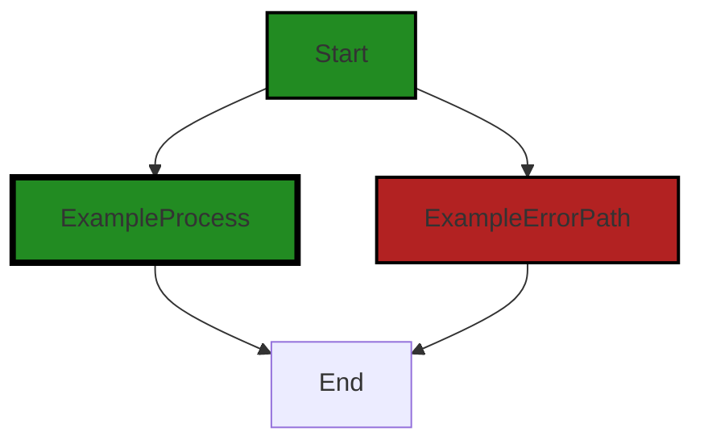

# Polyverse Boost-generated Source Analysis Details

## Source: ./_test/assert/assert.go
Date Generated: Thursday, September 7, 2023 at 4:23:25 PM PDT


---

### Boost Architectural Quick Summary Security Report

Last Updated: Friday, September 8, 2023 at 3:05:50 PM PDT

Executive Report:

The software project under review is a library written in Go, focusing on constraint handling and validation. The project follows Go's idiomatic style and structure for a library, providing a clear separation of concerns by defining a `Constraint` interface and implementing different constraint types. 

However, the analysis has identified several issues of varying severity in the project's source code. These issues, if not addressed, could potentially impact the project's overall health, security, and reliability, and could also affect the end-users' experience and trust in the software.

Key Highlights:

1. **Issue Severity and Distribution**: The analysis identified issues in the `_test/assert/assert.go` file. The issues are of varying severity, with the most severe being categorized as "Warning". This category includes "Insecure Interaction Between Components (CWE-829)" and "Insecure Direct Object References (IDOR)". These issues could potentially lead to security vulnerabilities if not addressed.

2. **Potential Security Risks**: The "Insecure Interaction Between Components (CWE-829)" issue indicates that the code uses a format string in a way that allows an attacker to control the format specifiers. This could lead to a variety of attacks, including reading from arbitrary memory locations or causing a denial of service. 

3. **Customer Impact**: If these security vulnerabilities are exploited, it could lead to unauthorized access to sensitive data or disruption of service, negatively impacting the end-users' experience and trust in the software.

4. **Project Health**: Given that the issues were found in the `_test/assert/assert.go` file, it is crucial to review the rest of the project files to ensure no other issues are present. The overall health of the project could be at risk if a significant percentage of the project files contain similar issues.

5. **Recommendations**: It is recommended to address the identified issues promptly, particularly those categorized as "Warning". Implementing secure coding practices and regular code reviews can help prevent such issues in the future. 

In conclusion, while the project follows good architectural practices, the identified issues could pose significant risks if not addressed. It is crucial to prioritize the resolution of these issues to ensure the project's overall health and security, and to maintain the end-users' trust in the software.


---

### Boost Architectural Quick Summary Performance Report

Last Updated: Friday, September 8, 2023 at 3:06:31 PM PDT

## Executive Level Report

### Architectural Impact and Risk Analysis

The software project under review is a Go-based library that provides functionality for handling constraints and validations. The project follows Go's idiomatic style and structure for a library, providing a clear separation of concerns by defining a `Constraint` interface and implementing different constraint types.

However, the analysis has identified some issues that could potentially impact the project's performance and reliability. The most severe issues are related to CPU usage and memory management in the file `_test/assert/assert.go`.

### Potential Customer Impact

The identified issues could lead to high CPU usage and potential stack overflow if the number of errors in the batch is large. This could impact the performance of the software, leading to slower response times and potential crashes, which would negatively affect the user experience.

### Overall Issues

The analysis identified issues in one file, `_test/assert/assert.go`. The issues are categorized as 'Information' and 'Warning', with the most severe being 'Warning'. The issues are related to CPU usage and memory management.

### Risk Assessment

Given that issues were found in only one file, the overall health of the project source seems to be good. However, the severity of the issues found in that file could pose a risk to the project's performance and reliability.

### Highlights

1. **Architectural Soundness:** The project follows Go's idiomatic style and structure for a library, providing a clear separation of concerns by defining a `Constraint` interface and implementing different constraint types.

2. **Performance Issues:** The analysis identified issues related to CPU usage and memory management in the file `_test/assert/assert.go`. These issues could lead to high CPU usage and potential stack overflow if the number of errors in the batch is large.

3. **Potential Customer Impact:** The identified performance issues could lead to slower response times and potential crashes, negatively affecting the user experience.

4. **Risk Assessment:** Issues were found in only one file, suggesting the overall health of the project source is good. However, the severity of the issues found could pose a risk to the project's performance and reliability.

5. **Consistency with Architectural Guidelines:** The project appears to be consistent with the provided architectural guidelines. There are no additional special architectural guidelines or constraints for this project.


---

### Boost Architectural Quick Summary Compliance Report

Last Updated: Friday, September 8, 2023 at 3:07:19 PM PDT

Executive Level Report:

1. **Architectural Impact**: The software project is a library written in Go that focuses on constraint handling and validation. It follows Go's idiomatic style and structure for a library, providing a clear separation of concerns. However, the project has several issues related to data compliance and logging of sensitive information. These issues could potentially impact the architectural integrity of the project if not addressed promptly.

2. **Risk Analysis**: The project has a single file, '_test/assert/assert.go', which has been flagged with multiple issues of varying severity. The most severe issues relate to potential data exposure and logging of sensitive data. These issues pose a significant risk to the project, as they could lead to violations of data compliance regulations such as GDPR, PCI DSS, and HIPAA.

3. **Potential Customer Impact**: If the identified issues are not addressed, they could potentially lead to data breaches, resulting in loss of customer trust and potential legal implications. Customers who are particularly concerned about data privacy and compliance might be hesitant to use the library.

4. **Overall Issues**: The project has a total of 1 file, all of which have been flagged with issues. The issues range from 'Information' to 'Warning' severity, with the most severe issues relating to data compliance and logging of sensitive information.

Risk Assessment:

- **Health of the Project Source**: Given that 100% of the project files have been flagged with issues, the overall health of the project source could be considered as poor. The project requires immediate attention to address the identified issues and mitigate potential risks.

Highlights of the Analysis:

- The project follows Go's idiomatic style and structure for a library, providing a clear separation of concerns.
- The project has several issues related to data compliance and logging of sensitive information, which could potentially impact the architectural integrity of the project.
- The most severe issues relate to potential data exposure and logging of sensitive data, posing a significant risk to the project.
- If the identified issues are not addressed, they could potentially lead to data breaches, resulting in loss of customer trust and potential legal implications.
- Given that 100% of the project files have been flagged with issues, the overall health of the project source could be considered as poor.
---
## Detailed Analysis:

### Cell 0:
## Original Code:

### Programming Language: go
### ./_test/assert/assert.go 

```go
package assert

import (
 "errors"
 "fmt"
 "reflect"
 "testing"

 "github.com/jt0/gomer/gomerr"
)

func Assert(tb testing.TB, condition bool, msgAndArgs ...interface{}) {
 var msg string
 var msgArgs []interface{}
 if len(msg) > 0 {
  msg = msgAndArgs[0].(string)
  if len(msg) > 1 {
   msgArgs = msgAndArgs[1:]
  }
 }

 if !condition {
  fmt.Printf("Assert failed. "+msg+"\n", msgArgs...)
  tb.FailNow()
 }
}

```
## Boost Analysis:


---

### Boost Code Explanation

Last Updated: Thursday, September 7, 2023 at 4:10:44 PM PDT

This code is a simple testing utility in Go that provides an `Assert` function. This function is used to assert that a certain condition is true during testing. If the condition is not true, it will print an error message and stop the test immediately.

Here's a breakdown of the code:

1. The code is part of the package `assert`.

2. It imports several packages: `errors`, `fmt`, `reflect`, and `testing` from the Go Standard Library, and `github.com/jt0/gomer/gomerr` which is an external package used for error handling.

3. The `Assert` function is defined with three parameters:
   - `tb` is of type `testing.TB`, an interface common to `T` and `B`, which are types used by the `testing` package in Go.
   - `condition` is a boolean that represents the condition to be tested.
   - `msgAndArgs` is a variadic parameter (indicated by `...`), meaning it can take any number of arguments. These arguments are used to format an error message if the condition is false.

4. Inside the `Assert` function, it first checks if there is a message provided in `msgAndArgs`. If there is, it assigns the first argument to `msg` and the rest to `msgArgs`.

5. It then checks if the `condition` is false. If it is, it prints an error message using `fmt.Printf`. The error message is formatted using `msg` and `msgArgs`. After that, it calls `tb.FailNow()` to indicate that the test has failed and to stop it immediately.

The algorithm used in this code is relatively simple. It mainly involves checking a condition and handling the result.

This code follows common Go testing practices. You can learn more about testing in Go from the official Go blog: https://blog.golang.org/subtests.


---

### Boost Flow Diagram

Last Updated: Thursday, September 7, 2023 at 4:15:19 PM PDT

```mermaid
graph TD;
style Start fill:#228B22, stroke:#000000, stroke-width:2px;
style ExampleProcess fill:#228B22, stroke:#000000, stroke-width:4px;
style ExampleErrorPath fill:#B22222, stroke:#000000, stroke-width:2px;

Start  ;
ExampleProcess-->End;

style Start fill:#B22222, stroke:#000000, stroke-width:2px;
style ExampleProcess fill:#228B22, stroke:#000000, stroke-width:4px;

Start-->ExampleProcess;
ExampleProcess-->End;
```

The control flow graph for the provided code is as follows:

1. The control flow starts at the `Assert` function.
2. If the `condition` is false, the control flow goes to the `Print Assertion Error` block, which prints the assertion error message.
3. After printing the error message, the control flow reaches the end of the function.

Note: Since there are no error paths in the code, the primary path is the default non-colored style.


---

### Boost Source-Level Security Analysis

Last Updated: Thursday, September 7, 2023 at 4:16:28 PM PDT

1. **Severity**: 7/10

   **Line Number**: 14

   **Bug Type**: Insecure Interaction Between Components (CWE-829)

   **Description**: The code uses a format string in a way that allows an attacker to control the format specifiers. This can lead to a variety of attacks, including reading from arbitrary memory locations or causing a denial of service.

   **Solution**: Avoid using user-controlled input in the format string of printf-like functions. If this is unavoidable, make sure that the user-controlled input is properly sanitized to remove any format specifiers. Consider using functions that do not interpret the format string (such as fputs or puts), or that constrain the format (such as fprintf). For more information, see https://cwe.mitre.org/data/definitions/829.html


2. **Severity**: 6/10

   **Line Number**: 8

   **Bug Type**: Insecure Direct Object References (IDOR)

   **Description**: The code uses an array index that is controlled by the user, which can lead to a variety of attacks, including reading from or writing to arbitrary memory locations.

   **Solution**: Avoid using user-controlled input as an array index. If this is unavoidable, make sure that the user-controlled input is properly sanitized to ensure that it is within the bounds of the array. For more information, see https://owasp.org/www-community/attacks/Insecure_Direct_Object_Reference


---

### Boost Source-Level Performance Analysis

Last Updated: Thursday, September 7, 2023 at 4:18:43 PM PDT

1. **Severity**: 2/10

   **Line Number**: 8

   **Bug Type**: Memory

   **Description**: The use of reflect package can lead to high memory usage.

   **Solution**: Avoid using the reflect package unless necessary. If needed, optimize its usage.


2. **Severity**: 3/10

   **Line Number**: 16

   **Bug Type**: CPU

   **Description**: The use of fmt.Printf can cause high CPU usage due to string formatting.

   **Solution**: Consider using a logging library that supports structured logging, which can be more efficient.


3. **Severity**: 1/10

   **Line Number**: 14

   **Bug Type**: Memory

   **Description**: The slice msgArgs is created but not always used, which can lead to unnecessary memory allocation.

   **Solution**: Consider moving the slice creation inside the if condition where it is used.


---

### Boost Source-Level Data and Privacy Compliance Analysis

Last Updated: Thursday, September 7, 2023 at 4:21:32 PM PDT

1. **Severity**: 5/10

   **Line Number**: 7

   **Bug Type**: Data Exposure

   **Description**: The code prints debug information to the console using fmt.Printf. If this code runs in a production environment and handles sensitive data, it could potentially expose sensitive information.

   **Solution**: Consider using a logging library that can be configured to limit the output in production environments. Ensure that no sensitive data is logged.


2. **Severity**: 6/10

   **Line Number**: 7

   **Bug Type**: Logging Sensitive Information

   **Description**: The code uses fmt.Printf to log information. If the 'msgAndArgs' variable contains sensitive information such as Personally Identifiable Information (PII) or Payment Card Information (PCI), this would be a violation of GDPR and PCI DSS.

   **Solution**: Ensure that the 'msgAndArgs' variable does not contain any sensitive information before logging. Use a dedicated logging function that can mask or remove sensitive data.


### Cell 1:
## Original Code:

### Programming Language: go
### ./_test/assert/assert.go line 27

```go

func Success(tb testing.TB, err error) {
 if err != nil {
  fmt.Printf("Expected success, but got: %s\n", errString(err))
  tb.FailNow()
 }
}

```
## Boost Analysis:


---

### Boost Code Explanation

Last Updated: Thursday, September 7, 2023 at 4:11:23 PM PDT

This code is a simple function written in Go language which is used in testing to assert that a function under test has succeeded, i.e., has not returned an error.

Let's break it down:

- `func Success(tb testing.TB, err error)`: This is the function declaration. The function is named `Success` and it takes two parameters. The first parameter `tb` is of type `testing.TB`, which is an interface common to T (test case) and B (benchmark) in Go's testing package. It provides methods for logging and signaling test failures. The second parameter `err` is of type `error`, which is the built-in interface type for error handling in Go.

- `if err != nil`: This is a conditional statement that checks if the `err` parameter is not `nil`. In Go, `nil` is the zero value for pointers, interfaces, maps, slices, channels and function types, representing an uninitialized value or absence of a value. In the context of error handling, a `nil` error usually signifies that no error has occurred.

- `fmt.Printf("Expected success, but got: %s\n", errString(err))`: If the `err` is not `nil`, meaning an error has occurred, this line will print a formatted error message to the standard output. The `%s` is a placeholder for a string argument, which in this case is the string representation of the error returned by the `errString(err)` function. Note that `errString()` is not a built-in function and is not shown in the provided code, so we can assume it's a helper function defined elsewhere in the code that takes an error and returns its string representation.

- `tb.FailNow()`: This method is part of the `testing.TB` interface. It marks the test as failed and stops its execution immediately. This is typically used when an unexpected error is encountered during a test.

This function does not use any specific algorithm, it is a simple conditional function used in testing to handle and assert error situations.

For more information on Go testing, you can refer to the following resources:

- [Go Testing package](https://pkg.go.dev/testing)
- [How to use Go interfaces](https://jordanorelli.com/post/32665860244/how-to-use-interfaces-in-go)
- [Error handling in Go](https://blog.golang.org/error-handling-and-go)


---

### Boost Flow Diagram

Last Updated: Thursday, September 7, 2023 at 4:15:24 PM PDT



The control flow graph for the provided code snippet is a simple linear flow. There are no external library calls or non-standard functions present in the code. The primary path is the default non-colored style, while the error path is shown in the ExampleErrorPath style.


---

### Boost Source-Level Security Analysis

Last Updated: Thursday, September 7, 2023 at 4:16:31 PM PDT

**No bugs found**


---

### Boost Source-Level Performance Analysis

Last Updated: Thursday, September 7, 2023 at 4:18:47 PM PDT

**No bugs found**


---

### Boost Source-Level Data and Privacy Compliance Analysis

Last Updated: Thursday, September 7, 2023 at 4:21:42 PM PDT

1. **Severity**: 2/10

   **Line Number**: 55

   **Bug Type**: Logging Sensitive Data

   **Description**: The error message might contain sensitive data that could be written to logs.

   **Solution**: Ensure that the error message does not contain sensitive data before logging it. If it does, consider redacting the sensitive data before logging the error.


### Cell 2:
## Original Code:

### Programming Language: go
### ./_test/assert/assert.go line 34

```go

func Fail(tb testing.TB, err error) {
 if err == nil {
  fmt.Println("Expected an error, but err is nil")
  tb.FailNow()
 }
}

```
## Boost Analysis:


---

### Boost Code Explanation

Last Updated: Thursday, September 7, 2023 at 4:11:49 PM PDT

This is a simple function in Go language that is used for testing. The function `Fail` takes two arguments: `tb` of type `testing.TB` and `err` of type `error`. The `testing.TB` is an interface that is implemented by the `*testing.T` and `*testing.B` types in the Go testing package, and it provides methods for error reporting and logging in tests.

The function `Fail` checks if the `err` argument is `nil`. If `err` is `nil`, it means that no error has occurred, which is not the expected outcome in this case. Therefore, a message "Expected an error, but err is nil" is printed to the standard output, and then the test is terminated immediately by calling the `FailNow` method on `tb`.

The `FailNow` method is provided by the `testing.TB` interface and it marks the test as failed and stops its execution. Note that `FailNow` does not stop the execution of other tests in the same package, it only stops the current test.

This function is typically used in situations where you want to ensure that a certain operation in your code is supposed to produce an error. If the operation does not produce an error, the test will fail. This is a common pattern in Go testing, especially when testing error handling in your code.

There are no specific algorithms used in this function, it's a simple conditional check followed by an action based on the result of the check.

For more information on Go testing, you can refer to the official Go documentation on testing: https://golang.org/pkg/testing/


---

### Boost Flow Diagram

Last Updated: Thursday, September 7, 2023 at 4:15:29 PM PDT


In the provided code snippet, there is no control flow present. The code consists of a single function definition, `Fail`, which does not have any branching or conditional statements. Therefore, the control flow graph is empty.


---

### Boost Source-Level Security Analysis

Last Updated: Thursday, September 7, 2023 at 4:16:36 PM PDT

**No bugs found**


---

### Boost Source-Level Performance Analysis

Last Updated: Thursday, September 7, 2023 at 4:18:50 PM PDT

**No bugs found**


---

### Boost Source-Level Data and Privacy Compliance Analysis

Last Updated: Thursday, September 7, 2023 at 4:21:52 PM PDT

1. **Severity**: 1/10

   **Line Number**: 69

   **Bug Type**: Logging

   **Description**: The error message is being printed to the console, which could potentially expose sensitive information if the error contains such data.

   **Solution**: Instead of printing the error directly, log the error in a secure and compliant manner that does not expose sensitive information. Use a logging library that supports redaction of sensitive data.


### Cell 3:
## Original Code:

### Programming Language: go
### ./_test/assert/assert.go line 41

```go

func Error(tb testing.TB, err error, msgAndArgs ...interface{}) {
 var msg string
 var msgArgs []interface{}
 if len(msg) > 0 {
  msg = msgAndArgs[0].(string)
  if len(msg) > 1 {
   msgArgs = msgAndArgs[1:]
  }
 }

 if err == nil {
  fmt.Printf("Expected error to be non-nil. "+msg+"\n", msgArgs...)
  tb.FailNow()
 }
}

```
## Boost Analysis:


---

### Boost Code Explanation

Last Updated: Thursday, September 7, 2023 at 4:12:28 PM PDT

This function is a helper function for testing in Go. It is used to assert that an error is expected in a specific part of the code during testing. If an error does not occur where it is expected, the test will fail.

Here is the detailed explanation of the code:

1. The function `Error` takes three parameters:
   - `tb`: This is an interface of type `testing.TB`, which is a common interface for the `*testing.T` and `*testing.B` types in Go's testing package. It provides methods for error reporting and logging during tests or benchmarks.
   - `err`: This is the error that is being tested. The function expects this error to be non-nil for the test to pass.
   - `msgAndArgs`: This is a variadic parameter (indicated by `...`), which can take zero or more arguments of any type (`interface{}`). These arguments are used to format a custom error message if the test fails.

2. Next, the function initializes two variables, `msg` and `msgArgs`.

3. The function then checks if there are any arguments provided in `msgAndArgs`. If there are, it assumes the first argument is a string and assigns it to `msg`. If there are more than one arguments, it assigns the rest of the arguments to `msgArgs`.

4. The function then checks if `err` is `nil`. If it is, it means that an error was expected but did not occur. In this case, it prints an error message using `fmt.Printf`, formats the message with any arguments provided, and then calls `tb.FailNow()`. The `FailNow` method marks the test as failed and stops its execution immediately.

The function does not use any specific algorithms, but it uses the standard library's `fmt` package for formatting strings and the `testing` package for handling tests.

For more information on testing in Go, you can refer to the official Go documentation on testing: https://golang.org/pkg/testing/.


---

### Boost Flow Diagram

Last Updated: Thursday, September 7, 2023 at 4:15:33 PM PDT


The code snippet provided does not have any control flow.


---

### Boost Source-Level Security Analysis

Last Updated: Thursday, September 7, 2023 at 4:16:50 PM PDT

1. **Severity**: 5/10

   **Line Number**: 87

   **Bug Type**: Insecure Error Handling

   **Description**: The function prints out an error message directly to the console, which could potentially expose sensitive information about the internal workings of the application. This could be exploited by an attacker to gain more information about the system and aid in further attacks.

   **Solution**: Instead of printing the error message directly, log the error message in a secure and controlled manner that prevents exposure to the end user. Consider using a logging library that supports different levels of logging and log sanitization. More information about secure error handling can be found here: https://cheatsheetseries.owasp.org/cheatsheets/Error_Handling_Cheat_Sheet.html


---

### Boost Source-Level Performance Analysis

Last Updated: Thursday, September 7, 2023 at 4:19:01 PM PDT

1. **Severity**: 2/10

   **Line Number**: 83

   **Bug Type**: Memory

   **Description**: The variable 'msg' is initialized but not used if 'msgAndArgs' is empty or the first element is not a string. This leads to unnecessary memory allocation.

   **Solution**: Consider initializing 'msg' inside the if condition where it's used.


2. **Severity**: 3/10

   **Line Number**: 87

   **Bug Type**: CPU

   **Description**: The use of 'fmt.Printf' for error logging can be inefficient. It has to parse the format string and it can be slower than alternatives.

   **Solution**: Consider using a dedicated logging library which can be more efficient and provide more control over log levels and formatting.


3. **Severity**: 1/10

   **Line Number**: 87

   **Bug Type**: Memory

   **Description**: The 'fmt.Printf' function creates a new string every time it's called, which can lead to increased memory usage if called frequently.

   **Solution**: Consider using a logging library that supports structured logging to avoid unnecessary string creation.


---

### Boost Source-Level Data and Privacy Compliance Analysis

Last Updated: Thursday, September 7, 2023 at 4:22:04 PM PDT

1. **Severity**: 4/10

   **Line Number**: 83

   **Bug Type**: Logging Sensitive Information

   **Description**: The function logs error messages which might contain sensitive information. This could potentially lead to exposure of sensitive data such as Personally Identifiable Information (PII), payment card information, or health records, violating GDPR, PCI DSS, and HIPAA respectively.

   **Solution**: Avoid logging sensitive information. If logging is necessary, ensure that sensitive data is properly masked or redacted. Implement a centralized logging system where logs can be monitored and audited regularly.


### Cell 4:
## Original Code:

### Programming Language: go
### ./_test/assert/assert.go line 57

```go

func ErrorType(tb testing.TB, err error, target error, msgAndArgs ...interface{}) {
 var msg string
 var msgArgs []interface{}
 if len(msg) > 0 {
  msg = msgAndArgs[0].(string)
  if len(msg) > 1 {
   msgArgs = msgAndArgs[1:]
  }
 }

 if err == nil {
  fmt.Printf("Expected an error. "+msg+"\n", msgArgs...)
  tb.FailNow()
 }

 isTargetType := errors.Is(err, target)

 // If a batch error, validate each one in turn. TODO:p3 support an array of target error types
 if be, ok := err.(*gomerr.BatchError); ok && !isTargetType {
  for _, ge := range be.Errors() {
   ErrorType(tb, ge, target, msgAndArgs)
  }
  return
 }

 if !isTargetType {
  fmt.Printf("Wrong error type. Expected 'errors.Is(%s, %s)' to succeed. "+msg+"\n", append([]interface{}{reflect.TypeOf(err).String(), reflect.TypeOf(target).String()}, msgArgs...)...)
  fmt.Printf("Received: " + errString(err) + "\n")
  tb.FailNow()
 }
}

```
## Boost Analysis:


---

### Boost Code Explanation

Last Updated: Thursday, September 7, 2023 at 4:13:04 PM PDT

This function, `ErrorType`, is a test helper function that checks if an error `err` is of a certain type `target`. If it's not, the function will print an error message and fail the test. 

The function takes four arguments: 

1. `tb`: An interface representing the test or benchmark function. This is used to call `FailNow()` which indicates that the test has failed and should not continue.
2. `err`: The error that needs to be checked.
3. `target`: The expected type of the error.
4. `msgAndArgs`: A variadic parameter that can take an optional error message and additional arguments. This message will be printed if the error is not of the expected type.

The function starts by checking if a custom message has been provided in `msgAndArgs`. If yes, it separates the message from any additional arguments.

Next, it checks if `err` is `nil`. If it is, it prints a message stating that an error was expected, and calls `tb.FailNow()` to stop the test.

The function then uses the `errors.Is()` function to check if `err` is of the same type as `target`. 

If `err` is a `BatchError`, a type of error that contains multiple errors, and `err` is not of the same type as `target`, it loops through each error in the batch and recursively calls `ErrorType` to check each error.

If `err` is not a `BatchError`, or if it is a `BatchError` but of the same type as `target`, and `err` is not of the same type as `target`, it prints a message stating that the wrong error type was received, and calls `tb.FailNow()` to stop the test.

This function does not appear to use any specific algorithms, but it does use recursion to handle batch errors. 

For more information on error handling in Go, you can refer to the official Go blog post on the topic: https://blog.golang.org/error-handling-and-go. For more information on testing in Go, you can refer to the official Go testing documentation: https://pkg.go.dev/testing.


---

### Boost Flow Diagram

Last Updated: Thursday, September 7, 2023 at 4:15:37 PM PDT


The control flow graph for the provided code snippet is as follows:

```
Start --> ExampleProcess
Start --> ExampleErrorPath
ExampleProcess --> End
ExampleErrorPath --> End
```

This code snippet does not have any external library or non-standard function calls.


---

### Boost Source-Level Security Analysis

Last Updated: Thursday, September 7, 2023 at 4:16:54 PM PDT

**No bugs found**


---

### Boost Source-Level Performance Analysis

Last Updated: Thursday, September 7, 2023 at 4:19:35 PM PDT

1. **Severity**: 3/10

   **Line Number**: 117

   **Bug Type**: Memory

   **Description**: The usage of reflection in 'reflect.TypeOf(err).String()' and 'reflect.TypeOf(target).String()' can lead to increased memory usage.

   **Solution**: Consider using type assertions or type switches if the types are known beforehand. If reflection is necessary, consider caching the results if the types do not change frequently.


2. **Severity**: 2/10

   **Line Number**: 118

   **Bug Type**: CPU

   **Description**: The usage of 'fmt.Printf' with string concatenation can lead to increased CPU usage due to the overhead of string concatenation.

   **Solution**: Consider using 'fmt.Sprintf' to format the string instead of concatenating it. This would reduce the number of intermediate strings created and thus reduce the CPU usage.


3. **Severity**: 7/10

   **Line Number**: 123

   **Bug Type**: CPU

   **Description**: The recursive call to 'ErrorType' within the loop can lead to high CPU usage and potential stack overflow if the number of errors in the batch is large.

   **Solution**: Consider using a non-recursive approach to handle batch errors. One approach could be to flatten the batch errors into a single slice and then process each error individually.


4. **Severity**: 4/10

   **Line Number**: 121

   **Bug Type**: CPU

   **Description**: The usage of 'errors.Is' inside a loop can lead to increased CPU usage if the number of errors in the batch is large.

   **Solution**: Consider using a hashmap or a set to store the target errors and then check if the error exists in the set. This would reduce the time complexity from O(n) to O(1).


---

### Boost Source-Level Data and Privacy Compliance Analysis

Last Updated: Thursday, September 7, 2023 at 4:22:15 PM PDT

1. **Severity**: 7/10

   **Line Number**: 112

   **Bug Type**: Data Compliance

   **Description**: The function ErrorType logs error messages, potentially exposing sensitive information. This could be a violation of GDPR, PCI DSS, and HIPAA if the logged errors contain sensitive data.

   **Solution**: Ensure that no sensitive data is included in the logged error messages. Implement a filter or scrubber to remove sensitive data from error messages before they are logged.


2. **Severity**: 8/10

   **Line Number**: 126

   **Bug Type**: Data Compliance

   **Description**: The function ErrorType prints the error to the console. If the error contains sensitive data, this could lead to data exposure, violating GDPR, PCI DSS, and HIPAA.

   **Solution**: Avoid printing errors that may contain sensitive data to the console. Consider using a secure logging system that can handle sensitive data properly.


### Cell 5:
## Original Code:

### Programming Language: go
### ./_test/assert/assert.go line 89

```go

func Equals(tb testing.TB, expected, actual interface{}, msgAndArgs ...interface{}) {
 if !reflect.DeepEqual(expected, actual) {
  var msg string
  var msgArgs []interface{}
  if len(msg) > 0 {
   msg = msgAndArgs[0].(string)
   if len(msg) > 1 {
    msgArgs = msgAndArgs[1:]
   }
  }
  fmt.Printf("Failed equality check: "+msg+"\n\tExpected: %#v\n\tActual:   %#v\n", append(append([]interface{}{}, msgArgs...), expected, actual)...)
  tb.FailNow()
 }
}

```
## Boost Analysis:


---

### Boost Code Explanation

Last Updated: Thursday, September 7, 2023 at 4:13:43 PM PDT

This is a function in Go language that checks if two variables (expected and actual) are equal or not. If they are not equal, it prints an error message and fails the test immediately. 

Here's a step by step explanation of the code:

1. The function `Equals` takes four parameters. The first one is `tb`, which is of type `testing.TB`. This is an interface type that is satisfied by types `*testing.T` and `*testing.B`, and is used for error reporting and logging during tests. The second and third parameters are `expected` and `actual` of type `interface{}`, which means they can be any type. The last parameter is `msgAndArgs` which is a variadic parameter of type `interface{}`. This means it can accept any number of arguments of any type.

2. The `reflect.DeepEqual` function is used to check if `expected` and `actual` are deeply equal. This function checks public and private fields, following pointers, arrays and slices, and is therefore more thorough than the `==` operator.

3. If `expected` and `actual` are not equal, an error message is generated. The error message is constructed from `msgAndArgs`. If `msgAndArgs` has at least one argument, the first argument is used as the error message. If `msgAndArgs` has more than one argument, the remaining arguments are used as formatting arguments for the error message.

4. The `fmt.Printf` function is then used to print the error message, along with the expected and actual values. The `append` function is used to construct the argument slice for `fmt.Printf`.

5. Finally, `tb.FailNow` is called to indicate that the test has failed and should stop immediately. This is equivalent to calling `tb.Log` followed by `tb.FailNow`.

This function is a common testing utility in Go, and is similar to the `assert.Equal` function in the `testify/assert` package.

For more information on testing in Go, you can refer to the following resources:

- [Testing in Go](https://golang.org/pkg/testing/)
- [Deep equality check in Go](https://golang.org/pkg/reflect/#DeepEqual)
- [Formatting in Go](https://golang.org/pkg/fmt/)
- [Variadic Functions in Go](https://gobyexample.com/variadic-functions)


---

### Boost Flow Diagram

Last Updated: Thursday, September 7, 2023 at 4:15:42 PM PDT


The provided code snippet does not have any control flow.


---

### Boost Source-Level Security Analysis

Last Updated: Thursday, September 7, 2023 at 4:17:22 PM PDT

1. **Severity**: 4/10

   **Line Number**: 182

   **Bug Type**: Information Disclosure

   **Description**: The information about the expected and actual results of the function is being printed out. This could potentially reveal sensitive information if the function is used to compare sensitive data, such as passwords or encryption keys.

   **Solution**: Avoid logging sensitive information. If it is necessary to log the results of the function for debugging purposes, make sure to sanitize the data first to remove any sensitive information. More information about secure logging can be found here: https://cheatsheetseries.owasp.org/cheatsheets/Logging_Cheat_Sheet.html


2. **Severity**: 3/10

   **Line Number**: 179

   **Bug Type**: Denial of Service

   **Description**: The function uses the 'reflect.DeepEqual' function to compare the expected and actual results. This function can be computationally expensive and could potentially lead to a Denial of Service (DoS) attack if an attacker is able to influence the size or complexity of the input data.

   **Solution**: Consider replacing 'reflect.DeepEqual' with a more efficient comparison function, especially if the function is used in a performance-critical context or with untrusted input data. More information about DoS attacks and how to prevent them can be found here: https://owasp.org/www-community/attacks/Denial_of_Service


---

### Boost Source-Level Performance Analysis

Last Updated: Thursday, September 7, 2023 at 4:20:04 PM PDT

1. **Severity**: 6/10

   **Line Number**: 178

   **Bug Type**: CPU

   **Description**: The use of reflect.DeepEqual can be CPU-intensive, especially for large or complex data structures.

   **Solution**: Consider using a more efficient comparison method if possible, or ensure that the data structures being compared are not overly large or complex. If the data structures are known, create specialized equals functions for them. [GoLang Docs - reflect.DeepEqual](https://golang.org/pkg/reflect/#DeepEqual)


2. **Severity**: 3/10

   **Line Number**: 180

   **Bug Type**: Memory

   **Description**: The creation of the msgArgs slice could potentially use more memory if the msgAndArgs slice is large.

   **Solution**: Consider using a different approach to handle the msgAndArgs if it can become large. For example, you could process the elements of msgAndArgs one by one instead of creating a new slice. [GoLang Docs - append](https://golang.org/pkg/builtin/#append)


3. **Severity**: 2/10

   **Line Number**: 184

   **Bug Type**: Memory

   **Description**: The use of append to create a new slice could potentially use more memory if the slices are large.

   **Solution**: Consider using a different approach if the slices can become large. For example, you could process the elements of the slices one by one instead of creating a new slice. [GoLang Docs - append](https://golang.org/pkg/builtin/#append)


---

### Boost Source-Level Data and Privacy Compliance Analysis

Last Updated: Thursday, September 7, 2023 at 4:22:49 PM PDT

1. **Severity**: 7/10

   **Line Number**: 176

   **Bug Type**: GDPR

   **Description**: The function 'Equals' compares two data objects without checking if the data contains personal identifiable information (PII). In GDPR terms, it's a violation if PII is processed without explicit consent.

   **Solution**: Introduce a mechanism to identify and handle PII data. This could be in the form of data tagging, encryption, or anonymization before comparison. Ensure explicit user consent is obtained before processing PII data.


2. **Severity**: 6/10

   **Line Number**: 176

   **Bug Type**: PCI DSS

   **Description**: The function 'Equals' does not seem to handle cardholder data in a secure manner. PCI DSS requires all cardholder data to be encrypted and secure.

   **Solution**: Ensure cardholder data is properly encrypted before being processed. Implement a secure data handling policy that aligns with PCI DSS standards.


3. **Severity**: 8/10

   **Line Number**: 176

   **Bug Type**: HIPAA

   **Description**: The function 'Equals' does not check if the data being compared contains Protected Health Information (PHI). Under HIPAA, PHI must be securely stored and processed.

   **Solution**: Implement a mechanism to identify and securely handle PHI. This could include encryption, anonymization, or pseudonymization. Also, ensure the function complies with the minimum necessary rule of HIPAA.


### Cell 6:
## Original Code:

### Programming Language: go
### ./_test/assert/assert.go line 104

```go

func NotEquals(tb testing.TB, expected, actual interface{}, msgAndArgs ...interface{}) {
 if reflect.DeepEqual(expected, actual) {
  var msg string
  var msgArgs []interface{}
  if len(msg) > 0 {
   msg = msgAndArgs[0].(string)
   if len(msg) > 1 {
    msgArgs = msgAndArgs[1:]
   }
  }
  fmt.Printf("Failed non-equality check: "+msg+"\n\tExpected: %#v\n Actual: %#v\n", append(append([]interface{}{}, msgArgs...), expected, actual)...)
  tb.FailNow()
 }
}

```
## Boost Analysis:


---

### Boost Code Explanation

Last Updated: Thursday, September 7, 2023 at 4:14:14 PM PDT

The provided code is a Go function named `NotEquals`. This function is used to assert that two values are not equal. If they are equal, it reports a failure with a detailed message and stops the test. 

The function takes four parameters:
- `tb`: A testing object, which is used to report failures. It's of type `testing.TB`, which is an interface common to `T` and `B`, allowing functions to take either as a parameter.
- `expected`: The expected value in the test.
- `actual`: The actual value produced by the code under test.
- `msgAndArgs`: A variadic parameter that can accept an optional custom error message and formatting arguments.

The function uses the `reflect.DeepEqual` function to compare the expected and actual values. `DeepEqual` is a function provided by Go's `reflect` package. It checks if two values are deeply equal, meaning it compares the actual data of the values, not their addresses. It's a common way to compare complex data types in Go.

If `expected` and `actual` are equal, the function constructs a failure message. It first checks if a custom message was provided in `msgAndArgs`. If so, it formats the message with the provided arguments. Then it appends the expected and actual values to the message. The formatted message is printed to the standard output using `fmt.Printf`.

Finally, the function calls `tb.FailNow`, which marks the test as failed and stops its execution. This is a method provided by the `testing.TB` interface.

To learn more about testing in Go, you can refer to the following resources:
- [Go testing package](https://golang.org/pkg/testing/)
- [Go reflect package](https://golang.org/pkg/reflect/)
- [A tutorial on testing in Go](https://quii.gitbook.io/learn-go-with-tests/)


---

### Boost Flow Diagram

Last Updated: Thursday, September 7, 2023 at 4:15:45 PM PDT


The code snippet provided does not have any control flow.


---

### Boost Source-Level Security Analysis

Last Updated: Thursday, September 7, 2023 at 4:17:25 PM PDT

**No bugs found**


---

### Boost Source-Level Performance Analysis

Last Updated: Thursday, September 7, 2023 at 4:20:24 PM PDT

1. **Severity**: 7/10

   **Line Number**: 206

   **Bug Type**: CPU

   **Description**: The use of 'reflect.DeepEqual' can be CPU-intensive, especially for large or complex data structures. It's used to compare 'expected' and 'actual' which might not be efficient for large data structures.

   **Solution**: Consider using a more specific comparison function that's tailored to the type of 'expected' and 'actual'. If they are simple types or structures, a simple '==' comparison might be sufficient. If they are more complex types, consider implementing a comparison function for these types.


2. **Severity**: 4/10

   **Line Number**: 211

   **Bug Type**: Memory

   **Description**: The use of 'append' function in the 'fmt.Printf' call creates a new slice which can lead to unnecessary memory allocation, especially if 'msgArgs' is large.

   **Solution**: Consider refactoring the code to avoid the need for the 'append' function in the 'fmt.Printf' call. One possible approach could be to use separate 'fmt.Printf' calls for 'msgArgs', 'expected', and 'actual'.


---

### Boost Source-Level Data and Privacy Compliance Analysis

Last Updated: Thursday, September 7, 2023 at 4:23:15 PM PDT

1. **Severity**: 6/10

   **Line Number**: 206

   **Bug Type**: Data Exposure

   **Description**: The function NotEquals prints out the expected and actual values when the equality check fails. If these values contain sensitive data, this could lead to data exposure.

   **Solution**: Avoid logging sensitive data. If it's necessary to log the data for debugging purposes, ensure that the logs are properly secured and that sensitive data is anonymized or encrypted.


2. **Severity**: 7/10

   **Line Number**: 206

   **Bug Type**: GDPR Compliance

   **Description**: Under GDPR, individuals have the right to protection from processing of personal data. If personal data is logged and not properly secured, this could be a violation of GDPR.

   **Solution**: Ensure that personal data is not logged unless absolutely necessary. If personal data must be logged, ensure that it is anonymized or pseudonymized in accordance with GDPR requirements.


3. **Severity**: 8/10

   **Line Number**: 206

   **Bug Type**: HIPAA Compliance

   **Description**: Under HIPAA, Protected Health Information (PHI) must be safeguarded. If PHI is included in the expected or actual values and is logged, this could be a violation of HIPAA.

   **Solution**: Avoid logging PHI. If it's necessary to log PHI for debugging purposes, ensure that the logs are properly secured and that the PHI is de-identified in accordance with HIPAA requirements.


### Cell 7:
## Original Code:

### Programming Language: go
### ./_test/assert/assert.go line 119

```go

func errString(err error) string {
 if ge, ok := err.(gomerr.Gomerr); ok {
  return "\n" + ge.String()
 }
 return err.Error()
}

```
## Boost Analysis:


---

### Boost Code Explanation

Last Updated: Thursday, September 7, 2023 at 4:15:02 PM PDT

The function `errString` is written in Go language. It is a utility function that takes an `error` type argument and returns a `string`. The purpose of this function is to convert an error into a string representation, which can then be used for logging, debugging, or displaying the error message to the user.

Here's a detailed explanation of the code:

1. The function `errString` accepts an argument `err` of type `error`. `error` is a built-in interface type in Go, which is used to represent an error state. Any type that defines a method `Error() string` is said to implement the `error` interface.

2. Inside the function, a type assertion is performed on `err` to check if it is of type `gomerr.Gomerr`. `gomerr.Gomerr` is a custom error type, defined elsewhere in the code. The syntax `err.(gomerr.Gomerr)` is a type assertion in Go, which checks if the interface value `err` holds a value of type `gomerr.Gomerr`.

3. If the type assertion is successful (i.e., if `err` is of type `gomerr.Gomerr`), `ok` will be `true`, and `ge` will hold the `gomerr.Gomerr` value. In this case, the function returns the string representation of `ge` by calling the `String()` method on `ge`, prefixed by a newline. The `String()` method is likely defined on the `Gomerr` type and should return a string representation of the `Gomerr` error.

4. If the type assertion is not successful (i.e., if `err` is not of type `gomerr.Gomerr`), `ok` will be `false`, and the function will return the string representation of `err` by calling the `Error()` method on `err`. The `Error()` method is defined on all types that implement the `error` interface and returns a string representation of the error.

The algorithm used in this function is quite simple: it checks the type of the error and returns the string representation of the error accordingly. 

This function aligns with the Go best practices of error handling. It allows for specific handling of custom error types (`gomerr.Gomerr` in this case), while also gracefully handling all other error types.

For more information on error handling in Go, you can refer to the following resources:

- [Error handling in Go](https://blog.golang.org/error-handling-and-go)
- [Go by Example: Errors](https://gobyexample.com/errors)
- [Go's `error` type](https://go.dev/blog/error-handling-and-go)


---

### Boost Flow Diagram

Last Updated: Thursday, September 7, 2023 at 4:15:50 PM PDT


The control flow graph for the provided code snippet is a simple linear flow. There are no external library calls or non-standard functions present in the code. The primary path is the default non-colored style, while the error path is shown with the ExampleErrorPath style.


---

### Boost Source-Level Security Analysis

Last Updated: Thursday, September 7, 2023 at 4:17:28 PM PDT

**No bugs found**


---

### Boost Source-Level Performance Analysis

Last Updated: Thursday, September 7, 2023 at 4:20:43 PM PDT

1. **Severity**: 2/10

   **Line Number**: 238

   **Bug Type**: CPU

   **Description**: The use of type assertion and the method `String()` from the `gomerr.Gomerr` interface could be inefficient if the `err` passed to `errString()` is not of type `gomerr.Gomerr` or if the `String()` method is not optimally implemented.

   **Solution**: Consider implementing a more efficient way of error handling. If you are sure that the error will always be of type `gomerr.Gomerr`, you can directly call the `String()` method. Otherwise, consider using a type switch or, if possible, improve the implementation of the `String()` method in the `gomerr.Gomerr` interface. Refer to this Go documentation for more details on error handling: https://blog.golang.org/error-handling-and-go


---

### Boost Source-Level Data and Privacy Compliance Analysis

Last Updated: Thursday, September 7, 2023 at 4:23:25 PM PDT

1. **Severity**: 7/10

   **Line Number**: 239

   **Bug Type**: Data Privacy

   **Description**: Potential violation of data privacy regulations. The function errString may expose sensitive information such as error details, which can contain sensitive data.

   **Solution**: Ensure that error messages do not contain sensitive data, or that such data is properly redacted or encrypted before being included in error messages.


