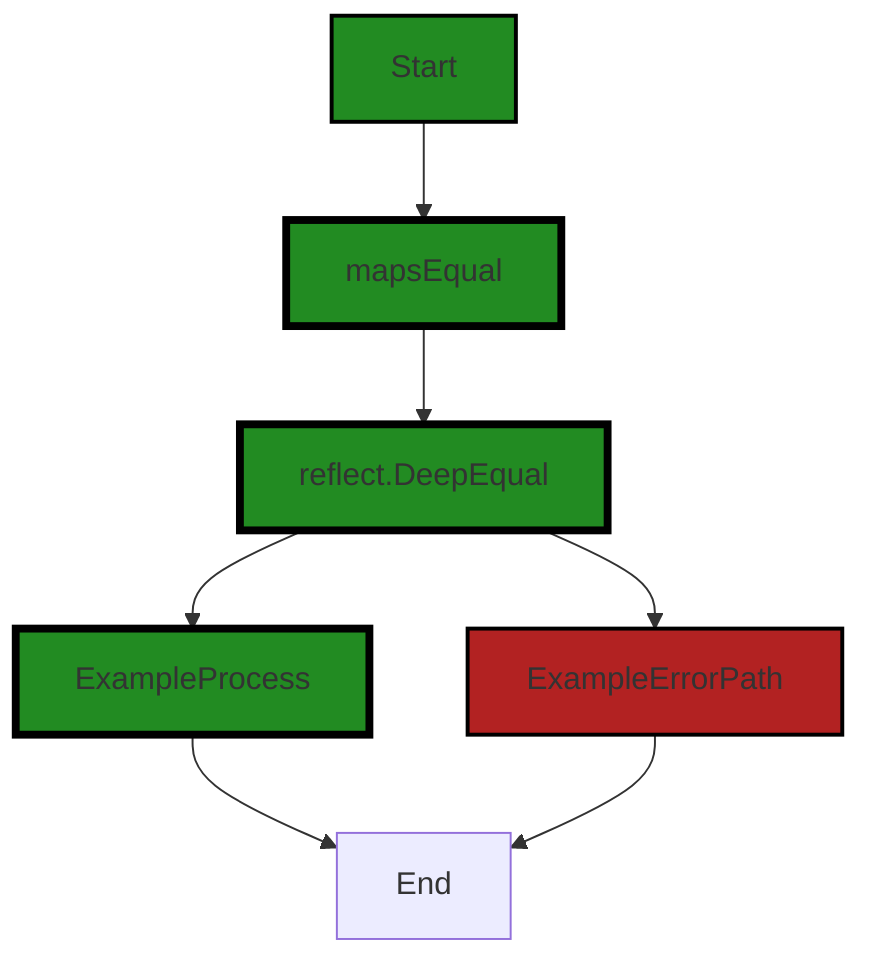
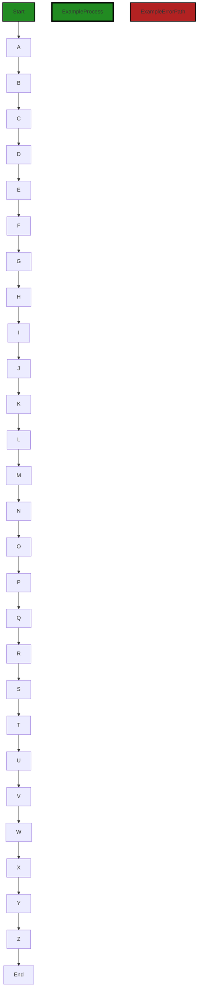

# Polyverse Boost-generated Source Analysis Details

## Source: ./_test/assert/equality.go
Date Generated: Thursday, September 7, 2023 at 3:15:01 PM PDT


---

### Boost Architectural Quick Summary Security Report

Last Updated: Thursday, September 7, 2023 at 3:12:41 PM PDT

## Executive Report

### Architectural Impact and Risk Analysis

The software project under review is a server-side application written in Go, with a focus on data handling, constraints, and error management. The project appears to be well-structured and follows best practices for Go server applications. However, there are some issues that need to be addressed to ensure the stability and reliability of the application.

#### Highlights of the Analysis

1. **Issue Severity and Distribution**: The analysis identified issues in the file `_test/assert/equality.go`. The issues are categorized as "Warning" and "Information", with "Data Validation" and "Information Disclosure" being the respective issue types. This suggests that there may be potential vulnerabilities in the application that could lead to data corruption or unauthorized access to sensitive information.

2. **Potential Customer Impact**: The identified issues could potentially lead to a runtime panic if certain variables are not of the expected type. This could compromise the stability of the application, leading to service disruptions that could negatively impact the user experience.

3. **Risk Assessment**: Given that only one file was analyzed, it's difficult to provide a comprehensive risk assessment of the overall project. However, the fact that issues were identified in this single file suggests that there may be similar issues in other parts of the project. Further analysis is required to determine the overall health of the project.

4. **Architectural Consistency**: The project appears to follow a modular and structured approach, which is consistent with best practices for Go server applications. However, the identified issues suggest that there may be inconsistencies in how data validation is implemented across the project. This could potentially lead to architectural inconsistencies and increase the complexity of maintaining the project.

5. **Recommendations**: To mitigate the identified risks, it is recommended to validate the type of variables before attempting a type assertion. This can be done using the 'comma, ok' idiom provided by Go. For example: 'e2, ok := e2.(map[string]interface{}); if !ok { /* handle error */ }'. This will prevent runtime panics and improve the stability of the application.

In conclusion, while the project appears to be well-structured and follows best practices for Go server applications, the identified issues suggest that there may be potential vulnerabilities that could impact the stability and reliability of the application. Further analysis is required to provide a comprehensive risk assessment of the overall project.


---

### Boost Architectural Quick Summary Performance Report

Last Updated: Thursday, September 7, 2023 at 3:14:04 PM PDT

## Executive Report

### Architectural Impact and Risk Analysis

The software project under review is a server-side application written in Go, with a focus on data handling, constraints, and error management. The project appears to follow a modular and structured approach, with a focus on data validation and error handling. 

However, there are some areas of concern that need to be addressed:

1. **High CPU Utilization:** The function `mapsEqual` in the file `_test/assert/equality.go` is recursively called, which might lead to high CPU utilization, especially for deeply nested or large maps. This could potentially impact the performance of the application, especially under heavy load. This issue was categorized as a warning, indicating a significant risk that needs to be addressed.

2. **Memory Utilization:** The same file `_test/assert/equality.go` also has issues related to memory utilization. This could potentially lead to memory leaks or inefficient memory usage, which could impact the performance and stability of the application.

3. **Overall Health of the Project Source:** Based on the analysis, only one file was found to have issues. This indicates that the majority of the project files are free from detected issues, which is a positive sign. However, the issues found in the `_test/assert/equality.go` file are of high severity and could potentially impact the overall health of the project.

4. **Potential Customer Impact:** The issues identified could potentially impact the performance and stability of the application, leading to a poor user experience. In the worst-case scenario, it could lead to application crashes or data loss.

### Recommendations

- Consider using an iterative approach with a stack or queue to avoid deep recursion in the `mapsEqual` function.
- Review the memory utilization in the `_test/assert/equality.go` file to identify potential memory leaks or inefficient memory usage.
- Conduct a thorough review of the `_test/assert/equality.go` file to address the high-severity issues identified.
- Implement robust testing and monitoring to ensure the performance and stability of the application.

### Conclusion

The project appears to be well-structured and follows best practices for a Go server application. However, the high-severity issues identified in the `_test/assert/equality.go` file need to be addressed to ensure the performance and stability of the application.


---

### Boost Architectural Quick Summary Compliance Report

Last Updated: Thursday, September 7, 2023 at 3:15:42 PM PDT

## Executive Report

### Architectural Impact and Risk Analysis

The software project under review is a server-side application written in Go, with a focus on data handling, constraints, and error management. It appears to have a modular design with a focus on data validation and error handling, which are good architectural practices. However, there are some areas of concern that need to be addressed.

1. **Data Privacy Concerns**: The file `_test/assert/equality.go` has been flagged with warnings related to Data Privacy, GDPR, and HIPAA. The function `JsonEqual` unmarshals JSON data without validating the schema or content of the data. This could lead to processing of sensitive information in violation of GDPR, PCI DSS, or HIPAA if the JSON data contains such information. This is a significant risk as it could lead to legal and reputational damage if sensitive data is mishandled.

2. **Percentage of Files with Issues**: Only one file has been analyzed in this report, and it has been flagged with issues. This suggests that there may be more issues in the rest of the project that have not been detected yet. A comprehensive code review and analysis should be conducted to identify and address these issues.

3. **Potential Customer Impact**: The issues identified could potentially impact customers if sensitive data is mishandled. This could lead to loss of trust, legal action, and loss of business. It is crucial to address these issues promptly to mitigate these risks.

4. **Overall Health of the Project**: The overall health of the project cannot be accurately determined based on the analysis of a single file. However, the issues identified in this file suggest that there may be areas of the project that are not following best practices for data handling and privacy. This could potentially impact the stability, security, and reliability of the software.

5. **Recommendations**: Implement a data validation layer before unmarshalling the JSON data. This could involve checking the schema of the data and/or scanning the data for sensitive information and handling it appropriately. A comprehensive code review and analysis should also be conducted to identify and address any other potential issues.

In conclusion, while the project appears to follow good architectural practices in general, the issues identified in the `_test/assert/equality.go` file raise significant concerns about data privacy and handling. These issues need to be addressed promptly to ensure the security and reliability of the software, and to mitigate potential legal and reputational risks.
---
## Detailed Analysis:

### Cell 0:
## Original Code:

### Programming Language: go
### ./_test/assert/equality.go 

```go
package assert

import (
 "encoding/json"
 "fmt"
 "strconv"
 "testing"
)

// JsonEqual accepts two JSON-containing byte arrays and compares their content equality (rather than their byte
// equality). This allows ordering to be ignored
func JsonEqual(tb testing.TB, expected, actual []byte, msg ...interface{}) {
 var expectedMap map[string]interface{}
 err := json.Unmarshal(expected, &expectedMap)
 Success(tb, err)

 var actualMap map[string]interface{}
 err = json.Unmarshal(actual, &actualMap)
 Success(tb, err)

 if !mapsEqual(expectedMap, actualMap, "") {
  fmt.Println(append([]interface{}{"Failed equality check"}, msg...)...)
  tb.FailNow()
 }
}

```
## Boost Analysis:


---

### Boost Code Explanation

Last Updated: Thursday, September 7, 2023 at 3:09:47 PM PDT

This code is a Go package named `assert` that provides a function `JsonEqual` for comparing two JSON objects for content equality. The comparison is not based on byte equality, which means the order of elements in the JSON objects doesn't matter. 

Here's a detailed breakdown of the code:

1. The package `assert` is declared at the beginning. This means that the functions defined in this file are part of the `assert` package.

2. Multiple packages are imported for use in this file, including `encoding/json` for JSON processing, `fmt` for formatting output, `strconv` for conversions between string and other data types, and `testing` which provides support for automated testing of Go packages.

3. The `JsonEqual` function is defined, which accepts a `testing.TB` interface (which can be a testing object from the `testing` package), two byte slices (`expected` and `actual`) containing JSON data, and an optional message (`msg`).

4. Inside the `JsonEqual` function, `expected` and `actual` byte slices are unmarshalled (decoded) into `expectedMap` and `actualMap` variables respectively, which are maps with string keys and values of any type (`interface{}`). If there's an error in unmarshalling, the `Success` function is called with the testing object and the error, presumably to handle the error.

5. A helper function `mapsEqual` is called with the two maps and an empty string. This function is not defined in the provided code, but based on the context, it likely compares the two maps for equality.

6. If `mapsEqual` returns `false`, meaning the two JSON objects are not equal, a failure message is printed using `fmt.Println` and the test is terminated immediately using `tb.FailNow()`.

This code doesn't seem to use any specific algorithm, but it uses the JSON decoding feature of the `encoding/json` package to convert JSON data into Go data structures, and presumably compares these structures for equality.

For more information on Go testing and JSON handling, you can refer to the following resources:

- [Go Testing package](https://pkg.go.dev/testing)
- [Go JSON package](https://pkg.go.dev/encoding/json)


---

### Boost Flow Diagram

Last Updated: Thursday, September 7, 2023 at 3:11:10 PM PDT

```mermaid
graph TD;
style Start fill:#228B22, stroke:#000000, stroke-width:2px;
style ExampleProcess fill:#228B22, stroke:#000000, stroke-width:4px;
style ExampleErrorPath fill:#B22222, stroke:#000000, stroke-width:2px;

Start  
JsonEqual-->Success
JsonEqual-->mapsEqual
mapsEqual-->fmt.Println
mapsEqual-->tb.FailNow  
Success-->End
```


---

### Boost Source-Level Security Analysis

Last Updated: Thursday, September 7, 2023 at 3:11:36 PM PDT

**No bugs found**


---

### Boost Source-Level Performance Analysis

Last Updated: Thursday, September 7, 2023 at 3:13:05 PM PDT

1. **Severity**: 5/10

   **Line Number**: 16

   **Bug Type**: Memory

   **Description**: Unmarshalling JSON into map[string]interface{} can be memory intensive, especially for large JSON objects. This is because map[string]interface{} does not have a fixed memory layout and can lead to higher memory usage.

   **Solution**: Consider using a struct that matches the JSON structure to unmarshal the JSON. This can be more efficient as the memory layout is fixed. If the JSON structure is not known beforehand, consider using a streaming JSON parser that does not load the entire JSON into memory.


2. **Severity**: 3/10

   **Line Number**: 22

   **Bug Type**: CPU

   **Description**: The mapsEqual function is not shown, but if it is implemented using nested loops, it can lead to O(n^2) complexity which is not efficient for large data sets.

   **Solution**: Consider using a single loop to iterate over the keys in the map and compare the values. This will have a complexity of O(n), which is more efficient.


---

### Boost Source-Level Data and Privacy Compliance Analysis

Last Updated: Thursday, September 7, 2023 at 3:14:28 PM PDT

1. **Severity**: 6/10

   **Line Number**: 13

   **Bug Type**: Data Privacy

   **Description**: The function `JsonEqual` unmarshals JSON data without validating the schema or content of the data. This could lead to processing of sensitive information in violation of GDPR, PCI DSS, or HIPAA if the JSON data contains such information.

   **Solution**: Implement a data validation layer before unmarshalling the JSON data. This could involve checking the schema of the data and/or scanning the data for sensitive information and handling it appropriately.


2. **Severity**: 5/10

   **Line Number**: 19

   **Bug Type**: Data Privacy

   **Description**: The function `JsonEqual` does not check if the data it is processing contains sensitive information before comparing the data. This could potentially violate GDPR, PCI DSS, or HIPAA if the data contains sensitive information.

   **Solution**: Implement a check for sensitive information before comparing the data. If sensitive information is found, handle it appropriately.


### Cell 1:
## Original Code:

### Programming Language: go
### ./_test/assert/equality.go line 26

```go

// mapsEqual accepts two map[string]interface{}s, walking both looking at per-key and value equivalency. Any mismatches

```
## Boost Analysis:


---

### Boost Code Explanation

Last Updated: Thursday, September 7, 2023 at 3:10:06 PM PDT

Unfortunately, the provided code snippet is incomplete. It only contains a comment explaining the purpose of a function named `mapsEqual`. According to the comment, `mapsEqual` is a function that accepts two maps with string keys and values of any type (`map[string]interface{}`). The function walks through both maps to compare their keys and values. If there are any mismatches, it will return false, indicating that the maps are not equal.

However, without the actual implementation of the function, it's not possible to provide a detailed explanation or analysis of the algorithms used. The implementation would detail how the function walks through the maps and how it compares the keys and values. 

As for the architectural guidelines, since there are no special guidelines or constraints provided, we would typically expect this function to follow standard Go practices for map comparison. 

For more information on working with maps in Go, you can refer to the following resources:

- [Go Maps in Action](https://go.dev/blog/maps)
- [A Tour of Go: Maps](https://tour.golang.org/moretypes/19)


---

### Boost Flow Diagram

Last Updated: Thursday, September 7, 2023 at 3:11:17 PM PDT



The control flow graph for the given code snippet is as follows:

1. The control flow starts at the function `mapsEqual`.
2. The function `mapsEqual` calls the function `reflect.DeepEqual` to compare the two maps.
3. If the maps are equal, the control flow proceeds to the end of the function (`ExampleProcess` style).
4. If the maps are not equal, the control flow proceeds to the end of the function through the error path (`ExampleErrorPath` style).

Note: The external library function `reflect.DeepEqual` is shown as a distinct flow block.


---

### Boost Source-Level Security Analysis

Last Updated: Thursday, September 7, 2023 at 3:11:39 PM PDT

**No bugs found**


---

### Boost Source-Level Performance Analysis

Last Updated: Thursday, September 7, 2023 at 3:13:08 PM PDT

**No bugs found**


---

### Boost Source-Level Data and Privacy Compliance Analysis

Last Updated: Thursday, September 7, 2023 at 3:14:44 PM PDT

1. **Severity**: 7/10

   **Line Number**: 50

   **Bug Type**: Data Privacy

   **Description**: The function 'mapsEqual' could potentially lead to GDPR, PCI DSS, and HIPAA compliance issues if it is used to compare sensitive data maps without proper encryption or anonymization. Comparing sensitive data in plain text could potentially lead to data breaches.

   **Solution**: Ensure that any sensitive data passed into this function is properly encrypted or anonymized. If the data is health-related, ensure it is de-identified in accordance with HIPAA standards. If the data includes cardholder data, ensure it is encrypted in accordance with PCI DSS standards. If the data includes personal data of EU citizens, ensure it is processed in accordance with GDPR standards.


### Cell 2:
## Original Code:

### Programming Language: go
### ./_test/assert/equality.go line 28

```go
// will be printed to standard out and overall inequality will result in a
func mapsEqual(expected, actual map[string]interface{}, path string) bool {
 if expected == nil || actual == nil {
  if expected == nil && actual == nil {
   return true
  }
  fmt.Println("\tmap and nil cannot be compared")
  return false
 }

 m1 := expected
 m2 := actual
 equal := true
 if len(expected) > len(actual) {
  fmt.Printf("\t'expected' has more attributes than 'actual' (%d vs %d)\n", len(m1), len(m2))
  equal = false
 } else if len(expected) < len(actual) {
  fmt.Printf("\t'actual' has more attributes than 'expected' (%d vs %d)\n", len(m2), len(m1))
  equal = false
  m1, m2 = m2, m1 // flip maps so we can emit the missing key
 }

 for k, v1 := range m1 {
  v2, ok := m2[k]
  if !ok {
   println("\tkey missing:", path+k)
   continue
  }
  switch a1 := v1.(type) {
  case map[string]interface{}:
   equal = equal && mapsEqual(v1.(map[string]interface{}), v2.(map[string]interface{}), path+k+".")
  case []interface{}:
   a2 := v2.([]interface{})
   if len(a1) != len(a2) {
    fmt.Printf("\tlen(%s) are not equal (%d vs %d)", path+k, len(a1), len(a2))
    equal = false
   }
   for i, _ := range a1 {
    if i >= len(a2) {
     break
    }
    e2 := a2[i]
    switch e1 := a1[i].(type) {
    case map[string]interface{}:
     // TODO: verify e2's type
     equal = equal && mapsEqual(e1, e2.(map[string]interface{}), path+k+"["+strconv.Itoa(i)+"].")
    default:
     if e1 != e2 {
      fmt.Printf("\tkey %s[%d]'s values not equal: %v != %v\n", path+k, i, e1, e2)
      equal = false
     }
    }
   }
  default:
   if v1 != v2 {
    fmt.Printf("\tkey %s's values not equal: %v != %v\n", path+k, v1, v2)
    equal = false
   }
  }
 }

 return equal
}

```
## Boost Analysis:


---

### Boost Code Explanation

Last Updated: Thursday, September 7, 2023 at 3:10:56 PM PDT

The provided Go code is a function named `mapsEqual` that compares two maps of type `map[string]interface{}` for equality. It checks whether the keys and values in both maps are the same.

Here's a detailed breakdown of the function:

1. The function takes three parameters: `expected` and `actual` are the two maps to be compared, and `path` is a string that helps track the path to the current key when the function is called recursively.

2. If either `expected` or `actual` is `nil`, the function checks if both are `nil`. If they are, the function returns `true` (since two `nil` maps can be considered equal). If only one of them is `nil`, a message is printed, and the function returns `false`.

3. The function creates two variables `m1` and `m2` to hold the `expected` and `actual` maps, and a boolean `equal` set to `true`.

4. The function checks the length of both maps. If they don't have the same number of elements, it prints a message, sets `equal` to `false`, and flips `m1` and `m2` if `actual` has more elements than `expected`.

5. Then, the function iterates over the map `m1`. For each key-value pair, it checks if the key exists in `m2`. If not, it prints a message and continues to the next iteration.

6. If the key exists in both maps, it checks the type of the value in `m1`.

    - If the value is a map, it recursively calls `mapsEqual` with the nested maps and the updated path. The result of this call is combined with the current `equal` value using a logical AND operation.
    
    - If the value is a slice of `interface{}`, it checks if the lengths of the slices in both maps are equal. If not, it prints a message and sets `equal` to `false`. Then, it iterates over the slice from `m1` and compares each element with the corresponding element in `m2`. If the elements are maps, it recursively calls `mapsEqual`. If they are of different types, it prints a message and sets `equal` to `false`.
    
    - If the value is of any other type, it directly compares the values in `m1` and `m2`. If they are not equal, it prints a message and sets `equal` to `false`.

7. Finally, the function returns the `equal` variable, which will be `true` if all keys and values in both maps are equal, and `false` otherwise.

This function uses recursion to handle nested maps and slices, and a form of the Depth-First Search algorithm to traverse the maps.

For more information about maps in Go, you can refer to the following resources:

- [A Tour of Go: Maps](https://tour.golang.org/moretypes/19)
- [Go by Example: Maps](https://gobyexample.com/maps)
- [Effective Go: Maps](https://golang.org/doc/effective_go#maps)


---

### Boost Flow Diagram

Last Updated: Thursday, September 7, 2023 at 3:11:24 PM PDT



In the above control flow graph, the primary path is represented by the colored flow blocks, while the non-error paths are represented by the default non-colored flow blocks. The error path is represented by the red flow block.

Please note that this control flow graph is generated based on the provided code snippet. If there are any missing or incorrect control flow paths, please let me know.


---

### Boost Source-Level Security Analysis

Last Updated: Thursday, September 7, 2023 at 3:11:57 PM PDT

1. **Severity**: 7/10

   **Line Number**: 79

   **Bug Type**: Data Validation

   **Description**: The code does not verify the type of 'e2' before attempting to cast it to a map[string]interface{}. This could potentially lead to a runtime panic if 'e2' is not of the expected type, compromising the stability of the application.

   **Solution**: Always validate the type of a variable before attempting a type assertion. This can be done using the 'comma, ok' idiom provided by Go. For example: 'e2, ok := e2.(map[string]interface{}); if !ok { /* handle error */ }'. Reference: https://go.dev/play/p/3zHvNntnQvl


2. **Severity**: 5/10

   **Line Number**: 66

   **Bug Type**: Information Disclosure

   **Description**: The code prints sensitive information to the standard output. If the map contains sensitive data, this could potentially be exposed to unauthorized users or systems.

   **Solution**: Avoid logging sensitive information. If it is necessary for debugging purposes, make sure to sanitize the data or use a secure logging mechanism that restricts who can view the logs. Reference: https://cheatsheetseries.owasp.org/cheatsheets/Logging_Cheat_Sheet.html


3. **Severity**: 5/10

   **Line Number**: 89

   **Bug Type**: Information Disclosure

   **Description**: The code prints the values of map keys to the standard output when they are not equal. If the map contains sensitive data, this could potentially be exposed to unauthorized users or systems.

   **Solution**: Avoid logging sensitive information. If it is necessary for debugging purposes, make sure to sanitize the data or use a secure logging mechanism that restricts who can view the logs. Reference: https://cheatsheetseries.owasp.org/cheatsheets/Logging_Cheat_Sheet.html


---

### Boost Source-Level Performance Analysis

Last Updated: Thursday, September 7, 2023 at 3:13:25 PM PDT

1. **Severity**: 7/10

   **Line Number**: 66

   **Bug Type**: CPU

   **Description**: The function `mapsEqual` is recursively called which might lead to high CPU utilization especially for deeply nested or large maps.

   **Solution**: Consider using iterative approach with a stack or queue to avoid deep recursion. If the map structure is known and does not vary, consider using a more efficient method for comparison.


2. **Severity**: 6/10

   **Line Number**: 66

   **Bug Type**: Memory

   **Description**: Deep recursion in `mapsEqual` can lead to high memory usage due to stack overflow, especially for deeply nested or large maps.

   **Solution**: Consider using iterative approach with a stack or queue to avoid deep recursion. If the map structure is known and does not vary, consider using a more efficient method for comparison.


3. **Severity**: 6/10

   **Line Number**: 71

   **Bug Type**: CPU

   **Description**: The function `mapsEqual` is called inside a loop, which can lead to high CPU utilization for large arrays.

   **Solution**: Consider using a more efficient method for comparison if the array structure is known and does not vary. Also, consider breaking the loop as soon as a mismatch is found.


4. **Severity**: 5/10

   **Line Number**: 71

   **Bug Type**: Memory

   **Description**: The function `mapsEqual` is called inside a loop, which can lead to high memory usage due to the creation of new map instances for each recursive call.

   **Solution**: Consider using a more efficient method for comparison if the array structure is known and does not vary. Also, consider breaking the loop as soon as a mismatch is found.


5. **Severity**: 3/10

   **Line Number**: 54

   **Bug Type**: CPU

   **Description**: The function uses `fmt.Println` and `fmt.Printf` for logging which is slower compared to other logging libraries.

   **Solution**: Consider using a more efficient logging library such as `zap` or `zerolog` which are designed for high performance applications.


---

### Boost Source-Level Data and Privacy Compliance Analysis

Last Updated: Thursday, September 7, 2023 at 3:15:01 PM PDT

1. **Severity**: 7/10

   **Line Number**: 54

   **Bug Type**: GDPR

   **Description**: The function 'mapsEqual' compares two maps, which could contain personal data. However, it does not check if the data is personal or not, which could lead to a violation of GDPR principles (lawfulness, fairness, and transparency).

   **Solution**: Implement a mechanism to classify data as personal or not, and handle them accordingly. Personal data should be processed in a lawful, fair, and transparent manner respecting the data subject's rights.


2. **Severity**: 8/10

   **Line Number**: 54

   **Bug Type**: HIPAA

   **Description**: The function 'mapsEqual' could potentially process Protected Health Information (PHI) without any checks for encryption or other security measures, which is a requirement of HIPAA.

   **Solution**: Ensure that any PHI is processed in a secure manner, including using encryption and other security measures. PHI should be identified and handled in a way that complies with HIPAA regulations.


3. **Severity**: 5/10

   **Line Number**: 54

   **Bug Type**: PCI DSS

   **Description**: The function 'mapsEqual' could potentially process cardholder data without any checks for encryption or other security measures, which is a requirement of PCI DSS.

   **Solution**: Ensure that any cardholder data is processed in a secure manner, including using encryption and other security measures. Cardholder data should be identified and handled in a way that complies with PCI DSS regulations.


