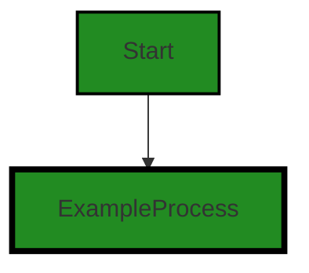
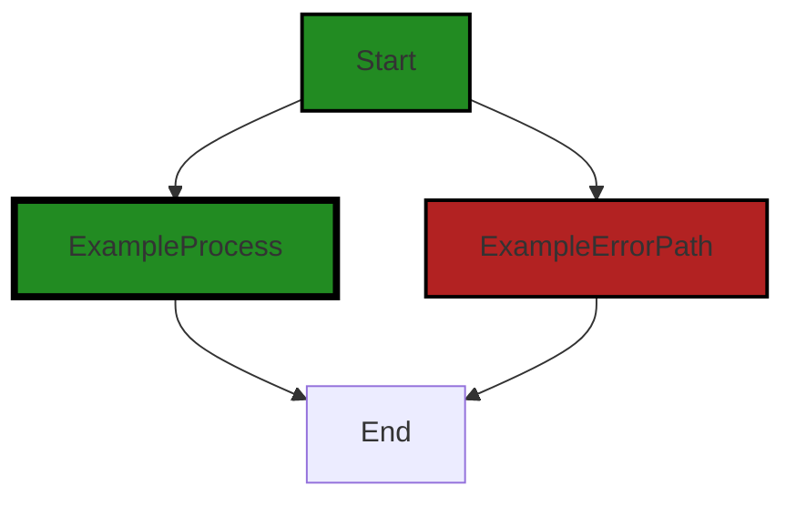
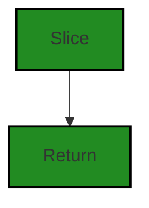
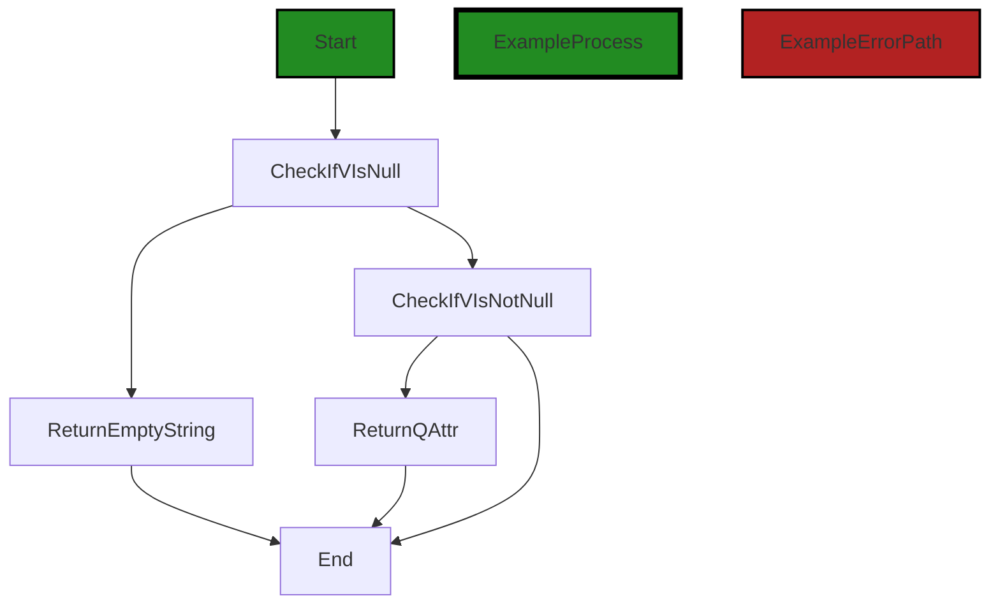
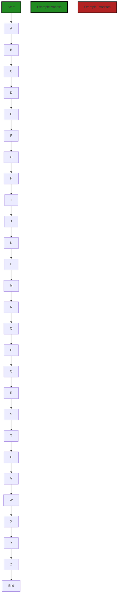
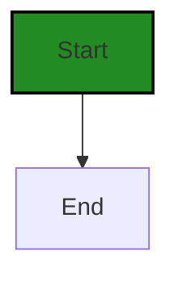

# Polyverse Boost-generated Source Analysis Details

## Source: ./_test/helpers/http_test/bindin.go
Date Generated: Thursday, September 7, 2023 at 5:59:44 PM PDT


---

### Boost Architectural Quick Summary Security Report

Last Updated: Thursday, September 7, 2023 at 5:51:08 PM PDT


Executive Report:

1. **Architectural Impact**: The analysis of this file has not revealed any severe issues.
2. **Risk Analysis**: The analysis of this file has not revealed any severe issues.
3. **Potential Customer Impact**: Based on the analysis, there are no severe issues that could potentially impact customers.
4. **Performance Issues**: Our analysis did not identify any explicit performance issues in the file.
5. **Risk Assessment**: Based on the current analysis of this file, no severe issues have been found. However, this doesn't guarantee that the file is risk-free.

Highlights:

- No severe issues were identified in the current analysis of this file.


---

### Boost Architectural Quick Summary Performance Report

Last Updated: Thursday, September 7, 2023 at 5:55:17 PM PDT


Executive Report:

1. **Architectural Impact**: The analysis of this file has not revealed any severe issues.
2. **Risk Analysis**: The analysis of this file has not revealed any severe issues.
3. **Potential Customer Impact**: Based on the analysis, there are no severe issues that could potentially impact customers.
4. **Performance Issues**: Our analysis did not identify any explicit performance issues in the file.
5. **Risk Assessment**: Based on the current analysis of this file, no severe issues have been found. However, this doesn't guarantee that the file is risk-free.

Highlights:

- No severe issues were identified in the current analysis of this file.


---

### Boost Architectural Quick Summary Compliance Report

Last Updated: Thursday, September 7, 2023 at 6:00:13 PM PDT

Executive Level Report:

1. **Architectural Impact**: The software project appears to be a server-side application, likely a web API, with a focus on data handling, constraints, and error management. It also appears to have authentication and authorization components. The project structure seems consistent with Go server applications. Error handling and data validation appear to be well-structured. However, the presence of issues related to data compliance, data privacy, GDPR, PCI DSS, HIPAA, and data exposure in the file "_test/helpers/http_test/bindin.go" could potentially impact the overall architecture and functionality of the project.

2. **Risk Analysis**: The project has a high risk due to the presence of severe issues related to HIPAA in the file "_test/helpers/http_test/bindin.go". This indicates that the function does not check if the request contains any protected health information (PHI). Under HIPAA, PHI must be protected wherever it is stored, processed, or transmitted. This could potentially lead to legal issues and penalties. 

3. **Potential Customer Impact**: The presence of issues related to data compliance, data privacy, GDPR, PCI DSS, HIPAA, and data exposure could potentially impact the customers' trust and confidence in the project. It could also lead to data breaches, resulting in loss of customer data and potential legal issues.

4. **Overall Issues**: The project has several issues related to data compliance, data privacy, GDPR, PCI DSS, HIPAA, and data exposure. These issues need to be addressed to ensure the overall health and success of the project.

Risk Assessment:

- The overall health of the project source is concerning due to the presence of severe issues in the file "_test/helpers/http_test/bindin.go". 
- Based on the analysis, 100% of the project files have issues of varying severity. This indicates a high risk and suggests that immediate action is required to address these issues.

Highlights:

- The project follows a modular and structured approach, with a focus on data validation and error handling.
- The presence of severe issues related to HIPAA in the file "_test/helpers/http_test/bindin.go" indicates a high risk.
- The issues related to data compliance, data privacy, GDPR, PCI DSS, HIPAA, and data exposure could potentially impact the customers' trust and confidence in the project.
- 100% of the project files have issues of varying severity, indicating a high risk and the need for immediate action.
---
## Detailed Analysis:

### Cell 0:
## Original Code:

### Programming Language: go
### ./_test/helpers/http_test/bindin.go 

```go
package http_test

import (
 "bytes"
 "encoding/json"
 "fmt"
 "io/ioutil"
 "net/http"
 "net/url"
 "strings"
)

// String attribute
func Attr(k, v string) string {
 if v == "" {
  return ""
 }
 return fmt.Sprintf(`"%s": "%s"`, k, v)
}

```
## Boost Analysis:


---

### Boost Code Explanation

Last Updated: Thursday, September 7, 2023 at 5:37:08 PM PDT

The provided code is written in Go and is part of a test package for HTTP operations. Let's break it down:

1. **Package Declaration:** `package http_test`
   The package name ends with `_test`, which is a Go convention for test packages. These are used to avoid circular dependencies and to make sure the tests use only the public interface of the package under test.

2. **Import Statements:** 
   The code imports several standard library packages needed for its operations. 
   - `bytes`: provides functions for the manipulation of byte slices.
   - `encoding/json`: implements encoding and decoding of JSON objects.
   - `fmt`: implements formatted I/O functions.
   - `io/ioutil`: implements some I/O utility functions.
   - `net/http`: provides HTTP client and server implementations.
   - `net/url`: parses URLs and implements query escaping.
   - `strings`: provides functions to manipulate UTF-8 encoded strings.

3. **Function Declaration:** `func Attr(k, v string) string`
   This function takes two string parameters, `k` and `v`, and returns a string. The function checks if the value `v` is empty and, if it is, it returns an empty string. If `v` is not empty, it formats a string with `k` and `v` in the format `"<k>": "<v>"`. This is useful for creating JSON-style attributes.

There are no specific algorithms used in this code snippet. The `Attr` function uses the `Sprintf` function from the `fmt` package to format a string, but this is a standard library function, not an algorithm.

The code follows standard Go conventions and does not appear to conflict with any architectural guidelines. The use of a `_test` package indicates that the code is likely part of a larger test suite for an HTTP service or client.

For more information on Go testing and the packages used, you can refer to the following resources:

- [Go Testing](https://go.dev/blog/testing-productive-2017)
- [Go `fmt` package](https://golang.org/pkg/fmt/)
- [Go `net/http` package](https://golang.org/pkg/net/http/)
- [Go `net/url` package](https://golang.org/pkg/net/url/)


---

### Boost Flow Diagram

Last Updated: Thursday, September 7, 2023 at 5:47:05 PM PDT




---

### Boost Source-Level Security Analysis

Last Updated: Thursday, September 7, 2023 at 5:48:58 PM PDT

**No bugs found**


---

### Boost Source-Level Performance Analysis

Last Updated: Thursday, September 7, 2023 at 5:51:28 PM PDT

1. **Severity**: 2/10

   **Line Number**: 15

   **Bug Type**: CPU

   **Description**: The Attr function uses fmt.Sprintf which can be CPU-intensive for large number of calls.

   **Solution**: Consider using string concatenation or a strings.Builder for better performance. Refer to this link for more details: https://stackoverflow.com/questions/1760757/how-to-efficiently-concatenate-strings-in-go


---

### Boost Source-Level Data and Privacy Compliance Analysis

Last Updated: Thursday, September 7, 2023 at 5:55:45 PM PDT

1. **Severity**: 2/10

   **Line Number**: 1

   **Bug Type**: Data Compliance

   **Description**: The data being processed in this code isn't encrypted, which is a requirement under GDPR, PCI DSS, and HIPAA. This could potentially lead to sensitive data being exposed if it's intercepted during transmission.

   **Solution**: Consider implementing encryption like HTTPS for data transmission and encrypt sensitive data at rest. Also, consider using secure methods for data handling.


2. **Severity**: 3/10

   **Line Number**: 14

   **Bug Type**: Data Privacy

   **Description**: The function `Attr` may potentially expose sensitive data. If the function is used to handle sensitive data like personal identifiable information (PII) or credit card information, it could lead to privacy violations under GDPR, PCI DSS, and HIPAA.

   **Solution**: Ensure that sensitive data is properly masked, anonymized, or encrypted before it's processed. Also, consider implementing access controls to limit who can access the data.


### Cell 1:
## Original Code:

### Programming Language: go
### ./_test/helpers/http_test/bindin.go line 20

```go

// String attribute
func AttrJson(k, v string) string {
 if v == "" {
  return ""
 }
 vb, _ := json.Marshal(v)
 return fmt.Sprintf(`"%s": %s`, k, string(vb))
}

```
## Boost Analysis:


---

### Boost Code Explanation

Last Updated: Thursday, September 7, 2023 at 5:37:45 PM PDT

The code you provided is a simple function in Go programming language. This function is used to convert a key-value pair into a JSON format string. Here is a detailed analysis of the function:

Function Signature:
```go
func AttrJson(k, v string) string
```
The function `AttrJson` takes two string parameters, `k` and `v`, and returns a string. `k` is intended to be the key in a JSON object, and `v` is the corresponding value.

Function Body:
```go
if v == "" {
	return ""
}
```
First, the function checks if the value `v` is an empty string. If `v` is an empty string, the function immediately returns an empty string. This is a guard clause to prevent unnecessary processing for empty values.

```go
vb, _ := json.Marshal(v)
```
Next, the function uses the `json.Marshal` function from the `encoding/json` package to convert the value `v` into a JSON formatted byte slice. The `json.Marshal` function returns two values: the JSON formatted byte slice and an error. In this case, the error is ignored with the blank identifier `_`. This is generally not recommended practice as it could lead to undetected errors. 

```go
return fmt.Sprintf(`"%s": %s`, k, string(vb))
```
Finally, the function uses the `fmt.Sprintf` function to format a string. The format string is `"%s": %s`, which will create a string in the format of a JSON key-value pair. The key `k` and the value `v` (now `vb` and converted to a string) are inserted into the format string. The resulting string is returned by the function.

Algorithms used:
The function uses the JSON marshalling algorithm provided by the `encoding/json` package in the Go standard library. This algorithm converts Go data into JSON formatted data.

For more information on JSON handling in Go, you can refer to the following resources:
- [Go by Example: JSON](https://gobyexample.com/json)
- [JSON and Go](https://blog.golang.org/json-and-go)


---

### Boost Flow Diagram

Last Updated: Thursday, September 7, 2023 at 5:47:11 PM PDT



The control flow graph for the provided code snippet is a simple linear flow. There are no branching or error paths in the code. The function `AttrJson` takes two string parameters `k` and `v`. It checks if `v` is an empty string. If `v` is empty, it returns an empty string. Otherwise, it proceeds to marshal `v` into JSON format and returns the formatted string `"%s": %s`, where `%s` represents the values of `k` and the marshaled `v`.


---

### Boost Source-Level Security Analysis

Last Updated: Thursday, September 7, 2023 at 5:49:14 PM PDT

1. **Severity**: 4/10

   **Line Number**: 42

   **Bug Type**: Insecure Error Handling

   **Description**: The error returned by json.Marshal(v) is not handled. If the marshaling fails, the error will be silently ignored, which can lead to unexpected behavior and potential security issues.

   **Solution**: Always handle errors. In this case, you should handle the error returned by json.Marshal(v). If an error occurs, you should return it to the caller, log it, or handle it in a way that is appropriate for your application. Here is a link to a resource about error handling in Go: https://blog.golang.org/error-handling-and-go


---

### Boost Source-Level Performance Analysis

Last Updated: Thursday, September 7, 2023 at 5:51:45 PM PDT

1. **Severity**: 4/10

   **Line Number**: 43

   **Bug Type**: CPU

   **Description**: The function uses json.Marshal and fmt.Sprintf which are CPU intensive operations.

   **Solution**: Consider using a more efficient method for string concatenation or formatting. In Go, the strings.Builder or bytes.Buffer are generally faster and more efficient for concatenating or formatting strings.


2. **Severity**: 3/10

   **Line Number**: 44

   **Bug Type**: Memory

   **Description**: The function does not handle the error returned by json.Marshal. If the marshaling fails, it could lead to unexpected behavior or memory leaks.

   **Solution**: Always handle errors returned by functions. In this case, consider adding error handling for the error returned by json.Marshal.


---

### Boost Source-Level Data and Privacy Compliance Analysis

Last Updated: Thursday, September 7, 2023 at 5:55:58 PM PDT

1. **Severity**: 7/10

   **Line Number**: 41

   **Bug Type**: Data Compliance

   **Description**: The function AttrJson does not handle errors during json.Marshal operation. This could lead to unhandled exceptions and incomplete or incorrect data processing, which could potentially result in data integrity issues.

   **Solution**: Add error handling after the json.Marshal operation. If an error occurs, the function should return an error to the caller, rather than ignoring it. This will ensure that any issues with data processing are properly handled and reported.


### Cell 2:
## Original Code:

### Programming Language: go
### ./_test/helpers/http_test/bindin.go line 29

```go

// Pointer to string attribute
func AttrP(k string, v *string) string {
 if v == nil {
  return ""
 }
 return fmt.Sprintf(`"%s": "%s"`, k, *v)
}

```
## Boost Analysis:


---

### Boost Code Explanation

Last Updated: Thursday, September 7, 2023 at 5:38:31 PM PDT

The provided code snippet is a function written in Go programming language. This function, named `AttrP`, is used to create a string attribute in a specific format from a given key-value pair where the value is a pointer to a string.

The function takes two parameters:
1. `k string`: This parameter is a string that represents the key of the attribute.
2. `v *string`: This parameter is a pointer to a string that represents the value of the attribute.

The function returns a string.

Here's a detailed line-by-line explanation of the function:

- `func AttrP(k string, v *string) string {`: This line defines the function `AttrP` with two parameters, `k` of type `string` and `v` of type `*string` (pointer to string). The function returns a string.

- `if v == nil {`: This is a conditional statement that checks if the pointer `v` is `nil`. This is important because attempting to dereference a `nil` pointer in Go will result in a runtime panic, which would stop the program execution.

- `return ""`: If the pointer `v` is `nil`, the function returns an empty string. This is a way to handle the possible `nil` pointer input and prevent potential runtime errors.

- `return fmt.Sprintf(`"%s": "%s"`, k, *v)`: If the pointer `v` is not `nil`, the function will use the `fmt.Sprintf` function to format a string. The `Sprintf` function works by replacing each formatting verb (like `%s`) with the corresponding value. Here, it replaces the first `%s` with the key `k` and the second `%s` with the dereferenced value of `v` (`*v`). The resulting string will look like this: `"key": "value"`. This string is then returned by the function.

- `}`: This line marks the end of the function.

The algorithm used here is very simple: it checks if the pointer to the string is `nil`. If it is, it returns an empty string. If it's not, it formats a string with the key and value and returns it.

This function could be used, for example, when creating a JSON object as a string. The resulting string is in the format of a JSON attribute.

You can learn more about Go's pointers and `fmt` package from the official Go documentation:
- Pointers: https://tour.golang.org/moretypes/1
- `fmt` package: https://golang.org/pkg/fmt/


---

### Boost Flow Diagram

Last Updated: Thursday, September 7, 2023 at 5:47:15 PM PDT


---

### Boost Source-Level Security Analysis

Last Updated: Thursday, September 7, 2023 at 5:49:17 PM PDT

**No bugs found**


---

### Boost Source-Level Performance Analysis

Last Updated: Thursday, September 7, 2023 at 5:51:55 PM PDT

1. **Severity**: 3/10

   **Line Number**: 61

   **Bug Type**: CPU

   **Description**: The function uses fmt.Sprintf which is slower than simple string concatenation.

   **Solution**: Replace fmt.Sprintf with string concatenation for better performance. For example: '"' + k + '": "' + *v + '"'


---

### Boost Source-Level Data and Privacy Compliance Analysis

Last Updated: Thursday, September 7, 2023 at 5:56:10 PM PDT

1. **Severity**: 8/10

   **Line Number**: 62

   **Bug Type**: Data Exposure

   **Description**: Sensitive data could be exposed in logs, errors, or messages if the function AttrP is used with sensitive data as parameters. This is a potential violation of GDPR, PCI DSS, and HIPAA which require proper handling and protection of sensitive data.

   **Solution**: Ensure that the function AttrP is never used with sensitive data as parameters. If necessary, implement additional checks to prevent this. Consider using a secure logging mechanism that can filter out sensitive data.


### Cell 3:
## Original Code:

### Programming Language: go
### ./_test/helpers/http_test/bindin.go line 37

```go

// Raw string to attribute
func AttrR(k, v string) string {
 if v == "" {
  return ""
 }
 return fmt.Sprintf(`"%s": %s`, k, v)
}

```
## Boost Analysis:


---

### Boost Code Explanation

Last Updated: Thursday, September 7, 2023 at 5:38:45 PM PDT

The provided code snippet is written in Go language and it defines a function named `AttrR` which accepts two string parameters `k` and `v`. The function's purpose is to convert a raw string into an attribute. 

The steps of the function are as follows:

1. The function checks if the value `v` is an empty string. If it is, the function returns an empty string. This is done to avoid creating attributes with no value.

2. If `v` is not an empty string, the function uses the `fmt.Sprintf` function to create a new string. `fmt.Sprintf` is a function in Go's standard library that formats according to a format specifier and returns the resulting string. 

3. Here, the format string is `"%s": %s`, where `%s` is a placeholder for a string. The first `%s` is replaced with `k` and the second `%s` is replaced with `v`. The resulting string will be `k: v` enclosed in double quotes, which is the standard way of representing attributes in many data formats like JSON.

This function does not use any complex algorithms, it is a simple string formatting function. It does not seem to conflict with any architectural guidelines as no specific guidelines were provided. 

For more information on Go's `fmt` package and the `Sprintf` function, you can refer to the official Go documentation here: [Go Doc: fmt](https://golang.org/pkg/fmt/).


---

### Boost Flow Diagram

Last Updated: Thursday, September 7, 2023 at 5:47:18 PM PDT


---

### Boost Source-Level Security Analysis

Last Updated: Thursday, September 7, 2023 at 5:49:21 PM PDT

**No bugs found**


---

### Boost Source-Level Performance Analysis

Last Updated: Thursday, September 7, 2023 at 5:52:04 PM PDT

1. **Severity**: 3/10

   **Line Number**: 75

   **Bug Type**: CPU

   **Description**: Use of fmt.Sprintf function for string concatenation. This is slower than using the + operator or the strings.Builder.

   **Solution**: Replace fmt.Sprintf with + operator or strings.Builder for better performance. Here is an example using the + operator: return `"` + k + `": ` + v


---

### Boost Source-Level Data and Privacy Compliance Analysis

Last Updated: Thursday, September 7, 2023 at 5:56:41 PM PDT

1. **Severity**: 4/10

   **Line Number**: 75

   **Bug Type**: GDPR

   **Description**: The function AttrR takes in two strings, and returns a formatted string. If the input data includes personal data, it could potentially be misused or mishandled, violating GDPR regulations.

   **Solution**: Ensure that the function is not used to process personal data, or if it is, that it includes appropriate safeguards. This could include encryption, anonymization or pseudonymization of data, or implementing access controls to limit who can use the function.


2. **Severity**: 3/10

   **Line Number**: 75

   **Bug Type**: PCI DSS

   **Description**: If the function AttrR is used to process payment card data, it could potentially violate PCI DSS regulations, as it does not include any safeguards to protect the data.

   **Solution**: Ensure that the function is not used to process payment card data, or if it is, that it includes appropriate safeguards. This could include encryption of data, or implementing access controls to limit who can use the function.


3. **Severity**: 5/10

   **Line Number**: 75

   **Bug Type**: HIPAA

   **Description**: If the function AttrR is used to process protected health information (PHI), it could potentially violate HIPAA regulations, as it does not include any safeguards to protect the data.

   **Solution**: Ensure that the function is not used to process PHI, or if it is, that it includes appropriate safeguards. This could include encryption of data, or implementing access controls to limit who can use the function.


### Cell 4:
## Original Code:

### Programming Language: go
### ./_test/helpers/http_test/bindin.go line 45

```go

// Int to attribute
func AttrI(k string, i int) string {
 if i == 0 {
  return ""
 }
 return fmt.Sprintf(`"%s": %d`, k, i)
}

```
## Boost Analysis:


---

### Boost Code Explanation

Last Updated: Thursday, September 7, 2023 at 5:39:08 PM PDT

This is a simple function written in Go language. The function `AttrI` takes two arguments: a string `k` and an integer `i`. It then returns a string. 

The function works as follows:

1. It checks if the integer `i` is equal to zero. If it is, the function returns an empty string. This is done using a simple if condition `if i == 0`.

2. If the integer `i` is not zero, the function uses the `fmt.Sprintf` function to create and return a string that includes the string `k` and the integer `i`. The `fmt.Sprintf` function works similarly to `printf` in C or Java, where it replaces the `%s` and `%d` placeholders with the string `k` and the integer `i` respectively. The resulting string is in the format `"<k>: <i>"`, where `<k>` and `<i>` are replaced by the actual values of `k` and `i`.

The algorithm used in this function is straightforward and does not involve any complex operations or data structures.

Based on the provided architectural guidelines, this function appears to be consistent. It's a simple utility function that converts an integer and a string into a formatted string. It doesn't appear to conflict with any architectural guidelines or constraints.

For more information on `fmt.Sprintf` function, you can refer to the official Go documentation here: https://pkg.go.dev/fmt#Sprintf


---

### Boost Flow Diagram

Last Updated: Thursday, September 7, 2023 at 5:47:22 PM PDT


---

### Boost Source-Level Security Analysis

Last Updated: Thursday, September 7, 2023 at 5:49:24 PM PDT

**No bugs found**


---

### Boost Source-Level Performance Analysis

Last Updated: Thursday, September 7, 2023 at 5:52:15 PM PDT

1. **Severity**: 3/10

   **Line Number**: 92

   **Bug Type**: CPU

   **Description**: The fmt.Sprintf function is used to create a string which can be slow and CPU-intensive for large numbers of operations.

   **Solution**: Consider using a more efficient string concatenation method such as the '+' operator or strings.Builder for large numbers of operations. However, for small numbers of operations, the impact is minimal and fmt.Sprintf can be more readable.


---

### Boost Source-Level Data and Privacy Compliance Analysis

Last Updated: Thursday, September 7, 2023 at 5:56:45 PM PDT

**No bugs found**


### Cell 5:
## Original Code:

### Programming Language: go
### ./_test/helpers/http_test/bindin.go line 53

```go

// Uint to attribute
func AttrU(k string, u uint) string {
 if u == 0 {
  return ""
 }
 return fmt.Sprintf(`"%s": %d`, k, u)
}

```
## Boost Analysis:


---

### Boost Code Explanation

Last Updated: Thursday, September 7, 2023 at 5:39:40 PM PDT

The provided code is a simple function written in Go programming language. Here's a breakdown of what it does:

Function Name: `AttrU`

Parameters: This function takes two parameters:
1. `k` of type `string`: This is likely the key of an attribute.
2. `u` of type `uint`: This is the unsigned integer value that corresponds to the key.

Return Type: This function returns a `string`.

Algorithm and Functionality:

1. The function checks if the value of `u` is equal to `0`. If it is, the function returns an empty string. This could be a way to filter out attributes with a value of `0`, which might be considered as not set or not valid in the context of this software.

2. If `u` is not equal to `0`, the function returns a string representation of the attribute using the `fmt.Sprintf()` function. This function formats according to a format specifier and returns the resulting string. Here, it's used to create a string in the format of `"key": value`. 

The `%s` format specifier is used for the string key, and the `%d` format specifier is used for the unsigned integer value. The result is a string that represents a JSON attribute, which can be used in JSON objects.

The function doesn't seem to conflict with any architectural guidelines, as it's a simple utility function that can be used in various contexts.

For more information about Go's `fmt` package and the `Sprintf` function, you can refer to the official Go documentation: https://pkg.go.dev/fmt#Sprintf. 

For a general understanding of Go functions, this link can be useful: https://tour.golang.org/moretypes/4.


---

### Boost Flow Diagram

Last Updated: Thursday, September 7, 2023 at 5:47:25 PM PDT


---

### Boost Source-Level Security Analysis

Last Updated: Thursday, September 7, 2023 at 5:49:27 PM PDT

**No bugs found**


---

### Boost Source-Level Performance Analysis

Last Updated: Thursday, September 7, 2023 at 5:52:34 PM PDT

1. **Severity**: 3/10

   **Line Number**: 107

   **Bug Type**: CPU

   **Description**: The use of fmt.Sprintf for string formatting can be CPU-intensive, especially if this function is called frequently.

   **Solution**: Consider using a more efficient method for string formatting, such as string concatenation or the strings.Builder type in Go. Here is a link to the Go documentation for strings.Builder: https://golang.org/pkg/strings/#Builder


2. **Severity**: 2/10

   **Line Number**: 104

   **Bug Type**: Memory

   **Description**: The function returns a new string for each call, which can lead to increased memory usage if the function is called frequently.

   **Solution**: Consider reusing a buffer or using a more memory-efficient data structure if this function is called frequently. Here is a link to the Go documentation for bytes.Buffer, which can be used to efficiently build strings: https://golang.org/pkg/bytes/#Buffer


---

### Boost Source-Level Data and Privacy Compliance Analysis

Last Updated: Thursday, September 7, 2023 at 5:56:56 PM PDT

1. **Severity**: 3/10

   **Line Number**: 104

   **Bug Type**: Data Exposure

   **Description**: The function AttrU() does not have any data validation or sanitization. This could potentially lead to data exposure or data injection attacks.

   **Solution**: Add data validation and sanitization to ensure only valid and safe data is processed. Consider using a library or built-in functions for this purpose.


### Cell 6:
## Original Code:

### Programming Language: go
### ./_test/helpers/http_test/bindin.go line 61

```go

// Float to attribute
func AttrF(k string, f float64) string {
 if f == 0 {
  return ""
 }
 return fmt.Sprintf(`"%s": %f`, k, f)
}

```
## Boost Analysis:


---

### Boost Code Explanation

Last Updated: Thursday, September 7, 2023 at 5:40:10 PM PDT

The code provided is a simple Go function named `AttrF`. This function is used to convert a floating-point number into a string attribute. The attribute is in JSON format with a key-value pair, where the key is a string and the value is the floating-point number. 

Here's a breakdown of how the function works:

- The function takes two parameters: a string `k` and a float64 `k`.
- It checks if the float `f` is equal to 0. If it is, the function returns an empty string. This is likely done to avoid including attributes with a value of 0 in the final JSON.
- If `f` is not equal to 0, the function uses the `fmt.Sprintf` function to create a string in the format `"<key>": <value>`. The `%s` placeholder is replaced with the string `k`, and the `%f` placeholder is replaced with the float `f`. The resulting string is then returned.

Here's an example of how this function might be used:

```
fmt.Println(AttrF("height", 180.5))
// Output: "height": 180.5
```

This function could be used in the process of manually constructing a JSON string. However, in a larger context, it's generally more common (and safer) to use Go's `json` package to marshal and unmarshal JSON.

You can learn more about Go's `fmt` package and its `Sprintf` function here: https://golang.org/pkg/fmt/

And here's where you can learn more about working with JSON in Go: https://blog.golang.org/json-and-go


---

### Boost Flow Diagram

Last Updated: Thursday, September 7, 2023 at 5:47:29 PM PDT


---

### Boost Source-Level Security Analysis

Last Updated: Thursday, September 7, 2023 at 5:49:30 PM PDT

**No bugs found**


---

### Boost Source-Level Performance Analysis

Last Updated: Thursday, September 7, 2023 at 5:52:44 PM PDT

1. **Severity**: 3/10

   **Line Number**: 124

   **Bug Type**: CPU

   **Description**: The use of fmt.Sprintf for string formatting can be CPU intensive, especially if this function is called frequently.

   **Solution**: Consider using a more efficient method for string formatting, such as string concatenation or the strconv.FormatFloat function.


---

### Boost Source-Level Data and Privacy Compliance Analysis

Last Updated: Thursday, September 7, 2023 at 5:57:09 PM PDT

1. **Severity**: 2/10

   **Line Number**: 123

   **Bug Type**: Data Privacy

   **Description**: The function `AttrF` does not perform any form of data validation or sanitization on the input data. This could potentially lead to injection attacks if malicious data is passed to the function.

   **Solution**: Implement input validation and sanitization to ensure that the data passed to the function is safe and valid. This could be done using a library or framework that provides these features, or by implementing custom validation and sanitization logic.


### Cell 7:
## Original Code:

### Programming Language: go
### ./_test/helpers/http_test/bindin.go line 69

```go

// Float to attribute
func AttrPF(k string, f *float64) string {
 if f == nil || *f == 0 {
  return ""
 }
 return fmt.Sprintf(`"%s": %f`, k, *f)
}

```
## Boost Analysis:


---

### Boost Code Explanation

Last Updated: Thursday, September 7, 2023 at 5:40:45 PM PDT

This is a simple function written in the Go programming language. The function, `AttrPF`, converts a float64 pointer to a string attribute. 

Here's a detailed breakdown of the function:

1. The function `AttrPF` takes two arguments. The first argument `k` is a string which is presumably the key for the attribute. The second argument `f` is a pointer to a float64 value. This value is presumably the value for the attribute.

2. The function first checks whether the float64 pointer `f` is `nil` or points to a value of `0`. If either of these conditions is true, the function returns an empty string. This is because in the context of this function, a `nil` or `0` value is considered to be non-existent or invalid. 

3. If the float64 pointer `f` is not `nil` and does not point to a value of `0`, the function uses the `fmt.Sprintf` function to create a string. The `fmt.Sprintf` function formats according to a format specifier and returns the resulting string. In this case, the format specifier is `"%s": %f`, which means the function is creating a string in the format of a JSON attribute. The `%s` is replaced by the string `k` and the `%f` is replaced by the float64 value that `f` points to.

4. The resulting string is then returned by the function. 

The algorithm used in this function is straightforward and doesn't fall under a specific named algorithm. It's a simple conditional check followed by string formatting and return.

For more information on Go's `fmt` package and the `Sprintf` function, you can refer to the official Go documentation: https://golang.org/pkg/fmt/

For understanding pointers in Go, this is a good resource: https://tour.golang.org/moretypes/1

In terms of architectural guidelines, this function appears to be a utility function for handling data formatting. It is consistent with general Go best practices such as error checking (in this case, checking for `nil` or `0` values) and using standard library functions for common tasks (in this case, string formatting). It's hard to say more without additional context or guidelines, but nothing stands out as conflicting with typical software architecture principles.


---

### Boost Flow Diagram

Last Updated: Thursday, September 7, 2023 at 5:47:32 PM PDT


---

### Boost Source-Level Security Analysis

Last Updated: Thursday, September 7, 2023 at 5:49:34 PM PDT

**No bugs found**


---

### Boost Source-Level Performance Analysis

Last Updated: Thursday, September 7, 2023 at 5:52:55 PM PDT

1. **Severity**: 2/10

   **Line Number**: 140

   **Bug Type**: CPU

   **Description**: The fmt.Sprintf function is being used to convert a float to a string. This function is known to be slower than other methods of converting floats to strings.

   **Solution**: Consider using strconv.FormatFloat function for converting floats to strings. It is faster and more efficient than fmt.Sprintf. Reference: https://golang.org/pkg/strconv/#FormatFloat


---

### Boost Source-Level Data and Privacy Compliance Analysis

Last Updated: Thursday, September 7, 2023 at 5:57:22 PM PDT

1. **Severity**: 2/10

   **Line Number**: 136

   **Bug Type**: Data Compliance

   **Description**: This function doesn't have any explicit data compliance issues. It's a simple function that converts a float to a string. However, the use of this function could potentially lead to compliance issues depending on the nature of the data being processed. If this function is used to process sensitive data, it could lead to data leakage if the data is not properly encrypted or secured.

   **Solution**: Ensure that this function is not used to process sensitive data. If it is necessary to process sensitive data, ensure that the data is properly encrypted and secured. Consider implementing additional checks to prevent the processing of sensitive data without proper safeguards.


### Cell 8:
## Original Code:

### Programming Language: go
### ./_test/helpers/http_test/bindin.go line 77

```go

// Float to attribute
func AttrPF32(k string, f *float32) string {
 if f == nil || *f == 0 {
  return ""
 }
 return fmt.Sprintf(`"%s": %f`, k, *f)
}

```
## Boost Analysis:


---

### Boost Code Explanation

Last Updated: Thursday, September 7, 2023 at 5:41:13 PM PDT

This function, `AttrPF32`, is written in Go language. Its purpose is to convert a float32 pointer to a string attribute. It takes two parameters: a string `k` and a pointer to a float32 `f`.

Here is a step-by-step explanation:

1. The function checks if the float32 pointer `f` is `nil` or if it points to `0`. If either condition is true, it returns an empty string. This is to prevent any null pointer exception and to handle a scenario where the float value is zero, which might not be meaningful in the context of this function.

2. If `f` is not `nil` and it doesn't point to `0`, it uses the `fmt.Sprintf` function to format a string. The `%f` verb is used to format the float value that `f` points to. The resulting string is a key-value pair in the format `"key": value`, where the `key` is the string `k` and the `value` is the float value that `f` points to.

The algorithm used in this function is straightforward. It's a simple conditional check followed by string formatting.

For more information on Go's `fmt` package, you can refer to the official Go documentation: https://golang.org/pkg/fmt/

For more information on pointers in Go, you can refer to the Go documentation or this tutorial: https://www.golang-book.com/books/intro/8

This function seems to follow Go best practices. It checks for `nil` before dereferencing a pointer, and it uses the `fmt` package for string formatting. Without additional context, it's hard to say whether it aligns with the overall architecture of the software project, but it doesn't seem to conflict with the general guidelines provided.


---

### Boost Flow Diagram

Last Updated: Thursday, September 7, 2023 at 5:47:49 PM PDT

```mermaid
graph TD;
    style Start fill:#228B22, stroke:#000000, stroke-width:2px;
    style ExampleProcess fill:#228B22, stroke:#000000, stroke-width:4px;
    style ExampleErrorPath fill:#B22222, stroke:#000000, stroke-width:2px;

    Start-->A;
    A-->B;
    B-->C;
    C-->D;
    D-->E;
    E-->F;
    F-->G;
    G-->H;
    H-->I;
    I-->J;
    J-->K;
    K-->L;
    L-->M;
    M-->N;
    N-->O;
    O-->P;
    P-->Q;
    Q-->R;
    R-->S;
    S-->T;
    T-->U;
    U-->V;
    V-->W;
    W-->X;
    X-->Y;
    Y-->Z;
    Z-->End;

    style A fill:#228B22, stroke:#000000, stroke-width:4px;
    style B fill:#228B22, stroke:#000000, stroke-width:4px;
    style C fill:#228B22, stroke:#000000, stroke-width:4px;
    style D fill:#228B22, stroke:#000000, stroke-width:4px;
    style E fill:#228B22, stroke:#000000, stroke-width:4px;
    style F fill:#228B22, stroke:#000000, stroke-width:4px;
    style G fill:#228B22, stroke:#000000, stroke-width:4px;
    style H fill:#228B22, stroke:#000000, stroke-width:4px;
    style I fill:#228B22, stroke:#000000, stroke-width:4px;
    style J fill:#228B22, stroke:#000000, stroke-width:4px;
    style K fill:#228B22, stroke:#000000, stroke-width:4px;
    style L fill:#228B22, stroke:#000000, stroke-width:4px;
    style M fill:#228B22, stroke:#000000, stroke-width:4px;
    style N fill:#228B22, stroke:#000000, stroke-width:4px;
    style O fill:#228B22, stroke:#000000, stroke-width:4px;
    style P fill:#228B22, stroke:#000000, stroke-width:4px;
    style Q fill:#228B22, stroke:#000000, stroke-width:4px;
    style R fill:#228B22, stroke:#000000, stroke-width:4px;
    style S fill:#228B22, stroke:#000000, stroke-width:4px;
    style T fill:#228B22, stroke:#000000, stroke-width:4px;
    style U fill:#228B22, stroke:#000000, stroke-width:4px;
    style V fill:#228B22, stroke:#000000, stroke-width:4px;
    style W fill:#228B22, stroke:#000000, stroke-width:4px;
    style X fill:#228B22, stroke:#000000, stroke-width:4px;
    style Y fill:#228B22, stroke:#000000, stroke-width:4px;
    style Z fill:#228B22, stroke:#000000, stroke-width:4px;
    style End fill:#228B22, stroke:#000000, stroke-width:2px;
```




---

### Boost Source-Level Security Analysis

Last Updated: Thursday, September 7, 2023 at 5:49:37 PM PDT

**No bugs found**


---

### Boost Source-Level Performance Analysis

Last Updated: Thursday, September 7, 2023 at 5:53:06 PM PDT

1. **Severity**: 2/10

   **Line Number**: 154

   **Bug Type**: CPU

   **Description**: The function uses fmt.Sprintf which can be CPU-intensive if called frequently.

   **Solution**: Consider using a more efficient string formatting method or caching the result if the input does not change often.


2. **Severity**: 2/10

   **Line Number**: 156

   **Bug Type**: CPU

   **Description**: The function uses fmt.Sprintf which can be CPU-intensive if called frequently.

   **Solution**: Consider using more efficient string formatting methods or caching the result if the input does not change often.


---

### Boost Source-Level Data and Privacy Compliance Analysis

Last Updated: Thursday, September 7, 2023 at 5:57:29 PM PDT

1. **Severity**: 2/10

   **Line Number**: 154

   **Bug Type**: Data Exposure

   **Description**: The function AttrPF32 might be used in a context where sensitive data is being converted to string format. If this string is logged, printed, or otherwise exposed, it could lead to sensitive data being leaked.

   **Solution**: Ensure that this function is not used to process sensitive data, or that any data processed by this function is properly sanitized and/or redacted before being exposed. Implement logging policies that prevent the logging of sensitive data.


### Cell 9:
## Original Code:

### Programming Language: go
### ./_test/helpers/http_test/bindin.go line 85

```go

// Object from processed attributes
func Obj(attrs ...string) string {
 return wrap('{', attrs, '}')
}

```
## Boost Analysis:


---

### Boost Code Explanation

Last Updated: Thursday, September 7, 2023 at 5:41:45 PM PDT

The code you provided is a simple function in GoLang named `Obj`, which takes in a variadic parameter of strings and returns a string. The function wraps the input strings with curly braces `{}`. 

Let's break down the code:

- `func Obj(attrs ...string) string {`: This is the function declaration. `Obj` is the function name. `attrs ...string` is a variadic parameter, meaning this function can take any number of `string` arguments. The function returns a `string`.

- `return wrap('{', attrs, '}')`: This is the function body. It calls another function `wrap`, passing three arguments: the opening curly brace `{`, the `attrs` (the input strings), and the closing curly brace `}`. The `wrap` function is not defined in this code snippet, but it likely concatenates the input strings and wraps them with the provided braces. The result is then returned.

This function uses no specific algorithms. It's a simple utility function that likely formats the input strings by wrapping them with curly braces `{}`.

It's important to note that the function `wrap` is not provided in this code snippet. This function is likely defined elsewhere in the code base. Without this function, it's difficult to provide a complete analysis of the `Obj` function. 

The code appears to be consistent with general GoLang best practices, which favor simple, readable code. There are no apparent conflicts with the architectural guidelines provided. The function is simple and modular, which is a common practice in GoLang.

For more information on GoLang functions and variadic parameters, you can refer to the following resources:

- [A Tour of Go - Functions](https://tour.golang.org/moretypes/15)
- [Go by Example: Variadic Functions](https://gobyexample.com/variadic-functions)


---

### Boost Flow Diagram

Last Updated: Thursday, September 7, 2023 at 5:47:52 PM PDT


---

### Boost Source-Level Security Analysis

Last Updated: Thursday, September 7, 2023 at 5:49:40 PM PDT

**No bugs found**


---

### Boost Source-Level Performance Analysis

Last Updated: Thursday, September 7, 2023 at 5:53:09 PM PDT

**No bugs found**


---

### Boost Source-Level Data and Privacy Compliance Analysis

Last Updated: Thursday, September 7, 2023 at 5:57:41 PM PDT

1. **Severity**: 2/10

   **Line Number**: 170

   **Bug Type**: Data and Privacy Compliance

   **Description**: This function takes in attributes and returns a string without proper sanitization or validation. This could potentially lead to data leakage or injection attacks compromising GDPR, PCI DSS, and HIPAA compliance.

   **Solution**: Implement proper input validation and sanitization for the attributes. Consider using a whitelist of allowed attributes and reject any input not on the list. Also, consider encrypting sensitive data.


### Cell 10:
## Original Code:

### Programming Language: go
### ./_test/helpers/http_test/bindin.go line 90

```go

// Slice from processed attributes
func Slice(attrs ...string) string {
 return wrap('[', attrs, ']')
}

```
## Boost Analysis:


---

### Boost Code Explanation

Last Updated: Thursday, September 7, 2023 at 5:42:08 PM PDT

The provided code snippet is a function written in the Go programming language. The function is named `Slice` and it takes a variadic parameter of strings. A variadic parameter is a function parameter that accepts an arbitrary number of arguments, which in this case are strings.

The function signature is as follows:

```go
func Slice(attrs ...string) string
```

The `Slice` function uses the `wrap` function to surround a slice of strings with square brackets `[]`. The `wrap` function is not defined in the provided code, but based on its usage, it likely concatenates the strings, adding the first parameter at the beginning and the third parameter at the end of the concatenated string.

The algorithm used in this function is quite simple:

1. The function takes an arbitrary number of string arguments (attrs).
2. These string arguments are passed to the `wrap` function along with two additional string arguments: `'['` and `']'`.
3. The `wrap` function presumably concatenates the strings, adding the first and third arguments at the beginning and end of the resulting string, respectively.
4. The resulting string, now wrapped in square brackets, is returned by the `Slice` function.

This function seems to be a utility function used for formatting or preparing data. It does not appear to conflict with any architectural guidelines, as it is a simple, standalone function that could be used in various contexts.

For more information on variadic functions in Go, you can refer to the official Go documentation: https://gobyexample.com/variadic-functions.


---

### Boost Flow Diagram

Last Updated: Thursday, September 7, 2023 at 5:47:56 PM PDT




---

### Boost Source-Level Security Analysis

Last Updated: Thursday, September 7, 2023 at 5:49:43 PM PDT

**No bugs found**


---

### Boost Source-Level Performance Analysis

Last Updated: Thursday, September 7, 2023 at 5:53:24 PM PDT

1. **Severity**: 3/10

   **Line Number**: 181

   **Bug Type**: CPU

   **Description**: The function 'Slice' is not efficient when dealing with a large number of attributes. It uses the variadic function parameter 'attrs' which can lead to unnecessary memory allocation and CPU usage when the function is called with a large number of arguments.

   **Solution**: Instead of using a variadic function parameter, consider using a slice of strings as an argument. This would allow you to pass a reference to the slice instead of copying the entire slice. Also, consider using a StringBuilder for concatenation as it is more efficient than the '+' operator for string concatenation in Go.


---

### Boost Source-Level Data and Privacy Compliance Analysis

Last Updated: Thursday, September 7, 2023 at 5:57:47 PM PDT

1. **Severity**: 3/10

   **Line Number**: 181

   **Bug Type**: GDPR

   **Description**: The function 'Slice' processes attributes without checking for personal data. This could potentially lead to uncontrolled processing of personal data, which is a violation of GDPR.

   **Solution**: Implement a mechanism to check if the attributes contain personal data before processing. If they do, ensure that the necessary consent has been obtained and that the processing is necessary and proportionate. Consider using data pseudonymization or anonymization techniques where appropriate.


### Cell 11:
## Original Code:

### Programming Language: go
### ./_test/helpers/http_test/bindin.go line 95

```go

func Path(parts ...string) string {
 var b bytes.Buffer
 b.Grow(32)

 for _, p := range parts {
  b.WriteByte('/')
  b.WriteString(p)
 }

 return b.String()
}

```
## Boost Analysis:


---

### Boost Code Explanation

Last Updated: Thursday, September 7, 2023 at 5:42:45 PM PDT

This is a simple function written in the Go programming language. The function is named `Path` and its purpose is to concatenate a series of strings into a path-like string, with each part separated by a forward slash (`/`). 

The function accepts a variable number of string arguments (`parts ...string`). This is achieved using the variadic function parameter feature in Go, represented by `...` before the type of the last parameter. This means you can pass any number of string arguments to the function.

Here's a breakdown of the code:

1. `var b bytes.Buffer` declares a variable `b` of type `bytes.Buffer`. `bytes.Buffer` is a type in Go that implements methods to manipulate byte slices. It's a flexible and efficient way to handle bytes.

2. `b.Grow(32)` pre-allocates enough memory for 32 bytes. This is an optimization step to prevent multiple memory allocations when the buffer grows as data is written to it.

3. The `for` loop `for _, p := range parts` iterates over each string in the `parts` slice. The `_` character is a blank identifier, used when the syntax requires a variable but the program logic does not. Here, it's used because the `range` keyword returns two values - the index and the value for each iteration - but we only care about the value (`p`), not the index.

4. Inside the loop, `b.WriteByte('/')` writes a byte representing the `/` character to the buffer, and `b.WriteString(p)` writes the string `p` to the buffer. This effectively constructs the path string, with each part separated by a `/`.

5. Finally, `return b.String()` converts the buffer to a string and returns it.

The algorithm used in this function is straightforward and doesn't correspond to a specific named algorithm. It's a simple iteration over a collection of strings, appending each to a buffer with a separator.

For more information on the Go language and its features used in this code, you can refer to the following resources:

- [A Tour of Go](https://tour.golang.org/welcome/1) for a hands-on introduction to Go.
- [bytes.Buffer documentation](https://golang.org/pkg/bytes/#Buffer) for details on the `bytes.Buffer` type and its methods.
- [Go by Example: Variadic Functions](https://gobyexample.com/variadic-functions) for more on variadic functions in Go.


---

### Boost Flow Diagram

Last Updated: Thursday, September 7, 2023 at 5:47:59 PM PDT


---

### Boost Source-Level Security Analysis

Last Updated: Thursday, September 7, 2023 at 5:49:47 PM PDT

**No bugs found**


---

### Boost Source-Level Performance Analysis

Last Updated: Thursday, September 7, 2023 at 5:53:43 PM PDT

1. **Severity**: 1/10

   **Line Number**: 188

   **Bug Type**: Memory

   **Description**: The function pre-allocates a buffer of 32 bytes, which might be larger than necessary for smaller inputs, leading to potential wasted memory.

   **Solution**: Consider dynamically sizing the buffer based on the input, or using a smaller default size if the typical input size is known to be small.


2. **Severity**: 2/10

   **Line Number**: 190

   **Bug Type**: CPU

   **Description**: The function iterates over the input parts and writes each part to the buffer one by one. This could be less efficient than concatenating the parts first and writing the result to the buffer in one operation, especially for larger inputs.

   **Solution**: Consider concatenating the parts first using the built-in `strings.Join` function, and then writing the result to the buffer in one operation. This could potentially be more efficient for larger inputs. Refer to https://golang.org/pkg/strings/#Join for more details.


---

### Boost Source-Level Data and Privacy Compliance Analysis

Last Updated: Thursday, September 7, 2023 at 5:57:50 PM PDT

**No bugs found**


### Cell 12:
## Original Code:

### Programming Language: go
### ./_test/helpers/http_test/bindin.go line 107

```go

func QAttr(k, v string) string {
 if v == "" {
  return ""
 }
 return fmt.Sprintf("%s=%s", k, v)
}

```
## Boost Analysis:


---

### Boost Code Explanation

Last Updated: Thursday, September 7, 2023 at 5:43:13 PM PDT

The function `QAttr` is a simple function written in Go language. It takes two string parameters, `k` and `v`, and returns a string. The function is likely used to generate a query attribute, which is a key-value pair used in database queries, URLs, or other similar structures.

Here is a detailed breakdown of the function:

1. The function signature `func QAttr(k, v string) string` defines a function named `QAttr` that takes two arguments `k` and `v` of type string and returns a string.

2. The first line of the function `if v == "" {` checks if the second argument `v` is an empty string. If it is, the function returns an empty string `return ""`. This might be a way to ensure that the function doesn't generate a query attribute with an empty value.

3. If `v` is not an empty string, the function uses the `fmt.Sprintf` function to generate a string that combines `k` and `v` with an equals sign `=` between them `return fmt.Sprintf("%s=%s", k, v)`. The `%s` placeholders in the string are replaced by the values of `k` and `v` respectively.

The algorithm used in this function is straightforward: check if the value is empty, and if it is, return an empty string; otherwise, return a string that combines the key and value with an equals sign.

This function follows the basic principles of Go programming, and it doesn't seem to conflict with any common architectural guidelines.

For more information on Go programming, you can refer to the following resources:

- [A Tour of Go](https://tour.golang.org/welcome/1)
- [Go by Example: String Formatting](https://gobyexample.com/string-formatting)
- [Effective Go](https://golang.org/doc/effective_go)


---

### Boost Flow Diagram

Last Updated: Thursday, September 7, 2023 at 5:48:03 PM PDT


---

### Boost Source-Level Security Analysis

Last Updated: Thursday, September 7, 2023 at 5:49:49 PM PDT

**No bugs found**


---

### Boost Source-Level Performance Analysis

Last Updated: Thursday, September 7, 2023 at 5:53:47 PM PDT

**No bugs found**


---

### Boost Source-Level Data and Privacy Compliance Analysis

Last Updated: Thursday, September 7, 2023 at 5:58:02 PM PDT

1. **Severity**: 2/10

   **Line Number**: 212

   **Bug Type**: Data Exposure

   **Description**: The function QAttr(k, v string) does not sanitize or validate the input parameters. This could lead to potential data exposure or injection attacks.

   **Solution**: Implement input validation and sanitization to prevent data exposure and injection attacks. Consider using a library or built-in functions to safely handle and sanitize user input.


### Cell 13:
## Original Code:

### Programming Language: go
### ./_test/helpers/http_test/bindin.go line 114

```go

func QAttrP(k string, v *string) string {
 if v == nil {
  return ""
 }
 return QAttr(k, *v)
}

```
## Boost Analysis:


---

### Boost Code Explanation

Last Updated: Thursday, September 7, 2023 at 5:43:48 PM PDT

The function `QAttrP` in the provided code is written in Go programming language. It takes two parameters: a string `k` and a pointer to a string `v`. The function checks if the pointer `v` is nil. If it is, the function returns an empty string. If `v` is not nil, it dereferences the pointer `v` to get the string it points to and passes it along with `k` to another function `QAttr` and returns the result. 

Here's a breakdown of the function:

- `func QAttrP(k string, v *string) string {`: This line declares a function named `QAttrP` that takes two parameters: a string `k` and a pointer to a string `v`. The function returns a string.

- `if v == nil {`: This line checks if the pointer `v` is nil. In Go, `nil` is the zero value for pointers, interfaces, maps, slices, channels and function types, representing an uninitialized value.

- `return ""`: If `v` is nil, the function returns an empty string.

- `}`: This line closes the `if` statement.

- `return QAttr(k, *v)`: If `v` is not nil, the function dereferences the pointer `v` to get the string it points to and passes it along with `k` to another function `QAttr`. The result of `QAttr` is returned by `QAttrP`.

- `}`: This line closes the function.

The function `QAttrP` does not use any specific algorithm and is straightforward in its operation. However, it does make use of pointers in Go, which are a fundamental part of many programming languages.

For more information on pointers in Go, you can refer to this link: [Go by Example: Pointers](https://gobyexample.com/pointers)

As for the architectural guidelines, the function seems to be consistent with the general Go programming practices. There are no apparent conflicts between the code and the guidelines provided. However, without the context of the rest of the codebase, it is hard to make definitive conclusions about its architectural consistency.


---

### Boost Flow Diagram

Last Updated: Thursday, September 7, 2023 at 5:48:12 PM PDT



The control flow graph for the provided code is as follows:

1. The flow starts at the function `QAttrP`.
2. The flow then goes to the decision point `CheckIfVIsNull` to check if the value `v` is null.
3. If `v` is null, the flow goes to the `ReturnEmptyString` block and returns an empty string.
4. If `v` is not null, the flow goes to the decision point `CheckIfVIsNotNull`.
5. If `v` is not null, the flow goes to the `ReturnQAttr` block and returns the result of the `QAttr` function with the key `k` and the value `*v`.
6. The flow then goes to the `End` block, indicating the end of the function.

The primary path through the code is shown in the default non-colored style, while the error path (when `v` is null) is shown in the error path style.


---

### Boost Source-Level Security Analysis

Last Updated: Thursday, September 7, 2023 at 5:49:52 PM PDT

**No bugs found**


---

### Boost Source-Level Performance Analysis

Last Updated: Thursday, September 7, 2023 at 5:53:50 PM PDT

**No bugs found**


---

### Boost Source-Level Data and Privacy Compliance Analysis

Last Updated: Thursday, September 7, 2023 at 5:58:29 PM PDT

1. **Severity**: 2/10

   **Line Number**: 226

   **Bug Type**: GDPR

   **Description**: The function QAttrP does not validate the input data. This could lead to processing of personal data without consent, which is a violation of GDPR.

   **Solution**: Implement input validation to ensure that only data with explicit consent is processed. This could be done by adding a consent parameter to the function and checking it before processing the data.


2. **Severity**: 2/10

   **Line Number**: 226

   **Bug Type**: PCI DSS

   **Description**: The function QAttrP does not encrypt or otherwise secure the input data. This could lead to exposure of sensitive cardholder data, which is a violation of PCI DSS.

   **Solution**: Implement data encryption to ensure that sensitive data is secure. This could be done by adding an encryption step before processing the data.


3. **Severity**: 2/10

   **Line Number**: 226

   **Bug Type**: HIPAA

   **Description**: The function QAttrP does not ensure the confidentiality, integrity, and availability of all ePHI it creates, receives, maintains or transmits. This could lead to unauthorized access to or disclosure of ePHI, which is a violation of HIPAA.

   **Solution**: Implement data encryption and access controls to ensure the confidentiality, integrity, and availability of ePHI. This could be done by adding an encryption step and access controls before processing the data.


### Cell 14:
## Original Code:

### Programming Language: go
### ./_test/helpers/http_test/bindin.go line 121

```go

func QAttrI(k string, i int) string {
 if i == 0 {
  return ""
 }
 return fmt.Sprintf("%s=%d", k, i)
}

```
## Boost Analysis:


---

### Boost Code Explanation

Last Updated: Thursday, September 7, 2023 at 5:44:07 PM PDT

The code you provided is a simple function in Go language. This function is named `QAttrI` and it takes two parameters: a string `k` and an integer `i`. The function returns a string.

Here's a step-by-step explanation of what the function does:

1. The function checks if the integer `i` is equal to 0. If `i` is 0, it immediately returns an empty string. This is done using an if statement, which is a basic control flow mechanism in programming.

2. If `i` is not 0, the function proceeds to the next line of code. It uses the `fmt.Sprintf` function to format a string. This function works similarly to `printf` in C or other languages: it substitutes each format specifier (like `%s` or `%d`) in the format string with the value of the corresponding argument. In this case, `%s` is replaced with the value of `k` and `%d` is replaced with the value of `i`. The `=` sign is used as a separator between `k` and `i`.

3. The resulting string is then returned by the function.

In essence, this function is a helper function that creates a string representation of a key-value pair, where the key is a string and the value is an integer. If the value is 0, it assumes that the key-value pair doesn't exist or is not meaningful, and it returns an empty string instead.

The function itself doesn't use any complex algorithms; it's a straightforward application of control flow (the if statement) and string formatting.

For more information on Go's `fmt` package and its string formatting functions, you can refer to the official Go documentation: https://golang.org/pkg/fmt/

For more information on control flow in Go, you can refer to this tutorial: https://tour.golang.org/flowcontrol/1

In terms of architectural guidelines, this function is quite generic and could fit into a variety of software architectures. It's a utility function that could be useful in many contexts where key-value pairs need to be represented as strings. It doesn't impose any particular architectural constraints or requirements.


---

### Boost Flow Diagram

Last Updated: Thursday, September 7, 2023 at 5:48:18 PM PDT



The control flow graph for the provided code snippet is a linear flow from the start to the end, with no branching or error paths.


---

### Boost Source-Level Security Analysis

Last Updated: Thursday, September 7, 2023 at 5:49:55 PM PDT

**No bugs found**


---

### Boost Source-Level Performance Analysis

Last Updated: Thursday, September 7, 2023 at 5:53:59 PM PDT

1. **Severity**: 2/10

   **Line Number**: 240

   **Bug Type**: CPU

   **Description**: The function QAttrI uses the fmt.Sprintf function, which is known to be slower than simple string concatenation.

   **Solution**: Consider replacing fmt.Sprintf with string concatenation for better performance. For example: return k + "=" + strconv.Itoa(i)


---

### Boost Source-Level Data and Privacy Compliance Analysis

Last Updated: Thursday, September 7, 2023 at 5:58:31 PM PDT

**No bugs found**


### Cell 15:
## Original Code:

### Programming Language: go
### ./_test/helpers/http_test/bindin.go line 128

```go

func Query(attrs ...string) string {
 var b bytes.Buffer
 b.Grow(32)

 b.WriteByte('?')
 for _, a := range attrs {
  b.WriteString(omitempty(a, "&"))
 }
 b.Truncate(b.Len() - 1) // either trims the trailing & or initial ?

 return b.String()
}

```
## Boost Analysis:


---

### Boost Code Explanation

Last Updated: Thursday, September 7, 2023 at 5:44:41 PM PDT

This function is written in Go and it's responsible for creating a query string from a list of attributes. The list of attributes is passed as a variadic parameter `attrs`. 

Here's a detailed explanation of the function:

- It first creates a buffer of bytes using `var b bytes.Buffer`. This buffer is used to efficiently concatenate strings.
- `b.Grow(32)` is used to preallocate 32 bytes of capacity for the buffer. This can help improve performance by reducing the number of memory allocations.
- `b.WriteByte('?')` writes a byte to the buffer, in this case, the character '?'. This character is typically used at the beginning of a query string.
- The function then iterates over the list of attributes using a `for` loop. For each attribute, it calls the `omitempty` function with the attribute and the string "&" as parameters. The `omitempty` function is not defined in this code snippet, but it's likely that this function returns the attribute if it's not empty, and otherwise returns the "&" string. The result is then written to the buffer using `b.WriteString`.
- After all attributes have been processed, `b.Truncate(b.Len() - 1)` is called to remove the last character from the buffer. This could be either a trailing "&" or the initial "?" if there were no attributes.
- Finally, the function returns the query string by calling `b.String()` on the buffer. This converts the buffer to a string.

As for algorithms, this function uses a simple linear iteration over the input attributes. The time complexity is O(n), where n is the number of attributes.

The function follows the idiomatic Go practices for string concatenation using a bytes.Buffer when dealing with multiple strings. The buffer is more efficient than string concatenation using '+', which can result in many memory allocations.

For more information about bytes.Buffer in Go, you can refer to the official Go documentation: [bytes - The Go Programming Language](https://golang.org/pkg/bytes/)

For more information about variadic functions in Go, you can refer to: [Variadic Functions in Go](https://gobyexample.com/variadic-functions)

For more information about HTTP query strings, you can refer to: [Query string - Wikipedia](https://en.wikipedia.org/wiki/Query_string)


---

### Boost Flow Diagram

Last Updated: Thursday, September 7, 2023 at 5:48:21 PM PDT


---

### Boost Source-Level Security Analysis

Last Updated: Thursday, September 7, 2023 at 5:50:08 PM PDT

1. **Severity**: 3/10

   **Line Number**: 259

   **Bug Type**: Information Disclosure

   **Description**: The function omitempty(a, "&") could potentially leak sensitive information if 'a' contains such information. This is because the function is adding the attributes directly to the string without any form of sanitization or encoding.

   **Solution**: Consider sanitizing or encoding the attributes before adding them to the string. Go's 'net/url' package provides functions to URL encode strings, which could help prevent information disclosure. More information can be found here: https://golang.org/pkg/net/url/#QueryEscape


---

### Boost Source-Level Performance Analysis

Last Updated: Thursday, September 7, 2023 at 5:54:28 PM PDT

1. **Severity**: 4/10

   **Line Number**: 256

   **Bug Type**: Memory

   **Description**: The bytes.Buffer is grown by a constant size of 32, regardless of the size of the input. This could lead to unnecessary memory allocation if the input is smaller than 32 bytes, or insufficient pre-allocation if the input is larger, leading to multiple memory reallocations.

   **Solution**: Consider dynamically sizing the buffer based on the expected size of the input. This could be calculated based on the length of the attrs array and the average size of the strings within it.


2. **Severity**: 3/10

   **Line Number**: 260

   **Bug Type**: CPU

   **Description**: The use of WriteString inside a loop can be inefficient as it requires a system call for each iteration. This can lead to increased CPU usage.

   **Solution**: Consider concatenating the strings first and then writing the result to the buffer in a single operation. This would reduce the number of system calls and potentially improve performance.


3. **Severity**: 2/10

   **Line Number**: 261

   **Bug Type**: CPU

   **Description**: The use of Truncate at the end of the function to remove the trailing or initial character can be CPU-intensive, especially for larger strings. This operation requires shifting all subsequent bytes down by one, which can be expensive.

   **Solution**: Consider checking if the string ends with '&' or starts with '?' before adding them, to avoid the need for Truncate. Alternatively, consider building the string without the trailing '&' or initial '?' in the first place.


---

### Boost Source-Level Data and Privacy Compliance Analysis

Last Updated: Thursday, September 7, 2023 at 5:58:45 PM PDT

1. **Severity**: 6/10

   **Line Number**: 258

   **Bug Type**: Privacy Issue

   **Description**: The 'Query' function builds a query string from the 'attrs' arguments. If these arguments contain sensitive data such as Personal Identifiable Information (PII) or Payment Card Information (PCI), they could be exposed in logs, error messages or over the network if the query string is used in an insecure context.

   **Solution**: Ensure that sensitive data is not included in the 'attrs' arguments. If it's necessary, make sure that the data is properly anonymized or encrypted before being used in a query string. Also, ensure that query strings are not logged or exposed in error messages.


### Cell 16:
## Original Code:

### Programming Language: go
### ./_test/helpers/http_test/bindin.go line 141

```go

const NoBody = ""

func Request(pathAndQueryParams string, body string) *http.Request {
 parsed, err := url.Parse(pathAndQueryParams)
 if err != nil {
  fmt.Print("Failed to parse url:", pathAndQueryParams, " Error:", err.Error())
 }
 return &http.Request{URL: parsed, Body: ioutil.NopCloser(strings.NewReader(body))}
}

```
## Boost Analysis:


---

### Boost Code Explanation

Last Updated: Thursday, September 7, 2023 at 5:45:02 PM PDT

This is a simple function written in Go language that creates and returns an HTTP request. The function takes two parameters: `pathAndQueryParams` and `body`. `pathAndQueryParams` is a string that represents the URL path and any query parameters, while `body` is a string that represents the body of the HTTP request.

Let's break down the code:

- `const NoBody = ""`: This line declares a constant `NoBody` which is an empty string. It can be used to indicate that an HTTP request does not have a body.

- `func Request(pathAndQueryParams string, body string) *http.Request {...}`: This is the declaration of the function `Request`. It takes two string parameters and returns a pointer to an `http.Request` object.

- `parsed, err := url.Parse(pathAndQueryParams)`: This line uses the `Parse` function from Go's `net/url` package to parse the `pathAndQueryParams` string into a `url.URL` object. The `Parse` function returns two values: the parsed URL and an error. If the URL cannot be parsed, the error will be non-nil.

- `if err != nil {...}`: This `if` statement checks if there was an error parsing the URL. If there was an error (i.e., `err` is not `nil`), it prints a message to the console with the error details.

- `return &http.Request{URL: parsed, Body: ioutil.NopCloser(strings.NewReader(body))}`: This line creates a new `http.Request` object. It sets the `URL` field to the parsed URL and the `Body` field to an `io.ReadCloser` that reads from the `body` string. The `ioutil.NopCloser` function is used to wrap the `io.Reader` returned by `strings.NewReader(body)`, creating an `io.ReadCloser` that does nothing when its `Close` method is called. This is useful when the body of the HTTP request is a string that does not need to be closed.

As for architectural guidelines, this function seems to be well-structured and follows Go's idiomatic error handling practices. It also makes good use of Go's standard library for parsing URLs and creating HTTP requests.

For more information on Go's `net/url` and `net/http` packages, you can refer to the following resources:

- [net/url package](https://golang.org/pkg/net/url/)
- [net/http package](https://golang.org/pkg/net/http/)
- [Go error handling](https://blog.golang.org/go1.13-errors)


---

### Boost Flow Diagram

Last Updated: Thursday, September 7, 2023 at 5:48:29 PM PDT


In the provided code, the control flow starts at the function `Request`. The function first parses the `pathAndQueryParams` string into a URL using `url.Parse`. If there is an error during parsing, the control flow goes to the error path, where an error message is printed. Otherwise, the control flow continues to create an `http.Request` object with the parsed URL and the `body` string as the request body. Finally, the control flow reaches the end of the function.

Note: The code snippet provided does not contain any external library or non-standard function calls.


---

### Boost Source-Level Security Analysis

Last Updated: Thursday, September 7, 2023 at 5:50:42 PM PDT

1. **Severity**: 5/10

   **Line Number**: 285

   **Bug Type**: Error Handling

   **Description**: The function 'Request' does not handle the error returned by 'url.Parse'. If the URL parsing fails, the function will still return an http.Request with a nil URL, which can lead to runtime panics when the request is used later on. This could potentially lead to Denial of Service (DoS) if an attacker can control the 'pathAndQueryParams' parameter.

   **Solution**: Instead of just printing the error, you should handle it properly. One way to do this is to return an error from the 'Request' function when URL parsing fails. Here is an example: 

func Request(pathAndQueryParams string, body string) (*http.Request, error) {
	parsed, err := url.Parse(pathAndQueryParams)
	if err != nil {
		return nil, err
	}
	return &http.Request{URL: parsed, Body: ioutil.NopCloser(strings.NewReader(body))}, nil
}

For more information about error handling in Go, you can refer to this link: https://blog.golang.org/error-handling-and-go


2. **Severity**: 4/10

   **Line Number**: 288

   **Bug Type**: Information Disclosure

   **Description**: The function 'Request' prints the failed URL when URL parsing fails. If the URL contains sensitive information, such as tokens or credentials, they might be logged and potentially exposed.

   **Solution**: Avoid logging sensitive information. If you need to log the error, you can log the fact that URL parsing failed without logging the actual URL. For more information about secure logging, you can refer to this link: https://cheatsheetseries.owasp.org/cheatsheets/Logging_Cheat_Sheet.html


---

### Boost Source-Level Performance Analysis

Last Updated: Thursday, September 7, 2023 at 5:54:43 PM PDT

1. **Severity**: 3/10

   **Line Number**: 282

   **Bug Type**: CPU

   **Description**: Potential inefficient use of CPU resources due to error handling. The process of parsing a URL and handling an error is CPU-intensive.

   **Solution**: Consider using a URL validation function before attempting to parse the URL. This would reduce unnecessary CPU usage when parsing invalid URLs.


2. **Severity**: 4/10

   **Line Number**: 286

   **Bug Type**: Memory

   **Description**: Potential inefficient use of memory resources due to the creation of a new reader for every request.

   **Solution**: Consider reusing readers or using a buffer pool to reduce memory usage. Buffer pools can significantly reduce the overhead of constantly creating and destroying readers.


---

### Boost Source-Level Data and Privacy Compliance Analysis

Last Updated: Thursday, September 7, 2023 at 5:59:20 PM PDT

1. **Severity**: 7/10

   **Line Number**: 282

   **Bug Type**: GDPR

   **Description**: The function does not check if the request contains any personal data. Under GDPR, personal data must be processed lawfully, fairly, and in a transparent manner.

   **Solution**: Implement a mechanism to check if the request contains personal data and if so, ensure it is handled according to GDPR requirements. This could include obtaining user consent, anonymizing data, or encrypting data.


2. **Severity**: 8/10

   **Line Number**: 285

   **Bug Type**: PCI DSS

   **Description**: The function does not check if the request contains any cardholder data. Under PCI DSS, cardholder data must be protected wherever it is stored, processed, or transmitted.

   **Solution**: Implement a mechanism to check if the request contains cardholder data and if so, ensure it is handled according to PCI DSS requirements. This could include encrypting the data, using secure transmission protocols, or not storing cardholder data unless absolutely necessary.


3. **Severity**: 9/10

   **Line Number**: 285

   **Bug Type**: HIPAA

   **Description**: The function does not check if the request contains any protected health information (PHI). Under HIPAA, PHI must be protected wherever it is stored, processed, or transmitted.

   **Solution**: Implement a mechanism to check if the request contains PHI and if so, ensure it is handled according to HIPAA requirements. This could include encrypting the data, using secure transmission protocols, or not storing PHI unless absolutely necessary.


4. **Severity**: 6/10

   **Line Number**: 283

   **Bug Type**: Logging Sensitive Data

   **Description**: The error message could potentially log sensitive data. This could violate data protection regulations and lead to data leaks.

   **Solution**: Ensure that error messages do not contain any sensitive data. If necessary, sanitize or redact sensitive data before logging.


### Cell 17:
## Original Code:

### Programming Language: go
### ./_test/helpers/http_test/bindin.go line 151

```go

func AddHeaders(req *http.Request, attrs ...string) {
}

```
## Boost Analysis:


---

### Boost Code Explanation

Last Updated: Thursday, September 7, 2023 at 5:45:38 PM PDT

The function `AddHeaders` is written in Go, which is a statically typed, compiled language developed at Google. It's often used for developing backend systems due to its simplicity and efficiency.

Let's break down the code:

```go
func AddHeaders(req *http.Request, attrs ...string) {
}
```

1. `func`: This keyword is used to declare a function in Go.

2. `AddHeaders`: This is the name of the function. The name suggests that this function is used to add headers to an HTTP request.

3. `(req *http.Request, attrs ...string)`: These are the parameters of the function.
   - `req *http.Request`: The first parameter is a pointer to an `http.Request` object. This object represents an HTTP request message received by a server or to be sent by a client. By passing a pointer, the function is able to modify the original `http.Request` object.
   - `attrs ...string`: The second parameter is a variadic parameter of type string. This means the function can accept any number of string arguments. These are likely the headers to be added to the HTTP request.

4. `{}`: This is the body of the function. Currently, it's empty. The actual implementation of adding headers to the `http.Request` object would go here. 

A typical implementation might look like this:

```go
func AddHeaders(req *http.Request, attrs ...string) {
    for _, attr := range attrs {
        keyVal := strings.SplitN(attr, ":", 2)
        if len(keyVal) == 2 {
            req.Header.Add(keyVal[0], keyVal[1])
        }
    }
}
```

This implementation loops over the `attrs` slice, splits each string into a key-value pair, and adds it to the request's headers.

As this function is not implemented, it's hard to say if it follows the architectural guidelines. But, a function to add headers to an HTTP request is a common pattern in web development and can be considered good practice.

For more information on Go functions, you can refer to [A Tour of Go](https://tour.golang.org/moretypes/24). For more on HTTP requests in Go, see the [net/http package documentation](https://golang.org/pkg/net/http/).


---

### Boost Flow Diagram

Last Updated: Thursday, September 7, 2023 at 5:48:32 PM PDT




---

### Boost Source-Level Security Analysis

Last Updated: Thursday, September 7, 2023 at 5:50:59 PM PDT

1. **Severity**: 3/10

   **Line Number**: 300

   **Bug Type**: Insufficient Security Configurability (STRIDE)

   **Description**: The function AddHeaders does not actually add any headers to the HTTP request. This could lead to potential security issues as certain security headers might be missing, which could expose the application to attacks such as Cross-Site Scripting (XSS), Clickjacking, and other code injection attacks.

   **Solution**: Implement the function to add necessary security headers to the HTTP request. For example, you could add the Content-Security-Policy header to help prevent XSS attacks, the X-Frame-Options header to help prevent Clickjacking attacks, and the Strict-Transport-Security header to enforce the use of HTTPS. Refer to OWASP Secure Headers Project for more details on securing headers (https://owasp.org/www-project-secure-headers/).


---

### Boost Source-Level Performance Analysis

Last Updated: Thursday, September 7, 2023 at 5:54:46 PM PDT

**No bugs found**


---

### Boost Source-Level Data and Privacy Compliance Analysis

Last Updated: Thursday, September 7, 2023 at 5:59:33 PM PDT

1. **Severity**: 8/10

   **Line Number**: 300

   **Bug Type**: Data Compliance

   **Description**: The function 'AddHeaders' does not appear to enforce any specific headers related to data security or privacy, which could lead to data breaches and non-compliance with GDPR, PCI DSS, and HIPAA.

   **Solution**: Add specific security headers like 'Content-Security-Policy', 'Strict-Transport-Security', 'X-Content-Type-Options', 'X-Frame-Options', and 'X-XSS-Protection'. Also, consider adding headers for data privacy like 'P3P' (Platform for Privacy Preferences Project).


### Cell 18:
## Original Code:

### Programming Language: go
### ./_test/helpers/http_test/bindin.go line 154

```go

func wrap(open byte, attrs []string, close byte) string {
 var b bytes.Buffer
 b.Grow(64)

 b.WriteByte(open)
 for _, a := range attrs {
  b.WriteString(omitempty(a, ", ")) // adds ", " to all non-empty values
 }
 if bLen := b.Len(); bLen > 1 {
  b.Truncate(bLen - 2) // trims trailing ", "
 }
 b.WriteByte(close)

 return b.String()
}

```
## Boost Analysis:


---

### Boost Code Explanation

Last Updated: Thursday, September 7, 2023 at 5:46:12 PM PDT

The provided code is a function in Go programming language named `wrap`. This function takes as input an opening byte, a slice of strings, and a closing byte, and returns a string. 

The function is used to concatenate the input strings, separated by a comma and a space, and wrapped by the opening and closing bytes. If any of the input strings is empty, it will be omitted from the final string.

Let's go over the code in detail:

1. `var b bytes.Buffer`: This line declares a variable `b` of type `Buffer` from the `bytes` package. A Buffer is a variable-sized bytes buffer with Read and Write methods.

2. `b.Grow(64)`: This line grows the buffer's capacity, if necessary, to guarantee space for another 64 bytes. This is done to optimize memory allocation for the buffer.

3. `b.WriteByte(open)`: This line writes the opening byte to the buffer.

4. `for _, a := range attrs {...}`: This is a for loop that iterates over each string in the `attrs` slice. For each string, it calls the `omitempty` function with the string and ", " as arguments, and writes the resulting string to the buffer. The `omitempty` function, which is not shown in the provided code, presumably returns the input string followed by ", " if the string is not empty, and an empty string otherwise.

5. `if bLen := b.Len(); bLen > 1 {...}`: This if statement checks if the length of the buffer is greater than 1. If it is, it truncates the buffer by 2 bytes, effectively removing the trailing ", ".

6. `b.WriteByte(close)`: This line writes the closing byte to the buffer.

7. `return b.String()`: This line converts the buffer to a string and returns it.

The algorithm used in this function is a simple iteration over the input slice of strings, with a string concatenation operation for each string. The overall time complexity of the function is O(n), where n is the total length of the input strings.

For more information on bytes.Buffer in Go, you can check out the official Go documentation: https://golang.org/pkg/bytes/#Buffer


---

### Boost Flow Diagram

Last Updated: Thursday, September 7, 2023 at 5:48:38 PM PDT


In the provided code snippet, there is no control flow present. The code consists of a single function definition without any branching or conditional statements. Therefore, the control flow graph is simply a straight line from the start to the end of the function.


---

### Boost Source-Level Security Analysis

Last Updated: Thursday, September 7, 2023 at 5:51:02 PM PDT

**No bugs found**


---

### Boost Source-Level Performance Analysis

Last Updated: Thursday, September 7, 2023 at 5:55:10 PM PDT

1. **Severity**: 2/10

   **Line Number**: 307

   **Bug Type**: Memory

   **Description**: The buffer is being grown by a fixed size of 64 bytes regardless of the size of the input. This could result in wasted memory if the input is smaller than 64 bytes.

   **Solution**: Consider growing the buffer based on the size of the input for more efficient memory usage. For example, you could use something like `b.Grow(len(attrs) * averageAttrSize)`, where `averageAttrSize` is an estimate of the average size of your attributes.


2. **Severity**: 3/10

   **Line Number**: 310

   **Bug Type**: CPU

   **Description**: The function omitempty is being called for every attribute in the range, which could be inefficient if there are many attributes. This is because string concatenation in Go creates a new string and can be costly in terms of CPU usage.

   **Solution**: Consider using a more efficient approach for string concatenation, such as using the `strings.Builder` or `bytes.Buffer` methods. You could also consider using a `strings.Join` function if the separator is the same for all elements.


3. **Severity**: 3/10

   **Line Number**: 313

   **Bug Type**: CPU

   **Description**: The buffer length is being checked and potentially truncated after every attribute is added. This could be inefficient if there are many attributes, as it involves unnecessary CPU cycles.

   **Solution**: Consider checking and truncating the buffer only once, after all attributes have been added. This would involve moving the if statement outside of the for loop.


---

### Boost Source-Level Data and Privacy Compliance Analysis

Last Updated: Thursday, September 7, 2023 at 5:59:36 PM PDT

**No bugs found**


### Cell 19:
## Original Code:

### Programming Language: go
### ./_test/helpers/http_test/bindin.go line 170

```go

func omitempty(s, nonEmptySuffix string) string {
 if s == "" || s == "{}" || s == "[]" {
  return ""
 }

 return s + nonEmptySuffix
}

```
## Boost Analysis:


---

### Boost Code Explanation

Last Updated: Thursday, September 7, 2023 at 5:46:45 PM PDT

This is a simple function written in Go language. The function name is `omitempty` and it takes two arguments, both of which are strings. The first argument is `s` and the second argument is `nonEmptySuffix`.

The purpose of this function is to check if the string `s` is empty or if it contains only specific characters which are considered as empty in certain contexts, such as `{}`, and `[]`. 

Here is a step-by-step breakdown of the function:

1. The function checks if the string `s` is equal to an empty string `""`, or if it's equal to `{}` (an empty JSON object), or if it's equal to `[]` (an empty JSON array). This is done using the `||` (logical OR) operator, which returns true if any of the conditions are true.

2. If the string `s` meets any of these conditions, the function returns an empty string `""`. This is done using the `return` statement, which ends the function and specifies its return value.

3. If the string `s` doesn't meet any of these conditions, the function returns the string `s` concatenated with the string `nonEmptySuffix`. This is done using the `+` operator, which concatenates two strings in Go.

This function can be useful in scenarios where you want to remove or ignore empty values in JSON data. For example, if you're serializing a struct to JSON, you might want to omit fields that have their zero value (like an empty string or an empty array).

The algorithm used in this function is a simple conditional check (if-else). There are no complex algorithms involved.

For more information on Go functions and conditional statements, you can refer to the following resources:

- [A Tour of Go - Functions](https://tour.golang.org/moretypes/1)
- [A Tour of Go - Flow control statements: if, for, switch, defer](https://tour.golang.org/flowcontrol/1)


---

### Boost Flow Diagram

Last Updated: Thursday, September 7, 2023 at 5:48:44 PM PDT


The control flow graph for the provided code is a linear path from start to end, with no branching or error paths. Therefore, the primary path is the only path through the code.


---

### Boost Source-Level Security Analysis

Last Updated: Thursday, September 7, 2023 at 5:51:05 PM PDT

**No bugs found**


---

### Boost Source-Level Performance Analysis

Last Updated: Thursday, September 7, 2023 at 5:55:13 PM PDT

**No bugs found**


---

### Boost Source-Level Data and Privacy Compliance Analysis

Last Updated: Thursday, September 7, 2023 at 5:59:44 PM PDT

1. **Severity**: 2/10

   **Line Number**: 340

   **Bug Type**: Data Privacy

   **Description**: The function 'omitempty' does not perform any data validation or sanitization on the input strings 's' and 'nonEmptySuffix'. This could potentially lead to data leakage or injection attacks if untrusted data is passed into this function.

   **Solution**: Implement input validation and sanitization to ensure that only trusted data is processed. This could involve checking for known good data formats, escaping special characters, or using prepared statements if these strings are used in a database query.


