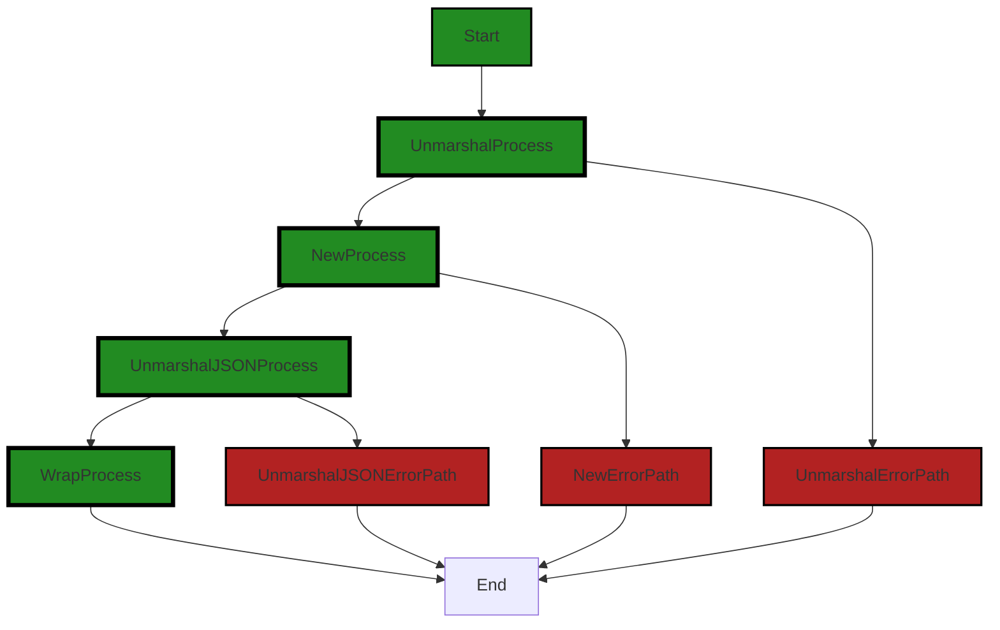

# Polyverse Boost-generated Source Analysis Details

## Source: ./_test/helpers/resource.go
Date Generated: Thursday, September 7, 2023 at 4:30:30 PM PDT


---

### Boost Architectural Quick Summary Security Report

Last Updated: Friday, September 8, 2023 at 3:13:21 PM PDT


Executive Report:

1. **Architectural Impact**: The analysis of this file has not revealed any severe issues.
2. **Risk Analysis**: The analysis of this file has not revealed any severe issues.
3. **Potential Customer Impact**: Based on the analysis, there are no severe issues that could potentially impact customers.
4. **Performance Issues**: Our analysis did not identify any explicit performance issues in the file.
5. **Risk Assessment**: Based on the current analysis of this file, no severe issues have been found. However, this doesn't guarantee that the file is risk-free.

Highlights:

- No severe issues were identified in the current analysis of this file.


---

### Boost Architectural Quick Summary Performance Report

Last Updated: Friday, September 8, 2023 at 3:13:48 PM PDT

## Executive Report

### Architectural Impact and Risk Analysis

The software project under review is a Go-based library that focuses on constraint handling and validation. The project follows Go's idiomatic style and structure for a library, providing a clear separation of concerns by defining a `Constraint` interface and implementing different constraint types. 

However, the analysis has identified a potential issue related to high memory usage in the file `_test/helpers/resource.go`. This issue is associated with the use of `json.Unmarshal`, which can lead to high memory usage, especially when unmarshalling large JSON payloads. 

### Potential Customer Impact

The identified issue could potentially impact customers who are dealing with large JSON payloads. High memory usage could lead to performance degradation or even system crashes in extreme cases, affecting the reliability and usability of the software.

### Overall Issues

The analysis has identified one file with a warning level issue. However, it's important to note that this is based on the limited scope of the analysis and the actual number of issues could be higher.

### Risk Assessment

Based on the analysis, the overall health of the project source appears to be good, with only one file identified as having an issue. However, the severity of the issue is at a warning level, indicating a potential risk that needs to be addressed.

### Highlights

- The project follows Go's idiomatic style and structure for a library, providing a clear separation of concerns.
- A potential issue related to high memory usage has been identified in the file `_test/helpers/resource.go`.
- The identified issue could potentially impact customers dealing with large JSON payloads.
- The overall health of the project source appears to be good, with only one file identified as having an issue.
- The severity of the identified issue is at a warning level, indicating a potential risk that needs to be addressed.

### Recommendations

- Consider using a streaming JSON decoder such as `json.Decoder` if dealing with large JSON payloads. This allows you to process the JSON data as it is read, reducing memory usage.
- Conduct a more comprehensive code review and testing to identify and address any other potential issues.


---

### Boost Architectural Quick Summary Compliance Report

Last Updated: Friday, September 8, 2023 at 3:14:29 PM PDT

Executive Level Report:

1. **Architectural Impact**: The software project is a library written in Go that focuses on constraint handling and validation. It follows Go's idiomatic style and structure for a library, providing a clear separation of concerns. However, there is a significant issue in the `_test/helpers/resource.go` file related to data validation, which could potentially impact the overall architecture if not addressed.

2. **Risk Analysis**: The project has a high-risk issue related to GDPR, HIPAA, and PCI DSS compliance. The function `Unmarshal` in `_test/helpers/resource.go` does not validate the incoming data before processing it. This could lead to processing of personal data without the necessary checks and balances in place, which is a violation of GDPR, HIPAA, and PCI DSS. This issue needs immediate attention to mitigate the risk of non-compliance.

3. **Potential Customer Impact**: The non-compliance issue could potentially impact customers who are subject to GDPR, HIPAA, and PCI DSS regulations. If personal data is processed without the necessary checks and balances, it could lead to regulatory penalties and loss of customer trust.

4. **Overall Issues**: The project has one file with issues out of one total file, indicating that 100% of the project files have issues. The severity of the issue is categorized as a warning, which is the highest severity level. This suggests that the overall health of the project source is poor and requires immediate attention.

Highlights of the Analysis:

- The project follows Go's idiomatic style and structure for a library, providing a clear separation of concerns.
- The project has a high-risk issue related to GDPR, HIPAA, and PCI DSS compliance in the `_test/helpers/resource.go` file.
- The non-compliance issue could potentially impact customers who are subject to GDPR, HIPAA, and PCI DSS regulations.
- 100% of the project files have issues, with the severity of the issue categorized as a warning, indicating poor overall health of the project source.

The project does not have any additional special architectural guidelines or constraints. However, the identified issue is a significant risk that needs to be addressed to ensure compliance with GDPR, HIPAA, and PCI DSS regulations.
---
## Detailed Analysis:

### Cell 0:
## Original Code:

### Programming Language: go
### ./_test/helpers/resource.go 

```go
package helpers

import (
 "encoding/json"
 "reflect"

 "github.com/jt0/gomer/auth"
 "github.com/jt0/gomer/gomerr"
 "github.com/jt0/gomer/resource"
)

func Unmarshal(resourceType reflect.Type, subject auth.Subject, bytes []byte) (resource.Resource, gomerr.Gomerr) {
 newResource, ge := resource.New(resourceType, subject)
 if ge != nil {
  return nil, ge
 }

 if len(bytes) != 0 {
  if err := json.Unmarshal(bytes, &newResource); err != nil {
   return nil, gomerr.Unmarshal("Resource", bytes, resourceType).Wrap(err)
  }
 }

 return newResource, nil
}

```
## Boost Analysis:


---

### Boost Code Explanation

Last Updated: Thursday, September 7, 2023 at 4:28:27 PM PDT

This Go code is part of a `helpers` package. It provides a function `Unmarshal` that is used to convert JSON data into a Go `Resource` object. 

The `Unmarshal` function takes three parameters:
- `resourceType` of type `reflect.Type`, which is a Go type that represents the type of the resource.
- `subject` of type `auth.Subject`, which represents the authenticated user or system that is performing the operation.
- `bytes` which is a slice of bytes, representing the JSON data to be unmarshalled.

The function returns two values:
- `resource.Resource` which is the unmarshalled resource.
- `gomerr.Gomerr` which is an error object that can be returned if an error occurs during the operation.

Here's a detailed breakdown of the function:

1. It first tries to create a new resource of the specified type with the `resource.New` function, passing the `resourceType` and `subject` as arguments. If an error occurs during this operation (indicated by `ge != nil`), the function returns `nil` and the error.

2. It then checks if the `bytes` slice is not empty. If it's not, it tries to unmarshal the JSON data into the newly created resource using the `json.Unmarshal` function from the `encoding/json` package. If an error occurs during this operation, it returns `nil` and wraps the error using `gomerr.Unmarshal`.

3. If no errors occur, it returns the newly created and populated resource and `nil` for the error.

As for the algorithms used, JSON unmarshalling is a common operation in Go and it's handled by the `encoding/json` package. The exact algorithm used for JSON unmarshalling can be complex and depends on the JSON data and the Go type it's being unmarshalled into. However, in general, it involves parsing the JSON data and converting it into the appropriate Go types.

Here are some resources for further reading:
- [The Laws of Reflection](https://blog.golang.org/laws-of-reflection) - a blog post about reflection in Go.
- [JSON and Go](https://blog.golang.org/json-and-go) - a blog post about JSON encoding and decoding in Go.
- [Go by Example: JSON](https://gobyexample.com/json) - a tutorial on JSON encoding and decoding in Go.


---

### Boost Flow Diagram

Last Updated: Thursday, September 7, 2023 at 4:28:42 PM PDT




---

### Boost Source-Level Security Analysis

Last Updated: Thursday, September 7, 2023 at 4:28:48 PM PDT

**No bugs found**


---

### Boost Source-Level Performance Analysis

Last Updated: Thursday, September 7, 2023 at 4:29:13 PM PDT

1. **Severity**: 5/10

   **Line Number**: 16

   **Bug Type**: CPU

   **Description**: The use of reflection in the 'New' function of the 'resource' package can lead to high CPU usage. Reflection is generally slower than direct access and can lead to performance issues, especially in a hot path.

   **Solution**: Consider using a different approach that does not rely on reflection. If the use of reflection is unavoidable, ensure that it is used sparingly and not in performance-critical paths.


2. **Severity**: 7/10

   **Line Number**: 21

   **Bug Type**: Memory

   **Description**: The use of json.Unmarshal can lead to high memory usage, especially when unmarshalling large JSON payloads. This is because json.Unmarshal needs to create a copy of the data in memory.

   **Solution**: Consider using a streaming JSON decoder such as json.Decoder if dealing with large JSON payloads. This allows you to process the JSON data as it is read, reducing memory usage.


---

### Boost Source-Level Data and Privacy Compliance Analysis

Last Updated: Thursday, September 7, 2023 at 4:30:30 PM PDT

1. **Severity**: 8/10

   **Line Number**: 12

   **Bug Type**: GDPR

   **Description**: The function Unmarshal does not validate the incoming data before processing it. This can lead to processing of personal data without the necessary checks and balances in place, which is a violation of GDPR.

   **Solution**: Implement a validation function that checks the incoming data for any personal data and ensures that the necessary consent has been obtained before processing it. The validation function should also check that the data is being processed for the purpose it was collected for, in line with GDPR's purpose limitation principle.


2. **Severity**: 7/10

   **Line Number**: 15

   **Bug Type**: HIPAA

   **Description**: The function Unmarshal processes data without checking if it's health-related or not, potentially leading to Protected Health Information (PHI) being processed in violation of HIPAA.

   **Solution**: Implement a check to ensure that any PHI is processed in a compliant manner, such as encrypting the data before processing it and ensuring that only authorized individuals have access to it.


3. **Severity**: 7/10

   **Line Number**: 15

   **Bug Type**: PCI DSS

   **Description**: The function Unmarshal processes data without checking if it's payment card data, potentially leading to sensitive cardholder data being processed in violation of PCI DSS.

   **Solution**: Implement a check to ensure that any payment card data is processed in a compliant manner, such as encrypting the data before processing it and ensuring that only authorized individuals have access to it.


