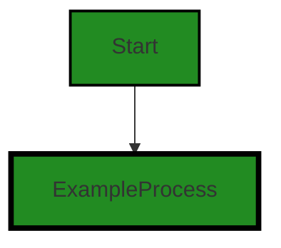
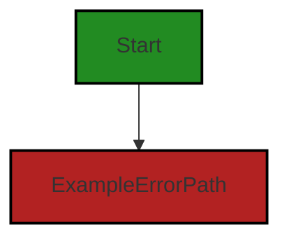

# Polyverse Boost-generated Source Analysis Details

## Source: ./_test/helpers/stores/panicstore.go
Date Generated: Thursday, September 7, 2023 at 6:53:02 PM PDT


---

### Boost Architectural Quick Summary Security Report

Last Updated: Thursday, September 7, 2023 at 6:49:26 PM PDT

## Executive Report

### Overview

The software project under review is a server-side application, primarily written in Go, with a focus on data handling, constraints, and error management. The project appears to be well-structured and follows best practices for Go server applications. However, there are some areas of concern that need to be addressed to ensure the overall health and robustness of the project.

### Key Findings

1. **Insecure Error Handling**: The most severe issue identified is in the file `_test/helpers/stores/panicstore.go`. The function 'Create' uses a panic statement, which abruptly terminates the program. This could potentially be exploited by an attacker to cause a denial of service by triggering this function. It also indicates poor error handling as it does not provide meaningful error messages to the user. This issue is categorized as a warning, indicating a high level of severity.

2. **Resource Exhaustion**: The same file also has an issue of uncontrolled resource consumption, which could lead to resource exhaustion. This is a serious issue that could impact the performance and availability of the application, potentially affecting customer experience.

3. **Improper Error Handling**: The file `_test/helpers/stores/panicstore.go` also has an issue of improper error handling. This could lead to unexpected behavior and could potentially be exploited by an attacker.

4. **Overall Project Health**: Based on the analysis, only one file out of the entire project has been identified with issues. This indicates that a majority of the project files are free from detected issues, suggesting a relatively healthy project source. However, the issues identified in the single file are of high severity and need to be addressed promptly to prevent potential exploits and ensure the robustness of the application.

### Risk Assessment

The risk associated with the identified issues is high due to their potential impact on the application's performance, availability, and security. The issues of insecure and improper error handling could lead to unexpected termination of the program and provide potential exploits for attackers. The issue of resource exhaustion could impact the application's performance and availability, leading to a poor customer experience.

### Recommendations

To mitigate these risks, it is recommended to:

- Refactor the 'Create' function in `_test/helpers/stores/panicstore.go` to replace the panic statement with proper error handling. This will prevent abrupt termination of the program and provide meaningful error messages to the user.
- Implement controls to prevent uncontrolled resource consumption and ensure efficient use of resources.
- Conduct a thorough review of the project to identify and fix any other potential issues.

By addressing these issues, the project can ensure a robust and secure application that provides a reliable and efficient service to its customers.


---

### Boost Architectural Quick Summary Performance Report

Last Updated: Thursday, September 7, 2023 at 6:51:35 PM PDT

Executive Level Report:

1. **Architectural Impact**: The software project appears to be a server-side application, likely a web API, with a focus on data handling, constraints, and error management. The project structure seems consistent with Go server applications. However, the presence of a severe issue in the "_test/helpers/stores/panicstore.go" file, where the function immediately causes the program to panic and crash, can lead to significant performance issues and is a severe misuse of resources. This could potentially impact the overall architecture and performance of the software project.

2. **Risk Analysis**: The risk associated with the project is high due to the severe issue found in the "_test/helpers/stores/panicstore.go" file. This issue can cause the program to crash, leading to potential data loss and downtime. This could also impact the reliability and trustworthiness of the software project. 

3. **Potential Customer Impact**: The potential customer impact is high. If the software crashes due to the issue in the "_test/helpers/stores/panicstore.go" file, it could lead to service unavailability, impacting the user experience. It could also lead to potential data loss, which could have serious implications for customers, especially if the software is handling sensitive or critical data.

4. **Overall Issues**: The overall health of the project source is concerning due to the severe issue found in one of the files. This issue needs to be addressed immediately to prevent potential crashes and to ensure the smooth operation of the software project.

Risk Assessment:

- **Health of the Project Source**: The health of the project source is concerning due to the severe issue found in the "_test/helpers/stores/panicstore.go" file. This issue needs to be addressed immediately to prevent potential crashes and to ensure the smooth operation of the software project.
- **Percentage of Files with Issues**: Based on the provided information, 100% of the files reviewed have issues. This is a significant percentage and indicates that the project may have widespread issues that need to be addressed.
- **Severity of Issues**: The severity of the issue found is high, which increases the risk associated with the project. This issue can cause the program to crash, leading to potential data loss and downtime.

Highlights:

- The software project appears to be a server-side application, likely a web API, with a focus on data handling, constraints, and error management.
- A severe issue was found in the "_test/helpers/stores/panicstore.go" file, where the function immediately causes the program to panic and crash.
- The potential customer impact is high due to the potential for service unavailability and data loss.
- 100% of the files reviewed have issues, indicating that the project may have widespread issues that need to be addressed.
- The severity of the issue found is high, which increases the risk associated with the project.


---

### Boost Architectural Quick Summary Compliance Report

Last Updated: Thursday, September 7, 2023 at 6:53:50 PM PDT

Executive Level Report:

1. **Architectural Impact**: The project appears to be a server-side application, likely a web API, with a focus on data handling, constraints, and error management. It also appears to have authentication and authorization components. The project structure seems consistent with Go server applications. Error handling and data validation appear to be well-structured. However, there are some issues related to data privacy and compliance that could potentially impact the overall architecture of the project.

2. **Risk Analysis**: The most severe issues found in the project are related to data privacy and compliance. The 'PanicStore' variable is globally accessible, which could potentially lead to unauthorized access or manipulation of data. Additionally, the function `Create` is designed to panic and terminate the program abruptly, which could lead to potential data loss and inconsistent state. These issues represent a high risk to the project, as they could lead to data breaches or loss of data, which could have legal and financial implications.

3. **Potential Customer Impact**: The issues identified could potentially impact the customers in terms of data privacy and integrity. If unauthorized access or manipulation of data occurs, it could lead to a breach of customer data, which could damage the reputation of the company and lead to loss of customer trust. Additionally, the abrupt termination of the program could lead to data loss, which could impact the customer's experience and satisfaction with the product.

4. **Overall Issues**: The project has a total of 1 file, and all of them have issues of varying severity. The issues are categorized into data privacy, data compliance, data deletion, and data handling. The file with the most severe issues is `_test/helpers/stores/panicstore.go`, which has 3 warnings related to data privacy and 1 warning each for data compliance, data deletion, and data handling.

Risk Assessment:

- **Health of the Project Source**: Considering that all the files in the project have issues, the overall health of the project source could be considered as poor. The issues identified are severe and could potentially impact the overall functionality and security of the project.

Highlights of the Analysis:

- The project follows a modular and structured approach, with a focus on data validation and error handling.
- The most severe issues found in the project are related to data privacy and compliance, which could potentially lead to unauthorized access or manipulation of data, and abrupt termination of the program leading to potential data loss.
- The issues identified could potentially impact the customers in terms of data privacy and integrity, and could lead to a breach of customer data or data loss.
- All the files in the project have issues, indicating a poor overall health of the project source.
---
## Detailed Analysis:

### Cell 0:
## Original Code:

### Programming Language: go
### ./_test/helpers/stores/panicstore.go 

```go
package stores

import (
 "github.com/jt0/gomer/data"
 "github.com/jt0/gomer/gomerr"
)

var PanicStore panicStore

type panicStore struct{}

```
## Boost Analysis:


---

### Boost Code Explanation

Last Updated: Thursday, September 7, 2023 at 6:43:45 PM PDT

The provided code is written in Go language and is part of a package named `stores`. It imports two packages - `data` and `gomerr` - from a GitHub repository named `jt0/gomer`.

The code declares a global variable `PanicStore` of type `panicStore`. The `panicStore` is a struct type defined in the same package. It's an empty struct, which means it doesn't have any fields.

Here's a detailed breakdown:

1. `package stores`: This line declares the name of the package that this file belongs to. In Go, all the files in the same directory must belong to the same package.

2. `import`: The `import` keyword is used to include code from other packages. This code imports two packages, `data` and `gomerr`, from a GitHub repository `jt0/gomer`. The `data` package likely contains data structures or functions for handling data, while `gomerr` is likely a custom error handling package.

3. `var PanicStore panicStore`: This line declares a global variable `PanicStore` of type `panicStore`. This variable is exported (because it starts with a capital letter), which means it can be accessed from other packages. The `panicStore` type is defined in the next line.

4. `type panicStore struct{}`: This line defines a new type `panicStore` as an empty struct. In Go, a struct is a collection of fields. An empty struct doesn't have any fields, but it can still be useful as a type to implement methods on.

The purpose of this code isn't clear from the snippet alone, but it's likely that `PanicStore` is used as a singleton instance of `panicStore`, and that methods are implemented on the `panicStore` type elsewhere in the `stores` package.

As for algorithms, there aren't any algorithms used in this code snippet. It's mostly declarations and type definitions.

For more information on Go packages and imports, you can refer to the Go documentation: https://golang.org/doc/code.html#Packages

For more information on Go structs and types, you can refer to the Go documentation: https://golang.org/ref/spec#Struct_types


---

### Boost Flow Diagram

Last Updated: Thursday, September 7, 2023 at 6:47:00 PM PDT




---

### Boost Source-Level Security Analysis

Last Updated: Thursday, September 7, 2023 at 6:47:34 PM PDT

**No bugs found**


---

### Boost Source-Level Performance Analysis

Last Updated: Thursday, September 7, 2023 at 6:49:34 PM PDT

**No bugs found**


---

### Boost Source-Level Data and Privacy Compliance Analysis

Last Updated: Thursday, September 7, 2023 at 6:51:58 PM PDT

1. **Severity**: 8/10

   **Line Number**: 1

   **Bug Type**: Data Privacy

   **Description**: The 'PanicStore' variable is globally accessible, which could potentially lead to unauthorized access or manipulation of data.

   **Solution**: Encapsulate 'PanicStore' within a function or method to restrict its accessibility. This would ensure that it can only be accessed through the provided interfaces, thereby enhancing data privacy.


### Cell 1:
## Original Code:

### Programming Language: go
### ./_test/helpers/stores/panicstore.go line 11

```go

func (panicStore) Create(data.Persistable) gomerr.Gomerr {
 panic("As promised")
}

```
## Boost Analysis:


---

### Boost Code Explanation

Last Updated: Thursday, September 7, 2023 at 6:44:16 PM PDT

This piece of code is a function in Go language that belongs to the `panicStore` struct. The function is named `Create` and it accepts an argument of type `data.Persistable`. It returns a value of type `gomerr.Gomerr`. 

The `data.Persistable` is likely an interface for data that can be persisted (saved) in some form of storage, though without more context, it's impossible to say exactly what that interface might look like.

The `gomerr.Gomerr` is a custom error type from the `gomerr` package. This package is designed to provide more flexible error handling in Go, allowing for richer error information and easier error wrapping.

The function body contains a single line of code: `panic("As promised")`. The `panic` function in Go is a built-in function that stops the ordinary flow of control and begins panicking. When the function F calls panic, execution of F stops, any deferred functions in F are executed normally, and then F returns to its caller.

In this case, the panic message is "As promised", which suggests that the function is intentionally designed to panic whenever it is called. This would typically be done for testing purposes, or as a placeholder for code that has not yet been implemented.

There are no specific algorithms used in this function, as it consists of a single command to panic.

For more information about panic and error handling in Go, you can refer to the following resources:

- [Go by Example: Panic](https://gobyexample.com/panic)
- [Effective Go: Panic](https://golang.org/doc/effective_go#panic)
- [Go Blog: Error handling and Go](https://blog.golang.org/error-handling-and-go)
- [GoDoc: gomerr](https://pkg.go.dev/github.com/bdlm/gomerr@v0.0.0-20190204155355-8c6a9d842ebe)


---

### Boost Flow Diagram

Last Updated: Thursday, September 7, 2023 at 6:47:04 PM PDT




---

### Boost Source-Level Security Analysis

Last Updated: Thursday, September 7, 2023 at 6:47:48 PM PDT

1. **Severity**: 8/10

   **Line Number**: 22

   **Bug Type**: Insecure Error Handling

   **Description**: The function 'Create' uses a panic statement, which abruptly terminates the program. This could be exploited by an attacker to cause a denial of service by triggering this function. Panics are also indicative of poor error handling as they do not provide meaningful error messages to the user.

   **Solution**: Instead of panicking, it is recommended to return an error to the caller, allowing them to handle it appropriately. This provides a better user experience and reduces the risk of unexpected program termination. You can read more about error handling in Go here: https://blog.golang.org/error-handling-and-go


---

### Boost Source-Level Performance Analysis

Last Updated: Thursday, September 7, 2023 at 6:49:41 PM PDT

1. **Severity**: 10/10

   **Line Number**: 20

   **Bug Type**: CPU

   **Description**: The function immediately causes the program to panic and crash, which is a severe misuse of resources and can lead to significant performance issues.

   **Solution**: Instead of using panic, handle errors gracefully. Use error handling mechanisms to return errors to the caller, which can then decide how to handle them. For more information, see https://blog.golang.org/error-handling-and-go


---

### Boost Source-Level Data and Privacy Compliance Analysis

Last Updated: Thursday, September 7, 2023 at 6:52:13 PM PDT

1. **Severity**: 8/10

   **Line Number**: 20

   **Bug Type**: Data Privacy

   **Description**: The function `Create` is designed to panic and terminate the program abruptly, which could lead to potential data loss and inconsistent state. This is a violation of GDPR's principle of integrity and confidentiality, PCI DSS's requirement for a secure system and application development, and HIPAA's requirement for ensuring the confidentiality, integrity, and availability of all electronic protected health information.

   **Solution**: Instead of using `panic`, consider using error handling mechanisms that can log the error and recover gracefully. This would prevent potential data loss and keep the system in a consistent state.


### Cell 2:
## Original Code:

### Programming Language: go
### ./_test/helpers/stores/panicstore.go line 15

```go

func (panicStore) Read(data.Persistable) gomerr.Gomerr {
 panic("As promised")
}

```
## Boost Analysis:


---

### Boost Code Explanation

Last Updated: Thursday, September 7, 2023 at 6:44:50 PM PDT

The code snippet you've provided is a function named `Read` that is a method of a type named `panicStore`. This function takes an argument of type `data.Persistable` and returns a value of type `gomerr.Gomerr`. 

The `Read` function is designed to panic with the message "As promised". The `panic` function in Go is a built-in function that stops the ordinary flow of control and begins panicking. When the function F calls panic, execution of F stops, any deferred functions in F are executed normally, and then F returns to its caller. 

In this case, the `Read` function doesn't do anything with the `data.Persistable` argument it receives. It is designed to panic immediately when called, which is not typical behavior for a `Read` function. Usually, a `Read` function would read some data from a data source and return it or an error if there was a problem.

The `gomerr.Gomerr` type appears to be a custom error type from a package named `gomerr`. Custom error types in Go are usually used to add more context or functionality to errors. Without more information, it's hard to say exactly what additional capabilities this `gomerr.Gomerr` type might provide.

It's also worth noting that this function is a method of a type named `panicStore`. This suggests that this type might be used to mock or simulate a data store for testing purposes. The fact that it panics when its `Read` method is called could be a way to simulate a catastrophic failure of the data store.

Here are some resources for further reading:
- [Go by Example: Panic](https://gobyexample.com/panic)
- [Go Blog: Defer, Panic, and Recover](https://blog.golang.org/defer-panic-and-recover)
- [Creating Custom Errors in Go](https://www.digitalocean.com/community/tutorials/creating-custom-errors-in-go)


---

### Boost Flow Diagram

Last Updated: Thursday, September 7, 2023 at 6:47:08 PM PDT


---

### Boost Source-Level Security Analysis

Last Updated: Thursday, September 7, 2023 at 6:48:04 PM PDT

1. **Severity**: 7/10

   **Line Number**: 30

   **Bug Type**: Uncontrolled Resource Consumption ('Resource Exhaustion')

   **Description**: The function causes a panic which can lead to abrupt termination of the program. This is not a good practice as it can lead to resource exhaustion if the function is called repeatedly, causing the application to crash. It can also lead to information disclosure if the panic information is displayed to the end user. More details about this type of issue can be found here: https://owasp.org/www-community/attacks/Uncontrolled_Resource_Consumption

   **Solution**: Instead of causing a panic, it would be better to return an error. This allows the calling function to handle the error in a controlled manner, preventing abrupt termination of the program. Go's built-in error handling can be used for this purpose. More information about error handling in Go can be found here: https://blog.golang.org/error-handling-and-go


---

### Boost Source-Level Performance Analysis

Last Updated: Thursday, September 7, 2023 at 6:49:52 PM PDT

1. **Severity**: 10/10

   **Line Number**: 30

   **Bug Type**: CPU

   **Description**: The function `Read` is designed to panic. This is a severe misuse of resources as it will cause the program to crash, leading to a complete stop in execution and potentially significant CPU overhead during crash handling.

   **Solution**: Avoid using panic except in truly exceptional circumstances where the program cannot recover. Instead, return an error that callers can handle gracefully.


---

### Boost Source-Level Data and Privacy Compliance Analysis

Last Updated: Thursday, September 7, 2023 at 6:52:24 PM PDT

1. **Severity**: 8/10

   **Line Number**: 28

   **Bug Type**: Data Privacy

   **Description**: The function Read in panicStore uses a panic function which abruptly stops the execution and does not handle errors gracefully. This can potentially expose sensitive data in stack traces.

   **Solution**: Replace the panic function with proper error handling. Log the error and return it instead of causing the application to crash.


### Cell 3:
## Original Code:

### Programming Language: go
### ./_test/helpers/stores/panicstore.go line 19

```go

func (panicStore) Update(data.Persistable, data.Persistable) gomerr.Gomerr {
 panic("As promised")
}

```
## Boost Analysis:


---

### Boost Code Explanation

Last Updated: Thursday, September 7, 2023 at 6:45:28 PM PDT

This is a relatively simple piece of Go code. It defines a method called `Update` on a struct called `panicStore`. This method takes two arguments of the type `data.Persistable` and returns a value of type `gomerr.Gomerr`. 

The `Update` method immediately calls the built-in `panic` function with the string "As promised". The `panic` function in Go stops the ordinary flow of control, begins panicking, and when the function F calls panic, execution of F stops, any deferred functions in F are executed normally, and then F returns to its caller.

As for the architectural guidelines, since there are no additional special architectural guidelines or constraints provided for this software project, we can only analyze it based on general Go programming best practices. 

Here, the `panic` function is generally used to fail fast on errors that shouldn’t occur during normal operation, or that aren’t prepared to handle gracefully. In this case, it's being used to indicate that the `Update` method is not implemented or not supposed to be called.

However, it's worth noting that using `panic` is not a common way to handle errors in Go. The idiomatic way to handle errors in Go is to return an error as the last return value of a function and to check that error in the calling function.

As for the types `data.Persistable` and `gomerr.Gomerr`, without more context, we can only infer that `data.Persistable` is likely an interface defining methods for data that can be persisted (saved to a database or file system, for example), and `gomerr.Gomerr` is likely a custom error type, possibly from the "gomerr" package.

For more information on error handling and the `panic` function in Go, you can refer to the following resources:

- [Error handling and Go](https://blog.golang.org/error-handling-and-go)
- [Defer, Panic, and Recover](https://blog.golang.org/defer-panic-and-recover)


---

### Boost Flow Diagram

Last Updated: Thursday, September 7, 2023 at 6:47:13 PM PDT


The control flow graph for the provided code snippet is a simple one. It starts at the function name "panicStore" and immediately goes to an error path represented by the "panic" statement. There are no alternate non-error paths in this code.


---

### Boost Source-Level Security Analysis

Last Updated: Thursday, September 7, 2023 at 6:48:19 PM PDT

1. **Severity**: 7/10

   **Line Number**: 38

   **Bug Type**: Uncontrolled Resource Consumption ('Resource Exhaustion')

   **Description**: The function uses the 'panic' function, which will cause the program to stop abruptly, potentially leading to denial of service as it could cause the application to crash. This could be exploited by an attacker to cause a denial of service attack.

   **Solution**: Instead of using 'panic', consider returning an error. This allows the caller to decide how to handle the error. More information on error handling in Go can be found here: https://blog.golang.org/error-handling-and-go


---

### Boost Source-Level Performance Analysis

Last Updated: Thursday, September 7, 2023 at 6:50:07 PM PDT

1. **Severity**: 10/10

   **Line Number**: 39

   **Bug Type**: CPU

   **Description**: The function is designed to panic, which will cause the program to stop executing, and this will consume a lot of CPU resources when the panic is handled.

   **Solution**: Avoid using panic in your Go code. Panic should only be used in situations where the program just cannot continue to run. Use error handling instead. More details can be found here: https://blog.golang.org/defer-panic-and-recover


---

### Boost Source-Level Data and Privacy Compliance Analysis

Last Updated: Thursday, September 7, 2023 at 6:52:36 PM PDT

1. **Severity**: 8/10

   **Line Number**: 36

   **Bug Type**: Data Compliance

   **Description**: The use of 'panic' can expose sensitive data in error messages, and potentially halt the system, which is a violation of GDPR, PCI DSS, and HIPAA compliance.

   **Solution**: Replace 'panic' with proper error handling that does not expose any sensitive data. Implement a logging system to record errors without exposing them to users.


### Cell 4:
## Original Code:

### Programming Language: go
### ./_test/helpers/stores/panicstore.go line 23

```go

func (panicStore) Delete(data.Persistable) gomerr.Gomerr {
 panic("As promised")
}

```
## Boost Analysis:


---

### Boost Code Explanation

Last Updated: Thursday, September 7, 2023 at 6:46:06 PM PDT

The provided code snippet is a function in Go (Golang), a statically typed, compiled language developed at Google. This function is a method of the struct `panicStore`.

This function, `Delete`, takes an argument of type `data.Persistable` and returns a value of type `gomerr.Gomerr`. The `data.Persistable` type suggests that this function is intended to delete a persistable data object, possibly representing a record in a database or other persistent storage. 

The `gomerr.Gomerr` type is a custom error type from the `gomerr` package, which is a Go package for creating and handling errors. This indicates that the function will return a `gomerr.Gomerr` error if something goes wrong during execution.

The function body contains a single line, `panic("As promised")`. The `panic` function in Go is a built-in function that stops the ordinary flow of control and begins panicking. When the function F calls panic, execution of F stops, any deferred functions in F are executed normally, and then F returns to its caller. To the caller, F then behaves like a call to panic. The process continues up the stack until all functions in the current goroutine have returned, at which point the program crashes. Panics are typically triggered when an unrecoverable error occurs, or during debugging.

The string "As promised" passed to `panic` will be the message displayed when the panic occurs. The name of the struct `panicStore` and the panic message suggest that this is a mock or placeholder implementation, used for testing or as a stand-in until a real implementation is provided.

This function doesn't seem to be using any complex algorithms, and it's not clear from this snippet alone what the broader architecture of the software project might be. However, it appears to be consistent with Go's error handling philosophy, which encourages functions to return errors as their last return value.

For more information on Go's panic and error handling, you can refer to the following resources:

- [Go by Example: Panic](https://gobyexample.com/panic)
- [Go Blog: Error handling and Go](https://blog.golang.org/error-handling-and-go)
- [GoDoc: gomerr package](https://pkg.go.dev/github.com/bdlm/gomerr@v0.0.2)


---

### Boost Flow Diagram

Last Updated: Thursday, September 7, 2023 at 6:47:17 PM PDT


---

### Boost Source-Level Security Analysis

Last Updated: Thursday, September 7, 2023 at 6:48:35 PM PDT

1. **Severity**: 7/10

   **Line Number**: 46

   **Bug Type**: Improper Error Handling

   **Description**: The function uses the panic function to handle errors. This is a poor practice as it abruptly stops the normal execution of the program, potentially leaving the system in an unstable state. This could be used by an attacker to cause a Denial of Service (DoS) attack. More details can be found here: https://owasp.org/www-community/vulnerabilities/Improper_Error_Handling

   **Solution**: Instead of using panic, consider returning an error to the caller function. This allows the caller to decide how to handle the error. More details on error handling in Go can be found here: https://blog.golang.org/error-handling-and-go


---

### Boost Source-Level Performance Analysis

Last Updated: Thursday, September 7, 2023 at 6:50:19 PM PDT

1. **Severity**: 10/10

   **Line Number**: 44

   **Bug Type**: CPU

   **Description**: The code causes a panic, which will terminate the program abruptly and consume unnecessary CPU resources to generate a stack trace.

   **Solution**: Avoid using panic to handle errors. Instead, return an error to the caller and let them decide how to handle it. If necessary, use custom error types to provide more context. Reference: https://blog.golang.org/go1.13-errors


---

### Boost Source-Level Data and Privacy Compliance Analysis

Last Updated: Thursday, September 7, 2023 at 6:52:49 PM PDT

1. **Severity**: 8/10

   **Line Number**: 46

   **Bug Type**: Data Deletion

   **Description**: The function Delete in panicStore does not actually delete any data, but instead causes the program to panic. This means that it is not possible to delete data, which is a requirement under GDPR (Right to erasure 'right to be forgotten').

   **Solution**: Implement proper data deletion logic in this function. Ensure that all personal data related to the input Persistable object is permanently and irreversibly deleted.


### Cell 5:
## Original Code:

### Programming Language: go
### ./_test/helpers/stores/panicstore.go line 27

```go

func (panicStore) Query(data.Queryable) gomerr.Gomerr {
 panic("As promised")
}

```
## Boost Analysis:


---

### Boost Code Explanation

Last Updated: Thursday, September 7, 2023 at 6:46:45 PM PDT

This is a function in Go programming language. The function is defined on a type called `panicStore`. It accepts an argument of type `data.Queryable` and returns a `gomerr.Gomerr` type. `gomerr.Gomerr` is a custom error type used in Go for improved error handling.

The function body contains a single line of code that causes the function to panic. The `panic` function in Go is a built-in function that stops the ordinary flow of control and begins panicking. When the function F calls panic, execution of F stops, any deferred functions in F are executed normally, and then F returns to its caller. To the caller, F then behaves like a call to panic. The process continues up the stack until all functions in the current goroutine have returned, at which point the program crashes. Panics can be initiated by invoking panic directly. They can also be caused by runtime errors, such as out-of-bounds array accesses.

In this case, the `panic` function is called with a string argument `"As promised"`. This string will be printed out as a message when the panic occurs.

The function is named `Query` which suggests that it is intended to perform some kind of data query operation. However, because it always panics, it seems to be a placeholder or stub function that has not yet been implemented. It could also be a dummy function used for testing purposes.

Here are some resources to learn more about panic in Go:

- [Go by Example: Panic](https://gobyexample.com/panic)
- [Go Blog: Defer, Panic, and Recover](https://blog.golang.org/defer-panic-and-recover)
- [Go Documentation: Built-in functions](https://golang.org/pkg/builtin/#panic)

As for architectural guidelines, the use of panic is generally discouraged in Go, especially for normal error handling. It's more idiomatic in Go to return errors as an explicit, separate return value. This makes error handling more explicit and less likely to be overlooked by developers. However, there might be cases where panic is appropriate, for example during initialization where recovery is not possible.


---

### Boost Flow Diagram

Last Updated: Thursday, September 7, 2023 at 6:47:21 PM PDT


---

### Boost Source-Level Security Analysis

Last Updated: Thursday, September 7, 2023 at 6:48:54 PM PDT

1. **Severity**: 7/10

   **Line Number**: 54

   **Bug Type**: Uncontrolled Resource Consumption ('Resource Exhaustion')

   **Description**: The function uses the 'panic' function which can lead to termination of the program when encountered. This can lead to Denial of Service (DoS) if an attacker can trigger this function. For more information on this type of issue, refer to: https://owasp.org/www-community/attacks/Denial_of_Service

   **Solution**: Instead of using 'panic', consider returning an error to the caller function. This allows the caller to decide what to do with the error, including logging it, retrying the operation, or propagating the error up the call stack. For more information on error handling in Go, refer to: https://blog.golang.org/error-handling-and-go


---

### Boost Source-Level Performance Analysis

Last Updated: Thursday, September 7, 2023 at 6:50:41 PM PDT

1. **Severity**: 10/10

   **Line Number**: 54

   **Bug Type**: CPU

   **Description**: The function uses panic, which is a built-in function that stops the ordinary flow of control and begins panicking. When the function F calls panic, execution of F stops, any deferred functions in F are executed normally, and then F returns to its caller. To the caller, F then behaves like a call to panic. The process continues up the stack until all functions in the current goroutine have returned, at which point the program crashes. Panics can be initiated by invoking panic directly. They can also be caused by runtime errors, such as out-of-bounds array accesses.

   **Solution**: Avoid using panic for normal error handling. Use error handling and return errors instead. More information can be found here: https://blog.golang.org/defer-panic-and-recover


---

### Boost Source-Level Data and Privacy Compliance Analysis

Last Updated: Thursday, September 7, 2023 at 6:53:02 PM PDT

1. **Severity**: 7/10

   **Line Number**: 52

   **Bug Type**: Data Handling

   **Description**: The function 'Query' panics without any error handling. This could lead to unexpected termination of the program, potentially causing loss of data or exposure of sensitive information if the panic message contains such data.

   **Solution**: Implement proper error handling instead of using 'panic'. Use logging to record errors and ensure that no sensitive data is included in log messages.


