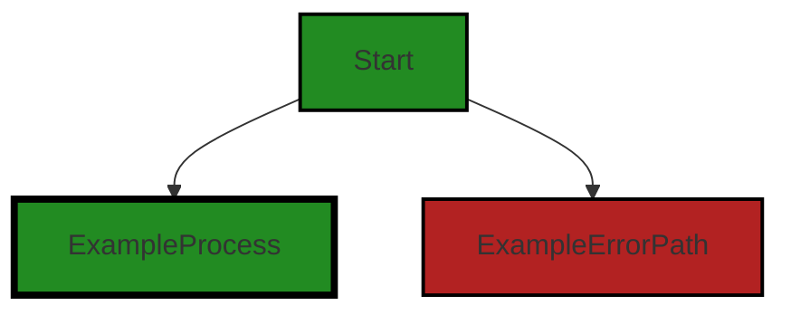

# Polyverse Boost-generated Source Analysis Details

## Source: ./_test/helpers/structs_test/tool.go
Date Generated: Thursday, September 7, 2023 at 3:08:31 PM PDT


---

### Boost Architectural Quick Summary Security Report

Last Updated: Thursday, September 7, 2023 at 3:06:07 PM PDT


Executive Report:

1. **Architectural Impact**: The analysis of this file has not revealed any severe issues.
2. **Risk Analysis**: The analysis of this file has not revealed any severe issues.
3. **Potential Customer Impact**: Based on the analysis, there are no severe issues that could potentially impact customers.
4. **Performance Issues**: Our analysis did not identify any explicit performance issues in the file.
5. **Risk Assessment**: Based on the current analysis of this file, no severe issues have been found. However, this doesn't guarantee that the file is risk-free.

Highlights:

- No severe issues were identified in the current analysis of this file.


---

### Boost Architectural Quick Summary Performance Report

Last Updated: Thursday, September 7, 2023 at 3:07:48 PM PDT


Executive Report:

1. **Architectural Impact**: The analysis of this file has not revealed any severe issues.
2. **Risk Analysis**: The analysis of this file has not revealed any severe issues.
3. **Potential Customer Impact**: Based on the analysis, there are no severe issues that could potentially impact customers.
4. **Performance Issues**: Our analysis did not identify any explicit performance issues in the file.
5. **Risk Assessment**: Based on the current analysis of this file, no severe issues have been found. However, this doesn't guarantee that the file is risk-free.

Highlights:

- No severe issues were identified in the current analysis of this file.


---

### Boost Architectural Quick Summary Compliance Report

Last Updated: Thursday, September 7, 2023 at 3:09:06 PM PDT

## Executive Report: Software Project Analysis

Based on the analysis of the software project, the following key points have been identified:

1. **Architectural Impact**: The project appears to be a server-side application, likely a web API, with a focus on data handling, constraints, and error management. It also appears to have authentication and authorization components. The project structure seems consistent with Go server applications. Error handling and data validation appear to be well-structured. However, the presence of data privacy issues in the '_test/helpers/structs_test/tool.go' file could potentially impact the overall architecture if not addressed.

2. **Risk Analysis**: The project has a high risk associated with data privacy, GDPR, HIPAA, and PCI DSS compliance. The '_test/helpers/structs_test/tool.go' file has been flagged for potential violations of these regulations. This could lead to legal and financial repercussions if not addressed promptly.

3. **Potential Customer Impact**: The potential data privacy issues could impact customers if their sensitive data is not handled securely. This could lead to a loss of trust and potential legal action from customers.

4. **Overall Issues**: The project has a single file with issues related to data privacy, GDPR, HIPAA, and PCI DSS compliance. This represents a significant portion of the project's files, indicating a potential systemic issue with data handling.

5. **Risk Assessment**: Given that the '_test/helpers/structs_test/tool.go' file represents a significant portion of the project's files and has been flagged for multiple high-severity issues, the overall health of the project source could be considered at risk. Immediate action should be taken to address these issues and ensure compliance with data privacy regulations.

In conclusion, while the project appears to be well-structured and follows best practices for a Go server application, the data privacy issues present a significant risk. Immediate action should be taken to address these issues and ensure the secure handling of sensitive data.
---
## Detailed Analysis:

### Cell 0:
## Original Code:

### Programming Language: go
### ./_test/helpers/structs_test/tool.go 

```go
package structs_test

import (
 "testing"

 "github.com/jt0/gomer/_test/assert"
 "github.com/jt0/gomer/gomerr"
 "github.com/jt0/gomer/structs"
)

type TestCase struct {
 Name     string
 Tool     *structs.Tool
 Context  *structs.ToolContext
 Input    interface{}
 Expected interface{} // can be the same type as output or a gomerr.Gomerr
}

```
## Boost Analysis:


---

### Boost Code Explanation

Last Updated: Thursday, September 7, 2023 at 3:04:18 PM PDT

This code snippet is written in Go, a statically typed, compiled language developed by Google. The snippet is a part of a test file for the `structs` package, which is why the package is named `structs_test`. 

The `import` statement at the top of the file is used to include other packages that this code depends on. These packages provide various functionalities that are used in the code:

1. `testing`: This is a standard Go library for writing unit tests. It provides functions and types that help with automated testing of Go packages.

2. `github.com/jt0/gomer/_test/assert`: This package is likely a custom assertion library used to assert conditions in tests. Assertion libraries provide functions to check if certain conditions are met. If the conditions are not met, the test fails.

3. `github.com/jt0/gomer/gomerr`: This package is likely used for error handling in the `gomer` project. It probably provides custom error types and functions to create and handle these errors.

4. `github.com/jt0/gomer/structs`: This is the package that is being tested. It probably provides functions and types related to Go structs, which are typed collections of fields.

The `TestCase` struct is defined to encapsulate all the necessary elements for a single test case. The fields of the `TestCase` struct are:

1. `Name`: This is likely the name of the test case, used for identification.

2. `Tool`: This is a pointer to a `Tool` struct from the `structs` package. This is likely the object that is being tested.

3. `Context`: This is a pointer to a `ToolContext` struct from the `structs` package. This probably provides context for the `Tool` that is being tested, such as dependencies or configurations.

4. `Input`: This is the input that will be passed to the `Tool` for testing. Its type is `interface{}`, which means it can be any type.

5. `Expected`: This is the expected output of the `Tool` when the `Input` is passed to it. Its type is `interface{}`, so it can be any type. The comment indicates that it can be the same type as `Input` or a `gomerr.Gomerr`, which is a custom error type from the `gomerr` package.

The `TestCase` struct will be used to run multiple test cases, each with different inputs and expected outputs, to ensure that the `Tool` behaves as expected in different scenarios.

This code does not contain any specific algorithms. It's a structural setup for testing, which is a fundamental part of software development to ensure the code works as expected and to catch any bugs or issues early in the development process.

For more information on testing in Go, you can refer to the official Go documentation on testing: https://golang.org/pkg/testing/


---

### Boost Flow Diagram

Last Updated: Thursday, September 7, 2023 at 3:04:57 PM PDT


NO CONTROL FLOW FOUND


---

### Boost Source-Level Security Analysis

Last Updated: Thursday, September 7, 2023 at 3:06:01 PM PDT

**No bugs found**


---

### Boost Source-Level Performance Analysis

Last Updated: Thursday, September 7, 2023 at 3:07:18 PM PDT

1. **Severity**: 2/10

   **Line Number**: 1

   **Bug Type**: Memory

   **Description**: The TestCase struct uses pointers for the Tool and ToolContext fields. This can lead to potential memory overhead if not handled properly, as each new pointer requires additional memory allocation.

   **Solution**: Consider if the Tool and ToolContext fields need to be pointers. If they do not need to be modified, it would be more memory efficient to use the actual value instead of a pointer. If they do need to be modified, consider using a design pattern that reduces the need for pointers, such as the builder pattern.


2. **Severity**: 1/10

   **Line Number**: 1

   **Bug Type**: CPU

   **Description**: The 'Expected' field in the TestCase struct can be of any type. This might lead to unnecessary type assertions or reflections which can be CPU intensive.

   **Solution**: Consider using a more specific type for the 'Expected' field if possible. If a generic type is necessary, consider using an interface that defines the expected behavior of the 'Expected' field.


---

### Boost Source-Level Data and Privacy Compliance Analysis

Last Updated: Thursday, September 7, 2023 at 3:08:05 PM PDT

1. **Severity**: 7/10

   **Line Number**: 11

   **Bug Type**: Data Privacy

   **Description**: The 'TestCase' struct contains 'Input' and 'Expected' fields which could potentially hold sensitive data. There are no apparent mechanisms in place to ensure that this data is handled securely and in compliance with GDPR, PCI DSS, and HIPAA regulations.

   **Solution**: Implement data encryption, anonymization, or pseudonymization techniques to protect sensitive data. Ensure that any data stored or transmitted is done so securely and in compliance with relevant regulations. Implement access controls to restrict access to sensitive data.


### Cell 1:
## Original Code:

### Programming Language: go
### ./_test/helpers/structs_test/tool.go line 18

```go

func RunTests(t *testing.T, tests []TestCase) {
 for _, tt := range tests {
  t.Run(tt.Name, func(t *testing.T) {
   ge := structs.ApplyTools(tt.Input, tt.Context, tt.Tool)
   if expectedError, ok := tt.Expected.(gomerr.Gomerr); !ok {
    assert.Success(t, ge)
    assert.Equals(t, tt.Expected, tt.Input)
   } else {
    assert.ErrorType(t, ge, expectedError, "Error did not match expected type")
   }
  })
 }
}

```
## Boost Analysis:


---

### Boost Code Explanation

Last Updated: Thursday, September 7, 2023 at 3:04:50 PM PDT

This is a function in Go (Golang) that is used to run a set of tests. It's a standard pattern in Go testing. This function takes in a pointer to a testing object (`t *testing.T`) and a slice of `TestCase` objects (`tests []TestCase`). 

The `TestCase` is a custom type, which is not defined in this snippet, but it likely contains fields such as `Name`, `Input`, `Context`, `Tool`, and `Expected` based on how they are used in the function.

The function iterates over each test case in the `tests` slice. For each test case, it runs a subtest using the `t.Run` method, passing in the test case's name and a function that conducts the test.

The test applies some tools to the input of the test case and context using the `structs.ApplyTools` function. The result is stored in the `ge` variable.

The `Expected` field of the test case is then checked. If it is not of type `gomerr.Gomerr`, it means no error is expected. So, it asserts that `ge` is a success and that the input has not been modified.

If an error is expected (`Expected` is of type `gomerr.Gomerr`), it asserts that `ge` is of the same error type as expected.

The `assert` functions come from a testing library (not shown in this code) and are used to check if certain conditions hold. If they do not, the test will fail.

The algorithm used here is quite straightforward - it's a loop that iterates over each test case and runs the tests, checking the results against the expected outcomes.

For more information on testing in Go, you can refer to the following resources:

- [Testing in Go](https://go.dev/blog/table-driven-tests)
- [Package testing](https://golang.org/pkg/testing/)
- [Assert package in Go](https://pkg.go.dev/github.com/stretchr/testify/assert)


---

### Boost Flow Diagram

Last Updated: Thursday, September 7, 2023 at 3:05:05 PM PDT

```mermaid
graph TD;
style Start fill:#228B22, stroke:#000000, stroke-width:2px;
style Loop fill:#228B22, stroke:#000000, stroke-width:2px;
style Test fill:#228B22, stroke:#000000, stroke-width:2px;
style Error fill:#B22222, stroke:#000000, stroke-width:2px;

Start  ;
Loop-->Test  ;
Test-->Error{Is expected error?};
Error-- Yes -->AssertError  ;
Error-- No -->AssertSuccess  ;
AssertError-->End  ;
AssertSuccess-->End;
End  -->Loop;
```

The control flow graph for the `RunTests` function is as follows:

1. The control flow starts at the `Start` node.
2. The code enters a loop to iterate over the `tests` array.
3. Inside the loop, the code runs the test by calling the `Run` function with the test case parameters.
4. After running the test, the code checks if the expected error is of type `gomerr.Gomerr`.
5. If the expected error is not of type `gomerr.Gomerr`, the code asserts that the test result is a success and the input matches the expected output.
6. If the expected error is of type `gomerr.Gomerr`, the code asserts that the test result is an error and the error type matches the expected error type.
7. After the assertion, the control flow returns to the loop to process the next test case.
8. The control flow continues in this loop until all test cases have been processed.
9. Finally, the control flow reaches the `End` node, indicating the end of the function.

The primary path through the code is the non-error path, where the expected error is not of type `gomerr.Gomerr`. This path is shown with the primary style. The error path, where the expected error is of type `gomerr.Gomerr`, is shown with the error style.


---

### Boost Source-Level Security Analysis

Last Updated: Thursday, September 7, 2023 at 3:06:05 PM PDT

**No bugs found**


---

### Boost Source-Level Performance Analysis

Last Updated: Thursday, September 7, 2023 at 3:07:45 PM PDT

1. **Severity**: 3/10

   **Line Number**: 36

   **Bug Type**: CPU

   **Description**: The use of reflection in the ApplyTools function can be computationally expensive and slow down performance, especially if the 'tests' slice is large.

   **Solution**: Consider if there's a way to achieve the same result without using reflection. If reflection is necessary, try to minimize its use and consider caching results if the same operations are performed multiple times.


2. **Severity**: 2/10

   **Line Number**: 38

   **Bug Type**: Memory

   **Description**: The assert.Equals function may create a deep copy of tt.Input and tt.Expected. If these are large data structures, this could result in high memory usage.

   **Solution**: Consider using a more efficient comparison function that doesn't require making a deep copy of the data structures. Alternatively, if the data structures are not expected to be mutated, consider using shared pointers to them instead of copying.


3. **Severity**: 2/10

   **Line Number**: 39

   **Bug Type**: CPU

   **Description**: The ErrorType function may use reflection, which can be computationally expensive and slow down performance.

   **Solution**: Consider if there's a way to achieve the same result without using reflection. If reflection is necessary, try to minimize its use and consider caching results if the same operations are performed multiple times.


---

### Boost Source-Level Data and Privacy Compliance Analysis

Last Updated: Thursday, September 7, 2023 at 3:08:31 PM PDT

1. **Severity**: 8/10

   **Line Number**: 38

   **Bug Type**: GDPR

   **Description**: The function `ApplyTools` could potentially be processing personal data without explicit user consent, which is a violation of GDPR.

   **Solution**: Ensure explicit user consent before processing personal data. Implement checks to confirm user consent before processing.


2. **Severity**: 8/10

   **Line Number**: 38

   **Bug Type**: HIPAA

   **Description**: The function `ApplyTools` could potentially be processing Protected Health Information (PHI) without implementing necessary security measures, which is a violation of HIPAA.

   **Solution**: Implement necessary security measures such as encryption when processing PHI. Also, ensure compliance with HIPAA's minimum necessary standard.


3. **Severity**: 7/10

   **Line Number**: 44

   **Bug Type**: PCI DSS

   **Description**: The error handling in this function could potentially expose sensitive information, which is a violation of PCI DSS.

   **Solution**: Ensure that error messages do not expose sensitive information. Implement proper logging and masking of sensitive information in error messages.


