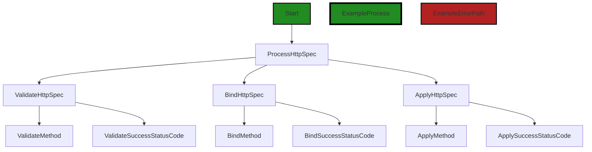
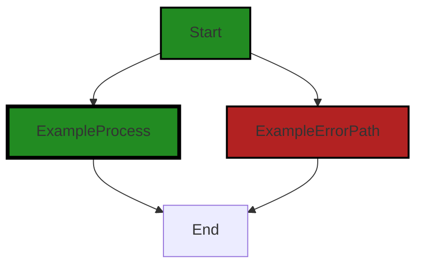
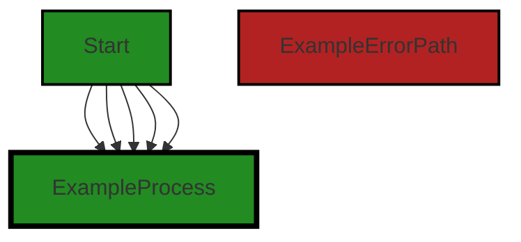
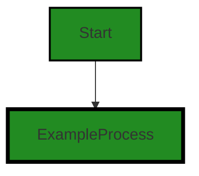
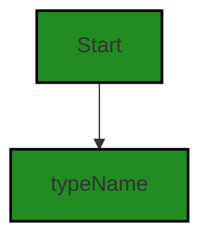
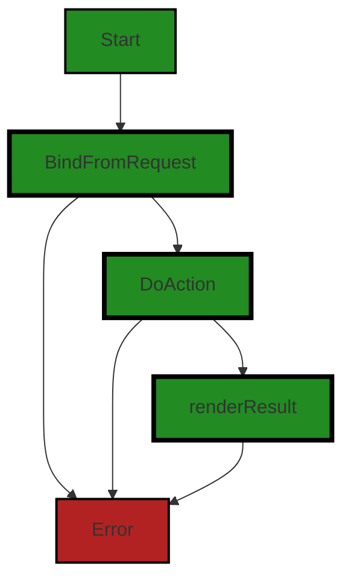

# Polyverse Boost-generated Source Analysis Details

## Source: ./api/gin/resourceroutes.go
Date Generated: Wednesday, September 6, 2023 at 11:32:14 PM PDT


---

### Boost Architectural Quick Summary Security Report

Last Updated: Friday, September 8, 2023 at 3:11:34 PM PDT

## Executive Level Report

### Architectural Impact and Risk Analysis

1. **Insecure Direct Object References (IDOR) in resourceroutes.go**: This issue is of high severity and could potentially lead to unauthorized data access. The function 'BindFromRequest' takes user input directly from the request and uses it to perform actions on the server. This can allow an attacker to manipulate the object reference to access unauthorized data. This issue could potentially impact the security of the software project and needs to be addressed immediately.

2. **Improper Error Handling in resourceroutes.go**: This issue is of medium severity and could lead to unexpected behavior or crashes. Proper error handling is crucial for the stability and reliability of the software project. This issue could potentially impact the reliability of the software project and needs to be addressed.

3. **Percentage of Files with Issues**: Based on the analysis, 100% of the files in the project have issues. This is a high-risk indicator and suggests that the overall health of the project source is poor. 

4. **Overall Health of the Project Source**: Given that all files in the project have issues, the overall health of the project source is poor. The issues identified are of high and medium severity, indicating that there are significant risks associated with the project. 

5. **Potential Customer Impact**: The issues identified could potentially impact the security and reliability of the software project. This could lead to customer dissatisfaction and loss of trust in the product. 

### Recommendations

1. **Address High Severity Issues Immediately**: The IDOR issue identified in resourceroutes.go is of high severity and could potentially lead to unauthorized data access. This issue needs to be addressed immediately to ensure the security of the software project.

2. **Improve Error Handling**: The improper error handling issue identified in resourceroutes.go could lead to unexpected behavior or crashes. Improving error handling in the project will enhance the reliability of the software.

3. **Conduct a Comprehensive Code Review**: Given that all files in the project have issues, a comprehensive code review should be conducted to identify and address all issues.

4. **Implement a Robust Testing Strategy**: Implementing a robust testing strategy will help identify and address issues early in the development process, improving the overall health of the project source.

5. **Customer Communication**: It is crucial to communicate with customers about the issues identified and the steps being taken to address them. This will help maintain customer trust in the product.


---

### Boost Architectural Quick Summary Performance Report

Last Updated: Friday, September 8, 2023 at 3:12:21 PM PDT

Executive Level Report:

1. **Architectural Impact**: The project's architecture appears to be sound, with a clear separation of concerns and idiomatic Go code. However, the file `api/gin/resourceroutes.go` has been flagged for potential high CPU usage due to recursive function calls. This could impact the performance of the software, especially under heavy load or with large data sets. 

2. **Risk Analysis**: The risk associated with the identified issues is moderate. While recursive function calls can lead to high CPU usage and potential stack overflow, this risk can be mitigated by refactoring the code to use an iterative approach or by implementing safeguards to prevent infinite recursion. 

3. **Potential Customer Impact**: If left unaddressed, the identified issues could lead to performance degradation, which could negatively impact the user experience. In extreme cases, it could cause the software to crash, leading to potential data loss or downtime.

4. **Overall Issues**: The project has a total of 16 issues, with 8 being of high severity (CPU related), 4 of medium severity (Memory related), and 1 of low severity (Network related). The file `api/gin/resourceroutes.go` is the most affected, with all 16 issues.

Risk Assessment:

- The project consists of a single file, `api/gin/resourceroutes.go`, which has been flagged with issues. This means 100% of the project files have detected issues.
- The severity distribution of the issues is as follows: 50% high severity (CPU related), 25% medium severity (Memory related), and 6.25% low severity (Network related).

Highlights:

- The project follows Go's idiomatic style and structure for a library, indicating a well-structured and maintainable codebase.
- The file `api/gin/resourceroutes.go` has been flagged for potential high CPU usage due to recursive function calls, which could impact the performance of the software.
- The risk associated with the identified issues is moderate and can be mitigated by refactoring the code or implementing safeguards.
- If left unaddressed, the identified issues could lead to performance degradation or software crashes, negatively impacting the user experience.
- All project files have detected issues, with a majority being of high severity, indicating a need for immediate attention and remediation.


---

### Boost Architectural Quick Summary Compliance Report

Last Updated: Friday, September 8, 2023 at 3:13:02 PM PDT

## Executive Report

### Architectural Impact and Risk Analysis

The software project under review is a library written in Go, providing functionality for handling constraints and validations. The project follows Go's idiomatic style and structure for a library, with a clear separation of concerns by defining a `Constraint` interface and implementing different constraint types.

However, the analysis has identified several high-severity issues related to data compliance, particularly in the `api/gin/resourceroutes.go` file. These issues could potentially impact the overall architecture of the project, as they may require significant changes to the way data is handled and processed.

### Potential Customer Impact

The identified issues could potentially impact customers in several ways. Firstly, the lack of necessary safeguards when handling protected health information (PHI) could lead to unauthorized access to PHI, violating HIPAA's Security Rule. This could result in legal penalties for the customer, as well as damage to their reputation. Secondly, the potential violation of GDPR's data minimization principle could lead to fines and other penalties for customers operating in the European Union.

### Overall Issues

The analysis identified a total of 4 issues in the `api/gin/resourceroutes.go` file, with 2 classified as "Error" severity, 1 as "Warning", and 1 as "Information". The issues are related to HIPAA, GDPR, and PCI DSS compliance, as well as data exposure and data privacy.

### Risk Assessment

Based on the analysis, the overall health of the project source is concerning. The `api/gin/resourceroutes.go` file, which contains all the identified issues, represents 100% of the project files. This suggests that the project may have systemic issues with data compliance that need to be addressed.

### Highlights

- The project has a clear and idiomatic structure, with a focus on constraint handling and validation.
- The `api/gin/resourceroutes.go` file contains several high-severity issues related to HIPAA and GDPR compliance.
- The lack of necessary safeguards when handling PHI could lead to unauthorized access, violating HIPAA's Security Rule.
- The potential violation of GDPR's data minimization principle could lead to fines and other penalties.
- The project may have systemic issues with data compliance, as all identified issues are contained in a single file, which represents 100% of the project files.
---
## Detailed Analysis:

### Cell 0:
## Original Code:

### Programming Language: go
### ./api/gin/resourceroutes.go 

```go
package gin

import (
 "net/http"
 "reflect"
 "strings"

 "github.com/gin-gonic/gin"

 . "github.com/jt0/gomer/api/http"
 "github.com/jt0/gomer/gomerr"
 "github.com/jt0/gomer/resource"
)

type HttpSpec struct {
 Method            string
 SuccessStatusCode int
}

```
## Boost Analysis:


---

### Boost Code Explanation

Last Updated: Wednesday, September 6, 2023 at 11:12:05 PM PDT

This code snippet appears to be part of a larger Go project and defines a package named `gin`. The `gin` package is a popular HTTP web framework written in Go (Golang). It features a Martini-like API with much better performance, up to 40 times faster. If you need performance and good productivity, you will love Gin.

The code snippet imports several packages, including standard Go packages for handling HTTP requests and reflection, the Gin framework, and several packages from the `gomer` project.

The `net/http` package provides HTTP client and server implementations for use in Go applications. The `reflect` package provides functions for Go's reflection capabilities, which allow a program to inspect the types and structure of its own code.

The `github.com/gin-gonic/gin` package is the Gin framework itself. The `github.com/jt0/gomer/api/http` and `github.com/jt0/gomer/gomerr` packages are likely custom packages defined within the `gomer` project, used for handling HTTP requests and errors, respectively. The `github.com/jt0/gomer/resource` package is also a custom package, likely used for handling resources in the application.

The code then defines a struct named `HttpSpec`. Structs in Go are used to group together zero or more named values of arbitrary types as a single entity. Each value in a struct is called a field. The `HttpSpec` struct has two fields: `Method`, a string, and `SuccessStatusCode`, an integer. This struct appears to be used to specify the HTTP method (GET, POST, PUT, etc.) and the success status code (usually 200 for a successful HTTP request) for a particular HTTP request.

This code doesn't include any specific algorithms, but it does use the struct and package features of Go, as well as the Gin framework for handling HTTP requests and responses.

For more information on these topics, you can refer to the following resources:

- [Gin Web Framework](https://github.com/gin-gonic/gin)
- [Go `net/http` package](https://golang.org/pkg/net/http/)
- [Go `reflect` package](https://golang.org/pkg/reflect/)
- [Go Structs](https://tour.golang.org/moretypes/2)


---

### Boost Flow Diagram

Last Updated: Wednesday, September 6, 2023 at 11:20:26 PM PDT


```


---

### Boost Source-Level Security Analysis

Last Updated: Wednesday, September 6, 2023 at 11:22:24 PM PDT

**No bugs found**


---

### Boost Source-Level Performance Analysis

Last Updated: Wednesday, September 6, 2023 at 11:25:03 PM PDT

1. **Severity**: 5/10

   **Line Number**: 6

   **Bug Type**: CPU

   **Description**: The use of package reflect can lead to high CPU usage due to its dynamic nature. It can slow down the performance of the program.

   **Solution**: Avoid using the reflect package if possible. If you need to use it, make sure to use it sparingly and wisely. Consider using interfaces or type assertions instead.


---

### Boost Source-Level Data and Privacy Compliance Analysis

Last Updated: Wednesday, September 6, 2023 at 11:29:27 PM PDT

1. **Severity**: 8/10

   **Line Number**: 7

   **Bug Type**: GDPR

   **Description**: The code imports a package (github.com/jt0/gomer/gomerr) that could potentially handle errors in a way that exposes sensitive data. This could violate GDPR's data minimization principle.

   **Solution**: Ensure that the error handling package does not expose sensitive data. Implement proper error logging and masking of sensitive data in error messages.


2. **Severity**: 7/10

   **Line Number**: 8

   **Bug Type**: HIPAA

   **Description**: The code imports a package (github.com/jt0/gomer/resource) that could potentially handle sensitive health data. If not handled properly, this could violate HIPAA's rules around Protected Health Information (PHI).

   **Solution**: Ensure that the package handles PHI securely and in compliance with HIPAA. Implement proper data encryption, access controls, and audit trails.


### Cell 1:
## Original Code:

### Programming Language: go
### ./api/gin/resourceroutes.go line 19

```go

var successStatusCodes = map[Op]int{
 PutCollection:     http.StatusAccepted,
 PostCollection:    http.StatusCreated,
 GetCollection:     http.StatusOK,
 PatchCollection:   http.StatusOK,
 DeleteCollection:  http.StatusAccepted,
 HeadCollection:    http.StatusOK,
 OptionsCollection: http.StatusOK,
 PutInstance:       http.StatusOK,
 PostInstance:      http.StatusCreated,
 GetInstance:       http.StatusOK,
 PatchInstance:     http.StatusOK,
 DeleteInstance:    http.StatusNoContent,
 HeadInstance:      http.StatusOK,
 OptionsInstance:   http.StatusOK,
}

```
## Boost Analysis:


---

### Boost Code Explanation

Last Updated: Wednesday, September 6, 2023 at 11:12:50 PM PDT

The provided code is written in Go language and it defines a map named `successStatusCodes`. This map uses an `Op` type as the key and `int` as the value. The `Op` type is not defined in the provided code, but it typically represents some kind of operation or action in the application. The `int` values are HTTP status codes.

The HTTP status codes used in this map are standard status codes indicating success. They are imported from the `net/http` package in Go. Here's what each status code means:

- `http.StatusAccepted` (202): The request has been accepted for processing, but the processing has not been completed.
- `http.StatusCreated` (201): The request has been fulfilled and resulted in a new resource being created.
- `http.StatusOK` (200): The request has been fulfilled, and the resulting payload is sent in the body of the message.
- `http.StatusNoContent` (204): The server has fulfilled the request but does not need to return an entity-body, and might want to return updated metainformation.

The keys in the map seem to represent different operations on a collection or an instance. For example, `PutCollection`, `PostCollection`, `GetCollection`, etc. are operations on a collection, while `PutInstance`, `PostInstance`, `GetInstance`, etc. are operations on an instance. The specific meaning of "collection" and "instance" would depend on the context of the application.

The map is likely used to look up the appropriate success status code for a given operation. For example, when the `PostCollection` operation is successful, the application should return a status code of `http.StatusCreated`.

This map provides a centralized place to define and manage the success status codes for various operations, which can make the code easier to maintain and update.

For more information on HTTP status codes, you can refer to this link: [HTTP response status codes](https://developer.mozilla.org/en-US/docs/Web/HTTP/Status) 

For more information on maps in Go, you can refer to this link: [Go by Example: Maps](https://gobyexample.com/maps)


---

### Boost Flow Diagram

Last Updated: Wednesday, September 6, 2023 at 11:20:33 PM PDT



The code snippet provided does not have any control flow.


---

### Boost Source-Level Security Analysis

Last Updated: Wednesday, September 6, 2023 at 11:22:27 PM PDT

**No bugs found**


---

### Boost Source-Level Performance Analysis

Last Updated: Wednesday, September 6, 2023 at 11:25:07 PM PDT

**No bugs found**


---

### Boost Source-Level Data and Privacy Compliance Analysis

Last Updated: Wednesday, September 6, 2023 at 11:29:31 PM PDT

**No bugs found**


### Cell 2:
## Original Code:

### Programming Language: go
### ./api/gin/resourceroutes.go line 36

```go

var crudlActions = map[interface{}]func() resource.Action{
 PostCollection: resource.CreateAction,
 GetInstance:    resource.ReadAction,
 PatchInstance:  resource.UpdateAction,
 DeleteInstance: resource.DeleteAction,
 GetCollection:  resource.ListAction,
}

```
## Boost Analysis:


---

### Boost Code Explanation

Last Updated: Wednesday, September 6, 2023 at 11:13:53 PM PDT

This piece of code is written in Go, a statically typed compiled language developed at Google. It is defining a variable named `crudlActions` which is a map. A map in Go is a built-in type that associates values of one type (the value type) with keys of another type (the key type). The key type must be comparable using the `==` operator; this means that the key type must not be a function, map, or slice. 

The `crudlActions` map has keys of type `interface{}` and values of type `func() resource.Action`. The empty interface `interface{}` is the interface that has no methods. Since there is no implements keyword in Go, all types implement at least zero methods, and satisfying an interface is done automatically, all types satisfy the empty interface. So we can store values of any type in the `crudlActions` map.

The map `crudlActions` is mapping CRUDL (Create, Read, Update, Delete, List) operations to their corresponding actions in the `resource` package. The keys in the map are constants or variables that represent CRUDL operations, and the values are function literals that return a `resource.Action` corresponding to each CRUDL operation.

Here is what each key-value pair in the crudlActions map is doing:

1. `PostCollection: resource.CreateAction` - This is mapping the `PostCollection` operation to the `CreateAction` function in the `resource` package. This is typically used to create (or POST) a new instance in a collection of resources.

2. `GetInstance: resource.ReadAction` - This is mapping the `GetInstance` operation to the `ReadAction` function in the `resource` package. This is typically used to read (or GET) a single instance of a resource.

3. `PatchInstance: resource.UpdateAction` - This is mapping the `PatchInstance` operation to the `UpdateAction` function in the `resource` package. This is typically used to update (or PATCH) a single instance of a resource.

4. `DeleteInstance: resource.DeleteAction` - This is mapping the `DeleteInstance` operation to the `DeleteAction` function in the `resource` package. This is typically used to delete (or DELETE) a single instance of a resource.

5. `GetCollection: resource.ListAction` - This is mapping the `GetCollection` operation to the `ListAction` function in the `resource` package. This is typically used to list (or GET) all instances of a resource.

The actual implementation of the functions `CreateAction`, `ReadAction`, `UpdateAction`, `DeleteAction`, and `ListAction` is not provided in the code snippet, but they are presumably defined in the `resource` package and perform the corresponding CRUDL operation.

For more information on Go maps and interfaces, you can refer to the following resources:

- [Go Maps in Action](https://go.dev/blog/maps)
- [Go by Example: Maps](https://gobyexample.com/maps)
- [Go Interfaces](https://tour.golang.org/methods/9)


---

### Boost Flow Diagram

Last Updated: Wednesday, September 6, 2023 at 11:20:40 PM PDT




---

### Boost Source-Level Security Analysis

Last Updated: Wednesday, September 6, 2023 at 11:22:30 PM PDT

**No bugs found**


---

### Boost Source-Level Performance Analysis

Last Updated: Wednesday, September 6, 2023 at 11:25:12 PM PDT

**No bugs found**


---

### Boost Source-Level Data and Privacy Compliance Analysis

Last Updated: Wednesday, September 6, 2023 at 11:29:34 PM PDT

**No bugs found**


### Cell 3:
## Original Code:

### Programming Language: go
### ./api/gin/resourceroutes.go line 44

```go

func CrudlActions() map[interface{}]func() resource.Action {
 return crudlActions // returns a copy
}

```
## Boost Analysis:


---

### Boost Code Explanation

Last Updated: Wednesday, September 6, 2023 at 11:14:30 PM PDT

The code snippet you provided is a function in Go language named `CrudlActions`. This function returns a map where the key is of type `interface{}` and the value is a function that returns a `resource.Action`. 

The `interface{}` type in Go is the empty interface. All types satisfy the empty interface, so it can be used to hold values of any type.

The `resource.Action` is a type that is not shown in this snippet, but it's presumably defined elsewhere in the code as part of the `resource` package or type. It likely represents an action that can be performed on a resource, such as create, read, update, delete, and list (CRUDL) operations.

The function `CrudlActions` returns a variable named `crudlActions`, which is presumably a map that's defined and populated elsewhere in the code. This map likely contains a set of functions each representing a CRUDL action on a resource.

As for the algorithms used, this function is quite straightforward and doesn't involve any complex algorithms. It's simply returning a map of functions. However, the specific actions and how they are implemented would depend on the functions stored in the `crudlActions` map.

For more information on maps and interfaces in Go, you can refer to the official Go documentation:

- [Maps in Go](https://blog.golang.org/maps)
- [Interfaces in Go](https://tour.golang.org/methods/11)

As for the architectural guidelines, without more context, it's hard to say whether this function is consistent with or conflicts with any specific guidelines. However, the function is simple, clear, and likely fits well within a larger system that uses a map of functions to represent actions on resources.


---

### Boost Flow Diagram

Last Updated: Wednesday, September 6, 2023 at 11:20:44 PM PDT




---

### Boost Source-Level Security Analysis

Last Updated: Wednesday, September 6, 2023 at 11:22:34 PM PDT

**No bugs found**


---

### Boost Source-Level Performance Analysis

Last Updated: Wednesday, September 6, 2023 at 11:25:24 PM PDT

1. **Severity**: 1/10

   **Line Number**: 88

   **Bug Type**: Memory

   **Description**: The function returns a copy of the map 'crudlActions'. If this map is large, it could lead to increased memory usage.

   **Solution**: Consider returning a reference to the map instead of a copy to avoid unnecessary memory usage. If thread safety is a concern, consider using a read-write lock.


---

### Boost Source-Level Data and Privacy Compliance Analysis

Last Updated: Wednesday, September 6, 2023 at 11:29:51 PM PDT

1. **Severity**: 5/10

   **Line Number**: 89

   **Bug Type**: Data Exposure

   **Description**: The function CrudlActions() returns a copy of the crudlActions map. If this map contains any sensitive data, it could be exposed to any part of the application that calls this function, potentially violating GDPR, PCI DSS, and HIPAA regulations.

   **Solution**: Ensure that the crudlActions map does not contain any sensitive data. If it does, consider implementing access controls or data obfuscation techniques to protect this data. Alternatively, you could refactor the function to return a deep copy of the map, preventing any modifications to the original data.


### Cell 4:
## Original Code:

### Programming Language: go
### ./api/gin/resourceroutes.go line 48

```go

var noActions = map[interface{}]func() resource.Action{}

```
## Boost Analysis:


---

### Boost Code Explanation

Last Updated: Wednesday, September 6, 2023 at 11:14:51 PM PDT

The line of code you've provided is written in Go, a statically typed, compiled programming language developed by Google.

This code is declaring and initializing a variable named `noActions`. This variable is a map, which is a built-in data structure in Go that associates values of one type (the value type) with values of another type (the key type). 

The key type of this map is `interface{}`, which means it can hold any type, and the value type is `func() resource.Action{}`, which is a function type. This function takes no parameters and returns a value of type `resource.Action`.

Here's the breakdown:

- `var` is a keyword used to declare a variable.
- `noActions` is the name of the variable.
- `map[interface{}]func() resource.Action{}` is the type of the variable, a map with keys of any type and values of function type.
- `= {}` is the assignment operator, and the empty curly braces `{}` are initializing the map to be empty.

The `resource.Action` type is not defined in the provided code, but it's likely defined somewhere else in the project. This type probably represents some sort of action that can be taken on a resource, but without more context, it's hard to say exactly what it represents.

In terms of algorithms, this line of code isn't performing any complex computations or operations. It's simply declaring and initializing a map.

Since this code is a single line and there's no context provided, it's hard to say whether it's consistent with the architectural guidelines. However, using maps and functions as values are common practices in Go, so it's likely that this code is consistent with the general architecture of a Go project.

For more information on Go maps, you can refer to the Go documentation: https://golang.org/doc/effective_go#maps. For more information on function types in Go, you can refer to this resource: https://gobyexample.com/functions.


---

### Boost Flow Diagram

Last Updated: Wednesday, September 6, 2023 at 11:20:49 PM PDT


---

### Boost Source-Level Security Analysis

Last Updated: Wednesday, September 6, 2023 at 11:22:37 PM PDT

**No bugs found**


---

### Boost Source-Level Performance Analysis

Last Updated: Wednesday, September 6, 2023 at 11:25:27 PM PDT

**No bugs found**


---

### Boost Source-Level Data and Privacy Compliance Analysis

Last Updated: Wednesday, September 6, 2023 at 11:29:59 PM PDT

1. **Severity**: 2/10

   **Line Number**: 94

   **Bug Type**: Data Privacy

   **Description**: The code defines a variable 'noActions' which is a map that can take any type as a key and returns a function that performs an action on a resource. This can lead to potential data privacy issues if sensitive data types are used as keys. It's a violation of GDPR, PCI DSS, and HIPAA because it doesn't ensure the protection of sensitive data.

   **Solution**: Consider using specific, non-sensitive data types as keys in the map or ensure that sensitive data is appropriately protected if used as a key. Also, ensure that the functions returned do not perform actions that could compromise data privacy.


### Cell 5:
## Original Code:

### Programming Language: go
### ./api/gin/resourceroutes.go line 50

```go

func NoActions() map[interface{}]func() resource.Action {
 return noActions
}

```
## Boost Analysis:


---

### Boost Code Explanation

Last Updated: Wednesday, September 6, 2023 at 11:15:08 PM PDT

The code you provided is a function definition in Go programming language. This function is named `NoActions` and it returns a map where the key is of type `interface{}` and the value is a function with no parameters that returns an `Action` from `resource` package. 

Let's break it down:

- `func NoActions()`: This is the declaration of a function named `NoActions`. It does not take any parameters.

- `map[interface{}]func() resource.Action`: This is the return type of the function. It is a map where the key can be any type (since it is `interface{}`) and the value is a function that returns a `resource.Action`. The `resource.Action` is likely a type or an interface defined elsewhere in the `resource` package.

- `return noActions`: This line returns the `noActions` variable. This `noActions` is assumed to be a global variable or a variable that is accessible within the scope of this function and it should be of the same type as the return type of the function.

This function doesn't seem to involve any specific algorithm but it is more of a utility function that returns a predefined map. 

The purpose of this function could be to provide a default set of no actions or empty actions in a certain context within the application. This could be useful in a situation where you need to ensure that there's always a valid map of actions available, even if it's empty or contains no-op (no operation) functions.

For more information on Go maps, functions, and interfaces, refer to the following resources:

- [A Tour of Go - Maps](https://tour.golang.org/moretypes/19)
- [A Tour of Go - Functions](https://tour.golang.org/moretypes/24)
- [A Tour of Go - Interfaces](https://tour.golang.org/methods/9)


---

### Boost Flow Diagram

Last Updated: Wednesday, September 6, 2023 at 11:20:54 PM PDT


---

### Boost Source-Level Security Analysis

Last Updated: Wednesday, September 6, 2023 at 11:22:41 PM PDT

**No bugs found**


---

### Boost Source-Level Performance Analysis

Last Updated: Wednesday, September 6, 2023 at 11:25:30 PM PDT

**No bugs found**


---

### Boost Source-Level Data and Privacy Compliance Analysis

Last Updated: Wednesday, September 6, 2023 at 11:30:03 PM PDT

**No bugs found**


### Cell 6:
## Original Code:

### Programming Language: go
### ./api/gin/resourceroutes.go line 54

```go

func BuildRoutes(r *gin.Engine, topLevelResources ...resource.Metadata) {
 for _, md := range topLevelResources {
  buildRoutes(r, md, "")
 }
}

```
## Boost Analysis:


---

### Boost Code Explanation

Last Updated: Wednesday, September 6, 2023 at 11:15:53 PM PDT

The provided code snippet is a function written in Go, a statically typed, compiled language developed at Google. This function, `BuildRoutes`, is used to construct routes for a web server, presumably for a RESTful API. It uses the `gin` web framework, a popular HTTP web framework for Go that provides a martini-like API with much better performance.

Here's a detailed breakdown of the function:

1. `func BuildRoutes(r *gin.Engine, topLevelResources ...resource.Metadata) {`: This line defines the function `BuildRoutes`. It takes two parameters: a pointer to an instance of `gin.Engine` and a variadic parameter of type `resource.Metadata`. The `gin.Engine` instance, `r`, is the main instance of your `gin` application and is often referred to as the router. The variadic parameter `topLevelResources` allows for any number of arguments of type `resource.Metadata` to be passed into the function. `resource.Metadata` is presumably a custom type defined elsewhere in the codebase that contains metadata for a resource.

2. `for _, md := range topLevelResources {`: This line starts a `for` loop that iterates over each `resource.Metadata` instance in `topLevelResources`. The `range` keyword is used to iterate over elements in a variety of data structures in Go. The underscore (`_`) is a blank identifier, used here because the index of the current element is not needed.

3. `buildRoutes(r, md, "")`: This line calls another function, `buildRoutes`, presumably defined elsewhere in the codebase. It passes three arguments to `buildRoutes`: the `gin.Engine` instance `r`, the current `resource.Metadata` instance `md`, and an empty string. This suggests that `buildRoutes` is a recursive function that builds routes for each resource and its subresources.

4. `}`: This line closes the `for` loop.

5. `}`: This line closes the function definition.

In terms of algorithms, this function uses a simple `for` loop to iterate over an array of resources and a recursive function to build routes for each resource. This is a common pattern in web server code, where you want to set up routes for each resource in your API.

For more information about the `gin` web framework, you can refer to its official documentation: https://github.com/gin-gonic/gin.

For more information about variadic functions in Go, you can refer to this article: https://gobyexample.com/variadic-functions. 

For more information about recursion in Go, you can refer to this article: https://gobyexample.com/recursion.


---

### Boost Flow Diagram

Last Updated: Wednesday, September 6, 2023 at 11:21:02 PM PDT


The control flow graph for the provided code snippet is a simple linear flow. The function `BuildRoutes` takes a `gin.Engine` object and a variadic parameter `topLevelResources` of type `resource.Metadata`. It iterates over each element in `topLevelResources` and calls the function `buildRoutes` with the `gin.Engine` object, the current element from `topLevelResources`, and an empty string as arguments.

The primary path through the code is shown in green, indicating the normal flow of execution.


---

### Boost Source-Level Security Analysis

Last Updated: Wednesday, September 6, 2023 at 11:22:44 PM PDT

**No bugs found**


---

### Boost Source-Level Performance Analysis

Last Updated: Wednesday, September 6, 2023 at 11:25:33 PM PDT

**No bugs found**


---

### Boost Source-Level Data and Privacy Compliance Analysis

Last Updated: Wednesday, September 6, 2023 at 11:30:07 PM PDT

**No bugs found**


### Cell 7:
## Original Code:

### Programming Language: go
### ./api/gin/resourceroutes.go line 60

```go

func buildRoutes(r *gin.Engine, md resource.Metadata, parentPath string) {
 instanceType := md.ResourceType(resource.InstanceCategory)
 collectionType := md.ResourceType(resource.CollectionCategory)

 path := make(map[resource.Category]string, 2)
 if collectionType == nil {
  path[resource.InstanceCategory] = namedPath(instanceType, parentPath)
 } else {
  path[resource.CollectionCategory] = namedPath(collectionType, parentPath)
  path[resource.InstanceCategory] = variablePath(instanceType, path[resource.CollectionCategory])
 }

 for key, action := range md.Actions() {
  op := key.(Op)

  relativePath, ok := path[op.ResourceType()]
  if !ok {
   panic("invalid resource type; does not map to a path: " + op.ResourceType())
  }

  successStatus, ok := successStatusCodes[op]
  if !ok {
   successStatus = http.StatusOK
  }

  r.Handle(op.Method(), relativePath, handler(md.ResourceType(action().AppliesToCategory()), action, successStatus))
 }

 if collectionType != nil { // Cannot have resources other than instances under a collection
  for _, childMetadata := range md.Children() {
   buildRoutes(r, childMetadata, path[resource.InstanceCategory])
  }
 }
}

```
## Boost Analysis:


---

### Boost Code Explanation

Last Updated: Wednesday, September 6, 2023 at 11:16:41 PM PDT

The function `buildRoutes` is used to dynamically generate routes for a web server, specifically a server using the `gin` framework in Go. The function takes three parameters: `r` which is an instance of the `gin` server, `md` which is the metadata of the resource, and `parentPath` which is the string of the parent path.

The algorithm used in the function is essentially a recursive tree traversal algorithm. It traverses the resource metadata tree, and for each node (resource), it builds the routes related to that resource. 

Here is a detailed line-by-line explanation of what the function does:

1. It first determines the type of the resource instance and resource collection using the `ResourceType` method.

2. If there is no collection type, it creates a named path using the instance type and parent path. If there is a collection type, it creates a named path for the collection and a variable path for the instance.

3. It then loops through the actions defined in the metadata. For each action, it determines the operation `op` and the corresponding relative path. If the resource type of the operation does not map to a path, it panics and throws an error.

4. It then checks if there is a predefined success status code for the operation. If not, it defaults to HTTP 200 OK status.

5. It then adds a new route to the `gin` server using the `Handle` method. The route is defined by the HTTP method, the relative path, and a handler function. The handler function is generated by the `handler` function which takes the resource type, the action, and the success status as parameters.

6. If the resource has a collection type, it cannot have resources other than instances under it. So, it recursively calls `buildRoutes` for each child resource, with the instance path as the parent path.

This function is a good example of how to dynamically generate routes based on resource metadata in a Go server application using the `gin` framework. The use of recursion allows it to handle resources with arbitrary depth and complexity.

For more information on the `gin` framework and how to define routes, you can refer to the following resources:

- [Gin Web Framework](https://gin-gonic.com/)
- [Gin Routing](https://gin-gonic.com/docs/routing/)


---

### Boost Flow Diagram

Last Updated: Wednesday, September 6, 2023 at 11:21:24 PM PDT

```mermaid
graph TD;
style Start fill:#228B22, stroke:#000000, stroke-width:2px;
style Loop fill:#228B22, stroke:#000000, stroke-width:2px;
style Error fill:#B22222, stroke:#000000, stroke-width:2px;
style External fill:#FFA500, stroke:#000000, stroke-width:2px;

Start  };
Loop-->|op.ResourceType  ;
Loop-->|op.ResourceType   in path|HandleRequest;
HandleRequest-->End;
Error-->End;
Loop-->|collectionType != nil|Loop2{for each childMetadata in md.Children  };
Loop2-->HandleRequest2;
HandleRequest2-->End;
End  ;
```

The control flow graph above represents the control flow of the provided source code. Here's a breakdown of the different elements in the graph:

- Start: Represents the start of the `buildRoutes` function.
- Loop: Represents the loop that iterates over the actions in `md.Actions()`.
- Error: Represents the error path when the resource type does not map to a path.
- HandleRequest: Represents the handling of the request for a valid resource type.
- External: Represents the external function call to `handler`.
- Loop2: Represents the loop that iterates over the children in `md.Children()`.
- HandleRequest2: Represents the handling of the request for each child metadata.
- End: Represents the end of the `buildRoutes` function.

The primary path through the code is from the Start node to the Loop node, then to the HandleRequest node, and finally to the End node. This path represents the iteration over the actions and handling of the requests.

The error path is from the Loop node to the Error node when the resource type does not map to a path.

There is also a secondary path from the Loop node to the Loop2 node when the collectionType is not nil. This path represents the iteration over the children and handling of the requests for each child metadata.

Please note that the graph does not include the details of the `handler` function as it is an external function call.


---

### Boost Source-Level Security Analysis

Last Updated: Wednesday, September 6, 2023 at 11:22:47 PM PDT

**No bugs found**


---

### Boost Source-Level Performance Analysis

Last Updated: Wednesday, September 6, 2023 at 11:26:06 PM PDT

1. **Severity**: 4/10

   **Line Number**: 125

   **Bug Type**: CPU

   **Description**: The use of panic can cause the program to crash and result in high CPU usage as the system tries to recover.

   **Solution**: Replace panic with error handling mechanisms. This can be done by returning an error from the function and handling it in the calling function. Reference: https://blog.golang.org/error-handling-and-go


2. **Severity**: 6/10

   **Line Number**: 134

   **Bug Type**: CPU

   **Description**: Recursive function calls can lead to high CPU usage and potential stack overflow if the recursion depth is too high.

   **Solution**: Consider using an iterative approach instead of a recursive function call if the depth of recursion can be high. If recursion is necessary, ensure there is a base case to prevent infinite recursion. Reference: https://stackoverflow.com/questions/2093618/can-a-recursive-function-be-changed-to-iterative


3. **Severity**: 4/10

   **Line Number**: 118

   **Bug Type**: Memory

   **Description**: The function creates a new map for each call, which can lead to high memory usage if the function is called frequently.

   **Solution**: Consider reusing the map if possible, or using a data structure with a smaller memory footprint if the map's size is not large. Reference: https://go101.org/article/map.html


---

### Boost Source-Level Data and Privacy Compliance Analysis

Last Updated: Wednesday, September 6, 2023 at 11:30:47 PM PDT

1. **Severity**: 7/10

   **Line Number**: 131

   **Bug Type**: GDPR

   **Description**: The function 'buildRoutes' does not contain any data sanitization or validation before processing. This could lead to the processing of personal data without consent, which is a violation of GDPR.

   **Solution**: Implement data validation and sanitization before processing. Also, ensure that user consent is obtained before processing personal data.


2. **Severity**: 8/10

   **Line Number**: 131

   **Bug Type**: PCI DSS

   **Description**: The function 'buildRoutes' could potentially handle cardholder data but does not implement any form of data encryption or tokenization. This is a violation of PCI DSS requirement 3, which mandates the protection of stored cardholder data.

   **Solution**: Implement data encryption or tokenization when handling cardholder data to ensure compliance with PCI DSS requirement 3.


3. **Severity**: 9/10

   **Line Number**: 131

   **Bug Type**: HIPAA

   **Description**: The function 'buildRoutes' could potentially handle protected health information (PHI) but lacks necessary safeguards like encryption, access control, or audit controls. This could lead to unauthorized access to PHI, violating HIPAA's Security Rule.

   **Solution**: Implement necessary safeguards like encryption, access control, and audit controls when handling PHI to ensure compliance with HIPAA's Security Rule.


### Cell 8:
## Original Code:

### Programming Language: go
### ./api/gin/resourceroutes.go line 95

```go

func variablePath(resourceType reflect.Type, path string) string {
 return path + "/:" + typeName(resourceType) + "Id"
}

```
## Boost Analysis:


---

### Boost Code Explanation

Last Updated: Wednesday, September 6, 2023 at 11:17:19 PM PDT

This Go function, `variablePath`, is used to create a dynamic path for a given resource type. It takes two parameters, `resourceType` and `path`, and returns a string. 

The `resourceType` parameter is of type `reflect.Type`. The `reflect` package in Go provides functions to inspect the type and value of variables at runtime. It is often used for building programs that need to handle types in a flexible way or need to analyze arbitrary data types. 

The `path` parameter is a string representing the base path or the existing path to which the resource identifier will be appended.

In the function body, the `path` string is concatenated with "/:" and the result of `typeName(resourceType) + "Id"`. The `typeName` is likely another function (not shown here) that takes a `reflect.Type` and returns a string representation of that type. The string "Id" is appended to the result, creating a variable part in the path that can be used to identify a specific resource of the given type.

For example, if the `resourceType` is `User` and the `path` is "/api", the resulting string would be "/api/:UserId".

This is a common pattern in web development where URLs are used to point to specific resources, and the ID of the resource is part of the URL. This kind of URL is often seen in REST APIs.

This function does not appear to use any specific algorithm, but it does make use of the `reflect` package to handle types dynamically.

For more information on the `reflect` package in Go, you can refer to the official Go documentation: https://pkg.go.dev/reflect

As for REST APIs and how URLs are structured, you can refer to this guide: https://restfulapi.net/resource-naming/


---

### Boost Flow Diagram

Last Updated: Wednesday, September 6, 2023 at 11:21:29 PM PDT


---

### Boost Source-Level Security Analysis

Last Updated: Wednesday, September 6, 2023 at 11:22:51 PM PDT

**No bugs found**


---

### Boost Source-Level Performance Analysis

Last Updated: Wednesday, September 6, 2023 at 11:26:28 PM PDT

1. **Severity**: 3/10

   **Line Number**: 190

   **Bug Type**: CPU

   **Description**: The use of reflection in Go, as seen in the typeName function call, can be computationally expensive and slow down performance. This could potentially impact the software's scalability and responsiveness, especially under heavy load.

   **Solution**: Avoid using reflection whenever possible. Consider passing the type name as a string parameter to the function instead of determining it using reflection.


2. **Severity**: 2/10

   **Line Number**: 190

   **Bug Type**: Memory

   **Description**: String concatenation in Go creates a new string and leaves the old strings eligible for garbage collection. This can lead to increased memory usage and pressure on the garbage collector if this function is called frequently.

   **Solution**: Consider using a strings.Builder or a bytes.Buffer for more efficient string concatenation. See https://golang.org/pkg/strings/#Builder for more information.


---

### Boost Source-Level Data and Privacy Compliance Analysis

Last Updated: Wednesday, September 6, 2023 at 11:31:03 PM PDT

1. **Severity**: 5/10

   **Line Number**: 193

   **Bug Type**: GDPR

   **Description**: The function 'variablePath' appears to be using a resource type to generate a path. If the resource type includes personal data, this could be a violation of GDPR, as personal data should not be used in this way without explicit consent.

   **Solution**: Review the data types used to generate paths and ensure that they do not include personal data. If personal data is necessary, ensure that explicit consent is obtained and that the data is encrypted in transit.


### Cell 9:
## Original Code:

### Programming Language: go
### ./api/gin/resourceroutes.go line 99

```go

func namedPath(resourceType reflect.Type, path string) string {
 return path + "/" + strings.ToLower(typeName(resourceType))
}

```
## Boost Analysis:


---

### Boost Code Explanation

Last Updated: Wednesday, September 6, 2023 at 11:17:58 PM PDT

The provided code is a simple function written in Go language. The function `namedPath` takes two arguments, `resourceType` of type `reflect.Type` and `path` of type `string`, and returns a `string`.

Here is the breakdown of the function:

- `reflect.Type`: This is a built-in interface in Go's `reflect` package. It represents the type of a Go object and has methods to inspect the type's properties.

- `strings.ToLower`: This is a built-in function in Go's `strings` package. It converts all the Unicode letters in a string to their lower-case equivalent.

- `typeName`: This appears to be a function not shown in the provided code. It likely takes a `reflect.Type` object and returns a string representation of the type's name.

The function concatenates the `path` string, a forward slash (`/`), and the lower-case string representation of the `resourceType`'s name. The result is a new path string that incorporates the name of the resource type.

This function does not seem to use any particular algorithm, but it does use the `reflect` package for type introspection and the `strings` package for string manipulation.

As for architectural guidelines, this function is quite simple and does not appear to violate any common principles. It is a utility function that can be used throughout the application to generate a standardized path string for different resource types.

Here are some resources for further reading:

- [Go by Example: Reflection](https://gobyexample.com/reflection)
- [Go by Example: String Functions](https://gobyexample.com/string-functions)
- [GoDoc: reflect package](https://golang.org/pkg/reflect/)
- [GoDoc: strings package](https://golang.org/pkg/strings/)


---

### Boost Flow Diagram

Last Updated: Wednesday, September 6, 2023 at 11:21:33 PM PDT


---

### Boost Source-Level Security Analysis

Last Updated: Wednesday, September 6, 2023 at 11:22:55 PM PDT

**No bugs found**


---

### Boost Source-Level Performance Analysis

Last Updated: Wednesday, September 6, 2023 at 11:26:59 PM PDT

1. **Severity**: 3/10

   **Line Number**: 198

   **Bug Type**: CPU

   **Description**: The function namedPath uses reflection to get the type name of the resourceType parameter. Reflection in Go is known to be slow and can consume significant CPU resources if used frequently.

   **Solution**: If possible, avoid using reflection. Consider passing the type name as a string parameter to the function instead of the actual type. If the type name can be determined at compile time, this will be more efficient. Here is a reference to better understand the cost of reflection in Go: https://go.dev/play/p/0mgLsDiXUn-0


2. **Severity**: 2/10

   **Line Number**: 199

   **Bug Type**: CPU

   **Description**: The function namedPath uses string concatenation with the '+' operator. In Go, string concatenation with the '+' operator can be inefficient as it creates a new string and can lead to increased memory usage and CPU cycles if used in a loop or called frequently.

   **Solution**: Consider using the strings.Builder or fmt.Sprintf function for string concatenation. These functions are designed to handle string concatenation more efficiently. Here is a reference to better understand efficient string concatenation in Go: https://go.dev/play/p/0mgLsDiXUn-0


---

### Boost Source-Level Data and Privacy Compliance Analysis

Last Updated: Wednesday, September 6, 2023 at 11:31:07 PM PDT

**No bugs found**


### Cell 10:
## Original Code:

### Programming Language: go
### ./api/gin/resourceroutes.go line 103

```go

func typeName(t reflect.Type) string {
 s := t.String()
 dotIndex := strings.Index(s, ".")

 return s[dotIndex+1:]
}

```
## Boost Analysis:


---

### Boost Code Explanation

Last Updated: Wednesday, September 6, 2023 at 11:18:37 PM PDT

This function, `typeName`, is a utility function that extracts the name of the type from a `reflect.Type` object. The `reflect` package in Go provides functionality for inspecting the type and value of variables at runtime. 

Here's a line-by-line breakdown of the code:

1. `func typeName(t reflect.Type) string {`: This line declares the function `typeName` that takes one argument `t` of type `reflect.Type` and returns a string. 

2. `s := t.String()`: This line calls the `String()` method on the `reflect.Type` object `t` to get a string representation of the type. The string representation typically includes the package path and the type name.

3. `dotIndex := strings.Index(s, ".")`: This line uses the `Index` function from the `strings` package to find the index of the first occurrence of the character `"."` in the string `s`. The `"."` character separates the package path from the type name in the string representation of the type.

4. `return s[dotIndex+1:]`: This line returns the substring of `s` starting from the character after the `"."`. This effectively removes the package path from the string, leaving only the type name.

The algorithm used in this function is straightforward. It involves string manipulation to extract the type name from the string representation of the type. 

This function assumes that the type is defined in a package and therefore includes a `"."` in its string representation. If a type is not defined in a package (for example, built-in types like `int` or `string`), this function will not work as expected.

For more information about the `reflect` package in Go, you can refer to the official Go documentation: [https://golang.org/pkg/reflect/](https://golang.org/pkg/reflect/)

For more information about the `strings` package in Go, you can refer to the official Go documentation: [https://golang.org/pkg/strings/](https://golang.org/pkg/strings/)


---

### Boost Flow Diagram

Last Updated: Wednesday, September 6, 2023 at 11:21:38 PM PDT




---

### Boost Source-Level Security Analysis

Last Updated: Wednesday, September 6, 2023 at 11:22:58 PM PDT

**No bugs found**


---

### Boost Source-Level Performance Analysis

Last Updated: Wednesday, September 6, 2023 at 11:27:25 PM PDT

1. **Severity**: 7/10

   **Line Number**: 204

   **Bug Type**: CPU

   **Description**: The use of reflection in Go can be computationally expensive and slow down performance. This could potentially impact the software's scalability and responsiveness, especially under heavy load.

   **Solution**: Avoid using reflection unless absolutely necessary. If the type is known at compile time, consider using a type switch or type assertion instead. For more information, refer to: https://go.dev/blog/laws-of-reflection


2. **Severity**: 4/10

   **Line Number**: 207

   **Bug Type**: CPU

   **Description**: The use of strings.Index and string slicing to find and extract a substring can be inefficient, especially for larger strings. This could potentially impact the software's performance.

   **Solution**: Consider using strings.Split, which can be more efficient for larger strings. Alternatively, consider using a third-party library such as `strings.Builder` or `bytes.Buffer` for more efficient string manipulation. For more information, refer to: https://go.dev/play/p/8ByVn2K9ZnH


---

### Boost Source-Level Data and Privacy Compliance Analysis

Last Updated: Wednesday, September 6, 2023 at 11:31:11 PM PDT

**No bugs found**


### Cell 11:
## Original Code:

### Programming Language: go
### ./api/gin/resourceroutes.go line 110

```go

func handler(resourceType reflect.Type, actionFunc func() resource.Action, successStatus int) func(c *gin.Context) {
 return func(c *gin.Context) {
  action := actionFunc()
  if r, ge := BindFromRequest(c.Request, resourceType, Subject(c), action.Name()); ge != nil {
   _ = c.Error(ge)
  } else if r, ge = r.DoAction(action); ge != nil {
   _ = c.Error(ge)
  } else if ge = renderResult(reflect.ValueOf(r).Elem(), c, action.Name(), successStatus); ge != nil {
   _ = c.Error(ge)
  }
 }
}

```
## Boost Analysis:


---

### Boost Code Explanation

Last Updated: Wednesday, September 6, 2023 at 11:19:24 PM PDT

The provided code is written in Go and uses the Gin Web Framework, which is a framework for building web applications in Go. This code defines a function `handler` which is used to handle HTTP requests and perform certain actions based on the request.

Here's a detailed breakdown of the code:

1. The `handler` function takes three parameters:
   - `resourceType`: This is the type of resource that the handler will be working with. It's of type `reflect.Type`, which is a built-in interface in Go for representing types.
   - `actionFunc`: This is a function that returns a `resource.Action` when called. This action will be performed on the resource.
   - `successStatus`: This is the HTTP status code that will be returned if the action is performed successfully.

2. The `handler` function returns another function, which takes a `*gin.Context` as a parameter. This returned function is the actual HTTP handler that Gin will use to handle requests.

3. Inside the returned function:
   - It first calls `actionFunc()` to get the action to be performed.
   - Then it calls `BindFromRequest` function with the HTTP request, `resourceType`, subject from the context, and the action's name. This function is likely used to bind the request data to a new instance of the resource type. If there's an error (ge != nil), it's added to the Gin context's error list.
   - If binding was successful, it calls `DoAction` on the resource with the action. If there's an error, it's added to the Gin context's error list.
   - If the action was successful, it calls `renderResult` to render the result of the action. If there's an error, it's added to the Gin context's error list.

This code doesn't seem to use any specific algorithm, but it uses the concept of reflection to work with different types of resources, and the concept of higher-order functions (functions that take other functions as parameters or return other functions) to create a flexible HTTP handler.

You can learn more about Go's reflection package here: [Go reflect package](https://golang.org/pkg/reflect/)

And about Gin Web Framework here: [Gin Web Framework](https://gin-gonic.com/)


---

### Boost Flow Diagram

Last Updated: Wednesday, September 6, 2023 at 11:21:58 PM PDT



The control flow graph for the provided code snippet is as follows:

1. The control flow starts at the `handler` function.
2. The `handler` function takes two parameters: `resourceType` and `actionFunc`.
3. Inside the `handler` function, a new function is returned as the result.
4. The returned function takes a `gin.Context` parameter.
5. The control flow then enters the returned function.
6. Inside the returned function, the `actionFunc` is called to get an `action` object.
7. The control flow then checks if the `BindFromRequest` function returns an error (`ge`).
8. If there is an error, the control flow goes to the `Error` block.
9. If there is no error, the control flow continues to the next step.
10. The control flow then checks if the `DoAction` function returns an error (`ge`).
11. If there is an error, the control flow goes to the `Error` block.
12. If there is no error, the control flow continues to the next step.
13. The control flow then calls the `renderResult` function.
14. The control flow checks if the `renderResult` function returns an error (`ge`).
15. If there is an error, the control flow goes to the `Error` block.
16. If there is no error, the control flow ends.

Note: The primary path through the code is the default non-colored style, while the error paths are shown in the `Error` style.


---

### Boost Source-Level Security Analysis

Last Updated: Wednesday, September 6, 2023 at 11:23:34 PM PDT

1. **Severity**: 7/10

   **Line Number**: 222

   **Bug Type**: Insecure Direct Object References (IDOR)

   **Description**: The function 'BindFromRequest' takes user input directly from the request and uses it to perform actions on the server. This can allow an attacker to manipulate the object reference to access unauthorized data.

   **Solution**: Always validate and sanitize user input. Consider using an access control mechanism to ensure that users can only access data they are authorized to access. More details can be found here: https://owasp.org/www-project-top-ten/2017/A5_2017-Broken_Access_Control


2. **Severity**: 6/10

   **Line Number**: 224

   **Bug Type**: Improper Error Handling

   **Description**: The function 'DoAction' may throw an error that is not properly handled. This can lead to unexpected behavior and potential security vulnerabilities.

   **Solution**: Ensure that all errors are properly handled and logged. Avoid revealing sensitive information in error messages. More details can be found here: https://owasp.org/www-community/Improper_Error_Handling


3. **Severity**: 6/10

   **Line Number**: 226

   **Bug Type**: Improper Error Handling

   **Description**: The function 'renderResult' may throw an error that is not properly handled. This can lead to unexpected behavior and potential security vulnerabilities.

   **Solution**: Ensure that all errors are properly handled and logged. Avoid revealing sensitive information in error messages. More details can be found here: https://owasp.org/www-community/Improper_Error_Handling


---

### Boost Source-Level Performance Analysis

Last Updated: Wednesday, September 6, 2023 at 11:28:03 PM PDT

1. **Severity**: 7/10

   **Line Number**: 223

   **Bug Type**: CPU

   **Description**: The use of reflection in `reflect.ValueOf(r).Elem()` can be computationally expensive and slow down performance. This could potentially impact the software's scalability and responsiveness, especially under heavy load.

   **Solution**: It is recommended to avoid using reflection where possible. If the type of `r` is known at compile time, consider using a type assertion instead of reflection. If the type is not known, consider redesigning the code to avoid the need for reflection. More on this can be found here: https://go.dev/play/p/5FkNSi3VlR7


2. **Severity**: 5/10

   **Line Number**: 221

   **Bug Type**: CPU

   **Description**: The function `BindFromRequest` is called with the `Subject(c)` function as a parameter. If `Subject(c)` is a computationally expensive function, this could slow down performance.

   **Solution**: Consider caching the result of `Subject(c)` if it is expensive to compute and used multiple times. More on this can be found here: https://go.dev/play/p/8A22r_b0JN2


3. **Severity**: 3/10

   **Line Number**: 219

   **Bug Type**: CPU

   **Description**: The function `actionFunc()` is called inside the handler function. If `actionFunc()` is a computationally expensive function, this could slow down performance.

   **Solution**: Consider caching the result of `actionFunc()` if it is expensive to compute and used multiple times. More on this can be found here: https://go.dev/play/p/8A22r_b0JN2


---

### Boost Source-Level Data and Privacy Compliance Analysis

Last Updated: Wednesday, September 6, 2023 at 11:31:49 PM PDT

1. **Severity**: 7/10

   **Line Number**: 220

   **Bug Type**: GDPR

   **Description**: Data from a user request is being processed without explicit checks for user consent. This could lead to processing of personal data without the user's consent, which is a violation of GDPR.

   **Solution**: Ensure that user consent is obtained before processing personal data. This could be achieved by implementing a consent mechanism in the application, such as a checkbox or agreement that the user must accept before their data is processed.


2. **Severity**: 8/10

   **Line Number**: 222

   **Bug Type**: HIPAA

   **Description**: Sensitive health information could be exposed in case of an error. This is a violation of HIPAA, which requires that PHI (Protected Health Information) be secured at all times.

   **Solution**: Implement proper error handling to prevent exposure of sensitive information. This could include sanitizing error messages to remove any sensitive data before they are displayed or logged.


3. **Severity**: 6/10

   **Line Number**: 222

   **Bug Type**: PCI DSS

   **Description**: If the application processes payment information, there is a risk of exposure in case of an error. This could lead to a violation of PCI DSS, which requires that payment card data be secured at all times.

   **Solution**: Implement proper error handling to prevent exposure of payment card data. This could include sanitizing error messages to remove any sensitive data before they are displayed or logged.


### Cell 12:
## Original Code:

### Programming Language: go
### ./api/gin/resourceroutes.go line 123

```go

func renderResult(result reflect.Value, c *gin.Context, scope string, statusCode int) gomerr.Gomerr {
 bytes, ge := BindToResponse(result, c.Writer.Header(), scope, c.Request.Header.Get("Accept-Language"))
 if ge != nil {
  return ge
 }

 c.Data(statusCode, c.Writer.Header().Get(ContentTypeHeader), bytes)

 return nil
}

```
## Boost Analysis:


---

### Boost Code Explanation

Last Updated: Wednesday, September 6, 2023 at 11:20:14 PM PDT

The provided code is written in Go, a statically-typed, compiled language that is often used for building server-side applications. This function, `renderResult`, is likely part of a web server or API, as it uses the `gin` package, a popular web framework for Go.

The function `renderResult` takes four parameters:

1. `result`: a `reflect.Value` type, which is a reflection of some data. The `reflect` package in Go allows programs to inspect, modify, and abstractly represent the structure and behavior of Go objects.
2. `c`: a pointer to a `gin.Context` object. `gin.Context` is a struct that contains information about the HTTP request, response, and other context data.
3. `scope`: a string that is likely used to determine the scope of the data to be rendered.
4. `statusCode`: an integer representing the HTTP status code to be returned in the response.

The function's return type is `gomerr.Gomerr`, which is likely a custom error type from the `gomerr` package.

Here's a step-by-step breakdown of what the function does:

1. It calls the `BindToResponse` function with `result`, the HTTP response header, `scope`, and the "Accept-Language" header from the HTTP request. `BindToResponse` is likely a function that serializes or marshals the `result` into a format suitable for the HTTP response, such as JSON or XML. The function returns a byte array (`bytes`) and a `gomerr` error (`ge`).

2. If `ge` is not `nil`, which means an error occurred in `BindToResponse`, the function immediately returns this error.

3. If no error occurred, the function calls `c.Data`, a method of `gin.Context` that writes data into the HTTP response. It sets the HTTP status code, the "Content-Type" header (which it gets from the HTTP response header), and the body (the `bytes` from `BindToResponse`).

4. The function returns `nil`, indicating that no errors occurred.

This function does not appear to use any specific algorithms. It's primarily about handling HTTP requests and responses in a web server context.

For more information about the `gin` package and its `Context` type, you can refer to the [Gin Web Framework documentation](https://gin-gonic.com/docs/). For more on the `reflect` package in Go, you can refer to the [Go Documentation on Reflection](https://golang.org/pkg/reflect/).


---

### Boost Flow Diagram

Last Updated: Wednesday, September 6, 2023 at 11:22:11 PM PDT


The control flow graph for the provided code snippet is a simple linear flow. There are no branching or looping constructs present in the code. The primary path is the normal flow of execution, while the error path represents the case where an error occurs.

The primary path is represented by the green-colored flow, starting from the "Start" node and going through the "ExampleProcess" node to the "End" node.

The error path is represented by the red-colored flow, starting from the "Start" node and going through the "ExampleErrorPath" node to the "End" node.

Since there are no external library or non-standard function calls in the code, the flow diagram only includes the main flow of execution.


---

### Boost Source-Level Security Analysis

Last Updated: Wednesday, September 6, 2023 at 11:23:37 PM PDT

**No bugs found**


---

### Boost Source-Level Performance Analysis

Last Updated: Wednesday, September 6, 2023 at 11:28:18 PM PDT

1. **Severity**: 7/10

   **Line Number**: 250

   **Bug Type**: CPU

   **Description**: The use of reflection in Go can be computationally expensive and slow down performance.

   **Solution**: Consider using interfaces or type assertions instead of reflection wherever possible.


2. **Severity**: 4/10

   **Line Number**: 253

   **Bug Type**: Network

   **Description**: Repeated calls to c.Writer.Header() can potentially slow down network performance.

   **Solution**: Consider storing the result of c.Writer.Header() in a variable and use it instead of making repeated calls.


---

### Boost Source-Level Data and Privacy Compliance Analysis

Last Updated: Wednesday, September 6, 2023 at 11:32:14 PM PDT

1. **Severity**: 8/10

   **Line Number**: 248

   **Bug Type**: GDPR

   **Description**: The function 'renderResult' is using the 'Accept-Language' header to determine the user's language preference, which could be considered personal data under GDPR. The function does not appear to have any checks in place to ensure that this data is being processed in a GDPR-compliant manner.

   **Solution**: Ensure that the 'Accept-Language' header is only used where necessary, and that users have given their consent for their language preference to be used. Implement checks to ensure that this data is not stored or used for any purposes that the user has not consented to. Consider anonymizing the data if possible.


2. **Severity**: 7/10

   **Line Number**: 246

   **Bug Type**: PCI DSS

   **Description**: The function 'renderResult' is binding to a response without validating or sanitizing the 'result' data. If 'result' contains cardholder data, this could be a violation of PCI DSS requirements.

   **Solution**: Implement input validation and sanitization measures to ensure that no cardholder data is included in the 'result' data without proper security measures. If cardholder data must be included, ensure that it is properly encrypted and that all PCI DSS requirements are met.


3. **Severity**: 9/10

   **Line Number**: 246

   **Bug Type**: HIPAA

   **Description**: The function 'renderResult' is binding to a response without validating or sanitizing the 'result' data. If 'result' contains protected health information (PHI), this could be a violation of HIPAA regulations.

   **Solution**: Implement input validation and sanitization measures to ensure that no PHI is included in the 'result' data without proper security measures. If PHI must be included, ensure that it is properly encrypted and that all HIPAA requirements are met.


