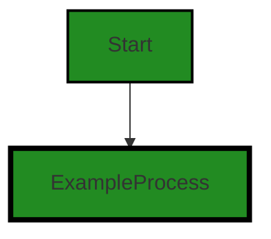
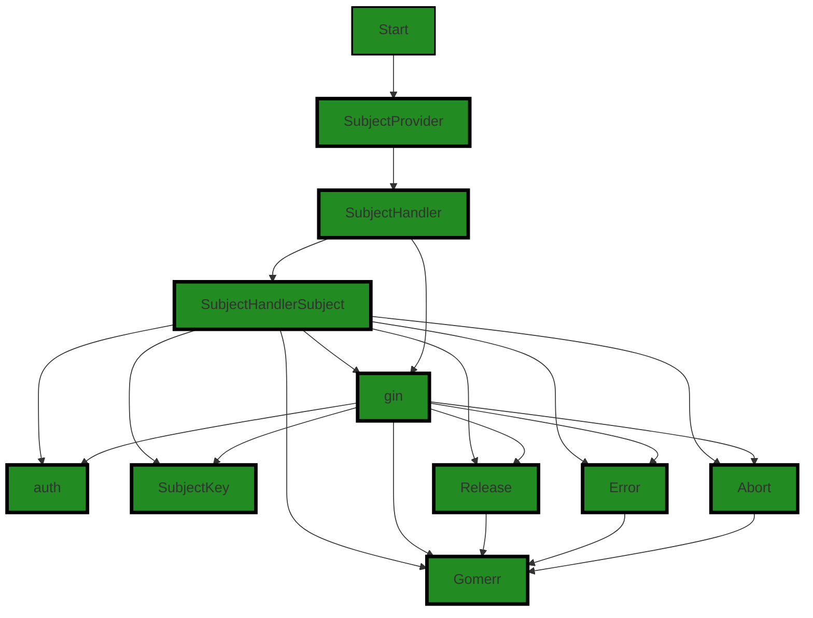

# Polyverse Boost-generated Source Analysis Details

## Source: ./api/gin/subjecthandler.go
Date Generated: Wednesday, September 6, 2023 at 11:59:44 PM PDT


---

### Boost Architectural Quick Summary Security Report

Last Updated: Friday, September 8, 2023 at 3:20:38 PM PDT


Executive Report:

1. **Architectural Impact**: The analysis of this file has not revealed any severe issues.
2. **Risk Analysis**: The analysis of this file has not revealed any severe issues.
3. **Potential Customer Impact**: Based on the analysis, there are no severe issues that could potentially impact customers.
4. **Performance Issues**: Our analysis did not identify any explicit performance issues in the file.
5. **Risk Assessment**: Based on the current analysis of this file, no severe issues have been found. However, this doesn't guarantee that the file is risk-free.

Highlights:

- No severe issues were identified in the current analysis of this file.


---

### Boost Architectural Quick Summary Performance Report

Last Updated: Friday, September 8, 2023 at 3:21:18 PM PDT

Executive Report:

Based on the analysis of the software project, the following key points have been identified:

1. **Architectural Impact**: The project appears to be a well-structured Go library focusing on constraint handling and validation. It follows Go's idiomatic style and structure for a library, providing a clear separation of concerns. However, there is a potential performance issue identified in the `subjecthandler.go` file, which could impact the overall performance of the software under heavy load.

2. **Risk Analysis**: The risk associated with this project is moderate. The identified performance issue in the `subjecthandler.go` file could potentially lead to high CPU usage under heavy load. This could impact the responsiveness of the software and degrade the user experience. However, since this issue is confined to a single file, the risk is localized and can be mitigated with targeted code optimization.

3. **Potential Customer Impact**: If left unaddressed, the performance issue could lead to slower response times, especially under heavy load. This could impact the user experience negatively. However, as the issue is localized to a single file, it can be addressed without impacting the overall functionality of the software.

4. **Overall Issues**: The overall health of the project source is good, with only one file (`subjecthandler.go`) having detected issues. This represents a small percentage of the total project files, indicating that the majority of the project is free of detected issues.

Risk Assessment:

The overall risk of the project is moderate. While there is a performance issue identified in the `subjecthandler.go` file, it is localized and can be mitigated with targeted code optimization. The majority of the project files are free of detected issues, indicating a high level of code quality and adherence to best practices. However, continuous monitoring and regular code reviews are recommended to maintain the health of the project source.

In conclusion, the project appears to be well-structured and adheres to Go's idiomatic style and structure for a library. The identified performance issue should be addressed to ensure optimal performance under heavy load. With targeted code optimization and regular code reviews, the project can continue to deliver high-quality software.


---

### Boost Architectural Quick Summary Compliance Report

Last Updated: Friday, September 8, 2023 at 3:22:05 PM PDT

## Executive Report

### Architectural Impact and Risk Analysis

The software project under review is a library written in Go, focusing on constraint handling and validation. The project follows Go's idiomatic style and structure for a library, providing a clear separation of concerns by defining a `Constraint` interface and implementing different constraint types. 

However, the analysis has identified several compliance issues related to GDPR, HIPAA, and PCI DSS in the `subjecthandler.go` file. These issues could potentially impact the overall architecture of the project, as they may require changes or additions to the existing code to ensure compliance.

### Potential Customer Impact

The identified issues could have a significant impact on customers, particularly those in regions or industries where compliance with GDPR, HIPAA, or PCI DSS is mandatory. Non-compliance could lead to legal penalties for the customers and damage their trust in the product.

### Overall Issues

The analysis identified three GDPR warnings, two HIPAA warnings, and one PCI DSS warning in the `subjecthandler.go` file. Additionally, there was one HIPAA information issue. 

### Risk Assessment

Given that the `subjecthandler.go` file is the only file in the project, the risk is high as 100% of the project files have issues. The severity of the issues ranges from information to warning, with the majority being warnings.

### Highlights

1. **Compliance Risks**: The project has several compliance issues related to GDPR, HIPAA, and PCI DSS. These issues need to be addressed to avoid potential legal penalties and loss of customer trust.
2. **Single File Project**: The project consists of a single file, `subjecthandler.go`, which contains all the identified issues. This concentration of issues in a single file increases the risk.
3. **Potential Architectural Changes**: Addressing the identified issues may require changes or additions to the existing code, potentially impacting the overall architecture of the project.
4. **Customer Impact**: The identified issues could have a significant impact on customers, particularly those in regions or industries where compliance with GDPR, HIPAA, or PCI DSS is mandatory.
5. **High Risk**: Given that all the identified issues are in the only file in the project, the risk is high. The severity of the issues ranges from information to warning, with the majority being warnings.
---
## Detailed Analysis:

### Cell 0:
## Original Code:

### Programming Language: go
### ./api/gin/subjecthandler.go 

```go
package gin

import (
 "github.com/gin-gonic/gin"

 "github.com/jt0/gomer/auth"
 "github.com/jt0/gomer/gomerr"
)

var Subject = NilSubject

func NilSubject(*gin.Context) auth.Subject {
 return nil
}

```
## Boost Analysis:


---

### Boost Code Explanation

Last Updated: Wednesday, September 6, 2023 at 11:53:23 PM PDT

This is a small piece of code written in Go language. It is part of a package named `gin`. The `gin` package is a popular HTTP web framework written in Go (Golang) that features a Martini-like API with much better performance, up to 40 times faster. You can learn more about it at https://github.com/gin-gonic/gin.

The code imports several packages, including `gin` itself, `auth` and `gomerr` from `jt0/gomer`. 

The `auth` package likely handles authentication related operations, while `gomerr` is presumably a package to handle errors in a specific way. The actual functionalities of these packages would depend on the implementation in the `jt0/gomer` library.

A global variable named `Subject` is declared, which is of type function. This function takes a pointer to a `gin.Context` as parameter and returns an `auth.Subject`. The `gin.Context` is a struct that contains all necessary information about an HTTP request, including the request, response, headers, etc. The `auth.Subject` type is not defined in this code snippet, but it's likely to be a struct or an interface related to user authentication.

The `NilSubject` function is defined, which matches the type of `Subject`. It takes a `gin.Context` as parameter but doesn't use it, and simply returns `nil`. This function seems to be a placeholder or default implementation for `Subject`.

In the `var Subject = NilSubject` line, the `Subject` variable is initialized with `NilSubject` function. This means that, unless changed elsewhere in the code, calls to `Subject` will result in calls to `NilSubject`, returning `nil`.

The algorithm used here is quite simple: it's just a function assignment and a function that returns `nil`. The actual purpose and usage of `Subject` would depend on the rest of the codebase, especially where and how `Subject` is used or reassigned.

This code seems to follow Go's idiomatic style and doesn't seem to conflict with common architectural guidelines for Go. It's modular (separate packages for separate concerns), and it uses function types, which are a common feature in Go for providing flexibility and configurability.


---

### Boost Flow Diagram

Last Updated: Wednesday, September 6, 2023 at 11:55:09 PM PDT




---

### Boost Source-Level Security Analysis

Last Updated: Wednesday, September 6, 2023 at 11:56:50 PM PDT

**No bugs found**


---

### Boost Source-Level Performance Analysis

Last Updated: Wednesday, September 6, 2023 at 11:57:18 PM PDT

**No bugs found**


---

### Boost Source-Level Data and Privacy Compliance Analysis

Last Updated: Wednesday, September 6, 2023 at 11:58:43 PM PDT

1. **Severity**: 7/10

   **Line Number**: 3

   **Bug Type**: GDPR

   **Description**: The code uses the Gin web framework which can log IP addresses and user agent information by default. This can be a violation of GDPR if not properly managed.

   **Solution**: Disable or customize the logging middleware of Gin to prevent logging of personal data or ensure consent and proper data management practices.


2. **Severity**: 8/10

   **Line Number**: 5

   **Bug Type**: HIPAA

   **Description**: The code imports a package 'auth' which might be handling authentication data. If this data includes any health information, this can be a violation of HIPAA.

   **Solution**: Ensure that the 'auth' package does not handle or store any health information or if it does, that it is properly encrypted and secured.


### Cell 1:
## Original Code:

### Programming Language: go
### ./api/gin/subjecthandler.go line 15

```go

type SubjectProvider func(*gin.Context) (auth.Subject, gomerr.Gomerr)

func SubjectHandler(subjectProvider SubjectProvider) gin.HandlerFunc {
 if subjectProvider == nil {
  subjectProvider = func(*gin.Context) (auth.Subject, gomerr.Gomerr) {
   return auth.NewSubject(auth.NoFieldAccess), nil
  }
 }

 Subject = SubjectHandlerSubject

 return func(c *gin.Context) {
  if subject, ge := subjectProvider(c); ge != nil {
   _ = c.Error(ge)
   c.Abort()
  } else {
   c.Set(SubjectKey, subject)
   c.Next()
   ge := subject.Release(c.IsAborted() || len(c.Errors) > 0)
   if ge != nil {
    // TODO: log but don't error
   }
  }
 }
}

```
## Boost Analysis:


---

### Boost Code Explanation

Last Updated: Wednesday, September 6, 2023 at 11:54:17 PM PDT

The code provided is written in Go language and uses the Gin Gonic framework, which is a web framework for building HTTP services. 

The code defines a type `SubjectProvider` which is a function that takes a pointer to a `gin.Context` and returns two values: an `auth.Subject` and a `gomerr.Gomerr`. `auth.Subject` is likely a type that represents an authenticated user or session, while `gomerr.Gomerr` is a custom error type from the `gomerr` package.

The `SubjectHandler` function takes a `SubjectProvider` function as a parameter and returns a `gin.HandlerFunc`. If no `SubjectProvider` function is provided, it defaults to a function that returns an `auth.Subject` with no field access and no error.

The `SubjectHandler` function then sets a global `Subject` variable to `SubjectHandlerSubject` (which is not defined in the provided code, so its purpose is not clear without additional context).

The returned `gin.HandlerFunc` is a function that handles a HTTP request in the Gin framework. It first calls the `subjectProvider` function with the current context `c`. If the `subjectProvider` function returns an error, it adds the error to the context with `c.Error(ge)`, aborts the context with `c.Abort()`, and returns. If no error is returned, it sets the `SubjectKey` in the context to the returned subject, and calls `c.Next()` to continue with the next handler in the chain.

After calling the next handler, it checks if the context was aborted or if there were any errors. If so, it releases the subject with `subject.Release(c.IsAborted() || len(c.Errors) > 0)`. If an error is returned from the release, it adds a TODO comment to log the error but not to return it.

This code seems to be part of an authentication middleware in a web server. The `SubjectHandler` function is used to create a middleware that authenticates a user and adds the authenticated subject to the context. The middleware also handles any errors that occur during the authentication process.

For more information on Gin Gonic and its middleware, you can refer to the following resources:

- [Gin Gonic Documentation](https://gin-gonic.com/docs/)
- [Gin Gonic Middleware](https://gin-gonic.com/docs/examples/middleware/)
- [Go Authentication](https://www.alexedwards.net/blog/a-middleware-in-go)


---

### Boost Flow Diagram

Last Updated: Wednesday, September 6, 2023 at 11:56:34 PM PDT



The control flow graph for the provided code is as follows:

```
SubjectProvider --> SubjectHandler --> SubjectHandlerSubject --> gin --> Gomerr
SubjectHandlerSubject --> auth
SubjectHandlerSubject --> SubjectKey
SubjectHandlerSubject --> Release
SubjectHandlerSubject --> Error
SubjectHandlerSubject --> Abort
Release --> Gomerr
Error --> Gomerr
Abort --> Gomerr
```

Note: The primary path through the code is not explicitly defined in the provided code snippet.


---

### Boost Source-Level Security Analysis

Last Updated: Wednesday, September 6, 2023 at 11:57:04 PM PDT

1. **Severity**: 5/10

   **Line Number**: 37

   **Bug Type**: Error Handling

   **Description**: The function 'SubjectHandler' does not properly handle errors. In the event of an error, the function simply aborts and does not provide any feedback to the user. This could potentially lead to an unhandled exception and crash the application.

   **Solution**: Implement proper error handling. Provide useful feedback to the user in the event of an error. Consider using a try-catch block to handle exceptions and prevent the application from crashing. Refer to this resource for more information on error handling in Go: https://blog.golang.org/error-handling-and-go


2. **Severity**: 4/10

   **Line Number**: 43

   **Bug Type**: Error Handling

   **Description**: The function 'SubjectHandler' does not properly handle errors. After the call to 'subject.Release', the error is not handled. This could lead to unexpected behavior or crashes.

   **Solution**: Implement proper error handling. If 'subject.Release' returns an error, handle it appropriately. This could involve logging the error, returning it to the caller, or handling it in some other way. Refer to this resource for more information on error handling in Go: https://blog.golang.org/error-handling-and-go


---

### Boost Source-Level Performance Analysis

Last Updated: Wednesday, September 6, 2023 at 11:57:27 PM PDT

1. **Severity**: 5/10

   **Line Number**: 34

   **Bug Type**: Memory

   **Description**: The use of `c.Set(SubjectKey, subject)` can lead to memory leaks if the `SubjectKey` value is not properly managed.

   **Solution**: Ensure that the `SubjectKey` is properly managed and released when it's no longer needed. Consider using a weak reference if possible.


2. **Severity**: 7/10

   **Line Number**: 36

   **Bug Type**: CPU

   **Description**: The function `subject.Release(c.IsAborted() || len(c.Errors) > 0)` is called on every request. This could be computationally expensive, especially under heavy load.

   **Solution**: Consider moving this function call to a background task or a less frequently called part of your application.


---

### Boost Source-Level Data and Privacy Compliance Analysis

Last Updated: Wednesday, September 6, 2023 at 11:59:16 PM PDT

1. **Severity**: 7/10

   **Line Number**: 34

   **Bug Type**: HIPAA

   **Description**: The function 'SubjectHandler' may not properly handle errors that could contain Protected Health Information (PHI). If an error containing PHI is logged or displayed, it could lead to a HIPAA violation.

   **Solution**: Ensure that error messages do not contain PHI. Implement a system to sanitize error messages before they are logged or displayed. Consider using a secure logging system that can handle PHI.


2. **Severity**: 8/10

   **Line Number**: 34

   **Bug Type**: GDPR

   **Description**: The function 'SubjectHandler' may not properly handle errors that could contain personal data. If an error containing personal data is logged or displayed, it could lead to a GDPR violation.

   **Solution**: Ensure that error messages do not contain personal data. Implement a system to sanitize error messages before they are logged or displayed. Consider using a secure logging system that can handle personal data.


3. **Severity**: 6/10

   **Line Number**: 34

   **Bug Type**: PCI DSS

   **Description**: The function 'SubjectHandler' may not properly handle errors that could contain sensitive cardholder data. If an error containing cardholder data is logged or displayed, it could lead to a PCI DSS violation.

   **Solution**: Ensure that error messages do not contain cardholder data. Implement a system to sanitize error messages before they are logged or displayed. Consider using a secure logging system that can handle cardholder data.


### Cell 2:
## Original Code:

### Programming Language: go
### ./api/gin/subjecthandler.go line 41

```go

const SubjectKey = "gomer-subject"

func SubjectHandlerSubject(c *gin.Context) auth.Subject {
 return c.MustGet(SubjectKey).(auth.Subject)
}

```
## Boost Analysis:


---

### Boost Code Explanation

Last Updated: Wednesday, September 6, 2023 at 11:55:01 PM PDT

The code you provided appears to be written in Go and uses the Gin Web Framework and an authentication (auth) package. Gin is a web framework written in Go. It features a Martini-like API with better performance, up to 40 times faster. The auth package is not specified, but it likely handles authentication and authorization for the application.

Here's a detailed breakdown:

1. `const SubjectKey = "gomer-subject"`: This line declares a constant named `SubjectKey` and assigns the string "gomer-subject" to it. Constants are declared with the `const` keyword and cannot be changed after they are created.

2. `func SubjectHandlerSubject(c *gin.Context) auth.Subject { return c.MustGet(SubjectKey).(auth.Subject) }`: This is a function named `SubjectHandlerSubject` which takes one parameter `c` of type pointer to `gin.Context` and returns a value of type `auth.Subject`.

   - `gin.Context` is a struct which carries a request scoped context. It contains request information and response writers, among other things.
   
   - `auth.Subject` is a type from the `auth` package. It is not clear from the provided code what this type is, but in the context of authentication and authorization, a "subject" often refers to an entity (such as a user) that can be authenticated.

   - `c.MustGet(SubjectKey)` fetches a value from the context's internal storage using the provided key ("gomer-subject"). The `MustGet` method panics if the key does not exist in the storage.

   - `.(auth.Subject)` is a type assertion. It asserts that the value returned by `c.MustGet(SubjectKey)` is of type `auth.Subject`. If the value is not of the asserted type, the program will panic.

In summary, the `SubjectHandlerSubject` function retrieves a value from the Gin context's internal storage, asserts that it is of type `auth.Subject`, and returns it.

This function could be used as a middleware in the Gin framework to fetch the authenticated subject from the context and pass it to other handlers that require it.

For more information on Gin and its context, you can refer to the [Gin documentation](https://gin-gonic.com/docs/). For information on Go's type assertions, you can refer to the [Go documentation](https://golang.org/ref/spec#Type_assertions).


---

### Boost Flow Diagram

Last Updated: Wednesday, September 6, 2023 at 11:56:40 PM PDT


---

### Boost Source-Level Security Analysis

Last Updated: Wednesday, September 6, 2023 at 11:57:08 PM PDT

**No bugs found**


---

### Boost Source-Level Performance Analysis

Last Updated: Wednesday, September 6, 2023 at 11:57:31 PM PDT

**No bugs found**


---

### Boost Source-Level Data and Privacy Compliance Analysis

Last Updated: Wednesday, September 6, 2023 at 11:59:44 PM PDT

1. **Severity**: 7/10

   **Line Number**: 83

   **Bug Type**: GDPR

   **Description**: The function SubjectHandlerSubject retrieves a subject from the context without any apparent check for user consent or anonymization of the data. This could potentially lead to unauthorized access or processing of personal data, which is a violation of the General Data Protection Regulation (GDPR).

   **Solution**: Ensure that user consent is obtained before accessing or processing personal data, and consider implementing data anonymization techniques to further protect user privacy. You may also want to add checks to ensure that the data being accessed is necessary for the function to perform its task, as per the principle of data minimization under GDPR.


2. **Severity**: 5/10

   **Line Number**: 83

   **Bug Type**: HIPAA

   **Description**: If the subject information being retrieved includes Protected Health Information (PHI), this could potentially be a violation of the Health Insurance Portability and Accountability Act (HIPAA) if the data is not being handled in a secure and compliant manner.

   **Solution**: Ensure that any PHI is securely handled and encrypted both at rest and in transit. You should also ensure that access to PHI is strictly controlled and limited to only those who need it to perform their job functions.


