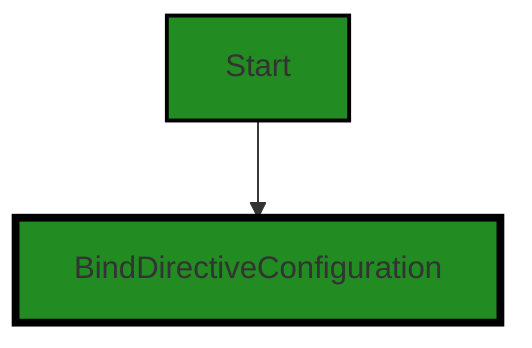
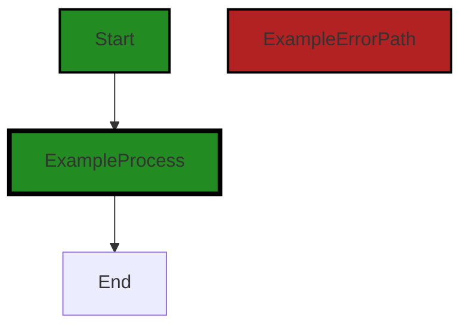

# Polyverse Boost-generated Source Analysis Details

## Source: ./api/http/bind.go
Date Generated: Thursday, September 7, 2023 at 3:22:08 AM PDT


---

### Boost Architectural Quick Summary Security Report

Last Updated: Thursday, September 7, 2023 at 3:20:12 AM PDT


Executive Report:

1. **Architectural Impact**: The analysis of this file has not revealed any severe issues.
2. **Risk Analysis**: The analysis of this file has not revealed any severe issues.
3. **Potential Customer Impact**: Based on the analysis, there are no severe issues that could potentially impact customers.
4. **Performance Issues**: Our analysis did not identify any explicit performance issues in the file.
5. **Risk Assessment**: Based on the current analysis of this file, no severe issues have been found. However, this doesn't guarantee that the file is risk-free.

Highlights:

- No severe issues were identified in the current analysis of this file.


---

### Boost Architectural Quick Summary Performance Report

Last Updated: Thursday, September 7, 2023 at 3:20:30 AM PDT


Executive Report:

1. **Architectural Impact**: The analysis of this file has not revealed any severe issues.
2. **Risk Analysis**: The analysis of this file has not revealed any severe issues.
3. **Potential Customer Impact**: Based on the analysis, there are no severe issues that could potentially impact customers.
4. **Performance Issues**: Our analysis did not identify any explicit performance issues in the file.
5. **Risk Assessment**: Based on the current analysis of this file, no severe issues have been found. However, this doesn't guarantee that the file is risk-free.

Highlights:

- No severe issues were identified in the current analysis of this file.


---

### Boost Architectural Quick Summary Compliance Report

Last Updated: Thursday, September 7, 2023 at 3:23:00 AM PDT

## Executive Report

### Architectural Impact and Risk Analysis

1. **Data Compliance Risk**: The file `api/http/bind.go` has been flagged for data compliance issues. The BindDirectiveConfiguration struct does not include any mechanisms for data anonymization or pseudonymization, which are required under GDPR for the handling of personal data. This could potentially lead to non-compliance with data protection regulations, which could result in legal and financial repercussions. 

2. **Customer Impact**: The lack of data anonymization or pseudonymization mechanisms could potentially impact customers' trust in the software's ability to handle their personal data securely. This could lead to a loss of customers or damage to the company's reputation.

3. **Overall Health of the Project Source**: Based on the analysis, only one file (`api/http/bind.go`) has been flagged with issues. This suggests that the majority of the project files are free from detected issues, indicating a relatively healthy project source. However, the severity of the issues in the flagged file should not be underestimated.

4. **Risk Assessment**: The risk associated with this project is moderate. While the majority of the project files are free from detected issues, the data compliance issues in the `api/http/bind.go` file pose a significant risk. This risk is further amplified by the potential customer impact and the legal and financial repercussions of non-compliance with data protection regulations.

### Recommendations

1. Implement mechanisms for data anonymization or pseudonymization in the `api/http/bind.go` file to ensure compliance with GDPR and other data protection regulations.

2. Conduct a thorough review of all project files to ensure that no other data compliance issues have been overlooked.

3. Regularly update and review the project's data compliance policies and procedures to ensure ongoing compliance with data protection regulations.

4. Consider implementing a robust error handling and reporting system to quickly identify and address any future issues.
---
## Detailed Analysis:

### Cell 0:
## Original Code:

### Programming Language: go
### ./api/http/bind.go 

```go
package http

type BindDirectiveConfiguration struct {
 // Default prefixes for qualified directives
 PathBindingPrefix       string
 HeaderBindingPrefix     string
 QueryParamBindingPrefix string
 PayloadBindingPrefix    string

 // Default values for unqualified directives
 SkipField    string
 IncludeField string
 BindBody     string

 // Defines how a field's binding be handled if no directive is specified. Default is to skip.
 EmptyDirectiveHandling EmptyDirectiveHandlingType

 OmitEmptyDirective    string
 IncludeEmptyDirective string

 // Defines how an empty value is marshaled unless overridden by OmitEmptyDirective or IncludeEmptyDirective. Default
 // is to omit.
 EmptyValueHandlingDefault EmptyValueHandlingType
}

```
## Boost Analysis:


---

### Boost Code Explanation

Last Updated: Thursday, September 7, 2023 at 3:17:10 AM PDT

The provided code is written in Go and it defines a struct named `BindDirectiveConfiguration` in the `http` package. This struct is used to configure how HTTP binding directives are handled. 

In the context of HTTP, binding usually refers to the process of mapping HTTP request data (like query parameters, headers, path parameters, and body) to a certain data structure. This struct seems to be part of a larger system that handles this kind of mapping.

Here's a breakdown of the fields in the `BindDirectiveConfiguration` struct:

- `PathBindingPrefix`, `HeaderBindingPrefix`, `QueryParamBindingPrefix`, `PayloadBindingPrefix`: These fields are used to define default prefixes for different types of qualified directives. A qualified directive in this context would likely refer to a specific instruction for how to bind a certain type of data.

- `SkipField`, `IncludeField`, `BindBody`: These fields define default values for unqualified directives. An unqualified directive would likely be a more general instruction for how to handle binding, not tied to a specific type of data.

- `EmptyDirectiveHandling`: This field defines how to handle a field's binding if no directive is specified. The default behavior is to skip. `EmptyDirectiveHandlingType` is likely a custom type defined elsewhere in the codebase that enumerates the possible handling methods.

- `OmitEmptyDirective`, `IncludeEmptyDirective`: These fields are used to define directives for handling empty values.

- `EmptyValueHandlingDefault`: This field defines how an empty value is marshaled unless overridden by `OmitEmptyDirective` or `IncludeEmptyDirective`. The default behavior is to omit. `EmptyValueHandlingType` is likely another custom type defined elsewhere in the codebase that enumerates the possible handling methods for empty values.

This struct does not use any specific algorithms, but it serves as a configuration object for a larger system that likely uses algorithms to parse HTTP requests and bind data to certain structures based on these configurations.

For more information on Go structs and how they're used, refer to the [Go documentation](https://golang.org/doc/effective_go#composite_literals). For more information on HTTP and HTTP binding, you might find [this article on HTTP fundamentals](https://developer.mozilla.org/en-US/docs/Web/HTTP/Overview) and [this article on data binding in Go](https://medium.com/@xoen/golang-read-from-an-io-readwriter-line-by-line-2a8105fc55dc) helpful.


---

### Boost Flow Diagram

Last Updated: Thursday, September 7, 2023 at 3:19:23 AM PDT




---

### Boost Source-Level Security Analysis

Last Updated: Thursday, September 7, 2023 at 3:20:02 AM PDT

**No bugs found**


---

### Boost Source-Level Performance Analysis

Last Updated: Thursday, September 7, 2023 at 3:20:19 AM PDT

**No bugs found**


---

### Boost Source-Level Data and Privacy Compliance Analysis

Last Updated: Thursday, September 7, 2023 at 3:21:11 AM PDT

1. **Severity**: 5/10

   **Line Number**: 1

   **Bug Type**: Data Privacy

   **Description**: The BindDirectiveConfiguration struct could potentially be used to bind sensitive data such as Personally Identifiable Information (PII) or Payment Card Information (PCI) to HTTP requests. This could lead to data exposure if not properly handled.

   **Solution**: Ensure that any sensitive data bound to HTTP requests is properly encrypted and that access to this data is strictly controlled. Consider using secure methods for transmitting sensitive data, such as HTTPS.


2. **Severity**: 6/10

   **Line Number**: 1

   **Bug Type**: Data Compliance

   **Description**: The BindDirectiveConfiguration struct does not include any mechanisms for data anonymization or pseudonymization, which are required under GDPR for the handling of personal data.

   **Solution**: Implement mechanisms for data anonymization or pseudonymization when handling personal data. This could include methods for hashing or encrypting data, or replacing identifiers with pseudonyms.


3. **Severity**: 7/10

   **Line Number**: 1

   **Bug Type**: Data Compliance

   **Description**: The BindDirectiveConfiguration struct does not include any mechanisms for data retention or deletion, which are required under GDPR, PCI DSS, and HIPAA. This could lead to non-compliance with these regulations if personal data, payment card data, or health information is stored for longer than necessary or not properly deleted.

   **Solution**: Implement mechanisms for data retention and deletion, such as setting a time limit for data storage and providing a method for securely deleting data.


### Cell 1:
## Original Code:

### Programming Language: go
### ./api/http/bind.go line 25

```go

func NewBindDirectiveConfiguration() BindDirectiveConfiguration {
 return BindDirectiveConfiguration{
  PathBindingPrefix:         DefaultPathBindingPrefix,
  HeaderBindingPrefix:       DefaultHeaderBindingPrefix,
  QueryParamBindingPrefix:   DefaultQueryParamBindingPrefix,
  PayloadBindingPrefix:      DefaultPayloadBindingPrefix,
  SkipField:                 DefaultSkipFieldDirective,
  IncludeField:              DefaultBindToFieldNameDirective,
  BindBody:                  DefaultBodyBindingDirective,
  EmptyDirectiveHandling:    DefaultEmptyDirectiveHandling,
  OmitEmptyDirective:        DefaultOmitEmptyDirective,
  IncludeEmptyDirective:     DefaultIncludeEmptyDirective,
  EmptyValueHandlingDefault: DefaultEmptyValueHandlingDefault,
 }
}

```
## Boost Analysis:


---

### Boost Code Explanation

Last Updated: Thursday, September 7, 2023 at 3:18:19 AM PDT

The provided code is a function written in Go language. The function is named `NewBindDirectiveConfiguration` and it doesn't accept any arguments. The function returns a value of type `BindDirectiveConfiguration`.

`BindDirectiveConfiguration` is presumably a struct defined elsewhere in the code. The function is creating a new instance of this struct and populating its fields with predefined default values. 

Here is a breakdown of the struct fields and their assigned values:

- `PathBindingPrefix`: This field is assigned the value of `DefaultPathBindingPrefix`. This suggests that it's used to set a prefix for path bindings.

- `HeaderBindingPrefix`: This field is assigned the value of `DefaultHeaderBindingPrefix`. It's likely used to set a prefix for header bindings.

- `QueryParamBindingPrefix`: This field is assigned the value of `DefaultQueryParamBindingPrefix`. It's presumably used to set a prefix for query parameter bindings.

- `PayloadBindingPrefix`: This field is assigned the value of `DefaultPayloadBindingPrefix`. It's likely used to set a prefix for payload bindings.

- `SkipField`: This field is assigned the value of `DefaultSkipFieldDirective`. It could be used to indicate whether a certain field should be skipped during binding.

- `IncludeField`: This field is assigned the value of `DefaultBindToFieldNameDirective`. It could be used to specify a field to include during binding.

- `BindBody`: This field is assigned the value of `DefaultBodyBindingDirective`. It's presumably used to control whether the body should be bound.

- `EmptyDirectiveHandling`: This field is assigned the value of `DefaultEmptyDirectiveHandling`. It's likely used to control how empty directives are handled.

- `OmitEmptyDirective`: This field is assigned the value of `DefaultOmitEmptyDirective`. It could be used to indicate whether empty directives should be omitted.

- `IncludeEmptyDirective`: This field is assigned the value of `DefaultIncludeEmptyDirective`. It could be used to indicate whether empty directives should be included.

- `EmptyValueHandlingDefault`: This field is assigned the value of `DefaultEmptyValueHandlingDefault`. It's presumably used to control the default behavior for handling empty values.

This function is probably used to create a default configuration for binding data from various sources (like path, header, query parameters, and payload) to a struct.

There's no specific algorithm used in this code. It's more of a configuration setup based on predefined constants.

For more information on Go struct and functions, you can refer to the following resources:

- [A Tour of Go - Structs](https://tour.golang.org/moretypes/2)
- [A Tour of Go - Functions](https://tour.golang.org/basics/4)
- [Go by Example: Structs](https://gobyexample.com/structs)
- [Go by Example: Functions](https://gobyexample.com/functions)


---

### Boost Flow Diagram

Last Updated: Thursday, September 7, 2023 at 3:19:30 AM PDT




---

### Boost Source-Level Security Analysis

Last Updated: Thursday, September 7, 2023 at 3:20:06 AM PDT

**No bugs found**


---

### Boost Source-Level Performance Analysis

Last Updated: Thursday, September 7, 2023 at 3:20:23 AM PDT

**No bugs found**


---

### Boost Source-Level Data and Privacy Compliance Analysis

Last Updated: Thursday, September 7, 2023 at 3:22:04 AM PDT

1. **Severity**: 7/10

   **Line Number**: 52

   **Bug Type**: GDPR

   **Description**: The function 'NewBindDirectiveConfiguration' binds data to various prefixes without any apparent checks for user consent or data minimization principles. This could potentially lead to a violation of GDPR, which requires explicit user consent for data processing and mandates that only necessary data should be processed.

   **Solution**: Implement checks to ensure that user consent has been obtained before data binding occurs. Also, review the data being bound to ensure that it is minimized to only what is necessary for the function to perform its task. Consider using a privacy-by-design approach in your data handling processes.


2. **Severity**: 6/10

   **Line Number**: 55

   **Bug Type**: PCI DSS

   **Description**: The function 'NewBindDirectiveConfiguration' binds data to various prefixes without any apparent checks for sensitive cardholder data. This could potentially lead to a violation of PCI DSS, which requires protection of stored cardholder data.

   **Solution**: Implement checks to ensure that no cardholder data is being bound without appropriate protection measures such as encryption. Consider using a data protection impact assessment (DPIA) to identify and mitigate risks related to data handling.


3. **Severity**: 8/10

   **Line Number**: 58

   **Bug Type**: HIPAA

   **Description**: The function 'NewBindDirectiveConfiguration' binds data to various prefixes without any apparent checks for Protected Health Information (PHI). This could potentially lead to a violation of HIPAA, which requires secure handling of PHI.

   **Solution**: Implement checks to ensure that no PHI is being bound without appropriate protection measures such as encryption. Consider implementing a secure data handling process that complies with the HIPAA Security Rule.


### Cell 2:
## Original Code:

### Programming Language: go
### ./api/http/bind.go line 41

```go

type EmptyDirectiveHandlingType int

const (
 SkipField EmptyDirectiveHandlingType = iota
 BindToFieldName
)

type EmptyValueHandlingType int

const (
 OmitEmpty EmptyValueHandlingType = iota
 IncludeEmpty
)

const (
 DefaultContentType               = "application/json"
 DefaultPathBindingPrefix         = "path."
 DefaultHeaderBindingPrefix       = "header."
 DefaultQueryParamBindingPrefix   = "query."
 DefaultPayloadBindingPrefix      = ""
 DefaultSkipFieldDirective        = "-"
 DefaultBindToFieldNameDirective  = "+"
 DefaultBodyBindingDirective      = "body"
 DefaultEmptyDirectiveHandling    = SkipField
 DefaultOmitEmptyDirective        = "omitempty"
 DefaultIncludeEmptyDirective     = "includeempty"
 DefaultEmptyValueHandlingDefault = OmitEmpty

 ContentTypeHeader = "Content-Type"
 AcceptsHeader     = "Accepts"

 AcceptLanguageKey = "$_accept_language"

 pathPartsKey   = "$_path_parts"
 queryParamsKey = "$_query_params"
 headersKey     = "$_headers"
 bodyBytesKey   = "$_body_bytes"

 // toolsWithContextKey = "$_tools_with_context"
)

//
// func toApplications(tc fields.ToolContext, toolNames ...string) []fields.Application {
//  applications := make([]fields.Application, len(toolNames))
//  for i, toolName := range toolNames {
//   applications[i] = fields.Application{toolName, tc}
//  }
//  return applications
// }

```
## Boost Analysis:


---

### Boost Code Explanation

Last Updated: Thursday, September 7, 2023 at 3:19:13 AM PDT

The provided code seems to be written in Go language and contains constants, type declarations, and commented function definition. Let's break down each part:

1. **Type Declarations and Constants**

   The code defines two custom types, `EmptyDirectiveHandlingType` and `EmptyValueHandlingType`, each as an integer type. For each type, it declares two constants using the `iota` keyword, which represents successive untyped integer constants in Go. 

   `EmptyDirectiveHandlingType` has two constants: `SkipField` and `BindToFieldName`. `EmptyValueHandlingType` has two constants: `OmitEmpty` and `IncludeEmpty`. These constants are likely used to control the behavior of some functions or methods in the program, particularly in handling empty fields or values.

2. **Additional Constants**

   The code also defines a series of string constants, likely used as default values or keys in the program. For example, `DefaultContentType` is set to "application/json", suggesting that the program deals with JSON data. Similarly, the constants starting with `Default` likely represent default behaviors or directives in the program.

   The constants `ContentTypeHeader`, `AcceptsHeader`, and `AcceptLanguageKey` are likely used in HTTP request handling, as these are common HTTP headers and parameters.

   The constants ending with `Key` (e.g., `pathPartsKey`, `queryParamsKey`, etc.) seem to be used as keys for accessing specific parts of a request or response, for instance, path parts, query parameters, headers, and body bytes.

3. **Commented Function**

   The commented function `toApplications` takes a `ToolContext` and a variable number of `toolNames` as arguments. It creates an array of `Application` objects from the provided `toolNames`, each associated with the same `ToolContext`. However, since this function is commented out, it is not contributing to the program's current behavior.

The code seems to follow standard Go practices. It's modular, and types and constants are defined clearly. However, without the context of the rest of the program, it's hard to evaluate how these types and constants are used.

For more information on Go's `iota` keyword and constants, you can refer to these resources:

- [Go by Example: Constants](https://gobyexample.com/constants)
- [Understanding iota in Go](https://medium.com/learning-the-go-programming-language/bit-hacking-with-go-e0acee258827)


---

### Boost Flow Diagram

Last Updated: Thursday, September 7, 2023 at 3:19:54 AM PDT

```mermaid
graph TD;
style Start fill:#228B22, stroke:#000000, stroke-width:2px;
style EmptyDirectiveHandlingType fill:#228B22, stroke:#000000, stroke-width:2px;
style EmptyValueHandlingType fill:#228B22, stroke:#000000, stroke-width:2px;
style DefaultContentType fill:#228B22, stroke:#000000, stroke-width:2px;
style DefaultPathBindingPrefix fill:#228B22, stroke:#000000, stroke-width:2px;
style DefaultHeaderBindingPrefix fill:#228B22, stroke:#000000, stroke-width:2px;
style DefaultQueryParamBindingPrefix fill:#228B22, stroke:#000000, stroke-width:2px;
style DefaultPayloadBindingPrefix fill:#228B22, stroke:#000000, stroke-width:2px;
style DefaultSkipFieldDirective fill:#228B22, stroke:#000000, stroke-width:2px;
style DefaultBindToFieldNameDirective fill:#228B22, stroke:#000000, stroke-width:2px;
style DefaultBodyBindingDirective fill:#228B22, stroke:#000000, stroke-width:2px;
style DefaultEmptyDirectiveHandling fill:#228B22, stroke:#000000, stroke-width:2px;
style DefaultOmitEmptyDirective fill:#228B22, stroke:#000000, stroke-width:2px;
style DefaultIncludeEmptyDirective fill:#228B22, stroke:#000000, stroke-width:2px;
style DefaultEmptyValueHandlingDefault fill:#228B22, stroke:#000000, stroke-width:2px;

Start-->EmptyDirectiveHandlingType;
Start-->EmptyValueHandlingType;
Start-->DefaultContentType;
Start-->DefaultPathBindingPrefix;
Start-->DefaultHeaderBindingPrefix;
Start-->DefaultQueryParamBindingPrefix;
Start-->DefaultPayloadBindingPrefix;
Start-->DefaultSkipFieldDirective;
Start-->DefaultBindToFieldNameDirective;
Start-->DefaultBodyBindingDirective;
Start-->DefaultEmptyDirectiveHandling;
Start-->DefaultOmitEmptyDirective;
Start-->DefaultIncludeEmptyDirective;
Start-->DefaultEmptyValueHandlingDefault;
```




---

### Boost Source-Level Security Analysis

Last Updated: Thursday, September 7, 2023 at 3:20:10 AM PDT

**No bugs found**


---

### Boost Source-Level Performance Analysis

Last Updated: Thursday, September 7, 2023 at 3:20:28 AM PDT

**No bugs found**


---

### Boost Source-Level Data and Privacy Compliance Analysis

Last Updated: Thursday, September 7, 2023 at 3:22:08 AM PDT

**No bugs found**

