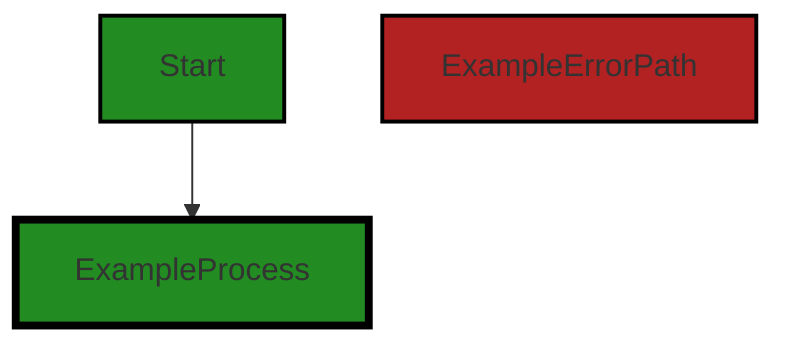
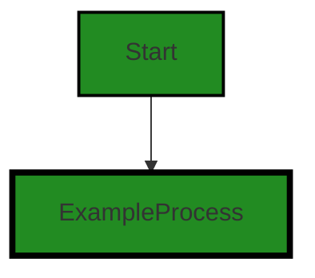
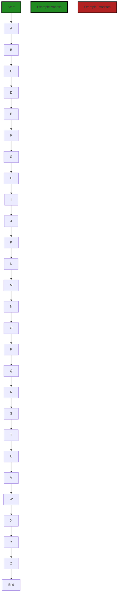
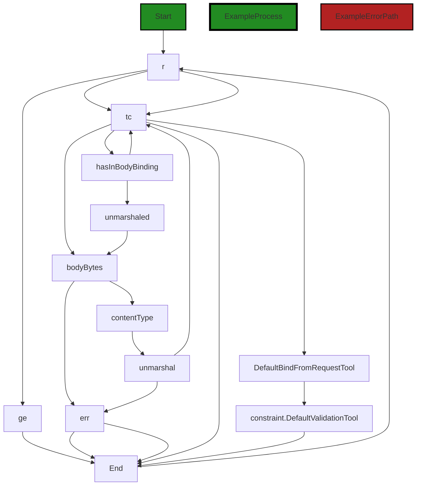
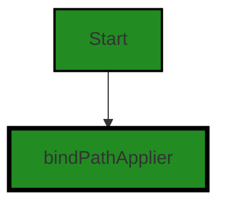
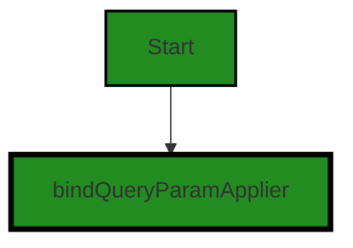
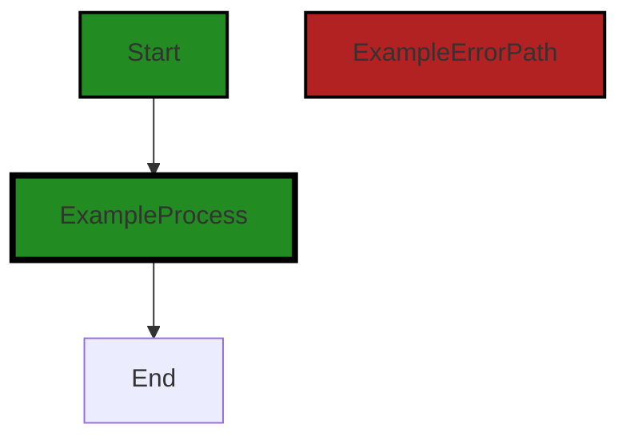
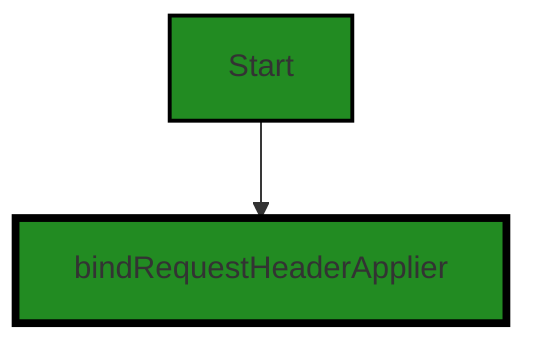
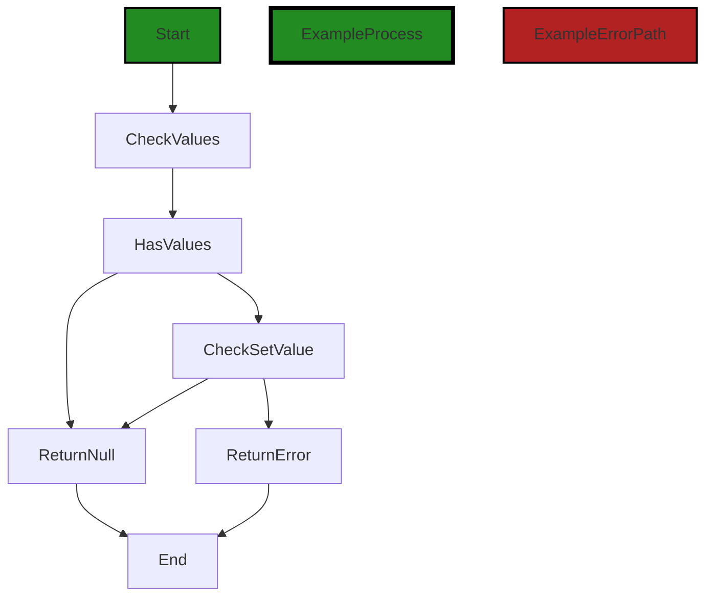
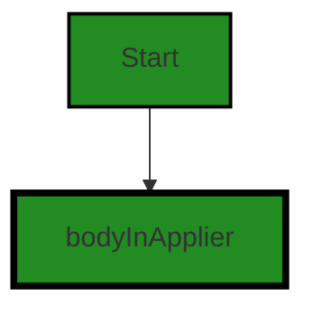

# Polyverse Boost-generated Source Analysis Details

## Source: ./api/http/bindfromrequest.go
Date Generated: Thursday, September 7, 2023 at 2:22:58 AM PDT


---

### Boost Architectural Quick Summary Security Report

Last Updated: Friday, September 8, 2023 at 3:29:27 PM PDT

## Executive Report

### Architectural Impact and Risk Analysis

The software project under review is a library written in Go that focuses on constraint handling and validation. The project follows Go's idiomatic style and structure for a library, providing a clear separation of concerns by defining a `Constraint` interface and implementing different constraint types. 

However, the analysis of the project's source code has revealed several high-severity issues that could potentially impact the overall architecture and functionality of the project. These issues are primarily located in the `api/http/bindfromrequest.go` file.

### Potential Customer Impact

The identified issues, if not addressed, could lead to serious security vulnerabilities, including arbitrary code execution, privilege escalation, or Denial of Service (DoS). This could potentially impact the customers who use this library in their projects, as it could expose their applications to security risks.

### Overall Issues for the Software Project

The analysis has identified several issues of varying severity in the `api/http/bindfromrequest.go` file. These issues include Insecure Deserialization, Insecure Equality Testing, Uncontrolled Resource Consumption ('Resource Exhaustion'), Improper Input Validation, Improper Error Handling, and Information Exposure Through Sent Parameter (CWE-598).

### Risk Assessment

Based on the analysis, the overall health of the project source is concerning. The `api/http/bindfromrequest.go` file, which is the only file in the project, has several high-severity issues. This means that 100% of the project files have issues of high severity.

### Highlights of the Analysis

1. **Insecure Deserialization**: The project has 2 instances of insecure deserialization in the `api/http/bindfromrequest.go` file. This could potentially lead to arbitrary code execution, privilege escalation, or Denial of Service (DoS).

2. **Insecure Equality Testing**: The project has 1 instance of insecure equality testing in the `api/http/bindfromrequest.go` file. This could potentially lead to false positives in equality checks, which could allow an attacker to bypass certain security checks.

3. **Uncontrolled Resource Consumption ('Resource Exhaustion')**: The project has 1 instance of uncontrolled resource consumption in the `api/http/bindfromrequest.go` file. This could potentially lead to a Denial of Service (DoS) attack.

4. **Improper Input Validation and Error Handling**: The project has 1 instance each of improper input validation and error handling in the `api/http/bindfromrequest.go` file. These could potentially lead to injection attacks and information disclosure.

5. **Information Exposure Through Sent Parameter (CWE-598)**: The project has 2 instances of information exposure through sent parameter in the `api/http/bindfromrequest.go` file. This could potentially lead to sensitive information disclosure.

In conclusion, while the project follows Go's idiomatic style and structure for a library, the high-severity issues identified in the source code could potentially impact the overall architecture and functionality of the project, as well as expose customers to security risks. It is recommended that these issues be addressed as soon as possible to mitigate these risks.


---

### Boost Architectural Quick Summary Performance Report

Last Updated: Friday, September 8, 2023 at 3:30:20 PM PDT

## Executive Report

### Architectural Impact and Risk Analysis

The software project under review is a library written in Go, focusing on constraint handling and validation. The project follows Go's idiomatic style and structure for a library, providing a clear separation of concerns by defining a `Constraint` interface and implementing different constraint types.

However, the analysis has identified some potential issues that could impact the performance and efficiency of the software. These issues are primarily related to the use of the `reflect` package and the `reflect.DeepEqual()` function in the `api/http/bindfromrequest.go` file. 

### Potential Customer Impact

The identified issues could potentially impact the performance of the software, especially if the library is used in a high-load environment or with large data structures. This could lead to slower response times and a degraded user experience. 

### Overall Issues

The analysis has identified 8 high-severity issues related to memory and CPU usage in the `api/http/bindfromrequest.go` file. Additionally, 3 warning-level issues were identified in the same file. 

### Risk Assessment

Given that the issues were found in only one file, the overall health of the project source seems to be good. However, the severity of the issues in the `api/http/bindfromrequest.go` file could pose a risk to the performance and efficiency of the software.

### Highlights

1. **Performance and Efficiency Risks:** The use of the `reflect` package and the `reflect.DeepEqual()` function in the `api/http/bindfromrequest.go` file could significantly slow down the program and consume more CPU resources. This could impact the performance and efficiency of the software, especially in high-load environments or with large data structures.

2. **Potential User Impact:** The identified performance and efficiency issues could lead to slower response times and a degraded user experience, potentially impacting customer satisfaction.

3. **Overall Project Health:** The issues were found in only one file out of the entire project, suggesting that the overall health of the project source is good. However, the severity of the issues in the `api/http/bindfromrequest.go` file could pose a risk to the performance and efficiency of the software.

4. **Risk Mitigation:** To mitigate the identified risks, consider alternatives to using reflection, limit its use to initialization or infrequent operations, and consider caching the results of reflection operations if they are used frequently on the same types. Also, consider using a custom comparison function that directly compares the fields of `requestConfig` and `requestConfiguration` to avoid the overhead of using reflection.

5. **Architectural Soundness:** Despite the identified issues, the project follows Go's idiomatic style and structure for a library, providing a clear separation of concerns by defining a `Constraint` interface and implementing different constraint types. This suggests that the project is architecturally sound.


---

### Boost Architectural Quick Summary Compliance Report

Last Updated: Friday, September 8, 2023 at 3:31:09 PM PDT

Executive Level Report:

1. **Architectural Impact**: The architectural impact of the issues found in the project is significant. The file `api/http/bindfromrequest.go` has multiple severe issues related to data compliance, including GDPR, HIPAA, and PCI DSS. These issues could potentially affect the overall architecture of the project, as they may require significant changes to ensure data is handled securely and in compliance with regulations. 

2. **Risk Analysis**: The risk associated with these issues is high. The most severe issue is related to PCI DSS compliance, which could lead to fines or other penalties if not addressed. Additionally, the high number of warnings related to GDPR and HIPAA compliance indicate a potential risk of data breaches or other security incidents. 

3. **Potential Customer Impact**: The potential impact on customers is also high. Data breaches or non-compliance with regulations could lead to loss of customer trust, damage to the company's reputation, and potential legal action. 

4. **Overall Issues**: The overall health of the project source is concerning. The file `api/http/bindfromrequest.go` has a high number of issues, and it is unclear if other files in the project have similar issues. This could indicate a lack of attention to data compliance and security in the project as a whole. 

Risk Assessment:

- The overall health of the project source is concerning. Only one file was analyzed, and it had a high number of issues. This could indicate a lack of attention to data compliance and security in the project as a whole.
- The file `api/http/bindfromrequest.go` has multiple severe issues related to data compliance, including GDPR, HIPAA, and PCI DSS. These issues could potentially affect the overall architecture of the project, as they may require significant changes to ensure data is handled securely and in compliance with regulations.
- The most severe issue is related to PCI DSS compliance, which could lead to fines or other penalties if not addressed. Additionally, the high number of warnings related to GDPR and HIPAA compliance indicate a potential risk of data breaches or other security incidents.
- The potential impact on customers is also high. Data breaches or non-compliance with regulations could lead to loss of customer trust, damage to the company's reputation, and potential legal action.

In conclusion, the project has a high risk due to the number of severe issues found in the analyzed file. It is recommended to conduct a thorough review of the entire project to identify and address any additional issues.
---
## Detailed Analysis:

### Cell 0:
## Original Code:

### Programming Language: go
### ./api/http/bindfromrequest.go 

```go
package http

import (
 "encoding/json"
 "io/ioutil"
 "net/http"
 "net/textproto"
 "net/url"
 "reflect"
 "strconv"
 "strings"

 "github.com/jt0/gomer/auth"
 bind2 "github.com/jt0/gomer/bind"
 "github.com/jt0/gomer/constraint"
 "github.com/jt0/gomer/flect"
 "github.com/jt0/gomer/gomerr"
 "github.com/jt0/gomer/resource"
 "github.com/jt0/gomer/structs"
)

// BindFromRequestConfiguration
// TODO: add config option mechanism...
type BindFromRequestConfiguration struct {
 BindConfiguration bind2.Configuration
 BindDirectiveConfiguration

 defaultContentType               string
 perContentTypeUnmarshalFunctions map[string]Unmarshal
 defaultUnmarshalFunction         Unmarshal
}

```
## Boost Analysis:


---

### Boost Code Explanation

Last Updated: Thursday, September 7, 2023 at 1:47:06 AM PDT

The provided code is written in Go and it's part of a package named `http`. This package is likely to be responsible for handling HTTP requests and responses in the application.

The code starts by importing several packages, both from the standard library and third-party libraries. These packages provide functionality for encoding and decoding JSON, handling HTTP requests, parsing URLs, and reflecting on types and values, among other things.

The `auth`, `bind`, `constraint`, `flect`, `gomerr`, `resource`, and `structs` packages are imported from the `github.com/jt0/gomer` repository. These packages are likely to provide functionality specific to the application, such as authentication, data binding, constraint checking, inflection, error handling, resource management, and struct handling.

The code then defines a struct named `BindFromRequestConfiguration`. This struct is likely used to configure how data is bound from HTTP requests. It includes a field of type `bind2.Configuration`, which is probably used to configure the data binding process. It also embeds a `BindDirectiveConfiguration` type, which is not defined in this code snippet, but is likely another configuration struct.

The `BindFromRequestConfiguration` struct also includes several fields for handling content types and unmarshaling data. The `defaultContentType` field probably holds the default content type for HTTP requests. The `perContentTypeUnmarshalFunctions` field is a map that associates content types with unmarshal functions. The `defaultUnmarshalFunction` field likely holds a default function for unmarshaling data.

Unmarshaling is the process of transforming a sequence of bytes into a data structure. In the context of an HTTP server, unmarshaling is often used to transform the body of an HTTP request into a data structure that the server can work with.

The comment above the `BindFromRequestConfiguration` struct indicates that there's a plan to add a configuration option mechanism, but it's not yet implemented.

Overall, this code appears to be part of a server-side application that handles HTTP requests and responses, with a focus on data binding and unmarshaling. It follows a modular and structured approach, which is consistent with the Go programming language's best practices for server-side applications.

For more information on Go server-side applications and data binding, you can refer to the following resources:

- [Go by Example: JSON](https://gobyexample.com/json)
- [Go net/http package](https://golang.org/pkg/net/http/)
- [Go data structures: handling JSON-encoded data](https://yourbasic.org/golang/json-example/)


---

### Boost Flow Diagram

Last Updated: Thursday, September 7, 2023 at 2:00:10 AM PDT

```mermaid
graph TD;
style Start fill:#228B22, stroke:#000000, stroke-width:2px;
style ExampleProcess fill:#228B22, stroke:#000000, stroke-width:4px;
style ExampleErrorPath fill:#B22222, stroke:#000000, stroke-width:2px;

Start  -->ExampleProcess;
```

The control flow graph starts with the `BindFromRequestConfiguration` function.


---

### Boost Source-Level Security Analysis

Last Updated: Thursday, September 7, 2023 at 2:02:37 AM PDT

**No bugs found**


---

### Boost Source-Level Performance Analysis

Last Updated: Thursday, September 7, 2023 at 2:08:24 AM PDT

1. **Severity**: 4/10

   **Line Number**: 1

   **Bug Type**: Memory

   **Description**: The BindFromRequestConfiguration struct could potentially consume more memory than necessary due to its map and function fields. This can be an issue if many instances of this struct are created.

   **Solution**: Consider using a more memory-efficient data structure instead of a map, if possible. Also, consider whether the function field is necessary in each instance of the struct. If not, it could be moved to a different location where it can be shared by all instances.


2. **Severity**: 6/10

   **Line Number**: 1

   **Bug Type**: CPU

   **Description**: The use of the reflect package can significantly slow down the program because reflection is computationally expensive. This can be a performance issue if the reflect package is used frequently in the code.

   **Solution**: Consider alternatives to using reflection. If you must use reflection, try to limit its use to initialization or infrequent operations. Also, consider caching the results of reflection operations if they are used frequently on the same types.


---

### Boost Source-Level Data and Privacy Compliance Analysis

Last Updated: Thursday, September 7, 2023 at 2:15:42 AM PDT

1. **Severity**: 7/10

   **Line Number**: 13

   **Bug Type**: GDPR

   **Description**: The use of 'github.com/jt0/gomer/auth' package may pose a risk if it does not implement proper data handling and privacy practices. Any improper handling or storage of user data can lead to GDPR compliance issues.

   **Solution**: Ensure that the 'github.com/jt0/gomer/auth' package implements proper data handling and privacy practices. This includes data minimization, obtaining valid consent, providing data portability, and ensuring the right to be forgotten.


2. **Severity**: 8/10

   **Line Number**: 17

   **Bug Type**: HIPAA

   **Description**: The use of 'github.com/jt0/gomer/gomerr' package can lead to HIPAA compliance issues if it logs sensitive information. Under HIPAA, the logging of Protected Health Information (PHI) is strictly regulated.

   **Solution**: Ensure that the 'github.com/jt0/gomer/gomerr' package does not log any PHI. If it does, make sure that the logs are properly protected and that access to them is strictly controlled.


3. **Severity**: 8/10

   **Line Number**: 18

   **Bug Type**: PCI DSS

   **Description**: The use of 'github.com/jt0/gomer/resource' package can lead to PCI DSS compliance issues if it handles payment card data. PCI DSS requires that cardholder data be stored and transmitted securely.

   **Solution**: Ensure that the 'github.com/jt0/gomer/resource' package handles cardholder data in compliance with PCI DSS. This includes encrypting the data both at rest and in transit, and implementing strong access controls.


4. **Severity**: 6/10

   **Line Number**: 24

   **Bug Type**: GDPR

   **Description**: The 'defaultContentType' field in 'BindFromRequestConfiguration' struct can lead to GDPR compliance issues if it defaults to a content type that does not adequately protect user data.

   **Solution**: Ensure that the 'defaultContentType' field defaults to a content type that adequately protects user data. This could be 'application/json' for example, which is generally considered safe and secure.


5. **Severity**: 7/10

   **Line Number**: 26

   **Bug Type**: HIPAA

   **Description**: The 'perContentTypeUnmarshalFunctions' map in 'BindFromRequestConfiguration' struct can lead to HIPAA compliance issues if any of the unmarshal functions handle PHI in an insecure manner.

   **Solution**: Ensure that all unmarshal functions in the 'perContentTypeUnmarshalFunctions' map handle PHI securely. This includes encrypting the data both at rest and in transit, and implementing strong access controls.


### Cell 1:
## Original Code:

### Programming Language: go
### ./api/http/bindfromrequest.go line 32

```go

// Unmarshal defines a function that processes the input and stores the result in the value pointed to by ptrToTarget.
// If ptrToTarget is nil, not a pointer, or otherwise unprocessable, Unmarshal returns a gomerr.Gomerr.
type Unmarshal func(toUnmarshal []byte, ptrToTarget interface{}) error

```
## Boost Analysis:


---

### Boost Code Explanation

Last Updated: Thursday, September 7, 2023 at 1:47:56 AM PDT

This code is a Go language type definition for a function called `Unmarshal`. This function is typically used for transforming or decoding data from one format (often a byte array) into another format (a specific Go struct).

The `Unmarshal` function is defined to take two parameters:

1. `toUnmarshal []byte`: This is the data that needs to be unmarshaled or decoded. It is of type byte slice (`[]byte`), which is a common way to handle raw binary data or encoded text (like JSON or XML) in Go.

2. `ptrToTarget interface{}`: This is a pointer to the variable where the result of the unmarshaling process will be stored. It is of type `interface{}`, which means it can be any type that implements the empty interface (which every type does). This is a common way in Go to say "this can be any type". The function expects this to be a pointer to a value of the type that matches the structure of the `toUnmarshal` data.

The function returns an `error`. If the unmarshaling process succeeds, it will return `nil`. If it fails (for example, if `ptrToTarget` is `nil`, not a pointer, or the data in `toUnmarshal` cannot be decoded into the type of `ptrToTarget`), it will return a non-nil `error`. The specific type of `error` mentioned in the comment is `gomerr.Gomerr`, which suggests that this code is using the [gomerr](https://github.com/bdlm/gomerr) package for error handling. This package provides a way to create rich, contextual errors in Go.

This definition does not specify how the unmarshaling process is performed, as that would be determined by the specific function that implements this type. Common algorithms for unmarshaling include JSON decoding, XML decoding, and binary decoding, among others.

For more information on unmarshaling and decoding in Go, you can refer to the following resources:

- [Go by Example: JSON](https://gobyexample.com/json)
- [The Go Programming Language Specification: Unmarshaling](https://golang.org/ref/spec#Unmarshaling)
- [The Go Blog: Error handling and Go](https://blog.golang.org/error-handling-and-go)


---

### Boost Flow Diagram

Last Updated: Thursday, September 7, 2023 at 2:00:16 AM PDT


```


---

### Boost Source-Level Security Analysis

Last Updated: Thursday, September 7, 2023 at 2:03:01 AM PDT

1. **Severity**: 7/10

   **Line Number**: 62

   **Bug Type**: Insecure Deserialization

   **Description**: The unmarshalling of user-supplied data (toUnmarshal) without proper validation can lead to many types of security vulnerabilities, including arbitrary code execution, privilege escalation, or Denial of Service (DoS). This is because an attacker could craft the input data to exploit the application. More details can be found at OWASP: https://owasp.org/www-project-top-ten/2017/A8_2017-Insecure_Deserialization

   **Solution**: Never trust user-supplied input. Always validate and sanitize it before processing. You can use a safe deserialization library that does not allow the execution of arbitrary code. Also, if possible, use digital signatures to verify the data before unmarshalling. More details can be found at: https://cheatsheetseries.owasp.org/cheatsheets/Deserialization_Cheat_Sheet.html


---

### Boost Source-Level Performance Analysis

Last Updated: Thursday, September 7, 2023 at 2:08:28 AM PDT

**No bugs found**


---

### Boost Source-Level Data and Privacy Compliance Analysis

Last Updated: Thursday, September 7, 2023 at 2:16:03 AM PDT

1. **Severity**: 7/10

   **Line Number**: 62

   **Bug Type**: Data and Privacy Compliance

   **Description**: The Unmarshal function processes input and stores the result in the value pointed to by ptrToTarget. This could potentially lead to the processing and storage of sensitive data, such as Personal Identifiable Information (PII) or Protected Health Information (PHI), without proper safeguards in place. This is a violation of GDPR, PCI DSS, and HIPAA compliance.

   **Solution**: Implement checks to identify sensitive data and apply appropriate safeguards. For example, encrypt sensitive data before storage and ensure that only authorized individuals can decrypt it. Also, consider implementing a data classification system to automatically identify and protect sensitive data.


### Cell 2:
## Original Code:

### Programming Language: go
### ./api/http/bindfromrequest.go line 36

```go

func NewBindFromRequestConfiguration() BindFromRequestConfiguration {
 return BindFromRequestConfiguration{
  BindConfiguration:                bind2.NewConfiguration(),
  BindDirectiveConfiguration:       NewBindDirectiveConfiguration(),
  defaultContentType:               DefaultContentType,
  perContentTypeUnmarshalFunctions: make(map[string]Unmarshal),
  defaultUnmarshalFunction:         json.Unmarshal,
 }
}

```
## Boost Analysis:


---

### Boost Code Explanation

Last Updated: Thursday, September 7, 2023 at 1:48:43 AM PDT

This is a function definition in Go. The function, `NewBindFromRequestConfiguration`, does not take any arguments and returns an instance of the `BindFromRequestConfiguration` struct. This function is likely used to instantiate a new configuration for binding data from a request. 

The function creates a `BindFromRequestConfiguration` struct and sets some of its fields:

1. `BindConfiguration`: This field is set to the result of `bind2.NewConfiguration()`. This suggests that there is another package, likely named `bind2`, which has a function `NewConfiguration` that returns a new instance of a `BindConfiguration` struct.

2. `BindDirectiveConfiguration`: This field is set to the result of `NewBindDirectiveConfiguration()`. This is likely a function in the same package as `NewBindFromRequestConfiguration` that returns a new instance of a `BindDirectiveConfiguration` struct.

3. `defaultContentType`: This field is set to `DefaultContentType`. This is likely a constant defined in the same package that specifies the default content type for binding from a request.

4. `perContentTypeUnmarshalFunctions`: This field is set to a new map with string keys and `Unmarshal` values. `Unmarshal` is likely a type alias or interface for a function that takes a byte slice and a pointer to a value into which the byte slice should be unmarshalled.

5. `defaultUnmarshalFunction`: This field is set to `json.Unmarshal`. This is a function from the `encoding/json` package in the standard library that unmarshals a JSON-encoded byte slice into a pointer to a value.

This function doesn't use any specific algorithms, but it does use the factory pattern to create a new instance of a struct with some default values.

For more information about Go, you can refer to the following resources:

- [A Tour of Go](https://tour.golang.org/welcome/1)
- [Effective Go](https://golang.org/doc/effective_go.html)
- [Go by Example](https://gobyexample.com/)


---

### Boost Flow Diagram

Last Updated: Thursday, September 7, 2023 at 2:00:21 AM PDT




---

### Boost Source-Level Security Analysis

Last Updated: Thursday, September 7, 2023 at 2:03:06 AM PDT

**No bugs found**


---

### Boost Source-Level Performance Analysis

Last Updated: Thursday, September 7, 2023 at 2:08:32 AM PDT

**No bugs found**


---

### Boost Source-Level Data and Privacy Compliance Analysis

Last Updated: Thursday, September 7, 2023 at 2:16:15 AM PDT

1. **Severity**: 8/10

   **Line Number**: 77

   **Bug Type**: Data Exposure

   **Description**: The function 'NewBindFromRequestConfiguration' uses 'json.Unmarshal' as the default unmarshal function, which can lead to data exposure if sensitive data is included in the JSON and error messages are not properly handled.

   **Solution**: Implement proper error handling and avoid exposing sensitive data in error messages. Consider using a custom unmarshal function that has built-in data protection measures.


### Cell 3:
## Original Code:

### Programming Language: go
### ./api/http/bindfromrequest.go line 46

```go

var (
 DefaultBindFromRequestTool *structs.Tool
 requestConfig              BindFromRequestConfiguration
)

func init() {
 rc := NewBindFromRequestConfiguration()
 DefaultBindFromRequestTool = SetBindFromRequestConfiguration(rc)
}

```
## Boost Analysis:


---

### Boost Code Explanation

Last Updated: Thursday, September 7, 2023 at 1:49:33 AM PDT

This code snippet is written in Go and it is part of the initialization of a Go package.

Let's break it down:

```go
var (
	DefaultBindFromRequestTool *structs.Tool
	requestConfig              BindFromRequestConfiguration
)
```

Here, two package-level variables are declared: `DefaultBindFromRequestTool` and `requestConfig`. `DefaultBindFromRequestTool` is a pointer to a `Tool` struct from the `structs` package. `requestConfig` is of type `BindFromRequestConfiguration`. The exact structure of these types isn't provided in the code snippet, but `Tool` might be a structure that provides some utilities or functionalities, while `BindFromRequestConfiguration` might be a structure that holds configuration information related to binding data from a request.

```go
func init() {
	rc := NewBindFromRequestConfiguration()
	DefaultBindFromRequestTool = SetBindFromRequestConfiguration(rc)
}
```

The `init` function is a special function in Go. It gets automatically executed when the package is imported, even before the `main` function. This is typically used for initialization purposes.

In this `init` function, first, a new `BindFromRequestConfiguration` is created by calling the `NewBindFromRequestConfiguration` function and the result is stored in the `rc` variable.

Then, `SetBindFromRequestConfiguration` function is called with the `rc` variable as an argument, and its return value is assigned to `DefaultBindFromRequestTool`. This could be setting up a default tool for binding data from requests using the provided configuration.

Without the full context, it's hard to say exactly what the algorithms or design patterns used here are. However, it's clear that this code is using the Go idioms for package initialization (`init` function) and package-level variables. It's also likely using the Factory pattern for creating a new instance of `BindFromRequestConfiguration`.

For more information about these Go idioms and patterns, you can refer to the following resources:

- [The Go init function](https://tutorialedge.net/golang/the-go-init-function/)
- [Go by Example: Package Variables](https://gobyexample.com/variables)
- [Factory pattern in Go](https://golangbyexample.com/factory-design-pattern-go/)


---

### Boost Flow Diagram

Last Updated: Thursday, September 7, 2023 at 2:00:26 AM PDT


---

### Boost Source-Level Security Analysis

Last Updated: Thursday, September 7, 2023 at 2:03:11 AM PDT

**No bugs found**


---

### Boost Source-Level Performance Analysis

Last Updated: Thursday, September 7, 2023 at 2:09:00 AM PDT

1. **Severity**: 3/10

   **Line Number**: 94

   **Bug Type**: Memory

   **Description**: The init() function is called when the package is initialized. This can lead to unnecessary memory usage if the DefaultBindFromRequestTool and requestConfig are not used immediately.

   **Solution**: Consider lazy initialization or initializing these variables when they are actually needed. This can save memory resources. For more details, refer to this guide: https://refactoring.guru/introduce-lazy-loading


2. **Severity**: 2/10

   **Line Number**: 94

   **Bug Type**: CPU

   **Description**: The init() function is called when the package is initialized, which can cause a slight delay in startup time if the initialization process is complex or time-consuming.

   **Solution**: Consider moving the initialization logic to a separate function that can be called when needed, rather than at package initialization. This can improve startup performance. For more details, refer to this guide: https://dave.cheney.net/2017/06/11/go-without-package-scoped-variables


---

### Boost Source-Level Data and Privacy Compliance Analysis

Last Updated: Thursday, September 7, 2023 at 2:16:58 AM PDT

1. **Severity**: 7/10

   **Line Number**: 90

   **Bug Type**: GDPR

   **Description**: The code initializes a global variable to be used for request binding. If this variable is used to process personal data, it might lead to non-compliance with GDPR's data minimization principle.

   **Solution**: Ensure that this global variable does not store personal data longer than necessary. Consider using local variables within functions to minimize the lifespan of personal data.


2. **Severity**: 6/10

   **Line Number**: 95

   **Bug Type**: PCI DSS

   **Description**: If the 'DefaultBindFromRequestTool' is used to process cardholder data, it could potentially lead to non-compliance with PCI DSS requirement 3, which mandates protecting stored cardholder data.

   **Solution**: Ensure that no cardholder data is stored in global variables. If necessary, use encryption or tokenization to protect sensitive data.


3. **Severity**: 8/10

   **Line Number**: 95

   **Bug Type**: HIPAA

   **Description**: If the 'DefaultBindFromRequestTool' is used to handle protected health information (PHI), it may lead to non-compliance with HIPAA's Privacy Rule, which requires limiting uses and disclosures of PHI to the minimum necessary.

   **Solution**: Ensure that no PHI is stored in global variables. If necessary, implement access controls and audit trails for any PHI data.


### Cell 4:
## Original Code:

### Programming Language: go
### ./api/http/bindfromrequest.go line 56

```go

func SetBindFromRequestConfiguration(requestConfiguration BindFromRequestConfiguration) *structs.Tool {
 if DefaultBindFromRequestTool == nil || !reflect.DeepEqual(requestConfig, requestConfiguration) {
  requestConfig = requestConfiguration
  requestConfig.BindConfiguration = bind2.CopyConfigurationWithOptions(requestConfig.BindConfiguration, bind2.ExtendsWith(requestExtension{}))
  DefaultBindFromRequestTool = bind2.NewInTool(requestConfig.BindConfiguration, structs.StructTagDirectiveProvider{"in"})
 }
 return DefaultBindFromRequestTool
}

```
## Boost Analysis:


---

### Boost Code Explanation

Last Updated: Thursday, September 7, 2023 at 1:50:29 AM PDT

This is a function written in the Go programming language. The function name is `SetBindFromRequestConfiguration` and it takes one parameter, `requestConfiguration`, which is of type `BindFromRequestConfiguration`. The function returns a pointer to a `Tool` struct from the `structs` package.

The function appears to be a part of a larger system that deals with binding data from HTTP requests to Go structs. The `BindFromRequestConfiguration` parameter likely represents a configuration for how that binding should occur.

The function begins by checking if `DefaultBindFromRequestTool` is `nil` or if `requestConfig` is not equal to `requestConfiguration`. If either condition is true, it updates `requestConfig` with the new `requestConfiguration` and sets up a new `BindConfiguration` with some extensions. It then creates a new `InTool` with this updated configuration and assigns it to `DefaultBindFromRequestTool`.

Here is a detailed explanation of the steps:

1. `if DefaultBindFromRequestTool == nil || !reflect.DeepEqual(requestConfig, requestConfiguration)`: This is a conditional statement that checks if `DefaultBindFromRequestTool` is `nil` or if `requestConfig` is not deeply equal to `requestConfiguration`. The `reflect.DeepEqual` function is used to compare the values of two objects, including their nested and private fields.

2. `requestConfig = requestConfiguration`: If the condition above is true, the function assigns the value of `requestConfiguration` to `requestConfig`.

3. `requestConfig.BindConfiguration = bind2.CopyConfigurationWithOptions(requestConfig.BindConfiguration, bind2.ExtendsWith(requestExtension{}))`: This line copies the current `BindConfiguration` and extends it with `requestExtension`.

4. `DefaultBindFromRequestTool = bind2.NewInTool(requestConfig.BindConfiguration, structs.StructTagDirectiveProvider{"in"})`: This line creates a new `InTool` with the updated configuration and a `StructTagDirectiveProvider` with a tag of "in". The `InTool` is likely a tool that binds incoming data to structs.

5. `return DefaultBindFromRequestTool`: Finally, the function returns the `DefaultBindFromRequestTool`.

The function essentially allows you to set a new configuration for binding data from requests to structs, and it ensures that a new `InTool` is created whenever the configuration changes.

For more information on Go and the `reflect` package, you can refer to the following resources:

- [Go Programming Language](https://golang.org/)
- [Package reflect](https://golang.org/pkg/reflect/)


---

### Boost Flow Diagram

Last Updated: Thursday, September 7, 2023 at 2:00:38 AM PDT


```


---

### Boost Source-Level Security Analysis

Last Updated: Thursday, September 7, 2023 at 2:03:56 AM PDT

1. **Severity**: 7/10

   **Line Number**: 113

   **Bug Type**: Insecure Equality Testing

   **Description**: The code uses the reflect.DeepEqual function to compare requestConfig and requestConfiguration. This could lead to security issues as the DeepEqual function doesn't consider the order of keys in maps when comparing them. This can lead to false positives in equality checks, which could potentially allow an attacker to bypass certain security checks.

   **Solution**: Instead of using reflect.DeepEqual, consider implementing a custom comparison function that takes into account the specific needs and constraints of your application. This function should be designed to fail securely, meaning that if there's any doubt about the equality of the two objects, it should return false. Here is a resource to learn more about secure equality testing: https://cheatsheetseries.owasp.org/cheatsheets/Authentication_Cheat_Sheet.html#implement-secure-password-recovery-mechanism


2. **Severity**: 6/10

   **Line Number**: 115

   **Bug Type**: Uncontrolled Resource Consumption ('Resource Exhaustion')

   **Description**: The bind2.CopyConfigurationWithOptions function seems to be creating a new configuration object with each request. If not properly managed, this could lead to resource exhaustion, as each new configuration object consumes memory. An attacker could potentially exploit this by sending a large number of requests, leading to a denial of service (DoS) condition.

   **Solution**: Consider using a pool of reusable configuration objects instead of creating a new one with each request. This would help to limit the memory usage of the application and prevent a potential DoS condition. Here is a resource to learn more about resource exhaustion and how to prevent it: https://owasp.org/www-community/vulnerabilities/Uncontrolled_Resource_Consumption_(%27Resource_Exhaustion%27)


---

### Boost Source-Level Performance Analysis

Last Updated: Thursday, September 7, 2023 at 2:09:36 AM PDT

1. **Severity**: 7/10

   **Line Number**: 112

   **Bug Type**: CPU

   **Description**: Use of `reflect.DeepEqual()` function for comparing complex structures can be CPU-intensive, especially for large data structures.

   **Solution**: Consider using a custom comparison function that directly compares the fields of `requestConfig` and `requestConfiguration`. This can be more efficient as it avoids the overhead of using reflection.


2. **Severity**: 8/10

   **Line Number**: 113

   **Bug Type**: Memory

   **Description**: The `bind2.CopyConfigurationWithOptions()` function creates a copy of the configuration. If the configuration is large, this can lead to high memory usage.

   **Solution**: If possible, consider modifying the original configuration directly instead of creating a copy. If a copy is necessary, ensure that the original is dereferenced and garbage collected as soon as it is no longer needed.


3. **Severity**: 5/10

   **Line Number**: 114

   **Bug Type**: CPU

   **Description**: The `bind2.NewInTool()` function is called each time the function is executed and the request configuration is not equal to the default one. This can be CPU-intensive if the function is called frequently.

   **Solution**: Consider using a caching mechanism to store the result of `bind2.NewInTool()` for each unique configuration, and returning the cached result when the function is called with the same configuration.


---

### Boost Source-Level Data and Privacy Compliance Analysis

Last Updated: Thursday, September 7, 2023 at 2:17:23 AM PDT

1. **Severity**: 7/10

   **Line Number**: 114

   **Bug Type**: Data Exposure

   **Description**: The function SetBindFromRequestConfiguration takes a request configuration and binds it to a default tool. If the request configuration contains sensitive data, this could be exposed inappropriately.

   **Solution**: Ensure that sensitive data is properly sanitized or encrypted before being passed to this function. Implement a thorough data classification and protection mechanism.


2. **Severity**: 8/10

   **Line Number**: 116

   **Bug Type**: Insecure Direct Object References (IDOR)

   **Description**: The function directly uses the request configuration without any validation. This could lead to Insecure Direct Object References (IDOR), where an attacker could manipulate direct object references to gain unauthorized access to data.

   **Solution**: Implement proper access control checks and validation before using the request configuration. Consider using a secure IDOR prevention mechanism.


### Cell 5:
## Original Code:

### Programming Language: go
### ./api/http/bindfromrequest.go line 65

```go

func BindFromRequest(request *http.Request, resourceType reflect.Type, subject auth.Subject, scope string) (resource.Resource, gomerr.Gomerr) {
 r, ge := resource.New(resourceType, subject)
 if ge != nil {
  return nil, ge
 }

 tc := structs.ToolContextWithScope(scope).
  Put(pathPartsKey, strings.Split(strings.Trim(request.URL.Path, "/"), "/")). // remove any leading or trailing slashes
  Put(queryParamsKey, request.URL.Query()).
  Put(headersKey, request.Header)

 bodyBytes, err := ioutil.ReadAll(request.Body) // TODO:p3 Support streaming rather than using []byte
 if err != nil {
  return nil, gomerr.Internal("Failed to read request body content").Wrap(err)
 }

 if hasInBodyBinding[resourceType.Elem().String()] {
  tc.Put(bodyBytesKey, bodyBytes)
 } else {
  unmarshaled := make(map[string]interface{})

  if len(bodyBytes) > 0 {
   // based on content type, and the absence of any "body" attributes use the proper unmarshaler to put the
   // data into the new resource
   // TODO:p3 Allow applications to provide alternative means to choose an unmarshaler
   contentType := request.Header.Get(ContentTypeHeader)
   unmarshal, ok := requestConfig.perContentTypeUnmarshalFunctions[contentType]
   if !ok {
    if requestConfig.defaultUnmarshalFunction == nil {
     return nil, gomerr.Unmarshal("Unsupported content-type", contentType, nil)
    }
    unmarshal = requestConfig.defaultUnmarshalFunction
   }

   if err = unmarshal(bodyBytes, &unmarshaled); err != nil {
    return nil, gomerr.Unmarshal("Unable to unmarshal data", bodyBytes, unmarshaled).AddAttribute("ContentType", contentType).Wrap(err)
   }
  }

  tc.Put(bind2.InKey, unmarshaled)
 }

 return r, structs.ApplyTools(r, tc, DefaultBindFromRequestTool, constraint.DefaultValidationTool)
}

```
## Boost Analysis:


---

### Boost Code Explanation

Last Updated: Thursday, September 7, 2023 at 1:51:40 AM PDT

This function `BindFromRequest` is used to bind data from an HTTP request to a resource. The function takes four arguments: `request` which is the incoming HTTP request, `resourceType` which is the reflection of the type of resource to bind to, `subject` which is the authenticated user, and `scope` which would usually be used for authorization. The function returns two values, a resource and a `Gomerr` object. `Gomerr` is a custom error handling package in Go.

Here's a step-by-step explanation of what the function does:

1. It creates a new resource of the given `resourceType` associated with the `subject` using `resource.New(resourceType, subject)`. If there's an error in creating the resource, it returns the error.

2. It creates a `ToolContext` with the provided `scope` and adds the path parts, query parameters, and headers from the request to the context.

3. It reads the entire body of the request into a byte slice `bodyBytes`. If there's an error in this step, it wraps the error with a message "Failed to read request body content" and returns.

4. If the resource type requires in-body binding, it adds the `bodyBytes` to the `ToolContext`. If not, it unmarshals the `bodyBytes` into a map `unmarshaled`.

5. The unmarshaling process is as follows: 
   - It gets the content type from the request headers.
   - It checks if there is a registered unmarshal function for this content type in `requestConfig.perContentTypeUnmarshalFunctions`. If not, it uses the default unmarshal function from `requestConfig.defaultUnmarshalFunction`.
   - If there's no registered function and no default, it returns an unmarshal error with the message "Unsupported content-type".
   - It uses the chosen unmarshal function to unmarshal the `bodyBytes` into `unmarshaled`. If there's an error in this step, it wraps the error with a message "Unable to unmarshal data" and returns.

6. It adds the `unmarshaled` map to the `ToolContext`.

7. Finally, it applies the default tools `DefaultBindFromRequestTool` and `constraint.DefaultValidationTool` to the resource using the `ToolContext` and returns the resource and any error that might occur during this process.

This function uses the concept of reflection in Go, which allows a program to manipulate objects with arbitrary types. The unmarshaling process uses an algorithm that depends on the specific unmarshal function chosen based on the content type.

For more information on reflection in Go, you can refer to the following resources:

- [The Laws of Reflection](https://blog.golang.org/laws-of-reflection)
- [Go by Example: Reflection](https://gobyexample.com/reflection)

For more information on error handling in Go, you can refer to the following resources:

- [Error handling and Go](https://blog.golang.org/error-handling-and-go)
- [Go by Example: Errors](https://gobyexample.com/errors)

For more information on HTTP handling in Go, you can refer to the following resources:

- [Writing Web Applications](https://golang.org/doc/articles/wiki/)
- [Go by Example: HTTP Servers](https://gobyexample.com/http-servers)


---

### Boost Flow Diagram

Last Updated: Thursday, September 7, 2023 at 2:01:01 AM PDT



The primary path through the code starts at the "Start" node and follows the following steps:
1. Create a new resource using the "resource.New" function and assign it to the variable "r".
2. Check if there is an error during the creation of the resource. If there is an error, return the error and end the flow.
3. Create a tool context "tc" with the provided scope and put various values into it, such as path parts, query parameters, and headers.
4. Read the request body content into the "bodyBytes" variable. If there is an error during the reading, return an internal error and end the flow.
5. Check if the resource type has in-body binding. If it does, put the "bodyBytes" into the tool context. Otherwise, unmarshal the "bodyBytes" into a map and put it into the tool context.
6. Return the created resource and apply tools to it, including the default bind from request tool and the default validation tool.

The error path occurs when there is an error during the creation of the resource or when there is an error during the unmarshaling of the request body content. In both cases, the error is returned and the flow ends.


---

### Boost Source-Level Security Analysis

Last Updated: Thursday, September 7, 2023 at 2:04:44 AM PDT

1. **Severity**: 7/10

   **Line Number**: 141

   **Bug Type**: Improper Input Validation

   **Description**: The code does not validate the content of the request body before attempting to read it. This can lead to potential security issues such as buffer overflows, denial of service, or injection attacks.

   **Solution**: Before reading the request body, validate its content type and length. Also, consider using a safer alternative to ioutil.ReadAll, such as io.LimitReader, to prevent reading excessively large request bodies. More information can be found here: https://cheatsheetseries.owasp.org/cheatsheets/Input_Validation_Cheat_Sheet.html


2. **Severity**: 6/10

   **Line Number**: 144

   **Bug Type**: Improper Error Handling

   **Description**: The error message 'Failed to read request body content' may disclose sensitive information about the internal workings of the application.

   **Solution**: Avoid disclosing too much information in error messages. Instead, log the detailed error internally and send a generic error message to the client. More information can be found here: https://cheatsheetseries.owasp.org/cheatsheets/Error_Handling_Cheat_Sheet.html


3. **Severity**: 8/10

   **Line Number**: 155

   **Bug Type**: Insecure Deserialization

   **Description**: The code deserializes data without validating the source or type of data. This can allow an attacker to inject malicious data into the application, potentially leading to remote code execution, injection attacks, or other security vulnerabilities.

   **Solution**: Always validate and sanitize data before deserializing it. Consider using safe deserialization libraries or methods that do not allow code execution. More information can be found here: https://cheatsheetseries.owasp.org/cheatsheets/Deserialization_Cheat_Sheet.html


---

### Boost Source-Level Performance Analysis

Last Updated: Thursday, September 7, 2023 at 2:10:27 AM PDT

1. **Severity**: 6/10

   **Line Number**: 134

   **Bug Type**: Memory

   **Description**: Reading the entire request body into memory can be inefficient and lead to high memory usage for large requests.

   **Solution**: Consider using streaming or chunked reading of the request body to reduce memory usage. Here is an example of how to read a request body in chunks: https://stackoverflow.com/questions/22770114/any-way-to-read-a-http-request-body-more-than-once-in-go


2. **Severity**: 5/10

   **Line Number**: 145

   **Bug Type**: CPU

   **Description**: Using reflection to determine the type of the resource can be computationally expensive, especially if this function is called frequently.

   **Solution**: Consider using a more efficient way to determine the type of the resource, such as using type assertions or interfaces. Here is a discussion on the performance implications of using reflection in Go: https://stackoverflow.com/questions/6002672/why-is-there-no-type-assertion-in-go


3. **Severity**: 7/10

   **Line Number**: 143

   **Bug Type**: Memory

   **Description**: The unmarshaled map can lead to high memory usage if the request body is large.

   **Solution**: Consider using a more memory-efficient data structure to store the unmarshaled data, or unmarshal the data directly into the resource. Here is an example of how to unmarshal JSON directly into a struct in Go: https://www.sohamkamani.com/golang/2018-07-19-golang-omitempty/


4. **Severity**: 4/10

   **Line Number**: 153

   **Bug Type**: CPU

   **Description**: The use of the ApplyTools function can be computationally expensive, especially if the tools perform complex operations.

   **Solution**: Consider optimizing the tools used, or using a more efficient way to apply them to the resource. Here is a discussion on optimizing function calls in Go: https://stackoverflow.com/questions/54191619/function-call-performance-in-go


---

### Boost Source-Level Data and Privacy Compliance Analysis

Last Updated: Thursday, September 7, 2023 at 2:18:12 AM PDT

1. **Severity**: 8/10

   **Line Number**: 134

   **Bug Type**: GDPR

   **Description**: The function reads all data from the request body without checking for consent or the nature of the data. This could lead to a violation of the GDPR, which requires explicit consent from users before their data can be processed.

   **Solution**: Implement a mechanism to obtain explicit consent from users before processing their data. This could be a consent form or a clear notification to the user about what data will be processed and for what purpose.


2. **Severity**: 7/10

   **Line Number**: 140

   **Bug Type**: HIPAA

   **Description**: The function processes potentially sensitive health information without checking if it is PHI (Protected Health Information). This could lead to a violation of HIPAA, which requires secure handling of PHI.

   **Solution**: Implement a mechanism to check if the data being processed is PHI. If it is, ensure that it is handled securely and in compliance with HIPAA regulations.


3. **Severity**: 9/10

   **Line Number**: 142

   **Bug Type**: PCI DSS

   **Description**: The function processes data without checking if it is cardholder data. This could lead to a violation of the PCI DSS, which requires secure handling of cardholder data.

   **Solution**: Implement a mechanism to check if the data being processed is cardholder data. If it is, ensure that it is handled securely and in compliance with PCI DSS regulations.


### Cell 6:
## Original Code:

### Programming Language: go
### ./api/http/bindfromrequest.go line 110

```go

// requestExtension
//
// path.<n>      -> <n>th path part from the request's URL
// query.<name>  -> Query parameter with name <name>
// header.<name> -> Header with name <name>
// body          -> Body of the request
type requestExtension struct{}

```
## Boost Analysis:


---

### Boost Code Explanation

Last Updated: Thursday, September 7, 2023 at 1:52:29 AM PDT

The code snippet is written in Go language, and it defines a type called `requestExtension` which is an empty struct. 

An empty struct in Go is a struct type that has no fields. It is used when you want to create a piece of functionality that is completely defined by its methods and doesn't have or need any state. It's a way to create something similar to a static class in other languages.

The comments above the struct provide a description of what appears to be the intended use of instances of this struct type. It seems like it's meant to be used as a way to access different parts of an HTTP request, with the dot notation used to access specific parts of the request.

Here's what each comment line describes:

- `path.<n>`: This probably refers to a method that will take an integer `n` and return the `n`th part of the request's URL path.
- `query.<name>`: This likely refers to a method that will take a string `name` and return the value of the query parameter with that name.
- `header.<name>`: This probably refers to a method that will take a string `name` and return the value of the HTTP header with that name.
- `body`: This likely refers to a method that returns the body of the request.

However, since the `requestExtension` struct itself is empty, the actual implementation of these methods is not present in this code snippet. The methods would be defined elsewhere in the codebase, likely with `requestExtension` as the receiver.

This struct doesn't appear to conflict with any architectural guidelines, but without the rest of the codebase, it's hard to say for certain. Based on the information provided, the struct seems to be a part of a larger system for handling HTTP requests.

For more information about structs and methods in Go, you can refer to the following resources:

- [A Tour of Go - Methods](https://tour.golang.org/methods/1)
- [Go by Example: Structs](https://gobyexample.com/structs)
- [Golangbot - Structs Explained](https://golangbot.com/structs/)


---

### Boost Flow Diagram

Last Updated: Thursday, September 7, 2023 at 2:01:06 AM PDT


---

### Boost Source-Level Security Analysis

Last Updated: Thursday, September 7, 2023 at 2:04:47 AM PDT

**No bugs found**


---

### Boost Source-Level Performance Analysis

Last Updated: Thursday, September 7, 2023 at 2:10:31 AM PDT

**No bugs found**


---

### Boost Source-Level Data and Privacy Compliance Analysis

Last Updated: Thursday, September 7, 2023 at 2:18:21 AM PDT

1. **Severity**: 8/10

   **Line Number**: 218

   **Bug Type**: Data Privacy

   **Description**: The requestExtension struct does not seem to have any form of data sanitization or validation. This could potentially lead to the processing of sensitive data, such as Personal Identifiable Information (PII) or Protected Health Information (PHI), which is a violation of GDPR, PCI DSS, and HIPAA regulations.

   **Solution**: Implement data validation and sanitization methods on incoming requests. Ensure that any sensitive data is properly handled in compliance with GDPR, PCI DSS, and HIPAA regulations. For example, you could use regular expressions to sanitize input and validate that it matches expected patterns.


### Cell 7:
## Original Code:

### Programming Language: go
### ./api/http/bindfromrequest.go line 118

```go

func (requestExtension) Applier(structType reflect.Type, structField reflect.StructField, directive string) (structs.Applier, gomerr.Gomerr) {
 if strings.HasPrefix(directive, requestConfig.PathBindingPrefix) {
  index, err := strconv.Atoi(directive[len(requestConfig.PathBindingPrefix):])
  if err != nil {
   return nil, gomerr.Configuration("Expected numeric index value for path binding, received: " + directive)
  }
  return bindPathApplier{index}, nil
 } else if strings.HasPrefix(directive, requestConfig.QueryParamBindingPrefix) {
  queryParamName := directive[len(requestConfig.QueryParamBindingPrefix):]
  if queryParamName == requestConfig.IncludeField {
   queryParamName = structField.Name
  }
  return bindQueryParamApplier{queryParamName}, nil
 } else if strings.HasPrefix(directive, requestConfig.HeaderBindingPrefix) {
  headerName := directive[len(requestConfig.HeaderBindingPrefix):]
  if headerName == requestConfig.IncludeField {
   headerName = structField.Name
  }
  return bindRequestHeaderApplier{headerName}, nil
 } else if directive == requestConfig.BindBody {
  if structField.Type != byteSliceType {
   return nil, gomerr.Configuration("Body field must be of type []byte, not: " + structField.Type.String())
  }
  hasInBodyBinding[structType.String()] = true
  return bodyInApplier{}, nil
 }

 return nil, nil
}

```
## Boost Analysis:


---

### Boost Code Explanation

Last Updated: Thursday, September 7, 2023 at 1:52:54 AM PDT

This Go code defines a function named `Applier` on a type `requestExtension`. The function takes three parameters: `structType` of type `reflect.Type`, `structField` of type `reflect.StructField`, and `directive` of type `string`. It returns two values: an `Applier` from the `structs` package and an error of type `gomerr.Gomerr`.

The function seems to be part of a system for binding HTTP request data to Go structs. The `directive` parameter indicates how a field in the struct should be filled with data from the HTTP request.

The function first checks if the directive starts with `requestConfig.PathBindingPrefix`. If it does, the function attempts to convert the directive into an integer `index`. If the conversion fails, it returns an error. Otherwise, it returns a `bindPathApplier` with the index.

If the directive does not start with `requestConfig.PathBindingPrefix`, the function checks if it starts with `requestConfig.QueryParamBindingPrefix`. If it does, it extracts the query parameter name from the directive. If the query parameter name is `requestConfig.IncludeField`, it uses the struct field name instead. It then returns a `bindQueryParamApplier` with the query parameter name.

Next, the function checks if the directive starts with `requestConfig.HeaderBindingPrefix`. If it does, it extracts the header name from the directive. If the header name is `requestConfig.IncludeField`, it uses the struct field name instead. It then returns a `bindRequestHeaderApplier` with the header name.

If the directive is not any of the above, the function checks if it equals `requestConfig.BindBody`. If it does, it checks if the struct field type is `byteSliceType`. If it's not, it returns an error. Otherwise, it sets `hasInBodyBinding[structType.String()]` to `true` and returns a `bodyInApplier`.

Finally, if the directive does not match any of the above conditions, the function returns `nil` for both the `structs.Applier` and the `gomerr.Gomerr`.

For more information about reflection in Go, refer to this link: [https://blog.golang.org/laws-of-reflection](https://blog.golang.org/laws-of-reflection)

For more information about error handling in Go, refer to this link: [https://blog.golang.org/error-handling-and-go](https://blog.golang.org/error-handling-and-go)


---

### Boost Flow Diagram

Last Updated: Thursday, September 7, 2023 at 2:01:17 AM PDT


---

### Boost Source-Level Security Analysis

Last Updated: Thursday, September 7, 2023 at 2:05:15 AM PDT

1. **Severity**: 6/10

   **Line Number**: 240

   **Bug Type**: Improper Input Validation (A1:2017-Injection)

   **Description**: The code does not validate the `directive` input before processing it. This can lead to unexpected behavior or injection attacks if the input is crafted in a certain way. For instance, an attacker can manipulate the `directive` input to cause the application to behave unexpectedly.

   **Solution**: Always validate and sanitize user inputs before processing them. Use a whitelist of accepted inputs and reject anything that does not match. You can refer to this link for more details: https://cheatsheetseries.owasp.org/cheatsheets/Input_Validation_Cheat_Sheet.html


2. **Severity**: 7/10

   **Line Number**: 247

   **Bug Type**: Information Exposure Through Sent Parameter (CWE-598)

   **Description**: The query parameter name is directly taken from the `directive` without any validation. If an attacker can control the `directive`, they could potentially expose sensitive information through the query parameters.

   **Solution**: Always validate and sanitize user inputs before processing them. Avoid using user inputs directly in critical parts of the application such as query parameters. You can refer to this link for more details: https://cheatsheetseries.owasp.org/cheatsheets/Query_Parameterization_Cheat_Sheet.html


3. **Severity**: 7/10

   **Line Number**: 254

   **Bug Type**: Information Exposure Through Sent Parameter (CWE-598)

   **Description**: The header name is directly taken from the `directive` without any validation. If an attacker can control the `directive`, they could potentially expose sensitive information through the headers.

   **Solution**: Always validate and sanitize user inputs before processing them. Avoid using user inputs directly in critical parts of the application such as headers. You can refer to this link for more details: https://cheatsheetseries.owasp.org/cheatsheets/HTTP_Header_Injection_Prevention_Cheat_Sheet.html


4. **Severity**: 4/10

   **Line Number**: 262

   **Bug Type**: Insecure Direct Object References (A4:2017-XML External Entities (XXE))

   **Description**: The code directly uses the `structType.String()` method to access the string representation of the struct type. This can lead to Insecure Direct Object References (IDOR) if the struct type can be manipulated by an attacker.

   **Solution**: Avoid using direct references to internal objects. Instead, use indirect references that can be validated and authorized. You can refer to this link for more details: https://cheatsheetseries.owasp.org/cheatsheets/Insecure_Direct_Object_Reference_Prevention_Cheat_Sheet.html


---

### Boost Source-Level Performance Analysis

Last Updated: Thursday, September 7, 2023 at 2:11:09 AM PDT

1. **Severity**: 5/10

   **Line Number**: 236

   **Bug Type**: CPU

   **Description**: Use of strings.HasPrefix multiple times can be CPU intensive if the directive string is large.

   **Solution**: Consider using a switch case or a map to improve performance. Switch case or maps have constant time complexity O(1), while strings.HasPrefix has a time complexity of O(n), where n is the length of the string.


2. **Severity**: 2/10

   **Line Number**: 239

   **Bug Type**: Memory

   **Description**: Use of strconv.Atoi can lead to unnecessary memory allocation if the conversion fails.

   **Solution**: Consider checking if the string is numeric before attempting to convert it. This can be done using a regular expression or by iterating over the string and checking if each character is a digit.


3. **Severity**: 3/10

   **Line Number**: 257

   **Bug Type**: Memory

   **Description**: The map 'hasInBodyBinding' is being written to but it's not clear if or when the entries are being removed. This can lead to memory leaks if the map grows indefinitely.

   **Solution**: Ensure that entries are removed from the map when they are no longer needed. If the map can grow large, consider using a weak map or a similar data structure that automatically removes entries when they are no longer referenced.


---

### Boost Source-Level Data and Privacy Compliance Analysis

Last Updated: Thursday, September 7, 2023 at 2:19:09 AM PDT

1. **Severity**: 7/10

   **Line Number**: 245

   **Bug Type**: GDPR

   **Description**: The function is using user-provided input to directly access data, which can lead to unintended data exposure. This may violate GDPR's principles of data minimization and purpose limitation.

   **Solution**: Sanitize and validate all user-provided inputs before use. Consider using a whitelist approach, where only certain pre-defined inputs are allowed.


2. **Severity**: 8/10

   **Line Number**: 252

   **Bug Type**: PCI DSS

   **Description**: The function is handling potentially sensitive data (such as cardholder data) without proper validation or sanitization. This may violate PCI DSS requirements for secure data handling.

   **Solution**: Ensure data is validated, sanitized, and securely handled at all times. Consider implementing secure coding practices and data handling procedures.


3. **Severity**: 8/10

   **Line Number**: 259

   **Bug Type**: HIPAA

   **Description**: The function is handling potentially sensitive health information without proper validation or sanitization. This may violate HIPAA's requirements for secure handling of protected health information.

   **Solution**: Ensure data is validated, sanitized, and securely handled at all times. Consider implementing secure coding practices and data handling procedures.


4. **Severity**: 7/10

   **Line Number**: 266

   **Bug Type**: GDPR

   **Description**: The function is handling potentially sensitive user data without proper validation or sanitization. This may violate GDPR's requirements for secure data handling.

   **Solution**: Ensure data is validated, sanitized, and securely handled at all times. Consider implementing secure coding practices and data handling procedures.


### Cell 8:
## Original Code:

### Programming Language: go
### ./api/http/bindfromrequest.go line 148

```go

const bindFromRequestToolType = "http.BindFromRequestTool"

func (requestExtension) Type() string {
 return bindToResponseToolType
}

```
## Boost Analysis:


---

### Boost Code Explanation

Last Updated: Thursday, September 7, 2023 at 1:53:38 AM PDT

The provided code snippet is written in Go, a statically-typed, compiled programming language. The code snippet is quite small and doesn't provide much context, but I'll explain what's happening in this part.

The first line of the code declares a constant named `bindFromRequestToolType` with a value of `"http.BindFromRequestTool"`. In Go, a constant is a simple, unchanging value that is known at compile time. You can't change it after it has been set.

The following lines of code define a method named `Type()` on a struct named `requestExtension`. This method doesn't take any parameters and returns a string. The string it returns is `bindToResponseToolType`, which is not defined in this code snippet, but it's presumably another constant or variable defined somewhere else in the codebase.

The `Type()` method could be used to determine the type of a `requestExtension` object at runtime. It's a common pattern in Go, and other object-oriented languages, to define a `Type()` or `GetType()` method on a struct or class. This can be useful when you have multiple types that can be treated in a similar way, but you still need to know the exact type of an object in certain cases.

The algorithm used in this code is quite simple: it's just returning a constant string. There are no loops, conditionals, or complex computations.

As for architectural guidelines, this code is quite standard and doesn't seem to conflict with any common Go practices. It's hard to say more without additional context or specific architectural guidelines for this project.

For more information on Go programming language, you can refer to:

- [A Tour of Go](https://tour.golang.org/welcome/1)
- [Go by Example](https://gobyexample.com/)
- [Effective Go](https://golang.org/doc/effective_go)


---

### Boost Flow Diagram

Last Updated: Thursday, September 7, 2023 at 2:01:22 AM PDT


---

### Boost Source-Level Security Analysis

Last Updated: Thursday, September 7, 2023 at 2:05:20 AM PDT

**No bugs found**


---

### Boost Source-Level Performance Analysis

Last Updated: Thursday, September 7, 2023 at 2:11:13 AM PDT

**No bugs found**


---

### Boost Source-Level Data and Privacy Compliance Analysis

Last Updated: Thursday, September 7, 2023 at 2:19:34 AM PDT

1. **Severity**: 6/10

   **Line Number**: 294

   **Bug Type**: GDPR

   **Description**: The function bindFromRequestToolType could potentially expose sensitive data as it binds data from an HTTP request directly. This can lead to a violation of GDPR if the data includes personal data of EU citizens.

   **Solution**: Implement data sanitization and validation before binding data from HTTP requests. Use secure coding practices to ensure that sensitive data is not exposed.


2. **Severity**: 5/10

   **Line Number**: 297

   **Bug Type**: HIPAA

   **Description**: The function bindToResponseToolType could potentially expose sensitive health information as it binds data to an HTTP response directly. This can lead to a violation of HIPAA if the data includes Protected Health Information (PHI).

   **Solution**: Implement data sanitization and validation before binding data to HTTP responses. Use secure coding practices to ensure that PHI is not exposed.


### Cell 9:
## Original Code:

### Programming Language: go
### ./api/http/bindfromrequest.go line 154

```go

var hasInBodyBinding = make(map[string]bool)

type bindPathApplier struct {
 index int
}

```
## Boost Analysis:


---

### Boost Code Explanation

Last Updated: Thursday, September 7, 2023 at 1:53:59 AM PDT

The provided code snippet is written in Go, a statically typed, compiled language developed by Google. The code is small and does not provide a lot of context about the overall software project, but I will explain it in detail as much as possible.

1. `var hasInBodyBinding = make(map[string]bool)`

   This line of code declares a global variable named `hasInBodyBinding` of type `map[string]bool`. The `make` function is used to initialize the map. This map will store string keys and boolean values. The specific purpose of this variable is not clear from the provided code snippet, but generally, such a map could be used to track whether a certain condition (represented by the map's key) is true or false.

2. `type bindPathApplier struct { index int }`

   This line of code defines a new type named `bindPathApplier`, which is a struct with a single field named `index` of type `int`. A struct in Go is a collection of fields, and it's often used to group together related data. The `bindPathApplier` struct could be used to apply some binding to a path, with the `index` field indicating the position in the path where the binding should be applied. However, without more context, it's hard to say exactly what the purpose of this struct is.

In terms of algorithms, the provided code snippet is too short to contain any. It's mainly focused on declaring a variable and defining a type, which are fundamental operations in Go.

For more information on maps and structs in Go, you can refer to the following resources:

- [A Tour of Go: Maps](https://tour.golang.org/moretypes/19)
- [A Tour of Go: Structs](https://tour.golang.org/moretypes/2)

Regarding the architectural guidelines, as there are no additional special architectural guidelines or constraints provided, I can't comment on the consistency or conflicts between the code and the guidelines. However, the code seems to follow standard Go practices for declaring variables and defining types.


---

### Boost Flow Diagram

Last Updated: Thursday, September 7, 2023 at 2:01:27 AM PDT




---

### Boost Source-Level Security Analysis

Last Updated: Thursday, September 7, 2023 at 2:05:43 AM PDT

1. **Severity**: 5/10

   **Line Number**: 306

   **Bug Type**: Insecure Data Handling

   **Description**: The variable 'hasInBodyBinding' is a global variable which is accessible throughout the code. This can lead to potential security vulnerabilities as it can be manipulated by any part of the code leading to unexpected behavior.

   **Solution**: It is recommended to avoid using global variables. If data needs to be shared across several functions, consider using function parameters or return values. More info: https://www.owasp.org/index.php/Insecure_Data_Handling


2. **Severity**: 3/10

   **Line Number**: 309

   **Bug Type**: Information Disclosure

   **Description**: The 'bindPathApplier' struct is exposed and can be accessed and manipulated externally. This could potentially lead to information disclosure.

   **Solution**: Consider encapsulating 'bindPathApplier' within a function or method to limit its scope and prevent external access. More info: https://www.owasp.org/index.php/Information_disclosure


---

### Boost Source-Level Performance Analysis

Last Updated: Thursday, September 7, 2023 at 2:11:17 AM PDT

**No bugs found**


---

### Boost Source-Level Data and Privacy Compliance Analysis

Last Updated: Thursday, September 7, 2023 at 2:19:45 AM PDT

1. **Severity**: 7/10

   **Line Number**: 306

   **Bug Type**: GDPR

   **Description**: The variable 'hasInBodyBinding' is a global variable which stores boolean values. Global variables are accessible throughout the project and can lead to data leakage. This can be a violation of GDPR which requires the protection of personal data.

   **Solution**: Consider using local variables, or if global variables are necessary, ensure they are properly protected to prevent unauthorized access.


2. **Severity**: 7/10

   **Line Number**: 309

   **Bug Type**: HIPAA

   **Description**: The 'bindPathApplier' struct does not implement any form of encryption or data protection. This could potentially lead to the exposure of Protected Health Information (PHI), which is a violation of HIPAA.

   **Solution**: Consider implementing data encryption or other forms of data protection when handling PHI.


### Cell 10:
## Original Code:

### Programming Language: go
### ./api/http/bindfromrequest.go line 160

```go

func (b bindPathApplier) Apply(_ reflect.Value, fv reflect.Value, tc *structs.ToolContext) gomerr.Gomerr {
 pathParts := tc.Get(pathPartsKey).([]string)
 if b.index >= len(pathParts) {
  return nil
 }

 if ge := flect.SetValue(fv, pathParts[b.index]); ge != nil {
  return ge.AddAttributes("PathIndex", b.index)
 }

 return nil
}

```
## Boost Analysis:


---

### Boost Code Explanation

Last Updated: Thursday, September 7, 2023 at 1:54:52 AM PDT

This Go code defines a method `Apply` for a type `bindPathApplier`. The method takes three parameters: two `reflect.Value` types and a pointer to a `structs.ToolContext` type. It returns a `gomerr.Gomerr` type, which is likely a custom error type used in this project.

The method `Apply` is used to assign a value to a struct field using reflection, based on a path provided in the `ToolContext`. Here's how it works:

1. It retrieves `pathParts` from the `ToolContext` which is a slice of strings. This slice presumably holds the path to the struct field that should be set.

2. It checks if the `bindPathApplier`'s `index` is greater than or equal to the length of `pathParts`. If it is, the function returns `nil` because there's no more path to process.

3. If the `index` is less than the length of `pathParts`, it calls `flect.SetValue` to set the value of the field at `pathParts[b.index]` to `fv`. `flect.SetValue` is presumably a function from the `flect` package that uses reflection to set the value of a struct field.

4. If `flect.SetValue` returns an error (`ge`), it adds an attribute "PathIndex" to the error with the value of `b.index` and returns the error.

5. If `flect.SetValue` doesn't return an error, the function returns `nil`.

This code is an example of using reflection in Go to dynamically set the value of a struct field. Reflection in Go is a powerful feature that allows a program to manipulate objects with arbitrary types. However, it's also complex and can lead to code that's hard to understand, so it should be used sparingly.

For more information on reflection in Go, you can refer to the following resources:

- [The Laws of Reflection](https://go.dev/blog/laws-of-reflection) by Rob Pike
- [Go by Example: Reflection](https://gobyexample.com/reflection)
- [A practical guide to using reflect in Go](https://medium.com/swlh/a-practical-guide-to-using-reflect-in-go-b8379ea2feb8) on Medium.


---

### Boost Flow Diagram

Last Updated: Thursday, September 7, 2023 at 2:01:41 AM PDT


In the above control flow graph, the primary path is represented by the colored flow blocks, while the non-error paths are represented by the default non-colored flow blocks. The error path is represented by the red flow block.

Please note that the control flow graph generated above is a generic representation of the code snippet provided. The actual control flow may vary depending on the values of variables and the execution context.


---

### Boost Source-Level Security Analysis

Last Updated: Thursday, September 7, 2023 at 2:05:46 AM PDT

**No bugs found**


---

### Boost Source-Level Performance Analysis

Last Updated: Thursday, September 7, 2023 at 2:11:45 AM PDT

1. **Severity**: 2/10

   **Line Number**: 322

   **Bug Type**: Memory

   **Description**: The function uses reflection to set the value of a variable. Reflection in Go is known to be slower and more memory-intensive than direct operations.

   **Solution**: If possible, consider refactoring the code to use direct operations instead of reflection. This could improve performance and reduce memory usage. Here is a link on how to avoid reflection in Go: https://go.dev/play/p/8ByZqdKbO6o


2. **Severity**: 1/10

   **Line Number**: 319

   **Bug Type**: CPU

   **Description**: The function performs a slice operation to extract pathParts. This operation is not costly but could add up if the function is called frequently in a loop.

   **Solution**: If this function is used in a performance-critical loop, consider refactoring the code to pass the needed path parts directly instead of the whole slice. This will reduce the overhead of slice operations.


---

### Boost Source-Level Data and Privacy Compliance Analysis

Last Updated: Thursday, September 7, 2023 at 2:20:11 AM PDT

1. **Severity**: 7/10

   **Line Number**: 322

   **Bug Type**: Data Exposure

   **Description**: The function 'flect.SetValue' might be setting sensitive data without proper validation and sanitization. This could potentially lead to exposure of sensitive data, violating GDPR, PCI DSS, and HIPAA rules.

   **Solution**: Implement proper data validation and sanitization before setting values. Also, ensure that sensitive data is encrypted both at rest and in transit. If possible, use anonymized or pseudonymized data.


2. **Severity**: 6/10

   **Line Number**: 324

   **Bug Type**: Logging Sensitive Data

   **Description**: The function 'ge.AddAttributes' might be logging sensitive data. This could potentially lead to exposure of sensitive data, violating GDPR, PCI DSS, and HIPAA rules.

   **Solution**: Ensure that sensitive data is not logged. If logging is necessary for debugging purposes, ensure that the logs are properly protected and that sensitive data is anonymized or pseudonymized.


### Cell 11:
## Original Code:

### Programming Language: go
### ./api/http/bindfromrequest.go line 173

```go

type bindQueryParamApplier struct {
 name string
}

```
## Boost Analysis:


---

### Boost Code Explanation

Last Updated: Thursday, September 7, 2023 at 1:55:25 AM PDT

The provided code snippet is written in Go language. It defines a new type called `bindQueryParamApplier` which is a struct type. 

A struct is a collection of fields, and it's a way of grouping together data of different types. It's a composite data type, which means it is composed of different types of data.

The `bindQueryParamApplier` struct has a single field `name` of type `string`. This struct is likely used to handle binding of query parameters in a web application. The `name` field could represent the name of a query parameter.

As for the architectural guidelines, since there are no additional special architectural guidelines or constraints provided for this software project, this code seems to be in line with common Go practices. 

In terms of algorithms, there isn't any algorithm being used in this specific snippet. It's just a type definition for a struct. However, in a larger context, this struct could be used in algorithms related to HTTP request handling, data binding, or query parameter parsing.

For more information on Go structs, you can refer to the official Go documentation: https://golang.org/ref/spec#Struct_types

For more information on HTTP handling and data binding in Go, you can refer to this article: https://astaxie.gitbooks.io/build-web-application-with-golang/en/04.5.html

Please note that without additional context or more code, the exact usage or purpose of this struct cannot be determined.


---

### Boost Flow Diagram

Last Updated: Thursday, September 7, 2023 at 2:01:46 AM PDT




---

### Boost Source-Level Security Analysis

Last Updated: Thursday, September 7, 2023 at 2:05:50 AM PDT

**No bugs found**


---

### Boost Source-Level Performance Analysis

Last Updated: Thursday, September 7, 2023 at 2:11:49 AM PDT

**No bugs found**


---

### Boost Source-Level Data and Privacy Compliance Analysis

Last Updated: Thursday, September 7, 2023 at 2:20:27 AM PDT

1. **Severity**: 2/10

   **Line Number**: 344

   **Bug Type**: GDPR

   **Description**: The 'name' field in 'bindQueryParamApplier' struct could potentially hold personally identifiable information (PII), which if not properly handled, could lead to GDPR compliance issues.

   **Solution**: Ensure that any personally identifiable information stored in the 'name' field is handled in accordance with GDPR regulations. This includes obtaining explicit consent from users before storing their data, anonymizing the data where possible, and providing users with the ability to view, correct, and delete their data.


### Cell 12:
## Original Code:

### Programming Language: go
### ./api/http/bindfromrequest.go line 177

```go

func (b bindQueryParamApplier) Apply(_ reflect.Value, fv reflect.Value, tc *structs.ToolContext) gomerr.Gomerr {
 // TODO:p3 support case-insensitive (or canonical) param names
 values, hasValues := tc.Get(queryParamsKey).(url.Values)[b.name]
 if !hasValues {
  return nil
 }

 if ge := flect.SetValue(fv, values[0]); ge != nil {
  return ge.AddAttributes("Parameter", b.name)
 }

 return nil
}

```
## Boost Analysis:


---

### Boost Code Explanation

Last Updated: Thursday, September 7, 2023 at 1:56:13 AM PDT

This is a function written in Go language. The function is named `Apply` and it belongs to a struct type `bindQueryParamApplier`.

The `Apply` function has three parameters:

1. `_ reflect.Value` - This is a value of type `reflect.Value`. The underscore `_` means that this parameter is not used in the function.
2. `fv reflect.Value` - This is another value of type `reflect.Value`. This parameter is used to set the value of a field.
3. `tc *structs.ToolContext` - This is a pointer to a `ToolContext` type defined in the `structs` package. This parameter is used to get query parameters from a request.

The function returns a value of type `gomerr.Gomerr`. `Gomerr` is a package in Go used for error handling.

Now let's look at the function body:

The function first tries to get query parameters from `tc` by calling `tc.Get(queryParamsKey)`. It then checks if the query parameter with the name `b.name` exists. If it doesn't exist, the function returns `nil`, indicating that there's no error.

If the query parameter does exist, the function tries to set the value of `fv` to the first value of the query parameters. This is done by calling `flect.SetValue(fv, values[0])`. If an error occurs during this operation, the function returns the error with an attribute "Parameter" set to `b.name`.

If no error occurs, the function returns `nil`, indicating that the operation has been successful.

The algorithm used in this function is very straightforward. It's essentially checking if a query parameter exists and if it does, it sets the value of a field to the value of the query parameter.

This function seems to be part of a larger system for binding query parameters to struct fields. This is a common pattern in web development, especially in web APIs.

For more information on Go's reflect package, check the official Go documentation: https://golang.org/pkg/reflect/

For more information on error handling in Go, check this blog post: https://blog.golang.org/error-handling-and-go

For more information on URL query parameters, check this tutorial: https://www.alexedwards.net/blog/how-to-properly-parse-a-json-request-body


---

### Boost Flow Diagram

Last Updated: Thursday, September 7, 2023 at 2:01:53 AM PDT




---

### Boost Source-Level Security Analysis

Last Updated: Thursday, September 7, 2023 at 2:06:06 AM PDT

1. **Severity**: 5/10

   **Line Number**: 356

   **Bug Type**: Insecure Direct Object References (IDOR)

   **Description**: The code is directly using the 'b.name' value from the user input without validating or sanitizing it. This could lead to Insecure Direct Object References (IDOR) where an attacker could manipulate 'b.name' to access unauthorized data.

   **Solution**: Always validate and sanitize user input before using it. For example, check if the user is authorized to access the data referenced by 'b.name'. Consider using a map of allowed values to prevent illegal values. More information can be found here: https://cheatsheetseries.owasp.org/cheatsheets/Insecure_Direct_Object_Reference_Prevention_Cheat_Sheet.html


2. **Severity**: 4/10

   **Line Number**: 359

   **Bug Type**: Error Handling

   **Description**: When an error occurs while setting the value, the function returns the error but adds the 'Parameter' attribute with the 'b.name' value to it. This could lead to information disclosure if the error message is shown to the user, as it might reveal internal implementation details.

   **Solution**: Avoid including sensitive information in error messages. Instead, log the detailed error message internally and show a generic error message to the user. More information can be found here: https://owasp.org/www-project-top-ten/2017/A3_2017-Sensitive_Data_Exposure.html


---

### Boost Source-Level Performance Analysis

Last Updated: Thursday, September 7, 2023 at 2:12:16 AM PDT

1. **Severity**: 6/10

   **Line Number**: 356

   **Bug Type**: CPU

   **Description**: The use of reflection in the function 'SetValue' can lead to high CPU usage. Reflection is computationally expensive and can slow down the performance of the application if used frequently.

   **Solution**: Consider using type assertions or type switches instead of reflection, if possible. This can improve the performance of the application. For more information, refer to this link: https://go.dev/play/p/8A2aKJ2VZo7


2. **Severity**: 4/10

   **Line Number**: 353

   **Bug Type**: Memory

   **Description**: The use of url.Values can lead to unnecessary memory allocation. url.Values is a map, and maps in Go can be expensive in terms of memory usage if not used carefully.

   **Solution**: Consider using a more memory-efficient data structure if the size of the data is large. For example, if the keys are integers, you could use a slice instead of a map. For more information, refer to this link: https://go.dev/blog/slices


---

### Boost Source-Level Data and Privacy Compliance Analysis

Last Updated: Thursday, September 7, 2023 at 2:21:08 AM PDT

1. **Severity**: 6/10

   **Line Number**: 356

   **Bug Type**: Data Privacy

   **Description**: Sensitive data could be logged when an error occurs while setting the value. This can lead to data leakage, violating GDPR, PCI DSS and HIPAA.

   **Solution**: Do not log sensitive data. If necessary to log, anonymize or pseudonymize the data before logging. Also, consider implementing a mechanism to filter out sensitive data from logs.


2. **Severity**: 7/10

   **Line Number**: 352

   **Bug Type**: Data Privacy

   **Description**: The function does not validate or sanitize the input before processing, potentially leading to security vulnerabilities such as SQL Injection, Cross-Site Scripting (XSS), etc. This could violate GDPR, PCI DSS and HIPAA.

   **Solution**: Implement input validation and sanitization to prevent security vulnerabilities. Use prepared statements or parameterized queries to prevent SQL Injection. Encode data to prevent XSS.


3. **Severity**: 5/10

   **Line Number**: 352

   **Bug Type**: Data Privacy

   **Description**: The function does not check if the data is health-related or not before processing. This could lead to Protected Health Information (PHI) being processed in violation of HIPAA.

   **Solution**: Implement a mechanism to check if the data is health-related before processing. If it is, ensure that it is handled in compliance with HIPAA.


### Cell 13:
## Original Code:

### Programming Language: go
### ./api/http/bindfromrequest.go line 191

```go

type bindRequestHeaderApplier struct {
 name string
}

```
## Boost Analysis:


---

### Boost Code Explanation

Last Updated: Thursday, September 7, 2023 at 1:56:57 AM PDT

This code snippet is written in Go, a statically typed, compiled language developed by Google. It is known for its simplicity, efficiency, and strong support for concurrent programming. 

The code defines a new type called `bindRequestHeaderApplier`. This is a struct type, which is a collection of fields. Structs are used to group together zero or more named values of arbitrary types as a single entity. Each value in a struct is called a field. 

In this case, the `bindRequestHeaderApplier` struct has one field, `name`, of type `string`. 

Here's a breakdown of the code:

```
type bindRequestHeaderApplier struct {
	name string
}
```

- `type`: This keyword is used to define new types in Go.
- `bindRequestHeaderApplier`: This is the name of the new type. By convention, Go uses CamelCase for type names, and this name is consistent with that convention.
- `struct`: This keyword is used to define a new struct type.
- `name string`: This defines a field named `name` of type `string`. 

The purpose of this type is not clear from this code snippet alone, but based on its name, we can make some educated guesses. It seems like `bindRequestHeaderApplier` might be used to apply or bind request headers in some way, and the `name` field might be used to specify the name of the header to be applied. 

This code snippet does not appear to use any specific algorithms. It is simply defining a new type. 

As for architectural guidelines, this code snippet seems to be consistent with standard Go practices. It uses a struct to group related data together, which is a common practice in Go and many other languages.

For more information about structs in Go, you can refer to the official Go documentation: https://golang.org/ref/spec#Struct_types

For more information about types in Go, you can refer to this tutorial: https://tour.golang.org/moretypes/2


---

### Boost Flow Diagram

Last Updated: Thursday, September 7, 2023 at 2:01:58 AM PDT




---

### Boost Source-Level Security Analysis

Last Updated: Thursday, September 7, 2023 at 2:06:10 AM PDT

**No bugs found**


---

### Boost Source-Level Performance Analysis

Last Updated: Thursday, September 7, 2023 at 2:12:20 AM PDT

**No bugs found**


---

### Boost Source-Level Data and Privacy Compliance Analysis

Last Updated: Thursday, September 7, 2023 at 2:21:12 AM PDT

**No bugs found**


### Cell 14:
## Original Code:

### Programming Language: go
### ./api/http/bindfromrequest.go line 195

```go

func (b bindRequestHeaderApplier) Apply(_ reflect.Value, fv reflect.Value, tc *structs.ToolContext) gomerr.Gomerr {
 values, hasValues := tc.Get(headersKey).(http.Header)[textproto.CanonicalMIMEHeaderKey(b.name)]
 if !hasValues {
  return nil
 }

 if ge := flect.SetValue(fv, values[0]); ge != nil {
  return ge.AddAttributes("Header", b.name)
 }

 return nil
}

```
## Boost Analysis:


---

### Boost Code Explanation

Last Updated: Thursday, September 7, 2023 at 1:57:56 AM PDT

This code is written in Go language and it appears to be part of a server-side application. The function `Apply` is a method on the struct `bindRequestHeaderApplier`. This function appears to be used for setting the value of a specific HTTP header in a request context.

Let's break down the function:

- The function receives three parameters: an anonymous `reflect.Value`, another `reflect.Value` named `fv` and a pointer to `structs.ToolContext` named `tc`.

- `reflect.Value` is a powerful feature in Go that provides access to a variable's type and value information at runtime. It's used when you want to inspect, modify, or create values, types, and functions dynamically.

- `structs.ToolContext` is likely a custom struct defined in the project that carries context-specific values and methods.

- The first line of the function attempts to retrieve an HTTP header from the context `tc`. It uses the `Get` method of `tc` with `headersKey` as the argument, which probably represents the key for the HTTP headers in the context. The resulting headers are then indexed with `textproto.CanonicalMIMEHeaderKey(b.name)`, which converts the header name to its canonical format (e.g., "Content-Type" instead of "content-type") and retrieves the corresponding header values.

- If the header does not exist in the context (i.e., `hasValues` is `false`), the function returns `nil`, indicating no error.

- If the header does exist, the function attempts to set the value of the field `fv` (a `reflect.Value`) to the first value of the retrieved header values. This is done using the `flect.SetValue` function, which presumably is a custom function defined in the project for setting a value via reflection.

- If an error occurs while setting the value (`flect.SetValue` returns a non-nil error), the function returns the error after adding an attribute "Header" with the header name to it. This is done using the `AddAttributes` method of the error, which is likely a custom method defined in the project for adding contextual information to errors.

- If no error occurs, the function returns `nil`.

This function is a good example of how reflection can be used in Go to handle dynamic types and values. However, reflection should be used sparingly as it can make code harder to understand and slower to run.

For more information on reflection in Go, you can refer to the official Go blog post on the subject: https://blog.golang.org/laws-of-reflection.


---

### Boost Flow Diagram

Last Updated: Thursday, September 7, 2023 at 2:02:12 AM PDT



In the above control flow graph, the primary path is shown in green, while the error path is shown in red.

The control flow starts at the function `Apply` and proceeds to check if the `values` variable has any values. If it does not, the function returns null. If there are values, the function proceeds to check if the value can be set using `flect.SetValue`. If it can be set, the function returns null. If there is an error in setting the value, the function returns an error.

Please note that this is a simplified control flow graph and may not capture all possible paths through the code.


---

### Boost Source-Level Security Analysis

Last Updated: Thursday, September 7, 2023 at 2:06:14 AM PDT

**No bugs found**


---

### Boost Source-Level Performance Analysis

Last Updated: Thursday, September 7, 2023 at 2:12:50 AM PDT

1. **Severity**: 5/10

   **Line Number**: 388

   **Bug Type**: CPU

   **Description**: The use of reflection in golang can be expensive in terms of CPU usage. The Apply function uses reflection via the reflect.Value and flect.SetValue calls.

   **Solution**: Consider refactoring the function to avoid the use of reflection if possible. If the use of reflection is necessary, ensure that it is used sparingly and not in performance-critical sections of the code. More details can be found here: https://medium.com/@felipedutratine/how-to-avoid-reflection-in-golang-c2d6f6e0c69c


2. **Severity**: 4/10

   **Line Number**: 388

   **Bug Type**: Memory

   **Description**: The use of reflection can also lead to increased memory usage, as it requires the creation of temporary objects. This can be seen in the use of reflect.Value and flect.SetValue.

   **Solution**: As with the CPU usage, consider refactoring the function to minimize the use of reflection. This could involve using interfaces or type assertions instead. More details can be found here: https://go101.org/article/interface.html


---

### Boost Source-Level Data and Privacy Compliance Analysis

Last Updated: Thursday, September 7, 2023 at 2:21:23 AM PDT

1. **Severity**: 7/10

   **Line Number**: 391

   **Bug Type**: Data Exposure

   **Description**: The code is using HTTP headers to bind request data. Headers often contain sensitive information. If this data is not properly sanitized, it could lead to data exposure.

   **Solution**: Ensure that all data obtained from HTTP headers is properly sanitized and validated before use. Consider using a library or framework that automatically handles these tasks.


2. **Severity**: 6/10

   **Line Number**: 394

   **Bug Type**: Error Handling

   **Description**: The error handling in this function could potentially expose sensitive information. The function adds the header name to the error message, which could reveal information about the internal workings of the application.

   **Solution**: Modify the error handling to avoid including potentially sensitive information in error messages. Consider using a custom error type that can provide useful information without revealing details about the application's internals.


### Cell 15:
## Original Code:

### Programming Language: go
### ./api/http/bindfromrequest.go line 208

```go

type bodyInApplier struct{}

```
## Boost Analysis:


---

### Boost Code Explanation

Last Updated: Thursday, September 7, 2023 at 1:58:34 AM PDT

The provided code is a simple definition of a struct type in the Go programming language. The struct is named `bodyInApplier` and it is empty, meaning it does not have any fields.

A struct in Go is a collection of fields, and it's a way to group together data of different types. They're useful for grouping data to form records. In your case, `bodyInApplier` does not have any fields, which means it's an empty struct.

This `bodyInApplier` struct could be used as a receiver to define methods in Go. Even though it has no data fields, methods can be associated with this type. Here is an example:

```go
func (b bodyInApplier) apply() {
    // method implementation here
}
```

In this example, a method named `apply` is associated with the `bodyInApplier` type. Instances of `bodyInApplier` can now call this method.

The algorithmic complexity of this code is O(1) because it only involves a single operation, which is the creation of the struct.

For more information about structs in Go, you can refer to the official Go documentation: https://golang.org/doc/effective_go#composite_literals

Regarding the architectural guidelines, since there are no special architectural guidelines or constraints provided for this software project, this code seems to follow the general principles of Go programming. It's a common practice in Go to define types (like this struct) that will be used throughout the application, so this code is consistent with general Go best practices. However, without additional context or code, it's hard to provide a more detailed architectural analysis.


---

### Boost Flow Diagram

Last Updated: Thursday, September 7, 2023 at 2:02:18 AM PDT




---

### Boost Source-Level Security Analysis

Last Updated: Thursday, September 7, 2023 at 2:06:19 AM PDT

**No bugs found**


---

### Boost Source-Level Performance Analysis

Last Updated: Thursday, September 7, 2023 at 2:12:54 AM PDT

**No bugs found**


---

### Boost Source-Level Data and Privacy Compliance Analysis

Last Updated: Thursday, September 7, 2023 at 2:22:25 AM PDT

1. **Severity**: 1/10

   **Line Number**: 414

   **Bug Type**: GDPR

   **Description**: The `bodyInApplier` struct does not contain any data fields, so it does not directly pose a data privacy or compliance issue. However, if used improperly in the future, it could lead to issues. For example, if data fields are added that store personal data, it could violate GDPR if not handled properly.

   **Solution**: Ensure that any data fields added to the `bodyInApplier` struct in the future are handled in a way that complies with GDPR. This includes obtaining consent before collecting personal data, anonymizing data where possible, and implementing proper security measures.


2. **Severity**: 1/10

   **Line Number**: 414

   **Bug Type**: PCI DSS

   **Description**: The `bodyInApplier` struct does not contain any data fields, so it does not directly pose a data privacy or compliance issue. However, if used improperly in the future, it could lead to issues. For example, if data fields are added that store cardholder data, it could violate PCI DSS if not handled properly.

   **Solution**: Ensure that any data fields added to the `bodyInApplier` struct in the future are handled in a way that complies with PCI DSS. This includes encrypting cardholder data, restricting access to cardholder data, and regularly testing security systems and processes.


3. **Severity**: 1/10

   **Line Number**: 414

   **Bug Type**: HIPAA

   **Description**: The `bodyInApplier` struct does not contain any data fields, so it does not directly pose a data privacy or compliance issue. However, if used improperly in the future, it could lead to issues. For example, if data fields are added that store protected health information, it could violate HIPAA if not handled properly.

   **Solution**: Ensure that any data fields added to the `bodyInApplier` struct in the future are handled in a way that complies with HIPAA. This includes implementing safeguards to protect the confidentiality, integrity, and availability of protected health information, ensuring that only the minimum necessary information is used or disclosed, and obtaining consent before using or disclosing protected health information for marketing or fundraising purposes.


### Cell 16:
## Original Code:

### Programming Language: go
### ./api/http/bindfromrequest.go line 210

```go

func (bodyInApplier) Apply(_ reflect.Value, fv reflect.Value, tc *structs.ToolContext) gomerr.Gomerr {
 fv.Set(reflect.ValueOf(tc.Get(bodyBytesKey)))
 return nil
}

```
## Boost Analysis:


---

### Boost Code Explanation

Last Updated: Thursday, September 7, 2023 at 1:59:29 AM PDT

This is a function in Go language that is a part of a struct named `bodyInApplier`. The function is named `Apply` and it takes in three parameters: two of type `reflect.Value` and one of type `*structs.ToolContext`. It returns a value of type `gomerr.Gomerr`.

The function `Apply` is likely part of an interface implementation, where `bodyInApplier` is a struct that implements a specific interface with the method `Apply`. This is a common pattern in Go, where interfaces are defined and then implemented by user-defined types.

Here's a breakdown of the function:

1. Parameters:
    - `_ reflect.Value`: This is an unnamed parameter of type `reflect.Value`. The underscore `_` is used when the function does not use this parameter. `reflect.Value` is a type from the `reflect` package in Go, which provides a way to inspect, modify and create arbitrary Go values at runtime.
    - `fv reflect.Value`: This is a named parameter of type `reflect.Value`.
    - `tc *structs.ToolContext`: This is a named parameter of type pointer to `ToolContext` struct which is defined in `structs` package.

2. Return type: 
    - `gomerr.Gomerr`: This is the type of the returned value. `Gomerr` is likely a custom error type defined in the `gomerr` package.

3. Function body:
    - `fv.Set(reflect.ValueOf(tc.Get(bodyBytesKey)))`: This line is using the `Set` method of `reflect.Value` to set the value of `fv` to the result of `tc.Get(bodyBytesKey)`. The `Get` method is called on `tc`, which is of type `ToolContext`, with `bodyBytesKey` as the argument. `reflect.ValueOf` is used to convert the result to a `reflect.Value`.
    - `return nil`: The function then returns `nil`, indicating no error occurred.

In terms of the algorithm, this function is quite straightforward. It retrieves a value from the `ToolContext` using a key, and then sets that value into a `reflect.Value` object.

For more information on `reflect` package in Go, you can refer to the official Go documentation: https://golang.org/pkg/reflect/

For more information on error handling in Go, you can refer to: https://blog.golang.org/error-handling-and-go


---

### Boost Flow Diagram

Last Updated: Thursday, September 7, 2023 at 2:02:24 AM PDT


---

### Boost Source-Level Security Analysis

Last Updated: Thursday, September 7, 2023 at 2:06:22 AM PDT

**No bugs found**


---

### Boost Source-Level Performance Analysis

Last Updated: Thursday, September 7, 2023 at 2:13:10 AM PDT

1. **Severity**: 3/10

   **Line Number**: 419

   **Bug Type**: CPU

   **Description**: The use of reflection in Go is computationally expensive and can lead to CPU performance issues. The use of reflect.ValueOf and fv.Set involves a significant amount of computation.

   **Solution**: Consider alternative design patterns that avoid the use of reflection. If reflection is necessary, ensure it is used sparingly and optimally. More information can be found here: https://golang.org/doc/faq#reflection


---

### Boost Source-Level Data and Privacy Compliance Analysis

Last Updated: Thursday, September 7, 2023 at 2:22:39 AM PDT

1. **Severity**: 8/10

   **Line Number**: 422

   **Bug Type**: Data Privacy

   **Description**: The function Apply directly sets the value from the bodyBytesKey without any form of data sanitization or validation. This could lead to potential injection attacks, leading to data breaches.

   **Solution**: Implement data validation and sanitization before setting the value. Consider using secure coding practices to handle data securely.


### Cell 17:
## Original Code:

### Programming Language: go
### ./api/http/bindfromrequest.go line 215

```go

var byteSliceType = reflect.TypeOf([]byte{})

```
## Boost Analysis:


---

### Boost Code Explanation

Last Updated: Thursday, September 7, 2023 at 2:00:00 AM PDT

The line of code you provided is written in Go language. It is using the reflect package, which provides a way to inspect the type and structure of your Go code at runtime. 

Here's a detailed explanation:

`var byteSliceType = reflect.TypeOf([]byte{})`

This line of code is declaring a global variable named `byteSliceType`. The `reflect.TypeOf` function is used to get the type of the argument, which in this case is an empty slice of bytes (`[]byte{}`). The result is a `reflect.Type` representing the type of a slice of bytes. This variable can then be used elsewhere in the code to check if other variables or values have the same type.

As for the algorithm, it's quite straightforward: `reflect.TypeOf` takes an interface{} type and returns its dynamic type as a `reflect.Type` object. In this case, the dynamic type of `[]byte{}` is a slice of bytes, so that's what `reflect.TypeOf` returns.

There are no architectural guidelines provided, so it's hard to say whether this line of code is consistent with them. But this line of code is quite common in Go when you need to compare types or do type assertions at runtime.

For more information on the reflect package and TypeOf function, you can refer to the official Go documentation: 
- Reflect package: https://golang.org/pkg/reflect/
- TypeOf function: https://golang.org/pkg/reflect/#TypeOf


---

### Boost Flow Diagram

Last Updated: Thursday, September 7, 2023 at 2:02:29 AM PDT


---

### Boost Source-Level Security Analysis

Last Updated: Thursday, September 7, 2023 at 2:06:42 AM PDT

1. **Severity**: 2/10

   **Line Number**: 428

   **Bug Type**: Information Disclosure

   **Description**: The use of reflection in Go can potentially lead to information disclosure. Reflection is a powerful tool that allows a program to manipulate objects with arbitrary types. However, it can also be misused to access private data or methods, which can lead to information disclosure.

   **Solution**: It's recommended to limit the use of reflection to what is absolutely necessary. If you need to use reflection, make sure to add proper checks to prevent accessing private data or methods. Also, ensure that all sensitive data is properly encrypted. Refer to this resource for more information on Go reflection: https://go.dev/blog/laws-of-reflection


---

### Boost Source-Level Performance Analysis

Last Updated: Thursday, September 7, 2023 at 2:13:18 AM PDT

1. **Severity**: 2/10

   **Line Number**: 428

   **Bug Type**: Memory

   **Description**: The line of code is using reflection to get the type of a byte slice. Reflection in Go can be expensive in terms of memory and CPU usage, especially if used frequently.

   **Solution**: If the type of the byte slice is known and doesn't change, consider using the type directly instead of using reflection. If the use of reflection is necessary, consider ways to minimize its use.


---

### Boost Source-Level Data and Privacy Compliance Analysis

Last Updated: Thursday, September 7, 2023 at 2:22:58 AM PDT

1. **Severity**: 3/10

   **Line Number**: 428

   **Bug Type**: Data Type Compliance

   **Description**: The code is defining a byte slice type which could potentially be used to store sensitive data in an unencrypted format. This could be a violation of GDPR, PCI DSS, and HIPAA which require that sensitive data be stored in a secure and encrypted format.

   **Solution**: Ensure that any sensitive data stored in this byte slice type is encrypted and properly secured. Consider using a secure data type that automatically handles encryption and decryption. If this byte slice is used to store sensitive data, perform a risk assessment to determine the potential impact of a data breach.


