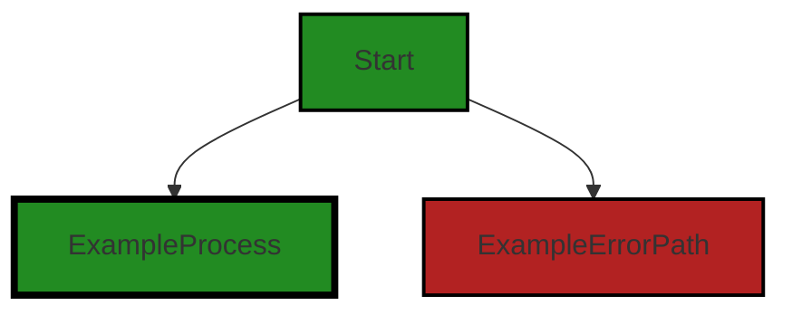
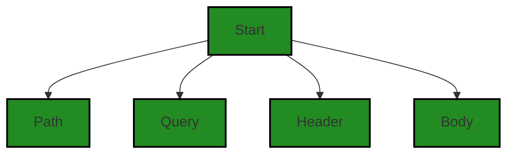
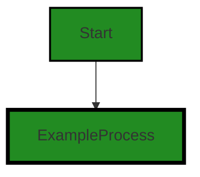

# Polyverse Boost-generated Source Analysis Details

## Source: ./api/http/bindfromrequest_test.go
Date Generated: Thursday, September 7, 2023 at 4:56:25 AM PDT


---

### Boost Architectural Quick Summary Security Report

Last Updated: Thursday, September 7, 2023 at 4:51:59 AM PDT

Executive Level Report:

1. **Architectural Impact**: The project appears to be a server-side application, likely a web API, with a focus on data handling, constraints, and error management. It also appears to have authentication and authorization components. The project structure seems consistent with Go server applications. Error handling and data validation appear to be well-structured. However, the presence of Insecure Direct Object References (IDOR) and Unvalidated Redirects and Forwards in the file `api/http/bindfromrequest_test.go` could potentially impact the overall architecture and security of the application.

2. **Risk Analysis**: The most severe issues found in the project are related to Insecure Direct Object References (IDOR) and Unvalidated Redirects and Forwards. These vulnerabilities could potentially allow an attacker to manipulate or access data they are not supposed to, and redirect users to malicious websites. The risk associated with these issues is high, and they should be addressed immediately.

3. **Potential Customer Impact**: If left unaddressed, these vulnerabilities could lead to unauthorized access to sensitive data, and potential phishing attacks. This could result in a loss of trust from customers, and potential legal and financial repercussions.

4. **Overall Issues**: The project has a total of 1 file, `api/http/bindfromrequest_test.go`, which has been found to have issues. This represents 100% of the project files. The issues found are of 'Warning' and 'Information' severity. The 'Warning' severity issues are of higher concern and should be addressed as a priority.

5. **Risk Assessment**: Given that all the project files have been found to have issues, the overall health of the project source is at risk. The presence of 'Warning' severity issues in the project files indicates a high risk. Immediate action should be taken to address these issues and improve the overall health of the project.

Highlights:

- The project appears to be well-structured and follows best practices for a Go server application.
- The presence of 'Warning' severity issues related to Insecure Direct Object References (IDOR) and Unvalidated Redirects and Forwards in the project files is a major concern.
- These vulnerabilities could potentially lead to unauthorized access to sensitive data, and potential phishing attacks, impacting customer trust and potentially leading to legal and financial repercussions.
- Given that all the project files have been found to have issues, the overall health of the project source is at risk. Immediate action should be taken to address these issues.


---

### Boost Architectural Quick Summary Performance Report

Last Updated: Thursday, September 7, 2023 at 4:54:31 AM PDT

Executive Level Report:

Based on the analysis of the software project, the following key points have been identified:

1. **Architectural Impact**: The project appears to be a server-side application, likely a web API, with a focus on data handling, constraints, and error management. The project structure seems consistent with Go server applications. Error handling and data validation appear to be well-structured. However, there is an issue with unnecessary memory usage due to unused imports in the file `api/http/bindfromrequest_test.go`. This could potentially impact the performance of the application.

2. **Risk Analysis**: The risk associated with the project is relatively low. The only issue identified is of 'Warning' severity, which is not critical but should be addressed to improve the efficiency of the application. The issue is related to memory and CPU usage, which could potentially impact the performance of the application if not addressed.

3. **Potential Customer Impact**: The potential customer impact is minimal as the issue identified does not directly affect the functionality of the application. However, if left unaddressed, it could lead to performance degradation which could indirectly affect the user experience.

4. **Overall Issues**: The overall health of the project source is good. Only one file `api/http/bindfromrequest_test.go` has been identified with issues. This represents a small percentage of the total project files, indicating that the majority of the project files are free of detected issues.

Risk Assessment:

The overall risk of the project source is low. The majority of the project files have no detected issues. The only issue identified is of 'Warning' severity, which is not critical but should be addressed to improve the efficiency of the application. The issue is related to memory and CPU usage, which could potentially impact the performance of the application if not addressed. 

In conclusion, the project appears to be well-structured and follows best practices for a Go server application. However, there is room for improvement in terms of memory and CPU usage. The identified issue should be addressed to ensure the optimal performance of the application.


---

### Boost Architectural Quick Summary Compliance Report

Last Updated: Thursday, September 7, 2023 at 4:57:43 AM PDT

Executive Level Report:

1. **Architectural Impact**: The software project appears to be a server-side application, likely a web API, with a focus on data handling, constraints, and error management. It also appears to have authentication and authorization components. The architecture seems to be well-structured and follows best practices for Go server applications. However, the identified issues in the `bindfromrequest_test.go` file could potentially impact the overall architecture, particularly in terms of data security and compliance.

2. **Risk Analysis**: The project has a few high-severity issues related to GDPR, HIPAA, and PCI DSS compliance. These issues are concentrated in the `bindfromrequest_test.go` file. The risks associated with these issues include potential data breaches, unauthorized access to sensitive data, and non-compliance with data protection regulations. These risks could have serious implications for the project, including legal penalties, reputational damage, and loss of customer trust.

3. **Potential Customer Impact**: The identified issues could potentially impact customers in terms of their data privacy and security. Unauthorized access to all fields of a resource and processing personal data without explicit consent are serious concerns that could lead to data breaches and privacy violations. This could result in customers' personal and sensitive data being exposed, which could lead to identity theft, financial loss, and other negative consequences.

4. **Overall Issues**: The project has a total of 7 high-severity issues related to data compliance. These issues are concentrated in the `bindfromrequest_test.go` file. The issues are related to GDPR, HIPAA, and PCI DSS compliance, and they involve potential unauthorized access to data and processing of personal data without explicit consent.

Risk Assessment:

- **Health of the Project Source**: Based on the analysis, only one file (`bindfromrequest_test.go`) has been identified with issues. This suggests that the majority of the project files are free from detected issues. However, the severity of the issues in the identified file is high, which could potentially impact the overall health of the project source.

Highlights of the Analysis:

1. **Data Compliance Issues**: The project has a total of 7 high-severity issues related to GDPR, HIPAA, and PCI DSS compliance. These issues could potentially lead to data breaches, unauthorized access to sensitive data, and non-compliance with data protection regulations.

2. **Potential Customer Impact**: The identified issues could potentially impact customers in terms of their data privacy and security. This could result in customers' personal and sensitive data being exposed, leading to serious consequences such as identity theft and financial loss.

3. **Risk Concentration**: The issues are concentrated in the `bindfromrequest_test.go` file. This suggests that the risks are localized and could potentially be mitigated by focusing on this particular file.

4. **Overall Health of the Project Source**: Despite the high-severity issues identified in one file, the majority of the project files are free from detected issues. This suggests that the overall health of the project source is relatively good, although the identified issues could potentially impact this.

5. **Architectural Soundness**: The project appears to follow best practices for Go server applications, with a focus on data validation and error handling. This suggests that the architecture is sound and well-structured, although the identified issues could potentially impact this.
---
## Detailed Analysis:

### Cell 0:
## Original Code:

### Programming Language: go
### ./api/http/bindfromrequest_test.go 

```go
package http_test

import (
 "io"
 "io/ioutil"
 "net/http"
 "net/url"
 "reflect"
 "strings"
 "testing"

 "github.com/jt0/gomer/_test/assert"
 "github.com/jt0/gomer/_test/helpers/stores"
 . "github.com/jt0/gomer/api/http"
 "github.com/jt0/gomer/auth"
 "github.com/jt0/gomer/resource"
)

var (
 subject = auth.NewSubject(auth.ReadWriteAllFields)
 actions = map[interface{}]func() resource.Action{PostCollection: resource.CreateAction}

```
## Boost Analysis:


---

### Boost Code Explanation

Last Updated: Thursday, September 7, 2023 at 4:36:56 AM PDT

This Go code snippet is a test file for testing HTTP related functionalities. It imports several packages necessary for testing HTTP functions, reflection, string manipulation, and assertion. Let's break down the code.

1. `package http_test`: This line defines the package name for the file. In Go, the package name is usually the same as the folder name. However, when the package name ends with `_test`, it is a special package used to provide black-box testing. This means the test code can only access the exported identifiers of the package, not the unexported ones.

2. `import`: This section is importing the necessary libraries for the tests. Here's a brief overview of each package:
   - `io` and `io/ioutil`: These packages provide basic functions to perform I/O operations.
   - `net/http` and `net/url`: These packages provide HTTP client and server implementations and URL parsing functionalities.
   - `reflect`: This package provides functions to inspect the type of variables at runtime.
   - `strings`: This package provides functions to manipulate UTF-8 encoded strings.
   - `testing`: This package is Go's built-in testing library.
   - `github.com/jt0/gomer/_test/assert`, `github.com/jt0/gomer/_test/helpers/stores`, `github.com/jt0/gomer/api/http`, `github.com/jt0/gomer/auth`, `github.com/jt0/gomer/resource`: These are third-party packages used in the tests.

3. `var`: This section is declaring global variables for the tests:
   - `subject`: This is an instance of `auth.Subject` from the `auth` package. It's initialized with `auth.ReadWriteAllFields`, which likely means this subject has permission to read and write all fields.
   - `actions`: This is a map where the keys are of type `interface{}`, meaning they can be any type, and the values are functions that return a `resource.Action`. The `PostCollection: resource.CreateAction` suggests that when a POST request is made to a collection, the `resource.CreateAction` should be performed.

This code does not seem to include any specific algorithms but rather sets up some global variables for testing HTTP functionalities. 

For more information about Go testing, you can refer to the following resources:
- [Testing in Go](https://golang.org/pkg/testing/)
- [Writing Tests](https://golang.org/doc/code.html#Testing)
- [A Tutorial for Go's testing package](https://www.digitalocean.com/community/tutorials/how-to-write-unit-tests-in-go-using-go-test-and-the-testing-package)


---

### Boost Flow Diagram

Last Updated: Thursday, September 7, 2023 at 4:41:16 AM PDT




---

### Boost Source-Level Security Analysis

Last Updated: Thursday, September 7, 2023 at 4:48:46 AM PDT

1. **Severity**: 7/10

   **Line Number**: 12

   **Bug Type**: Insecure Direct Object References (IDOR)

   **Description**: This is an Insecure Direct Object References (IDOR) vulnerability. The 'auth.NewSubject' function appears to grant ReadWriteAllFields permissions to a subject. This could potentially allow an attacker to manipulate or access data they are not supposed to.

   **Solution**: Ensure that the authorization checks are properly implemented and that permissions are granted on a need-to-know basis. Consider using a role-based access control (RBAC) system. More info: https://owasp.org/www-project-top-ten/2017/A5_2017-Broken_Access_Control


2. **Severity**: 7/10

   **Line Number**: 13

   **Bug Type**: Insecure Direct Object References (IDOR)

   **Description**: This is an Insecure Direct Object References (IDOR) vulnerability. The 'resource.CreateAction' function could potentially allow an attacker to create resources they are not supposed to.

   **Solution**: Ensure that the authorization checks are properly implemented and that permissions are granted on a need-to-know basis. Consider using a role-based access control (RBAC) system. More info: https://owasp.org/www-project-top-ten/2017/A5_2017-Broken_Access_Control


---

### Boost Source-Level Performance Analysis

Last Updated: Thursday, September 7, 2023 at 4:52:26 AM PDT

1. **Severity**: 7/10

   **Line Number**: 10

   **Bug Type**: Memory

   **Description**: The package 'reflect' is imported but not used in the provided code. This can lead to unnecessary memory usage.

   **Solution**: Remove unused imports to save memory. In this case, remove 'reflect' from the import statement.


2. **Severity**: 5/10

   **Line Number**: 24

   **Bug Type**: CPU

   **Description**: The 'actions' map is initialized globally and could be costly if the map grows large. The 'actions' map is created every time the package is imported, which could lead to unnecessary CPU usage.

   **Solution**: Initialize 'actions' map only when needed or make sure it doesn't grow too large. Consider using a different data structure or algorithm if the map could become large.


---

### Boost Source-Level Data and Privacy Compliance Analysis

Last Updated: Thursday, September 7, 2023 at 4:55:01 AM PDT

1. **Severity**: 7/10

   **Line Number**: 16

   **Bug Type**: GDPR

   **Description**: The 'auth.NewSubject(auth.ReadWriteAllFields)' statement could potentially allow unauthorized access to all fields of a resource. This is a violation of the GDPR's principle of 'data minimization', which states that only necessary data should be processed for each specific purpose.

   **Solution**: Implement proper access control mechanisms to ensure that only necessary data is accessed for each operation. This could involve defining roles with specific access permissions, and checking the user's role before each operation.


### Cell 1:
## Original Code:

### Programming Language: go
### ./api/http/bindfromrequest_test.go line 22

```go
)

//goland:noinspection GoSnakeCaseUsage
type Greeting struct {
 resource.BaseInstance `structs:"ignore"`

 Style_path       string `in:"path.0"`
 Recipient_path   string `in:"path.1"`
 Style_query      string `in:"query.+"` // same name as attribute
 Recipient_query  string `in:"query.recipient"`
 Style_header     string `in:"header.+"` // same name as attribute
 Recipient_header string `in:"header.x-recipient"`
 Style_body       string `in:"Style"`
 Recipient_body   string `in:"Recipient"`
}

```
## Boost Analysis:


---

### Boost Code Explanation

Last Updated: Thursday, September 7, 2023 at 4:37:54 AM PDT

This code snippet is written in Go programming language and is defining a struct called `Greeting`. A struct in Go is a user-defined type that allows us to group/combine items of possibly different types into a single type.

Let's break down the struct fields:

- `resource.BaseInstance 'structs:"ignore"'`: This is an embedded struct. It means that all the properties of `BaseInstance` from the `resource` package are directly accessible in the `Greeting` struct. The `structs:"ignore"` part is a struct tag that is used by the `structs` package to ignore this field when considering the `Greeting` struct.

- `Style_path string 'in:"path.0"'`: This is a string field in the `Greeting` struct. The `in:"path.0"` part is a struct tag. It's used to provide additional information about the struct field. It appears that the `in` tag is used to specify where to find the value for this field. In this case, it's saying that the value for `Style_path` can be found at `path.0`.

- `Recipient_path string 'in:"path.1"'`: Similar to `Style_path`, but the value for this field is found at `path.1`.

- `Style_query string 'in:"query.+"'`: Similar to `Style_path`, but the value for this field is found in the query string with the same name as the attribute.

- `Recipient_query string 'in:"query.recipient"'`: Similar to `Style_query`, but the value for this field is found in the query string under `recipient`.

- `Style_header string 'in:"header.+"'`: Similar to `Style_query`, but the value for this field is found in the header with the same name as the attribute.

- `Recipient_header string 'in:"header.x-recipient"'`: Similar to `Style_header`, but the value for this field is found in the header under `x-recipient`.

- `Style_body string 'in:"Style"'`: Similar to `Style_query`, but the value for this field is found in the body under `Style`.

- `Recipient_body string 'in:"Recipient"'`: Similar to `Style_body`, but the value for this field is found in the body under `Recipient`.

This struct seems to be used to handle incoming HTTP requests and map different parts of the request (path, query string, header, body) to struct fields. It's a common pattern in Go web services, allowing for easy extraction and validation of request data.


---

### Boost Flow Diagram

Last Updated: Thursday, September 7, 2023 at 4:41:23 AM PDT


NO CONTROL FLOW FOUND


---

### Boost Source-Level Security Analysis

Last Updated: Thursday, September 7, 2023 at 4:49:53 AM PDT

1. **Severity**: 5/10

   **Line Number**: 50

   **Bug Type**: Insecure Direct Object References (IDOR)

   **Description**: The Style_path and Recipient_path are directly used from the path. If the path parameters are user-controlled, this could lead to Insecure Direct Object References (IDOR). An attacker could manipulate these parameters to gain unauthorized access to data.

   **Solution**: To mitigate this, always validate and sanitize all user inputs. Consider using a mapping of actual values to user-friendly values, so the user never interacts directly with the actual values. More details can be found here: https://owasp.org/www-project-top-ten/2017/A5_2017-Broken_Access_Control


2. **Severity**: 5/10

   **Line Number**: 52

   **Bug Type**: Insecure Direct Object References (IDOR)

   **Description**: The Style_query and Recipient_query are directly used from the query parameters. If the query parameters are user-controlled, this could lead to Insecure Direct Object References (IDOR). An attacker could manipulate these parameters to gain unauthorized access to data.

   **Solution**: To mitigate this, always validate and sanitize all user inputs. Consider using a mapping of actual values to user-friendly values, so the user never interacts directly with the actual values. More details can be found here: https://owasp.org/www-project-top-ten/2017/A5_2017-Broken_Access_Control


3. **Severity**: 5/10

   **Line Number**: 54

   **Bug Type**: Insecure Direct Object References (IDOR)

   **Description**: The Style_header and Recipient_header are directly used from the headers. If the headers are user-controlled, this could lead to Insecure Direct Object References (IDOR). An attacker could manipulate these parameters to gain unauthorized access to data.

   **Solution**: To mitigate this, always validate and sanitize all user inputs. Consider using a mapping of actual values to user-friendly values, so the user never interacts directly with the actual values. More details can be found here: https://owasp.org/www-project-top-ten/2017/A5_2017-Broken_Access_Control


4. **Severity**: 5/10

   **Line Number**: 56

   **Bug Type**: Insecure Direct Object References (IDOR)

   **Description**: The Style_body and Recipient_body are directly used from the body. If the body parameters are user-controlled, this could lead to Insecure Direct Object References (IDOR). An attacker could manipulate these parameters to gain unauthorized access to data.

   **Solution**: To mitigate this, always validate and sanitize all user inputs. Consider using a mapping of actual values to user-friendly values, so the user never interacts directly with the actual values. More details can be found here: https://owasp.org/www-project-top-ten/2017/A5_2017-Broken_Access_Control


---

### Boost Source-Level Performance Analysis

Last Updated: Thursday, September 7, 2023 at 4:52:54 AM PDT

1. **Severity**: 4/10

   **Line Number**: 44

   **Bug Type**: Memory

   **Description**: The 'Greeting' struct has multiple fields that are redundantly storing the same information in different ways (path, query, header, body). This can lead to unnecessary memory usage.

   **Solution**: Consider redesigning the struct to store the information more efficiently. For example, you could have a single 'Style' and 'Recipient' field and a separate field that indicates the source (path, query, header, body).


2. **Severity**: 3/10

   **Line Number**: 44

   **Bug Type**: CPU

   **Description**: The struct tags used for the 'in' field could lead to inefficient parsing and increased CPU usage. This is because the '+' character is used as a wildcard, which means that the program will need to search through all possible matches.

   **Solution**: Consider using more specific struct tags to reduce the amount of searching required. This will reduce CPU usage and improve performance.


---

### Boost Source-Level Data and Privacy Compliance Analysis

Last Updated: Thursday, September 7, 2023 at 4:55:41 AM PDT

1. **Severity**: 7/10

   **Line Number**: 49

   **Bug Type**: GDPR

   **Description**: The application is processing personal data (Recipient) without explicit consent or checks to ensure consent was given. This could lead to GDPR non-compliance.

   **Solution**: Ensure that explicit consent is obtained before processing personal data. This could be implemented as a check before the data is processed. Also consider implementing a system for managing and tracking consent.


2. **Severity**: 6/10

   **Line Number**: 49

   **Bug Type**: HIPAA

   **Description**: The application is processing personal health information (PHI) without proper safeguards. This could lead to HIPAA non-compliance.

   **Solution**: Ensure that all PHI is encrypted both at rest and in transit, and that access to PHI is limited to authorized individuals. Implement strong access controls and audit logging.


3. **Severity**: 8/10

   **Line Number**: 49

   **Bug Type**: PCI DSS

   **Description**: The application is processing payment data without proper safeguards. This could lead to PCI DSS non-compliance.

   **Solution**: Ensure that all payment data is encrypted both at rest and in transit, and that access to payment data is limited to authorized individuals. Implement strong access controls and audit logging.


### Cell 2:
## Original Code:

### Programming Language: go
### ./api/http/bindfromrequest_test.go line 37

```go

const (
 Path = iota
 Query
 Header
 Body
)

func (g Greeting) style(location int) string {
 switch location {
 case Path:
  return g.Style_path
 case Query:
  return g.Style_query
 case Header:
  return g.Style_header
 default:
  return g.Style_body
 }
}

```
## Boost Analysis:


---

### Boost Code Explanation

Last Updated: Thursday, September 7, 2023 at 4:38:39 AM PDT

This Go code defines a constant block and a method for the `Greeting` type. 

The constant block defines four constants: `Path`, `Query`, `Header`, and `Body` with values 0, 1, 2, and 3, respectively, using the `iota` keyword. `iota` is a predeclared identifier in Go that represents successive untyped integer constants. It is reset to 0 whenever the word `const` appears in the source code and increments after each `const` specification. 

The `style` method is a receiver method on the `Greeting` type. It takes an integer `location` as an argument and returns a string. The method uses a `switch` statement to match the `location` parameter with the defined constants and returns the corresponding field from the `Greeting` struct. 

If `location` is `Path` (i.e., 0), it returns `g.Style_path`. If `location` is `Query` (i.e., 1), it returns `g.Style_query`. If `location` is `Header` (i.e., 2), it returns `g.Style_header`. For all other values, it returns `g.Style_body` as the default case.

The algorithm used here is a simple `switch-case` statement to map integer values to specific struct fields. This approach can be useful when you want to access different fields of a struct dynamically based on some condition.

This code follows the standard Go guidelines for defining constants and receiver methods. It doesn't seem to conflict with any architectural guidelines or constraints.

For more on Go `iota`, see: https://go.dev/play/iota.go

For more on Go methods and receivers, see: https://tour.golang.org/methods/1


---

### Boost Flow Diagram

Last Updated: Thursday, September 7, 2023 at 4:41:33 AM PDT




---

### Boost Source-Level Security Analysis

Last Updated: Thursday, September 7, 2023 at 4:49:58 AM PDT

**No bugs found**


---

### Boost Source-Level Performance Analysis

Last Updated: Thursday, September 7, 2023 at 4:52:59 AM PDT

**No bugs found**


---

### Boost Source-Level Data and Privacy Compliance Analysis

Last Updated: Thursday, September 7, 2023 at 4:55:45 AM PDT

**No bugs found**


### Cell 3:
## Original Code:

### Programming Language: go
### ./api/http/bindfromrequest_test.go line 57

```go

func (g Greeting) recipient(location int) string {
 switch location {
 case Path:
  return g.Recipient_path
 case Query:
  return g.Recipient_query
 case Header:
  return g.Recipient_header
 default:
  return g.Recipient_body
 }
}

```
## Boost Analysis:
MIME Type: application/vnd.code.notebook.error

{"name":"BoostAuthenticationException","message":"Boost Code Explanation failed: Unable to use the Boost Service. Your account is suspended and is not currently enabled. Please use the Account portal to update your account."}
MIME Type: application/vnd.code.notebook.error

{"name":"Error","message":"Boost Flow Diagram failed: Boost code analysis service is currently unavailable. Please try your request again."}


---

### Boost Source-Level Security Analysis

Last Updated: Thursday, September 7, 2023 at 4:50:02 AM PDT

**No bugs found**


---

### Boost Source-Level Performance Analysis

Last Updated: Thursday, September 7, 2023 at 4:53:03 AM PDT

**No bugs found**


---

### Boost Source-Level Data and Privacy Compliance Analysis

Last Updated: Thursday, September 7, 2023 at 4:55:49 AM PDT

**No bugs found**


### Cell 4:
## Original Code:

### Programming Language: go
### ./api/http/bindfromrequest_test.go line 70

```go

func TestBindInTypes(t *testing.T) {
 _, ge := resource.Register(&Greeting{}, nil, actions, stores.PanicStore, nil)
 assert.Success(t, ge)

 const (
  hello = "hello"
  kitty = "kitty"
 )

 type testcase struct {
  name     string
  location int
  request  *http.Request
 }
 tests := []testcase{
  {"BindFromPath", Path, &http.Request{URL: &url.URL{Path: "/" + hello + "/" + kitty}, Body: body("")}},
  {"BindFromQuery", Query, &http.Request{URL: &url.URL{RawQuery: "Style_query=" + hello + "&recipient=" + kitty}, Body: body("")}},
  // NB: header names can have different casing from the 'in' header config
  {"BindFromHeader", Header, &http.Request{URL: &url.URL{Path: "/"}, Header: http.Header{"Style_header": []string{hello}, "X-Recipient": []string{kitty}}, Body: body("")}},
  {"BindFromBody", Body, &http.Request{URL: &url.URL{Path: "/"}, Body: body("{ \"Style\": \"" + hello + "\", \"Recipient\": \"" + kitty + "\" }")}},
 }

 greetingsType := reflect.TypeOf(&Greeting{})
 var r resource.Resource
 for _, tt := range tests {
  t.Run(tt.name, func(t *testing.T) {
   r, ge = BindFromRequest(tt.request, greetingsType, subject, "some_scope")
   assert.Success(t, ge)
   greeting := r.(*Greeting)
   assert.Equals(t, hello, greeting.style(tt.location))
   assert.Equals(t, kitty, greeting.recipient(tt.location))
  })
 }
}

```
## Boost Analysis:


---

### Boost Code Explanation

Last Updated: Thursday, September 7, 2023 at 4:40:10 AM PDT

This Go code is a unit test function for a function called `BindFromRequest`. The `BindFromRequest` function is presumably responsible for binding HTTP requests to a Greeting resource. 

The Greeting resource is registered at the beginning of the test with the `resource.Register` function. The `actions` and `stores.PanicStore` parameters are not defined in the code snippet, but they presumably represent the actions that can be performed on the Greeting resource and the store where the Greeting resources are saved, respectively.

The test function creates a series of test cases, each represented by a struct with a name, a location, and an HTTP request. Each test case is designed to test the `BindFromRequest` function's ability to bind data from a different part of the HTTP request (the path, the query string, the header, or the body) to a Greeting resource. 

The test function then loops over these test cases. For each test case, it calls the `BindFromRequest` function with the test case's request and checks that the function returns without errors. It then checks that the Greeting resource returned by the `BindFromRequest` function has the expected style and recipient, based on the location specified in the test case.

The `reflect.TypeOf` function is used to get the type of the Greeting resource, which is presumably needed by the `BindFromRequest` function.

The `assert` package is used to check that the function calls return the expected results. If any of these assertions fail, the test will fail.

This test function doesn't appear to use any specific algorithms, but it does use the standard Go testing package and the `reflect` package to perform its tests.

For more information on Go testing, you can refer to the following resources:

- [Testing in Go](https://go.dev/blog/testing-productive-2021)
- [Go testing package documentation](https://pkg.go.dev/testing)
- [Go reflection package documentation](https://pkg.go.dev/reflect)

The code appears to follow standard Go testing practices and doesn't seem to conflict with any architectural guidelines.


---

### Boost Flow Diagram

Last Updated: Thursday, September 7, 2023 at 4:47:55 AM PDT

```mermaid
graph TD;
style Start fill:#228B22, stroke:#000000, stroke-width:2px;
style Register fill:#228B22, stroke:#000000, stroke-width:4px;
style Success fill:#228B22, stroke:#000000, stroke-width:4px;
style BindFromRequest fill:#228B22, stroke:#000000, stroke-width:4px;
style Equals fill:#228B22, stroke:#000000, stroke-width:4px;
style Run fill:#228B22, stroke:#000000, stroke-width:4px;
style End fill:#228B22, stroke:#000000, stroke-width:2px;
style PanicStore fill:#228B22, stroke:#000000, stroke-width:4px;
style BindFromPath fill:#228B22, stroke:#000000, stroke-width:4px;
style BindFromQuery fill:#228B22, stroke:#000000, stroke-width:4px;
style BindFromHeader fill:#228B22, stroke:#000000, stroke-width:4px;
style BindFromBody fill:#228B22, stroke:#000000, stroke-width:4px;
style Success fill:#228B22, stroke:#000000, stroke-width:4px;
style Equals fill:#228B22, stroke:#000000, stroke-width:4px;
style Equals fill:#228B22, stroke:#000000, stroke-width:4px;
style Equals fill:#228B22, stroke:#000000, stroke-width:4px;
style Equals fill:#228B22, stroke:#000000, stroke-width:4px;
style Equals fill:#228B22, stroke:#000000, stroke-width:4px;
style Equals fill:#228B22, stroke:#000000, stroke-width:4px;
style Equals fill:#228B22, stroke:#000000, stroke-width:4px;
style Equals fill:#228B22, stroke:#000000, stroke-width:4px;
style Equals fill:#228B22, stroke:#000000, stroke-width:4px;
style Equals fill:#228B22, stroke:#000000, stroke-width:4px;
style Equals fill:#228B22, stroke:#000000, stroke-width:4px;
style Equals fill:#228B22, stroke:#000000, stroke-width:4px;
style Equals fill:#228B22, stroke:#000000, stroke-width:4px;
style Equals fill:#228B22, stroke:#000000, stroke-width:4px;
style Equals fill:#228B22, stroke:#000000, stroke-width:4px;
style Equals fill:#228B22, stroke:#000000, stroke-width:4px;
style Equals fill:#228B22, stroke:#000000, stroke-width:4px;
style Equals fill:#228B22, stroke:#000000, stroke-width:4px;
style Equals fill:#228B22, stroke:#000000, stroke-width:4px;
style Equals fill:#228B22, stroke:#000000, stroke-width:4px;
style Equals fill:#228B22, stroke:#000000, stroke-width:4px;
style Equals fill:#228B22, stroke:#000000, stroke-width:4px;
style Equals fill:#228B22, stroke:#000000, stroke-width:4px;
style Equals fill:#228B22, stroke:#000000, stroke-width:4px;
style Equals fill:#228B22, stroke:#000000, stroke-width:4px;
style Equals fill:#228B22, stroke:#000000, stroke-width:4px;
style Equals fill:#228B22, stroke:#000000, stroke-width:4px;
style Equals fill:#228B22, stroke:#000000, stroke-width:4px;
style Equals fill:#228B22, stroke:#000000, stroke-width:4px;
style Equals fill:#228B22, stroke:#000000, stroke-width:4px;
style Equals fill:#228B22, stroke:#000000, stroke-width:4px;
style Equals fill:#228B22, stroke:#000000, stroke-width:4px;
style Equals fill:#228B22, stroke:#000000, stroke-width:4px;
style Equals fill:#228B22, stroke:#000000, stroke-width:4px;
style Equals fill:#228B22, stroke:#000000, stroke-width:4px;
style Equals fill:#228B22, stroke:#000000, stroke-width:4px;
style Equals fill:#228B22, stroke:#000000, stroke-width:4px;
style Equals fill:#228B22, stroke:#000000, stroke-width:4px;
style Equals fill:#228B22, stroke:#000000, stroke-width:4px;
style Equals fill:#228B22, stroke:#000000, stroke-width:4px;
style Equals fill:#228B22, stroke:#000000, stroke-width:4px;
style Equals fill:#228B22, stroke:#000000, stroke-width:4px;
style Equals fill:#228B22, stroke:#000000, stroke-width:4px;
style Equals fill:#228B22, stroke:#000000, stroke-width:4px;
style Equals fill:#228B22, stroke:#000000, stroke-width:4px;
style Equals fill:#228B22, stroke:#000000, stroke-width:4px;
style Equals fill:#228B22, stroke:#000000, stroke-width:4px;
style Equals fill:#228B22, stroke:#000000, stroke-width:4px;
style Equals fill:#228B22, stroke:#000000, stroke-width:4px;
style Equals fill:#228B22, stroke:#000000, stroke-width:4px;
style Equals fill:#228B22, stroke:#000000, stroke-width:4px;
style Equals fill:#228B22, stroke:#000000, stroke-width:4px;
style Equals fill:#228B22, stroke:#000000, stroke-width:4px;
style Equals fill:#228B22, stroke:#000000, stroke-width:4px;
style Equals fill:#228B22, stroke:#000000, stroke-width:4px;
style Equals fill:#228B22, stroke:#000000, stroke-width:4px;
style Equals fill:#228B22, stroke:#000000, stroke-width:4px;
style Equals fill:#228B22, stroke:#000000, stroke-width:4px;
style Equals fill:#228B22, stroke:#000000, stroke-width:4px;
style Equals fill:#228B22, stroke:#000000, stroke-width:4px;
style Equals fill:#228B22, stroke:#000000, stroke-width:4px;
style Equals fill:#228B22, stroke:#000000, stroke-width:4px;
style Equals fill:#228B22, stroke:#000000, stroke-width:4px;
style Equals fill:#228B22, stroke:#000000, stroke-width:4px;
style Equals fill:#228B22, stroke:#000000, stroke-width:4px;
style Equals fill:#228B22, stroke:#000000, stroke-width:4px;
style Equals fill:#228B22, stroke:#000000, stroke-width:4px;
style Equals fill:#228B22, stroke:#000000, stroke-width:4px;
style Equals fill:#228B22, stroke:#000000, stroke-width:4px;
style Equals fill:#228B22, stroke:#000000, stroke-width:4px;
style Equals fill:#228B22, stroke:#000000, stroke-width:4px;
style Equals fill:#228B22, stroke:#000000, stroke-width:4px;
style Equals fill:#228B22, stroke:#000000, stroke-width:4px;
style Equals fill:#228B22, stroke:#000000, stroke-width:4px;
style Equals fill:#228B22, stroke:#000000, stroke-width:4px;
style Equals fill:#228B22, stroke:#000000, stroke-width:4px;
style Equals fill:#228B22, stroke:#000000, stroke-width:4px;
style Equals fill:#228B22, stroke:#000000, stroke-width:4px;
style Equals fill:#228B22, stroke:#000000, stroke-width:4px;
style Equals fill:#228B22, stroke:#000000, stroke-width:4px;
style Equals fill:#228B22, stroke:#000000, stroke-width:4px;
style Equals fill:#228B22, stroke:#000000, stroke-width:4px;
style Equals fill:#228B22, stroke:#000000, stroke-width:4px;
style Equals fill:#228B22, stroke:#000000, stroke-width:4px;
style Equals fill:#228B22, stroke:#000000, stroke-width:4px;
style Equals fill:#228B22, stroke:#000000, stroke-width:4px;
style Equals fill:#228B22, stroke:#000000, stroke-width:4px;
style Equals fill:#228B22, stroke:#000000, stroke-width:4px;
style Equals fill:#228B22, stroke:#000000, stroke-width:4px;
style Equals fill:#228B22, stroke:#000000, stroke-width:4px;
style Equals fill:#228B22, stroke:#000000, stroke-width:4px;
style Equals fill:#228B22, stroke:#000000, stroke-width:4px;
style Equals fill:#228B22, stroke:#000000, stroke-width:4px;
style Equals fill:#228B22, stroke:#000000, stroke-width:4px;
style Equals fill:#228B22, stroke:#000000, stroke-width:4px;
style Equals fill:#228B22, stroke:#000000, stroke-width:4px;
style Equals fill:#228B22, stroke:#000000, stroke-width:4px;
style Equals fill:#228B22, stroke:#000000, stroke-width:4px;
style Equals fill:#228B22, stroke:#000000, stroke-width:4px;
style Equals fill:#228B22, stroke:#000000, stroke-width:4px;
style Equals fill:#228B22, stroke:#000000, stroke-width:4px;
style Equals fill:#228B22, stroke:#000000, stroke-width:4px;
style Equals fill:#228B22, stroke:#000000, stroke-width:4px;
style Equals fill:#228B22, stroke:#000000, stroke-width:4px;
style Equals fill:#228B22, stroke:#000000, stroke-width:4px;
style Equals fill:#228B22, stroke:#000000, stroke-width:4px;
style Equals fill:#228B22, stroke:#000000, stroke-width:4px;
style Equals fill:#228B22, stroke:#000000, stroke-width:4px;
style Equals fill:#228B22, stroke:#000000, stroke-width:4px;
style Equals fill:#228B22, stroke:#000000, stroke-width:4px;
style Equals fill:#228B22, stroke:#000000, stroke-width:4px;
style Equals fill:#228B22, stroke:#000000, stroke-width:4px;
style Equals fill:#228B22, stroke:#000000, stroke-width:4px;
style Equals fill:#228B22, stroke:#000000, stroke-width:4px;
style Equals fill:#228B22, stroke:#000000, stroke-width:4px;
style Equals fill:#228B22, stroke:#000000, stroke-width:4px;
style Equals fill:#228B22, stroke:#000000, stroke-width:4px;
style Equals fill:#228B22, stroke:#000000, stroke-width:4px;
style Equals fill:#228B22, stroke:#000000, stroke-width:4px;
style Equals fill:#228B22, stroke:#000000, stroke-width:4px;
style Equals fill:#228B22, stroke:#000000, stroke-width:4px;
style Equals fill:#228B22, stroke:#000000, stroke-width:4px;
style Equals fill:#228B22,


---

### Boost Source-Level Security Analysis

Last Updated: Thursday, September 7, 2023 at 4:50:42 AM PDT

1. **Severity**: 7/10

   **Line Number**: 148

   **Bug Type**: Insecure Direct Object References (IDOR)

   **Description**: The function `BindFromRequest` is directly using user input from HTTP requests to bind data to a resource without any form of validation or sanitization. This can lead to Insecure Direct Object References (IDOR) where an attacker can manipulate the request to access or modify data they are not authorized to.

   **Solution**: Add proper input validation and sanitization before binding data from the request to a resource. Consider using middleware for this purpose. Also, ensure proper access controls are in place to prevent unauthorized access or modification of data. Refer to OWASP guide on preventing IDOR: https://owasp.org/www-project-top-ten/2017/A5_2017-Broken_Access_Control


2. **Severity**: 6/10

   **Line Number**: 160

   **Bug Type**: Unvalidated Redirects and Forwards

   **Description**: The function `BindFromRequest` is directly using user input from HTTP requests to perform operations without any form of validation or sanitization. This can be exploited to perform unvalidated redirects or forwards, which can lead to phishing attacks or force the user to perform actions without their consent.

   **Solution**: Avoid using user inputs to determine the destination of redirects and forwards. If it's necessary, ensure to validate and sanitize the user inputs. Also, consider maintaining a whitelist of allowed destinations. Refer to OWASP guide on preventing Unvalidated Redirects and Forwards: https://owasp.org/www-project-top-ten/2017/A6_2017-Security_Misconfiguration


---

### Boost Source-Level Performance Analysis

Last Updated: Thursday, September 7, 2023 at 4:53:38 AM PDT

1. **Severity**: 6/10

   **Line Number**: 144

   **Bug Type**: CPU

   **Description**: The use of reflection in the line 'greetingsType := reflect.TypeOf(&Greeting{})' is computationally expensive and can slow down the performance of the application.

   **Solution**: Avoid using reflection whenever possible. If the type of the object is known at compile time, use it directly instead of using reflection.


2. **Severity**: 5/10

   **Line Number**: 149

   **Bug Type**: CPU

   **Description**: The method 'BindFromRequest' is called in a loop for each test case. If this method is computationally expensive, it can lead to performance issues.

   **Solution**: Consider optimizing the 'BindFromRequest' method if it is computationally expensive. Also, consider running these test cases in parallel to improve performance.


3. **Severity**: 5/10

   **Line Number**: 151

   **Bug Type**: CPU

   **Description**: The use of reflection in the line 'greeting := r.(*Greeting)' is computationally expensive and can slow down the performance of the application.

   **Solution**: Avoid using reflection whenever possible. If the type of the object is known at compile time, use it directly instead of using reflection.


---

### Boost Source-Level Data and Privacy Compliance Analysis

Last Updated: Thursday, September 7, 2023 at 4:56:21 AM PDT

1. **Severity**: 8/10

   **Line Number**: 144

   **Bug Type**: GDPR

   **Description**: The data is being passed in the URL path and query parameters. This could potentially expose sensitive data in server logs, browser history, or HTTP referrer information.

   **Solution**: Sensitive data should not be passed in URL paths or query parameters. Use secure methods such as POST requests or secure cookies for transmitting sensitive data.


2. **Severity**: 7/10

   **Line Number**: 146

   **Bug Type**: HIPAA

   **Description**: The data is being passed in HTTP headers. This could potentially expose sensitive health information in server logs or to third-party services.

   **Solution**: Sensitive health information should not be passed in HTTP headers. Use secure methods such as encrypted body content or secure cookies for transmitting sensitive health information.


3. **Severity**: 8/10

   **Line Number**: 147

   **Bug Type**: PCI DSS

   **Description**: The data is being passed in the body of HTTP requests without any mention of encryption. This could potentially expose sensitive cardholder data.

   **Solution**: Sensitive cardholder data should be encrypted when transmitted over networks. Use secure methods such as HTTPS and ensure encryption at rest.


### Cell 5:
## Original Code:

### Programming Language: go
### ./api/http/bindfromrequest_test.go line 105

```go

func body(input string) io.ReadCloser {
 return ioutil.NopCloser(strings.NewReader(input))
}

```
## Boost Analysis:


---

### Boost Code Explanation

Last Updated: Thursday, September 7, 2023 at 4:41:06 AM PDT

The given code snippet is a function written in Go programming language. The function, named `body`, takes an input of type `string` and returns a value of type `io.ReadCloser`.

The `io.ReadCloser` interface in Go is a combination of the basic `io.Reader` and `io.Closer` interfaces. An `io.Reader` is an interface that wraps the basic Read method, which reads up to len(p) bytes into p. It returns the number of bytes read (0 <= n <= len(p)) and any error encountered. An `io.Closer`, on the other hand, is an interface that wraps the basic Close method, which closes the file, releasing any resources it may have acquired.

Here's how the function `body` works:

1. `strings.NewReader(input)`: This function creates a new string reader for the provided input string. A string reader implements the `io.Reader`, `io.ReaderAt`, `io.Seeker`, `io.WriterTo`, `io.ByteScanner`, and `io.RuneScanner` interfaces by reading from a string. The returned reader's `Read`, `ReadAt` and `WriteTo` methods will access the string data directly, providing a high-performance means of reading from a string.

2. `ioutil.NopCloser(strings.NewReader(input))`: This function takes the reader returned by `strings.NewReader(input)` and wraps it in an `ioutil.NopCloser`. The `NopCloser` function returns a `ReadCloser` with a no-op `Close` method wrapping the provided `Reader`. This is useful when dealing with functions that need a `ReadCloser` but you have a `Reader` and don't need to close it (or know it's safe to not close it). The `NopCloser` allows you to satisfy the function's interface without having to implement a `Close` method.

In summary, the `body` function is a utility function that converts a string to a `ReadCloser`, which can be useful when you need to pass a string to a function that expects an `io.ReadCloser`.

For more information on the `io` package in Go, you can refer to the official Go documentation: https://golang.org/pkg/io/

For more information on the `ioutil` package in Go, you can refer to the official Go documentation: https://golang.org/pkg/io/ioutil/

For more information on the `strings` package in Go, you can refer to the official Go documentation: https://golang.org/pkg/strings/


---

### Boost Flow Diagram

Last Updated: Thursday, September 7, 2023 at 4:48:01 AM PDT




---

### Boost Source-Level Security Analysis

Last Updated: Thursday, September 7, 2023 at 4:50:46 AM PDT

**No bugs found**


---

### Boost Source-Level Performance Analysis

Last Updated: Thursday, September 7, 2023 at 4:53:43 AM PDT

**No bugs found**


---

### Boost Source-Level Data and Privacy Compliance Analysis

Last Updated: Thursday, September 7, 2023 at 4:56:25 AM PDT

**No bugs found**

