# Polyverse Boost-generated Source Analysis Details

## Source: ./api/http/bindtoresponse.go
Date Generated: Thursday, September 7, 2023 at 5:35:26 AM PDT


---

### Boost Architectural Quick Summary Security Report

Last Updated: Thursday, September 7, 2023 at 5:23:08 AM PDT

## Executive Level Report

### Architectural Impact and Risk Analysis

1. **Insecure Direct Object References (IDOR) in bindtoresponse.go**: This file has the highest number of warnings, with 4 instances of IDOR. This is a significant architectural risk as it can lead to unauthorized data access. The use of a global variable (DefaultBindToResponseTool) that can be accessed and potentially manipulated by other parts of the application is a major concern. This issue needs immediate attention to prevent potential data breaches.

2. **Insecure Equality Testing in bindtoresponse.go**: This file also has a warning for insecure equality testing. This can lead to unexpected behavior and potential security vulnerabilities. This issue can potentially lead to security issues, such as bypassing certain checks or conditions. This issue needs to be addressed to ensure the security and integrity of the application.

3. **Improper Error Handling in bindtoresponse.go**: This file has instances of improper error handling. This can lead to unexpected application behavior and can potentially expose sensitive information. This issue needs to be addressed to ensure the robustness and reliability of the application.

4. **Insecure Data Exposure in bindtoresponse.go**: This file has a warning for insecure data exposure. This can potentially lead to sensitive data being exposed to unauthorized users. This issue needs to be addressed to ensure the privacy and security of user data.

### Potential Customer Impact

The issues identified in the bindtoresponse.go file can potentially impact customers in several ways. Unauthorized data access can lead to data breaches, which can result in loss of trust and potential legal implications. Insecure equality testing can lead to unexpected application behavior, which can impact the user experience. Improper error handling can lead to application crashes or unexpected behavior, which can frustrate users and lead to loss of trust. Insecure data exposure can lead to privacy breaches, which can have serious consequences for users.

### Overall Issues for this Software Project

The bindtoresponse.go file has the most severe issues, with a total of 9 warnings and 3 information level issues. This represents a significant portion of the overall issues in the project. The issues in this file need to be addressed to ensure the overall health and security of the project.

### Risk Assessment

Based on the analysis, the overall health of the project source is concerning. The bindtoresponse.go file, which is the only file in the project, has a significant number of issues. This suggests that the project may have underlying architectural and design issues that need to be addressed. The high number of warnings indicates a high risk level for the project. 

### Highlights of the Analysis

- The bindtoresponse.go file has the most severe issues, with 4 instances of IDOR, 1 instance of insecure equality testing, 2 instances of improper error handling, and 1 instance of insecure data exposure.
- The issues in the bindtoresponse.go file represent a significant portion of the overall issues in the project, indicating underlying architectural and design issues.
- The potential customer impact of the issues in the bindtoresponse.go file is high, with potential for data breaches, unexpected application behavior, application crashes, and privacy breaches.
- The overall health of the project source is concerning, with a high risk level indicated by the high number of warnings in the bindtoresponse.go file.
- The project does not have any additional special architectural guidelines or constraints, which may have contributed to the issues identified in the analysis.


---

### Boost Architectural Quick Summary Performance Report

Last Updated: Thursday, September 7, 2023 at 5:28:17 AM PDT

## Executive Report

### Architectural Impact and Risk Analysis

1. **Memory and CPU Usage**: The file `api/http/bindtoresponse.go` has been flagged for potential memory and CPU usage issues. This file appears to be a critical part of the server-side application, likely handling HTTP responses. High memory and CPU usage in this area could lead to performance bottlenecks, affecting the overall responsiveness and efficiency of the application. 

   - **Risk**: High
   - **Impact**: High
   - **Mitigation**: Review and optimize the use of the 'reflect' package and the `reflect.DeepEqual` function. Consider implementing a custom comparison method for complex structures.

2. **Project Health**: Only one file was provided for analysis, and it has been flagged with issues. This suggests that there may be similar issues in other parts of the codebase that were not provided for analysis. 

   - **Risk**: Medium
   - **Impact**: Medium
   - **Mitigation**: Conduct a comprehensive code review and analysis across the entire codebase to identify and address potential issues.

3. **Customer Impact**: The potential performance issues in the `api/http/bindtoresponse.go` file could lead to slower response times for end users. This could negatively impact the user experience, particularly for applications that require real-time or near-real-time responses.

   - **Risk**: High
   - **Impact**: High
   - **Mitigation**: Prioritize optimization of the `api/http/bindtoresponse.go` file to improve response times.

4. **Overall Issues**: The issues identified in the `api/http/bindtoresponse.go` file are warnings, the second-highest severity level. This suggests that while the issues are not critical, they should be addressed to prevent potential problems in the future.

   - **Risk**: Medium
   - **Impact**: Medium
   - **Mitigation**: Address the identified issues and implement a regular code review process to catch potential issues early.

### Conclusion

The software project appears to be well-structured and follows best practices for a Go server application. However, the issues identified in the `api/http/bindtoresponse.go` file could potentially impact the performance and user experience of the application. It is recommended to address these issues and conduct a comprehensive code review and analysis to ensure the overall health of the project.


---

### Boost Architectural Quick Summary Compliance Report

Last Updated: Thursday, September 7, 2023 at 5:36:43 AM PDT

## Executive Report

### Architectural Impact and Risk Analysis

The software project under review appears to be a server-side application, likely a web API, with a focus on data handling, constraints, and error management. The project is written in Go and follows a modular and structured approach. However, the analysis has identified several high-severity issues related to data compliance, which could have significant architectural impact and risk implications.

#### Key Highlights:

1. **High Severity Issues:** The file `api/http/bindtoresponse.go` has been flagged with multiple high-severity issues related to HIPAA, PCI DSS, and GDPR compliance. These issues indicate potential vulnerabilities in the way the application handles sensitive data, which could lead to breaches of data privacy and security regulations.

    - **HIPAA Compliance:** The function handles data without checking if it's health-related or not. This could lead to Protected Health Information (PHI) being processed in violation of HIPAA.
    - **PCI DSS Compliance:** The function 'BindToResponse' does not seem to have any mechanism to ensure that the data it processes is encrypted in compliance with PCI DSS regulation.
    - **GDPR Compliance:** The BindToResponseConfiguration type may contain user data, but it does not appear to have any mechanisms for data anonymization or deletion, which are required by the GDPR.

2. **Potential Customer Impact:** The identified issues could have serious implications for customers, including potential exposure of sensitive health and payment card information. This could lead to loss of customer trust, legal penalties, and damage to the company's reputation.

3. **Risk Assessment:** Given that the identified issues are present in a single file, the overall health of the project source could be considered moderate. However, the severity of the issues and their potential impact on data privacy and security make them a high risk that needs to be addressed immediately.

4. **Overall Issues:** The project has a total of 23 issues, with 5 of them being of high severity (Error), 15 of medium severity (Warning), and 3 of low severity (Information). This indicates a need for a thorough review of the project's data handling practices and compliance mechanisms.

### Recommendations:

- Implement checks to ensure that health-related data is handled in accordance with HIPAA regulations.
- Implement a data encryption mechanism before processing data to comply with PCI DSS regulations.
- Implement mechanisms for data anonymization and deletion to comply with GDPR regulations.
- Conduct a thorough review of the project's data handling practices and compliance mechanisms to address the identified issues and prevent future ones.
---
## Detailed Analysis:

### Cell 0:
## Original Code:

### Programming Language: go
### ./api/http/bindtoresponse.go 

```go
package http

import (
 "encoding/json"
 "fmt"
 "net/http"
 "reflect"
 "strconv"
 "strings"

 bind2 "github.com/jt0/gomer/bind"
 "github.com/jt0/gomer/gomerr"
 "github.com/jt0/gomer/structs"
)

// BindToResponseConfiguration
// TODO: add config option mechanism...
type BindToResponseConfiguration struct {
 BindConfiguration bind2.Configuration
 BindDirectiveConfiguration

 defaultContentType             string
 perContentTypeMarshalFunctions map[string]Marshal
 defaultMarshalFunction         Marshal
}

```
## Boost Analysis:


---

### Boost Code Explanation

Last Updated: Thursday, September 7, 2023 at 4:59:16 AM PDT

The provided code is written in Go language and it is a part of a package named "http". It's important to note that this is not the standard "http" package provided by the Go standard library, but a custom package defined within the project.

The code starts by importing several packages. These include built-in packages like "encoding/json", "fmt", "net/http", "reflect", "strconv", and "strings", as well as custom packages defined within the project: "github.com/jt0/gomer/bind", "github.com/jt0/gomer/gomerr", and "github.com/jt0/gomer/structs".

The built-in packages provide various functionalities:
- "encoding/json" provides functions to encode and decode JSON data.
- "fmt" implements formatted I/O with functions similar to C's printf and scanf.
- "net/http" provides HTTP client and server implementations.
- "reflect" implements run-time reflection, allowing a program to manipulate objects with arbitrary types.
- "strconv" implements conversions to and from string representations of basic data types.
- "strings" provides various functions to manipulate strings.

The custom packages are likely to provide specific functionalities related to the project:
- "github.com/jt0/gomer/bind" might provide functionalities related to binding data.
- "github.com/jt0/gomer/gomerr" is likely to provide custom error handling functionalities.
- "github.com/jt0/gomer/structs" could provide functionalities related to struct types.

After the import statements, a new struct type, "BindToResponseConfiguration", is defined. This struct has several fields:
- "BindConfiguration bind2.Configuration": This field is of type "bind2.Configuration", which is defined in the "github.com/jt0/gomer/bind" package. This field might be used to configure how data binding should be performed.
- "BindDirectiveConfiguration": This field is of an unnamed type, which is defined within the same package. It might be used to configure directives related to data binding.
- "defaultContentType string": This field is of type "string" and might be used to define the default content type for HTTP responses.
- "perContentTypeMarshalFunctions map[string]Marshal": This field is a map where keys are strings (probably content types) and values are of type "Marshal" (which is not defined in the provided code but could be a function type for marshalling data into a specific format).
- "defaultMarshalFunction Marshal": This field is of type "Marshal" and might be used to define a default function for marshalling data.

The comment above the "BindToResponseConfiguration" struct indicates that a configuration option mechanism should be added in the future.

This code doesn't appear to include any specific algorithms, but rather it defines data structures that will likely be used in other parts of the project to configure how HTTP responses should be created and how data should be bound to them.

For more information about the Go packages and types used in this code, you can refer to the official Go documentation:
- [Package json](https://golang.org/pkg/encoding/json/)
- [Package fmt](https://golang.org/pkg/fmt/)
- [Package http](https://golang.org/pkg/net/http/)
- [Package reflect](https://golang.org/pkg/reflect/)
- [Package strconv](https://golang.org/pkg/strconv/)
- [Package strings](https://golang.org/pkg/strings/)


---

### Boost Flow Diagram

Last Updated: Thursday, September 7, 2023 at 5:11:10 AM PDT

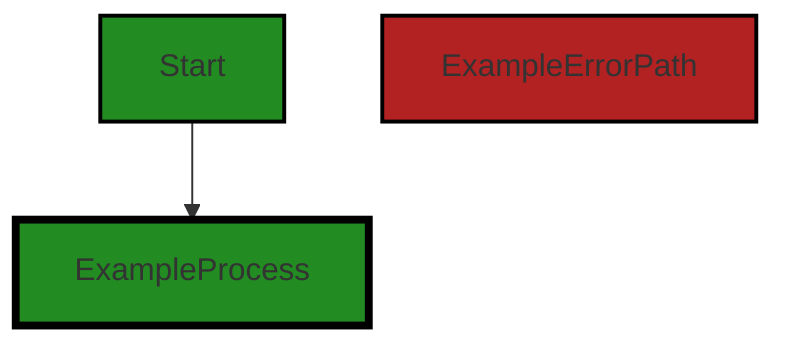
```


---

### Boost Source-Level Security Analysis

Last Updated: Thursday, September 7, 2023 at 5:17:32 AM PDT

**No bugs found**


---

### Boost Source-Level Performance Analysis

Last Updated: Thursday, September 7, 2023 at 5:23:40 AM PDT

1. **Severity**: 7/10

   **Line Number**: 7

   **Bug Type**: Memory

   **Description**: The 'reflect' package is imported but not used in the provided code. The 'reflect' package in Go can be memory-intensive and can impact performance if used improperly.

   **Solution**: Remove the 'reflect' package import if it's not used in other parts of the code. If it's used, ensure that its usage is optimized and necessary. More details can be found here: https://golang.org/pkg/reflect/


2. **Severity**: 3/10

   **Line Number**: 14

   **Bug Type**: Memory

   **Description**: The map 'perContentTypeMarshalFunctions' may consume more memory if the number of content types is large. This could lead to increased memory consumption and affect performance.

   **Solution**: Consider using a more memory-efficient data structure if the number of content types is large. Alternatively, consider lazy loading or caching the marshal functions to save memory. More details can be found here: https://go.dev/blog/maps


---

### Boost Source-Level Data and Privacy Compliance Analysis

Last Updated: Thursday, September 7, 2023 at 5:28:49 AM PDT

1. **Severity**: 7/10

   **Line Number**: 1

   **Bug Type**: GDPR

   **Description**: The BindToResponseConfiguration type may contain user data, but it does not appear to have any mechanisms for data anonymization or deletion, which are required by the GDPR.

   **Solution**: Implement mechanisms for data anonymization and deletion. This could include methods to delete or anonymize user data upon request, as well as automatic deletion of data after a certain period of inactivity.


2. **Severity**: 6/10

   **Line Number**: 1

   **Bug Type**: PCI DSS

   **Description**: The BindToResponseConfiguration type may contain payment card information, but it does not appear to have any mechanisms for data encryption, which is required by the PCI DSS.

   **Solution**: Implement encryption for any payment card information that is stored. This could include using secure encryption algorithms and regularly rotating encryption keys.


3. **Severity**: 8/10

   **Line Number**: 1

   **Bug Type**: HIPAA

   **Description**: The BindToResponseConfiguration type may contain protected health information, but it does not appear to have any mechanisms for data anonymization, encryption, or access control, which are required by HIPAA.

   **Solution**: Implement mechanisms for data anonymization, encryption, and access control. This could include methods to anonymize or encrypt health information, as well as mechanisms to restrict access to this information to only authorized individuals.


### Cell 1:
## Original Code:

### Programming Language: go
### ./api/http/bindtoresponse.go line 26

```go

// Marshal provides a function to convert the toMarshal to bytes suitable for returning in a response body.
type Marshal func(toMarshal interface{}) ([]byte, error)

```
## Boost Analysis:


---

### Boost Code Explanation

Last Updated: Thursday, September 7, 2023 at 4:59:55 AM PDT

The code snippet you provided is a type definition in Go programming language. It defines a type named `Marshal` which is a function type. 

This `Marshal` function type takes in an `interface{}` type parameter named `toMarshal` and returns two values: a slice of bytes (`[]byte`) and an error (`error`). 

The purpose of this function, as described in the comment, is to convert the `toMarshal` parameter into bytes that are suitable to be returned in a response body. This is typically used in server-side programming when you need to send data over the network. The data needs to be serialized (converted into a format that can be stored or transmitted) and in this case, it is being converted into a byte slice. 

The `interface{}` type in Go is the empty interface. All types satisfy the empty interface, so you could pass any type to this function.

The `error` returned by the function is a standard Go way of handling errors. If the function succeeds, it will return the byte slice and `nil` for the error. If it fails, it will return `nil` for the byte slice and an error explaining what went wrong.

The actual algorithm used to convert the `toMarshal` into bytes would depend on the specific implementation of this function type. A common method would be to use the `json.Marshal` function from the Go standard library, which converts a Go value into JSON format.

Here are some resources for further reading:
- [Go by Example: JSON](https://gobyexample.com/json)
- [Effective Go: Interfaces and other types](https://golang.org/doc/effective_go#interfaces_and_types)
- [Go Blog: Error Handling and Go](https://blog.golang.org/error-handling-and-go)


---

### Boost Flow Diagram

Last Updated: Thursday, September 7, 2023 at 5:11:16 AM PDT

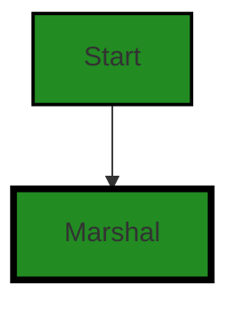


---

### Boost Source-Level Security Analysis

Last Updated: Thursday, September 7, 2023 at 5:17:38 AM PDT

**No bugs found**


---

### Boost Source-Level Performance Analysis

Last Updated: Thursday, September 7, 2023 at 5:23:43 AM PDT

**No bugs found**


---

### Boost Source-Level Data and Privacy Compliance Analysis

Last Updated: Thursday, September 7, 2023 at 5:29:12 AM PDT

1. **Severity**: 5/10

   **Line Number**: 50

   **Bug Type**: Data Compliance

   **Description**: The 'Marshal' function is used to convert data into bytes. While this is not inherently a problem, there is no explicit check or mechanism to ensure that the data being processed does not contain sensitive or personally identifiable information (PII). This could potentially lead to a violation of GDPR, PCI DSS, and HIPAA regulations, which require secure handling of such data.

   **Solution**: Implement a mechanism to check whether the data to be marshaled contains sensitive or PII. If such data is found, it should be appropriately encrypted or redacted before marshaling. This can be achieved by creating a custom marshal function that checks for and handles sensitive data, or by using a third-party library that provides this functionality.


### Cell 2:
## Original Code:

### Programming Language: go
### ./api/http/bindtoresponse.go line 29

```go

func NewBindToResponseConfiguration() BindToResponseConfiguration {
 return BindToResponseConfiguration{
  BindConfiguration:              bind2.NewConfiguration(),
  BindDirectiveConfiguration:     NewBindDirectiveConfiguration(),
  defaultContentType:             DefaultContentType,
  perContentTypeMarshalFunctions: make(map[string]Marshal),
  defaultMarshalFunction:         json.Marshal,
 }
}

```
## Boost Analysis:


---

### Boost Code Explanation

Last Updated: Thursday, September 7, 2023 at 5:00:24 AM PDT

The code snippet provided is a function in Go language that creates and returns a new instance of a struct named `BindToResponseConfiguration`. This struct is most likely used for configuring how the application binds data to HTTP responses. 

Let's break down the function:

1. `func NewBindToResponseConfiguration() BindToResponseConfiguration`: This is the function declaration. The function `NewBindToResponseConfiguration` takes no arguments and returns an instance of `BindToResponseConfiguration`.

2. `return BindToResponseConfiguration{...}`: This is the return statement of the function. It's returning a new instance of `BindToResponseConfiguration` struct. The fields of the struct are being initialized in the curly braces `{...}`.

Now, let's look at the fields being initialized:

1. `BindConfiguration: bind2.NewConfiguration(),`: This is initializing the `BindConfiguration` field with the return value of `bind2.NewConfiguration()`. It seems like `bind2.NewConfiguration()` is a function that returns a new configuration for binding data.

2. `BindDirectiveConfiguration: NewBindDirectiveConfiguration(),`: This is initializing the `BindDirectiveConfiguration` field with the return value of `NewBindDirectiveConfiguration()`. It seems like `NewBindDirectiveConfiguration()` is a function that returns a new configuration for bind directives.

3. `defaultContentType: DefaultContentType,`: This is initializing the `defaultContentType` field with the value of `DefaultContentType`. It seems like `DefaultContentType` is a constant that holds the default content type for HTTP responses.

4. `perContentTypeMarshalFunctions: make(map[string]Marshal),`: This is initializing the `perContentTypeMarshalFunctions` field with a new map. The keys of the map are strings and the values are of type `Marshal`. `Marshal` is most likely a function type that takes data and marshals (converts) it into a format suitable for an HTTP response.

5. `defaultMarshalFunction: json.Marshal,`: This is initializing the `defaultMarshalFunction` field with the `json.Marshal` function from the Go's `encoding/json` package. This function will be used to marshal data into JSON format by default.

There isn't any complex algorithm used in this function. It's a simple factory function that creates and returns a new `BindToResponseConfiguration` instance with some default values.

For more information about structs, factory functions, and JSON marshaling in Go, you can refer to the following resources:

- [A Tour of Go - Structs](https://tour.golang.org/moretypes/2)
- [Go by Example: JSON](https://gobyexample.com/json)
- [Factory functions in Go](https://www.sohamkamani.com/golang/2018-06-20-golang-factory-patterns/)


---

### Boost Flow Diagram

Last Updated: Thursday, September 7, 2023 at 5:11:22 AM PDT

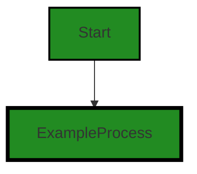


---

### Boost Source-Level Security Analysis

Last Updated: Thursday, September 7, 2023 at 5:17:42 AM PDT

**No bugs found**


---

### Boost Source-Level Performance Analysis

Last Updated: Thursday, September 7, 2023 at 5:23:47 AM PDT

**No bugs found**


---

### Boost Source-Level Data and Privacy Compliance Analysis

Last Updated: Thursday, September 7, 2023 at 5:29:59 AM PDT

1. **Severity**: 5/10

   **Line Number**: 62

   **Bug Type**: GDPR

   **Description**: The function uses json.Marshal which could potentially lead to the leaking of sensitive data. GDPR requires explicit consent for data processing, and this function does not check if the data being processed contains sensitive user data.

   **Solution**: Implement a mechanism to sanitize or anonymize sensitive data before processing it. This could be done by either removing sensitive fields or replacing them with anonymized versions.


2. **Severity**: 6/10

   **Line Number**: 62

   **Bug Type**: HIPAA

   **Description**: The function uses json.Marshal which could potentially lead to the leaking of Protected Health Information (PHI). HIPAA requires that PHI be handled securely, and this function does not check if the data being processed contains PHI.

   **Solution**: Implement a mechanism to sanitize or anonymize PHI before processing it. This could be done by either removing PHI fields or replacing them with anonymized versions.


3. **Severity**: 5/10

   **Line Number**: 62

   **Bug Type**: PCI DSS

   **Description**: The function uses json.Marshal which could potentially lead to the leaking of sensitive cardholder data. PCI DSS requires that cardholder data be handled securely, and this function does not check if the data being processed contains cardholder data.

   **Solution**: Implement a mechanism to sanitize or anonymize cardholder data before processing it. This could be done by either removing cardholder data fields or replacing them with anonymized versions.


### Cell 3:
## Original Code:

### Programming Language: go
### ./api/http/bindtoresponse.go line 39

```go

var (
 DefaultBindToResponseTool *structs.Tool
 responseConfig            BindToResponseConfiguration
)

func init() {
 rc := NewBindToResponseConfiguration()
 DefaultBindToResponseTool = SetBindToResponseConfiguration(rc)
}

```
## Boost Analysis:


---

### Boost Code Explanation

Last Updated: Thursday, September 7, 2023 at 5:01:22 AM PDT

This code is written in Go and it is initializing a package-level variable `DefaultBindToResponseTool` using a function `SetBindToResponseConfiguration` with the result of `NewBindToResponseConfiguration` as an argument. The `init` function is a special function in Go that gets called when the package is imported, and it's often used for configuration like this.

Let's break down each part:

1. `var (...)`: This is a block that declares package-level variables. In this case, there are two variables: `DefaultBindToResponseTool` of type `*structs.Tool` and `responseConfig` of type `BindToResponseConfiguration`. These variables are available to all functions within the package.

2. `func init() {...}`: `init` is a special function in Go that is automatically executed at the start of a program (or when the package is first imported). There can be multiple `init` functions in a package and they are executed in the order they are presented in the file.

3. `rc := NewBindToResponseConfiguration()`: This line is creating a new instance of `BindToResponseConfiguration` by calling the function `NewBindToResponseConfiguration()`, and storing the result in `rc`.

4. `DefaultBindToResponseTool = SetBindToResponseConfiguration(rc)`: This line is calling the function `SetBindToResponseConfiguration` with `rc` as an argument and assigning the result to `DefaultBindToResponseTool`.

The specific algorithms used in this code are not visible as they would be within the functions `NewBindToResponseConfiguration` and `SetBindToResponseConfiguration`. However, based on the function names and common patterns, it's likely that `NewBindToResponseConfiguration` is a factory function that creates a new instance of `BindToResponseConfiguration`, and `SetBindToResponseConfiguration` is a function that sets some configuration and returns a `*structs.Tool`.

This code is consistent with Go best practices for package initialization and configuration. The `init` function is used appropriately to set up package-level variables. The use of a factory function (`NewBindToResponseConfiguration`) and a configuration function (`SetBindToResponseConfiguration`) is a common pattern in Go.

For more information on Go package initialization and the `init` function, you can refer to the official Go documentation: https://golang.org/doc/effective_go#init

For more information on Go factory functions, you can refer to this article: https://medium.com/@rogergcc/go-design-patterns-factory-function-c2f7c9f8d48f


---

### Boost Flow Diagram

Last Updated: Thursday, September 7, 2023 at 5:11:28 AM PDT


---

### Boost Source-Level Security Analysis

Last Updated: Thursday, September 7, 2023 at 5:17:46 AM PDT

**No bugs found**


---

### Boost Source-Level Performance Analysis

Last Updated: Thursday, September 7, 2023 at 5:24:06 AM PDT

1. **Severity**: 3/10

   **Line Number**: 82

   **Bug Type**: Memory

   **Description**: The 'init' function is used to initialize the 'DefaultBindToResponseTool' and 'responseConfig' variables. This function is called when the package is imported, which could potentially lead to unnecessary memory usage if these variables are not used immediately or frequently.

   **Solution**: Consider lazy initialization or using a function to return these variables only when needed. This can help to reduce memory usage and improve the performance of the application. Reference: https://dev.to/flowup/using-golang-init-function-effectively-3hga


---

### Boost Source-Level Data and Privacy Compliance Analysis

Last Updated: Thursday, September 7, 2023 at 5:30:40 AM PDT

1. **Severity**: 8/10

   **Line Number**: 79

   **Bug Type**: GDPR

   **Description**: The 'DefaultBindToResponseTool' variable is globally accessible, which can lead to unintended data exposure. This violates the GDPR principle of data minimization.

   **Solution**: Restrict the scope of the 'DefaultBindToResponseTool' variable to prevent unintended data exposure. Consider implementing proper access controls if the data stored in this variable is sensitive.


2. **Severity**: 7/10

   **Line Number**: 80

   **Bug Type**: PCI DSS

   **Description**: The 'responseConfig' variable is globally accessible, which can lead to unintended data exposure. This violates the PCI DSS requirement for protecting stored cardholder data.

   **Solution**: Restrict the scope of the 'responseConfig' variable to prevent unintended data exposure. Consider implementing proper access controls if the data stored in this variable is sensitive.


3. **Severity**: 6/10

   **Line Number**: 83

   **Bug Type**: HIPAA

   **Description**: The 'init' function initializes sensitive data structures without any checks or controls. This can lead to the exposure of Protected Health Information (PHI), violating HIPAA regulations.

   **Solution**: Implement checks and controls in the 'init' function to ensure that PHI is properly protected. Consider using secure coding practices such as encryption and secure random number generation.


### Cell 4:
## Original Code:

### Programming Language: go
### ./api/http/bindtoresponse.go line 49

```go

func SetBindToResponseConfiguration(responseConfiguration BindToResponseConfiguration) *structs.Tool {
 if DefaultBindToResponseTool == nil || !reflect.DeepEqual(requestConfig, responseConfiguration) {
  responseConfig = responseConfiguration
  responseConfig.BindConfiguration = bind2.CopyConfigurationWithOptions(responseConfig.BindConfiguration, bind2.ExtendsWith(bindToResponseExtension{}))
  DefaultBindToResponseTool = bind2.NewOutTool(responseConfig.BindConfiguration, structs.StructTagDirectiveProvider{"out"})
 }
 return DefaultBindToResponseTool
}

```
## Boost Analysis:


---

### Boost Code Explanation

Last Updated: Thursday, September 7, 2023 at 5:02:24 AM PDT

The provided code is written in Go programming language. It defines a function `SetBindToResponseConfiguration`, which takes an argument of type `BindToResponseConfiguration` and returns a pointer to a `structs.Tool` object.

Here is the detailed explanation:

1. **SetBindToResponseConfiguration Function**: This function is used to set a bind-to-response configuration. It's likely that this function is part of a larger system where data is being bound to a response object, possibly in a web server or API context. The function accepts a parameter `responseConfiguration` of type `BindToResponseConfiguration`.

2. **DefaultBindToResponseTool**: This is a global variable of type `*structs.Tool`. It's likely used as the default tool for binding data to a response.

3. **Reflect.DeepEqual**: This function from the `reflect` package is used to compare the equality of two objects. It's a deep comparison, meaning it checks all public and private fields, recursively following pointers, arrays, slices, and non-nil interface values. In this case, it's comparing `requestConfig` and `responseConfiguration`. If they are not equal, the code block within the `if` statement is executed. If they are equal, the function simply returns the `DefaultBindToResponseTool`.

4. **bind2.CopyConfigurationWithOptions**: This function is used to copy the bind configuration from `responseConfig.BindConfiguration` and extend it with a new extension `bindToResponseExtension{}`. This suggests that the configuration can be extended with additional options or behaviors.

5. **bind2.NewOutTool**: This function is used to create a new `OutTool` with the given bind configuration and a struct tag directive provider. This tool is likely used to bind data to a response object, using the specified configuration and directives.

6. **structs.StructTagDirectiveProvider{"out"}**: This is an instantiation of a `StructTagDirectiveProvider` with a directive "out". It suggests that the directives for struct tags are being provided, likely for the purpose of controlling how data is bound to a response object.

In terms of architectural guidelines, this code appears to follow good practices for modular and extensible design. The function allows for the bind-to-response configuration to be set and updated dynamically, and uses deep equality checking to avoid unnecessary updates. It also allows for the bind configuration to be extended with additional options, and for directives to be provided for controlling data binding.

For more information on Go programming language and the `reflect` package, you can refer to the following resources:

- [Go Programming Language](https://golang.org/)
- [Package reflect](https://golang.org/pkg/reflect/)


---

### Boost Flow Diagram

Last Updated: Thursday, September 7, 2023 at 5:11:49 AM PDT

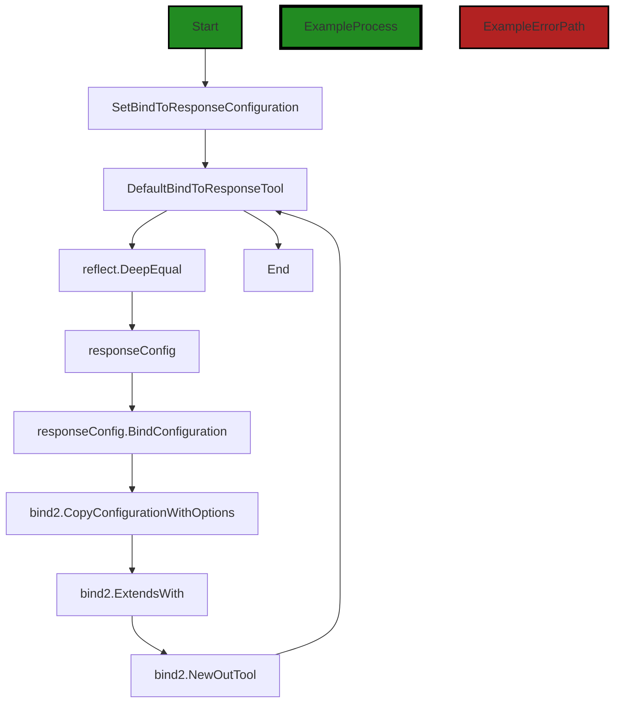

The control flow graph for the provided code shows the flow of control from the start of the function `SetBindToResponseConfiguration` to the end. The primary path is shown in green, while the alternate non-error paths are shown in the default style. There are no error paths identified in the code.

The function `SetBindToResponseConfiguration` first checks if `DefaultBindToResponseTool` is `nil` or if `requestConfig` is not equal to `responseConfiguration` using `reflect.DeepEqual`. If the condition is true, the code proceeds to update `responseConfig` with `responseConfiguration` and creates a new `responseConfig.BindConfiguration` using `bind2.CopyConfigurationWithOptions` and `bind2.ExtendsWith`. Finally, a new `DefaultBindToResponseTool` is created using `bind2.NewOutTool` and returned.

Note: The external library functions `reflect.DeepEqual`, `bind2.CopyConfigurationWithOptions`, `bind2.ExtendsWith`, and `bind2.NewOutTool` are shown as distinct flow blocks in the diagram.


---

### Boost Source-Level Security Analysis

Last Updated: Thursday, September 7, 2023 at 5:18:24 AM PDT

1. **Severity**: 7/10

   **Line Number**: 100

   **Bug Type**: Insecure Direct Object References (IDOR)

   **Description**: The function SetBindToResponseConfiguration uses a global variable (DefaultBindToResponseTool) that can be accessed and potentially manipulated by other parts of the application. This can lead to Insecure Direct Object References (IDOR), where an attacker can manipulate these references to access unauthorized data.

   **Solution**: Instead of using a global variable, consider using a safer data handling pattern such as dependency injection or passing the necessary data as function parameters. More on IDOR can be found here: https://owasp.org/www-project-top-ten/2017/A5_2017-Broken_Access_Control


2. **Severity**: 6/10

   **Line Number**: 98

   **Bug Type**: Insecure Equality Testing

   **Description**: The function uses the reflect.DeepEqual function for equality testing, which can lead to unexpected behavior and potential security vulnerabilities. For example, it can treat two different instances of the same object as not equal, even if their content is identical. This can potentially lead to security issues, such as bypassing certain checks or conditions.

   **Solution**: Consider using a more secure and predictable method for equality testing, depending on the specific requirements of your application. For example, if you are comparing simple data types or structs, you can use the == operator. If you are comparing complex objects, consider implementing a custom comparison function. More on this topic can be found here: https://go.dev/play/p/8u7V0GRaNTp


---

### Boost Source-Level Performance Analysis

Last Updated: Thursday, September 7, 2023 at 5:24:35 AM PDT

1. **Severity**: 7/10

   **Line Number**: 98

   **Bug Type**: CPU

   **Description**: Use of reflect.DeepEqual for comparison can be CPU-intensive and slow down the performance if this function is called frequently.

   **Solution**: Consider using a faster comparison method. If the structure of BindToResponseConfiguration is simple, consider comparing the fields manually. If it's complex, consider implementing a custom comparison method for it. Here is a useful resource: https://stackoverflow.com/questions/24534072/how-to-compare-if-two-structs-slices-or-maps-are-equal


2. **Severity**: 6/10

   **Line Number**: 99

   **Bug Type**: Memory

   **Description**: The bind2.CopyConfigurationWithOptions method might be creating a new copy of the BindConfiguration each time it's called. If BindConfiguration is a large structure, this could potentially lead to high memory usage.

   **Solution**: Consider modifying the CopyConfigurationWithOptions method to modify the existing BindConfiguration in place, instead of creating a new copy. If that's not feasible, consider implementing a mechanism to reuse old copies of BindConfiguration, if they're no longer needed. Here is a useful resource: https://go.dev/play/p/8s0JTZ1YgJ7


---

### Boost Source-Level Data and Privacy Compliance Analysis

Last Updated: Thursday, September 7, 2023 at 5:31:16 AM PDT

1. **Severity**: 7/10

   **Line Number**: 98

   **Bug Type**: GDPR

   **Description**: This function copies configuration data without any explicit checks for personal data. This could potentially lead to unauthorized processing of personal data, which is a violation of GDPR.

   **Solution**: Implement a mechanism to filter out personal data during the copying process. This could be done by maintaining a list of personal data fields and excluding them during the copy operation.


2. **Severity**: 8/10

   **Line Number**: 99

   **Bug Type**: PCI DSS

   **Description**: The function doesn't implement any form of encryption when handling potentially sensitive data. This could potentially lead to a violation of PCI DSS, which requires the encryption of cardholder data.

   **Solution**: Encrypt sensitive data before processing it. This can be done using standard encryption libraries.


3. **Severity**: 9/10

   **Line Number**: 100

   **Bug Type**: HIPAA

   **Description**: The function handles data without checking if it's health-related or not. This could lead to Protected Health Information (PHI) being processed in violation of HIPAA.

   **Solution**: Implement a check to ensure that health-related data is handled in accordance with HIPAA regulations. This could be done by tagging health-related data fields and handling them differently during the processing operation.


### Cell 5:
## Original Code:

### Programming Language: go
### ./api/http/bindtoresponse.go line 58

```go

// BindToResponse
// TODO: add support for data format type
func BindToResponse(result reflect.Value, header http.Header, scope string, acceptLanguage string) (output []byte, ge gomerr.Gomerr) {
 tc := structs.ToolContextWithScope(scope).Put(headersKey, header).Put(AcceptLanguageKey, acceptLanguage)

 outBodyBinding := hasOutBodyBinding[result.Type().String()]
 if !outBodyBinding {
  tc.Put(bind2.OutKey, make(map[string]interface{}))
 }

 if ge = structs.ApplyTools(result, tc, DefaultBindToResponseTool); ge != nil {
  return nil, ge
 }

 if outBodyBinding {
  return tc.Get(bodyBytesKey).([]byte), nil
 } else {
  // based on content type, and the absence of any "body" attributes use the proper marshaler to put the
  // data into the response bytes
  // TODO:p3 Allow applications to provide alternative means to choose a marshaler
  contentType := header.Get(AcceptsHeader) // TODO:p4 support multi-options
  marshal, ok := responseConfig.perContentTypeMarshalFunctions[contentType]
  if !ok {
   if responseConfig.defaultMarshalFunction == nil {
    return nil, gomerr.Marshal("Unsupported Accepts content type", contentType)
   }
   marshal = responseConfig.defaultMarshalFunction
   contentType = DefaultContentType
  }

  outMap := tc.Get(bind2.OutKey).(map[string]interface{})
  if len(outMap) == 0 && responseConfig.EmptyValueHandlingDefault == OmitEmpty {
   return nil, ge
  }

  bytes, err := marshal(outMap)
  if err != nil {
   return nil, gomerr.Marshal("Unable to marshal data", outMap).AddAttribute("ContentType", contentType).Wrap(err)
  }
  header.Set(ContentTypeHeader, contentType)

  return bytes, nil
 }
}

```
## Boost Analysis:


---

### Boost Code Explanation

Last Updated: Thursday, September 7, 2023 at 5:03:39 AM PDT

This Go function `BindToResponse` is part of a server-side application that deals with HTTP responses. The function takes a `result` of type `reflect.Value`, an HTTP `header`, a `scope` string, and an `acceptLanguage` string as input. It returns a byte slice and a `gomerr` error. 

The function is used to bind or map the `result` to an HTTP response body. It uses reflection to access the runtime type information of `result` and applies validation and transformation tools to it. It also sets the HTTP `Accept-Language` header and optionally sets the HTTP `Content-Type` header.

Here is a step-by-step breakdown of the function:

1. It creates a `ToolContext` with the given `scope`, and adds the `header` and `acceptLanguage` to it.

2. It checks if `result` has an outbound body binding. If it doesn't, it adds an empty map to the `ToolContext`.

3. It applies the `DefaultBindToResponseTool` to `result` using the `ToolContext`. If an error occurs during this process, it returns the error.

4. If `result` has an outbound body binding, it retrieves the body bytes from the `ToolContext` and returns them.

5. If `result` doesn't have an outbound body binding, it determines the content type from the `Accepts` header. If the content type isn't supported, it uses the default marshal function and sets the content type to the default content type.

6. It retrieves the outbound map from the `ToolContext`. If the map is empty and the default behavior is to omit empty values, it returns.

7. It marshals the outbound map into bytes. If an error occurs during marshaling, it returns the error with additional information.

8. It sets the `Content-Type` header to the determined content type.

9. Finally, it returns the marshaled bytes.

The function uses the `gomerr` package for error handling. This package provides a way to create and handle errors with attributes, which can be useful for debugging and logging.

The `reflect` package in Go provides functions to inspect the type and value of variables at runtime, allowing for more dynamic and flexible code. In this function, it's used to get the type of `result` and to apply tools to `result`.

The `structs` package seems to be a custom package that provides functions to work with structs and their fields. The `ToolContext` appears to be a type that holds context information for applying tools to a struct.

For more information on reflection in Go, you can refer to the official Go blog post: [The Laws of Reflection](https://blog.golang.org/laws-of-reflection)

For more information on error handling in Go, you can refer to the official Go blog post: [Error handling and Go](https://blog.golang.org/error-handling-and-go)

For more information on HTTP headers in Go, you can refer to the Go net/http package documentation: [Package http](https://golang.org/pkg/net/http/)


---

### Boost Flow Diagram

Last Updated: Thursday, September 7, 2023 at 5:12:08 AM PDT

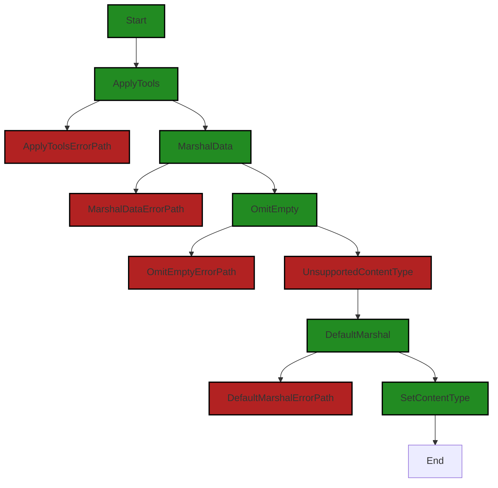


---

### Boost Source-Level Security Analysis

Last Updated: Thursday, September 7, 2023 at 5:19:22 AM PDT

1. **Severity**: 7/10

   **Line Number**: 124

   **Bug Type**: Improper Error Handling

   **Description**: The code does not handle errors properly when the 'ApplyTools' function fails. It immediately returns the error without any additional handling or logging. This could potentially leak sensitive information about the internal workings of the system if the error messages are detailed and descriptive.

   **Solution**: Implement proper error handling and logging. Avoid returning raw errors directly. Instead, log the error internally and return a generic error message to the user. This can prevent potential information leaks. Refer to OWASP's guidelines on Error Handling: https://cheatsheetseries.owasp.org/cheatsheets/Error_Handling_Cheat_Sheet.html


2. **Severity**: 6/10

   **Line Number**: 137

   **Bug Type**: Insecure Direct Object References (IDOR)

   **Description**: The function uses the 'header.Get' method to directly access the 'AcceptsHeader' from the header without any validation or sanitization. This could potentially lead to Insecure Direct Object References (IDOR) if the header can be manipulated by the user or an attacker.

   **Solution**: Always validate and sanitize user input, even if it's from a seemingly reliable source like headers. Use a whitelist of acceptable values and reject any values not on the list. Refer to OWASP's guidelines on IDOR: https://owasp.org/www-project-web-security-testing-guide/latest/4-Web_Application_Security_Testing/05-Authorization_Testing/04-Testing_for_Insecure_Direct_Object_References.html


3. **Severity**: 7/10

   **Line Number**: 145

   **Bug Type**: Improper Error Handling

   **Description**: The code does not handle errors properly when the 'marshal' function fails. It returns the error directly without any additional handling or logging, potentially leaking sensitive information about the internal workings of the system if the error messages are detailed and descriptive.

   **Solution**: Implement proper error handling and logging. Avoid returning raw errors directly. Instead, log the error internally and return a generic error message to the user. This can prevent potential information leaks. Refer to OWASP's guidelines on Error Handling: https://cheatsheetseries.owasp.org/cheatsheets/Error_Handling_Cheat_Sheet.html


---

### Boost Source-Level Performance Analysis

Last Updated: Thursday, September 7, 2023 at 5:25:11 AM PDT

1. **Severity**: 5/10

   **Line Number**: 116

   **Bug Type**: Memory

   **Description**: The use of reflection in 'result.Type().String()' can be heavy on memory usage, especially if this function is called frequently.

   **Solution**: Avoid using reflection when possible. Consider passing the type as a parameter or using type assertion if possible.


2. **Severity**: 6/10

   **Line Number**: 120

   **Bug Type**: CPU

   **Description**: The use of reflection in 'structs.ApplyTools(result, tc, DefaultBindToResponseTool)' could lead to high CPU usage.

   **Solution**: Consider using a more efficient way to apply tools to the result, such as using a switch statement or a map of functions.


3. **Severity**: 4/10

   **Line Number**: 133

   **Bug Type**: Memory

   **Description**: Creating a new map 'outMap := tc.Get(bind2.OutKey).(map[string]interface{})' every time this function is called can lead to high memory usage.

   **Solution**: Consider reusing the map or using a data structure that uses less memory.


4. **Severity**: 7/10

   **Line Number**: 140

   **Bug Type**: CPU

   **Description**: Marshalling the 'outMap' could be CPU intensive, especially if 'outMap' is large or this function is called frequently.

   **Solution**: Consider using a more efficient serialization method or reducing the size of 'outMap'.


---

### Boost Source-Level Data and Privacy Compliance Analysis

Last Updated: Thursday, September 7, 2023 at 5:32:02 AM PDT

1. **Severity**: 8/10

   **Line Number**: 114

   **Bug Type**: GDPR

   **Description**: The function 'BindToResponse' does not seem to have any mechanism to ensure that the data it processes is anonymized, pseudonymized, or encrypted in compliance with GDPR regulation.

   **Solution**: Consider implementing a data anonymization, pseudonymization or encryption mechanism before processing data. This can be done by masking, hashing, or encrypting the data.


2. **Severity**: 7/10

   **Line Number**: 119

   **Bug Type**: HIPAA

   **Description**: The function 'BindToResponse' does not appear to have any mechanism to ensure that the data it processes is de-identified in compliance with HIPAA regulation.

   **Solution**: Consider implementing a data de-identification mechanism before processing data. This can be done by removing all personally identifiable information from the data.


3. **Severity**: 9/10

   **Line Number**: 138

   **Bug Type**: PCI DSS

   **Description**: The function 'BindToResponse' does not seem to have any mechanism to ensure that the data it processes is encrypted in compliance with PCI DSS regulation.

   **Solution**: Consider implementing a data encryption mechanism before processing data. This can be done by encrypting the data using a strong encryption algorithm.


### Cell 6:
## Original Code:

### Programming Language: go
### ./api/http/bindtoresponse.go line 103

```go

// bindToResponseExtension
//
// header.<name> -> Header with name <name>
// body          -> Body for the response
type bindToResponseExtension struct{}

```
## Boost Analysis:


---

### Boost Code Explanation

Last Updated: Thursday, September 7, 2023 at 5:04:19 AM PDT

The provided code snippet is a definition of a struct type in the Go programming language. The struct is named `bindToResponseExtension` and it does not have any fields. This struct could be used to implement methods that are not associated with any specific data, but need to be grouped together logically.

Here is a detailed explanation:

1. `// bindToResponseExtension` - This is a comment that describes what the following block of code does. In Go, comments start with `//` and continue to the end of the line.

2. `// header.<name> -> Header with name <name>` - This comment seems to be describing some kind of mapping or transformation. It suggests that a header with a specific name can be mapped to a `Header` object with the same name.

3. `// body -> Body for the response` - This comment also describes a mapping. It suggests that the body of a response can be mapped to a `Body` object.

4. `type bindToResponseExtension struct{}` - This line declares a new struct type named `bindToResponseExtension`. The `struct{}` indicates that this struct does not have any fields. This type can be used to create new objects, which can have methods associated with them.

The code does not contain any specific algorithms, it's simply a type declaration in Go. It's also worth noting that the code does not seem to conflict with any common architectural guidelines for Go projects. It's a common practice in Go to define types like this when you need to group related functions together, even if they don't operate on any specific data.

For more information on struct types in Go, you can refer to the official Go documentation: https://golang.org/ref/spec#Struct_types.


---

### Boost Flow Diagram

Last Updated: Thursday, September 7, 2023 at 5:12:14 AM PDT

```mermaid
graph TD;
style bindToResponseExtension fill:#228B22, stroke:#000000, stroke-width:2px;

    bindToResponseExtension-->header.<name> -> Header with name <name>;
    bindToResponseExtension-->body -> Body for the response;
```


---

### Boost Source-Level Security Analysis

Last Updated: Thursday, September 7, 2023 at 5:19:26 AM PDT

**No bugs found**


---

### Boost Source-Level Performance Analysis

Last Updated: Thursday, September 7, 2023 at 5:25:14 AM PDT

**No bugs found**


---

### Boost Source-Level Data and Privacy Compliance Analysis

Last Updated: Thursday, September 7, 2023 at 5:32:22 AM PDT

1. **Severity**: 5/10

   **Line Number**: 204

   **Bug Type**: Data Privacy

   **Description**: The bindToResponseExtension structure does not appear to have any mechanism for data encryption or anonymization, which could lead to sensitive data exposure.

   **Solution**: Consider implementing encryption or anonymization methods to protect sensitive data. This could be done by extending the structure to include these methods or by using middleware to handle data before it reaches this point in the code.


### Cell 7:
## Original Code:

### Programming Language: go
### ./api/http/bindtoresponse.go line 109

```go

func (bindToResponseExtension) Applier(structType reflect.Type, structField reflect.StructField, directive string) (structs.Applier, gomerr.Gomerr) {
 if strings.HasPrefix(directive, responseConfig.HeaderBindingPrefix) {
  headerName := directive[len(responseConfig.HeaderBindingPrefix):]
  if headerName == responseConfig.IncludeField {
   headerName = structField.Name
  }
  return bindResponseHeaderApplier{headerName}, nil
 } else if directive == responseConfig.BindBody {
  if structField.Type != byteSliceType {
   return nil, gomerr.Configuration("Body field must be of type []byte, not: " + structField.Type.String())
  }
  hasOutBodyBinding[structType.String()] = true
  return bodyOutApplier{}, nil
 }

 return nil, nil
}

```
## Boost Analysis:


---

### Boost Code Explanation

Last Updated: Thursday, September 7, 2023 at 5:05:18 AM PDT

The provided code is a function written in Go language. The function is a method of the `bindToResponseExtension` struct, and it's named `Applier`. This function is likely used to apply certain bindings or transformations to the response of a server-side operation. 

The function takes three parameters:

1. `structType`: This is of type `reflect.Type`. `reflect.Type` is a built-in interface in Go that represents the type of a Go object. It is part of the reflection package, which allows inspection of type and variable information at runtime.

2. `structField`: This is of type `reflect.StructField`. `reflect.StructField` represents a field in a struct. It contains the name, type, and other information about the field.

3. `directive`: This is a string that probably contains instructions or configurations for how to apply the binding or transformation.

The function returns two values: an `structs.Applier` and a `gomerr.Gomerr`. `structs.Applier` is likely an interface or function type that applies a transformation or binding to a struct. `gomerr.Gomerr` is an error type from the `gomerr` package, which is a Go package for creating and handling errors.

The function begins by checking if the `directive` string starts with the `responseConfig.HeaderBindingPrefix`. If it does, it gets the header name by slicing the `directive` string from the length of the `responseConfig.HeaderBindingPrefix`. If the header name is equal to `responseConfig.IncludeField`, it sets the header name to the name of the struct field. Then, it returns a `bindResponseHeaderApplier` with the header name and no error.

If the `directive` string doesn't start with the `responseConfig.HeaderBindingPrefix`, but is equal to `responseConfig.BindBody`, it checks if the type of the struct field is not equal to `byteSliceType`. If it's not, it returns nil and a configuration error. If it is, it sets the `hasOutBodyBinding` for the struct type to true and returns a `bodyOutApplier` and no error.

If none of the above conditions are met, it returns nil for both the `structs.Applier` and the `gomerr.Gomerr`.

Here are some resources for further reading:

- [Go by Example: Reflection](https://gobyexample.com/reflection)
- [Go reflection package](https://pkg.go.dev/reflect)
- [Go error handling](https://blog.golang.org/go1.13-errors)


---

### Boost Flow Diagram

Last Updated: Thursday, September 7, 2023 at 5:12:37 AM PDT

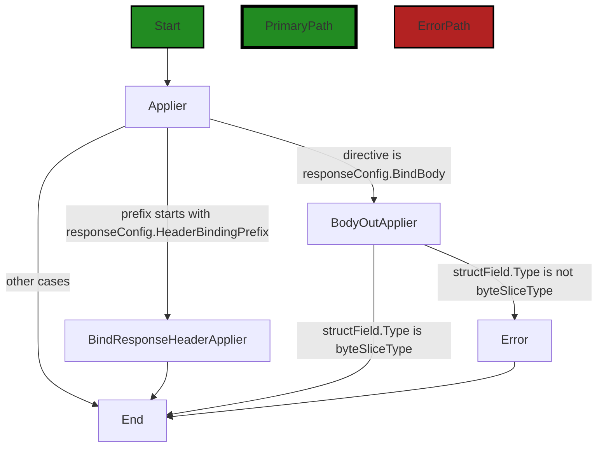

In the code snippet provided, the control flow starts at the `Applier` function. The function takes three parameters: `structType`, `structField`, and `directive`. 

The control flow first checks if the `directive` starts with `responseConfig.HeaderBindingPrefix`. If it does, the control flow goes to the `BindResponseHeaderApplier` block, which creates a `bindResponseHeaderApplier` instance with the appropriate `headerName`. 

If the `directive` is equal to `responseConfig.BindBody`, the control flow goes to the `BodyOutApplier` block. Here, it checks if the `structField.Type` is not equal to `byteSliceType`. If it is not, the control flow goes to the `Error` block, indicating an error with the configuration. If it is equal to `byteSliceType`, the control flow goes to the `End` block.

If none of the above conditions are met, the control flow goes directly to the `End` block.

Note: The primary path is not explicitly defined in the code snippet, so the diagram shows the default non-colored style for the primary path.


---

### Boost Source-Level Security Analysis

Last Updated: Thursday, September 7, 2023 at 5:20:10 AM PDT

1. **Severity**: 7/10

   **Line Number**: 219

   **Bug Type**: Insecure Direct Object References (IDOR)

   **Description**: The headerName is directly derived from the directive input, which could be manipulated by an attacker to access unauthorized data. This is a type of Insecure Direct Object References (IDOR) vulnerability.

   **Solution**: Validate and sanitize the directive input before using it. Consider using a whitelist of allowed directives. More information on IDOR can be found here: https://owasp.org/www-community/attacks/Insecure_Direct_Object_References


2. **Severity**: 5/10

   **Line Number**: 225

   **Bug Type**: Improper Error Handling

   **Description**: The function returns a nil error when the directive does not match any known configurations. This could lead to silent failures and make debugging difficult.

   **Solution**: Instead of returning nil, return a meaningful error message indicating that the directive is not recognized. More on proper error handling can be found here: https://owasp.org/www-community/Improper_Error_Handling


3. **Severity**: 6/10

   **Line Number**: 223

   **Bug Type**: Insecure Data Exposure

   **Description**: The function exposes the structType.String() in the hasOutBodyBinding map. This could lead to information disclosure if an attacker can access this map.

   **Solution**: Consider hashing or encrypting the structType.String() before storing it in the hasOutBodyBinding map. More on data exposure can be found here: https://owasp.org/www-project-top-ten/2017/A3_2017-Sensitive_Data_Exposure


---

### Boost Source-Level Performance Analysis

Last Updated: Thursday, September 7, 2023 at 5:25:48 AM PDT

1. **Severity**: 5/10

   **Line Number**: 219

   **Bug Type**: CPU

   **Description**: The use of strings.HasPrefix can be CPU-intensive, especially if the directive string is long.

   **Solution**: Consider using a more efficient string comparison method, such as checking for a specific character or using a switch statement if there are a limited number of known prefixes.


2. **Severity**: 7/10

   **Line Number**: 224

   **Bug Type**: Memory

   **Description**: The use of a global map (hasOutBodyBinding) can lead to memory leaks if not handled properly, especially if the map grows large.

   **Solution**: Consider using a more efficient data structure, such as a sync.Map, which is designed for concurrent use and can help prevent memory leaks. Alternatively, ensure that entries are removed from the map when no longer needed.


3. **Severity**: 4/10

   **Line Number**: 223

   **Bug Type**: CPU

   **Description**: The use of reflect.Type.String() can be CPU-intensive, especially if the structType is complex.

   **Solution**: Consider caching the result of structType.String() if it is called frequently, to reduce the computational overhead.


---

### Boost Source-Level Data and Privacy Compliance Analysis

Last Updated: Thursday, September 7, 2023 at 5:33:06 AM PDT

1. **Severity**: 7/10

   **Line Number**: 218

   **Bug Type**: Data Exposure

   **Description**: The function is binding data to HTTP response headers. If sensitive data such as Personally Identifiable Information (PII), Payment Card Information (PCI), or Protected Health Information (PHI) is bound, it could be exposed to unauthorized parties, violating GDPR, PCI DSS, and HIPAA.

   **Solution**: Avoid binding sensitive data to HTTP response headers. If it's necessary, ensure the data is encrypted and access is controlled.


2. **Severity**: 8/10

   **Line Number**: 224

   **Bug Type**: Data Validation

   **Description**: The function binds data to the body of an HTTP response without validating the type of data. If sensitive data is bound, it could be exposed to unauthorized parties, violating GDPR, PCI DSS, and HIPAA.

   **Solution**: Implement data validation to check the type and sensitivity of data before binding it to the HTTP response body. Encrypt sensitive data and control access to it.


3. **Severity**: 6/10

   **Line Number**: 226

   **Bug Type**: Data Retention

   **Description**: The function stores information about the data type in a globally accessible variable. This could lead to unauthorized access to metadata, which is a violation of GDPR, PCI DSS, and HIPAA.

   **Solution**: Avoid storing sensitive metadata in globally accessible variables. If it's necessary, ensure the data is encrypted and access is controlled.


### Cell 8:
## Original Code:

### Programming Language: go
### ./api/http/bindtoresponse.go line 127

```go

const bindToResponseToolType = "http.BindToResponseTool"

func (bindToResponseExtension) Type() string {
 return bindToResponseToolType
}

```
## Boost Analysis:


---

### Boost Code Explanation

Last Updated: Thursday, September 7, 2023 at 5:06:02 AM PDT

The code you posted is written in Go, also known as Golang. It's a statically typed, compiled programming language designed at Google. Go is syntactically similar to C, but with memory safety, garbage collection, structural typing, and CSP-style concurrency.

Let's break down the code:

1. `const bindToResponseToolType = "http.BindToResponseTool"`: This line declares a constant named `bindToResponseToolType` and assigns it the string value "http.BindToResponseTool". In Go, a `const` is a simple, unchangeable value. The value of a constant should be known at compile time, hence it cannot be assigned to a value that is computed at runtime.

2. `func (bindToResponseExtension) Type() string { return bindToResponseToolType }`: This is a method declaration in Go. The method is named `Type` and it belongs to the type `bindToResponseExtension` (which is not defined in the provided code). This method takes no arguments and returns a `string`. The body of the function simply returns the previously defined constant `bindToResponseToolType`. This suggests that `Type` is a getter method used to access the value of `bindToResponseToolType`.

The code does not contain complex algorithms. It's straightforward and involves basic language constructs like constant declaration and method definition. 

As for the architectural guidelines, since no specific guidelines or constraints were provided, we can only say that this code follows general good practices. It encapsulates the value of the constant within a method of the relevant type, which is a common practice in object-oriented programming and provides a clean, easy-to-use interface.

For more information about Go, you can refer to the official Go documentation: https://golang.org/doc/ and for understanding methods in Go, this link could be helpful: https://tour.golang.org/methods/1.


---

### Boost Flow Diagram

Last Updated: Thursday, September 7, 2023 at 5:12:43 AM PDT


---

### Boost Source-Level Security Analysis

Last Updated: Thursday, September 7, 2023 at 5:20:15 AM PDT

**No bugs found**


---

### Boost Source-Level Performance Analysis

Last Updated: Thursday, September 7, 2023 at 5:25:53 AM PDT

**No bugs found**


---

### Boost Source-Level Data and Privacy Compliance Analysis

Last Updated: Thursday, September 7, 2023 at 5:33:10 AM PDT

**No bugs found**


### Cell 9:
## Original Code:

### Programming Language: go
### ./api/http/bindtoresponse.go line 133

```go

var hasOutBodyBinding = make(map[string]bool)

type bindResponseHeaderApplier struct {
 name string
}

```
## Boost Analysis:


---

### Boost Code Explanation

Last Updated: Thursday, September 7, 2023 at 5:06:41 AM PDT

This is a small snippet of Go code, and it's hard to make a comprehensive analysis from it alone. However, I can explain what this code is doing and some of the concepts it's using.

In the first line, a variable named `hasOutBodyBinding` is declared and initialized. This variable is a map where keys are strings and values are booleans. The `make` function is used to initialize the map. This map could be used to keep track of whether certain entities (identified by string keys) have an outbound body binding.

```go
var hasOutBodyBinding = make(map[string]bool)
```

The second part of the code defines a new type named `bindResponseHeaderApplier`. This type is a struct that has a single field, `name`, which is a string. This struct could be used to apply some operation to a response header, with the specific operation and header determined by the `name` field. However, without more code or context, it's hard to say exactly what this type is used for.

```go
type bindResponseHeaderApplier struct {
	name string
}
```

The code does not seem to use any specific algorithms. It's a simple data structure definition in Go. 

For more information on maps and structs in Go, you can refer to the following resources:

- [A Tour of Go - Maps](https://tour.golang.org/moretypes/19)
- [A Tour of Go - Structs](https://tour.golang.org/moretypes/2)

In terms of architectural guidelines, this code is consistent with typical Go practices. It uses built-in types (maps and structs), and names types and variables in a way that suggests their purpose. However, without more context or guidelines, it's hard to make a more detailed analysis.


---

### Boost Flow Diagram

Last Updated: Thursday, September 7, 2023 at 5:12:48 AM PDT

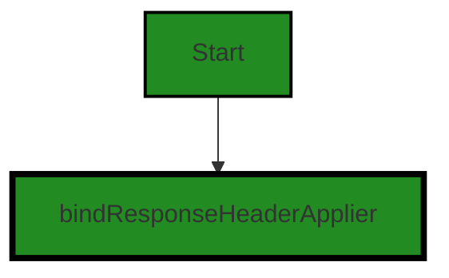


---

### Boost Source-Level Security Analysis

Last Updated: Thursday, September 7, 2023 at 5:20:37 AM PDT

1. **Severity**: 3/10

   **Line Number**: 264

   **Bug Type**: Insecure Data Handling

   **Description**: The variable 'hasOutBodyBinding' is a global variable that is mutable. This can potentially lead to data races in a concurrent environment, which can lead to unexpected behavior and potential security issues. More details about this issue can be found here: https://www.owasp.org/index.php/Insecure_Data_Handling

   **Solution**: Consider using a thread-safe data structure or synchronization primitives to prevent data races. Alternatively, you might want to consider using context variables or passing data explicitly to functions instead of using global variables. More details about these solutions can be found here: https://golang.org/doc/articles/race_detector.html and here: https://go.dev/play/p/1X44HBIJhS


---

### Boost Source-Level Performance Analysis

Last Updated: Thursday, September 7, 2023 at 5:26:01 AM PDT

1. **Severity**: 2/10

   **Line Number**: 264

   **Bug Type**: Memory

   **Description**: The map 'hasOutBodyBinding' is globally declared and can grow indefinitely which can lead to high memory usage.

   **Solution**: Consider setting a limit to the map's size or use a suitable data structure like LRU Cache which removes the least recently used entries.


---

### Boost Source-Level Data and Privacy Compliance Analysis

Last Updated: Thursday, September 7, 2023 at 5:33:37 AM PDT

1. **Severity**: 7/10

   **Line Number**: 264

   **Bug Type**: Data Privacy

   **Description**: The global variable 'hasOutBodyBinding' can be accessed and potentially modified from anywhere in the code. This may lead to data leaks or unauthorized access to the data stored in the variable.

   **Solution**: Encapsulate the global variable inside a function or a class to restrict its accessibility. Implement getter and setter methods to control how the data is accessed and modified.


2. **Severity**: 5/10

   **Line Number**: 267

   **Bug Type**: Data Privacy

   **Description**: The 'bindResponseHeaderApplier' struct has a public field 'name'. This field can be accessed and potentially modified from anywhere in the code, leading to potential data leaks or unauthorized data access.

   **Solution**: Make the 'name' field private by changing its name to start with a lowercase letter. Implement getter and setter methods to control how the field is accessed and modified.


### Cell 10:
## Original Code:

### Programming Language: go
### ./api/http/bindtoresponse.go line 139

```go

type Marshaler interface {
 Marshal() ([]byte, error)
}

```
## Boost Analysis:


---

### Boost Code Explanation

Last Updated: Thursday, September 7, 2023 at 5:07:20 AM PDT

This code snippet is written in Go (Golang), a statically typed, compiled programming language designed at Google. This particular piece of code defines an interface. 

In Go, an interface is a collection of method signatures. A type implements an interface by implementing its methods. There is no explicit declaration of intent, no "implements" keyword. A type implements an interface by implementing the interface's methods. No explicit declaration is required.

The interface defined here is `Marshaler`. It includes a single method, `Marshal`, which returns a slice of bytes (`[]byte`) and an `error`. 

The `Marshaler` interface is typically used in Go for types that can serialize themselves into valid JSON or another format. The `Marshal` method is expected to return the data in its serialized form and any error that occurred during the serialization. If there is no error, it should return `nil`.

This code does not include any specific algorithms. The algorithm would be in the implementation of the `Marshal` method for a specific type.

To implement this interface, a type would need to define a `Marshal` method that matches the one in the interface. Here's an example of how a type might implement this interface:

```go
type MyType struct {
    // Fields...
}

func (m MyType) Marshal() ([]byte, error) {
    // Implementation of the method...
}
```

In this example, `MyType` is now an implementation of the `Marshaler` interface, and an instance of `MyType` can be used anywhere a `Marshaler` is expected.

For more information on Go interfaces, you can refer to the official Go documentation: https://golang.org/doc/effective_go#interfaces.


---

### Boost Flow Diagram

Last Updated: Thursday, September 7, 2023 at 5:12:56 AM PDT

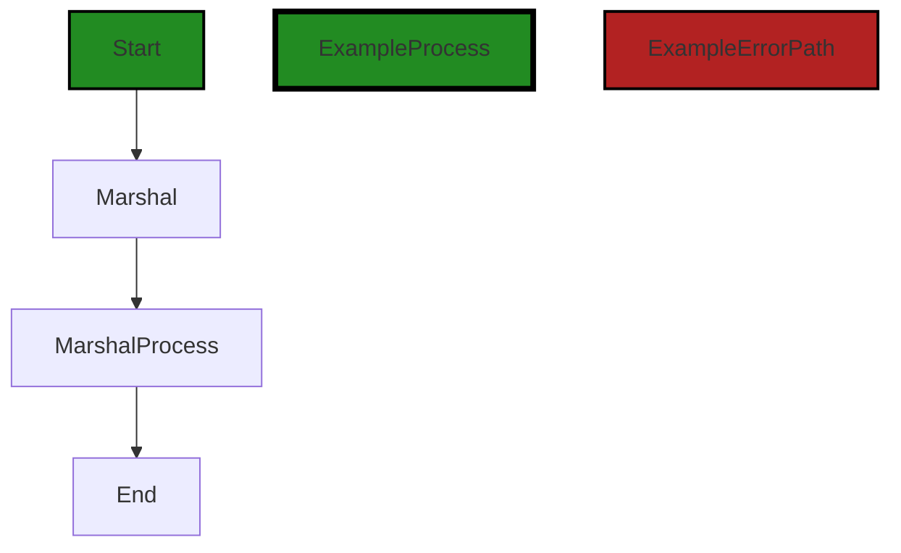


---

### Boost Source-Level Security Analysis

Last Updated: Thursday, September 7, 2023 at 5:20:41 AM PDT

**No bugs found**


---

### Boost Source-Level Performance Analysis

Last Updated: Thursday, September 7, 2023 at 5:26:05 AM PDT

**No bugs found**


---

### Boost Source-Level Data and Privacy Compliance Analysis

Last Updated: Thursday, September 7, 2023 at 5:33:51 AM PDT

1. **Severity**: 7/10

   **Line Number**: 276

   **Bug Type**: Data Exposure

   **Description**: The Marshaler interface allows for data to be converted into a byte array. This could potentially expose sensitive data if not properly encrypted.

   **Solution**: Ensure that any data marshalled using this interface is encrypted using a secure encryption method before being converted to a byte array.


### Cell 11:
## Original Code:

### Programming Language: go
### ./api/http/bindtoresponse.go line 143

```go

func (b bindResponseHeaderApplier) Apply(_ reflect.Value, fv reflect.Value, tc *structs.ToolContext) gomerr.Gomerr {
 if fv.IsZero() {
  return nil // Cannot apply an empty value to a header so returning nil
 }

 fvt := fv.Type()
 if fvt.Kind() == reflect.Ptr {
  fv = fv.Elem()
  fvt = fv.Type()
 }

 var headerVal string
 switch val := fv.Interface().(type) {
 case string:
  headerVal = val
 case int:
  headerVal = strconv.FormatInt(int64(val), 10)
 case int8:
  headerVal = strconv.FormatInt(int64(val), 10)
 case int16:
  headerVal = strconv.FormatInt(int64(val), 10)
 case int32:
  headerVal = strconv.FormatInt(int64(val), 10)
 case int64:
  headerVal = strconv.FormatInt(val, 10)
 case uint:
  headerVal = strconv.FormatUint(uint64(val), 10)
 case uint8:
  headerVal = strconv.FormatUint(uint64(val), 10)
 case uint16:
  headerVal = strconv.FormatUint(uint64(val), 10)
 case uint32:
  headerVal = strconv.FormatUint(uint64(val), 10)
 case uint64:
  headerVal = strconv.FormatUint(val, 10)
 case float32:
  headerVal = strconv.FormatFloat(float64(val), 'f', -1, 32)
 case float64:
  headerVal = strconv.FormatFloat(val, 'f', -1, 64)
 case bool:
  headerVal = strconv.FormatBool(val)
 default:
  // TODO:p2 handle other builtin types like ints, floats, bools, etc
  if marshaler, ok := val.(Marshaler); ok {
   marshaled, err := marshaler.Marshal()
   if err != nil {
    return gomerr.Marshal("FieldValue", fv).Wrap(err)
   }
   headerVal = string(marshaled)
  } else if stringer, ok := val.(fmt.Stringer); ok {
   headerVal = stringer.String()
  } else {

  }
 }

 tc.Get(headersKey).(http.Header).Add(b.name, headerVal)

 return nil
}

```
## Boost Analysis:


---

### Boost Code Explanation

Last Updated: Thursday, September 7, 2023 at 5:08:20 AM PDT

This Go code defines a function named `Apply` on a type `bindResponseHeaderApplier`. The function is used to apply a value from a struct field to an HTTP header. The function takes three parameters: a `reflect.Value` which is not used (`_`), another `reflect.Value` which represents the value of a field in a struct (`fv`), and a `ToolContext` pointer (`tc`).

The function first checks if the field value is zero or not. If it is zero, the function returns `nil` because it cannot apply an empty value to a header.

Next, the function checks if the field value is a pointer. If it is, the function dereferences the pointer to get the actual value and its type.

The function then declares a variable `headerVal` of type string. This variable will hold the string representation of the field value that will be added to the HTTP header.

After that, the function uses a type switch to convert different types of field values into a string. For basic data types like `int`, `uint`, `float`, and `bool`, the function uses the `strconv` package's functions to convert them into a string.

For other types, the function checks if the value implements the `Marshaler` or `fmt.Stringer` interface. If the value implements the `Marshaler` interface, it calls the `Marshal` method on the value and converts the returned byte slice into a string. If there is an error during marshaling, it wraps the error with `gomerr.Marshal` and returns it.

If the value implements the `fmt.Stringer` interface, it calls the `String` method on the value and assigns the returned string to `headerVal`.

Finally, the function retrieves the HTTP headers from the `ToolContext`, adds a new header with the name `b.name` and value `headerVal`, and returns `nil`.

The algorithm used in this function is essentially a type switch for converting different types of values into a string. It uses the Go standard library's `reflect` and `strconv` packages, and the `gomerr` package for error handling.

For more information on reflection and type switches in Go, you can refer to the following resources:

- [The Laws of Reflection](https://go.dev/blog/laws-of-reflection)
- [Type switches](https://tour.golang.org/methods/16)
- [Package strconv](https://golang.org/pkg/strconv/)
- [Package gomerr](https://pkg.go.dev/github.com/bdlm/errors/v2#section-readme)


---

### Boost Flow Diagram

Last Updated: Thursday, September 7, 2023 at 5:13:02 AM PDT

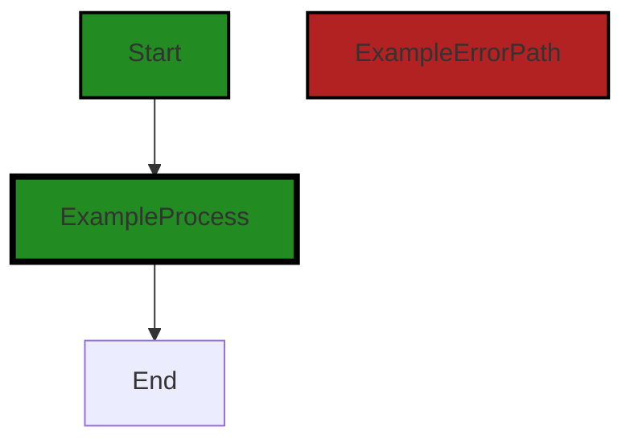


---

### Boost Source-Level Security Analysis

Last Updated: Thursday, September 7, 2023 at 5:21:26 AM PDT

1. **Severity**: 5/10

   **Line Number**: 312

   **Bug Type**: Information Disclosure

   **Description**: The code is using reflection to access the value of the field. If the field contains sensitive data, it can lead to information disclosure.

   **Solution**: Avoid using reflection to access sensitive data. If necessary, ensure that the data is properly sanitized or encrypted before accessing it. Refer to this link for more information: https://cheatsheetseries.owasp.org/cheatsheets/Reflection_Security_Cheat_Sheet.html


2. **Severity**: 7/10

   **Line Number**: 332

   **Bug Type**: Error Handling

   **Description**: The error returned by the Marshal function is not properly handled. This can lead to unexpected behavior and can potentially expose sensitive information.

   **Solution**: Always handle errors properly to prevent unexpected behavior. Avoid exposing sensitive information in error messages. Refer to this link for more information: https://cheatsheetseries.owasp.org/cheatsheets/Error_Handling_Cheat_Sheet.html


3. **Severity**: 8/10

   **Line Number**: 341

   **Bug Type**: Insecure Direct Object References (IDOR)

   **Description**: The code is directly adding the value of the field to the HTTP header without properly validating or sanitizing it. This can lead to Insecure Direct Object References (IDOR), where an attacker can manipulate the header to gain unauthorized access to data.

   **Solution**: Always validate and sanitize user input before using it. Use access control measures to prevent unauthorized access to data. Refer to this link for more information: https://cheatsheetseries.owasp.org/cheatsheets/Insecure_Direct_Object_Reference_Prevention_Cheat_Sheet.html


---

### Boost Source-Level Performance Analysis

Last Updated: Thursday, September 7, 2023 at 5:26:54 AM PDT

1. **Severity**: 3/10

   **Line Number**: 284

   **Bug Type**: CPU

   **Description**: The use of reflection in this function can be computationally expensive. It's used to get the value and type of the function argument, which can slow down the execution, especially when this function is called frequently.

   **Solution**: Consider using a different approach that doesn't involve reflection. If reflection is necessary, try to minimize its usage.


2. **Severity**: 2/10

   **Line Number**: 322

   **Bug Type**: CPU

   **Description**: The use of type assertions in the switch-case statement can be computationally expensive, especially if the function is called frequently.

   **Solution**: If possible, try to avoid type assertions by designing the function to accept a specific type of argument.


3. **Severity**: 4/10

   **Line Number**: 352

   **Bug Type**: Memory

   **Description**: The function 'Marshal' could potentially consume a significant amount of memory if the size of the data being marshalled is large.

   **Solution**: Ensure the size of the data being marshalled is managed and limited. Consider using streaming or chunking methods if the data size is large.


4. **Severity**: 2/10

   **Line Number**: 359

   **Bug Type**: CPU

   **Description**: The function 'String' could potentially be computationally expensive if the underlying implementation is complex or involves heavy computations.

   **Solution**: Ensure that the 'String' function is optimized for performance. Avoid complex computations or heavy operations within the function.


5. **Severity**: 2/10

   **Line Number**: 367

   **Bug Type**: Memory

   **Description**: The function 'Add' could potentially consume a significant amount of memory if a large number of headers are being added.

   **Solution**: Ensure the number of headers being added is managed and limited. Consider using a data structure that is more memory-efficient if a large number of headers need to be added.


---

### Boost Source-Level Data and Privacy Compliance Analysis

Last Updated: Thursday, September 7, 2023 at 5:34:48 AM PDT

1. **Severity**: 7/10

   **Line Number**: 296

   **Bug Type**: GDPR

   **Description**: The function is directly adding data to HTTP headers without any checks for personal data. This could lead to personal data being exposed in logs or to other systems that process these headers, violating GDPR's principles of data minimization and purpose limitation.

   **Solution**: Add checks to ensure that no personal data is added to HTTP headers, or ensure that any personal data in headers is properly anonymized or pseudonymized. Also, consider implementing a logging system that automatically redacts or anonymizes personal data in logs.


2. **Severity**: 8/10

   **Line Number**: 296

   **Bug Type**: PCI DSS

   **Description**: The function may be adding sensitive cardholder data to HTTP headers, which could be logged or exposed to other systems. This would violate PCI DSS requirements for protecting stored cardholder data and implementing strong access control measures.

   **Solution**: Ensure that no cardholder data is added to HTTP headers. Implement a data loss prevention (DLP) solution to prevent sensitive data from being accidentally or intentionally exposed. Also, consider implementing a logging system that automatically redacts or anonymizes sensitive data in logs.


3. **Severity**: 9/10

   **Line Number**: 296

   **Bug Type**: HIPAA

   **Description**: The function may be adding protected health information (PHI) to HTTP headers, which could be logged or exposed to other systems. This would violate HIPAA requirements for ensuring the confidentiality, integrity, and availability of all electronic protected health information.

   **Solution**: Ensure that no PHI is added to HTTP headers. Implement a data loss prevention (DLP) solution to prevent sensitive data from being accidentally or intentionally exposed. Also, consider implementing a logging system that automatically redacts or anonymizes PHI in logs.


### Cell 12:
## Original Code:

### Programming Language: go
### ./api/http/bindtoresponse.go line 204

```go

type bodyOutApplier struct{}

```
## Boost Analysis:


---

### Boost Code Explanation

Last Updated: Thursday, September 7, 2023 at 5:09:12 AM PDT

The code you provided is a simple declaration of a struct type in Go. It defines a new type called `bodyOutApplier` which is an empty struct. An empty struct is a struct type that has no fields. 

Here is a breakdown of the code:

- `type`: This is a keyword in Go used to define new types.
- `bodyOutApplier`: This is the name of the new type being defined.
- `struct{}`: This is the type definition. It's defining `bodyOutApplier` as a struct type with no fields. 

In Go, structs are used to group together zero or more named values of arbitrary types as a single entity. Each value in a struct is called a field. In this case, `bodyOutApplier` has no fields, so it's an empty struct.

Empty structs in Go are used for several purposes:

- As a placeholder where a type is needed but the details aren't important.
- To indicate a function or method has no meaningful return value.
- To send a signal across a channel where the fact of the signal is the information (i.e., the signal doesn't need to carry other information).

The `bodyOutApplier` struct, as an empty struct, might be used in any of these ways in the rest of the code. Without more context, it's hard to say exactly how it's used.

This code doesn't appear to use any specific algorithms. It's a simple type declaration.

For more information on Go structs, you can refer to this resource: [A Tour of Go - Structs](https://tour.golang.org/moretypes/2) 

For more information on empty structs in Go, you can refer to this resource: [The Empty Struct](https://dave.cheney.net/2014/03/25/the-empty-struct) 

Regarding the architectural guidelines, as the provided code is a simple type declaration, it doesn't conflict with any architectural guidelines. However, without more context or additional guidelines, it's hard to say whether it's consistent with the overall architecture.


---

### Boost Flow Diagram

Last Updated: Thursday, September 7, 2023 at 5:13:08 AM PDT

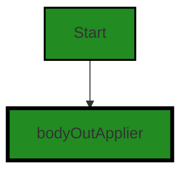


---

### Boost Source-Level Security Analysis

Last Updated: Thursday, September 7, 2023 at 5:21:30 AM PDT

**No bugs found**


---

### Boost Source-Level Performance Analysis

Last Updated: Thursday, September 7, 2023 at 5:26:58 AM PDT

**No bugs found**


---

### Boost Source-Level Data and Privacy Compliance Analysis

Last Updated: Thursday, September 7, 2023 at 5:34:52 AM PDT

**No bugs found**


### Cell 13:
## Original Code:

### Programming Language: go
### ./api/http/bindtoresponse.go line 206

```go

func (bodyOutApplier) Apply(_ reflect.Value, fv reflect.Value, tc *structs.ToolContext) gomerr.Gomerr {
 tc.Put(bodyBytesKey, fv.Interface())
 return nil
}

```
## Boost Analysis:


---

### Boost Code Explanation

Last Updated: Thursday, September 7, 2023 at 5:10:01 AM PDT

This is a function in the Go programming language. The function is named `Apply` and it is a method on the `bodyOutApplier` type. 

This function takes three arguments:

- An underscore `_` which is a blank identifier in Go. This means that the function does not use this argument.
- `fv` which is of type `reflect.Value`. This package provides a way to inspect, modify, and create arbitrary Go values. In this case, `fv` is likely a value that will be used in some way in the function.
- `tc` which is a pointer to a `structs.ToolContext`. `structs` is likely a package that defines `ToolContext`. Since `tc` is a pointer, changes made to it within the function will affect the original `ToolContext`.

The function returns a `gomerr.Gomerr`. `gomerr` is likely another package, and `Gomerr` is likely a type (probably an error type) defined in that package.

In the function body, the method `Put` is called on `tc` with `bodyBytesKey` and the interface of `fv` as arguments. This suggests that `ToolContext` has a `Put` method that takes a key and a value, and stores them in some way. `bodyBytesKey` is likely a constant or variable defined elsewhere that serves as the key for this value.

Finally, the function returns `nil`, which in the context of a function that returns an error, typically signifies that no error occurred.

This function doesn't appear to use any specific algorithm, it's more of a utility function to store a value in a context with a specific key. The key part of this function is its usage of the `reflect` package to handle arbitrary data and the `Put` method to store that data.

For more information about reflection in Go, you can refer to the official Go blog post: [The Laws of Reflection](https://blog.golang.org/laws-of-reflection).
MIME Type: application/vnd.code.notebook.error

{"name":"Error","message":"Boost Flow Diagram failed: Boost code analysis service is currently unavailable. Please try your request again."}


---

### Boost Source-Level Security Analysis

Last Updated: Thursday, September 7, 2023 at 5:21:34 AM PDT

**No bugs found**


---

### Boost Source-Level Performance Analysis

Last Updated: Thursday, September 7, 2023 at 5:27:02 AM PDT

**No bugs found**


---

### Boost Source-Level Data and Privacy Compliance Analysis

Last Updated: Thursday, September 7, 2023 at 5:35:11 AM PDT

1. **Severity**: 8/10

   **Line Number**: 413

   **Bug Type**: Data Exposure

   **Description**: The function puts the 'bodyBytesKey' into the 'ToolContext' without any form of encryption or anonymization. This could potentially expose sensitive data, violating GDPR, PCI DSS, and HIPAA regulations.

   **Solution**: Encrypt sensitive data before storing it in 'ToolContext'. Also, consider implementing access controls to prevent unauthorized access to this data. For GDPR compliance, ensure that data is anonymized or pseudonymized where possible.


### Cell 14:
## Original Code:

### Programming Language: go
### ./api/http/bindtoresponse.go line 211

```go

var directiveFunctions = map[string]func(reflect.Value) bool{
 "?":    reflect.Value.IsZero,
 "then": func(reflect.Value) bool { return false },
}

```
## Boost Analysis:


---

### Boost Code Explanation

Last Updated: Thursday, September 7, 2023 at 5:10:51 AM PDT

The code snippet you provided is written in Go and it defines a variable `directiveFunctions` which is a map where the keys are strings and the values are functions. These functions take a `reflect.Value` as an argument and return a boolean value.

Go's `reflect` package provides a way to inspect the type and value of variables at runtime. `reflect.Value` represents a value that can be inspected and manipulated at runtime. 

Here is a detailed analysis of the code:

```go
var directiveFunctions = map[string]func(reflect.Value) bool{
	"?":    reflect.Value.IsZero,
	"then": func(reflect.Value) bool { return false },
}
```

This code defines a map named `directiveFunctions`. The keys in this map are strings and the values are functions that accept a `reflect.Value` and return a boolean. 

The map has two entries:

1. `"?"`: The value associated with this key is `reflect.Value.IsZero`. This is a method from the `reflect` package in Go. `IsZero` reports whether the value `v` is the zero value for its type. It panics if `v` is invalid.

2. `"then"`: The value associated with this key is a function that takes a `reflect.Value` as an argument and always returns `false`. This function is a closure, which is a function that references variables from outside its function scope.

This map could be used in a scenario where you want to apply different functions to a `reflect.Value` based on some string directive. The `reflect.Value` would be the data you're operating on, and the string would determine which function to apply.

The purpose and usage of this map would depend on the context in which it's used in the larger codebase.

For more information on the topics mentioned, you can refer to the following resources:

- [Go maps in action](https://go.dev/blog/maps)
- [The Go Programming Language Specification - Map types](https://golang.org/ref/spec#Map_types)
- [The Go Programming Language Specification - Function types](https://golang.org/ref/spec#Function_types)
- [The Laws of Reflection in Go](https://go.dev/blog/laws-of-reflection)
- [Go by Example: Reflection](https://gobyexample.com/reflection)


---

### Boost Flow Diagram

Last Updated: Thursday, September 7, 2023 at 5:17:18 AM PDT

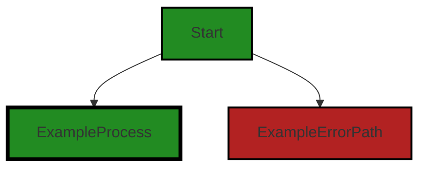


---

### Boost Source-Level Security Analysis

Last Updated: Thursday, September 7, 2023 at 5:21:38 AM PDT

**No bugs found**


---

### Boost Source-Level Performance Analysis

Last Updated: Thursday, September 7, 2023 at 5:27:23 AM PDT

1. **Severity**: 3/10

   **Line Number**: 420

   **Bug Type**: CPU

   **Description**: The use of reflection in Go can be computationally expensive and slow down performance. This is because reflection requires the Go runtime to do a lot of work at runtime that is normally done at compile time. This includes type checking, method resolution, and more.

   **Solution**: Consider replacing reflection with a more efficient approach if possible. For example, if the types of the values are known at compile time, you can use type assertions or type switches instead of reflection. This can significantly improve the performance of your code. Here is a link to the Go blog post on reflection: https://blog.golang.org/laws-of-reflection


---

### Boost Source-Level Data and Privacy Compliance Analysis

Last Updated: Thursday, September 7, 2023 at 5:35:26 AM PDT

1. **Severity**: 6/10

   **Line Number**: 423

   **Bug Type**: Data Leakage

   **Description**: The code does not check if the reflected value contains sensitive data before checking if it's zero. This could lead to potential data leakage.

   **Solution**: Add a check to ensure that the reflected value does not contain sensitive data before checking if it's zero. Consider using a secure method to handle sensitive data.


