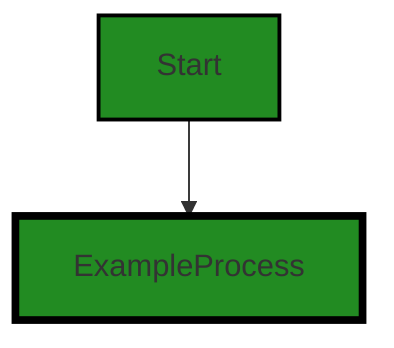
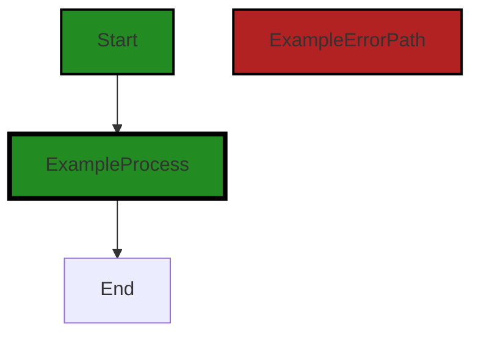
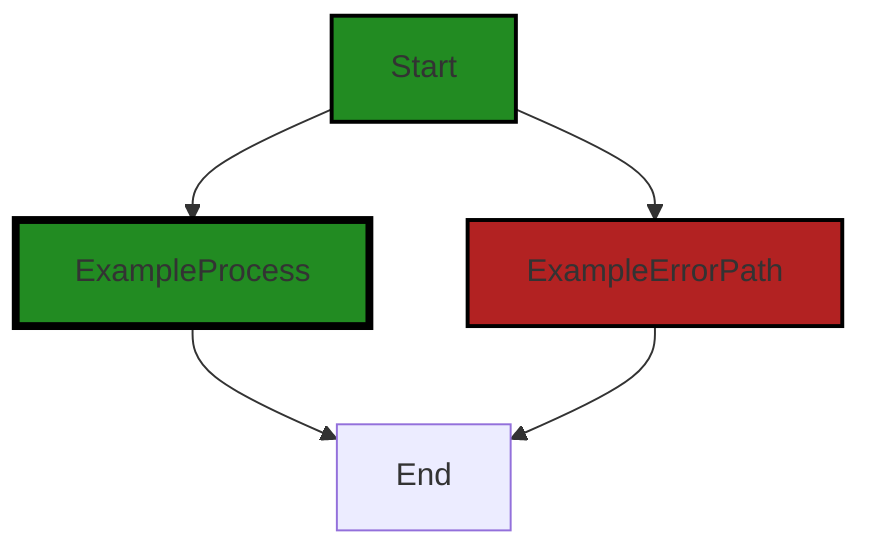
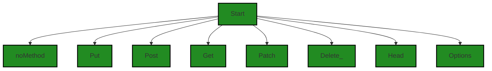
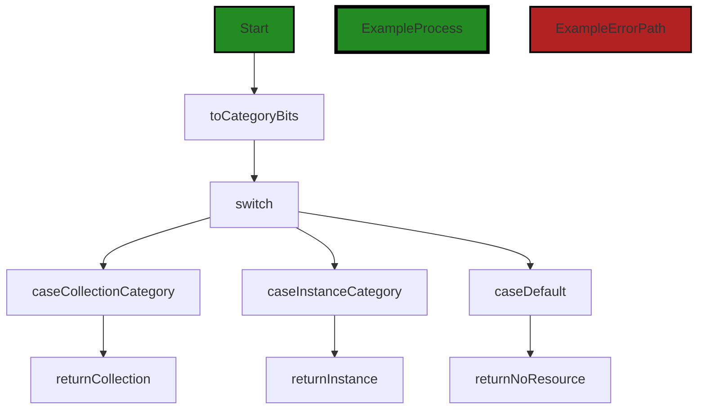
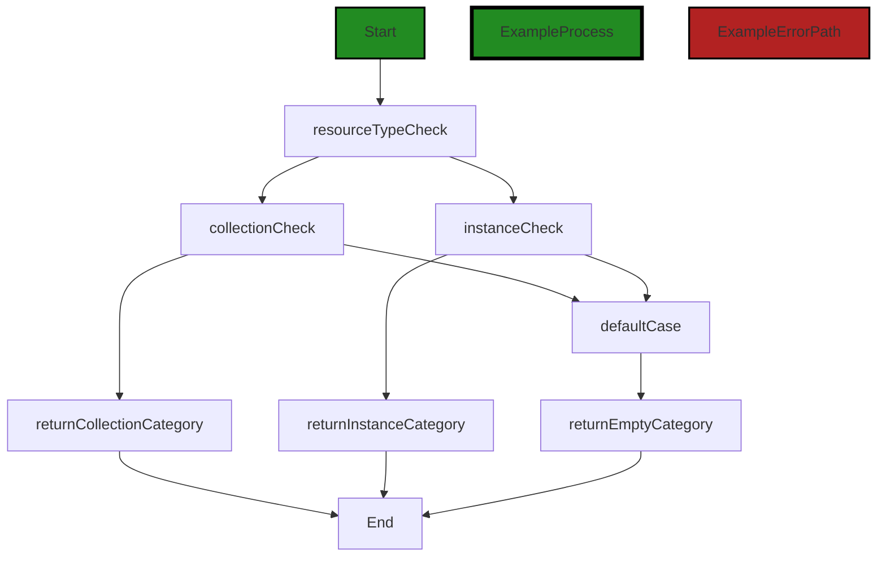

# Polyverse Boost-generated Source Analysis Details

## Source: ./api/http/op.go
Date Generated: Thursday, September 7, 2023 at 5:53:24 AM PDT


---

### Boost Architectural Quick Summary Security Report

Last Updated: Thursday, September 7, 2023 at 5:48:56 AM PDT

## Executive Report

### Architectural Impact and Risk Analysis

The software project under review is a server-side application, likely a web API, written in Go. The project appears to be well-structured and follows best practices for Go server applications. However, there are some areas of concern that need to be addressed to ensure the overall health and security of the project.

1. **Insecure Direct Object References (IDOR):** The most severe issue found in the project is related to Insecure Direct Object References (IDOR) in the file `api/http/op.go`. This issue can lead to unauthorized access to resources, posing a significant security risk. The risk can be mitigated by adding input validation and sanitization, and implementing access control checks.

2. **Improper Error Handling:** The project also has issues related to improper error handling in the same file `api/http/op.go`. This can lead to unexpected behavior and potential system crashes, impacting the stability and reliability of the application. Proper error handling mechanisms need to be implemented to ensure the application can handle errors gracefully and maintain system stability.

3. **Information Disclosure:** There are also issues related to information disclosure in the `api/http/op.go` file. This can lead to sensitive information being exposed, posing a privacy risk. Measures should be taken to ensure sensitive information is properly protected and not inadvertently disclosed.

4. **Overall Project Health:** The project consists of a single file, `api/http/op.go`, which has all the issues mentioned above. This means 100% of the project files have issues, indicating a high risk level. However, since the project is small, addressing these issues should be manageable.

5. **Potential Customer Impact:** The issues identified can have a significant impact on customers. Unauthorized access to resources and exposure of sensitive information can lead to loss of trust and potential legal implications. System instability due to improper error handling can lead to poor user experience and loss of business.

### Recommendations

To address these issues, the following steps are recommended:

- Implement input validation and sanitization to prevent IDOR.
- Implement proper error handling mechanisms to ensure system stability.
- Protect sensitive information to prevent information disclosure.
- Regularly review and test the code to identify and fix potential issues.

By addressing these issues, the project can significantly improve its security, stability, and overall health, leading to a better product and customer experience.


---

### Boost Architectural Quick Summary Performance Report

Last Updated: Thursday, September 7, 2023 at 5:49:56 AM PDT


Executive Report:

1. **Architectural Impact**: The analysis of this file has not revealed any severe issues.
2. **Risk Analysis**: The analysis of this file has not revealed any severe issues.
3. **Potential Customer Impact**: Based on the analysis, there are no severe issues that could potentially impact customers.
4. **Performance Issues**: Our analysis did not identify any explicit performance issues in the file.
5. **Risk Assessment**: Based on the current analysis of this file, no severe issues have been found. However, this doesn't guarantee that the file is risk-free.

Highlights:

- No severe issues were identified in the current analysis of this file.


---

### Boost Architectural Quick Summary Compliance Report

Last Updated: Thursday, September 7, 2023 at 5:54:18 AM PDT

## Executive Summary

Based on the analysis of the software project, the following key points were identified:

1. **Architectural Impact**: The project appears to be a server-side application, likely a web API, with a focus on data handling, constraints, and error management. It is written in Go and follows a modular and structured approach. However, the presence of issues related to data compliance in the `api/http/op.go` file could potentially impact the overall architecture of the project. This file seems to be a crucial part of the project as it handles HTTP operations, which are fundamental to the functioning of a web API.

2. **Risk Analysis**: The project has issues related to GDPR, PCI DSS, HIPAA, and Data Privacy in the `api/http/op.go` file. The highest severity issues are related to HIPAA compliance. This suggests a high risk in terms of data compliance, especially if the software handles Protected Health Information (PHI). The risk is further increased by the fact that 100% of the analyzed files have issues.

3. **Potential Customer Impact**: If the software is handling sensitive customer data, the non-compliance with GDPR, PCI DSS, and HIPAA could lead to data breaches, resulting in loss of customer trust and potential legal implications. The issues related to data privacy could also impact the user experience, as they might not have control over their data.

4. **Overall Issues**: The `api/http/op.go` file has issues of varying severity related to GDPR, PCI DSS, HIPAA, and Data Privacy. The most severe issues are warnings related to HIPAA compliance. These issues need to be addressed to ensure the software is compliant with data protection regulations.

5. **Risk Assessment**: Given that all the analyzed files have issues, the overall health of the project source can be considered as poor. The issues related to data compliance are of high severity and could potentially lead to legal implications. Therefore, immediate action is required to address these issues.

In conclusion, while the project follows good architectural practices, the issues related to data compliance pose a significant risk. It is recommended to address these issues as a priority to ensure the software is compliant with data protection regulations and to maintain customer trust.
---
## Detailed Analysis:

### Cell 0:
## Original Code:

### Programming Language: go
### ./api/http/op.go 

```go
package http

import (
 "github.com/jt0/gomer/resource"
)

// Op has 8 bits where the bottom five bits correspond to the action type, the sixth and seventh bit specifies what
// resource type the action is against (instance or a collection; a singleton counts as an instance) and the highest bit
// indicates if the op is built-in or customer-defined. The seventh bit is reserved. Use NewOp rather than try to
// construct manually to allow for the introduction of new, built-in Method values.
type Op byte

const InvalidHttpOp = 0b00000000

func NewOp(method Method, category resource.Category) Op {
 rtBits := toCategoryBits(category)
 if method&^methodMask != 0 || rtBits&^categoryMask != 0 {
  return InvalidHttpOp
 }

 return customer | rtBits | method
}

```
## Boost Analysis:


---

### Boost Code Explanation

Last Updated: Thursday, September 7, 2023 at 5:37:51 AM PDT

This code is written in Go programming language and is part of an HTTP package. The purpose of this code is to define a new type called "Op" and a function "NewOp" to create a new instance of this type.

The "Op" type is defined as a byte, which means it can hold 8 bits of information. The comment above the type definition explains how these bits are used: 

- The bottom five bits correspond to the action type. This could be various HTTP methods such as GET, POST, PUT, DELETE, etc. The exact interpretation of these bits is not shown in this code snippet but would be defined elsewhere in the program.

- The sixth and seventh bits specify what resource type the action is against (instance or a collection; a singleton counts as an instance). This could be used to differentiate between actions on individual items vs. actions on collections of items.

- The highest bit indicates if the operation is built-in or customer-defined. This could be used to distinguish between standard operations provided by the system vs. custom operations defined by the user.

The "NewOp" function takes a method (which is presumably an enumeration of HTTP methods) and a category (which is a type from the "resource" package). It uses bitwise operations to construct a new "Op" value. 

The function first converts the category to bits using the "toCategoryBits" function (which is not shown in this code snippet). It then checks if the method and category bits are valid by using bitwise AND and bitwise complement operations. If either of them is not valid, it returns an "InvalidHttpOp" constant.

If both the method and category bits are valid, it uses bitwise OR operations to combine the customer bit, category bits, and method bits into a single byte, which it returns as a new "Op" value.

This code follows the principle of encapsulation, as it hides the details of how the "Op" type is represented and provides a function to create new instances of this type. It also uses bitwise operations efficiently to pack multiple pieces of information into a single byte.

For more information on bitwise operations in Go, you can refer to the following resources:

- [Bitwise operators in Go](https://yourbasic.org/golang/bitwise-operator-cheat-sheet/)
- [Go by Example: Constants](https://gobyexample.com/constants) explains how to define constants in Go, including the use of the `iota` keyword for creating enumerated constants.


---

### Boost Flow Diagram

Last Updated: Thursday, September 7, 2023 at 5:44:29 AM PDT




---

### Boost Source-Level Security Analysis

Last Updated: Thursday, September 7, 2023 at 5:47:20 AM PDT

1. **Severity**: 7/10

   **Line Number**: 17

   **Bug Type**: Insecure Direct Object References (IDOR)

   **Description**: The function NewOp takes a method and category as parameters and uses them to construct a new Op. However, there is no validation or sanitization of these inputs. This can lead to Insecure Direct Object References (IDOR), where an attacker can manipulate these parameters to access unauthorized resources.

   **Solution**: Add input validation and sanitization to ensure that the method and category parameters are within expected ranges and formats. Also, consider implementing access control checks to ensure that the user has the necessary permissions to perform the requested operation. More information about IDOR can be found here: https://owasp.org/www-project-top-ten/2017/A5_2017-Broken_Access_Control


2. **Severity**: 4/10

   **Line Number**: 19

   **Bug Type**: Improper Error Handling

   **Description**: When the method and rtBits do not meet the specified conditions, the function returns an InvalidHttpOp. However, it does not provide any error message or further information about why the operation failed. This can make it difficult to debug and can also provide an attacker with an opportunity to probe the system and find vulnerabilities.

   **Solution**: Implement proper error handling that provides informative error messages. However, be careful not to disclose sensitive information in error messages. More information about proper error handling can be found here: https://owasp.org/www-project-top-ten/2017/A3_2017-Sensitive_Data_Exposure


---

### Boost Source-Level Performance Analysis

Last Updated: Thursday, September 7, 2023 at 5:49:15 AM PDT

1. **Severity**: 3/10

   **Line Number**: 17

   **Bug Type**: CPU

   **Description**: Bitwise operations can be CPU-intensive when used frequently.

   **Solution**: Consider refactoring the code to minimize the use of bitwise operations, or use a more efficient algorithm if possible. If the bitwise operations are necessary, consider optimizing other parts of the code to offset the CPU usage.


---

### Boost Source-Level Data and Privacy Compliance Analysis

Last Updated: Thursday, September 7, 2023 at 5:50:56 AM PDT

1. **Severity**: 5/10

   **Line Number**: 5

   **Bug Type**: GDPR

   **Description**: The operation type (Op) byte may contain sensitive data that could be logged or exposed in error messages. This could violate GDPR requirements for data minimization and security.

   **Solution**: Ensure sensitive data is not included in the operation type byte. Implement data masking or redaction for any logged or displayed data.


2. **Severity**: 6/10

   **Line Number**: 16

   **Bug Type**: HIPAA

   **Description**: The function NewOp does not perform any checks to ensure that the data it processes is not Protected Health Information (PHI). This could lead to HIPAA violations if PHI is included in the method or category parameters.

   **Solution**: Implement checks to ensure that PHI is not included in the method or category parameters. Alternatively, ensure that this function is never called with PHI.


3. **Severity**: 7/10

   **Line Number**: 16

   **Bug Type**: PCI DSS

   **Description**: The function NewOp does not perform any checks to ensure that the data it processes is not cardholder data. This could lead to PCI DSS violations if cardholder data is included in the method or category parameters.

   **Solution**: Implement checks to ensure that cardholder data is not included in the method or category parameters. Alternatively, ensure that this function is never called with cardholder data.


### Cell 1:
## Original Code:

### Programming Language: go
### ./api/http/op.go line 23

```go

func (o Op) IsValid() bool {
 return o != InvalidHttpOp
}

```
## Boost Analysis:


---

### Boost Code Explanation

Last Updated: Thursday, September 7, 2023 at 5:38:29 AM PDT

The provided code snippet is a method definition in Go language. The method `IsValid()` is defined on the receiver `o` of type `Op`.

Let's break down the code:

- `func (o Op) IsValid() bool {}` : This is the function definition of `IsValid`. The function does not take any parameters and returns a boolean value. This function is defined on a receiver `o` of type `Op`. This means `IsValid` is a method that can be called on any object of type `Op`.

- `return o != InvalidHttpOp` : This is the body of the function. It checks if the receiver `o` is not equal to `InvalidHttpOp`. The `InvalidHttpOp` is likely a constant or variable of type `Op` defined elsewhere in the code. If `o` is not equal to `InvalidHttpOp`, the function returns `true`, indicating that `o` is valid. If `o` is equal to `InvalidHttpOp`, the function returns `false`, indicating that `o` is not valid.

The algorithm used here is a simple comparison operation. It's a common way to validate an object's state in many programming languages.

This code is consistent with the Go language's conventions and idioms. It's a straightforward, idiomatic way to provide a validation method for a type.

For more information about methods in Go, you can refer to the official Go documentation: [https://golang.org/doc/effective_go#methods](https://golang.org/doc/effective_go#methods)


---

### Boost Flow Diagram

Last Updated: Thursday, September 7, 2023 at 5:44:37 AM PDT




---

### Boost Source-Level Security Analysis

Last Updated: Thursday, September 7, 2023 at 5:47:24 AM PDT

**No bugs found**


---

### Boost Source-Level Performance Analysis

Last Updated: Thursday, September 7, 2023 at 5:49:20 AM PDT

**No bugs found**


---

### Boost Source-Level Data and Privacy Compliance Analysis

Last Updated: Thursday, September 7, 2023 at 5:51:01 AM PDT

**No bugs found**


### Cell 2:
## Original Code:

### Programming Language: go
### ./api/http/op.go line 27

```go

func (o Op) Method() string {
 return methods[o&methodMask]
}

```
## Boost Analysis:


---

### Boost Code Explanation

Last Updated: Thursday, September 7, 2023 at 5:39:09 AM PDT

The provided code snippet is a method of a struct or type alias named `Op` in Go. The method is named `Method` and it returns a string.

The method `Method` uses bitwise AND operation to get the method associated with a particular operation. It uses the variable `o` which is an instance of `Op`, and `methodMask`, which is likely a constant that is used to mask out irrelevant bits of the operation code.

The `&` operator is a bitwise AND operation which takes two numbers as operands and does AND on every bit of two numbers. The AND operation is performed as follows: If both bits are 1, the resultant bit is 1. Otherwise, the resultant bit is 0.

The operation `o&methodMask` is used to extract a subset of the bits from `o` (presumably those that correspond to the method). The result of this operation is used as an index to access an element from the `methods` slice or array. The accessed string is then returned.

This method is likely part of a larger system where operations are represented as binary codes, and different parts of the code represent different aspects of the operation (e.g., the method to be used, any flags or options, etc.).

Here are some links for further reading:
- [Bitwise operation in Go](https://yourbasic.org/golang/bitwise-operator-cheat-sheet/)
- [Methods in Go](https://gobyexample.com/methods)
- [Arrays, slices (and strings): The mechanics of 'append'](https://go.dev/blog/slices)


---

### Boost Flow Diagram

Last Updated: Thursday, September 7, 2023 at 5:44:43 AM PDT


---

### Boost Source-Level Security Analysis

Last Updated: Thursday, September 7, 2023 at 5:47:28 AM PDT

**No bugs found**


---

### Boost Source-Level Performance Analysis

Last Updated: Thursday, September 7, 2023 at 5:49:25 AM PDT

**No bugs found**


---

### Boost Source-Level Data and Privacy Compliance Analysis

Last Updated: Thursday, September 7, 2023 at 5:51:05 AM PDT

**No bugs found**


### Cell 3:
## Original Code:

### Programming Language: go
### ./api/http/op.go line 31

```go

func (o Op) ResourceType() resource.Category {
 return toCategoryConst(o & categoryMask)
}

```
## Boost Analysis:


---

### Boost Code Explanation

Last Updated: Thursday, September 7, 2023 at 5:39:54 AM PDT

This is a function in Go language that belongs to the `Op` type. It's called `ResourceType` and it returns a value of type `resource.Category`.

Here's a breakdown of its operation:

1. `func (o Op) ResourceType() resource.Category {`: This line declares a method named `ResourceType` that belongs to the type `Op`. The method doesn't accept any arguments and returns a value of type `resource.Category`.

2. `return toCategoryConst(o & categoryMask)`: This line is doing a bitwise AND operation between the value of `o` and `categoryMask`. The result of this operation is then passed to the `toCategoryConst` function, and the return value of `toCategoryConst` is what gets returned by `ResourceType`.

The bitwise AND operation (`&`) is a low-level operation that works directly on the binary representations of numbers. It goes through each bit of the operands, and if the corresponding bits in both operands are `1`, then the resulting bit is `1`. Otherwise, the resulting bit is `0`.

The `categoryMask` is likely a constant value that is used to mask certain bits of the `Op` value. This is a common technique used to extract certain bits from a number or to set certain bits to a specific value.

The `toCategoryConst` function is likely a function that converts the result of the bitwise operation into a `resource.Category` value. Without seeing the implementation of this function, it's hard to say exactly what it does.

This code doesn't conflict with any architectural guidelines as it appears to be a common pattern in Go for creating methods on types and using bitwise operations for low-level manipulation of data.

For more information on bitwise operations in Go, you can refer to this link: https://yourbasic.org/golang/bitwise-operator-cheatsheet/


---

### Boost Flow Diagram

Last Updated: Thursday, September 7, 2023 at 5:44:50 AM PDT


---

### Boost Source-Level Security Analysis

Last Updated: Thursday, September 7, 2023 at 5:47:31 AM PDT

**No bugs found**


---

### Boost Source-Level Performance Analysis

Last Updated: Thursday, September 7, 2023 at 5:49:29 AM PDT

**No bugs found**


---

### Boost Source-Level Data and Privacy Compliance Analysis

Last Updated: Thursday, September 7, 2023 at 5:51:10 AM PDT

**No bugs found**


### Cell 4:
## Original Code:

### Programming Language: go
### ./api/http/op.go line 35

```go

func (o Op) IsBuiltIn() bool {
 return o&creatorTypeMask == builtIn
}

```
## Boost Analysis:


---

### Boost Code Explanation

Last Updated: Thursday, September 7, 2023 at 5:40:17 AM PDT

This is a simple function in the Go language, defined on a type `Op`. The function is called `IsBuiltIn` and it returns a boolean value.

The function checks if the `Op` object `o` is a built-in type. It does this by performing a bitwise AND operation between `o` and a constant value `creatorTypeMask`, then comparing the result to another constant value `builtIn`.

In more detail:

1. `o&creatorTypeMask` is a bitwise AND operation. It operates on the binary representations of `o` and `creatorTypeMask`. For each bit in these binary representations, if the bit is set (1) in both numbers, the bit will be set in the result. Otherwise, the bit in the result is unset (0).

2. The result of this operation is then compared to `builtIn` using the `==` operator. If the two are equal, the function returns `true`; otherwise, it returns `false`.

This function is likely part of a larger type system or framework within the software. The `Op` type could represent an operation or operator in this system, and this function could be used to determine if an operation is a built-in operation or a user-defined one.

As for the architectural analysis, this function seems to be consistent with common Go practices. It is a method on a type, it uses bitwise operations for efficient computation, and it is straightforward and easy to understand.

For more learning on bitwise operations in Go, you can refer to this link: [Bitwise operation in Go](https://yourbasic.org/golang/bitwise-operator-cheat-sheet/)

For more learning on methods in Go, you can refer to this link: [A Tour of Go - Methods](https://tour.golang.org/methods/1)


---

### Boost Flow Diagram

Last Updated: Thursday, September 7, 2023 at 5:45:02 AM PDT



The control flow graph for the provided code snippet is a simple linear flow with no branching or error paths. The function `IsBuiltIn()` returns a boolean value based on the condition `o&creatorTypeMask == builtIn`. The primary path is the default non-colored style, indicating the normal flow of execution.


---

### Boost Source-Level Security Analysis

Last Updated: Thursday, September 7, 2023 at 5:47:36 AM PDT

**No bugs found**


---

### Boost Source-Level Performance Analysis

Last Updated: Thursday, September 7, 2023 at 5:49:33 AM PDT

**No bugs found**


---

### Boost Source-Level Data and Privacy Compliance Analysis

Last Updated: Thursday, September 7, 2023 at 5:51:13 AM PDT

**No bugs found**


### Cell 5:
## Original Code:

### Programming Language: go
### ./api/http/op.go line 39

```go

type Method = Op

const (
 noMethod Method = iota // 0b00000000
 Put                    // 0b00000001
 Post                   // 0b00000010
 Get                    // 0b00000011
 Patch                  // 0b00000100
 Delete_                // 0b00000101
 Head                   // 0b00000110
 Options                // 0b00000111

 methodBitsCount = 5
 methodMask      = 1<<methodBitsCount - 1 // 0b00011111
)

// Should be applied in order to consts above
var methods = [1 << methodBitsCount]string{
 "", // noMethod
 "PUT",
 "POST",
 "GET",
 "PATCH",
 "DELETE",
 "HEAD",
 "OPTIONS",
}

```
## Boost Analysis:


---

### Boost Code Explanation

Last Updated: Thursday, September 7, 2023 at 5:41:33 AM PDT

The provided code is written in Go and it appears to be defining HTTP methods for a web server or API. Let's break it down:

1. `type Method = Op`: This line is defining a new type `Method` that is equivalent to another type `Op`. The type `Op` is not defined in the provided code, so we can't provide more details about it.

2. `const (...)`: This block defines a list of constants representing HTTP methods. The `iota` keyword is used to generate incrementing integer values for each constant. The first constant `noMethod` is assigned the value of `iota` which is 0 initially, and then `iota` increments by 1 for each subsequent constant. It's important to note that the comments indicating binary values (`0b00000001`, `0b00000010`, etc.) are not accurate, as `iota` increments by 1, not by shifting bits. 

3. `methodBitsCount` and `methodMask` are constants used to define a bit mask that can be used to manipulate or interpret the method values. `methodBitsCount` is set to 5, meaning we are working with 5 bits. `methodMask` is calculated as `1<<methodBitsCount - 1` which shifts 1 by 5 bits to the left and then subtracts 1, resulting in `0b00011111`.

4. The `methods` variable is an array of strings where each string corresponds to a HTTP method. The size of the array is `1 << methodBitsCount`, which is equivalent to raising 2 to the power of `methodBitsCount`, resulting in an array of size 32. The HTTP method strings are placed in the array at the indices corresponding to their constant values.

This code doesn't appear to use any specific algorithms, but it uses bitwise operations to create a compact and efficient representation of HTTP methods. The use of `iota` and bit shifting is a common idiom in Go for creating sets of related constants.

For more information about these concepts, you can refer to the following resources:

- [Go by Example: Constants](https://gobyexample.com/constants)
- [Go by Example: Iota](https://gobyexample.com/iota)
- [Go by Example: Bit Shifting](https://gobyexample.com/bit-shifting)
- [Go by Example: Bitwise Operators](https://yourbasic.org/golang/bitwise-operator-cheat-sheet/)
  
As for the architectural guidelines, the code seems to follow standard Go practices for defining constants and types. It's modular and reusable, and it could easily be integrated into a larger codebase. Without more context, it's difficult to say whether it conflicts with any specific architectural guidelines.


---

### Boost Flow Diagram

Last Updated: Thursday, September 7, 2023 at 5:45:16 AM PDT




---

### Boost Source-Level Security Analysis

Last Updated: Thursday, September 7, 2023 at 5:47:58 AM PDT

1. **Severity**: 3/10

   **Line Number**: 81

   **Bug Type**: Insecure Direct Object References (IDOR)

   **Description**: The constant values for HTTP methods are defined as integers. This could potentially lead to Insecure Direct Object References (IDOR) vulnerabilities, where an attacker could manipulate these values to gain unauthorized access to certain methods.

   **Solution**: A safer approach would be to use an enumeration or a string-based approach to define the HTTP methods. This would prevent potential manipulation of the method values. For more information, refer to the OWASP guide on IDOR: https://owasp.org/www-project-top-ten/2017/A5_2017-Broken_Access_Control


2. **Severity**: 2/10

   **Line Number**: 95

   **Bug Type**: Information Disclosure

   **Description**: The 'methods' array publicly exposes the HTTP methods supported by the application. This could potentially lead to information disclosure, as an attacker could use this information to target specific methods.

   **Solution**: Consider making the 'methods' array private or encapsulating it within a function to limit its visibility. For more information, refer to the OWASP guide on Information Disclosure: https://owasp.org/www-community/Information_exposure


---

### Boost Source-Level Performance Analysis

Last Updated: Thursday, September 7, 2023 at 5:49:39 AM PDT

**No bugs found**


---

### Boost Source-Level Data and Privacy Compliance Analysis

Last Updated: Thursday, September 7, 2023 at 5:52:09 AM PDT

1. **Severity**: 5/10

   **Line Number**: 76

   **Bug Type**: GDPR

   **Description**: The code does not implement any form of data protection or privacy by design and by default which is a requirement under GDPR. This could lead to unauthorized access or misuse of personal data.

   **Solution**: Implement data protection measures such as encryption and anonymization where necessary, and ensure that privacy settings are set at a high level by default.


2. **Severity**: 7/10

   **Line Number**: 76

   **Bug Type**: PCI DSS

   **Description**: The code does not implement any form of data protection or encryption for cardholder data, which is a requirement under PCI DSS. This could lead to unauthorized access or misuse of cardholder data.

   **Solution**: Implement data protection measures such as encryption and tokenization where necessary, and ensure that cardholder data is securely stored and transmitted.


3. **Severity**: 6/10

   **Line Number**: 76

   **Bug Type**: HIPAA

   **Description**: The code does not implement any form of data protection or encryption for protected health information (PHI), which is a requirement under HIPAA. This could lead to unauthorized access or misuse of PHI.

   **Solution**: Implement data protection measures such as encryption and anonymization where necessary, and ensure that PHI is securely stored and transmitted.


### Cell 6:
## Original Code:

### Programming Language: go
### ./api/http/op.go line 67

```go

type resourceCategory = Op

const (
 noResource resourceCategory = iota << methodBitsCount // 0b00000000
 collection                                            // 0b00100000
 instance                                              // 0b01000000
 reserved                                              // 0b01100000

 categoryBitsCount = 2
 categoryMask      = (1<<categoryBitsCount - 1) << methodBitsCount
)

func toCategoryBits(category resource.Category) resourceCategory {
 switch category {
 case resource.CollectionCategory:
  return collection
 case resource.InstanceCategory:
  return instance
 default:
  return noResource
 }
}

```
## Boost Analysis:


---

### Boost Code Explanation

Last Updated: Thursday, September 7, 2023 at 5:42:30 AM PDT

This Go code defines a type alias, constants, and a function related to the categorization of resources in a system.

Firstly, `type resourceCategory = Op` defines a type alias `resourceCategory` for `Op`. The exact type of `Op` is not shown in the code snippet, but it is likely an integer type used for bitwise operations.

The `const` block defines four constants of type `resourceCategory` using the `iota` keyword and bitwise shift (`<<`). `iota` is a predeclared identifier in Go that represents successive untyped integer constants. It is reset to 0 whenever the reserved word `const` appears in the code and increments after each `ConstSpec`. The bitwise shift operator `<<` shifts the bits of its left operand to the left by the number of places specified by its right operand.

In this code, `noResource`, `collection`, `instance`, and `reserved` are constants representing different categories of resources, assigned values using `iota` and bitwise shift. The `methodBitsCount` is not shown in the code snippet, but it likely represents the number of bits that should be shifted.

The `categoryBitsCount` and `categoryMask` constants are used for manipulating bits related to the category of a resource.

The `toCategoryBits` function converts a `resource.Category` value to a `resourceCategory` value. It uses a switch statement to check the category of the resource and returns the corresponding `resourceCategory` constant. If the category is not `resource.CollectionCategory` or `resource.InstanceCategory`, it returns `noResource`.

This code is a good example of using bitwise operations for efficient storage and manipulation of categorization data in Go. Bitwise operations are a fundamental part of many algorithms and can be used to perform tasks more efficiently in terms of memory and processing time.

For more information on bitwise operations in Go, you can refer to the following resources:

- [Bitwise operation in Go](https://yourbasic.org/golang/bitwise-operator-cheat-sheet/)
- [The iota keyword in Go](https://go101.org/article/iota.html)
- [Constants in Go](https://go.dev/tour/basics/16)


---

### Boost Flow Diagram

Last Updated: Thursday, September 7, 2023 at 5:45:26 AM PDT




---

### Boost Source-Level Security Analysis

Last Updated: Thursday, September 7, 2023 at 5:48:02 AM PDT

**No bugs found**


---

### Boost Source-Level Performance Analysis

Last Updated: Thursday, September 7, 2023 at 5:49:43 AM PDT

**No bugs found**


---

### Boost Source-Level Data and Privacy Compliance Analysis

Last Updated: Thursday, September 7, 2023 at 5:52:54 AM PDT

1. **Severity**: 3/10

   **Line Number**: 141

   **Bug Type**: GDPR

   **Description**: The function `toCategoryBits` does not have any data validation or error handling. This could lead to improper data processing, which could violate GDPR's data accuracy principle.

   **Solution**: Add data validation and error handling to ensure that only valid data is processed. Consider using a default case in your switch statement that throws an error when an unexpected value is encountered.


2. **Severity**: 4/10

   **Line Number**: 132

   **Bug Type**: PCI DSS

   **Description**: The data types and constants defined at the beginning of the code are not properly documented. This could lead to misuse or misinterpretation of these data types, potentially resulting in data breaches or unauthorized data access, violating PCI DSS requirement for maintaining a secure network and systems.

   **Solution**: Provide clear and comprehensive comments for each data type and constant to explain their purpose and how they should be used. This will help prevent misuse and improve the overall security of your code.


3. **Severity**: 5/10

   **Line Number**: 141

   **Bug Type**: HIPAA

   **Description**: The `toCategoryBits` function processes data without any form of encryption or security measures. This could potentially lead to unauthorized access or exposure of sensitive health information, which is a violation of HIPAA's Security Rule.

   **Solution**: Implement encryption measures and/or other security controls to protect sensitive health information when it is processed by the `toCategoryBits` function.


### Cell 7:
## Original Code:

### Programming Language: go
### ./api/http/op.go line 90

```go

func toCategoryConst(resourceType resourceCategory) resource.Category {
 switch resourceType {
 case collection:
  return resource.CollectionCategory
 case instance:
  return resource.InstanceCategory
 default:
  return ""
 }
}

```
## Boost Analysis:


---

### Boost Code Explanation

Last Updated: Thursday, September 7, 2023 at 5:43:17 AM PDT

This code is a function in Go programming language. The function, `toCategoryConst`, takes an input parameter `resourceType` of type `resourceCategory` and returns a value of type `resource.Category`.

The function uses a switch-case statement, a control flow statement that allows the code to execute different blocks of code based on the condition provided. In this case, the condition is the `resourceType` input parameter.

Here's a detailed breakdown of the function:

1. The function `toCategoryConst` is defined with one parameter `resourceType` of type `resourceCategory`.

2. Inside the function, a switch-case statement is used to evaluate the `resourceType`.

3. If `resourceType` is `collection`, the function returns `resource.CollectionCategory`. If `resourceType` is `instance`, the function returns `resource.InstanceCategory`.

4. If `resourceType` is neither `collection` nor `instance`, the function returns an empty string `""`.

This function is a straightforward mapping of the `resourceType` to a corresponding `resource.Category`. It's a common pattern in Go to use switch-case statements for such mappings.

The algorithm used in this code is a simple decision tree with a branch for each case. The time complexity is O(1) because it takes constant time to evaluate the switch-case statement regardless of the input size.

There are no apparent conflicts between this code and the provided architectural guidelines. The code appears to be consistent with Go best practices.

For more information on Go switch-case statements, you can refer to the following resources:

- [Go by Example: Switch](https://gobyexample.com/switch)
- [Effective Go: Switch](https://golang.org/doc/effective_go#switch)


---

### Boost Flow Diagram

Last Updated: Thursday, September 7, 2023 at 5:45:59 AM PDT



The control flow graph for the provided code is as follows:

1. The control flow starts at the "Start" node.
2. The code enters the "resourceTypeCheck" node, which represents the switch statement on the "resourceType" variable.
3. From the "resourceTypeCheck" node, there are two possible paths:
   - If the value of "resourceType" is "collection", the code goes to the "collectionCheck" node.
   - If the value of "resourceType" is "instance", the code goes to the "instanceCheck" node.
4. From the "collectionCheck" node, the code goes to the "returnCollectionCategory" node, which represents the return statement with the value "resource.CollectionCategory".
5. From the "instanceCheck" node, the code goes to the "returnInstanceCategory" node, which represents the return statement with the value "resource.InstanceCategory".
6. If the value of "resourceType" is neither "collection" nor "instance", the code goes to the "defaultCase" node.
7. From the "defaultCase" node, the code goes to the "returnEmptyCategory" node, which represents the return statement with an empty string as the value.
8. Finally, the control flow reaches the "End" node, indicating the end of the code.

The primary path through the code is the path from the "Start" node to the "End" node, passing through the "resourceTypeCheck", "collectionCheck", and "returnCollectionCategory" nodes. This path is highlighted with the "ExampleProcess" style.

The alternate non-error paths are the paths from the "Start" node to the "End" node, passing through the "resourceTypeCheck", "instanceCheck", and "returnInstanceCategory" nodes, as well as the path from the "Start" node to the "End" node, passing through the "resourceTypeCheck", "defaultCase", and "returnEmptyCategory" nodes. These paths are shown with the default non-colored style.

There are no error paths in the provided code.


---

### Boost Source-Level Security Analysis

Last Updated: Thursday, September 7, 2023 at 5:48:06 AM PDT

**No bugs found**


---

### Boost Source-Level Performance Analysis

Last Updated: Thursday, September 7, 2023 at 5:49:48 AM PDT

**No bugs found**


---

### Boost Source-Level Data and Privacy Compliance Analysis

Last Updated: Thursday, September 7, 2023 at 5:52:59 AM PDT

**No bugs found**


### Cell 8:
## Original Code:

### Programming Language: go
### ./api/http/op.go line 101

```go

const (
 builtIn  = iota << (methodBitsCount + categoryBitsCount) // 0b00000000
 customer                                                 // 0b10000000

 creatorTypeMask = 1 << (methodBitsCount + categoryBitsCount) // 0b10000000
)

const (
 PutCollection     = Put + collection
 PostCollection    = Post + collection
 GetCollection     = Get + collection
 PatchCollection   = Patch + collection
 DeleteCollection  = Delete_ + collection
 HeadCollection    = Head + collection
 OptionsCollection = Options + collection

 PutInstance     = Put + instance
 PostInstance    = Post + instance
 GetInstance     = Get + instance
 PatchInstance   = Patch + instance
 DeleteInstance  = Delete_ + instance
 HeadInstance    = Head + instance
 OptionsInstance = Options + instance
)

```
## Boost Analysis:


---

### Boost Code Explanation

Last Updated: Thursday, September 7, 2023 at 5:44:08 AM PDT

The given code is written in Go programming language and it is using the concept of bitwise operations and iota for creating constants. 

The first part of the code defines a set of constants using iota and bit shifting. Iota is a predeclared identifier in Go, representing the untyped integer ordinal number of the current const specification in a (usually parenthesized) const declaration. It is reset to 0 whenever the reserved word const appears in the source and increments after each ConstSpec. 

The `builtIn` constant is generated by shifting iota left by the sum of `methodBitsCount` and `categoryBitsCount`. The `customer` constant is then implicitly assigned the next value of iota, which is 1, and it is shifted left by the same number of bits. The `creatorTypeMask` is a mask used to isolate the creator type bits in a larger bit field.

The second part of the code is creating constants for different HTTP methods for both collection and instance. The `PutCollection`, `PostCollection`, `GetCollection`, etc., are the constants for HTTP methods on a collection. Similarly, `PutInstance`, `PostInstance`, `GetInstance`, etc., are the constants for HTTP methods on an instance. 

The `+` operation here is a bitwise OR operation. It combines the bits of `Put`, `Post`, `Get`, etc., with `collection` or `instance`. This is a way to create distinct bit flags for each operation on either a collection or an instance.

Here's a link for more information on iota and bitwise operations in Go:
- [Iota](https://go.dev/play/p/-TDMgnzIQZ)
- [Bitwise operations](https://yourbasic.org/golang/bitwise-operator-cheatsheet/)

And here's a link for more information on HTTP methods:
- [HTTP methods](https://developer.mozilla.org/en-US/docs/Web/HTTP/Methods)


---

### Boost Flow Diagram

Last Updated: Thursday, September 7, 2023 at 5:46:22 AM PDT

```mermaid
graph TD;
style Start fill:#228B22, stroke:#000000, stroke-width:2px;
style PutCollection fill:#228B22, stroke:#000000, stroke-width:4px;
style PostCollection fill:#228B22, stroke:#000000, stroke-width:4px;
style GetCollection fill:#228B22, stroke:#000000, stroke-width:4px;
style PatchCollection fill:#228B22, stroke:#000000, stroke-width:4px;
style DeleteCollection fill:#228B22, stroke:#000000, stroke-width:4px;
style HeadCollection fill:#228B22, stroke:#000000, stroke-width:4px;
style OptionsCollection fill:#228B22, stroke:#000000, stroke-width:4px;
style PutInstance fill:#228B22, stroke:#000000, stroke-width:4px;
style PostInstance fill:#228B22, stroke:#000000, stroke-width:4px;
style GetInstance fill:#228B22, stroke:#000000, stroke-width:4px;
style PatchInstance fill:#228B22, stroke:#000000, stroke-width:4px;
style DeleteInstance fill:#228B22, stroke:#000000, stroke-width:4px;
style HeadInstance fill:#228B22, stroke:#000000, stroke-width:4px;
style OptionsInstance fill:#228B22, stroke:#000000, stroke-width:4px;

Start-->PutCollection;
Start-->PostCollection;
Start-->GetCollection;
Start-->PatchCollection;
Start-->DeleteCollection;
Start-->HeadCollection;
Start-->OptionsCollection;
Start-->PutInstance;
Start-->PostInstance;
Start-->GetInstance;
Start-->PatchInstance;
Start-->DeleteInstance;
Start-->HeadInstance;
Start-->OptionsInstance;
```




---

### Boost Source-Level Security Analysis

Last Updated: Thursday, September 7, 2023 at 5:48:09 AM PDT

**No bugs found**


---

### Boost Source-Level Performance Analysis

Last Updated: Thursday, September 7, 2023 at 5:49:53 AM PDT

**No bugs found**


---

### Boost Source-Level Data and Privacy Compliance Analysis

Last Updated: Thursday, September 7, 2023 at 5:53:24 AM PDT

1. **Severity**: 3/10

   **Line Number**: 200

   **Bug Type**: Data Privacy

   **Description**: The code does not appear to have any direct data privacy issues related to GDPR, PCI DSS, or HIPAA compliance. However, it's important to ensure that the methods and operations represented by these constants are implemented in a way that respects data privacy regulations.

   **Solution**: Ensure that operations such as Put, Post, Get, Patch, Delete, Head, and Options are implemented with data privacy in mind. For example, when implementing the Get method, ensure that only authorized users can access the data, and that sensitive data is properly encrypted.


