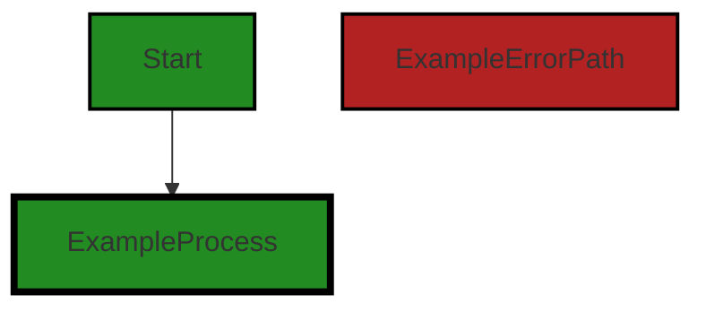

# Polyverse Boost-generated Source Analysis Details

## Source: ./api/http/statuscode.go
Date Generated: Wednesday, September 6, 2023 at 11:11:13 PM PDT


---

### Boost Architectural Quick Summary Security Report

Last Updated: Friday, September 8, 2023 at 2:20:10 PM PDT


Executive Report:

1. **Architectural Impact**: The analysis of this file has not revealed any severe issues.
2. **Risk Analysis**: The analysis of this file has not revealed any severe issues.
3. **Potential Customer Impact**: Based on the analysis, there are no severe issues that could potentially impact customers.
4. **Performance Issues**: Our analysis did not identify any explicit performance issues in the file.
5. **Risk Assessment**: Based on the current analysis of this file, no severe issues have been found. However, this doesn't guarantee that the file is risk-free.

Highlights:

- No severe issues were identified in the current analysis of this file.


---

### Boost Architectural Quick Summary Performance Report

Last Updated: Friday, September 8, 2023 at 2:20:16 PM PDT


Executive Report:

1. **Architectural Impact**: The analysis of this file has not revealed any severe issues.
2. **Risk Analysis**: The analysis of this file has not revealed any severe issues.
3. **Potential Customer Impact**: Based on the analysis, there are no severe issues that could potentially impact customers.
4. **Performance Issues**: Our analysis did not identify any explicit performance issues in the file.
5. **Risk Assessment**: Based on the current analysis of this file, no severe issues have been found. However, this doesn't guarantee that the file is risk-free.

Highlights:

- No severe issues were identified in the current analysis of this file.


---

### Boost Architectural Quick Summary Compliance Report

Last Updated: Friday, September 8, 2023 at 2:20:23 PM PDT


Executive Report:

1. **Architectural Impact**: The analysis of this file has not revealed any severe issues.
2. **Risk Analysis**: The analysis of this file has not revealed any severe issues.
3. **Potential Customer Impact**: Based on the analysis, there are no severe issues that could potentially impact customers.
4. **Performance Issues**: Our analysis did not identify any explicit performance issues in the file.
5. **Risk Assessment**: Based on the current analysis of this file, no severe issues have been found. However, this doesn't guarantee that the file is risk-free.

Highlights:

- No severe issues were identified in the current analysis of this file.

---
## Detailed Analysis:

### Cell 0:
## Original Code:

### Programming Language: go
### ./api/http/statuscode.go 

```go
package http

const StatusLimitExceeded = 402

type StatusCoder interface {
 StatusCode() int
}

```
## Boost Analysis:


---

### Boost Code Explanation

Last Updated: Wednesday, September 6, 2023 at 11:10:07 PM PDT

This is a simple Go code snippet that belongs to a package named `http`. 

The purpose of this code is to define a constant and an interface related to HTTP status codes. HTTP status codes are standard response codes given by web site servers on the Internet. They help identify the cause of the problem when a web page or other resource does not load properly.

The constant `StatusLimitExceeded` is defined with a value of 402. This is not a standard HTTP status code. The standard codes range from 100 to 599 and each code has a specific meaning. For example, 200 means "OK", 404 means "Not Found", etc. The code 402 is reserved for future use and is not officially used yet.

The interface `StatusCoder` is defined with a single method `StatusCode() int`. This interface can be implemented by any type that needs to provide an HTTP status code. The method `StatusCode` should return an integer representing an HTTP status code. 

This kind of interface is commonly used in Go to provide a way to handle HTTP responses in a consistent manner. Any type that implements `StatusCoder` can be used where an HTTP status code is needed, providing flexibility and consistency.

The algorithm used here is extremely simple. It's just a definition of a constant and an interface. There is no complex logic or computation involved.

For more information on HTTP status codes, you can refer to the following resources:

- [HTTP response status codes](https://developer.mozilla.org/en-US/docs/Web/HTTP/Status)
- [Go interfaces](https://tour.golang.org/methods/9)


---

### Boost Flow Diagram

Last Updated: Wednesday, September 6, 2023 at 11:10:15 PM PDT




---

### Boost Source-Level Security Analysis

Last Updated: Wednesday, September 6, 2023 at 11:10:22 PM PDT

**No bugs found**


---

### Boost Source-Level Performance Analysis

Last Updated: Wednesday, September 6, 2023 at 11:10:30 PM PDT

**No bugs found**


---

### Boost Source-Level Data and Privacy Compliance Analysis

Last Updated: Wednesday, September 6, 2023 at 11:11:13 PM PDT

1. **Severity**: 2/10

   **Line Number**: 1

   **Bug Type**: GDPR

   **Description**: The code does not seem to have any explicit data handling or privacy features that could potentially violate GDPR. However, the lack of explicit data privacy measures could in itself be a potential issue.

   **Solution**: Implement explicit data handling and privacy measures, such as encryption for data at rest and in transit, data anonymization, and user consent for data collection and processing. More information about GDPR compliance can be found here: https://gdpr-info.eu/


2. **Severity**: 2/10

   **Line Number**: 1

   **Bug Type**: PCI DSS

   **Description**: The code does not appear to handle any payment card information directly, but the lack of explicit security measures could potentially violate PCI DSS if such data were to be handled in the future.

   **Solution**: Implement explicit security measures, such as encryption for data at rest and in transit, secure coding practices, and regular security testing. More information about PCI DSS compliance can be found here: https://www.pcisecuritystandards.org/pci_security/


3. **Severity**: 2/10

   **Line Number**: 1

   **Bug Type**: HIPAA

   **Description**: The code does not appear to handle any health information directly, but the lack of explicit security measures could potentially violate HIPAA if such data were to be handled in the future.

   **Solution**: Implement explicit security measures, such as encryption for data at rest and in transit, secure coding practices, and regular security testing. More information about HIPAA compliance can be found here: https://www.hhs.gov/hipaa/for-professionals/security/laws-regulations/index.html


