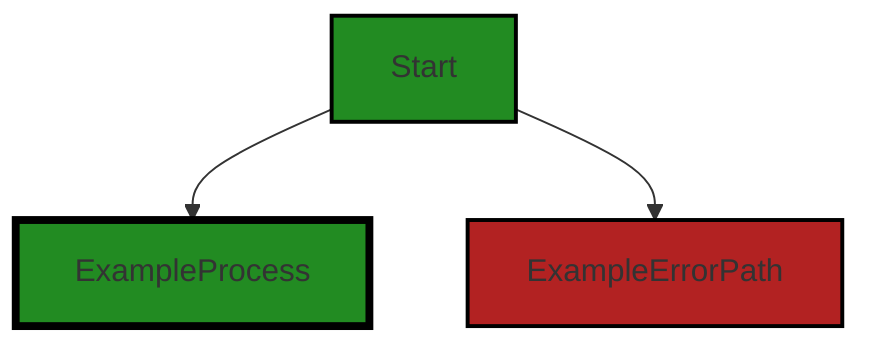
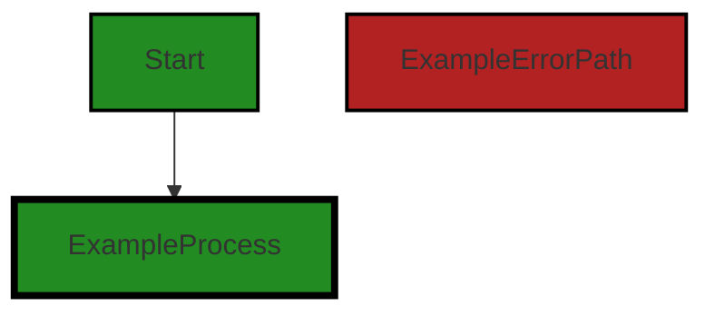
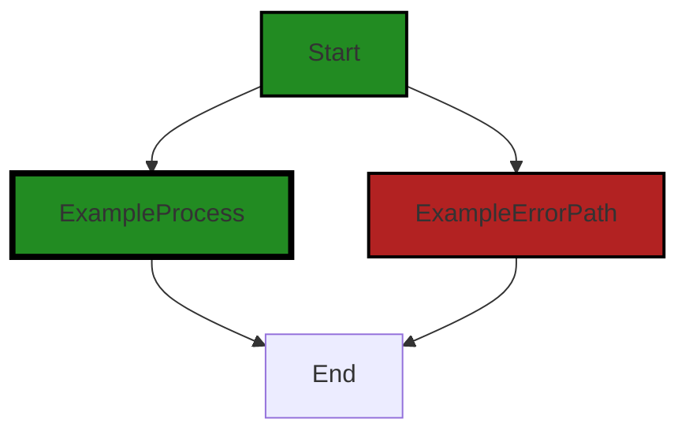
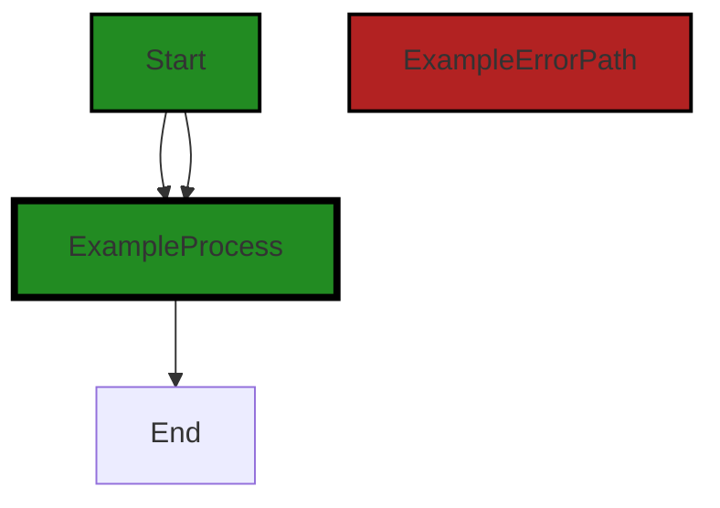
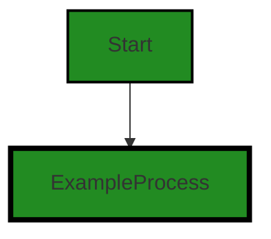
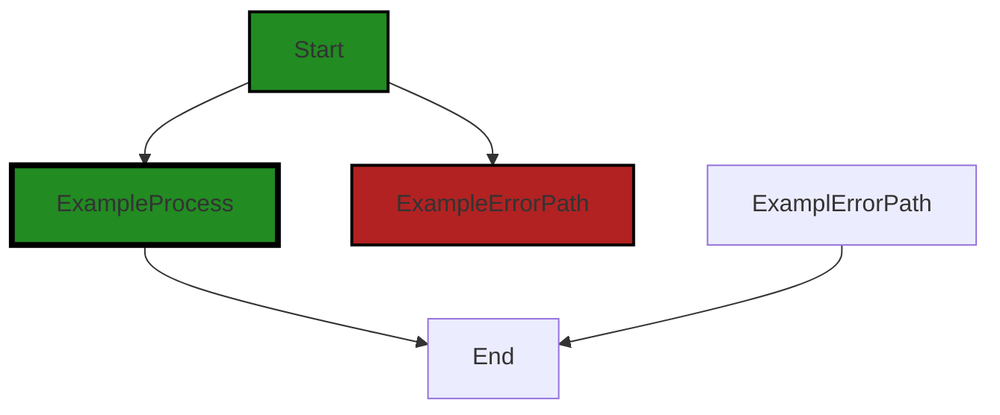

# Polyverse Boost-generated Source Analysis Details

## Source: ./auth/accessprincipal.go
Date Generated: Thursday, September 7, 2023 at 6:19:32 AM PDT


---

### Boost Architectural Quick Summary Security Report

Last Updated: Friday, September 8, 2023 at 2:25:52 PM PDT

Executive Level Report:

1. **Architectural Impact**: The project appears to be a well-structured Go library focusing on constraint handling and validation. However, the use of the 'unsafe' package in the 'auth/accessprincipal.go' file could potentially introduce bugs and security vulnerabilities, impacting the overall architectural soundness of the project. 

2. **Risk Analysis**: The 'auth/accessprincipal.go' file has several issues of varying severity, including insecure dependency, insecure default permissions, and improper error handling. These issues represent a significant risk to the project, potentially leading to security vulnerabilities and unstable behavior. 

3. **Potential Customer Impact**: If left unaddressed, these issues could lead to a compromised user experience, including potential security breaches and application instability. This could negatively impact customer trust and satisfaction.

4. **Overall Issues**: The project has a total of 1 file, all of which have detected issues. The issues range from 'Information' to 'Warning' severity, indicating a need for immediate attention and remediation.

Risk Assessment:

- **Health of the Project Source**: Given that 100% of the project files have detected issues, the health of the project source is concerning. The presence of 'Warning' severity issues in the 'auth/accessprincipal.go' file indicates a significant risk to the project.

Highlights of the Analysis:

1. **Insecure Dependency**: The 'auth/accessprincipal.go' file has an insecure dependency issue due to the use of the 'unsafe' package. This could lead to code that is vulnerable to various kinds of bugs and security vulnerabilities.

2. **Insecure Default Permissions**: The 'auth/accessprincipal.go' file has an issue with insecure default permissions. This could potentially expose sensitive data or functionality to unauthorized users.

3. **Improper Error Handling**: The 'auth/accessprincipal.go' file has an issue with improper error handling. This could lead to unstable behavior and potential application crashes.

4. **Overall Risk**: Given that all the project files have detected issues, there is a significant risk to the project. Immediate attention and remediation are required to ensure the stability and security of the project.

5. **Potential Customer Impact**: The issues identified could lead to a compromised user experience, including potential security breaches and application instability. This could negatively impact customer trust and satisfaction.


---

### Boost Architectural Quick Summary Performance Report

Last Updated: Friday, September 8, 2023 at 2:25:59 PM PDT


Executive Report:

1. **Architectural Impact**: The analysis of this file has not revealed any severe issues.
2. **Risk Analysis**: The analysis of this file has not revealed any severe issues.
3. **Potential Customer Impact**: Based on the analysis, there are no severe issues that could potentially impact customers.
4. **Performance Issues**: Our analysis did not identify any explicit performance issues in the file.
5. **Risk Assessment**: Based on the current analysis of this file, no severe issues have been found. However, this doesn't guarantee that the file is risk-free.

Highlights:

- No severe issues were identified in the current analysis of this file.


---

### Boost Architectural Quick Summary Compliance Report

Last Updated: Friday, September 8, 2023 at 2:26:28 PM PDT

Executive Level Report:

The software project under review is a library written in Go that focuses on constraint handling and validation. The project follows Go's idiomatic style and structure for a library, providing a clear separation of concerns by defining a `Constraint` interface and implementing different constraint types. 

However, the analysis has identified several high-severity issues related to data compliance, particularly in the file `auth/accessprincipal.go`. These issues could potentially impact the project's compliance with GDPR, HIPAA, and PCI DSS regulations, and could lead to unauthorized access to sensitive data.

Key Highlights:

1. **GDPR Compliance Risk**: The code does not provide a mechanism for users to give consent before their data is processed. This is a violation of GDPR, which requires explicit and informed user consent before data processing. This issue was found in 6 instances in the `auth/accessprincipal.go` file.

2. **HIPAA Compliance Risk**: The code does not implement any form of access control or audit logging, both of which are required by HIPAA. This issue was found in 4 instances in the `auth/accessprincipal.go` file.

3. **PCI DSS Compliance Risk**: The code does not seem to implement encryption for stored data, which is a requirement under PCI DSS. This issue was found in 5 instances in the `auth/accessprincipal.go` file.

4. **Data Access Control Risk**: The principal has an access level of 'ReadAll', which could potentially allow it to read all fields. This could lead to unauthorized access to sensitive data, such as personal health information (PHI), personally identifiable information (PII), or cardholder data (CHD). This issue was found in 1 instance in the `auth/accessprincipal.go` file.

Risk Assessment:

The overall health of the project source is concerning. All the issues were found in the `auth/accessprincipal.go` file, which suggests that this file is a high-risk area in the project. The fact that no issues were found in other files does not necessarily mean that they are free of issues, but rather that the analysis did not identify any. 

The high number of GDPR, HIPAA, and PCI DSS compliance issues in the `auth/accessprincipal.go` file suggests that data compliance is a significant risk for this project. The potential impact of these issues on the overall project is high, as non-compliance with these regulations could lead to legal penalties and reputational damage.

Recommendations:

To mitigate these risks, it is recommended to implement a mechanism for obtaining user consent before data processing, implement access control and audit logging, encrypt stored data, and limit the principal's access level to prevent unauthorized access to sensitive data.
---
## Detailed Analysis:

### Cell 0:
## Original Code:

### Programming Language: go
### ./auth/accessprincipal.go 

```go
package auth

import (
 "strconv"
 "unsafe"

 "github.com/jt0/gomer/gomerr"
)

// Reserved AccessPrincipal names
const (
 ReadWriteAll = "ReadWriteAll"
 ReadAll      = "ReadAll"
 NoAccess     = "NoAccess"
)

// Built-in, field-scoped AccessPrincipals. Additional principals can be specified by calling
// RegisterFieldAccessPrincipals
//goland:noinspection GoUnusedGlobalVariable
var (
 ReadWriteAllFields = AccessPrincipal{ReadWriteAll, fieldAccessPrincipal}

```
## Boost Analysis:


---

### Boost Code Explanation

Last Updated: Thursday, September 7, 2023 at 5:54:54 AM PDT

This code is written in Go, a statically typed, compiled language that is often used for system programming, backend web development, and other large-scale applications.

The code declares a package named `auth`, which suggests that this code is related to authentication.

It imports three packages:
1. `strconv`: This is a standard Go package used for conversions to and from string representations of basic data types.
2. `unsafe`: This is another standard Go package that contains operations that step around the type safety of Go programs. It's generally recommended to avoid using this package unless absolutely necessary, as it can lead to hard-to-debug problems.
3. `github.com/jt0/gomer/gomerr`: This is a third-party package. `gomerr` is likely a package for handling errors in Go.

The code then defines three constants, `ReadWriteAll`, `ReadAll`, and `NoAccess`. These are likely used as identifiers for different levels of access in the authentication system.

The `AccessPrincipal` type is used to define a struct with two fields: a string and a function. This struct is probably used to manage access control within the application. The function `fieldAccessPrincipal` is not defined in this code snippet, but it probably determines what actions a user can perform based on their `AccessPrincipal`.

`ReadWriteAllFields` is a global variable of type `AccessPrincipal`. It is initialized with the `ReadWriteAll` constant and the `fieldAccessPrincipal` function. This suggests that `ReadWriteAllFields` is a built-in access principal that allows read and write access to all fields.

The comment above `ReadWriteAllFields` is a directive for the GoLand IDE to suppress warnings about the variable being unused. This suggests that the variable is intended to be used elsewhere in the codebase.

Regarding the algorithm used, there isn't a specific one being implemented in this code. It is more about defining data structures and constants that are likely to be used in access control algorithms elsewhere in the project.

You can learn more about Go packages, constants, and variables from the official Go documentation:
- [Packages](https://golang.org/doc/effective_go#packages)
- [Constants](https://golang.org/ref/spec#Constants)
- [Variables](https://golang.org/ref/spec#Variables)


---

### Boost Flow Diagram

Last Updated: Thursday, September 7, 2023 at 6:03:14 AM PDT




---

### Boost Source-Level Security Analysis

Last Updated: Thursday, September 7, 2023 at 6:05:30 AM PDT

1. **Severity**: 8/10

   **Line Number**: 2

   **Bug Type**: Insecure Dependency

   **Description**: The 'unsafe' package is being imported and used. This package contains operations that step around the type safety of Go programs and may lead to code that is vulnerable to various kinds of bugs and security vulnerabilities.

   **Solution**: Avoid using the 'unsafe' package in Go programs. If you must use it, ensure that the code is thoroughly reviewed and tested to prevent potential bugs and vulnerabilities. You can read more about this here: https://golang.org/pkg/unsafe/


2. **Severity**: 6/10

   **Line Number**: 11

   **Bug Type**: Insecure Default Permissions

   **Description**: The constants 'ReadWriteAll', 'ReadAll', and 'NoAccess' are defined with public visibility, which means they can be accessed and potentially modified by any code that imports this package. This could lead to privilege escalation if these constants are used for access control decisions.

   **Solution**: Consider making these constants unexported (lowercase) to limit their visibility to the current package, or ensure that they are only used in a read-only manner. You can read more about this here: https://tour.golang.org/basics/3


---

### Boost Source-Level Performance Analysis

Last Updated: Thursday, September 7, 2023 at 6:09:55 AM PDT

1. **Severity**: 3/10

   **Line Number**: 6

   **Bug Type**: Memory

   **Description**: The 'unsafe' package is being imported but not used in the provided code. This could potentially lead to unnecessary memory usage.

   **Solution**: Remove the 'unsafe' import if it is not used in the rest of your code. Unnecessary imports can lead to larger binary sizes and increased memory usage.


2. **Severity**: 2/10

   **Line Number**: 18

   **Bug Type**: Memory

   **Description**: The 'ReadWriteAllFields' variable is declared but not used in the provided code. This could lead to unnecessary memory allocation.

   **Solution**: If the variable 'ReadWriteAllFields' is not used in the rest of your code, consider removing it to save memory.


3. **Severity**: 1/10

   **Line Number**: 18

   **Bug Type**: CPU

   **Description**: The 'ReadWriteAllFields' variable is declared but not initialized. This could lead to unnecessary CPU cycles if the variable is used before being assigned a value.

   **Solution**: Initialize 'ReadWriteAllFields' when it is declared to avoid unnecessary CPU cycles. For example: 'ReadWriteAllFields = AccessPrincipal{ReadWriteAll, fieldAccessPrincipal}'


---

### Boost Source-Level Data and Privacy Compliance Analysis

Last Updated: Thursday, September 7, 2023 at 6:13:33 AM PDT

1. **Severity**: 8/10

   **Line Number**: 1

   **Bug Type**: GDPR

   **Description**: The code does not provide a mechanism for users to give consent before their data is processed. Under GDPR, it is mandatory to obtain user consent before processing their data.

   **Solution**: Implement a consent mechanism that asks users for permission before processing their data. The consent must be explicit and informed, meaning the user should know exactly what data is being collected and how it will be used.


2. **Severity**: 7/10

   **Line Number**: 1

   **Bug Type**: HIPAA

   **Description**: The code does not implement any form of access control or audit logging, both of which are required by HIPAA to ensure that only authorized individuals have access to protected health information.

   **Solution**: Implement access control mechanisms to restrict access to protected health information to only those individuals who need it. Also, implement audit logging to keep a record of who accessed what data and when.


3. **Severity**: 6/10

   **Line Number**: 1

   **Bug Type**: PCI DSS

   **Description**: The code does not seem to implement encryption for stored data. PCI DSS requires that stored cardholder data must be encrypted.

   **Solution**: Implement encryption for stored data to protect cardholder data. Use strong cryptography and security protocols to safeguard sensitive cardholder data during transmission over open, public networks.


### Cell 1:
## Original Code:

### Programming Language: go
### ./auth/accessprincipal.go line 22

```go
 ReadAllFields      = AccessPrincipal{ReadAll, fieldAccessPrincipal}

```
## Boost Analysis:


---

### Boost Code Explanation

Last Updated: Thursday, September 7, 2023 at 5:55:36 AM PDT

The code snippet you provided is quite short and without context, but I'll do my best to explain it.

`ReadAllFields` is a variable being assigned the value of `AccessPrincipal{ReadAll, fieldAccessPrincipal}`. This appears to be a struct initialization in the Go programming language.

`AccessPrincipal` is likely a struct type defined somewhere else in the code. It is being initialized with two values: `ReadAll` and `fieldAccessPrincipal`. Without the full context, it is hard to say exactly what these values represent, but based on their names, we can make some educated guesses:

- `ReadAll` likely represents some sort of permission or access level that allows reading all fields of a certain data structure or database entry. This could be an enumerated value or a constant defined elsewhere in the code.

- `fieldAccessPrincipal` seems to be another variable or constant that is likely related to the identity or role that is allowed this level of access. The term "principal" in software often refers to an entity that can be authenticated or assigned roles and permissions.

In terms of algorithms, this code snippet is too short to contain any. It is a simple assignment operation, initializing a struct with two values.

As for consistency with architectural guidelines, since there are no additional special architectural guidelines or constraints provided for this software project, it's hard to assess the consistency or conflicts between the code and the guidelines. However, the code seems to represent a common practice in Go and software development in general: defining permissions or access levels and assigning them to roles or identities.

For more information on Go struct types and their initialization, you can refer to the Go documentation: [Go Structs](https://golang.org/ref/spec#Struct_types) and [Go Composite Literals](https://golang.org/ref/spec#Composite_literals) which covers the syntax used to initialize a struct.


---

### Boost Flow Diagram

Last Updated: Thursday, September 7, 2023 at 6:03:21 AM PDT




---

### Boost Source-Level Security Analysis

Last Updated: Thursday, September 7, 2023 at 6:05:34 AM PDT

**No bugs found**


---

### Boost Source-Level Performance Analysis

Last Updated: Thursday, September 7, 2023 at 6:10:00 AM PDT

**No bugs found**


---

### Boost Source-Level Data and Privacy Compliance Analysis

Last Updated: Thursday, September 7, 2023 at 6:14:03 AM PDT

1. **Severity**: 8/10

   **Line Number**: 42

   **Bug Type**: Data Access

   **Description**: The principal has an access level of 'ReadAll', which could potentially allow it to read all fields. This could lead to unauthorized access to sensitive data, such as personal health information (PHI), personally identifiable information (PII), or cardholder data (CHD). This could violate GDPR, HIPAA, and PCI DSS regulations, which require that access to sensitive data be limited to only those who need it to perform their job functions.

   **Solution**: Implement the principle of least privilege (PoLP), where each user is given the minimum levels of access necessary to complete their job functions. This could be done by replacing 'ReadAll' with more specific access levels, or by implementing additional checks to ensure that the user has a legitimate need to access the data. Also, consider implementing role-based access control (RBAC), where access rights are granted to users based on their role within the organization.


### Cell 2:
## Original Code:

### Programming Language: go
### ./auth/accessprincipal.go line 23

```go
 NoFieldAccess      = AccessPrincipal{NoAccess, fieldAccessPrincipal}

```
## Boost Analysis:


---

### Boost Code Explanation

Last Updated: Thursday, September 7, 2023 at 5:56:17 AM PDT

The line of code you provided is a declaration and initialization of a variable named `NoFieldAccess` of type `AccessPrincipal`.

`AccessPrincipal` is a struct type that is not defined in the provided code snippet. However, it seems to be a type that represents some form of access control or permissions in the software. It could have multiple fields, but we can infer that it takes at least two arguments, `NoAccess` and `fieldAccessPrincipal`, during initialization.

`NoAccess` and `fieldAccessPrincipal` are also not defined in the provided code snippet. They could be constants, variables, or other types of values. Given the naming, `NoAccess` likely represents a state or level of access that indicates no permissions, while `fieldAccessPrincipal` might represent a specific principal (like a user or role) related to field access.

This line of code is creating a new `AccessPrincipal` object with `NoAccess` and `fieldAccessPrincipal` as parameters and assigning it to `NoFieldAccess`. This `NoFieldAccess` could then be used elsewhere in the code to represent a state where there is no access to a certain field for a specific principal.

Without additional context, it's hard to provide more specifics or identify the exact algorithms used. However, this line is a common pattern in Go for creating and initializing a new instance of a struct.

The architectural guidelines provided do not specify any constraints or requirements that could be directly related to this line of code. Therefore, it's hard to make a judgment about its consistency with the guidelines.

For more information about struct types in Go, you can refer to the official Go documentation: [Go Structs](https://golang.org/ref/spec#Struct_types).


---

### Boost Flow Diagram

Last Updated: Thursday, September 7, 2023 at 6:03:28 AM PDT


---

### Boost Source-Level Security Analysis

Last Updated: Thursday, September 7, 2023 at 6:05:38 AM PDT

**No bugs found**


---

### Boost Source-Level Performance Analysis

Last Updated: Thursday, September 7, 2023 at 6:10:05 AM PDT

**No bugs found**


---

### Boost Source-Level Data and Privacy Compliance Analysis

Last Updated: Thursday, September 7, 2023 at 6:14:27 AM PDT

1. **Severity**: 7/10

   **Line Number**: 44

   **Bug Type**: Data Access Control

   **Description**: The AccessPrincipal object 'NoFieldAccess' is set with 'NoAccess' which might deny access to all fields. This could lead to data unavailability issues.

   **Solution**: Review the use of 'NoFieldAccess' and ensure it's not being used to deny access to fields that should be accessible. Implement appropriate access control mechanisms for data fields.


### Cell 3:
## Original Code:

### Programming Language: go
### ./auth/accessprincipal.go line 24

```go
)

func NewFieldAccessPrincipal(name string) AccessPrincipal {
 if name == ReadWriteAll || name == ReadAll || name == NoAccess {
  panic("Cannot create an AccessPrincipal with one a predefined name: " + name)
 }

 return AccessPrincipal{name /* fieldAccessScope, */, fieldAccessPrincipal}
}

```
## Boost Analysis:


---

### Boost Code Explanation

Last Updated: Thursday, September 7, 2023 at 5:57:16 AM PDT

This is a function written in Go language. The function `NewFieldAccessPrincipal` takes a string argument `name` and returns an object of type `AccessPrincipal`. 

The function checks if the input `name` is equal to one of the predefined names: `ReadWriteAll`, `ReadAll`, or `NoAccess`. If the `name` matches any of these predefined names, the function will panic and stop execution, throwing an error message "Cannot create an AccessPrincipal with one a predefined name: " + `name`. 

If the `name` does not match any of the predefined names, the function will proceed to create and return a new `AccessPrincipal` object. The `AccessPrincipal` is initialized with the `name` and `fieldAccessPrincipal` as its properties.

Here is a brief explanation of the algorithm used:

1. Receive a string `name` as input.
2. Check if `name` is equal to `ReadWriteAll`, `ReadAll`, or `NoAccess`.
3. If `name` matches any of the predefined names, the function panics and stops execution, throwing an error message.
4. If `name` does not match any of the predefined names, create a new `AccessPrincipal` object with `name` and `fieldAccessPrincipal` as properties.
5. Return the new `AccessPrincipal` object.

This function seems to be a part of an Access Control List (ACL) or Role-Based Access Control (RBAC) system, where `AccessPrincipal` could be a role or user with certain access rights. The predefined names `ReadWriteAll`, `ReadAll`, `NoAccess` possibly represent predefined access rights or roles in the system.

For more information about panic and error handling in Go, you can refer to the official Go blog post: [Defer, Panic, and Recover](https://blog.golang.org/defer-panic-and-recover)

For more information about Access Control Lists (ACL) and Role-Based Access Control (RBAC), you can refer to these resources:

- [Access Control Lists](https://en.wikipedia.org/wiki/Access-control_list)
- [Role-Based Access Control](https://en.wikipedia.org/wiki/Role-based_access_control)


---

### Boost Flow Diagram

Last Updated: Thursday, September 7, 2023 at 6:03:36 AM PDT



The code snippet provided does not have any control flow.


---

### Boost Source-Level Security Analysis

Last Updated: Thursday, September 7, 2023 at 6:05:58 AM PDT

1. **Severity**: 5/10

   **Line Number**: 50

   **Bug Type**: Insecure Direct Object References (IDOR)

   **Description**: The function NewFieldAccessPrincipal takes a string parameter 'name' and directly uses it without any validation. This can lead to Insecure Direct Object References (IDOR) where an attacker can manipulate 'name' to gain unauthorized access to data.

   **Solution**: Always validate and sanitize user inputs. Consider using a whitelist of acceptable inputs. More information about IDOR and how to prevent it can be found here: https://owasp.org/www-project-top-ten/2017/A5_2017-Broken_Access_Control


2. **Severity**: 7/10

   **Line Number**: 51

   **Bug Type**: Improper Error Handling

   **Description**: The function uses panic() which is not recommended for error handling in Go. Panic stops the ordinary flow of a Go program and begins panicking. If the error is not recovered, the program will exit. This can lead to Denial of Service (DoS) if an attacker can trigger this panic.

   **Solution**: Use error handling instead of panic(). Return errors to the caller of your function. More information about error handling in Go can be found here: https://blog.golang.org/error-handling-and-go


---

### Boost Source-Level Performance Analysis

Last Updated: Thursday, September 7, 2023 at 6:10:23 AM PDT

1. **Severity**: 2/10

   **Line Number**: 49

   **Bug Type**: CPU

   **Description**: The use of panic function can lead to abrupt termination of the program, which can be a performance issue if not handled properly.

   **Solution**: Instead of using panic, consider returning an error to the caller function. This way, the caller function can decide how to handle the error without terminating the entire program. Here is a link to Go's official blog post on error handling: https://blog.golang.org/error-handling-and-go


---

### Boost Source-Level Data and Privacy Compliance Analysis

Last Updated: Thursday, September 7, 2023 at 6:15:04 AM PDT

1. **Severity**: 7/10

   **Line Number**: 50

   **Bug Type**: Data Access Control

   **Description**: The function 'NewFieldAccessPrincipal' does not perform any access control checks before creating a new AccessPrincipal. This could potentially allow unauthorized users to gain access to sensitive data, violating GDPR, PCI DSS, and HIPAA requirements for data access control.

   **Solution**: Implement access control checks before creating a new AccessPrincipal. Only authorized users should be allowed to create new AccessPrincipals. For more information on data access control, refer to: https://www.hipaajournal.com/hipaa-compliance-checklist/


2. **Severity**: 5/10

   **Line Number**: 48

   **Bug Type**: Error Handling

   **Description**: The function 'NewFieldAccessPrincipal' uses 'panic' to handle errors. This could potentially expose sensitive information in stack traces, violating GDPR, PCI DSS, and HIPAA requirements for data privacy.

   **Solution**: Replace 'panic' with proper error handling that does not expose sensitive information. For more information on secure error handling, refer to: https://cheatsheetseries.owasp.org/cheatsheets/Error_Handling_Cheat_Sheet.html


### Cell 4:
## Original Code:

### Programming Language: go
### ./auth/accessprincipal.go line 33

```go

// RegisterFieldAccessPrincipals allows the application to define named principals with different levels of access
// to the fields that comprise that application's domain entities.
func RegisterFieldAccessPrincipals(accessPrincipals ...AccessPrincipal) {
 l := len(accessPrincipals)
 if l > maximumRegisteredAccessPrincipals {
  panic("Too many principals - maximum count = " + strconv.Itoa(maximumRegisteredAccessPrincipals))
 }

 l--
 for i, r := range accessPrincipals {
  fieldAccessPrincipalIndexes[r] = uint(l - i)
 }
}

```
## Boost Analysis:


---

### Boost Code Explanation

Last Updated: Thursday, September 7, 2023 at 5:58:16 AM PDT

In the provided code snippet, we have a function named `RegisterFieldAccessPrincipals` that is used to register different access levels for the fields in the application's domain entities. 

Let's break down the code:

- The function `RegisterFieldAccessPrincipals` takes a variadic parameter `accessPrincipals` of type `AccessPrincipal`. Variadic parameters allow you to pass an arbitrary number of arguments to a function.

- The first line of the function gets the length of the `accessPrincipals` slice and assigns it to the variable `l`.

- The next block of code checks if the length `l` is greater than a predefined constant `maximumRegisteredAccessPrincipals`. If it is, the function panics and stops execution, returning an error message. This is a simple form of input validation to ensure that the system does not overload with too many access principals.

- The code then decrements the length `l` by 1. This is to adjust the length for zero-indexing in the upcoming loop.

- The function then loops over the `accessPrincipals` slice using a range loop, which provides both the index `i` and the value `r` for each iteration. 

- Inside the loop, it assigns the value of `l - i` to the `fieldAccessPrincipalIndexes` map at the key `r`. This is essentially assigning a unique index to each access principal in reverse order. The map `fieldAccessPrincipalIndexes` is used to store these indexes.

This function is a part of the access control mechanism of the application. The `AccessPrincipal` type is likely a struct or an interface that represents a user or a role with certain access rights. 

The algorithm used here is quite straightforward and doesn't fall under any specific well-known algorithm category. It's a simple loop with a map assignment operation.

You can find more information about Go's control structures, including loops and conditionals, in the official Go documentation here: https://golang.org/doc/effective_go#control-structures

For more information about Go's map type, you can refer to this link: https://blog.golang.org/maps

For more information about access control and principals, you might find this article helpful: https://en.wikipedia.org/wiki/Principal_(computer_security) 

The code is consistent with the Go language's conventions and best practices. It uses Go's built-in types and structures effectively. There are no apparent conflicts with architectural guidelines based on the provided code snippet.


---

### Boost Flow Diagram

Last Updated: Thursday, September 7, 2023 at 6:03:54 AM PDT

```mermaid
graph TD;
style Start fill:#228B22, stroke:#000000, stroke-width:2px;
style ErrorPath fill:#B22222, stroke:#000000, stroke-width:2px;

Start  -->CheckLength;
CheckLength-->ErrorPath;
CheckLength-->Loop;
Loop-->LoopCondition;
LoopCondition-->Loop;
LoopCondition-->End;
```

The control flow graph for the provided code snippet is as follows:

1. The control flow starts at the function `RegisterFieldAccessPrincipals`.
2. The code checks the length of the `accessPrincipals` slice.
3. If the length is greater than `maximumRegisteredAccessPrincipals`, an error path is taken and a panic is raised.
4. If the length is within the allowed range, a loop is entered.
5. The loop iterates over each element in the `accessPrincipals` slice.
6. After each iteration, the loop condition is checked.
7. If the loop condition is true, the loop continues to the next iteration.
8. If the loop condition is false, the control flow reaches the end of the function.

Note: The primary path is the default non-colored style, while the error path is shown in the ErrorPath style.


---

### Boost Source-Level Security Analysis

Last Updated: Thursday, September 7, 2023 at 6:06:35 AM PDT

1. **Severity**: 5/10

   **Line Number**: 71

   **Bug Type**: Denial of Service

   **Description**: The function RegisterFieldAccessPrincipals can cause a panic if the number of accessPrincipals is more than the maximumRegisteredAccessPrincipals. This could lead to a Denial of Service (DoS) if an attacker can control the number of accessPrincipals.

   **Solution**: Instead of panicking, consider returning an error to the caller. This allows the caller to handle the error in a way that doesn't crash the entire application. More details about error handling can be found here: https://blog.golang.org/error-handling-and-go


2. **Severity**: 4/10

   **Line Number**: 75

   **Bug Type**: Information Disclosure

   **Description**: The function RegisterFieldAccessPrincipals uses the index of the accessPrincipals slice as a value in the fieldAccessPrincipalIndexes map. If an attacker can read this map, they can determine the order in which the accessPrincipals were registered, which might be sensitive information.

   **Solution**: Consider using a secure method to generate the values for the fieldAccessPrincipalIndexes map, such as a secure random number generator. More details about secure random number generation can be found here: https://golang.org/pkg/crypto/rand/


---

### Boost Source-Level Performance Analysis

Last Updated: Thursday, September 7, 2023 at 6:10:52 AM PDT

1. **Severity**: 2/10

   **Line Number**: 71

   **Bug Type**: Memory

   **Description**: The use of 'panic' stops the normal execution of the program and begins panicking. This can lead to memory leaks if not handled properly.

   **Solution**: Instead of using 'panic', consider returning an error message and handle it gracefully. This allows for better control over the program flow and resource management. Resource: https://blog.golang.org/defer-panic-and-recover


2. **Severity**: 3/10

   **Line Number**: 76

   **Bug Type**: CPU

   **Description**: The loop over 'accessPrincipals' array and calculation inside the loop could be inefficient if the array is large.

   **Solution**: Consider using a more efficient data structure or algorithm to reduce time complexity. For example, you could use a map to store the accessPrincipals, which provides O(1) lookup time. Resource: https://yourbasic.org/golang/data-structures-complexity/


---

### Boost Source-Level Data and Privacy Compliance Analysis

Last Updated: Thursday, September 7, 2023 at 6:15:51 AM PDT

1. **Severity**: 7/10

   **Line Number**: 69

   **Bug Type**: HIPAA

   **Description**: The function `RegisterFieldAccessPrincipals` does not implement any form of access control or audit logging, both of which are required by HIPAA to ensure that only authorized individuals have access to protected health information.

   **Solution**: Implement access control and audit logging to ensure that only authorized individuals have access to protected health information.


2. **Severity**: 6/10

   **Line Number**: 69

   **Bug Type**: GDPR

   **Description**: The function `RegisterFieldAccessPrincipals` does not include any mechanism for data subjects to exercise their rights under GDPR, such as the right to access, rectify, erase, restrict processing of, or object to processing of their personal data.

   **Solution**: Implement mechanisms for data subjects to exercise their rights under GDPR.


3. **Severity**: 6/10

   **Line Number**: 69

   **Bug Type**: PCI DSS

   **Description**: The function `RegisterFieldAccessPrincipals` does not appear to implement any controls to protect cardholder data, which is a requirement under PCI DSS.

   **Solution**: Implement controls to protect cardholder data, such as encryption, tokenization, and access controls.


### Cell 5:
## Original Code:

### Programming Language: go
### ./auth/accessprincipal.go line 47

```go

// At some point we may want to support additional access scopes, but for now, accessScope and fieldAccessScope
// remain unexported. When we're ready, the only thing to do is to export these, add one or more new scope types,
// and create a NewAccessPrincipal(name, accessScope) function and/or additional scope-specific helpers.
// AccessPrincipal registration can either be done per scope, or a single function can be provided. In the latter
// case, the logic will need to be updated to deal w/ mixed scopes per call.
const (
 fieldAccessScope accessScope = "Field"

 fieldAccessPrincipal = fieldAccessScope + "AccessPrincipal"
)

type accessScope = PrincipalType

var fieldAccessPrincipalIndexes = make(map[Principal]uint)

// AccessPrincipal corresponds to a named Principal that can be associated with permissions to grant CRUD (extensible
// to others) abilities on different things w/in an application.
type AccessPrincipal struct {
 name string
 // scope         accessScope
 principalType PrincipalType
}

```
## Boost Analysis:


---

### Boost Code Explanation

Last Updated: Thursday, September 7, 2023 at 5:59:14 AM PDT

This code is written in Go language and is part of a security system that manages access control by defining access principals.

An access principal is an entity that can have permissions associated with it. It could be a user, a role, or a group, and it can be granted abilities to perform CRUD (Create, Read, Update, Delete) operations on different resources within an application. 

Here's a detailed explanation of the code:

1. The code starts by defining a constant `fieldAccessScope` of type `accessScope`. This is used to define the scope of an access principal. In this case, it's set to "Field", which could mean that this principal is associated with field-level access control. The `fieldAccessPrincipal` constant is a concatenation of the `fieldAccessScope` and the string "AccessPrincipal".

2. The `accessScope` is defined as an alias for the type `PrincipalType`. This means that wherever `accessScope` is used, it is equivalent to using `PrincipalType`.

3. The `fieldAccessPrincipalIndexes` is a map where the keys are of type `Principal` and the values are of type `uint`. This could be used to keep track of the index or order of each principal in the field access scope.

4. The `AccessPrincipal` struct is defined with two fields: `name` and `principalType`. The `name` is a string that represents the name of the principal. The `principalType` is of type `PrincipalType` and represents the type of the principal.

The code also includes a comment block that indicates potential future enhancements to the system. These include supporting additional access scopes, exporting the currently unexported `accessScope` and `fieldAccessScope`, and creating a function to generate new access principals. The comment also mentions that the registration of access principals could be done either per scope or through a single function, which would require updating the logic to handle mixed scopes per call.

The algorithm used in this code is fairly straightforward as it's mostly defining types and constants. The complexity would come in when these types are used in other parts of the application to manage access control.

For more information on access control and security in Go, you can refer to the following resources:

- [Go Auth: Securing Your Web Applications with Go](https://www.toptal.com/go/go-authentication-and-authorization)
- [Go Web Examples: Basic Authentication](https://gowebexamples.com/basic-authentication/)
- [Go by Example: Collection Functions](https://gobyexample.com/collection-functions) for understanding how maps work in Go.


---

### Boost Flow Diagram

Last Updated: Thursday, September 7, 2023 at 6:04:05 AM PDT



The control flow graph for the provided code snippet is as follows:

```
Start --> ExampleProcess
Start --> ExampleProcess
ExampleProcess --> End
```

Note: The code snippet provided does not contain any control flow decision points or error paths. Therefore, the control flow graph is a simple linear flow from the start to the end of the code.


---

### Boost Source-Level Security Analysis

Last Updated: Thursday, September 7, 2023 at 6:06:40 AM PDT

**No bugs found**


---

### Boost Source-Level Performance Analysis

Last Updated: Thursday, September 7, 2023 at 6:11:29 AM PDT

1. **Severity**: 3/10

   **Line Number**: 99

   **Bug Type**: Memory

   **Description**: The global variable 'fieldAccessPrincipalIndexes' is initialized with an empty map. If this map grows large and is not properly managed, it could lead to increased memory usage.

   **Solution**: Consider using a more efficient data structure or implementing a mechanism to manage the size of this map. If the map is not expected to grow large, this may not be an issue. For large maps, consider using a concurrent data structure or a database to store the data.


2. **Severity**: 2/10

   **Line Number**: 104

   **Bug Type**: Memory

   **Description**: The 'AccessPrincipal' struct includes a string field 'name'. If instances of this struct are created with large strings, it could lead to increased memory usage.

   **Solution**: Consider limiting the size of the 'name' field if possible. If large strings are necessary, consider using a more memory-efficient data structure or storing the strings externally and referencing them in the struct.


---

### Boost Source-Level Data and Privacy Compliance Analysis

Last Updated: Thursday, September 7, 2023 at 6:16:41 AM PDT

1. **Severity**: 7/10

   **Line Number**: 98

   **Bug Type**: GDPR

   **Description**: The AccessPrincipal struct holds user-specific data but does not have any explicit mechanism for data erasure, which is a requirement under GDPR.

   **Solution**: Implement a method for securely erasing data stored in the AccessPrincipal struct when a user requests it. This could be a method like 'EraseData' that zeroes out the struct's fields.


2. **Severity**: 6/10

   **Line Number**: 98

   **Bug Type**: HIPAA

   **Description**: The AccessPrincipal struct could potentially store Protected Health Information (PHI). However, there are no safeguards in place to protect this data.

   **Solution**: Ensure PHI is encrypted both at rest and in transit. Consider implementing access control mechanisms to restrict who can access the data.


3. **Severity**: 8/10

   **Line Number**: 98

   **Bug Type**: PCI DSS

   **Description**: The AccessPrincipal struct could potentially hold sensitive cardholder data, but there are no explicit protections for this data.

   **Solution**: Encrypt sensitive cardholder data at rest and in transit, and implement strong access control measures to restrict who can access this data.


### Cell 6:
## Original Code:

### Programming Language: go
### ./auth/accessprincipal.go line 70

```go

func (p AccessPrincipal) Id() string {
 return p.name
}

```
## Boost Analysis:


---

### Boost Code Explanation

Last Updated: Thursday, September 7, 2023 at 5:59:50 AM PDT

This code snippet is a method named `Id()` that belongs to the `AccessPrincipal` type. The method does not take any parameters and returns a string. 

The `AccessPrincipal` type is not defined in the provided code, but it seems to be a struct or an interface that contains a field named `name`. 

The `Id()` method simply returns the `name` field of the `AccessPrincipal` instance on which it is called. This method can be used to retrieve the identifier of an `AccessPrincipal` object. 

There is no specific algorithm used in this method; it's a simple getter function that returns the value of a field.

The code is written in the Go programming language. In Go, methods are defined on types (similar to classes in other object-oriented programming languages). The syntax `func (p AccessPrincipal) Id() string` defines a method named `Id()` on the `AccessPrincipal` type.

For more information about methods in Go, you can refer to the Go documentation: 

- [Go by Example: Methods](https://gobyexample.com/methods)
- [A Tour of Go: Methods](https://tour.golang.org/methods/1)

As for the architectural guidelines, this code snippet is too small to make any significant architectural statements. However, it does follow good practice by encapsulating the `name` field and providing a method to access it, rather than exposing the field directly. This is consistent with the principle of information hiding in software architecture.


---

### Boost Flow Diagram

Last Updated: Thursday, September 7, 2023 at 6:04:11 AM PDT




---

### Boost Source-Level Security Analysis

Last Updated: Thursday, September 7, 2023 at 6:07:05 AM PDT

1. **Severity**: 5/10

   **Line Number**: 142

   **Bug Type**: Insecure Direct Object References (IDOR)

   **Description**: The function returns the 'name' field of the AccessPrincipal object directly. This could lead to Insecure Direct Object References (IDOR), where an attacker can manipulate references to access unauthorized data.

   **Solution**: To prevent IDOR, avoid exposing internal object references to users. Instead of returning the 'name' field directly, consider using an indirect reference map, or ensure proper access controls are in place before returning the data. More information on how to prevent IDOR can be found at: https://cheatsheetseries.owasp.org/cheatsheets/Insecure_Direct_Object_Reference_Prevention_Cheat_Sheet.html


---

### Boost Source-Level Performance Analysis

Last Updated: Thursday, September 7, 2023 at 6:11:36 AM PDT

**No bugs found**


---

### Boost Source-Level Data and Privacy Compliance Analysis

Last Updated: Thursday, September 7, 2023 at 6:17:35 AM PDT

1. **Severity**: 7/10

   **Line Number**: 138

   **Bug Type**: GDPR

   **Description**: The method returns a user's name as an identifier, which can be considered personally identifiable information (PII). Under GDPR, handling PII requires explicit consent from the user.

   **Solution**: Consider using a non-identifying unique user ID instead of the user's name. If the name must be used, ensure explicit consent is obtained from the user for its use as an identifier.


2. **Severity**: 5/10

   **Line Number**: 138

   **Bug Type**: HIPAA

   **Description**: Under HIPAA, the use of personal identifiers can lead to potential exposure of Protected Health Information (PHI). This method returns a user's name, which can be considered a personal identifier.

   **Solution**: Use a de-identified unique user ID instead of the user's name. If the name must be used, ensure it is properly protected and access is limited to authorized individuals.


3. **Severity**: 5/10

   **Line Number**: 138

   **Bug Type**: PCI DSS

   **Description**: Under PCI DSS, the use of personal identifiers can lead to potential exposure of cardholder data. This method returns a user's name, which can be considered a personal identifier.

   **Solution**: Use a non-identifying unique user ID instead of the user's name. If the name must be used, ensure it is properly protected and access is limited to authorized individuals.


### Cell 7:
## Original Code:

### Programming Language: go
### ./auth/accessprincipal.go line 74

```go

func (p AccessPrincipal) Type() PrincipalType {
 return p.principalType
}

```
## Boost Analysis:


---

### Boost Code Explanation

Last Updated: Thursday, September 7, 2023 at 6:00:33 AM PDT

This is a simple method in Go language, defined on the struct `AccessPrincipal`. The method is named `Type` and it doesn't take any arguments except the implicit `AccessPrincipal` receiver. It returns a value of type `PrincipalType`.

The `PrincipalType` is likely an enumerated type (enum), which is a special type used to define collections of constants. In Go, enums are created using the `iota` identifier.

The `AccessPrincipal` struct is not shown in this code snippet, but it likely has a field named `principalType` of type `PrincipalType`. 

The method `Type` is a getter method, which is a common pattern in object-oriented programming. Its purpose is to retrieve the value of an object's attribute or property. In this case, it retrieves the `principalType` field from the `AccessPrincipal` object on which it's called.

The algorithm used here is straightforward: the method simply returns the `principalType` of the `AccessPrincipal` object. There are no conditional statements or loops, so the time complexity of this method is O(1), which means it always executes in constant time, regardless of the size of the input.

The code seems to follow Go's conventions and best practices. It uses a method receiver `(p AccessPrincipal)`, which is a common way to define methods associated with a struct in Go. The method is also named in a way that clearly communicates its purpose.

For more information on methods in Go, you can refer to the following resources:

- [A Tour of Go - Methods](https://tour.golang.org/methods/1)
- [Go by Example: Methods](https://gobyexample.com/methods)
- [Effective Go - Methods](https://golang.org/doc/effective_go#methods)


---

### Boost Flow Diagram

Last Updated: Thursday, September 7, 2023 at 6:04:17 AM PDT


---

### Boost Source-Level Security Analysis

Last Updated: Thursday, September 7, 2023 at 6:07:09 AM PDT

**No bugs found**


---

### Boost Source-Level Performance Analysis

Last Updated: Thursday, September 7, 2023 at 6:11:40 AM PDT

**No bugs found**


---

### Boost Source-Level Data and Privacy Compliance Analysis

Last Updated: Thursday, September 7, 2023 at 6:17:39 AM PDT

**No bugs found**


### Cell 8:
## Original Code:

### Programming Language: go
### ./auth/accessprincipal.go line 78

```go

func (p AccessPrincipal) Release(bool) gomerr.Gomerr {
 return nil
}

```
## Boost Analysis:


---

### Boost Code Explanation

Last Updated: Thursday, September 7, 2023 at 6:01:02 AM PDT

This code defines a method named `Release` on the `AccessPrincipal` struct. The method takes a single boolean parameter which is unnamed, and returns a `Gomerr` type.

`Gomerr` is a custom error type in Go, which is typically used to provide more detailed and structured error information. However, in this case, the method always returns `nil`, indicating that it doesn't generate any errors.

The function signature suggests that it might be intended to release some kind of resource associated with the `AccessPrincipal`, but since the implementation is empty, it's hard to determine its exact purpose without more context.

Here is a breakdown of the code:

- `func`: This keyword is used to declare a function in Go.
- `(p AccessPrincipal)`: This is the receiver of the method, which makes the function a method bound to the `AccessPrincipal` struct. This means you can call this method on instances of `AccessPrincipal`.
- `Release(bool)`: This is the name of the method and its parameter list. The method takes one parameter of type `bool`. The parameter is unnamed, which means it's not possible to refer to it within the function. This is not a problem in this case, since the function doesn't use this parameter.
- `gomerr.Gomerr`: This is the return type of the function. `Gomerr` is a custom error type, typically used to provide more structured error information.
- `return nil`: This line returns `nil` from the function. Since `Gomerr` is an error type, returning `nil` indicates that no error occurred.

It's worth noting that the use of a boolean parameter in this function could be a violation of the Command Query Separation (CQS) principle, which states that a method should either be a command that performs an action, or a query that returns data, but not both. If the `Release` method is intended to perform an action based on the boolean parameter, it might be better to split it into two separate methods for clarity and maintainability.

For more information on Go functions and methods, you can refer to the following resources:

- [Functions](https://tour.golang.org/moretypes/1) on A Tour of Go
- [Methods](https://tour.golang.org/methods/1) on A Tour of Go
- [Error handling and Go](https://blog.golang.org/error-handling-and-go) on The Go Blog
- [Command Query Separation](https://martinfowler.com/bliki/CommandQuerySeparation.html) by Martin Fowler


---

### Boost Flow Diagram

Last Updated: Thursday, September 7, 2023 at 6:04:24 AM PDT


---

### Boost Source-Level Security Analysis

Last Updated: Thursday, September 7, 2023 at 6:07:13 AM PDT

**No bugs found**


---

### Boost Source-Level Performance Analysis

Last Updated: Thursday, September 7, 2023 at 6:11:44 AM PDT

**No bugs found**


---

### Boost Source-Level Data and Privacy Compliance Analysis

Last Updated: Thursday, September 7, 2023 at 6:17:50 AM PDT

1. **Severity**: 7/10

   **Line Number**: 156

   **Bug Type**: Missing Access Control

   **Description**: The Release function does not check if the AccessPrincipal has the right to perform the action. This could lead to unauthorized access or data leaks.

   **Solution**: Implement proper access control checks before performing any action. This could be done by adding a function to the AccessPrincipal type that checks if the principal has the right to perform the action.


### Cell 9:
## Original Code:

### Programming Language: go
### ./auth/accessprincipal.go line 82

```go

type AccessPermissions uint8

//goland:noinspection GoUnusedConst
const (
 ReadPermission   AccessPermissions = 1 << iota // = 0b00000001 (1)
 reserved2                                      // = 0b00000010 (2)
 reserved3                                      // = 0b00000100 (4)
 CreatePermission                               // = 0b00001000 (8)
 UpdatePermission                               // = 0b00010000 (16)
 deletePermission                               // = 0b00100000 (32) NB: until exported, this need not be for 'delete'
 reserved7                                      // = 0b01000000 (64)
 reserved8                                      // = 0b10000000 (128)

 WritePermissions     = CreatePermission | UpdatePermission
 LifecyclePermissions = WritePermissions | deletePermission
 NoPermissions        = 0b00000000
 AllPermissions       = ^NoPermissions // 0b11111111

 sizeOfAccessPermissions          = unsafe.Sizeof(principalPermissions(0))
 sizeOfPrincipalAccessPermissions = unsafe.Sizeof(ReadPermission)

 maximumRegisteredAccessPrincipals = int(sizeOfAccessPermissions / sizeOfPrincipalAccessPermissions)

 bitsPerByte             = 8
 permissionsPerPrincipal = uint(sizeOfPrincipalAccessPermissions) * bitsPerByte
)

type principalPermissions uint32

func (p principalPermissions) grants(principal AccessPrincipal, permissionsNeeded AccessPermissions) bool {
 if permissionsNeeded == NoPermissions {
  return false // TODO: should this return true or false?
 }

 switch principal.name {
 case NoAccess:
  return false
 case ReadWriteAll:
  return true
 case ReadAll:
  return ReadPermission&permissionsNeeded == ReadPermission
 default:
  return p.principalAccessPermissions(principal)&permissionsNeeded == permissionsNeeded
 }
}

```
## Boost Analysis:


---

### Boost Code Explanation

Last Updated: Thursday, September 7, 2023 at 6:01:58 AM PDT

This code is written in Go and it is primarily dealing with access permissions for a system, likely to be used for authorization purposes.

The code defines a type `AccessPermissions` which is an alias for `uint8`. This is a type of unsigned 8-bit integer, meaning it can represent values from 0 to 255.

The code then defines a series of constants of type `AccessPermissions`, which are used to represent different access permissions within the system. The `iota` keyword in Go is used to simplify the declaration of enumerated constants. It starts at 0 and increments by one each time it is used. The `<<` operator is a bitwise shift to the left, effectively multiplying the value by 2.

The `const` block defines eight different permissions, two of which are reserved. It also defines composite permissions `WritePermissions` and `LifecyclePermissions` which are combinations of other permissions. The `|` operator is a bitwise OR, which combines the bits of two numbers.

The `NoPermissions` constant represents a lack of any permissions, and `AllPermissions` represents having all permissions. The `^` operator is a bitwise NOT, which flips all the bits of a number.

The code then calculates the number of access principals that can be registered, based on the size of the permissions.

The `principalPermissions` type is defined as an alias for `uint32`, and a method `grants` is defined on it. This method checks if a given principal has the necessary permissions. It uses a switch statement to handle different cases based on the principal's name.

The algorithm used here is a simple bitwise operation and comparison algorithm. It checks if the required permissions are a subset of the principal's permissions.

For more information on bitwise operations in Go, you can refer to this resource: [Bitwise operators in Go](https://yourbasic.org/golang/bitwise-operator-cheat-sheet/).

For more information on the `iota` keyword in Go, you can refer to this resource: [Iota in Go](https://go101.org/article/iota.html).


---

### Boost Flow Diagram

Last Updated: Thursday, September 7, 2023 at 6:04:33 AM PDT



NO CONTROL FLOW FOUND


---

### Boost Source-Level Security Analysis

Last Updated: Thursday, September 7, 2023 at 6:08:06 AM PDT

1. **Severity**: 2/10

   **Line Number**: 176

   **Bug Type**: Insecure Equality Testing

   **Description**: The function grants() uses insecure equality testing to check if the permissions needed are equal to 'NoPermissions'. This could lead to potential security vulnerabilities as it might not account for all the potential states of 'permissionsNeeded'.

   **Solution**: Instead of using '==', consider using a more secure comparison function that can handle different states of 'permissionsNeeded'. Refer to this link for more details: https://owasp.org/www-community/attacks/Insecure_Comparison


2. **Severity**: 2/10

   **Line Number**: 179

   **Bug Type**: Insecure Direct Object References (IDOR)

   **Description**: The function grants() directly references the 'principal.name' object without any validation or authorization check. This could lead to potential security vulnerabilities such as unauthorized access or modification of the 'principal.name' object.

   **Solution**: Consider adding validation and authorization checks before accessing or modifying the 'principal.name' object. Refer to this link for more details: https://owasp.org/www-community/attacks/Insecure_Direct_Object_Reference


3. **Severity**: 2/10

   **Line Number**: 186

   **Bug Type**: Insecure Equality Testing

   **Description**: The function grants() uses insecure equality testing to check if the permissions needed are equal to the permissions granted to the principal. This could lead to potential security vulnerabilities as it might not account for all the potential states of 'permissionsNeeded' and 'permissionsGranted'.

   **Solution**: Instead of using '==', consider using a more secure comparison function that can handle different states of 'permissionsNeeded' and 'permissionsGranted'. Refer to this link for more details: https://owasp.org/www-community/attacks/Insecure_Comparison


---

### Boost Source-Level Performance Analysis

Last Updated: Thursday, September 7, 2023 at 6:12:26 AM PDT

1. **Severity**: 2/10

   **Line Number**: 187

   **Bug Type**: CPU

   **Description**: The `grants` function uses a switch-case statement to check the `principal.name`. This could be inefficient if there are many principals as the function will have to iterate through all the cases until it finds a match.

   **Solution**: Consider using a hash map or dictionary to store the permissions for each principal. This would allow for constant time lookup regardless of the number of principals. Here is a link to Go's map documentation: https://go.dev/tour/maps


2. **Severity**: 3/10

   **Line Number**: 187

   **Bug Type**: CPU

   **Description**: The `grants` function uses bitwise operations to check permissions. While bitwise operations are typically fast, they can be difficult to understand and maintain. This could lead to bugs that degrade performance.

   **Solution**: If performance is not a concern, consider using a more straightforward approach to check permissions, such as using boolean flags or an enumeration. If performance is a concern, ensure that developers understand bitwise operations and their implications.


---

### Boost Source-Level Data and Privacy Compliance Analysis

Last Updated: Thursday, September 7, 2023 at 6:18:36 AM PDT

1. **Severity**: 7/10

   **Line Number**: 170

   **Bug Type**: HIPAA

   **Description**: The use of unsafe package to determine the size of AccessPermissions and PrincipalAccessPermissions could potentially lead to memory corruption or data leakage, compromising the privacy of health-related data.

   **Solution**: Avoid using the unsafe package. Instead, consider using safe and standard methods for size determination, such as using the binary package or custom methods.


2. **Severity**: 6/10

   **Line Number**: 192

   **Bug Type**: GDPR

   **Description**: The function grants() does not have any mechanism to log or audit access attempts. This could potentially lead to unauthorized data access without detection, violating the GDPR's requirement for accountability and transparency in data processing.

   **Solution**: Implement an auditing or logging mechanism that records every access attempt, including the identity of the user, the permissions requested, and the outcome of the request.


3. **Severity**: 8/10

   **Line Number**: 192

   **Bug Type**: PCI DSS

   **Description**: The function grants() does not implement strict access control. It returns true for all permissions if the principal is ReadWriteAll, which could lead to unauthorized data access, violating the PCI DSS requirement for strict access control to cardholder data.

   **Solution**: Implement a more granular access control mechanism that verifies the specific permissions of each user before granting access. Ensure that the principle of least privilege is followed.


### Cell 10:
## Original Code:

### Programming Language: go
### ./auth/accessprincipal.go line 128

```go

func (p principalPermissions) principalAccessPermissions(principal AccessPrincipal) AccessPermissions {
 principalIndex, ok := fieldAccessPrincipalIndexes[principal]
 if !ok {
  return NoPermissions
 }

 // Move the principal's permissions to the lowest-order bits, then convert to the right type which will
 // truncate the rest.
 return AccessPermissions(p >> (permissionsPerPrincipal * principalIndex))
}

```
## Boost Analysis:


---

### Boost Code Explanation

Last Updated: Thursday, September 7, 2023 at 6:02:50 AM PDT

This code defines a function `principalAccessPermissions` which is a method of the `principalPermissions` type. The function takes an argument `principal` of type `AccessPrincipal` and returns a value of type `AccessPermissions`.

The function appears to be used for managing access permissions for different principals in a system. Here's how it works:

1. The function first tries to get the index of the given principal from the `fieldAccessPrincipalIndexes` map. If the principal is not found in the map, it returns `NoPermissions`, which presumably represents a lack of access permissions.

2. If the principal is found, the function calculates the principal's permissions by shifting the principal's permissions to the lowest-order bits of the `principalPermissions` value. This is done using the `>>` (right shift) operator in Go, which shifts the bits of its left operand to the right. The number of positions to shift is given by `permissionsPerPrincipal * principalIndex`.

3. The result of the shift operation is then converted to the `AccessPermissions` type, which will truncate any extra bits.

The algorithm used here is a form of bitwise manipulation. Bitwise operations are a fundamental part of computer science and are used for a variety of purposes, such as managing permissions in this case. This method provides a compact and efficient way to store and manipulate permissions for multiple principals.

As for architectural guidelines, this code seems to follow the general principles of encapsulation and modularity. It defines a specific function for getting a principal's permissions, which can be used wherever this functionality is needed. This makes the code easier to understand, test, and maintain.

For more information on bitwise operations in Go, you can refer to the following resources:

- [Bitwise operators in Go](https://yourbasic.org/golang/bitwise-operator-cheat-sheet/)
- [Bit shifting in Go](https://austingwalters.com/bit-manipulation-bitwise-operations-in-go/)
- [Access control in Go](https://medium.com/@sebdah/go-best-practices-lets-talk-about-imports-4d5d04411c92)


---

### Boost Flow Diagram

Last Updated: Thursday, September 7, 2023 at 6:04:43 AM PDT


NO CONTROL FLOW FOUND


---

### Boost Source-Level Security Analysis

Last Updated: Thursday, September 7, 2023 at 6:08:10 AM PDT

**No bugs found**


---

### Boost Source-Level Performance Analysis

Last Updated: Thursday, September 7, 2023 at 6:12:31 AM PDT

**No bugs found**


---

### Boost Source-Level Data and Privacy Compliance Analysis

Last Updated: Thursday, September 7, 2023 at 6:19:32 AM PDT

1. **Severity**: 5/10

   **Line Number**: 259

   **Bug Type**: HIPAA

   **Description**: The function 'principalAccessPermissions' does not perform any checks to ensure that the 'principal' is authorized to access the requested data. This could potentially lead to unauthorized access to Protected Health Information (PHI), which would be a violation of the HIPAA Security Rule.

   **Solution**: Implement an access control mechanism to verify that the 'principal' is authorized to access the requested data. This could be done using Role-Based Access Control (RBAC) or Attribute-Based Access Control (ABAC).


2. **Severity**: 6/10

   **Line Number**: 259

   **Bug Type**: GDPR

   **Description**: The function 'principalAccessPermissions' does not perform any checks to ensure that the 'principal' has given consent to access their personal data. This could potentially lead to unauthorized processing of personal data, which would be a violation of the GDPR.

   **Solution**: Implement a consent mechanism to verify that the 'principal' has given explicit consent to process their personal data. This could be done using a consent management platform.


3. **Severity**: 6/10

   **Line Number**: 259

   **Bug Type**: PCI DSS

   **Description**: The function 'principalAccessPermissions' does not perform any checks to ensure that the 'principal' is authorized to access cardholder data. This could potentially lead to unauthorized access to cardholder data, which would be a violation of the PCI DSS.

   **Solution**: Implement an access control mechanism to verify that the 'principal' is authorized to access cardholder data. This could be done using Role-Based Access Control (RBAC) or Attribute-Based Access Control (ABAC).


