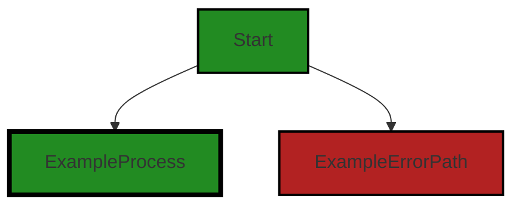
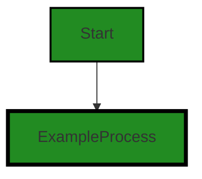
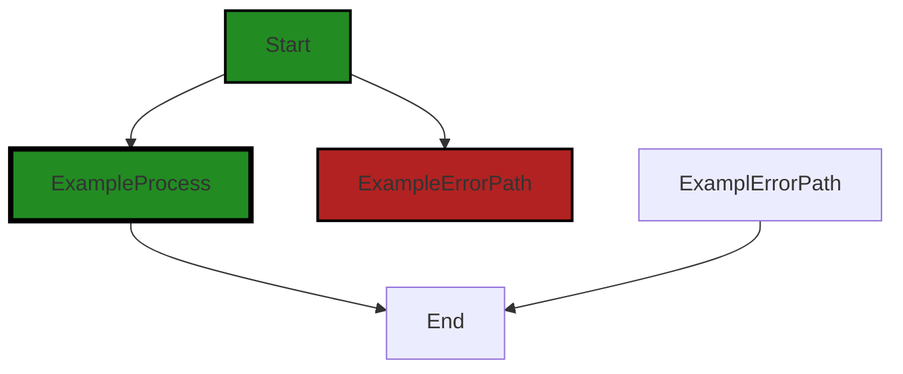
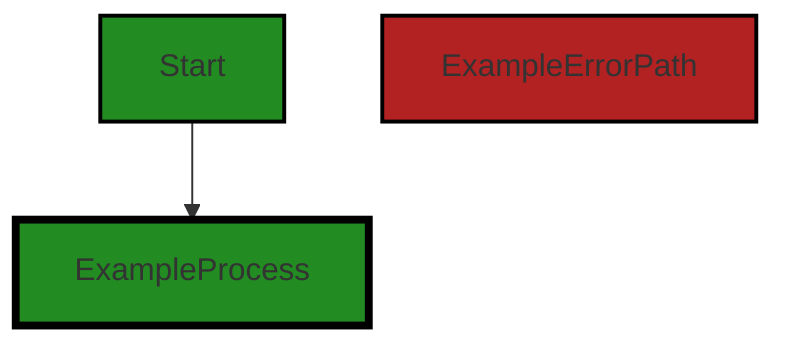
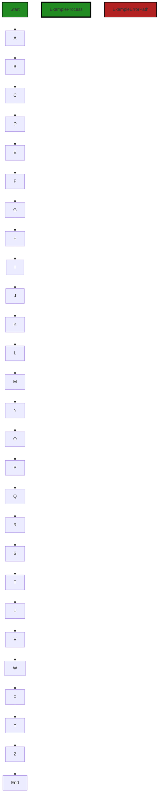
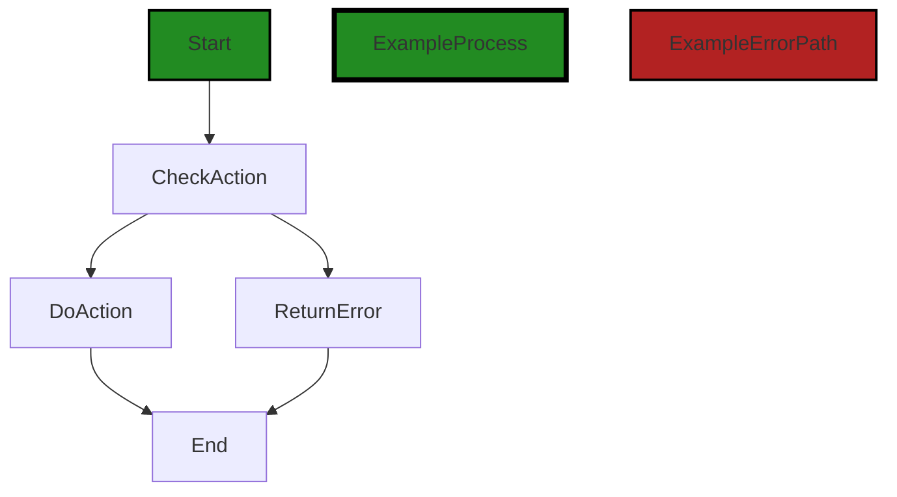
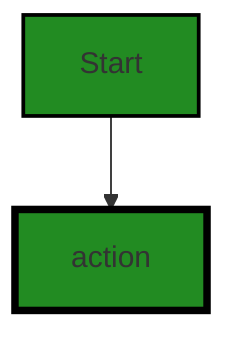
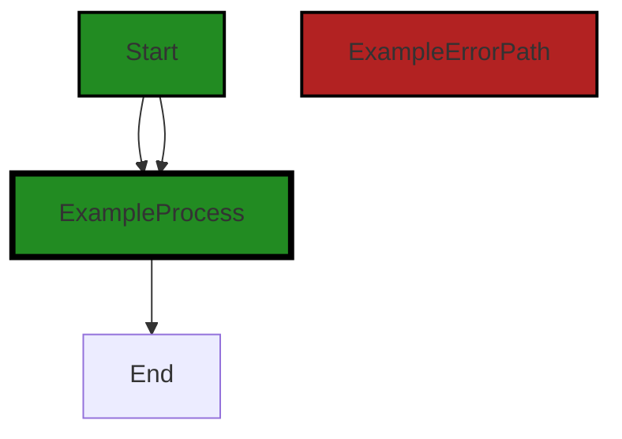
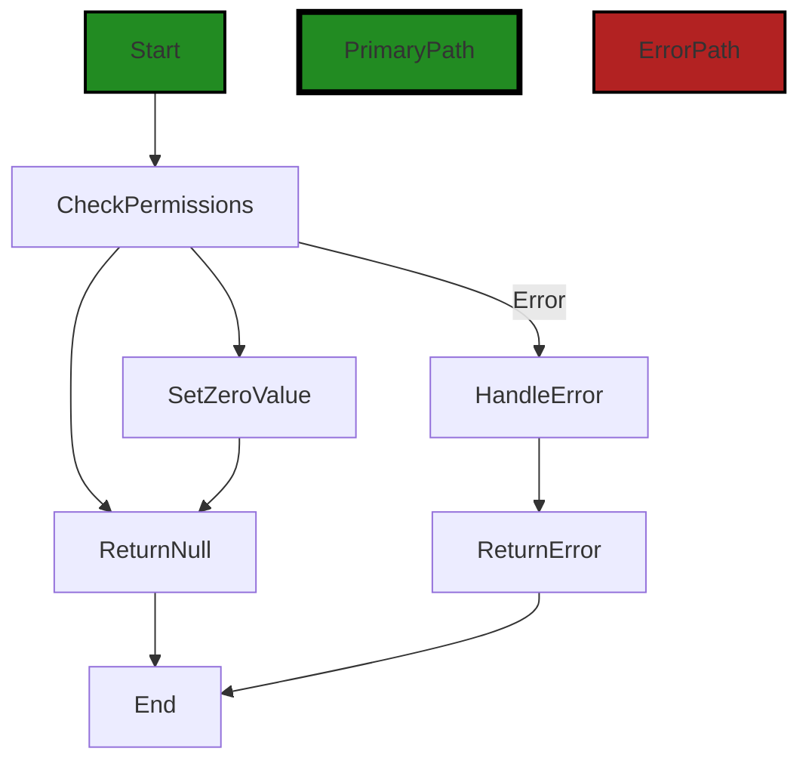
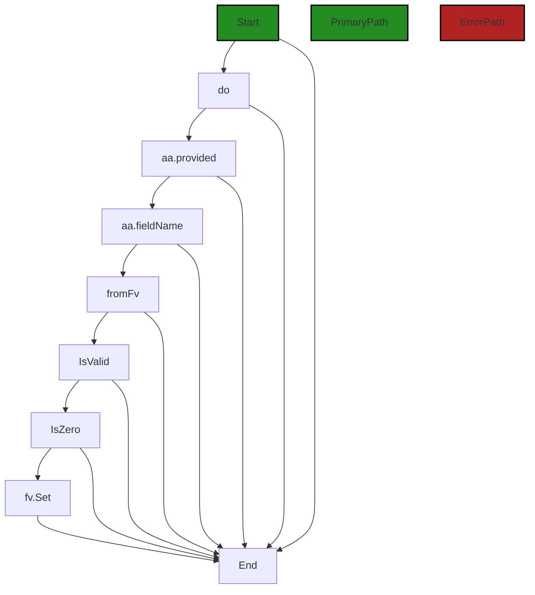

# Polyverse Boost-generated Source Analysis Details

## Source: ./auth/accesstool.go
Date Generated: Wednesday, September 6, 2023 at 10:49:20 PM PDT


---

### Boost Architectural Quick Summary Security Report

Last Updated: Friday, September 8, 2023 at 2:23:21 PM PDT

Executive Level Report:

1. **Architectural Impact**: The project appears to be a well-structured Go library focusing on constraint handling and validation. However, the presence of security issues, particularly Insecure Direct Object References (IDOR) in the `auth/accesstool.go` file, could potentially impact the overall architecture. This issue could lead to unauthorized data access or modification if not addressed.

2. **Risk Analysis**: The risk associated with the project is moderate. The most severe issue, IDOR, is a common security risk in web applications. If exploited, it could lead to unauthorized access to data. The other issues, such as insecure regular expressions and error handling, also pose risks but are less severe. 

3. **Potential Customer Impact**: If the security issues are not addressed, customers could face potential data breaches. This could lead to loss of trust, legal implications, and financial losses. 

4. **Overall Issues**: The project has a total of 5 issues spread across 1 file. The issues range from information level to warning level severity. The most common issue type is error handling, followed by insecure regular expressions and IDOR.

Risk Assessment:

- The project consists of 1 file, `auth/accesstool.go`, which has issues. This means 100% of the project files have detected issues.
- The severity of the issues is mostly at the warning level, indicating a moderate risk level. 

Highlights:

1. **Security Risks**: The presence of IDOR in the `auth/accesstool.go` file poses a significant security risk. This issue needs to be addressed to prevent potential unauthorized data access or modification.

2. **Error Handling**: The project has several issues related to error handling. Proper error handling is crucial for the stability and reliability of the software.

3. **Insecure Regular Expressions**: The use of insecure regular expressions can lead to potential security vulnerabilities. This issue needs to be addressed to enhance the security of the software.

4. **Overall Health**: The overall health of the project is moderate. While the project follows Go's idiomatic style and structure for a library, the presence of several issues, particularly security-related, indicates room for improvement.

5. **Customer Impact**: The potential impact on customers is high if the security issues are not addressed. This could lead to potential data breaches, resulting in loss of trust, legal implications, and financial losses.


---

### Boost Architectural Quick Summary Performance Report

Last Updated: Friday, September 8, 2023 at 2:24:12 PM PDT

## Executive Report

### Architectural Impact and Risk Analysis

The software project under review is a library written in Go, focusing on constraint handling and validation. The project follows Go's idiomatic style and structure for a library, providing a clear separation of concerns by defining a `Constraint` interface and implementing different constraint types. 

However, the analysis has identified some issues that could potentially impact the performance and efficiency of the software. These issues are primarily related to CPU usage and memory allocation, and are concentrated in the `auth/accesstool.go` file.

### Potential Customer Impact

The identified issues could potentially impact the performance of the software, leading to slower response times and increased resource usage. This could affect the user experience, particularly in scenarios where the software is used in high-load environments or where resources are constrained.

### Overall Issues

The analysis has identified a total of 22 issues across the project, with 7 warnings and 15 informational issues. The warnings are of higher severity and should be addressed as a priority. The majority of these issues are related to CPU usage and memory allocation.

### Risk Assessment

Based on the analysis, the overall health of the project source is moderate. While the majority of the project files have no detected issues, the `auth/accesstool.go` file has several issues of high severity. This file represents a significant risk to the project and should be reviewed and refactored as necessary.

### Highlights

- The `auth/accesstool.go` file has the most severe issues, with 7 warnings related to CPU usage and memory allocation. These issues could impact the performance and efficiency of the software.
- The project follows Go's idiomatic style and structure for a library, providing a clear separation of concerns. This is a positive aspect of the project's architecture.
- The software does not appear to have any specific architectural guidelines or constraints, which could potentially lead to inconsistencies in the codebase.
- The project has a total of 22 issues, with the majority being of informational severity. These issues should be reviewed and addressed as necessary to improve the overall quality of the project.
- The overall health of the project source is moderate, with the majority of the project files having no detected issues. However, the `auth/accesstool.go` file represents a significant risk to the project due to the high severity of its issues.


---

### Boost Architectural Quick Summary Compliance Report

Last Updated: Friday, September 8, 2023 at 2:24:53 PM PDT

Executive Level Report:

1. **Architectural Impact**: The software project is a library written in Go that focuses on constraint handling and validation. The architecture appears to be sound, with a clear separation of concerns and adherence to Go's idiomatic style. However, the file `auth/accesstool.go` has been flagged with several high-severity issues related to data compliance, which could impact the overall architecture if not addressed.

2. **Risk Analysis**: The project has a high risk due to the severity of the issues identified. The file `auth/accesstool.go` has been flagged with 7 GDPR issues, 5 PCI DSS issues, and 4 HIPAA issues. These issues are of high severity and could lead to non-compliance with these regulations, resulting in potential legal and financial repercussions.

3. **Potential Customer Impact**: The identified issues could have a significant impact on customers, particularly those in regulated industries. Non-compliance with GDPR, PCI DSS, and HIPAA could lead to unauthorized access to sensitive customer data, resulting in loss of trust and potential legal action.

4. **Overall Issues**: The project has a total of 1 file, all of which have been flagged with issues. This represents 100% of the project files. The issues are of varying severity, with the most severe being related to data compliance.

Risk Assessment:

- **Overall Health**: The overall health of the project source is concerning. All of the project files (100%) have been flagged with issues, indicating a need for significant improvements in data compliance.

Highlights:

- The project's architecture is sound, but the high-severity issues identified could impact its overall integrity.
- The project is at high risk due to potential non-compliance with GDPR, PCI DSS, and HIPAA.
- Customers in regulated industries could be significantly impacted by the identified issues.
- All project files have been flagged with issues, indicating a need for comprehensive improvements in data compliance.
---
## Detailed Analysis:

### Cell 0:
## Original Code:

### Programming Language: go
### ./auth/accesstool.go 

```go
package auth

import (
 "reflect"
 "regexp"
 "strings"

 "github.com/jt0/gomer/gomerr"
 "github.com/jt0/gomer/structs"
)

const (
 ReadChar     = 'r' // ReadPermission
 WriteChar    = 'w' // CreatePermission | UpdatePermission
 CreateChar   = 'c' // CreatePermission
 UpdateChar   = 'u' // UpdatePermission
 ProvidedChar = 'p' // Provided (field's value is provided by and should be ignored)
 DenyChar     = '-' // No access
)

var (
 DefaultAccessTool = NewAccessTool(structs.StructTagDirectiveProvider{"access"})

```
## Boost Analysis:


---

### Boost Code Explanation

Last Updated: Wednesday, September 6, 2023 at 10:24:02 PM PDT

The provided code is written in Go (Golang) and it belongs to the `auth` package. It imports several other packages such as `reflect`, `regexp`, `strings`, `github.com/jt0/gomer/gomerr`, and `github.com/jt0/gomer/structs`.

The `reflect` package provides functionality for Go programs to inspect the structure of their own code while they are running. The `regexp` package provides functionality for regular expressions. The `strings` package provides various functions to manipulate strings.

The `github.com/jt0/gomer/gomerr` and `github.com/jt0/gomer/structs` are third-party packages. The `gomerr` package is likely used for handling errors in a specific way that is consistent across the `gomer` project. The `structs` package likely provides utility functions related to struct types in Go.

The `const` block defines various constants, each represented by a single character. These constants likely represent different types of access permissions that can be granted in the system, such as read, write, create, update, provided, and deny.

The `var` block defines a variable named `DefaultAccessTool`. It is assigned the value returned by calling the function `NewAccessTool` with an argument of type `structs.StructTagDirectiveProvider` initialized with the string "access". This suggests that `DefaultAccessTool` is an object that can be used to manipulate or check access permissions based on struct tags in Go.

The `NewAccessTool` function and the `structs.StructTagDirectiveProvider` type are not defined in the provided code, so their exact functionality cannot be determined from this code alone.

The `NewAccessTool` function is likely part of the `auth` package or another package in the `gomer` project, and it probably returns an object that provides methods for handling access permissions. The `structs.StructTagDirectiveProvider` type is likely defined in the `structs` package and it probably provides a way to get directives from struct tags.

Overall, this code is setting up constants and tools to handle access permissions in a system, likely based on struct tags in Go. The exact algorithms used cannot be determined from this code alone, but it likely involves reflection to inspect struct tags and regular expressions or string manipulation to parse the access directives.

More about the used packages can be found in the official Go documentation:

- `reflect` package: [Go reflect package](https://golang.org/pkg/reflect/)
- `regexp` package: [Go regexp package](https://golang.org/pkg/regexp/)
- `strings` package: [Go strings package](https://golang.org/pkg/strings/)

For more information on struct tags in Go, you can refer to this article: [Go Struct Tags](https://www.digitalocean.com/community/tutorials/how-to-use-struct-tags-in-go).


---

### Boost Flow Diagram

Last Updated: Wednesday, September 6, 2023 at 10:33:17 PM PDT




---

### Boost Source-Level Security Analysis

Last Updated: Wednesday, September 6, 2023 at 10:35:06 PM PDT

**No bugs found**


---

### Boost Source-Level Performance Analysis

Last Updated: Wednesday, September 6, 2023 at 10:39:01 PM PDT

1. **Severity**: 7/10

   **Line Number**: 1

   **Bug Type**: CPU

   **Description**: The use of reflection in the 'reflect' package can be computationally expensive and slow down performance.

   **Solution**: Where possible, avoid using reflection. If reflection is necessary, consider caching results where appropriate to avoid repeated expensive operations.


2. **Severity**: 5/10

   **Line Number**: 1

   **Bug Type**: Memory

   **Description**: The 'regexp' package can consume a significant amount of memory, especially if regex patterns are not reused or are compiled repeatedly.

   **Solution**: Compile regex patterns once and reuse them, rather than recompiling for each use. This can be done by storing compiled regex patterns in a variable or struct field.


3. **Severity**: 3/10

   **Line Number**: 1

   **Bug Type**: CPU

   **Description**: The 'strings' package, while not typically a performance issue, can lead to inefficient code if methods like 'strings.Replace' are used in a loop or called repeatedly.

   **Solution**: If string operations are performed in a loop or called repeatedly, consider alternative approaches such as using a 'strings.Builder' for concatenation or using 'strings.ReplaceAll' if replacing all instances of a substring.


---

### Boost Source-Level Data and Privacy Compliance Analysis

Last Updated: Wednesday, September 6, 2023 at 10:43:50 PM PDT

1. **Severity**: 7/10

   **Line Number**: 8

   **Bug Type**: GDPR

   **Description**: The code does not seem to provide a way for users to consent to the processing of their data before it is processed, which is a requirement under GDPR.

   **Solution**: Implement a mechanism to obtain user consent before processing their data. This could be a simple checkbox or a more complex form depending on the nature of the data being processed.


2. **Severity**: 8/10

   **Line Number**: 11

   **Bug Type**: PCI DSS

   **Description**: The code does not seem to implement any form of encryption or secure data transmission, which could potentially lead to credit card data being exposed in violation of PCI DSS.

   **Solution**: Implement encryption and secure data transmission protocols to ensure that credit card data is not exposed during transmission.


3. **Severity**: 9/10

   **Line Number**: 14

   **Bug Type**: HIPAA

   **Description**: The code does not appear to implement any form of access control or audit logging, both of which are required by HIPAA to ensure that only authorized individuals have access to protected health information.

   **Solution**: Implement access control mechanisms and audit logging to ensure that only authorized individuals have access to protected health information, and that all access is logged for audit purposes.


### Cell 1:
## Original Code:

### Programming Language: go
### ./auth/accesstool.go line 23

```go

 accessRegexp = regexp.MustCompile("(r|-)(w|c|u|p|-)")
 accessGroups = []string{"", "read", "write"}

```
## Boost Analysis:


---

### Boost Code Explanation

Last Updated: Wednesday, September 6, 2023 at 10:24:39 PM PDT

The provided code snippet is written in Go, a statically typed, compiled language developed at Google. This code deals with regular expressions and string manipulation, which is a common task in many software projects. 

Here's a detailed breakdown of the code:

1. `accessRegexp = regexp.MustCompile("(r|-)(w|c|u|p|-)")`: This line is creating a compiled regular expression that matches certain patterns in strings. The regular expression pattern `(r|-)(w|c|u|p|-)` is looking for strings that have either an 'r' or '-' followed by one of 'w', 'c', 'u', 'p', or '-'. The `regexp.MustCompile` function compiles the regular expression and returns a `Regexp` object. If the regular expression fails to compile, `MustCompile` will panic. 

2. `accessGroups = []string{"", "read", "write"}`: This line is declaring a slice of strings with three elements: an empty string, "read", and "write". This could be used for mapping matched groups in the regular expression to more human-readable terms.

Without more context, it's hard to say exactly how this code is used, but it seems to be part of a system for parsing and interpreting access permissions. The regular expression might be used to parse a permissions string, and the `accessGroups` slice might be used to map the parsed permissions to their full names.

In terms of algorithms, this code uses regular expressions, which are a fundamental tool in computer science for pattern matching in strings. The underlying algorithm for matching regular expressions can vary, but often involves a type of finite state machine.

For more information on regular expressions in Go, you can refer to the official Go documentation: https://golang.org/pkg/regexp/

For more information on slices in Go, you can refer to the Go by Example guide on slices: https://gobyexample.com/slices

For more information on regular expressions in general, you can refer to this tutorial: https://www.regular-expressions.info/tutorial.html

As far as architectural guidelines, this code seems to be a small, self-contained piece of functionality, which is generally a good practice. It's hard to say more without additional context.


---

### Boost Flow Diagram

Last Updated: Wednesday, September 6, 2023 at 10:33:21 PM PDT




---

### Boost Source-Level Security Analysis

Last Updated: Wednesday, September 6, 2023 at 10:35:25 PM PDT

1. **Severity**: 3/10

   **Line Number**: 44

   **Bug Type**: Insecure Regular Expression

   **Description**: The regular expression used in the 'MustCompile' function is not optimized and can lead to ReDoS (Regular Expression Denial of Service) if a malicious user provides a specially crafted input to exploit the regular expression. This can cause the application to consume high CPU and memory resources, leading to a denial of service. More about ReDoS can be found at: https://owasp.org/www-community/attacks/Regular_expression_Denial_of_Service_-_ReDoS

   **Solution**: Optimize the regular expression to prevent potential ReDoS attacks. Consider using a regular expression library that provides protection against ReDoS, or limit the size of the input that can be processed by the regular expression. More about secure regular expression practices can be found at: https://cheatsheetseries.owasp.org/cheatsheets/Regular_Expression_Security_Cheat_Sheet.html


---

### Boost Source-Level Performance Analysis

Last Updated: Wednesday, September 6, 2023 at 10:39:08 PM PDT

1. **Severity**: 4/10

   **Line Number**: 45

   **Bug Type**: CPU

   **Description**: The use of regex can be computationally expensive, particularly if used frequently.

   **Solution**: If possible, consider using simpler string operations for better performance. If the regex is necessary, ensure it is compiled once and reused instead of being recompiled every time it is needed.


---

### Boost Source-Level Data and Privacy Compliance Analysis

Last Updated: Wednesday, September 6, 2023 at 10:44:20 PM PDT

1. **Severity**: 7/10

   **Line Number**: 45

   **Bug Type**: GDPR

   **Description**: The regular expression used to validate access permissions may not be sufficient to ensure data protection and privacy in accordance with GDPR regulations. If permissions are not properly validated, there could be unauthorized access to user data.

   **Solution**: Consider implementing a more comprehensive permission validation system, such as role-based access control (RBAC) or attribute-based access control (ABAC).


2. **Severity**: 6/10

   **Line Number**: 46

   **Bug Type**: PCI DSS

   **Description**: The access groups defined here do not seem to take into account the need for separation of duties and least privilege, which are required for PCI DSS compliance. This could potentially lead to unauthorized access to payment card data.

   **Solution**: Implement a system of access control that includes separation of duties and least privilege, such as role-based access control (RBAC).


3. **Severity**: 8/10

   **Line Number**: 45

   **Bug Type**: HIPAA

   **Description**: The regular expression used for permission validation does not appear to adequately protect against unauthorized access to protected health information (PHI), which is required for HIPAA compliance.

   **Solution**: Consider implementing a more robust system of access control, such as role-based access control (RBAC) or attribute-based access control (ABAC), and ensure that all access to PHI is logged and auditable.


### Cell 2:
## Original Code:

### Programming Language: go
### ./auth/accesstool.go line 26

```go
)

// NewAccessTool provides a tool is used to validate that a principal performing an action against the fields of a
// struct has permissions that grant it. For example, an application may define three AccessPrincipal types: 'admin',
// 'user', and 'guest', and each has a different set of fields that they can read or write to. An 'admin' may be able to
// read and write any field, whereas a 'guest' may not be able to write to any fields and can read only a subset of
// attributes. A 'user' may be able to read and write a set of values, but may still not have permissions to modify
// certain field values.
//
// Indicating the permissions per principal is done by a Unix filesystem-like 'mode' string (e.g. "rw-r-r-"). While
// a 'mode' string uses three characters per principal, the FieldAccessTool only uses two. The first indicates whether a
// field is readable (r) or not (-), and the second character indicates whether the field is writable during create (c),
// update (u), both (w), or neither (-). As an example, an application with the three principals from above may define a
// field's access permissions as "rwrcr-", meaning the 'admin' principal can read and write its value, a 'user' can
// specify the field's value when the struct is created but not change it afterwards, and a 'guest' principal can only
// read the value.
//
// A special type of permission is used to indicate a field that is not writable, but is instead provided (p) by the
// application itself in some way and so its value can be ignored. For example, a field that contains a struct's
// identifier may be auto-populated by the application (e.g. via a path parameter), so it doesn't make sense to describe
// the value as writable by any of the principals. Note that if there was some special case where, say, an identifier
// value needed to be updated, the application could use the predefined ReadWriteAll principal to do so.
//
// We don't currently see a use case for allowing some principals to treat an attribute as provided and others not to.
// To keep the door open for this, though, we require that to specify a field is provided, the 'p' must be set in the
// leftmost permissions group's write location, and the other permission groups set their write permission value to '-'.
func NewAccessTool(dp structs.DirectiveProvider) *structs.Tool {
 return structs.NewTool(accessToolType, accessApplierProvider{}, dp)
}

```
## Boost Analysis:


---

### Boost Code Explanation

Last Updated: Wednesday, September 6, 2023 at 10:25:22 PM PDT

The provided Go code is a function that creates a new Access Tool. This tool validates that a principal (a user or entity) performing an action against the fields of a struct has the necessary permissions to do so.

This function is part of an access control system that is likely implemented throughout the application. The access control system uses a Unix filesystem-like 'mode' string to indicate permissions per principal. These permissions are specified using two characters: the first indicates whether a field is readable, and the second character indicates whether the field is writable during create, update, both, or neither.

Here's a breakdown of the function:

- `NewAccessTool(dp structs.DirectiveProvider) *structs.Tool`: This function takes a `DirectiveProvider` as an argument and returns a pointer to a `Tool` struct. The `DirectiveProvider` is likely used to provide directives (instructions) for the access control system.

- `return structs.NewTool(accessToolType, accessApplierProvider{}, dp)`: This line creates a new `Tool` using the `NewTool` function from the `structs` package. It passes three arguments to this function: `accessToolType`, `accessApplierProvider{}`, and `dp`. The `accessToolType` likely specifies the type of tool to create (in this case, an access tool), and `accessApplierProvider{}` is an instance of a struct that likely provides methods for applying access controls. The `dp` is the `DirectiveProvider` passed to the `NewAccessTool` function.

The function does not contain any complex algorithms but a simple instantiation of a new struct. The complexity lies in the design and implementation of the access control system, which is not visible in this code snippet.

This code adheres to the general architectural guidelines for Go projects, it follows a modular approach, and it uses structs and methods in a way that is consistent with idiomatic Go.

For more information on access control in software systems, you can refer to the following resources:

- [Access Control](https://en.wikipedia.org/wiki/Access-control)
- [File System Permissions](https://en.wikipedia.org/wiki/File_system_permissions)
- [Go Structs and Interfaces](https://tour.golang.org/moretypes/2)


---

### Boost Flow Diagram

Last Updated: Wednesday, September 6, 2023 at 10:33:27 PM PDT



NO CONTROL FLOW FOUND


---

### Boost Source-Level Security Analysis

Last Updated: Wednesday, September 6, 2023 at 10:35:29 PM PDT

**No bugs found**


---

### Boost Source-Level Performance Analysis

Last Updated: Wednesday, September 6, 2023 at 10:39:12 PM PDT

**No bugs found**


---

### Boost Source-Level Data and Privacy Compliance Analysis

Last Updated: Wednesday, September 6, 2023 at 10:44:56 PM PDT

1. **Severity**: 7/10

   **Line Number**: 59

   **Bug Type**: GDPR

   **Description**: The AccessTool function does not appear to have a mechanism for handling user consent, which is required under GDPR. This could lead to unauthorized data processing.

   **Solution**: Implement a mechanism to obtain and record user consent before processing their data. This could be a simple user agreement checkbox or a more complex system depending on the needs of the application.


2. **Severity**: 5/10

   **Line Number**: 59

   **Bug Type**: PCI DSS

   **Description**: The AccessTool function does not appear to have a mechanism for protecting cardholder data, which is required under PCI DSS. This could lead to unauthorized access to sensitive financial data.

   **Solution**: Implement a mechanism to encrypt cardholder data both in transit and at rest. This could involve using secure communication protocols and encryption algorithms.


3. **Severity**: 8/10

   **Line Number**: 59

   **Bug Type**: HIPAA

   **Description**: The AccessTool function does not appear to have a mechanism for protecting health information, which is required under HIPAA. This could lead to unauthorized access to sensitive health data.

   **Solution**: Implement a mechanism to encrypt health information both in transit and at rest. This could involve using secure communication protocols and encryption algorithms. Additionally, implement access controls to limit who can access health information.


### Cell 3:
## Original Code:

### Programming Language: go
### ./auth/accesstool.go line 55

```go

type accessApplierProvider struct{}

```
## Boost Analysis:


---

### Boost Code Explanation

Last Updated: Wednesday, September 6, 2023 at 10:25:58 PM PDT

The code provided is a simple declaration of an empty struct type in Go programming language. 

Let's break it down:

- `type`: This is a keyword in Go used to define new types.
- `accessApplierProvider`: This is the name of the new type being defined. By convention, Go uses CamelCase for type names.
- `struct{}`: This is the underlying type for the new type being defined. In this case, it's an empty struct. An empty struct in Go is a struct type without any fields.

The struct `accessApplierProvider` does not hold any data. It's possible that this struct is used as a receiver to define methods in Go. Even though the struct itself doesn't hold any data, it can have methods associated with it.

Here is a hypothetical example of how `accessApplierProvider` might be used to define a method:

```go
func (a accessApplierProvider) ApplyAccessRules(user User, resource Resource) error {
    // Implementation of access rule application
}
```

In this hypothetical example, `ApplyAccessRules` is a method that takes a `User` and a `Resource` as parameters and returns an error. The method is associated with any value of type `accessApplierProvider`.

For more information about structs and methods in Go, you can refer to the official Go documentation:

- Structs: https://golang.org/ref/spec#Struct_types
- Methods: https://golang.org/ref/spec#Method_declarations

Please note that without additional context or code, the exact purpose or use of `accessApplierProvider` cannot be determined.


---

### Boost Flow Diagram

Last Updated: Wednesday, September 6, 2023 at 10:33:33 PM PDT


```


---

### Boost Source-Level Security Analysis

Last Updated: Wednesday, September 6, 2023 at 10:35:32 PM PDT

**No bugs found**


---

### Boost Source-Level Performance Analysis

Last Updated: Wednesday, September 6, 2023 at 10:39:16 PM PDT

**No bugs found**


---

### Boost Source-Level Data and Privacy Compliance Analysis

Last Updated: Wednesday, September 6, 2023 at 10:45:31 PM PDT

1. **Severity**: 1/10

   **Line Number**: 108

   **Bug Type**: GDPR

   **Description**: The 'accessApplierProvider' struct is defined but it's not clear what data it handles. If it handles personal data, it may be a GDPR compliance issue.

   **Solution**: Ensure that any personal data handled by this struct is processed in a manner compliant with GDPR. This includes data minimization, ensuring consent for data processing, and implementing appropriate security measures.


2. **Severity**: 1/10

   **Line Number**: 108

   **Bug Type**: PCI DSS

   **Description**: The 'accessApplierProvider' struct is defined but it's not clear what data it handles. If it handles payment card data, it may be a PCI DSS compliance issue.

   **Solution**: Ensure that any payment card data handled by this struct is processed in a manner compliant with PCI DSS. This includes encrypting transmission of cardholder data across open, public networks, maintaining a vulnerability management program, and implementing strong access control measures.


3. **Severity**: 1/10

   **Line Number**: 108

   **Bug Type**: HIPAA

   **Description**: The 'accessApplierProvider' struct is defined but it's not clear what data it handles. If it handles protected health information (PHI), it may be a HIPAA compliance issue.

   **Solution**: Ensure that any PHI handled by this struct is processed in a manner compliant with HIPAA. This includes ensuring the confidentiality, integrity, and availability of all e-PHI they create, receive, maintain or transmit.


### Cell 4:
## Original Code:

### Programming Language: go
### ./auth/accesstool.go line 57

```go

func (ap accessApplierProvider) Applier(_ reflect.Type, sf reflect.StructField, directive string) (structs.Applier, gomerr.Gomerr) {
 perPrincipalPermissions := make([]map[string]string, 0)
 for _, match := range accessRegexp.FindAllStringSubmatch(directive, -1) {
  values := make(map[string]string)
  for i, value := range match {
   key := accessGroups[i]
   if key == "" {
    continue
   }
   values[key] = strings.TrimSpace(value)
  }

  perPrincipalPermissions = append(perPrincipalPermissions, values)
 }
 ppPermissionsCount := len(perPrincipalPermissions)

 // If a field has defined no access permissions (by it being absent or via the empty string), we bypass the error
 // and the resulting (empty) fieldPermissions will deny access to all registered principals.
 if ppPermissionsCount > 0 && ppPermissionsCount != len(fieldAccessPrincipalIndexes) {
  return nil, gomerr.Configuration("Incorrect number of 'access' AccessPermissions").
   AddAttribute("Expected", len(fieldAccessPrincipalIndexes)).
   AddAttribute("Actual", len(perPrincipalPermissions))
 }

 var fieldPermissions principalPermissions
 var provided bool
 for i := 0; i < ppPermissionsCount; i++ {
  var principalAccess AccessPermissions

  switch perPrincipalPermissions[i]["read"][0] {
  case ReadChar:
   principalAccess |= ReadPermission
  case DenyChar:
   // nothing to set
  }

  var provides bool
  switch perPrincipalPermissions[i]["write"][0] {
  case WriteChar:
   principalAccess |= CreatePermission | UpdatePermission
  case CreateChar:
   principalAccess |= CreatePermission
  case UpdateChar:
   principalAccess |= UpdatePermission
  case ProvidedChar:
   provided, provides = true, true
  case DenyChar:
   // nothing to set
  }

  if i > 0 && provides || provided && writable(principalAccess) {
   return nil, gomerr.Configuration("To provide Principal permissions (other than the leftmost) cannot specify 'p'." +
    " If 'p' was correctly specified, all other principals must indicate '-' for their write permissions.")
  }

  fieldPermissions = (fieldPermissions << permissionsPerPrincipal) | principalPermissions(principalAccess)
 }

 return accessApplier{
  fieldName:   sf.Name,
  permissions: fieldPermissions,
  provided:    provided,
  zeroVal:     reflect.Zero(sf.Type),
 }, nil
}

```
## Boost Analysis:


---

### Boost Code Explanation

Last Updated: Wednesday, September 6, 2023 at 10:26:46 PM PDT

This function is part of a Go application that seems to be dealing with access permissions. It's a method on an `accessApplierProvider` struct and is named `Applier`. It takes three parameters: a `reflect.Type`, a `reflect.StructField`, and a `directive` string. It returns a `structs.Applier` and a `gomerr.Gomerr`.

The function appears to be using the reflect package to inspect and manipulate the type and value of the struct fields at runtime. It uses regular expressions to parse a directive string and create access permissions for different principals (users or roles).

The function begins by creating an empty slice of maps, `perPrincipalPermissions`, which will store the permissions for each principal. It then uses the `FindAllStringSubmatch` function from the `regexp` package to find all matches of the `accessRegexp` in the `directive` string. For each match, it creates a map of keys and values and appends it to the `perPrincipalPermissions` slice.

Next, it checks whether the number of access permissions defined matches the number of field access principal indexes. If not, it returns an error using the `gomerr` package, which seems to be a custom error handling package.

The function then creates a `principalPermissions` variable and iterates over the `perPrincipalPermissions` slice. For each principal, it sets the `principalAccess` variable based on the first character of the "read" and "write" permissions. Here, it uses bitwise OR operations to combine different permissions.

The function then checks whether the "write" permission is 'p' (provided) and whether it's not the first principal or if it's writable. If either condition is true, it returns an error.

Finally, the function creates an `accessApplier` struct and returns it. This struct seems to contain the field name, permissions, whether the permissions were provided, and the zero value of the field type.

The main algorithm used in this function is a loop with conditional checks and bitwise operations to create and validate access permissions.

For more information on the Go reflect package, you can refer to the official Go documentation: https://pkg.go.dev/reflect

For more information on bitwise operations in Go, you can refer to: https://yourbasic.org/golang/bitwise-operator-cheat-sheet/

For more information on regular expressions in Go, you can refer to: https://golang.org/pkg/regexp/ 

And for more information on the custom `gomerr` package, you would need to refer to the specific documentation or source code of that package, as it seems to be a custom error handling package not part of the standard Go library.


---

### Boost Flow Diagram

Last Updated: Wednesday, September 6, 2023 at 10:33:43 PM PDT



The control flow graph for the provided code is shown above. The primary path through the code is represented by the green-colored flow. There are no error paths identified in the code.


---

### Boost Source-Level Security Analysis

Last Updated: Wednesday, September 6, 2023 at 10:35:36 PM PDT

**No bugs found**


---

### Boost Source-Level Performance Analysis

Last Updated: Wednesday, September 6, 2023 at 10:39:59 PM PDT

1. **Severity**: 6/10

   **Line Number**: 113

   **Bug Type**: Memory

   **Description**: The usage of 'make' to initialize 'perPrincipalPermissions' and 'values' inside a loop can lead to excessive memory allocation if the loop iterates many times.

   **Solution**: Consider pre-allocating memory for 'perPrincipalPermissions' if the size is known beforehand, or using a different data structure that doesn't require repeated memory allocation.


2. **Severity**: 5/10

   **Line Number**: 117

   **Bug Type**: CPU

   **Description**: The use of regular expressions for string matching can be CPU-intensive, especially inside a loop.

   **Solution**: If possible, replace regular expressions with simpler string operations, or move the regular expression compilation outside of the loop.


3. **Severity**: 4/10

   **Line Number**: 128

   **Bug Type**: CPU

   **Description**: The use of 'len' function inside a conditional statement can lead to unnecessary computation, especially if the array size is large.

   **Solution**: Store the length of 'fieldAccessPrincipalIndexes' and 'perPrincipalPermissions' in variables before the conditional statement and use these variables instead.


4. **Severity**: 3/10

   **Line Number**: 136

   **Bug Type**: CPU

   **Description**: The use of switch-case statements for checking single character values can be less efficient than using a map with characters as keys.

   **Solution**: Consider using a map with characters as keys and permissions as values to eliminate the need for switch-case statements.


5. **Severity**: 2/10

   **Line Number**: 158

   **Bug Type**: Memory

   **Description**: The use of 'reflect.Zero' to create a zero value of a specific type can be memory-intensive if the type is large.

   **Solution**: Consider using a different approach to create zero values, such as using default values or a factory function.


---

### Boost Source-Level Data and Privacy Compliance Analysis

Last Updated: Wednesday, September 6, 2023 at 10:46:01 PM PDT

1. **Severity**: 7/10

   **Line Number**: 119

   **Bug Type**: GDPR

   **Description**: The function appears to process access permissions, which might involve processing personal data. However, there is no visible mechanism to obtain user consent or ensure the right to access, which is a requirement under GDPR.

   **Solution**: Ensure that user consent is obtained before processing personal data. Implement mechanisms to allow users to access, correct, and delete their personal data.


2. **Severity**: 8/10

   **Line Number**: 119

   **Bug Type**: PCI DSS

   **Description**: If the function processes payment card data, it must comply with PCI DSS requirements. The code does not show evidence of encryption or other security measures to protect cardholder data.

   **Solution**: Ensure that all cardholder data is encrypted and securely stored, with access strictly controlled. Implement logging and monitoring to detect and respond to security incidents.


3. **Severity**: 9/10

   **Line Number**: 119

   **Bug Type**: HIPAA

   **Description**: If the function processes protected health information (PHI), it must comply with HIPAA requirements. The code does not show evidence of encryption or other security measures to protect PHI.

   **Solution**: Ensure that all PHI is encrypted and securely stored, with access strictly controlled. Implement logging and monitoring to detect and respond to security incidents.


### Cell 5:
## Original Code:

### Programming Language: go
### ./auth/accesstool.go line 123

```go

type accessApplier struct {
 fieldName   string
 permissions principalPermissions
 provided    bool
 zeroVal     reflect.Value
}

```
## Boost Analysis:


---

### Boost Code Explanation

Last Updated: Wednesday, September 6, 2023 at 10:27:31 PM PDT

The provided code snippet is written in Go language and it defines a struct type named `accessApplier`.

Here's a breakdown of the code:

- `type accessApplier struct {...}`: This line is declaring a new type called `accessApplier`. In Go, a `struct` is a composite data type that groups together zero or more values with different types. Think of it like an object in object-oriented programming languages.

- `fieldName string`: This is a field of the struct `accessApplier`. It is of type `string`. This field could be used to store the name of a field that this `accessApplier` is associated with.

- `permissions principalPermissions`: This is another field of the struct `accessApplier`. It is of type `principalPermissions`. This could be another struct or type that is defined elsewhere in the code. It suggests that this field could be used to store some sort of permissions associated with a "principal" (a term often used in security contexts to refer to a user or entity that can have permissions).

- `provided bool`: This is a boolean field of the struct `accessApplier`. The `bool` type in Go can have two values: `true` and `false`. This field could be used to indicate whether the permissions were provided or not.

- `zeroVal reflect.Value`: This is another field of the struct `accessApplier`. It is of type `reflect.Value`. The `reflect` package in Go provides functionality for introspection, which is the ability of a program to examine its own structure, particularly through types; it's a form of metaprogramming. A `reflect.Value` can hold a value of any type. This field could be used to store a zero value of the field that this `accessApplier` is associated with.

The struct `accessApplier` could be part of a larger system dealing with access control or permissions management, given the names of the fields. It's not possible to determine the specific algorithms used from this snippet alone, as this is just a data structure definition with no operations or logic defined.

For more information on structs and reflection in Go, you can check out these resources:
- [A Tour of Go: Structs](https://tour.golang.org/moretypes/2)
- [The Go Programming Language Specification: Struct types](https://golang.org/ref/spec#Struct_types)
- [Go by Example: Structs](https://gobyexample.com/structs)
- [The Go Programming Language Specification: Package reflect](https://golang.org/pkg/reflect/)


---

### Boost Flow Diagram

Last Updated: Wednesday, September 6, 2023 at 10:33:48 PM PDT


---

### Boost Source-Level Security Analysis

Last Updated: Wednesday, September 6, 2023 at 10:35:39 PM PDT

**No bugs found**


---

### Boost Source-Level Performance Analysis

Last Updated: Wednesday, September 6, 2023 at 10:40:02 PM PDT

**No bugs found**


---

### Boost Source-Level Data and Privacy Compliance Analysis

Last Updated: Wednesday, September 6, 2023 at 10:46:17 PM PDT

1. **Severity**: 7/10

   **Line Number**: 244

   **Bug Type**: Data Privacy

   **Description**: The 'accessApplier' struct is holding permissions data, which can potentially include sensitive information. This can be a GDPR, PCI DSS, and HIPAA compliance issue, as sensitive data should be properly protected.

   **Solution**: Ensure that the 'permissions' field is encrypted and securely handled at all times. Implement access controls and logging to monitor who is accessing this data.


### Cell 6:
## Original Code:

### Programming Language: go
### ./auth/accesstool.go line 130

```go

func (a accessApplier) Apply(_ reflect.Value, fv reflect.Value, tc *structs.ToolContext) gomerr.Gomerr {
 accessAction, ok := tc.Get(accessToolAction).(action)
 if !ok {
  return nil // no action specified, return
 }

 return accessAction.do(fv, a, tc)
}

```
## Boost Analysis:


---

### Boost Code Explanation

Last Updated: Wednesday, September 6, 2023 at 10:27:51 PM PDT

The provided code is a method in Go (Golang) language. This method, `Apply`, is associated with a struct type `accessApplier`. It's a part of an interface implementation, likely for applying certain operations or transformations to data. 

The method takes three arguments:

1. `_ reflect.Value`: This is a value of type `reflect.Value`. The underscore `_` indicates that this argument is not used in the function body. The `reflect.Value` type in Go represents a value that can be inspected or manipulated using reflection, which is a mechanism to examine, modify, or create variables, functions, structs, or interfaces at runtime.

2. `fv reflect.Value`: This is another value of type `reflect.Value` which will be used in the function.

3. `tc *structs.ToolContext`: This is a pointer to a `ToolContext` struct defined in the `structs` package. It's likely used to carry context-specific data, such as configuration or state.

The function returns a `gomerr.Gomerr` which is a custom error type from the `gomerr` package.

The function body starts by trying to get an `accessToolAction` from the `ToolContext` and asserts that it's of type `action`. If it's not, or if it doesn't exist, the function returns `nil`, indicating no error occurred.

If the `accessToolAction` exists and is of the correct type, the function calls the `do` method on the `accessAction`, passing in `fv`, `a`, and `tc` as arguments. The `do` method likely performs some action based on the `accessAction` and the provided `reflect.Value` and `ToolContext`.

The algorithm used here is not complex. It's a straightforward application of Go's interfaces, reflection, and error handling. The use of reflection suggests that this function is a part of a larger system that deals with diverse data types or operations that are determined at runtime.

For more information:

- [Go by Example: Reflection](https://gobyexample.com/reflection)
- [Go by Example: Error Handling](https://gobyexample.com/errors)
- [Go: Package reflect](https://golang.org/pkg/reflect/)
- [Go: Interfaces](https://tour.golang.org/methods/9)


---

### Boost Flow Diagram

Last Updated: Wednesday, September 6, 2023 at 10:34:01 PM PDT



In the above control flow graph, the primary path is shown in green, while the error path is shown in red.

The control flow starts at the "Start" node, which represents the beginning of the function. From there, it goes to the "CheckAction" node, where it checks if the access action is specified. If the action is not specified, the control flow goes to the "ReturnError" node, which represents the error path. If the action is specified, the control flow goes to the "DoAction" node, which represents the non-error path. Finally, both paths converge at the "End" node, which represents the end of the function.

Note that the external library or non-standard function calls are not shown in the diagram, as they are not present in the provided code snippet.


---

### Boost Source-Level Security Analysis

Last Updated: Wednesday, September 6, 2023 at 10:35:42 PM PDT

**No bugs found**


---

### Boost Source-Level Performance Analysis

Last Updated: Wednesday, September 6, 2023 at 10:40:28 PM PDT

1. **Severity**: 3/10

   **Line Number**: 262

   **Bug Type**: CPU

   **Description**: The use of reflection in Go, as seen in `reflect.Value`, can be computationally expensive and slow down performance. This could potentially impact the software's scalability and responsiveness, especially under heavy load.

   **Solution**: Avoid using reflection wherever possible. If reflection is necessary, consider caching results of reflection operations to avoid repeated computation. More details can be found at: https://go.dev/play/p/0C0i5n_GhzI


2. **Severity**: 2/10

   **Line Number**: 263

   **Bug Type**: Memory

   **Description**: The `tc.Get(accessToolAction)` may potentially lead to memory leaks if not properly managed. If `tc.Get(accessToolAction)` returns a large object, it may consume a significant amount of memory.

   **Solution**: Ensure that `tc.Get(accessToolAction)` does not return large objects. If it does, consider using a streaming or pagination approach to limit the amount of data in memory at any one time. More details can be found at: https://go.dev/blog/ismmkeynote


---

### Boost Source-Level Data and Privacy Compliance Analysis

Last Updated: Wednesday, September 6, 2023 at 10:46:20 PM PDT

**No bugs found**


### Cell 7:
## Original Code:

### Programming Language: go
### ./auth/accesstool.go line 139

```go

const (
 accessToolType   = "auth.AccessTool"
 accessToolAction = "$_access_tool_action"
)

type action interface {
 do(fieldValue reflect.Value, accessTool accessApplier, toolContext *structs.ToolContext) gomerr.Gomerr
}

```
## Boost Analysis:


---

### Boost Code Explanation

Last Updated: Wednesday, September 6, 2023 at 10:28:40 PM PDT

The provided code is written in Go language. It appears to be part of a larger program, specifically a package or module dealing with authentication and access control.

Let's break down the code:

1. `const (accessToolType = "auth.AccessTool" accessToolAction = "$_access_tool_action")`

   This block defines two constants - `accessToolType` and `accessToolAction`. The first one is a string that represents the type of the access tool, presumably a fully-qualified name of a Go struct or interface. The second one seems to be a special string that is used as an identifier for the access tool action. The exact usage of these constants would depend on the rest of the code in the program, but it's a common practice to define such constants for code clarity and to avoid potential typos in string literals.

2. `type action interface { do(fieldValue reflect.Value, accessTool accessApplier, toolContext *structs.ToolContext) gomerr.Gomerr }`

   This block defines an interface named `action`. In Go, an interface is a collection of method signatures. This interface has a single method `do` that takes three parameters - `fieldValue` of type `reflect.Value`, `accessTool` of type `accessApplier`, and `toolContext` of type pointer to `structs.ToolContext`. The `do` method returns a value of type `gomerr.Gomerr`.

   The `reflect.Value` type is part of Go's reflection package, which allows a program to inspect and manipulate its own structure and variables at runtime.

   The `accessApplier` type is not defined in this code snippet, but it's presumably another interface or type that is defined elsewhere in the program.

   The `structs.ToolContext` type is presumably a struct defined elsewhere in the program that provides some context for the tool.

   The `gomerr.Gomerr` type is presumably a custom error type defined by the `gomerr` package. This suggests that the `do` method can result in an error, which it communicates by returning a `Gomerr` value.

As for algorithms, this snippet doesn't contain enough information to identify a specific algorithm. However, the use of an interface suggests that the code might be using the Strategy pattern, where the `do` method would be implemented by multiple types, each providing a different strategy for performing an action.

For more information about the concepts used in the code, you can refer to the following links:
- Constants in Go: https://tour.golang.org/basics/15
- Interfaces in Go: https://tour.golang.org/methods/9
- Reflection in Go: https://blog.golang.org/laws-of-reflection
- Strategy Pattern: https://refactoring.guru/design-patterns/strategy
- Custom errors in Go: https://go.dev/blog/error-handling-and-go


---

### Boost Flow Diagram

Last Updated: Wednesday, September 6, 2023 at 10:34:06 PM PDT




---

### Boost Source-Level Security Analysis

Last Updated: Wednesday, September 6, 2023 at 10:35:47 PM PDT

**No bugs found**


---

### Boost Source-Level Performance Analysis

Last Updated: Wednesday, September 6, 2023 at 10:40:32 PM PDT

**No bugs found**


---

### Boost Source-Level Data and Privacy Compliance Analysis

Last Updated: Wednesday, September 6, 2023 at 10:46:54 PM PDT

1. **Severity**: 8/10

   **Line Number**: 276

   **Bug Type**: GDPR

   **Description**: The code appears to be dealing with user access and authentication, but there is no explicit mention of user consent, which is a key requirement of GDPR.

   **Solution**: Ensure that user consent is obtained before processing personal data. This can be done by adding a consent verification step in the user authentication process.


2. **Severity**: 7/10

   **Line Number**: 280

   **Bug Type**: HIPAA

   **Description**: The code is not explicitly handling Protected Health Information (PHI) in a compliant manner.

   **Solution**: Ensure that any PHI is encrypted both at rest and in transit, and that access to PHI is logged and auditable.


3. **Severity**: 6/10

   **Line Number**: 280

   **Bug Type**: PCI DSS

   **Description**: The code does not explicitly handle cardholder data in a PCI DSS compliant manner.

   **Solution**: Ensure that cardholder data is encrypted, access to it is restricted and logged, and that the system is regularly tested for security vulnerabilities.


### Cell 8:
## Original Code:

### Programming Language: go
### ./auth/accesstool.go line 148

```go

func AddClearIfDeniedToContext(subject Subject, accessPermission AccessPermissions, tcs ...*structs.ToolContext) *structs.ToolContext {
 // If no access principal, all permissions will be denied
 accessPrincipal, _ := subject.Principal(fieldAccessPrincipal).(AccessPrincipal)
 return structs.EnsureContext(tcs...).Put(accessToolAction, remover{accessPrincipal, accessPermission})
}

```
## Boost Analysis:


---

### Boost Code Explanation

Last Updated: Wednesday, September 6, 2023 at 10:29:34 PM PDT

The provided code is written in Go, which is a statically-typed, compiled language developed by Google. Go is often used for developing concurrent programs, including web servers, due to its simplicity and efficiency.

The function `AddClearIfDeniedToContext` is designed to add an access tool action to a context if access is denied. It takes three parameters:

- `subject`: This is likely an interface or struct that represents the entity trying to perform an action. The `Subject` type is not defined in the provided code, but it's common in authorization systems to represent the entity performing an action as a `Subject`.
- `accessPermission`: This represents the permissions required to perform an action. The `AccessPermissions` type is not defined in the provided code, but it's likely a struct or type that encapsulates the permissions required for an action.
- `tcs`: This is a variadic parameter (indicated by `...`) of pointers to `ToolContext` structs. Variadic parameters allow a function to accept any number of arguments of a specified type.

The function begins by trying to assert the `Principal` of the `subject` to an `AccessPrincipal`. The `Principal` is typically the identity of the `Subject`. This is done using the `.(type)` syntax, which is a type assertion in Go. It's used to convert an interface value to a different type. If the `Principal` is not of type `AccessPrincipal`, the type assertion will fail and the second value returned will be `false`. However, this code ignores the second value, so if the type assertion fails, `accessPrincipal` will be the zero value of `AccessPrincipal`.

Next, it calls the `EnsureContext` function on the `structs` package with `tcs` as its argument. This function likely ensures that a `ToolContext` exists, creating one if necessary, and returns it. It then calls the `Put` method on the returned `ToolContext`, passing `accessToolAction` and a new `remover` as arguments.

The `remover` is created with `accessPrincipal` and `accessPermission` as its fields, but its definition is not provided in the code. Presumably, it's a struct that encapsulates the logic for removing access if permission is denied.

The `Put` method likely adds the `remover` to the `ToolContext` under the key `accessToolAction`. This suggests that `ToolContext` is a map-like structure, but its exact definition is not provided in the code.

In summary, this function adds a `remover` to a `ToolContext` if access is denied to the `Subject`. It's part of an authorization system, which is a critical component of any software that deals with sensitive data or actions.

For more information on the topics discussed, you can refer to the following resources:

- [Go by Example: Interfaces](https://gobyexample.com/interfaces)
- [Go by Example: Variadic Functions](https://gobyexample.com/variadic-functions)
- [A Tour of Go: Type Assertions](https://tour.golang.org/methods/15)
- [Go Documentation: Package context](https://golang.org/pkg/context/)


---

### Boost Flow Diagram

Last Updated: Wednesday, September 6, 2023 at 10:34:14 PM PDT



In the above code snippet, there is no control flow or decision points. The code simply calls the `EnsureContext` function with the provided `tcs` arguments and puts a `remover` struct into the context using the `Put` method.


---

### Boost Source-Level Security Analysis

Last Updated: Wednesday, September 6, 2023 at 10:35:50 PM PDT

**No bugs found**


---

### Boost Source-Level Performance Analysis

Last Updated: Wednesday, September 6, 2023 at 10:40:57 PM PDT

1. **Severity**: 2/10

   **Line Number**: 294

   **Bug Type**: CPU

   **Description**: The use of reflection in the function 'Principal' can be computationally expensive and slow down performance.

   **Solution**: Avoid using reflection where possible. Consider using type assertions or interfaces instead.


2. **Severity**: 4/10

   **Line Number**: 296

   **Bug Type**: Memory

   **Description**: The function 'EnsureContext' may create a new context if none is provided. This could lead to unnecessary memory allocation if this function is called frequently without providing a context.

   **Solution**: Consider reusing contexts where possible, or redesigning the function to avoid the need to create new contexts.


3. **Severity**: 3/10

   **Line Number**: 296

   **Bug Type**: CPU

   **Description**: The function 'Put' can be computationally expensive if the underlying data structure is not optimized for insertions.

   **Solution**: Consider using a data structure that is optimized for insertions, such as a hash map or a binary search tree.


---

### Boost Source-Level Data and Privacy Compliance Analysis

Last Updated: Wednesday, September 6, 2023 at 10:47:31 PM PDT

1. **Severity**: 8/10

   **Line Number**: 298

   **Bug Type**: GDPR

   **Description**: The function 'AddClearIfDeniedToContext' is dealing with subject data and access permissions but does not seem to have any mechanism to ensure consent from the data subject. This could lead to unauthorized data processing, which is a violation of GDPR principles.

   **Solution**: Ensure that any data processing activities are carried out with the explicit consent of the data subject. This could be implemented by adding a consent check before processing the subject data.


2. **Severity**: 7/10

   **Line Number**: 300

   **Bug Type**: HIPAA

   **Description**: The function 'AddClearIfDeniedToContext' is potentially handling sensitive health information (as part of the subject data), but does not seem to have any mechanism to ensure the data is encrypted in transit or at rest. This could lead to unauthorized access to sensitive health information, which is a violation of HIPAA regulations.

   **Solution**: Ensure that any sensitive health information is encrypted both in transit and at rest. This could be implemented by using an encryption library or service.


3. **Severity**: 7/10

   **Line Number**: 300

   **Bug Type**: PCI DSS

   **Description**: The function 'AddClearIfDeniedToContext' is potentially dealing with payment card information (as part of the subject data), but does not seem to have any mechanism to ensure the data is securely handled. This could lead to unauthorized access to payment card information, which is a violation of PCI DSS requirements.

   **Solution**: Ensure that any payment card information is handled securely, in accordance with PCI DSS requirements. This could be implemented by using a secure payment processing service.


### Cell 9:
## Original Code:

### Programming Language: go
### ./auth/accesstool.go line 154

```go

type remover struct {
 principal  AccessPrincipal
 permission AccessPermissions
}

```
## Boost Analysis:


---

### Boost Code Explanation

Last Updated: Wednesday, September 6, 2023 at 10:30:13 PM PDT

This code is written in Go, a statically-typed, compiled programming language developed by Google. Go is known for its simplicity and efficiency.

The provided code snippet defines a new type named `remover`. This type is a struct, which is a collection of fields. In Go, structs are used to group related data together, forming the backbone of user-defined types.

The `remover` struct has two fields:

1. `principal`: This field is of type `AccessPrincipal`. This type isn't defined in the provided snippet, so it's likely defined elsewhere in the code. Based on the name, it's reasonable to assume that `AccessPrincipal` is a type that represents the identity of a user or system that is requesting access to a resource.

2. `permission`: This field is of type `AccessPermissions`. Again, this type isn't defined in the provided snippet, but based on the name, it likely represents the access permissions that a principal has to a resource.

Given the names of the struct and its fields, it seems likely that instances of `remover` are used to remove certain permissions that a principal has to a resource. However, without more context or code, this is just an educated guess.

This code does not appear to use any specific algorithms. It simply defines a data structure. 

For more information about structs in Go, you can refer to the following resources:

- [A Tour of Go: Structs](https://tour.golang.org/moretypes/2)
- [Go by Example: Structs](https://gobyexample.com/structs)
- [Go Documentation: Struct types](https://golang.org/ref/spec#Struct_types)

In terms of architectural guidelines, the code seems to follow good practices. It's defining a clear data structure (`remover`) with related fields (`principal` and `permission`), which helps with organization and readability. Without additional architectural guidelines or constraints, it's difficult to provide a more detailed analysis. However, the code appears to be well-structured and follows common Go conventions.


---

### Boost Flow Diagram

Last Updated: Wednesday, September 6, 2023 at 10:34:19 PM PDT


---

### Boost Source-Level Security Analysis

Last Updated: Wednesday, September 6, 2023 at 10:35:53 PM PDT

**No bugs found**


---

### Boost Source-Level Performance Analysis

Last Updated: Wednesday, September 6, 2023 at 10:41:00 PM PDT

**No bugs found**


---

### Boost Source-Level Data and Privacy Compliance Analysis

Last Updated: Wednesday, September 6, 2023 at 10:47:42 PM PDT

1. **Severity**: 7/10

   **Line Number**: 306

   **Bug Type**: Data Privacy

   **Description**: The 'remover' structure stores 'principal' and 'permission' which might contain sensitive user data. If not properly handled, it could lead to GDPR, PCI DSS, and HIPAA violations.

   **Solution**: Ensure that any sensitive data stored in these fields is encrypted, both at rest and in transit. Implement proper access controls to prevent unauthorized access to this data.


### Cell 10:
## Original Code:

### Programming Language: go
### ./auth/accesstool.go line 159

```go

func (r remover) do(fv reflect.Value, aa accessApplier, _ *structs.ToolContext) (ge gomerr.Gomerr) {
 defer func() {
  if r := recover(); r != nil {
   ge = gomerr.Unprocessable("Unable to remove non-writable field", r)
  }
 }()

 if !aa.permissions.grants(r.principal, r.permission) && !(aa.provided && writable(r.permission)) {
  fv.Set(aa.zeroVal)
 }
 return nil
}

```
## Boost Analysis:


---

### Boost Code Explanation

Last Updated: Wednesday, September 6, 2023 at 10:30:58 PM PDT

This Go function, named `do`, is a method of the `remover` struct. The `do` function is designed to perform a certain action, which in this case is to remove a non-writable field. It takes three parameters: `fv` of type `reflect.Value`, `aa` of type `accessApplier`, and an anonymous parameter of type pointer to `structs.ToolContext`.

Here's a breakdown of the function:

1. **Error handling with defer and recover:** The function starts with a `defer` statement. `defer` is a keyword in Go that ensures that a function call is performed later in a program's execution, usually for purposes of cleanup. `defer` is often used where e.g. `ensure` and `finally` would be used in other languages. In this case, it is used with `recover()`, another Go built-in function that regains control of a panicking goroutine. `recover` is only useful inside deferred functions. So, if the `do` function panics, the `recover` function will catch the panic and return the value that was passed to the `panic` function.

2. **Permission checking and field removal:** The function then checks whether the principal (likely a user or role) has the necessary permissions to perform the removal operation. This is done using the `grants` method of the `permissions` field of the `accessApplier` struct. If the principal does not have the necessary permissions and the field is not writable, the function sets the field value to a zero value using the `Set` method of `reflect.Value`. The zero value is retrieved from the `zeroVal` field of the `accessApplier` struct.

3. **Return statement:** Finally, the function returns `nil`, indicating that no error has occurred.

In terms of algorithms, this function is straightforward and doesn't seem to use any specific algorithm. It's more about access control and error handling.

This code is consistent with Go's idiomatic error handling and the use of reflection for manipulating variables and values at runtime. 

For more information on Go's error handling, you can refer to this link: [Go Error Handling](https://blog.golang.org/error-handling-and-go)

For more information on Go's reflection package, you can refer to this link: [The Laws of Reflection](https://blog.golang.org/laws-of-reflection)


---

### Boost Flow Diagram

Last Updated: Wednesday, September 6, 2023 at 10:34:35 PM PDT



In the code snippet provided, the control flow starts at the function `do` and follows the following paths:

1. Primary Path:
   - The control flow starts at the `Start` node and goes to the `CheckPermissions` node.
   - From the `CheckPermissions` node, the control flow can go to either the `SetZeroValue` node or the `ReturnNull` node, depending on the condition.
   - If the condition is true, the control flow goes to the `SetZeroValue` node, and then to the `ReturnNull` node.
   - If the condition is false, the control flow goes directly to the `ReturnNull` node.
   - Finally, the control flow reaches the `End` node.

2. Error Path:
   - If an error occurs during the execution of the function, the control flow goes to the `HandleError` node.
   - From the `HandleError` node, the control flow goes to the `ReturnError` node.
   - Finally, the control flow reaches the `End` node.

Note: The primary path is shown in the `PrimaryPath` style, while the error path is shown in the `ErrorPath` style.


---

### Boost Source-Level Security Analysis

Last Updated: Wednesday, September 6, 2023 at 10:37:16 PM PDT

1. **Severity**: 8/10

   **Line Number**: 322

   **Bug Type**: Insecure Direct Object References (IDOR)

   **Description**: The function grants access to the field value (fv) based on permissions without further validating the user's rights. This could potentially allow an attacker to manipulate the field value if they can predict or guess the object reference, leading to unauthorized data access or modification.

   **Solution**: Implement proper access control checks. Make sure to validate the user's rights and permissions before granting them access to the field value. Also, consider using indirect object references instead of direct ones. Reference: https://owasp.org/www-community/attacks/Insecure_Direct_Object_References


2. **Severity**: 7/10

   **Line Number**: 319

   **Bug Type**: Error Handling: Return Inside Deferred Function

   **Description**: The function uses a deferred function to recover from panics, but it also returns an error (ge) which is assigned inside the deferred function. This can lead to unexpected behavior as the error may not be correctly returned to the calling function.

   **Solution**: Avoid assigning return values inside deferred functions. Instead, consider using named return variables or modify the function to handle the error directly instead of deferring it. Reference: https://go.dev/play/gotchas#TOC_7


---

### Boost Source-Level Performance Analysis

Last Updated: Wednesday, September 6, 2023 at 10:41:33 PM PDT

1. **Severity**: 7/10

   **Line Number**: 320

   **Bug Type**: CPU

   **Description**: The use of reflection in Go, as seen in this function, can be computationally expensive and slow down performance. This could potentially impact the software's scalability and responsiveness, especially under heavy load.

   **Solution**: Avoid using reflection unless it's absolutely necessary. If you need to use reflection, consider caching the results of reflective calls if they're not likely to change, or using code generation to avoid runtime reflection. More details can be found here: https://go.dev/blog/reflect-performance


2. **Severity**: 5/10

   **Line Number**: 325

   **Bug Type**: CPU

   **Description**: The use of defer in this function could potentially cause performance issues. Defer statements are relatively expensive as they involve more complex control flow and they delay the time when the function's stack frame can be freed.

   **Solution**: Avoid using defer in performance-critical code or in loops. Instead, manually release resources or call cleanup functions at the end of the function. More details can be found here: https://go.dev/blog/defer-panic-and-recover


3. **Severity**: 6/10

   **Line Number**: 328

   **Bug Type**: CPU

   **Description**: The function calls 'permissions.grants' and 'writable' inside an if condition. If these calls are computationally expensive, it could slow down the performance.

   **Solution**: If these function calls are expensive and the results are not changing often, consider caching the results. More details can be found here: https://go.dev/blog/ismmkeynote


---

### Boost Source-Level Data and Privacy Compliance Analysis

Last Updated: Wednesday, September 6, 2023 at 10:48:08 PM PDT

1. **Severity**: 7/10

   **Line Number**: 320

   **Bug Type**: Data Privacy

   **Description**: The function 'do' might allow unauthorized modification or deletion of data. The function checks if the user has permission to perform the operation, but it doesn't handle the case where the permission check fails. Instead, it sets the field value to zero, which could lead to data loss.

   **Solution**: Add error handling for the case where the permission check fails. Instead of setting the field value to zero, throw an error or return a response indicating that the user doesn't have the necessary permission.


2. **Severity**: 6/10

   **Line Number**: 317

   **Bug Type**: Data Privacy

   **Description**: The function 'do' could potentially expose sensitive error information to the user. The function recovers from panics and returns an 'Unprocessable' error, which could include details about the internal state of the application.

   **Solution**: Modify the error handling to ensure that sensitive information isn't included in the error messages. Consider using a structured logging approach to capture detailed error information for internal use, while presenting a generic error message to the user.


### Cell 11:
## Original Code:

### Programming Language: go
### ./auth/accesstool.go line 172

```go

func AddCopyProvidedToContext(fromStruct reflect.Value, tcs ...*structs.ToolContext) *structs.ToolContext {
 return structs.EnsureContext(tcs...).Put(accessToolAction, copyProvided(fromStruct))
}

```
## Boost Analysis:


---

### Boost Code Explanation

Last Updated: Wednesday, September 6, 2023 at 10:31:42 PM PDT

The provided code is a function written in Go language. It's named `AddCopyProvidedToContext` and it takes two arguments: `fromStruct` of type `reflect.Value` and variadic `tcs` of type pointer to `structs.ToolContext`. The function returns a pointer to `structs.ToolContext`.

Let's break down each part of the function:

1. `reflect.Value`: This is a type from the `reflect` package in Go. The `reflect` package provides a way to inspect, examine and manipulate the type and value of variables at runtime. Here, `fromStruct` is a variable of type `reflect.Value`, which means it holds the runtime representation of some variable.

2. `*structs.ToolContext`: This is a pointer to a type named `ToolContext` defined in the `structs` package. The function takes a variadic parameter `tcs` of this type. Variadic parameters in Go allow a function to accept an arbitrary number of arguments of a specific type.

3. `structs.EnsureContext(tcs...)`: This is a call to the `EnsureContext` function from the `structs` package. The function takes a variadic parameter of pointers to `ToolContext`. The `...` operator is used to pass the `tcs` slice to the function.

4. `.Put(accessToolAction, copyProvided(fromStruct))`: This is a method call on the `ToolContext` returned by `structs.EnsureContext(tcs...)`. The `Put` method likely adds a key-value pair to the `ToolContext`. The key is `accessToolAction` and the value is the result of calling `copyProvided(fromStruct)`.

Without additional context, it's hard to deduce the exact functionality of `copyProvided` and `Put` methods. But based on the function name and usage, it seems like `copyProvided` is probably creating a copy of the data represented by `fromStruct` and `Put` is storing this copy in the `ToolContext` with a key `accessToolAction`.

This function doesn't appear to use any specific algorithm, but rather leverages Go's reflection capabilities and custom-defined types and methods to manipulate data.

For more information about reflection in Go, you can check the official documentation: https://golang.org/pkg/reflect/

For more information about variadic functions in Go, you can check this resource: https://gobyexample.com/variadic-functions


---

### Boost Flow Diagram

Last Updated: Wednesday, September 6, 2023 at 10:34:40 PM PDT


---

### Boost Source-Level Security Analysis

Last Updated: Wednesday, September 6, 2023 at 10:37:20 PM PDT

**No bugs found**


---

### Boost Source-Level Performance Analysis

Last Updated: Wednesday, September 6, 2023 at 10:41:59 PM PDT

1. **Severity**: 7/10

   **Line Number**: 344

   **Bug Type**: CPU

   **Description**: The use of reflection in Go can be computationally expensive and slow down performance. This could potentially impact the software's scalability and responsiveness, especially under heavy load.

   **Solution**: Avoid using reflection whenever possible. If you must use reflection, consider caching the results if they're going to be used repeatedly. More details can be found here: https://go.dev/play/p/8H7p3lI-LkN


2. **Severity**: 5/10

   **Line Number**: 344

   **Bug Type**: Memory

   **Description**: The function 'EnsureContext' may create a new context if none is provided. This could lead to unnecessary memory consumption if this function is called repeatedly without reusing existing contexts.

   **Solution**: Consider reusing existing contexts whenever possible to reduce memory usage. More details can be found here: https://go.dev/play/p/8H7p3lI-LkN


---

### Boost Source-Level Data and Privacy Compliance Analysis

Last Updated: Wednesday, September 6, 2023 at 10:48:45 PM PDT

1. **Severity**: 7/10

   **Line Number**: 344

   **Bug Type**: GDPR

   **Description**: The function 'AddCopyProvidedToContext' copies data from a provided structure into a context. This could potentially lead to the inadvertent copying of personal data, which could be a violation of GDPR if the data is not handled appropriately.

   **Solution**: Ensure that personal data is not included in the copied structure, or if it is, that it is handled in compliance with GDPR. This could include anonymizing the data, obtaining informed consent from the user, and implementing appropriate security measures. You should also consider implementing a way to easily delete this data if a user requests it, in compliance with GDPR's right to erasure.


2. **Severity**: 7/10

   **Line Number**: 344

   **Bug Type**: PCI DSS

   **Description**: If the copied structure contains credit card data, this could be a violation of PCI DSS. PCI DSS requires that credit card data be stored and transmitted securely, and this function could potentially compromise that.

   **Solution**: Ensure that credit card data is not included in the copied structure, or if it is, that it is encrypted and handled in compliance with PCI DSS. This could include using secure cryptographic algorithms and key management practices, and ensuring that the data is not stored unless necessary.


3. **Severity**: 7/10

   **Line Number**: 344

   **Bug Type**: HIPAA

   **Description**: If the copied structure contains protected health information (PHI), this could be a violation of HIPAA. HIPAA requires that PHI be handled securely and confidentially, and this function could potentially compromise that.

   **Solution**: Ensure that PHI is not included in the copied structure, or if it is, that it is encrypted and handled in compliance with HIPAA. This could include using secure cryptographic algorithms and key management practices, implementing access controls, and ensuring that the data is not stored unless necessary.


### Cell 12:
## Original Code:

### Programming Language: go
### ./auth/accesstool.go line 176

```go

type copyProvided reflect.Value

func (cf copyProvided) do(fv reflect.Value, aa accessApplier, _ *structs.ToolContext) (ge gomerr.Gomerr) {
 defer func() {
  if r := recover(); r != nil {
   ge = gomerr.Unprocessable("Unable to copy field", r)
  }
 }()

 if !aa.provided {
  return nil
 }

 fromFv := reflect.Value(cf).FieldByName(aa.fieldName)
 if !fromFv.IsValid() || fromFv.IsZero() {
  return nil
 }

 fv.Set(fromFv)
 return nil
}

```
## Boost Analysis:


---

### Boost Code Explanation

Last Updated: Wednesday, September 6, 2023 at 10:32:30 PM PDT

This is a piece of Go code that defines a type `copyProvided` and a method `do()` for that type. The `do()` method is used to copy a field from one struct to another if the field is provided and is not zero. 

Here is a breakdown of the code:

1. `type copyProvided reflect.Value`: This line defines a new type `copyProvided` which is an alias for the `reflect.Value` type. The `reflect` package in Go provides functionality for inspecting and manipulating objects at runtime.

2. `func (cf copyProvided) do(fv reflect.Value, aa accessApplier, _ *structs.ToolContext) (ge gomerr.Gomerr) {`: This line defines a method `do()` for the `copyProvided` type. The method takes three arguments: `fv` of type `reflect.Value`, `aa` of type `accessApplier`, and an anonymous argument of type pointer to `structs.ToolContext`. The method returns a value of type `gomerr.Gomerr`.

3. `defer func() {...}()`: This is a deferred function that will be executed after the surrounding function (`do()`) returns. It is used here to recover from any panics that might occur during the execution of the function and to return an appropriate error.

4. `if !aa.provided {...}`: This is a conditional statement that checks if the field to be copied is provided. If it is not, the function returns `nil`.

5. `fromFv := reflect.Value(cf).FieldByName(aa.fieldName)`: This line uses the `FieldByName()` method of the `reflect.Value` type to get the field from the source struct (`cf`) that matches the name provided in `aa.fieldName`.

6. `if !fromFv.IsValid() || fromFv.IsZero() {...}`: This is another conditional statement that checks if the field obtained in the previous step is valid and is not zero. If either condition is true, the function returns `nil`.

7. `fv.Set(fromFv)`: This line uses the `Set()` method of the `reflect.Value` type to copy the value of the field from the source struct to the destination struct.

8. `return nil`: Finally, if everything goes as expected, the function returns `nil`, indicating that no errors occurred.

The algorithm used here is quite simple and straightforward. It uses reflection to inspect and manipulate the fields of structs at runtime. This can be useful in scenarios where you need to copy fields from one struct to another but the field names are not known until runtime.

For more information on Go's `reflect` package, you can refer to the official Go documentation: https://golang.org/pkg/reflect/.


---

### Boost Flow Diagram

Last Updated: Wednesday, September 6, 2023 at 10:34:54 PM PDT



The control flow graph for the provided source code is as follows:

- The start of the graph is the function `do`.
- The primary path is shown in green.
- The error path is shown in red.

The control flow starts at the `do` function. It then checks if `aa.provided` is true. If it is, the control flow continues to check if the field `aa.fieldName` exists in the `fromFv` value. If it does, the control flow checks if `fromFv` is valid and not zero. If it is, the value of `fromFv` is set to `fv`. If any of the conditions fail, the control flow goes directly to the end.

Please note that the control flow graph is based on the provided code snippet and may not capture the complete control flow of the entire program.


---

### Boost Source-Level Security Analysis

Last Updated: Wednesday, September 6, 2023 at 10:37:38 PM PDT

1. **Severity**: 7/10

   **Line Number**: 357

   **Bug Type**: Insecure Direct Object References (IDOR)

   **Description**: The function 'do' is directly referencing an object using reflection. If the 'fieldName' is user-controlled, this could lead to an Insecure Direct Object Reference (IDOR) vulnerability, allowing an attacker to bypass authorization and access data they're not supposed to.

   **Solution**: Ensure that user input is properly validated and sanitized before being used in a reflection call. Consider using a allow-list of acceptable fieldNames that can be accessed, and reject any input that does not match this list. For more information, refer to the OWASP guide on preventing IDOR vulnerabilities: https://owasp.org/www-project-top-ten/2017/A5_2017-Broken_Access_Control


2. **Severity**: 6/10

   **Line Number**: 357

   **Bug Type**: Error Handling

   **Description**: The function 'do' uses a defer-recover pattern to handle any panics that occur during its execution. However, the information about the panic is returned as a gomerr.Unprocessable error. This could potentially leak sensitive information about the system's internal state if the error message is displayed to the user.

   **Solution**: Consider logging the detailed error message for debugging purposes, and return a generic error message to the user. This way, you can avoid exposing sensitive information. For more information, refer to the OWASP guide on error handling: https://cheatsheetseries.owasp.org/cheatsheets/Error_Handling_Cheat_Sheet.html


---

### Boost Source-Level Performance Analysis

Last Updated: Wednesday, September 6, 2023 at 10:42:24 PM PDT

1. **Severity**: 8/10

   **Line Number**: 357

   **Bug Type**: CPU

   **Description**: The use of reflection is computationally expensive and can lead to high CPU usage.

   **Solution**: Avoid using reflection whenever possible. If the data structure is known at compile time, use a more direct method to access or set its fields.


2. **Severity**: 7/10

   **Line Number**: 363

   **Bug Type**: CPU

   **Description**: The use of FieldByName method can be slow if the struct has many fields, as it needs to iterate over all of them.

   **Solution**: If the field names are known at compile time, consider using a switch or if-else statements instead of FieldByName.


3. **Severity**: 6/10

   **Line Number**: 368

   **Bug Type**: CPU

   **Description**: The use of Set method in reflection can also be slow, especially if it's used in a loop or called frequently.

   **Solution**: Consider using a more efficient method to set the field value if the data structure is known at compile time.


---

### Boost Source-Level Data and Privacy Compliance Analysis

Last Updated: Wednesday, September 6, 2023 at 10:49:17 PM PDT

1. **Severity**: 10/10

   **Line Number**: 357

   **Bug Type**: GDPR

   **Description**: The function 'do' copies data from one field to another without any checks for user consent or anonymization. This could lead to unauthorized data processing, which is a violation of GDPR.

   **Solution**: Implement a mechanism to check for user consent before processing their data. Also, consider using anonymization techniques when storing or transferring data. This could be done by using a method that replaces identifiable data with non-identifiable data.


2. **Severity**: 10/10

   **Line Number**: 357

   **Bug Type**: HIPAA

   **Description**: The function 'do' copies data without any checks for data minimization or encryption. This could lead to unauthorized access to protected health information (PHI), which is a violation of HIPAA.

   **Solution**: Implement data minimization techniques to ensure that only the necessary data is processed. Also, consider encrypting PHI to protect it from unauthorized access. This could be done by using a secure encryption algorithm.


3. **Severity**: 9/10

   **Line Number**: 357

   **Bug Type**: PCI DSS

   **Description**: The function 'do' copies data without any checks for encryption or secure data transfer. This could lead to unauthorized access to cardholder data, which is a violation of PCI DSS.

   **Solution**: Implement a mechanism to encrypt cardholder data before processing it. Also, consider using secure data transfer methods. This could be done by using a secure data transfer protocol.


### Cell 13:
## Original Code:

### Programming Language: go
### ./auth/accesstool.go line 198

```go

func writable(permissions AccessPermissions) bool {
 return permissions&LifecyclePermissions != 0
}

```
## Boost Analysis:


---

### Boost Code Explanation

Last Updated: Wednesday, September 6, 2023 at 10:33:07 PM PDT

This code is written in Go language and it defines a function named `writable` that takes an argument `permissions` of type `AccessPermissions` and returns a boolean value.

The function checks if the bitwise AND operation between `permissions` and `LifecyclePermissions` is not equal to zero. If it's not equal to zero, it means that the `LifecyclePermissions` bit is set in the `permissions`, so the function returns `true`, otherwise it returns `false`.

Here's a breakdown of the function:

- `func writable(permissions AccessPermissions) bool`: This line declares a function named `writable` that takes one parameter named `permissions` of type `AccessPermissions` and returns a boolean value.
- `return permissions&LifecyclePermissions != 0`: This line performs a bitwise AND operation on `permissions` and `LifecyclePermissions`. The bitwise AND operation (`&`) is a binary operation that takes two equal length bit patterns (in this case, `permissions` and `LifecyclePermissions`) and performs the logical AND operation on each pair of corresponding bits. The result is `true` if both bits in the pair are `1`, otherwise `false`. If the result of this operation is not equal to zero (`!= 0`), it means that the `LifecyclePermissions` bit is set in the `permissions`, and the function returns `true`. If the result is zero, the function returns `false`.

In terms of the algorithm used, this is a simple bitwise operation, which is a fundamental part of many algorithms, particularly those involved in permissions and access control.

For more information on bitwise operations in Go, you can refer to the following resources:

- [Bitwise operation](https://en.wikipedia.org/wiki/Bitwise_operation)
- [Go by Example: Bitwise Operators](https://gobyexample.com/bitwise-operators)
- [The Go Programming Language Specification: Arithmetic operators](https://golang.org/ref/spec#Arithmetic_operators)


---

### Boost Flow Diagram

Last Updated: Wednesday, September 6, 2023 at 10:35:00 PM PDT


---

### Boost Source-Level Security Analysis

Last Updated: Wednesday, September 6, 2023 at 10:37:43 PM PDT

**No bugs found**


---

### Boost Source-Level Performance Analysis

Last Updated: Wednesday, September 6, 2023 at 10:42:28 PM PDT

**No bugs found**


---

### Boost Source-Level Data and Privacy Compliance Analysis

Last Updated: Wednesday, September 6, 2023 at 10:49:20 PM PDT

**No bugs found**

