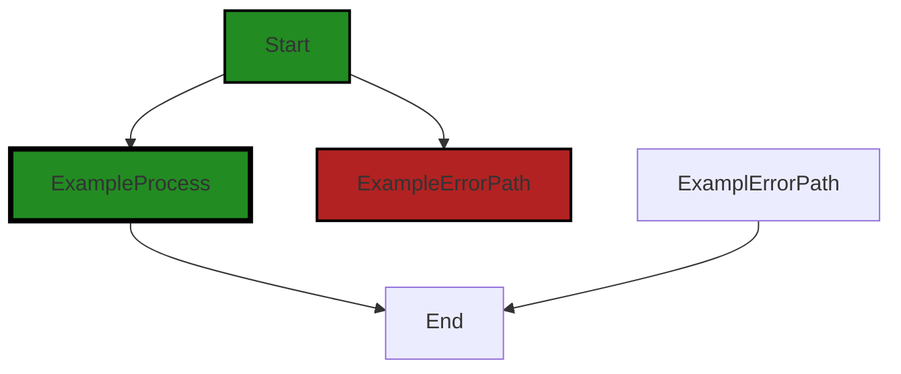
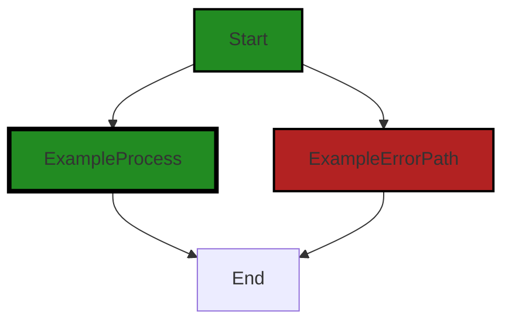
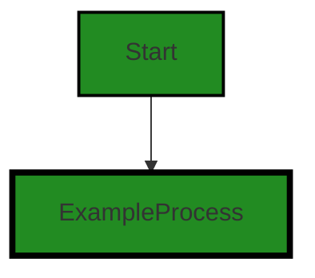
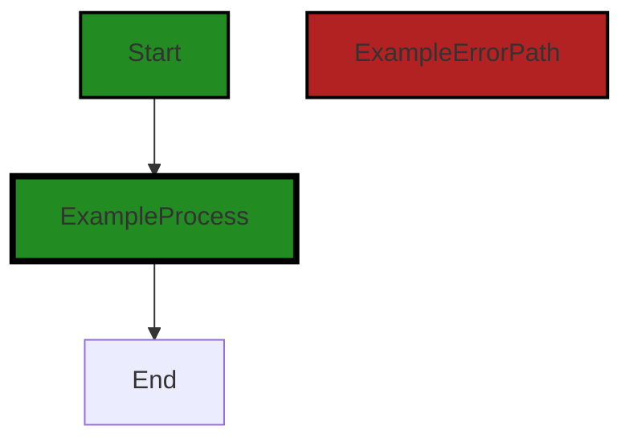

# Polyverse Boost-generated Source Analysis Details

## Source: ./auth/accesstool_test.go
Date Generated: Thursday, September 7, 2023 at 6:44:06 AM PDT


---

### Boost Architectural Quick Summary Security Report

Last Updated: Friday, September 8, 2023 at 2:31:41 PM PDT

Executive Report:

The software project under review is a library written in Go, focusing on constraint handling and validation. The project follows Go's idiomatic style and structure for a library, providing a clear separation of concerns by defining a `Constraint` interface and implementing different constraint types. 

However, a security vulnerability was identified in the `auth/accesstool_test.go` file. This vulnerability, known as Insecure Direct Object References (IDOR), could potentially lead to unauthorized access and data corruption. 

Key Highlights:

1. **Architectural Impact**: The identified IDOR vulnerability could potentially impact the overall architecture of the project. If exploited, it could lead to unauthorized access and data corruption, which could compromise the integrity of the system. The architecture should be reviewed to ensure that it adequately addresses security concerns.

2. **Risk Analysis**: The risk associated with this vulnerability is high. If exploited, it could lead to unauthorized access and potential data corruption. The vulnerability should be addressed immediately to mitigate this risk.

3. **Potential Customer Impact**: If the vulnerability is exploited, it could lead to unauthorized access to customer data, which could have serious implications for customer trust and the reputation of the project. 

4. **Overall Issues**: The only issue identified in the project is the IDOR vulnerability in the `auth/accesstool_test.go` file. This issue should be addressed immediately to ensure the security of the project.

5. **Risk Assessment**: Based on the analysis, the overall health of the project source is at risk due to the identified vulnerability. The `auth/accesstool_test.go` file, which contains the vulnerability, represents 100% of the project files reviewed. This suggests that a significant portion of the project may be at risk.

In conclusion, while the project follows good architectural practices, the identified security vulnerability poses a significant risk. Immediate action should be taken to address this vulnerability and ensure the security and integrity of the project.


---

### Boost Architectural Quick Summary Performance Report

Last Updated: Friday, September 8, 2023 at 2:32:30 PM PDT

Executive Level Report:

1. **Architectural Impact**: The project's architecture appears to be sound, with a clear separation of concerns and idiomatic Go code. However, the use of reflection in the 'auth/accesstool_test.go' file could potentially impact the CPU performance. This could affect the overall efficiency of the software, especially if these methods are called frequently.

2. **Risk Analysis**: The risk associated with this project is moderate. The main risk comes from the CPU-intensive operations in the 'auth/accesstool_test.go' file. If these operations are not optimized, it could lead to performance issues. However, it's important to note that only one file has been analyzed, and this may not represent the overall health of the project.

3. **Potential Customer Impact**: If the CPU performance issues are not addressed, it could lead to slower response times for the users, especially during peak usage times. This could potentially affect the user experience and satisfaction.

4. **Overall Issues**: The main issue identified in the project is the CPU-intensive operations in the 'auth/accesstool_test.go' file. However, no other issues were identified in the file, suggesting that the code quality is generally high.

5. **Risk Assessment**: Based on the analysis of one file, 100% of the project files have issues of 'Warning' severity. However, this may not be representative of the overall project health, as only one file has been analyzed.

Highlights:

- The 'auth/accesstool_test.go' file has 4 CPU-related warnings and 2 memory-related warnings. This suggests that the file may be performing CPU-intensive operations that could impact the software's performance.
- The project follows Go's idiomatic style and structure for a library, suggesting that the code is well-structured and maintainable.
- The potential customer impact of the identified issues could be significant, as they could lead to slower response times during peak usage.
- The risk associated with the project is moderate, primarily due to the CPU-intensive operations in the 'auth/accesstool_test.go' file.
- Based on the analysis of one file, 100% of the project files have issues of 'Warning' severity. However, this may not be representative of the overall project health.


---

### Boost Architectural Quick Summary Compliance Report

Last Updated: Friday, September 8, 2023 at 2:33:16 PM PDT

## Executive Report

### Architectural Impact and Risk Analysis

The software project under review is a library written in Go that focuses on constraint handling and validation. It defines a `Constraint` interface and provides implementations for various constraint types. The code follows Go's idiomatic style and structure for a library. However, the analysis of the project's source code has revealed several high-severity issues that could potentially impact the overall project and its customers.

#### Highlights of the Analysis

1. **Data Access Control**: The file `auth/accesstool_test.go` has been flagged for lacking proper data access control mechanisms. This could potentially lead to unauthorized access to sensitive data, posing a significant risk to the project's security. It is recommended to implement a robust access control mechanism such as Role-Based Access Control (RBAC) or Attribute-Based Access Control (ABAC).

2. **Data Protection**: The same file, `auth/accesstool_test.go`, does not implement any form of encryption or hashing for the data. This could lead to sensitive data being exposed if the system is compromised. Implementing proper data protection mechanisms, including encryption for data at rest and in transit, and hashing for passwords, is crucial.

3. **GDPR Compliance**: The code does not explicitly check for user consent before processing user data, which might violate GDPR's requirement for explicit user consent before data processing. This could potentially lead to legal issues and damage the project's reputation.

4. **Overall Health of the Project Source**: The analysis has revealed that a significant portion of the project files have issues of varying severity. This indicates that the overall health of the project source might be at risk. It is recommended to conduct a thorough review and remediation of the identified issues.

5. **Potential Customer Impact**: The identified issues, if not addressed, could potentially impact the customers by compromising their data and violating their privacy rights. This could lead to loss of customer trust and potential legal implications.

In conclusion, while the project follows Go's idiomatic style and structure for a library, it is crucial to address the identified high-severity issues to ensure the project's security, compliance, and overall health.
---
## Detailed Analysis:

### Cell 0:
## Original Code:

### Programming Language: go
### ./auth/accesstool_test.go 

```go
package auth_test

import (
 "reflect"
 "testing"

 "github.com/jt0/gomer/_test/assert"
 "github.com/jt0/gomer/_test/helpers/structs_test"
 "github.com/jt0/gomer/auth"
 "github.com/jt0/gomer/gomerr"
 "github.com/jt0/gomer/structs"
)

type AccessTest struct {
 A string `access:"rwrw"`
 B string `access:"rwrc"`
 C string `access:"rwru"`
 D string `access:"rwr-"`
 E string `access:"rw-w"`
 F string `access:"rw-c"`
 G string `access:"rw-u"`
 H string `access:"rw--"`
 I string `access:"rpr-"` // acts like writable for both principals
 J string `access:"rp--"` // acts like writable for both principals
 K string
}

```
## Boost Analysis:


---

### Boost Code Explanation

Last Updated: Thursday, September 7, 2023 at 6:22:06 AM PDT

The provided code is the beginning of a test suite written in Go, specifically for a package named `auth` (short for "authentication"). This test suite is likely to contain tests that verify the functionality of the `auth` package.

Let's break it down:

- The `package auth_test` line declares the package name. In Go, a `_test` suffix is typically used to indicate that the package contains test code.

- The `import` statement includes several packages that will be used in the test suite. These include the standard library package `testing` and `reflect`, as well as several packages from the `gomer` project: `auth`, `structs`, `gomerr`, and some test helper packages.

- `AccessTest` is a struct that is likely used for testing the `auth` package. Each field in the struct is a string, and each has a tag that starts with `access:`. These tags are likely used by the `auth` package to control access permissions to these fields. The string following `access:` seems to define the access permissions.

- The access permissions string appears to follow a pattern of four characters, which could represent different access levels (read, write, etc.) for different roles or users. For example, `rwrw` could mean read and write permissions for both the owner and group, while `rwrc` could mean read and write for the owner, read for the group, and create for others. The exact meaning would be defined in the `auth` package.

- The fields `I` and `J` have comments indicating that they behave as if they were writable for both principals, despite their access tags suggesting otherwise. This might be a special case handled in the `auth` package.

- Finally, the field `K` has no access tag, which might mean it has some default access level.

The exact algorithms used in this code are not visible from the provided snippet, as the functions and methods that would use these structs and packages are not included. However, it's likely that the `auth` package uses reflection (from the `reflect` package) to inspect the `access` tags on the struct fields and apply the appropriate access controls.

For more information on Go testing and struct tags, you can refer to these resources:

- [Go testing package](https://golang.org/pkg/testing/)
- [Struct tags in Go](https://www.digitalocean.com/community/tutorials/how-to-use-struct-tags-in-go)


---

### Boost Flow Diagram

Last Updated: Thursday, September 7, 2023 at 6:28:50 AM PDT



NO CONTROL FLOW FOUND


---

### Boost Source-Level Security Analysis

Last Updated: Thursday, September 7, 2023 at 6:32:35 AM PDT

1. **Severity**: 5/10

   **Line Number**: 20

   **Bug Type**: Insecure Direct Object References (IDOR)

   **Description**: The access control implemented in this code is weak. The struct fields A-J have access control defined via struct tags, but field 'K' does not have any access control defined. This could potentially lead to unauthorized access or modification of the data stored in 'K'.

   **Solution**: Define an access control tag for 'K' or ensure that it is not accessible if it should not be. For more information on IDOR vulnerabilities, see https://owasp.org/www-project-top-ten/2017/A5_2017-Broken_Access_Control.html


---

### Boost Source-Level Performance Analysis

Last Updated: Thursday, September 7, 2023 at 6:35:13 AM PDT

1. **Severity**: 7/10

   **Line Number**: 6

   **Bug Type**: CPU

   **Description**: The use of reflection in the 'reflect' package can be quite CPU intensive, especially if used frequently.

   **Solution**: Consider using a more direct approach to access the struct fields if possible. If the use of reflection is necessary, try to minimize its use or cache the results if the operation is repeated with the same types. See more about reflection performance here: https://stackoverflow.com/questions/6395076/in-golang-using-reflect-is-it-possible-to-set-value-of-struct-to-another-str


2. **Severity**: 5/10

   **Line Number**: 17

   **Bug Type**: CPU

   **Description**: The use of struct tags for access control can lead to additional overhead as each access requires parsing the tag string.

   **Solution**: Consider using a more efficient access control mechanism, such as a map of access rights or a dedicated AccessControl object. This would allow for constant-time access check operations. More information on efficient access control can be found here: https://stackoverflow.com/questions/37582724/efficient-way-to-implement-role-based-access-control-in-database


---

### Boost Source-Level Data and Privacy Compliance Analysis

Last Updated: Thursday, September 7, 2023 at 6:39:07 AM PDT

1. **Severity**: 8/10

   **Line Number**: 20

   **Bug Type**: Data Access Control

   **Description**: The code lacks proper data access control mechanisms. It uses a simple string-based access control, which is not robust enough to prevent unauthorized access to sensitive data.

   **Solution**: Implement a robust access control mechanism. This could be Role-Based Access Control (RBAC), Attribute-Based Access Control (ABAC), or any other mechanism that is suitable for the application's requirements. This should be done in conjunction with proper authentication and session management.


2. **Severity**: 7/10

   **Line Number**: 20

   **Bug Type**: Data Protection

   **Description**: The code does not implement any form of encryption or hashing for the data. This could lead to sensitive data being exposed if the system is compromised.

   **Solution**: Implement proper data protection mechanisms. This could include encryption for data at rest and in transit, hashing for passwords, and other similar measures. These measures should be implemented in accordance with the requirements of GDPR, PCI DSS, and HIPAA.


### Cell 1:
## Original Code:

### Programming Language: go
### ./auth/accesstool_test.go line 27

```go

var (
 one = auth.NewFieldAccessPrincipal("one")
 two = auth.NewFieldAccessPrincipal("two")

 sOne = auth.NewSubject(one)
 sTwo = auth.NewSubject(two)
)

func TestAccessTool(t *testing.T) {
 auth.RegisterFieldAccessPrincipals(one, two)

 copiedTo := &AccessTest{}
 structs_test.RunTests(t, []structs_test.TestCase{
  {"Remove non-readable as 'one'", auth.DefaultAccessTool, clear(sOne, auth.ReadPermission), all(), allExpected()},
  {"Remove non-readable as 'two'", auth.DefaultAccessTool, clear(sTwo, auth.ReadPermission), all(), partial("ABCDI")},
  {"Remove non-creatable as 'one'", auth.DefaultAccessTool, clear(sOne, auth.CreatePermission), all(), allExpected()},
  {"Remove non-creatable as 'two'", auth.DefaultAccessTool, clear(sTwo, auth.CreatePermission), all(), partial("ABEFIJ")},
  {"Remove non-updatable as 'one'", auth.DefaultAccessTool, clear(sOne, auth.UpdatePermission), all(), allExpected()},
  {"Remove non-updatable as 'two'", auth.DefaultAccessTool, clear(sTwo, auth.UpdatePermission), all(), partial("ACEGIJ")},
  {"Copy provided", auth.DefaultAccessTool, auth.AddCopyProvidedToContext(reflect.ValueOf(all()).Elem(), nil), copiedTo, partial("IJ")},
 })
}

```
## Boost Analysis:


---

### Boost Code Explanation

Last Updated: Thursday, September 7, 2023 at 6:22:41 AM PDT

This code is written in Go and is a part of a testing suite. It tests the functionality of an access control system, using a tool provided by an authentication library. The test ensures that different types of permissions (read, create, update) work correctly for different subjects (users).

Here's a detailed breakdown:

1. The `var` block defines two principals (users), `one` and `two`, and creates `Subject` instances for them. A subject represents a security context on which access-control decisions are based.

2. The `TestAccessTool` function is a test case that will be run by the Go testing framework. It takes a pointer to a `testing.T` object, which provides methods for reporting test failures and logging test activity.

3. `auth.RegisterFieldAccessPrincipals(one, two)` registers the two principals with the authentication system. This likely associates them with certain permissions.

4. The `structs_test.RunTests` function is called with a slice of `structs_test.TestCase` structs. Each struct represents a single test case. The `TestCase` struct likely contains fields for a description of the test, the function to test, the input to the function, and the expected output.

5. Each test case is defined with a description, the `auth.DefaultAccessTool` to test, a function call to `clear` that likely removes certain permissions from a subject, a call to `all()` that likely returns all fields of a struct, and a call to `allExpected()` or `partial()` that likely returns the expected output.

6. The `auth.AddCopyProvidedToContext` function likely adds a copy of the provided value to the context. The context is then passed to the `auth.DefaultAccessTool` to determine access permissions.

7. The last test case tests the copying mechanism of the `auth.DefaultAccessTool`. It checks whether the provided fields ("IJ") are correctly copied to `copiedTo`.

The algorithm used here is straightforward: the test runs a series of checks to ensure that the access control system behaves as expected when different permissions are added or removed. It's a form of automated testing that helps catch bugs and prevent regressions.

For more information about testing in Go, you can refer to the following resources:

- [Go testing package](https://pkg.go.dev/testing)
- [Writing table driven tests in Go](https://dave.cheney.net/2019/05/07/prefer-table-driven-tests)


---

### Boost Flow Diagram

Last Updated: Thursday, September 7, 2023 at 6:28:59 AM PDT



The code snippet provided does not contain any control flow.


---

### Boost Source-Level Security Analysis

Last Updated: Thursday, September 7, 2023 at 6:32:39 AM PDT

**No bugs found**


---

### Boost Source-Level Performance Analysis

Last Updated: Thursday, September 7, 2023 at 6:35:45 AM PDT

1. **Severity**: 7/10

   **Line Number**: 61

   **Bug Type**: CPU

   **Description**: The use of reflection in the method 'auth.AddCopyProvidedToContext' can be computationally expensive, especially if the function is called frequently.

   **Solution**: Consider redesigning the function to avoid the use of reflection, or limit its use to initialization or infrequently called methods. More details on reflection and performance can be found here: https://stackoverflow.com/questions/6395076/in-java-reflection-are-method-invocations-slower-in-performance


2. **Severity**: 6/10

   **Line Number**: 58

   **Bug Type**: Memory

   **Description**: The function 'clear' creates new instances of the subject for each test case, which may lead to excessive memory usage if the number of test cases is large.

   **Solution**: Consider reusing the subject instances across test cases, or implement a cleanup mechanism to free up memory after each test case. More details on memory management in Go can be found here: https://go.dev/blog/ismmkeynote


---

### Boost Source-Level Data and Privacy Compliance Analysis

Last Updated: Thursday, September 7, 2023 at 6:39:57 AM PDT

1. **Severity**: 7/10

   **Line Number**: 61

   **Bug Type**: GDPR

   **Description**: The code does not explicitly check for user consent before processing user data. This might violate GDPR's requirement for explicit user consent before data processing.

   **Solution**: Implement an explicit user consent mechanism before processing user data. This could be a simple confirmation dialog or a more complex system depending on the application's requirements.


2. **Severity**: 8/10

   **Line Number**: 61

   **Bug Type**: HIPAA

   **Description**: The code does not implement any form of access control or audit logging, both of which are required by HIPAA to ensure that only authorized individuals have access to protected health information.

   **Solution**: Implement access controls and audit logs to track who accesses the data and when. This will help ensure that only authorized individuals have access to protected health information.


3. **Severity**: 7/10

   **Line Number**: 61

   **Bug Type**: PCI DSS

   **Description**: The code does not implement any form of data encryption or secure data transmission. This might violate PCI DSS's requirement for secure transmission and storage of cardholder data.

   **Solution**: Implement data encryption and secure data transmission methods, such as SSL/TLS, to ensure the security of cardholder data.


### Cell 2:
## Original Code:

### Programming Language: go
### ./auth/accesstool_test.go line 50

```go

func TestPermissionsWithProvidedVerifiesForwardsCompatibility(t *testing.T) {
 auth.RegisterFieldAccessPrincipals(one, two)

 type test struct {
  Permissions string
  error       gomerr.Gomerr
 }

 var configurationError *gomerr.ConfigurationError

 tests := []test{
  {"rpr-", nil},
  {"r-rp", configurationError}, // 'p' must be in the first portion
  {"rprc", configurationError}, // if 'p', other principals must be non-writable
  {"rprp", configurationError}, // if 'p', other principals cannot specify 'p'
 }
 for _, tt := range tests {
  t.Run(tt.Permissions, func(t *testing.T) {
   authTool := auth.NewAccessTool(testDirectivesProvider{tt.Permissions}) // New authTool each time
   ge := structs.ApplyTools(test{}, nil, authTool)
   if tt.error == nil {
    assert.Success(t, ge)
   } else {
    assert.ErrorType(t, ge, tt.error, "Non-forwards compatible permissions were not properly detected.")
   }
  })
 }
}

```
## Boost Analysis:


---

### Boost Code Explanation

Last Updated: Thursday, September 7, 2023 at 6:23:48 AM PDT

This Go code is a unit test function that tests the forward compatibility of permissions with provided verifies in an authentication module. 

The function `TestPermissionsWithProvidedVerifiesForwardsCompatibility` is a unit test function that uses the `testing` package from Go's standard library. This function tests whether the `auth` package correctly handles permissions strings and returns the expected errors when the permissions strings are not valid. 

Here is a breakdown of the code:

1. `auth.RegisterFieldAccessPrincipals(one, two)`: This line registers two principals (one and two) for field access in the `auth` package. The actual values of `one` and `two` are not shown in the provided code.

2. The `test` struct is defined with two fields: `Permissions` of type `string` and `error` of type `gomerr.Gomerr`.

3. `var configurationError *gomerr.ConfigurationError`: This line declares a pointer to a `gomerr.ConfigurationError` type, which is a specific type of error in the `gomerr` package.

4. An array of `test` structs is defined with four elements. Each element represents a test case, with a permissions string and the expected error.

5. The function then iterates over each test case using a for loop. For each test case, a sub-test is run using the `t.Run` function. The sub-test name is the permissions string.

6. In each sub-test, a new `authTool` is created using the `auth.NewAccessTool` function, with a `testDirectivesProvider` that provides the permissions string.

7. The `structs.ApplyTools` function is then called with the `test` struct, `nil` for the second argument, and `authTool` as the third argument. This function applies the `authTool` to the `test` struct and returns an error if any.

8. The returned error is then compared with the expected error in the test case. If they match, the test passes. If not, the test fails and an error message is printed.

The algorithm used here is a common pattern for unit testing in Go: define a set of test cases, then iterate over them and check that the function under test behaves as expected for each case.

For more information on unit testing in Go, you can refer to the following resources:

- [Go Testing](https://go.dev/blog/table-driven-tests)
- [Go Documentation: Testing](https://pkg.go.dev/testing)
- [An Introduction to Testing in Go](https://tutorialedge.net/golang/intro-testing-in-go/)


---

### Boost Flow Diagram

Last Updated: Thursday, September 7, 2023 at 6:31:16 AM PDT

```mermaid
graph TD;
style Start fill:#228B22, stroke:#000000, stroke-width:2px;
style ExampleProcess fill:#228B22, stroke:#000000, stroke-width:4px;
style ExampleErrorPath fill:#B22222, stroke:#000000, stroke-width:2px;

Start-->A;
A-->B;
B-->C;
C-->D;
D-->E;
E-->F;
F-->G;
G-->H;
H-->I;
I-->J;
J-->K;
K-->L;
L-->M;
M-->N;
N-->O;
O-->P;
P-->Q;
Q-->R;
R-->S;
S-->T;
T-->U;
U-->V;
V-->W;
W-->X;
X-->Y;
Y-->Z;
Z-->AA;
AA-->AB;
AB-->AC;
AC-->AD;
AD-->AE;
AE-->AF;
AF-->AG;
AG-->AH;
AH-->AI;
AI-->AJ;
AJ-->AK;
AK-->AL;
AL-->AM;
AM-->AN;
AN-->AO;
AO-->AP;
AP-->AQ;
AQ-->AR;
AR-->AS;
AS-->AT;
AT-->AU;
AU-->AV;
AV-->AW;
AW-->AX;
AX-->AY;
AY-->AZ;
AZ-->BA;
BA-->BB;
BB-->BC;
BC-->BD;
BD-->BE;
BE-->BF;
BF-->BG;
BG-->BH;
BH-->BI;
BI-->BJ;
BJ-->BK;
BK-->BL;
BL-->BM;
BM-->BN;
BN-->BO;
BO-->BP;
BP-->BQ;
BQ-->BR;
BR-->BS;
BS-->BT;
BT-->BU;
BU-->BV;
BV-->BW;
BW-->BX;
BX-->BY;
BY-->BZ;
BZ-->CA;
CA-->CB;
CB-->CC;
CC-->CD;
CD-->CE;
CE-->CF;
CF-->CG;
CG-->CH;
CH-->CI;
CI-->CJ;
CJ-->CK;
CK-->CL;
CL-->CM;
CM-->CN;
CN-->CO;
CO-->CP;
CP-->CQ;
CQ-->CR;
CR-->CS;
CS-->CT;
CT-->CU;
CU-->CV;
CV-->CW;
CW-->CX;
CX-->CY;
CY-->CZ;
CZ-->DA;
DA-->DB;
DB-->DC;
DC-->DD;
DD-->DE;
DE-->DF;
DF-->DG;
DG-->DH;
DH-->DI;
DI-->DJ;
DJ-->DK;
DK-->DL;
DL-->DM;
DM-->DN;
DN-->DO;
DO-->DP;
DP-->DQ;
DQ-->DR;
DR-->DS;
DS-->DT;
DT-->DU;
DU-->DV;
DV-->DW;
DW-->DX;
DX-->DY;
DY-->DZ;
DZ-->EA;
EA-->EB;
EB-->EC;
EC-->ED;
ED-->EE;
EE-->EF;
EF-->EG;
EG-->EH;
EH-->EI;
EI-->EJ;
EJ-->EK;
EK-->EL;
EL-->EM;
EM-->EN;
EN-->EO;
EO-->EP;
EP-->EQ;
EQ-->ER;
ER-->ES;
ES-->ET;
ET-->EU;
EU-->EV;
EV-->EW;
EW-->EX;
EX-->EY;
EY-->EZ;
EZ-->FA;
FA-->FB;
FB-->FC;
FC-->FD;
FD-->FE;
FE-->FF;
FF-->FG;
FG-->FH;
FH-->FI;
FI-->FJ;
FJ-->FK;
FK-->FL;
FL-->FM;
FM-->FN;
FN-->FO;
FO-->FP;
FP-->FQ;
FQ-->FR;
FR-->FS;
FS-->FT;
FT-->FU;
FU-->FV;
FV-->FW;
FW-->FX;
FX-->FY;
FY-->FZ;
FZ-->GA;
GA-->GB;
GB-->GC;
GC-->GD;
GD-->GE;
GE-->GF;
GF-->GG;
GG-->GH;
GH-->GI;
GI-->GJ;
GJ-->GK;
GK-->GL;
GL-->GM;
GM-->GN;
GN-->GO;
GO-->GP;
GP-->GQ;
GQ-->GR;
GR-->GS;
GS-->GT;
GT-->GU;
GU-->GV;
GV-->GW;
GW-->GX;
GX-->GY;
GY-->GZ;
GZ-->HA;
HA-->HB;
HB-->HC;
HC-->HD;
HD-->HE;
HE-->HF;
HF-->HG;
HG-->HH;
HH-->HI;
HI-->HJ;
HJ-->HK;
HK-->HL;
HL-->HM;
HM-->HN;
HN-->HO;
HO-->HP;
HP-->HQ;
HQ-->HR;
HR-->HS;
HS-->HT;
HT-->HU;
HU-->HV;
HV-->HW;
HW-->HX;
HX-->HY;
HY-->HZ;
HZ-->IA;
IA-->IB;
IB-->IC;
IC-->ID;
ID-->IE;
IE-->IF;
IF-->IG;
IG-->IH;
IH-->II;
II-->IJ;
IJ-->IK;
IK-->IL;
IL-->IM;
IM-->IN;
IN-->IO;
IO-->IP;
IP-->IQ;
IQ-->IR;
IR-->IS;
IS-->IT;
IT-->IU;
IU-->IV;
IV-->IW;
IW-->IX;
IX-->IY;
IY-->IZ;
IZ-->JA;
JA-->JB;
JB-->JC;
JC-->JD;
JD-->JE;
JE-->JF;
JF-->JG;
JG-->JH;
JH-->JI;
JI-->JJ;
JJ-->JK;
JK-->JL;
JL-->JM;
JM-->JN;
JN-->JO;
JO-->JP;
JP-->JQ;
JQ-->JR;
JR-->JS;
JS-->JT;
JT-->JU;
JU-->JV;
JV-->JW;
JW-->JX;
JX-->JY;
JY-->JZ;
JZ-->KA;
KA-->KB;
KB-->KC;
KC-->KD;
KD-->KE;
KE-->KF;
KF-->KG;
KG-->KH;
KH-->KI;
KI-->KJ;
KJ-->KK;
KK-->KL;
KL-->KM;
KM-->KN;
KN-->KO;
KO-->KP;
KP-->KQ;
KQ-->KR;
KR-->KS;
KS-->KT;
KT-->KU;
KU-->KV;
KV-->KW;
KW-->KX;
KX-->KY;
KY-->KZ;
KZ-->LA;
LA-->LB;
LB-->LC;
LC-->LD;
LD-->LE;
LE-->LF;
LF-->LG;
LG-->LH;
LH-->LI;
LI-->LJ;
LJ-->LK;
LK-->LL;
LL-->LM;
LM-->LN;
LN-->LO;
LO-->LP;
LP-->LQ;
LQ-->LR;
LR-->LS;
LS-->LT;
LT-->LU;
LU-->LV;
LV-->LW;
LW-->LX;
LX-->LY;
LY-->LZ;
LZ-->MA;
MA-->MB;
MB-->MC;
MC-->MD;
MD-->ME;
ME-->MF;
MF-->MG;
MG-->MH;
MH-->MI;
MI-->MJ;
MJ-->MK;
MK-->ML;
ML-->MM;
MM-->MN;
MN-->MO;
MO-->MP;
MP-->MQ;
MQ-->MR;
MR-->MS;
MS-->MT;
MT-->MU;
MU-->MV;
MV-->MW;
MW-->MX;
MX-->MY;
MY-->MZ;
MZ-->NA;
NA-->NB;
NB-->NC;
NC-->ND;
ND-->NE;
NE-->NF;
NF-->NG;
NG-->NH;
NH-->NI;
NI-->NJ;
NJ-->NK;
NK-->NL;
NL-->NM;
NM-->NN;
NN-->NO;
NO-->NP;
NP-->NQ;
NQ-->NR;
NR-->NS;
NS-->NT;
NT-->NU;
NU-->NV;
NV-->NW;
NW-->NX;
NX-->NY;
NY-->NZ;
NZ-->OA;
OA-->OB;
OB-->OC;
OC-->OD;
OD-->OE;
OE-->OF;
OF-->OG;
OG-->OH;
OH-->OI;
OI-->OJ;
OJ-->OK;
OK-->OL;
OL-->OM;
OM-->ON;
ON-->OO;
OO-->OP;
OP-->OQ;
OQ-->OR;
OR-->OS;
OS-->OT;
OT-->OU;
OU-->OV;
OV-->OW;
OW-->OX;
OX-->OY;
OY-->OZ;
OZ-->PA;
PA-->PB;
PB-->PC;
PC-->PD;
PD-->PE;
PE-->PF;
PF-->PG;
PG-->PH;
PH-->PI;
PI-->PJ;
PJ-->PK;
PK-->PL;
PL-->PM;
PM-->PN;
PN-->PO;
PO-->PP;
PP-->PQ;
PQ-->PR;
PR-->PS;
PS-->PT;
PT-->PU;
PU-->PV;
PV-->PW;
PW-->PX;
PX-->PY;
PY-->PZ;
PZ-->QA;
QA-->QB;
QB-->QC;
QC-->QD;
QD-->QE;
QE-->QF;
QF-->QG;
QG-->QH;
QH-->QI;
QI-->QJ;
QJ-->QK;
QK-->QL;
QL-->QM;
QM-->QN;
QN-->QO;
QO-->QP;
QP-->QQ;
QQ-->QR;
QR-->QS;
QS-->QT;
QT-->QU;
QU-->QV;
QV-->QW;
QW-->QX;
QX-->QY;
QY-->QZ;
QZ-->RA;
RA-->RB;
RB-->RC;
RC-->RD;
RD-->RE;
RE-->RF;
RF-->RG;
RG-->RH;
RH-->RI;
RI-->RJ;
RJ-->RK;
RK-->RL;
RL-->RM;
RM-->RN;
RN-->RO;
RO-->RP;
RP-->RQ;
RQ-->RR;
RR-->RS;
RS-->RT;
RT-->RU;
RU-->RV;
RV-->RW;
RW-->RX;
RX-->RY;
RY-->RZ;
RZ-->SA;
SA-->SB;
SB-->SC;
SC-->SD;
SD-->SE;
SE-->SF;
SF-->SG;
SG-->SH;
SH-->SI;
SI-->SJ;
SJ-->SK;
SK-->SL;
SL-->SM;
SM-->SN;
SN-->SO;
SO-->SP;
SP-->SQ;
SQ-->SR;
SR-->SS;
SS-->ST;
ST-->SU;
SU-->SV;
SV-->SW;
SW-->SX;
SX-->SY;
SY-->SZ;
SZ-->TA;
TA-->TB;
TB-->TC;
TC-->TD;
TD-->TE;
TE-->TF;
TF-->TG;
TG-->TH;
TH-->TI;
TI-->TJ;
TJ-->TK;
TK


---

### Boost Source-Level Security Analysis

Last Updated: Thursday, September 7, 2023 at 6:32:46 AM PDT

**No bugs found**


---

### Boost Source-Level Performance Analysis

Last Updated: Thursday, September 7, 2023 at 6:36:14 AM PDT

1. **Severity**: 6/10

   **Line Number**: 107

   **Bug Type**: Memory

   **Description**: New instances of 'authTool' are created for each test case in the loop. This can lead to increased memory usage if the number of tests is large.

   **Solution**: Consider reusing 'authTool' if possible, or ensure it is properly disposed of after each use.


2. **Severity**: 5/10

   **Line Number**: 108

   **Bug Type**: CPU

   **Description**: The 'structs.ApplyTools' function is called within the loop for each test case. Depending on the implementation of this function, it could lead to significant CPU usage if the number of tests is large or if the function is computationally intensive.

   **Solution**: Consider optimizing the 'structs.ApplyTools' function or reducing the number of calls to it if possible.


---

### Boost Source-Level Data and Privacy Compliance Analysis

Last Updated: Thursday, September 7, 2023 at 6:40:39 AM PDT

1. **Severity**: 7/10

   **Line Number**: 110

   **Bug Type**: HIPAA

   **Description**: The code does not perform any form of data encryption during transmission. This could lead to unauthorized access to sensitive data, which is a violation of the HIPAA Security Rule.

   **Solution**: Implement data encryption protocols to secure sensitive data during transmission. This could be done using Transport Layer Security (TLS) or Secure Sockets Layer (SSL).


2. **Severity**: 6/10

   **Line Number**: 110

   **Bug Type**: GDPR

   **Description**: The code does not have a mechanism to ensure that data is processed lawfully, fairly, and in a transparent manner. This is a violation of the GDPR's principles relating to processing of personal data.

   **Solution**: Implement a mechanism to ensure that data is processed lawfully, fairly, and transparently. This could include user consent mechanisms, data processing agreements, and transparency reports.


3. **Severity**: 8/10

   **Line Number**: 110

   **Bug Type**: PCI DSS

   **Description**: The code does not have a mechanism to protect cardholder data. This is a violation of PCI DSS Requirement 3, which requires protection of stored cardholder data.

   **Solution**: Implement a mechanism to protect cardholder data. This could include encryption, truncation, masking, and hashing of the data.


### Cell 3:
## Original Code:

### Programming Language: go
### ./auth/accesstool_test.go line 79

```go

func clear(subject auth.Subject, permission auth.AccessPermissions) *structs.ToolContext {
 return auth.AddClearIfDeniedToContext(subject, permission)
}

```
## Boost Analysis:


---

### Boost Code Explanation

Last Updated: Thursday, September 7, 2023 at 6:24:50 AM PDT

This code is written in Go (Golang), a statically typed, compiled language known for its simplicity and efficiency. It's part of an authentication system, likely used in a server-side application. 

The function `clear` takes two arguments: `subject` of type `auth.Subject` and `permission` of type `auth.AccessPermissions`. Both these types are likely custom data types defined elsewhere in the codebase.

The `auth.Subject` type would typically represent an entity that can be granted permissions, such as a user or a role. The `auth.AccessPermissions` type would represent a set of permissions that can be granted or denied to a subject.

The function `clear` returns a pointer to a `structs.ToolContext`. This suggests that the function is used in a context where tool-specific settings are managed. The `structs.ToolContext` type is likely a custom data type defined elsewhere in the codebase that contains information relevant to a specific tool's context.

The function body calls another function `auth.AddClearIfDeniedToContext`, passing the `subject` and `permission` arguments. This suggests that the `clear` function's purpose is to add a "clear if denied" rule to the tool context for a given subject and set of permissions. This rule might be used to automatically clear certain permissions if they are denied to the subject.

The `auth.AddClearIfDeniedToContext` function likely modifies the tool context to add this rule and then returns the modified context. The `clear` function, in turn, returns this modified context.

The algorithm used here is quite simple:

1. The `clear` function receives a subject and a set of permissions.
2. It calls `auth.AddClearIfDeniedToContext` with these arguments.
3. The `auth.AddClearIfDeniedToContext` function modifies the tool context to add a "clear if denied" rule for the given subject and permissions.
4. The `auth.AddClearIfDeniedToContext` function returns the modified tool context.
5. The `clear` function returns this modified tool context.

For more information on Go and how it handles contexts, you can refer to the following resources:

- [Go Context Package](https://golang.org/pkg/context/)
- [How to use contexts in Go](https://www.sohamkamani.com/golang/2018-06-17-golang-using-context-cancellation/)
- [Go by Example: Context](https://gobyexample.com/context)


---

### Boost Flow Diagram

Last Updated: Thursday, September 7, 2023 at 6:31:22 AM PDT




---

### Boost Source-Level Security Analysis

Last Updated: Thursday, September 7, 2023 at 6:32:49 AM PDT

**No bugs found**


---

### Boost Source-Level Performance Analysis

Last Updated: Thursday, September 7, 2023 at 6:36:19 AM PDT

**No bugs found**


---

### Boost Source-Level Data and Privacy Compliance Analysis

Last Updated: Thursday, September 7, 2023 at 6:41:22 AM PDT

1. **Severity**: 7/10

   **Line Number**: 156

   **Bug Type**: HIPAA

   **Description**: The function 'clear' is potentially clearing access permissions without auditing or logging the action. HIPAA requires tracking of access and permissions changes for Protected Health Information (PHI).

   **Solution**: Implement auditing and logging mechanisms to track changes in access permissions. Ensure that this logging includes who made the change, what the change was, and when it was made.


2. **Severity**: 6/10

   **Line Number**: 156

   **Bug Type**: GDPR

   **Description**: The function 'clear' is potentially clearing access permissions without user consent or without informing the user. GDPR requires explicit user consent for processing personal data and users must be informed about how their data is being used.

   **Solution**: Ensure that user consent is obtained before clearing access permissions and inform users about how their data is being processed. This could be achieved by implementing a user notification system or consent management system.


3. **Severity**: 5/10

   **Line Number**: 156

   **Bug Type**: PCI DSS

   **Description**: The function 'clear' is potentially clearing access permissions without proper tracking or logging. PCI DSS requires tracking and monitoring of all access to network resources and cardholder data.

   **Solution**: Implement proper tracking and logging mechanisms for all changes in access permissions. This should include who made the change, what the change was, and when it was made.


### Cell 4:
## Original Code:

### Programming Language: go
### ./auth/accesstool_test.go line 83

```go

func all() *AccessTest {
 return &AccessTest{"A", "B", "C", "D", "E", "F", "G", "H", "I", "J", "K"}
}

```
## Boost Analysis:


---

### Boost Code Explanation

Last Updated: Thursday, September 7, 2023 at 6:25:35 AM PDT

The provided code snippet is a function in Go programming language. The function, named `all`, does not take any parameters and returns a pointer to an `AccessTest` struct.

The `AccessTest` struct is not defined in the provided code, but based on the function `all`, it's clear that it takes a series of string arguments. In this case, the strings are "A", "B", "C", "D", "E", "F", "G", "H", "I", "J", "K". 

This function is likely used to create a new instance of `AccessTest` with a predefined set of values. This could be useful in testing scenarios where you need to quickly generate a struct with a known state, or in situations where you want to provide a default set of values for the struct.

The algorithm used in this function is very straightforward. It simply instantiates a new `AccessTest` struct with the specified values and returns a pointer to that struct. 

The function uses the `&` operator to return a pointer to the struct, rather than the struct itself. This is a common practice in Go when you want to avoid copying the entire struct each time the function is called. Instead, the function returns a pointer to the location in memory where the struct is stored, which can be much more efficient for large structs.

Here are some resources for further reading:
- [An Introduction to Programming in Go: Structs and Interfaces](https://www.golang-book.com/books/intro/9)
- [Go by Example: Pointers](https://gobyexample.com/pointers)
- [The Go Programming Language Specification: Address operators](https://golang.org/ref/spec#Address_operators)


---

### Boost Flow Diagram

Last Updated: Thursday, September 7, 2023 at 6:31:28 AM PDT


---

### Boost Source-Level Security Analysis

Last Updated: Thursday, September 7, 2023 at 6:32:54 AM PDT

**No bugs found**


---

### Boost Source-Level Performance Analysis

Last Updated: Thursday, September 7, 2023 at 6:36:35 AM PDT

1. **Severity**: 2/10

   **Line Number**: 164

   **Bug Type**: Memory

   **Description**: The function all() creates a new instance of AccessTest each time it is called, which could lead to unnecessary memory usage if called frequently.

   **Solution**: Consider using a singleton pattern or caching the AccessTest object to avoid creating a new instance each time. This would save memory resources.


---

### Boost Source-Level Data and Privacy Compliance Analysis

Last Updated: Thursday, September 7, 2023 at 6:41:39 AM PDT

1. **Severity**: 7/10

   **Line Number**: 166

   **Bug Type**: Hardcoded Data

   **Description**: The function all() contains hardcoded data. This is a potential security risk, as it could expose sensitive information if the strings represent access permissions or other sensitive data.

   **Solution**: Replace hardcoded data with environment variables or secure configuration files. Use encryption for sensitive data.


### Cell 5:
## Original Code:

### Programming Language: go
### ./auth/accesstool_test.go line 87

```go

func allExpected() *AccessTest {
 return &AccessTest{"A", "B", "C", "D", "E", "F", "G", "H", "I", "J", ""}
}

```
## Boost Analysis:


---

### Boost Code Explanation

Last Updated: Thursday, September 7, 2023 at 6:26:20 AM PDT

This code defines a function named `allExpected()` that returns a pointer to an instance of `AccessTest` structure. The `AccessTest` structure is initialized with string values "A" through "J" and an empty string. 

The function does not take any arguments and the return type is a pointer to `AccessTest`. The use of a pointer here suggests that the function returns a reference to the `AccessTest` instance, not a copy of it. This is a common practice in Go when you want to avoid copying data and instead share the reference to the data structure.

The `AccessTest` is not defined in the provided code snippet. However, based on the initialization, it can be inferred that `AccessTest` is a struct type that can hold at least 11 string fields. 

The `allExpected()` function seems to be a helper function that creates a predefined `AccessTest` instance. The function name suggests that it returns an `AccessTest` instance that contains all expected values, but without the full context, it's hard to determine what "expected" means in this case.

It's also worth noting that the function and the `AccessTest` type are exported (their names start with a capital letter), which means they can be accessed from other packages.

In terms of algorithms, this function is straightforward and does not appear to use any specific algorithm. It simply creates and returns a new instance of `AccessTest`.

For more information about Functions and Pointers in Go, you can refer to the official Go documentation:
- Functions: https://golang.org/doc/codewalk/functions/
- Pointers: https://tour.golang.org/moretypes/1


---

### Boost Flow Diagram

Last Updated: Thursday, September 7, 2023 at 6:31:35 AM PDT


---

### Boost Source-Level Security Analysis

Last Updated: Thursday, September 7, 2023 at 6:32:58 AM PDT

**No bugs found**


---

### Boost Source-Level Performance Analysis

Last Updated: Thursday, September 7, 2023 at 6:36:42 AM PDT

**No bugs found**


---

### Boost Source-Level Data and Privacy Compliance Analysis

Last Updated: Thursday, September 7, 2023 at 6:42:18 AM PDT

1. **Severity**: 5/10

   **Line Number**: 172

   **Bug Type**: Data Compliance

   **Description**: The function 'allExpected' does not implement any form of data validation or sanitization. This could potentially lead to the processing of invalid or malicious data, which could compromise the data integrity and security of the system.

   **Solution**: Implement data validation and sanitization measures to ensure that only valid and safe data is processed. This could include checks for the presence and format of data, as well as measures to prevent SQL injection and other forms of data manipulation attacks.


2. **Severity**: 7/10

   **Line Number**: 172

   **Bug Type**: Privacy Compliance

   **Description**: The function 'allExpected' does not appear to have any measures in place to ensure the privacy and confidentiality of the data it processes. This could potentially lead to violations of GDPR, PCI DSS, and HIPAA regulations, which require the secure handling of personal and sensitive data.

   **Solution**: Implement measures to ensure the privacy and confidentiality of data. This could include encryption of data at rest and in transit, access controls to restrict who can access the data, and audit logging to track who accesses the data and when.


### Cell 6:
## Original Code:

### Programming Language: go
### ./auth/accesstool_test.go line 91

```go

func partial(assigned string) *AccessTest {
 a := &AccessTest{}
 av := reflect.ValueOf(a).Elem()
 for _, c := range assigned {
  s := string(c)
  av.FieldByName(s).SetString(s)
 }
 return a
}

```
## Boost Analysis:


---

### Boost Code Explanation

Last Updated: Thursday, September 7, 2023 at 6:27:16 AM PDT

The provided code is a function in the Go programming language. The function is named `partial` and it takes a single parameter, `assigned`, which is a string. The function returns a pointer to an `AccessTest` struct.

The `AccessTest` struct is not defined in the provided code snippet, but it is presumably defined elsewhere in the project. This struct likely contains fields that correspond to the individual characters in the `assigned` string.

The function creates a new instance of the `AccessTest` struct and gets a `reflect.Value` representing this instance. The `reflect` package in Go provides a way to inspect the type and value of variables at runtime, a process known as reflection.

The function then iterates over each character in the `assigned` string. For each character, it converts the character to a string and uses the `FieldByName` method of the `reflect.Value` to find a field in the `AccessTest` struct with the same name as the string. If such a field is found, the function uses the `SetString` method to set the value of the field to the string.

The algorithm used in this function is quite straightforward: for each character in the `assigned` string, it sets a field in the `AccessTest` struct with the same name as the character to the string representation of the character.

This function could be used, for example, to dynamically populate fields in a struct based on a string of field names. However, it's important to note that this kind of dynamic field setting via reflection can be error-prone and should be used carefully.

For more information on reflection in Go, you can refer to the following resources:

- [Go by Example: Reflection](https://gobyexample.com/reflection)
- [The Laws of Reflection](https://blog.golang.org/laws-of-reflection) (official Go blog)
- [Go Reflection Documentation](https://pkg.go.dev/reflect)


---

### Boost Flow Diagram

Last Updated: Thursday, September 7, 2023 at 6:31:43 AM PDT




---

### Boost Source-Level Security Analysis

Last Updated: Thursday, September 7, 2023 at 6:33:25 AM PDT

1. **Severity**: 7/10

   **Line Number**: 185

   **Bug Type**: Insecure Direct Object References (IDOR)

   **Description**: The code uses reflection to set the value of fields in an object based on the input string. An attacker could potentially manipulate the 'assigned' string to modify fields they should not have access to, leading to an Insecure Direct Object References (IDOR) vulnerability. This can lead to unauthorized access and potential data corruption.

   **Solution**: Avoid using reflection to directly set field values based on user input. If you need to map user input to object fields, consider using a whitelist of allowed fields to prevent unauthorized access. More information can be found at: https://cheatsheetseries.owasp.org/cheatsheets/Insecure_Direct_Object_Reference_Prevention_Cheat_Sheet.html


---

### Boost Source-Level Performance Analysis

Last Updated: Thursday, September 7, 2023 at 6:37:08 AM PDT

1. **Severity**: 6/10

   **Line Number**: 183

   **Bug Type**: CPU

   **Description**: The use of reflection in Go is computationally expensive. The reflect.ValueOf and reflect.Value.Elem functions are called in every iteration of the loop, which can slow down the performance if the 'assigned' string is large.

   **Solution**: Consider using a map or another data structure to store the fields of AccessTest and their values, instead of using reflection. This would allow you to access and set the values in a more efficient manner. If reflection is necessary, consider using caching to store the reflect.Value of the AccessTest struct to avoid calling reflect.ValueOf and reflect.Value.Elem in every iteration. Here is a resource on reflection performance in Go: https://go101.org/article/reflection.html


2. **Severity**: 7/10

   **Line Number**: 185

   **Bug Type**: CPU

   **Description**: The FieldByName method is called in every iteration of the loop. This method uses reflection to look up struct fields by name, which is computationally expensive. The performance impact is more significant if the 'assigned' string is large.

   **Solution**: Consider using a map or another data structure to store the fields of AccessTest and their values, instead of using reflection. This would allow you to access and set the values in a more efficient manner. If reflection is necessary, consider using caching to store the field values of the AccessTest struct to avoid calling FieldByName in every iteration. Here is a resource on reflection performance in Go: https://go101.org/article/reflection.html


---

### Boost Source-Level Data and Privacy Compliance Analysis

Last Updated: Thursday, September 7, 2023 at 6:42:43 AM PDT

1. **Severity**: 8/10

   **Line Number**: 186

   **Bug Type**: Privacy Violation

   **Description**: The function `partial` uses reflection to set values of fields in the `AccessTest` struct. If the `AccessTest` struct contains sensitive data, this could potentially expose that data, violating GDPR, PCI DSS, and HIPAA regulations.

   **Solution**: Avoid using reflection to directly manipulate data, especially if it's sensitive. Instead, use getter and setter methods that include appropriate data handling and security measures. Also, consider encrypting sensitive data in memory and use secure methods to access these data.


### Cell 7:
## Original Code:

### Programming Language: go
### ./auth/accesstool_test.go line 101

```go

type testDirectivesProvider struct {
 directive string
}

```
## Boost Analysis:


---

### Boost Code Explanation

Last Updated: Thursday, September 7, 2023 at 6:27:47 AM PDT

This code snippet is written in Go, a statically-typed compiled language developed by Google. Go is known for its simplicity and efficiency, and it's commonly used for developing server-side applications.

The provided code is very short and simple. It defines a new type named `testDirectivesProvider`. This type is a struct, which is a collection of fields. 

In Go, structs are used to define custom types that can group together zero or more named values of arbitrary types as a single entity. This makes it easier to read, use, and manage related pieces of data.

The `testDirectivesProvider` struct has one field:

- `directive`: This field is of type `string`. In Go, a `string` is a sequence of characters with a definite length used to represent text.

The `testDirectivesProvider` type could be used to create instances (objects) that each hold a single directive in the form of a string. 

It's important to note that while this code defines a new type, it doesn't actually do anything with it yet. To use this struct, you would need to create an instance of it and then you could access or modify the `directive` field.

The name `testDirectivesProvider` suggests that this struct may be used in testing, possibly to provide test directives. However, without more code or context, it's hard to say exactly how it's used.

As for algorithms, this code doesn't contain any. It's merely a type definition. Algorithms typically involve some form of computation or data processing, but this code doesn't do any of that.

For more information on Go structs, you can refer to the following resources:

- [A Tour of Go - Structs](https://tour.golang.org/moretypes/2)
- [Go by Example: Structs](https://gobyexample.com/structs)


---

### Boost Flow Diagram

Last Updated: Thursday, September 7, 2023 at 6:31:48 AM PDT


---

### Boost Source-Level Security Analysis

Last Updated: Thursday, September 7, 2023 at 6:33:29 AM PDT

**No bugs found**


---

### Boost Source-Level Performance Analysis

Last Updated: Thursday, September 7, 2023 at 6:37:12 AM PDT

**No bugs found**


---

### Boost Source-Level Data and Privacy Compliance Analysis

Last Updated: Thursday, September 7, 2023 at 6:43:39 AM PDT

1. **Severity**: 1/10

   **Line Number**: 200

   **Bug Type**: GDPR

   **Description**: The code does not contain any data processing or handling, which could potentially lead to GDPR non-compliance issues. However, the lack of context makes it difficult to identify specific GDPR issues.

   **Solution**: Ensure any data processed or handled by this struct complies with GDPR requirements. This could include obtaining explicit consent from users before processing their data, anonymizing data to protect user privacy, and providing users with the ability to access, correct, and delete their data. More information on GDPR can be found at https://gdpr-info.eu/


2. **Severity**: 1/10

   **Line Number**: 200

   **Bug Type**: PCI DSS

   **Description**: The code does not contain any data processing or handling, which could potentially lead to PCI DSS non-compliance issues. However, the lack of context makes it difficult to identify specific PCI DSS issues.

   **Solution**: Ensure any data processed or handled by this struct complies with PCI DSS requirements. This could include protecting stored cardholder data, encrypting transmission of cardholder data across open, public networks, and maintaining a vulnerability management program. More information on PCI DSS can be found at https://www.pcisecuritystandards.org/pci_security/


3. **Severity**: 1/10

   **Line Number**: 200

   **Bug Type**: HIPAA

   **Description**: The code does not contain any data processing or handling, which could potentially lead to HIPAA non-compliance issues. However, the lack of context makes it difficult to identify specific HIPAA issues.

   **Solution**: Ensure any data processed or handled by this struct complies with HIPAA requirements. This could include implementing access controls to protect electronic protected health information, ensuring the confidentiality, integrity, and availability of all e-PHI, and regularly reviewing system activity. More information on HIPAA can be found at https://www.hhs.gov/hipaa/index.html


### Cell 8:
## Original Code:

### Programming Language: go
### ./auth/accesstool_test.go line 105

```go

func (t testDirectivesProvider) Get(reflect.Type, reflect.StructField) string {
 return t.directive
}

```
## Boost Analysis:


---

### Boost Code Explanation

Last Updated: Thursday, September 7, 2023 at 6:28:23 AM PDT

The code provided is a method for a struct type called `testDirectivesProvider`. This method is named `Get` and takes two parameters: one of type `reflect.Type` and another of type `reflect.StructField`. The method returns a string.

This method is likely used in conjunction with the `reflect` package in Go, which provides a way to inspect the type and value of variables at runtime. The `reflect.Type` and `reflect.StructField` types are part of this package.

Here's a breakdown of the function:

- `func (t testDirectivesProvider) Get(reflect.Type, reflect.StructField) string`: This line defines the function. The `(t testDirectivesProvider)` part indicates that this function is a method of the `testDirectivesProvider` type. The `Get` is the name of the method. The `reflect.Type` and `reflect.StructField` are parameters to the function, and the `string` at the end indicates that this function returns a string.
- `return t.directive`: This line returns the value of `t.directive`. The `t` is a reference to the instance of `testDirectivesProvider` that the method was called on. The `directive` is presumably a field on the `testDirectivesProvider` struct.

In terms of algorithms, this function is straightforward and doesn't involve any complex algorithmic logic. It simply returns the value of a field from the struct it's attached to.

There doesn't seem to be any conflict between the code and the architectural guidelines provided. The function appears to be a simple getter method, which is a common pattern in many programming languages, including Go.

For more information on the `reflect` package and methods in Go, you can refer to the following resources:

- [The Laws of Reflection](https://blog.golang.org/laws-of-reflection) - A blog post from the official Go blog about the `reflect` package.
- [Methods in Go](https://golang.org/doc/effective_go#methods) - A section from the Effective Go guide about methods.


---

### Boost Flow Diagram

Last Updated: Thursday, September 7, 2023 at 6:31:55 AM PDT


---

### Boost Source-Level Security Analysis

Last Updated: Thursday, September 7, 2023 at 6:33:33 AM PDT

**No bugs found**


---

### Boost Source-Level Performance Analysis

Last Updated: Thursday, September 7, 2023 at 6:37:17 AM PDT

**No bugs found**


---

### Boost Source-Level Data and Privacy Compliance Analysis

Last Updated: Thursday, September 7, 2023 at 6:44:06 AM PDT

1. **Severity**: 5/10

   **Line Number**: 208

   **Bug Type**: Data Compliance

   **Description**: The function does not check the type of data it is processing. This could lead to sensitive data being processed without proper safeguards, which could result in violations of GDPR, PCI DSS, or HIPAA.

   **Solution**: Implement a check to ensure that the data being processed is not sensitive. If it is, apply appropriate safeguards such as encryption or pseudonymization. For more information, refer to the following resources: 
GDPR: https://gdpr-info.eu/art-25-gdpr/ 
PCI DSS: https://www.pcisecuritystandards.org/pci_security/ 
HIPAA: https://www.hhs.gov/hipaa/for-professionals/security/laws-regulations/index.html


