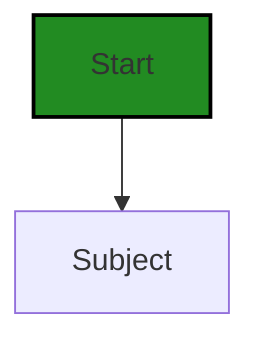
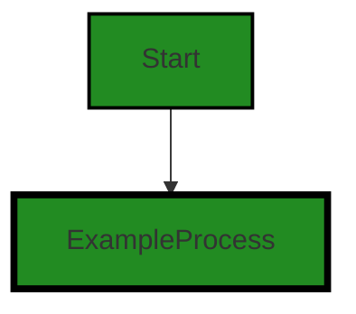
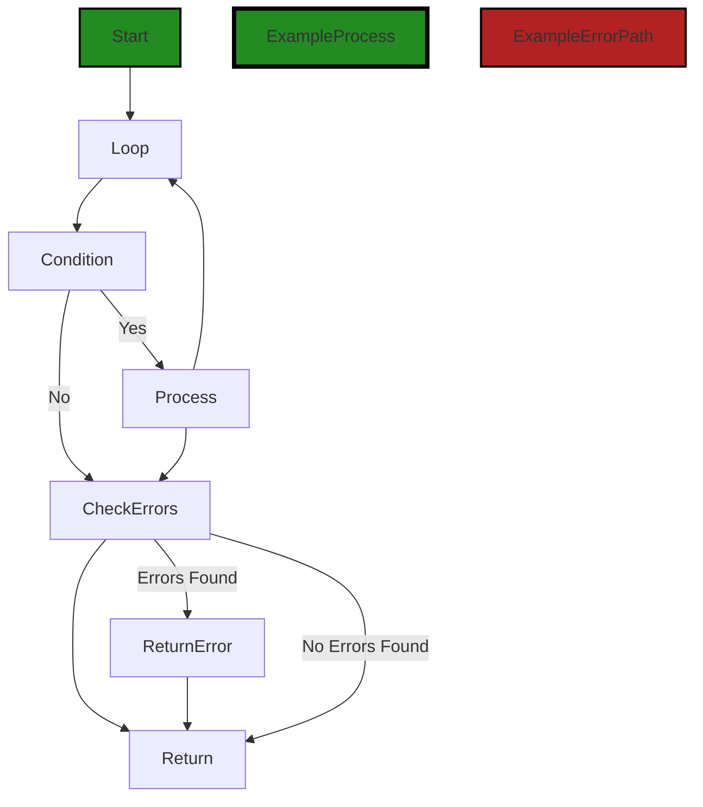
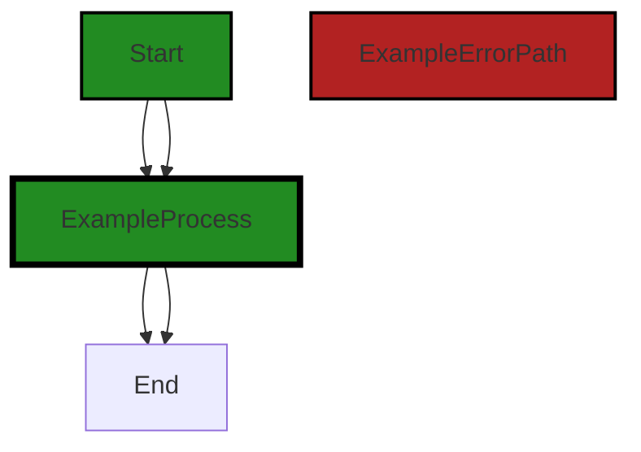

# Polyverse Boost-generated Source Analysis Details

## Source: ./auth/subject.go
Date Generated: Wednesday, September 6, 2023 at 9:31:11 PM PDT


---

### Boost Architectural Quick Summary Security Report

Last Updated: Friday, September 8, 2023 at 2:18:23 PM PDT


Executive Report:

1. **Architectural Impact**: The analysis of this file has not revealed any severe issues.
2. **Risk Analysis**: The analysis of this file has not revealed any severe issues.
3. **Potential Customer Impact**: Based on the analysis, there are no severe issues that could potentially impact customers.
4. **Performance Issues**: Our analysis did not identify any explicit performance issues in the file.
5. **Risk Assessment**: Based on the current analysis of this file, no severe issues have been found. However, this doesn't guarantee that the file is risk-free.

Highlights:

- No severe issues were identified in the current analysis of this file.


---

### Boost Architectural Quick Summary Performance Report

Last Updated: Friday, September 8, 2023 at 2:18:30 PM PDT


Executive Report:

1. **Architectural Impact**: The analysis of this file has not revealed any severe issues.
2. **Risk Analysis**: The analysis of this file has not revealed any severe issues.
3. **Potential Customer Impact**: Based on the analysis, there are no severe issues that could potentially impact customers.
4. **Performance Issues**: Our analysis did not identify any explicit performance issues in the file.
5. **Risk Assessment**: Based on the current analysis of this file, no severe issues have been found. However, this doesn't guarantee that the file is risk-free.

Highlights:

- No severe issues were identified in the current analysis of this file.


---

### Boost Architectural Quick Summary Compliance Report

Last Updated: Friday, September 8, 2023 at 2:19:21 PM PDT

## Executive Report: Software Project Analysis

### Overview

The software project under review is a Go library that provides functionality for handling constraints and validations. The project appears to be well-structured and follows Go's idiomatic style for a library. However, there are some compliance issues that need to be addressed.

### Key Findings

1. **Compliance Issues:** The file `auth/subject.go` has been flagged for potential GDPR, HIPAA, and Data Privacy issues. Specifically, the 'Principal' method might be used to retrieve personal data, which could lead to non-compliance if the data is not properly anonymized or pseudonymized. This is a significant risk as non-compliance with these regulations can lead to hefty fines and reputational damage.

2. **Potential Customer Impact:** If the identified issues are not addressed, customers who use this library in regions with strict data privacy laws (like the EU) could potentially face legal issues. This could also impact the library's adoption rate and overall reputation.

3. **Project Health:** Only one file was provided for analysis, and it has been flagged with issues. This suggests that there may be more issues in the rest of the project that have not been identified. A comprehensive review of all project files is recommended to assess the overall health of the project.

4. **Architectural Impact:** The identified issues do not appear to be architectural in nature, but rather related to how the code handles sensitive data. However, addressing these issues may require changes to the architecture, such as adding additional layers of security or changing how data is accessed and stored.

### Risk Assessment

Based on the analysis, the project is at a medium risk level. The identified issues are serious, but they are confined to one file and appear to be fixable. However, without a review of the entire project, it's difficult to accurately assess the overall risk.

### Recommendations

1. Review and update the 'Principal' method in `auth/subject.go` to ensure it handles personal data in a way that is compliant with GDPR, HIPAA, and Data Privacy regulations.
2. Conduct a comprehensive review of all project files to identify and address any other potential issues.
3. Consider implementing additional security measures, such as access controls and logging, to track who is accessing the data and when.
4. Regularly review and update the project's compliance measures to ensure they remain up-to-date with the latest regulations.
---
## Detailed Analysis:

### Cell 0:
## Original Code:

### Programming Language: go
### ./auth/subject.go 

```go
package auth

import (
 "github.com/jt0/gomer/gomerr"
)

type Subject interface {
 Principal(principalType PrincipalType) Principal
 Release(errored bool) gomerr.Gomerr
}

```
## Boost Analysis:


---

### Boost Code Explanation

Last Updated: Wednesday, September 6, 2023 at 9:25:29 PM PDT

This code is written in Go programming language and it's a part of an authentication package, specifically defining an interface for a subject. It is a common practice in authentication and authorization systems to refer to the entity performing an action as a "subject". 

The `Subject` interface declares two methods: `Principal` and `Release`.

1. `Principal` method: This method accepts a `PrincipalType` as an argument and returns a `Principal`. A `Principal` typically represents a user, device, or some other system that can perform actions in the system. The `PrincipalType` is likely an enumerated type used to specify the kind of principal, like a user or a device.

2. `Release` method: This method accepts a boolean argument `errored` and returns a `gomerr.Gomerr`. `gomerr` is a package used for error handling in Go. It seems to be a custom error handling package as it's not a part of the standard Go library. The method is likely used to handle the release or cleanup of resources related to the `Subject` after it has finished performing actions, especially in cases where an error has occurred.

This code doesn't show any particular algorithm in use as it's just an interface definition. 

The architectural guidelines provided don't give any specific constraints or requirements, so it's hard to evaluate the code against them. However, this code seems to follow good practices for defining interfaces in Go, and the use of a custom error type could provide more flexibility and control over error handling in the system.

For more information on Go interfaces, you can refer to [A Tour of Go - Interfaces](https://tour.golang.org/methods/9). For more information on error handling in Go, you can refer to [Error handling and Go](https://blog.golang.org/error-handling-and-go).


---

### Boost Flow Diagram

Last Updated: Wednesday, September 6, 2023 at 9:28:32 PM PDT




---

### Boost Source-Level Security Analysis

Last Updated: Wednesday, September 6, 2023 at 9:29:08 PM PDT

**No bugs found**


---

### Boost Source-Level Performance Analysis

Last Updated: Wednesday, September 6, 2023 at 9:29:32 PM PDT

**No bugs found**


---

### Boost Source-Level Data and Privacy Compliance Analysis

Last Updated: Wednesday, September 6, 2023 at 9:30:22 PM PDT

1. **Severity**: 7/10

   **Line Number**: 5

   **Bug Type**: GDPR

   **Description**: The 'Principal' method might be used to retrieve personal data. If the data is not properly anonymized or pseudonymized, it could lead to GDPR non-compliance.

   **Solution**: Ensure that personal data is properly anonymized or pseudonymized. Implement access controls and logging to track who is accessing the data and when.


2. **Severity**: 8/10

   **Line Number**: 6

   **Bug Type**: HIPAA

   **Description**: The 'Release' method might be used to release sensitive health data. If the data is not properly protected, it could lead to HIPAA non-compliance.

   **Solution**: Ensure that sensitive health data is properly protected with encryption and access controls. Implement logging to track who is accessing the data and when.


### Cell 1:
## Original Code:

### Programming Language: go
### ./auth/subject.go line 11

```go

type basicSubject struct {
 principals map[PrincipalType]Principal
}

```
## Boost Analysis:


---

### Boost Code Explanation

Last Updated: Wednesday, September 6, 2023 at 9:26:05 PM PDT

The given code snippet is written in Go, a statically typed, compiled language developed at Google. It is defining a new type called `basicSubject`.

Let's break down the code:

`type basicSubject struct {`

This line is defining a new type `basicSubject`, which is a struct. A struct is a collection of fields in Go. It is similar to classes in Object-Oriented Programming (OOP) languages, but without any methods associated with them.

`principals map[PrincipalType]Principal`

Inside the `basicSubject` struct, there is a single field called `principals`. This field is a map where the keys are of type `PrincipalType` and the values are of type `Principal`. 

A map in Go is a built-in data structure that provides key-value storage. It is similar to dictionaries in Python or objects in JavaScript. The keys in a map are unique, and each key is associated with a value. 

The `PrincipalType` and `Principal` are types that have been defined elsewhere in the code. The `PrincipalType` is likely an enumerated type (enum) or a string type that represents different types of principals. The `Principal` type could be a struct or an interface that holds information about a principal.

In the context of security, a principal typically refers to an entity that can be authenticated. This can be a user, a computer, a network service, etc. This `basicSubject` struct seems to be a part of a larger security or authentication system where different types of principals are stored and managed.

This code does not use any specific algorithms. It is a simple struct definition in Go.

For more information on Go structs and maps, you can refer to the following resources:

- [A Tour of Go - Structs](https://tour.golang.org/moretypes/2)
- [A Tour of Go - Maps](https://tour.golang.org/moretypes/19)
- [Go by Example: Maps](https://gobyexample.com/maps)


---

### Boost Flow Diagram

Last Updated: Wednesday, September 6, 2023 at 9:28:36 PM PDT




---

### Boost Source-Level Security Analysis

Last Updated: Wednesday, September 6, 2023 at 9:29:11 PM PDT

**No bugs found**


---

### Boost Source-Level Performance Analysis

Last Updated: Wednesday, September 6, 2023 at 9:29:36 PM PDT

**No bugs found**


---

### Boost Source-Level Data and Privacy Compliance Analysis

Last Updated: Wednesday, September 6, 2023 at 9:30:38 PM PDT

1. **Severity**: 7/10

   **Line Number**: 20

   **Bug Type**: Data Privacy

   **Description**: The 'basicSubject' struct holds a map of principals, which may contain sensitive user information. This could potentially violate GDPR, PCI DSS, and HIPAA regulations if the data is not properly protected.

   **Solution**: Ensure that any sensitive information stored in the 'basicSubject' struct is properly encrypted and handled according to GDPR, PCI DSS, and HIPAA regulations. Consider using secure data handling libraries, such as those provided by Go's 'crypto' package.


### Cell 2:
## Original Code:

### Programming Language: go
### ./auth/subject.go line 15

```go

func NewSubject(principals ...Principal) *basicSubject {
 principalMap := make(map[PrincipalType]Principal, len(principals))

 for _, principal := range principals {
  principalMap[principal.Type()] = principal
 }

 return &basicSubject{principalMap}
}

```
## Boost Analysis:


---

### Boost Code Explanation

Last Updated: Wednesday, September 6, 2023 at 9:26:44 PM PDT

This code snippet is written in Go and it defines a function called `NewSubject` which takes zero or more `Principal` objects as arguments and returns a pointer to a `basicSubject` object.

Let's break it down:

1. `func NewSubject(principals ...Principal) *basicSubject {`: This line defines the function `NewSubject`. The `...Principal` part means that the function can take any number of `Principal` objects as arguments. The function returns a pointer to a `basicSubject` object.

2. `principalMap := make(map[PrincipalType]Principal, len(principals))`: This line creates a new map where the keys are of type `PrincipalType` and the values are of type `Principal`. The map is initialized with a size equal to the number of `Principal` objects passed to the function.

3. `for _, principal := range principals {`: This line starts a loop that iterates over each `Principal` object in the `principals` slice.

4. `principalMap[principal.Type()] = principal`: Inside the loop, each `Principal` object is added to the `principalMap` with its type as the key.

5. `return &basicSubject{principalMap}`: Finally, a new `basicSubject` object is created with the `principalMap` as its data and a pointer to this object is returned.

This function essentially creates a new `basicSubject` object and populates it with a map of `Principal` objects, using their types as keys. This is a common pattern in Go when you want to quickly lookup values based on a unique key (in this case, the `PrincipalType`). 

The algorithm used here is fairly straightforward — it's just a loop that iterates over the input slice and populates a map. The time complexity is O(n), where n is the number of `Principal` objects, as each object needs to be visited once.

For more information about Go maps and variadic functions, you can refer to the following resources:

- [Go Maps in Action](https://go.dev/blog/maps)
- [Variadic Functions in Go](https://gobyexample.com/variadic-functions)


---

### Boost Flow Diagram

Last Updated: Wednesday, September 6, 2023 at 9:28:41 PM PDT


---

### Boost Source-Level Security Analysis

Last Updated: Wednesday, September 6, 2023 at 9:29:15 PM PDT

**No bugs found**


---

### Boost Source-Level Performance Analysis

Last Updated: Wednesday, September 6, 2023 at 9:29:40 PM PDT

**No bugs found**


---

### Boost Source-Level Data and Privacy Compliance Analysis

Last Updated: Wednesday, September 6, 2023 at 9:30:41 PM PDT

**No bugs found**


### Cell 3:
## Original Code:

### Programming Language: go
### ./auth/subject.go line 25

```go

func (b *basicSubject) Principal(principalType PrincipalType) Principal {
 return b.principals[principalType]
}

```
## Boost Analysis:


---

### Boost Code Explanation

Last Updated: Wednesday, September 6, 2023 at 9:27:20 PM PDT

This code snippet is written in Go language. It is a method named `Principal` that belongs to the `basicSubject` struct.

The `Principal` method takes one parameter, `principalType`, of type `PrincipalType`. The method returns a value of type `Principal`.

The `Principal` method is used to retrieve a principal of a specific type from the `basicSubject` struct. A principal in this context typically refers to an entity that can be authenticated. The `basicSubject` struct seems to be a container for these principals, storing them in a map where the key is the `PrincipalType` and the value is the `Principal`.

Here's a breakdown of the code:

- `func (b *basicSubject) Principal(principalType PrincipalType) Principal`: This declares a function named `Principal` that is a method of the `basicSubject` struct. The method takes one argument of type `PrincipalType` and returns a value of type `Principal`.

- `return b.principals[principalType]`: This line returns the `Principal` stored in the `basicSubject` struct's `principals` map that corresponds to the `principalType` key. This is a basic map retrieval operation in Go. 

The algorithm used here is straightforward and is a basic operation in Go. It involves retrieving a value from a map using a key. The time complexity of this operation is O(1), which means it can be done in constant time, regardless of the size of the map.

In terms of architectural guidelines, this code is quite standard and follows common Go idioms. It uses a map for efficient retrieval of values and defines methods on structs, both of which are common practices in Go.

For more information on Go maps and methods, you can refer to the following resources:

- [Go Maps in Action](https://go.dev/blog/maps)
- [Go by Example: Methods](https://gobyexample.com/methods)


---

### Boost Flow Diagram

Last Updated: Wednesday, September 6, 2023 at 9:28:46 PM PDT


---

### Boost Source-Level Security Analysis

Last Updated: Wednesday, September 6, 2023 at 9:29:18 PM PDT

**No bugs found**


---

### Boost Source-Level Performance Analysis

Last Updated: Wednesday, September 6, 2023 at 9:29:43 PM PDT

**No bugs found**


---

### Boost Source-Level Data and Privacy Compliance Analysis

Last Updated: Wednesday, September 6, 2023 at 9:30:45 PM PDT

**No bugs found**


### Cell 4:
## Original Code:

### Programming Language: go
### ./auth/subject.go line 29

```go

func (b *basicSubject) Release(errored bool) gomerr.Gomerr {
 errors := make([]gomerr.Gomerr, 0)
 for _, principal := range b.principals {
  ge := principal.Release(errored)
  if ge != nil {
   errors = append(errors, ge)
  }
 }

 if len(errors) > 0 {
  return gomerr.Batcher(errors)
 }

 return nil
}

```
## Boost Analysis:


---

### Boost Code Explanation

Last Updated: Wednesday, September 6, 2023 at 9:28:02 PM PDT

This Go function `Release` is a method of the `basicSubject` struct. The method takes a boolean argument `errored` and returns a `gomerr.Gomerr` type. `gomerr.Gomerr` is a custom error type used by the Gomerr library, which is a structured error handling library in Go.

The `Release` method appears to be a cleanup or teardown function that is called when a `basicSubject` is no longer needed. It iterates over each `principal` in `b.principals` and calls the `Release` method on each of them, passing the `errored` argument to them.

The `Release` method on the `principal` likely performs its own cleanup or teardown actions and returns an error if something went wrong. If an error is returned, it is appended to the `errors` slice.

If any errors were encountered (i.e., if the `errors` slice has a length greater than 0), the method returns a batched error using `gomerr.Batcher(errors)`. This function groups multiple errors into one, which can be useful when you want to return all errors that occurred instead of just the first one.

If no errors were encountered (i.e., if the `errors` slice is empty), the method returns `nil`.

This function does not seem to use any specific algorithm, but it does make use of Go's built-in error handling mechanism and the Gomerr library's structured error handling. The Gomerr library provides a way to create, wrap, and handle errors in a structured way, which can make error handling more robust and easier to manage.

For more information on error handling in Go, you can refer to the following resources:

- [Error handling in Go](https://blog.golang.org/error-handling-and-go)
- [Gomerr library](https://github.com/bdlm/gomerr)

In terms of architectural guidelines, this code seems to follow good practices for error handling in Go. It checks for errors where they might occur and handles them appropriately. It also makes use of a third-party library to enhance Go's built-in error handling, which can be a good practice depending on the needs of the project.


---

### Boost Flow Diagram

Last Updated: Wednesday, September 6, 2023 at 9:28:53 PM PDT




---

### Boost Source-Level Security Analysis

Last Updated: Wednesday, September 6, 2023 at 9:29:21 PM PDT

**No bugs found**


---

### Boost Source-Level Performance Analysis

Last Updated: Wednesday, September 6, 2023 at 9:30:02 PM PDT

1. **Severity**: 5/10

   **Line Number**: 59

   **Bug Type**: Memory

   **Description**: The use of append function inside the for-loop can lead to multiple memory allocations and reallocations as the slice grows.

   **Solution**: Preallocate the errors slice with a known capacity if possible. If the total number of errors is unknown, consider using a linked list or other data structure that handles growth more efficiently.


2. **Severity**: 2/10

   **Line Number**: 59

   **Bug Type**: CPU

   **Description**: The if condition inside the for-loop can cause unnecessary CPU cycles if the condition is rarely true.

   **Solution**: Consider restructuring the code to avoid the if condition if the condition is rarely true. For example, you could use a filter function to remove nil values from the principals slice before the loop.


---

### Boost Source-Level Data and Privacy Compliance Analysis

Last Updated: Wednesday, September 6, 2023 at 9:31:07 PM PDT

1. **Severity**: 7/10

   **Line Number**: 64

   **Bug Type**: GDPR

   **Description**: The function Release() may be releasing data without proper checks for user consent or anonymization. This could potentially lead to a violation of GDPR's data minimization and purpose limitation principles.

   **Solution**: Ensure that any data released by this function has been anonymized or that explicit user consent has been obtained for the release of their data. Consider implementing a mechanism to track user consent.


2. **Severity**: 8/10

   **Line Number**: 64

   **Bug Type**: HIPAA

   **Description**: The function Release() may be releasing health-related data without proper safeguards in place. This could potentially lead to a violation of HIPAA's Privacy Rule.

   **Solution**: Ensure that any health-related data released by this function is de-identified in accordance with HIPAA's Safe Harbor method or that appropriate safeguards are in place to protect the data during transmission.


### Cell 5:
## Original Code:

### Programming Language: go
### ./auth/subject.go line 45

```go

type PrincipalType string

const (
 Account PrincipalType = "Account"
 Role    PrincipalType = "Role"
 User    PrincipalType = "User"
 Group   PrincipalType = "Group"
 Request PrincipalType = "Request"
)

type Principal interface {
 Id() string
 Type() PrincipalType
 Release(errored bool) gomerr.Gomerr
}

```
## Boost Analysis:


---

### Boost Code Explanation

Last Updated: Wednesday, September 6, 2023 at 9:28:25 PM PDT

The provided code is written in Go programming language. It defines a `PrincipalType` type and a `Principal` interface.

Let's break it down:

1. `type PrincipalType string`: This line of code defines a new type called `PrincipalType` that is an alias for the built-in `string` type. This is a common practice in Go when you want to create a type that has all the properties of an existing type but should be treated as a separate type for type safety reasons.

2. The following `const` block defines a set of constants of type `PrincipalType`. These constants represent different types of principals (entities that can have permissions) in the system. The principal types are `Account`, `Role`, `User`, `Group`, and `Request`. This is a common practice when you have a fixed set of options that a variable of a certain type can take.

3. `type Principal interface`: This line of code defines a new interface called `Principal`. An interface in Go is a type that consists of a set of method signatures. It is used to specify behavior that types should have. In this case, the `Principal` interface specifies that any type that wants to be considered a `Principal` needs to have `Id()`, `Type()`, and `Release(errored bool)` methods. 

4. `Id() string`: This method returns a string which is the unique identifier of the principal.

5. `Type() PrincipalType`: This method returns the type of the principal, which will be one of the constants defined earlier.

6. `Release(errored bool) gomerr.Gomerr`: This method takes a boolean indicating whether an error occurred and returns a `Gomerr` type. `Gomerr` appears to be a custom error type from the `gomerr` package, which is not included in the provided code snippet. This method is likely used to handle errors that occur when using a principal.

This code is consistent with Go's guidelines and best practices. It uses type aliasing, constants, and interfaces effectively to define a clear API for working with principals.

For more education and background on Go interfaces, you can refer to the following resources:

- [Go by Example: Interfaces](https://gobyexample.com/interfaces)
- [A Tour of Go: Interfaces](https://tour.golang.org/methods/9)
- [Effective Go: Interfaces](https://golang.org/doc/effective_go#interfaces)


---

### Boost Flow Diagram

Last Updated: Wednesday, September 6, 2023 at 9:29:02 PM PDT



The control flow graph for the provided code snippet is a simple linear flow. There are no branching or error paths in the code. The code defines a type `PrincipalType` and constants `Account`, `Role`, `User`, `Group`, and `Request`. It also defines an interface `Principal` with methods `Id()`, `Type()`, and `Release(errored bool)`.


---

### Boost Source-Level Security Analysis

Last Updated: Wednesday, September 6, 2023 at 9:29:24 PM PDT

**No bugs found**


---

### Boost Source-Level Performance Analysis

Last Updated: Wednesday, September 6, 2023 at 9:30:05 PM PDT

**No bugs found**


---

### Boost Source-Level Data and Privacy Compliance Analysis

Last Updated: Wednesday, September 6, 2023 at 9:31:11 PM PDT

**No bugs found**

