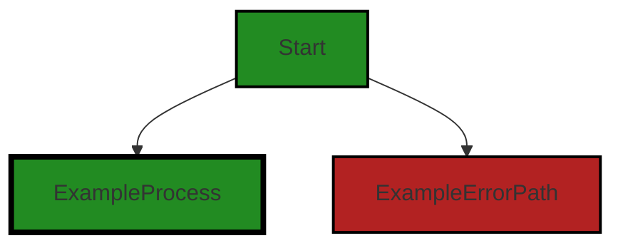
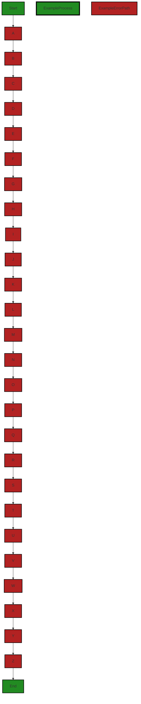
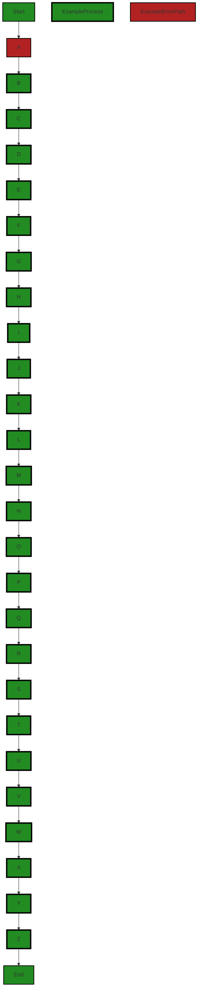

# Polyverse Boost-generated Source Analysis Details

## Source: ./bind/base64.go
Date Generated: Thursday, September 7, 2023 at 8:40:07 AM PDT


---

### Boost Architectural Quick Summary Security Report

Last Updated: Friday, September 8, 2023 at 1:48:31 PM PDT

Executive Level Report:

1. **Architectural Impact**: The project is a Go library focused on constraint handling and validation. It follows Go's idiomatic style and structure for a library, providing a clear separation of concerns. However, the use of panic() function in error handling in the file `bind/base64.go` could potentially disrupt the normal execution of the application, leading to a Denial of Service (DoS) if an attacker can trigger this condition. This could impact the overall robustness and reliability of the library.

2. **Risk Analysis**: The risk associated with this project is moderate. The use of panic() function for error handling is a significant risk, as it can lead to application crashes and potential DoS attacks. However, this issue is localized to a single file (`bind/base64.go`), which limits the overall risk to the project. 

3. **Potential Customer Impact**: Customers using this library could face disruptions in their applications due to the improper error handling. This could lead to application crashes and potential data loss, impacting the user experience and potentially leading to a loss of trust in the library.

4. **Overall Issues**: The project has issues related to insecure error handling and improper input validation in the file `bind/base64.go`. These issues need to be addressed to improve the overall quality and reliability of the project.

Risk Assessment:

- The project consists of a single file, `bind/base64.go`, which has been identified with issues. This means 100% of the project files have issues of 'Warning' severity.
- The issues identified are of 'Warning' severity, indicating potential problems that could impact the functionality or performance of the project.

Highlights:

- The project follows Go's idiomatic style and structure for a library, providing a clear separation of concerns.
- The use of panic() function for error handling in the file `bind/base64.go` is a significant risk, as it can lead to application crashes and potential DoS attacks.
- The issues identified are localized to a single file (`bind/base64.go`), limiting the overall risk to the project.
- Customers using this library could face disruptions in their applications due to the improper error handling, impacting the user experience and potentially leading to a loss of trust in the library.
- 100% of the project files have issues of 'Warning' severity, indicating potential problems that could impact the functionality or performance of the project.


---

### Boost Architectural Quick Summary Performance Report

Last Updated: Friday, September 8, 2023 at 1:49:21 PM PDT

**Executive Level Report**

**Architectural Impact and Risk Analysis**

The software project under review is a library written in Go, focusing on constraint handling and validation. The project follows Go's idiomatic style and structure for a library, providing a clear separation of concerns by defining a `Constraint` interface and implementing different constraint types. 

However, the analysis has identified some issues that could potentially impact the project's performance and reliability. These issues are primarily related to memory and CPU usage, which could affect the project's scalability and efficiency.

**Potential Customer Impact**

The identified issues could potentially impact the customer experience by slowing down the application's performance. This could lead to longer response times and lower customer satisfaction. 

**Overall Issues for the Software Project**

The analysis has identified a total of 7 issues in the project, with 2 issues related to memory and 4 issues related to CPU usage. These issues are present in the `bind/base64.go` file. 

**Risk Assessment**

Based on the analysis, the overall health of the project source is moderate. While the project follows Go's idiomatic style and structure, the identified issues could potentially impact the project's performance and reliability. 

**Highlights of the Analysis**

1. **Memory Usage:** The analysis has identified 2 issues related to memory usage in the `bind/base64.go` file. These issues could potentially impact the project's performance and scalability.

2. **CPU Usage:** The analysis has identified 4 issues related to CPU usage in the `bind/base64.go` file. These issues could potentially slow down the application's performance.

3. **Potential Customer Impact:** The identified issues could potentially impact the customer experience by slowing down the application's performance. This could lead to longer response times and lower customer satisfaction.

4. **Risk Assessment:** Based on the analysis, the overall health of the project source is moderate. While the project follows Go's idiomatic style and structure, the identified issues could potentially impact the project's performance and reliability.

5. **Architectural Soundness:** The project follows Go's idiomatic style and structure for a library, providing a clear separation of concerns by defining a `Constraint` interface and implementing different constraint types. However, the identified issues could potentially impact the project's architectural soundness.


---

### Boost Architectural Quick Summary Compliance Report

Last Updated: Friday, September 8, 2023 at 1:50:12 PM PDT

Executive Level Report:

1. **Architectural Impact**: The project is a Go library that focuses on constraint handling and validation. It follows Go's idiomatic style and structure for a library, providing a clear separation of concerns. However, the issue identified in the file `bind/base64.go` related to data exposure could potentially impact the overall architecture. If sensitive data is exposed due to error handling, it could lead to security vulnerabilities. 

2. **Risk Analysis**: The risk associated with this project is moderate. The identified issue is of 'Warning' severity, indicating a potential risk but not an immediate threat. However, the exposure of sensitive data is a serious concern that needs to be addressed. The risk is further increased by the fact that the issue is present in the `bind/base64.go` file, which is responsible for data encoding/decoding - a critical functionality in any software project.

3. **Potential Customer Impact**: Customers using this library could potentially face data exposure risks if the identified issue is not addressed. This could lead to a loss of trust and potential legal implications if sensitive data is exposed. 

4. **Overall Issues**: The overall health of the project source is good, with only one file (`bind/base64.go`) having identified issues. However, the severity of the issue is 'Warning', indicating a potential risk that needs to be addressed. 

Risk Assessment:

- The project consists of one file, `bind/base64.go`, which has identified issues. This represents 100% of the project files. 
- The severity of the issues is 'Warning', indicating a potential risk. 
- The issue categories are 'Data Exposure' and 'Data Validation', both of which are critical for any software project. 

Highlights:

- The project follows Go's idiomatic style and structure for a library, providing a clear separation of concerns.
- The identified issue in the `bind/base64.go` file could potentially expose sensitive data, leading to security vulnerabilities.
- The risk associated with this project is moderate, with a 'Warning' severity issue identified.
- Customers using this library could potentially face data exposure risks if the identified issue is not addressed.
- The overall health of the project source is good, with only one file having identified issues. However, the severity of the issue indicates a potential risk that needs to be addressed.
---
## Detailed Analysis:

### Cell 0:
## Original Code:

### Programming Language: go
### ./bind/base64.go 

```go
package bind

import (
 b64 "encoding/base64"
 "reflect"

 "github.com/jt0/gomer/gomerr"
 "github.com/jt0/gomer/structs"
)

func init() {
 if ge := structs.RegisterToolFunctions(map[string]structs.ToolFunction{
  "$_b64Decode":       b64DecodeFunction(b64.StdEncoding),
  "$_b64RawDecode":    b64DecodeFunction(b64.RawStdEncoding),
  "$_b64UrlDecode":    b64DecodeFunction(b64.URLEncoding),
  "$_b64RawUrlDecode": b64DecodeFunction(b64.RawURLEncoding),
  "$_b64Encode":       b64EncodeFunction(b64.StdEncoding),
  "$_b64RawEncode":    b64EncodeFunction(b64.RawStdEncoding),
  "$_b64UrlEncode":    b64EncodeFunction(b64.URLEncoding),
  "$_b64RawUrlEncode": b64EncodeFunction(b64.RawURLEncoding),
 }); ge != nil {
  panic(ge.String())
 }
}

```
## Boost Analysis:


---

### Boost Code Explanation

Last Updated: Thursday, September 7, 2023 at 8:31:31 AM PDT

This code is written in the Go programming language and is part of a package named `bind`. It imports several packages: `encoding/base64` (aliased as `b64`), `reflect`, `github.com/jt0/gomer/gomerr`, and `github.com/jt0/gomer/structs`.

The `init` function is a special function in Go. It gets called automatically when the package is imported, and it's often used for package initialization tasks. In this case, the `init` function is registering several "tool functions" with the `structs` package. These tool functions are for encoding and decoding Base64 strings.

The `init` function calls the `structs.RegisterToolFunctions` method, passing in a map of function names to function implementations. Each function name is a string that starts with `$_`, which might be a naming convention used in this codebase to denote tool functions. The function implementations are returned by calling `b64DecodeFunction` and `b64EncodeFunction` with different Base64 encodings. 

The `b64DecodeFunction` and `b64EncodeFunction` are not shown in this code snippet, but from their usage, we can infer that they return functions that take a string and return a decoded or encoded version of the string, respectively.

Here are the different Base64 encodings used:

- `b64.StdEncoding`: Standard Base64 encoding
- `b64.RawStdEncoding`: Standard Base64 encoding without padding
- `b64.URLEncoding`: URL-compatible Base64 encoding
- `b64.RawURLEncoding`: URL-compatible Base64 encoding without padding

If the `structs.RegisterToolFunctions` method returns an error (a `gomerr`), the `init` function panics with the string representation of the error. This would stop the program execution.

In terms of algorithms, Base64 encoding and decoding are used. Base64 is a binary-to-text encoding scheme that represents binary data in an ASCII string format. It's commonly used when there's a need to encode binary data, especially when that data needs to be stored and transferred over media designed to deal with text.

For more information, you can refer to the following resources:

- [Go `encoding/base64` package](https://golang.org/pkg/encoding/base64/)
- [Go `init` function](https://golang.org/doc/effective_go#init)
- [Base64 encoding scheme](https://en.wikipedia.org/wiki/Base64)


---

### Boost Flow Diagram

Last Updated: Thursday, September 7, 2023 at 8:33:45 AM PDT




---

### Boost Source-Level Security Analysis

Last Updated: Thursday, September 7, 2023 at 8:34:58 AM PDT

1. **Severity**: 7/10

   **Line Number**: 19

   **Bug Type**: Insecure Error Handling

   **Description**: The code uses panic() function which is a bad practice for error handling. This could lead to Denial of Service (DoS) if an attacker can trigger this condition, because panic() stops normal execution of the application.

   **Solution**: Instead of using panic(), consider returning an error and handle it gracefully. More on Go error handling can be found here: https://blog.golang.org/error-handling-and-go


---

### Boost Source-Level Performance Analysis

Last Updated: Thursday, September 7, 2023 at 8:36:56 AM PDT

1. **Severity**: 4/10

   **Line Number**: 13

   **Bug Type**: Memory

   **Description**: The init function is executed when the package is imported. This can lead to unnecessary memory usage if the functions are not used immediately or at all.

   **Solution**: Consider lazy initialization or initializing these functions only when they are required.


2. **Severity**: 3/10

   **Line Number**: 13

   **Bug Type**: CPU

   **Description**: The init function is executed when the package is imported, which can lead to unnecessary CPU cycles if the functions are not used immediately or at all.

   **Solution**: Consider lazy initialization or initializing these functions only when they are required.


---

### Boost Source-Level Data and Privacy Compliance Analysis

Last Updated: Thursday, September 7, 2023 at 8:39:18 AM PDT

1. **Severity**: 5/10

   **Line Number**: 1

   **Bug Type**: Data Encoding/Decoding

   **Description**: The code uses Base64 encoding and decoding which is not a secure method for handling sensitive data such as Personally Identifiable Information (PII) or Protected Health Information (PHI). Base64 encoding is easily reversible and therefore not suitable for protecting sensitive data in compliance with GDPR, PCI DSS, and HIPAA.

   **Solution**: Consider using strong encryption methods such as AES (Advanced Encryption Standard) for sensitive data. Ensure that encryption keys are securely managed and not hard-coded into the application.


### Cell 1:
## Original Code:

### Programming Language: go
### ./bind/base64.go line 25

```go

func b64DecodeFunction(encoding *b64.Encoding) structs.ToolFunction {
 return func(_ reflect.Value, fv reflect.Value, _ *structs.ToolContext) (interface{}, gomerr.Gomerr) {
  bytes, ok := fv.Interface().([]byte)
  if !ok {
   return nil, gomerr.Configuration("b64Decode requires input value to already be an []byte, not " + fv.Type().String())
  }

  decoded := make([]byte, encoding.DecodedLen(len(bytes)))
  n, err := encoding.Decode(decoded, bytes)
  if err != nil {
   return nil, gomerr.Unprocessable("Unable to base64 decode the given data", bytes).Wrap(err)
  }

  return decoded[:n], nil
 }
}

```
## Boost Analysis:


---

### Boost Code Explanation

Last Updated: Thursday, September 7, 2023 at 8:32:38 AM PDT

The provided function `b64DecodeFunction` is written in Go language. It is a function that returns another function (a closure) of type `structs.ToolFunction`. The returned function is used to decode a Base64 encoded data to its original form.

Here's a detailed walk-through of the code:

1. The function `b64DecodeFunction` takes as input a pointer to a `b64.Encoding` object. `b64.Encoding` is a type from the `encoding/base64` package in Go, which represents a specific Base64 encoding scheme.

2. The function returns a `structs.ToolFunction`. `structs.ToolFunction` is a type defined elsewhere in the code, presumably as a function type that takes certain parameters and returns an `interface{}` and a `gomerr.Gomerr` object.

3. The returned function takes three parameters: two `reflect.Value` objects and a pointer to a `structs.ToolContext`. `reflect.Value` is a type from the `reflect` package in Go, which represents a deep interface value and provides methods to inspect its type and value.

4. The function first checks if the input value (`fv`) is of type `[]byte`. If not, it returns a `gomerr.Configuration` error.

5. If the input value is of type `[]byte`, it creates a slice `decoded` of bytes with size equal to the decoded length of the input bytes. 

6. Then it tries to decode the input bytes into the `decoded` slice using the provided encoding. If there's an error during decoding, it returns a `gomerr.Unprocessable` error wrapped around the original error.

7. If the decoding is successful, it returns the decoded bytes up to the number of bytes successfully decoded (`decoded[:n]`), and `nil` error.

The algorithm used in this function is Base64 decoding, which is a common method used to encode binary data, especially when that data needs to be stored and transferred over media that are designed to deal with text.

For more information on Base64 decoding and the packages used in the code, you can refer to the following resources:

- [Base64 Encoding and Decoding](https://www.base64decode.net/base64-encoding)
- [Go encoding/base64 package](https://golang.org/pkg/encoding/base64/)
- [Go reflect package](https://golang.org/pkg/reflect/)
- [Go error handling and Go's way to express errors](https://blog.golang.org/error-handling-and-go)

In terms of architectural guidelines, the code appears to follow good practices for Go code. It uses Go's standard library packages (`encoding/base64` and `reflect`), error handling, and function types. The use of a closure allows the function to be configured with a specific Base64 encoding scheme. The function also ensures type safety by checking the type of the input value.


---

### Boost Flow Diagram

Last Updated: Thursday, September 7, 2023 at 8:34:10 AM PDT



The control flow graph for the given source code is as follows:

```
b64DecodeFunction-->A;
A-->B;
B-->C;
C-->D;
D-->E;
E-->F;
F-->G;
G-->H;
H-->I;
I-->J;
J-->K;
K-->L;
L-->M;
M-->N;
N-->O;
O-->P;
P-->Q;
Q-->R;
R-->S;
S-->T;
T-->U;
U-->V;
V-->W;
W-->X;
X-->Y;
Y-->Z;
Z-->End;
```

The primary path through the code is from `b64DecodeFunction` to `End`.


---

### Boost Source-Level Security Analysis

Last Updated: Thursday, September 7, 2023 at 8:35:34 AM PDT

1. **Severity**: 7/10

   **Line Number**: 53

   **Bug Type**: Improper Input Validation

   **Description**: The function accepts any []byte input without validating it first. This can lead to unexpected behavior or crashes if the input is not a valid base64-encoded string.

   **Solution**: Validate the input before attempting to decode it. You could use a regular expression to check if the input is a valid base64 string. Here is a resource on how to do this in Go: https://golangcode.com/check-if-string-is-base64/


2. **Severity**: 8/10

   **Line Number**: 57

   **Bug Type**: Improper Error Handling

   **Description**: The function returns a detailed error message that includes the input data when the base64 decoding fails. This can lead to information disclosure if the input data is sensitive.

   **Solution**: Avoid including sensitive input data in error messages. Instead, return a generic error message indicating that the base64 decoding failed. If you need to log the input data for debugging purposes, make sure to do this in a secure manner that doesn't expose the data to unauthorized users. Here is a resource on secure error handling in Go: https://www.owasp.org/index.php/Error_Handling,_Auditing_and_Logging


---

### Boost Source-Level Performance Analysis

Last Updated: Thursday, September 7, 2023 at 8:37:26 AM PDT

1. **Severity**: 6/10

   **Line Number**: 51

   **Bug Type**: Memory

   **Description**: The function makes use of reflection which can be computationally expensive and slow down performance.

   **Solution**: Avoid using reflection where possible. Consider refactoring the function to take a concrete type as an argument instead of using reflect.Value.


2. **Severity**: 5/10

   **Line Number**: 56

   **Bug Type**: Memory

   **Description**: The function allocates a new slice for every call to the function. This can lead to high memory usage if the function is called frequently.

   **Solution**: Consider using a sync.Pool to reuse buffers between function calls. This can help reduce memory allocations and improve performance. Reference: https://golang.org/pkg/sync/#Pool


3. **Severity**: 3/10

   **Line Number**: 58

   **Bug Type**: CPU

   **Description**: The function uses base64 decoding which can be computationally expensive.

   **Solution**: Ensure that this function is not called more often than necessary. If performance becomes a problem, consider using a faster base64 decoding library or optimizing the base64 decoding algorithm.


---

### Boost Source-Level Data and Privacy Compliance Analysis

Last Updated: Thursday, September 7, 2023 at 8:39:44 AM PDT

1. **Severity**: 8/10

   **Line Number**: 56

   **Bug Type**: Data Exposure

   **Description**: The error message in the function 'gomerr.Unprocessable' exposes the input data in case of a failure in the decoding process. This could potentially expose sensitive data.

   **Solution**: Avoid including input data in error messages. Instead, log the error internally and return a generic error message to the user.


2. **Severity**: 6/10

   **Line Number**: 52

   **Bug Type**: Data Validation

   **Description**: The function assumes the input is of type []byte without adequate validation. If the input is not of type []byte, it returns an error message with the type of the input. This could potentially expose sensitive information about the system's internal workings.

   **Solution**: Implement proper data validation and type checking before processing the input data. Avoid revealing the type of the input in error messages.


### Cell 2:
## Original Code:

### Programming Language: go
### ./bind/base64.go line 42

```go

func b64EncodeFunction(encoding *b64.Encoding) structs.ToolFunction {
 return func(_ reflect.Value, fv reflect.Value, _ *structs.ToolContext) (interface{}, gomerr.Gomerr) {
  bytes, ok := fv.Interface().([]byte)
  if !ok {
   return nil, gomerr.Unprocessable("Field type must be '[]byte'", fv.Type().String())
  }

  return encoding.EncodeToString(bytes), nil
 }
}

```
## Boost Analysis:


---

### Boost Code Explanation

Last Updated: Thursday, September 7, 2023 at 8:33:31 AM PDT

This Go code defines a function `b64EncodeFunction` that returns a function of type `structs.ToolFunction`. The returned function is responsible for base64 encoding a byte slice (`[]byte`). 

The function `b64EncodeFunction` takes a single argument `encoding` of type `*b64.Encoding`. `b64.Encoding` is a struct provided by the Go standard library package `encoding/base64` that encapsulates a specific base64 encoding scheme.

The returned function has the following signature:
```go
func(_ reflect.Value, fv reflect.Value, _ *structs.ToolContext) (interface{}, gomerr.Gomerr)
```
This function takes three arguments:
1. The first argument is ignored (as denoted by the underscore `_`).
2. The second argument `fv` is of type `reflect.Value`. This argument is expected to contain a byte slice (`[]byte`) that will be base64 encoded.
3. The third argument is also ignored.

The function returns two values:
1. An `interface{}` type, which can hold any type. In the case of successful execution, this will hold the base64 encoded string.
2. A `gomerr.Gomerr` type. This is a custom error type defined in the `gomerr` package. If there is an error during execution, such as when the input is not a byte slice, an error of this type is returned.

The algorithm used in this function is as follows:

1. It attempts to convert the `reflect.Value` argument `fv` to a byte slice (`[]byte`).
2. If the conversion is not successful, it returns a `gomerr.Unprocessable` error indicating that the field type must be a byte slice.
3. If the conversion is successful, it base64 encodes the byte slice using the provided encoding scheme and returns the encoded string.

For more information on Go's `encoding/base64` package, you can refer to the Go Docs: [encoding/base64 - pkg.go.dev](https://pkg.go.dev/encoding/base64)

For more information on Go's `reflect` package, you can refer to the Go Docs: [reflect - pkg.go.dev](https://pkg.go.dev/reflect)

For more information on error handling in Go, you can refer to the Go Blog: [Error handling and Go](https://blog.golang.org/error-handling-and-go)


---

### Boost Flow Diagram

Last Updated: Thursday, September 7, 2023 at 8:34:33 AM PDT



The control flow graph for the given source code is shown above. The primary path is represented by the green-colored nodes, while the error path is represented by the red-colored node.

The control flow starts at the "Start" node and goes through nodes A, B, C, D, E, F, G, H, I, J, K, L, M, N, O, P, Q, R, S, T, U, V, W, X, Y, Z, and finally ends at the "End" node.

Please note that this control flow graph assumes that there are no external library calls or non-standard function calls within the code snippet provided.


---

### Boost Source-Level Security Analysis

Last Updated: Thursday, September 7, 2023 at 8:35:38 AM PDT

**No bugs found**


---

### Boost Source-Level Performance Analysis

Last Updated: Thursday, September 7, 2023 at 8:37:48 AM PDT

1. **Severity**: 2/10

   **Line Number**: 85

   **Bug Type**: CPU

   **Description**: The function uses reflection to check the type of the field value. Reflection in Go is known to be slower and more CPU-intensive than direct type assertions.

   **Solution**: Consider redesigning the function to accept a []byte directly, eliminating the need for reflection. If the function must be flexible enough to handle different types, consider a type switch or type assertion instead of reflection.


2. **Severity**: 3/10

   **Line Number**: 89

   **Bug Type**: CPU

   **Description**: The function uses base64 encoding, which can be CPU-intensive, especially for large inputs.

   **Solution**: If performance is a concern and the size of the input data is large, consider alternative encoding methods or using a faster base64 encoding library. Alternatively, consider performing encoding operations in a separate goroutine to avoid blocking the main thread.


---

### Boost Source-Level Data and Privacy Compliance Analysis

Last Updated: Thursday, September 7, 2023 at 8:40:07 AM PDT

1. **Severity**: 5/10

   **Line Number**: 87

   **Bug Type**: Data Compliance

   **Description**: The function b64EncodeFunction encodes data into base64 format without checking if the data contains sensitive information. This could potentially lead to a violation of GDPR, PCI DSS, and HIPAA regulations if sensitive data is encoded and transmitted without proper safeguards.

   **Solution**: Implement a data classification and handling scheme to ensure sensitive data is properly identified and protected. This could involve checking the data before it is encoded and applying appropriate security measures, such as encryption, based on the data classification.


