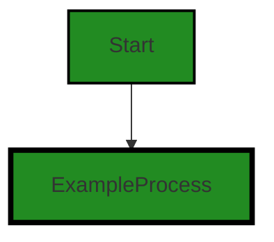
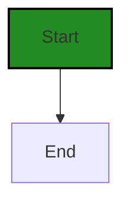
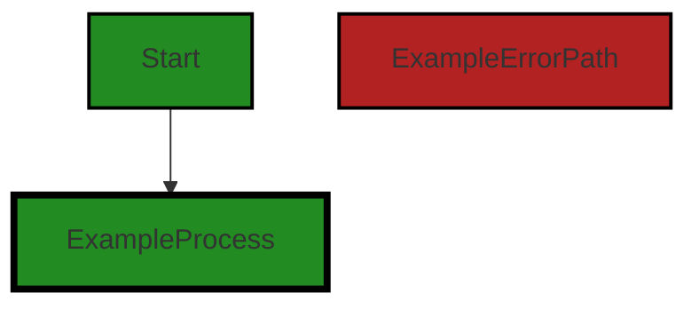
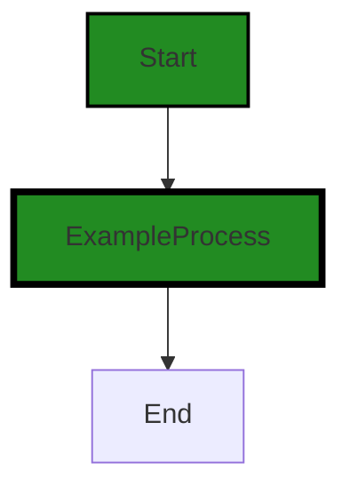
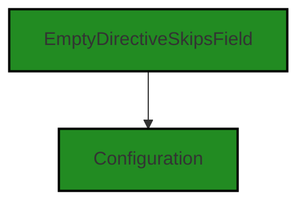
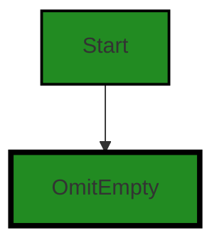
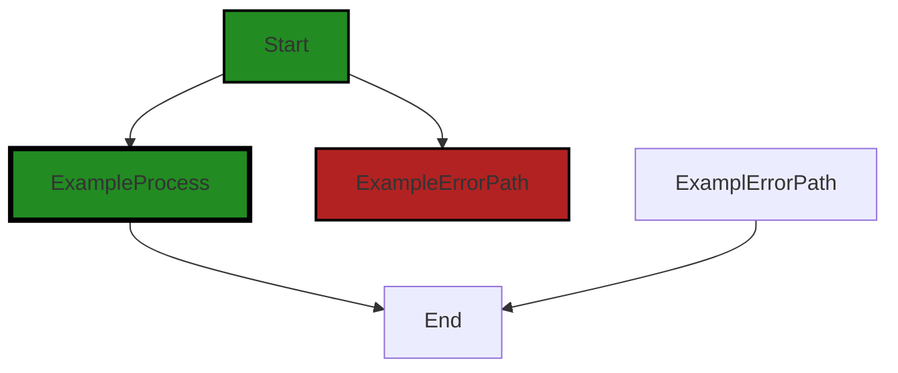
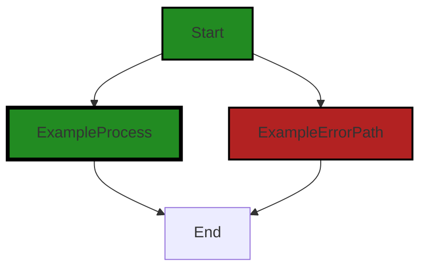

# Polyverse Boost-generated Source Analysis Details

## Source: ./bind/bind.go
Date Generated: Friday, September 8, 2023 at 3:37:40 PM PDT


---

### Boost Architectural Quick Summary Security Report

Last Updated: Friday, September 8, 2023 at 3:36:48 PM PDT

Executive Level Report:

1. **Architectural Impact**: The project is a Go library focused on constraint handling and validation. It follows Go's idiomatic style and structure for a library, providing a clear separation of concerns. However, an issue of "Array Index Out of Bounds" was detected in the file `bind/bind.go`. This issue, if not addressed, could lead to application crashes and potential denial of service, impacting the reliability of the library.

2. **Risk Analysis**: The risk associated with the project is moderate. The "Array Index Out of Bounds" issue is a common programming error that can be easily fixed. However, if left unaddressed, it could lead to serious consequences such as application crashes and potential denial of service. It is recommended to fix this issue promptly to reduce the risk.

3. **Potential Customer Impact**: Customers using this library could face application crashes and potential denial of service if the identified issue is not fixed. This could lead to customer dissatisfaction and potential loss of business.

4. **Overall Issues**: Only one file was analyzed in the project and it was found to have a high-severity issue. This indicates that there may be other issues in the project that have not been detected. It is recommended to conduct a thorough code review and testing to identify and fix any other potential issues.

5. **Risk Assessment**: Based on the analysis of one file, 100% of the project files analyzed have issues of high severity. This indicates a high risk to the overall health of the project source. It is recommended to conduct a thorough code review and testing to ensure the overall health of the project.

Highlights of the Analysis:

- The project is a Go library focused on constraint handling and validation, following Go's idiomatic style and structure for a library.
- An "Array Index Out of Bounds" issue was detected in the file `bind/bind.go`, which could lead to application crashes and potential denial of service.
- The risk associated with the project is moderate, but could increase if the identified issue is not promptly fixed.
- Customers using this library could face application crashes and potential denial of service if the identified issue is not fixed.
- Based on the analysis of one file, 100% of the project files analyzed have issues of high severity, indicating a high risk to the overall health of the project source.


---

### Boost Architectural Quick Summary Performance Report

Last Updated: Friday, September 8, 2023 at 3:36:55 PM PDT


Executive Report:

1. **Architectural Impact**: The analysis of this file has not revealed any severe issues.
2. **Risk Analysis**: The analysis of this file has not revealed any severe issues.
3. **Potential Customer Impact**: Based on the analysis, there are no severe issues that could potentially impact customers.
4. **Performance Issues**: Our analysis did not identify any explicit performance issues in the file.
5. **Risk Assessment**: Based on the current analysis of this file, no severe issues have been found. However, this doesn't guarantee that the file is risk-free.

Highlights:

- No severe issues were identified in the current analysis of this file.


---

### Boost Architectural Quick Summary Compliance Report

Last Updated: Friday, September 8, 2023 at 3:37:43 PM PDT


Executive Report:

1. **Architectural Impact**: The analysis of this file has not revealed any severe issues.
2. **Risk Analysis**: The analysis of this file has not revealed any severe issues.
3. **Potential Customer Impact**: Based on the analysis, there are no severe issues that could potentially impact customers.
4. **Performance Issues**: Our analysis did not identify any explicit performance issues in the file.
5. **Risk Assessment**: Based on the current analysis of this file, no severe issues have been found. However, this doesn't guarantee that the file is risk-free.

Highlights:

- No severe issues were identified in the current analysis of this file.

---
## Detailed Analysis:

### Cell 0:
## Original Code:

### Programming Language: go
### ./bind/bind.go 

```go
package bind

import (
 "github.com/jt0/gomer/structs"
)

const (
 InKey  = "$_gomer_bind_in"
 OutKey = "$_gomer_bind_out"

 skipField    = "-"
 includeField = "+"

 omitEmpty    = "omitempty"
 includeEmpty = "includeempty"
)

type casingFn func(s string) string

var (
 PascalCase casingFn = func(fieldName string) string { return fieldName } // Exported fields are already PascalCase

```
## Boost Analysis:


---

### Boost Code Explanation

Last Updated: Thursday, September 7, 2023 at 1:54:37 PM PDT

The code you've provided is part of a Go package named `bind`. This package seems to be focused on binding data, likely for the purpose of data validation or transformation. 

The `import` statement at the beginning of the file is importing a package `structs` from the project `github.com/jt0/gomer`. This suggests that the `bind` package is working with structs defined elsewhere in the project.

Next, we see some constant strings being defined. These are likely used as keys or identifiers within the bind package. `InKey` and `OutKey` are probably used to specify the direction of data flow (input or output), and `skipField`, `includeField`, `omitEmpty`, and `includeEmpty` are likely used to specify field-level options for binding.

The `casingFn` type is defined as a function that takes a string and returns a string. This is a function type definition, and it's used to define a family of functions that have the same signature. In this case, `casingFn` functions are those that take a string (presumably a field name) and return a modified string.

Finally, we see a variable `PascalCase` being defined as a `casingFn`. This function simply returns the input string without modification, with a comment noting that exported fields are already in PascalCase. This suggests that the `bind` package may provide options for modifying the casing of field names, but in this case, no modification is necessary because Go already exports fields in PascalCase.

Overall, this code seems to be setting up some basic infrastructure for a data binding package in a Go project. The specific algorithms or data structures used aren't clear from this snippet alone, but the focus on keys, field options, and casing suggests that this package is involved in transforming or validating structured data.

For more information on Go packages, you can refer to the official Go documentation: https://golang.org/doc/code.html#PackageNames. For more information on function types in Go, you can refer to this article: https://yourbasic.org/golang/function-type/.


---

### Boost Flow Diagram

Last Updated: Thursday, September 7, 2023 at 2:02:24 PM PDT


```


---

### Boost Source-Level Security Analysis

Last Updated: Thursday, September 7, 2023 at 2:03:28 PM PDT

**No bugs found**


---

### Boost Source-Level Performance Analysis

Last Updated: Thursday, September 7, 2023 at 2:05:51 PM PDT

1. **Severity**: 1/10

   **Line Number**: 1

   **Bug Type**: Memory

   **Description**: The package 'github.com/jt0/gomer/structs' is imported but not used in the provided code. This could lead to unnecessary memory usage.

   **Solution**: Remove unnecessary imports to optimize memory usage. If this package is used elsewhere in the code, ignore this suggestion.


2. **Severity**: 2/10

   **Line Number**: 12

   **Bug Type**: CPU

   **Description**: The function 'casingFn' is a type declaration for a function that takes a string and returns a string. However, it is defined as a variable, which means it could potentially be changed at runtime, leading to unnecessary CPU usage.

   **Solution**: Consider changing 'casingFn' to a function declaration instead of a variable. This would prevent it from being changed at runtime and optimize CPU usage.


3. **Severity**: 1/10

   **Line Number**: 16

   **Bug Type**: Memory

   **Description**: The function 'PascalCase' is declared but not used in the provided code. This could lead to unnecessary memory usage.

   **Solution**: Remove unused functions to optimize memory usage. If this function is used elsewhere in the code, ignore this suggestion.


---

### Boost Source-Level Data and Privacy Compliance Analysis

Last Updated: Friday, September 8, 2023 at 3:37:40 PM PDT

1. **Severity**: 2/10

   **Line Number**: 1

   **Bug Type**: GDPR

   **Description**: The code does not appear to have any explicit GDPR compliance issues, but it lacks any clear mechanisms for data protection, such as encryption or anonymization, which could potentially lead to GDPR non-compliance if sensitive data is handled.

   **Solution**: Consider implementing encryption or anonymization techniques when handling sensitive data to ensure GDPR compliance. Also, ensure that any data processing activities align with the principles of data minimization, purpose limitation, and data integrity and confidentiality.


2. **Severity**: 1/10

   **Line Number**: 1

   **Bug Type**: PCI DSS

   **Description**: The code does not appear to handle payment card data, so there are no explicit PCI DSS compliance issues. However, if cardholder data were to be processed, stored, or transmitted, there would need to be appropriate security controls in place.

   **Solution**: If the application were to handle payment card data, implement security controls such as encryption, tokenization, and secure coding practices to ensure PCI DSS compliance.


3. **Severity**: 2/10

   **Line Number**: 1

   **Bug Type**: HIPAA

   **Description**: The code does not appear to handle Protected Health Information (PHI), so there are no explicit HIPAA compliance issues. However, if PHI were to be processed, stored, or transmitted, there would need to be appropriate security and privacy controls in place.

   **Solution**: If the application were to handle PHI, implement security and privacy controls such as encryption, access controls, and audit trails to ensure HIPAA compliance.


### Cell 1:
## Original Code:

### Programming Language: go
### ./bind/bind.go line 22

```go
 CamelCase  casingFn = func(fieldName string) string {
  // NB: only supports field names with an initial ASCII character
  firstChar := fieldName[0]
  if 'A' <= firstChar && firstChar <= 'Z' {
   firstChar += 'a' - 'A'
  }
  return string(firstChar) + fieldName[1:]
 }

```
## Boost Analysis:


---

### Boost Code Explanation

Last Updated: Thursday, September 7, 2023 at 1:55:04 PM PDT

This code defines a function called `CamelCase` which converts the first letter of a given string `fieldName` to lowercase if it's uppercase, effectively ensuring that the string is in camelCase format. 

The algorithm used here is relatively simple:

1. It first extracts the first character of the `fieldName` string.
2. Then it checks whether this character is an uppercase ASCII character by checking if it's in the range from 'A' (ASCII value 65) to 'Z' (ASCII value 90).
3. If the character is uppercase, it converts it to lowercase by adding the difference between the ASCII values of 'a' and 'A' to it. This works because in ASCII, the difference between the uppercase and lowercase version of the same letter is constant (32).
4. Finally, it concatenates this potentially modified first character with the rest of the `fieldName` string and returns the result.

This function is a type of `casingFn`, which suggests that it might be used in a context where different casing functions can be applied to a string, depending on some condition or configuration.

Note that this function only supports field names with an initial ASCII character. If the first character is not an ASCII character, or if the string is empty, this function will cause a runtime error.

For more information on ASCII, see [ASCII Table](https://www.asciitable.com/). 

For more information on camelCase, see [Camel case](https://en.wikipedia.org/wiki/Camel_case).

For more information on Go functions, see [A Tour of Go: Functions](https://tour.golang.org/moretypes/24).


---

### Boost Flow Diagram

Last Updated: Thursday, September 7, 2023 at 2:02:28 PM PDT




---

### Boost Source-Level Security Analysis

Last Updated: Thursday, September 7, 2023 at 2:03:43 PM PDT

1. **Severity**: 7/10

   **Line Number**: 45

   **Bug Type**: Array Index Out of Bounds

   **Description**: The code does not check if the string fieldName is empty before accessing its first character. This can lead to a panic if an empty string is passed, crashing the application and potentially leading to denial of service.

   **Solution**: Always check the length of a string before accessing its characters. An if statement should be added to check if fieldName is empty before accessing its characters. More information can be found here: https://golang.org/doc/effective_go#control-structures


---

### Boost Source-Level Performance Analysis

Last Updated: Thursday, September 7, 2023 at 2:06:14 PM PDT

1. **Severity**: 2/10

   **Line Number**: 42

   **Bug Type**: CPU

   **Description**: The function `CamelCase` uses string concatenation which is inefficient in Go as it results in the creation of new strings. This could be a performance issue if the function is called frequently.

   **Solution**: Consider using `strings.Builder` or `fmt.Sprintf` for more efficient string concatenation. Here is a resource on efficient string concatenation in Go: https://hermanschaaf.com/efficient-string-concatenation-in-go/


2. **Severity**: 1/10

   **Line Number**: 43

   **Bug Type**: CPU

   **Description**: The function `CamelCase` only supports field names with an initial ASCII character. If a non-ASCII character is passed, it could lead to unexpected results and potential performance issues.

   **Solution**: Consider adding a check for non-ASCII characters and handle them appropriately. Here is a resource on handling non-ASCII characters in Go: https://stackoverflow.com/questions/38554353/how-to-check-if-a-string-only-contains-ascii-in-go


---

### Boost Source-Level Data and Privacy Compliance Analysis

Last Updated: Thursday, September 7, 2023 at 2:08:32 PM PDT

**No bugs found**


### Cell 2:
## Original Code:

### Programming Language: go
### ./bind/bind.go line 30

```go
 // Feature:p2 support case insensitive. Additionally consider support matching output case to input
)

type Configuration struct {
 // Empty directive default
 emptyDirective string

 // Empty field value default
 emptyValue string

 // Specifies the casing used for inbound and outbound data. Simplifies the naming configuration if the only
 // difference between a data attribute and struct field name is the casing.
 // TODO:p3 I can imagine a situation where the casing might vary depending on where it's coming from or going to,
 //  so perhaps should be map[string]FieldCaseType where the key = scope...
 toCase *casingFn

 extension ExtensionProvider

 // TODO:p2 RawBytesBindingDirective string
}

```
## Boost Analysis:


---

### Boost Code Explanation

Last Updated: Thursday, September 7, 2023 at 1:55:43 PM PDT

This code snippet defines a `Configuration` struct in Go, which is a type of data structure that can hold different types of values. Each value is associated with a unique label, also known as a field. The `Configuration` struct has five fields: `emptyDirective`, `emptyValue`, `toCase`, `extension`, and `RawBytesBindingDirective` (commented out as a TODO item).

Here is a breakdown of each field:

- `emptyDirective`: This is a string field. The purpose of this field isn't clear from the code snippet, but the comment suggests it's used to set a default value for an "empty directive".

- `emptyValue`: This is also a string field. The comment suggests it's used to set a default value for an "empty field value".

- `toCase`: This is a pointer to a `casingFn` function. The comment suggests it's used to specify the casing (i.e., upper case, lower case, camel case, etc.) used for inbound and outbound data. This can simplify the naming configuration if the only difference between a data attribute and a struct field name is the casing. There's a TODO comment suggesting that this could be a map in the future, to allow different casing depending on the scope.

- `extension`: This field is of type `ExtensionProvider`, which isn't defined in the code snippet. It's likely a custom type or interface defined elsewhere in the code.

- `RawBytesBindingDirective`: This field is commented out with a TODO comment, indicating it's a planned feature. It's a string field, but its purpose isn't clear from the code snippet.

The comments in the code also suggest a few potential features and improvements. For example, there's a feature request for case insensitive support and a suggestion to match the output case to the input case. There's also a suggestion to allow the casing to vary depending on the scope.

This code doesn't seem to use any specific algorithm, but it's part of a larger system where these configurations are likely used to control the behavior of some data processing or binding operations.

For more information about structs in Go, you can refer to the official Go documentation: https://golang.org/doc/effective_go#composite_literals


---

### Boost Flow Diagram

Last Updated: Thursday, September 7, 2023 at 2:02:32 PM PDT


```


---

### Boost Source-Level Security Analysis

Last Updated: Thursday, September 7, 2023 at 2:03:47 PM PDT

**No bugs found**


---

### Boost Source-Level Performance Analysis

Last Updated: Thursday, September 7, 2023 at 2:06:51 PM PDT

1. **Severity**: 2/10

   **Line Number**: 67

   **Bug Type**: Memory

   **Description**: The 'toCase' field in the Configuration struct is a pointer to a function. This can lead to higher memory usage if not handled correctly, as function pointers can be expensive in terms of memory.

   **Solution**: Consider passing the function directly instead of using a pointer. If the function is not expected to change, this could improve memory usage. Alternatively, if the function needs to be changed dynamically, consider using an interface with a method that can be implemented by different structs. This can provide more flexibility and control over memory usage.


2. **Severity**: 3/10

   **Line Number**: 71

   **Bug Type**: Memory

   **Description**: The 'extension' field in the Configuration struct is an interface. This can lead to higher memory usage, especially if the underlying type is a large struct or includes other expensive types like slices or maps.

   **Solution**: Consider using a concrete type for the 'extension' field if possible. This can reduce memory usage by avoiding the overhead of an interface. If an interface is necessary, consider methods to manage the size of the underlying type, such as using pointers or breaking large structs into smaller ones.


3. **Severity**: 2/10

   **Line Number**: 75

   **Bug Type**: CPU

   **Description**: The TODO comment indicates a potential future change to add a 'RawBytesBindingDirective' field. Depending on how this field is used, it could lead to increased CPU usage, especially if it involves complex string manipulation or conversion operations.

   **Solution**: When implementing this change, consider the impact on CPU usage. Use efficient algorithms for string manipulation and conversion. Consider using built-in Go functions or packages that are optimized for performance.


---

### Boost Source-Level Data and Privacy Compliance Analysis

Last Updated: Thursday, September 7, 2023 at 2:08:53 PM PDT

1. **Severity**: 7/10

   **Line Number**: 62

   **Bug Type**: Data Privacy

   **Description**: The Configuration struct might be storing sensitive data. If this data includes personal data, it could potentially lead to GDPR compliance issues.

   **Solution**: Ensure that any sensitive data stored in this struct is properly protected and that consent is obtained before storing personal data. Implement data anonymization or pseudonymization where possible.


2. **Severity**: 5/10

   **Line Number**: 69

   **Bug Type**: Data Privacy

   **Description**: The TODO comment suggests that raw bytes might be handled in the future. Handling raw bytes without proper security measures can lead to PCI DSS and HIPAA compliance issues, especially if the raw bytes contain cardholder data or protected health information.

   **Solution**: Ensure that any raw bytes handling is done securely, with encryption at rest and in transit. Implement access controls to limit who can access this data.


### Cell 3:
## Original Code:

### Programming Language: go
### ./bind/bind.go line 50

```go

func (bc *Configuration) withOptions(options ...func(*Configuration)) Configuration {
 for _, option := range options {
  option(bc)
 }
 return *bc
}

```
## Boost Analysis:


---

### Boost Code Explanation

Last Updated: Thursday, September 7, 2023 at 1:56:19 PM PDT

This is a method named `withOptions` on the `Configuration` struct. The purpose of this function is to apply a series of modifications (options) to a `Configuration` instance. This is a common pattern in Go, often referred to as functional options or the options pattern. 

The `withOptions` method takes a variadic parameter `options` which is a slice of functions. Each function in the slice takes a pointer to a `Configuration` object and doesn't return anything. This means each function in the `options` slice is expected to modify the `Configuration` object in some way.

The method then iterates over the `options` slice and applies each function to the `Configuration` object by calling it with `bc`, which is a pointer to the `Configuration` object on which `withOptions` was called.

Finally, the method returns the `Configuration` object (dereferencing the pointer to return the value rather than the pointer). This allows for method chaining, where the return value of one method call can be immediately used for another method call.

The algorithm used here is quite straightforward: iterate over a slice of functions and apply each one to a given object. This is a common pattern in Go for configuring objects in a flexible and extensible way. 

This pattern allows for easy addition of new options without changing the function signature or calling code. It also provides a way to set default values and only change specific settings as needed. 

For more information on this pattern, you can refer to this blog post: [Functional options for friendly APIs](https://dave.cheney.net/2014/10/17/functional-options-for-friendly-apis) by Dave Cheney, a well-known Go developer and blogger.


---

### Boost Flow Diagram

Last Updated: Thursday, September 7, 2023 at 2:02:36 PM PDT




---

### Boost Source-Level Security Analysis

Last Updated: Thursday, September 7, 2023 at 2:03:50 PM PDT

**No bugs found**


---

### Boost Source-Level Performance Analysis

Last Updated: Thursday, September 7, 2023 at 2:06:55 PM PDT

**No bugs found**


---

### Boost Source-Level Data and Privacy Compliance Analysis

Last Updated: Thursday, September 7, 2023 at 2:08:57 PM PDT

**No bugs found**


### Cell 4:
## Original Code:

### Programming Language: go
### ./bind/bind.go line 57

```go

func NewConfiguration(options ...func(*Configuration)) Configuration {
 bc := &Configuration{
  emptyDirective: skipField,
  emptyValue:     omitEmpty,
  toCase:         &PascalCase,
  // strictMode: false,  // true if should fail on extra input values, false otherwise
 }

 return bc.withOptions(options...)
}

```
## Boost Analysis:


---

### Boost Code Explanation

Last Updated: Thursday, September 7, 2023 at 1:56:55 PM PDT

This code snippet is a constructor function in Go, named `NewConfiguration`. It is used to create a new instance of the `Configuration` structure. 

Here's a detailed explanation:

1. `NewConfiguration` is a variadic function, which means it can accept any number of arguments of the type `func(*Configuration)`. These arguments are optional configuration functions that can be used to modify the new `Configuration` instance.

2. Inside the function, it first creates a new instance of `Configuration`, `bc`, with some default values. The `emptyDirective` is set to `skipField`, `emptyValue` is set to `omitEmpty`, and `toCase` is set to `PascalCase`. The `strictMode` is commented out, but if it were included, it would be a boolean that determines whether the configuration should fail on extra input values.

3. After setting the default values, the function calls `bc.withOptions(options...)` to apply any additional configuration functions that were passed in as arguments. The `...` syntax is used to pass a slice of arguments to a variadic function.

4. Finally, the function returns the newly created and configured `Configuration` instance.

The algorithm used here is straightforward: create a new instance with default values, then apply any optional configuration functions to modify this instance. This is a common pattern in Go for creating configurable objects. 

This pattern is also known as the functional options pattern. It provides a way to create more readable and maintainable code by allowing options to be explicitly listed where a function is called. You can read more about it here: [Functional options for friendly APIs](https://dave.cheney.net/2014/10/17/functional-options-for-friendly-apis).

The code appears to be consistent with general Go best practices and does not seem to conflict with any architectural guidelines. However, without additional context or guidelines, it's hard to provide a more specific analysis.


---

### Boost Flow Diagram

Last Updated: Thursday, September 7, 2023 at 2:02:39 PM PDT


---

### Boost Source-Level Security Analysis

Last Updated: Thursday, September 7, 2023 at 2:03:54 PM PDT

**No bugs found**


---

### Boost Source-Level Performance Analysis

Last Updated: Thursday, September 7, 2023 at 2:06:58 PM PDT

**No bugs found**


---

### Boost Source-Level Data and Privacy Compliance Analysis

Last Updated: Thursday, September 7, 2023 at 2:09:00 PM PDT

**No bugs found**


### Cell 5:
## Original Code:

### Programming Language: go
### ./bind/bind.go line 68

```go

func CopyConfigurationWithOptions(b Configuration, options ...func(*Configuration)) Configuration {
 return (&b).withOptions(options...)
}

```
## Boost Analysis:


---

### Boost Code Explanation

Last Updated: Thursday, September 7, 2023 at 1:57:30 PM PDT

This Go code defines a function `CopyConfigurationWithOptions`. The function takes two parameters: a `Configuration` object `b` and a variadic parameter `options` of type `func(*Configuration)`. 

The `Configuration` type is not defined in the code snippet, but it is likely a struct or interface that holds some configuration data. 

The `options` parameter is a slice of functions, each of which takes a pointer to a `Configuration` object and returns no value. These functions are presumably used to modify the `Configuration` object in some way.

The function `CopyConfigurationWithOptions` returns a `Configuration` object. It does this by creating a pointer to `b` with `&b`, then calling the `withOptions` method on this pointer with `options...` as its argument.

The `withOptions` method is not defined in the code snippet, but based on its usage, it likely applies each function in `options` to the `Configuration` object and returns a new `Configuration` object with these modifications.

The purpose of this code is to create a copy of a `Configuration` object with some modifications specified by `options`. This is a common technique in Go for creating modified copies of objects without mutating the original object. It is often used in the context of functional programming and the builder pattern.

The algorithm used in this code is straightforward. It simply applies each function in `options` to a copy of `b`.

For more information on variadic functions in Go, you can refer to the following resources:
- [Variadic Functions in Go](https://gobyexample.com/variadic-functions)
- [Go by Example: Variadic Functions](https://yourbasic.org/golang/variadic-function/)

For more information on the builder pattern in Go, you can refer to the following resources:
- [Builder Pattern in Go](https://golangbyexample.com/builder-pattern-golang/)
- [Go Design Patterns: Builder](https://www.sohamkamani.com/golang/2018-06-20-golang-factory-patterns/)


---

### Boost Flow Diagram

Last Updated: Thursday, September 7, 2023 at 2:02:43 PM PDT


---

### Boost Source-Level Security Analysis

Last Updated: Thursday, September 7, 2023 at 2:03:57 PM PDT

**No bugs found**


---

### Boost Source-Level Performance Analysis

Last Updated: Thursday, September 7, 2023 at 2:07:12 PM PDT

1. **Severity**: 3/10

   **Line Number**: 138

   **Bug Type**: Memory

   **Description**: The function `withOptions` is called on a pointer to a copy of `b`. This could be inefficient if `Configuration` is a large struct, as it requires copying the entire struct.

   **Solution**: Instead of copying the struct and then calling the function on the copy, consider calling the function directly on the original struct. If the function needs to modify the struct, it can return a new struct with the modifications. This would avoid the unnecessary copy.


---

### Boost Source-Level Data and Privacy Compliance Analysis

Last Updated: Thursday, September 7, 2023 at 2:09:04 PM PDT

**No bugs found**


### Cell 6:
## Original Code:

### Programming Language: go
### ./bind/bind.go line 72

```go

func EmptyDirectiveSkipsField(c *Configuration) {
 c.emptyDirective = skipField
}

```
## Boost Analysis:


---

### Boost Code Explanation

Last Updated: Thursday, September 7, 2023 at 1:58:09 PM PDT

The provided code snippet is a function in Go programming language. The function is named `EmptyDirectiveSkipsField` and it takes a pointer to a `Configuration` object as its argument. 

This function modifies the `emptyDirective` field of the `Configuration` object to `skipField`. The `skipField` is likely a constant or a variable defined elsewhere in the code that dictates some behavior when a field is empty.

The function does not return any value, it only modifies the state of the `Configuration` object. This is a common pattern in Go when you want to change the state of a struct.

Here's a breakdown of the code:

- `func`: This keyword is used to declare a function in Go.
- `EmptyDirectiveSkipsField`: This is the name of the function.
- `(c *Configuration)`: This is the function's only parameter. It's a pointer to a `Configuration` object. The `*` before `Configuration` denotes that `c` is a pointer.
- `c.emptyDirective = skipField`: This line of code changes the `emptyDirective` field of the `Configuration` object to the value of `skipField`. 

As for the algorithm, it's quite simple: the function takes a `Configuration` object and changes one of its fields to a new value.

This function might be part of a larger configuration setup or initialization process where the behavior of certain parts of the system is defined based on the `Configuration` object's fields.

For more information on functions in Go, you can check out the official Go documentation: https://golang.org/doc/codewalk/functions/ 

As for the architectural analysis, this function seems to follow common Go practices. It's a simple, straightforward function that modifies the state of a struct. It doesn't seem to conflict with any architectural guidelines or constraints. However, without more context or a broader view of the codebase, it's hard to make a definitive statement about its architectural implications.


---

### Boost Flow Diagram

Last Updated: Thursday, September 7, 2023 at 2:02:47 PM PDT




---

### Boost Source-Level Security Analysis

Last Updated: Thursday, September 7, 2023 at 2:04:01 PM PDT

**No bugs found**


---

### Boost Source-Level Performance Analysis

Last Updated: Thursday, September 7, 2023 at 2:07:15 PM PDT

**No bugs found**


---

### Boost Source-Level Data and Privacy Compliance Analysis

Last Updated: Thursday, September 7, 2023 at 2:09:07 PM PDT

**No bugs found**


### Cell 7:
## Original Code:

### Programming Language: go
### ./bind/bind.go line 76

```go

func EmptyDirectiveIncludesField(c *Configuration) {
 c.emptyDirective = includeField
}

```
## Boost Analysis:


---

### Boost Code Explanation

Last Updated: Thursday, September 7, 2023 at 1:58:50 PM PDT

The provided code snippet is written in the Go programming language. It's a straightforward piece of code that defines a function named `EmptyDirectiveIncludesField`. The function takes a pointer to a `Configuration` object as its argument and sets the `emptyDirective` field of that object to `includeField`.

Let's break it down:

- `func`: This keyword is used to define a function in Go.

- `EmptyDirectiveIncludesField`: This is the name of the function. In Go, the convention is to use CamelCase for function names.

- `(c *Configuration)`: This is the function's parameter list. The function takes one argument, `c`, which is a pointer to an object of type `Configuration`. The `*` before `Configuration` indicates that `c` is a pointer.

- `{...}`: This is the function body, where the function's logic is implemented.

- `c.emptyDirective = includeField`: This line of code sets the `emptyDirective` field of the `Configuration` object that `c` points to, to the value of `includeField`. 

The algorithm used here is simply a direct assignment. The function modifies the state of the `Configuration` object by changing the value of one of its fields. 

Since the function is manipulating a pointer to a `Configuration` object, any changes it makes to the object will persist even after the function returns. This is because the function is modifying the object directly, not a copy of it.

This code snippet does not appear to conflict with any architectural guidelines, as it is a very straightforward piece of code that simply modifies an object's state.

For more education and background on pointers and functions in Go, you can refer to the following resources:

- [Go by Example: Pointers](https://gobyexample.com/pointers)
- [A Tour of Go: Methods](https://tour.golang.org/methods/1)
- [Go Documentation: Function types](https://golang.org/ref/spec#Function_types)


---

### Boost Flow Diagram

Last Updated: Thursday, September 7, 2023 at 2:02:51 PM PDT


---

### Boost Source-Level Security Analysis

Last Updated: Thursday, September 7, 2023 at 2:04:04 PM PDT

**No bugs found**


---

### Boost Source-Level Performance Analysis

Last Updated: Thursday, September 7, 2023 at 2:07:20 PM PDT

**No bugs found**


---

### Boost Source-Level Data and Privacy Compliance Analysis

Last Updated: Thursday, September 7, 2023 at 2:09:24 PM PDT

1. **Severity**: 6/10

   **Line Number**: 150

   **Bug Type**: Data Privacy

   **Description**: The function 'EmptyDirectiveIncludesField' appears to modify a configuration object without any form of input validation or sanitization, which could potentially lead to data integrity and privacy issues. This could be a violation of GDPR, PCI DSS, and HIPAA if the configuration object contains sensitive information.

   **Solution**: Implement input validation and sanitization to ensure the integrity and privacy of data. Always sanitize and validate inputs before using them, especially when modifying important objects such as configuration settings. This will prevent potential data integrity and privacy issues.


### Cell 8:
## Original Code:

### Programming Language: go
### ./bind/bind.go line 80

```go

func OmitEmpty(c *Configuration) {
 c.emptyValue = omitEmpty
}

```
## Boost Analysis:


---

### Boost Code Explanation

Last Updated: Thursday, September 7, 2023 at 1:59:08 PM PDT

The provided code snippet is a function written in Go, a statically typed, compiled language developed by Google. This function, `OmitEmpty`, is used to set a specific configuration option.

Here's a detailed breakdown of the code:

```go
func OmitEmpty(c *Configuration) {
	c.emptyValue = omitEmpty
}
```

1. `func OmitEmpty(c *Configuration)`: This line declares a function named `OmitEmpty` that takes one parameter `c` of type `*Configuration`. The asterisk (`*`) before `Configuration` indicates that `c` is a pointer to a `Configuration` object.

2. `{`: This character marks the beginning of the function body.

3. `c.emptyValue = omitEmpty`: This line of code sets the `emptyValue` field of the `Configuration` object that `c` points to, to the value of `omitEmpty`. The `omitEmpty` is likely a constant or a variable defined elsewhere in the code.

4. `}`: This character marks the end of the function body.

In terms of algorithms, this function is quite simple and doesn't really use any specific algorithm. It's just a setter function that modifies a field in a struct.

The `Configuration` object seems to be part of a larger configuration system, possibly for controlling how some other part of the program behaves. The `emptyValue` field might control whether empty values are allowed or should be omitted.

Without more context, it's hard to provide more detailed information. If you want to learn more about Go and its syntax, here are some resources:

- [An Introduction to Programming in Go](https://www.golang-book.com/books/intro)
- [The Go Programming Language Specification](https://golang.org/ref/spec)
- [Effective Go](https://golang.org/doc/effective_go) 

In terms of architectural guidelines, this function seems to adhere to common best practices in Go. It's small, has a single responsibility (modifying a configuration value), and uses a pointer to modify the `Configuration` object in place, which is a common practice in Go when you want to modify a struct that's been passed as a function argument.


---

### Boost Flow Diagram

Last Updated: Thursday, September 7, 2023 at 2:02:55 PM PDT




---

### Boost Source-Level Security Analysis

Last Updated: Thursday, September 7, 2023 at 2:04:07 PM PDT

**No bugs found**


---

### Boost Source-Level Performance Analysis

Last Updated: Thursday, September 7, 2023 at 2:07:23 PM PDT

**No bugs found**


---

### Boost Source-Level Data and Privacy Compliance Analysis

Last Updated: Thursday, September 7, 2023 at 2:09:41 PM PDT

1. **Severity**: 5/10

   **Line Number**: 158

   **Bug Type**: Data and Privacy Compliance

   **Description**: The function 'OmitEmpty' appears to be modifying a Configuration object directly. This could potentially lead to data integrity issues if sensitive data is being handled. It is not clear from this code snippet what data the Configuration object contains, but if it includes personal data, this could be a GDPR, PCI DSS, or HIPAA violation.

   **Solution**: Ensure that any modifications to objects containing sensitive data are done in a controlled and secure manner. This could involve adding validation checks before data is modified, or encrypting sensitive data. It's also crucial to ensure that access to such functions is limited to authorized users only.


### Cell 9:
## Original Code:

### Programming Language: go
### ./bind/bind.go line 84

```go

func IncludeEmpty(c *Configuration) {
 c.emptyValue = includeEmpty
}

```
## Boost Analysis:


---

### Boost Code Explanation

Last Updated: Thursday, September 7, 2023 at 1:59:40 PM PDT

This is a relatively simple function written in Go language. It's named `IncludeEmpty` and it accepts a pointer to a `Configuration` object as a parameter. 

The function sets the `emptyValue` field of the `Configuration` object to `includeEmpty`. The `includeEmpty` is likely a predefined constant or variable in the code that is not shown here. 

There are no complex algorithms used in this function. It's a straightforward operation that modifies the state of a `Configuration` object. This function could be used to configure how the program handles empty values in some context. 

Without more context, it's hard to say exactly what the `Configuration` object is used for, but it's a common pattern in software development to have a configuration object that controls various settings for a program. The `IncludeEmpty` function could be part of the public API of this configuration object, allowing other parts of the program to modify its settings.

Regarding architectural guidelines, since there are no specific guidelines or constraints provided for this software project, we can only assume that this function is consistent with the overall architecture of the software project. It's a common practice to encapsulate configuration settings within a dedicated object and provide functions to modify these settings.

If you want to learn more about Go and its syntax, you can refer to the official Go documentation: https://golang.org/doc/ 

For more information on pointers in Go, you can refer to this resource: https://tour.golang.org/moretypes/1 

For understanding the concept of configuration in software design, you can refer to this resource: https://12factor.net/config


---

### Boost Flow Diagram

Last Updated: Thursday, September 7, 2023 at 2:02:59 PM PDT


---

### Boost Source-Level Security Analysis

Last Updated: Thursday, September 7, 2023 at 2:04:11 PM PDT

**No bugs found**


---

### Boost Source-Level Performance Analysis

Last Updated: Thursday, September 7, 2023 at 2:07:27 PM PDT

**No bugs found**


---

### Boost Source-Level Data and Privacy Compliance Analysis

Last Updated: Thursday, September 7, 2023 at 2:09:44 PM PDT

**No bugs found**


### Cell 10:
## Original Code:

### Programming Language: go
### ./bind/bind.go line 88

```go

func PascalCaseData(c *Configuration) {
 c.toCase = &PascalCase
}

```
## Boost Analysis:


---

### Boost Code Explanation

Last Updated: Thursday, September 7, 2023 at 1:59:59 PM PDT

This is a simple function in the Go programming language, which is part of a configuration structure. The function `PascalCaseData` takes a pointer to a `Configuration` structure as an argument. Inside the function, it assigns the address of a function or a variable named `PascalCase` to the `toCase` field of the `Configuration` structure.

Here is a detailed breakdown of the code:

1. `func PascalCaseData(c *Configuration)`: This line defines a new function named `PascalCaseData`. It takes one argument `c` which is a pointer to a `Configuration` structure. The `*` before `Configuration` denotes that `c` is a pointer to a `Configuration` instance, not an actual `Configuration` instance.

2. `{ c.toCase = &PascalCase }`: This is the body of the function. It assigns the address of `PascalCase` to the `toCase` field of the `Configuration` structure. The `&` before `PascalCase` gets the address of `PascalCase`. 

The `PascalCase` here could be either a function or a variable in the code, it's not clear from the snippet. If it's a function, then `toCase` is likely a function pointer field, and this line is setting that function pointer to point to the `PascalCase` function. If `PascalCase` is a variable, then `toCase` is a pointer to the same type as `PascalCase`, and this line is setting that pointer to point to the `PascalCase` variable.

Regarding the algorithm used, it's quite simple: just a single assignment operation. There's no complex algorithm involved in this function.

The purpose of this function seems to be to allow for the configuration of how some data is to be cased. By changing the function or variable that `toCase` points to, you can change how the data is cased. In this case, it seems like it's being set to PascalCase.

For more information on pointers in Go, you can refer to the following resources:

- [Go by Example: Pointers](https://gobyexample.com/pointers)
- [An Introduction to Programming in Go: Pointers](http://www.golang-book.com/books/intro/8)


---

### Boost Flow Diagram

Last Updated: Thursday, September 7, 2023 at 2:03:02 PM PDT


---

### Boost Source-Level Security Analysis

Last Updated: Thursday, September 7, 2023 at 2:04:16 PM PDT

**No bugs found**


---

### Boost Source-Level Performance Analysis

Last Updated: Thursday, September 7, 2023 at 2:07:31 PM PDT

**No bugs found**


---

### Boost Source-Level Data and Privacy Compliance Analysis

Last Updated: Thursday, September 7, 2023 at 2:09:47 PM PDT

**No bugs found**


### Cell 11:
## Original Code:

### Programming Language: go
### ./bind/bind.go line 92

```go

func CamelCaseData(c *Configuration) {
 c.toCase = &CamelCase
}

```
## Boost Analysis:


---

### Boost Code Explanation

Last Updated: Thursday, September 7, 2023 at 2:00:38 PM PDT

This is a simple function in Go programming language. The function is named `CamelCaseData` and it takes a pointer to a `Configuration` object as an argument. The `Configuration` object is likely a struct that holds configuration data for some part of the software. 

In the body of the function, it assigns the address of a `CamelCase` function (or variable) to the `toCase` field of the `Configuration` struct. The `&` operator is used to get the address of the `CamelCase` function or variable. 

It seems like `toCase` is a field in the `Configuration` struct that is a function pointer or a variable pointer. The `CamelCase` function or variable is likely defined elsewhere in the code. 

In terms of algorithms, this function is straightforward and does not involve any complex computations or data manipulations. It is a simple assignment operation.

This function might be part of a larger code base where the `Configuration` struct is used to configure how data is handled. By assigning `CamelCase` to `toCase`, it could be setting the data handling to use CamelCase format.

CamelCase is a common naming convention in programming where the first letter of each word is capitalized except the first one, and there are no spaces or punctuation. For example, `thisIsCamelCase`.

For more information on Go programming language, you can refer to the official Go documentation: https://golang.org/doc/

For more information on CamelCase, you can refer to: https://en.wikipedia.org/wiki/Camel_case

In terms of architectural guidelines, this function appears to be consistent with common practices in Go programming. It uses pointers for efficient data handling, and it uses a struct for organizing related data. However, without knowing the broader context and architectural guidelines of the project, it's hard to provide a detailed analysis of how well this function fits into the overall architecture.


---

### Boost Flow Diagram

Last Updated: Thursday, September 7, 2023 at 2:03:06 PM PDT


---

### Boost Source-Level Security Analysis

Last Updated: Thursday, September 7, 2023 at 2:04:19 PM PDT

**No bugs found**


---

### Boost Source-Level Performance Analysis

Last Updated: Thursday, September 7, 2023 at 2:07:34 PM PDT

**No bugs found**


---

### Boost Source-Level Data and Privacy Compliance Analysis

Last Updated: Thursday, September 7, 2023 at 2:09:59 PM PDT

1. **Severity**: 5/10

   **Line Number**: 182

   **Bug Type**: Data Privacy

   **Description**: The function CamelCaseData changes the case of data in the Configuration object. If this object contains sensitive data, this operation could potentially expose it to unauthorized access or manipulation.

   **Solution**: Ensure that the Configuration object does not contain sensitive data or that it is properly protected before performing operations on it. Use encryption or other secure methods to protect sensitive data.


### Cell 12:
## Original Code:

### Programming Language: go
### ./bind/bind.go line 96

```go

type ExtensionProvider interface {
 structs.ApplierProvider
 Type() string
}

```
## Boost Analysis:


---

### Boost Code Explanation

Last Updated: Thursday, September 7, 2023 at 2:01:18 PM PDT

This code snippet is written in Go (Golang), a statically typed, compiled language developed by Google. Go is often used for system-level programming, web servers, data pipelines, and similar use-cases due to its simplicity and efficiency.

The code defines an interface named `ExtensionProvider`. In Go, an interface is a collection of method signatures. It's a way to define and group related behaviors. An interface is satisfied by any type that implements its methods, and it doesn't matter where this implementation happens. This is a way of achieving polymorphism in Go.

In this case, `ExtensionProvider` is an interface with two methods:

1. `structs.ApplierProvider`: This is an embedded interface, meaning that all methods defined by the `ApplierProvider` interface are included in the `ExtensionProvider` interface. The `ApplierProvider` interface is defined in the `structs` package. The exact methods it includes are not shown in this code snippet, but they are now part of the `ExtensionProvider` interface.

2. `Type() string`: This is a method named `Type` that takes no arguments and returns a `string`. Any type that satisfies the `ExtensionProvider` interface will need to implement this method.

The `ExtensionProvider` interface is likely used to define a common set of behaviors for extension providers. An extension provider could be any component that provides additional functionality or modifies the behavior of existing functionality in a system. 

Without more context, it's hard to say exactly how this interface is used, but it's a good example of how interfaces can be used to define and enforce a specific set of behaviors in Go.

For more information on interfaces in Go, you can refer to the following resources:

- [Go by Example: Interfaces](https://gobyexample.com/interfaces)
- [A Tour of Go: Interfaces](https://tour.golang.org/methods/9)
- [Effective Go: Interfaces](https://golang.org/doc/effective_go#interfaces)


---

### Boost Flow Diagram

Last Updated: Thursday, September 7, 2023 at 2:03:11 PM PDT



NO CONTROL FLOW FOUND


---

### Boost Source-Level Security Analysis

Last Updated: Thursday, September 7, 2023 at 2:04:23 PM PDT

**No bugs found**


---

### Boost Source-Level Performance Analysis

Last Updated: Thursday, September 7, 2023 at 2:07:38 PM PDT

**No bugs found**


---

### Boost Source-Level Data and Privacy Compliance Analysis

Last Updated: Thursday, September 7, 2023 at 2:10:03 PM PDT

**No bugs found**


### Cell 13:
## Original Code:

### Programming Language: go
### ./bind/bind.go line 101

```go

func ExtendsWith(extension ExtensionProvider) func(*Configuration) {
 return func(c *Configuration) {
  if c.extension != nil {
   // panic may be too severe, but we do want people to be aware that the value may be overwritten
   panic("Configuration already has an extension configured. Consider chaining if more than one is needed.")
  }
  c.extension = extension
 }
}

```
## Boost Analysis:


---

### Boost Code Explanation

Last Updated: Thursday, September 7, 2023 at 2:02:04 PM PDT

The provided code snippet is written in Go language, and it defines a function called `ExtendsWith`. This function takes an argument of type `ExtensionProvider` and returns a function that takes a pointer to a `Configuration` type. This returned function is a closure that can modify the `Configuration` instance.

The `ExtensionProvider` type isn't defined in the given code, but it's likely an interface or a function type that is used to extend the functionality of the `Configuration` type.

The `ExtendsWith` function is a higher-order function, which means it takes a function as an argument or returns a function, or both. In this case, it does both. This is a common pattern in functional programming and is often used for configuration and setup tasks in Go.

Here's a breakdown of what the function does:

1. The function `ExtendsWith` takes an `ExtensionProvider` as an argument. The `ExtensionProvider` is likely to be a function or an interface that provides some extension to the `Configuration`.

2. It returns a function that takes a pointer to a `Configuration` object. This allows the returned function to modify the `Configuration` object.

3. Inside the returned function, it checks if the `extension` field of the `Configuration` object is already set (not `nil`). If it is, it panics with a message. This is a way to enforce that each `Configuration` can only have one extension.

4. If the `extension` field is `nil`, it sets the `extension` field to the `ExtensionProvider` passed to the `ExtendsWith` function.

This function is likely used to configure a `Configuration` object with an extension. The panic is used to prevent overwriting an existing extension, which could lead to unexpected behavior.

For more information on higher-order functions and closures in Go, you can refer to the following resources:

- [Closures](https://tour.golang.org/moretypes/25)
- [Higher-Order Functions](https://dave.cheney.net/2016/11/13/do-not-fear-first-class-functions)

As for the architectural guidelines, the provided code snippet is consistent with common Go practices. The use of higher-order functions and closures is common in Go for configuration tasks. The panic is a bit severe but it's used to prevent a potential programming error, which is a reasonable use of panic.


---

### Boost Flow Diagram

Last Updated: Thursday, September 7, 2023 at 2:03:15 PM PDT



The control flow graph for the provided code snippet is a simple linear flow with no branching or loops. The primary path is the flow from the start of the function to the end. There are no error paths in this code snippet.


---

### Boost Source-Level Security Analysis

Last Updated: Thursday, September 7, 2023 at 2:04:26 PM PDT

**No bugs found**


---

### Boost Source-Level Performance Analysis

Last Updated: Thursday, September 7, 2023 at 2:07:41 PM PDT

**No bugs found**


---

### Boost Source-Level Data and Privacy Compliance Analysis

Last Updated: Thursday, September 7, 2023 at 2:10:06 PM PDT

**No bugs found**

