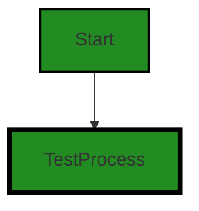

# Polyverse Boost-generated Source Analysis Details

## Source: ./bind/bind_test.go
Date Generated: Thursday, September 7, 2023 at 1:09:37 PM PDT


---

### Boost Architectural Quick Summary Security Report

Last Updated: Friday, September 8, 2023 at 3:19:04 PM PDT


Executive Report:

1. **Architectural Impact**: The analysis of this file has not revealed any severe issues.
2. **Risk Analysis**: The analysis of this file has not revealed any severe issues.
3. **Potential Customer Impact**: Based on the analysis, there are no severe issues that could potentially impact customers.
4. **Performance Issues**: Our analysis did not identify any explicit performance issues in the file.
5. **Risk Assessment**: Based on the current analysis of this file, no severe issues have been found. However, this doesn't guarantee that the file is risk-free.

Highlights:

- No severe issues were identified in the current analysis of this file.


---

### Boost Architectural Quick Summary Performance Report

Last Updated: Friday, September 8, 2023 at 3:19:10 PM PDT


Executive Report:

1. **Architectural Impact**: The analysis of this file has not revealed any severe issues.
2. **Risk Analysis**: The analysis of this file has not revealed any severe issues.
3. **Potential Customer Impact**: Based on the analysis, there are no severe issues that could potentially impact customers.
4. **Performance Issues**: Our analysis did not identify any explicit performance issues in the file.
5. **Risk Assessment**: Based on the current analysis of this file, no severe issues have been found. However, this doesn't guarantee that the file is risk-free.

Highlights:

- No severe issues were identified in the current analysis of this file.


---

### Boost Architectural Quick Summary Compliance Report

Last Updated: Friday, September 8, 2023 at 3:19:17 PM PDT


Executive Report:

1. **Architectural Impact**: The analysis of this file has not revealed any severe issues.
2. **Risk Analysis**: The analysis of this file has not revealed any severe issues.
3. **Potential Customer Impact**: Based on the analysis, there are no severe issues that could potentially impact customers.
4. **Performance Issues**: Our analysis did not identify any explicit performance issues in the file.
5. **Risk Assessment**: Based on the current analysis of this file, no severe issues have been found. However, this doesn't guarantee that the file is risk-free.

Highlights:

- No severe issues were identified in the current analysis of this file.

---
## Detailed Analysis:

### Cell 0:
## Original Code:

### Programming Language: go
### ./bind/bind_test.go 

```go
package bind_test

import (
 "testing"

 "github.com/jt0/gomer/_test/assert"
 "github.com/jt0/gomer/bind"
)

func TestCopyWithOptions(t *testing.T) {
 b1 := bind.NewConfiguration()
 b2 := bind.CopyConfigurationWithOptions(b1, bind.IncludeEmpty, bind.EmptyDirectiveIncludesField)

 assert.NotEquals(t, b1, b2)
}

```
## Boost Analysis:


---

### Boost Code Explanation

Last Updated: Thursday, September 7, 2023 at 1:09:00 PM PDT

This is a Go test file for a package named `bind`. The `bind` package is likely part of the `gomer` project, which seems to be a server-side application. 

The code is importing the `testing` package, which is a standard package in Go for writing unit tests. It is also importing two custom packages, `assert` and `bind`, from the `gomer` project. 

The `assert` package is typically used for making assertions in tests - checking that things are as they should be. The `bind` package, judging by the name and the usage in the test, seems to be related to data binding. This usually involves linking two data sources together and keeping them in sync.

The test function `TestCopyWithOptions` is testing the function `CopyConfigurationWithOptions` of the `bind` package.

Here's a step-by-step breakdown of the test function:

1. `b1 := bind.NewConfiguration()` - This line is creating a new configuration object using the `NewConfiguration` function of the `bind` package. The resulting configuration object is stored in the `b1` variable.

2. `b2 := bind.CopyConfigurationWithOptions(b1, bind.IncludeEmpty, bind.EmptyDirectiveIncludesField)` - This line is creating a copy of the `b1` configuration object using the `CopyConfigurationWithOptions` function of the `bind` package. The function also takes two additional parameters, `bind.IncludeEmpty` and `bind.EmptyDirectiveIncludesField`, which seem to be options that control how the copying is done. The copied configuration object is stored in the `b2` variable.

3. `assert.NotEquals(t, b1, b2)` - This line is asserting that `b1` and `b2` are not the same. This is likely checking that the `CopyConfigurationWithOptions` function is correctly creating a new copy of the configuration object, rather than simply returning the same object.

The algorithm used in this code is quite straightforward - it's creating a new configuration object, copying it with certain options, and then asserting that the original and copied objects are not the same.

Here are some resources for further learning:

- [Go Testing package](https://golang.org/pkg/testing/)
- [Go Test Functions](https://golang.org/doc/tutorial/add-a-test)
- [Data Binding in Go](https://golang.org/doc/articles/wiki/#data) (this is not exactly the same as the `bind` package in this code, but it gives a good introduction to data binding in general)


---

### Boost Flow Diagram

Last Updated: Thursday, September 7, 2023 at 1:09:06 PM PDT




---

### Boost Source-Level Security Analysis

Last Updated: Thursday, September 7, 2023 at 1:09:13 PM PDT

**No bugs found**


---

### Boost Source-Level Performance Analysis

Last Updated: Thursday, September 7, 2023 at 1:09:29 PM PDT

1. **Severity**: 4/10

   **Line Number**: 14

   **Bug Type**: Memory

   **Description**: Creating a new configuration (b1) and then immediately copying it (b2) is inefficient and may lead to unnecessary memory usage.

   **Solution**: Consider passing the configuration directly where needed, or if a copy is necessary, ensure it's only done when modifications to the original configuration should not be reflected in the copy.


---

### Boost Source-Level Data and Privacy Compliance Analysis

Last Updated: Thursday, September 7, 2023 at 1:09:37 PM PDT

**No bugs found**

