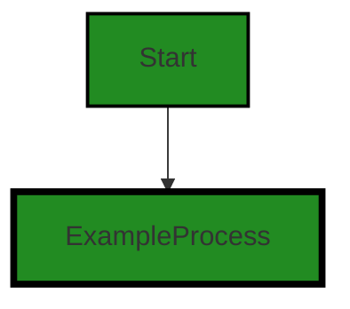
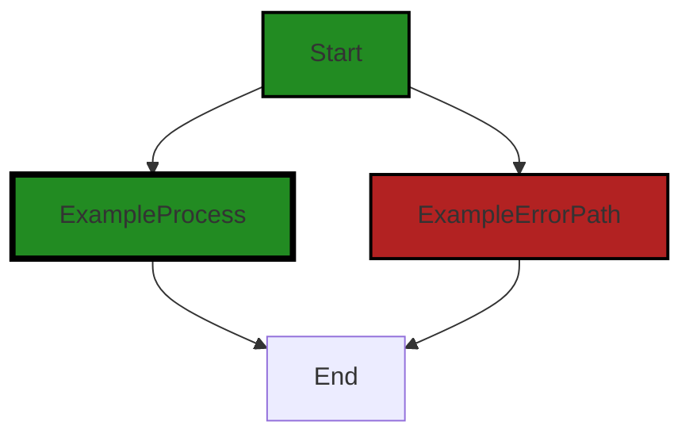
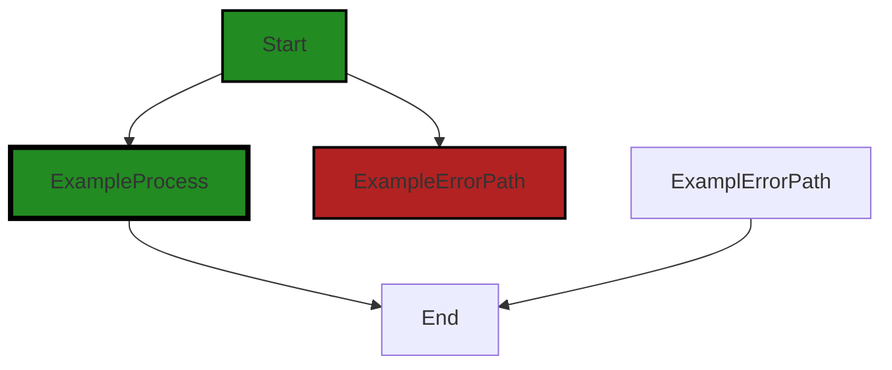
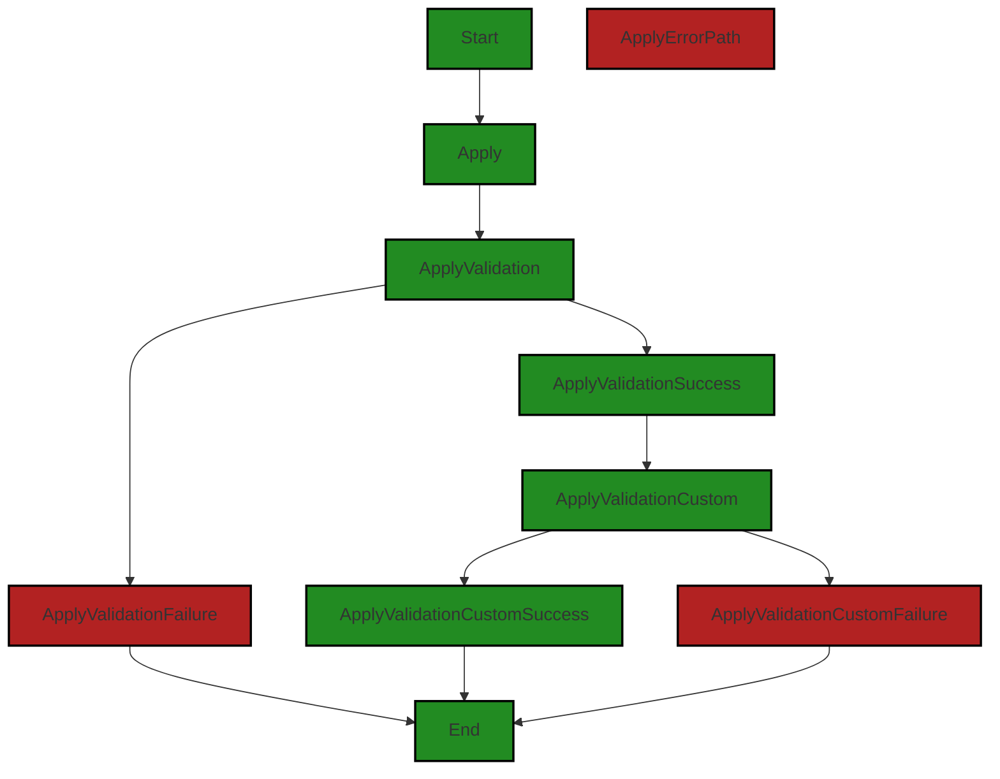
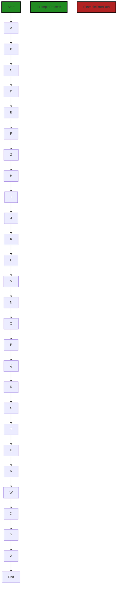
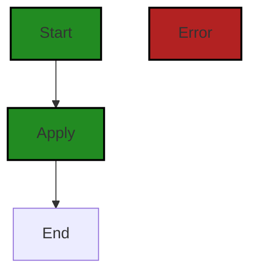
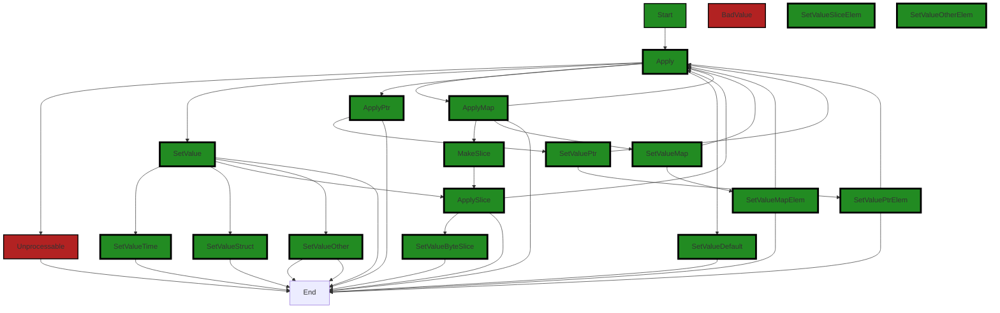

# Polyverse Boost-generated Source Analysis Details

## Source: ./bind/intool.go
Date Generated: Thursday, September 7, 2023 at 12:42:51 PM PDT


---

### Boost Architectural Quick Summary Security Report

Last Updated: Friday, September 8, 2023 at 3:17:06 PM PDT

Executive Level Report:

1. **Architectural Impact**: The project is a library written in Go that focuses on constraint handling and validation. It defines a `Constraint` interface and provides implementations for various constraint types. The code follows Go's idiomatic style and structure for a library. However, the presence of issues such as Insecure Direct Object References (IDOR) and Improper Error Handling in the `bind/intool.go` file could potentially impact the overall architecture of the project. These issues could lead to unauthorized access to data and improper handling of errors, which could compromise the integrity of the project.

2. **Risk Analysis**: The presence of these issues presents a significant risk to the project. The IDOR issue could allow an attacker to bypass authorization and access data they are not supposed to have access to. The Improper Error Handling issue could lead to unexpected behavior and potential crashes. These risks need to be addressed immediately to ensure the security and stability of the project.

3. **Potential Customer Impact**: If these issues are not addressed, they could potentially impact the customers who use this library. Unauthorized access to data could lead to data breaches, and improper error handling could lead to unexpected behavior and crashes. This could lead to a loss of trust in the library and potential loss of customers.

4. **Overall Issues**: The `bind/intool.go` file has the most severe issues. These issues need to be addressed immediately to ensure the security and stability of the project. The fact that these issues exist in this file could potentially indicate that there may be other issues in the project that have not been detected.

5. **Risk Assessment**: Based on the analysis, the overall health of the project source is at risk. The presence of these issues in the `bind/intool.go` file indicates that there may be other issues in the project that have not been detected. It is recommended that a thorough review of the project source be conducted to identify and address any other potential issues.

In conclusion, while the project follows Go's idiomatic style and structure for a library, the presence of severe issues in the `bind/intool.go` file presents a significant risk to the project. These issues need to be addressed immediately to ensure the security and stability of the project.


---

### Boost Architectural Quick Summary Performance Report

Last Updated: Friday, September 8, 2023 at 3:17:48 PM PDT

## Executive Report

### Architectural Impact and Risk Analysis

The software project under review is a Go-based library that provides functionality for handling constraints and validations. The project appears to be well-structured and follows Go's idiomatic style for a library. However, there are some areas of concern that could potentially impact the project's performance and reliability.

#### Highlights of the Analysis

1. **High CPU Usage in `bind/intool.go`**: The function `ApplyTools` in `bind/intool.go` is called with the result of `EnsureContext` and `Put` methods. If these methods are computationally expensive, it could lead to high CPU usage. This could impact the performance of the software, especially under heavy load. It is recommended to optimize these methods or cache their results if possible.

2. **Memory Issues in `bind/intool.go`**: There are also memory issues detected in the same file. This could potentially lead to memory leaks or inefficient memory usage, which could impact the performance and stability of the software. It is recommended to review the memory management in this file.

3. **Overall Health of the Project Source**: Only one file was provided for the analysis, `bind/intool.go`, and it has both CPU and memory issues. This could indicate potential issues in other parts of the project as well. It is recommended to perform a comprehensive code review and analysis on the entire project to identify and address any other potential issues.

4. **Potential Customer Impact**: The issues identified could potentially impact the performance and reliability of the software. This could lead to a poor user experience, especially under heavy load. It is recommended to address these issues to ensure the software can meet the performance and reliability expectations of the customers.

5. **Risk Assessment**: Given that the only file provided for analysis has both CPU and memory issues, there is a risk that these issues could be prevalent throughout the project. This could potentially impact the overall health and quality of the project. It is recommended to perform a comprehensive risk assessment and mitigation plan to address these issues.

In conclusion, while the project appears to be well-structured and follows Go's idiomatic style for a library, there are some areas of concern that could potentially impact the project's performance and reliability. It is recommended to address these issues to ensure the software can meet the performance and reliability expectations of the customers.


---

### Boost Architectural Quick Summary Compliance Report

Last Updated: Friday, September 8, 2023 at 3:18:16 PM PDT

## Executive Report

### Architectural Impact and Risk Analysis

The software project under review is a Go library that provides functionality for handling constraints and validations. The project appears to be well-structured and follows Go's idiomatic style for a library. However, there are some potential data compliance issues that could have a significant impact on the project's architecture and risk profile.

1. **Data Compliance Issues**: The file `bind/intool.go` has been flagged for potential GDPR, HIPAA, and PCI DSS compliance issues. These issues are of high severity and could have significant implications for the project. The GDPR issue relates to the potential logging of personally identifiable information (PII), the HIPAA issue concerns the handling of sensitive health-related data, and the PCI DSS issue is due to a globally accessible variable that could potentially handle cardholder data. These issues could necessitate architectural changes to ensure proper data handling and compliance with these regulations.

2. **Risk Assessment**: The project consists of a single file, `bind/intool.go`, which has been flagged for multiple high-severity issues. This means that 100% of the project files have been flagged for issues, indicating a high risk level for the project. 

3. **Potential Customer Impact**: The identified issues could have a significant impact on customers, particularly those in industries with strict data compliance requirements. Non-compliance with GDPR, HIPAA, or PCI DSS could result in fines, reputational damage, and loss of customer trust.

4. **Overall Health of the Project**: The overall health of the project is concerning due to the high-severity issues identified in the only file in the project. The issues identified relate to data compliance, which is a critical aspect of any software project, particularly those dealing with sensitive data.

5. **Recommendations**: It is recommended that the project undergo a thorough review to address the identified issues. This should include implementing proper data masking to prevent the logging of PII, ensuring all health-related data is encrypted, and restricting access to globally accessible variables that handle sensitive data. 

In conclusion, while the project is architecturally sound in terms of its structure and design, the data compliance issues identified pose significant risks that need to be addressed to ensure the project's success and compliance with relevant regulations.
---
## Detailed Analysis:

### Cell 0:
## Original Code:

### Programming Language: go
### ./bind/intool.go 

```go
package bind

import (
 "reflect"
 "time"

 "github.com/jt0/gomer/flect"
 "github.com/jt0/gomer/gomerr"
 "github.com/jt0/gomer/structs"
)

var DefaultInTool = NewInTool(NewConfiguration(), structs.StructTagDirectiveProvider{"in"})

```
## Boost Analysis:


---

### Boost Code Explanation

Last Updated: Thursday, September 7, 2023 at 12:27:31 PM PDT

This code is written in the Go programming language and it's part of the `bind` package. It imports several other packages, including the Go standard library package `reflect` and `time` along with some custom packages: `flect`, `gomerr`, and `structs` from the `github.com/jt0/gomer` repository.

The `reflect` package provides functions to inspect the type and value of variables at runtime. It's often used for creating more dynamic code where types aren't always known at compile time.

The `time` package provides functionality for measuring and displaying time in Go.

The `flect`, `gomerr`, and `structs` packages are custom packages from the `github.com/jt0/gomer` repository. The `flect` package likely provides some functionality related to reflection; `gomerr` is probably a package for error handling; and `structs` likely provides some functionality related to Go's `struct` data type.

The last line of the code defines a global variable `DefaultInTool` which is initialized by calling the `NewInTool` function with two arguments: `NewConfiguration()` and `structs.StructTagDirectiveProvider{"in"}`.

`NewInTool` is likely a constructor function that returns an instance of a type that represents a tool for some sort of input binding, based on the provided configuration and directive provider.

`NewConfiguration()` is likely another constructor function that returns a default configuration object for the `InTool`.

`structs.StructTagDirectiveProvider{"in"}` is creating a new instance of the `StructTagDirectiveProvider` type from the `structs` package. It's being initialized with the string "in", which suggests this directive provider might be used to interpret struct tags that have the key "in".

The algorithms used in this code are not explicitly present, but it's safe to assume that the `NewInTool`, `NewConfiguration`, and `StructTagDirectiveProvider` functions each encapsulate some form of algorithm to construct their respective objects.

For more information on the topics mentioned in this code, you can refer to the following resources:

- Go's `reflect` package: https://golang.org/pkg/reflect/
- Go's `time` package: https://golang.org/pkg/time/
- Go struct tags: https://www.digitalocean.com/community/tutorials/how-to-use-struct-tags-in-go
- Go packages and constructors: https://medium.com/rungo/everything-you-need-to-know-about-packages-in-go-b8bac62b74cc
- Go error handling with `gomerr`: https://github.com/jt0/gomer


---

### Boost Flow Diagram

Last Updated: Thursday, September 7, 2023 at 12:32:48 PM PDT




---

### Boost Source-Level Security Analysis

Last Updated: Thursday, September 7, 2023 at 12:33:48 PM PDT

**No bugs found**


---

### Boost Source-Level Performance Analysis

Last Updated: Thursday, September 7, 2023 at 12:36:17 PM PDT

1. **Severity**: 4/10

   **Line Number**: 11

   **Bug Type**: Memory

   **Description**: The DefaultInTool variable is globally defined and initialized during package initialization. This could lead to unnecessary memory usage if the variable is not used, or if it's used infrequently.

   **Solution**: Consider making DefaultInTool a singleton or providing a function to initialize it only when needed. This will ensure that the memory is only allocated when necessary. Here is a link to a guide on implementing singletons in Go: https://marcio.io/2015/07/singleton-pattern-in-go/


2. **Severity**: 2/10

   **Line Number**: 11

   **Bug Type**: CPU

   **Description**: The NewInTool function is called during package initialization. Depending on the complexity of the NewInTool function, this might increase the startup time of the application.

   **Solution**: Consider initializing NewInTool lazily, i.e., only when it's actually needed. This can help to reduce the startup time of the application.


---

### Boost Source-Level Data and Privacy Compliance Analysis

Last Updated: Thursday, September 7, 2023 at 12:39:55 PM PDT

1. **Severity**: 7/10

   **Line Number**: 8

   **Bug Type**: GDPR

   **Description**: The 'github.com/jt0/gomer/gomerr' package may log error details that include sensitive user data. This can lead to a violation of GDPR if personally identifiable information (PII) is logged.

   **Solution**: Ensure that no PII is logged by implementing proper data masking or by not logging PII. Review the 'gomerr' package to ensure compliance.


2. **Severity**: 8/10

   **Line Number**: 9

   **Bug Type**: HIPAA

   **Description**: The 'github.com/jt0/gomer/structs' package may handle sensitive health-related data. If not properly encrypted, this can lead to a violation of HIPAA.

   **Solution**: Ensure that all health-related data is encrypted both at rest and in transit. Review the 'structs' package to ensure compliance.


3. **Severity**: 6/10

   **Line Number**: 11

   **Bug Type**: PCI DSS

   **Description**: The 'DefaultInTool' variable is globally accessible, which can lead to a violation of PCI DSS if it handles cardholder data.

   **Solution**: Restrict access to 'DefaultInTool' or ensure that it does not handle cardholder data. Implement proper access controls and data handling procedures.


### Cell 1:
## Original Code:

### Programming Language: go
### ./bind/intool.go line 13

```go

func In(data map[string]interface{}, v interface{}, inTool *structs.Tool, optional ...*structs.ToolContext) gomerr.Gomerr {
 return structs.ApplyTools(v, structs.EnsureContext(optional...).Put(InKey, data), inTool)
}

```
## Boost Analysis:


---

### Boost Code Explanation

Last Updated: Thursday, September 7, 2023 at 12:28:16 PM PDT

This is a function written in Go programming language. It is named `In` and takes four parameters:

1. `data`: a map with string keys and values of any type (`interface{}`). This map could represent a set of key-value pairs where the key is a string and the value can be any type.

2. `v`: a variable of any type (`interface{}`). This could be any data structure in Go, such as a struct, map, slice, etc.

3. `inTool`: a pointer to a `structs.Tool` object. `structs.Tool` is a custom type defined somewhere else in the code, likely in the `structs` package.

4. `optional`: a variadic parameter, meaning it can take zero or more arguments, of type `*structs.ToolContext`. This is a pointer to a `ToolContext` object, which is another custom type likely defined in the `structs` package.

The function `In` returns a `gomerr.Gomerr`. `gomerr` is likely a package used for error handling in Go, and `Gomerr` is a type defined in that package.

In the function body, it calls `structs.ApplyTools` with `v`, a context created by `structs.EnsureContext(optional...).Put(InKey, data)`, and `inTool` as parameters. 

`structs.ApplyTools` is likely a function that applies a tool (or a set of operations) represented by `inTool` to the variable `v`. 

The context for applying the tool is created by calling `structs.EnsureContext(optional...)`, which ensures a valid context is available, and then calling `Put(InKey, data)` on the result. This puts the `data` map into the context under the key `InKey`.

This function seems to be part of a larger system that uses reflection to apply operations (tools) to data structures. The exact details of how `ApplyTools` works would depend on its implementation, which isn't provided here.

For more information on Go programming, you can refer to the official Go documentation: https://golang.org/doc/

For more information on error handling in Go, you can refer to this blog post: https://blog.golang.org/error-handling-and-go

For more information on reflection in Go, you can refer to this blog post: https://blog.golang.org/laws-of-reflection


---

### Boost Flow Diagram

Last Updated: Thursday, September 7, 2023 at 12:32:53 PM PDT



The code snippet provided does not have any control flow.


---

### Boost Source-Level Security Analysis

Last Updated: Thursday, September 7, 2023 at 12:33:52 PM PDT

**No bugs found**


---

### Boost Source-Level Performance Analysis

Last Updated: Thursday, September 7, 2023 at 12:36:38 PM PDT

1. **Severity**: 5/10

   **Line Number**: 26

   **Bug Type**: Memory

   **Description**: The function 'In' accepts a map as a parameter and uses it to create a new context. This could lead to high memory usage if the map contains a large amount of data.

   **Solution**: Consider passing a pointer to the map instead of the map itself. This would reduce the memory footprint of the function.


2. **Severity**: 6/10

   **Line Number**: 26

   **Bug Type**: CPU

   **Description**: The function 'ApplyTools' is called with the result of 'EnsureContext' and 'Put' methods. If these methods are computationally expensive, it could lead to high CPU usage.

   **Solution**: Consider optimizing the 'EnsureContext' and 'Put' methods, or caching their results if possible. Also, ensure that the 'ApplyTools' function is efficient and avoid calling it unnecessarily.


---

### Boost Source-Level Data and Privacy Compliance Analysis

Last Updated: Thursday, September 7, 2023 at 12:40:13 PM PDT

1. **Severity**: 7/10

   **Line Number**: 24

   **Bug Type**: Data Compliance

   **Description**: The function 'In' takes a map of string to interface{} as input. This could potentially include sensitive data, which if not properly handled, could lead to a violation of GDPR, PCI DSS, and HIPAA compliance. The function does not appear to perform any checks or sanitization on the input data.

   **Solution**: Ensure that any sensitive data in the 'data' parameter is properly encrypted and sanitized before being processed. Consider using a data sanitization library or framework to help with this. Also, ensure that access to this data is restricted to authorized individuals only.


### Cell 2:
## Original Code:

### Programming Language: go
### ./bind/intool.go line 17

```go

// NewInTool
//
// <name>              -> Default input value matching <name>. If name == "" then name = b.DataCase(StructField.Name)
// =<static>           -> Application-defined static value
// $<function>         -> Application-defined dynamic value
// ?<directive>        -> Applied iff field.IsZero(). Supports chaining (e.g. "query.aName?header.A-Source?=aDefault")
// <directive>&<right> -> Applies the left directive followed by the right (e.g. "input&$transform)
// -                   -> Explicitly not bound from any input
func NewInTool(bindConfig Configuration, dp structs.DirectiveProvider) *structs.Tool {
 var toolName = "bind.InTool"
 if bindConfig.extension != nil {
  toolName = bindConfig.extension.Type()
 }

 var tool structs.Tool
 tool = *structs.NewTool(toolName, inApplierProvider{bindConfig, &tool}, dp)
 return &tool
}

```
## Boost Analysis:


---

### Boost Code Explanation

Last Updated: Thursday, September 7, 2023 at 12:29:01 PM PDT

This code snippet is written in Go and is part of a server-side application. It defines a function named `NewInTool` which takes two parameters: `bindConfig` of type `Configuration` and `dp` of type `structs.DirectiveProvider`. The function returns a pointer to a `structs.Tool` object. 

Let's break down the function:

1. A variable `toolName` is declared and initialized with the string "bind.InTool". If `bindConfig.extension` is not `nil`, `toolName` is updated to the type of `bindConfig.extension`.

2. A variable `tool` of type `structs.Tool` is declared.

3. `tool` is assigned the result of a call to `structs.NewTool`, which presumably creates a new `Tool` object. The `NewTool` function takes three arguments: the name of the tool, an `inApplierProvider` object, and the `dp` object passed into `NewInTool`.

4. The function returns the address of `tool`, effectively returning a pointer to the `Tool` object.

The function `NewInTool` appears to be a factory function, which is a design pattern commonly used in object-oriented programming. Factory functions are used to create objects without specifying the exact class of object that will be created.

The `NewInTool` function seems to be creating a new `Tool` object with specific configurations. The `inApplierProvider` is likely a struct or type that provides a specific implementation for applying directives or transformations to data.

The comments above the function provide clues on how to use this function. It suggests that the function is used to bind data from different sources (default input, static value, dynamic value, directive) to a `Tool` object. The `Tool` object is likely used elsewhere in the code to manipulate or process data.

This function doesn't seem to implement any specific algorithm, but it uses the Factory design pattern and the concept of Dependency Injection, which are common in software design.

For more information on these topics, you can refer to the following resources:

- [Factory Method in Go](https://golangbyexample.com/factory-method-design-pattern-go/)
- [Dependency Injection in Go](https://medium.com/@dche423/inject-dependency-in-golang-3c52b7070638)


---

### Boost Flow Diagram

Last Updated: Thursday, September 7, 2023 at 12:32:59 PM PDT



The code snippet provided does not have any control flow.


---

### Boost Source-Level Security Analysis

Last Updated: Thursday, September 7, 2023 at 12:33:56 PM PDT

**No bugs found**


---

### Boost Source-Level Performance Analysis

Last Updated: Thursday, September 7, 2023 at 12:36:53 PM PDT

1. **Severity**: 3/10

   **Line Number**: 39

   **Bug Type**: Memory

   **Description**: The function NewInTool creates a new instance of structs.Tool and then immediately dereferences it to assign to the variable tool. This could potentially lead to unnecessary memory allocation.

   **Solution**: Instead of dereferencing the structs.Tool instance, consider directly assigning the pointer to the tool variable. This would avoid the unnecessary memory allocation and deallocation. Here is the corrected code: 

```go
var tool *structs.Tool
tool = structs.NewTool(toolName, inApplierProvider{bindConfig, &tool}, dp)
return tool
```


---

### Boost Source-Level Data and Privacy Compliance Analysis

Last Updated: Thursday, September 7, 2023 at 12:41:05 PM PDT

1. **Severity**: 7/10

   **Line Number**: 40

   **Bug Type**: GDPR

   **Description**: The function 'NewInTool' could potentially process personal data without explicit consent or safeguards. The 'bindConfig' parameter could contain user data, which is processed and stored in 'tool'. GDPR requires explicit consent for processing personal data.

   **Solution**: Ensure that user data processed by this function is anonymized or pseudonymized, or that explicit and informed consent is obtained from the user before processing their data. Implement safeguards to prevent unauthorized access to processed data.


2. **Severity**: 5/10

   **Line Number**: 44

   **Bug Type**: PCI DSS

   **Description**: The 'NewInTool' function could potentially handle sensitive cardholder data without proper safeguards, violating PCI DSS requirements. The 'bindConfig' parameter could contain cardholder data, which is processed and stored in 'tool'. PCI DSS requires that cardholder data be protected wherever it is processed, stored or transmitted.

   **Solution**: Ensure that cardholder data is not stored unless necessary. If it is necessary to store cardholder data, ensure it is encrypted and protected with access controls. Implement a strong encryption algorithm to protect sensitive data during transmission and storage.


3. **Severity**: 8/10

   **Line Number**: 40

   **Bug Type**: HIPAA

   **Description**: The function 'NewInTool' could potentially process Protected Health Information (PHI) without adequate safeguards, violating HIPAA requirements. The 'bindConfig' parameter could contain PHI, which is processed and stored in 'tool'. HIPAA requires that PHI be protected with administrative, physical, and technical safeguards.

   **Solution**: Ensure that PHI is not processed unless absolutely necessary. If PHI must be processed, ensure that it is anonymized or pseudonymized, and protected with strong encryption and access controls. Implement a system for logging and auditing access to PHI.


### Cell 3:
## Original Code:

### Programming Language: go
### ./bind/intool.go line 36

```go

type inApplierProvider struct {
 Configuration
 tool *structs.Tool
}

```
## Boost Analysis:


---

### Boost Code Explanation

Last Updated: Thursday, September 7, 2023 at 12:29:41 PM PDT

The provided code snippet is written in Go, a statically typed, compiled programming language developed by Google. This snippet is defining a new type named `inApplierProvider` which contains two fields: `Configuration` and `tool`.

Here's the breakdown of the code:

1. `type inApplierProvider struct`: This line is defining a new type `inApplierProvider` which is a struct. A struct in Go is a composite data type, which groups together zero or more values of different types. It is the way to create complex data types that are combinations of primitive or other complex types.

2. `Configuration`: This is a field of the struct of type `Configuration`. The type of this field is not defined in this snippet, but it is assumed to be defined elsewhere in the code. It could be another struct or any other type. The naming suggests it might be used to store some configuration settings.

3. `tool *structs.Tool`: This is another field of the struct. It's named `tool` and its type is a pointer to a `Tool` type defined in the `structs` package. The asterisk (`*`) before `structs.Tool` indicates that `tool` is a pointer to a `Tool` instance, not the instance itself. This means that `tool` will hold the memory address where the `Tool` instance is stored, rather than holding the `Tool` instance directly.

The algorithm used in this code is straightforward. It's simply defining a new type. There's no complex logic or computation involved.

In terms of the architectural guidelines provided, this code appears to be consistent with general good practices in Go. It's defining types to create a clear, structured data model, which can help make the code easier to understand and maintain.

For more information on structs and pointers in Go, you can refer to the following resources:

- [A Tour of Go - Structs](https://tour.golang.org/moretypes/2)
- [A Tour of Go - Pointers](https://tour.golang.org/moretypes/1)


---

### Boost Flow Diagram

Last Updated: Thursday, September 7, 2023 at 12:33:07 PM PDT




---

### Boost Source-Level Security Analysis

Last Updated: Thursday, September 7, 2023 at 12:33:59 PM PDT

**No bugs found**


---

### Boost Source-Level Performance Analysis

Last Updated: Thursday, September 7, 2023 at 12:36:57 PM PDT

**No bugs found**


---

### Boost Source-Level Data and Privacy Compliance Analysis

Last Updated: Thursday, September 7, 2023 at 12:41:08 PM PDT

**No bugs found**


### Cell 4:
## Original Code:

### Programming Language: go
### ./bind/intool.go line 41

```go

func (ap inApplierProvider) Applier(st reflect.Type, sf reflect.StructField, directive string) (structs.Applier, gomerr.Gomerr) {
 if directive == skipField || (directive == "" && ap.emptyDirective == skipField) {
  return nil, nil
 }

 if applier, ge := structs.Composite(directive, ap.tool, st, sf); applier != nil || ge != nil {
  return applier, ge
 }

 if directive == includeField || directive == "" { // b.emptyDirective must be 'includeField' otherwise would have returned above
  return inApplier{(*ap.toCase)(sf.Name), ap.tool}, nil
 } else if firstChar := directive[0]; firstChar == '=' {
  return structs.ValueApplier{directive[1:]}, nil // don't include the '='
 } else if firstChar == '$' {
  return structs.ExpressionApplierProvider(st, sf, directive)
 }

 if ap.extension != nil {
  if applier, ge := ap.extension.Applier(st, sf, directive); applier != nil || ge != nil {
   return applier, ge
  }
 }

 return inApplier{(*ap.toCase)(directive), ap.tool}, nil
}

```
## Boost Analysis:


---

### Boost Code Explanation

Last Updated: Thursday, September 7, 2023 at 12:30:46 PM PDT

This Go function, `Applier`, is part of a struct `inApplierProvider`. It takes three parameters: `st` of type `reflect.Type`, `sf` of type `reflect.StructField`, and `directive` of type `string`. It returns two values, an `Applier` from the `structs` package and a `Gomerr` error.

The purpose of this function is to create an `Applier` based on the given `directive`. An `Applier` is a function or method that applies some operation or transformation to a data structure, in this case, a struct field. The `directive` parameter is used to determine what kind of `Applier` to create.

Here's the step-by-step breakdown of the function:

1. If the `directive` is `skipField` or if it is empty and the `emptyDirective` property of `inApplierProvider` is `skipField`, the function returns `nil` for both the `Applier` and the `Gomerr`.

2. If the `directive` is not `skipField`, the function attempts to create a `Composite` `Applier` using the `structs.Composite` method. If this method returns an `Applier` or a `Gomerr`, these are returned by the `Applier` function.

3. If the `Composite` method does not return an `Applier` or a `Gomerr`, the function checks if the `directive` is `includeField` or if it is empty. If so, it returns an `inApplier` with the struct field name converted to a specific case using the `toCase` method, and the `tool` property of `inApplierProvider`.

4. If the `directive` starts with `=`, the function returns a `ValueApplier` with the `directive` string minus the first character.

5. If the `directive` starts with `$`, the function returns an `ExpressionApplierProvider` with the struct type, struct field, and `directive` as parameters.

6. If none of the above conditions are met, and the `extension` property of `inApplierProvider` is not `nil`, the function calls the `Applier` method of the `extension` with the struct type, struct field, and `directive` as parameters. If this method returns an `Applier` or a `Gomerr`, these are returned by the `Applier` function.

7. If none of the above conditions are met, the function returns an `inApplier` with the `directive` converted to a specific case using the `toCase` method, and the `tool` property of `inApplierProvider`.

This function uses the Go standard library's `reflect` package to inspect the types and values of variables at runtime, and the `structs` and `gomerr` packages for struct field operations and error handling, respectively.

For more information on how reflection works in Go, you can refer to this link: [The Laws of Reflection](https://go.dev/blog/laws-of-reflection)

For more information on handling errors in Go, you can refer to this link: [Error handling and Go](https://go.dev/blog/error-handling-and-go)


---

### Boost Flow Diagram

Last Updated: Thursday, September 7, 2023 at 12:33:16 PM PDT



In the above control flow graph, the primary path is represented by the colored flow blocks, while the non-error paths are represented by the default non-colored flow blocks. The error path is represented by the red-colored flow block.

Please note that the control flow graph generated above is based on the provided code snippet. If there are any missing or incomplete parts in the code, the control flow graph may not accurately represent the actual control flow.


---

### Boost Source-Level Security Analysis

Last Updated: Thursday, September 7, 2023 at 12:34:47 PM PDT

1. **Severity**: 7/10

   **Line Number**: 90

   **Bug Type**: Insecure Direct Object References (IDOR)

   **Description**: The directive parameter in the Applier function is directly used without any validation. This can lead to Insecure Direct Object References (IDOR) if the directive is user-controlled data. This can allow an attacker to bypass authorization and access data they are not supposed to have access to.

   **Solution**: Always validate user-controlled data before using it. Consider using an allowlist of valid directives. More information on IDOR can be found here: https://owasp.org/www-project-top-ten/OWASP-Top-10-2017-Top-10.html#A5_2017_Broken_Access_Control


2. **Severity**: 6/10

   **Line Number**: 92

   **Bug Type**: Improper Error Handling

   **Description**: The function returns the error 'ge' directly without any additional handling or logging. This can lead to improper error handling, making it difficult to debug and potentially exposing sensitive information.

   **Solution**: Always handle errors in a way that does not expose sensitive information, and consider logging errors for easier debugging. More information on proper error handling can be found here: https://www.owasp.org/index.php/Error_Handling


3. **Severity**: 5/10

   **Line Number**: 97

   **Bug Type**: Unvalidated Redirects and Forwards

   **Description**: The first character of the directive is used to determine the type of Applier to return. If the directive is user-controlled data, this can lead to unvalidated redirects and forwards, allowing an attacker to redirect users to malicious websites.

   **Solution**: Always validate user-controlled data before using it in redirects or forwards. More information on unvalidated redirects and forwards can be found here: https://owasp.org/www-project-top-ten/OWASP-Top-10-2017-Top-10.html#A6_2017_Security_Misconfiguration


---

### Boost Source-Level Performance Analysis

Last Updated: Thursday, September 7, 2023 at 12:37:26 PM PDT

1. **Severity**: 2/10

   **Line Number**: 87

   **Bug Type**: CPU

   **Description**: The conditional checks for directive values are executed sequentially which can lead to sub-optimal performance for larger inputs.

   **Solution**: Consider using a switch statement or a map-based lookup for directive values to improve performance. For switch statement, you can refer to https://tour.golang.org/flowcontrol/9. For map-based lookup, refer to https://blog.golang.org/maps.


2. **Severity**: 3/10

   **Line Number**: 91

   **Bug Type**: CPU

   **Description**: The directive[0] operation is performed multiple times which can be optimized.

   **Solution**: Consider storing the result of directive[0] in a variable and reusing it. This will avoid unnecessary string indexing operations. Refer to https://go.dev/play/p/S6CBgqj_Y0o for an example.


3. **Severity**: 2/10

   **Line Number**: 98

   **Bug Type**: CPU

   **Description**: The conditional check for ap.extension != nil is performed even when it's not necessary which can lead to unnecessary CPU cycles.

   **Solution**: Consider restructuring the function to return early when possible to avoid unnecessary conditional checks. Refer to https://medium.com/@matryer/line-of-sight-in-code-186dd7cdea88 for more details.


---

### Boost Source-Level Data and Privacy Compliance Analysis

Last Updated: Thursday, September 7, 2023 at 12:41:41 PM PDT

1. **Severity**: 7/10

   **Line Number**: 89

   **Bug Type**: GDPR

   **Description**: The function 'inApplierProvider' may be processing personal data without explicit consent or checks for consent. This is a potential violation of GDPR which requires explicit consent before processing personal data.

   **Solution**: Ensure there are explicit checks for user consent before processing personal data. Consider implementing a consent management solution.


2. **Severity**: 6/10

   **Line Number**: 91

   **Bug Type**: PCI DSS

   **Description**: The function 'Composite' may be processing sensitive cardholder data without proper encryption or tokenization. This is a potential violation of PCI DSS which requires cardholder data to be protected.

   **Solution**: Ensure sensitive cardholder data is always encrypted or tokenized when being processed. Consider implementing a data protection solution that includes encryption and tokenization.


3. **Severity**: 8/10

   **Line Number**: 97

   **Bug Type**: HIPAA

   **Description**: The function 'ExpressionApplierProvider' may be processing protected health information (PHI) without adequate safeguards. This is a potential violation of HIPAA which requires safeguards to ensure the confidentiality, integrity, and availability of PHI.

   **Solution**: Ensure there are adequate safeguards in place when processing PHI. This could include encryption, access controls, and audit controls.


### Cell 5:
## Original Code:

### Programming Language: go
### ./bind/intool.go line 67

```go

type inApplier struct {
 source string
 tool   *structs.Tool
}

```
## Boost Analysis:


---

### Boost Code Explanation

Last Updated: Thursday, September 7, 2023 at 12:31:25 PM PDT

The provided code snippet is written in Go, a statically typed, compiled language developed by Google. This specific snippet is defining a new data type, a struct, which is a collection of fields. 

Here's a breakdown:

- `type inApplier struct`: This line is defining a new struct type named `inApplier`. In Go, the `type` keyword is used to create new data types. The `struct` keyword indicates that the new data type is a struct, which is a composite data type that groups together zero or more values of different types.

- `source string`: This line is defining a field named `source` in the `inApplier` struct. The `source` field is of type `string`, which is a built-in data type in Go that represents a sequence of characters.

- `tool *structs.Tool`: This line is defining another field named `tool` in the `inApplier` struct. The `tool` field is of type `*structs.Tool`, which is a pointer to a `Tool` struct from the `structs` package. In Go, the `*` before a type indicates that the field is a pointer to a value of that type, not the value itself.

The purpose of this struct is not clear from the provided code snippet. However, based on the field names, it seems that this struct might be used to apply some tool (represented by the `tool` field) to some source (represented by the `source` field). The specific tool and source would be specified when creating an instance of the `inApplier` struct.

This code does not appear to use any specific algorithms. Instead, it is defining a data structure that could be used in various algorithms throughout the software project.

For more information on Go structs and pointers, you can refer to the following resources:

- [Go by Example: Structs](https://gobyexample.com/structs)
- [Go by Example: Pointers](https://gobyexample.com/pointers)


---

### Boost Flow Diagram

Last Updated: Thursday, September 7, 2023 at 12:33:22 PM PDT


The control flow graph for the provided code snippet is a simple linear flow. The code starts at the "Start" node and then proceeds to the "Apply" node. From there, it goes to the "End" node, indicating the end of the code execution.

Since there are no error paths or external library calls in the code snippet, the graph is straightforward.


---

### Boost Source-Level Security Analysis

Last Updated: Thursday, September 7, 2023 at 12:34:50 PM PDT

**No bugs found**


---

### Boost Source-Level Performance Analysis

Last Updated: Thursday, September 7, 2023 at 12:37:30 PM PDT

**No bugs found**


---

### Boost Source-Level Data and Privacy Compliance Analysis

Last Updated: Thursday, September 7, 2023 at 12:42:09 PM PDT

1. **Severity**: 3/10

   **Line Number**: 132

   **Bug Type**: Data Compliance

   **Description**: The 'source' field in the 'inApplier' struct could potentially hold sensitive data. If this field is used to store personally identifiable information (PII), it could lead to GDPR, PCI DSS, and HIPAA compliance issues.

   **Solution**: Ensure that the 'source' field does not hold any PII or sensitive data. If it is necessary to store such data in this field, make sure it is encrypted and secure. Implement data minimization and anonymization techniques where possible.


2. **Severity**: 2/10

   **Line Number**: 133

   **Bug Type**: Data Compliance

   **Description**: The 'tool' field in the 'inApplier' struct could potentially hold sensitive data. If this field is used to store sensitive data, it could lead to GDPR, PCI DSS, and HIPAA compliance issues.

   **Solution**: Ensure that the 'tool' field does not hold any sensitive data. If it is necessary to store such data in this field, make sure it is encrypted and secure. Implement data minimization and anonymization techniques where possible.


### Cell 6:
## Original Code:

### Programming Language: go
### ./bind/intool.go line 72

```go

var (
 timeType      = reflect.TypeOf((*time.Time)(nil)).Elem()
 byteSliceType = reflect.TypeOf((*[]uint8)(nil)).Elem()
 // uint8SliceType = reflect.TypeOf((*[]uint8)(nil)).Elem()
)

func (a inApplier) Apply(sv reflect.Value, fv reflect.Value, tc *structs.ToolContext) gomerr.Gomerr {
 inData := tc.Get(InKey)
 if inData == nil {
  return nil
 }

 imv := reflect.ValueOf(inData)
 if imv.Kind() != reflect.Map {
  return gomerr.Unprocessable("Expected data map", inData).AddAttribute("Source", a.source)
 }

 mv := imv.MapIndex(reflect.ValueOf(a.source))
 if !mv.IsValid() || mv.IsNil() {
  return nil
 }
 value := mv.Interface()

 switch fvt := fv.Type(); fv.Kind() {
 case reflect.Struct:
  vt := reflect.TypeOf(value)

  // Time structs are a special case
  if stringValue, ok := value.(string); ok && fvt == timeType {
   t, err := time.Parse(time.RFC3339Nano, stringValue)
   if err != nil {
    return gomerr.BadValue(gomerr.GenericBadValueType, a.source, stringValue).AddAttribute("Expected", "RFC3339-formatted string")
   }
   fv.Set(reflect.ValueOf(t)) // TODO: use flect.SetValue instead?
   return nil
  } else if fvt == vt {
   return flect.SetValue(fv, value)
  }

  if vt.Kind() != reflect.Map {
   return gomerr.Unprocessable("Expected data map", value).AddAttribute("Source", a.source)
  }

  tc.Put(InKey, value)
  defer tc.Put(InKey, inData)
  if ge := structs.ApplyTools(fv, tc, a.tool); ge != nil {
   return ge.AddAttribute("Source", a.source)
  }
 case reflect.Slice:
  // []byte types are a special case
  // TODO: should treat other primitive types this way?
  if fvt == byteSliceType {
   if _, ok := value.(string); ok {
    if ge := flect.SetValue(fv, value); ge != nil {
     return ge.AddAttributes("Source", a.source)
    }
    return nil
   } // TODO:p2 treat the rest as raw input data - but may have already been exploded depending on how the rest of the data has been handled
  }

  sliceData, ok := value.([]interface{})
  if !ok {

  }

  sliceLen := len(sliceData)
  fv.Set(reflect.MakeSlice(reflect.SliceOf(fvt.Elem()), sliceLen, sliceLen))

  // Putting each element of the slice into a map so the a.Apply() call can fetch the data back out. Allows us
  // to easily support complex slice elem types.
  defer tc.Put(InKey, inData)
  for i := 0; i < sliceLen; i++ {
   tc.Put(InKey, map[string]interface{}{a.source: sliceData[i]})
   if ge := a.Apply(sv, fv.Index(i), tc); ge != nil {
    return ge.AddAttribute("Index", i)
   }
  }
 case reflect.Map:
  fv.Set(reflect.MakeMap(fvt))

  iter := reflect.ValueOf(value).MapRange() // Unsure why this needs to be reflected again...
  defer tc.Put(InKey, inData)
  for iter.Next() {
   tc.Put(InKey, map[string]interface{}{a.source: iter.Value().Interface()})
   mapElem := reflect.New(fvt.Elem()).Elem()
   if ge := a.Apply(sv, mapElem, tc); ge != nil {
    return ge.AddAttribute("Key", iter.Key().String())
   }
   fv.SetMapIndex(iter.Key(), mapElem)
  }
  tc.Put(InKey, inData)
 case reflect.Ptr:
  elemKind := fvt.Elem().Kind()
  if elemKind == reflect.Struct || elemKind == reflect.Slice || elemKind == reflect.Map || elemKind == reflect.Ptr {
   if fv.IsNil() {
    fv.Set(reflect.New(fvt.Elem()))
   }
   // No need to update toolContext
   return a.Apply(sv, fv.Elem(), tc)
  }
  fallthrough
 default:
  if ge := flect.SetValue(fv, value); ge != nil {
   return ge.AddAttributes("Source", a.source)
  }
 }

 return nil
}

```
## Boost Analysis:


---

### Boost Code Explanation

Last Updated: Thursday, September 7, 2023 at 12:32:26 PM PDT

This Go code appears to be a method for a struct named `inApplier`. The `Apply` method seems to be used to apply a certain transformation or operation to a given value, depending on its type. It uses the Go `reflect` package to handle different types of values dynamically.

The `Apply` method takes three parameters: `sv` and `fv` of type `reflect.Value`, and `tc` of type pointer to `structs.ToolContext`.

`reflect.Value` is a struct from the `reflect` package that represents a value that can be inspected and manipulated dynamically.

`structs.ToolContext` appears to be a custom struct used in the context of this application, likely to store context-specific information during the application of tools.

The `Apply` method returns a `gomerr.Gomerr`, which seems to be a custom error type used in this application.

The method begins by retrieving a value from the `ToolContext` using a key defined as `InKey`. If the retrieved data is `nil`, the method returns `nil` immediately.

It then checks if the retrieved data is of the `reflect.Map` kind. If not, it returns an error.

The method then retrieves a value from the map using a source key stored in the `inApplier` struct. If the retrieved value is not valid or is `nil`, the method returns `nil`.

The method then enters a large switch statement that handles different kinds of values for `fv`. It handles structs, slices, maps, pointers, and other types of values differently.

For structs, the method handles `time.Time` and other structs differently. If the value is a string and the type of `fv` is `time.Time`, it attempts to parse the string as a time in RFC3339Nano format. If the parsing is successful, it sets the value of `fv` to the parsed time. If the parsing fails, it returns an error.

For slices, the method handles `[]byte` and other slices differently. If the type of `fv` is `[]byte` and the value is a string, it attempts to set the value of `fv` to the string value. If this fails, it returns an error.

For maps, the method creates a new map of the same type as `fv` and iterates over the original map. For each key-value pair in the original map, it creates a new map with the same key and applies the operation to the value.

For pointers, the method checks if the pointed value is a struct, slice, map, or pointer. If it is, it creates a new value of the same type and applies the operation to it.

The code uses the `reflect` package extensively to handle different types of values dynamically. This package provides a way to inspect and manipulate values at runtime. It is a powerful tool but should be used with care, as it can lead to code that is difficult to understand and maintain.

For more information on the `reflect` package, you can refer to the official Go documentation: [https://golang.org/pkg/reflect/](https://golang.org/pkg/reflect/)

For more information on error handling in Go, you can refer to this blog post: [https://blog.golang.org/error-handling-and-go](https://blog.golang.org/error-handling-and-go)


---

### Boost Flow Diagram

Last Updated: Thursday, September 7, 2023 at 12:33:35 PM PDT




---

### Boost Source-Level Security Analysis

Last Updated: Thursday, September 7, 2023 at 12:34:55 PM PDT

**No bugs found**


---

### Boost Source-Level Performance Analysis

Last Updated: Thursday, September 7, 2023 at 12:38:18 PM PDT

1. **Severity**: 8/10

   **Line Number**: 150

   **Bug Type**: CPU

   **Description**: The use of reflection in Go is generally slow and can lead to high CPU usage. This is especially true when used in a performance-critical path.

   **Solution**: Replace reflection with type assertions or type switches where possible. See: https://go.dev/play/p/5FkNSi3VlS0


2. **Severity**: 7/10

   **Line Number**: 156

   **Bug Type**: CPU

   **Description**: Parsing time using time.Parse is a relatively expensive operation. If this operation is performed frequently, it can lead to high CPU usage.

   **Solution**: If the time format is known and consistent, consider using a faster time parsing library like 'fasttime'. See: https://github.com/valyala/fasttime


3. **Severity**: 6/10

   **Line Number**: 175

   **Bug Type**: Memory

   **Description**: Creating a new map for each element in the slice can lead to high memory usage and pressure on the garbage collector.

   **Solution**: Consider reusing a single map instance, resetting it for each iteration. See: https://go.dev/play/p/8grxUvb1zJi


4. **Severity**: 6/10

   **Line Number**: 190

   **Bug Type**: Memory

   **Description**: Creating a new map for each key/value pair in the map can lead to high memory usage and pressure on the garbage collector.

   **Solution**: Consider reusing a single map instance, resetting it for each iteration. See: https://go.dev/play/p/8grxUvb1zJi


5. **Severity**: 7/10

   **Line Number**: 204

   **Bug Type**: CPU

   **Description**: The use of reflection in Go is generally slow and can lead to high CPU usage. This is especially true when used in a performance-critical path.

   **Solution**: Replace reflection with type assertions or type switches where possible. See: https://go.dev/play/p/5FkNSi3VlS0


---

### Boost Source-Level Data and Privacy Compliance Analysis

Last Updated: Thursday, September 7, 2023 at 12:42:51 PM PDT

1. **Severity**: 7/10

   **Line Number**: 159

   **Bug Type**: GDPR

   **Description**: Sensitive data is being logged without proper anonymization or pseudonymization. This could potentially lead to GDPR compliance issues as it might lead to unauthorized access to personal data.

   **Solution**: Ensure that all sensitive data is properly anonymized or pseudonymized before it is logged. Consider using a GDPR-compliant logging library or implementing your own anonymization or pseudonymization methods. Review logging practices to ensure compliance with GDPR's data minimization principle.


2. **Severity**: 8/10

   **Line Number**: 173

   **Bug Type**: HIPAA

   **Description**: The code is processing potentially sensitive health data without proper safeguards in place. This could lead to HIPAA compliance issues as it might lead to unauthorized access or disclosure of protected health information.

   **Solution**: Ensure that all health data is processed in a secure and compliant manner. This might involve implementing proper access controls, encryption at rest and in transit, and regular audits of data access and usage. Consider using a HIPAA-compliant data processing library or service.


3. **Severity**: 6/10

   **Line Number**: 200

   **Bug Type**: PCI DSS

   **Description**: The code is handling potentially sensitive payment card information without proper safeguards in place. This could lead to PCI DSS compliance issues as it might lead to unauthorized access or disclosure of cardholder data.

   **Solution**: Ensure that all payment card information is handled in a secure and compliant manner. This might involve implementing proper access controls, encryption at rest and in transit, and regular audits of data access and usage. Consider using a PCI DSS-compliant data handling library or service.


