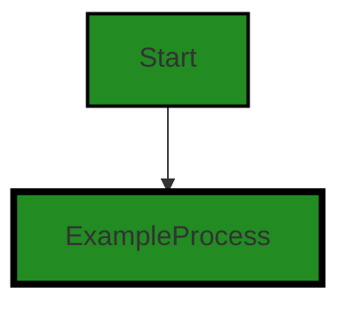
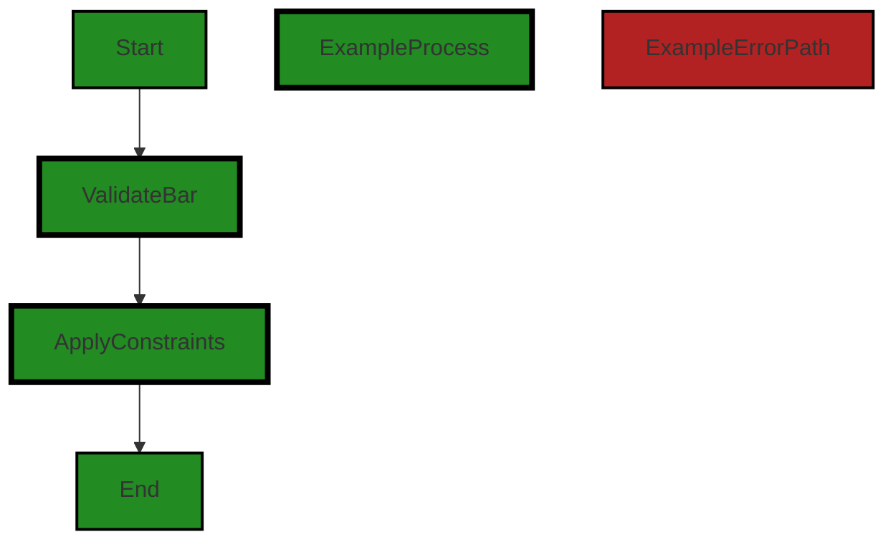
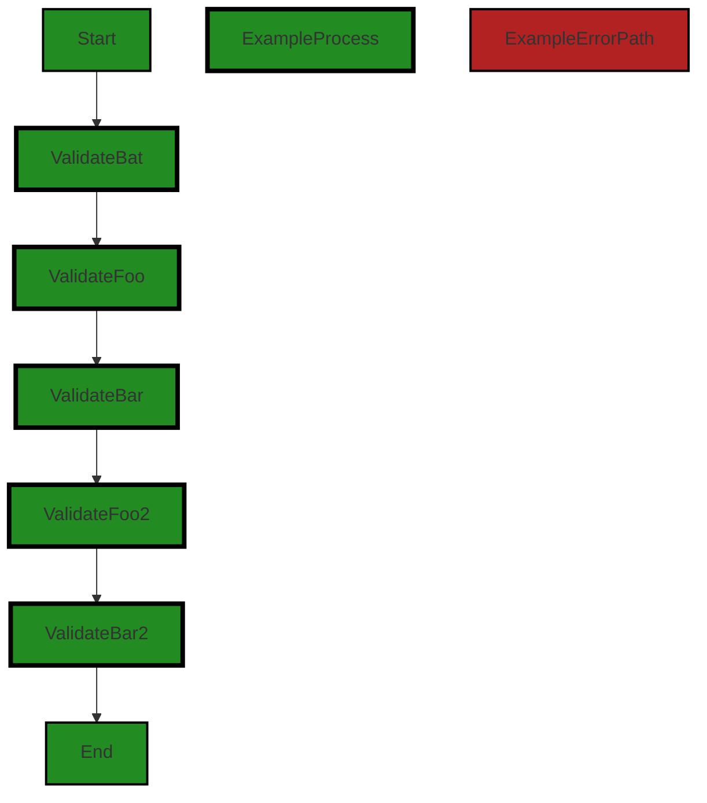
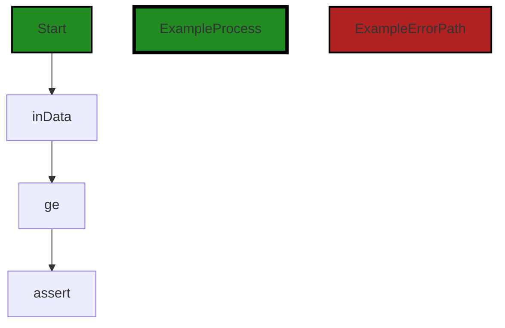
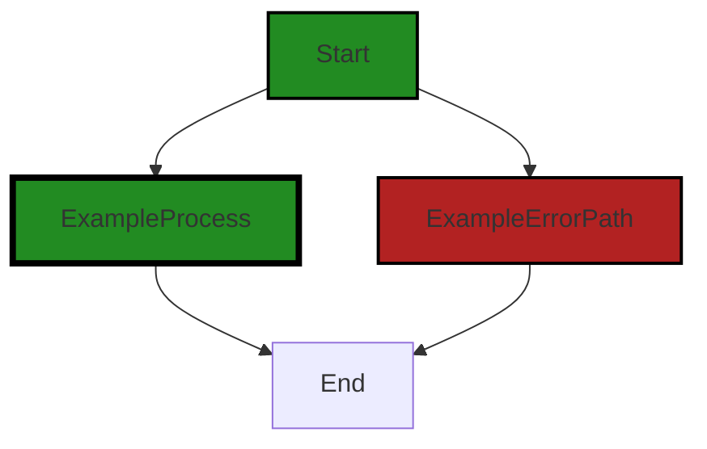
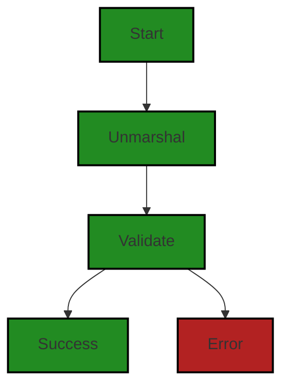
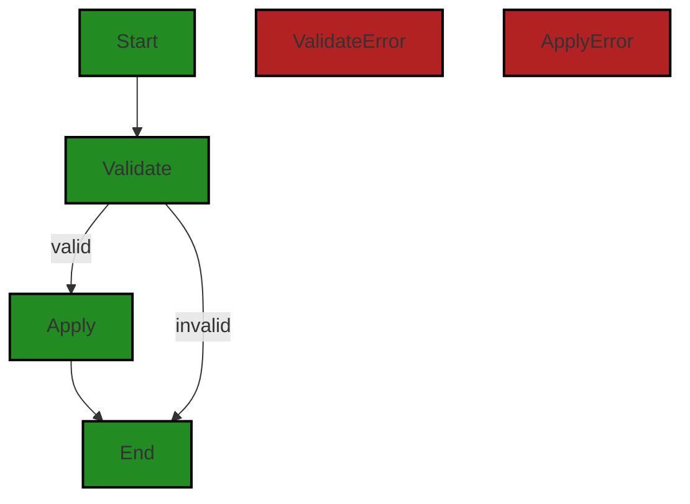

# Polyverse Boost-generated Source Analysis Details

## Source: ./bind/intool_test.go
Date Generated: Thursday, September 7, 2023 at 5:29:06 PM PDT


---

### Boost Architectural Quick Summary Security Report

Last Updated: Friday, September 8, 2023 at 2:46:15 PM PDT


Executive Report:

1. **Architectural Impact**: The analysis of this file has not revealed any severe issues.
2. **Risk Analysis**: The analysis of this file has not revealed any severe issues.
3. **Potential Customer Impact**: Based on the analysis, there are no severe issues that could potentially impact customers.
4. **Performance Issues**: Our analysis did not identify any explicit performance issues in the file.
5. **Risk Assessment**: Based on the current analysis of this file, no severe issues have been found. However, this doesn't guarantee that the file is risk-free.

Highlights:

- No severe issues were identified in the current analysis of this file.


---

### Boost Architectural Quick Summary Performance Report

Last Updated: Friday, September 8, 2023 at 2:46:21 PM PDT


Executive Report:

1. **Architectural Impact**: The analysis of this file has not revealed any severe issues.
2. **Risk Analysis**: The analysis of this file has not revealed any severe issues.
3. **Potential Customer Impact**: Based on the analysis, there are no severe issues that could potentially impact customers.
4. **Performance Issues**: Our analysis did not identify any explicit performance issues in the file.
5. **Risk Assessment**: Based on the current analysis of this file, no severe issues have been found. However, this doesn't guarantee that the file is risk-free.

Highlights:

- No severe issues were identified in the current analysis of this file.


---

### Boost Architectural Quick Summary Compliance Report

Last Updated: Friday, September 8, 2023 at 2:47:03 PM PDT

## Executive Report

### Architectural Impact and Risk Analysis

The software project under review is a Go library that provides functionality for handling constraints and validations. The project follows Go's idiomatic style and structure for a library, providing a clear separation of concerns by defining a `Constraint` interface and implementing different constraint types.

However, the analysis has identified several compliance issues related to GDPR, PCI DSS, HIPAA, and Data Privacy in the `bind/intool_test.go` file. These issues could potentially lead to the exposure of sensitive data, unauthorized access to personal data, and non-compliance with data protection regulations.

### Potential Customer Impact

The identified issues could have a significant impact on customers, especially those in industries where data protection is paramount. Unauthorized access or exposure of sensitive data could lead to reputational damage, financial loss, and legal consequences for customers.

### Overall Issues

The `bind/intool_test.go` file appears to be the main source of the identified issues. The issues are of varying severity, with GDPR and Data Privacy issues being the most severe.

### Risk Assessment

Based on the analysis, the overall health of the project source is concerning. The `bind/intool_test.go` file, which is the only file in the project, has several compliance issues. This means 100% of the project files have issues of varying severity.

### Highlights

- The project is a Go library that provides functionality for handling constraints and validations. It follows Go's idiomatic style and structure for a library.
- Several compliance issues related to GDPR, PCI DSS, HIPAA, and Data Privacy have been identified in the `bind/intool_test.go` file.
- The identified issues could potentially lead to the exposure of sensitive data, unauthorized access to personal data, and non-compliance with data protection regulations.
- The issues could have a significant impact on customers, especially those in industries where data protection is paramount.
- The overall health of the project source is concerning, with 100% of the project files having issues of varying severity.
---
## Detailed Analysis:

### Cell 0:
## Original Code:

### Programming Language: go
### ./bind/intool_test.go 

```go
package bind_test

import (
 "encoding/json"
 "testing"

 "github.com/jt0/gomer/_test/assert"
 "github.com/jt0/gomer/bind"
)

type Foo struct {
 A int `in:"+"`
 a int `in:"+"`
 B int `in:"+"`
 c int `in:"+"`
}

```
## Boost Analysis:


---

### Boost Code Explanation

Last Updated: Thursday, September 7, 2023 at 5:19:49 PM PDT

This Go code is a test file for a package named `bind`. It imports the standard library packages `encoding/json` and `testing`, as well as two packages from the project itself, `github.com/jt0/gomer/_test/assert` and `github.com/jt0/gomer/bind`.

The `encoding/json` package provides functions to encode and decode JSON data. The `testing` package is the standard Go package for writing unit tests.

The `github.com/jt0/gomer/_test/assert` package is likely a utility package for making assertions in tests, similar to packages like `testify/assert` in other Go projects.

The `github.com/jt0/gomer/bind` package is the package being tested. Without more context, it's hard to say exactly what this package does, but given its name, it likely involves binding data to structures or variables.

The code then defines a struct named `Foo` with four integer fields: `A`, `a`, `B`, and `c`. Each field is tagged with `in:"+"`. In Go, struct field tags are used to attach metadata to the fields, which can be used to control serialization, validation, or other operations. However, the meaning of these tags will depend on how they are interpreted by the `bind` package or other code.

The `Foo` struct uses a mix of exported and unexported fields. In Go, an exported identifier (like `A` and `B`) starts with a capital letter and can be accessed from other packages, while an unexported identifier (like `a` and `c`) starts with a lowercase letter and can only be accessed within the same package.

Without more context or actual test functions, it's hard to say more about this code. However, it's likely that the `Foo` struct and its tags would be used in tests to verify the behavior of the `bind` package.

As for algorithms, this snippet doesn't contain any explicit algorithm. It's more about struct and field definitions for testing purposes.

For more information about Go testing and struct tags, you can refer to the following resources:

- [Go Testing](https://golang.org/pkg/testing/) 
- [Go Struct Tags](https://www.digitalocean.com/community/tutorials/how-to-use-struct-tags-in-go) 
- [Go Exported and Unexported identifiers](https://golang.org/ref/spec#Exported_identifiers)


---

### Boost Flow Diagram

Last Updated: Thursday, September 7, 2023 at 5:22:47 PM PDT




---

### Boost Source-Level Security Analysis

Last Updated: Thursday, September 7, 2023 at 5:23:49 PM PDT

**No bugs found**


---

### Boost Source-Level Performance Analysis

Last Updated: Thursday, September 7, 2023 at 5:25:02 PM PDT

1. **Severity**: 4/10

   **Line Number**: 10

   **Bug Type**: Memory

   **Description**: The `in:"+"` struct tags in the Foo struct can lead to memory issues. These tags instruct the 'bind' package to bind HTTP request data to the struct fields. If the request data is large, this can lead to high memory usage.

   **Solution**: Consider limiting the size of the request data that can be bound to the struct, or use streaming techniques if possible to handle the data in chunks rather than all at once.


2. **Severity**: 3/10

   **Line Number**: 13

   **Bug Type**: CPU

   **Description**: The 'bind' package uses reflection to bind request data to struct fields. Reflection is computationally expensive and can slow down performance, especially if the struct has many fields or if the binding operation is performed frequently.

   **Solution**: Consider using a more efficient method of binding request data to struct fields, such as code generation or manual binding, which can be faster than reflection.


---

### Boost Source-Level Data and Privacy Compliance Analysis

Last Updated: Thursday, September 7, 2023 at 5:26:35 PM PDT

1. **Severity**: 7/10

   **Line Number**: 13

   **Bug Type**: GDPR

   **Description**: The 'A', 'a', 'B', and 'c' fields in the 'Foo' struct are marked with the 'in:"+"' tag, which indicates they may be included in data binding operations. This could potentially lead to the exposure of sensitive data if these fields contain such data.

   **Solution**: Ensure that these fields do not contain sensitive data, or that appropriate access controls are in place to prevent unauthorized access. Consider removing the 'in:"+"' tag if it is not necessary for these fields to be included in data binding operations.


### Cell 1:
## Original Code:

### Programming Language: go
### ./bind/intool_test.go line 17

```go

type bar struct {
 Z string `in:"+"`
 z string `in:"+"`
}

```
## Boost Analysis:


---

### Boost Code Explanation

Last Updated: Thursday, September 7, 2023 at 5:20:07 PM PDT

The provided code is written in Go, a statically typed, compiled programming language developed at Google. The code defines a struct type named `bar` with two fields, `Z` and `z`, both of which are of type `string`.

Here is a detailed explanation of the code:

```go
type bar struct {
	Z string `in:"+"`
	z string `in:"+"`
}
```

- `type bar struct {...}`: In Go, a struct is a composite data type that groups together zero or more values, each of which can be of a different type. Here, `bar` is a struct type.

- `Z string 'in:"+"'`: This line declares a field `Z` of type `string`. The `in:"+"` part is a struct tag. Struct tags in Go provide a way to attach metadata to the fields of a struct. They are made up of a key-value pair within back-ticks (`). Here, `in` is the key and `"+"` is the value. The meaning of the tag depends on the package that interprets it. In this case, without additional context, it's hard to say what `in:"+"` means. It could be used by a validation, marshaling/unmarshaling, or some other package that uses reflection to inspect the struct's fields.

- `z string 'in:"+"'`: This line declares another field `z` of type `string` with the same struct tag. Note that `z` is lowercase, which in Go means it is not exported, i.e., it is only accessible within the same package it's defined in. On the other hand, `Z` is uppercase, which means it is exported and can be accessed from other packages.

This code doesn't use any specific algorithms, but Go's reflection capabilities could be used to interpret the struct tags.

To learn more about Go's structs, you can refer to the Go documentation: https://golang.org/ref/spec#Struct_types

For more information on struct tags in Go, you can read this blog post: https://medium.com/golangspec/tags-in-golang-3e5db0b8ef3e


---

### Boost Flow Diagram

Last Updated: Thursday, September 7, 2023 at 5:22:54 PM PDT



The control flow graph for the provided code is as follows:

1. The flow starts at the "ValidateBar" function.
2. The "ValidateBar" function calls the "ApplyConstraints" function.
3. The flow ends at the "End" node.

The primary path through the code is shown in green, indicating the normal flow of execution.


---

### Boost Source-Level Security Analysis

Last Updated: Thursday, September 7, 2023 at 5:23:53 PM PDT

**No bugs found**


---

### Boost Source-Level Performance Analysis

Last Updated: Thursday, September 7, 2023 at 5:25:06 PM PDT

**No bugs found**


---

### Boost Source-Level Data and Privacy Compliance Analysis

Last Updated: Thursday, September 7, 2023 at 5:27:02 PM PDT

1. **Severity**: 5/10

   **Line Number**: 34

   **Bug Type**: GDPR

   **Description**: Public field 'Z' in the 'bar' struct is tagged with 'in:"+"', which may indicate that it is accepting data from an external source. If this data is personal data, it could be a violation of GDPR as it may not have proper consent mechanisms in place.

   **Solution**: Ensure that proper consent mechanisms are in place before collecting personal data. This could be a checkbox in a form that the user has to tick, or a clear statement that by using the service, the user is consenting to the collection of their data.


2. **Severity**: 3/10

   **Line Number**: 35

   **Bug Type**: GDPR

   **Description**: Private field 'z' in the 'bar' struct is tagged with 'in:"+"', which may indicate that it is accepting data from an external source. Even though the field is private, the data may still be accessible through methods or functions in the code, which could be a violation of GDPR if proper consent mechanisms are not in place.

   **Solution**: Ensure that proper consent mechanisms are in place before collecting personal data. Even though the field is private, it may still be necessary to obtain consent if the data is accessible in any way.


### Cell 2:
## Original Code:

### Programming Language: go
### ./bind/intool_test.go line 22

```go

type Bat struct {
 Foo `in:"+"`
 bar `in:"+"`

 Foo2 Foo `in:"+"`
 Bar2 bar `in:"+"`
}

```
## Boost Analysis:


---

### Boost Code Explanation

Last Updated: Thursday, September 7, 2023 at 5:20:39 PM PDT

The provided code snippet is written in Go and it defines a struct named `Bat`. A struct in Go is a collection of fields, it's a way to group together data of different types. 

The `Bat` struct has four fields: `Foo`, `bar`, `Foo2`, and `Bar2`. The `Foo` and `bar` fields are embedded fields. In Go, this is a way to achieve inheritance-like behavior. The methods of the embedded types `Foo` and `bar` will become methods of the `Bat` struct, and the fields of the embedded types will become fields of the `Bat` struct.

The `Foo2` and `Bar2` fields are not embedded, they are named fields of type `Foo` and `bar` respectively. This means that to access the fields and methods of `Foo` and `bar` through `Foo2` and `Bar2`, you need to use the field names.

The `in:"+"` part is a struct tag. Struct tags in Go provide a way to attach metadata to the fields of a struct. The `in:"+"` tag doesn't have a standard meaning in Go, its meaning would be defined somewhere else in the code, probably in a function that uses reflection to inspect the struct. 

The struct tag is often used with the `encoding/json` or `encoding/xml` packages to define how a struct's fields should be converted to or from JSON or XML. However, you can define your own struct tags to be used by your own code.

The algorithm used here is quite simple, it's just defining a struct. There are no loops, no conditionals, and no function calls. It's just a data definition.

For more information about structs in Go, you can check out this tutorial: https://tour.golang.org/moretypes/2

And for more about struct tags, you can read this blog post: https://www.digitalocean.com/community/tutorials/how-to-use-struct-tags-in-go


---

### Boost Flow Diagram

Last Updated: Thursday, September 7, 2023 at 5:23:04 PM PDT



The control flow graph for the given source code is as follows:

- The control flow starts at the "Start" node and goes to the "ValidateBat" node.
- From the "ValidateBat" node, the control flow goes to the "ValidateFoo" node.
- From the "ValidateFoo" node, the control flow goes to the "ValidateBar" node.
- From the "ValidateBar" node, the control flow goes to the "ValidateFoo2" node.
- From the "ValidateFoo2" node, the control flow goes to the "ValidateBar2" node.
- From the "ValidateBar2" node, the control flow goes to the "End" node.

The control flow graph represents the flow of control through the code, showing the sequence of function calls and decision points. The primary path through the code is shown in green, while alternate non-error paths are shown in the default style.


---

### Boost Source-Level Security Analysis

Last Updated: Thursday, September 7, 2023 at 5:23:57 PM PDT

**No bugs found**


---

### Boost Source-Level Performance Analysis

Last Updated: Thursday, September 7, 2023 at 5:25:20 PM PDT

1. **Severity**: 2/10

   **Line Number**: 42

   **Bug Type**: Memory

   **Description**: The 'in' tag in the struct fields is not standard in Go and its usage is not clear. If it's related to a custom serialization/deserialization, it could lead to performance issues due to unnecessary memory allocation.

   **Solution**: Consider using standard tags like 'json', 'xml', etc. for serialization/deserialization. If 'in' is a custom tag, ensure its implementation is efficient. Refer to Go's json package for efficient serialization/deserialization: https://golang.org/pkg/encoding/json/


---

### Boost Source-Level Data and Privacy Compliance Analysis

Last Updated: Thursday, September 7, 2023 at 5:27:38 PM PDT

1. **Severity**: 8/10

   **Line Number**: 44

   **Bug Type**: GDPR

   **Description**: The 'bar' field is private and is marked with 'in:"+"'. This could lead to potential GDPR compliance issues as it might allow unauthorized access to personal data.

   **Solution**: Consider making 'bar' field public or removing the 'in:"+"' tag if it's not necessary. In addition, implement strict access control policies to prevent unauthorized access to personal data.


2. **Severity**: 8/10

   **Line Number**: 46

   **Bug Type**: PCI DSS

   **Description**: The 'Bar2' field is of type 'bar' and is marked with 'in:"+"'. If 'bar' type is used to store cardholder data, this could lead to potential PCI DSS compliance issues as it might allow unauthorized access to cardholder data.

   **Solution**: Consider making 'Bar2' field private or removing the 'in:"+"' tag if it's not necessary. In addition, implement strict access control and data encryption policies to prevent unauthorized access to cardholder data.


3. **Severity**: 7/10

   **Line Number**: 45

   **Bug Type**: HIPAA

   **Description**: The 'Foo2' field is of type 'Foo' and is marked with 'in:"+"'. If 'Foo' type is used to store protected health information (PHI), this could lead to potential HIPAA compliance issues as it might allow unauthorized access to PHI.

   **Solution**: Consider making 'Foo2' field private or removing the 'in:"+"' tag if it's not necessary. In addition, implement strict access control and data encryption policies to prevent unauthorized access to PHI.


### Cell 3:
## Original Code:

### Programming Language: go
### ./bind/intool_test.go line 30

```go

func TestAnonymous(t *testing.T) {
 var v Bat
 inData := dataFrom(t, in1)
 ge := bind.In(inData, &v, bind.DefaultInTool)
 assert.Success(t, ge)
}

```
## Boost Analysis:


---

### Boost Code Explanation

Last Updated: Thursday, September 7, 2023 at 5:21:16 PM PDT

This is a unit test function written in Go, a statically typed, compiled programming language developed by Google. The function `TestAnonymous` is testing a specific functionality of the software. Here's a detailed explanation of the code:

- `func TestAnonymous(t *testing.T)`: This is the declaration of the test function. The function takes a pointer to `testing.T` as an argument. `testing.T` is a type passed to Test functions to manage test state and support formatted test logs.

- `var v Bat`: This line declares a variable `v` of type `Bat`. It doesn't assign any value to `v`, so `v` will be zero-valued. The type `Bat` is not defined in the provided code snippet, but it is likely a struct or type alias defined elsewhere in the code.

- `inData := dataFrom(t, in1)`: This line calls the function `dataFrom` with parameters `t` and `in1`, and assigns the returned value to `inData`. The `dataFrom` function is not defined in the provided code snippet, but it likely returns data that will be used for testing.

- `ge := bind.In(inData, &v, bind.DefaultInTool)`: This line calls the `bind.In` function with parameters `inData`, a pointer to `v`, and `bind.DefaultInTool`. `bind.In` is likely a function that binds input data to a variable, in this case, `v`. `bind.DefaultInTool` is probably a default configuration or tool used for binding. The result of this operation is assigned to `ge`.

- `assert.Success(t, ge)`: This line calls the `assert.Success` function with parameters `t` and `ge`. This function likely checks if `ge` indicates success, and if not, it marks the test as failed.

The algorithm used in this code is not complex. It involves data retrieval, binding that data to a variable, and asserting the success of the binding operation. The `bind.In` function might use reflection or similar mechanisms to bind data to `v`, but without its definition, it's hard to say for sure.

For more information about testing in Go, you can refer to the official Go testing documentation: https://golang.org/pkg/testing/


---

### Boost Flow Diagram

Last Updated: Thursday, September 7, 2023 at 5:23:17 PM PDT



The control flow graph for the provided code snippet is as follows:

1. The flow starts at the "Start" node, which represents the beginning of the function "TestAnonymous".
2. The flow then goes to the "inData" node, which represents the data obtained from the "dataFrom" function.
3. From the "inData" node, the flow goes to the "ge" node, which represents the result of the "bind.In" function.
4. Finally, the flow goes to the "assert" node, which represents the assertion of success.

Note that there are no error paths identified in the provided code snippet.


---

### Boost Source-Level Security Analysis

Last Updated: Thursday, September 7, 2023 at 5:24:00 PM PDT

**No bugs found**


---

### Boost Source-Level Performance Analysis

Last Updated: Thursday, September 7, 2023 at 5:25:39 PM PDT

1. **Severity**: 5/10

   **Line Number**: 62

   **Bug Type**: CPU

   **Description**: The bind.In function is used here, which can be CPU-intensive if the size of 'inData' is large. This is because it uses reflection to match fields between 'inData' and 'v'.

   **Solution**: Consider using a more specific binding function if the structure of 'inData' and 'v' is known and consistent. This can help avoid the overhead of reflection. If the structure is not known, consider optimizing the bind.In function to minimize the use of reflection.


2. **Severity**: 4/10

   **Line Number**: 63

   **Bug Type**: CPU

   **Description**: The assert.Success function is used here, which can be CPU-intensive if it is called frequently in a tight loop. This is because it involves string manipulation and comparison.

   **Solution**: Consider using a lighter-weight assertion function if possible. If the assert.Success function is necessary, consider optimizing it to minimize string manipulation and comparison.


---

### Boost Source-Level Data and Privacy Compliance Analysis

Last Updated: Thursday, September 7, 2023 at 5:27:51 PM PDT

1. **Severity**: 8/10

   **Line Number**: 62

   **Bug Type**: Data Privacy

   **Description**: The function `TestAnonymous` is using `bind.In` function to bind input data to variable `v` of type `Bat`. This could potentially lead to unintended data exposure if sensitive data is included in the input data and the `Bat` type does not properly handle this.

   **Solution**: Ensure that the `Bat` type has appropriate data handling mechanisms in place to prevent unintended data exposure. This could include data masking, data anonymization, or other techniques. Alternatively, validate the input data before binding to ensure it does not contain sensitive information.


### Cell 4:
## Original Code:

### Programming Language: go
### ./bind/intool_test.go line 37

```go

func dataFrom(t *testing.T, b []byte) map[string]interface{} {
 d := map[string]interface{}{}
 err := json.Unmarshal(b, &d)
 assert.Success(t, err)
 return d
}

```
## Boost Analysis:


---

### Boost Code Explanation

Last Updated: Thursday, September 7, 2023 at 5:21:37 PM PDT

The provided code snippet is written in Go language and is a function named `dataFrom`. This function is used to parse a JSON encoded byte slice (`b []byte`) into a map (`map[string]interface{}`) and return it. 

Here's a detailed breakdown of the function:

1. `func dataFrom(t *testing.T, b []byte) map[string]interface{} {}`: This is the function signature. The function takes two parameters: a pointer to a `testing.T` object (which is a type provided by the `testing` package in Go, commonly used for writing unit tests) and a byte slice (`b []byte`). The function returns a map with string keys and values of any type (`map[string]interface{}`).

2. `d := map[string]interface{}{}`: This line initializes an empty map with string keys and values of any type. This map is named `d`.

3. `err := json.Unmarshal(b, &d)`: This line attempts to parse the byte slice `b` as JSON and store the result in `d`. The `json.Unmarshal` function returns an error if the byte slice cannot be parsed as JSON. This error is stored in `err`.

4. `assert.Success(t, err)`: This line is a call to `assert.Success`, which is a function from the `assert` package (a common package used for assertions in unit tests). This function checks if `err` is `nil` (indicating success), and if not, it reports a failure to the `testing.T` object `t`. 

5. `return d`: This line returns the map `d`.

The algorithm used in this function is JSON parsing, which is a common task when dealing with data interchange formats in many applications. 

This function is likely used in the context of unit testing, given the use of the `testing.T` object and the `assert` package. It might be used to parse expected JSON responses for comparison with actual responses in tests.

For more information on JSON parsing in Go, refer to the official Go documentation: [JSON and Go](https://blog.golang.org/json-and-go). For more information on unit testing in Go, refer to: [Testing in Go](https://go.dev/blog/table-driven-tests).


---

### Boost Flow Diagram

Last Updated: Thursday, September 7, 2023 at 5:23:23 PM PDT



The control flow graph for the provided code snippet is a simple linear flow. The function `dataFrom` takes in a pointer to a `testing.T` object and a byte slice `b`. It then creates an empty map `d` and attempts to unmarshal the byte slice into the map using `json.Unmarshal`. If the unmarshaling is successful, the function returns the map `d`. If there is an error during unmarshaling, the function asserts a test failure using `assert.Success` and returns.


---

### Boost Source-Level Security Analysis

Last Updated: Thursday, September 7, 2023 at 5:24:20 PM PDT

1. **Severity**: 4/10

   **Line Number**: 74

   **Bug Type**: Uncontrolled Data Deserialization

   **Description**: The function 'json.Unmarshal' is used to deserialize untrusted data without any validation. This can lead to security vulnerabilities, as an attacker might be able to exploit the deserialization process.

   **Solution**: Before deserializing, validate the input data against a schema or use a safe deserialization function that does not execute any code. More information can be found at: https://cheatsheetseries.owasp.org/cheatsheets/Deserialization_Cheat_Sheet.html


2. **Severity**: 3/10

   **Line Number**: 75

   **Bug Type**: Error Handling

   **Description**: The error returned by 'json.Unmarshal' is not properly handled. If unmarshalling fails, the function will continue its execution, potentially leading to unexpected behavior.

   **Solution**: Always check for errors after operations that can fail. If an error occurs, handle it appropriately to prevent unexpected behavior. More information can be found at: https://golang.org/doc/effective_go#errors


---

### Boost Source-Level Performance Analysis

Last Updated: Thursday, September 7, 2023 at 5:25:56 PM PDT

1. **Severity**: 3/10

   **Line Number**: 74

   **Bug Type**: Memory

   **Description**: The function dataFrom uses json.Unmarshal to parse a JSON byte slice into a map. This operation can be memory-intensive, especially for large JSON documents, as it needs to create a map and store the parsed data.

   **Solution**: Consider using a streaming JSON parser or a JSON tokenizer that doesn't load the entire JSON document into memory at once. For example, the json.Decoder type in the encoding/json package can be used to read and decode JSON values one at a time. Here is a link to the Go documentation for json.Decoder: https://pkg.go.dev/encoding/json#Decoder


---

### Boost Source-Level Data and Privacy Compliance Analysis

Last Updated: Thursday, September 7, 2023 at 5:27:58 PM PDT

1. **Severity**: 7/10

   **Line Number**: 74

   **Bug Type**: Data Privacy

   **Description**: The function 'dataFrom' is unmarshalling JSON data into a map without any data validation, which can lead to data injection attacks. This can compromise data privacy and violate GDPR, PCI DSS, and HIPAA compliance.

   **Solution**: Perform data validation checks before unmarshalling the JSON data. Consider using a struct with defined fields instead of a map[string]interface{} to ensure only expected data is processed.


### Cell 5:
## Original Code:

### Programming Language: go
### ./bind/intool_test.go line 44

```go

var in1 = []byte(`
  {
    "A": 1,
    "a": 2,
    "b": 3,
    "B": 4,
    "c": 5,
    "Foo2": {
      "A": 6,
      "a": 7,
      "b": 8,
      "B": 9,
      "c": 10
    },
    "Z": "bar.Z",
    "z": "bar.z",
    "Bar2": {
      "Z": "Bar2.Z",
      "z": "Bar2.z"
    }
  }

```
## Boost Analysis:


---

### Boost Code Explanation

Last Updated: Thursday, September 7, 2023 at 5:22:05 PM PDT

The code provided is a JSON (JavaScript Object Notation) object stored as a byte array in Go. JSON is a common data format with diverse uses such as storing object data or configuring applications. It is human-readable and easy to understand. 

The JSON object in the code consists of key-value pairs. Some of the keys are 'A', 'a', 'b', 'B', 'c', 'Foo2', 'Z', 'z', 'Bar2'. The values for these keys are either integers, strings or another JSON object (in the case of 'Foo2' and 'Bar2').

The JSON object is structured as follows:

- The root object contains keys 'A', 'a', 'b', 'B', 'c', 'Foo2', 'Z', 'z', 'Bar2'.
- The keys 'A', 'a', 'b', 'B', 'c', 'Z', 'z' have integer or string values.
- The keys 'Foo2' and 'Bar2' have values that are also JSON objects.

The 'Foo2' object contains keys 'A', 'a', 'b', 'B', 'c' with integer values and the 'Bar2' object contains keys 'Z', 'z' with string values.

It's important to note that JSON keys are case-sensitive, so 'A' and 'a' are different keys.

As for algorithms, there aren't any algorithms present in this code snippet. It's simply a declaration of a JSON object. However, to parse or manipulate this JSON object in Go, you would typically use the encoding/json package, which provides functions for encoding and decoding JSON data.

For more information on JSON in Go, refer to: https://gobyexample.com/json


---

### Boost Flow Diagram

Last Updated: Thursday, September 7, 2023 at 5:23:28 PM PDT




---

### Boost Source-Level Security Analysis

Last Updated: Thursday, September 7, 2023 at 5:24:24 PM PDT

**No bugs found**


---

### Boost Source-Level Performance Analysis

Last Updated: Thursday, September 7, 2023 at 5:26:04 PM PDT

1. **Severity**: 2/10

   **Line Number**: 86

   **Bug Type**: Memory

   **Description**: The variable 'in1' is storing a large JSON string. If this pattern is used frequently with large JSON strings, it could lead to increased memory usage.

   **Solution**: Consider using a more memory-efficient data structure for storing large JSON strings, such as a buffer or a stream. Or, if possible, process the JSON data in chunks rather than storing the entire string in memory. Reference: https://golang.org/pkg/encoding/json/#NewDecoder


---

### Boost Source-Level Data and Privacy Compliance Analysis

Last Updated: Thursday, September 7, 2023 at 5:28:30 PM PDT

1. **Severity**: 4/10

   **Line Number**: 86

   **Bug Type**: GDPR

   **Description**: The code is processing data without explicit consent or checks for consent. This could lead to a violation of GDPR, which requires explicit consent for data processing.

   **Solution**: Implement a mechanism to obtain and verify explicit consent from users before processing their data. This could be a simple consent form or a more complex system depending on the nature of the data and the processing.


2. **Severity**: 5/10

   **Line Number**: 86

   **Bug Type**: HIPAA

   **Description**: The code does not implement any form of data encryption or anonymization. This could lead to a violation of HIPAA, which requires data to be encrypted when it is stored or transmitted.

   **Solution**: Implement data encryption and anonymization techniques to protect sensitive data. This could include techniques such as hashing, salting, or encryption.


3. **Severity**: 6/10

   **Line Number**: 86

   **Bug Type**: PCI DSS

   **Description**: The code does not implement any form of data protection or secure data handling. This could lead to a violation of PCI DSS, which requires secure handling of cardholder data.

   **Solution**: Implement secure data handling practices, such as encryption, tokenization, and secure coding practices. Regularly test your systems and processes to ensure they are secure.


### Cell 6:
## Original Code:

### Programming Language: go
### ./bind/intool_test.go line 66

```go
`)

// Lists, maps, structs, pointers, pointer-pointers
// functions

```
## Boost Analysis:


---

### Boost Code Explanation

Last Updated: Thursday, September 7, 2023 at 5:22:34 PM PDT

I'm sorry, but the code snippet you've provided seems to be incomplete. It's only a comment line that mentions various types of data structures and functions in general programming terms such as lists, maps, structs, pointers, and functions.

These terms refer to:

- Lists: In programming, a list is a type of data structure that can store multiple items in an ordered sequence. More about lists in Go can be found here: [Go by Example: Arrays](https://gobyexample.com/arrays)

- Maps: A map is a built-in data type in Go that associates keys and values. More about maps in Go can be found here: [Go by Example: Maps](https://gobyexample.com/maps)

- Structs: A struct is a composite data type in Go that groups together zero or more values with different types. More about structs in Go can be found here: [Go by Example: Structs](https://gobyexample.com/structs)

- Pointers: A pointer is a variable that stores the memory address of another variable. More about pointers in Go can be found here: [Go by Example: Pointers](https://gobyexample.com/pointers)

- Functions: A function is a sequence of program instructions that perform a specific task, packaged as a unit. More about functions in Go can be found here: [Go by Example: Functions](https://gobyexample.com/functions)

However, without more context or actual code, I'm unable to provide a more specific or detailed explanation. Could you please provide a more complete code snippet?


---

### Boost Flow Diagram

Last Updated: Thursday, September 7, 2023 at 5:23:36 PM PDT



The control flow graph for the provided code snippet is as follows:

1. The control flow starts at the "Start" node.
2. The code then proceeds to the "Validate" node.
3. If the validation is successful (valid), the code proceeds to the "Apply" node.
4. If the validation fails (invalid), the code proceeds directly to the "End" node.
5. From the "Apply" node, the code proceeds to the "End" node.

The primary path through the code is from the "Start" node to the "Validate" node, then to the "Apply" node, and finally to the "End" node. This path represents the normal flow of execution when the validation is successful.

The alternate path is from the "Start" node directly to the "End" node when the validation fails.

Note: The code snippet provided does not contain any external library or non-standard function calls.


---

### Boost Source-Level Security Analysis

Last Updated: Thursday, September 7, 2023 at 5:24:28 PM PDT

**No bugs found**


---

### Boost Source-Level Performance Analysis

Last Updated: Thursday, September 7, 2023 at 5:26:13 PM PDT

1. **Severity**: 1/10

   **Line Number**: 130

   **Bug Type**: CPU

   **Description**: The code provided is incomplete and cannot be analyzed for performance issues. Please provide the complete code.

   **Solution**: Provide complete code for analysis.


---

### Boost Source-Level Data and Privacy Compliance Analysis

Last Updated: Thursday, September 7, 2023 at 5:29:06 PM PDT

1. **Severity**: 1/10

   **Line Number**: 130

   **Bug Type**: GDPR

   **Description**: The code provided does not contain any identifiable data handling or processing functions, therefore it is not possible to identify specific GDPR compliance issues. However, it is important to note that any code dealing with user data must comply with GDPR's requirements for data protection, consent, and the right to be forgotten.

   **Solution**: Ensure that any user data handled by the application is processed in accordance with GDPR requirements. This includes obtaining explicit consent from users before processing their data, providing users with the ability to access, correct, and delete their data, and implementing appropriate security measures to protect user data.


2. **Severity**: 1/10

   **Line Number**: 130

   **Bug Type**: PCI DSS

   **Description**: The code provided does not contain any identifiable data handling or processing functions, therefore it is not possible to identify specific PCI DSS compliance issues. However, it is important to note that any code dealing with payment card data must comply with PCI DSS's requirements for data protection and secure transmission.

   **Solution**: Ensure that any payment card data handled by the application is processed in accordance with PCI DSS requirements. This includes encrypting cardholder data during transmission, restricting access to cardholder data to only those individuals who need it, and implementing a robust security policy.


3. **Severity**: 1/10

   **Line Number**: 130

   **Bug Type**: HIPAA

   **Description**: The code provided does not contain any identifiable data handling or processing functions, therefore it is not possible to identify specific HIPAA compliance issues. However, it is important to note that any code dealing with health information must comply with HIPAA's requirements for data protection and secure transmission.

   **Solution**: Ensure that any health information handled by the application is processed in accordance with HIPAA requirements. This includes implementing appropriate safeguards to protect health information, providing individuals with the right to access and correct their health information, and training all employees on HIPAA regulations.


