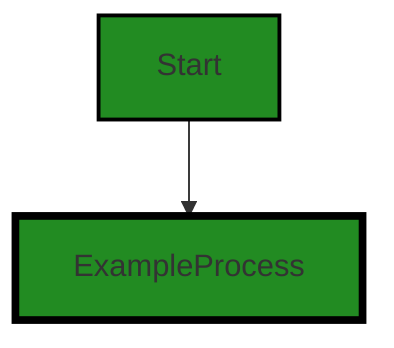
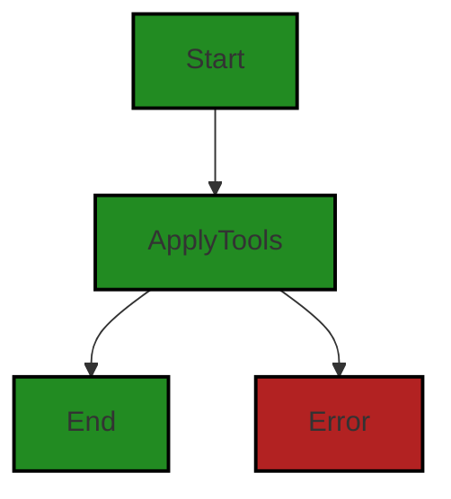
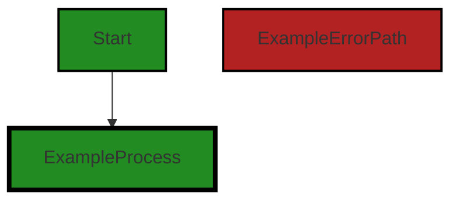
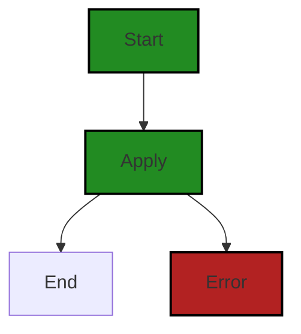
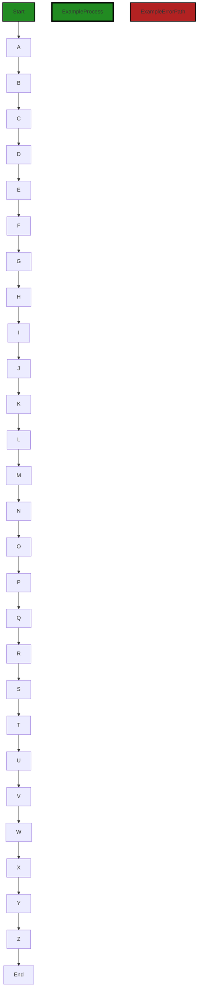
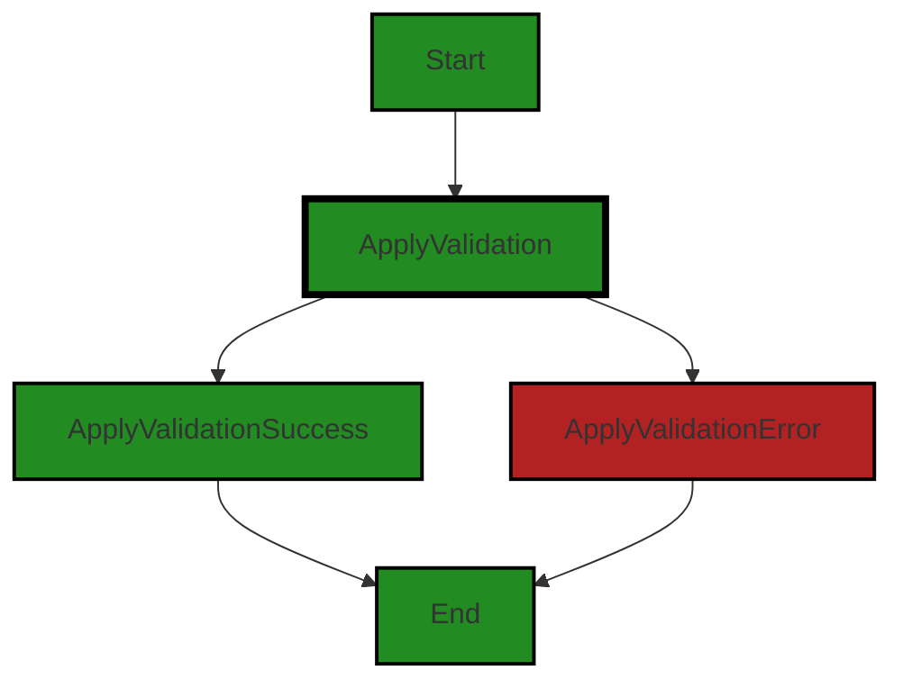

# Polyverse Boost-generated Source Analysis Details

## Source: ./bind/outtool.go
Date Generated: Thursday, September 7, 2023 at 10:42:36 AM PDT


---

### Boost Architectural Quick Summary Security Report

Last Updated: Friday, September 8, 2023 at 2:55:12 PM PDT

## Executive Report

### Architectural Impact and Risk Analysis

The software project under review is a Go-based library that provides functionality for handling constraints and validations. The project follows Go's idiomatic style and structure for a library, providing a clear separation of concerns by defining a `Constraint` interface and implementing different constraint types. 

However, the analysis has identified a potential security risk in the form of Insecure Direct Object References (IDOR) in the `bind/outtool.go` file. This issue could lead to unauthorized access to data if not addressed promptly.

### Potential Customer Impact

The identified issue could potentially impact customers by compromising the security of their data. If the directive is coming from an untrusted source, it could lead to unauthorized access to data. This could result in a loss of trust in the product and potential legal implications.

### Overall Issues for the Software Project

The analysis has identified a total of 3 issues in the `bind/outtool.go` file, with 2 warnings and 1 information level issue. The most severe issue is the potential for Insecure Direct Object References (IDOR).

### Risk Assessment

Given that the project consists of only one file, and that file has identified issues, the overall health of the project source could be considered at risk. The fact that 100% of the project files have issues of some severity is a cause for concern.

### Highlights of the Analysis

1. **Architectural Soundness**: The project follows Go's idiomatic style and structure for a library, providing a clear separation of concerns by defining a `Constraint` interface and implementing different constraint types.
2. **Security Risk**: The analysis has identified a potential security risk in the form of Insecure Direct Object References (IDOR) in the `bind/outtool.go` file.
3. **Potential Customer Impact**: The identified issue could potentially impact customers by compromising the security of their data.
4. **Overall Project Health**: Given that the project consists of only one file, and that file has identified issues, the overall health of the project source could be considered at risk.
5. **Risk Mitigation**: The project should validate and sanitize all inputs, and consider using a whitelist of allowed directives to mitigate the identified risk. 

In conclusion, while the project follows good architectural practices, the identified security risk could have a significant impact on the project's overall health and potential customer trust. Immediate action should be taken to address the identified issues.


---

### Boost Architectural Quick Summary Performance Report

Last Updated: Friday, September 8, 2023 at 2:56:09 PM PDT

## Executive Level Report

### Architectural Impact and Risk Analysis

1. **Memory Management Issues**: The file `bind/outtool.go` has been flagged for potential memory management issues. The function `EnsureContext` creates a new context on each call, which could lead to high memory usage if this function is called frequently. This could impact the performance of the software, especially in high-load scenarios. It is recommended to consider reusing contexts or using a context pool to reduce memory usage.

2. **CPU Utilization Concerns**: The same file, `bind/outtool.go`, also has potential CPU utilization issues. The `ApplyTools` function is applied to the entire input `v`, which could be inefficient if `v` is large or complex. This could lead to high CPU usage and slow down the software's performance. It is recommended to consider using a more efficient algorithm or data structure to apply the tool.

3. **Potential Customer Impact**: The issues identified could potentially impact the performance of the software, leading to slower response times and decreased user satisfaction. If left unaddressed, these issues could also lead to software instability or crashes under high load.

4. **Overall Health of the Project Source**: The analysis indicates that the issues are concentrated in the `bind/outtool.go` file. This suggests that the overall health of the project source is good, with the majority of the files having no detected issues. However, the severity of the issues in the `bind/outtool.go` file warrants immediate attention.

### Risk Assessment

- **Low Risk Files**: The project consists of a single file, `bind/outtool.go`, which has been flagged with issues. This suggests that the majority of the project files are low risk.

- **High Risk Files**: The `bind/outtool.go` file has been flagged with high-severity issues related to memory and CPU usage. This file represents a high risk and should be prioritized for remediation.

- **Overall Risk Level**: Given that the issues are concentrated in a single file, the overall risk level of the project is moderate. However, the severity of the issues in the `bind/outtool.go` file could significantly impact the performance and stability of the software, increasing the overall risk level.

### Highlights

- The `bind/outtool.go` file has been flagged with high-severity issues related to memory and CPU usage.
- The issues identified could potentially impact the performance of the software, leading to slower response times and decreased user satisfaction.
- The overall health of the project source is good, with the majority of the files having no detected issues.
- The `bind/outtool.go` file represents a high risk and should be prioritized for remediation.
- Given the severity of the issues in the `bind/outtool.go` file, the overall risk level of the project is moderate to high.


---

### Boost Architectural Quick Summary Compliance Report

Last Updated: Friday, September 8, 2023 at 2:57:00 PM PDT

## Executive Report

### Architectural Impact and Risk Analysis

The software project under review is a library written in Go that focuses on constraint handling and validation. It defines a `Constraint` interface and provides implementations for various constraint types. The code follows Go's idiomatic style and structure for a library. 

However, the analysis has identified several high-severity issues related to data compliance, particularly in relation to GDPR, PCI DSS, and HIPAA regulations. These issues are concentrated in the `bind/outtool.go` file.

### Potential Customer Impact

The identified issues could have significant impact on customers, particularly those in regulated industries or jurisdictions. Non-compliance with GDPR, PCI DSS, or HIPAA could result in legal penalties, loss of customer trust, and potential business disruption.

### Overall Issues

The `bind/outtool.go` file has been flagged with multiple high-severity issues. These issues relate to data compliance, specifically GDPR, PCI DSS, and HIPAA. The file also has warnings related to data exposure.

### Risk Assessment

Based on the analysis, the overall health of the project source is concerning. The `bind/outtool.go` file, which is the only file in the project, has multiple high-severity issues. This suggests that 100% of the project files have issues of varying severity.

### Highlights

1. **Data Compliance Issues:** The `bind/outtool.go` file has several high-severity issues related to GDPR, PCI DSS, and HIPAA compliance. These issues could have significant legal and financial implications.

2. **Data Exposure Warnings:** In addition to the compliance issues, the `bind/outtool.go` file also has warnings related to data exposure. This could potentially lead to data breaches and loss of customer trust.

3. **Single File Project:** The project consists of a single file, `bind/outtool.go`. This means that the issues identified are pervasive throughout the entire project.

4. **Potential Customer Impact:** The identified issues could have a significant impact on customers, particularly those in regulated industries or jurisdictions. Non-compliance with GDPR, PCI DSS, or HIPAA could result in legal penalties, loss of customer trust, and potential business disruption.

5. **Risk Assessment:** Based on the analysis, the overall health of the project source is concerning. The `bind/outtool.go` file, which is the only file in the project, has multiple high-severity issues. This suggests that 100% of the project files have issues of varying severity.
---
## Detailed Analysis:

### Cell 0:
## Original Code:

### Programming Language: go
### ./bind/outtool.go 

```go
package bind

import (
 "reflect"
 "strings"
 "time"

 "github.com/jt0/gomer/gomerr"
 "github.com/jt0/gomer/structs"
)

var DefaultOutTool = NewOutTool(NewConfiguration(), structs.StructTagDirectiveProvider{"out"})

```
## Boost Analysis:


---

### Boost Code Explanation

Last Updated: Thursday, September 7, 2023 at 10:26:09 AM PDT

This Go code is part of the `bind` package. It imports the `reflect`, `strings`, and `time` standard library packages, as well as two packages from the same project: `github.com/jt0/gomer/gomerr` and `github.com/jt0/gomer/structs`. 

The `reflect` package provides functions for runtime reflection, allowing the program to manipulate objects with arbitrary types. The `strings` package provides functions to manipulate UTF-8 encoded strings. The `time` package provides functionality for measuring and displaying time.

The `github.com/jt0/gomer/gomerr` package is likely a custom error handling package, and `github.com/jt0/gomer/structs` is likely a package for working with Go structs in a more abstract or generalized way.

The code then declares a variable `DefaultOutTool` which is initialized by calling the `NewOutTool` function with a new configuration and a struct tag directive provider with the tag "out". 

The `NewOutTool` function is not defined in this code snippet, but based on its usage here, it likely creates a new instance of an "OutTool" type. The parameters passed to this function suggest that an "OutTool" is configured with some configuration settings and a way to provide directives based on struct tags. 

The `NewConfiguration` function is also not defined in this code snippet, but it is likely that it returns a new instance of a configuration type, probably with some default settings.

The `structs.StructTagDirectiveProvider{"out"}` is creating a new instance of the `StructTagDirectiveProvider` type from the `structs` package. The string "out" is likely the name of a struct tag that this directive provider will look for when providing directives.

In summary, this code is setting up a default "OutTool" that will be used to bind data to Go structs based on "out" struct tags and some default configuration settings.

For more information on Go packages, you can refer to this link: [How to use Packages in Go](https://www.digitalocean.com/community/tutorials/how-to-use-packages-in-go)

For more information on reflection in Go, you can refer to this link: [The Laws of Reflection](https://blog.golang.org/laws-of-reflection)

For more information on struct tags in Go, you can refer to this link: [Structs and Interfaces](https://www.goinggo.net/2013/07/structs-and-interfaces.html)


---

### Boost Flow Diagram

Last Updated: Thursday, September 7, 2023 at 10:31:51 AM PDT




---

### Boost Source-Level Security Analysis

Last Updated: Thursday, September 7, 2023 at 10:34:23 AM PDT

1. **Severity**: 3/10

   **Line Number**: 13

   **Bug Type**: Insecure Direct Object References (IDOR)

   **Description**: The use of the 'reflect' package can lead to Insecure Direct Object References (IDOR) if not properly handled. This is because it allows access to an application's objects based on user-supplied input, which can be manipulated to gain unauthorized access to data.

   **Solution**: Avoid using the 'reflect' package if possible. If it's necessary, ensure that you validate and sanitize user input and implement access control checks to prevent unauthorized access to data. You can learn more about IDOR and how to prevent it here: https://owasp.org/www-project-top-ten/2017/A5_2017-Broken_Access_Control


2. **Severity**: 2/10

   **Line Number**: 13

   **Bug Type**: Poor Error Handling

   **Description**: The 'gomerr' package is used for error handling. If not used properly, it can lead to poor error handling which can expose sensitive information about the internal workings of the application.

   **Solution**: Ensure that error messages do not expose sensitive information. Implement a global error handler that catches all unhandled exceptions. More on secure error handling can be found here: https://cheatsheetseries.owasp.org/cheatsheets/Error_Handling_Cheat_Sheet.html


3. **Severity**: 2/10

   **Line Number**: 13

   **Bug Type**: Unvalidated Redirects and Forwards

   **Description**: The 'structs' package is used for struct tagging. If not used properly, it can lead to unvalidated redirects and forwards, which can be exploited by attackers to redirect users to malicious websites.

   **Solution**: Ensure that all redirects and forwards are validated and do not allow user-supplied input to dictate the destination. More on preventing unvalidated redirects and forwards can be found here: https://owasp.org/www-project-top-ten/2017/A10_2017-Insufficient_Logging%26Monitoring


---

### Boost Source-Level Performance Analysis

Last Updated: Thursday, September 7, 2023 at 10:37:08 AM PDT

1. **Severity**: 7/10

   **Line Number**: 12

   **Bug Type**: Memory

   **Description**: The use of reflection in the 'structs' package can lead to high memory usage, especially if the structs are large or complex. Reflection in Go is known to be more memory-intensive and slower than direct access.

   **Solution**: Consider redesigning your code to avoid the use of reflection where possible. If you must use reflection, ensure that you are using it efficiently. For example, you could cache the results of expensive reflection operations for reuse. You can find more about this topic here: https://go.dev/play/p/8ByZqdR9-W6


2. **Severity**: 6/10

   **Line Number**: 12

   **Bug Type**: CPU

   **Description**: The use of reflection in the 'structs' package can lead to high CPU usage. Reflection in Go is known to be slower than direct access, which can lead to increased CPU usage if the reflection operations are performed frequently.

   **Solution**: Consider redesigning your code to avoid the use of reflection where possible. If you must use reflection, ensure that you are using it efficiently. For example, you could cache the results of expensive reflection operations for reuse. You can find more about this topic here: https://go.dev/play/p/8ByZqdR9-W6


---

### Boost Source-Level Data and Privacy Compliance Analysis

Last Updated: Thursday, September 7, 2023 at 10:40:11 AM PDT

1. **Severity**: 7/10

   **Line Number**: 8

   **Bug Type**: GDPR

   **Description**: This code does not seem to enforce or provide mechanisms for data anonymization or pseudonymization which is a requirement under GDPR.

   **Solution**: Implement mechanisms for data anonymization or pseudonymization where necessary.


2. **Severity**: 8/10

   **Line Number**: 8

   **Bug Type**: PCI DSS

   **Description**: The code does not seem to enforce data encryption when storing or transmitting cardholder data which is a requirement under PCI DSS.

   **Solution**: Implement data encryption mechanisms when storing or transmitting cardholder data.


3. **Severity**: 9/10

   **Line Number**: 8

   **Bug Type**: HIPAA

   **Description**: This code does not seem to enforce or provide mechanisms for ensuring the confidentiality, integrity, and availability of all electronic protected health information which is a requirement under HIPAA.

   **Solution**: Implement mechanisms to ensure the confidentiality, integrity, and availability of all electronic protected health information.


### Cell 1:
## Original Code:

### Programming Language: go
### ./bind/outtool.go line 13

```go

func Out(v interface{}, outTool *structs.Tool, optional ...*structs.ToolContext) (map[string]interface{}, gomerr.Gomerr) {
 tc := structs.EnsureContext(optional...).Put(OutKey, make(map[string]interface{}))
 if ge := structs.ApplyTools(v, tc, outTool); ge != nil {
  return nil, ge
 }
 return tc.Get(OutKey).(map[string]interface{}), nil
}

```
## Boost Analysis:


---

### Boost Code Explanation

Last Updated: Thursday, September 7, 2023 at 10:27:03 AM PDT

This Go code defines a function named `Out`. This function accepts three parameters:

1. `v`: This is an interface type, which means it can accept any type of value.

2. `outTool`: This is a pointer to a `Tool` struct from the `structs` package.

3. `optional`: This is a variadic parameter of pointers to `ToolContext` structs from the `structs` package. Variadic parameters allow you to pass an arbitrary number of arguments to a function.

The function `Out` returns two values:

1. A map with `string` keys and values of any type (`interface{}`).

2. An error of type `gomerr.Gomerr`, which is a custom error type from the `gomerr` package.

Here's a breakdown of what the function does:

1. The function first calls `structs.EnsureContext(optional...)`. This function likely ensures that there's a valid `ToolContext` available, and it might create a new one if none are provided. It then adds a new key-value pair to this context (with the key `OutKey` and a new, empty map as the value) and assigns this context to `tc`.

2. It then calls `structs.ApplyTools(v, tc, outTool)`. This function likely applies the `outTool` to the value `v` within the context `tc`. If this function returns an error (`ge`), the function `Out` immediately returns `nil` and the error.

3. If no error occurs, the function retrieves the map it previously stored in `tc` under the key `OutKey`, casts it to the correct type (`map[string]interface{}`), and returns this map and `nil` (indicating no error).

The algorithm used here is a form of the decorator pattern. The `ApplyTools` function likely modifies `v` or performs some operations on it. The `Out` function then retrieves the result of these operations from the context `tc`.

For more information on Go's interface types, you can refer to the official Go documentation: [Go by Example: Interfaces](https://gobyexample.com/interfaces)

For more information on variadic functions in Go, you can refer to the official Go documentation: [Go by Example: Variadic Functions](https://gobyexample.com/variadic-functions)

For more information on the decorator pattern, you can refer to: [Decorator Pattern in Go](https://golangbyexample.com/decorator-design-pattern-go/)


---

### Boost Flow Diagram

Last Updated: Thursday, September 7, 2023 at 10:31:56 AM PDT




---

### Boost Source-Level Security Analysis

Last Updated: Thursday, September 7, 2023 at 10:34:28 AM PDT

**No bugs found**


---

### Boost Source-Level Performance Analysis

Last Updated: Thursday, September 7, 2023 at 10:37:43 AM PDT

1. **Severity**: 6/10

   **Line Number**: 28

   **Bug Type**: Memory

   **Description**: The function `EnsureContext` is creating a new context on each call, which could lead to high memory usage if this function is called frequently.

   **Solution**: Consider reusing contexts or using a context pool to reduce memory usage. Here is a relevant link: https://go.dev/play/p/8ByZqdQeTn6


2. **Severity**: 7/10

   **Line Number**: 29

   **Bug Type**: CPU

   **Description**: The `ApplyTools` function is applied to the entire input `v`, which could be inefficient if `v` is large or complex. This could lead to high CPU usage.

   **Solution**: Consider using a more efficient algorithm or data structure to apply the tool. If `v` can be processed in chunks or in parallel, consider using a concurrent approach. Here is a relevant link: https://go.dev/play/p/8ByZqdQeTn6


3. **Severity**: 5/10

   **Line Number**: 31

   **Bug Type**: Memory

   **Description**: The function is returning a map which is a reference type in Go. If the map is large, it could lead to high memory usage.

   **Solution**: Consider returning a smaller data structure or a summary of the map instead of the entire map. Here is a relevant link: https://go.dev/play/p/8ByZqdQeTn6


---

### Boost Source-Level Data and Privacy Compliance Analysis

Last Updated: Thursday, September 7, 2023 at 10:40:32 AM PDT

1. **Severity**: 7/10

   **Line Number**: 27

   **Bug Type**: GDPR

   **Description**: The function Out does not have any apparent data anonymization or pseudonymization, which is a requirement under GDPR. It appears to output data directly without any checks for personal data.

   **Solution**: Implement a data anonymization/pseudonymization process before outputting data. This could be done within the 'ApplyTools' function or before returning the output. This process should ensure that personal data is either removed or replaced with pseudonyms to maintain privacy.


2. **Severity**: 6/10

   **Line Number**: 27

   **Bug Type**: PCI DSS

   **Description**: The function does not have any apparent checks for credit card data before outputting. This could potentially lead to a breach of PCI DSS regulations if credit card data is included in the output.

   **Solution**: Implement a check for credit card data before outputting. If credit card data is found, it should either be removed or appropriately masked according to PCI DSS guidelines.


3. **Severity**: 6/10

   **Line Number**: 27

   **Bug Type**: HIPAA

   **Description**: The function does not have any apparent checks for health information before outputting. This could potentially lead to a breach of HIPAA regulations if health information is included in the output.

   **Solution**: Implement a check for health information before outputting. If health information is found, it should either be removed or appropriately de-identified according to HIPAA guidelines.


### Cell 2:
## Original Code:

### Programming Language: go
### ./bind/outtool.go line 21

```go

// NewOutTool
//
// +                   -> Use field name as value's key. Required if EmptyDirectiveHandling == skipField
// <name>              -> Use 'name' as value's key (if PayloadBindingPrefix != "", form is similar to header)
// =<static>           -> Static output value
// $<function>         -> Function-derived output value
// ?<directive>        -> Applied iff field.IsZero(). Supports chaining (e.g. "?$foo?=last")
// <directive>&<right> -> Will apply the left directive followed by the right (e.g. "=OutValue&header.X-My-Header)
// -                   -> Explicitly not included in the output
//
// Except for '-', each of the above can be combined with an ",omitempty" or ",includempty" qualifier that acts like
// '-' or '+' respectively if the field's value is its zero Value.
func NewOutTool(bindConfig Configuration, dp structs.DirectiveProvider) *structs.Tool {
 var toolName = "bind.OutTool"
 if bindConfig.extension != nil {
  toolName = bindConfig.extension.Type()
 }

 var tool structs.Tool
 tool = *structs.NewTool(toolName, outApplierProvider{bindConfig, &tool}, dp)
 return &tool
}

```
## Boost Analysis:


---

### Boost Code Explanation

Last Updated: Thursday, September 7, 2023 at 10:27:51 AM PDT

This code is written in Go and it's part of a server-side application that is likely used for data binding and validation. The function `NewOutTool` is used to create a new instance of a `structs.Tool` with specific configuration and directives.

Let's break down the code:

- At the beginning of the function, there are comments explaining the syntax and usage of the directives that can be used with this tool. Directives are instructions that guide how the tool should handle specific fields during the binding process. The directives can be used to control how the field names are used as keys, how static or function-derived output values are generated, how zero-value fields are handled, and how to chain multiple directives.

- The function `NewOutTool` takes two parameters: `bindConfig` of type `Configuration` and `dp` of type `structs.DirectiveProvider`. `Configuration` is likely a struct that holds configuration options for the binding process, and `DirectiveProvider` is probably an interface that provides a way to retrieve directives for the binding process.

- The `toolName` variable is initially set to "bind.OutTool". If `bindConfig.extension` is not nil, `toolName` is set to the type of the extension. This suggests that the tool can be extended with additional functionality.

- The `structs.Tool` is created using the `structs.NewTool` function, passing in the `toolName`, an instance of `outApplierProvider` (which likely provides a way to apply the directives during the binding process), and the `DirectiveProvider` `dp`. The `outApplierProvider` is initialized with `bindConfig` and a pointer to `tool`, which suggests that the applier has access to the tool's configuration and can modify the tool as needed.

- Finally, a pointer to the tool is returned. This allows the caller to use the tool instance and its methods.

As for the algorithms used, it's not clear from this code snippet alone. However, it's likely that the `Tool` and its associated types use some form of reflection to inspect the struct fields and apply the directives during the binding process.

For more background on Go struct and reflection, you can refer to these resources:

- [Go by Example: Structs](https://gobyexample.com/structs)
- [The Laws of Reflection](https://go.dev/blog/laws-of-reflection)
- [Go Reflection: Creating Objects from Types](https://eli.thegreenplace.net/2018/go-reflection-creating-objects-from-types/)


---

### Boost Flow Diagram

Last Updated: Thursday, September 7, 2023 at 10:32:01 AM PDT


```


---

### Boost Source-Level Security Analysis

Last Updated: Thursday, September 7, 2023 at 10:34:32 AM PDT

**No bugs found**


---

### Boost Source-Level Performance Analysis

Last Updated: Thursday, September 7, 2023 at 10:37:47 AM PDT

**No bugs found**


---

### Boost Source-Level Data and Privacy Compliance Analysis

Last Updated: Thursday, September 7, 2023 at 10:41:14 AM PDT

1. **Severity**: 7/10

   **Line Number**: 40

   **Bug Type**: GDPR

   **Description**: This function seems to be handling data binding and might be processing personal data. However, there is no clear mechanism to ensure the right to erasure ('right to be forgotten') which is a key requirement of GDPR.

   **Solution**: Implement a mechanism to erase personal data when requested by the user. This can be achieved by adding a function to remove data from the bound objects or database when requested.


2. **Severity**: 6/10

   **Line Number**: 40

   **Bug Type**: PCI DSS

   **Description**: This function might be handling sensitive data such as credit card details as part of the binding process. However, there is no clear encryption or secure handling of this data, which is a requirement of PCI DSS.

   **Solution**: Ensure that sensitive data like credit card details are encrypted during the binding process. This can be achieved by adding encryption functions to the binding process.


3. **Severity**: 7/10

   **Line Number**: 40

   **Bug Type**: HIPAA

   **Description**: This function could potentially handle protected health information (PHI) as part of its data binding process. However, it does not seem to have a mechanism for ensuring that PHI is handled in a HIPAA-compliant manner.

   **Solution**: Ensure that any PHI handled by this function is done so in a HIPAA-compliant manner. This might involve encrypting PHI, restricting access to PHI, and ensuring PHI is not stored longer than necessary.


### Cell 3:
## Original Code:

### Programming Language: go
### ./bind/outtool.go line 44

```go

type outApplierProvider struct {
 Configuration
 tool *structs.Tool
}

```
## Boost Analysis:


---

### Boost Code Explanation

Last Updated: Thursday, September 7, 2023 at 10:28:30 AM PDT

This Go code defines a new type `outApplierProvider` which is a struct. A struct in Go is a user-defined type that allows you to group/combine items of possibly different types into a single type.

The `outApplierProvider` struct has two fields:

1. `Configuration`: This is an embedded field. The type of this field is not specified in the given code snippet, but it is likely a user-defined type (another struct) that holds various configuration settings. When a field is embedded in a struct, all the fields and methods of the embedded type become a part of the outer type (in this case, `outApplierProvider`). This is a way to achieve inheritance in Go.

2. `tool`: This is a pointer to a `structs.Tool` type. The `Tool` type is defined in the `structs` package. As this is a pointer, it can hold the memory address of a `Tool` value. This means that changes made to this field will affect the original `Tool` value. This is a way to achieve pass-by-reference semantics in Go.

The code does not contain any algorithms. It is simply a data structure definition.

This code follows the general guidelines for structuring Go code. It uses user-defined types and packages, and it utilizes Go's type system to create complex data structures.

For more information on structs in Go, you can refer to the following resources:

- [A Tour of Go: Structs](https://tour.golang.org/moretypes/2)
- [Go by Example: Structs](https://gobyexample.com/structs)
- [Go Programming Language Specification: Struct types](https://golang.org/ref/spec#Struct_types)


---

### Boost Flow Diagram

Last Updated: Thursday, September 7, 2023 at 10:32:06 AM PDT




---

### Boost Source-Level Security Analysis

Last Updated: Thursday, September 7, 2023 at 10:34:36 AM PDT

**No bugs found**


---

### Boost Source-Level Performance Analysis

Last Updated: Thursday, September 7, 2023 at 10:37:50 AM PDT

**No bugs found**


---

### Boost Source-Level Data and Privacy Compliance Analysis

Last Updated: Thursday, September 7, 2023 at 10:41:27 AM PDT

1. **Severity**: 5/10

   **Line Number**: 86

   **Bug Type**: Data Compliance

   **Description**: The 'outApplierProvider' struct holds a reference to 'Configuration' and 'Tool'. If these classes contain sensitive data, this could potentially violate GDPR, PCI DSS, and HIPAA regulations.

   **Solution**: Ensure that any sensitive data is properly encrypted and that access is controlled. Implement proper data handling and data privacy practices.


### Cell 4:
## Original Code:

### Programming Language: go
### ./bind/outtool.go line 49

```go

func (ap outApplierProvider) Applier(st reflect.Type, sf reflect.StructField, directive string) (structs.Applier, gomerr.Gomerr) {
 if directive == skipField || (directive == "" && ap.emptyDirective == skipField) {
  return nil, nil
 }

 //goland:noinspection GoBoolExpressions
 omitIfEmpty := ap.emptyValue == omitEmpty
 if cIndex := strings.IndexByte(directive, ','); cIndex != -1 {
  switch flag := directive[cIndex+1:]; flag {
  case omitEmpty:
   omitIfEmpty = true
  case includeEmpty:
   omitIfEmpty = false
  default:
   return nil, gomerr.Configuration("Unrecognized directive flag: " + flag)
  }

  directive = directive[:cIndex]
 }

 if applier, ge := structs.Composite(directive, ap.tool, st, sf); applier != nil || ge != nil {
  return applier, ge
 }

 if directive == includeField || directive == "" { // b.emptyDirectiveHandling must be 'includeField' otherwise would have returned above
  return outApplier{(*ap.toCase)(sf.Name), omitIfEmpty, ap.tool}, nil
 } else if firstChar := directive[0]; firstChar == '=' {
  return structs.ValueApplier{directive[1:]}, nil // don't include the '='
 } else if firstChar == '$' {
  if directive[1] == '.' {
   return structs.StructApplier{directive}, nil
  } else {
   tf := structs.GetToolFunction(directive) // include the '$'
   if tf == nil {
    return nil, gomerr.Configuration("Function not found: " + directive)
   }
   return tf, nil
  }
 }

 if ap.extension != nil {
  if applier, ge := ap.extension.Applier(st, sf, directive); applier != nil || ge != nil {
   return applier, ge
  }
 }

 return outApplier{(*ap.toCase)(directive), omitIfEmpty, ap.tool}, nil
}

```
## Boost Analysis:


---

### Boost Code Explanation

Last Updated: Thursday, September 7, 2023 at 10:29:45 AM PDT

This Go function, `Applier`, is part of the `outApplierProvider` struct and is used to apply a directive to a struct field. It uses reflection to inspect the types and values of the struct at runtime and applies the directive accordingly. The function returns an applier, which is a function that applies some transformation to the struct field, and a `Gomerr` which is an error type specific to the `gomerr` package. 

The function first checks if the directive is to skip the field or if there is no directive and the `emptyDirective` field of the `outApplierProvider` struct is set to skip the field. If either of these conditions is true, the function returns `nil` for both the applier and the `Gomerr`.

The function then checks if the `emptyValue` field of the `outApplierProvider` struct is set to omit empty values. If a comma is found in the directive, the function checks the flag that follows the comma. If the flag is to omit empty values, `omitIfEmpty` is set to `true`. If the flag is to include empty values, `omitIfEmpty` is set to `false`. If the flag is unrecognized, the function returns `nil` for the applier and a `Gomerr` with a message indicating an unrecognized directive flag.

The function then attempts to create a composite applier using the directive, the tool from the `outApplierProvider` struct, and the type and struct field. If an applier or `Gomerr` is returned, the function returns these.

If the directive is to include the field or if there is no directive, the function returns an `outApplier` with the name of the struct field converted to a specific case using the `toCase` field of the `outApplierProvider` struct, the `omitIfEmpty` value, and the tool from the `outApplierProvider` struct.

If the first character of the directive is an equals sign, the function returns a `ValueApplier` with the directive without the equals sign. If the first character of the directive is a dollar sign, the function checks if the second character of the directive is a period. If it is, the function returns a `StructApplier` with the directive. If it is not, the function attempts to get a tool function using the directive and returns this if it is not `nil`. If the tool function is `nil`, the function returns `nil` for the applier and a `Gomerr` with a message indicating that the function was not found.

Finally, if the `extension` field of the `outApplierProvider` struct is not `nil`, the function attempts to get an applier from the extension using the type, struct field, and directive. If an applier or `Gomerr` is returned, the function returns these. If not, the function returns an `outApplier` as described above.

The function uses the Go standard library's `reflect` package for reflection and the `strings` package for string manipulation. It also uses the `structs` and `gomerr` packages, which are likely specific to this project or a related set of projects.

Here are some resources for learning more about the topics covered in this function:

- [A Practical Guide to Using Reflection in Go](https://www.loginradius.com/engineering/blog/a-practical-guide-to-using-reflection-in-go/)
- [Go by Example: Reflection](https://gobyexample.com/reflection)
- [Go by Example: Errors](https://gobyexample.com/errors)
- [Go: Introduction to the `strings` Package](https://www.callicoder.com/golang-strings/)


---

### Boost Flow Diagram

Last Updated: Thursday, September 7, 2023 at 10:32:15 AM PDT



The control flow graph for the provided source code is shown above. The primary path through the code is represented by the green-colored flow blocks, while the error path is represented by the red-colored flow block. The graph starts with the function `Applier` and follows a linear path until the end.


---

### Boost Source-Level Security Analysis

Last Updated: Thursday, September 7, 2023 at 10:35:16 AM PDT

1. **Severity**: 7/10

   **Line Number**: 108

   **Bug Type**: Insecure Direct Object References (IDOR)

   **Description**: The directive is used directly without any sanitization or validation. This could lead to Insecure Direct Object References (IDOR) if the directive is coming from an untrusted source, potentially allowing unauthorized access to data.

   **Solution**: Validate and sanitize all inputs. Consider using a whitelist of allowed directives. More information can be found at: https://owasp.org/www-project-top-ten/2017/A5_2017-Broken_Access_Control


2. **Severity**: 6/10

   **Line Number**: 118

   **Bug Type**: Insecure Direct Object References (IDOR)

   **Description**: The directive is used directly to get a function from the structs without any validation. This could lead to Insecure Direct Object References (IDOR) if the directive is coming from an untrusted source, potentially allowing unauthorized execution of functions.

   **Solution**: Validate and sanitize all inputs. Consider using a whitelist of allowed directives. More information can be found at: https://owasp.org/www-project-top-ten/2017/A5_2017-Broken_Access_Control


3. **Severity**: 5/10

   **Line Number**: 125

   **Bug Type**: Insecure Direct Object References (IDOR)

   **Description**: The directive is used directly to get an applier from the extension without any validation. This could lead to Insecure Direct Object References (IDOR) if the directive is coming from an untrusted source, potentially allowing unauthorized execution of functions.

   **Solution**: Validate and sanitize all inputs. Consider using a whitelist of allowed directives. More information can be found at: https://owasp.org/www-project-top-ten/2017/A5_2017-Broken_Access_Control


---

### Boost Source-Level Performance Analysis

Last Updated: Thursday, September 7, 2023 at 10:38:27 AM PDT

1. **Severity**: 5/10

   **Line Number**: 96

   **Bug Type**: CPU

   **Description**: The use of reflect.Type and reflect.StructField can be CPU-intensive, especially if this function is called frequently.

   **Solution**: Consider using a more efficient way to handle struct fields, such as code generation or caching the results of reflection if the structs don't change.


2. **Severity**: 4/10

   **Line Number**: 106

   **Bug Type**: CPU

   **Description**: The use of strings.IndexByte and slicing can be CPU-intensive, especially if the directive string is large.

   **Solution**: Consider using a more efficient way to handle string manipulation, such as using a string parsing library or regular expressions.


3. **Severity**: 6/10

   **Line Number**: 116

   **Bug Type**: CPU

   **Description**: The use of structs.Composite function can be CPU-intensive, especially if the directive string is large or complex.

   **Solution**: Consider using a more efficient way to handle struct composition, such as using a struct composition library or optimizing the Composite function.


4. **Severity**: 4/10

   **Line Number**: 128

   **Bug Type**: CPU

   **Description**: The use of structs.GetToolFunction can be CPU-intensive, especially if the directive string is large or complex.

   **Solution**: Consider using a more efficient way to handle function retrieval, such as using a function retrieval library or optimizing the GetToolFunction function.


---

### Boost Source-Level Data and Privacy Compliance Analysis

Last Updated: Thursday, September 7, 2023 at 10:42:08 AM PDT

1. **Severity**: 7/10

   **Line Number**: 96

   **Bug Type**: GDPR

   **Description**: The code does not seem to check for consent before processing user data. This could lead to processing of data without user's consent, which is a violation of GDPR.

   **Solution**: Before processing user data, ensure that user consent has been obtained. If not, do not process the data. You can use a consent management platform to manage user consents effectively.


2. **Severity**: 6/10

   **Line Number**: 98

   **Bug Type**: HIPAA

   **Description**: The code does not seem to implement proper access controls which could lead to unauthorized access to protected health information (PHI), violating HIPAA.

   **Solution**: Implement proper access controls to ensure that only authorized individuals have access to PHI. This can be done by implementing role-based access control (RBAC) or attribute-based access control (ABAC).


3. **Severity**: 8/10

   **Line Number**: 106

   **Bug Type**: PCI DSS

   **Description**: The code does not seem to implement data encryption when processing sensitive data such as credit card information. This could lead to a breach of cardholder data, violating PCI DSS.

   **Solution**: Implement data encryption when processing sensitive data. You can use industry-standard encryption algorithms such as AES-256.


### Cell 5:
## Original Code:

### Programming Language: go
### ./bind/outtool.go line 98

```go

type outApplier struct {
 toName    string
 omitempty bool
 tool      *structs.Tool
}

```
## Boost Analysis:


---

### Boost Code Explanation

Last Updated: Thursday, September 7, 2023 at 10:30:26 AM PDT

The code snippet you provided is written in Go, and it defines a struct named `outApplier`.

A struct in Go is a user-defined type that allows you to group/combine items of possibly different types into a single type. This can be useful when you want to group related data together.

Here's a breakdown of the `outApplier` struct:

- `toName`: This is a field of type string. The purpose of this field isn't clear from the snippet, but it's likely used to store some sort of name or identifier.

- `omitempty`: This is a field of type bool (boolean). The `omitempty` field is typically used in struct tags in Go to specify that the field should be omitted from the encoding if the field has an empty value. However, in this context, it appears to be a property of the `outApplier` struct itself, so it might be used to control some behavior of the `outApplier`.

- `tool`: This is a field of type pointer to `structs.Tool`. The `structs.Tool` type isn't defined in the snippet, but it's likely another struct defined elsewhere in the code. The `tool` field is a pointer to an instance of `structs.Tool`.

This struct doesn't seem to use any particular algorithm, it's simply a data structure that's likely used to hold related data together. The actual behavior of the `outApplier` would be determined by how it's used elsewhere in the code. 

For more information on structs in Go, you can refer to the following resources:

- [A Tour of Go - Structs](https://tour.golang.org/moretypes/2)
- [Go by Example: Structs](https://gobyexample.com/structs) 

The code seems to follow good Go practices. It's using a struct to group related data, and it's using appropriate types for the fields. However, without additional context, it's hard to say whether it's consistent with the overall architecture of the project.


---

### Boost Flow Diagram

Last Updated: Thursday, September 7, 2023 at 10:32:27 AM PDT



The control flow graph for the provided code snippet is as follows:

1. The control flow starts at the "Start" node.
2. The flow then goes to the "ApplyValidation" node.
3. From the "ApplyValidation" node, there are two possible paths:
   - If the validation is successful, the flow goes to the "ApplyValidationSuccess" node.
   - If there is a validation error, the flow goes to the "ApplyValidationError" node.
4. Both the "ApplyValidationSuccess" and "ApplyValidationError" nodes lead to the "End" node, indicating the end of the control flow.

The "Start" node represents the start of the control flow, and the "End" node represents the end of the control flow. The "ApplyValidation" node represents the application of validation tools to the struct.

The "ApplyValidationSuccess" node is styled with a green color to indicate a successful validation, while the "ApplyValidationError" node is styled with a red color to indicate a validation error.

Please note that this control flow graph assumes that there are no external library calls or non-standard function calls within the code snippet.


---

### Boost Source-Level Security Analysis

Last Updated: Thursday, September 7, 2023 at 10:35:20 AM PDT

**No bugs found**


---

### Boost Source-Level Performance Analysis

Last Updated: Thursday, September 7, 2023 at 10:38:30 AM PDT

**No bugs found**


---

### Boost Source-Level Data and Privacy Compliance Analysis

Last Updated: Thursday, September 7, 2023 at 10:42:12 AM PDT

**No bugs found**


### Cell 6:
## Original Code:

### Programming Language: go
### ./bind/outtool.go line 104

```go

func (a outApplier) Apply(_ reflect.Value, fv reflect.Value, tc *structs.ToolContext) gomerr.Gomerr {
 if fv.IsZero() && a.omitempty {
  return nil
 }

 outData := tc.Get(OutKey).(map[string]interface{})

 switch fv.Kind() {
 case reflect.Struct:
  // Time structs are a special case
  if t, ok := fv.Interface().(time.Time); ok {
   outData[a.toName] = t.Format(time.RFC3339Nano)
   return nil
  }

  structMap := make(map[string]interface{})
  tc.Put(OutKey, structMap)

  if ge := structs.ApplyTools(fv, tc, a.tool); ge != nil {
   return ge
  }

  if len(structMap) > 0 || !a.omitempty {
   outData[a.toName] = structMap
  }

  tc.Put(OutKey, outData)
 case reflect.Slice:
  // []byte types are a special case
  // TODO: should treat other primitive types this way?
  if fv.Type() == byteSliceType {
   outData[a.toName] = fv.Interface() // TODO:p0 This won't work when (later) json marshaled since []byte will be (double) b64 encoded
   return nil
  }

  fvLen := fv.Len()
  sliceOutput := make([]interface{}, 0, fvLen)

  for i := 0; i < fvLen; i++ {
   sliceMap := make(map[string]interface{}, 1)
   tc.Put(OutKey, sliceMap)
   if ge := a.Apply(reflect.Value{}, fv.Index(i), tc); ge != nil {
    return ge.AddAttribute("Index", i)
   }
   if v, ok := sliceMap[a.toName]; ok && v != nil {
    sliceOutput = append(sliceOutput, v)
   }
  }

  if len(sliceOutput) > 0 || !a.omitempty {
   outData[a.toName] = sliceOutput
  }

  tc.Put(OutKey, outData)
 case reflect.Map:
  if fv.Type().Key().Kind() != reflect.String {
   return gomerr.Configuration("Unable to produce a map without string ")
  }
  mapOutput := make(map[string]interface{}, fv.Len())

  iter := fv.MapRange()
  for iter.Next() {
   dummyMap := make(map[string]interface{})
   tc.Put(OutKey, dummyMap)
   if ge := a.Apply(reflect.Value{}, iter.Value(), tc); ge != nil {
    return ge.AddAttribute("Key", iter.Key().Interface())
   }
   if v, ok := dummyMap[a.toName]; ok && v != nil {
    mapOutput[iter.Key().Interface().(string)] = v
   }
  }

  if len(mapOutput) > 0 || !a.omitempty {
   if a.toName == "^" {
    for k, v := range mapOutput {
     outData[k] = v
    }
   } else {
    outData[a.toName] = mapOutput
   }
  }

  tc.Put(OutKey, outData)
 case reflect.Ptr, reflect.Interface:
  if !fv.IsNil() {
   elemApplier := outApplier{
    toName:    a.toName,
    omitempty: false, // the ptr is not empty and we don't want to potentially omit the underlying value
    tool:      a.tool,
   }
   return elemApplier.Apply(reflect.Value{}, fv.Elem(), tc)
  } else if a.omitempty {
   return nil
  }
  fallthrough
 default:
  outData[a.toName] = fv.Interface()
 }

 return nil
}

```
## Boost Analysis:


---

### Boost Code Explanation

Last Updated: Thursday, September 7, 2023 at 10:31:30 AM PDT

This Go function `Apply` is a method of the `outApplier` type. It is used to apply a set of transformations to a struct, slice, or map and store the result in a specified output data structure.

The function takes in three parameters: `_` of type `reflect.Value`, `fv` of type `reflect.Value`, and `tc` of pointer type `structs.ToolContext`. `_` is a blank identifier, which means the function does not use this parameter. `fv` is the value to which the function applies the transformations, and `tc` is a context that carries necessary data for the function to work correctly.

The function returns an error of type `gomerr.Gomerr` if any occurs during the transformations.

The function uses the `reflect` package to inspect and manipulate the `fv` value at runtime. It also uses the `structs` package to apply a set of tools to the `fv` value.

Here is a step-by-step breakdown of what the function does:

1. If `fv` is zero and `omitempty` is set to true, the function returns nil, meaning no transformations are applied.

2. It retrieves the output data structure from the `tc` context.

3. Depending on the kind of `fv` (i.e., struct, slice, map, pointer, interface, or other), it applies a different set of transformations:

    - For a struct, it applies the tools to each field of the struct and stores the result in a map. If the struct is of type `time.Time`, it formats the time and stores it in the output data.
    
    - For a slice, it applies the transformations to each element of the slice and stores the results in a slice. If the slice is of type `[]byte`, it stores the slice as is in the output data.
    
    - For a map, it applies the transformations to each value of the map and stores the results in a map. The map's keys must be of type string.
    
    - For a pointer or an interface, it applies the transformations to the underlying value if it is not nil. If it is nil and `omitempty` is set to true, no transformations are applied.
    
    - For other kinds of values, it stores the value as is in the output data.

4. After applying the transformations, it updates the output data in the `tc` context.

5. If no errors occur during the transformations, it returns nil.

This function does not use any specific algorithms, but it uses the `reflect` package extensively to manipulate data at runtime.

For more information about reflection in Go, you can refer to the Go blog post on [The Laws of Reflection](https://go.dev/blog/laws-of-reflection).

For more information about error handling in Go, you can refer to the Go blog post on [Error handling and Go](https://go.dev/blog/error-handling-and-go).


---

### Boost Flow Diagram

Last Updated: Thursday, September 7, 2023 at 10:33:28 AM PDT

```mermaid
graph TD;
style Start fill:#228B22, stroke:#000000, stroke-width:2px;
style Apply fill:#228B22, stroke:#000000, stroke-width:4px;
style ApplyErrorPath fill:#B22222, stroke:#000000, stroke-width:2px;
style Apply fill:#228B22, stroke:#000000, stroke-width:4px;
style ApplyErrorPath fill:#B22222, stroke:#000000, stroke-width:2px;
style Apply fill:#228B22, stroke:#000000, stroke-width:4px;
style ApplyErrorPath fill:#B22222, stroke:#000000, stroke-width:2px;
style Apply fill:#228B22, stroke:#000000, stroke-width:4px;
style ApplyErrorPath fill:#B22222, stroke:#000000, stroke-width:2px;
style Apply fill:#228B22, stroke:#000000, stroke-width:4px;
style ApplyErrorPath fill:#B22222, stroke:#000000, stroke-width:2px;
style Apply fill:#228B22, stroke:#000000, stroke-width:4px;
style ApplyErrorPath fill:#B22222, stroke:#000000, stroke-width:2px;
style Apply fill:#228B22, stroke:#000000, stroke-width:4px;
style ApplyErrorPath fill:#B22222, stroke:#000000, stroke-width:2px;
style Apply fill:#228B22, stroke:#000000, stroke-width:4px;
style ApplyErrorPath fill:#B22222, stroke:#000000, stroke-width:2px;
style Apply fill:#228B22, stroke:#000000, stroke-width:4px;
style ApplyErrorPath fill:#B22222, stroke:#000000, stroke-width:2px;
style Apply fill:#228B22, stroke:#000000, stroke-width:4px;
style ApplyErrorPath fill:#B22222, stroke:#000000, stroke-width:2px;
style Apply fill:#228B22, stroke:#000000, stroke-width:4px;
style ApplyErrorPath fill:#B22222, stroke:#000000, stroke-width:2px;
style Apply fill:#228B22, stroke:#000000, stroke-width:4px;
style ApplyErrorPath fill:#B22222, stroke:#000000, stroke-width:2px;
style Apply fill:#228B22, stroke:#000000, stroke-width:4px;
style ApplyErrorPath fill:#B22222, stroke:#000000, stroke-width:2px;
style Apply fill:#228B22, stroke:#000000, stroke-width:4px;
style ApplyErrorPath fill:#B22222, stroke:#000000, stroke-width:2px;
style Apply fill:#228B22, stroke:#000000, stroke-width:4px;
style ApplyErrorPath fill:#B22222, stroke:#000000, stroke-width:2px;
style Apply fill:#228B22, stroke:#000000, stroke-width:4px;
style ApplyErrorPath fill:#B22222, stroke:#000000, stroke-width:2px;
style Apply fill:#228B22, stroke:#000000, stroke-width:4px;
style ApplyErrorPath fill:#B22222, stroke:#000000, stroke-width:2px;
style Apply fill:#228B22, stroke:#000000, stroke-width:4px;
style ApplyErrorPath fill:#B22222, stroke:#000000, stroke-width:2px;
style Apply fill:#228B22, stroke:#000000, stroke-width:4px;
style ApplyErrorPath fill:#B22222, stroke:#000000, stroke-width:2px;
style Apply fill:#228B22, stroke:#000000, stroke-width:4px;
style ApplyErrorPath fill:#B22222, stroke:#000000, stroke-width:2px;
style Apply fill:#228B22, stroke:#000000, stroke-width:4px;
style ApplyErrorPath fill:#B22222, stroke:#000000, stroke-width:2px;
style Apply fill:#228B22, stroke:#000000, stroke-width:4px;
style ApplyErrorPath fill:#B22222, stroke:#000000, stroke-width:2px;
style Apply fill:#228B22, stroke:#000000, stroke-width:4px;
style ApplyErrorPath fill:#B22222, stroke:#000000, stroke-width:2px;
style Apply fill:#228B22, stroke:#000000, stroke-width:4px;
style ApplyErrorPath fill:#B22222, stroke:#000000, stroke-width:2px;
style Apply fill:#228B22, stroke:#000000, stroke-width:4px;
style ApplyErrorPath fill:#B22222, stroke:#000000, stroke-width:2px;
style Apply fill:#228B22, stroke:#000000, stroke-width:4px;
style ApplyErrorPath fill:#B22222, stroke:#000000, stroke-width:2px;
style Apply fill:#228B22, stroke:#000000, stroke-width:4px;
style ApplyErrorPath fill:#B22222, stroke:#000000, stroke-width:2px;
style Apply fill:#228B22, stroke:#000000, stroke-width:4px;
style ApplyErrorPath fill:#B22222, stroke:#000000, stroke-width:2px;
style Apply fill:#228B22, stroke:#000000, stroke-width:4px;
style ApplyErrorPath fill:#B22222, stroke:#000000, stroke-width:2px;
style Apply fill:#228B22, stroke:#000000, stroke-width:4px;
style ApplyErrorPath fill:#B22222, stroke:#000000, stroke-width:2px;
style Apply fill:#228B22, stroke:#000000, stroke-width:4px;
style ApplyErrorPath fill:#B22222, stroke:#000000, stroke-width:2px;
style Apply fill:#228B22, stroke:#000000, stroke-width:4px;
style ApplyErrorPath fill:#B22222, stroke:#000000, stroke-width:2px;
style Apply fill:#228B22, stroke:#000000, stroke-width:4px;
style ApplyErrorPath fill:#B22222, stroke:#000000, stroke-width:2px;
style Apply fill:#228B22, stroke:#000000, stroke-width:4px;
style ApplyErrorPath fill:#B22222, stroke:#000000, stroke-width:2px;
style Apply fill:#228B22, stroke:#000000, stroke-width:4px;
style ApplyErrorPath fill:#B22222, stroke:#000000, stroke-width:2px;
style Apply fill:#228B22, stroke:#000000, stroke-width:4px;
style ApplyErrorPath fill:#B22222, stroke:#000000, stroke-width:2px;
style Apply fill:#228B22, stroke:#000000, stroke-width:4px;
style ApplyErrorPath fill:#B22222, stroke:#000000, stroke-width:2px;
style Apply fill:#228B22, stroke:#000000, stroke-width:4px;
style ApplyErrorPath fill:#B22222, stroke:#000000, stroke-width:2px;
style Apply fill:#228B22, stroke:#000000, stroke-width:4px;
style ApplyErrorPath fill:#B22222, stroke:#000000, stroke-width:2px;
style Apply fill:#228B22, stroke:#000000, stroke-width:4px;
style ApplyErrorPath fill:#B22222, stroke:#000000, stroke-width:2px;
style Apply fill:#228B22, stroke:#000000, stroke-width:4px;
style ApplyErrorPath fill:#B22222, stroke:#000000, stroke-width:2px;
style Apply fill:#228B22, stroke:#000000, stroke-width:4px;
style ApplyErrorPath fill:#B22222, stroke:#000000, stroke-width:2px;
style Apply fill:#228B22, stroke:#000000, stroke-width:4px;
style ApplyErrorPath fill:#B22222, stroke:#000000, stroke-width:2px;
style Apply fill:#228B22, stroke:#000000, stroke-width:4px;
style ApplyErrorPath fill:#B22222, stroke:#000000, stroke-width:2px;
style Apply fill:#228B22, stroke:#000000, stroke-width:4px;
style ApplyErrorPath fill:#B22222, stroke:#000000, stroke-width:2px;
style Apply fill:#228B22, stroke:#000000, stroke-width:4px;
style ApplyErrorPath fill:#B22222, stroke:#000000, stroke-width:2px;
style Apply fill:#228B22, stroke:#000000, stroke-width:4px;
style ApplyErrorPath fill:#B22222, stroke:#000000, stroke-width:2px;
style Apply fill:#228B22, stroke:#000000, stroke-width:4px;
style ApplyErrorPath fill:#B22222, stroke:#000000, stroke-width:2px;
style Apply fill:#228B22, stroke:#000000, stroke-width:4px;
style ApplyErrorPath fill:#B22222, stroke:#000000, stroke-width:2px;
style Apply fill:#228B22, stroke:#000000, stroke-width:4px;
style ApplyErrorPath fill:#B22222, stroke:#000000, stroke-width:2px;
style Apply fill:#228B22, stroke:#000000, stroke-width:4px;
style ApplyErrorPath fill:#B22222, stroke:#000000, stroke-width:2px;
style Apply fill:#228B22, stroke:#000000, stroke-width:4px;
style ApplyErrorPath fill:#B22222, stroke:#000000, stroke-width:2px;
style Apply fill:#228B22, stroke:#000000, stroke-width:4px;
style ApplyErrorPath fill:#B22222, stroke:#000000, stroke-width:2px;
style Apply fill:#228B22, stroke:#000000, stroke-width:4px;
style ApplyErrorPath fill:#B22222, stroke:#000000, stroke-width:2px;
style Apply fill:#228B22, stroke:#000000, stroke-width:4px;
style ApplyErrorPath fill:#B22222, stroke:#000000, stroke-width:2px;
style Apply fill:#228B22, stroke:#000000, stroke-width:4px;
style ApplyErrorPath fill:#B22222, stroke:#000000, stroke-width:2px;
style Apply fill:#228B22, stroke:#000000, stroke-width:4px;
style ApplyErrorPath fill:#B22222, stroke:#000000, stroke-width:2px;
style Apply fill:#228B22, stroke:#000000, stroke-width:4px;
style ApplyErrorPath fill:#B22222, stroke:#000000, stroke-width:2px;
style Apply fill:#228B22, stroke:#000000, stroke-width


---

### Boost Source-Level Security Analysis

Last Updated: Thursday, September 7, 2023 at 10:35:24 AM PDT

**No bugs found**


---

### Boost Source-Level Performance Analysis

Last Updated: Thursday, September 7, 2023 at 10:39:21 AM PDT

1. **Severity**: 7/10

   **Line Number**: 211

   **Bug Type**: CPU

   **Description**: The use of reflection in Go can be computationally expensive, especially when used in a function that is called frequently. This can lead to high CPU usage.

   **Solution**: Consider using a more efficient method to achieve the same result, such as using type assertions or interfaces. Here is a useful resource on the topic: https://go.dev/blog/laws-of-reflection


2. **Severity**: 6/10

   **Line Number**: 231

   **Bug Type**: Memory

   **Description**: Creating a new map for every element in the slice can lead to high memory usage, especially for large slices. This can impact the performance of the application and potentially lead to out-of-memory errors.

   **Solution**: Consider reusing the map if possible, or using a data structure that requires less memory. Here's a useful resource on the topic: https://go.dev/blog/slices


3. **Severity**: 6/10

   **Line Number**: 256

   **Bug Type**: Memory

   **Description**: Creating a new map for every key-value pair in the map can lead to high memory usage, especially for large maps. This can impact the performance of the application and potentially lead to out-of-memory errors.

   **Solution**: Consider reusing the map if possible, or using a data structure that requires less memory. Here's a useful resource on the topic: https://go.dev/blog/maps


4. **Severity**: 5/10

   **Line Number**: 237

   **Bug Type**: CPU

   **Description**: The use of the append function inside a loop can lead to high CPU usage, especially for large slices. This is because the append function may need to reallocate and copy data, which can be computationally expensive.

   **Solution**: Consider preallocating the slice to the required size before the loop. This can be done using the make function with the second argument set to the size of the slice. Here's a useful resource on the topic: https://go.dev/blog/slices


---

### Boost Source-Level Data and Privacy Compliance Analysis

Last Updated: Thursday, September 7, 2023 at 10:42:36 AM PDT

1. **Severity**: 7/10

   **Line Number**: 222

   **Bug Type**: Data Exposure

   **Description**: The code is directly converting a byte slice to an interface and storing it in 'outData'. This can potentially expose sensitive data if the byte slice contains such information.

   **Solution**: Ensure that sensitive data is properly encrypted before conversion. Use a secure method for this operation, such as AES encryption.


2. **Severity**: 6/10

   **Line Number**: 234

   **Bug Type**: Data Exposure

   **Description**: The code is directly appending data to 'sliceOutput' and storing it in 'outData'. This can potentially expose sensitive data if the slice contains such information.

   **Solution**: Ensure that sensitive data is properly encrypted before appending to the slice. Use a secure method for this operation, such as AES encryption.


3. **Severity**: 6/10

   **Line Number**: 257

   **Bug Type**: Data Exposure

   **Description**: The code is directly storing map data in 'outData'. This can potentially expose sensitive data if the map contains such information.

   **Solution**: Ensure that sensitive data is properly encrypted before storing in the map. Use a secure method for this operation, such as AES encryption.


4. **Severity**: 5/10

   **Line Number**: 280

   **Bug Type**: Data Exposure

   **Description**: The code is directly storing data in 'outData'. This can potentially expose sensitive data if the data contains such information.

   **Solution**: Ensure that sensitive data is properly encrypted before storing. Use a secure method for this operation, such as AES encryption.


