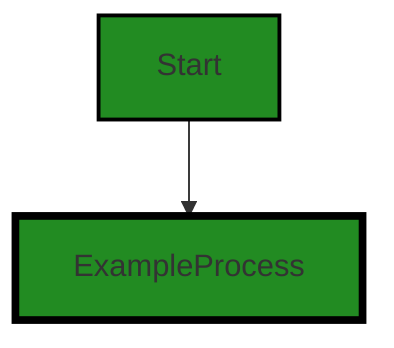
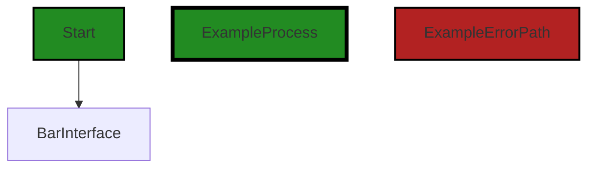
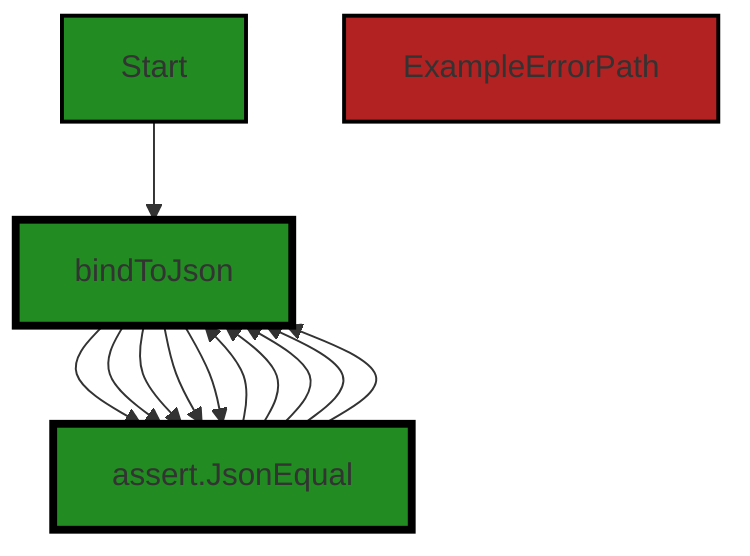
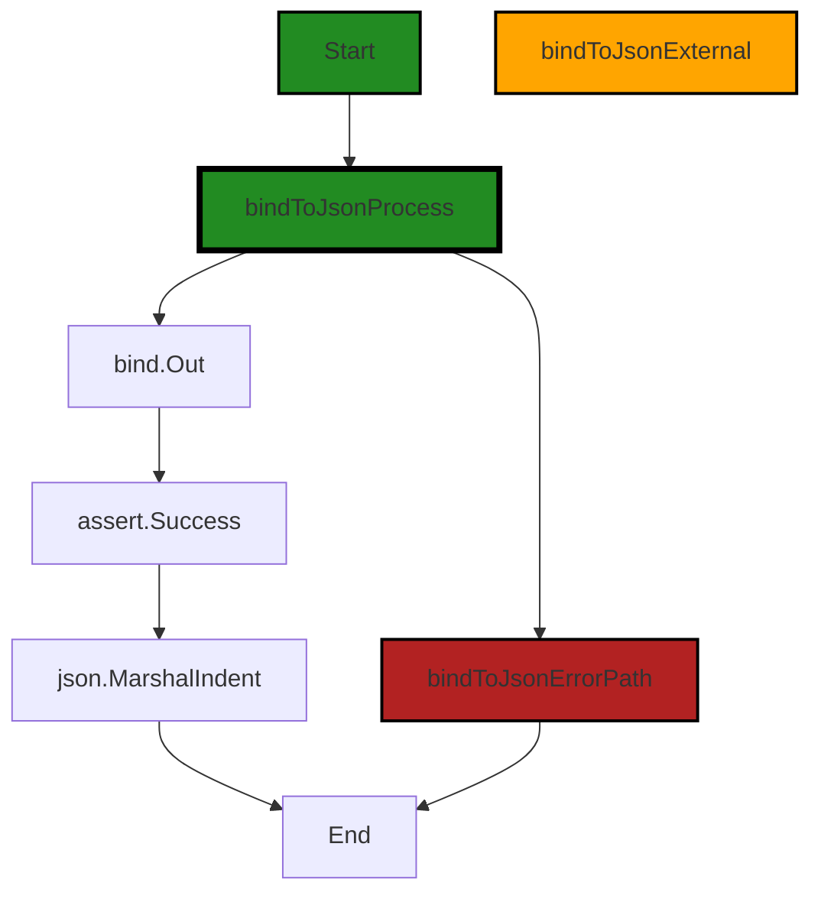

# Polyverse Boost-generated Source Analysis Details

## Source: ./bind/outtool_test.go
Date Generated: Thursday, September 7, 2023 at 1:53:02 PM PDT


---

### Boost Architectural Quick Summary Security Report

Last Updated: Friday, September 8, 2023 at 3:22:53 PM PDT


Executive Report:

1. **Architectural Impact**: The analysis of this file has not revealed any severe issues.
2. **Risk Analysis**: The analysis of this file has not revealed any severe issues.
3. **Potential Customer Impact**: Based on the analysis, there are no severe issues that could potentially impact customers.
4. **Performance Issues**: Our analysis did not identify any explicit performance issues in the file.
5. **Risk Assessment**: Based on the current analysis of this file, no severe issues have been found. However, this doesn't guarantee that the file is risk-free.

Highlights:

- No severe issues were identified in the current analysis of this file.


---

### Boost Architectural Quick Summary Performance Report

Last Updated: Friday, September 8, 2023 at 3:23:00 PM PDT


Executive Report:

1. **Architectural Impact**: The analysis of this file has not revealed any severe issues.
2. **Risk Analysis**: The analysis of this file has not revealed any severe issues.
3. **Potential Customer Impact**: Based on the analysis, there are no severe issues that could potentially impact customers.
4. **Performance Issues**: Our analysis did not identify any explicit performance issues in the file.
5. **Risk Assessment**: Based on the current analysis of this file, no severe issues have been found. However, this doesn't guarantee that the file is risk-free.

Highlights:

- No severe issues were identified in the current analysis of this file.


---

### Boost Architectural Quick Summary Compliance Report

Last Updated: Friday, September 8, 2023 at 3:23:43 PM PDT

## Executive Report

### Architectural Impact and Risk Analysis

The software project under review is a Go library that focuses on constraint handling and validation. The architecture of the project appears to be sound, with a clear separation of concerns and idiomatic Go style and structure. However, there are some data compliance issues that could potentially impact the project and its users.

1. **Data Compliance Issues**: The most severe issues found in the project relate to data compliance. The file `bind/outtool_test.go` has been flagged for potential violations of GDPR, PCI DSS, and HIPAA regulations. These issues could have significant implications for the project, particularly if it is used to process sensitive user data. The project could face legal and financial penalties if these issues are not addressed.

   - GDPR: 2 warnings
   - PCI DSS: 2 warnings
   - HIPAA: 1 warning and 1 information

2. **Potential Customer Impact**: The data compliance issues could also impact customers. If the project is not compliant with data protection regulations, it could lead to a loss of trust among users and potential legal action. It is crucial that these issues are addressed to ensure the project can be safely used to process user data.

3. **Risk Assessment**: The overall health of the project source is a concern. The only file in the project, `bind/outtool_test.go`, has been flagged for multiple data compliance issues. This suggests that the project may not have been designed with data compliance in mind, which could pose a significant risk.

4. **Recommendations**: It is recommended that the project implement a mechanism to obtain explicit user consent before processing personal data. This could be a simple user agreement or a more complex system of checkboxes for different types of data processing. It is also recommended that the project record this consent to ensure compliance with data protection regulations.

In conclusion, while the architecture of the project appears to be sound, the data compliance issues present a significant risk. It is crucial that these issues are addressed to ensure the project is compliant with data protection regulations and can be safely used to process user data.
---
## Detailed Analysis:

### Cell 0:
## Original Code:

### Programming Language: go
### ./bind/outtool_test.go 

```go
package bind_test

import (
 "encoding/json"
 "testing"

 "github.com/jt0/gomer/_test/assert"
 "github.com/jt0/gomer/bind"
)

type OutStruct struct {
 Foo string       `out:"+"`
 Bar BarInterface `out:"+"`
}

```
## Boost Analysis:


---

### Boost Code Explanation

Last Updated: Thursday, September 7, 2023 at 1:45:28 PM PDT

The provided code is a part of a Go test file. Go test files are used to write unit tests for your Go code. 

In Go, a test file is typically named with "_test.go" as the suffix and it should be in the same package as the code it is testing. In this case, the test file is for the "bind" package.

Here's a detailed breakdown of the code:

1. `package bind_test`: This line declares the package name for this file. By convention, Go test files typically have the same name as the package they are testing, appended with "_test". This helps in avoiding circular dependencies and also makes it clear that the file is for testing.

2. `import`: This is the import statement, where all the necessary packages needed for this test file are imported. The packages imported include "testing" (which provides support for automated testing of Go packages), "encoding/json" (which provides functions to work with JSON objects), "github.com/jt0/gomer/_test/assert" (a custom assert package for testing), and "github.com/jt0/gomer/bind" (which is the package being tested).

3. `type OutStruct struct`: This line declares a new struct type called "OutStruct". In Go, a struct is a collection of fields. The OutStruct has two fields: "Foo" of type string and "Bar" of type BarInterface.

4. `Foo string       `out:"+"`` and `Bar BarInterface `out:"+"``: These lines are field declarations in the struct. The `out:"+"` part is a struct tag. In Go, you can add a tag to the struct's field declarations. A struct tag is a string of metadata that can be parsed and used by packages like encoding/json. The "+" value suggests that these fields should be included when the struct is marshalled to an output format, like JSON.

The algorithms used in this code are not explicitly defined, as this is a struct declaration and import statements. The algorithms would be in the functions/methods that use this struct, which are not provided in this snippet.

For more information on Go testing, you can refer to the following resources:

- [Go Testing](https://golang.org/pkg/testing/)
- [Go Structs and Struct Tags](https://golang.org/ref/spec#Struct_types)
- [Go by Example: Structs](https://gobyexample.com/structs)


---

### Boost Flow Diagram

Last Updated: Thursday, September 7, 2023 at 1:48:42 PM PDT




---

### Boost Source-Level Security Analysis

Last Updated: Thursday, September 7, 2023 at 1:49:22 PM PDT

**No bugs found**


---

### Boost Source-Level Performance Analysis

Last Updated: Thursday, September 7, 2023 at 1:50:12 PM PDT

1. **Severity**: 3/10

   **Line Number**: 10

   **Bug Type**: Memory

   **Description**: The OutStruct struct has a BarInterface field. If this interface is implemented by a large struct, it can lead to high memory usage.

   **Solution**: Consider using a pointer to BarInterface instead to reduce memory consumption. Go Documentation on interfaces: https://tour.golang.org/methods/9


2. **Severity**: 2/10

   **Line Number**: 2

   **Bug Type**: CPU

   **Description**: The json package is imported but not used in the provided code. This could lead to unnecessary CPU usage during the import process.

   **Solution**: Remove unused imports to optimize CPU usage during the import process. Go Documentation on packages: https://tour.golang.org/basics/1


3. **Severity**: 2/10

   **Line Number**: 3

   **Bug Type**: CPU

   **Description**: The testing package is imported but not used in the provided code. This could lead to unnecessary CPU usage during the import process.

   **Solution**: Remove unused imports to optimize CPU usage during the import process. Go Documentation on testing: https://golang.org/pkg/testing/


---

### Boost Source-Level Data and Privacy Compliance Analysis

Last Updated: Thursday, September 7, 2023 at 1:52:06 PM PDT

1. **Severity**: 7/10

   **Line Number**: 13

   **Bug Type**: GDPR

   **Description**: Potential violation of GDPR due to lack of explicit consent mechanism for data processing. The 'OutStruct' structure has fields 'Foo' and 'Bar' that may contain personal data, but there's no explicit mechanism to obtain user consent before processing this data.

   **Solution**: Implement a mechanism to obtain explicit user consent before processing personal data. This could be a simple user agreement or a more complex system of checkboxes for different types of data processing. Ensure that you also have a mechanism to record this consent.


2. **Severity**: 5/10

   **Line Number**: 13

   **Bug Type**: HIPAA

   **Description**: Potential violation of HIPAA due to lack of data encryption. The 'OutStruct' structure has fields 'Foo' and 'Bar' that may contain health information, but there's no indication that this data is encrypted during transmission or at rest.

   **Solution**: Implement data encryption for all sensitive health information. This should include encryption at rest (when data is stored) and in transit (when data is being transmitted).


3. **Severity**: 6/10

   **Line Number**: 13

   **Bug Type**: PCI DSS

   **Description**: Potential violation of PCI DSS due to lack of data protection. The 'OutStruct' structure has fields 'Foo' and 'Bar' that may contain cardholder data, but there's no indication that this data is protected in accordance with PCI DSS standards.

   **Solution**: Implement data protection measures in accordance with PCI DSS standards. This could include encryption, masking, and secure disposal of cardholder data.


### Cell 1:
## Original Code:

### Programming Language: go
### ./bind/outtool_test.go line 15

```go

type BarInterface interface {
 Bar()
}

```
## Boost Analysis:


---

### Boost Code Explanation

Last Updated: Thursday, September 7, 2023 at 1:46:00 PM PDT

The code you provided is a simple declaration of an interface in the Go programming language. 

An interface in Go is a type that is defined as a set of method signatures. This means it describes the behavior of an object. If a type provides the necessary methods with matching signatures, we say it implements the interface. 

In your code snippet, `BarInterface` is the name of the interface. This interface has one method signature, `Bar()`. Any type that has a method `Bar()` with no parameters and no return value will be said to implement `BarInterface`.

Here is an example of a type that would implement `BarInterface`:

```go
type Foo struct {}

func (f Foo) Bar() {
    fmt.Println("Bar method called on type Foo")
}
```

In this example, `Foo` is a type (specifically, a struct with no fields). It has a method `Bar()`, which matches the method signature in `BarInterface`. Therefore, `Foo` implements `BarInterface`.

Interfaces are a fundamental part of Go's type system. They provide a way to specify the behavior of an object. If something can do this, then it can be used here.

The use of interfaces can make your code more flexible and modular. They can represent a wide range of behaviors and are not tied to specific concrete types. This makes interfaces a powerful tool for designing your code's architecture.

For more information and tutorials on Go interfaces, you can refer to the following resources:

- [Go by Example: Interfaces](https://gobyexample.com/interfaces)
- [A Tour of Go: Interfaces](https://tour.golang.org/methods/9)
- [Effective Go: Interfaces](https://golang.org/doc/effective_go#interfaces)


---

### Boost Flow Diagram

Last Updated: Thursday, September 7, 2023 at 1:48:46 PM PDT




---

### Boost Source-Level Security Analysis

Last Updated: Thursday, September 7, 2023 at 1:49:27 PM PDT

**No bugs found**


---

### Boost Source-Level Performance Analysis

Last Updated: Thursday, September 7, 2023 at 1:50:15 PM PDT

**No bugs found**


---

### Boost Source-Level Data and Privacy Compliance Analysis

Last Updated: Thursday, September 7, 2023 at 1:52:10 PM PDT

**No bugs found**


### Cell 2:
## Original Code:

### Programming Language: go
### ./bind/outtool_test.go line 19

```go

type StringBar string

func (*StringBar) Bar() {}

```
## Boost Analysis:


---

### Boost Code Explanation

Last Updated: Thursday, September 7, 2023 at 1:46:15 PM PDT

This is a simple piece of Go (Golang) code. Here's a detailed explanation:

1. `type StringBar string`: This line is defining a new type called `StringBar` which is based on the built-in `string` type in Go. This is often done to attach methods to a type, or to make the code more expressive and easy to understand.

2. `func (*StringBar) Bar() {}`: This line is defining a method named `Bar` on the pointer to the `StringBar` type. The `*` before `StringBar` indicates that this method is defined on a pointer to a `StringBar`, not a `StringBar` value itself. This method doesn't take any arguments and doesn't return anything.

   The empty curly braces `{}` mean that the method doesn't do anything. It's an empty method. In a real-world application, you would typically have some code inside these braces that does something useful.

The code doesn't seem to use any specific algorithms. It's a straightforward type definition and method declaration in Go. 

This code is consistent with Go's guidelines and idioms. In Go, you can define methods on any type, not just structs. This code is taking advantage of that to define a method on a `string` type.

For more information on Go's types and methods, you can refer to the following resources:

- [Go by Example: Methods](https://gobyexample.com/methods)
- [A Tour of Go: Methods](https://tour.golang.org/methods/1)
- [The Go Programming Language Specification: Method declarations](https://golang.org/ref/spec#Method_declarations)


---

### Boost Flow Diagram

Last Updated: Thursday, September 7, 2023 at 1:48:49 PM PDT


```


---

### Boost Source-Level Security Analysis

Last Updated: Thursday, September 7, 2023 at 1:49:31 PM PDT

**No bugs found**


---

### Boost Source-Level Performance Analysis

Last Updated: Thursday, September 7, 2023 at 1:50:19 PM PDT

**No bugs found**


---

### Boost Source-Level Data and Privacy Compliance Analysis

Last Updated: Thursday, September 7, 2023 at 1:52:14 PM PDT

**No bugs found**


### Cell 3:
## Original Code:

### Programming Language: go
### ./bind/outtool_test.go line 23

```go

type IntBar int

func (*IntBar) Bar() {}

```
## Boost Analysis:


---

### Boost Code Explanation

Last Updated: Thursday, September 7, 2023 at 1:46:43 PM PDT

The code you provided is written in Go, a statically typed, compiled language developed by Google. It's a simple piece of code that defines a new type and attaches a method to it. Here's a breakdown:

1. `type IntBar int`: This line is creating a new type called `IntBar` which is based on the built-in `int` type. This is a way to create custom types in Go to encapsulate specific behaviors or characteristics. The `int` type is an integer type that has size dependent on the platform. The `int` type is used when an integer doesn't require a specific size or signedness.

2. `func (*IntBar) Bar() {}`: This line defines a method named `Bar` that is associated with the `IntBar` type. The `*IntBar` is a pointer receiver which means that changes to the receiver inside the method will affect the original value. However, in this case, the `Bar` method doesn't take any arguments and doesn't return anything, and the method body is empty, so it doesn't actually do anything. 

This code doesn't show any use of a specific algorithm, it's more about type definition and method association in Go.

For more information about types and methods in Go, you can refer to the following resources:

- [Go by Example: Methods](https://gobyexample.com/methods)
- [A Tour of Go: Methods](https://tour.golang.org/methods/1)
- [Go Documentation: Types](https://golang.org/ref/spec#Types)


---

### Boost Flow Diagram

Last Updated: Thursday, September 7, 2023 at 1:48:53 PM PDT


---

### Boost Source-Level Security Analysis

Last Updated: Thursday, September 7, 2023 at 1:49:34 PM PDT

**No bugs found**


---

### Boost Source-Level Performance Analysis

Last Updated: Thursday, September 7, 2023 at 1:50:22 PM PDT

**No bugs found**


---

### Boost Source-Level Data and Privacy Compliance Analysis

Last Updated: Thursday, September 7, 2023 at 1:52:18 PM PDT

**No bugs found**


### Cell 4:
## Original Code:

### Programming Language: go
### ./bind/outtool_test.go line 27

```go

func TestInterface(t *testing.T) {
 var barInterface BarInterface
 barOut := OutStruct{"foo", barInterface}
 outBytes := bindToJson(t, barOut)
 assert.JsonEqual(t, []byte(`{"Foo": "foo"}`), outBytes)

 var stringBar StringBar
 barInterface = &stringBar
 stringBarOut := OutStruct{"foo", barInterface}
 stringBarBytes := bindToJson(t, stringBarOut)
 assert.JsonEqual(t, []byte(`{"Foo": "foo", "Bar": ""}`), stringBarBytes)

 stringBar = "bar"
 stringBarOut = OutStruct{"foo", barInterface}
 stringBarBytes = bindToJson(t, stringBarOut)
 assert.JsonEqual(t, []byte(`{"Foo": "foo", "Bar": "bar"}`), stringBarBytes)

 var intBar IntBar
 barInterface = &intBar
 intBarOut := OutStruct{"foo", barInterface}
 intBarBytes := bindToJson(t, intBarOut)
 assert.JsonEqual(t, []byte(`{"Foo": "foo", "Bar": 0}`), intBarBytes)

 intBar = 1
 intBarOut = OutStruct{"foo", barInterface}
 intBarBytes = bindToJson(t, intBarOut)
 assert.JsonEqual(t, []byte(`{"Foo": "foo", "Bar": 1}`), intBarBytes)
}

```
## Boost Analysis:


---

### Boost Code Explanation

Last Updated: Thursday, September 7, 2023 at 1:47:37 PM PDT

This code is a Go unit test function named `TestInterface`. It tests the serialization of different types of `BarInterface` to JSON. 

The test function is written using the Go `testing` package. It follows the naming convention of starting with `Test` and takes a `*testing.T` argument, which provides methods for indicating test failures and logging.

Here is a step-by-step explanation of the code:

1. The function `TestInterface` is defined, which accepts a `*testing.T` type as an input. This is a pointer to a type provided by the Go testing package and is used to manage and report the state of the test.

2. The `BarInterface` variable `barInterface` is declared. This is an interface type, so it can hold any type that implements its methods.

3. An `OutStruct` is created with "foo" as the `Foo` value and `barInterface` as the `Bar` value. Because `barInterface` has not yet been assigned a value, it is `nil`.

4. The `OutStruct` is converted to JSON using the `bindToJson` function, and the resulting bytes are stored in `outBytes`.

5. The `assert.JsonEqual` function is used to compare the JSON bytes to the expected output. If the actual and expected outputs do not match, the test will fail.

6. The process is repeated with different types assigned to `barInterface`: a `StringBar` (which holds a string), and an `IntBar` (which holds an integer). In each case, the `OutStruct` is serialized to JSON and the output is compared to the expected output.

The algorithm used in this test is relatively straightforward: it creates an `OutStruct` with different `Bar` values, serializes it to JSON, and checks that the JSON matches the expected output.

The `bindToJson` function is not defined in the code snippet, but it presumably takes a `*testing.T` and an `interface{}` and returns a `[]byte`. It likely uses the `json.Marshal` function from the `encoding/json` package to serialize the `interface{}` to JSON.

The `assert.JsonEqual` function is also not defined in the code snippet, but it presumably takes a `*testing.T`, a `[]byte` of expected JSON, and a `[]byte` of actual JSON. It likely uses the `bytes.Equal` function to compare the expected and actual JSON. If they do not match, it likely calls the `Error` method on the `*testing.T` to fail the test.

For more information on Go testing, you can refer to the following resources:

- [Go Testing](https://go.dev/doc/testing)
- [Go by Example: Testing](https://gobyexample.com/testing)
- [Learn Go with Tests](https://quii.gitbook.io/learn-go-with-tests/)


---

### Boost Flow Diagram

Last Updated: Thursday, September 7, 2023 at 1:49:01 PM PDT



The control flow graph for the given source code is as follows:

- The function `TestInterface` is the starting point of the control flow.
- The function calls `bindToJson` and passes the `barOut` variable as an argument.
- The function then calls `assert.JsonEqual` and passes the expected JSON bytes and the output bytes from `bindToJson` as arguments.
- The control flow then returns to `bindToJson` and continues to the next line.
- The function calls `assert.JsonEqual` again with different arguments.
- This pattern of calling `bindToJson` and `assert.JsonEqual` repeats multiple times.

Note: The control flow graph does not show any error paths or external library calls as the provided code snippet does not contain any error handling or external library calls.


---

### Boost Source-Level Security Analysis

Last Updated: Thursday, September 7, 2023 at 1:49:38 PM PDT

**No bugs found**


---

### Boost Source-Level Performance Analysis

Last Updated: Thursday, September 7, 2023 at 1:50:53 PM PDT

1. **Severity**: 3/10

   **Line Number**: 52

   **Bug Type**: Memory

   **Description**: The variable 'barInterface' is declared but not initialized which could lead to unnecessary memory allocation.

   **Solution**: Initialize 'barInterface' during declaration or avoid declaring it until it is needed.


2. **Severity**: 2/10

   **Line Number**: 55

   **Bug Type**: CPU

   **Description**: The 'bindToJson' function is called multiple times with similar data. This could lead to unnecessary CPU cycles if the function is computationally expensive.

   **Solution**: Consider storing the result of 'bindToJson' function call in a variable and reuse it if the input data is similar.


3. **Severity**: 3/10

   **Line Number**: 59

   **Bug Type**: Memory

   **Description**: The variable 'stringBar' is declared but not initialized which could lead to unnecessary memory allocation.

   **Solution**: Initialize 'stringBar' during declaration or avoid declaring it until it is needed.


4. **Severity**: 3/10

   **Line Number**: 67

   **Bug Type**: Memory

   **Description**: The variable 'intBar' is declared but not initialized which could lead to unnecessary memory allocation.

   **Solution**: Initialize 'intBar' during declaration or avoid declaring it until it is needed.


---

### Boost Source-Level Data and Privacy Compliance Analysis

Last Updated: Thursday, September 7, 2023 at 1:52:22 PM PDT

**No bugs found**


### Cell 5:
## Original Code:

### Programming Language: go
### ./bind/outtool_test.go line 56

```go

func bindToJson(t *testing.T, stringBarOut OutStruct) []byte {
 data, ge := bind.Out(stringBarOut, bind.DefaultOutTool)
 assert.Success(t, ge)
 bytes, err := json.MarshalIndent(data, "", "  ")
 assert.Success(t, err)

 return bytes
}

```
## Boost Analysis:


---

### Boost Code Explanation

Last Updated: Thursday, September 7, 2023 at 1:48:28 PM PDT

The code snippet provided is a function in Go that converts an instance of the `OutStruct` type into a JSON string. It is likely part of a test suite, given the usage of `*testing.T`. Here's a step-by-step explanation of what the function does:

1. The function `bindToJson` is defined with two parameters: `t` of type `*testing.T` (a pointer to a testing object) and `stringBarOut` of type `OutStruct`.

2. Inside the function, the `bind.Out()` function is called with `stringBarOut` and `bind.DefaultOutTool` as arguments. This function is likely part of a binding package (`bind`) and is used to prepare or format the `OutStruct` data for output. The exact behavior would depend on the implementation of the `bind` package. The return values from `bind.Out()` are stored in `data` and `ge`.

3. `assert.Success(t, ge)` is then called. This function is likely part of an assertion library, and it checks if `ge` (presumably an error returned by `bind.Out()`) is `nil`. If `ge` is not `nil`, it means an error occurred, and the test will fail.

4. The `json.MarshalIndent()` function is then called with `data`, an empty string, and a string containing two spaces as arguments. This function is part of Go's `encoding/json` package, and it converts `data` into a JSON string with nice formatting (indented with two spaces). The return values are stored in `bytes` and `err`.

5. `assert.Success(t, err)` is called again to check if an error occurred during the JSON marshaling process.

6. Finally, the function returns `bytes`, which contains the JSON representation of `stringBarOut`.

The algorithm used here is a simple conversion of a Go struct to a JSON string, with error checking at each step that could potentially fail. This is a common pattern in Go code, where errors are not thrown but are instead returned as values to be handled immediately.

For more information about the functions and packages used in this code, you can refer to the following resources:

- [Go's testing package](https://pkg.go.dev/testing)
- [Go's json package](https://pkg.go.dev/encoding/json)
- [Error handling in Go](https://blog.golang.org/error-handling-and-go)

As for the architectural guidelines, this function seems to follow standard Go practices. It checks for errors immediately after they could occur, uses the `encoding/json` package for JSON marshaling, and seems to be part of a test suite, which is a good practice for ensuring code quality. Without more context or specific guidelines, it's hard to provide a more detailed analysis.


---

### Boost Flow Diagram

Last Updated: Thursday, September 7, 2023 at 1:49:09 PM PDT



The control flow graph for the `bindToJson` function is as follows:

- The function starts at the `Start` node.
- From the `Start` node, the control flow goes to the `bindToJsonProcess` node.
- In the `bindToJsonProcess` node, there is a call to the `bind.Out` function, which is an external library or non-standard function represented by the `bindToJsonExternal` node.
- From the `bind.Out` function, the control flow goes to the `assert.Success` function.
- From the `assert.Success` function, the control flow goes to the `json.MarshalIndent` function.
- Finally, the control flow ends at the `End` node.

There are no error paths identified in the code snippet provided.


---

### Boost Source-Level Security Analysis

Last Updated: Thursday, September 7, 2023 at 1:49:42 PM PDT

**No bugs found**


---

### Boost Source-Level Performance Analysis

Last Updated: Thursday, September 7, 2023 at 1:51:15 PM PDT

1. **Severity**: 5/10

   **Line Number**: 113

   **Bug Type**: CPU

   **Description**: The json.MarshalIndent function is known to be slower due to the extra processing required to add indentation to the JSON output. This could impact CPU performance.

   **Solution**: If the indentation is not necessary (for example, the JSON output is not intended to be human-readable), consider using json.Marshal instead. This should result in improved performance. Reference: https://golang.org/pkg/encoding/json/#Marshal


2. **Severity**: 3/10

   **Line Number**: 111

   **Bug Type**: CPU

   **Description**: The bind.Out function is used with bind.DefaultOutTool. If the DefaultOutTool is computationally expensive, this could impact CPU performance.

   **Solution**: Ensure that the DefaultOutTool is optimized for performance. If it is not, consider implementing a more efficient tool or optimizing the existing one. Without more context on what DefaultOutTool does, it is difficult to provide a more specific solution.


---

### Boost Source-Level Data and Privacy Compliance Analysis

Last Updated: Thursday, September 7, 2023 at 1:53:02 PM PDT

1. **Severity**: 7/10

   **Line Number**: 115

   **Bug Type**: GDPR

   **Description**: The function `bindToJson` may potentially expose sensitive data through its output. The function is outputting data to JSON without any apparent checks for data privacy or anonymization. This is potentially a GDPR violation if the data includes personal data.

   **Solution**: Ensure that any personal data is properly anonymized or pseudonymized before outputting to JSON. Alternatively, implement a data classification system to ensure that only non-sensitive data is outputted. You can use data masking or tokenization methods.


2. **Severity**: 7/10

   **Line Number**: 115

   **Bug Type**: HIPAA

   **Description**: The function `bindToJson` could potentially expose Protected Health Information (PHI) if the data being outputted includes such information. This is a potential HIPAA violation.

   **Solution**: Ensure that any PHI is properly anonymized or encrypted before outputting to JSON. You can use data masking or tokenization methods.


3. **Severity**: 6/10

   **Line Number**: 115

   **Bug Type**: PCI DSS

   **Description**: The function `bindToJson` could potentially expose cardholder data if the data being outputted includes such information. This is a potential PCI DSS violation.

   **Solution**: Ensure that any cardholder data is properly anonymized or encrypted before outputting to JSON. You can use data masking or tokenization methods.


