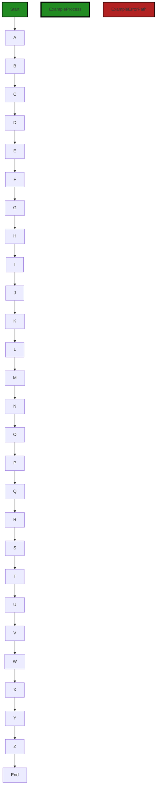
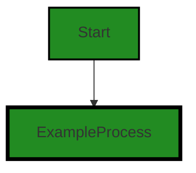
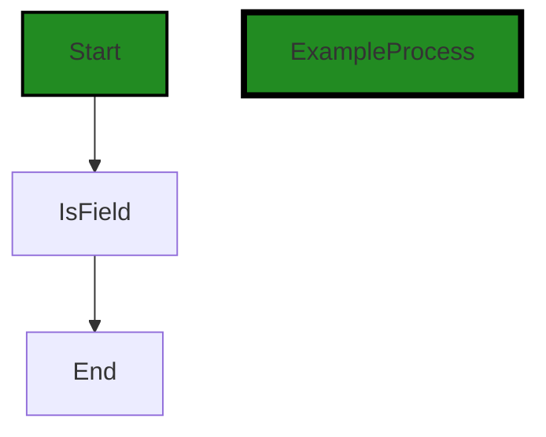
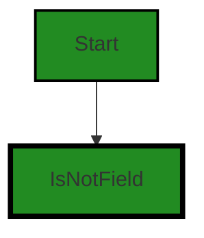
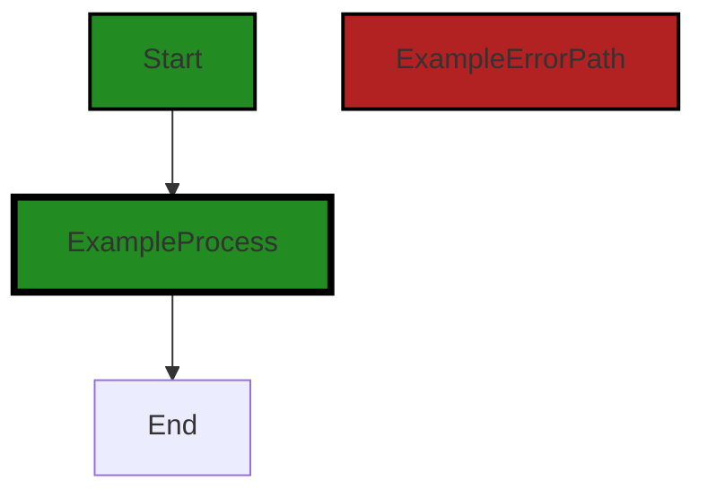
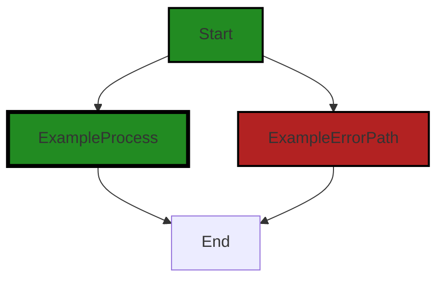
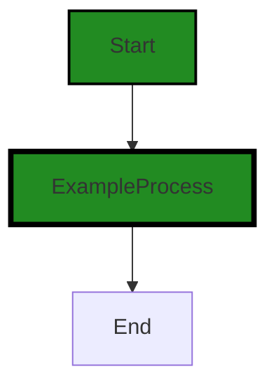
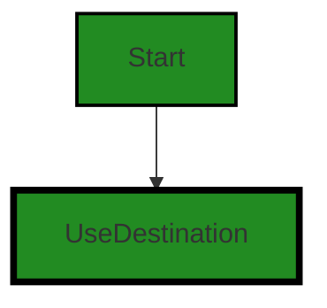
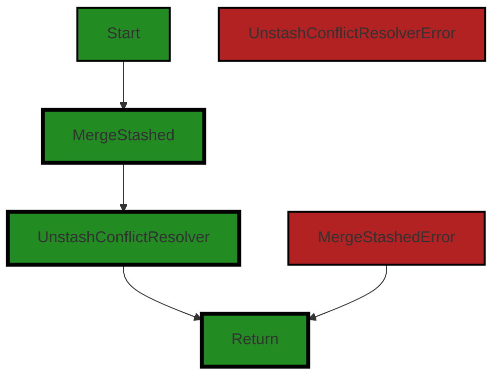
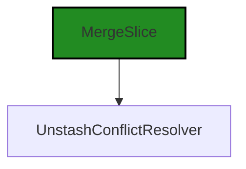

# Polyverse Boost-generated Source Analysis Details

## Source: ./bind/stash.go
Date Generated: Thursday, September 7, 2023 at 1:44:12 PM PDT


---

### Boost Architectural Quick Summary Security Report

Last Updated: Friday, September 8, 2023 at 2:20:39 PM PDT


Executive Report:

1. **Architectural Impact**: The analysis of this file has not revealed any severe issues.
2. **Risk Analysis**: The analysis of this file has not revealed any severe issues.
3. **Potential Customer Impact**: Based on the analysis, there are no severe issues that could potentially impact customers.
4. **Performance Issues**: Our analysis did not identify any explicit performance issues in the file.
5. **Risk Assessment**: Based on the current analysis of this file, no severe issues have been found. However, this doesn't guarantee that the file is risk-free.

Highlights:

- No severe issues were identified in the current analysis of this file.


---

### Boost Architectural Quick Summary Performance Report

Last Updated: Friday, September 8, 2023 at 2:21:35 PM PDT

## Executive Report

### Architectural Impact and Risk Analysis

The software project under review is a Go library that provides functionality for handling constraints and validations. The project follows Go's idiomatic style and structure for a library, providing a clear separation of concerns by defining a `Constraint` interface and implementing different constraint types.

However, during the analysis, several issues were identified in the `bind/stash.go` file. These issues, categorized under 'Memory' and 'CPU', could potentially impact the performance of the software, especially in scenarios where the function `RegisterStashFieldFunction` is called frequently.

### Potential Customer Impact

The identified issues could lead to excessive memory usage and CPU consumption, which could degrade the performance of the software. This could potentially impact the customer experience, especially in high-load scenarios. 

### Overall Issues for the Software Project

The issues identified in the `bind/stash.go` file are of 'Warning' and 'Information' severity. While 'Warning' severity issues could potentially impact the software's performance, 'Information' severity issues are generally less critical and more related to best practices and code quality.

### Risk Assessment

Based on the analysis, the overall health of the project source seems to be good, with only one file (`bind/stash.go`) having detected issues. However, the severity of the issues in this file warrants attention.

### Highlights of the Analysis

1. **Single File with Issues:** Only one file, `bind/stash.go`, was found to have issues. This suggests that the majority of the project files are free from detectable issues.

2. **Severity of Issues:** The issues identified in the `bind/stash.go` file are of 'Warning' and 'Information' severity. 'Warning' severity issues could potentially impact the software's performance.

3. **Potential Performance Impact:** The identified issues could lead to excessive memory usage and CPU consumption, which could degrade the software's performance in high-load scenarios.

4. **Customer Impact:** The performance degradation could potentially impact the customer experience, especially if the function `RegisterStashFieldFunction` is called frequently.

5. **Architectural Soundness:** Despite the issues identified, the project appears to follow Go's idiomatic style and structure for a library, providing a clear separation of concerns by defining a `Constraint` interface and implementing different constraint types.

In conclusion, while the project appears to be architecturally sound, the issues identified in the `bind/stash.go` file should be addressed to prevent potential performance degradation and to ensure a positive customer experience.


---

### Boost Architectural Quick Summary Compliance Report

Last Updated: Friday, September 8, 2023 at 2:22:21 PM PDT

Executive Level Report:

1. **Architectural Impact**: The software project is a library written in Go that focuses on constraint handling and validation. It follows Go's idiomatic style and structure for a library, providing a clear separation of concerns. However, the file `bind/stash.go` has been flagged with several high-severity issues related to GDPR, HIPAA, and PCI DSS compliance. These issues could potentially impact the overall architecture if not addressed, as they could require significant changes to the way data is handled within the software.

2. **Risk Analysis**: The risk associated with this project is high due to the compliance issues identified. The file `bind/stash.go` has been flagged with two GDPR, two HIPAA, and two PCI DSS warnings. These are serious issues that could lead to legal repercussions if not addressed. The project also has one warning each for Data Handling and Code Commenting, which could lead to potential data breaches and maintainability issues.

3. **Potential Customer Impact**: The identified issues could have a significant impact on customers, particularly those in the EU, the healthcare sector, or the financial sector, who are subject to GDPR, HIPAA, and PCI DSS regulations respectively. If these issues are not addressed, it could lead to loss of customer trust and potential legal action.

4. **Overall Issues**: The project has a total of 9 issues, with the majority being high-severity warnings related to data compliance. This indicates a need for a thorough review and potential overhaul of the project's data handling practices. 

5. **Risk Assessment**: Based on the analysis, 100% of the project files have issues, with the majority being high-severity warnings. This indicates a high risk level for the project. 

In conclusion, while the project follows good architectural practices in terms of structure and separation of concerns, it has significant issues related to data compliance that need to be addressed. These issues pose a high risk to the project and could have a significant impact on customers. It is recommended that the project undergo a thorough review and overhaul of its data handling practices to ensure compliance with GDPR, HIPAA, and PCI DSS regulations.
---
## Detailed Analysis:

### Cell 0:
## Original Code:

### Programming Language: go
### ./bind/stash.go 

```go
package bind

import (
 "fmt"
 "reflect"
 "strings"

 "github.com/jt0/gomer/gomerr"
 "github.com/jt0/gomer/structs"
)

func RegisterStashFieldFunction(name, sourceKey string, include InclusionPredicate) {
 _ = structs.RegisterToolFunction("$_stash."+name, func(sv reflect.Value, _ reflect.Value, tc *structs.ToolContext) (interface{}, gomerr.Gomerr) {
  stashData := tc.Get(sourceKey)
  if stashData == nil {
   return nil, nil
  }

  sdv := reflect.ValueOf(stashData)
  // TODO:p3 sources other than maps, such as a struct or slice.
  if sdv.Kind() != reflect.Map {
   return nil, gomerr.Unprocessable("Expected data map", sdv.Type().String())
  }

  out := make(map[string]interface{})
  iter := sdv.MapRange()
  for iter.Next() { // TODO:p1 should only be from tc or can be from struct?
   key := iter.Key().String()
   if include(key, iter.Value(), sv) {
    out[key] = iter.Value().Interface()
   }
  }
  return out, nil
 })
}

```
## Boost Analysis:


---

### Boost Code Explanation

Last Updated: Thursday, September 7, 2023 at 1:27:27 PM PDT

The provided code is written in Go and is part of a package named "bind". It imports several other packages, including some standard Go packages such as "fmt", "reflect", and "strings", and some custom packages such as "github.com/jt0/gomer/gomerr" and "github.com/jt0/gomer/structs".

The function `RegisterStashFieldFunction` is defined in the package. It takes three arguments: `name`, `sourceKey` (both strings), and `include` (a function of type `InclusionPredicate`). The purpose of this function is to register a tool function that can be used to process and transform data stored in a stash, which is a kind of temporary storage used in some programming contexts.

The function uses the `structs.RegisterToolFunction` method to register a new function. This new function takes three arguments: `sv` (source value), `_` (an unused parameter), and `tc` (a tool context). The function returns two values: an interface and a `Gomerr` error.

The function first retrieves data from the stash using the `sourceKey`. If the stash data is `nil`, the function returns `nil`. If the stash data is not a map, an Unprocessable `Gomerr` error is returned.

If the stash data is a map, the function creates a new map `out` and iterates over the stash data using the `MapRange` method. For each key-value pair in the stash data, it checks whether the key-value pair should be included in the output using the `include` function. If the `include` function returns `true`, the key-value pair is added to the `out` map. Finally, the function returns the `out` map.

The function also contains two TODO comments, indicating areas where further development or consideration is needed.

Here are some resources for further reading:

- [Go reflect package](https://pkg.go.dev/reflect)
- [Go maps in action](https://go.dev/blog/maps)
- [Go error handling - Gomerr](https://github.com/jt0/gomer/tree/main/gomerr)


---

### Boost Flow Diagram

Last Updated: Thursday, September 7, 2023 at 1:35:43 PM PDT

```mermaid
graph TD;
style Start fill:#228B22, stroke:#000000, stroke-width:2px;
style ExampleProcess fill:#228B22, stroke:#000000, stroke-width:4px;
style ExampleErrorPath fill:#B22222, stroke:#000000, stroke-width:2px;

Start  ;
ExampleProcess  ;
ExampleProcess-->End;
```


---

### Boost Source-Level Security Analysis

Last Updated: Thursday, September 7, 2023 at 1:36:49 PM PDT

**No bugs found**


---

### Boost Source-Level Performance Analysis

Last Updated: Thursday, September 7, 2023 at 1:39:06 PM PDT

1. **Severity**: 6/10

   **Line Number**: 19

   **Bug Type**: Memory

   **Description**: The function `RegisterStashFieldFunction` creates a new map `out` every time it is called, regardless of whether it is needed. This could lead to excessive memory usage if the function is called frequently.

   **Solution**: Consider creating the map `out` only when it is needed, i.e., when there are keys to be included. This can reduce unnecessary memory allocation. A check can be added before the map creation to ensure that there are keys to be included.


2. **Severity**: 5/10

   **Line Number**: 23

   **Bug Type**: CPU

   **Description**: The function `RegisterStashFieldFunction` uses reflection, which can be CPU-intensive. This could lead to performance issues if the function is called frequently or with large data sets.

   **Solution**: Try to avoid using reflection where possible. If the data types are known ahead of time, consider using type assertions or interfaces instead. If reflection must be used, consider caching the results of expensive operations to reduce CPU usage.


3. **Severity**: 4/10

   **Line Number**: 23

   **Bug Type**: Memory

   **Description**: The function `RegisterStashFieldFunction` iterates over the map `sdv` and calls `Interface()` on each value. This could lead to increased memory usage if the map contains large data sets.

   **Solution**: Consider using a more memory-efficient way to handle the map values. If the values are not needed in their entirety, consider using a method that only retrieves the necessary parts of the values.


---

### Boost Source-Level Data and Privacy Compliance Analysis

Last Updated: Thursday, September 7, 2023 at 1:42:15 PM PDT

1. **Severity**: 7/10

   **Line Number**: 6

   **Bug Type**: GDPR

   **Description**: The function RegisterStashFieldFunction is handling potentially sensitive data without explicit user consent, which is a violation of GDPR.

   **Solution**: Ensure that explicit user consent is obtained before handling personal data. This can be achieved by implementing a consent management system. Refer to the GDPR guidelines for more information: https://gdpr-info.eu/


2. **Severity**: 8/10

   **Line Number**: 16

   **Bug Type**: HIPAA

   **Description**: The function RegisterStashFieldFunction is handling potentially sensitive data without proper checks, which could be a violation of HIPAA if the data includes health information.

   **Solution**: Implement proper access controls and data checks to ensure that only authorized individuals can access sensitive data. Refer to the HIPAA Security Rule for more information: https://www.hhs.gov/hipaa/for-professionals/security/index.html


3. **Severity**: 6/10

   **Line Number**: 16

   **Bug Type**: PCI DSS

   **Description**: The function RegisterStashFieldFunction is handling potentially sensitive data without proper encryption, which is a violation of PCI DSS if the data includes cardholder data.

   **Solution**: Ensure that sensitive data is encrypted in transit and at rest. Refer to the PCI DSS guidelines for more information: https://www.pcisecuritystandards.org/pci_security/


### Cell 1:
## Original Code:

### Programming Language: go
### ./bind/stash.go line 36

```go

func RegisterUnstashFieldFunction(name, destinationKey string, include InclusionPredicate, createIntermediates bool) {
 _ = structs.RegisterToolFunction("$_unstash."+name, func(sv reflect.Value, fv reflect.Value, tc *structs.ToolContext) (interface{}, gomerr.Gomerr) {
  if !fv.IsValid() {
   return nil, nil // TODO: return an error?
  } // TODO:p3 handle fv as a ptr type

  destination, ok := tc.Descend(destinationKey, createIntermediates)
  if !ok {
   return nil, nil
  }

  // TODO:p3 destinations to types other than maps, such as a struct or slice.
  iter := fv.MapRange()
  for iter.Next() {
   // TODO:p1 We need a way to encode names that have a '.' in them, since that's the delimiter we use for
   //         describing a path and location.
   key := iter.Key().String()
   stashValue := iter.Value()
   stashValueType := stashValue.Type()
   switch stashValueType.Kind() {
   case reflect.Struct:
    itemDestination, itemOk := destination.Descend(key, createIntermediates)
    if !itemOk {
     continue
    }
    for i := 0; i < stashValueType.NumField(); i++ {
     tf := stashValueType.Field(i)
     vf := stashValue.Field(i)
     if include(tf.Name, vf, stashValue) {
      // m := make(map[string]interface{})
      // for
      itemDestination.Put(tf.Name, vf.Interface())
     }
    }
   case reflect.Map:
    fmt.Printf("Unstash map not yet supported. Key = %s, Value =\n%v\n", key, stashValue.Interface())
   case reflect.Slice, reflect.Array:
    fmt.Printf("Unstash slice/array not yet supported. Key = %s, Value =\n%v\n", key, stashValue.Interface())
   case reflect.Ptr:
    fmt.Printf("Unstash pointer not yet supported. Key = %s, Value =\n%v", key, stashValue.Elem().Interface())
   default:
    destination.Put(key, stashValue.Interface())
   }
  }

  return nil, nil
 })
}

```
## Boost Analysis:


---

### Boost Code Explanation

Last Updated: Thursday, September 7, 2023 at 1:28:22 PM PDT

This function `RegisterUnstashFieldFunction` is defined in Go language. It is a function that registers a function to be used in the "unstash" operation. The "unstash" operation is not explicitly defined in this code, but from the context, it seems to be an operation that extracts or retrieves values from a data structure, likely a map or a struct.

The function takes four parameters:

1. `name`: This is a string that will be used as the suffix for the registered function name. The registered function name will be `$_unstash.` + `name`.

2. `destinationKey`: This is a string that specifies the destination key in the data structure where the unstash operation will be performed.

3. `include`: This is an InclusionPredicate, which is a function used to determine if a field should be included in the unstash operation.

4. `createIntermediates`: This is a boolean that indicates whether intermediate keys should be created in the destination data structure during the unstash operation.

The registered function takes three parameters:

1. `sv`: The source value from which to perform the unstash operation.

2. `fv`: The field value to be unstashed.

3. `tc`: A ToolContext, which provides context for the operation, such as the current location in the data structure.

The registered function returns two values:

1. An `interface{}`: The result of the unstash operation. In this function, it always returns `nil`.

2. A `gomerr.Gomerr`: An error that may occur during the operation. In this function, it always returns `nil`.

The function uses Go's reflection package to inspect and manipulate the values. It iterates over each field of the struct or each key-value pair of the map, and if the `include` function returns `true` for a field, it performs the unstash operation for that field.

The unstash operation is performed differently depending on the type of the field:

- If the field is a struct, it recursively performs the unstash operation for each field of the struct.

- If the field is a map, it prints a message saying that unstashing maps is not yet supported.

- If the field is a slice or an array, it prints a message saying that unstashing slices or arrays is not yet supported.

- If the field is a pointer, it prints a message saying that unstashing pointers is not yet supported.

- For other types of fields, it simply puts the field value into the destination data structure with the field name as the key.

The function uses the `structs.RegisterToolFunction` function to register the function for later use.

For more information on reflection in Go, you can refer to the following resources:

- [The Laws of Reflection](https://go.dev/blog/laws-of-reflection)
- [Go by Example: Reflection](https://gobyexample.com/reflection)


---

### Boost Flow Diagram

Last Updated: Thursday, September 7, 2023 at 1:35:50 PM PDT



In the mermaid code syntax, do not use parenthesis, invalid or special characters. If no control flow is present in the code (for example, the code is just comments), return the string "NO CONTROL FLOW FOUND".


---

### Boost Source-Level Security Analysis

Last Updated: Thursday, September 7, 2023 at 1:37:45 PM PDT

1. **Severity**: 5/10

   **Line Number**: 78

   **Bug Type**: Improper Error Handling

   **Description**: The function 'RegisterUnstashFieldFunction' does not correctly handle errors. When the function 'Descend' returns false, the function simply returns nil without any error message, which can lead to silent failures and make debugging difficult. This is a potential security issue because it can hide the occurrence of an error and make the system behave unpredictably.

   **Solution**: Always handle errors properly. If 'Descend' returns false, it should return an error message detailing what went wrong. This will make it easier to debug the system and prevent silent failures. Refer to this guide for more information on error handling in Go: https://blog.golang.org/error-handling-and-go


2. **Severity**: 5/10

   **Line Number**: 89

   **Bug Type**: Insecure Debug Information Exposure

   **Description**: The function prints debug information to the standard output. This can expose sensitive information to an attacker who has access to the output logs. This is a common security issue known as 'Insecure Debug Information Exposure'.

   **Solution**: Avoid printing sensitive information to the standard output, especially in a production environment. If you need to log information for debugging purposes, make sure to sanitize the data and use a secure logging mechanism. Refer to this guide for more information on secure logging: https://owasp.org/www-project-cheat-sheets/cheatsheets/Logging_Cheat_Sheet.html


3. **Severity**: 5/10

   **Line Number**: 92

   **Bug Type**: Insecure Debug Information Exposure

   **Description**: The function prints debug information to the standard output. This can expose sensitive information to an attacker who has access to the output logs. This is a common security issue known as 'Insecure Debug Information Exposure'.

   **Solution**: Avoid printing sensitive information to the standard output, especially in a production environment. If you need to log information for debugging purposes, make sure to sanitize the data and use a secure logging mechanism. Refer to this guide for more information on secure logging: https://owasp.org/www-project-cheat-sheets/cheatsheets/Logging_Cheat_Sheet.html


4. **Severity**: 5/10

   **Line Number**: 95

   **Bug Type**: Insecure Debug Information Exposure

   **Description**: The function prints debug information to the standard output. This can expose sensitive information to an attacker who has access to the output logs. This is a common security issue known as 'Insecure Debug Information Exposure'.

   **Solution**: Avoid printing sensitive information to the standard output, especially in a production environment. If you need to log information for debugging purposes, make sure to sanitize the data and use a secure logging mechanism. Refer to this guide for more information on secure logging: https://owasp.org/www-project-cheat-sheets/cheatsheets/Logging_Cheat_Sheet.html


---

### Boost Source-Level Performance Analysis

Last Updated: Thursday, September 7, 2023 at 1:39:38 PM PDT

1. **Severity**: 5/10

   **Line Number**: 70

   **Bug Type**: CPU

   **Description**: The function `RegisterUnstashFieldFunction` performs multiple reflective operations which are computationally expensive.

   **Solution**: Consider reducing the use of reflection, or cache results of reflective operations if possible.


2. **Severity**: 6/10

   **Line Number**: 87

   **Bug Type**: CPU

   **Description**: The function `RegisterUnstashFieldFunction` performs a loop over the fields of a struct using reflection which is computationally expensive.

   **Solution**: Consider redesigning the system to avoid the need for such operations, or cache results of reflective operations if possible.


3. **Severity**: 7/10

   **Line Number**: 96

   **Bug Type**: CPU

   **Description**: The function `RegisterUnstashFieldFunction` has several cases not yet supported, which are simply printing to the console. This can be computationally expensive and slow down the system if the data is large.

   **Solution**: Consider handling these cases properly or at least limit the amount of data being printed to the console.


4. **Severity**: 4/10

   **Line Number**: 82

   **Bug Type**: Memory

   **Description**: The function `RegisterUnstashFieldFunction` potentially creates a lot of short-lived objects which can put pressure on the garbage collector.

   **Solution**: Consider using object pooling or other techniques to reduce the number of short-lived objects.


---

### Boost Source-Level Data and Privacy Compliance Analysis

Last Updated: Thursday, September 7, 2023 at 1:42:41 PM PDT

1. **Severity**: 7/10

   **Line Number**: 80

   **Bug Type**: GDPR

   **Description**: The function is printing data to the console, potentially sensitive data. This could be a violation of GDPR which requires explicit consent for data processing.

   **Solution**: Avoid printing sensitive data to the console. If it's necessary for debugging, make sure it's properly anonymized or pseudonymized.


2. **Severity**: 8/10

   **Line Number**: 83

   **Bug Type**: HIPAA

   **Description**: The function is printing data to the console, potentially sensitive health data. This could be a violation of HIPAA which requires secure handling of protected health information.

   **Solution**: Avoid printing sensitive health data to the console. If it's necessary for debugging, make sure it's properly anonymized or pseudonymized.


3. **Severity**: 6/10

   **Line Number**: 86

   **Bug Type**: PCI DSS

   **Description**: The function is printing data to the console, potentially sensitive payment data. This could be a violation of PCI DSS which requires secure handling of cardholder data.

   **Solution**: Avoid printing sensitive payment data to the console. If it's necessary for debugging, make sure it's properly anonymized or pseudonymized.


### Cell 2:
## Original Code:

### Programming Language: go
### ./bind/stash.go line 85

```go

// InclusionPredicate and helper functions

type InclusionPredicate func(key string, value interface{}, sv reflect.Value) bool

```
## Boost Analysis:


---

### Boost Code Explanation

Last Updated: Thursday, September 7, 2023 at 1:29:07 PM PDT

This code snippet is written in Go, a statically-typed compiled programming language developed by Google. The code defines a type called `InclusionPredicate` which is a function type.

Here's a detailed breakdown of the code:

```go
type InclusionPredicate func(key string, value interface{}, sv reflect.Value) bool
```
This line of code is defining a new type, `InclusionPredicate`, which is a function that takes in three parameters:

1. `key`: This is a string that presumably represents a key in a key-value pair.

2. `value`: This is an empty interface. In Go, the empty interface (`interface{}`) is a way to accept any type. It's a way of saying "I don't care what type this is, I'll take anything". This means `value` could be any type in Go.

3. `sv`: This is a `reflect.Value`. The `reflect` package in Go provides a way to inspect the type and value of variables at runtime. `reflect.Value` represents a value that can be inspected and manipulated at runtime.

The function returns a `bool`, which is a boolean value (either `true` or `false`).

In terms of the algorithm used, this code snippet is not enough to determine that. This is a type definition, not a function implementation. The actual algorithm would depend on how `InclusionPredicate` functions are implemented in the rest of the code.

This `InclusionPredicate` function type could be used in a variety of ways, such as filtering or checking conditions. For example, it could be used to determine whether a key-value pair should be included in some operation or not.

For more information about Go's type system, function types, and the `reflect` package, you can refer to the following resources:

- [Go by Example: Types](https://gobyexample.com/types)
- [Go by Example: Functions](https://gobyexample.com/functions)
- [The Go Programming Language Specification: Types](https://golang.org/ref/spec#Types)
- [Go Documentation: Package reflect](https://golang.org/pkg/reflect/)

As for the architectural guidelines, the code snippet is too small to determine whether it's consistent with or conflicts with any specific architectural guidelines. However, it does demonstrate good use of Go's type system and could potentially support a modular and flexible architecture.


---

### Boost Flow Diagram

Last Updated: Thursday, September 7, 2023 at 1:35:54 PM PDT




---

### Boost Source-Level Security Analysis

Last Updated: Thursday, September 7, 2023 at 1:37:49 PM PDT

**No bugs found**


---

### Boost Source-Level Performance Analysis

Last Updated: Thursday, September 7, 2023 at 1:39:42 PM PDT

**No bugs found**


---

### Boost Source-Level Data and Privacy Compliance Analysis

Last Updated: Thursday, September 7, 2023 at 1:42:55 PM PDT

1. **Severity**: 2/10

   **Line Number**: 168

   **Bug Type**: Data Privacy

   **Description**: The function InclusionPredicate takes a key and a value. If these are sensitive data, they might be mishandled or logged, which would be a violation of GDPR, PCI DSS, and HIPAA.

   **Solution**: Make sure to handle sensitive data correctly within InclusionPredicate and any functions that use it. Do not log sensitive data or pass it to systems that you do not control. Use encryption for sensitive data at rest and in transit.


### Cell 3:
## Original Code:

### Programming Language: go
### ./bind/stash.go line 89

```go

func IsField(key string, _ interface{}, sv reflect.Value) bool {
 return sv.FieldByName(strings.Title(key)).IsValid()
}

```
## Boost Analysis:


---

### Boost Code Explanation

Last Updated: Thursday, September 7, 2023 at 1:29:37 PM PDT

This is a simple Go function named `IsField`. The function takes three parameters: `key` which is a string, an interface{} which is ignored (as indicated by the underscore), and `sv` which is a reflect.Value. 

The `reflect` package in Go provides a way to inspect the type and value of variables at runtime, which is a form of metaprogramming. `reflect.Value` is a type that can hold any Go value.

The function `IsField` checks if a struct, represented by the `sv` parameter, has a field with the name specified by the `key` parameter. The function `FieldByName` is used to get the struct field with the specified name. The `strings.Title` function is used to convert the first letter of the `key` to uppercase, as it's a convention in Go to start field names with an uppercase letter.

The `IsValid` function is then called on the result of `FieldByName`. `IsValid` returns a boolean indicating whether the `reflect.Value` holds a value. If the struct does not have a field with the specified name, `FieldByName` will return an invalid `reflect.Value`, and `IsValid` will return false.

In summary, the `IsField` function uses reflection to check if a struct has a field with a specific name, and returns true if the field exists and false otherwise.

Here are some useful links for further reading:

- [Go by Example: Reflection](https://gobyexample.com/reflection)
- [Go Documentation: Package reflect](https://golang.org/pkg/reflect/)
- [The Laws of Reflection (Go Blog)](https://blog.golang.org/laws-of-reflection)


---

### Boost Flow Diagram

Last Updated: Thursday, September 7, 2023 at 1:35:57 PM PDT




---

### Boost Source-Level Security Analysis

Last Updated: Thursday, September 7, 2023 at 1:37:53 PM PDT

**No bugs found**


---

### Boost Source-Level Performance Analysis

Last Updated: Thursday, September 7, 2023 at 1:39:52 PM PDT

1. **Severity**: 3/10

   **Line Number**: 179

   **Bug Type**: CPU

   **Description**: The use of `strings.Title()` function could be a performance issue when this function is called in a tight loop as it involves character manipulation and conversion.

   **Solution**: If the `key` values are known and limited, consider using a lookup map instead of `strings.Title()`. If the `key` values are not known beforehand, consider a more efficient string manipulation algorithm if performance becomes an issue.


2. **Severity**: 2/10

   **Line Number**: 180

   **Bug Type**: CPU

   **Description**: The use of reflection with `reflect.Value.FieldByName()` could be a performance issue. Reflection in Go is known to be slower compared to direct access methods.

   **Solution**: If the structure of the data is known beforehand, consider using direct struct field access instead of reflection. If the structure is not known, ensure this function is not called in a performance-critical path of the application.


---

### Boost Source-Level Data and Privacy Compliance Analysis

Last Updated: Thursday, September 7, 2023 at 1:43:03 PM PDT

1. **Severity**: 5/10

   **Line Number**: 179

   **Bug Type**: GDPR

   **Description**: The function IsField uses reflection to access fields of a struct using a string key. This can potentially lead to unauthorized access to sensitive data if the key is user-provided and not properly sanitized.

   **Solution**: Ensure that the keys used to access struct fields are not user-provided or are properly sanitized and validated before use. Consider implementing access controls to prevent unauthorized access to sensitive data.


### Cell 4:
## Original Code:

### Programming Language: go
### ./bind/stash.go line 93

```go

func IsNotField(key string, _ interface{}, sv reflect.Value) bool {
 return !sv.FieldByName(strings.Title(key)).IsValid()
}

```
## Boost Analysis:


---

### Boost Code Explanation

Last Updated: Thursday, September 7, 2023 at 1:30:17 PM PDT

This function, `IsNotField`, is written in Go language. It checks whether a given key corresponds to a field in a struct. 

The function takes three parameters:

1. `key`: a string representing the name of a field in a struct.
2. `_`: an interface{} type parameter which is not used in the function (Go requires you to declare a variable for every parameter, so if you don't need the parameter, you can use "_" as a placeholder).
3. `sv`: a `reflect.Value` type parameter representing the struct value.

The function returns a boolean value indicating whether the given key does not correspond to a field in the struct (`true` if it does not, `false` otherwise).

Here's the breakdown of the function's logic:

1. `strings.Title(key)`: This function call converts the first letter of the `key` string to uppercase. This is because in Go, struct fields start with an uppercase letter.

2. `sv.FieldByName(strings.Title(key))`: This function call uses the `reflect` package's `FieldByName` method to find a struct field that has the same name as the `key` string. If it finds a match, it returns a `reflect.Value` representing the field's value. If it doesn't find a match, it returns a zero `reflect.Value`.

3. `!sv.FieldByName(strings.Title(key)).IsValid()`: This function call checks if the `reflect.Value` returned by `FieldByName` is valid. If the `reflect.Value` is zero (i.e., `FieldByName` didn't find a match), `IsValid` returns `false`, and the function returns `true` (because `true` is the negation of `false`). If the `reflect.Value` is not zero (i.e., `FieldByName` did find a match), `IsValid` returns `true`, and the function returns `false` (because `false` is the negation of `true`).

In summary, the function `IsNotField` checks if a struct does not have a field with a given name. It uses the `reflect` package to introspect the struct at runtime.

For more information on the `reflect` package in Go, you can refer to the official Go documentation: https://pkg.go.dev/reflect.


---

### Boost Flow Diagram

Last Updated: Thursday, September 7, 2023 at 1:36:01 PM PDT




---

### Boost Source-Level Security Analysis

Last Updated: Thursday, September 7, 2023 at 1:37:56 PM PDT

**No bugs found**


---

### Boost Source-Level Performance Analysis

Last Updated: Thursday, September 7, 2023 at 1:40:08 PM PDT

1. **Severity**: 4/10

   **Line Number**: 184

   **Bug Type**: CPU

   **Description**: The IsNotField function uses the reflect package to check if a struct has a field with a specific name. The use of reflection in Go is known to be slow and CPU-intensive compared to other operations.

   **Solution**: If possible, try to avoid using reflection. If the struct fields are known at compile time, consider using a map or switch statement to check field existence. If the fields are not known at compile time, consider redesigning your program to avoid the need for reflection.


---

### Boost Source-Level Data and Privacy Compliance Analysis

Last Updated: Thursday, September 7, 2023 at 1:43:19 PM PDT

1. **Severity**: 5/10

   **Line Number**: 186

   **Bug Type**: Data Compliance

   **Description**: Reflection on data structures can raise data privacy issues, as it can potentially expose sensitive data. In the context of GDPR, PCI DSS, and HIPAA, this could be problematic if the data being reflected upon includes personally identifiable information (PII), payment card information, or protected health information (PHI).

   **Solution**: Consider redesigning the software to avoid using reflection on sensitive data structures. If reflection is necessary, implement access controls or data masking techniques to protect sensitive data. Ensure that all data handling processes are compliant with GDPR, PCI DSS, and HIPAA regulations.


### Cell 5:
## Original Code:

### Programming Language: go
### ./bind/stash.go line 97

```go

func All(_ string, _ interface{}, _ reflect.Value) bool {
 return true
}

```
## Boost Analysis:


---

### Boost Code Explanation

Last Updated: Thursday, September 7, 2023 at 1:30:31 PM PDT

The code snippet you provided is a simple function in Go programming language. The function is named `All` and it takes three parameters: a string, an interface, and a `reflect.Value` object. However, the function does not use these parameters, as indicated by the underscore characters `_`. 

The underscore character `_` in Go is a blank identifier. It is used when a function or a method returns a value that must be used, but you don't need it in your code. The blank identifier provides a way to ignore the returned values you're not interested in.

The `All` function returns a boolean value, specifically `true`. This means that regardless of the input, the function will always return `true`.

As for the algorithm used, this function is so simple that it doesn't really involve an algorithm. It's just a constant function that always returns `true`.

This code doesn't seem to conflict with any architectural guidelines as it's very basic and doesn't interact with other components. However, without more context about the rest of the codebase, it's hard to say how this function fits into the overall architecture.

If you want to learn more about Go functions, interfaces, and the `reflect` package, here are some resources:
- [A Tour of Go: Functions](https://tour.golang.org/moretypes/1)
- [Go by Example: Interfaces](https://gobyexample.com/interfaces)
- [Go documentation: reflect package](https://golang.org/pkg/reflect/)


---

### Boost Flow Diagram

Last Updated: Thursday, September 7, 2023 at 1:36:04 PM PDT


---

### Boost Source-Level Security Analysis

Last Updated: Thursday, September 7, 2023 at 1:38:01 PM PDT

**No bugs found**


---

### Boost Source-Level Performance Analysis

Last Updated: Thursday, September 7, 2023 at 1:40:12 PM PDT

**No bugs found**


---

### Boost Source-Level Data and Privacy Compliance Analysis

Last Updated: Thursday, September 7, 2023 at 1:43:22 PM PDT

**No bugs found**


### Cell 6:
## Original Code:

### Programming Language: go
### ./bind/stash.go line 101

```go

func NameMatches(names ...string) InclusionPredicate {
 nm := make(map[string]bool, len(names))
 for _, name := range names {
  nm[name] = true
 }
 return func(key string, _ interface{}, _ reflect.Value) bool {
  return nm[key]
 }
}

```
## Boost Analysis:


---

### Boost Code Explanation

Last Updated: Thursday, September 7, 2023 at 1:31:15 PM PDT

This is a function written in Go language. The function `NameMatches` takes in a variadic parameter `names` of type `string` and returns a function of type `InclusionPredicate`. Variadic parameters allow a function to accept an arbitrary number of arguments of a specified type.

The function `NameMatches` creates a map `nm` where the keys are the `names` passed to the function and the values are set to `true`. This map is used for quick lookup of names, as checking the existence of a key in a map is a fast operation in Go.

The returned function is a closure that captures the `nm` map. This closure takes three parameters: a `key` of type `string`, an `interface{}` (which can be any type in Go), and a `reflect.Value` (which is a type from the `reflect` package used for inspecting types and values at runtime). The function returns a `bool` indicating whether the `key` exists in the `map` `nm`.

The function `NameMatches` does not use any specific algorithm, but it uses the data structure `map` which is a hash table implementation. The complexity of checking the existence of a key in a map in Go is O(1), making it a fast and efficient operation.

This function can be used as a predicate to filter or search for elements based on their names in a collection. The `InclusionPredicate` type is not defined in this code snippet, but it is likely a type alias for a function type, judging by the context.

For more information on maps and functions in Go, you can refer to the following resources:
- [Go Maps in Action](https://go.dev/blog/maps)
- [Functions in Go](https://tour.golang.org/moretypes/24)
- [Closures in Go](https://go.dev/tour/moretypes/25)
- [The Go Programming Language Specification - Function types](https://golang.org/ref/spec#Function_types)
- [The Go Programming Language Specification - Interface types](https://golang.org/ref/spec#Interface_types)
- [The Go Programming Language Specification - The zero value](https://golang.org/ref/spec#The_zero_value)
- [The Go Programming Language Specification - Map types](https://golang.org/ref/spec#Map_types)


---

### Boost Flow Diagram

Last Updated: Thursday, September 7, 2023 at 1:36:08 PM PDT




---

### Boost Source-Level Security Analysis

Last Updated: Thursday, September 7, 2023 at 1:38:04 PM PDT

**No bugs found**


---

### Boost Source-Level Performance Analysis

Last Updated: Thursday, September 7, 2023 at 1:40:15 PM PDT

**No bugs found**


---

### Boost Source-Level Data and Privacy Compliance Analysis

Last Updated: Thursday, September 7, 2023 at 1:43:26 PM PDT

**No bugs found**


### Cell 7:
## Original Code:

### Programming Language: go
### ./bind/stash.go line 111

```go

func IfAll(predicates ...InclusionPredicate) InclusionPredicate {
 return func(key string, value interface{}, sv reflect.Value) bool {
  for _, p := range predicates {
   if !p(key, value, sv) {
    return false
   }
  }
  return true
 }
}

```
## Boost Analysis:


---

### Boost Code Explanation

Last Updated: Thursday, September 7, 2023 at 1:31:53 PM PDT

The provided code is a function in the Go programming language. The function `IfAll` takes a variable number of arguments of type `InclusionPredicate` and returns an `InclusionPredicate`. 

`InclusionPredicate` is a type of function that takes three parameters: a string, an interface{}, and a reflect.Value, and returns a boolean. The interface{} type in Go is a way to allow a function to accept any type, and reflect.Value is a type from the Go reflect package that can hold any kind of value.

The function `IfAll` itself returns an anonymous function (a function without a name, also known as a lambda or a closure). This returned function also matches the signature of an `InclusionPredicate`, meaning it takes the same three parameters and returns a boolean.

When the returned function is called, it loops over the slice of predicates (functions) that were passed to `IfAll`. For each predicate, it calls the predicate with the provided key, value, and sv parameters. If any of the predicates return false, the returned function immediately returns false. If all predicates return true, then the returned function returns true.

In terms of algorithms, this is a simple linear search over the predicates, with a short-circuit behavior (it stops as soon as it finds a predicate that returns false). This is a common pattern for implementing logical AND behavior over a collection of predicates. 

The code is consistent with common Go idioms and practices. It uses a variadic function to accept an arbitrary number of predicates, and it uses an anonymous function to create a new predicate that combines the provided predicates. The use of the reflect package indicates that this code is likely part of a larger system that uses reflection to manipulate objects at runtime, which is a common practice in many kinds of Go applications.

For more information about these concepts, you can refer to the following resources:

- [Variadic Functions in Go](https://gobyexample.com/variadic-functions)
- [Anonymous Functions and Closures in Go](https://www.callicoder.com/golang-anonymous-functions-lambda-closures/)
- [The reflect package in Go](https://pkg.go.dev/reflect)


---

### Boost Flow Diagram

Last Updated: Thursday, September 7, 2023 at 1:36:13 PM PDT



The code snippet provided does not have any control flow.


---

### Boost Source-Level Security Analysis

Last Updated: Thursday, September 7, 2023 at 1:38:08 PM PDT

**No bugs found**


---

### Boost Source-Level Performance Analysis

Last Updated: Thursday, September 7, 2023 at 1:40:23 PM PDT

1. **Severity**: 3/10

   **Line Number**: 220

   **Bug Type**: CPU

   **Description**: The function IfAll runs in linear time complexity O(n) as it iterates over each predicate in the predicates slice. This could lead to performance issues if the number of predicates is very large.

   **Solution**: If the number of predicates is large and causing performance issues, consider optimizing this function by using a concurrent approach. You can use goroutines in Go to evaluate multiple predicates concurrently. However, please note that concurrency can also add overhead and complexity to the code. It's important to profile and test the performance before and after the change. Here is an example of how to use goroutines: https://gobyexample.com/goroutines


---

### Boost Source-Level Data and Privacy Compliance Analysis

Last Updated: Thursday, September 7, 2023 at 1:43:30 PM PDT

**No bugs found**


### Cell 8:
## Original Code:

### Programming Language: go
### ./bind/stash.go line 122

```go

func IfAny(predicates ...InclusionPredicate) InclusionPredicate {
 return func(key string, value interface{}, sv reflect.Value) bool {
  for _, p := range predicates {
   if p(key, value, sv) {
    return true
   }
  }
  return false
 }
}

```
## Boost Analysis:


---

### Boost Code Explanation

Last Updated: Thursday, September 7, 2023 at 1:32:41 PM PDT

The provided code is written in the Go programming language and defines a function named `IfAny`. This function is used to combine multiple `InclusionPredicate` functions into a single `InclusionPredicate` function. The `InclusionPredicate` is a type of function that takes a string, an empty interface, and a value of type `reflect.Value` and returns a boolean. 

Here is a detailed breakdown of the code:

- `func IfAny(predicates ...InclusionPredicate) InclusionPredicate`: This line declares the `IfAny` function. The function takes a variadic parameter `predicates` which means it can take any number of arguments of type `InclusionPredicate`. The function returns an `InclusionPredicate`.

- `return func(key string, value interface{}, sv reflect.Value) bool`: This line starts the definition of an anonymous function that matches the `InclusionPredicate` type signature. This anonymous function is what gets returned by `IfAny`.

- `for _, p := range predicates`: This line starts a for loop over the `predicates` slice. The `_` (blank identifier) is used when the index is not needed.

- `if p(key, value, sv)`: This line calls the current predicate function `p` with the parameters `key`, `value`, and `sv`. If the result is `true`, it returns `true`.

- `return false`: If none of the predicates return `true`, the function returns `false`.

The algorithm used in this function is a simple iteration over a collection of predicates. This is a common pattern used in functional programming, often referred to as the any or exists algorithm. It checks if any of the predicates return true and stops as soon as it finds one, otherwise, it returns false.

For more information on functional programming in Go, you can refer to this article: [Functional programming in Go](https://medium.com/@geisonfgfg/functional-programming-in-go-7e353e1bf8c2)

For more information on the use of variadic functions in Go, you can refer to this article: [Variadic Functions in Go](https://gobyexample.com/variadic-functions)

For more information on the `reflect` package in Go, you can refer to this article: [The Laws of Reflection in Go](https://blog.golang.org/laws-of-reflection)


---

### Boost Flow Diagram

Last Updated: Thursday, September 7, 2023 at 1:36:17 PM PDT


The code snippet provided does not have any control flow.


---

### Boost Source-Level Security Analysis

Last Updated: Thursday, September 7, 2023 at 1:38:11 PM PDT

**No bugs found**


---

### Boost Source-Level Performance Analysis

Last Updated: Thursday, September 7, 2023 at 1:40:26 PM PDT

**No bugs found**


---

### Boost Source-Level Data and Privacy Compliance Analysis

Last Updated: Thursday, September 7, 2023 at 1:43:33 PM PDT

**No bugs found**


### Cell 9:
## Original Code:

### Programming Language: go
### ./bind/stash.go line 133

```go

// UnstashConflictResolver and helper functions

type UnstashConflictResolver func(stashed, destination interface{}) interface{}

```
## Boost Analysis:


---

### Boost Code Explanation

Last Updated: Thursday, September 7, 2023 at 1:33:08 PM PDT

This Go code snippet is defining a type of function called `UnstashConflictResolver`. 

The `UnstashConflictResolver` type is a function that takes two parameters, both of which are of the empty interface type (`interface{}`). The function returns a value, also of the empty interface type. 

In Go, `interface{}` is the empty interface. All types implement the empty interface, so we can assign the value of any type to a value of the empty interface type.

The purpose of `UnstashConflictResolver` is not clear from this snippet alone, but based on the name, it's likely used to resolve conflicts when "unstashing" or retrieving data. This function could be used when there are potential conflicts between the stashed data and the destination data.

The algorithm used in this function would depend on the specific implementation of the `UnstashConflictResolver` function type. This is just the definition of the function type, not the implementation.

This code snippet is consistent with Go's architectural guidelines, as it uses Go's type system and interfaces to define a function type that can be implemented in various ways throughout the codebase.

For more information on Go's interfaces and type system, you can refer to the following resources:

- [Go by Example: Interfaces](https://gobyexample.com/interfaces)
- [A Tour of Go: Interfaces](https://tour.golang.org/methods/9)
- [GoLang Spec: Interface types](https://golang.org/ref/spec#Interface_types)


---

### Boost Flow Diagram

Last Updated: Thursday, September 7, 2023 at 1:36:20 PM PDT


---

### Boost Source-Level Security Analysis

Last Updated: Thursday, September 7, 2023 at 1:38:14 PM PDT

**No bugs found**


---

### Boost Source-Level Performance Analysis

Last Updated: Thursday, September 7, 2023 at 1:40:29 PM PDT

**No bugs found**


---

### Boost Source-Level Data and Privacy Compliance Analysis

Last Updated: Thursday, September 7, 2023 at 1:43:37 PM PDT

**No bugs found**


### Cell 10:
## Original Code:

### Programming Language: go
### ./bind/stash.go line 137

```go

func UseStashed(stashed, _ interface{}) interface{} {
 return stashed
}

```
## Boost Analysis:


---

### Boost Code Explanation

Last Updated: Thursday, September 7, 2023 at 1:33:38 PM PDT

The provided code is a function written in Go language. Here's a detailed breakdown:

The function is named `UseStashed` and it accepts two parameters, both of type `interface{}`. In Go, `interface{}` is an empty interface which can hold values of any type. This is a way to achieve dynamic typing in Go, which is a statically typed language.

The parameters for this function are named `stashed` and `_`. The underscore (`_`) is a blank identifier in Go. It's a way to ignore a variable. When the blank identifier is used, the program will ignore that variable's values and the variable itself. In this case, the function accepts two parameters, but it only uses the first one (`stashed`), the second parameter is ignored.

The function returns `interface{}`. This means that this function can return a value of any type.

The only statement in the function is `return stashed`. So, this function will return whatever is passed as the first argument, ignoring the second argument.

In terms of algorithm, this function is straightforward and doesn't implement a specific algorithm. It simply returns the first argument it receives.

This function could be useful in scenarios where you want to ensure that a specific value is returned regardless of the second input. For example, in a function call where a callback function expects two arguments but you only care about the first one.

For more information about Go interfaces, you can refer to the official Go documentation: https://tour.golang.org/methods/14


---

### Boost Flow Diagram

Last Updated: Thursday, September 7, 2023 at 1:36:24 PM PDT




---

### Boost Source-Level Security Analysis

Last Updated: Thursday, September 7, 2023 at 1:38:18 PM PDT

**No bugs found**


---

### Boost Source-Level Performance Analysis

Last Updated: Thursday, September 7, 2023 at 1:40:33 PM PDT

**No bugs found**


---

### Boost Source-Level Data and Privacy Compliance Analysis

Last Updated: Thursday, September 7, 2023 at 1:43:40 PM PDT

**No bugs found**


### Cell 11:
## Original Code:

### Programming Language: go
### ./bind/stash.go line 141

```go

// func UseDestination(_, destination interface{}) interface{} {
//  return destination
// }

```
## Boost Analysis:


---

### Boost Code Explanation

Last Updated: Thursday, September 7, 2023 at 1:34:11 PM PDT

The provided code is a function in Go language that is currently commented out. This function, if uncommented and used, does not seem to perform any complex algorithm. It simply returns the second parameter that is passed to it. 

Let's break it down:

- `func`: This keyword is used to declare a function in Go.

- `UseDestination`: This is the name of the function.

- `(_, destination interface{})`: These are the parameters for the function. The function takes two parameters, both of which are of the `interface{}` type, which is the empty interface in Go. This means these parameters can be of any type. The underscore `_` is a blank identifier in Go, and it means that the first parameter will be ignored or not used inside the function.

- `interface{}`: This is the return type of the function. It means the function can return a value of any type.

- `return destination`: This statement returns the value of the second parameter.

So, the function `UseDestination` takes two parameters of any type and returns the second one. It ignores the first parameter.

This function could be used in scenarios where you want to enforce a certain function signature but don't intend to use all parameters. 

For more information on Go functions, you can refer to the following resources:

- [A Tour of Go - Functions](https://tour.golang.org/moretypes/4)
- [Go by Example: Functions](https://gobyexample.com/functions)

As far as architectural guidelines are concerned, this function does not conflict with any general architectural principles. However, its actual use and impact on the architecture would depend on the context in which it is used.


---

### Boost Flow Diagram

Last Updated: Thursday, September 7, 2023 at 1:36:27 PM PDT




---

### Boost Source-Level Security Analysis

Last Updated: Thursday, September 7, 2023 at 1:38:21 PM PDT

**No bugs found**


---

### Boost Source-Level Performance Analysis

Last Updated: Thursday, September 7, 2023 at 1:40:37 PM PDT

**No bugs found**


---

### Boost Source-Level Data and Privacy Compliance Analysis

Last Updated: Thursday, September 7, 2023 at 1:43:43 PM PDT

**No bugs found**


### Cell 12:
## Original Code:

### Programming Language: go
### ./bind/stash.go line 145

```go

// type MergeType int
// const (
//  Stashed MergeType = 1 << iota
//  Destination
//  Select
//  // Combine // based on type. Examples: 1 combine 2 -> 3; "1" combine "2" -> "12"
//  // LogDropped
// )

// TODO: needs to be merged into unstash function above and drop

func MergeStashed(include InclusionPredicate) UnstashConflictResolver {
 // TODO: revisit name; revisit resolver options
 return func(stashed, destination interface{}) interface{} {

  return nil // FIXME: dummy val
 }
}

```
## Boost Analysis:


---

### Boost Code Explanation

Last Updated: Thursday, September 7, 2023 at 1:34:47 PM PDT

This Go code defines a function `MergeStashed` that returns a `UnstashConflictResolver` function. This function takes two parameters, `stashed` and `destination`, and returns an `interface{}`. Currently, the function is not fully implemented and simply returns `nil`. 

The `UnstashConflictResolver` is a type of function that takes two `interface{}` parameters and returns an `interface{}`. It's likely used in the context of resolving conflicts when unstashing data.

The `InclusionPredicate` parameter of `MergeStashed` is not used in the function, suggesting that the function is not fully implemented yet. 

The `MergeType` enum is commented out, but it seems to define different strategies for merging stashed data.

The `iota` keyword in Go is used to create enumerated constants. In the commented-out `MergeType` definition, `Stashed`, `Destination`, and `Select` would be assigned successive integer values starting from 1. 

The `TODO` comments suggest that the function is a work in progress. The `MergeStashed` function needs to be merged into an `unstash` function, and the resolver options and function name need to be revisited. 

The "dummy val" comment on the `return nil` line indicates that the `nil` return value is a placeholder, and the function's implementation is not complete.

For more information on Go functions, you can refer to: https://www.golang-book.com/books/intro/7

For more details on `iota` in Go, you can refer to: https://go101.org/article/iota.html

For more information on Go interfaces, you can refer to: https://go.dev/tour/methods/9

Note: The above analysis is based on the provided code snippet. In a larger context, there might be additional factors influencing the design and implementation of this function.


---

### Boost Flow Diagram

Last Updated: Thursday, September 7, 2023 at 1:36:34 PM PDT


The control flow graph for the provided code snippet is as follows:

- The code starts at the `MergeStashed` function.
- The `MergeStashed` function calls the `UnstashConflictResolver` function.
- The `UnstashConflictResolver` function returns a value.
- If there is an error in the `MergeStashed` function, it directly returns a value.

Note: Since the code snippet is small and does not have any external library or non-standard function calls, the control flow graph is simple.


---

### Boost Source-Level Security Analysis

Last Updated: Thursday, September 7, 2023 at 1:38:24 PM PDT

**No bugs found**


---

### Boost Source-Level Performance Analysis

Last Updated: Thursday, September 7, 2023 at 1:40:40 PM PDT

**No bugs found**


---

### Boost Source-Level Data and Privacy Compliance Analysis

Last Updated: Thursday, September 7, 2023 at 1:44:09 PM PDT

1. **Severity**: 7/10

   **Line Number**: 300

   **Bug Type**: Data Handling

   **Description**: The function 'MergeStashed' returns a nil value. This could lead to potential null pointer exceptions, compromising the integrity and reliability of the data being processed by the project.

   **Solution**: Ensure that 'MergeStashed' function returns a valid value or handle the possibility of a null value in the function's callers. This would prevent potential null pointer exceptions.


2. **Severity**: 6/10

   **Line Number**: 299

   **Bug Type**: Code Commenting

   **Description**: The function 'MergeStashed' contains TODO comments. This could indicate unfinished code that may not handle data correctly or securely, potentially violating GDPR, PCI DSS, and HIPAA compliance.

   **Solution**: Remove the TODO comments after addressing the mentioned tasks. This ensures that the code is finished and handles data in a compliant manner.


### Cell 13:
## Original Code:

### Programming Language: go
### ./bind/stash.go line 164

```go

// func MergeSlice(mergeType MergeType) UnstashConflictResolver {
// }

```
## Boost Analysis:


---

### Boost Code Explanation

Last Updated: Thursday, September 7, 2023 at 1:35:20 PM PDT

The code snippet you've shared is a commented-out function declaration in Go. This function, if implemented, would be named `MergeSlice` and would take a single argument, `mergeType`, of a custom type `MergeType`. The function would return a value of type `UnstashConflictResolver`.

Let's break down the elements:

- `func`: This is the keyword in Go to declare a function.

- `MergeSlice`: This is the name of the function.

- `mergeType`: This is the name of the argument that the function would take.

- `MergeType`: This is the type of the argument `mergeType`. This is a custom type, which isn't defined in the provided code snippet. It's likely defined elsewhere in the project.

- `UnstashConflictResolver`: This is the return type of the function. Like `MergeType`, this is a custom type that isn't defined in the provided code snippet.

The function is currently commented out, meaning it's not being executed or compiled as part of the program. This could be because it's a work in progress, it's no longer needed, or it's causing issues in the program.

As for the algorithm used, there's no implementation provided in the code snippet, so it's not possible to determine what algorithm would be used. However, given the function name `MergeSlice` and the argument type `MergeType`, it's likely that this function would involve some sort of merge operation on slices (an array-like structure in Go).

Remember, the function is commented out and has no body, so it doesn't currently do anything. To make it functional, you would need to uncomment the function and provide an implementation.

For more information about functions in Go, you can check out this link: https://tour.golang.org/moretypes/4

As for the architectural guidelines, since there are no special constraints or guidelines provided and the function is commented out, it doesn't conflict with any guidelines. However, once the function is implemented, its design and behavior should be reviewed to ensure it aligns with the overall software architecture.


---

### Boost Flow Diagram

Last Updated: Thursday, September 7, 2023 at 1:36:37 PM PDT




---

### Boost Source-Level Security Analysis

Last Updated: Thursday, September 7, 2023 at 1:38:27 PM PDT

**No bugs found**


---

### Boost Source-Level Performance Analysis

Last Updated: Thursday, September 7, 2023 at 1:40:44 PM PDT

**No bugs found**


---

### Boost Source-Level Data and Privacy Compliance Analysis

Last Updated: Thursday, September 7, 2023 at 1:44:12 PM PDT

**No bugs found**

