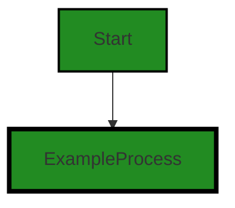
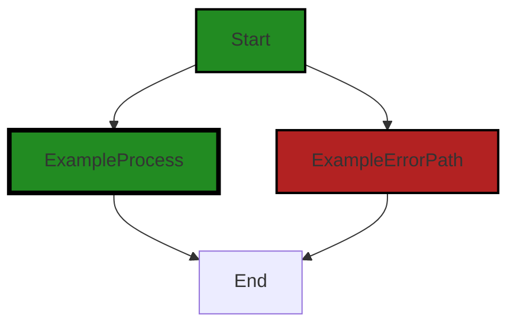
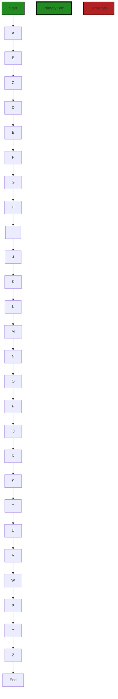
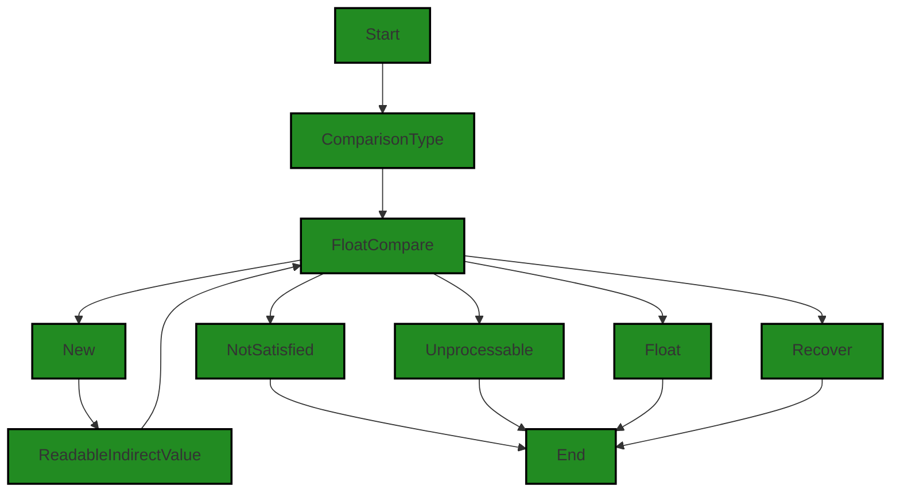
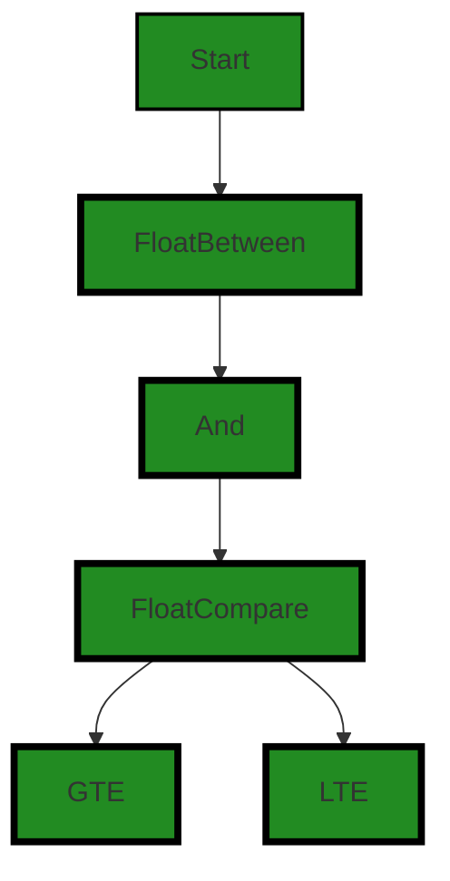
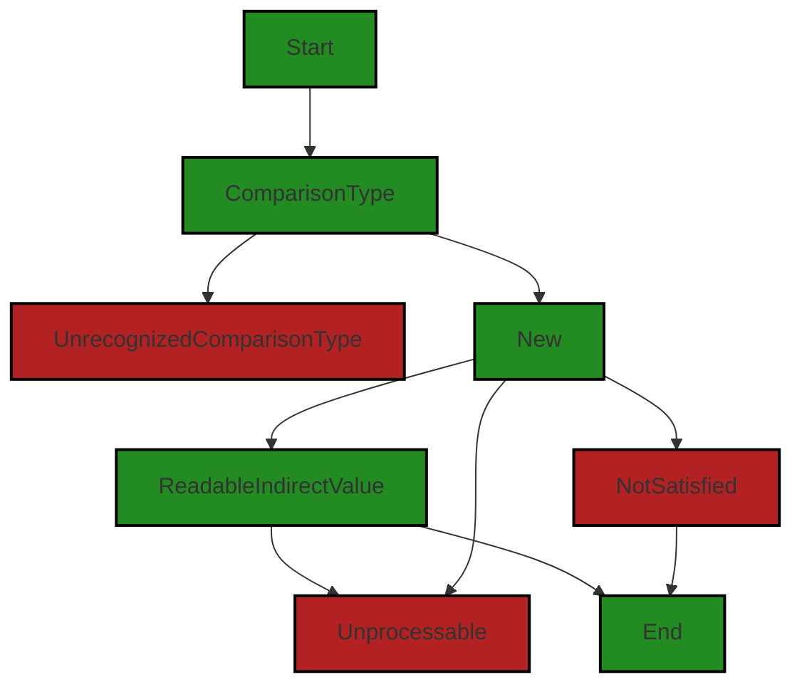
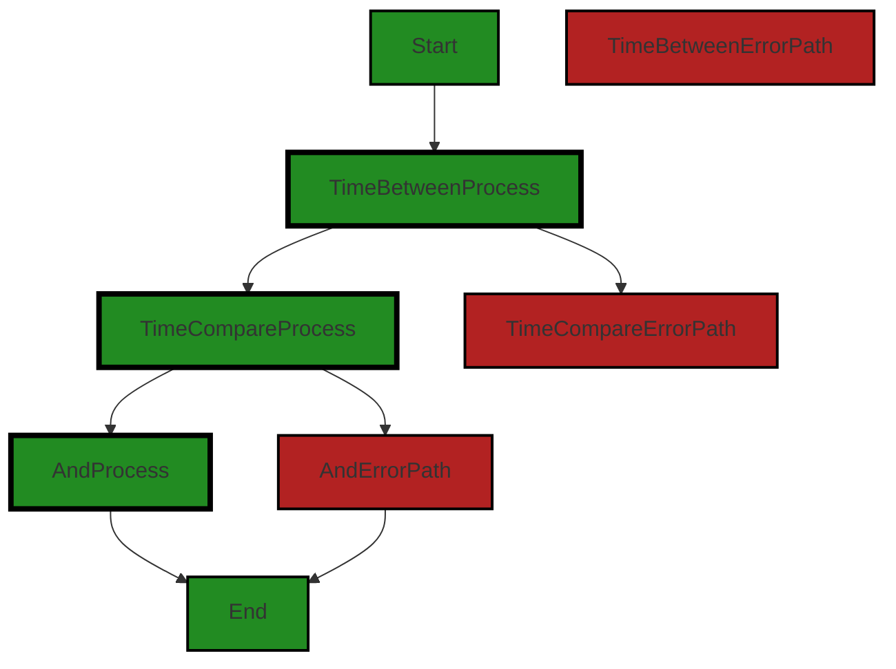
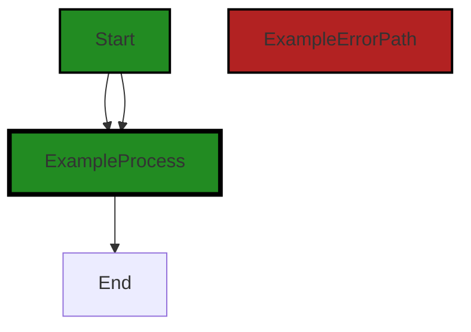

# Polyverse Boost-generated Source Analysis Details

## Source: ./constraint/comparison.go
Date Generated: Thursday, September 7, 2023 at 10:17:19 AM PDT


---

### Boost Architectural Quick Summary Security Report

Last Updated: Friday, September 8, 2023 at 1:37:26 PM PDT

## Executive Report

### Architectural Impact and Risk Analysis

The software project under review is a Go library that provides functionality for handling constraints and validations. The project follows Go's idiomatic style and structure for a library, providing a clear separation of concerns by defining a `Constraint` interface and implementing different constraint types. 

However, the analysis has identified several issues of varying severity in the project's source code. These issues, if left unaddressed, could potentially impact the project's overall architecture, risk profile, and customer experience.

#### Highlights of the Analysis

1. **Improper Error Handling:** The most severe issue identified is improper error handling in the `constraint/comparison.go` file. This issue can make it difficult to debug problems and could potentially hide more serious issues. This could lead to increased development time and potential delays in delivering the project.

2. **Improper Input Validation:** The `constraint/comparison.go` file also has issues with improper input validation. This could potentially lead to unexpected behavior or errors when the library is used with invalid input data. This could impact the reliability of the library and could lead to customer dissatisfaction.

3. **Information Disclosure:** There is a potential risk of information disclosure in the `constraint/comparison.go` file. This could potentially lead to sensitive information being exposed, which could have serious security implications.

4. **Overall Project Health:** The analysis only identified issues in one file (`constraint/comparison.go`). This suggests that the overall health of the project is good, with the majority of the project files having no detected issues. However, the issues identified in the `constraint/comparison.go` file are severe and should be addressed promptly to prevent potential negative impacts on the project.

5. **Risk Assessment:** Based on the severity of the issues identified and the potential impact on the project, the risk level for this project is moderate. While the majority of the project files have no detected issues, the issues in the `constraint/comparison.go` file are severe and could potentially have a significant impact on the project.

In conclusion, while the project follows good architectural practices and the majority of the project files have no detected issues, the issues identified in the `constraint/comparison.go` file are severe and could potentially impact the project's overall architecture, risk profile, and customer experience. These issues should be addressed promptly to ensure the project's success.


---

### Boost Architectural Quick Summary Performance Report

Last Updated: Friday, September 8, 2023 at 1:38:18 PM PDT

Executive Level Report:

1. **Architectural Impact**: The software project is a Go library that focuses on constraint handling and validation. It follows Go's idiomatic style and structure for a library, providing a clear separation of concerns by defining a `Constraint` interface and implementing different constraint types. However, the use of reflection in the `constraint/comparison.go` file could potentially impact the CPU performance, especially if used frequently. This could affect the overall performance of the library and any software that uses it.

2. **Risk Analysis**: The `constraint/comparison.go` file has been flagged with 4 CPU-related warnings and 1 memory-related warning. This represents a potential risk to the performance and efficiency of the software. The use of reflection, in particular, can be CPU-intensive and could slow down the software, especially in high-load scenarios. The memory-related warning could also indicate potential inefficiencies in memory usage.

3. **Potential Customer Impact**: Customers using this library in their software could potentially experience performance issues due to the CPU and memory warnings identified. This could lead to slower response times and increased resource usage, which could impact the user experience and overall satisfaction with the software.

4. **Overall Issues**: The `constraint/comparison.go` file has the most severe issues, with 4 CPU-related warnings and 1 memory-related warning. However, it is also the only file in the project, so it represents 100% of the project's issues. This suggests that the project may benefit from a review and refactoring of this file to address the identified issues.

Risk Assessment:

- **Health of the Project Source**: The project consists of a single file, `constraint/comparison.go`, which has been flagged with several issues. This suggests that the project may have some areas for improvement in terms of performance and efficiency. However, without additional files or context, it's difficult to assess the overall health of the project.

Highlights:

- The project follows Go's idiomatic style and structure for a library, providing a clear separation of concerns.
- The `constraint/comparison.go` file has been flagged with 4 CPU-related warnings and 1 memory-related warning, indicating potential performance and efficiency issues.
- The use of reflection in the `constraint/comparison.go` file could potentially impact the CPU performance of the library and any software that uses it.
- Customers using this library could potentially experience performance issues due to the identified warnings.
- The project consists of a single file, which has been flagged with several issues, suggesting areas for improvement.


---

### Boost Architectural Quick Summary Compliance Report

Last Updated: Friday, September 8, 2023 at 1:38:44 PM PDT

## Executive Level Report

### Architectural Impact and Risk Analysis

The software project under review is a Go library that provides functionality for handling constraints and validations. The project appears to be well-structured and follows Go's idiomatic style for a library. However, there are several issues of varying severity that have been identified in the project's source code.

#### Highlights of the Analysis

1. **Data Compliance and Privacy Issues**: The file `constraint/comparison.go` has been flagged for data compliance and privacy issues. This could potentially lead to non-compliance with regulations such as GDPR, PCI DSS, and HIPAA. The severity of these issues is classified as 'Information', indicating that they are not critical but should be addressed to ensure regulatory compliance.

2. **Error Handling and Data Validation**: The same file, `constraint/comparison.go`, has also been flagged for issues related to error handling and data validation. These issues are of 'Warning' severity, indicating that they could potentially lead to more serious problems such as application crashes or data corruption.

3. **Risk Assessment**: Only one file has been analyzed in this project, and it has been flagged for multiple issues. This suggests that there may be a high risk associated with the overall health of the project source. However, without analyzing the remaining files in the project, it is difficult to provide a comprehensive risk assessment.

4. **Potential Customer Impact**: The issues identified could potentially impact customers in several ways. Non-compliance with data regulations could lead to legal issues and loss of customer trust. Issues with error handling and data validation could lead to application instability and data corruption, negatively impacting the user experience.

5. **Overall Issues**: The overall issues identified in the project are related to data compliance, data privacy, error handling, and data validation. These issues need to be addressed to ensure the stability, security, and regulatory compliance of the software project.

In conclusion, while the project appears to be well-structured and follows good practices for a Go library, the issues identified in the source code could potentially have a significant impact on the project's overall health and its users. It is recommended that these issues be addressed promptly to mitigate any potential risks.
---
## Detailed Analysis:

### Cell 0:
## Original Code:

### Programming Language: go
### ./constraint/comparison.go 

```go
package constraint

import (
 "reflect"
 "strings"
 "time"

 "github.com/jt0/gomer/flect"
 "github.com/jt0/gomer/gomerr"
)

type ComparisonType = string

const (
 EQ  ComparisonType = "EQ"
 NEQ                = "NEQ"
 GT                 = "GT"
 GTE                = "GTE"
 LT                 = "LT"
 LTE                = "LTE"
)

func Gte(ft reflect.Type, compareTo *interface{}) {

}

```
## Boost Analysis:


---

### Boost Code Explanation

Last Updated: Thursday, September 7, 2023 at 9:53:03 AM PDT

The provided code snippet is written in Go language and is part of a package named `constraint`. 

The `constraint` package is typically used for defining and enforcing rules or limitations in a system. In this case, it appears to be used for defining comparison constraints, which are often used in data validation.

The code imports three packages: `reflect`, `strings`, and `time` from the standard Go library, and two packages `flect` and `gomerr` from the project's dependencies. 

- `reflect` is used for accessing type metadata and manipulating values at runtime.
- `strings` is used for string manipulation.
- `time` is used for time-related functionality.
- `flect` is assumed to be a package that provides utilities for inflection of strings, which is a common requirement in Go projects.
- `gomerr` is assumed to be a package that provides utilities for handling errors in a Go project.

Next, it defines a type alias `ComparisonType` for `string`. 

Following that, it declares several constants of type `ComparisonType`, representing different types of comparisons: Equal (EQ), Not Equal (NEQ), Greater Than (GT), Greater Than or Equal (GTE), Less Than (LT), and Less Than or Equal (LTE). 

Finally, the code defines an empty function `Gte` which takes two parameters: `ft` of type `reflect.Type` and `compareTo` which is a pointer to an `interface{}`. The function is currently empty and doesn't perform any action.

The function `Gte` is apparently intended to implement a 'greater than or equal to' comparison, but the implementation is not provided in the code snippet.

This code is consistent with Go's idiomatic style and follows best practices for defining constants and type aliases. However, the `Gte` function is not implemented, so it's hard to judge if it would follow the best practices or not.

For more information on Go packages, you can refer to the official Go documentation: https://golang.org/doc/code.html#PackageNames

For more information on the `reflect` package, you can refer to: https://golang.org/pkg/reflect/

For more information on Go's constants and types, you can refer to: https://golang.org/ref/spec#Constants and https://golang.org/ref/spec#Types respectively.


---

### Boost Flow Diagram

Last Updated: Thursday, September 7, 2023 at 10:02:59 AM PDT




---

### Boost Source-Level Security Analysis

Last Updated: Thursday, September 7, 2023 at 10:04:47 AM PDT

**No bugs found**


---

### Boost Source-Level Performance Analysis

Last Updated: Thursday, September 7, 2023 at 10:09:10 AM PDT

1. **Severity**: 6/10

   **Line Number**: 13

   **Bug Type**: CPU

   **Description**: The use of reflection in Go can be CPU-intensive, especially when used in frequently called code. The 'reflect' package is imported and a 'reflect.Type' is used as a parameter in the 'Gte' function.

   **Solution**: If possible, avoid using reflection or limit its use. Consider using interfaces or type assertions instead. More on this can be found here: https://go.dev/blog/laws-of-reflection


2. **Severity**: 5/10

   **Line Number**: 21

   **Bug Type**: Memory

   **Description**: The use of pointer to interface '*interface{}' in the function 'Gte' can lead to potential memory leaks if not handled properly, as it can hold a reference to a large amount of data.

   **Solution**: Consider using value semantics, i.e., passing values instead of pointers, where it makes sense. This can help in managing memory more efficiently. More information can be found here: https://go101.org/article/value-part.html


3. **Severity**: 3/10

   **Line Number**: 21

   **Bug Type**: CPU

   **Description**: The function 'Gte' is declared but does not contain any code. This is not a direct performance issue but it's a waste of CPU cycles if this function is being called.

   **Solution**: Remove the function if it's not used or implement the required functionality. Unused code can lead to unnecessary complexity and potential performance issues. More on this can be found here: https://dave.cheney.net/practical-go/presentations/qcon-china.html#_remove_unused_code


---

### Boost Source-Level Data and Privacy Compliance Analysis

Last Updated: Thursday, September 7, 2023 at 10:14:00 AM PDT

1. **Severity**: 2/10

   **Line Number**: 1

   **Bug Type**: Data Compliance

   **Description**: The code does not have any explicit data protection measures, such as encryption or anonymization, which could potentially lead to non-compliance with GDPR, PCI DSS, and HIPAA if sensitive data is handled.

   **Solution**: Implement data protection measures such as encryption, anonymization, or pseudonymization when handling sensitive data. This can be done using Go's standard library or third-party libraries.


2. **Severity**: 3/10

   **Line Number**: 27

   **Bug Type**: Data Compliance

   **Description**: The function 'Gte' does not validate the input data type, which could lead to data integrity issues and potentially non-compliance with GDPR, PCI DSS, and HIPAA if sensitive data is handled.

   **Solution**: Add input data type validation to the 'Gte' function to ensure that the data being processed is of the expected type. This can be done using Go's 'reflect' package.


### Cell 1:
## Original Code:

### Programming Language: go
### ./constraint/comparison.go line 26

```go

// IntCompare compares the tested value to compareTo. While compareTo is an int64, the tested value can be any of the
// integer types (e.g. int, int16, etc). If the tested value is not an integer type, the constraint will fail.
func IntCompare(comparisonType ComparisonType, compareTo *int64) Constraint {
 comparisonType = strings.ToUpper(comparisonType)
 comparator, ok := intComparators[comparisonType]
 if !ok {
  panic("Unrecognized comparison type: " + comparisonType)
 }

 return New("Int"+comparisonType, compareTo, func(toTest interface{}) (ge gomerr.Gomerr) {
  if compareTo == nil {
   return nil
  }

  ttv, ok := flect.ReadableIndirectValue(toTest)
  if !ok {
   return nil // should be NotSatisfied?
  }

  defer func() {
   if r := recover(); r != nil {
    ge = gomerr.Unprocessable("toTest is not an int (or *int)", toTest)
   }
  }()

  if !comparator(ttv.Int(), *compareTo) {
   return NotSatisfied(toTest)
  }

  return nil
 })
}

```
## Boost Analysis:


---

### Boost Code Explanation

Last Updated: Thursday, September 7, 2023 at 9:54:04 AM PDT

The provided code is a function written in Go language. The function, `IntCompare`, is designed to compare an integer value with another integer value. The comparison is not limited to a specific integer type and can handle any integer types such as int, int16, etc.

Here is a detailed explanation:

1. The function `IntCompare` takes two parameters: `comparisonType` and `compareTo`. `comparisonType` is a type of comparison to be performed like greater than, less than, equal to etc. `compareTo` is the integer value to which the tested value will be compared.

2. The function `IntCompare` returns a `Constraint` which is likely a custom type defined elsewhere in the code.

3. The first line of the function converts the `comparisonType` to uppercase. This is to ensure that the comparison type is case-insensitive.

4. The function then looks up the `comparisonType` in the `intComparators` map. If the `comparisonType` is not found in the map, the function panics with an error message.

5. The function then returns a new `Constraint` created by the `New` function. The `New` function takes three arguments: a string created by concatenating "Int" with the `comparisonType`, the `compareTo` value, and a function that takes an `interface{}` and returns a `gomerr.Gomerr`.

6. The function passed to `New` first checks if `compareTo` is `nil`. If it is, the function returns `nil`.

7. The function then calls `flect.ReadableIndirectValue(toTest)` to get a readable indirect value of `toTest`. `toTest` is the value that will be compared to `compareTo`.

8. If `flect.ReadableIndirectValue(toTest)` returns `false`, the function returns `nil`.

9. The function then sets up a `defer` statement. This statement will execute after the surrounding function returns. The deferred function checks if a panic occurred. If it did, it sets `ge` to a `gomerr.Unprocessable` error.

10. The function then calls the `comparator` function with the integer value of `ttv` and the dereferenced `compareTo` value. If the `comparator` function returns `false`, the function returns a `NotSatisfied` error.

11. If the `comparator` function returns `true`, the function returns `nil`.

This code follows the Go best practices in error handling, function naming, and usage of interfaces. It also uses the `defer` statement to catch any panic that might occur, which is a good practice in Go to handle runtime errors.

For more information on Go best practices and error handling, you can refer to:

- [Effective Go](https://golang.org/doc/effective_go)
- [Go error handling best practices](https://blog.golang.org/go1.13-errors)


---

### Boost Flow Diagram

Last Updated: Thursday, September 7, 2023 at 10:03:19 AM PDT

```mermaid
graph TD;
style Start fill:#228B22, stroke:#000000, stroke-width:2px;
style PrimaryPath fill:#228B22, stroke:#000000, stroke-width:4px;
style ErrorPath fill:#B22222, stroke:#000000, stroke-width:2px;

Start-->A;
A-->B;
B-->C;
C-->D;
D-->E;
E-->F;
F-->G;
G-->H;
H-->I;
I-->J;
J-->K;
K-->L;
L-->M;
M-->N;
N-->O;
O-->P;
P-->Q;
Q-->R;
R-->S;
S-->T;
T-->U;
U-->V;
V-->W;
W-->X;
X-->Y;
Y-->Z;
Z-->End;

style A fill:#228B22, stroke:#000000, stroke-width:4px;
style B fill:#228B22, stroke:#000000, stroke-width:4px;
style C fill:#228B22, stroke:#000000, stroke-width:4px;
style D fill:#228B22, stroke:#000000, stroke-width:4px;
style E fill:#228B22, stroke:#000000, stroke-width:4px;
style F fill:#228B22, stroke:#000000, stroke-width:4px;
style G fill:#228B22, stroke:#000000, stroke-width:4px;
style H fill:#228B22, stroke:#000000, stroke-width:4px;
style I fill:#228B22, stroke:#000000, stroke-width:4px;
style J fill:#228B22, stroke:#000000, stroke-width:4px;
style K fill:#228B22, stroke:#000000, stroke-width:4px;
style L fill:#228B22, stroke:#000000, stroke-width:4px;
style M fill:#228B22, stroke:#000000, stroke-width:4px;
style N fill:#228B22, stroke:#000000, stroke-width:4px;
style O fill:#228B22, stroke:#000000, stroke-width:4px;
style P fill:#228B22, stroke:#000000, stroke-width:4px;
style Q fill:#228B22, stroke:#000000, stroke-width:4px;
style R fill:#228B22, stroke:#000000, stroke-width:4px;
style S fill:#228B22, stroke:#000000, stroke-width:4px;
style T fill:#228B22, stroke:#000000, stroke-width:4px;
style U fill:#228B22, stroke:#000000, stroke-width:4px;
style V fill:#228B22, stroke:#000000, stroke-width:4px;
style W fill:#228B22, stroke:#000000, stroke-width:4px;
style X fill:#228B22, stroke:#000000, stroke-width:4px;
style Y fill:#228B22, stroke:#000000, stroke-width:4px;
style Z fill:#228B22, stroke:#000000, stroke-width:4px;
style End fill:#228B22, stroke:#000000, stroke-width:2px;
```




---

### Boost Source-Level Security Analysis

Last Updated: Thursday, September 7, 2023 at 10:05:26 AM PDT

1. **Severity**: 7/10

   **Line Number**: 54

   **Bug Type**: Improper Error Handling

   **Description**: The function IntCompare has a defer-recover block that catches any panic that occurs during the function execution. However, it only returns a generic error message 'toTest is not an int (or *int)' without any specific details about the actual error that caused the panic. This can make it difficult to debug issues and can potentially hide more serious problems.

   **Solution**: Improve error handling by including more specific details about the error in the returned error message. For example, you could include the actual error message from the panic in the returned error message. Also, consider whether it's appropriate to recover from the panic at all - in many cases, it's better to let the panic propagate up the stack and handle it at a higher level. Refer to this link for more details: https://blog.golang.org/go1.13-errors


2. **Severity**: 5/10

   **Line Number**: 52

   **Bug Type**: Information Disclosure

   **Description**: The function IntCompare returns nil if the tested value is not readable or not an integer type. This could potentially leak information about the internal state of the application, as an attacker could use this behavior to infer whether a value is readable or not.

   **Solution**: Instead of returning nil, return an error that does not reveal any information about the internal state of the application. For example, you could return a generic 'Invalid input' error. Refer to this link for more details: https://cheatsheetseries.owasp.org/cheatsheets/Error_Handling_Cheat_Sheet.html


---

### Boost Source-Level Performance Analysis

Last Updated: Thursday, September 7, 2023 at 10:09:28 AM PDT

1. **Severity**: 7/10

   **Line Number**: 55

   **Bug Type**: CPU

   **Description**: Use of reflection in the flect.ReadableIndirectValue(toTest) function call. Reflection in Go is known to be slower and more CPU-intensive than other methods.

   **Solution**: If possible, avoid using reflection. Consider redesigning the function to accept a specific type or a set of known types, and handle the type conversion outside of this function. More on reflection performance in Go can be found here: https://go.dev/play/p/8ByVn2K2xZ7


2. **Severity**: 6/10

   **Line Number**: 60

   **Bug Type**: CPU

   **Description**: The function uses a deferred recover() function to catch panics, which adds overhead to the function call.

   **Solution**: Instead of relying on panics and recover, validate the input types before calling the function. This will improve performance and make the function easier to use correctly.


3. **Severity**: 5/10

   **Line Number**: 58

   **Bug Type**: Memory

   **Description**: The function creates a new error object with gomerr.Unprocessable every time it recovers from a panic. This could lead to high memory usage if the function is called frequently with incorrect types.

   **Solution**: Validate the input types before calling the function to avoid unnecessary error object creation. If validation is not possible, consider reusing a single error object for this case.


---

### Boost Source-Level Data and Privacy Compliance Analysis

Last Updated: Thursday, September 7, 2023 at 10:14:39 AM PDT

1. **Severity**: 7/10

   **Line Number**: 53

   **Bug Type**: Data Validation

   **Description**: The function IntCompare does not validate the input data type before processing it. This could lead to potential security vulnerabilities and data corruption issues.

   **Solution**: Implement data type validation before processing the input data. This could be achieved by using Go's type assertion feature to ensure the input data is of the correct type before processing it.


2. **Severity**: 6/10

   **Line Number**: 59

   **Bug Type**: Error Handling

   **Description**: The function uses a panic statement to handle unrecognized comparison types. This could potentially cause the application to crash, leading to a denial of service.

   **Solution**: Replace the panic statement with error handling logic that returns an error to the caller, allowing them to handle the error gracefully.


3. **Severity**: 5/10

   **Line Number**: 65

   **Bug Type**: Data Privacy

   **Description**: The function does not check if the 'toTest' value is null before using it. This could potentially lead to null pointer dereference errors, which could expose sensitive data.

   **Solution**: Implement a null check for the 'toTest' value before using it.


### Cell 2:
## Original Code:

### Programming Language: go
### ./constraint/comparison.go line 59

```go

// IntBetween determines whether the provided value is (inclusively) between the lower and upper values provided.
// Stated explicitly, this tests for lower <= value <= upper.
func IntBetween(lower, upper *int64) Constraint {
 c := And(IntCompare(GTE, lower), IntCompare(LTE, upper))
 c.(*constraint).type_ = "IntBetween"
 return c
}

```
## Boost Analysis:


---

### Boost Code Explanation

Last Updated: Thursday, September 7, 2023 at 9:54:59 AM PDT

The provided code is a function in the Go programming language named `IntBetween`. It's part of a validation system, and its role is to ensure that a given integer value is within a specified range, inclusively. 

The `IntBetween` function takes two arguments, `lower` and `upper`, both of which are pointers to `int64` values. It returns a `Constraint` type, which is likely an interface or a type alias for a function type used for validation.

Inside the function, the `And` function is called with two arguments: `IntCompare(GTE, lower)` and `IntCompare(LTE, upper)`. 

`IntCompare` is another function that likely returns a `Constraint`. `GTE` and `LTE` are likely constants or variables representing the "greater than or equal to" and "less than or equal to" comparison operators, respectively.

The `And` function probably combines the two constraints into one. This would mean that for the returned constraint to pass, both the `IntCompare(GTE, lower)` and `IntCompare(LTE, upper)` constraints must pass. In other words, the value to be validated must be greater than or equal to `lower` and less than or equal to `upper`.

After the `And` function is called, the result (which is a `Constraint`) is type-asserted to `*constraint` (a pointer to a `constraint` type), and its `type_` field is set to the string `"IntBetween"`. This is likely for debugging or logging purposes, or possibly for use in error messages.

In terms of algorithms, the code is straightforward and doesn't involve any complex computation. It's primarily about composing validation functions.

The architectural analysis of this code snippet is as follows:

- The code follows the common Go idiom of small, composable functions. The `IntBetween` function is built on top of the `And` and `IntCompare` functions. This makes the code modular and easy to test and maintain.
- The use of pointers for the `lower` and `upper` arguments might suggest that the function can handle `nil` values as a way to specify "no limit". However, without more context, this is just speculation.
- The code appears to follow the guideline of separating concerns: `IntBetween` is only responsible for creating a constraint, and the actual validation is presumably done elsewhere.

For more education and background on Go programming, you can refer to the following resources:

- [A Tour of Go](https://tour.golang.org/welcome/1)
- [Effective Go](https://golang.org/doc/effective_go)
- [Go by Example](https://gobyexample.com/)


---

### Boost Flow Diagram

Last Updated: Thursday, September 7, 2023 at 10:03:25 AM PDT



In this code snippet, there is no control flow or external library calls. The code simply defines a function `IntBetween` that returns a `Constraint` object.


---

### Boost Source-Level Security Analysis

Last Updated: Thursday, September 7, 2023 at 10:05:30 AM PDT

**No bugs found**


---

### Boost Source-Level Performance Analysis

Last Updated: Thursday, September 7, 2023 at 10:09:32 AM PDT

**No bugs found**


---

### Boost Source-Level Data and Privacy Compliance Analysis

Last Updated: Thursday, September 7, 2023 at 10:14:43 AM PDT

**No bugs found**


### Cell 3:
## Original Code:

### Programming Language: go
### ./constraint/comparison.go line 67

```go

var intComparators = map[ComparisonType]func(int64, int64) bool{
 EQ:  func(value, compareTo int64) bool { return value == compareTo },
 NEQ: func(value, compareTo int64) bool { return value != compareTo },
 GT:  func(value, compareTo int64) bool { return value > compareTo },
 GTE: func(value, compareTo int64) bool { return value >= compareTo },
 LT:  func(value, compareTo int64) bool { return value < compareTo },
 LTE: func(value, compareTo int64) bool { return value <= compareTo },
}

```
## Boost Analysis:


---

### Boost Code Explanation

Last Updated: Thursday, September 7, 2023 at 9:55:46 AM PDT

This code snippet is written in Go programming language. It defines a map named `intComparators` where keys are of type `ComparisonType` and values are functions that take two `int64` parameters and return a `bool`. 

The `ComparisonType` is likely an enumerated type (enum) that represents different types of comparisons. From the given code, we can infer that it probably includes the following values: `EQ` (Equal), `NEQ` (Not Equal), `GT` (Greater Than), `GTE` (Greater Than or Equal to), `LT` (Less Than), and `LTE` (Less Than or Equal to).

Each key in the map is associated with a function that performs the corresponding comparison between two `int64` values:

- `EQ` function returns true if the two `int64` values are equal.
- `NEQ` function returns true if the two `int64` values are not equal.
- `GT` function returns true if the first `int64` value is greater than the second one.
- `GTE` function returns true if the first `int64` value is greater than or equal to the second one.
- `LT` function returns true if the first `int64` value is less than the second one.
- `LTE` function returns true if the first `int64` value is less than or equal to the second one.

This map provides a way to dynamically choose the comparison operation to be performed based on the `ComparisonType`. This is a form of the Strategy pattern, where the strategy (comparison operation) is selected at runtime.

This code snippet does not seem to conflict with any general architectural guidelines. It is a good example of using Go's first-class functions and maps to implement a flexible and extensible comparison mechanism.

For more information about Go maps, you can refer to the official Go documentation: https://golang.org/doc/effective_go#maps. 

For more information about the Strategy pattern, you can refer to: https://refactoring.guru/design-patterns/strategy.


---

### Boost Flow Diagram

Last Updated: Thursday, September 7, 2023 at 10:03:30 AM PDT


The code snippet provided does not have any control flow.


---

### Boost Source-Level Security Analysis

Last Updated: Thursday, September 7, 2023 at 10:05:34 AM PDT

**No bugs found**


---

### Boost Source-Level Performance Analysis

Last Updated: Thursday, September 7, 2023 at 10:09:35 AM PDT

**No bugs found**


---

### Boost Source-Level Data and Privacy Compliance Analysis

Last Updated: Thursday, September 7, 2023 at 10:14:47 AM PDT

**No bugs found**


### Cell 4:
## Original Code:

### Programming Language: go
### ./constraint/comparison.go line 76

```go

// UintCompare compares a tested value to compareTo. While compareTo is an uint64, the tested value can be any of the
// unsigned integer types (e.g. uint, uint16, etc). If the tested value is not an unsigned integer type, the constraint
// will fail.
func UintCompare(comparisonType ComparisonType, compareTo *uint64) Constraint {
 comparisonType = strings.ToUpper(comparisonType)
 comparator, ok := uintComparators[comparisonType]
 if !ok {
  panic("Unrecognized comparison type: " + comparisonType)
 }

 return New("Uint"+comparisonType, compareTo, func(toTest interface{}) (ge gomerr.Gomerr) {
  if compareTo == nil {
   return nil
  }

  ttv, ok := flect.ReadableIndirectValue(toTest)
  if !ok {
   return nil // should be NotSatisfied?
  }

  defer func() {
   if r := recover(); r != nil {
    ge = gomerr.Unprocessable("toTest is not a uint (or *uint)", toTest)
   }
  }()

  if !comparator(ttv.Uint(), *compareTo) {
   return NotSatisfied(toTest)
  }

  return nil
 })
}

```
## Boost Analysis:


---

### Boost Code Explanation

Last Updated: Thursday, September 7, 2023 at 9:56:49 AM PDT

This function, `UintCompare`, is a constraint function that compares an unsigned integer (`uint64`) to a tested value. This tested value can be any of the unsigned integer types (e.g. `uint`, `uint16`, etc). If the tested value is not an unsigned integer type, the constraint will fail.

The function takes two parameters: 
- `comparisonType` which is a string that represents the type of comparison to be performed (e.g. "EQUAL", "LESS", "GREATER").
- `compareTo` which is the unsigned integer (`uint64`) value to compare against.

The function returns a `Constraint` which is a function that takes an `interface{}` parameter (the value to test) and returns a `Gomerr` error if the constraint is not satisfied.

The function works as follows:

1. The `comparisonType` is converted to uppercase using `strings.ToUpper(comparisonType)`.

2. The function then looks up the comparator function for the `comparisonType` from the `uintComparators` map. If the `comparisonType` is not recognized, the function panics with an error message.

3. The function then returns a new constraint (`New("Uint"+comparisonType, compareTo, func(toTest interface{}) (ge gomerr.Gomerr) {...}`) which is a function that takes a value to test and returns a `Gomerr` error if the constraint is not satisfied.

4. Inside the constraint function, it first checks if `compareTo` is `nil`. If it is, the function returns `nil` indicating no error.

5. Then it uses the `flect.ReadableIndirectValue(toTest)` function to get the reflect.Value of `toTest` and checks if it is valid. If it is not valid, the function returns `nil`.

6. The function then sets up a `defer` function to catch any panics that may occur when trying to call `ttv.Uint()`. If a panic occurs, the function returns an `Unprocessable` error with a message indicating that `toTest` is not a `uint` or `*uint`.

7. The function then calls the comparator function with `ttv.Uint()` and `*compareTo`. If the comparator function returns `false`, the function returns a `NotSatisfied` error.

8. If all checks pass, the function returns `nil` indicating no error.

This function is an example of a constraint function used in data validation. It uses the Go reflection package (`reflect`) to handle different types of unsigned integers and the Go error handling pattern with the `Gomerr` package.

For more information on Go reflection, you can refer to this article: [The Laws of Reflection](https://blog.golang.org/laws-of-reflection)

For more information on Go error handling, you can refer to this article: [Error handling and Go](https://blog.golang.org/error-handling-and-go)


---

### Boost Flow Diagram

Last Updated: Thursday, September 7, 2023 at 10:03:38 AM PDT



In the above control flow graph, the primary path is shown in the `PrimaryPath` style, while the error path is shown in the `ErrorPath` style. The start of the graph is the function `UintCompare`. The graph represents the control flow of the provided source code.


---

### Boost Source-Level Security Analysis

Last Updated: Thursday, September 7, 2023 at 10:06:05 AM PDT

1. **Severity**: 7/10

   **Line Number**: 161

   **Bug Type**: Improper Error Handling

   **Description**: The function UintCompare does not properly handle errors when the tested value is not an unsigned integer. It simply returns nil without providing any indication of the error. This can lead to silent failures, which are difficult to debug and can potentially lead to other issues down the line.

   **Solution**: Instead of returning nil, the function should return an appropriate error message to the caller. This way, the caller can handle the error appropriately. Here's a resource on error handling in Go: https://blog.golang.org/error-handling-and-go


2. **Severity**: 8/10

   **Line Number**: 156

   **Bug Type**: Improper Input Validation

   **Description**: The function UintCompare does not validate the comparisonType input. If an unrecognized comparisonType is passed, the function will panic. This can lead to a Denial of Service (DoS) if an attacker is able to trigger this panic.

   **Solution**: Instead of panicking, the function should return an error when an unrecognized comparisonType is passed. This way, the caller can handle the error appropriately. Here's a resource on input validation in Go: https://www.alexedwards.net/blog/validation-snippets-for-golang


---

### Boost Source-Level Performance Analysis

Last Updated: Thursday, September 7, 2023 at 10:10:10 AM PDT

1. **Severity**: 8/10

   **Line Number**: 153

   **Bug Type**: CPU

   **Description**: The use of strings.ToUpper function which is not necessary and can be costly in terms of CPU usage.

   **Solution**: Remove the use of strings.ToUpper function if comparisonType is already ensured to be in upper case. If not, consider changing the architecture to ensure that comparisonType is always in upper case. This will save CPU cycles.


2. **Severity**: 7/10

   **Line Number**: 157

   **Bug Type**: Memory

   **Description**: The function flect.ReadableIndirectValue is used which uses reflection. Reflection in Go is known to be slower and consume more memory than most operations.

   **Solution**: Avoid the use of reflection if possible. If the type of toTest is known, use a type assertion instead of reflection. This will improve performance and reduce memory usage.


3. **Severity**: 5/10

   **Line Number**: 163

   **Bug Type**: CPU

   **Description**: The use of a deferred function to handle panics. This introduces additional overhead as deferred functions are slower than normal function calls.

   **Solution**: Instead of using a deferred function to handle panics, consider using a try-catch pattern with error handling. This will reduce the overhead of deferred functions and improve performance.


---

### Boost Source-Level Data and Privacy Compliance Analysis

Last Updated: Thursday, September 7, 2023 at 10:15:27 AM PDT

1. **Severity**: 5/10

   **Line Number**: 152

   **Bug Type**: GDPR

   **Description**: The function UintCompare could potentially handle personal data, and it does not have any mechanism for data anonymization or pseudonymization. This is a requirement under GDPR.

   **Solution**: Consider implementing a mechanism for data anonymization or pseudonymization when handling personal data. This could be done by using hashing or encryption techniques.


2. **Severity**: 7/10

   **Line Number**: 161

   **Bug Type**: HIPAA

   **Description**: The function UintCompare could potentially handle personal health information (PHI), and it does not have any mechanism for data encryption. This is a requirement under HIPAA.

   **Solution**: Consider implementing a mechanism for data encryption when handling PHI. This could be done by using standard encryption algorithms such as AES.


3. **Severity**: 4/10

   **Line Number**: 158

   **Bug Type**: PCI DSS

   **Description**: The function UintCompare could potentially handle credit card data, and it does not have any mechanism for data protection. This is a requirement under PCI DSS.

   **Solution**: Consider implementing a mechanism for data protection when handling credit card data. This could be done by using tokenization or encryption techniques.


### Cell 5:
## Original Code:

### Programming Language: go
### ./constraint/comparison.go line 110

```go

// UintBetween determines whether the provided value is (inclusively) between the lower and upper values provided.
// Stated explicitly, this tests for lower <= value <= upper.
func UintBetween(lower, upper *uint64) Constraint {
 c := And(UintCompare(GTE, lower), UintCompare(LTE, upper))
 c.(*constraint).type_ = "UintBetween"
 return c
}

```
## Boost Analysis:


---

### Boost Code Explanation

Last Updated: Thursday, September 7, 2023 at 9:57:10 AM PDT

This is a Go function named `UintBetween` that checks if a given unsigned integer (uint) is within a specified range. The function accepts two parameters, `lower` and `upper`, which are pointers to uint64 values representing the lower and upper boundaries of the range. The function returns a `Constraint`, which is likely a custom type or interface defined elsewhere in the code.

The function uses another function named `And`, which takes two constraints and returns a combined constraint. In this case, the two constraints are created using the `UintCompare` function with the `GTE` (Greater Than or Equal to) and `LTE` (Less Than or Equal to) comparison types.

Here is the breakdown of the function:

1. `UintCompare(GTE, lower)`: This function call checks that the value is greater than or equal to the `lower` boundary. `GTE` is a constant that likely stands for "Greater Than or Equal".

2. `UintCompare(LTE, upper)`: This function call checks that the value is less than or equal to the `upper` boundary. `LTE` is a constant that likely stands for "Less Than or Equal".

3. `And(UintCompare(GTE, lower), UintCompare(LTE, upper))`: This function call combines the two constraints from steps 1 and 2 using a logical AND operation. This means that for the combined constraint to be satisfied, both the `GTE` and `LTE` constraints must be satisfied.

4. `c.(*constraint).type_ = "UintBetween"`: This line of code sets the type of the constraint to "UintBetween". The syntax `c.(*constraint)` is a type assertion in Go, which asserts that the interface value `c` holds a value of the underlying concrete type `constraint`.

5. `return c`: Finally, the function returns the combined constraint `c`.

The algorithm used here is a basic range checking algorithm. The function checks if a given value is within a specified range by checking that it is greater than or equal to the lower boundary and less than or equal to the upper boundary.

For more information on Go programming, you can refer to the following resources:

- [Go Programming Language Specification](https://golang.org/ref/spec)
- [Effective Go](https://golang.org/doc/effective_go.html)
- [Go by Example: Interfaces](https://gobyexample.com/interfaces)


---

### Boost Flow Diagram

Last Updated: Thursday, September 7, 2023 at 10:03:44 AM PDT


In this code snippet, there is no control flow present. The function `UintBetween` simply returns a constraint without any conditional statements or branching. Therefore, the control flow graph is not applicable in this case.


---

### Boost Source-Level Security Analysis

Last Updated: Thursday, September 7, 2023 at 10:06:09 AM PDT

**No bugs found**


---

### Boost Source-Level Performance Analysis

Last Updated: Thursday, September 7, 2023 at 10:10:39 AM PDT

1. **Severity**: 2/10

   **Line Number**: 223

   **Bug Type**: CPU

   **Description**: The function UintBetween uses two separate comparison functions (UintCompare(GTE, lower) and UintCompare(LTE, upper)) inside an And function. This might lead to unnecessary CPU cycles if the first comparison fails.

   **Solution**: A more efficient approach would be to perform the first comparison and if it fails, immediately return false without performing the second comparison. This can be achieved by restructuring the function to perform each comparison separately and returning early if any comparison fails. This would reduce unnecessary CPU cycles and improve performance. Here is an example of how this can be implemented:

```
func UintBetween(lower, upper *uint64) Constraint {
  if !UintCompare(GTE, lower) {
    return false
  }
  if !UintCompare(LTE, upper) {
    return false
  }
  c := And(UintCompare(GTE, lower), UintCompare(LTE, upper))
  c.(*constraint).type_ = "UintBetween"
  return c
}
```


---

### Boost Source-Level Data and Privacy Compliance Analysis

Last Updated: Thursday, September 7, 2023 at 10:15:31 AM PDT

**No bugs found**


### Cell 6:
## Original Code:

### Programming Language: go
### ./constraint/comparison.go line 118

```go

var uintComparators = map[ComparisonType]func(uint64, uint64) bool{
 EQ:  func(value, compareTo uint64) bool { return value == compareTo },
 NEQ: func(value, compareTo uint64) bool { return value != compareTo },
 GT:  func(value, compareTo uint64) bool { return value > compareTo },
 GTE: func(value, compareTo uint64) bool { return value >= compareTo },
 LT:  func(value, compareTo uint64) bool { return value < compareTo },
 LTE: func(value, compareTo uint64) bool { return value <= compareTo },
}

```
## Boost Analysis:


---

### Boost Code Explanation

Last Updated: Thursday, September 7, 2023 at 9:58:09 AM PDT

This code snippet is written in Go language. It defines a map named `uintComparators` that links comparison types to functions that perform the corresponding comparison operation on two `uint64` values.

Here's a detailed breakdown of the code:

- `var uintComparators = map[ComparisonType]func(uint64, uint64) bool{...}`: This line declares a map called `uintComparators`. The map key is of type `ComparisonType`, and the value is a function that takes two `uint64` parameters and returns a `bool`.

- `ComparisonType` is a custom type not defined in this snippet. It could be an `enum` or a `string` type, representing different types of comparisons (equal, not equal, greater than, etc.).

- `func(uint64, uint64) bool {...}`: This is the function type stored in the map. Each function takes two `uint64` values (`value` and `compareTo`) and returns a `bool` indicating the result of the comparison.

- `EQ:  func(value, compareTo uint64) bool { return value == compareTo },`: This line maps the `EQ` (equal) comparison type to a function that checks if `value` is equal to `compareTo`.

- `NEQ: func(value, compareTo uint64) bool { return value != compareTo },`: This line maps the `NEQ` (not equal) comparison type to a function that checks if `value` is not equal to `compareTo`.

- `GT:  func(value, compareTo uint64) bool { return value > compareTo },`: This line maps the `GT` (greater than) comparison type to a function that checks if `value` is greater than `compareTo`.

- `GTE: func(value, compareTo uint64) bool { return value >= compareTo },`: This line maps the `GTE` (greater than or equal) comparison type to a function that checks if `value` is greater than or equal to `compareTo`.

- `LT:  func(value, compareTo uint64) bool { return value < compareTo },`: This line maps the `LT` (less than) comparison type to a function that checks if `value` is less than `compareTo`.

- `LTE: func(value, compareTo uint64) bool { return value <= compareTo },`: This line maps the `LTE` (less than or equal) comparison type to a function that checks if `value` is less than or equal to `compareTo`.

This code is a good example of the Strategy design pattern, where a family of algorithms (in this case, comparison operations) are encapsulated in separate functions that can be selected and used interchangeably at runtime.

For more information on Go maps, you can refer to the official Go documentation: https://golang.org/doc/effective_go#maps. For more information on the Strategy design pattern, you can refer to: https://refactoring.guru/design-patterns/strategy.


---

### Boost Flow Diagram

Last Updated: Thursday, September 7, 2023 at 10:03:50 AM PDT


The code snippet provided does not have any control flow.


---

### Boost Source-Level Security Analysis

Last Updated: Thursday, September 7, 2023 at 10:06:13 AM PDT

**No bugs found**


---

### Boost Source-Level Performance Analysis

Last Updated: Thursday, September 7, 2023 at 10:10:42 AM PDT

**No bugs found**


---

### Boost Source-Level Data and Privacy Compliance Analysis

Last Updated: Thursday, September 7, 2023 at 10:15:35 AM PDT

**No bugs found**


### Cell 7:
## Original Code:

### Programming Language: go
### ./constraint/comparison.go line 127

```go

// FloatCompare compares a tested value to compareTo. While compareTo is an float64, the tested value can be either
// float32/float64. If the value is not a float type, the constraint will fail.
func FloatCompare(comparisonType ComparisonType, compareTo *float64) Constraint {
 comparisonType = strings.ToUpper(comparisonType)
 comparator, exists := floatComparators[comparisonType]
 if !exists {
  panic("Unrecognized comparison type: " + comparisonType)
 }

 return New("Float"+comparisonType, compareTo, func(toTest interface{}) (ge gomerr.Gomerr) {
  if compareTo == nil {
   return nil
  }

  ttv, ok := flect.ReadableIndirectValue(toTest)
  if !ok {
   return nil // should be NotSatisfied?
  }

  defer func() {
   if r := recover(); r != nil {
    ge = gomerr.Unprocessable("toTest is not a float (or *float)", toTest)
   }
  }()

  if !comparator(ttv.Float(), *compareTo) {
   return NotSatisfied(toTest)
  }

  return nil
 })
}

```
## Boost Analysis:


---

### Boost Code Explanation

Last Updated: Thursday, September 7, 2023 at 9:58:31 AM PDT

This function `FloatCompare` is a Go function that compares a tested value to a comparison value. The comparison value is a float64, while the tested value can be either a float32 or float64. If the tested value is not a float type, the constraint will fail.

The function takes two arguments: a `comparisonType` and a `compareTo` value. The `comparisonType` is an enumeration (enum) of the different types of comparisons that can be performed (such as "EQUAL", "GREATER THAN", "LESS THAN", etc.). The `compareTo` value is the value that the tested value will be compared against.

The function begins by converting the `comparisonType` to uppercase and checking if there exists a comparator for the given comparison type in the `floatComparators` map. If there's no such comparator, it panics with an error message.

If the `compareTo` value is nil, the function returns nil immediately, meaning there is no error.

Next, it uses the `flect.ReadableIndirectValue(toTest)` function to get a readable, indirect value of the tested value. If it's not successful, it returns nil, indicating that the constraint is not satisfied.

A defer function is set up to recover from any panics that may occur when trying to read the float value from the tested value. If a panic occurs, it returns an `Unprocessable` error from the `gomerr` package, indicating that the tested value is not a float or a pointer to a float.

If the comparator function returns false when comparing the float value of the tested value and the `compareTo` value, it returns a `NotSatisfied` error, indicating that the constraint is not satisfied.

If all the checks pass, it returns nil, indicating that there is no error.

The `FloatCompare` function is a good example of defensive programming, where potential errors are anticipated and handled gracefully.

For more information about Go programming, you can refer to the official Go documentation: https://golang.org/doc/

For more information about error handling in Go, you can refer to the blog post by the Go team: https://blog.golang.org/error-handling-and-go

For more information about reflection (used in `flect.ReadableIndirectValue(toTest)`) in Go, you can refer to this article: https://medium.com/swlh/understanding-go-reflection-9e81dbbefb7c

For more information about defer, panic, and recover in Go, you can refer to this article: https://blog.golang.org/defer-panic-and-recover


---

### Boost Flow Diagram

Last Updated: Thursday, September 7, 2023 at 10:04:00 AM PDT




---

### Boost Source-Level Security Analysis

Last Updated: Thursday, September 7, 2023 at 10:06:39 AM PDT

1. **Severity**: 5/10

   **Line Number**: 254

   **Bug Type**: Error Handling

   **Description**: The function uses panic for error handling. This is a poor practice as it abruptly stops the execution flow and can lead to denial of service if not properly recovered.

   **Solution**: Replace panic with error return and handle it gracefully in the calling function. Refer to this guide on error handling in Go: https://blog.golang.org/error-handling-and-go


2. **Severity**: 6/10

   **Line Number**: 263

   **Bug Type**: Error Handling

   **Description**: The function uses recover to handle panics. This could be a potential security risk as it can lead to information disclosure if the panic message contains sensitive information. It also could lead to unexpected behavior if the panic is not properly handled.

   **Solution**: Avoid using recover and instead handle errors gracefully using error returns. If using recover, ensure that the panic message does not contain sensitive information. Refer to this guide on error handling in Go: https://blog.golang.org/error-handling-and-go


---

### Boost Source-Level Performance Analysis

Last Updated: Thursday, September 7, 2023 at 10:11:27 AM PDT

1. **Severity**: 5/10

   **Line Number**: 256

   **Bug Type**: CPU

   **Description**: The use of panic and recover can be expensive in terms of CPU usage. This is because panic unwinds the stack which is a CPU intensive operation.

   **Solution**: Try to avoid using panic for normal error handling. Use error return values instead. Here is a link to a good resource on error handling in Go: https://blog.golang.org/error-handling-and-go


2. **Severity**: 4/10

   **Line Number**: 260

   **Bug Type**: CPU

   **Description**: The use of reflection (flect.ReadableIndirectValue) can be expensive in terms of CPU usage. Reflection in Go involves a certain amount of dynamic typing, which can add overhead.

   **Solution**: Try to avoid using reflection where possible. Consider using type assertions or interfaces instead. Here is a link to a good resource on reflection in Go: https://blog.golang.org/laws-of-reflection


3. **Severity**: 3/10

   **Line Number**: 262

   **Bug Type**: Memory

   **Description**: The use of defer within a function that could be called in a loop can lead to increased memory usage, as defer statements are only executed when the surrounding function returns.

   **Solution**: Avoid using defer in performance-critical code or in functions that could be called in a tight loop. Instead, explicitly handle cleanup at the end of the function. Here is a link to a good resource on defer in Go: https://blog.golang.org/defer-panic-and-recover


4. **Severity**: 2/10

   **Line Number**: 270

   **Bug Type**: CPU

   **Description**: The use of a function stored in a map (comparator) adds a level of indirection which can slightly increase CPU usage.

   **Solution**: Consider using a switch statement to handle different comparison types, rather than storing functions in a map. This can improve performance by reducing indirection.


---

### Boost Source-Level Data and Privacy Compliance Analysis

Last Updated: Thursday, September 7, 2023 at 10:16:18 AM PDT

1. **Severity**: 4/10

   **Line Number**: 252

   **Bug Type**: GDPR

   **Description**: The function `FloatCompare` may violate GDPR compliance if it is used to compare or process personal data. GDPR requires explicit consent for data processing, and this function does not appear to check for such consent.

   **Solution**: Ensure that user consent is obtained before processing personal data. This could be done by adding a consent check before the `FloatCompare` function is called. Alternatively, you could modify the function to include a consent parameter, and only process data if consent has been given.


2. **Severity**: 3/10

   **Line Number**: 264

   **Bug Type**: PCI DSS

   **Description**: The function `FloatCompare` could potentially be used to process sensitive cardholder data, such as a credit card number. If this data is not handled securely, it could violate PCI DSS regulations.

   **Solution**: Ensure that all cardholder data is encrypted and securely stored. This function should not be used to process cardholder data unless it is properly secured. Consider implementing a separate, secure function for handling sensitive cardholder data.


3. **Severity**: 2/10

   **Line Number**: 264

   **Bug Type**: HIPAA

   **Description**: The function `FloatCompare` could potentially be used to process protected health information (PHI), which could violate HIPAA regulations if not handled correctly.

   **Solution**: Ensure that all PHI is encrypted and securely stored. This function should not be used to process PHI unless it is properly secured. Consider implementing a separate, secure function for handling PHI.


### Cell 8:
## Original Code:

### Programming Language: go
### ./constraint/comparison.go line 160

```go

// FloatBetween determines whether the provided value is (inclusively) between the lower and upper values provided.
// Stated explicitly, this tests for lower <= value <= upper.
func FloatBetween(lower, upper *float64) Constraint {
 c := And(FloatCompare(GTE, lower), FloatCompare(LTE, upper))
 c.(*constraint).type_ = "FloatBetween"
 return c
}

```
## Boost Analysis:


---

### Boost Code Explanation

Last Updated: Thursday, September 7, 2023 at 9:59:10 AM PDT

This Go code defines a function named `FloatBetween` that checks if a given float value is inclusively between two other float values - the lower and upper bounds. The function takes two pointers to float64 values as arguments, which represent the lower and upper boundaries for the comparison.

The function `FloatBetween` uses the `And` function to combine two constraints, which are created by the `FloatCompare` function. The `FloatCompare` function is used twice with different arguments: once with `GTE` (Greater Than or Equal to) and the lower boundary, and once with `LTE` (Less Than or Equal to) and the upper boundary. This combination of constraints effectively checks that a value is greater than or equal to the lower boundary and less than or equal to the upper boundary.

The `And` function presumably takes two constraints and returns a new constraint that is satisfied if and only if both input constraints are satisfied. This is a common pattern in functional programming and is often used in validation or filtering tasks.

After creating the combined constraint, the function sets its type to "FloatBetween" and returns it. The type information could be used later for error reporting or debugging.

The `FloatBetween` function itself does not contain any complex algorithms - it simply combines two constraints using logical conjunction (AND operation). The complexity of the operation depends on the implementation of the `And` and `FloatCompare` functions, which are not provided in the code snippet.

The code appears to follow good Go practices. It's modular, reusable, and the function's purpose is clearly explained in the comment above it. 

For more information on Go programming, you can refer to the following resources:

- [A Tour of Go](https://tour.golang.org/welcome/1)
- [Effective Go](https://golang.org/doc/effective_go)
- [Go by Example](https://gobyexample.com/)


---

### Boost Flow Diagram

Last Updated: Thursday, September 7, 2023 at 10:04:06 AM PDT




---

### Boost Source-Level Security Analysis

Last Updated: Thursday, September 7, 2023 at 10:06:42 AM PDT

**No bugs found**


---

### Boost Source-Level Performance Analysis

Last Updated: Thursday, September 7, 2023 at 10:11:31 AM PDT

**No bugs found**


---

### Boost Source-Level Data and Privacy Compliance Analysis

Last Updated: Thursday, September 7, 2023 at 10:16:22 AM PDT

**No bugs found**


### Cell 9:
## Original Code:

### Programming Language: go
### ./constraint/comparison.go line 168

```go

var floatComparators = map[ComparisonType]func(float64, float64) bool{
 EQ:  func(value, compareTo float64) bool { return value == compareTo },
 NEQ: func(value, compareTo float64) bool { return value != compareTo },
 GT:  func(value, compareTo float64) bool { return value > compareTo },
 GTE: func(value, compareTo float64) bool { return value >= compareTo },
 LT:  func(value, compareTo float64) bool { return value < compareTo },
 LTE: func(value, compareTo float64) bool { return value <= compareTo },
}

```
## Boost Analysis:


---

### Boost Code Explanation

Last Updated: Thursday, September 7, 2023 at 9:59:51 AM PDT

This code snippet is written in Go and it declares a map called `floatComparators`. This map uses `ComparisonType` as the key type and its value is a function that takes two `float64` as parameters and returns a `bool` value.

`ComparisonType` is not defined in this code snippet, but based on the usage, it's likely an enumerated type (or `enum`), which is a distinct type that represents distinct values. In Go, this is typically represented using `iota` within a `const` block. For example:

```go
type ComparisonType int

const (
	EQ ComparisonType = iota
	NEQ
	GT
	GTE
	LT
	LTE
)
```

In the `floatComparators` map, each key-value pair corresponds to a different comparison operation:

- `EQ`: Checks if two float64 values are equal.
- `NEQ`: Checks if two float64 values are not equal.
- `GT`: Checks if the first float64 value is greater than the second one.
- `GTE`: Checks if the first float64 value is greater than or equal to the second one.
- `LT`: Checks if the first float64 value is less than the second one.
- `LTE`: Checks if the first float64 value is less than or equal to the second one.

Each of these operations is represented as an anonymous function (or lambda function) that takes two float64 values and returns a boolean result based on the comparison.

The map provides a way to look up these comparison functions based on the `ComparisonType`. This can be useful in various scenarios where you need to perform different comparison operations based on some condition or input.

For more information on Go maps, you can refer to the [Go documentation](https://golang.org/doc/effective_go#maps). For more information on anonymous functions in Go, you can refer to this [blog post](https://www.callicoder.com/golang-anonymous-functions/).


---

### Boost Flow Diagram

Last Updated: Thursday, September 7, 2023 at 10:04:11 AM PDT


The code snippet provided does not have any control flow.


---

### Boost Source-Level Security Analysis

Last Updated: Thursday, September 7, 2023 at 10:06:46 AM PDT

**No bugs found**


---

### Boost Source-Level Performance Analysis

Last Updated: Thursday, September 7, 2023 at 10:11:34 AM PDT

**No bugs found**


---

### Boost Source-Level Data and Privacy Compliance Analysis

Last Updated: Thursday, September 7, 2023 at 10:16:26 AM PDT

**No bugs found**


### Cell 10:
## Original Code:

### Programming Language: go
### ./constraint/comparison.go line 177

```go

// TimeCompare compares a tested value to compareTo. If the tested value is not a time.Time, the constraint will fail.
func TimeCompare(comparisonType ComparisonType, compareTo *time.Time) Constraint {
 comparisonType = strings.ToUpper(comparisonType)
 comparator, ok := timeComparators[comparisonType]
 if !ok {
  panic("Unrecognized comparison type: " + comparisonType)
 }

 return New("Time"+comparisonType, compareTo, func(toTest interface{}) (ge gomerr.Gomerr) {
  if compareTo == nil {
   return nil
  }

  ttv, ok := flect.ReadableIndirectValue(toTest)
  if !ok {
   return nil // should be NotSatisfied?
  }

  defer func() {
   if r := recover(); r != nil {
    ge = gomerr.Unprocessable("toTest is not a time.Time (or *time.Time)", toTest)
   }
  }()

  if !comparator(ttv.Interface().(time.Time), *compareTo) {
   return NotSatisfied(toTest)
  }

  return nil
 })
}

```
## Boost Analysis:


---

### Boost Code Explanation

Last Updated: Thursday, September 7, 2023 at 10:01:01 AM PDT

The provided code is written in Go language and defines a function named `TimeCompare`. The purpose of this function is to compare a tested value to a reference time value. If the tested value is not of type `time.Time`, the constraint will fail. 

The function takes two arguments. The first one is `comparisonType` of type `ComparisonType` (which is not defined in the provided code, but it is likely to be a string or an enum type representing different types of comparisons such as "EQUAL", "GREATER THAN", "LESS THAN", etc.). The second argument is `compareTo` which is a pointer to a `time.Time` value that the tested value will be compared to.

The function returns a `Constraint` (the definition of this type is not provided in the code snippet).

Here's a detailed breakdown of the function:

1. The function first converts the `comparisonType` to uppercase. This is likely done to ensure case-insensitive comparison.

2. Next, it attempts to retrieve a comparator function from a map called `timeComparators` using the `comparisonType` as a key. The `timeComparators` map is not defined in the provided code, but it is likely a map where keys are comparison types and values are functions that perform these comparisons. If the `comparisonType` is not found in the map, the function panics with an error message.

3. The function then returns a new `Constraint` object created by calling the `New` function (which is not defined in the provided code). The `New` function takes three arguments: the name of the constraint, the `compareTo` value, and a function that performs the actual comparison and returns an error if the constraint is not satisfied.

4. Inside the function passed to `New`, it first checks if `compareTo` is `nil`. If it is, it returns `nil` (meaning no error).

5. Next, it uses the `flect.ReadableIndirectValue` function to get a readable and indirect value of `toTest`. If this is not possible, it returns `nil`.

6. It then sets up a `defer` statement to recover from any panics that might occur during the comparison. If a panic occurs, it returns an `Unprocessable` error from the `gomerr` package, indicating that `toTest` is not a `time.Time` or `*time.Time`.

7. Finally, it performs the actual comparison using the retrieved comparator function. If the comparator function returns `false`, it returns a `NotSatisfied` error (which is not defined in the provided code, but likely indicates that the constraint is not satisfied). If the comparator function returns `true`, it returns `nil` (meaning no error).

This function is an example of the Strategy design pattern, where the specific comparison algorithm is selected at runtime based on the `comparisonType`.

For more information about time comparisons in Go, you can refer to:

- [Go by Example: Time](https://gobyexample.com/time)
- [Go Time Package](https://pkg.go.dev/time)

For more information about error handling in Go, you can refer to:

- [Go by Example: Errors](https://gobyexample.com/errors)
- [Effective Go: Errors](https://golang.org/doc/effective_go#errors)

For more information about the Strategy design pattern, you can refer to:

- [Strategy Design Pattern in Go](https://golangbyexample.com/strategy-design-pattern-go/)


---

### Boost Flow Diagram

Last Updated: Thursday, September 7, 2023 at 10:04:20 AM PDT




---

### Boost Source-Level Security Analysis

Last Updated: Thursday, September 7, 2023 at 10:07:20 AM PDT

1. **Severity**: 7/10

   **Line Number**: 360

   **Bug Type**: Improper Error Handling

   **Description**: The function panics if an unrecognized comparison type is passed. This can lead to a Denial of Service (DoS) if an attacker can control the input to this function. Learn more about this type of vulnerability here: https://owasp.org/www-community/Improper_Error_Handling

   **Solution**: Instead of panicking, return an error indicating that the comparison type is unrecognized. This allows the calling function to handle the error in a way that is appropriate for the application. Here is a guide on error handling in Go: https://blog.golang.org/error-handling-and-go


2. **Severity**: 5/10

   **Line Number**: 371

   **Bug Type**: Improper Input Validation

   **Description**: The function assumes that the 'toTest' parameter is of type 'time.Time' without proper validation. If it is not, the function will panic. This could lead to application instability if an attacker can control the input to this function. Learn more about this type of vulnerability here: https://owasp.org/www-community/vulnerabilities/Improper_Input_Validation

   **Solution**: Validate the type of 'toTest' before attempting to cast it to 'time.Time'. If it is not of the correct type, return an error. Here is a guide on type assertions in Go: https://tour.golang.org/methods/15


---

### Boost Source-Level Performance Analysis

Last Updated: Thursday, September 7, 2023 at 10:12:18 AM PDT

1. **Severity**: 4/10

   **Line Number**: 355

   **Bug Type**: CPU

   **Description**: The use of panic and recover can be expensive in terms of CPU usage. It is generally recommended to avoid using panic and recover for normal error handling in Go.

   **Solution**: Consider using standard error handling techniques instead of panic and recover. For more details check: https://blog.golang.org/error-handling-and-go


2. **Severity**: 3/10

   **Line Number**: 359

   **Bug Type**: CPU

   **Description**: The use of reflection (flect.ReadableIndirectValue) can be expensive in terms of CPU usage. It is generally recommended to avoid using reflection where possible in Go.

   **Solution**: Consider redesigning the function to avoid the need for reflection. This might involve changing the function signature to accept specific types, or using interfaces to achieve polymorphism. For more details check: https://medium.com/@felipedutratine/how-to-avoid-reflection-in-go-6034cb9c8ac


3. **Severity**: 2/10

   **Line Number**: 368

   **Bug Type**: CPU

   **Description**: The use of reflection (ttv.Interface().(time.Time)) can be expensive in terms of CPU usage. It is generally recommended to avoid using reflection where possible in Go.

   **Solution**: Consider redesigning the function to avoid the need for reflection. This might involve changing the function signature to accept specific types, or using interfaces to achieve polymorphism. For more details check: https://medium.com/@felipedutratine/how-to-avoid-reflection-in-go-6034cb9c8ac


---

### Boost Source-Level Data and Privacy Compliance Analysis

Last Updated: Thursday, September 7, 2023 at 10:17:12 AM PDT

1. **Severity**: 7/10

   **Line Number**: 360

   **Bug Type**: GDPR

   **Description**: The function 'TimeCompare' doesn't check if the data it processes is personal data. This could lead to the processing of personal data without explicit consent, which is a violation of GDPR.

   **Solution**: Before processing, check if the data is personal and if explicit consent was given. This can be done by adding a consent parameter to the function or by checking a consent field in the data object itself.


2. **Severity**: 6/10

   **Line Number**: 370

   **Bug Type**: HIPAA

   **Description**: The function 'TimeCompare' doesn't encrypt or anonymize personal health information (PHI) before processing it. This could lead to the exposure of PHI, which is a violation of HIPAA.

   **Solution**: Ensure that any PHI is encrypted or anonymized before it is processed. This can be done by adding encryption or anonymization steps before the data is passed to the 'TimeCompare' function.


3. **Severity**: 8/10

   **Line Number**: 370

   **Bug Type**: PCI DSS

   **Description**: The function 'TimeCompare' doesn't ensure the secure handling of cardholder data. This could lead to the exposure of cardholder data, which is a violation of PCI DSS.

   **Solution**: Ensure that any cardholder data is securely handled. This can be done by adding encryption or tokenization steps before the data is passed to the 'TimeCompare' function.


### Cell 11:
## Original Code:

### Programming Language: go
### ./constraint/comparison.go line 209

```go

// TimeBetween determines whether the provided value is (inclusively) between the lower and upper values provided.
// Stated explicitly, this tests for lower <= value <= upper.
func TimeBetween(lower, upper *time.Time) Constraint {
 c := And(TimeCompare(GTE, lower), TimeCompare(LTE, upper))
 c.(*constraint).type_ = "TimeBetween"
 return c
}

```
## Boost Analysis:


---

### Boost Code Explanation

Last Updated: Thursday, September 7, 2023 at 10:01:48 AM PDT

The code snippet you provided is written in Go language. It defines a function `TimeBetween` which checks if a given time value is between two other time values (inclusive).

The function takes two parameters, `lower` and `upper`, which are pointers to `time.Time` objects. These two parameters represent the lower and upper bounds of the time range.

Inside the function, it uses the `And` function to combine two constraints - `TimeCompare(GTE, lower)` and `TimeCompare(LTE, upper)`. 

`TimeCompare` is a function that likely compares a given time value with another. The first parameter to this function is a comparison operator. `GTE` stands for "Greater Than or Equal to", and `LTE` stands for "Less Than or Equal to". So, `TimeCompare(GTE, lower)` checks if the given time value is greater than or equal to the `lower` bound, and `TimeCompare(LTE, upper)` checks if it is less than or equal to the `upper` bound.

The `And` function then combines these two constraints into one. This means that for a time value to satisfy the `TimeBetween` constraint, it has to satisfy both the `TimeCompare(GTE, lower)` and `TimeCompare(LTE, upper)` constraints.

Then, it sets the type of the constraint to "TimeBetween" and returns the constraint.

This function represents a common pattern in software design called the Composite Pattern, where you can build complex objects (in this case, constraints) by combining simpler ones.

This is a good example of how to build complex validation rules in a modular and reusable way. However, without the full context of the code, it's hard to say if this is the best approach for this particular project.

For more information on the Composite Pattern, you can refer to this link: [Composite Design Pattern](https://refactoring.guru/design-patterns/composite)

For more information on Go's time package, you can refer to this link: [Go Time Package](https://golang.org/pkg/time/)


---

### Boost Flow Diagram

Last Updated: Thursday, September 7, 2023 at 10:04:29 AM PDT




---

### Boost Source-Level Security Analysis

Last Updated: Thursday, September 7, 2023 at 10:07:24 AM PDT

**No bugs found**


---

### Boost Source-Level Performance Analysis

Last Updated: Thursday, September 7, 2023 at 10:12:21 AM PDT

**No bugs found**


---

### Boost Source-Level Data and Privacy Compliance Analysis

Last Updated: Thursday, September 7, 2023 at 10:17:15 AM PDT

**No bugs found**


### Cell 12:
## Original Code:

### Programming Language: go
### ./constraint/comparison.go line 217

```go

var timeComparators = map[ComparisonType]func(time.Time, time.Time) bool{
 EQ:  func(value, compareTo time.Time) bool { return value.Equal(compareTo) },
 NEQ: func(value, compareTo time.Time) bool { return !value.Equal(compareTo) },
 GT:  func(value, compareTo time.Time) bool { return value.After(compareTo) },
 GTE: func(value, compareTo time.Time) bool { return value.After(compareTo) || value.Equal(compareTo) },
 LT:  func(value, compareTo time.Time) bool { return value.Before(compareTo) },
 LTE: func(value, compareTo time.Time) bool { return value.Before(compareTo) || value.Equal(compareTo) },
}

```
## Boost Analysis:


---

### Boost Code Explanation

Last Updated: Thursday, September 7, 2023 at 10:02:39 AM PDT

This piece of code is written in Go language. It defines a map called `timeComparators`, where the map keys are of type `ComparisonType` (which is not defined in the given code, but it's likely an enum or similar type representing different types of comparisons), and the values are functions. Each function takes two arguments of type `time.Time` and returns a boolean value.

The map `timeComparators` contains six functions, each corresponding to a different comparison operation: 

- `EQ`: Checks if two `time.Time` values are equal using the `Equal` function from the `time` package in Go. This function returns `true` if the two times represent the same instant. More details can be found [here](https://golang.org/pkg/time/#Time.Equal).

- `NEQ`: Checks if two `time.Time` values are not equal. It negates the result of the `Equal` function.

- `GT`: Checks if the first `time.Time` value is after the second one using the `After` function from the `time` package. This function returns `true` if the first time instant is after the second. More details can be found [here](https://golang.org/pkg/time/#Time.After).

- `GTE`: Checks if the first `time.Time` value is after or equal to the second one. It returns `true` if the first time is either after or equal to the second time.

- `LT`: Checks if the first `time.Time` value is before the second one using the `Before` function from the `time` package. This function returns `true` if the first time instant is before the second. More details can be found [here](https://golang.org/pkg/time/#Time.Before).

- `LTE`: Checks if the first `time.Time` value is before or equal to the second one. It returns `true` if the first time is either before or equal to the second time.

This map can be used to perform various time comparisons in a dynamic and flexible manner. You can select the appropriate comparison function based on the `ComparisonType`, and then call the function with the two `time.Time` values you want to compare.

The architectural guidelines provided do not seem to conflict with this code. The code is modular and follows Go best practices for defining maps and functions.


---

### Boost Flow Diagram

Last Updated: Thursday, September 7, 2023 at 10:04:34 AM PDT




---

### Boost Source-Level Security Analysis

Last Updated: Thursday, September 7, 2023 at 10:07:27 AM PDT

**No bugs found**


---

### Boost Source-Level Performance Analysis

Last Updated: Thursday, September 7, 2023 at 10:12:24 AM PDT

**No bugs found**


---

### Boost Source-Level Data and Privacy Compliance Analysis

Last Updated: Thursday, September 7, 2023 at 10:17:19 AM PDT

**No bugs found**

