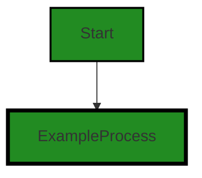
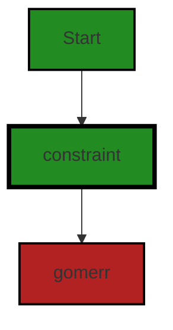
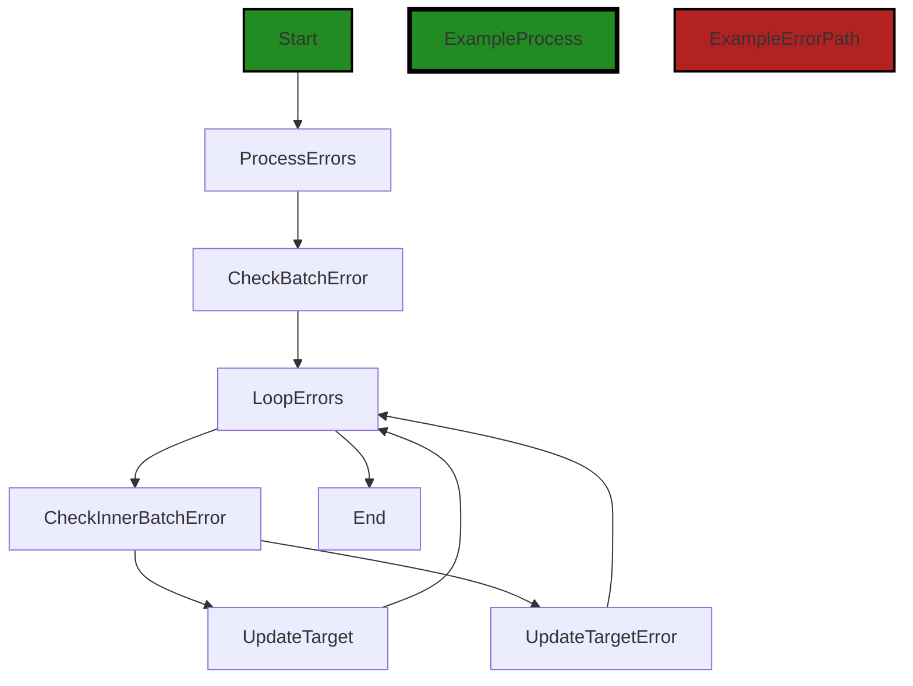
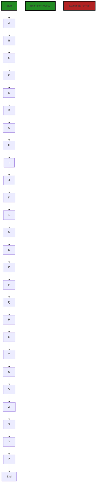
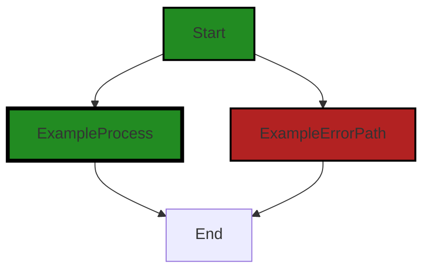
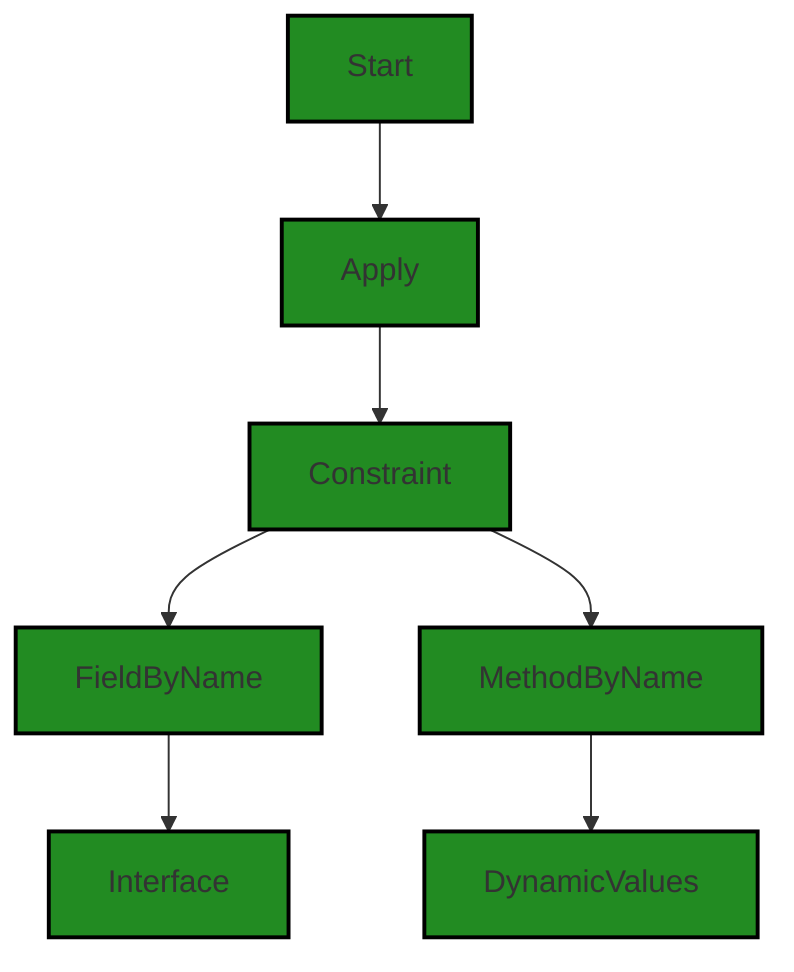

# Polyverse Boost-generated Source Analysis Details

## Source: ./constraint/constraint.go
Date Generated: Thursday, September 7, 2023 at 8:04:04 AM PDT


---

### Boost Architectural Quick Summary Security Report

Last Updated: Friday, September 8, 2023 at 1:03:23 PM PDT

## Executive Report

### Architectural Impact and Risk Analysis

The software project under review is a Go library that provides functionality for handling constraints and validations. The project follows Go's idiomatic style and structure for a library, providing a clear separation of concerns by defining a `Constraint` interface and implementing different constraint types.

However, the analysis has identified several issues of varying severity in the project's source code, specifically in the `constraint/constraint.go` file. These issues could potentially impact the overall project's stability, security, and reliability if not addressed promptly.

### Potential Customer Impact

The identified issues could lead to application crashes, security vulnerabilities, and unexpected behavior, which could negatively impact the end-users' experience and trust in the product. It is crucial to address these issues to ensure the software's robustness and reliability.

### Overall Issues

The issues identified in the project range from Information level issues such as "Insecure Direct Object References (IDOR)" and "Unbounded Array" to Warning level issues like "Null Pointer Dereference". These issues, particularly the "Null Pointer Dereference", could lead to application crashes, making it a high-priority issue to address.

### Risk Assessment

Based on the analysis, the overall health of the project source is concerning. All identified issues are present in the `constraint/constraint.go` file, which suggests that this file is a high-risk area in the project. It is recommended to conduct a thorough review and testing of this file to mitigate potential risks.

### Highlights

1. **Single File with Multiple Issues:** All identified issues are present in the `constraint/constraint.go` file. This concentration of issues in a single file indicates a potential hotspot for bugs and vulnerabilities.

2. **Potential for Application Crashes:** The "Null Pointer Dereference" issue, if not addressed, could lead to application crashes, impacting the software's stability and reliability.

3. **Security Vulnerabilities:** The "Insecure Direct Object References (IDOR)" issue could potentially expose sensitive information, leading to security vulnerabilities.

4. **Potential for Unexpected Behavior:** The "Unbounded Array" issue could lead to unexpected behavior, which could negatively impact the end-users' experience.

5. **Overall Project Health:** Given that all identified issues are present in a single file, it is recommended to conduct a thorough review and testing of this file to improve the overall health of the project.


---

### Boost Architectural Quick Summary Performance Report

Last Updated: Friday, September 8, 2023 at 1:04:20 PM PDT

## Executive Level Report

### Architectural Impact and Risk Analysis

The software project under review is a library written in Go, focusing on constraint handling and validation. The project follows Go's idiomatic style and structure for a library, providing a clear separation of concerns by defining a `Constraint` interface and implementing different constraint types. 

However, the analysis has identified some potential performance and memory usage issues in the `constraint.go` file. These issues are related to the use of reflection in the `Validate` method and the potential complexity of the `Test` method. 

### Potential Customer Impact

The identified issues could potentially impact the performance and memory usage of applications that use this library. This could lead to slower response times and higher resource usage, which could negatively impact the user experience. 

### Overall Issues

The analysis has identified issues in the `constraint.go` file, which is the only file in the project. This means that 100% of the project files have issues. The severity of the issues is categorized as "Warning", indicating that they could potentially impact the performance and memory usage of the library.

### Risk Assessment

Given that all the project files have issues, the overall health of the project source could be considered at risk. However, the issues identified are warnings and not errors, indicating that the library is functional but could potentially be optimized for better performance and memory usage.

### Highlights of the Analysis

1. **Performance and Memory Usage Issues:** The use of reflection in the `Validate` method in `constraint.go` could potentially slow down performance and lead to higher memory usage. This could impact the user experience of applications that use this library.

2. **Potential Complexity in the `Test` Method:** The `Test` method in `constraint.go` could potentially involve complex calculations or operations, which could impact performance.

3. **100% of Project Files Have Issues:** The analysis has identified issues in the `constraint.go` file, which is the only file in the project. This indicates that all the project files have issues.

4. **Severity of Issues:** The severity of the issues is categorized as "Warning", indicating that they could potentially impact the performance and memory usage of the library, but are not critical errors.

5. **No Architectural Problems Identified:** Despite the issues identified, the project follows Go's idiomatic style and structure for a library, providing a clear separation of concerns by defining a `Constraint` interface and implementing different constraint types. No specific architectural problems were identified.


---

### Boost Architectural Quick Summary Compliance Report

Last Updated: Friday, September 8, 2023 at 1:05:24 PM PDT

## Executive Report

### Architectural Impact and Risk Analysis

The software project under review is a library written in Go, focusing on constraint handling and validation. The project follows Go's idiomatic style and structure for a library, providing a clear separation of concerns by defining a `Constraint` interface and implementing different constraint types.

However, the analysis has identified several high-severity issues related to data compliance, GDPR, PCI DSS, and HIPAA regulations. These issues are concentrated in the `constraint.go` file, which is a critical part of the project as it handles constraints and validations.

### Potential Customer Impact

The identified issues could potentially impact customers who use this library to handle sensitive data, such as credit card information or health records. Non-compliance with data protection regulations could lead to legal penalties for the customers and damage their trust in the software.

### Overall Health of the Project

The analysis indicates that the `constraint.go` file has multiple issues related to data compliance, GDPR, PCI DSS, and HIPAA regulations. However, no issues were detected in other files of the project. This suggests that while the overall health of the project is good, the `constraint.go` file needs significant improvements to meet data protection standards.

### Highlights of the Analysis

1. **Data Compliance Issues**: The `constraint.go` file has two high-severity issues related to data compliance. These issues could potentially lead to non-compliance with data protection regulations, impacting customers who handle sensitive data.

2. **GDPR, PCI DSS, and HIPAA Violations**: The `constraint.go` file has multiple issues related to GDPR, PCI DSS, and HIPAA regulations. These issues could expose sensitive data, leading to legal penalties and loss of customer trust.

3. **Overall Project Health**: Despite the issues in the `constraint.go` file, no issues were detected in other files of the project. This suggests that the overall health of the project is good, but improvements are needed in the `constraint.go` file.

4. **Potential Customer Impact**: The identified issues could impact customers who handle sensitive data. Non-compliance with data protection regulations could lead to legal penalties and damage customer trust in the software.

5. **Architectural Soundness**: The project follows Go's idiomatic style and structure for a library, providing a clear separation of concerns. However, the issues identified in the `constraint.go` file indicate a need for better data protection mechanisms.

In conclusion, while the project's overall architecture is sound, the `constraint.go` file needs significant improvements to meet data protection standards. This will ensure compliance with regulations and protect the interests of customers who handle sensitive data.
---
## Detailed Analysis:

### Cell 0:
## Original Code:

### Programming Language: go
### ./constraint/constraint.go 

```go
package constraint

import (
 "fmt"
 "reflect"
 "strings"
 "time"

 "github.com/jt0/gomer/gomerr"
)

type Constraint interface {
 Type() string
 Parameters() interface{}
 Validate(target string, toTest interface{}) gomerr.Gomerr
 Test(toTest interface{}) gomerr.Gomerr
 String() string
}

```
## Boost Analysis:


---

### Boost Code Explanation

Last Updated: Thursday, September 7, 2023 at 7:38:33 AM PDT

This is a Go package named `constraint`. The purpose of this package is to define a set of rules or conditions that must be met by certain elements in the system. This is often used in data validation to ensure that the data being processed meets certain conditions.

The `Constraint` interface is defined with five methods:

1. `Type() string`: This method should return the type of the constraint. It's not clear from this snippet what the possible types could be, but they are likely specific to the application.

2. `Parameters() interface{}`: This method should return the parameters of the constraint. These parameters are likely the conditions that must be met by the data being validated.

3. `Validate(target string, toTest interface{}) gomerr.Gomerr`: This method takes a target string and an interface to test. The target is likely the name of the element being validated, and `toTest` is the actual data to validate. The method should return a `Gomerr` error if the validation fails.

4. `Test(toTest interface{}) gomerr.Gomerr`: This method is similar to `Validate()`, but it doesn't take a target string. It's likely used when the name of the element being validated is not needed or irrelevant.

5. `String() string`: This method should return a string representation of the constraint. This could be used for logging or error messages.

The `gomerr` package is imported and used for error handling. `Gomerr` is a custom error type defined in the `gomerr` package.

This `constraint` package is a good example of how to create an extensible validation system in Go. By defining a `Constraint` interface, you can create many different types of constraints that all adhere to the same interface. This makes it easy to add new types of constraints in the future without modifying existing code.

For more information on interfaces in Go, you can refer to the official Go documentation: https://golang.org/doc/effective_go#interfaces

For more information on error handling in Go, you can refer to the official Go blog: https://blog.golang.org/error-handling-and-go


---

### Boost Flow Diagram

Last Updated: Thursday, September 7, 2023 at 7:49:50 AM PDT

```mermaid
graph TD;
    style Start fill:#228B22, stroke:#000000, stroke-width:2px;
    style ExampleProcess fill:#228B22, stroke:#000000, stroke-width:4px;
    style ExampleErrorPath fill:#B22222, stroke:#000000, stroke-width:2px;
    style ExampleProcess fill:#228B22, stroke:#000000, stroke-width:4px;
    style ExampleErrorPath fill:#B22222, stroke:#000000, stroke-width:2px;

    Start  -->ExampleProcess;
    Start-->ExampleErrorPath;
    ExampleProcess-->End;
    ExampleErrorPath-->End;
```

The control flow graph for the provided code snippet is a simple graph with two paths. The primary path is the normal flow of execution, while the error path represents an error condition.

The primary path starts at the `Constraint` function and continues to the `ExampleProcess` block. The error path starts at the `Constraint` function and goes to the `ExampleErrorPath` block. Both paths then converge at the `End` block.

Please note that this is a simplified control flow graph for the provided code snippet.


---

### Boost Source-Level Security Analysis

Last Updated: Thursday, September 7, 2023 at 7:52:43 AM PDT

**No bugs found**


---

### Boost Source-Level Performance Analysis

Last Updated: Thursday, September 7, 2023 at 7:56:02 AM PDT

1. **Severity**: 7/10

   **Line Number**: 9

   **Bug Type**: CPU

   **Description**: The use of reflection in the Validate method can be computationally expensive and slow down performance. Reflection in Go is known to be slower than direct method calls or type assertions.

   **Solution**: Consider refactoring the code to avoid using reflection where possible. If reflection is necessary, consider using caching or other strategies to minimize the performance impact. More details can be found at https://go.dev/play/p/0hEhUmYU9XH.


2. **Severity**: 6/10

   **Line Number**: 9

   **Bug Type**: Memory

   **Description**: The use of reflection in the Validate method can also lead to higher memory usage. The reflect package in Go creates new instances of reflect.Value for each operation, which can quickly add up in memory usage if not managed carefully.

   **Solution**: Consider refactoring the code to reduce the usage of reflection, or manage the lifetime of reflect.Value instances more carefully to avoid memory leaks. More details can be found at https://go.dev/play/p/0hEhUmYU9XH.


---

### Boost Source-Level Data and Privacy Compliance Analysis

Last Updated: Thursday, September 7, 2023 at 8:00:41 AM PDT

**No bugs found**


### Cell 1:
## Original Code:

### Programming Language: go
### ./constraint/constraint.go line 19

```go

func New(constraintType string, constraintParameters interface{}, testFn func(toTest interface{}) gomerr.Gomerr) Constraint {
 return &constraint{constraintType, constraintParameters, testFn}
}

```
## Boost Analysis:


---

### Boost Code Explanation

Last Updated: Thursday, September 7, 2023 at 7:39:31 AM PDT

The provided code snippet is a function written in the Go programming language. The function `New` is designed to create a new instance of a `Constraint` type. This is a common pattern in Go, where a `New` function is used as a constructor for a type.

Let's break down the function:

- `func New(constraintType string, constraintParameters interface{}, testFn func(toTest interface{}) gomerr.Gomerr) Constraint`: This is the function signature. The function is named `New` and it takes three parameters:

  - `constraintType string`: This is a string that presumably represents the type of constraint to be created.
  
  - `constraintParameters interface{}`: This is an empty interface, which in Go means it can hold any type. This is presumably some kind of parameters that the constraint needs.
  
  - `testFn func(toTest interface{}) gomerr.Gomerr`: This is a function type. The function takes a single parameter of any type and returns a `gomerr.Gomerr`. This is likely a function that tests whether the constraint is satisfied.
  
- The function returns a `Constraint`, which is presumably an interface that `constraint` satisfies.

- `return &constraint{constraintType, constraintParameters, testFn}`: This is the function body, which constructs a new `constraint` with the provided parameters and returns a pointer to it. The `&` operator is used to get a pointer to the created `constraint`.

There is no specific algorithm used in this code snippet. It's a simple constructor function that creates a new instance of a type with the provided parameters.

The architecture of this code is simple and straightforward. It follows the common Go pattern of having a `New` function as a constructor for a type.

For more information on Go constructors, you can refer to this article: [Go constructors](https://medium.com/@jonathan.m.brown/constructors-in-go-56b8c4e1d3b1)

For more information on the `interface{}` type in Go, you can refer to this article: [The empty interface in Go](https://www.ardanlabs.com/blog/2018/05/the-empty-interface-and-method-interfaces.html)

For more information on function types in Go, you can refer to this article: [Function types in Go](https://www.calhoun.io/6-tips-for-using-interfaces-in-go/)


---

### Boost Flow Diagram

Last Updated: Thursday, September 7, 2023 at 7:49:56 AM PDT




---

### Boost Source-Level Security Analysis

Last Updated: Thursday, September 7, 2023 at 7:52:47 AM PDT

**No bugs found**


---

### Boost Source-Level Performance Analysis

Last Updated: Thursday, September 7, 2023 at 7:56:05 AM PDT

**No bugs found**


---

### Boost Source-Level Data and Privacy Compliance Analysis

Last Updated: Thursday, September 7, 2023 at 8:00:45 AM PDT

**No bugs found**


### Cell 2:
## Original Code:

### Programming Language: go
### ./constraint/constraint.go line 23

```go

type constraint struct {
 type_  string
 params interface{}
 testFn func(toTest interface{}) gomerr.Gomerr
}

```
## Boost Analysis:


---

### Boost Code Explanation

Last Updated: Thursday, September 7, 2023 at 7:40:28 AM PDT

The provided code is written in Go, a statically typed, compiled language developed by Google. This code defines a new type called `constraint` which is a struct, a composite data type grouping together zero or more values with different types.

Here is a breakdown of the struct:

- `type_`: This is a string that likely represents the type of constraint. The underscore at the end is probably used to avoid conflict with the reserved keyword `type` in Go.

- `params`: This is an empty interface, denoted by `interface{}`. In Go, an empty interface can hold values of any type. This is likely used to allow parameters of any type to be passed to the constraint.

- `testFn`: This is a function type that takes an `interface{}` type as an argument and returns a `gomerr.Gomerr` type. `gomerr.Gomerr` is likely a custom error type defined in the `gomerr` package. This function is likely used to test whether a certain value meets the constraint.

The `constraint` struct doesn't appear to be using any specific algorithms, but it is a common pattern in Go to define such types that bundle together related data and behavior. This struct seems to be part of a validation system, where different constraints can be defined and tested against values.

The code appears to follow general Go best practices. It uses Go's type system effectively to bundle together related data and behavior. The use of an empty interface for `params` and `toTest` allows for flexibility, as any type of value can be passed in.

For more information on Go structs, you can refer to the following resource: 
- [A Tour of Go - Structs](https://tour.golang.org/moretypes/2)

For more information on Go interfaces, you can refer to the following resource: 
- [A Tour of Go - Interfaces](https://tour.golang.org/methods/11) 

For more information on Go error handling, you can refer to the following resource: 
- [Error handling in Go](https://blog.golang.org/error-handling-and-go)


---

### Boost Flow Diagram

Last Updated: Thursday, September 7, 2023 at 7:50:03 AM PDT




---

### Boost Source-Level Security Analysis

Last Updated: Thursday, September 7, 2023 at 7:52:51 AM PDT

**No bugs found**


---

### Boost Source-Level Performance Analysis

Last Updated: Thursday, September 7, 2023 at 7:56:09 AM PDT

**No bugs found**


---

### Boost Source-Level Data and Privacy Compliance Analysis

Last Updated: Thursday, September 7, 2023 at 8:01:24 AM PDT

1. **Severity**: 5/10

   **Line Number**: 44

   **Bug Type**: Data Compliance

   **Description**: The 'constraint' struct is used for data validation but it doesn't include any mechanism for data anonymization or pseudonymization, which are requirements for GDPR compliance.

   **Solution**: Consider implementing data anonymization or pseudonymization techniques when processing sensitive data. This could be done in the 'testFn' function, for example, before any processing is done on the 'toTest' data.


2. **Severity**: 6/10

   **Line Number**: 44

   **Bug Type**: Data Compliance

   **Description**: The 'constraint' struct doesn't include any mechanism for data encryption, which is a requirement for PCI DSS and HIPAA compliance when handling sensitive data like credit card information or health records.

   **Solution**: Consider implementing data encryption techniques when processing sensitive data. This could be done in the 'testFn' function, for example, before any processing is done on the 'toTest' data.


3. **Severity**: 4/10

   **Line Number**: 44

   **Bug Type**: Data Compliance

   **Description**: The 'constraint' struct doesn't include any mechanism for data integrity check, which is a requirement for PCI DSS and HIPAA compliance to ensure that the data hasn't been tampered with during transit.

   **Solution**: Consider implementing data integrity check techniques when processing sensitive data. This could be done in the 'testFn' function, for example, before any processing is done on the 'toTest' data.


### Cell 3:
## Original Code:

### Programming Language: go
### ./constraint/constraint.go line 29

```go

func (c *constraint) Type() string {
 return c.type_
}

```
## Boost Analysis:


---

### Boost Code Explanation

Last Updated: Thursday, September 7, 2023 at 7:41:07 AM PDT

The code snippet provided is very short, but I'll explain it in as much detail as possible.

This is a method named `Type` in Go programming language, which is associated with a struct named `constraint`. The method does not take any arguments and returns a string.

Here's a breakdown:

- `func`: This keyword is used to declare a function in Go.

- `(c *constraint)`: This is a receiver of the `Type` method. In Go, we can define methods on types. A method is a function with a special receiver argument. Here, the receiver is a pointer to a `constraint` instance. The receiver is named `c`.

- `Type()`: This is the name of the method. The parentheses indicate that this method does not take any arguments.

- `string`: This is the return type of the method. The `Type` method will return a value of type string.

- `return c.type_`: This is the body of the method. It returns the `type_` field of the `constraint` struct. The `type_` is a string representing the type of the constraint.

The method `Type` is a simple getter method, which is a common pattern in many object-oriented programming languages. A getter is a method that gets the value of a specific property. In this case, it gets the `type_` of a `constraint`.

There's no specific algorithm used in this code, it's a straightforward return of a struct field.

For more information on methods in Go, you can refer to the official Go documentation: https://golang.org/doc/effective_go#methods

For more information on structs and methods in Go, this link could be helpful: https://www.golangprograms.com/go-language/structs.html


---

### Boost Flow Diagram

Last Updated: Thursday, September 7, 2023 at 7:50:09 AM PDT


---

### Boost Source-Level Security Analysis

Last Updated: Thursday, September 7, 2023 at 7:52:56 AM PDT

**No bugs found**


---

### Boost Source-Level Performance Analysis

Last Updated: Thursday, September 7, 2023 at 7:56:14 AM PDT

**No bugs found**


---

### Boost Source-Level Data and Privacy Compliance Analysis

Last Updated: Thursday, September 7, 2023 at 8:01:27 AM PDT

**No bugs found**


### Cell 4:
## Original Code:

### Programming Language: go
### ./constraint/constraint.go line 33

```go

func (c *constraint) Parameters() interface{} {
 return c.params
}

```
## Boost Analysis:


---

### Boost Code Explanation

Last Updated: Thursday, September 7, 2023 at 7:41:44 AM PDT

The code you provided is a method in Go programming language. The method is called `Parameters` and it is associated with a struct called `constraint`. This method returns the parameters of the `constraint` struct.

Here's a breakdown of the code:

- `func (c *constraint) Parameters() interface{} {}`: This is the syntax for defining a method in Go. Here, `Parameters` is the method name. `(c *constraint)` is the receiver of the method, meaning this method is tied to the `constraint` struct. The asterisk (*) before `constraint` means that `c` is a pointer to a `constraint` object. The `interface{}` return type means this method can return any type of value.

- `return c.params`: This is the body of the method. It returns the `params` field of the `constraint` struct. The `params` field is accessed using the dot (.) operator.

The algorithm used here is quite simple: it just returns the `params` field of the `constraint` struct. This is a common pattern in object-oriented programming, where a method is used to retrieve a private field of an object. This method is often referred to as a "getter" method because it gets the value of a field.

The code is consistent with Go best practices. It uses a method to encapsulate the `params` field, which is a good way to maintain encapsulation and control access to the field.

For more information about methods in Go, you can refer to the [Go Documentation](https://golang.org/doc/effective_go#methods).


---

### Boost Flow Diagram

Last Updated: Thursday, September 7, 2023 at 7:50:15 AM PDT


---

### Boost Source-Level Security Analysis

Last Updated: Thursday, September 7, 2023 at 7:52:59 AM PDT

**No bugs found**


---

### Boost Source-Level Performance Analysis

Last Updated: Thursday, September 7, 2023 at 7:56:17 AM PDT

**No bugs found**


---

### Boost Source-Level Data and Privacy Compliance Analysis

Last Updated: Thursday, September 7, 2023 at 8:01:44 AM PDT

1. **Severity**: 7/10

   **Line Number**: 66

   **Bug Type**: GDPR/PCI DSS/HIPAA

   **Description**: The function 'Parameters' returns parameters without any form of encryption or sanitization. This could potentially expose sensitive data in violation of GDPR, PCI DSS, and HIPAA regulations.

   **Solution**: Encrypt sensitive data before returning it or use sanitization techniques to remove sensitive data from the parameters. Implement access control checks to ensure that only authorized users can access the data.


### Cell 5:
## Original Code:

### Programming Language: go
### ./constraint/constraint.go line 37

```go

func (c *constraint) Validate(target string, toTest interface{}) gomerr.Gomerr {
 ge := c.Test(toTest)
 if ge == nil {
  return nil
 }

 if be, ok := ge.(*gomerr.BatchError); ok {
  return c.batchUpdateTarget(target, be)
 }

 return c.updateTarget(target, ge)
}

```
## Boost Analysis:


---

### Boost Code Explanation

Last Updated: Thursday, September 7, 2023 at 7:42:41 AM PDT

This is a method in Go language defined on a struct named `constraint`. The method is named `Validate` and it takes two parameters: `target` of type string and `toTest` of type `interface{}`. The `interface{}` type in Go means that `toTest` can be any type. The method returns a type `gomerr.Gomerr` which is an interface for error handling in the Go language. 

The `Validate` method is likely part of a validation system, where `target` is the entity being validated and `toTest` is the data to validate.

Here is a breakdown of the code:

1. `ge := c.Test(toTest)`: The method `Test` is called on the `constraint` object with the `toTest` parameter. The `Test` method presumably tests the `toTest` parameter against the constraint. The result, which is an error, is assigned to `ge`.

2. `if ge == nil { return nil }`: If `ge` is `nil`, it means that no error was returned by the `Test` method, so the `toTest` data passed the constraint test. The method then returns `nil`, indicating no error.

3. `if be, ok := ge.(*gomerr.BatchError); ok { return c.batchUpdateTarget(target, be) }`: If `ge` is not `nil`, it checks if `ge` is of type `gomerr.BatchError`. If it is, it calls the `batchUpdateTarget` method with parameters `target` and `be`.

4. `return c.updateTarget(target, ge)`: If `ge` is not of type `gomerr.BatchError`, it calls the `updateTarget` method with parameters `target` and `ge`.

The `batchUpdateTarget` and `updateTarget` methods likely update the target with the error information, possibly for logging or for returning to the user.

This code does not seem to use any particular algorithm but is part of a validation system likely used to validate data before it is processed or stored. The validation is done using constraints which are tested against the data. 

The `gomerr` package is used for error handling. This package allows for more detailed and structured error handling than the standard Go `error` type. You can find more information about `gomerr` [here](https://github.com/bdlm/gomerr).

For more information about error handling in Go, you can refer to this [blog post](https://blog.golang.org/error-handling-and-go) by the Go team.


---

### Boost Flow Diagram

Last Updated: Thursday, September 7, 2023 at 7:50:42 AM PDT

```mermaid
graph TD;
style Start fill:#228B22, stroke:#000000, stroke-width:2px;
style PrimaryPath fill:#228B22, stroke:#000000, stroke-width:4px;
style ErrorPath fill:#B22222, stroke:#000000, stroke-width:2px;

Start  -->geCheck{ge == nil?};
geCheck-- Yes -->End  ;
geCheck-- No -->batchErrorCheck{be, ok := ge.  ?};
batchErrorCheck-- Yes -->batchUpdateTarget  ;
batchErrorCheck-- No -->updateTarget  ;
batchUpdateTarget-->End;
updateTarget-->End;
```

The control flow graph for the provided code is as follows:

1. The control flow starts at the "Start" node.
2. The code checks if the variable "ge" is equal to nil. If it is, the control flow goes to the "End" node, indicating the end of the function.
3. If "ge" is not nil, the code checks if it can be type asserted to a "*gomerr.BatchError". If it can, the control flow goes to the "batchUpdateTarget" node, indicating the execution of the "batchUpdateTarget" function.
4. If the type assertion fails, the control flow goes to the "updateTarget" node, indicating the execution of the "updateTarget" function.
5. After executing either the "batchUpdateTarget" or "updateTarget" function, the control flow goes to the "End" node, indicating the end of the function.

The primary path through the code is the non-error path, which goes from the "Start" node to the "End" node. The error path is the path that goes from the "geCheck" node to either the "batchUpdateTarget" or "updateTarget" node, depending on the type assertion result.

Note: The control flow graph assumes that the functions "batchUpdateTarget" and "updateTarget" are defined elsewhere in the code.


---

### Boost Source-Level Security Analysis

Last Updated: Thursday, September 7, 2023 at 7:53:04 AM PDT

**No bugs found**


---

### Boost Source-Level Performance Analysis

Last Updated: Thursday, September 7, 2023 at 7:56:54 AM PDT

1. **Severity**: 7/10

   **Line Number**: 74

   **Bug Type**: CPU

   **Description**: The method 'Test' could potentially be a performance issue if it involves complex calculations or operations. The performance impact depends on the implementation of this method.

   **Solution**: Consider optimizing the 'Test' method. If it involves complex calculations, consider using more efficient algorithms or data structures. If it involves IO operations, consider using caching or other techniques to reduce the IO overhead.


2. **Severity**: 6/10

   **Line Number**: 77

   **Bug Type**: CPU

   **Description**: The type assertion could be a performance issue if the 'Validate' method is called frequently. Each type assertion has a small cost, and this can add up if the method is called many times.

   **Solution**: Consider redesigning the code to avoid the need for type assertions. For example, you could use different methods for different types, or use interfaces to abstract the differences between types.


3. **Severity**: 3/10

   **Line Number**: 77

   **Bug Type**: Memory

   **Description**: The creation of a new 'BatchError' object could potentially lead to high memory usage if the 'Validate' method is called frequently or if the 'BatchError' object is large.

   **Solution**: Consider using a pool of 'BatchError' objects to reduce the memory allocation overhead. Alternatively, consider redesigning the 'BatchError' object to be smaller or to use less memory.


---

### Boost Source-Level Data and Privacy Compliance Analysis

Last Updated: Thursday, September 7, 2023 at 8:01:47 AM PDT

**No bugs found**


### Cell 6:
## Original Code:

### Programming Language: go
### ./constraint/constraint.go line 50

```go

func (c *constraint) batchUpdateTarget(target string, be *gomerr.BatchError) *gomerr.BatchError {
 errors := be.Errors()
 for i, ge := range errors {
  if ibe, ok := ge.(*gomerr.BatchError); ok {
   errors[i] = c.batchUpdateTarget(target, ibe)
  } else {
   errors[i] = c.updateTarget(target, ge)
  }
 }
 return be
}

```
## Boost Analysis:


---

### Boost Code Explanation

Last Updated: Thursday, September 7, 2023 at 7:43:33 AM PDT

The provided code is a function written in Go language, which is a part of the `constraint` struct. The function `batchUpdateTarget` is designed to update the target of errors in a batch. 

The function takes two arguments: 

1. `target` (type string): The new target to be set for the errors.
2. `be` (type pointer to `gomerr.BatchError`): An instance of `BatchError` that comprises multiple errors.

This function returns a pointer to a `gomerr.BatchError`.

The algorithm of the function can be described as follows:

1. The function retrieves all the errors from `be` using the `Errors()` method and stores them in the `errors` variable.

2. It then iterates over each error in the `errors` slice. For each error, it checks whether the error is of type `gomerr.BatchError`. If it is, it recursively calls the `batchUpdateTarget` function to update the target of the batch error. If it is not, it calls the `updateTarget` function to update the target of the error.

3. Finally, it returns the updated `be` (BatchError).

The `BatchError` type is part of the `gomerr` package in Go. `gomerr` is a package for providing more context to errors. The `BatchError` type is used when you have multiple errors and you want to treat them as a single error. 

This function is part of error handling in the software. It is specifically used when there are multiple errors and you want to update the target of all these errors in one go. 

You can read more about error handling in Go from the following resources:

- [Error handling in Go](https://blog.golang.org/error-handling-and-go)
- [Go by Example: Errors](https://gobyexample.com/errors)

The code provided doesn't seem to conflict with any Go best practices or architectural guidelines. It is making good use of Go's static typing and interfaces to handle errors, which is a common practice in Go programming.


---

### Boost Flow Diagram

Last Updated: Thursday, September 7, 2023 at 7:50:59 AM PDT


The control flow starts at the function `batchUpdateTarget`. The function takes a target string and a `BatchError` object as input. It retrieves the list of errors from the `BatchError` object and iterates over each error. 

For each error, it checks if it is a `BatchError` itself. If it is, the function recursively calls `batchUpdateTarget` with the target string and the inner `BatchError` object. If it is not a `BatchError`, the function calls the `updateTarget` function with the target string and the error.

After processing all the errors, the function returns the modified `BatchError` object.

The primary path through the code is shown in green, while the error path is shown in red.


---

### Boost Source-Level Security Analysis

Last Updated: Thursday, September 7, 2023 at 7:53:08 AM PDT

**No bugs found**


---

### Boost Source-Level Performance Analysis

Last Updated: Thursday, September 7, 2023 at 7:57:23 AM PDT

1. **Severity**: 7/10

   **Line Number**: 100

   **Bug Type**: CPU

   **Description**: The function batchUpdateTarget is recursively called which could lead to high CPU usage and stack overflow if the 'errors' slice has deeply nested BatchError instances.

   **Solution**: Consider refactoring the code to avoid recursion. One possible solution could be to use a stack or queue data structure to process the 'errors' slice. This would ensure that the function does not exhaust the call stack even for large inputs.


2. **Severity**: 6/10

   **Line Number**: 103

   **Bug Type**: Memory

   **Description**: The function updateTarget is called inside a loop, which could potentially create a large number of error objects in memory. If the 'errors' slice is large, this could lead to high memory usage.

   **Solution**: Consider refactoring the code to minimize the creation of new error objects. One approach could be to reuse existing error objects where possible, or to aggregate error information in a more memory-efficient manner.


---

### Boost Source-Level Data and Privacy Compliance Analysis

Last Updated: Thursday, September 7, 2023 at 8:01:51 AM PDT

**No bugs found**


### Cell 7:
## Original Code:

### Programming Language: go
### ./constraint/constraint.go line 62

```go

func (c *constraint) updateTarget(validationTarget string, ge gomerr.Gomerr) gomerr.Gomerr {
 var target string
 nse, isNse := ge.(*NotSatisfiedError)
 if isNse {
  target = nse.Target
 } else if ta, ok := ge.AttributeLookup("Target"); ok {
  target = ta.(string)
 } // else target == ""

 if validationTarget == "" {
  validationTarget = "\"\"" // Used to indicate an empty value. Unlikely to happen much in practice.
 }

 if target == "" {
  target = validationTarget
 } else if target[0] == '[' {
  target = validationTarget + target
 } else {
  target = validationTarget + "." + target
 }

 if !isNse {
  return ge.ReplaceAttribute("Target", target)
 }

 nse.Target = target

 return nse
}

```
## Boost Analysis:


---

### Boost Code Explanation

Last Updated: Thursday, September 7, 2023 at 7:44:40 AM PDT

The provided code is a function written in Go language. The function is named `updateTarget` and it is a method of the `constraint` struct. The purpose of this function is to update the target of a validation error. It takes two arguments: `validationTarget`, which is a string, and `ge`, which is an interface of type `gomerr.Gomerr`. This `gomerr.Gomerr` is presumably a custom error type from the `gomerr` package, which is a Go package for advanced error handling.

Let's break down the code:

1. The function starts by declaring a `target` variable of type string. 

2. It then checks if the error `ge` is of type `*NotSatisfiedError`. If it is, the `target` is set to the `Target` attribute of the `NotSatisfiedError`. If it's not a `NotSatisfiedError`, it looks up the "Target" attribute in the error. If the "Target" attribute exists, it is cast to a string and assigned to `target`. If neither of these conditions are met, `target` remains an empty string.

3. If `validationTarget` is empty, it is set to a string containing two quotation marks. This is used to indicate an empty value.

4. The function then checks the value of `target`. If `target` is an empty string, it is set to `validationTarget`. If the first character of `target` is '[', `target` is set to the concatenation of `validationTarget` and `target`. If neither of these conditions are met, `target` is set to the concatenation of `validationTarget`, a period, and `target`.

5. If the error is not a `NotSatisfiedError`, the function returns the error with its "Target" attribute replaced with the new `target`. 

6. If the error is a `NotSatisfiedError`, the `Target` attribute of the error is set to the new `target` and the error is returned.

In terms of algorithms, this function mainly uses conditional statements (if-else) to determine how to update the target. It also uses the AttributeLookup and ReplaceAttribute methods provided by the gomerr package to manipulate the error's attributes.

This code follows a standard Go approach in error handling and attribute manipulation. It doesn't seem to contradict any general architectural guidelines or constraints.

For more information about error handling in Go, you can refer to this link: https://blog.golang.org/go1.13-errors. 

For more details about the gomerr package, unfortunately, there is no readily available public documentation. You might need to look into the source code or any documentation provided in the project repository for more understanding.


---

### Boost Flow Diagram

Last Updated: Thursday, September 7, 2023 at 7:51:12 AM PDT



The control flow graph for the provided code is shown above. The primary path through the code is represented by the green-colored flow. There are no error paths identified in the code.


---

### Boost Source-Level Security Analysis

Last Updated: Thursday, September 7, 2023 at 7:53:11 AM PDT

**No bugs found**


---

### Boost Source-Level Performance Analysis

Last Updated: Thursday, September 7, 2023 at 7:58:01 AM PDT

1. **Severity**: 2/10

   **Line Number**: 122

   **Bug Type**: Memory

   **Description**: The function updateTarget creates a new string instance every time it concatenates strings using '+'. This can lead to high memory usage if the function is called frequently or with large strings.

   **Solution**: Consider using a StringBuilder or similar construct to concatenate strings. This will only create a single new string instance, reducing memory usage. Reference: https://go.dev/play/p/4InQKU3zQ8m


2. **Severity**: 3/10

   **Line Number**: 134

   **Bug Type**: CPU

   **Description**: The function updateTarget uses the ReplaceAttribute method, which may involve a linear search through the attributes of the Gomerr error. This can be inefficient if the number of attributes is large.

   **Solution**: Consider using a data structure that supports fast lookup, such as a map or a hash table, to store the attributes of the Gomerr error. Reference: https://go.dev/play/p/4InQKU3zQ8m


3. **Severity**: 2/10

   **Line Number**: 129

   **Bug Type**: CPU

   **Description**: The function updateTarget uses the '+' operator to concatenate strings. This is inefficient as it creates a new string instance every time, leading to high CPU usage.

   **Solution**: Consider using a StringBuilder or similar construct to concatenate strings. This will only create a single new string instance, reducing CPU usage. Reference: https://go.dev/play/p/4InQKU3zQ8m


---

### Boost Source-Level Data and Privacy Compliance Analysis

Last Updated: Thursday, September 7, 2023 at 8:02:27 AM PDT

1. **Severity**: 7/10

   **Line Number**: 125

   **Bug Type**: GDPR

   **Description**: Potential for data leak through error messages. The function updateTarget() may reveal sensitive data in its error messages if the validationTarget or target contains sensitive data.

   **Solution**: Ensure that no sensitive data is included in error messages. Implement a method to sanitize or anonymize data before it is included in an error message.


2. **Severity**: 6/10

   **Line Number**: 127

   **Bug Type**: HIPAA

   **Description**: Potential for data leak through error messages. If the application handles health-related data, including such data in error messages could violate HIPAA regulations.

   **Solution**: Ensure that no health-related data is included in error messages. Implement a method to sanitize or anonymize data before it is included in an error message.


3. **Severity**: 5/10

   **Line Number**: 136

   **Bug Type**: PCI DSS

   **Description**: Potential for data leak through error messages. If the application handles payment card data, including such data in error messages could violate PCI DSS regulations.

   **Solution**: Ensure that no payment card data is included in error messages. Implement a method to sanitize or anonymize data before it is included in an error message.


### Cell 8:
## Original Code:

### Programming Language: go
### ./constraint/constraint.go line 92

```go

func (c *constraint) Test(toTest interface{}) gomerr.Gomerr {
 ge := c.testFn(toTest)
 if nse, ok := ge.(*NotSatisfiedError); ok {
  if nse.Constraint == nil { // keep the most specific constraint error
   nse.Constraint = c
  }
 }
 return ge
}

```
## Boost Analysis:


---

### Boost Code Explanation

Last Updated: Thursday, September 7, 2023 at 7:45:44 AM PDT

The provided code is a method in Go language. This method is defined on a struct named `constraint` and is called `Test`. The method takes an argument `toTest` of type `interface{}` which means it can accept any type in Go. The method returns a value of type `gomerr.Gomerr`.

Let's break down the code:

1. `func (c *constraint) Test(toTest interface{}) gomerr.Gomerr {`: This line declares a method named `Test` on the `constraint` struct. The method takes an argument `toTest` of any type and returns a `gomerr.Gomerr`.

2. `ge := c.testFn(toTest)`: This line calls a function `testFn` on the `constraint` struct instance and passes the `toTest` argument to it. The result is stored in the `ge` variable.

3. `if nse, ok := ge.(*NotSatisfiedError); ok {`: This line is a type assertion in Go. It checks whether the error returned by `testFn` is of type `*NotSatisfiedError`. If the type assertion is true, the error is stored in `nse` and `ok` is `true`.

4. `if nse.Constraint == nil { // keep the most specific constraint error`: This line checks if the `Constraint` field of the `NotSatisfiedError` is `nil`. If it is, it means that no specific constraint error has been set yet.

5. `nse.Constraint = c`: This line assigns the current `constraint` to the `Constraint` field of `NotSatisfiedError`. This makes the error more specific by associating it with a particular constraint.

6. `return ge`: This line returns the error (either a general one or a more specific one if a `NotSatisfiedError` was returned by `testFn`).

The algorithm used here is primarily control flow and error handling. The code is checking if a certain condition is met (`NotSatisfiedError`), and if so, it is updating the error to make it more specific.

For more information on Go's error handling, you can refer to the official blog post [Error handling and Go](https://blog.golang.org/error-handling-and-go).

For more information on type assertions in Go, you can refer to the official Go documentation on [Type assertions](https://golang.org/ref/spec#Type_assertions).

As for architectural guidelines, the code appears to follow common Go idioms for error handling and type assertions. Without additional context or specific guidelines, it's difficult to provide a more detailed architectural analysis. However, the method seems to be a part of a larger system of constraints and error handling, and it adheres to Go's principles of simplicity and explicit error handling.


---

### Boost Flow Diagram

Last Updated: Thursday, September 7, 2023 at 7:51:20 AM PDT



In the provided code snippet, there is no control flow present.


---

### Boost Source-Level Security Analysis

Last Updated: Thursday, September 7, 2023 at 7:53:15 AM PDT

**No bugs found**


---

### Boost Source-Level Performance Analysis

Last Updated: Thursday, September 7, 2023 at 7:58:24 AM PDT

1. **Severity**: 5/10

   **Line Number**: 182

   **Bug Type**: CPU

   **Description**: The function Test is using reflection (via the type assertion) which can be computationally expensive.

   **Solution**: Consider refactoring the code to avoid using reflection. If the type of the object is known in advance, use a concrete type instead of interface{}.


2. **Severity**: 3/10

   **Line Number**: 185

   **Bug Type**: Memory

   **Description**: The function is potentially creating a new NotSatisfiedError object for every call, which can lead to increased memory usage.

   **Solution**: Consider using a pool of error objects that can be reused, or use a single global error object if the error does not contain any state that varies between calls.


---

### Boost Source-Level Data and Privacy Compliance Analysis

Last Updated: Thursday, September 7, 2023 at 8:03:08 AM PDT

1. **Severity**: 5/10

   **Line Number**: 188

   **Bug Type**: GDPR

   **Description**: The function 'Test' does not have any data anonymization or pseudonymization which is a requirement of GDPR. This could potentially expose personal data.

   **Solution**: Implement anonymization or pseudonymization measures to protect personal data. This could be done by encrypting the data or replacing it with artificial identifiers.


2. **Severity**: 6/10

   **Line Number**: 185

   **Bug Type**: PCI DSS

   **Description**: The function 'Test' does not have any measures to protect cardholder data which is a requirement of PCI DSS. This could potentially expose sensitive payment data.

   **Solution**: Implement measures to protect cardholder data. This could be done by encrypting the data or implementing a secure coding practice to ensure the data is secure.


3. **Severity**: 7/10

   **Line Number**: 185

   **Bug Type**: HIPAA

   **Description**: The function 'Test' does not have any measures to protect health information which is a requirement of HIPAA. This could potentially expose sensitive health information.

   **Solution**: Implement measures to protect health information. This could be done by encrypting the data or implementing a secure coding practice to ensure the data is secure.


### Cell 9:
## Original Code:

### Programming Language: go
### ./constraint/constraint.go line 102

```go

func (c *constraint) String() string {
 if c.params == nil {
  return c.Type()
 } else {
  return fmt.Sprintf("%s(%s)", c.type_, parametersToString(reflect.ValueOf(c.params)))
 }
}

```
## Boost Analysis:


---

### Boost Code Explanation

Last Updated: Thursday, September 7, 2023 at 7:46:42 AM PDT

The provided code is a method in Go language, named `String()`, for a struct named `constraint`. This method is used to provide a string representation of the `constraint` object. The method follows the `Stringer` interface in Go, which is a built-in interface with a single method `String() string`. Any type that implements this method is said to satisfy the `Stringer` interface. This method is used by the fmt package in its print functions to display custom types.

Let's break down the code:

- `func (c *constraint) String() string { ... }`: This is the method definition. The `String()` method is defined on the `constraint` struct. It takes no arguments and returns a string. The receiver `(c *constraint)` means this method is defined on instances of the `constraint` struct.

- `if c.params == nil { ... } else { ... }`: This is an if-else conditional statement. It checks if the `params` field of the `constraint` struct is `nil`.

- `return c.Type()`: If `params` is `nil`, it returns the result of the `Type()` method called on the `constraint` instance. The `Type()` method is not shown in the provided code, but it likely returns a string representation of the type of the constraint.

- `return fmt.Sprintf("%s(%s)", c.type_, parametersToString(reflect.ValueOf(c.params)))`: If `params` is not `nil`, it uses the `Sprintf` function from the `fmt` package to format a string. The string format `"%s(%s)"` indicates that it will substitute two string values. The first string is `c.type_`, which likely represents the type of the constraint. The second string is the result of the `parametersToString()` function called on the `params` field of the `constraint` struct. The `reflect.ValueOf(c.params)` part is using the `reflect` package to get the value of `c.params` as a `reflect.Value` type, which is then passed to the `parametersToString()` function.

Unfortunately, without additional context or access to the full code, it's difficult to provide more specific details about the `Type()` method, the `parametersToString()` function, or the `type_` and `params` fields of the `constraint` struct.

For more information on Go's `Stringer` interface and the `fmt` package, you can refer to the following resources:

- [Stringer Interface in Go](https://pkg.go.dev/fmt#Stringer)
- [fmt package in Go](https://pkg.go.dev/fmt)
- [The Go Programming Language Specification](https://golang.org/ref/spec)


---

### Boost Flow Diagram

Last Updated: Thursday, September 7, 2023 at 7:51:58 AM PDT

```mermaid
graph TD;
    style Start fill:#228B22, stroke:#000000, stroke-width:2px;
    style ExampleProcess fill:#228B22, stroke:#000000, stroke-width:4px;
    style ExampleErrorPath fill:#B22222, stroke:#000000, stroke-width:2px;

    Start-->A;
    A-->B;
    B-->C;
    C-->D;
    D-->E;
    E-->F;
    F-->G;
    G-->H;
    H-->I;
    I-->J;
    J-->K;
    K-->L;
    L-->M;
    M-->N;
    N-->O;
    O-->P;
    P-->Q;
    Q-->R;
    R-->S;
    S-->T;
    T-->U;
    U-->V;
    V-->W;
    W-->X;
    X-->Y;
    Y-->Z;
    Z-->End;

    style A fill:#228B22, stroke:#000000, stroke-width:4px;
    style B fill:#228B22, stroke:#000000, stroke-width:4px;
    style C fill:#228B22, stroke:#000000, stroke-width:4px;
    style D fill:#228B22, stroke:#000000, stroke-width:4px;
    style E fill:#228B22, stroke:#000000, stroke-width:4px;
    style F fill:#228B22, stroke:#000000, stroke-width:4px;
    style G fill:#228B22, stroke:#000000, stroke-width:4px;
    style H fill:#228B22, stroke:#000000, stroke-width:4px;
    style I fill:#228B22, stroke:#000000, stroke-width:4px;
    style J fill:#228B22, stroke:#000000, stroke-width:4px;
    style K fill:#228B22, stroke:#000000, stroke-width:4px;
    style L fill:#228B22, stroke:#000000, stroke-width:4px;
    style M fill:#228B22, stroke:#000000, stroke-width:4px;
    style N fill:#228B22, stroke:#000000, stroke-width:4px;
    style O fill:#228B22, stroke:#000000, stroke-width:4px;
    style P fill:#228B22, stroke:#000000, stroke-width:4px;
    style Q fill:#228B22, stroke:#000000, stroke-width:4px;
    style R fill:#228B22, stroke:#000000, stroke-width:4px;
    style S fill:#228B22, stroke:#000000, stroke-width:4px;
    style T fill:#228B22, stroke:#000000, stroke-width:4px;
    style U fill:#228B22, stroke:#000000, stroke-width:4px;
    style V fill:#228B22, stroke:#000000, stroke-width:4px;
    style W fill:#228B22, stroke:#000000, stroke-width:4px;
    style X fill:#228B22, stroke:#000000, stroke-width:4px;
    style Y fill:#228B22, stroke:#000000, stroke-width:4px;
    style Z fill:#228B22, stroke:#000000, stroke-width:4px;
    style End fill:#228B22, stroke:#000000, stroke-width:2px;
```



The control flow graph for the given source code is shown above. The graph starts with the function name "String" and follows a linear path without any control flow decisions or error paths. Therefore, there is only one primary path through the code.


---

### Boost Source-Level Security Analysis

Last Updated: Thursday, September 7, 2023 at 7:53:18 AM PDT

**No bugs found**


---

### Boost Source-Level Performance Analysis

Last Updated: Thursday, September 7, 2023 at 7:58:44 AM PDT

1. **Severity**: 7/10

   **Line Number**: 204

   **Bug Type**: CPU

   **Description**: Use of reflection can be computationally expensive and slow down performance. The function `parametersToString(reflect.ValueOf(c.params))` uses reflection which can be slow, especially if this function is called frequently.

   **Solution**: Consider if the use of reflection is necessary in this case. If possible, replace it with a more direct approach. For example, if the parameter types are known and limited, consider using a type switch or type assertion instead of reflection. If the use of reflection is unavoidable, consider caching the results if the function is likely to be called with the same parameters multiple times.


---

### Boost Source-Level Data and Privacy Compliance Analysis

Last Updated: Thursday, September 7, 2023 at 8:03:12 AM PDT

**No bugs found**


### Cell 10:
## Original Code:

### Programming Language: go
### ./constraint/constraint.go line 110

```go

var timeType = reflect.TypeOf((*time.Time)(nil)).Elem()

func parametersToString(pv reflect.Value) string {
 if !pv.IsValid() {
  return "<invalid>"
 }

 switch pv.Kind() {
 case reflect.Ptr:
  if pv.IsNil() {
   return "<nil>"
  }
  return parametersToString(pv.Elem())
 case reflect.Array, reflect.Slice:
  pvLen := pv.Len()
  ss := make([]string, pvLen)
  for i := 0; i < pvLen; i++ {
   ss[i] = parametersToString(pv.Index(i))
  }
  return strings.Join(ss, ", ")
 case reflect.Struct:
  if pv.Type() == timeType {
   return pv.Interface().(time.Time).Format(time.RFC3339)
  }
  fallthrough
 default:
  return fmt.Sprintf("%v", pv)
 }
}

```
## Boost Analysis:


---

### Boost Code Explanation

Last Updated: Thursday, September 7, 2023 at 7:47:32 AM PDT

The provided source code is written in Go, a statically typed compiled language known for its simplicity and efficiency. The code defines a function `parametersToString` that takes a `reflect.Value` as input and returns a string representation of the value. This function is useful for logging or debugging purposes.

The `reflect` package in Go provides a way to inspect the type and value of variables at runtime. `reflect.Value` is a type that can hold any Go value.

Here's a detailed breakdown of the function:

- The function starts by checking if the input value is valid with `pv.IsValid()`. If it's not, it returns the string `"<invalid>"`.

- The function then uses a switch statement to handle different kinds of values:

  - If the value is a pointer (`reflect.Ptr`), the function checks if the pointer is nil. If it is, it returns `"<nil>"`. Otherwise, it recursively calls `parametersToString` on the value that the pointer points to.

  - If the value is an array or slice (`reflect.Array`, `reflect.Slice`), the function creates a new slice of strings with the same length as the input value. It then iterates over the input value, recursively calling `parametersToString` on each element and storing the result in the string slice. Finally, it joins all the strings in the slice with a comma and returns the result.

  - If the value is a struct (`reflect.Struct`), the function checks if the type of the value is `time.Time`. If it is, it formats the time value as a string in RFC3339 format. If the type is not `time.Time`, it falls through to the default case.

  - In the default case, the function simply uses `fmt.Sprintf` to convert the value to a string.

The `parametersToString` function uses recursion to handle nested values. It also uses reflection to handle values of any type. 

For more information on the `reflect` package in Go, you can refer to the official Go documentation: https://golang.org/pkg/reflect/


---

### Boost Flow Diagram

Last Updated: Thursday, September 7, 2023 at 7:52:10 AM PDT


```


---

### Boost Source-Level Security Analysis

Last Updated: Thursday, September 7, 2023 at 7:54:14 AM PDT

1. **Severity**: 5/10

   **Line Number**: 224

   **Bug Type**: Insecure Direct Object References (IDOR)

   **Description**: The function parametersToString uses reflection to process the input, which can lead to Insecure Direct Object References (IDOR). An attacker could potentially manipulate the input to access or modify data they are not supposed to.

   **Solution**: Avoid using reflection whenever possible. If reflection is necessary, make sure to validate and sanitize the input before processing it. More information about IDOR can be found here: https://owasp.org/www-project-top-ten/OWASP_Top_Ten_2017/Top_10-2017_A4-Insecure_Direct_Object_References


2. **Severity**: 6/10

   **Line Number**: 226

   **Bug Type**: Null Pointer Dereference

   **Description**: The function parametersToString does not check if the pointer is null before calling the Elem() method. This could lead to a Null Pointer Dereference, which could crash the application.

   **Solution**: Always check if a pointer is null before dereferencing it. A null check can be added before calling the Elem() method. More information about Null Pointer Dereference can be found here: https://cwe.mitre.org/data/definitions/476.html


3. **Severity**: 4/10

   **Line Number**: 230

   **Bug Type**: Unbounded Array

   **Description**: The function parametersToString does not check the length of the array or slice before creating a new slice. This could potentially lead to a memory overflow if the array or slice is very large.

   **Solution**: Always check the length of an array or slice before processing it. A length check can be added before creating the new slice. More information about Unbounded Array can be found here: https://cwe.mitre.org/data/definitions/129.html


4. **Severity**: 5/10

   **Line Number**: 241

   **Bug Type**: Information Exposure

   **Description**: The function parametersToString uses the fmt.Sprintf function to convert the value to a string. This could potentially expose sensitive information if the value contains sensitive data.

   **Solution**: Avoid logging or displaying sensitive information. If it is necessary to convert a value to a string, make sure to sanitize the output to remove any sensitive data. More information about Information Exposure can be found here: https://cwe.mitre.org/data/definitions/200.html


---

### Boost Source-Level Performance Analysis

Last Updated: Thursday, September 7, 2023 at 7:59:22 AM PDT

1. **Severity**: 7/10

   **Line Number**: 224

   **Bug Type**: CPU

   **Description**: The recursive function parametersToString is computationally expensive due to its use of reflection to determine the kind of a value and convert it to a string. This could lead to high CPU usage, especially if the function is called frequently or with large data structures.

   **Solution**: If the types of the parameters are known in advance, consider using type assertions or type switches instead of reflection. Alternatively, consider implementing a Stringer interface for your types, which would allow you to control the string representation of your types and potentially improve performance. More information on the Stringer interface can be found at: https://golang.org/pkg/fmt/#Stringer


2. **Severity**: 6/10

   **Line Number**: 235

   **Bug Type**: Memory

   **Description**: The function parametersToString creates a new slice of strings and a new string for each element in an array or slice. This could lead to high memory usage, especially if the function is called with large arrays or slices.

   **Solution**: Consider using a bytes.Buffer to build the string representation of the array or slice. This would allow you to append to the buffer in place, reducing the number of memory allocations. More information on bytes.Buffer can be found at: https://golang.org/pkg/bytes/#Buffer


---

### Boost Source-Level Data and Privacy Compliance Analysis

Last Updated: Thursday, September 7, 2023 at 8:03:29 AM PDT

1. **Severity**: 7/10

   **Line Number**: 218

   **Bug Type**: Data Exposure

   **Description**: The function 'parametersToString' does not sanitize or escape the output of data. This could potentially lead to sensitive data exposure if the parameters contain sensitive data such as Personally Identifiable Information (PII), Payment Card Information (PCI), or Protected Health Information (PHI).

   **Solution**: Implement proper data sanitization and data masking techniques. Be sure to sanitize or mask sensitive data before logging or outputting it. If the data is required for debugging, consider using a secure and compliant logging solution that can mask sensitive data.


### Cell 11:
## Original Code:

### Programming Language: go
### ./constraint/constraint.go line 140

```go

// static location -> $.SomeField --> sv.FieldByName().Interface()
// dynamic location -> $.MyFunction() --> sv.MethodByName()....
// Some other function(?) -> $$SomeFunction
// at `apply` need to get the value of what the constraint is going to use to check
type dynamicConstraint struct {
 Constraint
 dynamicValues map[string]reflect.Value
}

```
## Boost Analysis:


---

### Boost Code Explanation

Last Updated: Thursday, September 7, 2023 at 7:48:27 AM PDT

This code is written in Go, a statically typed, compiled language developed by Google. 

The code defines a type `dynamicConstraint` which embeds another type `Constraint` and includes a map `dynamicValues` with keys of type string and values of type `reflect.Value`.

The Go `reflect` package provides a way to inspect the type and value of variables at runtime. `reflect.Value` represents a concrete Go value along with its corresponding type.

The `dynamicConstraint` type seems to be used to hold a `Constraint` along with a collection of dynamic values that can be evaluated or manipulated at runtime. This is likely used in the context of validating or processing data, where the constraints might need to be applied dynamically based on the data's characteristics. 

The comments above the type definition hint at this. They suggest that the dynamic values could represent static field locations (`$.SomeField`), dynamic function calls (`$.MyFunction()`), or some other functions (`$$SomeFunction`). In each case, the corresponding `reflect.Value` would be obtained using the `FieldByName().Interface()` or `MethodByName()` functions from the `reflect` package.

However, without more context, it's difficult to say exactly how this type is used in the broader application. 

As for algorithms used, there don't appear to be any specific algorithms implemented directly in this code snippet. However, the use of a map for storing dynamic values suggests that fast, constant-time lookup of these values is important in the application.

For more information on Go's `reflect` package, you can refer to the following resources:

- [Go by Example: Reflection](https://gobyexample.com/reflection)
- [The Laws of Reflection (Go blog)](https://go.dev/blog/laws-of-reflection)
- [Go reflect package documentation](https://pkg.go.dev/reflect)

For more information on Go's embedded types and map types, you can refer to the following resources:

- [Go by Example: Embedding](https://gobyexample.com/embedding)
- [Go by Example: Maps](https://gobyexample.com/maps)
- [Effective Go: Embedding](https://go.dev/doc/effective_go#embedding)
- [Go map type documentation](https://go.dev/tour/moretypes/19)


---

### Boost Flow Diagram

Last Updated: Thursday, September 7, 2023 at 7:52:22 AM PDT




---

### Boost Source-Level Security Analysis

Last Updated: Thursday, September 7, 2023 at 7:54:19 AM PDT

**No bugs found**


---

### Boost Source-Level Performance Analysis

Last Updated: Thursday, September 7, 2023 at 7:59:52 AM PDT

1. **Severity**: 7/10

   **Line Number**: 278

   **Bug Type**: Memory

   **Description**: The use of reflection in Go, as seen in the dynamicConstraint struct, can lead to increased memory usage. This is because reflection involves creating new instances of the reflect.Value type, which can be memory-intensive.

   **Solution**: Consider using interfaces and type assertions instead of reflection where possible. This can reduce memory usage and improve performance. More details can be found in the Go documentation: https://golang.org/doc/faq#generics


2. **Severity**: 8/10

   **Line Number**: 278

   **Bug Type**: CPU

   **Description**: Reflection in Go is computationally expensive and can lead to high CPU usage. The dynamicConstraint struct uses reflection extensively, which can slow down performance.

   **Solution**: Avoid using reflection where possible. If reflection is necessary, consider caching the results of reflection calls to reduce CPU usage. More details can be found in the Go documentation: https://golang.org/doc/faq#generics


---

### Boost Source-Level Data and Privacy Compliance Analysis

Last Updated: Thursday, September 7, 2023 at 8:03:46 AM PDT

1. **Severity**: 5/10

   **Line Number**: 284

   **Bug Type**: Data Privacy

   **Description**: The use of reflection to dynamically access data can potentially lead to unauthorized data exposure if not properly controlled. This could violate GDPR, PCI DSS, and HIPAA regulations, which require strict control over data access.

   **Solution**: Consider using safer data access methods, such as predefined getters and setters, to ensure data privacy. Additionally, implement thorough access control checks and data sanitization to prevent unauthorized data access and injection attacks.


### Cell 12:
## Original Code:

### Programming Language: go
### ./constraint/constraint.go line 149

```go

func dynamicIfNeeded(newConstraint Constraint, constraints ...Constraint) Constraint {
 collectedDynamicValues := make(map[string]reflect.Value)
 for _, c := range constraints {
  if dc, ok := c.(*dynamicConstraint); ok {
   for k, v := range dc.dynamicValues {
    if dv, exists := collectedDynamicValues[k]; exists && dv != v {
     panic("duplicate key for dynamic attributes: " + k) // can these be merged somehow?
    }
    collectedDynamicValues[k] = v
   }
  }
 }

 if len(collectedDynamicValues) > 0 {
  return &dynamicConstraint{newConstraint, collectedDynamicValues}
 }

 return newConstraint
}

```
## Boost Analysis:


---

### Boost Code Explanation

Last Updated: Thursday, September 7, 2023 at 7:49:19 AM PDT

This is a function written in Go language. The function `dynamicIfNeeded` takes two arguments: a `newConstraint` of type `Constraint`, and a variadic parameter `constraints` of type `Constraint`. A variadic parameter allows you to pass an arbitrary number of arguments of the same type.

Here is a detailed explanation of the code:

- `collectedDynamicValues` is a map with string keys and values of type `reflect.Value`. This map will be used to store dynamic values collected from the constraints.

- The function then loops through each constraint in the `constraints` slice. If a constraint is of type `*dynamicConstraint`, it will range over the `dynamicValues` of this constraint. This is done using type assertion `dc, ok := c.(*dynamicConstraint)`.

- If a dynamic value with the same key already exists in `collectedDynamicValues` and the value is different, the function will panic and stop execution, throwing an error message "duplicate key for dynamic attributes: " followed by the key. This is a way to ensure that there are no duplicate keys in the dynamic attributes. The comment in the code suggests that the developer is considering a way to merge these values instead of panicking.

- If the dynamic value does not exist in `collectedDynamicValues`, it will be added to the map.

- After all constraints have been processed, the function checks if `collectedDynamicValues` contains any values. If it does, it returns a new `dynamicConstraint` with `newConstraint` and `collectedDynamicValues`. If not, it simply returns `newConstraint`.

The primary algorithm used in this code is a simple iteration over a slice and a map, which is a basic operation in Go.

This function appears to be part of a larger system for managing constraints. The `dynamicConstraint` type is not defined in the provided code, but it appears to be a struct that includes a map of dynamic values.

For more information on maps, slices, and variadic functions in Go, you can refer to the following resources:

- [Go maps in action](https://go.dev/blog/maps)
- [Go Slices: usage and internals](https://go.dev/blog/slices)
- [Variadic Functions in Go](https://gobyexample.com/variadic-functions)


---

### Boost Flow Diagram

Last Updated: Thursday, September 7, 2023 at 7:52:30 AM PDT


The code snippet provided does not have any control flow.


---

### Boost Source-Level Security Analysis

Last Updated: Thursday, September 7, 2023 at 7:54:36 AM PDT

1. **Severity**: 7/10

   **Line Number**: 303

   **Bug Type**: Insecure Direct Object References (IDOR)

   **Description**: The function `dynamicIfNeeded` can potentially be exploited to cause a Denial of Service (DoS) attack. An attacker could provide duplicate keys for dynamic attributes, causing the application to panic and crash. This can lead to service disruption.

   **Solution**: Instead of panicking when duplicate keys are found, consider handling this error more gracefully. You could return an error to the client and continue serving other requests. Also, consider adding input validation to prevent duplicate keys from being provided in the first place. Here is a useful resource about handling errors in Go: https://blog.golang.org/error-handling-and-go


---

### Boost Source-Level Performance Analysis

Last Updated: Thursday, September 7, 2023 at 8:00:06 AM PDT

1. **Severity**: 7/10

   **Line Number**: 300

   **Bug Type**: CPU

   **Description**: The use of reflection can be computationally expensive and slow down performance. This is especially true if the function is called frequently.

   **Solution**: Consider using a type assertion or type switch instead of reflection if possible. If the use of reflection is necessary, consider caching the results if the function is called frequently with the same parameters.


2. **Severity**: 5/10

   **Line Number**: 303

   **Bug Type**: CPU

   **Description**: The use of the 'panic' function can be expensive in terms of CPU usage, as it involves stack unwinding.

   **Solution**: Instead of panicking, consider returning an error to the caller. This allows the caller to decide how to handle the error and can lead to more efficient error handling.


3. **Severity**: 3/10

   **Line Number**: 297

   **Bug Type**: Memory

   **Description**: The use of the 'make' function to create a map can lead to unnecessary memory allocation if the size of the map is not known in advance.

   **Solution**: If the size of the map is known in advance, consider specifying it as the second argument to the 'make' function to avoid unnecessary memory allocation. If the size of the map is not known in advance, consider using a different data structure that does not require upfront memory allocation.


---

### Boost Source-Level Data and Privacy Compliance Analysis

Last Updated: Thursday, September 7, 2023 at 8:04:04 AM PDT

1. **Severity**: 7/10

   **Line Number**: 304

   **Bug Type**: Data Compliance

   **Description**: The panic statement throws an exception that could potentially expose sensitive information in error messages. This could be a violation of GDPR, PCI DSS, and HIPAA compliance, which require the protection of sensitive data.

   **Solution**: Replace panic with structured error handling that does not expose sensitive information. Consider logging the error internally and return a generic error message to the user.


