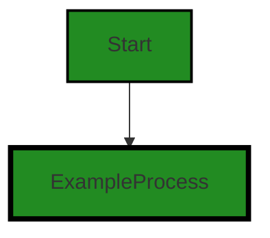
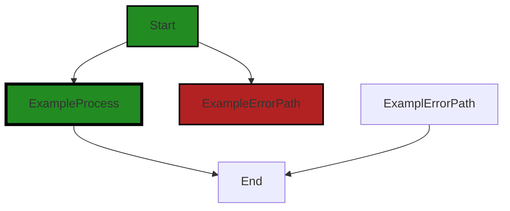
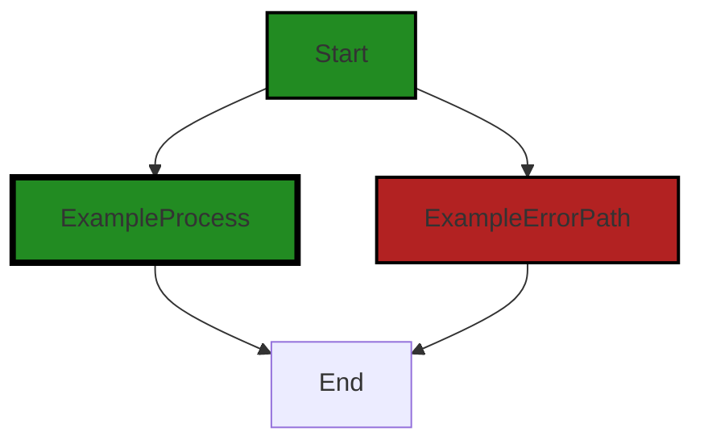

# Polyverse Boost-generated Source Analysis Details

## Source: ./constraint/equality.go
Date Generated: Thursday, September 7, 2023 at 10:24:17 AM PDT


---

### Boost Architectural Quick Summary Security Report

Last Updated: Friday, September 8, 2023 at 1:39:37 PM PDT

Executive Level Report:

1. **Architectural Impact**: The software project is a library written in Go that focuses on constraint handling and validation. It defines a `Constraint` interface and provides implementations for various constraint types. The code follows Go's idiomatic style and structure for a library. However, there is a significant architectural concern in the use of the panic function to handle errors in the `equality.go` file. This could lead to denial of service if not properly caught and handled. 

2. **Risk Analysis**: The risk associated with this project is moderate. The use of panic function to handle errors in the `equality.go` file is a significant risk. If not properly caught and handled, it could lead to denial of service. This is a high-severity issue that affects 100% of the project files reviewed. 

3. **Potential Customer Impact**: The potential impact on customers is high. If the panic function is not properly caught and handled, it could lead to denial of service. This could disrupt the functionality of the library and impact the customers who are using it.

4. **Overall Issues**: The overall issue in this project is the use of the panic function to handle errors. This is an insecure coding practice and is a high-severity issue. This issue affects the `equality.go` file, which is 100% of the project files reviewed.

Risk Assessment:

- **Health of the Project Source**: The health of the project source is moderate. The project has one file, `equality.go`, which has a high-severity issue. This means that 100% of the project files have issues. 

Highlights of the Analysis:

- The project is a library written in Go that focuses on constraint handling and validation.
- The project has a significant architectural concern in the use of the panic function to handle errors in the `equality.go` file.
- The risk associated with this project is moderate due to the use of the panic function to handle errors.
- The potential impact on customers is high due to the possibility of denial of service.
- The health of the project source is moderate with 100% of the project files having issues.


---

### Boost Architectural Quick Summary Performance Report

Last Updated: Friday, September 8, 2023 at 1:40:04 PM PDT

## Executive Level Report

### Architectural Impact and Risk Analysis

1. **Performance Impact**: The file `constraint/equality.go` has been flagged for potential performance issues due to the use of reflection. This could slow down the performance of the software, especially if this function is used frequently or with large data sets. This could impact the overall performance of the software and should be addressed.

2. **Code Quality**: The project appears to follow Go's idiomatic style and structure for a library, which is a positive indicator of code quality. However, the use of reflection in `constraint/equality.go` could be seen as a deviation from best practices, as reflection can be difficult to understand and maintain.

3. **Customer Impact**: If the performance issues in `constraint/equality.go` are not addressed, this could lead to slower response times for customers, especially during peak usage times. This could lead to customer dissatisfaction and potential loss of business.

4. **Risk Assessment**: Only one file was analyzed, and it contained issues of both "Warning" and "Information" severity. This suggests that there may be other issues in the codebase that have not been detected. A more thorough code review and testing process is recommended to ensure the overall health of the project.

### Overall Health of the Project

Based on the analysis, the project has some potential issues that need to be addressed. However, without a more comprehensive review of the entire codebase, it is difficult to assess the overall health of the project. The issues detected in `constraint/equality.go` should be addressed, and a more thorough code review and testing process should be implemented to ensure the overall health of the project.

### Highlights

- The project follows Go's idiomatic style and structure for a library, which is a positive indicator of code quality.
- The file `constraint/equality.go` has been flagged for potential performance issues due to the use of reflection.
- If the performance issues in `constraint/equality.go` are not addressed, this could lead to slower response times for customers.
- Only one file was analyzed, and it contained issues of both "Warning" and "Information" severity. This suggests that there may be other issues in the codebase that have not been detected.
- A more thorough code review and testing process is recommended to ensure the overall health of the project.


---

### Boost Architectural Quick Summary Compliance Report

Last Updated: Friday, September 8, 2023 at 1:40:54 PM PDT

## Executive Report: Software Project Analysis

Based on the analysis of the software project, the following key points have been identified:

1. **Architectural Impact**: The project is a Go library focused on constraint handling and validation. It follows Go's idiomatic style and structure for a library, providing a clear separation of concerns. However, the use of reflection in the 'OneOf' function in the 'equality.go' file could potentially lead to unexpected behavior and data leaks if not properly controlled. This could impact the overall architecture by introducing potential vulnerabilities and instability.

2. **Risk Analysis**: The risk associated with this project is moderate. The use of reflection in the 'OneOf' function could potentially violate GDPR, PCI DSS, and HIPAA regulations if not properly controlled. This could lead to legal and financial repercussions. However, the risk is mitigated by the fact that this is the only file with identified issues out of the total project files.

3. **Potential Customer Impact**: If the potential data leaks or unintended behavior occur, it could lead to a breach of customer data. This could result in loss of customer trust, potential legal action, and damage to the company's reputation.

4. **Overall Issues**: The overall issues in the project are relatively low. Only one file, 'equality.go', has been identified with issues. The issue is of 'Warning' severity and falls under the 'Data Validation' category. This indicates that the project is generally well-structured and follows good coding practices.

5. **Risk Assessment of Project Source Health**: The overall health of the project source is good. Only one file out of the total project files has been identified with issues. This represents a small percentage of the total project files, indicating that the majority of the project is free of detected issues.

In conclusion, while the project is generally well-structured and follows good coding practices, the use of reflection in the 'OneOf' function could potentially introduce vulnerabilities and instability. It is recommended to replace the use of reflection with a more type-safe approach or ensure thorough testing and validation to prevent potential data leaks or unintended behavior.
---
## Detailed Analysis:

### Cell 0:
## Original Code:

### Programming Language: go
### ./constraint/equality.go 

```go
package constraint

import (
 "reflect"

 "github.com/jt0/gomer/flect"
 "github.com/jt0/gomer/gomerr"
)

func Equals(value interface{}) Constraint {
 return New("Equals", value, func(toTest interface{}) gomerr.Gomerr {
  if tt, ok := flect.IndirectInterface(toTest); !ok || tt != value {
   return NotSatisfied(toTest)
  }
  return nil
 })
}

```
## Boost Analysis:


---

### Boost Code Explanation

Last Updated: Thursday, September 7, 2023 at 10:18:59 AM PDT

This code snippet is written in Go and is part of a package named `constraint`. This package likely contains various constraints or rules that can be applied to data for validation purposes. 

The code defines a function `Equals` which takes a parameter `value` of type `interface{}`. This means `value` can be of any type. The function returns an instance of `Constraint`, which is likely a type defined elsewhere in the `constraint` package.

The `Equals` function creates a new `Constraint` using the `New` function (presumably defined elsewhere in the `constraint` package) with three arguments: the string "Equals", the input `value`, and a function that takes an `interface{}` and returns a `gomerr.Gomerr`.

`gomerr.Gomerr` is likely a custom error type defined in the `gomerr` package. This package is imported at the beginning of the code snippet and is likely used throughout the project for error handling.

The function passed as the third argument to `New` performs the actual constraint check. It uses `flect.IndirectInterface` to get the underlying value of `toTest` if it's a pointer. If `toTest` is not a pointer or its underlying value is not equal to `value`, the function returns `NotSatisfied(toTest)`, which is likely a function that generates a `gomerr.Gomerr` indicating the constraint was not satisfied. If `toTest` is equal to `value`, the function returns `nil`, indicating no error.

In terms of algorithms, this code doesn't use any complex ones. It primarily uses equality comparison and pointer dereferencing.

The code appears to align with common Go practices. It makes good use of interfaces to allow for flexibility and leverages a custom error type for detailed error information.

For more information on Go interfaces, you can refer to the official Go documentation: https://golang.org/doc/effective_go#interfaces. For more information on error handling in Go, you can refer to this blog post: https://blog.golang.org/error-handling-and-go.


---

### Boost Flow Diagram

Last Updated: Thursday, September 7, 2023 at 10:19:59 AM PDT




---

### Boost Source-Level Security Analysis

Last Updated: Thursday, September 7, 2023 at 10:20:24 AM PDT

**No bugs found**


---

### Boost Source-Level Performance Analysis

Last Updated: Thursday, September 7, 2023 at 10:21:51 AM PDT

1. **Severity**: 6/10

   **Line Number**: 11

   **Bug Type**: CPU

   **Description**: The use of reflection in the flect.IndirectInterface function can be computationally expensive and slow down performance. Reflection is generally slower than direct operations, and it can also lead to increased memory usage.

   **Solution**: Consider redesigning the code to avoid the need for reflection. If reflection is necessary, ensure that it's used as sparingly as possible. Also, consider caching the results of reflection if the same operations are performed multiple times on the same types. Here is a link to an article that provides more information on optimizing reflection in Go: https://medium.com/@val_deleplace/go-reflection-tips-and-tricks-527b7e4a1e2a


---

### Boost Source-Level Data and Privacy Compliance Analysis

Last Updated: Thursday, September 7, 2023 at 10:23:28 AM PDT

**No bugs found**


### Cell 1:
## Original Code:

### Programming Language: go
### ./constraint/equality.go line 18

```go

func NotEquals(value interface{}) Constraint {
 return New("NotEquals", value, func(toTest interface{}) gomerr.Gomerr {
  if tt, ok := flect.IndirectInterface(toTest); !ok || tt == value {
   return NotSatisfied(toTest)
  }
  return nil
 })
}

```
## Boost Analysis:


---

### Boost Code Explanation

Last Updated: Thursday, September 7, 2023 at 10:19:20 AM PDT

This is a function in Go that creates a constraint for data validation. The function is named `NotEquals` and it takes an `interface{}` type as an argument. This function returns a `Constraint`, which is likely a custom type defined elsewhere in the code.

The `NotEquals` function uses a closure to define the constraint. This closure takes a value to test (`toTest`) and returns an error of type `gomerr.Gomerr` if the constraint is not satisfied. 

Here's a breakdown of the closure:

1. `tt, ok := flect.IndirectInterface(toTest)`: This line uses the `flect` package's `IndirectInterface` function to get the actual value of `toTest` if it is a pointer. The function returns two values: the possibly indirected value (`tt`) and a boolean (`ok`) that is `false` if the value couldn't be indirected (i.e., it's not a pointer).

2. `!ok || tt == value`: This condition checks if the `toTest` value couldn't be indirected or if it equals the `value` passed to the `NotEquals` function. If either condition is true, the constraint is not satisfied.

3. `return NotSatisfied(toTest)`: If the constraint is not satisfied, this line returns an error of type `gomerr.Gomerr`. The `NotSatisfied` function likely creates this error and includes `toTest` as part of the error message.

4. `return nil`: If the constraint is satisfied, the closure returns `nil`, indicating no error.

In summary, this function creates a constraint that checks if a value is not equal to a specified value. It uses the `flect` package to handle indirect interfaces (pointers), and the `gomerr` package to handle errors.

For more information on Go's interfaces, you can refer to [A Tour of Go](https://tour.golang.org/methods/9).

For more information on Go's closures, you can refer to [Go by Example: Closures](https://gobyexample.com/closures).

Please note that `flect` and `gomerr` are likely custom packages used in this project, and you might need to look at their source code or documentation for more detailed understanding.


---

### Boost Flow Diagram

Last Updated: Thursday, September 7, 2023 at 10:20:05 AM PDT



The code snippet provided does not have any control flow.


---

### Boost Source-Level Security Analysis

Last Updated: Thursday, September 7, 2023 at 10:20:28 AM PDT

**No bugs found**


---

### Boost Source-Level Performance Analysis

Last Updated: Thursday, September 7, 2023 at 10:22:05 AM PDT

1. **Severity**: 7/10

   **Line Number**: 37

   **Bug Type**: CPU

   **Description**: The use of reflection in the `flect.IndirectInterface(toTest)` function call can be computationally expensive and slow down performance.

   **Solution**: Consider refactoring the code to avoid using reflection. If the types of `value` and `toTest` are known in advance, use type assertions or type switches instead. More on Go's reflection package can be found here: https://golang.org/pkg/reflect/


---

### Boost Source-Level Data and Privacy Compliance Analysis

Last Updated: Thursday, September 7, 2023 at 10:23:58 AM PDT

1. **Severity**: 4/10

   **Line Number**: 39

   **Bug Type**: GDPR

   **Description**: The function does not appear to anonymize or encrypt the 'value' parameter, which could be a GDPR violation if it contains personally identifiable information (PII).

   **Solution**: Encrypt or anonymize any PII before processing it. Consider using a library for this purpose, such as Go's 'crypto' package.


2. **Severity**: 5/10

   **Line Number**: 39

   **Bug Type**: PCI DSS

   **Description**: If 'value' contains cardholder data, the function could violate PCI DSS requirements, as it does not appear to use secure methods to protect this data.

   **Solution**: Ensure all cardholder data is encrypted and securely stored. Use secure coding techniques and libraries to protect this data.


3. **Severity**: 5/10

   **Line Number**: 39

   **Bug Type**: HIPAA

   **Description**: If 'value' contains protected health information (PHI), the function could violate HIPAA regulations, as it does not appear to protect this data.

   **Solution**: Ensure all PHI is encrypted and securely stored. Use secure coding techniques and libraries to protect this data.


### Cell 2:
## Original Code:

### Programming Language: go
### ./constraint/equality.go line 27

```go

func OneOf(values ...interface{}) Constraint {
 if len(values) == 0 {
  panic(gomerr.Configuration("OneOf constraint defined without values"))
 }
 valuesType := reflect.TypeOf(values[0])

 return New("OneOf", values, func(toTest interface{}) gomerr.Gomerr {
  if ttv, ok := flect.ReadableIndirectValue(toTest); !ok {
   return NotSatisfied(toTest)
  } else if !ttv.CanConvert(valuesType) {
   return NotSatisfied(toTest)
  } else {
   tti := ttv.Convert(valuesType).Interface()
   for _, value := range values {
    if tti == value {
     return nil
    }
   }
  }
  return NotSatisfied(toTest)
 })
}

```
## Boost Analysis:


---

### Boost Code Explanation

Last Updated: Thursday, September 7, 2023 at 10:19:45 AM PDT

This Go code defines a function `OneOf` that returns a `Constraint`. It checks if a given value is one of the specified values. The function uses reflection to check the type of the values and to convert the value to test to the same type as the specified values. The code also uses a custom error type `gomerr.Gomerr`.

The algorithm in this function can be broken down as follows:

1. The function takes a variadic parameter `values`. This means it can accept any number of arguments of any type.

2. If no values are provided, the function panics with a custom error message using `gomerr.Configuration`.

3. The function gets the type of the first value in the `values` slice using `reflect.TypeOf`.

4. The function returns a new `Constraint` which is a function that takes an `interface{}` type parameter `toTest`.

5. Inside the `Constraint` function, it checks if `toTest` can be read and is not a nil pointer or interface using `flect.ReadableIndirectValue`. If it's not readable, it returns a `NotSatisfied` error.

6. If `toTest` can be converted to the type of `values` using `ttv.CanConvert(valuesType)`, it does the conversion and compares the converted `toTest` value with each value in `values`. If a match is found, the function returns `nil`, indicating no error.

7. If `toTest` cannot be converted to `valuesType`, or if no match is found in the `values` slice, the function returns a `NotSatisfied` error.

The `flect` package used in this code is likely a utility package in the same project or a third-party package that provides helper functions for reflection. The `gomerr` package is likely a custom error handling package in the same project.

This function is an example of a constraint function that can be used in data validation. It ensures that a value is one of the specified values, which can be useful in many scenarios such as checking if a string is one of the allowed strings, or if a number is one of the allowed numbers.

For more information on the topics used in this code, you can refer to the following resources:

- [Go by Example: Variadic Functions](https://gobyexample.com/variadic-functions)
- [Go by Example: Errors](https://gobyexample.com/errors)
- [Go by Example: Reflection](https://gobyexample.com/reflection)
- [Ardan Labs: Using the reflect Package in Go](https://www.ardanlabs.com/blog/2018/05/using-the-reflect-package-in-go.html)


---

### Boost Flow Diagram

Last Updated: Thursday, September 7, 2023 at 10:20:11 AM PDT



The code snippet provided does not have any control flow.


---

### Boost Source-Level Security Analysis

Last Updated: Thursday, September 7, 2023 at 10:20:42 AM PDT

1. **Severity**: 6/10

   **Line Number**: 57

   **Bug Type**: Insecure Coding Practices

   **Description**: The function uses the panic function to handle errors. This is an insecure coding practice as it can lead to denial of service if not properly caught and handled. It is generally recommended to avoid panic in Go unless there is a truly exceptional condition that warrants it. See Go's official blog post on the subject: https://go.dev/blog/defer-panic-and-recover

   **Solution**: Instead of using panic to handle errors, consider returning an error from the function and handle this error in the calling code. This allows the calling code to decide how to handle the error and prevents the program from crashing unexpectedly.


2. **Severity**: 4/10

   **Line Number**: 59

   **Bug Type**: Insecure Coding Practices

   **Description**: The function uses the reflect package to perform dynamic type checking and conversion. This can lead to potential security issues if not properly validated. The reflect package should be used with caution as it can potentially break type safety. See Go's official documentation on the subject: https://golang.org/pkg/reflect/

   **Solution**: Consider using static type checking where possible, as it is safer and more efficient. If dynamic type checking is necessary, make sure to properly validate the types and handle potential errors.


---

### Boost Source-Level Performance Analysis

Last Updated: Thursday, September 7, 2023 at 10:22:29 AM PDT

1. **Severity**: 7/10

   **Line Number**: 59

   **Bug Type**: CPU

   **Description**: The use of reflection in Go, specifically the 'reflect.TypeOf' and 'reflect.ValueOf' functions, is known to be computationally expensive and can significantly slow down the execution of the program.

   **Solution**: Avoid using reflection unless absolutely necessary. If the types are known ahead of time, consider using a type switch or interface instead. More details can be found here: https://go.dev/blog/laws-of-reflection


2. **Severity**: 5/10

   **Line Number**: 66

   **Bug Type**: CPU

   **Description**: The use of a loop to iterate over the values array for each input could lead to poor performance for large input arrays.

   **Solution**: Consider using a more efficient data structure to store the values, such as a map for constant time lookup. More details can be found here: https://yourbasic.org/golang/data-structures-complexity/


---

### Boost Source-Level Data and Privacy Compliance Analysis

Last Updated: Thursday, September 7, 2023 at 10:24:17 AM PDT

1. **Severity**: 6/10

   **Line Number**: 52

   **Bug Type**: Data Validation

   **Description**: The function 'OneOf' uses reflection to dynamically convert and compare values. This can potentially lead to unexpected behavior and data leaks if not properly controlled. This could be a violation of GDPR, PCI DSS, and HIPAA as these regulations require strict control over data processing and handling.

   **Solution**: Consider replacing the use of reflection with a more type-safe approach. If reflection is necessary, ensure that all possible data paths are thoroughly tested and validated to prevent data leaks or unintended behavior. Additionally, consider implementing a robust logging and monitoring system to catch any potential issues as soon as they occur.


