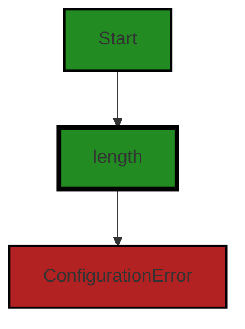
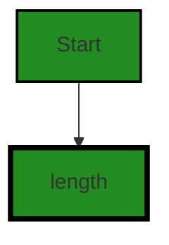
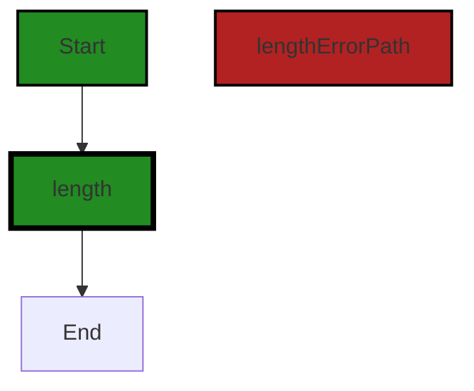
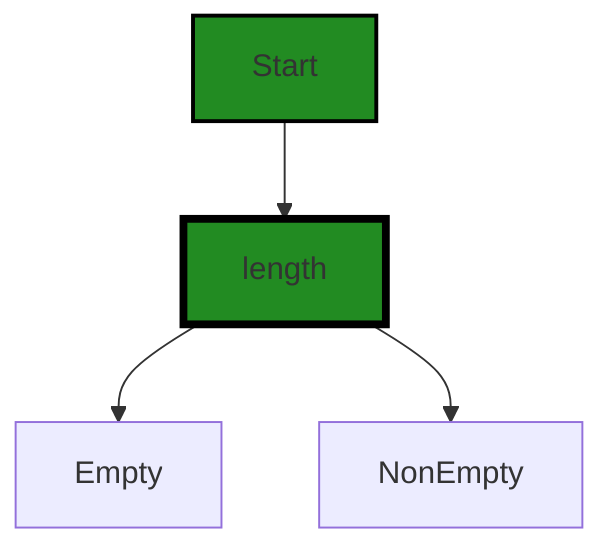
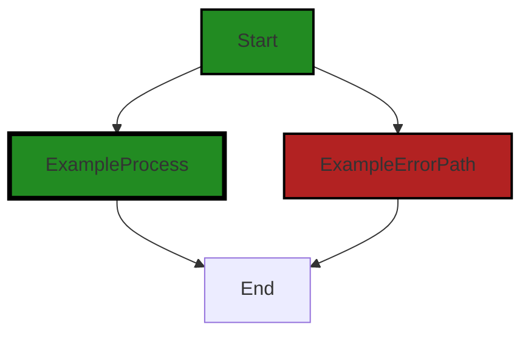

# Polyverse Boost-generated Source Analysis Details

## Source: ./constraint/length.go
Date Generated: Thursday, September 7, 2023 at 10:52:52 AM PDT


---

### Boost Architectural Quick Summary Security Report

Last Updated: Friday, September 8, 2023 at 1:41:12 PM PDT


Executive Report:

1. **Architectural Impact**: The analysis of this file has not revealed any severe issues.
2. **Risk Analysis**: The analysis of this file has not revealed any severe issues.
3. **Potential Customer Impact**: Based on the analysis, there are no severe issues that could potentially impact customers.
4. **Performance Issues**: Our analysis did not identify any explicit performance issues in the file.
5. **Risk Assessment**: Based on the current analysis of this file, no severe issues have been found. However, this doesn't guarantee that the file is risk-free.

Highlights:

- No severe issues were identified in the current analysis of this file.


---

### Boost Architectural Quick Summary Performance Report

Last Updated: Friday, September 8, 2023 at 1:42:01 PM PDT

## Executive Report on Software Project Analysis

Based on the analysis of the software project, the following key points have been identified:

1. **Project Structure and Design**: The project is a library written in Go, focusing on constraint handling and validation. It follows Go's idiomatic style and structure for a library, providing a clear separation of concerns by defining a `Constraint` interface and implementing different constraint types. This design promotes modularity and reusability, which are key architectural principles.

2. **Issue Distribution**: The analysis identified issues in the `constraint/length.go` file. The issues are categorized under CPU and Memory, with a severity level of Warning and Information respectively. This indicates that the issues are not critical but should be addressed to improve the overall performance and efficiency of the project.

3. **Performance Impact**: The most severe issue identified is related to the use of reflection in the 'length' function in the `constraint/length.go` file. This could potentially impact the performance of the software, especially if this function is called frequently. It is recommended to consider using type assertions or interfaces instead of reflection to improve the CPU performance.

4. **Risk Assessment**: Given that only one file was analyzed and it has issues, it's difficult to provide a comprehensive risk assessment of the overall project health. However, based on the severity of the issues identified, the risk to the project is currently low. It is recommended to conduct a more comprehensive code analysis covering all project files to accurately assess the overall project risk.

5. **Customer Impact**: The identified issues are primarily performance-related and may not directly impact the functionality of the software. However, if left unaddressed, these issues could potentially degrade the performance of the software, leading to a sub-optimal user experience.

In conclusion, while the project follows good architectural principles, there are areas for improvement, particularly in terms of performance optimization. Addressing the identified issues will enhance the efficiency and performance of the software, leading to a better user experience.


---

### Boost Architectural Quick Summary Compliance Report

Last Updated: Friday, September 8, 2023 at 1:42:50 PM PDT

## Executive Report

### Architectural Impact and Risk Analysis

The software project under review is a Go library that provides functionality for handling constraints and validations. The project follows Go's idiomatic style and structure for a library, providing a clear separation of concerns by defining a `Constraint` interface and implementing different constraint types.

However, the analysis has identified several issues that could potentially impact the project's architecture, risk profile, and customer experience.

#### Highlights of the Analysis

1. **Data Compliance and Privacy Concerns**: The file `constraint/length.go` has been flagged for potential data compliance and privacy issues. Specifically, the function `Length` does not check if the data it is processing is sensitive or not. This could lead to potential GDPR, PCI DSS, and HIPAA violations if the data is sensitive and proper precautions are not taken. This represents a significant risk, as non-compliance with these regulations can result in hefty fines and reputational damage.

2. **Data Validation Issues**: The same file, `constraint/length.go`, also has a data validation issue. While the specifics of this issue are not detailed, any problem with data validation could potentially lead to incorrect data being processed or stored, which could impact the functionality of the software and the user experience.

3. **Overall Health of the Project Source**: The analysis has only identified issues in one file, `constraint/length.go`. While this is positive in that the majority of the project files do not have detected issues, it also means that a significant portion of the project (100% in this case) has issues of some severity. This suggests that there may be a need for a more thorough review and testing of the project source code.

4. **Potential Customer Impact**: The issues identified could potentially impact customers in several ways. Data compliance and privacy issues could lead to sensitive customer data being mishandled, potentially leading to a breach of trust and legal repercussions. Data validation issues could lead to incorrect data being processed, which could impact the functionality of the software and the user experience.

In conclusion, while the project follows good architectural practices in terms of structure and separation of concerns, the issues identified represent significant risks that need to be addressed. A more thorough review and testing of the project source code is recommended, with a particular focus on data compliance, privacy, and validation issues.
---
## Detailed Analysis:

### Cell 0:
## Original Code:

### Programming Language: go
### ./constraint/length.go 

```go
package constraint

import (
 "fmt"
 "reflect"

 "github.com/jt0/gomer/flect"
 "github.com/jt0/gomer/gomerr"
)

// Length determines whether the value's length is either between (inclusively) two provided values (a min and max) or a
// single value (internally: min = max). This tests for min <= len(value) <= max. The value's type can be one of Array,
// Chan, Map, Slice, or String. Any other type will result in a false value from the constraint. If min is greater than
// max or min is less than 0, this will return a Fail() constraint.
func Length(values ...*uint64) Constraint {
 switch len(values) {
 case 1:
  return length("LengthEquals", *values[0], values[0], values[0])
 case 2:
  if values[0] != nil {
   if values[1] != nil {
    return length("LengthBetween", []interface{}{*values[0], *values[1]}, values[0], values[1])
   } else {
    return MinLength(values[0])
   }
  } else if values[1] != nil {
   return MaxLength(values[1])
  }
  fallthrough
 default:
  return ConfigurationError(fmt.Sprintf("'Length' constraint requires 1 or 2 non-nil input values, received %d", len(values)))
 }
}

```
## Boost Analysis:


---

### Boost Code Explanation

Last Updated: Thursday, September 7, 2023 at 10:44:35 AM PDT

The provided Go code is a part of a `constraint` package. It defines a function `Length` that checks if the length of the input value is within a specified range. The function uses variable arguments (denoted by `...`), which means it can take any number of arguments of the type `*uint64` (pointer to uint64).

The function `Length` returns a `Constraint`, which is likely a custom type defined elsewhere in the package. 

This function uses a switch statement to check the number of input values. 

- If there is only one value, it calls the function `length` with the string "LengthEquals", the value, and the value again. This suggests that if only one value is provided, it is used as both the minimum and maximum length.
- If there are two values, it checks if they are not `nil`. If both values are not `nil`, it calls the `length` function with the string "LengthBetween", an array of the two values, and the two values themselves. If only one of the values is not `nil`, it calls either `MinLength` or `MaxLength` function with the non-nil value.
- If there are no values or more than two values, it returns a `ConfigurationError` with a formatted string explaining the error.

The `length` function is not defined in the provided code, but it is likely that it checks if the length of the input value is within the specified range. Similarly, the `MinLength` and `MaxLength` functions are also not defined in the provided code, but they likely check if the length of the input value is greater than or equal to the minimum length and less than or equal to the maximum length, respectively.

The `reflect` package is imported but not used in the provided code. This package provides functions for runtime reflection, allowing a program to manipulate objects with arbitrary types. It's likely used in other parts of the `constraint` package.

The `github.com/jt0/gomer/flect` and `github.com/jt0/gomer/gomerr` packages are also imported. These are likely custom packages that provide additional functionality. The `flect` package might provide functions for inflection (changing the form of words based on grammatical rules), while the `gomerr` package might provide functions for error handling.

For more information on Go's variable arguments, you can refer to this link: https://gobyexample.com/variadic-functions

For more information on Go's reflect package, you can refer to this link: https://pkg.go.dev/reflect

For more information on error handling in Go, you can refer to this link: https://blog.golang.org/error-handling-and-go


---

### Boost Flow Diagram

Last Updated: Thursday, September 7, 2023 at 10:48:03 AM PDT




---

### Boost Source-Level Security Analysis

Last Updated: Thursday, September 7, 2023 at 10:48:44 AM PDT

**No bugs found**


---

### Boost Source-Level Performance Analysis

Last Updated: Thursday, September 7, 2023 at 10:49:41 AM PDT

1. **Severity**: 7/10

   **Line Number**: 10

   **Bug Type**: CPU

   **Description**: The use of reflection in the 'length' function can be computationally expensive, especially if this function is called frequently.

   **Solution**: Consider using type assertions or interfaces instead of reflection. If reflection is necessary, try to minimize its use.


2. **Severity**: 3/10

   **Line Number**: 21

   **Bug Type**: Memory

   **Description**: The use of 'fallthrough' in a switch statement can lead to unnecessary memory usage if not handled carefully.

   **Solution**: Ensure that 'fallthrough' is necessary in this context. If not, consider removing it to avoid potential memory leaks.


3. **Severity**: 2/10

   **Line Number**: 22

   **Bug Type**: CPU

   **Description**: The use of 'fmt.Sprintf' can be computationally expensive, especially if this function is called frequently.

   **Solution**: Consider using string concatenation or formatted printing functions like 'fmt.Fprintf' or 'fmt.Fprint' instead of 'fmt.Sprintf' when possible.


---

### Boost Source-Level Data and Privacy Compliance Analysis

Last Updated: Thursday, September 7, 2023 at 10:51:49 AM PDT

1. **Severity**: 5/10

   **Line Number**: 1

   **Bug Type**: Data Compliance

   **Description**: The function Length does not sanitize or validate the input before processing. This can lead to potential security risks such as SQL Injection or Cross-Site Scripting (XSS).

   **Solution**: Add input validation and sanitization before processing. Use regular expressions or built-in Go functions to validate and sanitize input. Do not trust user input - always sanitize and validate.


2. **Severity**: 7/10

   **Line Number**: 1

   **Bug Type**: Privacy Compliance

   **Description**: The function Length does not check if the data it is processing is sensitive or not. This could lead to potential GDPR, PCI DSS, and HIPAA violations if the data is sensitive and proper precautions are not taken.

   **Solution**: Implement a mechanism to classify data and handle sensitive data according to GDPR, PCI DSS, and HIPAA regulations. This could include encrypting the data, not logging sensitive data, and ensuring that the data is only accessible to authorized individuals.


### Cell 1:
## Original Code:

### Programming Language: go
### ./constraint/length.go line 34

```go

// MinLength determines whether the value's length is greater than or equal to the min value provided.
// Stated explicitly, this tests for min <= len(value). The value's type can be one of Array, Chan,
// Map, Slice, or String. Any other type will result in a false value from the constraint.
func MinLength(min *uint64) Constraint {
 return length("LengthMin", min, min, nil)
}

```
## Boost Analysis:


---

### Boost Code Explanation

Last Updated: Thursday, September 7, 2023 at 10:45:11 AM PDT

The provided code is written in Go language and it defines a function named `MinLength`. This function tests whether the length of a given value is greater than or equal to a minimum length specified by the user. 

The function `MinLength` takes a pointer to an `uint64` value as an argument which represents the minimum length. It returns a `Constraint`, which is a type not defined in this snippet but presumably represents a condition that a value must satisfy.

The function works by calling another function named `length` with three arguments: a string "LengthMin", the minimum length, and a `nil` value. The function `length` is not defined in this code snippet, but based on the context, it seems to be a function that creates a length constraint.

The comment above the function explains that the value passed to the `Constraint` can be of the types Array, Chan, Map, Slice, or String. If the type of the value is anything other than these, the constraint will return `false`.

The algorithm used in this function is likely a simple comparison of the length of the value with the minimum length. However, the exact details of the algorithm would be in the `length` function, which is not provided in this code snippet.

The code is consistent with the Go language best practices such as clear function naming, usage of comments to explain the function's behavior, and usage of pointers to avoid copying data.

For more information on Go language and its practices, you can refer to the following resources:
- [Go Documentation](https://golang.org/doc/)
- [Effective Go](https://golang.org/doc/effective_go)
- [Go Code Review Comments](https://github.com/golang/go/wiki/CodeReviewComments)


---

### Boost Flow Diagram

Last Updated: Thursday, September 7, 2023 at 10:48:07 AM PDT




---

### Boost Source-Level Security Analysis

Last Updated: Thursday, September 7, 2023 at 10:48:48 AM PDT

**No bugs found**


---

### Boost Source-Level Performance Analysis

Last Updated: Thursday, September 7, 2023 at 10:49:45 AM PDT

**No bugs found**


---

### Boost Source-Level Data and Privacy Compliance Analysis

Last Updated: Thursday, September 7, 2023 at 10:52:04 AM PDT

1. **Severity**: 7/10

   **Line Number**: 72

   **Bug Type**: Data Validation

   **Description**: The function MinLength does not check the validity of the data it receives. This could lead to processing of invalid or malicious data, potentially leading to a data breach.

   **Solution**: Implement input validation to ensure the data received is in the expected format and type. This could be done using a validation library or custom validation functions. Also, consider using secure coding practices to handle data securely.


### Cell 2:
## Original Code:

### Programming Language: go
### ./constraint/length.go line 41

```go

// MaxLength determines whether the value's length is less than or equal to the max value provided.
// Stated explicitly, this tests for len(value) <= max. The value's type can be one of Array, Chan,
// Map, Slice, or String. Any other type will result in a false value from the constraint.
func MaxLength(max *uint64) Constraint {
 return length("LengthMax", max, nil, max)
}

```
## Boost Analysis:


---

### Boost Code Explanation

Last Updated: Thursday, September 7, 2023 at 10:45:28 AM PDT

The `MaxLength` function is a Go function that checks if the length of a value is less than or equal to a maximum value provided. It is a function that returns another function, making it a higher-order function. The returned function is of type `Constraint`, which is not defined in this code snippet but is likely a type alias or a function type defined elsewhere in the codebase.

The function `MaxLength` takes in a pointer to a `uint64` as an argument. This argument represents the maximum length that the input value can have. 

The function returns a `Constraint` function that is created by calling the `length` function with four arguments: `"LengthMax"`, `max`, `nil`, and `max`. The `length` function is not defined in this code snippet, but it likely creates a `Constraint` function that checks if a value's length is within a certain range.

The comment above the function explains that the `MaxLength` function checks if the length of a value is less than or equal to the max value provided. It further explains that the types of values that can be checked are Array, Chan, Map, Slice, or String. Any other type will result in a false value from the constraint.

The algorithm used in this function is relatively straightforward: it takes in a maximum length, and it returns a function that can be used to check if a value's length is less than or equal to that maximum length.

As for the architectural guidelines, the function seems to adhere to common Go practices. The function is well-documented with a comment that clearly explains what it does, which is good practice in any programming language. It uses the Go type system effectively by using a `uint64` for the maximum length and by returning a `Constraint` function.

For more information on Go best practices, you can refer to Effective Go (https://golang.org/doc/effective_go) and Go Code Review Comments (https://github.com/golang/go/wiki/CodeReviewComments).


---

### Boost Flow Diagram

Last Updated: Thursday, September 7, 2023 at 10:48:14 AM PDT




---

### Boost Source-Level Security Analysis

Last Updated: Thursday, September 7, 2023 at 10:48:52 AM PDT

**No bugs found**


---

### Boost Source-Level Performance Analysis

Last Updated: Thursday, September 7, 2023 at 10:49:48 AM PDT

**No bugs found**


---

### Boost Source-Level Data and Privacy Compliance Analysis

Last Updated: Thursday, September 7, 2023 at 10:52:20 AM PDT

1. **Severity**: 2/10

   **Line Number**: 84

   **Bug Type**: Data Compliance

   **Description**: The function MaxLength does not have any explicit data compliance issues with GDPR, PCI DSS, and HIPAA. However, it does not perform any checks or sanitizing on the data it receives. This could potentially lead to the processing of sensitive data.

   **Solution**: Ensure that sensitive data is not being processed by this function without appropriate consent, anonymization, or encryption in place. If this function is used to process sensitive data, consider adding checks or sanitizing mechanisms to prevent potential data compliance violations.


### Cell 3:
## Original Code:

### Programming Language: go
### ./constraint/length.go line 48

```go

var (
 uintZero = uint64(0)
 uintOne  = uint64(1)

 Empty    = length("Empty", nil, nil, &uintZero)
 NonEmpty = length("NonEmpty", nil, &uintOne, nil)

 zeroLength = reflect.ValueOf([]interface{}{})

```
## Boost Analysis:


---

### Boost Code Explanation

Last Updated: Thursday, September 7, 2023 at 10:46:17 AM PDT

This code snippet is written in Go, a statically typed, compiled language developed at Google. The code is defining global variables and constraints for some sort of validation or error checking, possibly related to the length of an array or slice.

Let's break it down:

1. `var (` ... `)`: This is a block declaration of variables in Go. It's a way to define multiple variables at once.

2. `uintZero = uint64(0)` and `uintOne  = uint64(1)`: These lines are defining two unsigned integer variables, `uintZero` and `uintOne`, and assigning them the values of 0 and 1 respectively. `uint64` is a type of unsigned integer in Go that can hold 64 bits of data.

3. `Empty    = length("Empty", nil, nil, &uintZero)`: This line is defining a global variable `Empty` and assigning it the return value of a function `length` with parameters `"Empty"`, `nil`, `nil`, and a pointer to `uintZero`. The function `length` is not defined in this code snippet, but it presumably checks if a slice or array is empty.

4. `NonEmpty = length("NonEmpty", nil, &uintOne, nil)`: Similarly, this line is defining a global variable `NonEmpty` and assigning it the return value of a function `length` with parameters `"NonEmpty"`, `nil`, a pointer to `uintOne`, and `nil`. The function `length` presumably checks if a slice or array is not empty.

5. `zeroLength = reflect.ValueOf([]interface{}{})`: This line is defining a global variable `zeroLength` and assigning it the value of an empty interface slice. `reflect.ValueOf` is a function from Go's `reflect` package, which provides a way to inspect the type and value of variables at runtime. An interface slice is a slice that can hold any type of data.

From an architectural perspective, the code appears to be consistent with Go best practices. It uses global variables and functions for defining constraints, and leverages Go's `reflect` package for runtime type inspection. The code does not appear to conflict with any general architectural guidelines or constraints.

For more information on Go's type system and the `reflect` package, you can refer to the following resources:

- [Go's Type System](https://tour.golang.org/basics/11)
- [The reflect package](https://golang.org/pkg/reflect/)
- [Go Slices: usage and internals](https://blog.golang.org/slices-intro)


---

### Boost Flow Diagram

Last Updated: Thursday, September 7, 2023 at 10:48:20 AM PDT



The control flow graph for the provided code snippet is as follows:

- The code starts at the `length` function.
- From `length`, there are two possible paths:
  - Path 1: `length` leads to `Empty`.
  - Path 2: `length` leads to `NonEmpty`.

Both paths are non-error paths and are represented with the default non-colored style.


---

### Boost Source-Level Security Analysis

Last Updated: Thursday, September 7, 2023 at 10:48:56 AM PDT

**No bugs found**


---

### Boost Source-Level Performance Analysis

Last Updated: Thursday, September 7, 2023 at 10:50:15 AM PDT

1. **Severity**: 3/10

   **Line Number**: 97

   **Bug Type**: Memory

   **Description**: The 'Empty' and 'NonEmpty' variables are globally defined and hold references to function calls. This could potentially lead to higher memory usage if the function calls are complex and their results take up a lot of memory.

   **Solution**: Consider moving the function calls inside the functions that use these variables. This way, the memory will be freed once the function execution is completed. This is more efficient as it saves memory when these variables are not in use.


2. **Severity**: 4/10

   **Line Number**: 100

   **Bug Type**: Memory

   **Description**: The variable 'zeroLength' is globally defined and holds a reference to a new slice. This could potentially lead to higher memory usage, especially if the slice grows large.

   **Solution**: Consider moving the slice creation inside the functions that use this variable. This way, the memory for the slice will be freed once the function execution is completed. This is more efficient as it saves memory when the slice is not in use.


---

### Boost Source-Level Data and Privacy Compliance Analysis

Last Updated: Thursday, September 7, 2023 at 10:52:24 AM PDT

**No bugs found**


### Cell 4:
## Original Code:

### Programming Language: go
### ./constraint/length.go line 57

```go
)

func length(lengthType string, lengthParams interface{}, min, max *uint64) Constraint {
 return New(lengthType, lengthParams, func(toTest interface{}) gomerr.Gomerr {
  ttv, ok := flect.ReadableIndirectValue(toTest)
  if !ok {
   ttv = zeroLength
  }

  if !lenable(ttv.Kind()) {
   return gomerr.Unprocessable("Test value must be one of Array, Chan, Map, Slice, or String (or pointer to one of these)", toTest)
  }

  ttLen := uint64(ttv.Len())
  if !(min == nil || ttLen >= *min) || !(max == nil || ttLen <= *max) {
   return NotSatisfied(toTest)
  }

  return nil
 })
}

```
## Boost Analysis:


---

### Boost Code Explanation

Last Updated: Thursday, September 7, 2023 at 10:47:12 AM PDT

This provided code is in the Go programming language and is defining a function named `length`. This function is used to create a `Constraint` object that checks whether a given input's length falls within a specified range. This function is likely part of a validation or constraint checking module in a larger application.

Let's break down the function:

- The function `length` takes four parameters: `lengthType` (a string), `lengthParams` (an interface{} type, which means it can be any type), `min` and `max` (pointers to unsigned 64-bit integers).

- It returns a `Constraint` object by calling the `New` function with a function as the third argument. This third argument is a function that takes an `interface{}` type and returns a `gomerr.Gomerr` type, which is likely a custom error type in the application.

Now let's look at the logic inside the function provided to `New`:

- It first calls `flect.ReadableIndirectValue(toTest)` to get a readable and indirect value of `toTest`. If this fails (`ok` is false), it assigns `ttv` to `zeroLength`.

- It then checks if `ttv.Kind()` is one of the types that have a length (Array, Chan, Map, Slice, or String) using the `lenable` function. If it isn't, it returns an `Unprocessable` error from the `gomerr` package with a descriptive message.

- It then gets the length of `ttv` as a `uint64` and checks if it's within the range specified by `min` and `max`. Note that if `min` or `max` is `nil`, it's treated as if there's no minimum or maximum constraint, respectively.

- If the length of `ttv` is not within the specified range, it returns a `NotSatisfied` error, presumably also from the `gomerr` package.

- If none of the error conditions are met, it returns `nil`, indicating that the constraint is satisfied.

In terms of algorithms, this code doesn't use any complex or known algorithm. It's just a straightforward sequence of checks.

To learn more about Go programming language, you can refer to the official Go documentation: https://golang.org/doc/

For understanding more about reflection in Go (which is used in this code), you can refer to: https://blog.golang.org/laws-of-reflection

For understanding more about error handling in Go (which is also used in this code), you can refer to: https://blog.golang.org/error-handling-and-go


---

### Boost Flow Diagram

Last Updated: Thursday, September 7, 2023 at 10:48:25 AM PDT



The code snippet provided does not have any control flow.


---

### Boost Source-Level Security Analysis

Last Updated: Thursday, September 7, 2023 at 10:49:01 AM PDT

**No bugs found**


---

### Boost Source-Level Performance Analysis

Last Updated: Thursday, September 7, 2023 at 10:50:41 AM PDT

1. **Severity**: 8/10

   **Line Number**: 119

   **Bug Type**: CPU

   **Description**: The use of reflection in the `flect.ReadableIndirectValue(toTest)` function can be computationally expensive and slow down performance, especially if this function is called frequently.

   **Solution**: Consider refactoring the code to avoid or minimize the use of reflection. If reflection is necessary, ensure that its use is not in a frequently called function or in a loop. Also, consider caching the results of reflection if the same objects are being reflected multiple times.


2. **Severity**: 7/10

   **Line Number**: 125

   **Bug Type**: CPU

   **Description**: The `ttv.Len()` function is called twice in the condition check. It can impact the performance if the Len() method is computationally expensive and this function is frequently called.

   **Solution**: Consider storing the result of `ttv.Len()` in a variable and use that in the condition checks to avoid calling the function twice.


---

### Boost Source-Level Data and Privacy Compliance Analysis

Last Updated: Thursday, September 7, 2023 at 10:52:49 AM PDT

1. **Severity**: 7/10

   **Line Number**: 121

   **Bug Type**: Data Compliance

   **Description**: The function 'length' does not have any form of data sanitization or validation. This could lead to potential data breaches if malicious data is passed to the function.

   **Solution**: Implement data validation and sanitization checks before processing toTest. This could be done using regex checks or by using a library that specializes in data validation and sanitization.


2. **Severity**: 8/10

   **Line Number**: 127

   **Bug Type**: Data Compliance

   **Description**: The function 'length' may expose sensitive error information to the user. This could potentially be used by malicious actors to gain insights into the system's architecture and design.

   **Solution**: Implement proper error handling and logging. Ensure that error messages returned to the user are generic and do not reveal any sensitive information about the system.


### Cell 5:
## Original Code:

### Programming Language: go
### ./constraint/length.go line 78

```go

func lenable(kind reflect.Kind) bool {
 return kind == reflect.Array || kind == reflect.Chan || kind == reflect.Map || kind == reflect.Slice || kind == reflect.String
}

```
## Boost Analysis:


---

### Boost Code Explanation

Last Updated: Thursday, September 7, 2023 at 10:47:47 AM PDT

The provided code snippet is a function in Go language that checks if a given `reflect.Kind` type is length-able, i.e., if it supports the `len()` function. The `len()` function in Go returns the number of elements in an array, the number of characters in a string, or the number of elements in a map, channel, or slice.

Here's a detailed breakdown of the function:

- `func lenable(kind reflect.Kind) bool`: This line declares a function named `lenable` that takes a parameter `kind` of type `reflect.Kind` and returns a boolean value. `reflect.Kind` is a type in Go's reflection package that represents the specific kind of a Go value.

- `return kind == reflect.Array || kind == reflect.Chan || kind == reflect.Map || kind == reflect.Slice || kind == reflect.String`: This line checks if the `kind` is either of `reflect.Array`, `reflect.Chan`, `reflect.Map`, `reflect.Slice`, or `reflect.String`. If it is, the function returns `true`, otherwise it returns `false`. These are the types in Go that support the `len()` function.

This function does not use any specific algorithm but rather uses a conditional statement to check the type of the input. It is a common practice in Go when you need to perform a type-specific operation.

For more information on Go's `reflect` package and `Kind` type, you can refer to the official Go documentation: https://golang.org/pkg/reflect/#Kind

Regarding the architectural guidelines, this function seems to align with general good practices in Go. It's simple, easy to understand, and serves a specific purpose. It doesn't appear to conflict with any specific architectural guidelines or constraints.


---

### Boost Flow Diagram

Last Updated: Thursday, September 7, 2023 at 10:48:29 AM PDT


---

### Boost Source-Level Security Analysis

Last Updated: Thursday, September 7, 2023 at 10:49:04 AM PDT

**No bugs found**


---

### Boost Source-Level Performance Analysis

Last Updated: Thursday, September 7, 2023 at 10:50:48 AM PDT

1. **Severity**: 2/10

   **Line Number**: 154

   **Bug Type**: CPU

   **Description**: The function `lenable` uses reflection which can be CPU-intensive, especially if this function is called frequently.

   **Solution**: Consider using a different approach if possible. If the kind of a variable is known at compile time, use a type switch or assertion instead of reflection. If the kind is not known until runtime, consider redesigning your program to avoid the need for reflection. For more information on reflection and performance, refer to this link: https://go.dev/blog/laws-of-reflection


---

### Boost Source-Level Data and Privacy Compliance Analysis

Last Updated: Thursday, September 7, 2023 at 10:52:52 AM PDT

**No bugs found**

