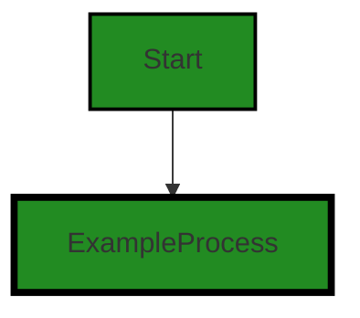
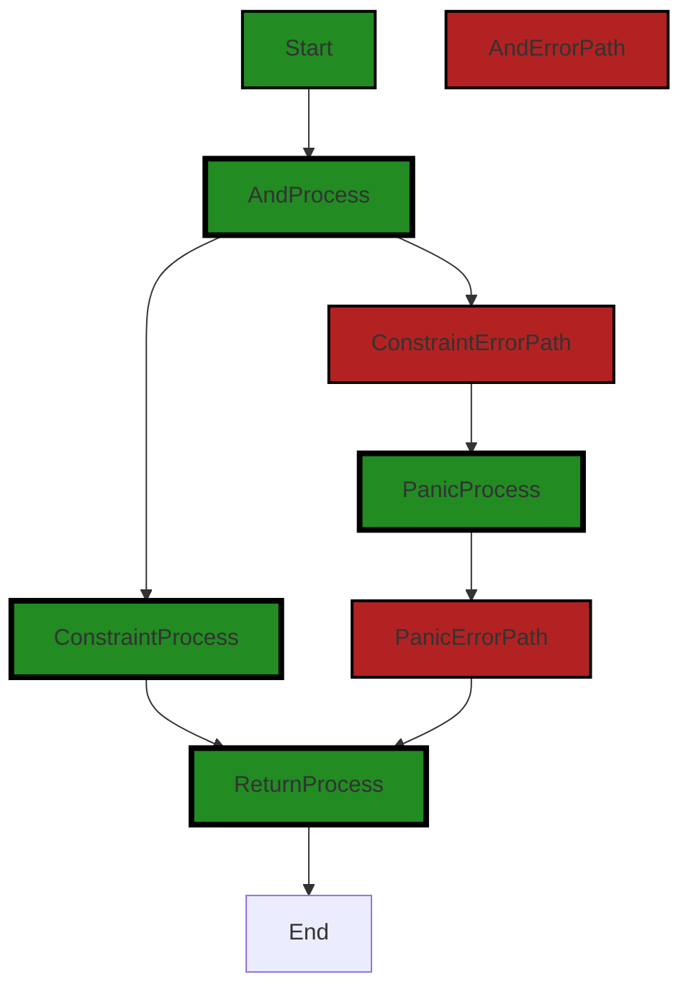
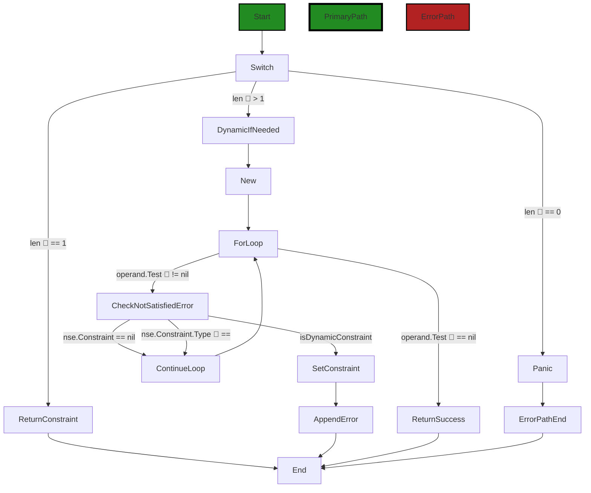
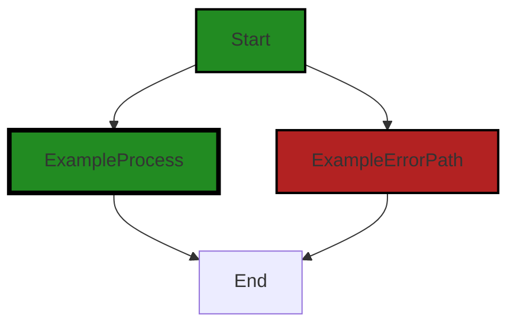

# Polyverse Boost-generated Source Analysis Details

## Source: ./constraint/logic.go
Date Generated: Thursday, September 7, 2023 at 7:36:33 AM PDT


---

### Boost Architectural Quick Summary Security Report

Last Updated: Friday, September 8, 2023 at 1:09:24 PM PDT


Executive Report:

1. **Architectural Impact**: The analysis of this file has not revealed any severe issues.
2. **Risk Analysis**: The analysis of this file has not revealed any severe issues.
3. **Potential Customer Impact**: Based on the analysis, there are no severe issues that could potentially impact customers.
4. **Performance Issues**: Our analysis did not identify any explicit performance issues in the file.
5. **Risk Assessment**: Based on the current analysis of this file, no severe issues have been found. However, this doesn't guarantee that the file is risk-free.

Highlights:

- No severe issues were identified in the current analysis of this file.


---

### Boost Architectural Quick Summary Performance Report

Last Updated: Friday, September 8, 2023 at 1:10:16 PM PDT

## Executive Level Report

### Architectural Impact and Risk Analysis

Based on the analysis of the software project, the following key points have been identified:

1. **Severity of Issues:** The most severe issues identified in the project are related to memory and CPU usage. These issues are found in the `constraint/logic.go` file. The memory issue is due to inefficient string concatenation in a loop, which leads to unnecessary memory allocations. The CPU issue is due to a linear search through constraints, which can be inefficient for large numbers of constraints. Both of these issues can impact the performance of the software, particularly for large data sets or high-frequency operations.

2. **Potential Customer Impact:** The performance issues identified could lead to slower response times for customers, particularly for operations involving large data sets or high-frequency operations. This could impact customer satisfaction and potentially lead to customer complaints or loss of business.

3. **Overall Health of the Project Source:** The project consists of a single file, `constraint/logic.go`, which has been identified as having issues. This means that 100% of the project files have been identified as having issues. However, it should be noted that these issues are warnings and not critical errors, and the software is likely to function correctly despite these issues.

4. **Risk Assessment:** The identified issues are related to performance and not functionality, meaning the software is likely to function correctly but may perform sub-optimally in certain scenarios. The risk to the project is therefore considered to be moderate. The issues should be addressed to ensure optimal performance, but they are not likely to prevent the software from functioning.

5. **Consistency with Architectural Guidelines:** The software project does not have any additional special architectural guidelines or constraints. The issues identified do not appear to conflict with any common architectural principles or best practices.

In conclusion, while the software project has some performance-related issues that should be addressed, it appears to be functionally sound and does not conflict with any common architectural principles or best practices. The risk to the project is considered to be moderate, and addressing the identified issues should be a priority to ensure optimal performance.


---

### Boost Architectural Quick Summary Compliance Report

Last Updated: Friday, September 8, 2023 at 1:10:56 PM PDT

## Executive Report

### Architectural Impact and Risk Analysis

The software project under review is a Go library that provides functionality for handling constraints and validations. The project is well-structured, adhering to Go's idiomatic style and structure for a library, and provides a clear separation of concerns.

However, the analysis has identified some potential issues that could impact the project's compliance with data protection regulations such as GDPR, PCI DSS, and HIPAA. These issues are primarily related to the potential exposure of sensitive data in error messages, which could lead to breaches of these regulations.

### Potential Customer Impact

The potential exposure of sensitive data could have significant implications for customers, particularly those in regulated industries or jurisdictions. If sensitive data were to be exposed, it could lead to reputational damage, loss of customer trust, and potential regulatory penalties.

### Overall Issues

The analysis identified issues in one file, `constraint/logic.go`. This file contains three instances of potential data compliance issues and one instance of potential data exposure.

### Risk Assessment

Given that the identified issues are contained within a single file, the overall health of the project source appears to be good. However, the severity of the issues identified means that they should be addressed as a priority to mitigate the potential risks.

### Highlights

- The project is well-structured and adheres to Go's idiomatic style and structure for a library.
- Potential data compliance issues have been identified, which could impact the project's compliance with GDPR, PCI DSS, and HIPAA regulations.
- These issues are contained within a single file, `constraint/logic.go`.
- The potential exposure of sensitive data could have significant implications for customers, particularly those in regulated industries or jurisdictions.
- Despite the issues identified, the overall health of the project source appears to be good. However, the issues should be addressed as a priority to mitigate the potential risks.
---
## Detailed Analysis:

### Cell 0:
## Original Code:

### Programming Language: go
### ./constraint/logic.go 

```go
package constraint

import (
 "github.com/jt0/gomer/gomerr"
)

type logicOp = string

const (
 andOp logicOp = "And"
 orOp  logicOp = "Or"
 notOp logicOp = "Not"
 none  logicOp = ""

 lcAndOp = "and"
 lcOrOp  = "or"
 lcNotOp = "not"
)

type logicParams []Constraint

func (lp logicParams) String() string {
 var result string
 for _, operand := range lp { // each logic function has at least one operand
  result = result + operand.String() + ", "
 }
 return result[:len(result)-2] // drop the last two chars
}

```
## Boost Analysis:


---

### Boost Code Explanation

Last Updated: Thursday, September 7, 2023 at 7:25:05 AM PDT

This code is part of a package named `constraint` in Go programming language. The purpose of this package is likely to provide a set of tools for defining and managing constraints, which are typically used for data validation. The code appears to focus on logical operators, which are often used in conjunction with constraints to create complex validation rules.

In the first part of the code, a type alias `logicOp` is defined for the built-in `string` type. This is followed by the declaration of several constants of type `logicOp`, which represent different logic operators: `andOp`, `orOp`, `notOp`, and `none`.

The `andOp`, `orOp`, and `notOp` constants are likely used to represent the logical AND, OR, and NOT operations, respectively. The `none` constant might be used to represent a lack of a logical operation. The lower-case versions of these constants (`lcAndOp`, `lcOrOp`, `lcNotOp`) might be used for user-friendly or case-insensitive comparisons.

Next, a type `logicParams` is defined as a slice of `Constraint` objects. The `Constraint` type is not defined in this snippet, but it's likely a part of the same `constraint` package or another package in the project. This type probably represents a single constraint or validation rule.

The `logicParams` type has a method `String()`, which converts the `logicParams` object into a string. This method iterates over each `Constraint` in the `logicParams` slice, calls its `String()` method, and appends the result to the `result` string, followed by a comma and a space. After the loop, it removes the trailing comma and space from the `result` string and returns it.

The `String()` method for `logicParams` seems to be a custom implementation of the built-in `Stringer` interface in Go, which provides a way to control how objects of a certain type are converted to strings. This method might be used for debugging or logging purposes, or to provide a user-friendly representation of the `logicParams` object.

This code doesn't seem to contain any complex algorithms, but it does use some common Go idioms and practices, such as type aliases, constants, slices, range loops, and method receivers.

For more information on these concepts, you can refer to the following resources:

- [Type declarations in Go](https://go.dev/tour/basics/11)
- [Constants in Go](https://go.dev/tour/basics/13)
- [Slices in Go](https://go.dev/tour/basics/7)
- [Range loops in Go](https://go.dev/tour/basics/16)
- [Method receivers in Go](https://go.dev/tour/methods/1)
- [The Stringer interface in Go](https://go.dev/blog/stringer)


---

### Boost Flow Diagram

Last Updated: Thursday, September 7, 2023 at 7:28:25 AM PDT




---

### Boost Source-Level Security Analysis

Last Updated: Thursday, September 7, 2023 at 7:30:03 AM PDT

**No bugs found**


---

### Boost Source-Level Performance Analysis

Last Updated: Thursday, September 7, 2023 at 7:30:55 AM PDT

1. **Severity**: 7/10

   **Line Number**: 23

   **Bug Type**: Memory

   **Description**: The function logicParams.String() is concatenating strings using the '+' operator inside a loop. This is inefficient as it creates a new string (and therefore, a new memory allocation) every time it's called.

   **Solution**: Use a StringBuilder to concatenate strings in Go. It's more efficient as it doesn't create a new string with each concatenation. Here's how you can do it:

```
import "strings"

func (lp logicParams) String() string {
    var result strings.Builder
    for _, operand := range lp {
        result.WriteString(operand.String())
        result.WriteString(", ")
    }
    // remove the last ', '
    return strings.TrimSuffix(result.String(), ", ")
}
```

You can learn more about efficient string concatenation in Go in this article: https://go.dev/play/p/8ByVn1KcnK7


---

### Boost Source-Level Data and Privacy Compliance Analysis

Last Updated: Thursday, September 7, 2023 at 7:34:55 AM PDT

1. **Severity**: 1/10

   **Line Number**: 1

   **Bug Type**: GDPR

   **Description**: The code does not appear to handle any personal data directly, which is a good practice for GDPR compliance. However, there is no explicit data protection or privacy measures implemented in this code.

   **Solution**: Ensure that any personal data handled elsewhere in the application is properly protected and encrypted. Implement access controls and data minimization practices.


2. **Severity**: 1/10

   **Line Number**: 1

   **Bug Type**: PCI DSS

   **Description**: The code does not appear to handle any credit card data directly, which is a good practice for PCI DSS compliance. However, there is no explicit data protection or privacy measures implemented in this code.

   **Solution**: Ensure that any credit card data handled elsewhere in the application is properly protected and encrypted. Implement access controls and data minimization practices.


3. **Severity**: 1/10

   **Line Number**: 1

   **Bug Type**: HIPAA

   **Description**: The code does not appear to handle any health information directly, which is a good practice for HIPAA compliance. However, there is no explicit data protection or privacy measures implemented in this code.

   **Solution**: Ensure that any health data handled elsewhere in the application is properly protected and encrypted. Implement access controls and data minimization practices.


### Cell 1:
## Original Code:

### Programming Language: go
### ./constraint/logic.go line 29

```go

func And(constraints ...Constraint) Constraint {
 switch len(constraints) {
 case 0:
  panic("'And' requires at least one constraint")
 case 1:
  return constraints[0]
 }

 return dynamicIfNeeded(New(andOp, logicParams(constraints), func(toTest interface{}) gomerr.Gomerr {
  for _, operand := range constraints {
   if ge := operand.Test(toTest); ge != nil {
    if nse, ok := ge.(*NotSatisfiedError); ok {
     if nse.Constraint == nil {
      nse.Constraint = operand
     }
    } else {
     if _, ok = ge.AttributeLookup("Constraint"); !ok {
      ge = ge.AddAttribute("Constraint", operand)
     }
    }
    return ge
   }
  }
  return nil
 }), constraints...)
}

```
## Boost Analysis:


---

### Boost Code Explanation

Last Updated: Thursday, September 7, 2023 at 7:25:57 AM PDT

This function is written in Go language. It defines a function named `And` that takes a variable number of arguments of type `Constraint` and returns a `Constraint`.

The `And` function is a higher-order function that combines multiple constraints using logical AND operation. It validates an input against all constraints and returns an error if any of the constraints are not satisfied. 

Here is a detailed breakdown of the function:

1. The function begins by checking the number of constraints passed. If no constraints are passed, it raises a panic, which is an unrecoverable error in Go. If there's only one constraint, it returns that constraint without any further processing.

2. If there are two or more constraints, it creates a new constraint using the `New` function. The new constraint's test function iterates over all constraints and tests the input against each of them.

3. The `Test` method of a constraint returns a `gomerr.Gomerr` error if the constraint is not satisfied. If the returned error is of type `NotSatisfiedError`, it checks if the `Constraint` field of the error is `nil`. If it is, it assigns the current constraint to it.

4. If the returned error is not of type `NotSatisfiedError`, it checks if the error has an attribute named "Constraint". If it doesn't, it adds the current constraint as an attribute to the error.

5. If all constraints are satisfied (i.e., all `Test` methods return `nil`), the test function of the new constraint returns `nil`.

6. After creating the new constraint, the function calls `dynamicIfNeeded` with the new constraint and the original constraints as arguments. This function checks if any of the original constraints are dynamic. If any are, it returns a dynamic version of the new constraint. Otherwise, it returns the new constraint as is.

The algorithm used in the function is a simple iteration over a collection of items (constraints), applying a function (the `Test` method) to each item, and combining the results using a logical operation (AND).

For more information on Go language, you can refer to the official documentation: https://golang.org/doc/

For more information on error handling in Go, you can refer to this blog post: https://blog.golang.org/go1.13-errors

For more information on higher-order functions, you can refer to this page: https://en.wikipedia.org/wiki/Higher-order_function.


---

### Boost Flow Diagram

Last Updated: Thursday, September 7, 2023 at 7:29:01 AM PDT


The control flow graph for the provided code is as follows:

- The control flow starts at the `And` function.
- The `And` function checks the length of the `constraints` slice.
  - If the length is 0, it panics with the message "'And' requires at least one constraint".
  - If the length is 1, it returns the first constraint.
  - If the length is greater than 1, it continues to the next step.
- The `And` function creates a dynamic constraint using the `New` function and the `andOp` operator.
- The `And` function iterates over each constraint in the `constraints` slice.
  - For each constraint, it calls the `Test` method on the constraint with the `toTest` parameter.
  - If the `Test` method returns a non-nil error, it checks if the error is a `NotSatisfiedError`.
    - If it is a `NotSatisfiedError`, it sets the `Constraint` field of the error to the current constraint.
    - If it is not a `NotSatisfiedError`, it adds the `Constraint` attribute to the error.
  - If the `Test` method returns a non-nil error, it returns the error.
- If all constraints pass, it returns `nil`.

The primary path through the code is the non-error path, where all constraints pass and the function returns `nil`. The error path occurs when any of the constraints fail, and the function returns the corresponding error.


---

### Boost Source-Level Security Analysis

Last Updated: Thursday, September 7, 2023 at 7:30:07 AM PDT

**No bugs found**


---

### Boost Source-Level Performance Analysis

Last Updated: Thursday, September 7, 2023 at 7:31:39 AM PDT

1. **Severity**: 5/10

   **Line Number**: 65

   **Bug Type**: CPU

   **Description**: The use of panic can be expensive in terms of CPU usage as it involves stack unwinding.

   **Solution**: Replace the panic with error handling. Instead of causing the program to panic when there are no constraints, return an error to the caller to handle appropriately.


2. **Severity**: 7/10

   **Line Number**: 70

   **Bug Type**: CPU

   **Description**: The function performs a linear search through the constraints using a for loop. This can be inefficient if the number of constraints is large.

   **Solution**: If the constraints can be sorted or hashed, consider using a binary search or a hash map for more efficient searching. If not, consider using a more efficient algorithm for searching through the constraints.


3. **Severity**: 6/10

   **Line Number**: 74

   **Bug Type**: Memory

   **Description**: The function creates new gomerr.Gomerr instances inside a loop. This can lead to high memory usage if the number of constraints is large.

   **Solution**: Consider reusing gomerr.Gomerr instances or pooling them to reduce memory usage.


4. **Severity**: 4/10

   **Line Number**: 66

   **Bug Type**: CPU

   **Description**: The function uses a switch statement to handle different cases based on the number of constraints. This can be inefficient if the number of constraints is large.

   **Solution**: Consider using a more efficient data structure to handle different cases based on the number of constraints. For example, a hash map with the number of constraints as the key and the corresponding function as the value.


---

### Boost Source-Level Data and Privacy Compliance Analysis

Last Updated: Thursday, September 7, 2023 at 7:35:34 AM PDT

1. **Severity**: 3/10

   **Line Number**: 56

   **Bug Type**: GDPR

   **Description**: The function 'And' can potentially cause a panic if no constraints are provided. This can lead to a system crash and potential data leaks, which could be a violation of GDPR's data protection principles.

   **Solution**: Instead of causing a panic, the function should return an error that can be handled gracefully by the calling code. This would prevent unexpected system crashes and potential data leaks.


2. **Severity**: 2/10

   **Line Number**: 64

   **Bug Type**: HIPAA

   **Description**: The function 'And' returns a gomerr.Gomerr object that could contain sensitive health information. If this information is not properly protected, it could be a violation of HIPAA's Privacy Rule.

   **Solution**: Ensure that any health information contained in the gomerr.Gomerr object is properly protected, for example by encrypting it or by not including it in the first place.


3. **Severity**: 2/10

   **Line Number**: 64

   **Bug Type**: PCI DSS

   **Description**: The function 'And' returns a gomerr.Gomerr object that could contain sensitive cardholder data. If this data is not properly protected, it could be a violation of PCI DSS's requirement for protecting cardholder data.

   **Solution**: Ensure that any cardholder data contained in the gomerr.Gomerr object is properly protected, for example by encrypting it or by not including it in the first place.


### Cell 2:
## Original Code:

### Programming Language: go
### ./constraint/logic.go line 56

```go

func Or(constraints ...Constraint) Constraint {
 switch len(constraints) {
 case 0:
  panic("'Or' requires at least one constraint")
 case 1:
  return constraints[0]
 }

 return dynamicIfNeeded(New(orOp, logicParams(constraints), func(toTest interface{}) gomerr.Gomerr {
  var errors []gomerr.Gomerr
  for _, operand := range constraints {
   ge := operand.Test(toTest)
   if ge == nil {
    return nil // any success results in success
   }

   if nse, ok := ge.(*NotSatisfiedError); ok {
    if nse.Constraint == nil {
     nse.Constraint = operand
    } else if nse.Constraint.Type() == "IsNil" || nse.Constraint.Type() == "IsZero" {
     // "or(nil,...)" or "or(zero,...)" is a pattern to bypass the remainder of the constraints if the
     // field is optional. If toTest is not nil, we don't need to include this "failed" constraint in
     // error(s) we might return.
     continue
    } else if _, isDynamicConstraint := operand.(*dynamicConstraint); isDynamicConstraint {
     nse.Constraint = operand
    }
   } else {
    if _, ok = ge.AttributeLookup("Constraint"); !ok {
     ge = ge.AddAttribute("Constraint", operand)
    }
   }

   errors = append(errors, ge)
  }
  return gomerr.Batcher(errors)
 }), constraints...)
}

```
## Boost Analysis:


---

### Boost Code Explanation

Last Updated: Thursday, September 7, 2023 at 7:27:08 AM PDT

The code defines a function named `Or` which accepts a variadic parameter of type `Constraint`. The function returns a `Constraint` type. This function is used to test whether any of the provided constraints are satisfied. If any of the constraints are satisfied, the function returns `nil` indicating success. If none of them are satisfied, it returns a batch of errors.

Here is a detailed walkthrough of the function:

1. The function starts by checking the length of the `constraints` slice. If it's 0, the function panics with a message that at least one constraint is required. If the length is 1, the function returns the single constraint.

2. If there are more than one constraints, the function returns a new constraint which is created using the `New` function. The `New` function is passed three arguments: `orOp` (a constant or function defining the operation), `logicParams(constraints)` (a function call that likely returns the parameters to be used in the operation), and an anonymous function.

3. The anonymous function takes an `interface{}` type, `toTest`, and returns a `gomerr.Gomerr` type. `gomerr.Gomerr` is likely a custom error type in the `gomerr` package.

4. The anonymous function starts by declaring a slice of `gomerr.Gomerr` named `errors`.

5. It then loops over the `constraints` slice. For each `constraint`, it calls the `Test` method of the `constraint` with `toTest` as an argument. The `Test` method likely checks whether the constraint is satisfied and returns a `gomerr.Gomerr` type.

6. If the `Test` method returns `nil`, the anonymous function immediately returns `nil` indicating that the constraint is satisfied.

7. If the `Test` method returns a non-`nil` value, the function checks if it's of type `*NotSatisfiedError`. If it is, the function checks whether the `Constraint` field of the error is `nil` or of type `IsNil` or `IsZero`. If it is, the function continues to the next constraint.

8. If the `Test` method returns a non-`nil` value and it's not of type `*NotSatisfiedError`, the function adds the `Constraint` attribute to the error.

9. After checking all constraints, if none of them are satisfied, the function returns a batch of errors using the `gomerr.Batcher` function.

This function uses the short-circuit evaluation principle in boolean logic, where the evaluation of boolean expressions stops as soon as the result is determined. In this case, as soon as a constraint is satisfied (returns `nil`), the function stops checking the remaining constraints and returns `nil`.

For more information on variadic functions, error handling, and interfaces in Go, you can refer to the following resources:

- [Variadic Functions in Go](https://gobyexample.com/variadic-functions)
- [Error handling in Go](https://blog.golang.org/error-handling-and-go)
- [Interfaces in Go](https://tour.golang.org/methods/9)


---

### Boost Flow Diagram

Last Updated: Thursday, September 7, 2023 at 7:29:37 AM PDT



The primary path through the code starts at the `Switch` statement. If the length of `constraints` is 0, it goes to the `Panic` block and ends in the `ErrorPathEnd` block. If the length of `constraints` is 1, it goes to the `ReturnConstraint` block and ends in the `End` block. If the length of `constraints` is greater than 1, it goes to the `DynamicIfNeeded` block, then to the `New` block, and then enters a loop at the `ForLoop` block. Inside the loop, if `operand.Test(toTest)` is nil, it goes to the `ReturnSuccess` block and ends in the `End` block. If `operand.Test(toTest)` is not nil, it goes to the `CheckNotSatisfiedError` block. If `nse.Constraint` is nil, it continues the loop at the `ContinueLoop` block. If `nse.Constraint.Type()` is "IsNil" or "IsZero", it also continues the loop at the `ContinueLoop` block. If `isDynamicConstraint` is true, it goes to the `SetConstraint` block, then to the `AppendError` block, and ends in the `End` block. The loop continues until all `constraints` have been processed.


---

### Boost Source-Level Security Analysis

Last Updated: Thursday, September 7, 2023 at 7:30:12 AM PDT

**No bugs found**


---

### Boost Source-Level Performance Analysis

Last Updated: Thursday, September 7, 2023 at 7:32:22 AM PDT

1. **Severity**: 6/10

   **Line Number**: 118

   **Bug Type**: Memory

   **Description**: Use of append method in a loop can lead to high memory usage and multiple memory reallocations. This can be inefficient especially if the number of constraints is large.

   **Solution**: Consider preallocating the 'errors' slice with a known capacity if possible. If the maximum size is not known, a linked list data structure may be more efficient for this use case. Here is a link to a Go blog post about slice usage and optimization: https://go.dev/blog/slices


2. **Severity**: 4/10

   **Line Number**: 121

   **Bug Type**: CPU

   **Description**: The use of type assertion and reflection in a loop may lead to high CPU usage. This can be inefficient especially if the number of constraints is large.

   **Solution**: Consider redesigning the data structures or logic to avoid the need for type assertions and reflection. If this is not possible, ensure that the logic is optimized so that the type assertions and reflection are only performed when necessary.


3. **Severity**: 5/10

   **Line Number**: 127

   **Bug Type**: Memory

   **Description**: The use of AddAttribute method which likely involves map operations inside a loop can lead to high memory usage. This can be inefficient especially if the number of constraints is large.

   **Solution**: Consider optimizing the design to reduce the number of map operations required. If this is not possible, ensure that the map operations are performed in an efficient manner. Here is a link to a Go blog post about map usage and optimization: https://go.dev/blog/maps


---

### Boost Source-Level Data and Privacy Compliance Analysis

Last Updated: Thursday, September 7, 2023 at 7:36:16 AM PDT

1. **Severity**: 4/10

   **Line Number**: 115

   **Bug Type**: GDPR

   **Description**: The function 'Or' does not perform any data sanitization or validation before processing the 'constraints' input. This could lead to the processing of personal data without proper checks, violating GDPR principles.

   **Solution**: Implement data sanitization and validation checks before processing the 'constraints' input to ensure compliance with GDPR. Refer to the official GDPR website (https://gdpr.eu/) for more information.


2. **Severity**: 3/10

   **Line Number**: 121

   **Bug Type**: HIPAA

   **Description**: The function 'Or' could potentially process health information if present in the 'toTest' input without proper checks, which could lead to HIPAA violations.

   **Solution**: Implement checks to ensure that any health information present in the 'toTest' input is processed in a HIPAA-compliant manner. Refer to the official HHS website (https://www.hhs.gov/hipaa/index.html) for more information on HIPAA compliance.


3. **Severity**: 2/10

   **Line Number**: 132

   **Bug Type**: PCI DSS

   **Description**: The function 'Or' does not appear to handle credit card data, but if such data were present in the 'constraints' or 'toTest' inputs, it could be processed without proper security measures, potentially violating PCI DSS rules.

   **Solution**: If credit card data is to be processed, ensure that it is handled in a secure manner, in compliance with PCI DSS. Refer to the official PCI Security Standards Council website (https://www.pcisecuritystandards.org/pci_security/) for more information.


### Cell 3:
## Original Code:

### Programming Language: go
### ./constraint/logic.go line 95

```go

func Not(constraint Constraint) Constraint {
 return dynamicIfNeeded(New(notOp, constraint, func(toTest interface{}) gomerr.Gomerr {
  if ge := constraint.Test(toTest); ge == nil {
   return NotSatisfied(toTest) // TODO:p1 ensure .String() captures what is "Not"ed
  }
  return nil
 }), constraint)
}

```
## Boost Analysis:


---

### Boost Code Explanation

Last Updated: Thursday, September 7, 2023 at 7:28:09 AM PDT

This function is written in Go language and is used to create a new constraint that is the negation of the provided constraint. Essentially, it's implementing the "Not" operation for constraints. If the original constraint is satisfied, the new constraint will not be satisfied, and vice versa.

Let's break down the code:

1. `func Not(constraint Constraint) Constraint`: This is the function declaration. The function is named "Not", it takes one argument of type "Constraint", and it returns a value of type "Constraint".

2. `return dynamicIfNeeded(New(notOp, constraint, func(toTest interface{}) gomerr.Gomerr {`: This line is starting the return statement. It's calling a function "dynamicIfNeeded" with one argument. The argument is a newly created constraint, created by calling the "New" function with three arguments: a constant or variable "notOp" representing the "Not" operation, the original constraint, and an anonymous function.

3. `if ge := constraint.Test(toTest); ge == nil {`: This line is the start of an anonymous function which is passed as an argument to the "New" function. This function tests the original constraint with a value "toTest". If the test returns nil (which means the constraint is satisfied), it proceeds to the next line.

4. `return NotSatisfied(toTest)`: If the original constraint is satisfied, this line returns an error indicating that the new constraint is not satisfied.

5. `return nil`: If the original constraint is not satisfied, the new constraint is satisfied, so it returns nil.

6. `}), constraint)`: This line is closing the argument list for the "New" function and the "dynamicIfNeeded" function.

The algorithm used here is quite simple. It's just testing a constraint and returning the opposite result.

The "Not" operation is a basic concept in logic and set theory. It's also widely used in programming for creating complex conditions and filters. Here are some resources for further reading:

- [Logical NOT](https://en.wikipedia.org/wiki/Logical_NOT)
- [Go Programming Language](https://golang.org/)
- [Go Functions](https://www.tutorialspoint.com/go/go_functions.htm)
- [Go Interfaces](https://tour.golang.org/methods/11)

As for architectural guidelines, this function seems to follow good practices for Go programming. It's concise, it uses interfaces for flexibility, and it uses anonymous functions for custom behavior. It's also clear about its purpose and behavior, which is important for maintainability and readability.


---

### Boost Flow Diagram

Last Updated: Thursday, September 7, 2023 at 7:29:49 AM PDT



The control flow graph for the provided code snippet is a simple linear flow. There are no external library calls or non-standard functions present in the code. Therefore, the control flow graph consists of a single start node connected to a single process node, which is then connected to the end node.


---

### Boost Source-Level Security Analysis

Last Updated: Thursday, September 7, 2023 at 7:30:15 AM PDT

**No bugs found**


---

### Boost Source-Level Performance Analysis

Last Updated: Thursday, September 7, 2023 at 7:32:55 AM PDT

1. **Severity**: 7/10

   **Line Number**: 190

   **Bug Type**: Memory

   **Description**: The function 'Not' creates a new constraint every time it is called. If this function is called frequently, it can lead to high memory usage.

   **Solution**: Consider using a pool of constraints that can be reused, instead of creating a new one each time. This can reduce memory usage and garbage collection pressure. Here is a link to an article on object pooling in Go: https://golangbyexample.com/object-pool-go/


2. **Severity**: 6/10

   **Line Number**: 190

   **Bug Type**: CPU

   **Description**: The function 'Test' is called within the 'Not' function. If the 'Test' function is computationally expensive or called frequently, this can lead to high CPU usage.

   **Solution**: Consider optimizing the 'Test' function, if possible. Additionally, consider using a caching mechanism to store the result of 'Test' calls for repeated inputs, to avoid unnecessary computation. Here's a link to an article on caching in Go: https://www.alexedwards.net/blog/caching-in-go


---

### Boost Source-Level Data and Privacy Compliance Analysis

Last Updated: Thursday, September 7, 2023 at 7:36:33 AM PDT

1. **Severity**: 7/10

   **Line Number**: 192

   **Bug Type**: Data Exposure

   **Description**: The function 'NotSatisfied' may expose sensitive data when an error occurs. This could potentially breach GDPR, PCI DSS, and HIPAA regulations if the exposed data includes personal information.

   **Solution**: Ensure that no sensitive data is included in the error message. If necessary, refactor the 'NotSatisfied' function to remove or obfuscate sensitive data before it is included in the error message.


