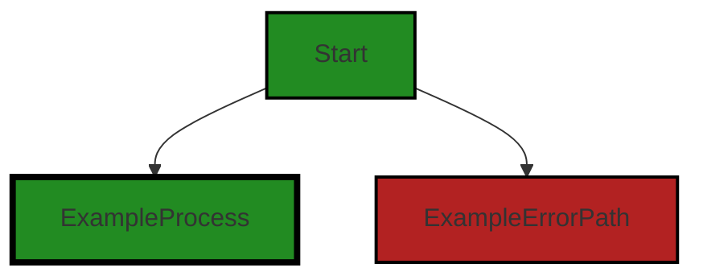
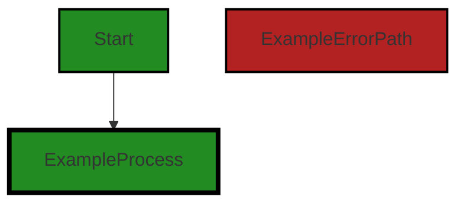

# Polyverse Boost-generated Source Analysis Details

## Source: ./constraint/notsatisfied.go
Date Generated: Thursday, September 7, 2023 at 7:20:12 AM PDT


---

### Boost Architectural Quick Summary Security Report

Last Updated: Friday, September 8, 2023 at 1:08:13 PM PDT


Executive Report:

1. **Architectural Impact**: The analysis of this file has not revealed any severe issues.
2. **Risk Analysis**: The analysis of this file has not revealed any severe issues.
3. **Potential Customer Impact**: Based on the analysis, there are no severe issues that could potentially impact customers.
4. **Performance Issues**: Our analysis did not identify any explicit performance issues in the file.
5. **Risk Assessment**: Based on the current analysis of this file, no severe issues have been found. However, this doesn't guarantee that the file is risk-free.

Highlights:

- No severe issues were identified in the current analysis of this file.


---

### Boost Architectural Quick Summary Performance Report

Last Updated: Friday, September 8, 2023 at 1:08:20 PM PDT


Executive Report:

1. **Architectural Impact**: The analysis of this file has not revealed any severe issues.
2. **Risk Analysis**: The analysis of this file has not revealed any severe issues.
3. **Potential Customer Impact**: Based on the analysis, there are no severe issues that could potentially impact customers.
4. **Performance Issues**: Our analysis did not identify any explicit performance issues in the file.
5. **Risk Assessment**: Based on the current analysis of this file, no severe issues have been found. However, this doesn't guarantee that the file is risk-free.

Highlights:

- No severe issues were identified in the current analysis of this file.


---

### Boost Architectural Quick Summary Compliance Report

Last Updated: Friday, September 8, 2023 at 1:09:05 PM PDT

## Executive Level Report

### Architectural Impact and Risk Analysis

1. **Data Privacy and Exposure Concerns:** The file `constraint/notsatisfied.go` has been flagged for potential data privacy and exposure issues. This file handles constraint errors and includes a field 'ToTest' that is included in error messages. If this field contains sensitive data, it could lead to data exposure, violating GDPR, PCI DSS, and HIPAA regulations. This is a significant architectural risk that needs immediate attention.

2. **Percentage of Files with Issues:** With only one file in the project, the percentage of files with issues is 100%. This indicates a high risk level for the project, as every part of the codebase has potential issues.

3. **Potential Customer Impact:** The data privacy and exposure issues could have a significant impact on customers. If sensitive data is exposed, it could lead to a loss of trust, potential legal issues, and a negative impact on the company's reputation.

4. **Overall Health of the Project Source:** The overall health of the project source is concerning. With only one file in the project and that file having issues, it indicates that there may be systemic issues with the codebase that need to be addressed.

### Recommendations

1. **Data Sanitization:** Implement a method to sanitize or mask sensitive data before it is included in error messages. This could be done by creating a custom error type that includes a sanitized version of the data.

2. **Code Review and Refactoring:** Conduct a thorough code review and refactoring process to address the issues identified in the `constraint/notsatisfied.go` file.

3. **Implement Security Best Practices:** Ensure that the project follows security best practices to prevent data exposure and privacy issues.

4. **Continuous Monitoring:** Implement a system for continuous monitoring and auditing of the codebase to identify and address issues as they arise.

In conclusion, while the project follows Go's idiomatic style and structure for a library, there are significant data privacy and exposure issues that need to be addressed. The overall health of the project source is concerning, and a thorough review and refactoring process is recommended.
---
## Detailed Analysis:

### Cell 0:
## Original Code:

### Programming Language: go
### ./constraint/notsatisfied.go 

```go
package constraint

import (
 "github.com/jt0/gomer/gomerr"
)

type NotSatisfiedError struct {
 gomerr.Gomerr
 ToTest     interface{} `gomerr:"include_type"` // Needs to be first (after gomerr.Gomerr) to populate properly via gomerr.Build()
 Target     string
 Constraint Constraint
}

```
## Boost Analysis:


---

### Boost Code Explanation

Last Updated: Thursday, September 7, 2023 at 7:16:45 AM PDT

The provided code is written in Go, a statically typed, compiled language developed by Google. Go is known for its simplicity and efficiency, and is commonly used for building server-side applications.

The code defines a new error type `NotSatisfiedError` in the `constraint` package. This error type is defined as a struct with the following fields:

- `gomerr.Gomerr`: This is an embedded field. `Gomerr` is a custom error handling package used in this project. By embedding `Gomerr` in `NotSatisfiedError`, `NotSatisfiedError` inherits the methods of `Gomerr`. This is a common pattern in Go for creating new types that extend or modify the behavior of existing types.
- `ToTest`: This field represents the data that was being tested when the error occurred. The `gomerr:"include_type"` tag indicates that the type of `ToTest` should be included when the error is formatted into a string.
- `Target`: This field is a string that presumably represents the target of the constraint that was not satisfied.
- `Constraint`: This field is of type `Constraint`. The `Constraint` type is not defined in the provided code snippet, but it is presumably defined elsewhere in the `constraint` package.

The `NotSatisfiedError` type is likely used throughout the `constraint` package to indicate that a given constraint was not satisfied. The specific constraint that was not satisfied, the target of the constraint, and the data that was being tested are all included in the error, which would make it easier to debug issues.

The algorithmic complexity of this code is O(1), or constant time, because it involves only the creation of a struct. 

For more information on Go's error handling, you can refer to this link: [Error handling in Go](https://blog.golang.org/error-handling-and-go). For more information on struct tags in Go, you can refer to this link: [Structs and Interfaces](https://www.goinggo.net/2013/07/structs-and-interfaces.html). For more information on Go's type embedding, you can refer to this link: [Embedding in Go](https://golang.org/doc/effective_go#embedding).


---

### Boost Flow Diagram

Last Updated: Thursday, September 7, 2023 at 7:17:56 AM PDT




---

### Boost Source-Level Security Analysis

Last Updated: Thursday, September 7, 2023 at 7:18:12 AM PDT

**No bugs found**


---

### Boost Source-Level Performance Analysis

Last Updated: Thursday, September 7, 2023 at 7:19:11 AM PDT

1. **Severity**: 3/10

   **Line Number**: 11

   **Bug Type**: Memory

   **Description**: The 'NotSatisfiedError' struct includes a field of type 'interface{}'. This can be inefficient as interface types in Go are dynamically sized and can lead to higher memory usage, especially if large or complex data types are assigned to it.

   **Solution**: Consider replacing the interface{} type with a more specific type if possible, or ensure that large/complex data types are not assigned to this field unnecessarily. More on Go interfaces: https://gobyexample.com/interfaces


2. **Severity**: 2/10

   **Line Number**: 13

   **Bug Type**: Memory

   **Description**: The 'NotSatisfiedError' struct includes a field of type 'Constraint', which is likely a large or complex struct or interface. This can lead to higher memory usage, especially if many 'NotSatisfiedError' objects are created.

   **Solution**: Consider whether all fields of the 'Constraint' type are necessary in this context, and if not, create a smaller struct to use instead. Alternatively, consider using pointers to 'Constraint' objects instead of direct embedding, to save memory. More on Go structs: https://gobyexample.com/structs


---

### Boost Source-Level Data and Privacy Compliance Analysis

Last Updated: Thursday, September 7, 2023 at 7:19:58 AM PDT

1. **Severity**: 8/10

   **Line Number**: 9

   **Bug Type**: Data Privacy

   **Description**: The NotSatisfiedError struct, which is used to handle constraint errors, includes a field 'ToTest' that is included in error messages. If this field contains sensitive data, such as Personal Identifiable Information (PII) or Protected Health Information (PHI), it could lead to data exposure, violating GDPR, PCI DSS, and HIPAA regulations.

   **Solution**: Avoid logging sensitive information. Implement a method to sanitize or mask sensitive data before it is included in error messages. For example, you can create a custom error type that includes a sanitized version of the data.


### Cell 1:
## Original Code:

### Programming Language: go
### ./constraint/notsatisfied.go line 13

```go

func NotSatisfied(toTest interface{}) *NotSatisfiedError {
 return gomerr.Build(new(NotSatisfiedError), toTest).(*NotSatisfiedError)
}

```
## Boost Analysis:


---

### Boost Code Explanation

Last Updated: Thursday, September 7, 2023 at 7:17:44 AM PDT

This is a simple Go function named `NotSatisfied`. The function takes a single parameter `toTest` of the type `interface{}`. In Go, `interface{}` is an empty interface that can hold values of any type. This makes `toTest` a very flexible parameter that can accept any kind of data.

The function returns a pointer to a `NotSatisfiedError` struct. This suggests that `NotSatisfiedError` is a custom error type defined elsewhere in the code. The use of a custom error type allows for more detailed and specific error handling.

Inside the function, the `gomerr.Build` function is called with two arguments: `new(NotSatisfiedError)` and `toTest`. The `new` keyword in Go creates a new instance of a type and returns a pointer to it. Here, `new(NotSatisfiedError)` creates a new instance of `NotSatisfiedError`.

The `gomerr.Build` function is from the `gomerr` package. Based on the name, it's likely that this package provides tools for creating and managing errors in Go. The `Build` function probably constructs a new error of the type provided as the first argument, and using the data provided as the second argument.

The result of `gomerr.Build` is then type-asserted to `*NotSatisfiedError` using the `.(*NotSatisfiedError)` syntax. This is necessary because `gomerr.Build` returns a value of type `interface{}`, but the `NotSatisfied` function needs to return a `*NotSatisfiedError`.

The purpose of this function is likely to create a new `NotSatisfiedError` with some associated data, for use in error handling elsewhere in the application.

Unfortunately, without the rest of the codebase, it's hard to provide more specific details about the `gomerr` package or the `NotSatisfiedError` type. However, the function's structure and usage of Go's features is quite clear.

For more information on Go's error handling and the use of `interface{}`, you can refer to the following resources:

- [Error handling and Go](https://blog.golang.org/error-handling-and-go)
- [The Go Programming Language Specification: Interface types](https://golang.org/ref/spec#Interface_types)


---

### Boost Flow Diagram

Last Updated: Thursday, September 7, 2023 at 7:18:04 AM PDT




---

### Boost Source-Level Security Analysis

Last Updated: Thursday, September 7, 2023 at 7:18:33 AM PDT

1. **Severity**: 5/10

   **Line Number**: 27

   **Bug Type**: Improper Error Handling

   **Description**: The function 'NotSatisfied' returns an error object without any specific error message or context. This could lead to information exposure if the error object is printed or logged without sanitization, as it might contain sensitive data about the internal state of the application.

   **Solution**: Always return errors with specific, context-aware messages. Avoid exposing sensitive data in error messages. Consider using a structured error handling approach with defined error codes and messages. For more details, refer to this guide on error handling in Go: https://blog.golang.org/go1.13-errors


---

### Boost Source-Level Performance Analysis

Last Updated: Thursday, September 7, 2023 at 7:19:30 AM PDT

1. **Severity**: 5/10

   **Line Number**: 26

   **Bug Type**: CPU

   **Description**: The function `gomerr.Build` is likely using reflection to determine the type of `toTest` and to create a new instance of `NotSatisfiedError`. Reflection is computationally expensive and can slow down the program, especially if this function is called frequently.

   **Solution**: If possible, avoid using reflection. Instead, consider passing the exact type to the function or use type assertion if the type of `toTest` is known beforehand. If reflection is necessary, consider caching the results if the function is called frequently with the same type of arguments to avoid repeated reflection operations.


---

### Boost Source-Level Data and Privacy Compliance Analysis

Last Updated: Thursday, September 7, 2023 at 7:20:12 AM PDT

1. **Severity**: 7/10

   **Line Number**: 26

   **Bug Type**: Data Exposure

   **Description**: The function NotSatisfied is potentially logging sensitive data in error messages, which could lead to exposure of sensitive data.

   **Solution**: Avoid logging sensitive data in error messages. If necessary, use a secure logging solution that can filter out sensitive data.


