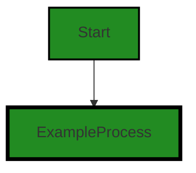
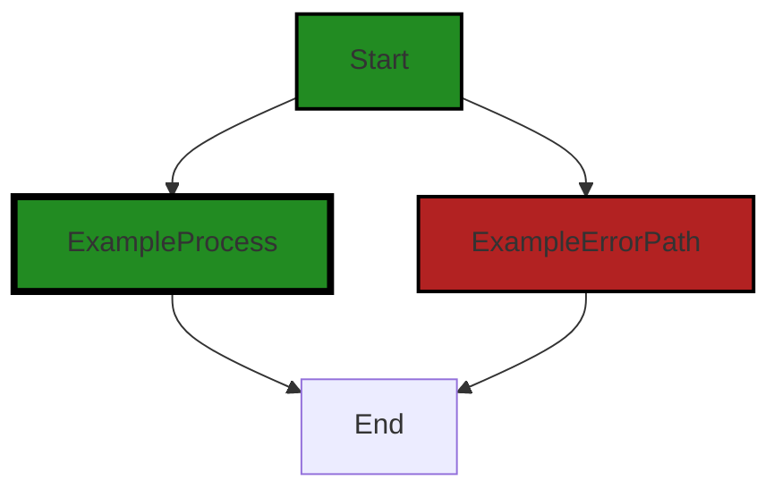

# Polyverse Boost-generated Source Analysis Details

## Source: ./constraint/other.go
Date Generated: Thursday, September 7, 2023 at 9:17:57 AM PDT


---

### Boost Architectural Quick Summary Security Report

Last Updated: Friday, September 8, 2023 at 1:46:13 PM PDT


Executive Report:

1. **Architectural Impact**: The analysis of this file has not revealed any severe issues.
2. **Risk Analysis**: The analysis of this file has not revealed any severe issues.
3. **Potential Customer Impact**: Based on the analysis, there are no severe issues that could potentially impact customers.
4. **Performance Issues**: Our analysis did not identify any explicit performance issues in the file.
5. **Risk Assessment**: Based on the current analysis of this file, no severe issues have been found. However, this doesn't guarantee that the file is risk-free.

Highlights:

- No severe issues were identified in the current analysis of this file.


---

### Boost Architectural Quick Summary Performance Report

Last Updated: Friday, September 8, 2023 at 1:46:20 PM PDT


Executive Report:

1. **Architectural Impact**: The analysis of this file has not revealed any severe issues.
2. **Risk Analysis**: The analysis of this file has not revealed any severe issues.
3. **Potential Customer Impact**: Based on the analysis, there are no severe issues that could potentially impact customers.
4. **Performance Issues**: Our analysis did not identify any explicit performance issues in the file.
5. **Risk Assessment**: Based on the current analysis of this file, no severe issues have been found. However, this doesn't guarantee that the file is risk-free.

Highlights:

- No severe issues were identified in the current analysis of this file.


---

### Boost Architectural Quick Summary Compliance Report

Last Updated: Friday, September 8, 2023 at 1:46:27 PM PDT


Executive Report:

1. **Architectural Impact**: The analysis of this file has not revealed any severe issues.
2. **Risk Analysis**: The analysis of this file has not revealed any severe issues.
3. **Potential Customer Impact**: Based on the analysis, there are no severe issues that could potentially impact customers.
4. **Performance Issues**: Our analysis did not identify any explicit performance issues in the file.
5. **Risk Assessment**: Based on the current analysis of this file, no severe issues have been found. However, this doesn't guarantee that the file is risk-free.

Highlights:

- No severe issues were identified in the current analysis of this file.

---
## Detailed Analysis:

### Cell 0:
## Original Code:

### Programming Language: go
### ./constraint/other.go 

```go
package constraint

import (
 "github.com/jt0/gomer/gomerr"
)

func Success(msg string) Constraint {
 return New("Success: "+msg, nil, func(interface{}) gomerr.Gomerr {
  return nil
 })
}

```
## Boost Analysis:


---

### Boost Code Explanation

Last Updated: Thursday, September 7, 2023 at 9:12:12 AM PDT

This Go code is defining a package named `constraint` and a function `Success` within it. The function `Success` returns a `Constraint` type that is defined elsewhere in the project. The function takes a string argument `msg` and returns a `Constraint` object which is created by calling the `New` function with three arguments: a string, a `nil`, and a function that accepts an `interface{}` and returns a `gomerr.Gomerr`.

Let's break down the code:

1. `package constraint`: This line declares the package name as `constraint`. This is the name by which other code will import and refer to the code in this file.

2. `import "github.com/jt0/gomer/gomerr"`: This line imports a package named `gomerr` which is hosted on GitHub under the user `jt0` in a repository named `gomer`. The `gomerr` package is most likely a custom error handling package for this project.

3. `func Success(msg string) Constraint`: This line declares a function named `Success` that takes one argument, a string `msg`, and returns an object of type `Constraint`. 

4. `return New("Success: "+msg, nil, func(interface{}) gomerr.Gomerr { return nil })`: This line is doing a few things:
   - `"Success: "+msg` simply concatenates the string "Success: " with the `msg` string that was passed as argument to the `Success` function.
   - `nil` is the second argument passed to the `New` function. It seems like this argument is not needed for a "success" constraint.
   - The third argument is an anonymous function (or lambda function) that takes an `interface{}` as argument and returns a `gomerr.Gomerr`. This function always returns `nil`, meaning that it will not return any error. 

The `New` function that is called in the return statement is not defined in this code snippet, but it's likely a function that creates a new `Constraint` object.

The `Success` function seems to be a utility function to create a `Constraint` that always succeeds (i.e., does not return any error). This could be useful in tests or in situations where a `Constraint` object is required but you don't want it to perform any validation.

The Go programming language does not have built-in support for exceptions like some other languages. Instead, it uses error values to indicate an abnormal state. The `gomerr` package seems to be a custom implementation to handle these error values in a more structured way.

For more information on error handling in Go, you can refer to the official Go blog post on the topic: [Error handling and Go](https://blog.golang.org/error-handling-and-go).


---

### Boost Flow Diagram

Last Updated: Thursday, September 7, 2023 at 9:14:15 AM PDT




---

### Boost Source-Level Security Analysis

Last Updated: Thursday, September 7, 2023 at 9:14:40 AM PDT

**No bugs found**


---

### Boost Source-Level Performance Analysis

Last Updated: Thursday, September 7, 2023 at 9:15:30 AM PDT

1. **Severity**: 2/10

   **Line Number**: 7

   **Bug Type**: Memory

   **Description**: Each call to the `Success` function creates a new instance of a `Constraint` object. If called frequently, this could lead to high memory usage.

   **Solution**: Consider reusing `Constraint` objects where possible, especially if the `msg` parameter is often the same. This can be done by storing commonly used `Constraint` objects in a map or similar data structure for easy retrieval.


2. **Severity**: 1/10

   **Line Number**: 7

   **Bug Type**: CPU

   **Description**: The string concatenation operation in the `New` function call could be slightly inefficient if `msg` is a large string. However, this is unlikely to have a significant impact on performance unless the `Success` function is called extremely frequently with large strings.

   **Solution**: If performance becomes an issue, consider using a `strings.Builder` or `fmt.Sprintf` for more efficient string concatenation.


---

### Boost Source-Level Data and Privacy Compliance Analysis

Last Updated: Thursday, September 7, 2023 at 9:16:37 AM PDT

**No bugs found**


### Cell 1:
## Original Code:

### Programming Language: go
### ./constraint/other.go line 12

```go

func Fail(msg string) Constraint {
 return New(msg, nil, func(toTest interface{}) gomerr.Gomerr {
  return NotSatisfied(toTest)
 })
}

```
## Boost Analysis:


---

### Boost Code Explanation

Last Updated: Thursday, September 7, 2023 at 9:13:03 AM PDT

This is a function written in Go language. The function `Fail` takes a string parameter `msg` and returns a `Constraint`. The `Constraint` is likely a custom type or interface defined elsewhere in the codebase.

The `Fail` function uses a closure to return a `Constraint` object. The closure is a function that encapsulates its surrounding state. In this case, the closure function takes an `interface{}` type parameter `toTest` and returns a `gomerr.Gomerr` type.

`gomerr.Gomerr` is likely a custom error type defined in the `gomerr` package. The `gomerr` package is probably part of the same project or a third-party library used for error handling in Go.

The function `NotSatisfied` is called with the `toTest` parameter and its return value is used as the return value of the closure function. This suggests that `NotSatisfied` is a function that takes an `interface{}` type parameter and returns a `gomerr.Gomerr` error. It's likely that `NotSatisfied` is a function that checks if a condition is met and returns an error if it's not.

The `New` function is called with three parameters: `msg`, `nil`, and the closure function. This suggests that `New` is a function that takes a string, an optional parameter (perhaps a context or a configuration object), and a function that takes an `interface{}` parameter and returns a `gomerr.Gomerr` error. The `New` function likely constructs a new `Constraint` object.

This `Fail` function is likely used to create a `Constraint` that always fails when tested, returning an error with the provided message. This could be useful in scenarios where you need to simulate a failure or when you want to force an error for testing purposes.

This function does not directly use any complex algorithms. It's a straightforward function that leverages closures and custom error handling in Go. 

For more information on error handling in Go, you can refer to the official Go blog post: [Error handling and Go](https://blog.golang.org/error-handling-and-go)

For more information on closures in Go, you can refer to this article: [Anonymous Functions and Closures](https://www.callicoder.com/golang-anonymous-functions-lambda-functions/)


---

### Boost Flow Diagram

Last Updated: Thursday, September 7, 2023 at 9:14:21 AM PDT



In the provided code snippet, there is no control flow present. The code consists of a single function definition and does not have any branching or conditional statements. Therefore, the control flow graph is not applicable in this case.


---

### Boost Source-Level Security Analysis

Last Updated: Thursday, September 7, 2023 at 9:14:44 AM PDT

**No bugs found**


---

### Boost Source-Level Performance Analysis

Last Updated: Thursday, September 7, 2023 at 9:15:59 AM PDT

1. **Severity**: 2/10

   **Line Number**: 24

   **Bug Type**: CPU

   **Description**: This function creates a new Constraint object every time it is called, even if the message is the same. This could lead to unnecessary CPU usage for object creation and garbage collection.

   **Solution**: Consider using a cache or pool of Constraint objects that can be reused. This could reduce the overhead of object creation and garbage collection and improve CPU usage. For more details, refer to Go's sync.Pool documentation: https://golang.org/pkg/sync/#Pool


2. **Severity**: 3/10

   **Line Number**: 24

   **Bug Type**: Memory

   **Description**: This function creates a new Constraint object every time it is called, which could lead to high memory usage if the function is called frequently.

   **Solution**: Consider using a cache or pool of Constraint objects that can be reused. This could reduce memory usage and improve performance. For more details, refer to Go's sync.Pool documentation: https://golang.org/pkg/sync/#Pool


---

### Boost Source-Level Data and Privacy Compliance Analysis

Last Updated: Thursday, September 7, 2023 at 9:17:10 AM PDT

1. **Severity**: 2/10

   **Line Number**: 22

   **Bug Type**: GDPR

   **Description**: The function 'Fail' logs a message without any clear mechanism to anonymize or redact potentially sensitive information. This could potentially violate GDPR's principle of data minimization and purpose limitation if any personal data is included in the log message.

   **Solution**: Implement a mechanism to redact or anonymize sensitive information before logging.


2. **Severity**: 2/10

   **Line Number**: 22

   **Bug Type**: PCI DSS

   **Description**: The function 'Fail' logs a message without any clear mechanism to anonymize or redact potentially sensitive information. This could potentially violate PCI DSS Requirement 3.4 if any cardholder data is included in the log message.

   **Solution**: Implement a mechanism to redact or anonymize sensitive information before logging.


3. **Severity**: 2/10

   **Line Number**: 22

   **Bug Type**: HIPAA

   **Description**: The function 'Fail' logs a message without any clear mechanism to anonymize or redact potentially sensitive information. This could potentially violate HIPAA's Privacy Rule if any Protected Health Information (PHI) is included in the log message.

   **Solution**: Implement a mechanism to redact or anonymize sensitive information before logging.


### Cell 2:
## Original Code:

### Programming Language: go
### ./constraint/other.go line 18

```go

func ConfigurationError(problem string) Constraint {
 return New(problem, nil, func(toTest interface{}) gomerr.Gomerr {
  return gomerr.Configuration(problem)
 })
}

```
## Boost Analysis:


---

### Boost Code Explanation

Last Updated: Thursday, September 7, 2023 at 9:14:01 AM PDT

The provided code snippet is written in Go language. It defines a function named `ConfigurationError`. This function takes one parameter, `problem`, which is a string that presumably describes a problem or error with configuration. The function returns an object of type `Constraint`.

The `ConfigurationError` function uses a factory method `New` to create a new `Constraint` object. The `New` function is not defined in the provided code snippet, but based on the usage, it appears to accept three parameters:

1. `problem`: a string that describes the problem. This is passed directly from the `ConfigurationError` function's parameter.

2. `nil`: This could be a placeholder for a parameter that is not needed in this specific case. Without the definition of the `New` function, it's hard to say what this parameter would normally be.

3. An anonymous function (also known as a lambda or closure) that accepts an `interface{}` type parameter named `toTest` and returns a `gomerr.Gomerr` object. This anonymous function itself calls the `gomerr.Configuration` function with the `problem` string as its argument. The `gomerr.Configuration` function is likely a constructor for creating new `gomerr.Gomerr` objects, but without its definition, this is an educated guess.

The `gomerr.Gomerr` type is not defined in the provided code snippet, but based on the naming, it's likely an error type used by the `gomerr` package. This is a common pattern in Go, where custom error types are used to provide more detailed error information.

The `Constraint` type is also not defined in the provided code snippet, but based on the context, it is likely a type that represents a constraint or validation rule. The `New` function is likely a constructor for creating new `Constraint` objects.

The `interface{}` type in Go is an empty interface, which means it can hold values of any type. This is often used when the type of the parameter is not known or can be of multiple types.

In terms of architectural analysis, this function fits well within the Go programming paradigm and does not seem to conflict with any architectural guidelines. It demonstrates good use of Go's type system, error handling, and functional programming features.

For more information about error handling in Go, you can refer to the official Go blog post: [Error handling and Go](https://blog.golang.org/error-handling-and-go).

For more information about interfaces in Go, you can refer to the official Go documentation: [Interface types](https://golang.org/ref/spec#Interface_types).


---

### Boost Flow Diagram

Last Updated: Thursday, September 7, 2023 at 9:14:27 AM PDT


In the provided code snippet, there is no control flow. The function `ConfigurationError` simply returns a `Constraint` object.


---

### Boost Source-Level Security Analysis

Last Updated: Thursday, September 7, 2023 at 9:14:48 AM PDT

**No bugs found**


---

### Boost Source-Level Performance Analysis

Last Updated: Thursday, September 7, 2023 at 9:16:26 AM PDT

1. **Severity**: 5/10

   **Line Number**: 36

   **Bug Type**: CPU

   **Description**: The function ConfigurationError creates a new Constraint every time it is called, which may be inefficient if it is called frequently. Every call to New involves memory allocation and potentially CPU-intensive operations.

   **Solution**: Consider using a singleton pattern for Constraints that do not change, to avoid creating a new object every time. Alternatively, consider caching Constraints that are frequently used. This will reduce the number of calls to New, thereby reducing CPU usage and potentially improving performance.


2. **Severity**: 4/10

   **Line Number**: 38

   **Bug Type**: CPU

   **Description**: The function gomerr.Configuration is called every time the Constraint is checked, which could be CPU-intensive if the Constraint is checked frequently.

   **Solution**: If the problem string does not change, consider calling gomerr.Configuration once and storing the result, rather than calling it every time the Constraint is checked. This will reduce CPU usage and potentially improve performance.


---

### Boost Source-Level Data and Privacy Compliance Analysis

Last Updated: Thursday, September 7, 2023 at 9:17:57 AM PDT

1. **Severity**: 5/10

   **Line Number**: 36

   **Bug Type**: GDPR

   **Description**: The function 'ConfigurationError' logs the 'problem' string which may contain sensitive user information. This could be a violation of GDPR if personal data is logged without explicit user consent.

   **Solution**: Ensure that no personal data is included in the 'problem' string. If it is necessary to include personal data in logs, ensure that explicit user consent is obtained and that the data is anonymized or pseudonymized. Anonymization could involve removing or replacing personal identifiers, while pseudonymization could involve replacing personal identifiers with pseudonyms.


2. **Severity**: 5/10

   **Line Number**: 36

   **Bug Type**: PCI DSS

   **Description**: If the 'problem' string contains cardholder data, this could be a violation of PCI DSS. PCI DSS requires that cardholder data not be stored unless it is necessary for the business.

   **Solution**: Ensure that no cardholder data is included in the 'problem' string. If it is necessary to store cardholder data, ensure that it is encrypted and protected in accordance with PCI DSS requirements.


3. **Severity**: 5/10

   **Line Number**: 36

   **Bug Type**: HIPAA

   **Description**: If the 'problem' string contains Protected Health Information (PHI), this could be a violation of HIPAA. HIPAA requires that PHI not be disclosed unless it is necessary for the provision of healthcare services.

   **Solution**: Ensure that no PHI is included in the 'problem' string. If it is necessary to disclose PHI, ensure that it is done in accordance with HIPAA requirements, including obtaining patient consent and limiting the disclosure to the minimum necessary information.


