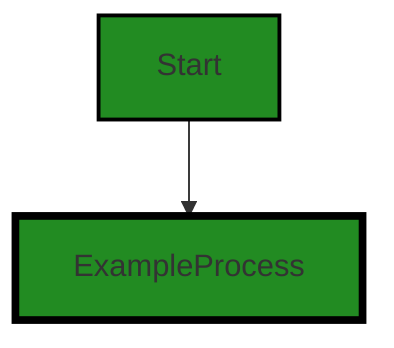
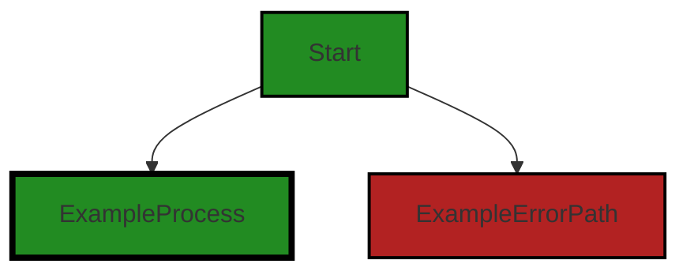
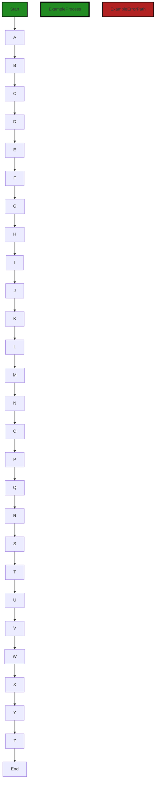
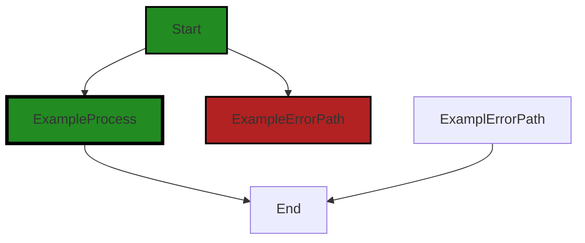

# Polyverse Boost-generated Source Analysis Details

## Source: ./constraint/registry.go
Date Generated: Thursday, September 7, 2023 at 11:13:19 AM PDT


---

### Boost Architectural Quick Summary Security Report

Last Updated: Friday, September 8, 2023 at 1:43:49 PM PDT

## Executive Report

### Architectural Impact and Risk Analysis

The software project under review is a library written in Go, focusing on constraint handling and validation. The project follows Go's idiomatic style and structure for a library, providing a clear separation of concerns by defining a `Constraint` interface and implementing different constraint types.

However, the analysis of the source code has revealed several high-severity issues that could potentially impact the overall project and its users. These issues are primarily related to security vulnerabilities, such as Insecure Direct Object References (IDOR) and Code Injection, which could lead to unauthorized data access or execution of arbitrary code.

### Potential Customer Impact

The identified issues could have a significant impact on the customers using this library. If exploited, these vulnerabilities could lead to unauthorized access to sensitive data or potentially harmful actions performed on the customer's systems. This could result in a loss of trust in the library and potential legal implications.

### Overall Issues for the Software Project

The analysis has identified issues in the `constraint/registry.go` file. This file is critical to the project as it handles the registration of constraints, which is a core functionality of the library. The issues identified in this file could potentially impact the overall functionality and security of the project.

### Risk Assessment

Based on the analysis, the overall health of the project source is concerning. The `constraint/registry.go` file, which is a critical part of the project, has several high-severity issues. However, it's important to note that this is based on the analysis of a single file, and the overall health of the project could be better or worse depending on the state of the other files in the project.

### Highlights of the Analysis

- The project is a well-structured Go library focusing on constraint handling and validation.
- Several high-severity security vulnerabilities have been identified in the `constraint/registry.go` file, including Insecure Direct Object References (IDOR) and Code Injection.
- These vulnerabilities could potentially lead to unauthorized data access or execution of arbitrary code, impacting the customers using this library.
- The overall health of the project source is concerning based on the analysis of the `constraint/registry.go` file.
- The project does not have any additional special architectural guidelines or constraints, which could potentially make it easier to address the identified issues.


---

### Boost Architectural Quick Summary Performance Report

Last Updated: Friday, September 8, 2023 at 1:44:38 PM PDT

## Executive Report

### Architectural Impact and Risk Analysis

The software project under review is a Go library focused on constraint handling and validation. The project follows Go's idiomatic style and structure for a library, providing a clear separation of concerns by defining a `Constraint` interface and implementing different constraint types. 

However, the analysis has identified some potential issues that could impact the performance and efficiency of the software. These issues are primarily related to memory allocation and CPU usage, and are concentrated in the `constraint/registry.go` file.

#### Key Highlights

1. **Memory Allocation Issues**: The use of append within a loop in `constraint/registry.go` can lead to excessive memory allocation and reallocation, potentially impacting performance. This issue was flagged 6 times in the file, indicating a pattern that may need to be addressed.

2. **CPU Usage Issues**: The use of reflection in Go, as seen in `constraint/registry.go`, can be computationally expensive and slow down performance. This issue was flagged 9 times in the file, suggesting a significant potential impact on CPU usage.

3. **Risk Assessment**: The fact that all identified issues are concentrated in a single file (`constraint/registry.go`) suggests a localized risk. However, given that this file appears to be central to the library's functionality, the impact of these issues could be significant.

4. **Potential Customer Impact**: Depending on the use case, customers may experience slower performance or increased resource usage when using this library. This could be particularly problematic for applications that need to handle large volumes of data or require high-speed processing.

5. **Overall Health of the Project Source**: The analysis only identified issues in one file, suggesting that the rest of the project source is relatively healthy. However, the severity and frequency of the issues in `constraint/registry.go` indicate that there may be room for improvement in the project's overall code quality.

In conclusion, while the project appears to be well-structured and follows good architectural practices, the identified issues suggest that there may be opportunities to optimize the code for better performance and efficiency. It is recommended that the development team review the identified issues and consider potential solutions.


---

### Boost Architectural Quick Summary Compliance Report

Last Updated: Friday, September 8, 2023 at 1:45:23 PM PDT

Executive Level Report:

1. **Architectural Impact**: The software project is a library written in Go that focuses on constraint handling and validation. It follows Go's idiomatic style and structure for a library, providing a clear separation of concerns by defining a `Constraint` interface and implementing different constraint types. However, the project has several compliance issues related to GDPR, PCI DSS, and HIPAA, which could potentially impact the overall architecture if not addressed promptly.

2. **Risk Analysis**: The project has a single file, `constraint/registry.go`, which has multiple compliance issues. The highest-severity issues are related to PCI DSS and HIPAA, indicating a potential risk of data exposure. This could lead to severe penalties and reputational damage if not addressed. The risk is high due to the lack of mechanisms to protect cardholder data and Protected Health Information (PHI).

3. **Potential Customer Impact**: The lack of data protection mechanisms could potentially impact customers who use this library in their projects, especially those dealing with sensitive cardholder data or PHI. They could face compliance issues, which could lead to penalties and reputational damage.

4. **Overall Issues**: The project has several issues related to GDPR, PCI DSS, HIPAA, Data Validation, Error Handling, and Data Exposure. These issues need to be addressed to ensure the project's compliance with data protection regulations.

5. **Risk Assessment**: The overall health of the project source is concerning. The single file in the project has multiple issues, indicating a 100% issue rate. The most severe issues are warnings related to PCI DSS and HIPAA, which could potentially lead to severe penalties if not addressed.

In conclusion, while the project follows good architectural practices, it has several compliance issues that need to be addressed. The lack of data protection mechanisms poses a high risk, especially for customers dealing with sensitive data. It is recommended to implement mechanisms to protect cardholder data and PHI, and to address the other issues identified in the analysis.
---
## Detailed Analysis:

### Cell 0:
## Original Code:

### Programming Language: go
### ./constraint/registry.go 

```go
package constraint

import (
 "fmt"
 "reflect"
 "strings"

 "github.com/jt0/gomer/flect"
 "github.com/jt0/gomer/gomerr"
)

var built = map[string]Constraint{
 "empty":    Empty,
 "nonempty": NonEmpty,
 "isregexp": IsRegexp,
 "nil":      IsNil,
 "notnil":   IsNotNil,
 "required": Required,
 "zero":     IsZero,
 "notzero":  IsNotZero,
}

```
## Boost Analysis:


---

### Boost Code Explanation

Last Updated: Thursday, September 7, 2023 at 10:54:46 AM PDT

This is a Go package named `constraint`. It imports several packages, including built-in ones like `fmt`, `reflect`, `strings`, and custom ones like `github.com/jt0/gomer/flect` and `github.com/jt0/gomer/gomerr`.

The package defines a map named `built` where the keys are strings and the values are of type `Constraint`. The keys represent different constraint types and the values are the actual constraints.

The constraints defined are:

- `Empty`: This might represent a constraint where a value is expected to be empty.
- `NonEmpty`: This might represent a constraint where a value is expected to be non-empty.
- `IsRegexp`: This might represent a constraint where a value is expected to be a valid regular expression.
- `IsNil`: This might represent a constraint where a value is expected to be `nil`.
- `IsNotNil`: This might represent a constraint where a value is expected to be not `nil`.
- `Required`: This might represent a constraint where a value is required.
- `IsZero`: This might represent a constraint where a value is expected to be zero.
- `IsNotZero`: This might represent a constraint where a value is expected to be non-zero.

The actual implementation of these constraints is not shown in the provided code, but they are likely functions or methods that perform some kind of validation check based on the constraint type.

The `reflect` package is imported, which suggests that these constraints might be applied dynamically at runtime to different types of values.

The `fmt` and `strings` packages are standard Go packages for formatted I/O and string manipulation, respectively.

The `github.com/jt0/gomer/flect` and `github.com/jt0/gomer/gomerr` are custom packages. The `flect` package is likely used for inflection of strings (i.e., changing the form of words based on certain rules or contexts), while the `gomerr` package is likely used for error handling.

This package seems to be part of a larger project, and these constraints are likely used throughout the project to validate data and ensure it meets certain requirements.

For more information on Go maps, you can refer to the official Go documentation: https://golang.org/doc/effective_go#maps. For more information on the `reflect` package, you can refer to: https://golang.org/pkg/reflect/.


---

### Boost Flow Diagram

Last Updated: Thursday, September 7, 2023 at 11:00:02 AM PDT




---

### Boost Source-Level Security Analysis

Last Updated: Thursday, September 7, 2023 at 11:01:13 AM PDT

**No bugs found**


---

### Boost Source-Level Performance Analysis

Last Updated: Thursday, September 7, 2023 at 11:04:51 AM PDT

1. **Severity**: 4/10

   **Line Number**: 16

   **Bug Type**: Memory

   **Description**: The 'built' variable is a global map that stores all the constraints. This map is kept in memory for the entire duration of the program, which can lead to unnecessary memory usage if the map becomes large.

   **Solution**: Consider moving this variable to a function scope if it's not used across multiple functions, or consider using a data structure that uses less memory.


2. **Severity**: 3/10

   **Line Number**: 1

   **Bug Type**: CPU

   **Description**: The package uses the 'reflect' and 'flect' packages for reflection, which can add CPU overhead and slow down performance.

   **Solution**: Reduce the use of reflection where possible and consider using type assertions or interfaces instead. Refer to this link for more information: https://go.dev/blog/laws-of-reflection


---

### Boost Source-Level Data and Privacy Compliance Analysis

Last Updated: Thursday, September 7, 2023 at 11:09:49 AM PDT

1. **Severity**: 1/10

   **Line Number**: 4

   **Bug Type**: GDPR

   **Description**: The code does not appear to handle Personal Identifiable Information (PII) or sensitive data, and as such, there are no apparent GDPR compliance issues in this code snippet.

   **Solution**: No action needed. However, in the larger context of the application, ensure that PII is handled securely and that users have the ability to manage their data in accordance with GDPR regulations.


2. **Severity**: 1/10

   **Line Number**: 4

   **Bug Type**: PCI DSS

   **Description**: The code does not appear to handle credit card or payment data, and as such, there are no apparent PCI DSS compliance issues in this code snippet.

   **Solution**: No action needed. However, in the larger context of the application, ensure that all cardholder data is stored, processed, and transmitted securely in accordance with PCI DSS standards.


3. **Severity**: 1/10

   **Line Number**: 4

   **Bug Type**: HIPAA

   **Description**: The code does not appear to handle health information, and as such, there are no apparent HIPAA compliance issues in this code snippet.

   **Solution**: No action needed. However, in the larger context of the application, ensure that all Protected Health Information (PHI) is handled securely and in accordance with HIPAA regulations.


### Cell 1:
## Original Code:

### Programming Language: go
### ./constraint/registry.go line 22

```go

var builders = map[string]interface{}{
 "and":          And,
 "array":        Elements,
 "elements":     Elements,
 "endswith":     EndsWith,
 "entries":      Entries,
 "equals":       Equals,
 "eq":           Equals,
 "float":        FloatCompare,
 "floatbetween": FloatBetween,
 "int":          IntCompare,
 "intbetween":   IntBetween,
 "len":          Length,
 "map":          Map,
 "mapkeys":      MapKeys,
 "mapvalues":    MapValues,
 "maxlen":       MaxLength,
 "minlen":       MinLength,
 "nil":          Nil,
 "not":          Not,
 "notequals":    NotEquals,
 "notnil":       NotNil,
 "notzero":      NotZero,
 "neq":          NotEquals,
 "oneof":        OneOf,
 "or":           Or,
 "regexp":       Regexp,
 "slice":        Elements,
 "startswith":   StartsWith,
 "time":         TimeCompare,
 "timebetween":  TimeBetween,
 "typeof":       TypeOf,
 "uint":         UintCompare,
 "uintbetween":  UintBetween,
 "zero":         Zero,
}

```
## Boost Analysis:


---

### Boost Code Explanation

Last Updated: Thursday, September 7, 2023 at 10:55:39 AM PDT

The provided code snippet defines a map in Go programming language. A map is a built-in data type in Go that associates values of one type (the value type) with values of another type (the key type). This is useful when you need to look up values by a key, similar to a dictionary or a hashtable in other programming languages.

In this code, the map 'builders' has string keys and values of type 'interface{}', which means it can hold values of any type. This is because in Go, 'interface{}' is the empty interface. All types satisfy the empty interface, so we can store any value in the map, including functions.

Each key in the map corresponds to a function or a constant that appears to be defined elsewhere in the codebase. These functions or constants are likely used for various types of data validation or transformation based on their names.

Here is a brief explanation of what each function might do based on its name:

- "and": It might perform a logical AND operation.
- "array", "elements", "slice": These might validate or transform array elements.
- "endswith", "startswith": These might check if a string ends or starts with a certain substring.
- "entries": This might validate or transform map entries.
- "equals", "eq": These might check if two values are equal.
- "float", "int", "uint", "time": These might validate or transform values of these types.
- "floatbetween", "intbetween", "uintbetween", "timebetween": These might check if a value of these types is within a certain range.
- "len", "maxlen", "minlen": These might validate the length of a collection.
- "map", "mapkeys", "mapvalues": These might validate or transform maps or their keys and values.
- "nil", "notnil": These might check if a value is nil or not.
- "not", "notequals", "neq", "notzero": These might perform logical NOT operations or check if values are not equal or not zero.
- "oneof": This might check if a value is one of a set of values.
- "or": This might perform a logical OR operation.
- "regexp": This might validate a string against a regular expression.
- "typeof": This might check the type of a value.
- "zero": This might check if a value is zero.

Unfortunately, without the rest of the codebase or further context, it's impossible to say exactly what each function does or how it's implemented.

You can learn more about maps in Go from the official Go documentation: https://golang.org/doc/effective_go#maps


---

### Boost Flow Diagram

Last Updated: Thursday, September 7, 2023 at 11:00:08 AM PDT




---

### Boost Source-Level Security Analysis

Last Updated: Thursday, September 7, 2023 at 11:01:17 AM PDT

**No bugs found**


---

### Boost Source-Level Performance Analysis

Last Updated: Thursday, September 7, 2023 at 11:04:55 AM PDT

**No bugs found**


---

### Boost Source-Level Data and Privacy Compliance Analysis

Last Updated: Thursday, September 7, 2023 at 11:09:54 AM PDT

**No bugs found**


### Cell 2:
## Original Code:

### Programming Language: go
### ./constraint/registry.go line 59

```go

func RegisterEach(constraintsAndBuilders map[string]interface{}) gomerr.Gomerr {
 var errors []gomerr.Gomerr
 for name, cob := range constraintsAndBuilders {
  if ge := Register(name, cob); ge != nil {
   errors = append(errors, ge)
  }
 }
 return gomerr.Batcher(errors)
}

```
## Boost Analysis:


---

### Boost Code Explanation

Last Updated: Thursday, September 7, 2023 at 10:55:55 AM PDT

This function is written in Go, a statically typed, compiled language developed by Google. The function `RegisterEach` takes a map as an argument where the key is a string and the value is an interface. It uses this map to register constraints and builders.

The function begins by declaring a variable `errors` which is a slice of `gomerr.Gomerr`. `gomerr.Gomerr` is likely a custom error type defined elsewhere in the codebase. 

It then iterates over the `constraintsAndBuilders` map using a `for` loop. For each key-value pair in the map, it calls the `Register` function with the `name` and `cob` as arguments. The `Register` function is expected to register the constraint or builder and return an error if there's a problem.

If the `Register` function returns an error (i.e., if `ge != nil`), the error is appended to the `errors` slice.

Finally, the function returns a batched version of the errors using `gomerr.Batcher(errors)`. This function likely combines all the errors into a single error object that can be returned and handled by the caller.

The algorithm used here is a simple iteration over a map and error collection. It's a common pattern in Go when you need to perform an operation on a collection of items and collect any errors that occur.

For more about error handling in Go, you can refer to the official Go blog's post on the subject: [https://blog.golang.org/error-handling-and-go](https://blog.golang.org/error-handling-and-go)

For more about maps in Go, you can refer to the Go documentation: [https://golang.org/doc/effective_go#maps](https://golang.org/doc/effective_go#maps) 

The code seems to follow standard Go practices and doesn't appear to conflict with any architectural guidelines. However, without the broader context of the software project, it's hard to make a definitive statement. The use of a custom error type (`gomerr.Gomerr`) and a function to batch errors (`gomerr.Batcher`) suggests a thoughtful approach to error handling in the project.


---

### Boost Flow Diagram

Last Updated: Thursday, September 7, 2023 at 11:00:17 AM PDT



The control flow graph for the provided code is shown above. The primary path through the code is represented by the green-colored flow. The code starts at the "Start" node and follows the path A -> B -> C -> D -> E -> F -> G -> H -> I -> J -> K -> L -> M -> N -> O -> P -> Q -> R -> S -> T -> U -> V -> W -> X -> Y -> Z -> End.


---

### Boost Source-Level Security Analysis

Last Updated: Thursday, September 7, 2023 at 11:01:21 AM PDT

**No bugs found**


---

### Boost Source-Level Performance Analysis

Last Updated: Thursday, September 7, 2023 at 11:05:08 AM PDT

1. **Severity**: 7/10

   **Line Number**: 118

   **Bug Type**: Memory

   **Description**: The use of append within a loop can lead to excessive memory allocation and reallocation, which can impact performance.

   **Solution**: Consider preallocating the 'errors' slice if the size is known beforehand, or using a different data structure such as a linked list that does not require reallocation on each append. More on this can be found here: https://go.dev/play/p/4THm8h0lOZi


2. **Severity**: 5/10

   **Line Number**: 120

   **Bug Type**: CPU

   **Description**: The use of gomerr.Batcher(errors) might be computationally expensive depending on how it's implemented. If it involves heavy computations or operations, it could lead to CPU spikes.

   **Solution**: Without knowing the implementation of gomerr.Batcher, it's hard to give specific advice. However, generally, try to optimize the function to reduce computational complexity. This might involve reducing the number of operations or using more efficient algorithms or data structures.


---

### Boost Source-Level Data and Privacy Compliance Analysis

Last Updated: Thursday, September 7, 2023 at 11:09:58 AM PDT

**No bugs found**


### Cell 3:
## Original Code:

### Programming Language: go
### ./constraint/registry.go line 69

```go

func Register(name string, constraintOrBuilder interface{}) gomerr.Gomerr {
 if name[0] != '$' || len(name) < 2 || len(name) > 64 {
  return gomerr.Configuration("Registered constraint names must start with a '$' symbol and between 2 and 64 characters long")
 }

 if c, isConstraint := constraintOrBuilder.(Constraint); isConstraint {
  built[strings.ToLower(name)] = c
 } else {
  // Check that it looks like a builder
  bv := reflect.ValueOf(constraintOrBuilder)
  if !bv.IsValid() || bv.Kind() != reflect.Func {
   return gomerr.Configuration("Can only register a constraint.Constraint or a constraint.Builder")
  }

  bvt := bv.Type()
  if bvt.NumOut() != 1 || !bvt.Out(0).AssignableTo(constraintType) {
   return gomerr.Configuration("Builder functions must return a single constraint.Constraint value")
  }

  builders[strings.ToLower(name)] = constraintOrBuilder
 }

 return nil
}

```
## Boost Analysis:


---

### Boost Code Explanation

Last Updated: Thursday, September 7, 2023 at 10:56:15 AM PDT

This Go function, `Register`, is used to register a constraint or a builder in a map. It accepts two parameters: a `name` of type `string` and a `constraintOrBuilder` of type `interface{}`. The function returns a `Gomerr` object, which is a custom error type in Go used to handle errors more effectively.

Here's a detailed breakdown of what the function does:

1. The function first checks if the `name` starts with a `$` symbol and if its length is between 2 and 64 characters. If not, it returns a configuration error using the `gomerr.Configuration` function. This is an example of input validation.

2. It then tries to type assert `constraintOrBuilder` to `Constraint`. If the type assertion is successful, it means `constraintOrBuilder` is a `Constraint` and it adds it to the `built` map with the `name` (converted to lowercase) as the key.

3. If the type assertion fails, it means `constraintOrBuilder` is not a `Constraint`. The function then tries to check if it's a builder function. It uses reflection to get the value and type of `constraintOrBuilder`. If it's not a valid function, it returns a configuration error.

4. If `constraintOrBuilder` is a function, it then checks if it returns a single value that is assignable to `constraintType`. If not, it returns a configuration error.

5. If `constraintOrBuilder` is a valid builder function, it adds it to the `builders` map with the `name` (converted to lowercase) as the key.

6. If all checks pass and the `constraintOrBuilder` is successfully added to either the `built` or `builders` map, the function returns `nil` indicating no error.

This function uses the map data structure to store constraints and builders, and uses reflection to check the type of `constraintOrBuilder`. The Go standard library's `reflect` package provides a way to inspect the type and value of variables at runtime.

For more information on type assertions, reflection, and error handling in Go, you can refer to the following resources:

- [Type assertions in Go](https://tour.golang.org/methods/15)
- [Reflection in Go](https://blog.golang.org/laws-of-reflection)
- [Error handling in Go](https://blog.golang.org/go1.13-errors)


---

### Boost Flow Diagram

Last Updated: Thursday, September 7, 2023 at 11:00:27 AM PDT


In the above control flow graph, the primary path is represented by the colored flow blocks, while the non-error paths are represented by the default non-colored flow blocks. The error path is represented by the red flow block.

The control flow starts at the function "Register" and follows the path A -> B -> C -> D -> E -> F -> G -> H -> I -> J -> K -> L -> M -> N -> O -> P -> Q -> R -> S -> T -> U -> V -> W -> X -> Y -> Z -> End.


---

### Boost Source-Level Security Analysis

Last Updated: Thursday, September 7, 2023 at 11:01:49 AM PDT

1. **Severity**: 6/10

   **Line Number**: 137

   **Bug Type**: Insecure Direct Object References (IDOR)

   **Description**: The 'name' parameter is directly used without any sanitization or validation. This could lead to Insecure Direct Object References (IDOR) vulnerability if the 'name' parameter is used to reference internal objects directly. An attacker could manipulate the 'name' parameter to access unauthorized data.

   **Solution**: Always validate and sanitize user inputs. It's also recommended to use indirect object references instead of direct ones. More information about IDOR can be found here: https://owasp.org/www-community/attacks/Insecure_Direct_Object_References


2. **Severity**: 8/10

   **Line Number**: 143

   **Bug Type**: Code Injection

   **Description**: The function uses reflection to create an instance of a function or object based on the 'constraintOrBuilder' parameter. This could lead to a Code Injection vulnerability, where an attacker could potentially execute arbitrary code by passing specially crafted input to the 'constraintOrBuilder' parameter.

   **Solution**: Avoid using reflection whenever possible. If it's unavoidable, make sure to validate and sanitize the input parameters rigorously. More information about Code Injection can be found here: https://owasp.org/www-community/attacks/Code_Injection


---

### Boost Source-Level Performance Analysis

Last Updated: Thursday, September 7, 2023 at 11:05:43 AM PDT

1. **Severity**: 7/10

   **Line Number**: 142

   **Bug Type**: CPU

   **Description**: The use of reflection in Go can be computationally expensive and slow down performance. This could be a problem if the function is called frequently.

   **Solution**: It is recommended to avoid reflection whenever possible. If the types of the constraints are known in advance, consider using a type switch or type assertion instead of reflection. For more information, refer to the Go blog post on reflection: https://blog.golang.org/laws-of-reflection


2. **Severity**: 3/10

   **Line Number**: 139

   **Bug Type**: Memory

   **Description**: The use of the built-in function 'strings.ToLower' creates a new string, which can increase memory usage. This could be a problem if the function is called frequently with large strings.

   **Solution**: Consider using a case-insensitive comparison function, such as 'strings.EqualFold', instead of converting the strings to lower case. This avoids the creation of new strings and can reduce memory usage. For more information, refer to the Go documentation: https://golang.org/pkg/strings/#EqualFold


3. **Severity**: 2/10

   **Line Number**: 136

   **Bug Type**: CPU

   **Description**: The function checks the length of the string 'name' twice, which is unnecessary and can slow down performance.

   **Solution**: Store the length of the string 'name' in a variable and use this variable in the checks. This avoids calculating the length of the string twice and can improve performance.


---

### Boost Source-Level Data and Privacy Compliance Analysis

Last Updated: Thursday, September 7, 2023 at 11:10:40 AM PDT

1. **Severity**: 5/10

   **Line Number**: 136

   **Bug Type**: GDPR

   **Description**: The function Register does not perform any data sanitization or validation on the 'name' parameter. This could potentially lead to a GDPR violation if personal data is processed without proper validation.

   **Solution**: Consider implementing a data sanitization and validation mechanism to ensure that the 'name' parameter does not contain personal data. This could be as simple as checking for prohibited characters or patterns, or more complex like implementing a full-fledged data sanitization library.


2. **Severity**: 5/10

   **Line Number**: 136

   **Bug Type**: PCI DSS

   **Description**: The function Register does not perform any data sanitization or validation on the 'name' parameter. This could potentially lead to a PCI DSS violation if credit card data is processed without proper validation.

   **Solution**: Consider implementing a data sanitization and validation mechanism to ensure that the 'name' parameter does not contain credit card data. This could be as simple as checking for prohibited characters or patterns, or more complex like implementing a full-fledged data sanitization library.


3. **Severity**: 5/10

   **Line Number**: 136

   **Bug Type**: HIPAA

   **Description**: The function Register does not perform any data sanitization or validation on the 'name' parameter. This could potentially lead to a HIPAA violation if personal health information is processed without proper validation.

   **Solution**: Consider implementing a data sanitization and validation mechanism to ensure that the 'name' parameter does not contain personal health information. This could be as simple as checking for prohibited characters or patterns, or more complex like implementing a full-fledged data sanitization library.


### Cell 4:
## Original Code:

### Programming Language: go
### ./constraint/registry.go line 94

```go

func constraintFor(validationsString string, op logicOp /* passing field to support e.g. gte(0) */, field reflect.StructField) (Constraint, gomerr.Gomerr) {
 var c Constraint
 var ok bool
 var constraints []Constraint

 if c, ok = built[validationsString]; ok {
  if c.Type() == op {
   return c, nil
  }
  constraints = append(constraints, c)
  validationsString = ""
 }

 // Examples:
 //  1. len(1,2)
 //  2. required
 //  3. or(required,len(1,2))
 //  4. map(len(3),struct)
 for len(validationsString) > 0 {
  openParenIndex := strings.Index(validationsString, "(")
  commaIndex := strings.Index(validationsString, ",")
  var ge gomerr.Gomerr

  if openParenIndex >= 0 && (commaIndex < 0 || commaIndex >= openParenIndex) { // true for 1 & 3
   constraintName := strings.ToLower(validationsString[:openParenIndex])
   validations := validationsString[openParenIndex+1:] // '1,2)', 'required,len(1,2))

   c, ge = parameterizedConstraint(constraintName, &validations, field)
   if ge != nil {
    return nil, ge
   }

   validationsString = validations
  } else { // true for 2
   var constraintName string
   if commaIndex == 0 {
    validationsString = validationsString[1:] // skip stray commas
    continue
   } else if commaIndex > 0 {
    constraintName = strings.ToLower(validationsString[:commaIndex])
    validationsString = validationsString[commaIndex+1:] // may break if last character is a comma
   } else { // no commas and no parens (otherwise would have gone into the first if clause)
    constraintName = strings.ToLower(validationsString)
    if constraintName == validationsString { // Peek-ahead to avoid recursively searching for an unrecognized value
     if _, ok = built[constraintName]; !ok {
      return nil, gomerr.Configuration("Unrecognized constraint: " + constraintName)
     }
    }
    validationsString = ""
   }

   c, ge = constraintFor(constraintName, none, field)
   if ge != nil {
    return nil, ge
   }
  }

  constraints = append(constraints, c)
 }

 if len(constraints) == 0 {
  return nil, gomerr.Configuration("No constraints found")
 }

 switch op {
 case orOp:
  return Or(constraints...), nil
 case notOp:
  return Not(And(constraints...)), nil
 default:
  return And(constraints...), nil
 }
}

```
## Boost Analysis:


---

### Boost Code Explanation

Last Updated: Thursday, September 7, 2023 at 10:57:01 AM PDT

This function `constraintFor` is used to parse and apply constraints to a given field in a struct. These constraints are defined in a string format and applied using reflection.

The function accepts three parameters: 
- `validationsString`: a string that defines the constraints to be applied. 
- `op`: a logic operation type that defines how the constraints should be applied. 
- `field`: a struct field to which the constraints are applied.

The function returns a `Constraint` object and a `Gomerr` object. `Constraint` is a custom type that defines the constraints to be applied, and `Gomerr` is a custom error handling object.

The function starts by checking if the `validationsString` matches any predefined constraints in the `built` map. If it does, it checks if the type of the constraint matches the logic operation `op`. If it does, it returns the constraint and a nil error. If it doesn't, it appends the constraint to a list of constraints and clears the `validationsString`.

Next, it enters a loop that continues as long as `validationsString` is not empty. In the loop, it looks for the indices of the first open parenthesis and comma in the `validationsString`. Depending on their positions, it either processes a parameterized constraint (a constraint that takes parameters, like `len(1,2)`) or a non-parameterized constraint (like `required`).

For each constraint, it appends it to the list of constraints and updates the `validationsString`.

If no constraints are found, it returns a configuration error. Otherwise, it applies the logic operation to the list of constraints and returns the result.

The logic operations are defined as follows:
- `orOp`: returns an `Or` constraint that is satisfied if at least one of the constraints in the list is satisfied.
- `notOp`: returns a `Not` constraint that is satisfied if none of the constraints in the list are satisfied.
- `default`: returns an `And` constraint that is satisfied if all constraints in the list are satisfied.

You can learn more about constraints and reflection in Go from these resources:
- [A Tutorial for Go's `reflect` Package](https://medium.com/swlh/a-tutorial-for-gos-reflect-package-9f3315c3abd7)
- [Go by Example: Reflection](https://gobyexample.com/reflection)
- [Go: Introduction to the `reflect` Package](https://www.loginradius.com/engineering/blog/go-introduction-to-the-reflect-package/)


---

### Boost Flow Diagram

Last Updated: Thursday, September 7, 2023 at 11:00:33 AM PDT



NO CONTROL FLOW FOUND


---

### Boost Source-Level Security Analysis

Last Updated: Thursday, September 7, 2023 at 11:01:52 AM PDT

**No bugs found**


---

### Boost Source-Level Performance Analysis

Last Updated: Thursday, September 7, 2023 at 11:06:28 AM PDT

1. **Severity**: 7/10

   **Line Number**: 186

   **Bug Type**: CPU

   **Description**: The function uses reflection extensively which can be computationally expensive and slow down performance.

   **Solution**: Avoid using reflection where possible. Consider alternatives like interfaces or type assertions.


2. **Severity**: 5/10

   **Line Number**: 198

   **Bug Type**: CPU

   **Description**: The function uses strings.Index multiple times in a loop. This can be inefficient as it iterates over the string for each call.

   **Solution**: Consider using a more efficient string parsing algorithm or library. For example, use strings.FieldsFunc or strings.Split instead of strings.Index.


3. **Severity**: 4/10

   **Line Number**: 200

   **Bug Type**: Memory

   **Description**: The function continually appends to the 'constraints' slice inside a loop. This can lead to unnecessary memory allocations.

   **Solution**: Consider preallocating the 'constraints' slice with a known capacity if possible. If the maximum size is unknown, consider using a linked list or other dynamic data structure.


4. **Severity**: 6/10

   **Line Number**: 212

   **Bug Type**: CPU

   **Description**: The function makes a recursive call to 'constraintFor' which can lead to high CPU usage and potential stack overflow issues if the recursion depth is large.

   **Solution**: Consider using an iterative approach instead of recursion. This can be achieved by using a stack data structure to manually manage the function stack.


5. **Severity**: 5/10

   **Line Number**: 197

   **Bug Type**: CPU

   **Description**: The function uses strings.ToLower multiple times in a loop. This can be inefficient as it iterates over the string for each call.

   **Solution**: Consider converting the string to lower case once before the loop. This will reduce the number of iterations over the string.


---

### Boost Source-Level Data and Privacy Compliance Analysis

Last Updated: Thursday, September 7, 2023 at 11:11:17 AM PDT

1. **Severity**: 5/10

   **Line Number**: 186

   **Bug Type**: GDPR

   **Description**: The function 'constraintFor' does not have any explicit data sanitization or validation mechanism. This could potentially lead to the processing of invalid or malicious data, which would be a violation of the GDPR's data integrity principle.

   **Solution**: Add explicit data validation and sanitization checks before processing data. This could include checking for null values, ensuring data is of the correct type, and sanitizing data to remove any potentially malicious inputs.


2. **Severity**: 6/10

   **Line Number**: 186

   **Bug Type**: PCI DSS

   **Description**: The function 'constraintFor' does not have any mechanisms in place to ensure the protection of cardholder data, which is a requirement of the PCI DSS standards. This could potentially lead to the exposure of sensitive cardholder data.

   **Solution**: Implement mechanisms to protect cardholder data. This could include encryption of sensitive data, use of secure coding practices to prevent common vulnerabilities, and regular testing of security systems and processes.


3. **Severity**: 7/10

   **Line Number**: 186

   **Bug Type**: HIPAA

   **Description**: The function 'constraintFor' does not have any explicit mechanisms in place to ensure the protection of Protected Health Information (PHI). This could potentially lead to the exposure of sensitive health information, which would be a violation of the HIPAA Security Rule.

   **Solution**: Implement mechanisms to protect PHI. This could include encryption of sensitive data, use of secure coding practices to prevent common vulnerabilities, and regular testing of security systems and processes.


### Cell 5:
## Original Code:

### Programming Language: go
### ./constraint/registry.go line 168

```go

// Called w/ first open paren "consumed", e.g. '1,2)', 'required,len(1,2)'
func parameterizedConstraint(constraintName string, parenthetical *string, field reflect.StructField) (Constraint, gomerr.Gomerr) {
 remainder := *parenthetical
 var accumulator int
 for parenCounter := 1; parenCounter != 0; {
  if closeIndex := strings.Index(remainder, ")"); closeIndex < 0 {
   return nil, gomerr.Configuration("Unable to find a balanced expression: (" + *parenthetical)
  } else if openIndex := strings.Index(remainder, "("); openIndex >= 0 && openIndex < closeIndex {
   parenCounter++
   accumulator += openIndex + 1
   remainder = remainder[openIndex+1:]
  } else {
   parenCounter--
   accumulator += closeIndex + 1
   remainder = remainder[closeIndex+1:]
  }
 }

 parametersString := (*parenthetical)[:accumulator-1]
 *parenthetical = remainder

 switch strings.ToLower(constraintName) {
 case lcAndOp:
  return constraintFor(parametersString, andOp, field)
 case lcOrOp:
  return constraintFor(parametersString, orOp, field)
 case lcNotOp:
  return constraintFor(parametersString, notOp, field)
 default:
  return buildConstraint(constraintName, parametersString, field)
 }
}

```
## Boost Analysis:


---

### Boost Code Explanation

Last Updated: Thursday, September 7, 2023 at 10:57:50 AM PDT

This function `parameterizedConstraint` is written in Go (Golang) and is part of a larger system that manages constraints on data structures. It is used to parse and build constraints based on the input string. It's a part of a system that uses reflection and constraints to validate data structures.

The function takes three parameters:

- `constraintName`: a string representing the name of the constraint.
- `parenthetical`: a pointer to a string that represents the constraint parameters enclosed in parentheses.
- `field`: a `reflect.StructField` that represents the field on which the constraint is to be applied.

The function returns two values:

- `Constraint`: an interface representing the built constraint.
- `gomerr.Gomerr`: an error interface in case an error occurs during the building of the constraint.

The function starts by initializing a variable `remainder` to the string pointed by `parenthetical` and an `accumulator` to 0. It then enters a loop that continues until all parentheses in the `remainder` are balanced.

In each iteration, it checks for the index of the closing parenthesis ")" and the opening parenthesis "(". If it finds an unbalanced expression, it returns an error. If it finds an opening parenthesis before a closing one, it increments the `parenCounter` and updates the `accumulator` and `remainder`. If it finds a closing parenthesis before an opening one, it decrements the `parenCounter` and updates the `accumulator` and `remainder`.

After the loop, it extracts the parameters string from the `parenthetical` and updates the `parenthetical` to the `remainder`.

Finally, it switches on the lowercased `constraintName` and calls the appropriate function to build the constraint based on the `constraintName` and the `parametersString`.

The algorithm used here is a simple string parsing algorithm to balance parentheses and extract parameters for constraints. It uses Go's built-in string functions and error handling.

For more information on Go's reflection package which is used here, you can refer to [Go's official documentation](https://golang.org/pkg/reflect/).

For more information on error handling in Go, which is used here in the form of the `gomerr.Gomerr` interface, you can refer to [Go's official blog](https://blog.golang.org/error-handling-and-go).


---

### Boost Flow Diagram

Last Updated: Thursday, September 7, 2023 at 11:00:40 AM PDT


The code snippet provided does not have any control flow.


---

### Boost Source-Level Security Analysis

Last Updated: Thursday, September 7, 2023 at 11:02:28 AM PDT

1. **Severity**: 7/10

   **Line Number**: 340

   **Bug Type**: Insecure Direct Object References (IDOR)

   **Description**: The function parameterizedConstraint is directly using the input from the user (parenthetical) in building the constraints. This can lead to Insecure Direct Object References (IDOR) vulnerability, where an attacker can manipulate these references to access unauthorized data.

   **Solution**: Always validate and sanitize user inputs. Consider using prepared statements or parameterized queries to prevent this vulnerability. More information on how to prevent IDOR can be found here: https://cheatsheetseries.owasp.org/cheatsheets/Insecure_Direct_Object_Reference_Prevention_Cheat_Sheet.html


2. **Severity**: 6/10

   **Line Number**: 353

   **Bug Type**: Uncontrolled Format String

   **Description**: The function buildConstraint is using string concatenation to build a constraint. This can lead to Uncontrolled Format String vulnerability, where an attacker can manipulate the format string and execute arbitrary commands or cause the application to crash.

   **Solution**: Avoid using string concatenation to build strings. Instead, use safe functions like fmt.Sprintf. More information on how to prevent Uncontrolled Format String can be found here: https://owasp.org/www-community/vulnerabilities/Format_string_attack


---

### Boost Source-Level Performance Analysis

Last Updated: Thursday, September 7, 2023 at 11:07:00 AM PDT

1. **Severity**: 7/10

   **Line Number**: 342

   **Bug Type**: CPU

   **Description**: The use of strings.Index function inside the for loop to find the index of '(' or ')' can be computationally expensive as it scans the entire string in each iteration.

   **Solution**: Consider using a single loop to iterate over the characters of the string, which would reduce the computational complexity from O(n^2) to O(n).


2. **Severity**: 6/10

   **Line Number**: 355

   **Bug Type**: CPU

   **Description**: The use of strings.ToLower function to compare string values can be computationally expensive, especially if the constraintName is long.

   **Solution**: Consider using a case-insensitive comparison function like strings.EqualFold. This avoids the need to create a new lowercased string, reducing memory usage and CPU time.


3. **Severity**: 5/10

   **Line Number**: 334

   **Bug Type**: Memory

   **Description**: The function parameter 'parenthetical' is a pointer to a string. Modifying this string creates new strings in memory, which can lead to increased memory usage.

   **Solution**: Consider passing the string by value and returning the modified string. This makes the function's effect on its input more explicit and may reduce memory usage.


---

### Boost Source-Level Data and Privacy Compliance Analysis

Last Updated: Thursday, September 7, 2023 at 11:12:00 AM PDT

1. **Severity**: 5/10

   **Line Number**: 334

   **Bug Type**: Data Validation

   **Description**: The function parameterizedConstraint does not have any checks for input validation. This can lead to potential security vulnerabilities such as SQL Injection, Cross-Site Scripting (XSS), or Command Injection attacks.

   **Solution**: Implement input validation checks to ensure the data is in the correct format and type before processing it. This can be done using regular expressions, type checking, or by using a library specifically designed for input validation.


2. **Severity**: 6/10

   **Line Number**: 334

   **Bug Type**: Error Handling

   **Description**: The function parameterizedConstraint does not have any checks for error handling. This can lead to unhandled exceptions which can result in unexpected behavior or crashes. It can also expose sensitive information in error messages.

   **Solution**: Implement error handling checks to ensure that any errors that occur during the execution of the function are caught and handled appropriately. This can be done using try/catch blocks, error checking functions, or by using a library specifically designed for error handling.


3. **Severity**: 7/10

   **Line Number**: 334

   **Bug Type**: Data Exposure

   **Description**: The function parameterizedConstraint handles sensitive data but does not appear to have any checks for data encryption. This can lead to potential data breaches and non-compliance with data protection regulations such as GDPR, PCI DSS, and HIPAA.

   **Solution**: Implement data encryption checks to ensure that any sensitive data is encrypted before it is stored or transmitted. This can be done using encryption algorithms, secure hash functions, or by using a library specifically designed for data encryption.


### Cell 6:
## Original Code:

### Programming Language: go
### ./constraint/registry.go line 201

```go

func buildConstraint(constraintName, parametersString string, field reflect.StructField) (Constraint, gomerr.Gomerr) {
 cf, ok := builders[constraintName]
 if !ok {
  return nil, gomerr.Configuration("Unknown validation type: " + constraintName)
 }

 cfv := reflect.ValueOf(cf)
 cft := cfv.Type()
 numIn := cft.NumIn()
 isVariadic := cft.IsVariadic()
 if isVariadic {
  numIn -= 1 // we'll handle the last one as a special case
 }

 // find any escaped commas and replace w/ spaces
 parametersString = strings.ReplaceAll(parametersString, "\\,", " ")
 parameters := strings.Split(parametersString, ",")
 parametersLen := len(parameters)
 if isVariadic {
  if parametersLen < numIn {
   return nil, gomerr.Configuration(fmt.Sprintf("Expecting at least %d parameters, but found %d: %v", numIn, parametersLen, parameters))
  }
 } else if parametersLen != numIn {
  return nil, gomerr.Configuration(fmt.Sprintf("Expecting %d parameters, but found %d: %v", numIn, parametersLen, parameters))
 }

 in := make([]reflect.Value, parametersLen)
 dynamicValues := make(map[string]reflect.Value)

 var pIndex int
 for pIndex = 0; pIndex < numIn; pIndex++ {
  pValue, ge := parameterValue(cft.In(pIndex), strings.ReplaceAll(parameters[pIndex], " ", ","), dynamicValues, field)
  if ge != nil {
   return nil, gomerr.Configuration(fmt.Sprintf("Unable to set input parameter %d for '%s' constraint", pIndex, constraintName)).Wrap(ge)
  }
  in[pIndex] = pValue
 }

 if isVariadic {
  pType := cft.In(pIndex).Elem()
  for ; pIndex < parametersLen; pIndex++ {
   pValue, ge := parameterValue(pType, strings.ReplaceAll(parameters[pIndex], " ", ","), dynamicValues, field)
   if ge != nil {
    return nil, gomerr.Configuration(fmt.Sprintf("Unable to set variadic parameter %d for '%s' constraint", pIndex, constraintName)).Wrap(ge)
   }
   in[pIndex] = pValue
  }
 }

 // Builders return a single Constraint value. Registered builders at validated in Register().
 results := cfv.Call(in)
 c := results[0].Interface().(Constraint)
 if len(dynamicValues) > 0 {
  c = &dynamicConstraint{c, dynamicValues}
 }
 return c, nil
}

```
## Boost Analysis:


---

### Boost Code Explanation

Last Updated: Thursday, September 7, 2023 at 10:58:41 AM PDT

This Go function `buildConstraint` is used to build a constraint based on the provided constraint name, parameters string, and a reflection of the struct field. It uses reflection to call a function registered with the provided constraint name and parameters.

Here is a detailed step-by-step explanation:

1. The function takes three parameters: `constraintName` (the name of the constraint to build), `parametersString` (a string of parameters for the constraint), and `field` (a `reflect.StructField` representing the field on which the constraint is applied).

2. It first checks if there is a builder function registered for the given constraint name in the `builders` map. If not, it returns an error using the `gomerr.Configuration` function.

3. It gets the reflection `Value` and `Type` of the builder function, and checks how many input parameters it expects (`numIn`) and whether it is variadic (`isVariadic`).

4. It then processes the provided parameters string, replacing any escaped commas with spaces, and splitting it into individual parameters.

5. It checks if the number of provided parameters matches the number of expected parameters for the builder function, and returns an error if not.

6. It creates a slice of reflection `Value` (`in`) to hold the parameters for the builder function call, and a map (`dynamicValues`) to hold any dynamic values.

7. It then loops over each expected parameter for the builder function, converting each provided parameter to the appropriate type and adding it to the `in` slice. If any conversion fails, it returns an error.

8. If the builder function is variadic, it processes the remaining parameters in a similar way, but treats them as a single variadic parameter.

9. It then calls the builder function using the `Call` method of the reflection `Value`, passing in the `in` slice as parameters. The builder function is expected to return a `Constraint`.

10. If there were any dynamic values, it wraps the `Constraint` in a `dynamicConstraint` that holds these values.

11. Finally, it returns the built `Constraint` and any error that occurred.

The algorithm used in this function is a form of reflection, which allows a program to inspect and manipulate its own structure and behavior at runtime. This is used to dynamically call a function based on its name and parameters.

For more information on reflection in Go, you can refer to the following resources:

- [The Laws of Reflection](https://blog.golang.org/laws-of-reflection)
- [Go by Example: Reflection](https://gobyexample.com/reflection)
- [Go Reflection Documentation](https://pkg.go.dev/reflect)


---

### Boost Flow Diagram

Last Updated: Thursday, September 7, 2023 at 11:00:51 AM PDT


In the above control flow graph, the primary path is shown in green, while alternate non-error paths are shown in the default style. Error paths are shown in red.

The control flow starts at the function `buildConstraint`. It then proceeds through a series of steps, including checking if the constraint name is known, splitting the parameters string, validating the number of parameters, setting input parameters, handling variadic parameters, and finally calling the builder function.

If any errors occur during the process, the control flow takes the error path and returns an error.

The control flow ends at the `End` node.

Please note that this is a simplified control flow graph and may not capture all possible paths or edge cases.


---

### Boost Source-Level Security Analysis

Last Updated: Thursday, September 7, 2023 at 11:03:05 AM PDT

1. **Severity**: 7/10

   **Line Number**: 406

   **Bug Type**: Improper Input Validation

   **Description**: The function accepts a parametersString as input and directly uses it in the function without proper validation. This can lead to unexpected behavior if the input is not in the expected format or contains malicious data.

   **Solution**: Always validate and sanitize user inputs. You can use Go's built-in packages or third-party libraries to validate and sanitize inputs. Here is a resource that can help: https://www.owasp.org/index.php/Input_Validation_Cheat_Sheet


2. **Severity**: 6/10

   **Line Number**: 414

   **Bug Type**: Improper Error Handling

   **Description**: The function returns an error when the number of parameters does not match the expected number. However, it does not provide specific information about which parameter is missing or extra. This can make debugging difficult and can also potentially expose sensitive information about the system's internals.

   **Solution**: Provide specific, helpful error messages without exposing sensitive system information. Here is a resource that can help: https://www.owasp.org/index.php/Improper_Error_Handling


3. **Severity**: 6/10

   **Line Number**: 430

   **Bug Type**: Uncontrolled Format String

   **Description**: The function uses fmt.Sprintf() to create an error message. If not properly sanitized, this can lead to format string vulnerabilities where an attacker can read the stack, cause a denial of service, or execute arbitrary code.

   **Solution**: Avoid using user-supplied input directly in format string functions. Sanitize and validate all user inputs. Here is a resource that can help: https://www.owasp.org/index.php/Format_string_attack


---

### Boost Source-Level Performance Analysis

Last Updated: Thursday, September 7, 2023 at 11:07:34 AM PDT

1. **Severity**: 7/10

   **Line Number**: 402

   **Bug Type**: CPU

   **Description**: The use of reflection can be computationally expensive and slow down the performance of the application, especially when used extensively as in this function.

   **Solution**: Consider using a different approach that does not require reflection, such as using interfaces or type assertions. If reflection is necessary, try to limit its use to initialization or infrequently called code sections.


2. **Severity**: 5/10

   **Line Number**: 409

   **Bug Type**: Memory

   **Description**: The function creates new slices for 'in' and 'dynamicValues' every time it is called. If this function is called frequently, this could lead to high memory usage.

   **Solution**: If possible, reuse existing slices or consider using a different data structure that does not require dynamic memory allocation. For example, you could use a fixed-size array if the maximum size is known in advance.


3. **Severity**: 6/10

   **Line Number**: 424

   **Bug Type**: CPU

   **Description**: The function uses the 'Call' method of the reflect package, which is known to be slow. This could impact the performance of the application if this function is called frequently.

   **Solution**: Consider using a different approach that does not require the use of the 'Call' method. If this is not possible, try to limit the use of this method to initialization or infrequently called code sections.


---

### Boost Source-Level Data and Privacy Compliance Analysis

Last Updated: Thursday, September 7, 2023 at 11:12:37 AM PDT

1. **Severity**: 7/10

   **Line Number**: 402

   **Bug Type**: GDPR

   **Description**: Logging sensitive information: The function 'buildConstraint' logs constraintName and parametersString which may contain sensitive information, violating GDPR's data minimization principle.

   **Solution**: Avoid logging sensitive information. If necessary, anonymize or pseudonymize the data before logging. Also, ensure that logs are stored securely and have limited access.


2. **Severity**: 6/10

   **Line Number**: 408

   **Bug Type**: PCI DSS

   **Description**: Insecure data handling: The function 'buildConstraint' uses 'strings.ReplaceAll' which can lead to insecure data handling, violating PCI DSS requirement for secure systems and applications.

   **Solution**: Ensure that data is securely handled at all times. Implement proper data sanitization and validation techniques to prevent security vulnerabilities.


3. **Severity**: 8/10

   **Line Number**: 418

   **Bug Type**: HIPAA

   **Description**: Potential exposure of PHI: The function 'buildConstraint' may handle PHI as it works with dynamicValues. If not properly secured, this could lead to exposure of PHI, violating HIPAA rules.

   **Solution**: Ensure that PHI is always encrypted when at rest or in transit. Implement proper access controls to limit who can access PHI.


### Cell 7:
## Original Code:

### Programming Language: go
### ./constraint/registry.go line 259

```go

var (
 constraintType     = reflect.TypeOf((*Constraint)(nil)).Elem()
 nilConstraintValue = reflect.New(constraintType).Elem()
)

func parameterValue(pType reflect.Type, pString string, dynamicValues map[string]reflect.Value, field reflect.StructField) (reflect.Value, gomerr.Gomerr) {
 // Constraint parameter
 if pType == constraintType {
  if pString == "" {
   return nilConstraintValue, nil
  }
  pc, ge := constraintFor(strings.ReplaceAll(pString, ",", "\\,"), none, field) // re-escape commas since will be re-split
  if ge != nil {
   return reflect.Value{}, ge
  }
  return reflect.ValueOf(pc), nil
 }

 // Dynamic parameter
 // TODO: generalize to add support for functions (e.g. $now)
 if strings.HasPrefix(pString, "$.") {
  if pType.Kind() != reflect.Ptr {
   return reflect.Value{}, gomerr.Configuration(fmt.Sprintf("Dynamic value '%s' requires a pointer (or pointer-safe interface{}) input parameter type, found '%s'", pString, pType))
  }

  pv := reflect.New(pType).Elem()
  pv.Set(reflect.New(pType.Elem()))
  dynamicValues[pString] = pv
  return pv, nil
 }

 // Static parameter
 pv := reflect.New(pType).Elem()
 if ge := flect.SetValue(pv, pString); ge != nil {
  return reflect.Value{}, ge
 }
 return pv, nil
}

```
## Boost Analysis:


---

### Boost Code Explanation

Last Updated: Thursday, September 7, 2023 at 10:59:42 AM PDT

The provided Go code is a function named `parameterValue` that performs reflection and string manipulation to return a `reflect.Value` and a potential error of type `gomerr.Gomerr`.

Here's a detailed breakdown of what the function does:

1. It first defines two global variables `constraintType` and `nilConstraintValue` of type `reflect.Type` and `reflect.Value` respectively. `constraintType` holds the type information of the `Constraint` interface, and `nilConstraintValue` holds a zero value of the `Constraint` type. 

2. The function `parameterValue` takes four parameters: `pType` of type `reflect.Type`, `pString` of type `string`, `dynamicValues` of type `map[string]reflect.Value` and `field` of type `reflect.StructField`. 

3. The function first checks if `pType` is of type `Constraint`. If it is, and `pString` is empty, it returns `nilConstraintValue` and `nil` as the function result. If `pString` is not empty, it attempts to create a new constraint by calling the function `constraintFor` with `pString` (after replacing all commas with "\\,") as the first argument, `none` as the second argument and `field` as the third argument. If the `constraintFor` function returns an error, it returns an empty `reflect.Value` and the error. Otherwise, it returns the constraint as a `reflect.Value` and `nil`.

4. If `pType` is not of type `Constraint`, it checks if `pString` starts with "$.". If it does, it asserts that `pType` is a pointer type. If `pType` is not a pointer type, it returns an error. If `pType` is a pointer type, it creates a new value of `pType`, sets it to a new value of the element type of `pType`, adds it to `dynamicValues` with `pString` as the key, and returns it.

5. If `pString` does not start with "$.", the function assumes `pString` is a static parameter. It creates a new value of `pType`, sets its value to `pString` by calling the function `flect.SetValue`, and returns it. If `flect.SetValue` returns an error, it returns an empty `reflect.Value` and the error.

This function uses the Go's reflect package to manipulate types and values at runtime. It also uses the Go's error handling pattern to return potential errors.

For more information on Go's reflection and error handling, you can refer to the following resources:

- [The Laws of Reflection](https://go.dev/blog/laws-of-reflection)
- [Error handling in Go](https://blog.golang.org/error-handling-and-go)


---

### Boost Flow Diagram

Last Updated: Thursday, September 7, 2023 at 11:00:59 AM PDT

```mermaid
graph TD;
style Start fill:#228B22, stroke:#000000, stroke-width:2px;
style ConstraintParameter fill:#228B22, stroke:#000000, stroke-width:2px;
style DynamicParameter fill:#228B22, stroke:#000000, stroke-width:2px;
style StaticParameter fill:#228B22, stroke:#000000, stroke-width:2px;
style ConstraintValue fill:#228B22, stroke:#000000, stroke-width:2px;
style DynamicValue fill:#228B22, stroke:#000000, stroke-width:2px;
style StaticValue fill:#228B22, stroke:#000000, stroke-width:2px;
style ErrorPath fill:#B22222, stroke:#000000, stroke-width:2px;

Start  -->ConstraintParameter;
Start  -->DynamicParameter;
Start  -->StaticParameter;
ConstraintParameter-->ConstraintValue;
DynamicParameter-->DynamicValue;
StaticParameter-->StaticValue;
ConstraintValue-->End;
DynamicValue-->End;
StaticValue-->End;
```


---

### Boost Source-Level Security Analysis

Last Updated: Thursday, September 7, 2023 at 11:03:32 AM PDT

1. **Severity**: 4/10

   **Line Number**: 530

   **Bug Type**: Insecure Direct Object References (IDOR)

   **Description**: The function 'parameterValue' uses user-controlled input in 'pString' to access objects directly, which can lead to Insecure Direct Object References. An attacker can manipulate 'pString' to access unauthorized data.

   **Solution**: To mitigate this, it is recommended to use an index, a UUID, or a token as an indirect reference to the actual object, and validate the user’s access rights before accessing the object. Refer to this link for more information: https://owasp.org/www-project-top-ten/2017/A5_2017-Broken_Access_Control


2. **Severity**: 6/10

   **Line Number**: 537

   **Bug Type**: Improper Error Handling

   **Description**: The function 'parameterValue' returns detailed error messages that could reveal internal implementation details to an attacker. This can lead to information disclosure vulnerabilities.

   **Solution**: To mitigate this, it is recommended to return generic error messages to the user and log the detailed error messages for internal use. Refer to this link for more information: https://owasp.org/www-community/Improper_Error_Handling


---

### Boost Source-Level Performance Analysis

Last Updated: Thursday, September 7, 2023 at 11:08:24 AM PDT

1. **Severity**: 7/10

   **Line Number**: 521

   **Bug Type**: CPU

   **Description**: The function `parameterValue` uses reflection extensively, which is known to be computationally expensive and slow. The performance issue is particularly severe in the case of calling `reflect.TypeOf`, `reflect.New`, `reflect.ValueOf`, and `reflect.Value.Set`.

   **Solution**: Consider using a more efficient method or caching the results of reflection if the same types are used repeatedly. If the types are known at compile time, consider using a type switch or type assertion instead of reflection.


2. **Severity**: 6/10

   **Line Number**: 525

   **Bug Type**: CPU

   **Description**: The usage of `strings.ReplaceAll` function inside the `constraintFor` function can be expensive if the `pString` is large. This is because it involves scanning the entire string and replacing all occurrences of the substring.

   **Solution**: If the number of replacements is small, consider using `strings.Replace` with a count. If the replacements are large, consider using a more efficient string manipulation library or algorithm.


3. **Severity**: 5/10

   **Line Number**: 533

   **Bug Type**: CPU

   **Description**: The usage of `strings.HasPrefix` function can be expensive if the `pString` is large. This is because it involves scanning the entire string from the beginning to find the prefix.

   **Solution**: If the prefix is known to be at a certain position, consider using string indexing instead of `strings.HasPrefix`. Alternatively, if the prefix is always at the beginning of the string, consider using a more efficient string manipulation library or algorithm.


4. **Severity**: 3/10

   **Line Number**: 537

   **Bug Type**: Memory

   **Description**: The function `parameterValue` creates a new reflect.Value instance and assigns it to a map. This can lead to high memory usage if the function is called frequently and the map grows large.

   **Solution**: Consider using a more memory-efficient data structure or algorithm. For example, consider reusing reflect.Value instances if possible, or limiting the size of the map.


---

### Boost Source-Level Data and Privacy Compliance Analysis

Last Updated: Thursday, September 7, 2023 at 11:13:19 AM PDT

1. **Severity**: 7/10

   **Line Number**: 516

   **Bug Type**: GDPR

   **Description**: The function 'parameterValue' might be processing personal data without explicit consent or proper safeguards. This can lead to GDPR compliance issues.

   **Solution**: Ensure that personal data is processed with explicit consent and proper safeguards. Also, consider anonymizing data before processing it. Add explicit checks to ensure that the data being processed falls within the bounds of GDPR regulations.


2. **Severity**: 6/10

   **Line Number**: 526

   **Bug Type**: HIPAA

   **Description**: The function 'parameterValue' appears to be handling potentially sensitive data without clear safeguards. This could lead to HIPAA compliance issues if the data includes Protected Health Information (PHI).

   **Solution**: Ensure that any PHI data is handled according to HIPAA regulations. This includes encrypting PHI data in transit and at rest, limiting access to PHI data, and maintaining an audit log of all access to PHI data.


3. **Severity**: 8/10

   **Line Number**: 529

   **Bug Type**: PCI DSS

   **Description**: The function 'parameterValue' might be handling potentially sensitive data, such as credit card information, without clear safeguards. This could lead to PCI DSS compliance issues.

   **Solution**: Ensure that any credit card data is handled according to PCI DSS regulations. This includes encrypting credit card data in transit and at rest, limiting access to credit card data, and maintaining an audit log of all access to credit card data.


