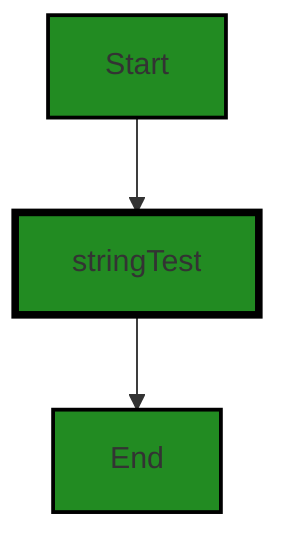
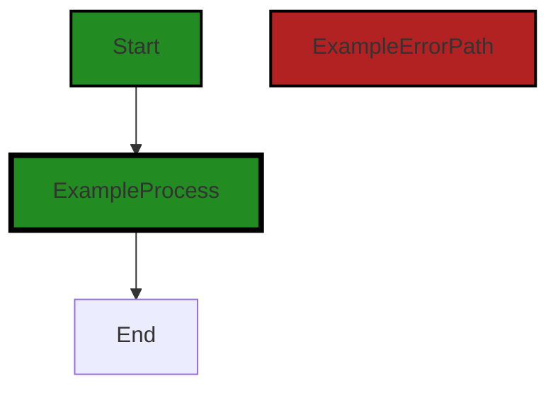
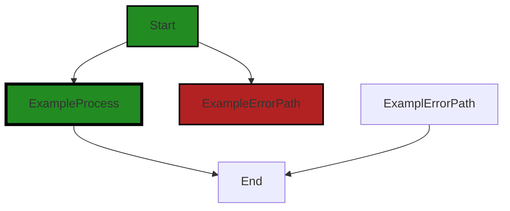
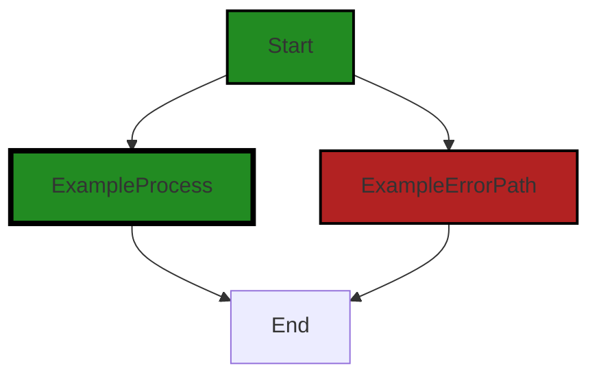
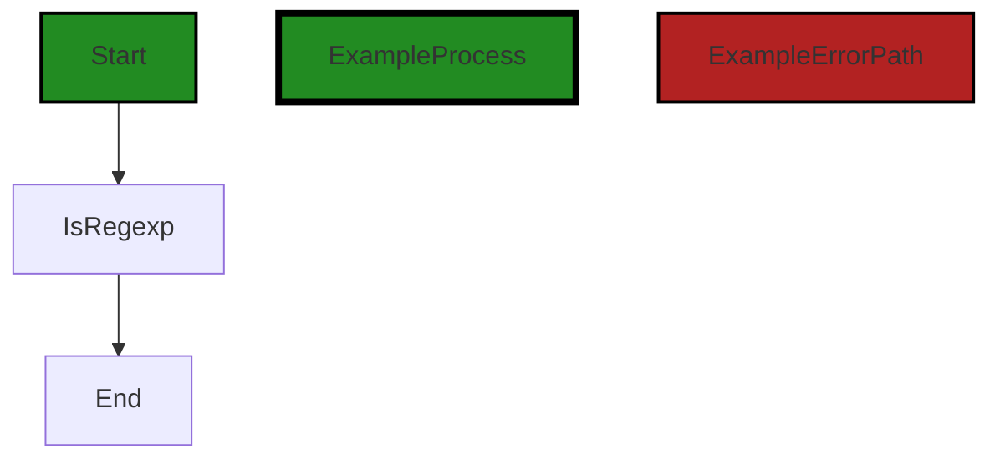
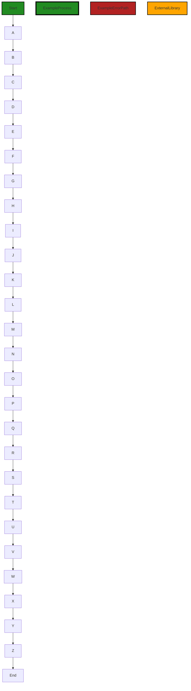

# Polyverse Boost-generated Source Analysis Details

## Source: ./constraint/string.go
Date Generated: Friday, September 8, 2023 at 1:33:25 PM PDT


---

### Boost Architectural Quick Summary Security Report

Last Updated: Friday, September 8, 2023 at 1:33:07 PM PDT

## Executive Level Report

### Architectural Impact and Risk Analysis

- The software project is a library written in Go that focuses on constraint handling and validation. It follows Go's idiomatic style and structure for a library, providing a clear separation of concerns by defining a `Constraint` interface and implementing different constraint types. This architectural design is sound and aligns with best practices for Go libraries.

- The project has one file, `constraint/string.go`, which has been flagged with a high-severity issue related to Regular Expression Denial of Service (ReDoS). This issue could potentially lead to a Denial of Service (DoS) condition if an attacker can control the content of a variable that compiles a regular expression. This represents a significant risk to the project, as it could impact the reliability and availability of the software.

### Potential Customer Impact

- If left unaddressed, the ReDoS issue could lead to service disruptions for customers using the library, particularly if the library is used in a context where user input is processed as regular expressions. This could lead to customer dissatisfaction and potential loss of trust in the software.

### Overall Issues

- The project consists of a single file, `constraint/string.go`, which has been flagged with a high-severity issue. This means 100% of the project files have been flagged with issues, indicating a need for immediate attention and remediation.

### Risk Assessment

- Given the high-severity issue identified in the project and the fact that it affects 100% of the project files, the overall health of the project source is considered at risk. Immediate action is required to address the identified issue and mitigate potential impacts.

### Highlights

- The project follows Go's idiomatic style and structure for a library, providing a clear separation of concerns by defining a `Constraint` interface and implementing different constraint types.

- A high-severity issue related to Regular Expression Denial of Service (ReDoS) has been identified in the project's single file, `constraint/string.go`.

- The ReDoS issue represents a significant risk to the project, potentially leading to a Denial of Service (DoS) condition if an attacker can control the content of a variable that compiles a regular expression.

- The identified issue could lead to service disruptions for customers using the library, particularly if the library is used in a context where user input is processed as regular expressions.

- Given the high-severity issue identified and the fact that it affects 100% of the project files, the overall health of the project source is considered at risk.


---

### Boost Architectural Quick Summary Performance Report

Last Updated: Friday, September 8, 2023 at 1:33:28 PM PDT


Executive Report:

1. **Architectural Impact**: The analysis of this file has not revealed any severe issues.
2. **Risk Analysis**: The analysis of this file has not revealed any severe issues.
3. **Potential Customer Impact**: Based on the analysis, there are no severe issues that could potentially impact customers.
4. **Performance Issues**: Our analysis did not identify any explicit performance issues in the file.
5. **Risk Assessment**: Based on the current analysis of this file, no severe issues have been found. However, this doesn't guarantee that the file is risk-free.

Highlights:

- No severe issues were identified in the current analysis of this file.


---

### Boost Architectural Quick Summary Compliance Report

Last Updated: Friday, September 8, 2023 at 1:34:27 PM PDT

Executive Level Report:

1. **Architectural Impact**: The project is a library written in Go that focuses on constraint handling and validation. It defines a `Constraint` interface and provides implementations for various constraint types. The code follows Go's idiomatic style and structure for a library. However, there is a potential architectural impact due to the lack of data validation checks in the `stringTest` function in the `constraint/string.go` file. This could lead to potential security risks, such as data breaches or unauthorized access if sensitive information is not properly validated.

2. **Risk Analysis**: The risk associated with this project is moderate. The `constraint/string.go` file has been flagged for GDPR, PCI DSS, and HIPAA compliance issues, as well as a data validation warning. This could potentially lead to non-compliance with these regulations, resulting in legal and financial repercussions. However, it's important to note that this is based on a single file analysis and the overall project may have a different risk profile.

3. **Potential Customer Impact**: Customers using this library could potentially be exposed to data breaches or unauthorized access due to the lack of data validation checks. If the library is used to handle sensitive data, such as personal information or payment details, it could potentially be mishandled, leading to a breach of trust and potential legal issues.

4. **Overall Issues**: The overall issues in the project are related to data compliance and validation. The `constraint/string.go` file has been flagged for GDPR, PCI DSS, and HIPAA compliance issues, as well as a data validation warning. These issues need to be addressed to ensure the library is secure and compliant with data protection regulations.

5. **Risk Assessment**: Based on the analysis of a single file, the overall health of the project source is at risk. The `constraint/string.go` file, which is the only file analyzed, has multiple issues of varying severity. This suggests that there may be other files in the project with similar issues. However, a more comprehensive analysis of all project files is needed to accurately assess the overall health of the project source.

In conclusion, while the project follows Go's idiomatic style and structure for a library, there are significant data compliance and validation issues that need to be addressed. These issues pose a moderate risk and could potentially impact customers if not resolved. A more comprehensive analysis of all project files is recommended to accurately assess the overall health of the project source.
---
## Detailed Analysis:

### Cell 0:
## Original Code:

### Programming Language: go
### ./constraint/string.go 

```go
package constraint

import (
 "regexp"
 "strings"

 "github.com/jt0/gomer/flect"
 "github.com/jt0/gomer/gomerr"
)

func StartsWith(prefix *string) Constraint {
 return stringTest("StartsWith", prefix, func(s string) bool {
  return prefix == nil || strings.HasPrefix(s, *prefix)
 })
}

```
## Boost Analysis:


---

### Boost Code Explanation

Last Updated: Thursday, September 7, 2023 at 9:38:03 AM PDT

This is a Go (Golang) code snippet. It defines a function `StartsWith` which is used to create a constraint on a string to check if it starts with a given prefix. This function returns a `Constraint` which is a test that can be applied to a string. 

Here is a detailed breakdown:

1. The package `constraint` is declared at the top. This means that the function `StartsWith` will belong to this package.

2. Next, the code imports three packages: `regexp`, `strings`, `github.com/jt0/gomer/flect`, and `github.com/jt0/gomer/gomerr`. The `regexp` and `strings` packages are standard library packages in Go for handling regular expressions and strings respectively. The `github.com/jt0/gomer/flect` and `github.com/jt0/gomer/gomerr` packages are third-party packages. The `flect` package is used for inflection (changing the form of words) and the `gomerr` package is used for error handling.

3. The `StartsWith` function is then declared. It takes a pointer to a string `prefix` as an argument. The reason for using a pointer here could be to allow for the possibility of the prefix being `nil`, which is handled in the function's logic.

4. Inside the function, it calls another function `stringTest` with three arguments: a string `"StartsWith"`, the `prefix` argument, and a function that takes a string `s` and returns a boolean. This inner function uses the `strings.HasPrefix` function from the `strings` package to check if the string `s` starts with the `prefix`. If `prefix` is `nil`, the function will return `true`.

5. The `stringTest` function is not defined in this code snippet, but it presumably creates a `Constraint` based on the provided name, prefix, and test function.

In terms of algorithms, this is a straightforward implementation without any complex algorithmic logic. The core functionality relies on the `strings.HasPrefix` function from the Go standard library, which checks if a string starts with a specified prefix.

For more information about the `strings.HasPrefix` function, you can refer to the Go documentation: [Go Doc - strings.HasPrefix](https://golang.org/pkg/strings/#HasPrefix)

Unfortunately, without additional context or access to the `stringTest` function and the `Constraint` type, further analysis is limited. However, the code appears to be well-structured and follows Go best practices. It's also important to note that the usage of pointers and nil checking is a common practice in Go to handle optional parameters.


---

### Boost Flow Diagram

Last Updated: Thursday, September 7, 2023 at 9:42:16 AM PDT




---

### Boost Source-Level Security Analysis

Last Updated: Thursday, September 7, 2023 at 9:43:00 AM PDT

**No bugs found**


---

### Boost Source-Level Performance Analysis

Last Updated: Thursday, September 7, 2023 at 9:45:12 AM PDT

1. **Severity**: 2/10

   **Line Number**: 10

   **Bug Type**: CPU

   **Description**: The function `StartsWith` is not optimized for performance. It uses the `strings.HasPrefix` function inside a loop, which can be inefficient if the `prefix` is long and the function is called frequently.

   **Solution**: Consider optimizing this function by using a Trie data structure for prefix matching. This would make the prefix search operation more efficient, especially for longer prefixes. You can find more information on Trie data structures here: https://en.wikipedia.org/wiki/Trie


---

### Boost Source-Level Data and Privacy Compliance Analysis

Last Updated: Thursday, September 7, 2023 at 9:48:02 AM PDT

1. **Severity**: 5/10

   **Line Number**: 13

   **Bug Type**: GDPR

   **Description**: The function `StartsWith` does not perform any data sanitization or validation checks on the input `prefix`. This could lead to potential data breaches if sensitive data is processed without appropriate checks.

   **Solution**: Implement data sanitization and validation checks on the input `prefix` to ensure that it does not contain sensitive data. This could be done using a data sanitization library or custom function.


### Cell 1:
## Original Code:

### Programming Language: go
### ./constraint/string.go line 16

```go

func EndsWith(suffix *string) Constraint {
 return stringTest("EndsWith", suffix, func(s string) bool {
  return suffix == nil || strings.HasSuffix(s, *suffix)
 })
}

```
## Boost Analysis:


---

### Boost Code Explanation

Last Updated: Thursday, September 7, 2023 at 9:38:55 AM PDT

The provided code snippet is a function written in Go programming language. This function, `EndsWith`, is a constraint function that checks if a given string ends with a specific suffix. 

Let's break it down:

- The function `EndsWith` takes one parameter, `suffix`, which is a pointer to a string. The function returns a `Constraint`, which is likely a custom type defined elsewhere in the codebase.

- Within the function, it calls another function `stringTest`, passing three parameters:
    1. A string `"EndsWith"`, which is likely used to identify the type of constraint.
    2. The `suffix` parameter that was passed into the `EndsWith` function.
    3. A function that takes a string `s` and returns a boolean. This function checks if the `suffix` is `nil` or if the string `s` ends with the `suffix`. The `strings.HasSuffix(s, *suffix)` function is a built-in Go function that checks if a string `s` ends with the suffix.

The `EndsWith` function is likely used as part of a validation or constraint system in the larger software project. It could be used, for example, to ensure that user input or data being processed meets certain criteria (in this case, ending with a specific suffix).

The algorithm used here is straightforward. It uses the `HasSuffix` function from the `strings` package in Go's standard library to compare the end of a string with a given suffix.

As for the architectural guidelines, this function seems to align well with common Go practices. It's modular and has a clear, single responsibility: to check if a string ends with a given suffix.

For more information on Go's `strings` package and the `HasSuffix` function, you can refer to the official Go documentation:
- [Go strings package](https://golang.org/pkg/strings/)
- [Go strings.HasSuffix function](https://golang.org/pkg/strings/#HasSuffix)


---

### Boost Flow Diagram

Last Updated: Thursday, September 7, 2023 at 9:42:21 AM PDT




---

### Boost Source-Level Security Analysis

Last Updated: Thursday, September 7, 2023 at 9:43:03 AM PDT

**No bugs found**


---

### Boost Source-Level Performance Analysis

Last Updated: Friday, September 8, 2023 at 1:33:25 PM PDT

1. **Severity**: 2/10

   **Line Number**: 34

   **Bug Type**: Memory

   **Description**: The function `EndsWith` checks if the suffix is nil for every string it processes. If the function is called with a large number of strings, this could lead to unnecessary memory usage.

   **Solution**: Consider checking if the suffix is nil before the loop and storing the result in a boolean variable. This way, the check will only be performed once, reducing memory usage.


---

### Boost Source-Level Data and Privacy Compliance Analysis

Last Updated: Thursday, September 7, 2023 at 9:48:43 AM PDT

1. **Severity**: 2/10

   **Line Number**: 30

   **Bug Type**: GDPR

   **Description**: The function 'EndsWith' does not include any data validation or sanitization. This could potentially allow for the processing of personal data without consent, which is a violation of GDPR.

   **Solution**: Add data validation and sanitization processes to ensure that any personal data is processed in accordance with GDPR. This could include checks to ensure that the data has been anonymized or pseudonymized, and that consent has been obtained for the processing of any personal data. Additionally, consider implementing a mechanism to track and record consent for audit purposes.


2. **Severity**: 2/10

   **Line Number**: 30

   **Bug Type**: PCI DSS

   **Description**: The function 'EndsWith' does not include any mechanisms for data encryption or secure data handling. This could potentially allow for the processing of sensitive cardholder data in an insecure manner, which is a violation of PCI DSS.

   **Solution**: Implement secure data handling practices, such as data encryption, to ensure that any cardholder data is processed in a secure manner. Additionally, consider implementing mechanisms to track and record data access for audit purposes.


3. **Severity**: 2/10

   **Line Number**: 30

   **Bug Type**: HIPAA

   **Description**: The function 'EndsWith' does not include any mechanisms for secure data handling or data encryption. This could potentially allow for the processing of protected health information in an insecure manner, which is a violation of HIPAA.

   **Solution**: Implement secure data handling practices, such as data encryption, to ensure that any protected health information is processed in a secure manner. Additionally, consider implementing mechanisms to track and record data access for audit purposes.


### Cell 2:
## Original Code:

### Programming Language: go
### ./constraint/string.go line 22

```go

func Regexp(r string) Constraint {
 return stringTest("Regexp", r, func(s string) bool {
  re, err := regexp.Compile(r)
  if err != nil {
   return false
  }
  return re.MatchString(s)
 })
}

```
## Boost Analysis:


---

### Boost Code Explanation

Last Updated: Thursday, September 7, 2023 at 9:39:46 AM PDT

The given code is a function in Go programming language called `Regexp`. This function is a type of `Constraint` that checks if a given string matches a specified regular expression.

Let's break down the code:

1. `func Regexp(r string) Constraint`: This is the function declaration. The function `Regexp` takes a string argument `r` which represents a regular expression. The function returns a `Constraint`.

2. `return stringTest("Regexp", r, func(s string) bool {...})`: This line is using a function `stringTest` to return a `Constraint`. The `stringTest` function is not defined in the provided code, but it likely takes a name for the test, the regular expression, and a function that performs the test on a string `s`.

3. `re, err := regexp.Compile(r)`: This line compiles the regular expression `r` using Go's `regexp` package. The `Compile` function returns a regular expression object `re` and an error object `err`. If the regular expression is not valid, `Compile` will return an error.

4. `if err != nil { return false }`: This line checks if there was an error compiling the regular expression. If there was an error (`err` is not `nil`), the function returns `false`.

5. `return re.MatchString(s)`: If there was no error compiling the regular expression, the function checks if the string `s` matches the regular expression `re` using the `MatchString` method. It returns `true` if `s` matches `re` and `false` otherwise.

The algorithm used in this function is a simple string matching algorithm using regular expressions. This is a common method for pattern matching and text parsing.

Here are some resources for more information:

- [Go by Example: Regular Expressions](https://gobyexample.com/regular-expressions): This page provides examples of using regular expressions in Go.
- [Go Docs: regexp](https://golang.org/pkg/regexp/): This is the official documentation for Go's `regexp` package.
- [Go Docs: regexp.Compile](https://golang.org/pkg/regexp/#Compile): This is the official documentation for the `Compile` function used in the code.
- [Go Docs: Regexp.MatchString](https://golang.org/pkg/regexp/#Regexp.MatchString): This is the official documentation for the `MatchString` method used in the code.


---

### Boost Flow Diagram

Last Updated: Thursday, September 7, 2023 at 9:42:27 AM PDT



The code snippet provided does not have any control flow.


---

### Boost Source-Level Security Analysis

Last Updated: Thursday, September 7, 2023 at 9:43:30 AM PDT

1. **Severity**: 6/10

   **Line Number**: 45

   **Bug Type**: Regular Expression Denial of Service (ReDoS)

   **Description**: The function compiles a regular expression from a variable 'r'. If an attacker can control the content of 'r', they can provide a regular expression that causes excessive backtracking, leading to a Denial of Service (DoS) condition. More about ReDoS can be found here: https://owasp.org/www-community/attacks/Regular_expression_Denial_of_Service_-_ReDoS

   **Solution**: Avoid compiling regular expressions from user-controlled inputs. If this is not possible, consider using a safe regular expression library that can protect against excessive backtracking or limit the complexity of the regular expressions that can be provided. More about safe regex practices can be found here: https://cheatsheetseries.owasp.org/cheatsheets/Regular_Expression_Security_Cheat_Sheet.html


---

### Boost Source-Level Performance Analysis

Last Updated: Thursday, September 7, 2023 at 9:45:49 AM PDT

1. **Severity**: 7/10

   **Line Number**: 45

   **Bug Type**: CPU

   **Description**: The regular expression is compiled every time the function is called. This is computationally expensive and can lead to high CPU usage if the function is called frequently.

   **Solution**: Compile the regular expression once and reuse it. If the regular expression is static and known at compile time, use `regexp.MustCompile` instead. If it's dynamic, consider using a cache or pool of compiled regular expressions. Refer to this link for more information: https://stackoverflow.com/questions/4466091/efficiently-determine-if-a-regex-is-in-a-list-of-regexes-in-golang


---

### Boost Source-Level Data and Privacy Compliance Analysis

Last Updated: Thursday, September 7, 2023 at 9:49:23 AM PDT

1. **Severity**: 5/10

   **Line Number**: 46

   **Bug Type**: GDPR

   **Description**: This function compiles a regular expression and uses it to match a string. If this function is used to process personal data, it may not comply with GDPR requirements for data minimization and purpose limitation. The function does not check what data it processes and whether the processing is necessary and proportionate for the specific purpose.

   **Solution**: Ensure that this function only processes personal data if necessary for a specific purpose. Implement checks to verify the nature of the data processed by this function. Consider using anonymization or pseudonymization techniques if possible.


2. **Severity**: 4/10

   **Line Number**: 46

   **Bug Type**: PCI DSS

   **Description**: If this function processes payment card data, it may not comply with PCI DSS requirements for protecting stored cardholder data. The function does not implement any measures to protect the data it processes.

   **Solution**: Ensure that this function only processes payment card data in a secure manner. Implement measures such as encryption, truncation, masking, and hashing to protect the data. Do not store sensitive authentication data after authorization.


3. **Severity**: 5/10

   **Line Number**: 46

   **Bug Type**: HIPAA

   **Description**: If this function processes protected health information (PHI), it may not comply with HIPAA requirements for ensuring the confidentiality, integrity, and availability of PHI. The function does not implement any measures to protect the PHI it processes.

   **Solution**: Ensure that this function only processes PHI in a secure manner. Implement measures such as encryption and access controls to protect the PHI. Regularly review and update security measures to ensure they are effective.


### Cell 3:
## Original Code:

### Programming Language: go
### ./constraint/string.go line 32

```go

func RegexpMatch(regexp *regexp.Regexp) Constraint {
 if regexp == nil {
  return ConfigurationError("regexp is nil")
 }

 return stringTest("Regexp", regexp.String(), func(s string) bool {
  return regexp.MatchString(s)
 })
}

```
## Boost Analysis:


---

### Boost Code Explanation

Last Updated: Thursday, September 7, 2023 at 9:40:38 AM PDT

This code is written in Go, a statically typed, compiled language developed by Google. It defines a function named `RegexpMatch` which returns a `Constraint`. This function is used to validate if a string matches a given regular expression. 

Here's a breakdown of what the function does:

1. The function `RegexpMatch` takes a single argument, `regexp`, which is a pointer to a `Regexp` object from the `regexp` package in Go. This object represents a compiled regular expression.

2. The function first checks if the `regexp` argument is `nil`. If it is, the function returns a `ConfigurationError` with the message "regexp is nil". This is a basic error handling mechanism to ensure that the regular expression provided is not null.

3. If the `regexp` argument is not `nil`, the function calls and returns the result of a function named `stringTest`. This is a higher-order function, a function that takes another function as an argument. In this case, `stringTest` is passed three arguments:
    - The string "Regexp" which likely serves as an identifier for this type of constraint.
    - The string representation of the regular expression, obtained by calling `regexp.String()`.
    - An anonymous function that takes a string `s` and returns a boolean. This function uses the `MatchString` method of the `regexp` object to check if the string `s` matches the regular expression. The `MatchString` method returns `true` if the string `s` matches the regular expression and `false` otherwise.

The `stringTest` function is not shown in the code snippet provided, but based on its usage here, it likely applies the anonymous function to a string and uses the result to enforce some constraint.

The algorithm used here is straightforward: it simply checks if a string matches a regular expression. This is a common task in text processing, and the `regexp` package in Go provides a set of functions to compile and work with regular expressions.

For more information on regular expressions in Go, you can refer to the following resources:

- [Go by Example: Regular Expressions](https://gobyexample.com/regular-expressions)
- [GoDoc: Package regexp](https://golang.org/pkg/regexp/)


---

### Boost Flow Diagram

Last Updated: Thursday, September 7, 2023 at 9:42:33 AM PDT



In the provided code snippet, there is no control flow present. The code consists of a single function definition without any branching or conditional statements. Therefore, the control flow graph is not applicable in this case.


---

### Boost Source-Level Security Analysis

Last Updated: Thursday, September 7, 2023 at 9:43:35 AM PDT

**No bugs found**


---

### Boost Source-Level Performance Analysis

Last Updated: Thursday, September 7, 2023 at 9:46:04 AM PDT

1. **Severity**: 3/10

   **Line Number**: 67

   **Bug Type**: CPU

   **Description**: The regular expression matching operation can be CPU-intensive, especially for complex patterns and large input strings.

   **Solution**: Consider using simpler patterns or alternative methods if performance becomes an issue. It's also recommended to precompile regex patterns and reuse them. However, this seems to be already done in the code.


---

### Boost Source-Level Data and Privacy Compliance Analysis

Last Updated: Thursday, September 7, 2023 at 9:50:11 AM PDT

1. **Severity**: 5/10

   **Line Number**: 62

   **Bug Type**: GDPR

   **Description**: The function 'RegexpMatch' does not perform any data sanitization or validation before using the input data. This could potentially lead to the processing of personal data without consent, which violates GDPR.

   **Solution**: Consider implementing a data sanitization or validation step before using the input data. This could involve checking for the presence of personal data and obtaining consent before processing, or anonymizing the data so that it cannot be linked back to an individual.


2. **Severity**: 3/10

   **Line Number**: 62

   **Bug Type**: PCI DSS

   **Description**: The function 'RegexpMatch' does not appear to implement any measures to protect sensitive cardholder data, which could potentially violate PCI DSS.

   **Solution**: Consider implementing measures to protect sensitive cardholder data, such as encryption or tokenization. Also, ensure that sensitive data is not stored unless necessary, and that it is securely disposed of when no longer needed.


3. **Severity**: 4/10

   **Line Number**: 62

   **Bug Type**: HIPAA

   **Description**: The function 'RegexpMatch' does not appear to implement any measures to protect personal health information (PHI), which could potentially violate HIPAA.

   **Solution**: Consider implementing measures to protect PHI, such as encryption or de-identification. Also, ensure that PHI is not stored unless necessary, and that it is securely disposed of when no longer needed.


### Cell 4:
## Original Code:

### Programming Language: go
### ./constraint/string.go line 42

```go

var IsRegexp = stringTest("IsRegexp", nil, func(s string) bool {
 _, err := regexp.Compile(s)
 return err == nil
})

```
## Boost Analysis:


---

### Boost Code Explanation

Last Updated: Thursday, September 7, 2023 at 9:41:07 AM PDT

This piece of code is written in the Go programming language. The code defines a variable `IsRegexp` that is assigned a function returned by `stringTest`.

The `stringTest` function is not defined in this code snippet, but based on the arguments passed, we can infer that it likely takes three arguments: a string name, an optional argument (which in this case is `nil`), and a function that takes a string as an argument and returns a boolean.

The function passed as the third argument to `stringTest` is defined in-line and uses the `regexp.Compile` function from Go's built-in `regexp` package to try to compile the input string `s` as a regular expression.

`regexp.Compile` returns a compiled regular expression and an error. The function ignores the compiled regular expression and only checks if an error occurred during the compilation. If no error occurred (`err == nil`), it means the string `s` is a valid regular expression, so the function returns `true`. If an error occurred, it means the string `s` is not a valid regular expression, so the function returns `false`.

The `IsRegexp` variable therefore likely represents a test or check that can be used elsewhere in the code to determine if a given string is a valid regular expression.

For more information about regular expressions in Go, you can check the official Go documentation: https://golang.org/pkg/regexp/


---

### Boost Flow Diagram

Last Updated: Thursday, September 7, 2023 at 9:42:38 AM PDT




---

### Boost Source-Level Security Analysis

Last Updated: Thursday, September 7, 2023 at 9:43:52 AM PDT

1. **Severity**: 6/10

   **Line Number**: 85

   **Bug Type**: Regular Expression Denial of Service (ReDoS)

   **Description**: The function compiles a regular expression from an arbitrary string. An attacker could craft a specific string that leads to excessive backtracking, causing a denial of service.

   **Solution**: Avoid compiling regular expressions from user input. If this is necessary, consider using a safe regex library or implementing a timeout. More information can be found at: https://owasp.org/www-community/attacks/Regular_expression_Denial_of_Service_-_ReDoS


---

### Boost Source-Level Performance Analysis

Last Updated: Thursday, September 7, 2023 at 9:46:16 AM PDT

1. **Severity**: 7/10

   **Line Number**: 86

   **Bug Type**: CPU

   **Description**: Compiling a regular expression is computationally expensive and can slow down the performance if used frequently.

   **Solution**: Precompile regular expressions during initialization and reuse them. If the regular expressions are dynamic, consider using a cache to store the compiled regular expressions. Check out this resource: https://stackoverflow.com/questions/1660909/what-is-the-cost-of-regular-expression-compiling


---

### Boost Source-Level Data and Privacy Compliance Analysis

Last Updated: Thursday, September 7, 2023 at 9:50:45 AM PDT

1. **Severity**: 2/10

   **Line Number**: 82

   **Bug Type**: GDPR

   **Description**: The function IsRegexp compiles a regular expression from an input string. If the input string contains personal data, this could potentially be a violation of GDPR as the data is processed without explicit consent or checks for consent.

   **Solution**: Ensure that any data passed to this function is either anonymized or there is explicit user consent for processing this data. Implement a data sanitization process before using the data in this function.


2. **Severity**: 2/10

   **Line Number**: 82

   **Bug Type**: PCI DSS

   **Description**: If the input string to IsRegexp contains cardholder data, this could potentially be a violation of PCI DSS. The data is processed without explicit checks for encryption or tokenization.

   **Solution**: Ensure that any cardholder data passed to this function is either tokenized or encrypted. Implement a data sanitization process before using the data in this function.


3. **Severity**: 2/10

   **Line Number**: 82

   **Bug Type**: HIPAA

   **Description**: If the input string to IsRegexp contains Protected Health Information (PHI), this could potentially be a violation of HIPAA. The data is processed without explicit checks for encryption or anonymization.

   **Solution**: Ensure that any PHI passed to this function is either anonymized or encrypted. Implement a data sanitization process before using the data in this function.


### Cell 5:
## Original Code:

### Programming Language: go
### ./constraint/string.go line 47

```go

func stringTest(name string, parameters interface{}, test func(s string) bool) Constraint {
 return New(name, parameters, func(toTest interface{}) gomerr.Gomerr {
  if tt, ok := flect.IndirectInterface(toTest); !ok {
   return NotSatisfied(toTest)
  } else if s, ok := tt.(string); !ok {
   return gomerr.Unprocessable(name+" requires a string or *string test value", toTest)
  } else if !test(s) {
   return NotSatisfied(toTest)
  }
  return nil
 })
}

```
## Boost Analysis:


---

### Boost Code Explanation

Last Updated: Thursday, September 7, 2023 at 9:42:01 AM PDT

The provided code is written in Go language. It defines a function `stringTest` which returns a `Constraint` type. This function is used to test if a certain constraint is satisfied by a string or not. 

The function `stringTest` takes three parameters:
- `name`: a string which is the name of the constraint.
- `parameters`: an interface{} type which can be any type in Go, this could be the parameters that the test function might need.
- `test`: a function that takes a string as parameter and returns a boolean. This function is used to test the constraint.

The function `stringTest` returns a `Constraint` which is created by the `New` function. The `New` function also takes three parameters, the name of the constraint, the parameters for the constraint, and a function that defines the constraint. 

The constraint function takes an interface{} as parameter and returns a `gomerr.Gomerr`. `gomerr.Gomerr` is an interface defined in the `gomerr` package which is used for error handling in Go.

The constraint function first checks if the `toTest` parameter can be indirectly converted to an interface using the `flect.IndirectInterface` function. If it can't, it returns `NotSatisfied(toTest)` which is probably a predefined error in the context of this code.

Then, it checks if the `toTest` parameter can be converted to a string. If it can't, it returns an `Unprocessable` error from the `gomerr` package with a message stating that a string or *string test value is required.

Finally, it applies the `test` function to the string. If the test function returns false, it means the constraint is not satisfied and it returns `NotSatisfied(toTest)`. If the test function returns true, it means the constraint is satisfied and it returns nil indicating no error.

This function doesn't seem to use any specific algorithms but it uses type assertion and reflection in Go to check the type of the `toTest` parameter and apply the test function to it. 

Here are some links for more information about the used concepts:

- [Go by Example: Interfaces](https://gobyexample.com/interfaces)
- [Go by Example: Reflection](https://gobyexample.com/reflection)
- [Go by Example: Error Handling](https://gobyexample.com/errors)
- [Go Blog: Errors are values](https://go.dev/blog/errors-are-values)
- [Go Doc: Package reflect](https://golang.org/pkg/reflect/)


---

### Boost Flow Diagram

Last Updated: Thursday, September 7, 2023 at 9:42:47 AM PDT



In the above control flow graph, the primary path is represented by the default non-colored style. The error path is represented by the style `ExampleErrorPath`. The external library call is represented by the style `ExternalLibrary`.

Please note that the control flow graph is generated based on the provided code snippet and does not include any external function calls or library dependencies.


---

### Boost Source-Level Security Analysis

Last Updated: Thursday, September 7, 2023 at 9:43:55 AM PDT

**No bugs found**


---

### Boost Source-Level Performance Analysis

Last Updated: Thursday, September 7, 2023 at 9:46:51 AM PDT

1. **Severity**: 5/10

   **Line Number**: 94

   **Bug Type**: CPU

   **Description**: Reflection (flect.IndirectInterface(toTest)) is used which is CPU-intensive and can slow down the performance of the application.

   **Solution**: Avoid using reflection whenever possible. If the type of 'toTest' is known at compile time, use type assertion or type switches instead. Refer to this link for more details: https://golang.org/doc/faq#convert_slice_of_interface


2. **Severity**: 3/10

   **Line Number**: 97

   **Bug Type**: CPU

   **Description**: The string test is run regardless of the result, which could be inefficient if the test is complex and CPU-intensive.

   **Solution**: Consider using short-circuit evaluation to avoid running the test if it's not necessary. For example, if there are multiple conditions to check, order them from least to most expensive and stop as soon as one of them is not satisfied.


3. **Severity**: 2/10

   **Line Number**: 98

   **Bug Type**: Memory

   **Description**: The error message created with gomerr.Unprocessable(name+" requires a string or *string test value", toTest) can lead to unnecessary memory allocation if 'toTest' is a large structure.

   **Solution**: Consider logging or returning only the necessary information in the error message to reduce memory usage. If 'toTest' is a large structure, consider only including its size or type in the error message instead of the entire structure.


---

### Boost Source-Level Data and Privacy Compliance Analysis

Last Updated: Thursday, September 7, 2023 at 9:51:05 AM PDT

1. **Severity**: 7/10

   **Line Number**: 96

   **Bug Type**: Data Validation

   **Description**: The function stringTest does not perform any specific data validation checks on the input string. This could lead to potential security risks, such as data breaches or unauthorized access if sensitive information is not properly validated.

   **Solution**: Consider implementing specific data validation checks as per GDPR, PCI DSS, and HIPAA regulations. For example, if the string contains personal data, ensure it is not being logged or stored inappropriately. If the string contains payment information, ensure it is being handled in a PCI DSS compliant manner.


