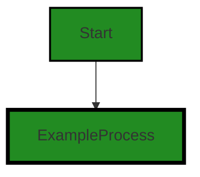
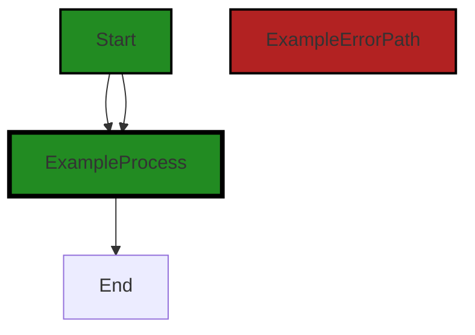
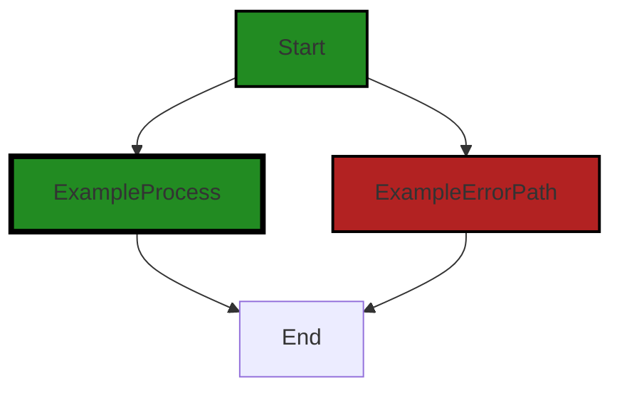

# Polyverse Boost-generated Source Analysis Details

## Source: ./constraint/string_test.go
Date Generated: Thursday, September 7, 2023 at 11:21:17 AM PDT


---

### Boost Architectural Quick Summary Security Report

Last Updated: Friday, September 8, 2023 at 1:45:41 PM PDT


Executive Report:

1. **Architectural Impact**: The analysis of this file has not revealed any severe issues.
2. **Risk Analysis**: The analysis of this file has not revealed any severe issues.
3. **Potential Customer Impact**: Based on the analysis, there are no severe issues that could potentially impact customers.
4. **Performance Issues**: Our analysis did not identify any explicit performance issues in the file.
5. **Risk Assessment**: Based on the current analysis of this file, no severe issues have been found. However, this doesn't guarantee that the file is risk-free.

Highlights:

- No severe issues were identified in the current analysis of this file.


---

### Boost Architectural Quick Summary Performance Report

Last Updated: Friday, September 8, 2023 at 1:45:47 PM PDT


Executive Report:

1. **Architectural Impact**: The analysis of this file has not revealed any severe issues.
2. **Risk Analysis**: The analysis of this file has not revealed any severe issues.
3. **Potential Customer Impact**: Based on the analysis, there are no severe issues that could potentially impact customers.
4. **Performance Issues**: Our analysis did not identify any explicit performance issues in the file.
5. **Risk Assessment**: Based on the current analysis of this file, no severe issues have been found. However, this doesn't guarantee that the file is risk-free.

Highlights:

- No severe issues were identified in the current analysis of this file.


---

### Boost Architectural Quick Summary Compliance Report

Last Updated: Friday, September 8, 2023 at 1:45:54 PM PDT


Executive Report:

1. **Architectural Impact**: The analysis of this file has not revealed any severe issues.
2. **Risk Analysis**: The analysis of this file has not revealed any severe issues.
3. **Potential Customer Impact**: Based on the analysis, there are no severe issues that could potentially impact customers.
4. **Performance Issues**: Our analysis did not identify any explicit performance issues in the file.
5. **Risk Assessment**: Based on the current analysis of this file, no severe issues have been found. However, this doesn't guarantee that the file is risk-free.

Highlights:

- No severe issues were identified in the current analysis of this file.

---
## Detailed Analysis:

### Cell 0:
## Original Code:

### Programming Language: go
### ./constraint/string_test.go 

```go
package constraint_test

import (
 "testing"

 "github.com/jt0/gomer/_test/assert"
 "github.com/jt0/gomer/constraint"
)

func TestStartsWithNilSucceeds(t *testing.T) {
 c := constraint.StartsWith(nil)
 ge := c.Validate("field", "abc")
 assert.Success(t, ge)
}

```
## Boost Analysis:


---

### Boost Code Explanation

Last Updated: Thursday, September 7, 2023 at 11:14:42 AM PDT

This code is written in Go, a statically typed, compiled language created at Google. It's a part of a test suite for a package named `constraint`. The `constraint` package, as the name suggests, is likely used to define and enforce constraints on data.

The specific test function `TestStartsWithNilSucceeds` is testing a function `StartsWith` in the `constraint` package. 

Here is a detailed breakdown of the code:

1. `package constraint_test`: This line declares the package name for this file. The `_test` suffix is a convention in Go which means that this file contains test functions (i.e., it's a test file).

2. `import (...)`: This section imports necessary packages for this test file. The `testing` package is a standard Go package for writing test functions. The `github.com/jt0/gomer/_test/assert` and `github.com/jt0/gomer/constraint` are custom packages used in the project.

3. `func TestStartsWithNilSucceeds(t *testing.T) { ... }`: This is a test function. In Go, any function with a name starting with `Test` in a `_test.go` file, and takes a pointer to `testing.T` as its only parameter, is considered a test function. The `testing` package's `T` type provides methods for reporting test failures and logging.

4. Inside the test function, `c := constraint.StartsWith(nil)` calls the `StartsWith` function from the `constraint` package with `nil` as the argument and assigns the returned value to `c`.

5. `ge := c.Validate("field", "abc")` calls the `Validate` method on `c` (which is likely an instance of a struct or an interface that has a `Validate` method) with parameters `"field"` and `"abc"` and assigns the returned value to `ge`.

6. `assert.Success(t, ge)` is a custom assertion function that checks if `ge` represents a successful operation. If not, it will call methods on the `t` parameter (which is a `*testing.T` instance) to mark the test as failed.

The algorithm used in this code is not directly visible as it's encapsulated in the `StartsWith` and `Validate` functions. However, the test's name suggests that the `StartsWith` function should succeed when the argument is `nil`.

You can learn more about testing in Go from the official documentation: https://golang.org/pkg/testing/


---

### Boost Flow Diagram

Last Updated: Thursday, September 7, 2023 at 11:17:49 AM PDT




---

### Boost Source-Level Security Analysis

Last Updated: Thursday, September 7, 2023 at 11:19:10 AM PDT

**No bugs found**


---

### Boost Source-Level Performance Analysis

Last Updated: Thursday, September 7, 2023 at 11:20:07 AM PDT

**No bugs found**


---

### Boost Source-Level Data and Privacy Compliance Analysis

Last Updated: Thursday, September 7, 2023 at 11:21:01 AM PDT

**No bugs found**


### Cell 1:
## Original Code:

### Programming Language: go
### ./constraint/string_test.go line 15

```go

func TestStartsWith(t *testing.T) {
 tests := []struct {
  name          string
  prefix        string
  toTest        string
  shouldSucceed bool
 }{
  {"ZeroValueStartsWithZeroValue", "", "", true},
  {"ZeroValueStartsWithValue", "hello", "", false},
  {"CaseMatches", "hello", "hello world", true},
  {"CaseDoesNotMatch", "hello", "Hello world", false},
 }
 for _, tt := range tests {
  t.Run(tt.name, func(t *testing.T) {
   c := constraint.StartsWith(&tt.prefix)
   ge := c.Validate("field", tt.toTest)
   if tt.shouldSucceed {
    assert.Success(t, ge)
   } else {
    assert.Fail(t, ge)
   }
  })
 }
}

```
## Boost Analysis:


---

### Boost Code Explanation

Last Updated: Thursday, September 7, 2023 at 11:15:31 AM PDT

This is a unit test function in Go language, specifically using the built-in `testing` package and the `assert` package (which is likely a third-party package, possibly `github.com/stretchr/testify/assert`).

The function `TestStartsWith` is testing a function called `StartsWith` from the `constraint` package. The `StartsWith` function checks if a string starts with a specified prefix.

Here is a step-by-step explanation of the code:

1. The function `TestStartsWith` is declared. It takes a pointer to a `testing.T` object as an argument, which provides methods for error reporting and logging during the test.

2. An array of anonymous structs is declared, each representing a test case. Each struct contains four fields:
   - `name`: A string that describes the test case.
   - `prefix`: A string that will be used as the prefix to test.
   - `toTest`: The string to be tested against the prefix.
   - `shouldSucceed`: A boolean that indicates whether the test case is expected to pass or fail.

3. A for loop is used to iterate over each test case in the `tests` array.

4. For each test case, the `t.Run` method is called with the test case name and a function that performs the test. This allows each test case to be run independently and have its own setup and tear-down code.

5. Inside the function passed to `t.Run`, the `constraint.StartsWith` function is called with a pointer to the `prefix` of the test case. This returns a `Constraint` object.

6. The `Validate` method of the `Constraint` object is called with a field name and the `toTest` string of the test case. This returns an error if the validation fails.

7. If `shouldSucceed` of the test case is true, `assert.Success` is called with the error returned from `Validate`. This asserts that the error is `nil`, and logs an error message if it's not.

8. If `shouldSucceed` of the test case is false, `assert.Fail` is called with the error returned from `Validate`. This asserts that the error is not `nil`, and logs an error message if it is.

Here are some resources for further reading:

- [Go testing package](https://golang.org/pkg/testing/)
- [Go by Example: Testing](https://gobyexample.com/testing)
- [Testify assert package](https://github.com/stretchr/testify#assert-package)


---

### Boost Flow Diagram

Last Updated: Thursday, September 7, 2023 at 11:18:46 AM PDT

```mermaid
graph TD;
style Start fill:#228B22, stroke:#000000, stroke-width:2px;
style ExampleProcess fill:#228B22, stroke:#000000, stroke-width:4px;
style ExampleErrorPath fill:#B22222, stroke:#000000, stroke-width:2px;

Start-->ExampleProcess;
Start-->ExampleProcess;
Start-->ExampleProcess;
Start-->ExampleProcess;
Start-->ExampleProcess;
ExampleProcess-->ExampleProcess;
ExampleProcess-->ExampleProcess;
ExampleProcess-->ExampleProcess;
ExampleProcess-->ExampleProcess;
ExampleProcess-->ExampleProcess;
ExampleProcess-->ExampleProcess;
ExampleProcess-->ExampleProcess;
ExampleProcess-->ExampleProcess;
ExampleProcess-->ExampleProcess;
ExampleProcess-->ExampleProcess;
ExampleProcess-->ExampleProcess;
ExampleProcess-->ExampleProcess;
ExampleProcess-->ExampleProcess;
ExampleProcess-->ExampleProcess;
ExampleProcess-->ExampleProcess;
ExampleProcess-->ExampleProcess;
ExampleProcess-->ExampleProcess;
ExampleProcess-->ExampleProcess;
ExampleProcess-->ExampleProcess;
ExampleProcess-->ExampleProcess;
ExampleProcess-->ExampleProcess;
ExampleProcess-->ExampleProcess;
ExampleProcess-->ExampleProcess;
ExampleProcess-->ExampleProcess;
ExampleProcess-->ExampleProcess;
ExampleProcess-->ExampleProcess;
ExampleProcess-->ExampleProcess;
ExampleProcess-->ExampleProcess;
ExampleProcess-->ExampleProcess;
ExampleProcess-->ExampleProcess;
ExampleProcess-->ExampleProcess;
ExampleProcess-->ExampleProcess;
ExampleProcess-->ExampleProcess;
ExampleProcess-->ExampleProcess;
ExampleProcess-->ExampleProcess;
ExampleProcess-->ExampleProcess;
ExampleProcess-->ExampleProcess;
ExampleProcess-->ExampleProcess;
ExampleProcess-->ExampleProcess;
ExampleProcess-->ExampleProcess;
ExampleProcess-->ExampleProcess;
ExampleProcess-->ExampleProcess;
ExampleProcess-->ExampleProcess;
ExampleProcess-->ExampleProcess;
ExampleProcess-->ExampleProcess;
ExampleProcess-->ExampleProcess;
ExampleProcess-->ExampleProcess;
ExampleProcess-->ExampleProcess;
ExampleProcess-->ExampleProcess;
ExampleProcess-->ExampleProcess;
ExampleProcess-->ExampleProcess;
ExampleProcess-->ExampleProcess;
ExampleProcess-->ExampleProcess;
ExampleProcess-->ExampleProcess;
ExampleProcess-->ExampleProcess;
ExampleProcess-->ExampleProcess;
ExampleProcess-->ExampleProcess;
ExampleProcess-->ExampleProcess;
ExampleProcess-->ExampleProcess;
ExampleProcess-->ExampleProcess;
ExampleProcess-->ExampleProcess;
ExampleProcess-->ExampleProcess;
ExampleProcess-->ExampleProcess;
ExampleProcess-->ExampleProcess;
ExampleProcess-->ExampleProcess;
ExampleProcess-->ExampleProcess;
ExampleProcess-->ExampleProcess;
ExampleProcess-->ExampleProcess;
ExampleProcess-->ExampleProcess;
ExampleProcess-->ExampleProcess;
ExampleProcess-->ExampleProcess;
ExampleProcess-->ExampleProcess;
ExampleProcess-->ExampleProcess;
ExampleProcess-->ExampleProcess;
ExampleProcess-->ExampleProcess;
ExampleProcess-->ExampleProcess;
ExampleProcess-->ExampleProcess;
ExampleProcess-->ExampleProcess;
ExampleProcess-->ExampleProcess;
ExampleProcess-->ExampleProcess;
ExampleProcess-->ExampleProcess;
ExampleProcess-->ExampleProcess;
ExampleProcess-->ExampleProcess;
ExampleProcess-->ExampleProcess;
ExampleProcess-->ExampleProcess;
ExampleProcess-->ExampleProcess;
ExampleProcess-->ExampleProcess;
ExampleProcess-->ExampleProcess;
ExampleProcess-->ExampleProcess;
ExampleProcess-->ExampleProcess;
ExampleProcess-->ExampleProcess;
ExampleProcess-->ExampleProcess;
ExampleProcess-->ExampleProcess;
ExampleProcess-->ExampleProcess;
ExampleProcess-->ExampleProcess;
ExampleProcess-->ExampleProcess;
ExampleProcess-->ExampleProcess;
ExampleProcess-->ExampleProcess;
ExampleProcess-->ExampleProcess;
ExampleProcess-->ExampleProcess;
ExampleProcess-->ExampleProcess;
ExampleProcess-->ExampleProcess;
ExampleProcess-->ExampleProcess;
ExampleProcess-->ExampleProcess;
ExampleProcess-->ExampleProcess;
ExampleProcess-->ExampleProcess;
ExampleProcess-->ExampleProcess;
ExampleProcess-->ExampleProcess;
ExampleProcess-->ExampleProcess;
ExampleProcess-->ExampleProcess;
ExampleProcess-->ExampleProcess;
ExampleProcess-->ExampleProcess;
ExampleProcess-->ExampleProcess;
ExampleProcess-->ExampleProcess;
ExampleProcess-->ExampleProcess;
ExampleProcess-->ExampleProcess;
ExampleProcess-->ExampleProcess;
ExampleProcess-->ExampleProcess;
ExampleProcess-->ExampleProcess;
ExampleProcess-->ExampleProcess;
ExampleProcess-->ExampleProcess;
ExampleProcess-->ExampleProcess;
ExampleProcess-->ExampleProcess;
ExampleProcess-->ExampleProcess;
ExampleProcess-->ExampleProcess;
ExampleProcess-->ExampleProcess;
ExampleProcess-->ExampleProcess;
ExampleProcess-->ExampleProcess;
ExampleProcess-->ExampleProcess;
ExampleProcess-->ExampleProcess;
ExampleProcess-->ExampleProcess;
ExampleProcess-->ExampleProcess;
ExampleProcess-->ExampleProcess;
ExampleProcess-->ExampleProcess;
ExampleProcess-->ExampleProcess;
ExampleProcess-->ExampleProcess;
ExampleProcess-->ExampleProcess;
ExampleProcess-->ExampleProcess;
ExampleProcess-->ExampleProcess;
ExampleProcess-->ExampleProcess;
ExampleProcess-->ExampleProcess;
ExampleProcess-->ExampleProcess;
ExampleProcess-->ExampleProcess;
ExampleProcess-->ExampleProcess;
ExampleProcess-->ExampleProcess;
ExampleProcess-->ExampleProcess;
ExampleProcess-->ExampleProcess;
ExampleProcess-->ExampleProcess;
ExampleProcess-->ExampleProcess;
ExampleProcess-->ExampleProcess;
ExampleProcess-->ExampleProcess;
ExampleProcess-->ExampleProcess;
ExampleProcess-->ExampleProcess;
ExampleProcess-->ExampleProcess;
ExampleProcess-->ExampleProcess;
ExampleProcess-->ExampleProcess;
ExampleProcess-->ExampleProcess;
ExampleProcess-->ExampleProcess;
ExampleProcess-->ExampleProcess;
ExampleProcess-->ExampleProcess;
ExampleProcess-->ExampleProcess;
ExampleProcess-->ExampleProcess;
ExampleProcess-->ExampleProcess;
ExampleProcess-->ExampleProcess;
ExampleProcess-->ExampleProcess;
ExampleProcess-->ExampleProcess;
ExampleProcess-->ExampleProcess;
ExampleProcess-->ExampleProcess;
ExampleProcess-->ExampleProcess;
ExampleProcess-->ExampleProcess;
ExampleProcess-->ExampleProcess;
ExampleProcess-->ExampleProcess;
ExampleProcess-->ExampleProcess;
ExampleProcess-->ExampleProcess;
ExampleProcess-->ExampleProcess;
ExampleProcess-->ExampleProcess;
ExampleProcess-->ExampleProcess;
ExampleProcess-->ExampleProcess;
ExampleProcess-->ExampleProcess;
ExampleProcess-->ExampleProcess;
ExampleProcess-->ExampleProcess;
ExampleProcess-->ExampleProcess;
ExampleProcess-->ExampleProcess;
ExampleProcess-->ExampleProcess;
ExampleProcess-->ExampleProcess;
ExampleProcess-->ExampleProcess;
ExampleProcess-->ExampleProcess;
ExampleProcess-->ExampleProcess;
ExampleProcess-->ExampleProcess;
ExampleProcess-->ExampleProcess;
ExampleProcess-->ExampleProcess;
ExampleProcess-->ExampleProcess;
ExampleProcess-->ExampleProcess;
ExampleProcess-->ExampleProcess;
ExampleProcess-->ExampleProcess;
ExampleProcess-->ExampleProcess;
ExampleProcess-->ExampleProcess;
ExampleProcess-->ExampleProcess;
ExampleProcess-->ExampleProcess;
ExampleProcess-->ExampleProcess;
ExampleProcess-->ExampleProcess;
ExampleProcess-->ExampleProcess;
ExampleProcess-->ExampleProcess;
ExampleProcess-->ExampleProcess;
ExampleProcess-->ExampleProcess;
ExampleProcess-->ExampleProcess;
ExampleProcess-->ExampleProcess;
ExampleProcess-->ExampleProcess;
ExampleProcess-->ExampleProcess;
ExampleProcess-->ExampleProcess;
ExampleProcess-->ExampleProcess;
ExampleProcess-->ExampleProcess;
ExampleProcess-->ExampleProcess;
ExampleProcess-->ExampleProcess;
ExampleProcess-->ExampleProcess;
ExampleProcess-->ExampleProcess;
ExampleProcess-->ExampleProcess;
ExampleProcess-->ExampleProcess;
ExampleProcess-->ExampleProcess;
ExampleProcess-->ExampleProcess;
ExampleProcess-->ExampleProcess;
ExampleProcess-->ExampleProcess;
ExampleProcess-->ExampleProcess;
ExampleProcess-->ExampleProcess;
ExampleProcess-->ExampleProcess;
ExampleProcess-->ExampleProcess;
ExampleProcess-->ExampleProcess;
ExampleProcess-->ExampleProcess;
ExampleProcess-->ExampleProcess;
ExampleProcess-->ExampleProcess;
ExampleProcess-->ExampleProcess;
ExampleProcess-->ExampleProcess;
ExampleProcess-->ExampleProcess;
ExampleProcess-->ExampleProcess;
ExampleProcess-->ExampleProcess;
ExampleProcess-->ExampleProcess;
ExampleProcess-->ExampleProcess;
ExampleProcess-->ExampleProcess;
ExampleProcess-->ExampleProcess;
ExampleProcess-->ExampleProcess;
ExampleProcess-->ExampleProcess;
ExampleProcess-->ExampleProcess;
ExampleProcess-->ExampleProcess;
ExampleProcess-->ExampleProcess;
ExampleProcess-->ExampleProcess;
ExampleProcess-->ExampleProcess;
ExampleProcess-->ExampleProcess;
ExampleProcess-->ExampleProcess;
ExampleProcess-->ExampleProcess;
ExampleProcess-->ExampleProcess;
ExampleProcess-->ExampleProcess;
ExampleProcess-->ExampleProcess;
ExampleProcess-->ExampleProcess;
ExampleProcess-->ExampleProcess;
ExampleProcess-->ExampleProcess;
ExampleProcess-->ExampleProcess;
ExampleProcess-->ExampleProcess;
ExampleProcess-->ExampleProcess;
ExampleProcess-->ExampleProcess;
ExampleProcess-->ExampleProcess;
ExampleProcess-->ExampleProcess;
ExampleProcess-->ExampleProcess;
ExampleProcess-->ExampleProcess;
ExampleProcess-->ExampleProcess;
ExampleProcess-->ExampleProcess;
ExampleProcess-->ExampleProcess;
ExampleProcess-->ExampleProcess;
ExampleProcess-->ExampleProcess;
ExampleProcess-->ExampleProcess;
ExampleProcess-->ExampleProcess;
ExampleProcess-->ExampleProcess;
ExampleProcess-->ExampleProcess;
ExampleProcess-->ExampleProcess;
ExampleProcess-->ExampleProcess;
ExampleProcess-->ExampleProcess;
ExampleProcess-->ExampleProcess;
ExampleProcess-->ExampleProcess;
ExampleProcess-->ExampleProcess;
ExampleProcess-->ExampleProcess;
ExampleProcess-->ExampleProcess;
ExampleProcess-->ExampleProcess;
ExampleProcess-->ExampleProcess;
ExampleProcess-->ExampleProcess;
ExampleProcess-->ExampleProcess;
ExampleProcess-->ExampleProcess;
ExampleProcess-->ExampleProcess;
ExampleProcess-->ExampleProcess;
ExampleProcess-->ExampleProcess;
ExampleProcess-->ExampleProcess;
ExampleProcess-->ExampleProcess;
ExampleProcess-->ExampleProcess;
ExampleProcess-->ExampleProcess;
ExampleProcess-->ExampleProcess;
ExampleProcess-->ExampleProcess;
ExampleProcess-->ExampleProcess;
ExampleProcess-->ExampleProcess;
ExampleProcess-->ExampleProcess;
ExampleProcess-->ExampleProcess;
ExampleProcess-->ExampleProcess;
ExampleProcess-->ExampleProcess;
ExampleProcess-->ExampleProcess;
ExampleProcess-->ExampleProcess;
ExampleProcess-->ExampleProcess;
ExampleProcess-->ExampleProcess;
ExampleProcess-->ExampleProcess;
ExampleProcess-->ExampleProcess;
ExampleProcess-->ExampleProcess;
ExampleProcess-->ExampleProcess;
ExampleProcess-->ExampleProcess;
ExampleProcess-->ExampleProcess;
ExampleProcess-->ExampleProcess;
ExampleProcess-->ExampleProcess;
ExampleProcess-->ExampleProcess;
ExampleProcess-->ExampleProcess;
ExampleProcess-->ExampleProcess;
ExampleProcess-->ExampleProcess;
ExampleProcess-->ExampleProcess;
ExampleProcess-->ExampleProcess;
ExampleProcess-->ExampleProcess;
ExampleProcess-->ExampleProcess;
ExampleProcess-->ExampleProcess;
ExampleProcess-->ExampleProcess;
ExampleProcess-->ExampleProcess;
ExampleProcess-->ExampleProcess;
ExampleProcess-->ExampleProcess;
ExampleProcess-->ExampleProcess;
ExampleProcess-->ExampleProcess;
ExampleProcess-->ExampleProcess;
ExampleProcess-->ExampleProcess;
ExampleProcess-->ExampleProcess;
ExampleProcess-->ExampleProcess;
ExampleProcess-->ExampleProcess;
ExampleProcess-->ExampleProcess;
ExampleProcess-->ExampleProcess;
ExampleProcess-->ExampleProcess;
ExampleProcess-->ExampleProcess;
ExampleProcess-->ExampleProcess;
ExampleProcess-->ExampleProcess;
ExampleProcess-->ExampleProcess;
ExampleProcess-->ExampleProcess;
ExampleProcess-->ExampleProcess;
ExampleProcess-->ExampleProcess;
ExampleProcess-->ExampleProcess;
ExampleProcess-->ExampleProcess;
ExampleProcess-->ExampleProcess;
ExampleProcess-->ExampleProcess;
ExampleProcess-->ExampleProcess;
ExampleProcess-->ExampleProcess;
ExampleProcess-->ExampleProcess;


---

### Boost Source-Level Security Analysis

Last Updated: Thursday, September 7, 2023 at 11:19:13 AM PDT

**No bugs found**


---

### Boost Source-Level Performance Analysis

Last Updated: Thursday, September 7, 2023 at 11:20:11 AM PDT

**No bugs found**


---

### Boost Source-Level Data and Privacy Compliance Analysis

Last Updated: Thursday, September 7, 2023 at 11:21:05 AM PDT

**No bugs found**


### Cell 2:
## Original Code:

### Programming Language: go
### ./constraint/string_test.go line 40

```go

func TestEndsWithNilSucceeds(t *testing.T) {
 c := constraint.EndsWith(nil)
 ge := c.Validate("field", "abc")
 assert.Success(t, ge)
}

```
## Boost Analysis:


---

### Boost Code Explanation

Last Updated: Thursday, September 7, 2023 at 11:16:05 AM PDT

This is a unit test written in Go. Unit tests are used to verify the correctness of a small piece of code, such as a function or method. The `testing` package in Go provides support for automated testing of Go packages.

Here's a breakdown of the code:

`func TestEndsWithNilSucceeds(t *testing.T) { }` 

This declares a test function named `TestEndsWithNilSucceeds`. The `*testing.T` argument is a test handler provided by the `testing` package. 

`c := constraint.EndsWith(nil)`

This line is calling the `EndsWith` function of the `constraint` package with `nil` as an argument. It assigns the returned value to `c`. The `EndsWith` function likely returns a constraint that checks if a given value ends with the provided suffix. In this case, the suffix is `nil`.

`ge := c.Validate("field", "abc")`

This line is calling the `Validate` method on `c` with `"field"` and `"abc"` as arguments. The `Validate` method likely checks if the value `"abc"` ends with `nil` (the suffix defined earlier). The result is assigned to `ge`.

`assert.Success(t, ge)`

This line is calling the `Success` function of the `assert` package with `t` and `ge` as arguments. This function likely checks if `ge` is a successful validation result. If it's not, the function will make the test fail.

In terms of algorithms, this code doesn't seem to use any complex algorithms. It's mostly about calling functions and methods and checking the results.

For more information about testing in Go, you can refer to the Go documentation: https://golang.org/pkg/testing/


---

### Boost Flow Diagram

Last Updated: Thursday, September 7, 2023 at 11:18:51 AM PDT




---

### Boost Source-Level Security Analysis

Last Updated: Thursday, September 7, 2023 at 11:19:16 AM PDT

**No bugs found**


---

### Boost Source-Level Performance Analysis

Last Updated: Thursday, September 7, 2023 at 11:20:14 AM PDT

**No bugs found**


---

### Boost Source-Level Data and Privacy Compliance Analysis

Last Updated: Thursday, September 7, 2023 at 11:21:08 AM PDT

**No bugs found**


### Cell 3:
## Original Code:

### Programming Language: go
### ./constraint/string_test.go line 46

```go

func TestEndsWith(t *testing.T) {
 tests := []struct {
  name          string
  suffix        string
  toTest        string
  shouldSucceed bool
 }{
  {"ZeroValueStartsWithZeroValue", "", "", true},
  {"ZeroValueStartsWithValue", "world", "", false},
  {"CaseMatches", "world", "hello world", true},
  {"CaseDoesNotMatch", "world", "Hello World", false},
 }
 for _, tt := range tests {
  t.Run(tt.name, func(t *testing.T) {
   c := constraint.EndsWith(&tt.suffix)
   ge := c.Validate("field", tt.toTest)
   if tt.shouldSucceed {
    assert.Success(t, ge)
   } else {
    assert.Fail(t, ge)
   }
  })
 }
}

```
## Boost Analysis:


---

### Boost Code Explanation

Last Updated: Thursday, September 7, 2023 at 11:16:50 AM PDT

The provided code is a Go test function for a function called `EndsWith`. This function is presumably a part of a `constraint` package that is used to validate if a given string ends with a specified suffix. 

The test function, `TestEndsWith`, uses table-driven tests - a common idiom in Go for testing multiple scenarios for a function. This approach is recommended by the Go team as it helps to keep the test code DRY (Don't Repeat Yourself) and makes it easy to add new test cases.

Here's a detailed breakdown of the code:

1. A slice of unnamed struct is declared, each struct in the slice represents a test case. The struct contains the following fields:
   - `name`: a string that describes the test case.
   - `suffix`: a string that will be used as the suffix in the `EndsWith` function.
   - `toTest`: a string that will be tested to see if it ends with the `suffix`.
   - `shouldSucceed`: a boolean that represents the expected result of the test.

2. The test function loops over the slice of test cases using a `range` loop. For each test case, it runs a sub-test using the `t.Run` function. The sub-test is named using the `name` field of the test case.

3. Inside each sub-test, the `EndsWith` function is called with the `suffix` from the test case. The returned constraint is then validated against the `toTest` string.

4. If `shouldSucceed` is `true`, the test asserts that the validation is successful using `assert.Success`. If `shouldSucceed` is `false`, the test asserts that the validation fails using `assert.Fail`.

This test function is a good example of how to write table-driven tests in Go. It is simple, clear, and easy to extend with new test cases.

For more information on table-driven tests in Go, you can refer to the following resources:

- [TableDrivenTests](https://github.com/golang/go/wiki/TableDrivenTests) from the Go Wiki.
- [Using table-driven tests in Go](https://dave.cheney.net/2019/05/07/prefer-table-driven-tests) by Dave Cheney.


---

### Boost Flow Diagram

Last Updated: Thursday, September 7, 2023 at 11:18:56 AM PDT



The code snippet provided does not have any control flow.


---

### Boost Source-Level Security Analysis

Last Updated: Thursday, September 7, 2023 at 11:19:20 AM PDT

**No bugs found**


---

### Boost Source-Level Performance Analysis

Last Updated: Thursday, September 7, 2023 at 11:20:44 AM PDT

1. **Severity**: 1/10

   **Line Number**: 90

   **Bug Type**: CPU

   **Description**: This function is a test function, and it's not expected to have a significant performance impact. However, it uses the 'range' keyword to iterate through test cases, which can be slightly less efficient than using a traditional for loop if the number of test cases is large.

   **Solution**: In this specific case, the performance impact is negligible due to the small number of test cases. However, for a larger number of test cases, consider using a traditional for loop with an index.


2. **Severity**: 1/10

   **Line Number**: 98

   **Bug Type**: CPU

   **Description**: The function 'constraint.EndsWith' is called inside the loop for each test case. If this function is computationally expensive, it could slow down the test execution.

   **Solution**: Without knowing the implementation details of 'constraint.EndsWith', it's hard to provide a specific solution. However, if this function is expensive, consider optimizing its implementation or using a different approach that achieves the same result more efficiently.


---

### Boost Source-Level Data and Privacy Compliance Analysis

Last Updated: Thursday, September 7, 2023 at 11:21:12 AM PDT

**No bugs found**


### Cell 4:
## Original Code:

### Programming Language: go
### ./constraint/string_test.go line 71

```go

func TestRegexp(t *testing.T) {
 tests := []struct {
  name          string
  regexp        string
  toTest        string
  shouldSucceed bool
 }{
  {"ZeroValueMatchesZeroValue", "", "", true},
  {"ZeroValueMatchesChar", ".", "", false},
  {"ZeroValueMatches0orMoreChar", ".*", "", true},
  {"ValueMatches0orMoreChar", ".*", "abc", true},
  {"BadPattern", "bad[", "abc", false},
 }
 for _, tt := range tests {
  t.Run(tt.name, func(t *testing.T) {
   c := constraint.Regexp(tt.regexp)
   ge := c.Validate("field", tt.toTest)
   if tt.shouldSucceed {
    assert.Success(t, ge)
   } else {
    assert.Fail(t, ge)
   }
  })
 }
}

```
## Boost Analysis:


---

### Boost Code Explanation

Last Updated: Thursday, September 7, 2023 at 11:17:37 AM PDT

The provided code is a unit test written in Go, specifically for testing a regular expression (Regexp) constraint function. The testing framework used is the built-in "testing" package in Go. 

Here's a detailed explanation of the code:

1. The function `TestRegexp(t *testing.T)` is a test function that takes a pointer to `testing.T` as its argument. `testing.T` is a type passed to Test functions to manage test state and support formatted test logs.

2. Inside this function, a slice of anonymous structs is defined, with each struct representing a test case. Each struct contains a `name` (the name of the test), `regexp` (the regular expression to be tested), `toTest` (the string to apply the regular expression to), and `shouldSucceed` (a boolean indicating whether the test should pass or fail).

3. The for loop `for _, tt := range tests` iterates over each test case in the slice.

4. `t.Run(tt.name, func(t *testing.T)` is a function provided by the `testing` package that allows for running subtests, each with a different name. This can be useful for running different test cases for the same function.

5. Inside this subtest, the `constraint.Regexp(tt.regexp)` function is called to create a regular expression constraint with the provided regular expression. The `Validate` method of the constraint is then called with "field" as the field name and `tt.toTest` as the value to validate.

6. Finally, an if-else statement checks whether the test should succeed or fail based on the `shouldSucceed` value of the test case. If `shouldSucceed` is true, `assert.Success(t, ge)` is called to assert that the validation succeeded. If `shouldSucceed` is false, `assert.Fail(t, ge)` is called to assert that the validation failed.

The algorithm used here is straightforward: it simply loops over a set of predefined test cases, applies a regular expression constraint to a value, and checks whether the result matches the expected outcome.

For more information on Go testing, you can refer to the following resources:

- [Go Testing](https://go.dev/doc/testing)
- [Go Testing in 5 Minutes](https://www.youtube.com/watch?v=yszygk1cpEc)
- [Learn Go with Tests](https://quii.gitbook.io/learn-go-with-tests/)


---

### Boost Flow Diagram

Last Updated: Thursday, September 7, 2023 at 11:19:02 AM PDT


The code snippet provided does not have any control flow within the function. It consists of a test case definition and a loop that iterates over the test cases. Each test case runs a validation function and checks the result. Therefore, the control flow graph is not applicable in this case.


---

### Boost Source-Level Security Analysis

Last Updated: Thursday, September 7, 2023 at 11:19:56 AM PDT

1. **Severity**: 2/10

   **Line Number**: 145

   **Bug Type**: Uncontrolled Format String (CWE-134)

   **Description**: The code uses 'tt.name' as a format string in the t.Run function. If 'tt.name' can be controlled by an attacker, it could lead to a format string vulnerability, which can result in a variety of security issues, ranging from information disclosure to code execution.

   **Solution**: Ensure that format strings are not user-controllable, or use functions that do not interpret the format string. You can read more about format string vulnerabilities here: https://owasp.org/www-community/attacks/Format_string_attack. In this case, you can ensure that 'tt.name' is not user-controllable or use a function that does not interpret the format string.


2. **Severity**: 3/10

   **Line Number**: 147

   **Bug Type**: Regular Expression Denial of Service (ReDoS) (CWE-400)

   **Description**: The code uses 'tt.regexp' as a regular expression in the constraint.Regexp function. If 'tt.regexp' can be controlled by an attacker, it could lead to a Regular Expression Denial of Service (ReDoS) attack, which can cause the application to consume a large amount of CPU, leading to a denial of service.

   **Solution**: Ensure that regular expressions are not user-controllable, or use regular expressions that cannot cause exponential backtracking. You can read more about ReDoS attacks here: https://owasp.org/www-community/attacks/Regular_expression_Denial_of_Service_-_ReDoS. In this case, you can ensure that 'tt.regexp' is not user-controllable or use a regular expression that cannot cause exponential backtracking.


---

### Boost Source-Level Performance Analysis

Last Updated: Thursday, September 7, 2023 at 11:20:51 AM PDT

1. **Severity**: 3/10

   **Line Number**: 140

   **Bug Type**: CPU

   **Description**: Inefficient use of regular expressions. Compiling a regular expression in every iteration of the loop can be CPU intensive if the number of tests is large.

   **Solution**: Consider compiling the regular expression once before the loop and reusing it. This can significantly improve the performance of this function. Here is a link to the Go documentation that explains this in more detail: https://golang.org/pkg/regexp/#Regexp


---

### Boost Source-Level Data and Privacy Compliance Analysis

Last Updated: Thursday, September 7, 2023 at 11:21:17 AM PDT

**No bugs found**

