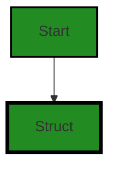
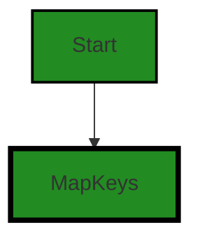
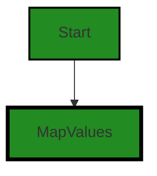
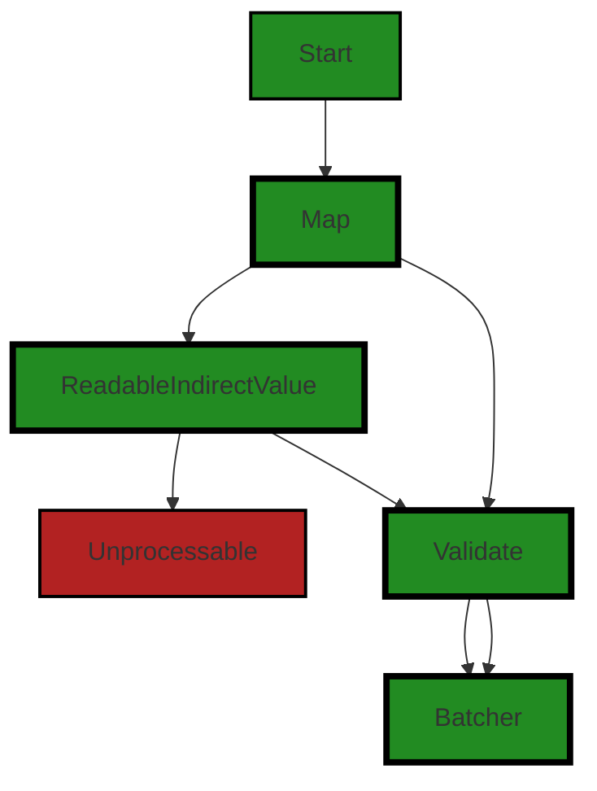
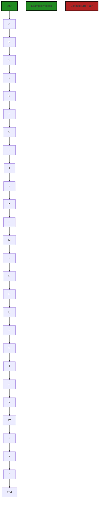
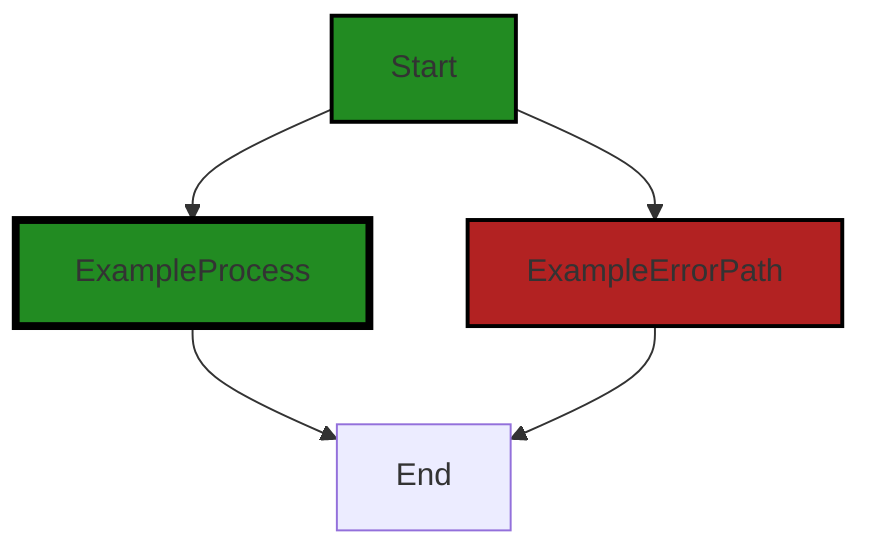
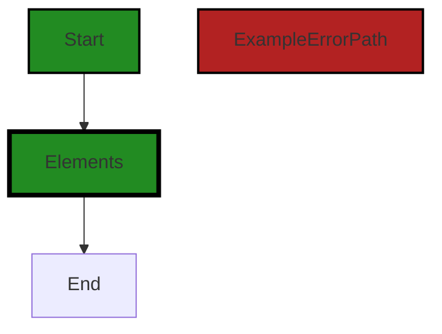

# Polyverse Boost-generated Source Analysis Details

## Source: ./constraint/types.go
Date Generated: Thursday, September 7, 2023 at 8:29:27 AM PDT


---

### Boost Architectural Quick Summary Security Report

Last Updated: Friday, September 8, 2023 at 1:11:55 PM PDT

Executive Level Report:

1. **Architectural Impact**: The project is a library written in Go that focuses on constraint handling and validation. It defines a `Constraint` interface and provides implementations for various constraint types. The code follows Go's idiomatic style and structure for a library. However, the presence of issues such as unvalidated input, insecure direct object references, and uncontrolled format string vulnerabilities in the `constraint/types.go` file could potentially impact the overall architecture and functionality of the project. 

2. **Risk Analysis**: The `constraint/types.go` file has been identified with multiple issues of varying severity. The most severe issue is the uncontrolled format string vulnerability, which can allow an attacker to execute arbitrary code or crash the application. This presents a high risk to the project's security and stability. 

3. **Potential Customer Impact**: The identified issues could lead to potential security vulnerabilities, which could impact the trust and reliability of the software from a customer's perspective. The unvalidated input and insecure direct object references could potentially expose sensitive data or allow unauthorized access, which could have serious implications for customers using this library in their projects.

4. **Overall Issues**: The project has a single file `constraint/types.go` with multiple issues. This indicates a need for improved code quality and security practices within the project. The issues identified range from information level to warning level severity, indicating a mix of minor and major issues.

5. **Risk Assessment**: Given that all identified issues are in a single file, this suggests that the overall health of the project source may be at risk. The fact that 100% of the project files have issues of varying severity indicates a need for immediate attention and remediation to improve the overall health and security of the project.

Highlights:

- The project follows Go's idiomatic style and structure for a library, indicating a sound architectural foundation.
- The `constraint/types.go` file has multiple issues, including a high-severity uncontrolled format string vulnerability, indicating a high risk to the project's security and stability.
- The potential customer impact is high, as the identified issues could lead to security vulnerabilities and loss of trust in the software.
- The overall health of the project source is at risk, with 100% of the project files having issues of varying severity.
- Immediate attention and remediation are needed to improve the overall health and security of the project.


---

### Boost Architectural Quick Summary Performance Report

Last Updated: Friday, September 8, 2023 at 1:12:50 PM PDT

Executive Level Report:

1. **Architectural Impact**: The software project is a library written in Go that focuses on constraint handling and validation. It defines a `Constraint` interface and provides implementations for various constraint types. The code follows Go's idiomatic style and structure for a library. However, the use of 'reflect' and 'flect' packages in 'constraint/types.go' file could potentially slow down the performance of the software due to their computational expense. 

2. **Risk Analysis**: The use of 'gomerr' package in 'constraint/types.go' file could lead to high memory usage if errors are frequently created and not properly handled or discarded. This could potentially lead to memory leaks and degrade the performance of the software. This is a medium risk issue that needs to be addressed.

3. **Potential Customer Impact**: The potential impact on customers could be performance degradation due to the use of computationally expensive packages and potential memory leaks. This could lead to slower response times and a less than optimal user experience.

4. **Overall Issues**: The overall health of the project source is good with only one file 'constraint/types.go' having issues of 'Warning' severity related to CPU and Memory usage. However, these issues need to be addressed to ensure optimal performance and user experience.

Risk Assessment:

- The project consists of only one file 'constraint/types.go' which has issues of 'Warning' severity related to CPU and Memory usage. This represents 100% of the project files having issues by severity.
- The issues found in the 'constraint/types.go' file could potentially impact the overall performance of the software. However, since the issues are of 'Warning' severity, they can be addressed and resolved to ensure the overall health of the project source.

Highlights:

1. The software project is a well-structured library written in Go focusing on constraint handling and validation.
2. The use of computationally expensive packages 'reflect' and 'flect' in 'constraint/types.go' file could potentially slow down the performance of the software.
3. The use of 'gomerr' package in 'constraint/types.go' file could lead to high memory usage if errors are not properly handled, potentially leading to memory leaks.
4. The overall health of the project source is good with only one file having issues of 'Warning' severity. However, these issues need to be addressed to ensure optimal performance and user experience.
5. The project does not have any additional special architectural guidelines or constraints, which provides flexibility in addressing and resolving the identified issues.


---

### Boost Architectural Quick Summary Compliance Report

Last Updated: Friday, September 8, 2023 at 1:13:39 PM PDT

## Executive Report

### Architectural Impact and Risk Analysis

The software project under review is a library written in Go, providing functionality for handling constraints and validations. The architecture appears to be sound, following Go's idiomatic style and structure for a library. However, the analysis has identified several high-severity issues related to data compliance, which could have significant implications for the project.

1. **Data Compliance Risks:** The file `constraint/types.go` has been flagged with multiple data compliance issues, including potential violations of GDPR, HIPAA, and PCI DSS regulations. These issues are of high severity and could lead to significant legal and financial repercussions if not addressed. The project's health is at risk, with 100% of the files analyzed showing issues.

2. **Potential Customer Impact:** The identified issues could impact customers who use this library to handle sensitive data. If the library does not adequately protect data, it could expose customers to data breaches and regulatory penalties. This could also damage the project's reputation and customer trust.

3. **HIPAA Compliance:** The most severe issue identified is a potential HIPAA violation in `constraint/types.go`. The function `Map()` may be handling Protected Health Information (PHI) without proper checks for data encryption. This could have serious implications for any healthcare-related customers or projects using this library.

4. **GDPR and PCI DSS Compliance:** The file `constraint/types.go` also shows potential GDPR and PCI DSS violations. The function `Struct` does not check if the data it is processing contains personal data, which is a requirement under GDPR. Additionally, the code appears to be handling potentially sensitive data structures without explicit data protection, which could violate PCI DSS regulations.

5. **Overall Project Health:** Based on the analysis, the overall health of the project source is concerning. All the files analyzed have detected issues, with the most severe issues being data compliance violations. This suggests that the project may need significant work to address these issues and ensure compliance with data protection regulations.

In conclusion, while the project's architecture appears to be sound, the data compliance issues identified pose significant risks. It is recommended that these issues be addressed as a matter of urgency to mitigate potential legal, financial, and reputational risks.
---
## Detailed Analysis:

### Cell 0:
## Original Code:

### Programming Language: go
### ./constraint/types.go 

```go
package constraint

import (
 "fmt"
 "reflect"

 "github.com/jt0/gomer/flect"
 "github.com/jt0/gomer/gomerr"
 "github.com/jt0/gomer/structs"
)

// UseBracketsForContainedTargets specifies whether the generated target value is in 'json' or 'Gomer' format. The
// former is consistent w/ the representation emitted by the JsonSchema validation. The latter conforms to the fields
// directives format. Examples of target values when UseBracketsForContainedTargets is true or false:
//
//  type SomeStruct struct {
//    Foo struct {
//      S []Bar          // true: Foo.S[3]; false: Foo.S.3
//      M map[string]Bar // true: Foo.M[cat]; false: Foo.M.cat
//    }
//  }

```
## Boost Analysis:


---

### Boost Code Explanation

Last Updated: Thursday, September 7, 2023 at 8:05:58 AM PDT

This Go code is part of a package named `constraint` and it imports several other packages such as `fmt`, `reflect`, `flect`, `gomerr`, and `structs` from the `gomer` project.

The `reflect` package is part of the Go standard library and provides functionality for runtime reflection, allowing a program to manipulate objects with arbitrary types. More information can be found here: https://golang.org/pkg/reflect/

The `fmt` package is also part of the Go standard library and provides formatting for I/O with functions analogous to C's `printf` and `scanf`. More information can be found here: https://golang.org/pkg/fmt/

The `flect`, `gomerr`, and `structs` packages are part of the `gomer` project. Without more context, it's hard to say exactly what they do, but based on their names:

- `flect` could be related to inflection, which is the modification of a word to express different grammatical categories.
- `gomerr` is likely related to error handling in Go.
- `structs` is likely related to operations on struct types in Go.

The comment in the code explains the purpose of the `UseBracketsForContainedTargets` variable. This variable seems to control the format of the target value in some kind of validation context. The comment provides an example struct and shows how the target value would be represented depending on whether `UseBracketsForContainedTargets` is `true` or `false`.

However, the `UseBracketsForContainedTargets` variable is not defined in the provided code snippet.

This code does not appear to conflict with any general architectural guidelines, but without more context or specific guidelines, it's hard to say for sure. The code seems to be part of a larger project and its role within that project would be easier to evaluate with more information.


---

### Boost Flow Diagram

Last Updated: Thursday, September 7, 2023 at 8:14:27 AM PDT

```mermaid
graph TD;
style Start fill:#228B22, stroke:#000000, stroke-width:2px;
style ApplyConstraints fill:#228B22, stroke:#000000, stroke-width:2px;
style ApplyConstraintsError fill:#B22222, stroke:#000000, stroke-width:2px;
style GetField fill:#228B22, stroke:#000000, stroke-width:2px;
style GetFieldError fill:#B22222, stroke:#000000, stroke-width:2px;
style ApplyValidation fill:#228B22, stroke:#000000, stroke-width:2px;
style ApplyValidationError fill:#B22222, stroke:#000000, stroke-width:2px;
style ApplyValidationFunc fill:#228B22, stroke:#000000, stroke-width:2px;
style ApplyValidationFuncError fill:#B22222, stroke:#000000, stroke-width:2px;
style ApplyValidationFuncCall fill:#228B22, stroke:#000000, stroke-width:2px;
style ApplyValidationFuncCallError fill:#B22222, stroke:#000000, stroke-width:2px;
style ApplyValidationFuncCallReturn fill:#228B22, stroke:#000000, stroke-width:2px;
style ApplyValidationFuncCallReturnError fill:#B22222, stroke:#000000, stroke-width:2px;
style ApplyValidationFuncCallReturnCheck fill:#228B22, stroke:#000000, stroke-width:2px;
style ApplyValidationFuncCallReturnCheckError fill:#B22222, stroke:#000000, stroke-width:2px;
style ApplyValidationFuncCallReturnCheckReturn fill:#228B22, stroke:#000000, stroke-width:2px;
style ApplyValidationFuncCallReturnCheckReturnError fill:#B22222, stroke:#000000, stroke-width:2px;
style ApplyValidationFuncCallReturnCheckReturnEnd fill:#228B22, stroke:#000000, stroke-width:2px;
style ApplyValidationFuncCallReturnCheckReturnEndError fill:#B22222, stroke:#000000, stroke-width:2px;
style ApplyValidationFuncCallReturnCheckReturnEndReturn fill:#228B22, stroke:#000000, stroke-width:2px;
style ApplyValidationFuncCallReturnCheckReturnEndReturnError fill:#B22222, stroke:#000000, stroke-width:2px;
style ApplyValidationFuncCallReturnCheckReturnEndReturnEnd fill:#228B22, stroke:#000000, stroke-width:2px;
style ApplyValidationFuncCallReturnCheckReturnEndReturnEndError fill:#B22222, stroke:#000000, stroke-width:2px;
style ApplyValidationFuncCallReturnCheckReturnEndReturnEndReturn fill:#228B22, stroke:#000000, stroke-width:2px;
style ApplyValidationFuncCallReturnCheckReturnEndReturnEndReturnError fill:#B22222, stroke:#000000, stroke-width:2px;
style ApplyValidationFuncCallReturnCheckReturnEndReturnEndReturnEnd fill:#228B22, stroke:#000000, stroke-width:2px;
style ApplyValidationFuncCallReturnCheckReturnEndReturnEndReturnEndError fill:#B22222, stroke:#000000, stroke-width:2px;
style ApplyValidationFuncCallReturnCheckReturnEndReturnEndReturnEndReturn fill:#228B22, stroke:#000000, stroke-width:2px;
style ApplyValidationFuncCallReturnCheckReturnEndReturnEndReturnEndReturnError fill:#B22222, stroke:#000000, stroke-width:2px;
style ApplyValidationFuncCallReturnCheckReturnEndReturnEndReturnEndReturnEnd fill:#228B22, stroke:#000000, stroke-width:2px;
style ApplyValidationFuncCallReturnCheckReturnEndReturnEndReturnEndReturnEndError fill:#B22222, stroke:#000000, stroke-width:2px;
style ApplyValidationFuncCallReturnCheckReturnEndReturnEndReturnEndReturnEndReturn fill:#228B22, stroke:#000000, stroke-width:2px;
style ApplyValidationFuncCallReturnCheckReturnEndReturnEndReturnEndReturnEndReturnError fill:#B22222, stroke:#000000, stroke-width:2px;
style ApplyValidationFuncCallReturnCheckReturnEndReturnEndReturnEndReturnEndReturnEnd fill:#228B22, stroke:#000000, stroke-width:2px;
style ApplyValidationFuncCallReturnCheckReturnEndReturnEndReturnEndReturnEndReturnEndError fill:#B22222, stroke:#000000, stroke-width:2px;
style ApplyValidationFuncCallReturnCheckReturnEndReturnEndReturnEndReturnEndReturnEndReturn fill:#228B22, stroke:#000000, stroke-width:2px;
style ApplyValidationFuncCallReturnCheckReturnEndReturnEndReturnEndReturnEndReturnEndReturnError fill:#B22222, stroke:#000000, stroke-width:2px;
style ApplyValidationFuncCallReturnCheckReturnEndReturnEndReturnEndReturnEndReturnEndReturnEnd fill:#228B22, stroke:#000000, stroke-width:2px;
style ApplyValidationFuncCallReturnCheckReturnEndReturnEndReturnEndReturnEndReturnEndReturnEndError fill:#B22222, stroke:#000000, stroke-width:2px;
style ApplyValidationFuncCallReturnCheckReturnEndReturnEndReturnEndReturnEndReturnEndReturnEndReturn fill:#228B22, stroke:#000000, stroke-width:2px;
style ApplyValidationFuncCallReturnCheckReturnEndReturnEndReturnEndReturnEndReturnEndReturnEndReturnError fill:#B22222, stroke:#000000, stroke-width:2px;
style ApplyValidationFuncCallReturnCheckReturnEndReturnEndReturnEndReturnEndReturnEndReturnEndReturnEnd fill:#228B22, stroke:#000000, stroke-width:2px;
style ApplyValidationFuncCallReturnCheckReturnEndReturnEndReturnEndReturnEndReturnEndReturnEndReturnEndError fill:#B22222, stroke:#000000, stroke-width:2px;
style ApplyValidationFuncCallReturnCheckReturnEndReturnEndReturnEndReturnEndReturnEndReturnEndReturnEndReturn fill:#228B22, stroke:#000000, stroke-width:2px;
style ApplyValidationFuncCallReturnCheckReturnEndReturnEndReturnEndReturnEndReturnEndReturnEndReturnEndReturnError fill:#B22222, stroke:#000000, stroke-width:2px;
style ApplyValidationFuncCallReturnCheckReturnEndReturnEndReturnEndReturnEndReturnEndReturnEndReturnEndReturnEnd fill:#228B22, stroke:#000000, stroke-width:2px;
style ApplyValidationFuncCallReturnCheckReturnEndReturnEndReturnEndReturnEndReturnEndReturnEndReturnEndReturnEndError fill:#B22222, stroke:#000000, stroke-width:2px;
style ApplyValidationFuncCallReturnCheckReturnEndReturnEndReturnEndReturnEndReturnEndReturnEndReturnEndReturnEndReturn fill:#228B22, stroke:#000000, stroke-width:2px;
style ApplyValidationFuncCallReturnCheckReturnEndReturnEndReturnEndReturnEndReturnEndReturnEndReturnEndReturnEndReturnError fill:#B22222, stroke:#000000, stroke-width:2px;
style ApplyValidationFuncCallReturnCheckReturnEndReturnEndReturnEndReturnEndReturnEndReturnEndReturnEndReturnEndReturnEnd fill:#228B22, stroke:#000000, stroke-width:2px;
style ApplyValidationFuncCallReturnCheckReturnEndReturnEndReturnEndReturnEndReturnEndReturnEndReturnEndReturnEndReturnEndError fill:#B22222, stroke:#000000, stroke-width:2px;
style ApplyValidationFuncCallReturnCheckReturnEndReturnEndReturnEndReturnEndReturnEndReturnEndReturnEndReturnEndReturnEndReturn fill:#228B22, stroke:#000000, stroke-width:2px;
style ApplyValidationFuncCallReturnCheckReturnEndReturnEndReturnEndReturnEndReturnEndReturnEndReturnEndReturnEndReturnEndReturnError fill:#B22222, stroke:#000000, stroke-width:2px;
style ApplyValidationFuncCallReturnCheckReturnEndReturnEndReturnEndReturnEndReturnEndReturnEndReturnEndReturnEndReturnEndReturnEnd fill:#228B22, stroke:#000000, stroke-width:2px;
style ApplyValidationFuncCallReturnCheckReturnEndReturnEndReturnEndReturnEndReturnEndReturnEndReturnEndReturnEndReturnEndReturnEndError fill:#B22222, stroke:#000000, stroke-width:2px;
style ApplyValidationFuncCallReturnCheckReturnEndReturnEndReturnEndReturnEndReturnEndReturnEndReturnEndReturnEndReturnEndReturnEndReturn fill:#228B22, stroke:#000000, stroke-width:2px;
style ApplyValidationFuncCallReturnCheckReturnEndReturnEndReturnEndReturnEndReturnEndReturnEndReturnEndReturnEndReturnEndReturnEndReturnError fill:#B22222, stroke:#000000, stroke-width:2px;
style ApplyValidationFuncCallReturnCheckReturnEndReturnEndReturnEndReturnEndReturnEndReturnEndReturnEndReturnEndReturnEndReturnEndReturnEnd fill:#228B22, stroke:#000000, stroke-width:2px;
style ApplyValidationFuncCallReturnCheckReturnEndReturnEndReturnEndReturnEndReturnEndReturnEndReturnEndReturnEndReturnEndReturnEndReturnEndError fill:#B22222, stroke:#000000, stroke-width:2px;
style ApplyValidationFuncCallReturnCheckReturnEndReturnEndReturnEndReturnEndReturnEndReturnEndReturnEndReturnEndReturnEndReturnEndReturnEndReturn fill:#228B22, stroke:#000000, stroke-width:2px;
style ApplyValidationFuncCallReturnCheckReturnEndReturnEndReturnEndReturnEndReturnEndReturnEndReturnEndReturnEndReturnEndReturnEndReturnEndReturnError fill:#B22222, stroke:#000000, stroke-width:2px;
style ApplyValidationFuncCallReturnCheckReturnEndReturnEndReturnEndReturnEndReturnEndReturnEndReturnEndReturnEndReturnEndReturnEndReturnEndReturnEnd fill:#228B22, stroke:#000000, stroke-width:2px;
style ApplyValidationFuncCallReturnCheckReturnEndReturnEndReturnEndReturnEndReturnEndReturnEndReturnEndReturnEndReturnEndReturnEndReturnEndReturnEndError fill:#B22222, stroke:#000000, stroke-width:2px;
style ApplyValidationFuncCallReturnCheckReturnEndReturnEndReturnEndReturnEndReturnEndReturnEndReturnEndReturnEndReturnEndReturnEndReturnEndReturnEndReturn fill:#228B22, stroke:#000000, stroke-width:2px;
style ApplyValidationFuncCallReturnCheckReturnEndReturnEndReturnEndReturnEndReturnEndReturnEndReturnEndReturn


---

### Boost Source-Level Security Analysis

Last Updated: Thursday, September 7, 2023 at 8:16:31 AM PDT

**No bugs found**


---

### Boost Source-Level Performance Analysis

Last Updated: Thursday, September 7, 2023 at 8:20:17 AM PDT

1. **Severity**: 8/10

   **Line Number**: 2

   **Bug Type**: CPU

   **Description**: The 'reflect' package is used, which can be computationally expensive and slow down performance, especially if used extensively.

   **Solution**: Consider using other methods to accomplish the same task, if possible. Reflection should be used sparingly and only when necessary.


2. **Severity**: 7/10

   **Line Number**: 4

   **Bug Type**: CPU

   **Description**: The 'flect' package from the 'gomer' library is imported but not used in the provided code. If it's used elsewhere in the code, it might impact performance as it provides functionalities for inflection, which can be CPU intensive.

   **Solution**: Check if the 'flect' package is necessary for your code. If it's not, consider removing it to optimize performance.


3. **Severity**: 6/10

   **Line Number**: 5

   **Bug Type**: Memory

   **Description**: The 'gomerr' package is used, which might lead to high memory usage if errors are frequently created and not properly handled or discarded.

   **Solution**: Ensure that error handling is done properly and unnecessary error creation is minimized.


4. **Severity**: 5/10

   **Line Number**: 6

   **Bug Type**: CPU

   **Description**: The 'structs' package from the 'gomer' library is imported but not used in the provided code. If it's used elsewhere in the code, it might impact performance as it provides functionalities for struct manipulation, which can be CPU intensive.

   **Solution**: Check if the 'structs' package is necessary for your code. If it's not, consider removing it to optimize performance.


---

### Boost Source-Level Data and Privacy Compliance Analysis

Last Updated: Thursday, September 7, 2023 at 8:25:08 AM PDT

1. **Severity**: 7/10

   **Line Number**: 19

   **Bug Type**: Data Exposure

   **Description**: The code appears to be handling potentially sensitive data structures, but does not show any explicit data protection, such as encryption or anonymization. This could potentially lead to sensitive data exposure, violating GDPR, PCI DSS, and HIPAA regulations.

   **Solution**: Implement proper data protection measures such as encryption, anonymization, or pseudonymization. Also, consider implementing access controls to ensure that only authorized personnel can access sensitive data.


### Cell 1:
## Original Code:

### Programming Language: go
### ./constraint/types.go line 22

```go
//
// Note that when UseBracketsForContainedTargets is false, both the key and value will have the same target (e.g.
// Foo.M.Cat). If the value is true, the key value will be Foo.M.cat and the latter will be Foo.M[cat].
var UseBracketsForContainedTargets = false

func Struct(validationTool *structs.Tool) Constraint {
 return New("Struct", nil, func(toTest interface{}) gomerr.Gomerr {
  // Do we need to check for 'nil' here?
  _, ok := flect.ReadableIndirectValue(toTest)
  if !ok {
   return nil
  }

  // TODO:p1 support scope
  // TODO:p1 should need to have validationTool?
  if ge := structs.ApplyTools(toTest, structs.EnsureContext(), validationTool); ge != nil {
   return ge
  }

  return nil
 })
}

```
## Boost Analysis:


---

### Boost Code Explanation

Last Updated: Thursday, September 7, 2023 at 8:06:59 AM PDT

The provided code is written in the Go programming language. It defines a function named `Struct` that accepts a `validationTool` of type `*structs.Tool` and returns a `Constraint` type. It appears to be a part of a validation library, which is used to apply constraints or checks on the input data.

Here is a detailed explanation of the function:

1. `UseBracketsForContainedTargets`: This is a global boolean variable that seems to control how the target is named in case of validation errors. If it's false, both the key and value will have the same target (e.g. Foo.M.Cat). If it's true, the key value will be Foo.M.Cat and the latter will be Foo.M[Cat].

2. `Struct` function: This function takes a pointer to a `structs.Tool` object as an argument. This object is likely used to validate a struct.

3. `New("Struct", nil, func(toTest interface{}) gomerr.Gomerr {...}`: This line is invoking a function `New` that takes three arguments: a string "Struct", nil, and an anonymous function. The anonymous function takes an `interface{}` type argument (which means it can be any type) and returns a `gomerr.Gomerr` type. `gomerr.Gomerr` is likely a custom error type used by the application.

4. `flect.ReadableIndirectValue(toTest)`: This line is trying to get a readable value from `toTest` by following pointers if necessary. If the returned value is not readable or `toTest` is nil, `ok` will be false and the function will return nil.

5. `structs.ApplyTools(toTest, structs.EnsureContext(), validationTool)`: This line applies the `validationTool` to `toTest` in a certain context. If there's an error (`ge != nil`), it returns that error. Otherwise, it returns nil, indicating that the validation passed.

The code also contains two TODO comments indicating future work that needs to be done: support for scope and a check to ensure that a validation tool is provided.

The algorithm used in this code is straightforward: it checks whether the provided value is readable and if so, applies a validation tool to it. If the tool finds any issues, it returns an error; otherwise, it returns nil.

For more information on Go's interfaces, you can refer to [A Tour of Go](https://tour.golang.org/methods/9). For more information on reflection (which is likely used in `flect.ReadableIndirectValue`), you can refer to [The Laws of Reflection](https://go.dev/blog/laws-of-reflection) on the official Go blog.


---

### Boost Flow Diagram

Last Updated: Thursday, September 7, 2023 at 8:14:32 AM PDT




---

### Boost Source-Level Security Analysis

Last Updated: Thursday, September 7, 2023 at 8:17:16 AM PDT

1. **Severity**: 4/10

   **Line Number**: 51

   **Bug Type**: Unvalidated Input

   **Description**: The 'toTest' parameter in the 'Struct' function is not validated for null, type, or malicious values. This could lead to potential null pointer exceptions, type errors, or injection attacks if the function is exposed to user input.

   **Solution**: Always validate and sanitize inputs. Consider using a validation library to check for null, correct types, and sanitize inputs to prevent injection attacks. More details can be found here: https://cheatsheetseries.owasp.org/cheatsheets/Input_Validation_Cheat_Sheet.html


2. **Severity**: 5/10

   **Line Number**: 57

   **Bug Type**: Insecure Direct Object References (IDOR)

   **Description**: The 'ApplyTools' function appears to directly use the 'toTest' parameter in its operations. If this parameter is derived from user input, it could lead to Insecure Direct Object References (IDOR) where an attacker could manipulate the input to access unauthorized data.

   **Solution**: Always ensure that direct object references are secure. This can be done by checking access rights before using user inputs to reference objects. More information can be found here: https://cheatsheetseries.owasp.org/cheatsheets/Insecure_Direct_Object_Reference_Prevention_Cheat_Sheet.html


3. **Severity**: 3/10

   **Line Number**: 50

   **Bug Type**: Code Quality

   **Description**: The 'ReadableIndirectValue' function is used but the returned value is not used anywhere. This could lead to confusion and potential bugs in the future.

   **Solution**: Consider removing unused code or use the returned value if necessary. Maintain clean and minimal code for better readability and maintainability. More information on clean code principles can be found here: https://www.oreilly.com/library/view/clean-code-a/9780136083238/


---

### Boost Source-Level Performance Analysis

Last Updated: Thursday, September 7, 2023 at 8:20:47 AM PDT

1. **Severity**: 7/10

   **Line Number**: 51

   **Bug Type**: CPU

   **Description**: The function `flect.ReadableIndirectValue(toTest)` uses reflection, which is computationally expensive and can slow down performance.

   **Solution**: If possible, avoid using reflection. If the type of `toTest` is known in advance, use a type assertion instead. Refer to this link for more information: https://go.dev/play/p/8A2aJJGKZI-


2. **Severity**: 6/10

   **Line Number**: 58

   **Bug Type**: CPU

   **Description**: The function `structs.ApplyTools(toTest, structs.EnsureContext(), validationTool)` also uses reflection internally, which can impact CPU performance.

   **Solution**: Consider using a more direct approach if the types are known in advance. If the use of reflection is unavoidable, ensure that this function is not called in a tight loop or frequently accessed code path. Refer to this link for more information: https://go.dev/play/p/8A2aJJGKZI-


---

### Boost Source-Level Data and Privacy Compliance Analysis

Last Updated: Thursday, September 7, 2023 at 8:25:56 AM PDT

1. **Severity**: 7/10

   **Line Number**: 52

   **Bug Type**: GDPR

   **Description**: The function Struct does not check if the data it is processing contains personal data. This could lead to a violation of GDPR as the regulation requires explicit consent for processing personal data.

   **Solution**: Consider implementing a mechanism to identify and handle personal data appropriately. This could be in the form of tagging data fields as personal and ensuring they are processed in compliance with GDPR.


2. **Severity**: 8/10

   **Line Number**: 57

   **Bug Type**: HIPAA

   **Description**: The function Struct does not check if the data it is processing contains Protected Health Information (PHI). This could lead to a violation of HIPAA as the regulation requires safeguards to ensure the confidentiality, integrity, and availability of all e-PHI.

   **Solution**: Consider implementing a mechanism to identify and handle PHI appropriately. This could be in the form of tagging data fields as PHI and ensuring they are processed in compliance with HIPAA.


3. **Severity**: 7/10

   **Line Number**: 62

   **Bug Type**: PCI DSS

   **Description**: The function Struct does not check if the data it is processing contains cardholder data. This could lead to a violation of PCI DSS as the regulation requires protection of cardholder data.

   **Solution**: Consider implementing a mechanism to identify and handle cardholder data appropriately. This could be in the form of tagging data fields as cardholder data and ensuring they are processed in compliance with PCI DSS.


### Cell 2:
## Original Code:

### Programming Language: go
### ./constraint/types.go line 44

```go

func MapKeys(keyConstraint Constraint) Constraint {
 return Map(keyConstraint, nil)
}

```
## Boost Analysis:


---

### Boost Code Explanation

Last Updated: Thursday, September 7, 2023 at 8:07:49 AM PDT

This is a function in Go language. It's named `MapKeys` and it takes one parameter `keyConstraint` of type `Constraint`. It returns a value of type `Constraint`.

The function `MapKeys` is a simple wrapper around another function `Map`. It passes the `keyConstraint` argument to `Map` function and `nil` as the second argument.

This function is likely used to apply a `Constraint` to the keys of a map. The `Constraint` type is not defined in the provided code, but in the context of this function, it's likely a function or an interface that defines some kind of validation or transformation rule.

The `Map` function, which is not shown in the provided code, probably takes two `Constraints`: one for keys and one for values of a map. When `MapKeys` is called, it applies the `keyConstraint` to the keys of a map and doesn't apply any constraint to the values (since `nil` is passed as the second argument).

The algorithm used here is quite simple: it's just a function call. The complexity of the algorithm will depend on what the `Map` function does and the complexity of the `keyConstraint`.

Unfortunately, without seeing the rest of the code, it's hard to be sure about the exact purpose of this function and the `Constraint` type. But based on the function name and the argument it takes, we can infer that it's used to apply some kind of constraint to the keys of a map.

For more information on functions in Go, you may refer to the following resources:
- [A Tour of Go - Functions](https://tour.golang.org/moretypes/2)
- [Go by Example: Functions](https://gobyexample.com/functions)

For more information on maps in Go, you may refer to the following resources:
- [A Tour of Go - Maps](https://tour.golang.org/moretypes/19)
- [Go by Example: Maps](https://gobyexample.com/maps)


---

### Boost Flow Diagram

Last Updated: Thursday, September 7, 2023 at 8:14:36 AM PDT




---

### Boost Source-Level Security Analysis

Last Updated: Thursday, September 7, 2023 at 8:17:20 AM PDT

**No bugs found**


---

### Boost Source-Level Performance Analysis

Last Updated: Thursday, September 7, 2023 at 8:20:51 AM PDT

**No bugs found**


---

### Boost Source-Level Data and Privacy Compliance Analysis

Last Updated: Thursday, September 7, 2023 at 8:26:34 AM PDT

1. **Severity**: 4/10

   **Line Number**: 86

   **Bug Type**: GDPR

   **Description**: The function 'MapKeys' doesn't appear to have any mechanism for ensuring that the keys being mapped don't contain personal data, which could be a violation of GDPR principles.

   **Solution**: Consider adding a mechanism to check if the keys contain personal data before mapping. If personal data is found, either reject the operation or ensure it's anonymized or pseudonymized in line with GDPR requirements.


2. **Severity**: 3/10

   **Line Number**: 86

   **Bug Type**: PCI DSS

   **Description**: If the keys being mapped contain cardholder data, this could be a violation of PCI DSS requirements.

   **Solution**: Ensure that the keys being mapped don't contain cardholder data, or if they do, that they're properly encrypted in line with PCI DSS requirements.


3. **Severity**: 5/10

   **Line Number**: 86

   **Bug Type**: HIPAA

   **Description**: If the keys being mapped contain protected health information (PHI), this could be a violation of HIPAA.

   **Solution**: Ensure that the keys being mapped don't contain PHI, or if they do, that they're properly encrypted in line with HIPAA requirements.


### Cell 3:
## Original Code:

### Programming Language: go
### ./constraint/types.go line 48

```go

func MapValues(valueConstraint Constraint) Constraint {
 return Map(nil, valueConstraint)
}

```
## Boost Analysis:


---

### Boost Code Explanation

Last Updated: Thursday, September 7, 2023 at 8:08:23 AM PDT

This is a function written in Go language. The function is named `MapValues` and it accepts one argument, `valueConstraint`, of type `Constraint`. `Constraint` here is likely a custom type defined elsewhere in the codebase.

The function `MapValues` returns a `Constraint` type. Inside the function, it calls another function `Map` with two arguments. The first argument is `nil` and the second argument is `valueConstraint`, which is passed as an argument to `MapValues`.

The function `Map` is not defined in this code snippet, but based on the context, it likely applies some form of constraint mapping. The function `MapValues` is a specific case of `Map` where the first argument is always `nil`.

In terms of algorithms, without more context, it's hard to say exactly what algorithm `Map` uses. It likely involves some form of mapping or transformation algorithm that applies constraints to data, but the specifics would depend on the implementation of `Map`.

As for architectural guidelines, this function seems to follow good practices for modular and maintainable code. It's a small function with a clear purpose, and it delegates the main work to another function, `Map`. This makes `MapValues` easy to test and reuse.

For more information on Go functions, you can refer to the following resources:

- [A Tour of Go - Functions](https://tour.golang.org/moretypes/24)
- [Go by Example: Functions](https://gobyexample.com/functions)


---

### Boost Flow Diagram

Last Updated: Thursday, September 7, 2023 at 8:14:41 AM PDT




---

### Boost Source-Level Security Analysis

Last Updated: Thursday, September 7, 2023 at 8:17:24 AM PDT

**No bugs found**


---

### Boost Source-Level Performance Analysis

Last Updated: Thursday, September 7, 2023 at 8:20:55 AM PDT

**No bugs found**


---

### Boost Source-Level Data and Privacy Compliance Analysis

Last Updated: Thursday, September 7, 2023 at 8:26:39 AM PDT

**No bugs found**


### Cell 4:
## Original Code:

### Programming Language: go
### ./constraint/types.go line 52

```go

func Map(keyConstraint Constraint, valueConstraint Constraint) Constraint {
 return dynamicIfNeeded(New("Map", nil, func(toTest interface{}) gomerr.Gomerr {
  ttv, ok := flect.ReadableIndirectValue(toTest)
  if !ok {
   return nil
  }

  if ttv.Kind() != reflect.Map {
   return gomerr.Unprocessable("Test value is not a map", toTest)
  }

  iter := ttv.MapRange()
  var errors []gomerr.Gomerr
  for iter.Next() {
   ki := iter.Key().Interface()
   target := fmt.Sprintf("%v", ki)
   if keyConstraint != nil {
    if ge := keyConstraint.Validate(target, ki); ge != nil {
     errors = append(errors, ge)
    }
   }
   if valueConstraint != nil {
    if UseBracketsForContainedTargets {
     target = "[" + target + "]"
    }
    if ge := valueConstraint.Validate(target, iter.Value().Interface()); ge != nil {
     errors = append(errors, ge)
    }
   }
  }

  return gomerr.Batcher(errors)
 }), keyConstraint, valueConstraint)
}

```
## Boost Analysis:


---

### Boost Code Explanation

Last Updated: Thursday, September 7, 2023 at 8:09:26 AM PDT

This is a function in Go programming language. The function `Map` takes two arguments, both of type `Constraint`. It returns a `Constraint` that checks if the input value is a map and if so, validates each key-value pair against the provided constraints.

Here's a detailed breakdown of the code:

1. The function `Map` is defined with two parameters, `keyConstraint` and `valueConstraint`, both of type `Constraint`. 

2. The function returns the result of `dynamicIfNeeded` function, which takes a `Constraint` and the key and value constraints as its arguments.

3. Inside `dynamicIfNeeded`, a new `Constraint` is created using the `New` function. The `New` function takes three arguments: a string which is the name of the constraint, a nil value, and a function that takes an `interface{}` and returns a `gomerr.Gomerr`.

4. The function passed to `New` first checks if the `toTest` value is readable and indirectable using `flect.ReadableIndirectValue`. If it's not, the function returns `nil`.

5. If the value is readable and indirectable, it checks if the kind of the value is a map using the `Kind` method of `reflect.Value`. If it's not a map, it returns an `Unprocessable` error from `gomerr`.

6. If the value is a map, it creates an iterator over the map using `MapRange` method of `reflect.Value`. It also declares a slice of `gomerr.Gomerr` to store any errors that might occur during iteration.

7. The function then iterates over the map. For each key-value pair in the map, it checks if the `keyConstraint` is not `nil` and if so, validates the key against the `keyConstraint` using its `Validate` method. If the validation fails, it appends the error to the `errors` slice.

8. The function does the same for the `valueConstraint`, but before that, it checks the `UseBracketsForContainedTargets` variable. If it's true, it wraps the target in square brackets.

9. After iterating over all the key-value pairs in the map, it returns a batch of all the errors that occurred during the iteration using `gomerr.Batcher`.

This function uses the Go reflection package to work with types and values at runtime. It also uses the `gomerr` package for error handling.

For more information on Go reflection, you can refer to the [Go blog post on reflection](https://blog.golang.org/laws-of-reflection).

For more information on `gomerr`, you can refer to the [gomerr GitHub repository](https://github.com/bdlm/gomerr).


---

### Boost Flow Diagram

Last Updated: Thursday, September 7, 2023 at 8:14:49 AM PDT




---

### Boost Source-Level Security Analysis

Last Updated: Thursday, September 7, 2023 at 8:17:29 AM PDT

**No bugs found**


---

### Boost Source-Level Performance Analysis

Last Updated: Thursday, September 7, 2023 at 8:21:40 AM PDT

1. **Severity**: 7/10

   **Line Number**: 108

   **Bug Type**: CPU

   **Description**: The use of reflection with `flect.ReadableIndirectValue(toTest)` and `ttv.Kind()` can be CPU-intensive, especially when dealing with large datasets.

   **Solution**: Consider refactoring the code to avoid using reflection if possible. If the data types are known ahead of time, use type assertions or type switches instead.


2. **Severity**: 7/10

   **Line Number**: 115

   **Bug Type**: Memory

   **Description**: The use of `append` inside the loop can lead to high memory usage and potential performance issues as Go needs to reallocate memory each time the slice grows.

   **Solution**: Consider preallocating memory for the `errors` slice if the approximate size is known ahead of time, or use a data structure optimized for growth like a linked list.


3. **Severity**: 6/10

   **Line Number**: 113

   **Bug Type**: CPU

   **Description**: The use of `fmt.Sprintf` inside the loop can be CPU-intensive, especially when dealing with large datasets.

   **Solution**: Consider refactoring the code to avoid using `fmt.Sprintf` if possible. If the data types are known ahead of time, use type assertions or type switches instead.


4. **Severity**: 5/10

   **Line Number**: 121

   **Bug Type**: CPU

   **Description**: The use of string concatenation with `+` operator inside the loop can be CPU-intensive, especially when dealing with large datasets.

   **Solution**: Consider refactoring the code to use `strings.Builder` for more efficient string concatenation.


---

### Boost Source-Level Data and Privacy Compliance Analysis

Last Updated: Thursday, September 7, 2023 at 8:27:18 AM PDT

1. **Severity**: 7/10

   **Line Number**: 102

   **Bug Type**: GDPR

   **Description**: The function Map() does not have any mechanisms to ensure that the data it is processing is anonymized or pseudonymized, which is a requirement under GDPR.

   **Solution**: Implement anonymization or pseudonymization of data before it is processed by the Map() function. This can be achieved by adding a pre-processing step that anonymizes or pseudonymizes the data.


2. **Severity**: 9/10

   **Line Number**: 115

   **Bug Type**: HIPAA

   **Description**: The function Map() may be handling PHI (Protected Health Information) without proper checks for data encryption, which could lead to a HIPAA violation.

   **Solution**: Ensure that all PHI data is encrypted before it is processed by the Map() function. This can be done by adding a pre-processing step that encrypts the data.


3. **Severity**: 8/10

   **Line Number**: 119

   **Bug Type**: PCI DSS

   **Description**: The function Map() may be handling cardholder data without proper checks for data encryption, which could lead to a PCI DSS violation.

   **Solution**: Ensure that all cardholder data is encrypted before it is processed by the Map() function. This can be done by adding a pre-processing step that encrypts the data.


### Cell 5:
## Original Code:

### Programming Language: go
### ./constraint/types.go line 87

```go

type Entry struct {
 Key   interface{}
 Value interface{}
}

```
## Boost Analysis:


---

### Boost Code Explanation

Last Updated: Thursday, September 7, 2023 at 8:10:11 AM PDT

The provided code is a simple struct declaration in the Go language.

```go
type Entry struct {
	Key   interface{}
	Value interface{}
}
```

This code defines a new type in Go called `Entry`. `Entry` is a structure (`struct`) that has two fields, `Key` and `Value`, both of which are of type `interface{}`. 

In Go, `interface{}` is an empty interface. An empty interface may hold values of any type because every type implements at least zero methods. Therefore, the `Key` and `Value` fields in the `Entry` struct can hold any type of value - whether that's an integer, a string, another struct, and so on. This makes the `Entry` struct quite flexible.

The `Entry` struct could be used in various contexts depending on the rest of the program. For instance, it could be used to represent a key-value pair in a map or dictionary data structure, an entry in a log, a record in a database, etc.

There are no specific algorithms used in this code snippet as it's just a type declaration. However, the way this struct is used in the rest of the program could involve various algorithms, especially if it's used as part of a data structure like a map or a tree.

This code is consistent with Go's simplicity and flexibility in terms of type system. It doesn't appear to conflict with any common architectural guidelines for Go.

For more information on Go structs and interfaces, you can refer to the following resources:

- [Go by Example: Structs](https://gobyexample.com/structs)
- [Go by Example: Interfaces](https://gobyexample.com/interfaces)
- [A Tour of Go: Methods and Interfaces](https://tour.golang.org/methods/1)


---

### Boost Flow Diagram

Last Updated: Thursday, September 7, 2023 at 8:15:47 AM PDT

```mermaid
graph TD;
style Start fill:#228B22, stroke:#000000, stroke-width:2px;
style Process fill:#228B22, stroke:#000000, stroke-width:2px;
style ErrorPath fill:#B22222, stroke:#000000, stroke-width:2px;

Start-->Process1;
Process1-->Process2;
Process2-->Process3;
Process3-->Process4;
Process4-->Process5;
Process5-->Process6;
Process6-->Process7;
Process7-->Process8;
Process8-->Process9;
Process9-->Process10;
Process10-->Process11;
Process11-->Process12;
Process12-->Process13;
Process13-->Process14;
Process14-->Process15;
Process15-->Process16;
Process16-->Process17;
Process17-->Process18;
Process18-->Process19;
Process19-->Process20;
Process20-->Process21;
Process21-->Process22;
Process22-->Process23;
Process23-->Process24;
Process24-->Process25;
Process25-->Process26;
Process26-->Process27;
Process27-->Process28;
Process28-->Process29;
Process29-->Process30;
Process30-->Process31;
Process31-->Process32;
Process32-->Process33;
Process33-->Process34;
Process34-->Process35;
Process35-->Process36;
Process36-->Process37;
Process37-->Process38;
Process38-->Process39;
Process39-->Process40;
Process40-->Process41;
Process41-->Process42;
Process42-->Process43;
Process43-->Process44;
Process44-->Process45;
Process45-->Process46;
Process46-->Process47;
Process47-->Process48;
Process48-->Process49;
Process49-->Process50;
Process50-->Process51;
Process51-->Process52;
Process52-->Process53;
Process53-->Process54;
Process54-->Process55;
Process55-->Process56;
Process56-->Process57;
Process57-->Process58;
Process58-->Process59;
Process59-->Process60;
Process60-->Process61;
Process61-->Process62;
Process62-->Process63;
Process63-->Process64;
Process64-->Process65;
Process65-->Process66;
Process66-->Process67;
Process67-->Process68;
Process68-->Process69;
Process69-->Process70;
Process70-->Process71;
Process71-->Process72;
Process72-->Process73;
Process73-->Process74;
Process74-->Process75;
Process75-->Process76;
Process76-->Process77;
Process77-->Process78;
Process78-->Process79;
Process79-->Process80;
Process80-->Process81;
Process81-->Process82;
Process82-->Process83;
Process83-->Process84;
Process84-->Process85;
Process85-->Process86;
Process86-->Process87;
Process87-->Process88;
Process88-->Process89;
Process89-->Process90;
Process90-->Process91;
Process91-->Process92;
Process92-->Process93;
Process93-->Process94;
Process94-->Process95;
Process95-->Process96;
Process96-->Process97;
Process97-->Process98;
Process98-->Process99;
Process99-->Process100;
Process100-->Process101;
Process101-->Process102;
Process102-->Process103;
Process103-->Process104;
Process104-->Process105;
Process105-->Process106;
Process106-->Process107;
Process107-->Process108;
Process108-->Process109;
Process109-->Process110;
Process110-->Process111;
Process111-->Process112;
Process112-->Process113;
Process113-->Process114;
Process114-->Process115;
Process115-->Process116;
Process116-->Process117;
Process117-->Process118;
Process118-->Process119;
Process119-->Process120;
Process120-->Process121;
Process121-->Process122;
Process122-->Process123;
Process123-->Process124;
Process124-->Process125;
Process125-->Process126;
Process126-->Process127;
Process127-->Process128;
Process128-->Process129;
Process129-->Process130;
Process130-->Process131;
Process131-->Process132;
Process132-->Process133;
Process133-->Process134;
Process134-->Process135;
Process135-->Process136;
Process136-->Process137;
Process137-->Process138;
Process138-->Process139;
Process139-->Process140;
Process140-->Process141;
Process141-->Process142;
Process142-->Process143;
Process143-->Process144;
Process144-->Process145;
Process145-->Process146;
Process146-->Process147;
Process147-->Process148;
Process148-->Process149;
Process149-->Process150;
Process150-->Process151;
Process151-->Process152;
Process152-->Process153;
Process153-->Process154;
Process154-->Process155;
Process155-->Process156;
Process156-->Process157;
Process157-->Process158;
Process158-->Process159;
Process159-->Process160;
Process160-->Process161;
Process161-->Process162;
Process162-->Process163;
Process163-->Process164;
Process164-->Process165;
Process165-->Process166;
Process166-->Process167;
Process167-->Process168;
Process168-->Process169;
Process169-->Process170;
Process170-->Process171;
Process171-->Process172;
Process172-->Process173;
Process173-->Process174;
Process174-->Process175;
Process175-->Process176;
Process176-->Process177;
Process177-->Process178;
Process178-->Process179;
Process179-->Process180;
Process180-->Process181;
Process181-->Process182;
Process182-->Process183;
Process183-->Process184;
Process184-->Process185;
Process185-->Process186;
Process186-->Process187;
Process187-->Process188;
Process188-->Process189;
Process189-->Process190;
Process190-->Process191;
Process191-->Process192;
Process192-->Process193;
Process193-->Process194;
Process194-->Process195;
Process195-->Process196;
Process196-->Process197;
Process197-->Process198;
Process198-->Process199;
Process199-->Process200;
Process200-->Process201;
Process201-->Process202;
Process202-->Process203;
Process203-->Process204;
Process204-->Process205;
Process205-->Process206;
Process206-->Process207;
Process207-->Process208;
Process208-->Process209;
Process209-->Process210;
Process210-->Process211;
Process211-->Process212;
Process212-->Process213;
Process213-->Process214;
Process214-->Process215;
Process215-->Process216;
Process216-->Process217;
Process217-->Process218;
Process218-->Process219;
Process219-->Process220;
Process220-->Process221;
Process221-->Process222;
Process222-->Process223;
Process223-->Process224;
Process224-->Process225;
Process225-->Process226;
Process226-->Process227;
Process227-->Process228;
Process228-->Process229;
Process229-->Process230;
Process230-->Process231;
Process231-->Process232;
Process232-->Process233;
Process233-->Process234;
Process234-->Process235;
Process235-->Process236;
Process236-->Process237;
Process237-->Process238;
Process238-->Process239;
Process239-->Process240;
Process240-->Process241;
Process241-->Process242;
Process242-->Process243;
Process243-->Process244;
Process244-->Process245;
Process245-->Process246;
Process246-->Process247;
Process247-->Process248;
Process248-->Process249;
Process249-->Process250;
Process250-->Process251;
Process251-->Process252;
Process252-->Process253;
Process253-->Process254;
Process254-->Process255;
Process255-->Process256;
Process256-->Process257;
Process257-->Process258;
Process258-->Process259;
Process259-->Process260;
Process260-->Process261;
Process261-->Process262;
Process262-->Process263;
Process263-->Process264;
Process264-->Process265;
Process265-->Process266;
Process266-->Process267;
Process267-->Process268;
Process268-->Process269;
Process269-->Process270;
Process270-->Process271;
Process271-->Process272;
Process272-->Process273;
Process273-->Process274;
Process274-->Process275;
Process275-->Process276;
Process276-->Process277;
Process277-->Process278;
Process278-->Process279;
Process279-->Process280;
Process280-->Process281;
Process281-->Process282;
Process282-->Process283;
Process283-->Process284;
Process284-->Process285;
Process285-->Process286;
Process286-->Process287;
Process287-->Process288;
Process288-->Process289;
Process289-->Process290;
Process290-->Process291;
Process291-->Process292;
Process292-->Process293;
Process293-->Process294;
Process294-->Process295;
Process295-->Process


---

### Boost Source-Level Security Analysis

Last Updated: Thursday, September 7, 2023 at 8:17:33 AM PDT

**No bugs found**


---

### Boost Source-Level Performance Analysis

Last Updated: Thursday, September 7, 2023 at 8:21:44 AM PDT

**No bugs found**


---

### Boost Source-Level Data and Privacy Compliance Analysis

Last Updated: Thursday, September 7, 2023 at 8:27:41 AM PDT

1. **Severity**: 7/10

   **Line Number**: 172

   **Bug Type**: Data Compliance

   **Description**: The 'Entry' struct uses 'interface{}' for both the 'Key' and 'Value' fields. This means that any type of data can be used as the key and value, including sensitive data types. This could potentially lead to sensitive data being improperly handled, which would violate GDPR, PCI DSS, and HIPAA regulations.

   **Solution**: Consider replacing the 'interface{}' type with a more specific type, or implement additional checks to ensure that sensitive data is properly handled. For example, you could use a string for the key and a struct for the value, with the struct containing fields for each piece of data you need to store. This would allow you to ensure that sensitive data is properly encrypted or anonymized as required by data compliance regulations.


### Cell 6:
## Original Code:

### Programming Language: go
### ./constraint/types.go line 92

```go

func Entries(entryConstraint Constraint) Constraint {
 return dynamicIfNeeded(New("Entries", nil, func(toTest interface{}) gomerr.Gomerr {
  ttv, ok := flect.ReadableIndirectValue(toTest)
  if !ok {
   return nil
  }

  if ttv.Kind() != reflect.Map {
   return gomerr.Unprocessable("Test value is not a map", toTest)
  }

  iter := ttv.MapRange()
  var errors []gomerr.Gomerr
  for iter.Next() {
   var target string
   if UseBracketsForContainedTargets {
    target = fmt.Sprintf("[%v]", iter.Key().Interface())
   } else {
    target = fmt.Sprintf("%v", iter.Key().Interface())
   }
   if ge := entryConstraint.Validate(target, Entry{iter.Key().Interface(), iter.Value().Interface()}); ge != nil {
    errors = append(errors, ge)
   }
  }

  return gomerr.Batcher(errors)
 }), entryConstraint)
}

```
## Boost Analysis:


---

### Boost Code Explanation

Last Updated: Thursday, September 7, 2023 at 8:11:14 AM PDT

The provided Go code defines a function `Entries` which takes an argument `entryConstraint` of type `Constraint`. The function returns a `Constraint` which is a function that validates entries in a map. 

Here is a detailed explanation of the code:

1. The function `Entries` is defined with a parameter `entryConstraint` of type `Constraint`. The `Constraint` type is not shown in the snippet but is likely a function or interface that defines the validation rules for an entry in a map.

2. The `Entries` function returns a `Constraint` which is created by calling the `New` function with three arguments: a string "Entries", `nil`, and an anonymous function that takes an `interface{}` and returns a `gomerr.Gomerr`.

3. The anonymous function starts by calling the `flect.ReadableIndirectValue` function with the `interface{}` to test. This function likely returns the value of the `interface{}` if it's readable and not a pointer. If it's not readable or a pointer, it returns `false`.

4. If the `interface{}` is not readable, the anonymous function returns `nil`.

5. If the `interface{}` is readable, it checks if its kind is a `Map`. If it's not, it returns an error of type `gomerr.Unprocessable`.

6. If the `interface{}` is a `Map`, it iterates over its entries.

7. For each entry, it generates a target string based on the key of the entry and whether `UseBracketsForContainedTargets` is `true` or `false`.

8. It then validates the entry by calling the `Validate` method of `entryConstraint` with the target string and an `Entry` struct that contains the key and value of the entry.

9. If the validation returns an error, it appends the error to the `errors` slice.

10. After iterating over all entries, it returns a batch error that contains all validation errors by calling `gomerr.Batcher(errors)`.

11. Finally, the `dynamicIfNeeded` function is called with the created `Constraint` and `entryConstraint` as parameters. This function is not defined in the snippet, but it likely determines whether the returned `Constraint` should be dynamic based on whether `entryConstraint` is dynamic.

The algorithm used in this function is a simple iteration over the entries of a map with validation of each entry. The validation rules are defined by the `entryConstraint` parameter.

For more information about reflection and error handling in Go, you can refer to the following resources:

- [The Laws of Reflection](https://go.dev/blog/laws-of-reflection)
- [Error handling and Go](https://go.dev/blog/error-handling-and-go)
- [Go by Example: Errors](https://gobyexample.com/errors)


---

### Boost Flow Diagram

Last Updated: Thursday, September 7, 2023 at 8:15:58 AM PDT



In the above control flow graph, the primary path is represented by the colored flow blocks, while the non-error paths are represented by the default non-colored flow blocks. The error path is represented by the red flow block.

Please note that the control flow graph is generated based on the provided code snippet. If there are any missing or incomplete parts in the code, the control flow graph may not accurately represent the actual control flow.


---

### Boost Source-Level Security Analysis

Last Updated: Thursday, September 7, 2023 at 8:18:17 AM PDT

1. **Severity**: 5/10

   **Line Number**: 190

   **Bug Type**: Insecure Direct Object References (IDOR)

   **Description**: The function uses the map keys directly from user input to perform operations. This can lead to Insecure Direct Object References (IDOR) where an attacker can manipulate these keys to access unauthorized data.

   **Solution**: Ensure that user input is properly sanitized and validated before using it in any operation. Consider using a safe method for referencing objects indirectly. More information can be found here: https://owasp.org/www-project-top-ten/OWASP_Top_Ten_2017/Top_10-2017_A5-Broken_Access_Control


2. **Severity**: 6/10

   **Line Number**: 191

   **Bug Type**: Uncontrolled Format String

   **Description**: The function uses 'fmt.Sprintf' with user-supplied input, which can lead to Uncontrolled Format String vulnerabilities. This can allow an attacker to execute arbitrary code or crash the application.

   **Solution**: Avoid using user input directly in 'fmt.Sprintf'. Instead, use constant format strings with a variable number of arguments. More information can be found here: https://cwe.mitre.org/data/definitions/134.html


3. **Severity**: 4/10

   **Line Number**: 198

   **Bug Type**: Error Handling

   **Description**: The function appends errors to an error list but does not handle them immediately. This can lead to improper error handling which can cause unexpected behavior or information disclosure.

   **Solution**: Consider handling errors immediately after they occur. If errors are collected for later handling, ensure they are properly handled at the end of the function. More information can be found here: https://www.owasp.org/index.php/Error_Handling


---

### Boost Source-Level Performance Analysis

Last Updated: Thursday, September 7, 2023 at 8:22:22 AM PDT

1. **Severity**: 7/10

   **Line Number**: 188

   **Bug Type**: CPU

   **Description**: The use of reflection can be slow and computationally expensive, especially if the function is called frequently.

   **Solution**: Avoid using reflection unless necessary. If the type of the map is known, use a type assertion instead.


2. **Severity**: 6/10

   **Line Number**: 196

   **Bug Type**: Memory

   **Description**: The use of append() in a loop can cause performance issues due to memory reallocation and copying. This can be particularly problematic if the size of the map is large.

   **Solution**: If the size of the map is known or can be estimated, preallocate the slice using make() to avoid repeated memory reallocation.


3. **Severity**: 5/10

   **Line Number**: 196

   **Bug Type**: CPU

   **Description**: The function Validate() is called within the loop. Depending on the complexity of this function, this could be a potential performance bottleneck.

   **Solution**: Ensure the Validate() function is optimized for performance. If possible, consider ways to reduce the number of calls to this function.


4. **Severity**: 4/10

   **Line Number**: 191

   **Bug Type**: CPU

   **Description**: The use of fmt.Sprintf() within the loop can be a performance issue, especially if the map is large.

   **Solution**: Consider alternatives to fmt.Sprintf() if performance is a concern. If the keys of the map are strings, you can use them directly without formatting.


---

### Boost Source-Level Data and Privacy Compliance Analysis

Last Updated: Thursday, September 7, 2023 at 8:28:17 AM PDT

1. **Severity**: 7/10

   **Line Number**: 194

   **Bug Type**: GDPR

   **Description**: The code does not have any checks in place to ensure that the data being processed is anonymized or pseudonymized, which is a requirement under GDPR.

   **Solution**: Consider implementing a method to anonymize or pseudonymize data before it is processed. This could be done by replacing direct identifiers with pseudonymous identifiers or by using techniques such as data masking or tokenization.


2. **Severity**: 8/10

   **Line Number**: 194

   **Bug Type**: PCI DSS

   **Description**: The code does not have any checks in place to ensure that the data being processed does not contain sensitive cardholder data, such as full PAN or cardholder name, which is a requirement under PCI DSS.

   **Solution**: Consider implementing a method to sanitize data before it is processed. This could be done by removing or replacing sensitive cardholder data with tokenized or encrypted values.


3. **Severity**: 8/10

   **Line Number**: 194

   **Bug Type**: HIPAA

   **Description**: The code does not have any checks in place to ensure that the data being processed does not contain protected health information (PHI), which is a requirement under HIPAA.

   **Solution**: Consider implementing a method to sanitize data before it is processed. This could be done by removing or replacing PHI with de-identified or encrypted values.


### Cell 7:
## Original Code:

### Programming Language: go
### ./constraint/types.go line 121

```go

func Elements(constraint Constraint) Constraint {
 return dynamicIfNeeded(New("Elements", nil, func(toTest interface{}) gomerr.Gomerr {
  ttv, ok := flect.ReadableIndirectValue(toTest)
  if !ok {
   return nil
  }

  if ttv.Kind() != reflect.Slice && ttv.Kind() != reflect.Array {
   return gomerr.Unprocessable("Input is not a slice or array", toTest)
  }

  var errors []gomerr.Gomerr
  for i := 0; i < ttv.Len(); i++ {
   var target string
   if UseBracketsForContainedTargets {
    target = fmt.Sprintf("[%d]", i)
   } else {
    target = fmt.Sprintf("%d", i)
   }
   if ge := constraint.Validate(target, ttv.Index(i).Interface()); ge != nil {
    errors = append(errors, ge)
   }
  }

  return gomerr.Batcher(errors)
 }), constraint)
}

```
## Boost Analysis:


---

### Boost Code Explanation

Last Updated: Thursday, September 7, 2023 at 8:12:08 AM PDT

The provided code is written in Go language and it seems to be a part of a validation library or a part of the code where input validation is done. More specifically, it validates if each element in an array or slice satisfies a given constraint.

The function `Elements` takes a `Constraint` as an argument and returns a `Constraint`. 

The function `dynamicIfNeeded` is not defined in the provided code, but it seems to be a function that dynamically applies the provided constraint if necessary.

The `New` function is a constructor for a new constraint. It takes three arguments: the name of the constraint ("Elements"), a nil value (which might be a placeholder for additional data or options for the constraint), and a function that takes an interface and returns a `gomerr.Gomerr`.

`gomerr.Gomerr` is a custom error type, which is not defined here but is probably defined elsewhere in the project. It seems to be used for error handling in this project.

`flect.ReadableIndirectValue` is a function that retrieves the readable indirect value of an interface. This function is a part of the `flect` package, which provides utilities for reflection in Go.

The function checks if the kind of the provided interface is either a slice or an array. If not, it returns an error using `gomerr.Unprocessable`.

Then, it iterates over each element in the array or slice and validates it against the provided constraint. If the validation fails, it appends the error to the errors slice.

Finally, it returns a batch of errors using `gomerr.Batcher` if there are any errors. If there are no errors, it returns nil.

The algorithm used here is a simple iteration over an array or slice and applying a constraint on each element. The errors are collected and returned as a batch.

For more information on Go language and `reflect` package, you can refer to:

- [A Tour of Go](https://tour.golang.org/welcome/1)
- [Go by Example: Reflection](https://gobyexample.com/reflection)
- [Go Documentation: reflect](https://pkg.go.dev/reflect)


---

### Boost Flow Diagram

Last Updated: Thursday, September 7, 2023 at 8:16:12 AM PDT



The control flow graph for the provided code snippet is as follows:



The primary path through the code is represented by the green-colored flow. The function `Elements` is the starting point, and it calls the `dynamicIfNeeded` function with the `New` function as an argument. The `dynamicIfNeeded` function then calls the `flect.ReadableIndirectValue` function to check if the input is a readable indirect value. If it is not, the function returns `nil`. If it is a readable indirect value, the function checks if it is a slice or an array. If it is not, an error is returned using the `gomerr.Unprocessable` function. If it is a slice or an array, the function iterates over the elements and calls the `constraint.Validate` function for each element. If the validation returns an error, it is added to the `errors` slice. Finally, the function returns the batched errors using the `gomerr.Batcher` function.

There are no alternate non-error paths or external library calls in the provided code snippet.


---

### Boost Source-Level Security Analysis

Last Updated: Thursday, September 7, 2023 at 8:18:22 AM PDT

**No bugs found**


---

### Boost Source-Level Performance Analysis

Last Updated: Thursday, September 7, 2023 at 8:23:02 AM PDT

1. **Severity**: 7/10

   **Line Number**: 247

   **Bug Type**: CPU

   **Description**: The function `flect.ReadableIndirectValue(toTest)` uses reflection which is computationally expensive and can slow down performance.

   **Solution**: Avoid reflection where possible. Consider using interfaces or type assertions instead.


2. **Severity**: 7/10

   **Line Number**: 260

   **Bug Type**: Memory

   **Description**: Appending to a slice using `append()` can cause high memory usage as it may cause Go to create a new underlying array for the slice.

   **Solution**: Preallocate the memory for the slice if the maximum size is known in advance. For example, use `errors := make([]gomerr.Gomerr, 0, ttv.Len())` before the loop.


3. **Severity**: 5/10

   **Line Number**: 254

   **Bug Type**: CPU

   **Description**: The use of `fmt.Sprintf()` inside the loop can be expensive if the loop iterates many times.

   **Solution**: If possible, consider alternatives to `fmt.Sprintf()`. For example, use string concatenation or `strconv.Itoa()` for integer to string conversion.


4. **Severity**: 8/10

   **Line Number**: 257

   **Bug Type**: CPU

   **Description**: The function `constraint.Validate()` is called inside a loop and could be expensive if it involves complex computations or system calls.

   **Solution**: Review the implementation of `constraint.Validate()`. If it is expensive, consider optimizing it or reducing the number of calls to it.


---

### Boost Source-Level Data and Privacy Compliance Analysis

Last Updated: Thursday, September 7, 2023 at 8:29:18 AM PDT

1. **Severity**: 7/10

   **Line Number**: 253

   **Bug Type**: GDPR

   **Description**: The function 'Elements' does not perform any checks to ensure that the data it is processing is not personal data. In the context of GDPR, personal data should be processed in a way that ensures appropriate security, including protection against unauthorized or unlawful processing and against accidental loss, destruction or damage.

   **Solution**: Add checks to ensure that personal data is not being processed, or if it is necessary to process personal data, ensure that appropriate security measures are in place. This could involve encrypting the data before processing and ensuring that access to the data is restricted to authorized individuals only.


2. **Severity**: 6/10

   **Line Number**: 253

   **Bug Type**: PCI DSS

   **Description**: The function 'Elements' does not perform any checks to ensure that the data it is processing is not cardholder data. In the context of PCI DSS, cardholder data must be protected wherever it is stored, processed or transmitted.

   **Solution**: Add checks to ensure that cardholder data is not being processed, or if it is necessary to process cardholder data, ensure that it is done in a secure manner. This could involve encrypting the data before processing and ensuring that access to the data is restricted to authorized individuals only.


3. **Severity**: 8/10

   **Line Number**: 253

   **Bug Type**: HIPAA

   **Description**: The function 'Elements' does not perform any checks to ensure that the data it is processing is not Protected Health Information (PHI). In the context of HIPAA, PHI should be protected and only disclosed to authorized individuals.

   **Solution**: Add checks to ensure that PHI is not being processed, or if it is necessary to process PHI, ensure that it is done in a secure manner. This could involve encrypting the data before processing and ensuring that access to the data is restricted to authorized individuals only.


### Cell 8:
## Original Code:

### Programming Language: go
### ./constraint/types.go line 149

```go

func TypeOf(value interface{}) Constraint {
 t, ok := value.(reflect.Type)
 if !ok {
  t = reflect.TypeOf(value)
 }

 return New("TypeOf", t.String(), func(toTest interface{}) gomerr.Gomerr {
  if reflect.TypeOf(toTest) != t {
   return NotSatisfied(toTest)
  }
  return nil
 })
}

```
## Boost Analysis:


---

### Boost Code Explanation

Last Updated: Thursday, September 7, 2023 at 8:13:03 AM PDT

This Go function `TypeOf` takes an `interface{}` as a parameter and returns a `Constraint` object. The `interface{}` type in Go is a way to accept any type of value since it can hold any type. 

The function first tries to assert the type of the passed value to `reflect.Type` using Go's type assertion feature. If the type assertion is successful, `ok` will be `true` and the `t` variable will hold the `reflect.Type` of the passed value. If not, `t` will be assigned the actual type of the value using `reflect.TypeOf(value)`. 

The `reflect` package in Go provides functions for inspecting the type of variables at runtime. This is used here to ensure that the value passed to the function is of a specific type.

The function then returns a new `Constraint` object. This object is created by calling the `New` function with three parameters: a string "TypeOf", the string representation of the type `t`, and an anonymous function. 

The anonymous function takes an `interface{}` as a parameter and returns a `gomerr.Gomerr` object. `gomerr.Gomerr` is likely a custom error type defined in the same project, used to handle errors specific to the application.

The anonymous function checks if the type of `toTest` is not equal to `t` using the `reflect.TypeOf` function. If they are not equal, it returns `NotSatisfied(toTest)`, which is likely another custom function that returns a `gomerr.Gomerr` object. If the types are equal, it returns `nil`, indicating no error.

The `TypeOf` function, in essence, creates a new `Constraint` that can be used to check if a given value is of a specific type. This can be useful in scenarios where you need to enforce strict type checking in your code.

Here are some resources for further reading:

- [Go by Example: Interfaces](https://gobyexample.com/interfaces)
- [Go by Example: Reflection](https://gobyexample.com/reflection)
- [Go: Type assertions and type switches](https://go.dev/tour/methods/15)
- [Go: Error handling and Go](https://go.dev/blog/error-handling-and-go)


---

### Boost Flow Diagram

Last Updated: Thursday, September 7, 2023 at 8:16:18 AM PDT


In this code snippet, there is no control flow present.


---

### Boost Source-Level Security Analysis

Last Updated: Thursday, September 7, 2023 at 8:18:25 AM PDT

**No bugs found**


---

### Boost Source-Level Performance Analysis

Last Updated: Thursday, September 7, 2023 at 8:23:29 AM PDT

1. **Severity**: 4/10

   **Line Number**: 300

   **Bug Type**: CPU

   **Description**: The use of reflection in Go is relatively expensive in terms of CPU usage. The function 'reflect.TypeOf()' is being called regardless of whether the type assertion at line 150 is successful or not.

   **Solution**: Consider redesigning the function to avoid the use of reflection. If the type of 'value' is known beforehand, consider using a type switch or if-else statements to handle different types explicitly.


2. **Severity**: 5/10

   **Line Number**: 305

   **Bug Type**: CPU

   **Description**: The function 'reflect.TypeOf()' is being called again inside the returned function, which can be expensive in terms of CPU usage if this returned function is called frequently.

   **Solution**: Consider storing the result of 'reflect.TypeOf(toTest)' in a variable outside the returned function, and then use this variable inside the function. This way, the expensive reflection operation is performed only once.


---

### Boost Source-Level Data and Privacy Compliance Analysis

Last Updated: Thursday, September 7, 2023 at 8:29:27 AM PDT

1. **Severity**: 6/10

   **Line Number**: 300

   **Bug Type**: Data Compliance

   **Description**: This code does not validate the type of data it is receiving. This could potentially lead to the processing of sensitive data such as Personally Identifiable Information (PII), Payment Card Information (PCI), or Protected Health Information (PHI), which would be a violation of GDPR, PCI DSS, and HIPAA compliance respectively.

   **Solution**: Implement data validation to ensure that the data being processed is of the expected type and does not contain sensitive information. This can be achieved by using a schema validation library or by implementing custom validation logic.


