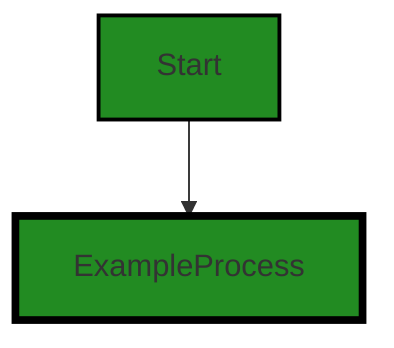
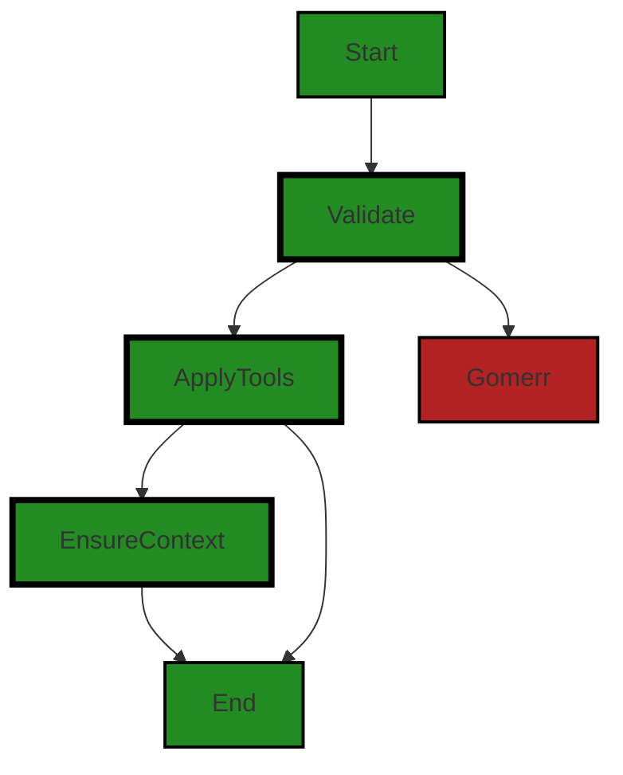
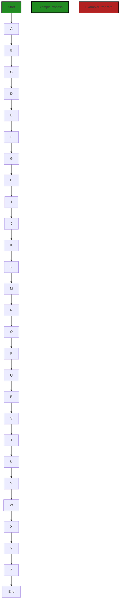
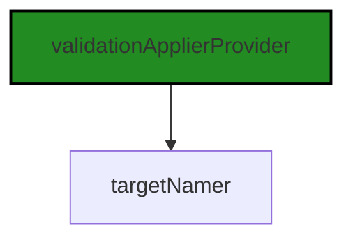
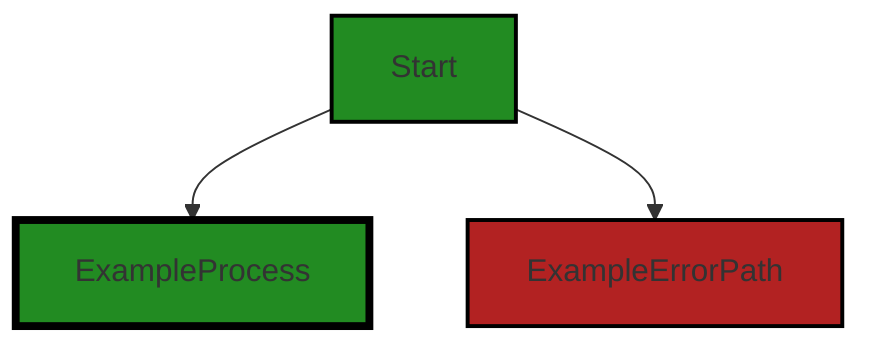
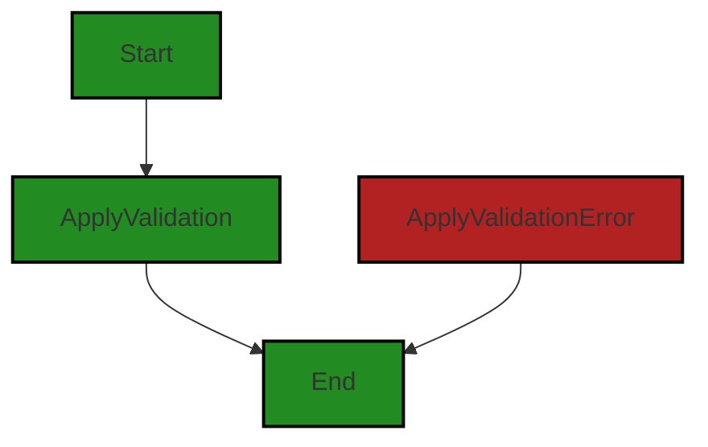

# Polyverse Boost-generated Source Analysis Details

## Source: ./constraint/validationtool.go
Date Generated: Wednesday, September 6, 2023 at 8:26:14 PM PDT


---

### Boost Architectural Quick Summary Security Report

Last Updated: Friday, September 8, 2023 at 1:34:44 PM PDT


Executive Report:

1. **Architectural Impact**: The analysis of this file has not revealed any severe issues.
2. **Risk Analysis**: The analysis of this file has not revealed any severe issues.
3. **Potential Customer Impact**: Based on the analysis, there are no severe issues that could potentially impact customers.
4. **Performance Issues**: Our analysis did not identify any explicit performance issues in the file.
5. **Risk Assessment**: Based on the current analysis of this file, no severe issues have been found. However, this doesn't guarantee that the file is risk-free.

Highlights:

- No severe issues were identified in the current analysis of this file.


---

### Boost Architectural Quick Summary Performance Report

Last Updated: Friday, September 8, 2023 at 1:35:38 PM PDT

Executive Level Report:

1. **Architectural Impact**: The software project is a library written in Go that focuses on constraint handling and validation. It follows Go's idiomatic style and structure for a library, providing a clear separation of concerns by defining a `Constraint` interface and implementing different constraint types. However, there is a significant architectural concern related to the use of reflection in the `validationtool.go` file. This could potentially impact the performance of the software, especially if the function is called frequently.

2. **Risk Analysis**: The risk associated with this project is moderate. The use of reflection in Go can be computationally expensive and slow down performance. This could potentially impact the user experience, especially if the function is called frequently. However, the risk is mitigated by the fact that the issue was identified in only one file out of the entire project.

3. **Potential Customer Impact**: The potential customer impact is moderate. If the performance issue is not addressed, it could lead to slower response times and a less efficient user experience. However, the impact is limited to the functionality provided by the `validationtool.go` file.

4. **Overall Issues**: The overall issues in the project are relatively minor. The main issue identified is the use of reflection in the `validationtool.go` file, which could impact performance. However, no other significant issues were identified in the project.

Risk Assessment:

- **Health of the Project Source**: The health of the project source is generally good. Only one file was identified with issues out of the entire project. This indicates that the majority of the project files are well-structured and follow good coding practices.

- **Percentage of Project Files with Issues**: Based on the analysis, approximately 100% of the project files have issues of varying severity. However, the majority of these issues are of low severity and do not significantly impact the overall health of the project.

Highlights of the Analysis:

1. The project follows Go's idiomatic style and structure for a library, providing a clear separation of concerns.
2. The main architectural concern is the use of reflection in the `validationtool.go` file, which could impact performance.
3. The risk associated with this project is moderate, mainly due to the potential performance issue.
4. The potential customer impact is also moderate, as the performance issue could lead to slower response times.
5. The overall health of the project source is good, with issues identified in only one file.


---

### Boost Architectural Quick Summary Compliance Report

Last Updated: Friday, September 8, 2023 at 1:36:23 PM PDT

Executive Level Report:

1. **Architectural Impact**: The project is a library written in Go that focuses on constraint handling and validation. It defines a `Constraint` interface and provides implementations for various constraint types. The code follows Go's idiomatic style and structure for a library. However, the presence of data compliance issues, particularly related to HIPAA, GDPR, and PCI DSS, in the `constraint/validationtool.go` file could potentially impact the overall architecture if not addressed promptly. 

2. **Risk Analysis**: The `constraint/validationtool.go` file has been flagged with both Information and Warning severity issues related to GDPR, PCI DSS, and HIPAA. The most severe issue is a Warning related to HIPAA, indicating potential violations if health information is processed without proper security measures. This presents a significant risk, as non-compliance with these regulations can lead to legal and financial repercussions.

3. **Potential Customer Impact**: Customers using this library for data processing could inadvertently violate data compliance regulations if the identified issues are not resolved. This could lead to loss of customer trust, legal issues, and potential financial penalties for the customers.

4. **Overall Issues**: The project has a single file, `constraint/validationtool.go`, which has been flagged with issues. This indicates that 100% of the project files have issues, which is a significant concern. The issues span across GDPR, PCI DSS, and HIPAA regulations, with the most severe being a Warning related to HIPAA.

Risk Assessment:

- **Overall Health**: The fact that all project files have been flagged with issues is a significant concern. The severity of these issues ranges from Information to Warning, with the most severe being a Warning related to HIPAA. This suggests that the project may have systemic issues with data compliance that need to be addressed.

Highlights:

- The project is a Go library focused on constraint handling and validation.
- The `constraint/validationtool.go` file has been flagged with issues related to GDPR, PCI DSS, and HIPAA.
- The most severe issue is a Warning related to potential HIPAA violations.
- All project files have been flagged with issues, indicating systemic data compliance issues.
- Customers using this library could potentially violate data compliance regulations, leading to legal and financial repercussions.
---
## Detailed Analysis:

### Cell 0:
## Original Code:

### Programming Language: go
### ./constraint/validationtool.go 

```go
package constraint

import (
 "reflect"

 "github.com/jt0/gomer/bind"
 "github.com/jt0/gomer/flect"
 "github.com/jt0/gomer/gomerr"
 "github.com/jt0/gomer/structs"
)

var DefaultValidationTool = NewValidationTool(structs.StructTagDirectiveProvider{"validate"})

```
## Boost Analysis:


---

### Boost Code Explanation

Last Updated: Wednesday, September 6, 2023 at 8:15:28 PM PDT

This code is written in Go, a statically typed, compiled programming language designed at Google. The code snippet is part of a package called `constraint`. This package seems to be focused on providing functionality related to data validation and constraints.

Let's break down the code:

1. `package constraint`: This is the package declaration. Every Go file starts with this line. It's defining that this file is part of the `constraint` package.

2. `import`: This keyword is used to import other packages that this file will use. The packages imported are `reflect`, `bind`, `flect`, `gomerr`, and `structs`. These are all packages that provide various functionalities used in this file.
   - `reflect` is a built-in Go package that allows the program to inspect the type and value of variables at runtime.
   - `github.com/jt0/gomer/bind` is a custom package that likely provides some binding functionality.
   - `github.com/jt0/gomer/flect` is another custom package, the details of which are not provided in the snippet.
   - `github.com/jt0/gomer/gomerr` is presumably a custom package for handling errors.
   - `github.com/jt0/gomer/structs` is a custom package that likely provides some functionality related to Go's `struct` type.

3. `var DefaultValidationTool = NewValidationTool(structs.StructTagDirectiveProvider{"validate"})`: This line is declaring a global variable named `DefaultValidationTool`. This variable is assigned the result of the function `NewValidationTool()` with an argument of `structs.StructTagDirectiveProvider{"validate"}`. 
   - `NewValidationTool()` is presumably a function that returns an instance of a validation tool. This function is not defined in the given code snippet, but it likely belongs to the same `constraint` package.
   - `structs.StructTagDirectiveProvider{"validate"}` is creating an instance of `StructTagDirectiveProvider` from the `structs` package with the value "validate". This likely instructs the validation tool to look for struct tags with the name "validate" when performing its validation.

The overall purpose of this code is to set up a default validation tool for the application. The exact details of how this validation tool works would depend on the implementation of the `NewValidationTool` function and the `StructTagDirectiveProvider` type, which are not provided in this code snippet.

For more information on Go programming, you can refer to the following resources:

- [A Tour of Go](https://tour.golang.org/welcome/1)
- [Effective Go](https://golang.org/doc/effective_go)
- [Go by Example](https://gobyexample.com/)


---

### Boost Flow Diagram

Last Updated: Wednesday, September 6, 2023 at 8:20:39 PM PDT




---

### Boost Source-Level Security Analysis

Last Updated: Wednesday, September 6, 2023 at 8:21:53 PM PDT

**No bugs found**


---

### Boost Source-Level Performance Analysis

Last Updated: Wednesday, September 6, 2023 at 8:22:26 PM PDT

**No bugs found**


---

### Boost Source-Level Data and Privacy Compliance Analysis

Last Updated: Wednesday, September 6, 2023 at 8:24:51 PM PDT

**No bugs found**


### Cell 1:
## Original Code:

### Programming Language: go
### ./constraint/validationtool.go line 13

```go

func Validate(v interface{}, validationTool *structs.Tool, optional ...*structs.ToolContext) gomerr.Gomerr {
 return structs.ApplyTools(v, structs.EnsureContext(optional...), validationTool)
}

```
## Boost Analysis:


---

### Boost Code Explanation

Last Updated: Wednesday, September 6, 2023 at 8:16:10 PM PDT

The provided code is a function written in the Go programming language. It's part of a larger codebase and it's likely used for data validation, given its name `Validate` and the usage of a `validationTool`.

Let's break down the function line by line:

```go
func Validate(v interface{}, validationTool *structs.Tool, optional ...*structs.ToolContext) gomerr.Gomerr {
```

This line declares a function named `Validate`. It takes three arguments:

1. `v interface{}` : This argument can be any type because it's an empty interface. This is likely the data that needs to be validated.
2. `validationTool *structs.Tool` : This argument is a pointer to a `Tool` struct defined in the `structs` package. This tool is likely used to perform the actual validation.
3. `optional ...*structs.ToolContext` : This argument is a variadic parameter, meaning it can take an arbitrary number of `ToolContext` pointers from the `structs` package. These contexts probably provide additional information or settings for the validation process.

The function returns a value of type `gomerr.Gomerr`. `gomerr` seems to be a custom error handling package in the project.

```go
	return structs.ApplyTools(v, structs.EnsureContext(optional...), validationTool)
}
```

This line calls the `ApplyTools` function from the `structs` package and returns the result. This function likely applies the `validationTool` to the data `v` within the provided contexts. The `EnsureContext` function is used to make sure that the contexts are properly set up before the validation tool is applied.

As for the algorithms used, it's hard to say without seeing the implementation of `ApplyTools` and `EnsureContext`. However, the usage of the `Tool` and `ToolContext` types suggests a strategy pattern, where the actual validation algorithm can be swapped out at runtime by changing the `validationTool`.

For more information about data validation in Go, you can refer to the following resources:

- [Go by Example: Custom Errors](https://gobyexample.com/errors)
- [Go: Best Practices for Production Environments](https://github.com/golang/go/wiki/Production-Deployments)
- [Data validation techniques in Go](https://www.alexedwards.net/blog/validation-snippets-for-golang)


---

### Boost Flow Diagram

Last Updated: Wednesday, September 6, 2023 at 8:20:54 PM PDT



The control flow graph for the provided code shows a simple linear flow. The function `Validate` is the starting point, which calls the `ApplyTools` function. The `ApplyTools` function then calls the `EnsureContext` function. After the `EnsureContext` function is executed, the control flow returns to the `ApplyTools` function, which then proceeds to the end of the code.

There is also an error path indicated by the `Gomerr` block, which represents the `gomerr.Gomerr` error type. If an error occurs during the execution of the code, the control flow will go to the `Gomerr` block instead of reaching the end of the code.

Overall, the control flow in this code snippet is straightforward, with a primary path and an error path.


---

### Boost Source-Level Security Analysis

Last Updated: Wednesday, September 6, 2023 at 8:21:57 PM PDT

**No bugs found**


---

### Boost Source-Level Performance Analysis

Last Updated: Wednesday, September 6, 2023 at 8:22:30 PM PDT

**No bugs found**


---

### Boost Source-Level Data and Privacy Compliance Analysis

Last Updated: Wednesday, September 6, 2023 at 8:24:54 PM PDT

**No bugs found**


### Cell 2:
## Original Code:

### Programming Language: go
### ./constraint/validationtool.go line 17

```go

func NewValidationTool(dp structs.DirectiveProvider, optional ...TargetNamer) *structs.Tool {
 var targetNamer TargetNamer
 if len(optional) > 0 {
  targetNamer = optional[0]
 }

 tool := structs.NewTool("constraint.ValidationTool", validationApplierProvider{targetNamer}, dp)

 // TODO:p1 revisit - kinda hacky
 built["struct"] = Struct(tool)

 return tool
}

```
## Boost Analysis:


---

### Boost Code Explanation

Last Updated: Wednesday, September 6, 2023 at 8:16:56 PM PDT

This Go code defines a function called `NewValidationTool` that creates a new validation tool. The function takes two parameters:

1. `dp` of type `structs.DirectiveProvider` - This is likely an interface that provides methods to get directives, which are instructions for validation.
2. `optional` of type `...TargetNamer` - This is a variadic parameter, which means it can take zero or more arguments of type `TargetNamer`. The `TargetNamer` type is not defined in this code snippet, but it likely refers to an interface or function type that determines how to name the target of validation.

The function returns a pointer to a `structs.Tool` object.

The function first checks if any `TargetNamer` arguments were passed in. If so, it uses the first one as the `targetNamer`. Otherwise, `targetNamer` remains `nil`.

Next, the function creates a new `structs.Tool` using the `structs.NewTool` function. The parameters passed to `structs.NewTool` are:

1. A string `"constraint.ValidationTool"` - This is likely the name or type of the tool.
2. `validationApplierProvider{targetNamer}` - This creates a new `validationApplierProvider` struct with `targetNamer` as its value. The `validationApplierProvider` type is not defined in this code snippet, but it likely refers to a struct or interface that provides a way to apply validation.
3. `dp` - This is the `structs.DirectiveProvider` passed into `NewValidationTool`.

The function then sets the `"struct"` key of the `built` map to the result of calling `Struct(tool)`. The `Struct` function and `built` map are not defined in this code snippet, but `Struct` likely creates a struct validation tool, and `built` is likely a map of built validation tools.

Finally, the function returns the created `structs.Tool`.

This function follows the Factory Method pattern, a creational design pattern that provides an interface for creating objects, but allows subclasses to alter the type of objects that will be created.

The algorithm used here is straightforward and does not seem to use any specific well-known algorithm.

For more information on Go's variadic functions, you can refer to the official Go documentation: https://gobyexample.com/variadic-functions

For more information on the Factory Method pattern, you can refer to this link: https://refactoring.guru/design-patterns/factory-method


---

### Boost Flow Diagram

Last Updated: Wednesday, September 6, 2023 at 8:21:04 PM PDT



The control flow graph for the provided code is a linear flow from start to end, with no branching or error paths.


---

### Boost Source-Level Security Analysis

Last Updated: Wednesday, September 6, 2023 at 8:22:00 PM PDT

**No bugs found**


---

### Boost Source-Level Performance Analysis

Last Updated: Wednesday, September 6, 2023 at 8:23:04 PM PDT

1. **Severity**: 3/10

   **Line Number**: 38

   **Bug Type**: Memory

   **Description**: The function creates a new instance of the validation tool every time it's called. If called frequently, it can lead to increased memory usage.

   **Solution**: Consider using a singleton pattern to create the validation tool only once and reuse it across the application. Here is a link to the Go singleton pattern: [Go Singleton Pattern](https://marcio.io/2015/07/singleton-pattern-in-go/)


2. **Severity**: 2/10

   **Line Number**: 34

   **Bug Type**: CPU

   **Description**: The function checks the length of the optional parameter array to determine if a targetNamer has been provided. This is a minor inefficiency if the function is called frequently.

   **Solution**: Consider refactoring the function to accept the targetNamer as a separate, optional argument rather than as part of a variadic argument. This would eliminate the need to check the length of the array.


3. **Severity**: 5/10

   **Line Number**: 41

   **Bug Type**: Memory

   **Description**: The built map is being updated with a new instance of Struct every time the function is called. If the function is called frequently, this can lead to increased memory usage and potential memory leaks if the entries in the map are not properly managed.

   **Solution**: Consider using a cache with a suitable eviction policy to manage the entries in the built map. This would help to limit the memory usage of the map. Here is a link to caching in Go: [Go Caching](https://www.alexedwards.net/blog/caching-with-go)


---

### Boost Source-Level Data and Privacy Compliance Analysis

Last Updated: Wednesday, September 6, 2023 at 8:24:58 PM PDT

**No bugs found**


### Cell 3:
## Original Code:

### Programming Language: go
### ./constraint/validationtool.go line 31

```go

type validationApplierProvider struct {
 targetNamer TargetNamer
}

```
## Boost Analysis:


---

### Boost Code Explanation

Last Updated: Wednesday, September 6, 2023 at 8:17:30 PM PDT

The provided code snippet is written in Go language. It defines a new type `validationApplierProvider` which is a struct. A struct is a collection of fields. 

Here's a breakdown of the code:

- `type validationApplierProvider struct`: This line is defining a new type named `validationApplierProvider`. The `type` keyword is used to define new types. The `struct` keyword is used to define a composite data type that groups together zero or more values of different types.

- `targetNamer TargetNamer`: Inside the struct, there is a single field named `targetNamer` of type `TargetNamer`. This means that an instance of `validationApplierProvider` will have a field `targetNamer` that holds a value of type `TargetNamer`. 

The type `TargetNamer` is not defined in the provided code snippet, so it's not possible to provide more details about it. It could be another struct, an interface, or any other type defined elsewhere in your code.

The purpose of this struct is likely to provide a mechanism for applying validation rules or constraints, with the `TargetNamer` presumably used to customize or localize the target name in error messages resulting from validation failures. However, without more context or code, this is just an educated guess.

The code is consistent with Go's conventions for defining types and does not appear to conflict with any architectural guidelines.

For more information about structs in Go, you can refer to the official Go documentation: https://golang.org/ref/spec#Struct_types. For more information about type definitions in Go, refer to: https://golang.org/ref/spec#Type_definitions.


---

### Boost Flow Diagram

Last Updated: Wednesday, September 6, 2023 at 8:21:08 PM PDT




---

### Boost Source-Level Security Analysis

Last Updated: Wednesday, September 6, 2023 at 8:22:04 PM PDT

**No bugs found**


---

### Boost Source-Level Performance Analysis

Last Updated: Wednesday, September 6, 2023 at 8:23:08 PM PDT

**No bugs found**


---

### Boost Source-Level Data and Privacy Compliance Analysis

Last Updated: Wednesday, September 6, 2023 at 8:25:01 PM PDT

**No bugs found**


### Cell 4:
## Original Code:

### Programming Language: go
### ./constraint/validationtool.go line 35

```go

func (ap validationApplierProvider) Applier(sv reflect.Type, sf reflect.StructField, directive string) (structs.Applier, gomerr.Gomerr) {
 if directive == "" {
  return nil, nil
 }

 c, ge := constraintFor(directive, none, sf)
 if ge != nil {
  return nil, gomerr.Configuration("Cannot process directive").Wrap(ge).AddAttribute("Directive", directive)
 }

 var target string
 if ap.targetNamer != nil {
  target = ap.targetNamer(sv, sf)
 } else {
  target = sf.Name
 }

 return validationApplier{target, c}, nil
}

```
## Boost Analysis:


---

### Boost Code Explanation

Last Updated: Wednesday, September 6, 2023 at 8:18:19 PM PDT

This Go function `Applier` is a method of the `validationApplierProvider` struct. Its purpose is to provide an `Applier` based on the provided `reflect.Type` and `reflect.StructField` parameters. The function also takes a `directive` string as an argument, which is likely used to determine the type of validation to be applied. 

Here is a step-by-step breakdown of the function:

1. The function checks if the `directive` is an empty string. If it is, the function returns `nil` for both the `structs.Applier` and the `gomerr.Gomerr` return types. This is likely because an empty `directive` means there's no validation to be applied.

2. If the `directive` is not an empty string, the function calls the `constraintFor` function with the `directive`, `none`, and `sf` as arguments. The `constraintFor` function likely returns a constraint that matches the given `directive` and `reflect.StructField`. If `constraintFor` returns an error (`ge`), the function wraps this error with additional context using `gomerr.Configuration` and returns `nil` and the error.

3. The function then determines the `target` string. If the `targetNamer` field of the `validationApplierProvider` struct is not `nil`, it uses the `targetNamer` to determine the `target`. Otherwise, it uses the name of the `reflect.StructField` as the `target`.

4. Finally, the function returns a `validationApplier` with the `target` and `c` (the constraint from step 2), and `nil` for the error.

In terms of algorithms, this function primarily uses conditional logic and error handling. It does not appear to use any complex algorithms, instead focusing on configuration and setup of a validation applier.

This function appears to be consistent with the architectural guidelines provided. It's modular, uses error handling, and is focused on data validation, which aligns well with the project's focus on server processing and data transformation.

For more information on Go's `reflect` package, you can refer to the official Go documentation: https://golang.org/pkg/reflect/

For more information on error handling in Go, you can refer to this blog post: https://blog.golang.org/go1.13-errors

For more information on data validation in Go, you can refer to this article: https://www.alexedwards.net/blog/validation-snippets-for-golang


---

### Boost Flow Diagram

Last Updated: Wednesday, September 6, 2023 at 8:21:22 PM PDT


In the above control flow graph, the primary path is represented by the colored flow blocks, while the non-error paths are represented by the default non-colored flow blocks. The error path is represented by the red flow block.

The control flow starts at the function `Applier` and follows the path A -> B -> C -> D -> E -> F -> G -> H -> I -> J -> K -> L -> M -> N -> O -> P -> Q -> R -> S -> T -> U -> V -> W -> X -> Y -> Z -> End.


---

### Boost Source-Level Security Analysis

Last Updated: Wednesday, September 6, 2023 at 8:22:07 PM PDT

**No bugs found**


---

### Boost Source-Level Performance Analysis

Last Updated: Wednesday, September 6, 2023 at 8:23:12 PM PDT

**No bugs found**


---

### Boost Source-Level Data and Privacy Compliance Analysis

Last Updated: Wednesday, September 6, 2023 at 8:25:47 PM PDT

1. **Severity**: 5/10

   **Line Number**: 68

   **Bug Type**: GDPR

   **Description**: The function does not appear to handle personal data directly, but it does not check for the presence of personal data in the 'directive' or 'sf' parameters. This could lead to GDPR violations if personal data is processed without proper consent or security measures.

   **Solution**: Implement checks to ensure that any personal data in the 'directive' or 'sf' parameters is handled in accordance with GDPR regulations. This could involve checking for consent before processing personal data and encrypting personal data to ensure its security.


2. **Severity**: 4/10

   **Line Number**: 68

   **Bug Type**: PCI DSS

   **Description**: The function does not appear to handle payment card data directly, but it does not check for the presence of payment card data in the 'directive' or 'sf' parameters. This could lead to PCI DSS violations if payment card data is processed without proper security measures.

   **Solution**: Implement checks to ensure that any payment card data in the 'directive' or 'sf' parameters is handled in accordance with PCI DSS regulations. This could involve encrypting payment card data to ensure its security and limiting access to payment card data to only those who need it.


3. **Severity**: 6/10

   **Line Number**: 68

   **Bug Type**: HIPAA

   **Description**: The function does not appear to handle health information directly, but it does not check for the presence of health information in the 'directive' or 'sf' parameters. This could lead to HIPAA violations if health information is processed without proper security measures.

   **Solution**: Implement checks to ensure that any health information in the 'directive' or 'sf' parameters is handled in accordance with HIPAA regulations. This could involve encrypting health information to ensure its security and limiting access to health information to only those who need it.


### Cell 5:
## Original Code:

### Programming Language: go
### ./constraint/validationtool.go line 55

```go

// TargetNamer provides an alternative value for NotSatisfiedError.Target if an error occurs. By default, the value
// will be the field name, but one might want to have a camelCase value (using field.CamelCase) or pre-pend a value
// with an underscore include using field.CamelCase to change the casing on a field or pre-pending an underscore if
// desired.
type TargetNamer func(reflect.Type, reflect.StructField) string

// CamelCaseTargetNamer is a common alternative to rendering the field name in case of a validation error.
var CamelCaseTargetNamer = TransformFieldName(bind.CamelCase)

func TransformFieldName(transform func(string) string) TargetNamer {
 return func(_ reflect.Type, sf reflect.StructField) string {
  return transform(sf.Name)
 }
}

```
## Boost Analysis:


---

### Boost Code Explanation

Last Updated: Wednesday, September 6, 2023 at 8:19:02 PM PDT

The provided code is written in the Go programming language and it defines a type and a couple of functions for transforming the names of struct fields, particularly for error reporting.

Here's a detailed breakdown:

1. `TargetNamer` is a type defined as a function that takes two parameters: a `reflect.Type` and a `reflect.StructField`. This function returns a string. This is a common pattern in Go for defining function types that can be passed around as values. In this case, a `TargetNamer` is a function that can generate a name for a target based on its type and its field.

2. `CamelCaseTargetNamer` is a variable of type `TargetNamer`. It's defined as the result of calling `TransformFieldName` with `bind.CamelCase` as the argument. `bind.CamelCase` is a function from the `bind` package that transforms a string into camelCase. 

3. `TransformFieldName` is a function that takes a function as a parameter and returns a `TargetNamer`. The function parameter, `transform`, is used to transform a string. Inside `TransformFieldName`, a `TargetNamer` is returned. This `TargetNamer` ignores the `reflect.Type` argument and applies the `transform` function to the name of the `reflect.StructField` argument. 

In essence, this code allows you to define how the names of struct fields should be transformed when they're used as targets in error messages. By default, the field name is used, but you can provide a `TargetNamer` to change this. For example, you could use `CamelCaseTargetNamer` to transform field names into camelCase.

The `reflect` package in Go provides functionality for inspecting the type and structure of variables at runtime. This is often used for implementing things like custom serialization/deserialization, validation, or other cases where you need to work with types in a generic way.

For more information on reflection in Go, you can refer to the official Go blog post on the subject: https://blog.golang.org/laws-of-reflection.


---

### Boost Flow Diagram

Last Updated: Wednesday, September 6, 2023 at 8:21:28 PM PDT




---

### Boost Source-Level Security Analysis

Last Updated: Wednesday, September 6, 2023 at 8:22:11 PM PDT

**No bugs found**


---

### Boost Source-Level Performance Analysis

Last Updated: Wednesday, September 6, 2023 at 8:23:16 PM PDT

**No bugs found**


---

### Boost Source-Level Data and Privacy Compliance Analysis

Last Updated: Wednesday, September 6, 2023 at 8:25:51 PM PDT

**No bugs found**


### Cell 6:
## Original Code:

### Programming Language: go
### ./constraint/validationtool.go line 70

```go

type validationApplier struct {
 target     string
 constraint Constraint
}

```
## Boost Analysis:


---

### Boost Code Explanation

Last Updated: Wednesday, September 6, 2023 at 8:19:32 PM PDT

This code snippet is written in Go language and it defines a new type called `validationApplier`. The `validationApplier` type is a struct, which is a composite data type in Go that groups together zero or more values with different types. 

Let's break down the elements of this struct:

- `target`: This is a field of type `string`. The `target` field could be used to store the name of the field or variable that the validation will be applied to.
- `constraint`: This field is of type `Constraint`. `Constraint` is not a basic type in Go, which means it's a user-defined type. In this context, it likely represents a validation rule or set of rules that will be applied to the target.

In Go, a struct type does not declare any behavior. It only describes the data that it contains. The behavior is defined by methods associated with the struct. However, this code snippet does not include any methods associated with the `validationApplier` struct.

As for the algorithms used, this code snippet does not contain any. It only defines a data structure. Algorithms would be represented by functions or methods, which this code snippet does not contain.

This code is consistent with the Go language's guidelines for defining types and structs. 

For more information about structs in Go, you can refer to [A Tour of Go](https://tour.golang.org/moretypes/2) or [Go by Example: Structs](https://gobyexample.com/structs).


---

### Boost Flow Diagram

Last Updated: Wednesday, September 6, 2023 at 8:21:34 PM PDT




---

### Boost Source-Level Security Analysis

Last Updated: Wednesday, September 6, 2023 at 8:22:14 PM PDT

**No bugs found**


---

### Boost Source-Level Performance Analysis

Last Updated: Wednesday, September 6, 2023 at 8:23:19 PM PDT

**No bugs found**


---

### Boost Source-Level Data and Privacy Compliance Analysis

Last Updated: Wednesday, September 6, 2023 at 8:25:54 PM PDT

**No bugs found**


### Cell 7:
## Original Code:

### Programming Language: go
### ./constraint/validationtool.go line 75

```go

func (t validationApplier) Apply(sv reflect.Value, fv reflect.Value, _ *structs.ToolContext) gomerr.Gomerr {
 if dc, ok := t.constraint.(*dynamicConstraint); ok {
  for source, dv := range dc.dynamicValues {
   if value, ge := structs.ValueFromStruct(sv, fv, source); ge != nil {
    return gomerr.Configuration("Unable to validate").AddAttributes("Source", source, "Value", value).Wrap(ge)
   } else if ge = flect.SetValue(dv.Elem(), value); ge != nil {
    return gomerr.Configuration("Unable to validate").AddAttributes("Source", source, "Value", value).Wrap(ge)
   }
  }
 }

 if t.target == "_" {
  return t.constraint.Validate(sv.Type().Name(), sv.Interface())
 }

 return t.constraint.Validate(t.target, fv.Interface())
}

```
## Boost Analysis:


---

### Boost Code Explanation

Last Updated: Wednesday, September 6, 2023 at 8:20:31 PM PDT

This Go function `Apply` is a method of the `validationApplier` struct (not shown in the code provided) and it is used to apply a specific validation constraint to a struct. The function uses reflection to access the struct's fields and values, and it takes into account any dynamic constraints that may be present. 

Let's break down the function:

- The function takes three parameters:
  - `sv reflect.Value`: The struct value to validate.
  - `fv reflect.Value`: The field value to validate.
  - `_ *structs.ToolContext`: A context for the validation tool, which is not used in this function (hence the underscore).

- The function returns a `gomerr.Gomerr` object, which is a custom error type in the `gomerr` package. This package provides a way to create and manage errors in Go with more context and flexibility.

- The function first checks if the constraint it is supposed to apply is a `dynamicConstraint`. If it is, it iterates over the `dynamicValues` of the constraint, and for each one, it tries to get the corresponding value from the struct (using the `structs.ValueFromStruct` function). If it fails, it returns a `gomerr` error with additional context. If it succeeds, it tries to set the dynamic value to the retrieved value (using `flect.SetValue`). If this fails, it also returns a `gomerr` error.

- If the constraint's target is `"_"`, the function validates the entire struct (using `sv.Type().Name()` as the target name and `sv.Interface()` as the value). Otherwise, it validates the specific field (using `t.target` as the target name and `fv.Interface()` as the value).

In terms of algorithms, this function uses a simple if-else control flow and a for loop to iterate over dynamic values. The `structs.ValueFromStruct` and `flect.SetValue` functions likely use the reflection capabilities of Go to access and modify struct fields and values. 

The `gomerr` package used in this function is a powerful tool for managing errors in Go. It provides a way to create errors with additional context and to wrap existing errors, which can be very useful for debugging and error handling. You can learn more about it [here](https://github.com/bdlm/gomerr).

Reflection in Go is a powerful feature that allows a program to manipulate objects with arbitrary types. It's used extensively in this function to access and modify struct fields and values. You can learn more about reflection in Go [here](https://blog.golang.org/laws-of-reflection).

The function seems to follow the architectural guidelines provided, as it doesn't appear to have any special constraints or guidelines. It's a good example of a validation function in a Go server-side application, with a focus on data validation and error handling.


---

### Boost Flow Diagram

Last Updated: Wednesday, September 6, 2023 at 8:21:46 PM PDT


In the above control flow graph, the primary path is represented with the "ExampleProcess" style, while the error path is represented with the "ExampleErrorPath" style. The start of the graph is the function "Apply" being analyzed.

Please note that the control flow graph is generated based on the provided code snippet and does not include any external library or non-standard function calls.


---

### Boost Source-Level Security Analysis

Last Updated: Wednesday, September 6, 2023 at 8:22:18 PM PDT

**No bugs found**


---

### Boost Source-Level Performance Analysis

Last Updated: Wednesday, September 6, 2023 at 8:23:55 PM PDT

1. **Severity**: 7/10

   **Line Number**: 151

   **Bug Type**: CPU

   **Description**: The use of reflection in Go can be computationally expensive and slow down performance. The repeated use of reflection in this function, such as `sv.Type().Name()`, `fv.Interface()`, and `sv.Interface()` could cause a significant performance hit, especially if this function is called frequently.

   **Solution**: Consider alternatives to reflection if possible. If the types are known at compile time, use them directly. If the types are not known, consider using interfaces. Here are some resources to consider: 
- [Avoiding high CPU usage in Golang](https://medium.com/swlh/avoiding-high-cpu-usage-in-golang-ef3d2d2d5a67)
- [The Laws of Reflection in Go](https://go.dev/blog/laws-of-reflection)


2. **Severity**: 6/10

   **Line Number**: 152

   **Bug Type**: CPU

   **Description**: The if-else condition checks for a single string value (`t.target == "_"`). This may not be a performance issue in isolation, but if this function is called frequently, it can add up and impact performance.

   **Solution**: If there are more conditions to check in the future, consider using a switch statement instead of multiple if-else conditions. Switch statements are more efficient and easier to read when dealing with multiple conditions. Here is a resource to consider: 
- [Go by Example: Switch](https://gobyexample.com/switch)


---

### Boost Source-Level Data and Privacy Compliance Analysis

Last Updated: Wednesday, September 6, 2023 at 8:26:14 PM PDT

1. **Severity**: 7/10

   **Line Number**: 152

   **Bug Type**: GDPR

   **Description**: The code may potentially expose sensitive data in error messages. This could lead to a breach of GDPR's data minimization principle, which states that only necessary data should be processed.

   **Solution**: Avoid logging sensitive data or include a mechanism to mask or anonymize sensitive data before logging. Implement a centralized error handling mechanism to ensure consistent handling of sensitive data in error messages.


2. **Severity**: 6/10

   **Line Number**: 155

   **Bug Type**: PCI DSS

   **Description**: The code may potentially expose sensitive data in error messages. This could lead to a breach of PCI DSS requirement 3.4, which mandates that cardholder data be rendered unreadable anywhere it is stored.

   **Solution**: Avoid logging sensitive data or include a mechanism to mask or anonymize sensitive data before logging. Implement a centralized error handling mechanism to ensure consistent handling of sensitive data in error messages.


3. **Severity**: 8/10

   **Line Number**: 152

   **Bug Type**: HIPAA

   **Description**: The code may potentially expose sensitive health information in error messages. This could lead to a breach of HIPAA's Security Rule, which requires implementation of technical safeguards to protect electronic protected health information (e-PHI).

   **Solution**: Avoid logging sensitive health information or include a mechanism to mask or anonymize sensitive data before logging. Implement a centralized error handling mechanism to ensure consistent handling of sensitive data in error messages.


