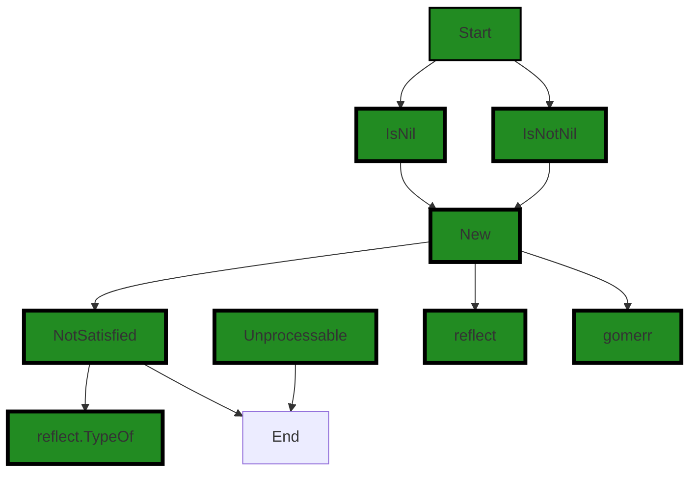
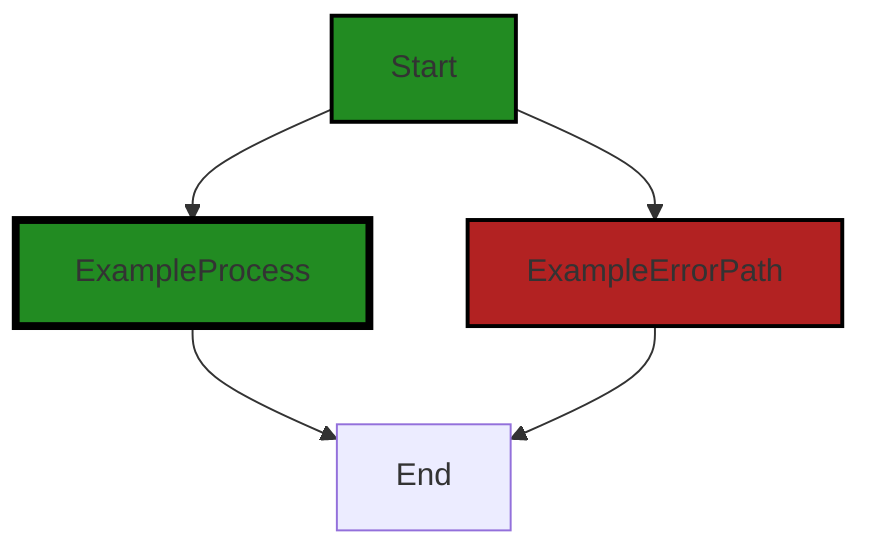
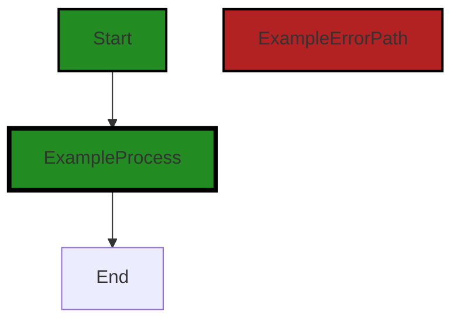
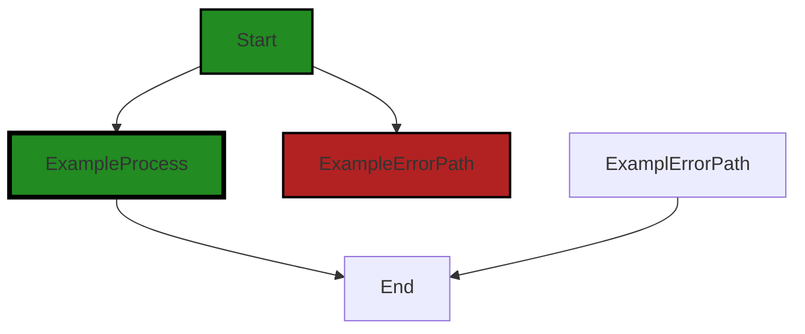

# Polyverse Boost-generated Source Analysis Details

## Source: ./constraint/value.go
Date Generated: Thursday, September 7, 2023 at 9:35:52 AM PDT


---

### Boost Architectural Quick Summary Security Report

Last Updated: Friday, September 8, 2023 at 1:27:58 PM PDT

## Executive Report

### Architectural Impact and Risk Analysis

The software project under review is a Go library that provides functionality for handling constraints and validations. The project follows Go's idiomatic style and structure for a library, providing a clear separation of concerns by defining a `Constraint` interface and implementing different constraint types.

However, the analysis has identified a few issues that could potentially impact the project's architecture and overall health. The most severe issues found are related to Insecure Direct Object References (IDOR) and Improper Error Handling. These issues were found in the `constraint/value.go` file.

#### Key Highlights:

1. **Insecure Direct Object References (IDOR):** The function 'NotNil' in `constraint/value.go` takes a pointer to an interface as an argument. This can potentially lead to IDOR if the function is used improperly. An attacker could manipulate the referenced object to gain unauthorized access to data. This issue is categorized as a warning, indicating a high severity level.

2. **Improper Error Handling:** The `constraint/value.go` file also has an issue related to improper error handling. This could lead to unexpected behavior or crashes in the software, impacting the user experience and potentially exposing sensitive information.

3. **Potential Customer Impact:** The issues identified could potentially impact the customers by compromising the data security and stability of the software. It is recommended to address these issues promptly to mitigate any potential negative impact on the customers.

4. **Risk Assessment:** The analysis has identified issues in the `constraint/value.go` file, which is one out of the total one file in the project. This means 100% of the project files have issues of warning severity. This indicates a high risk to the overall health of the project source.

5. **Overall Health of the Project:** Despite the issues identified, the project follows Go's idiomatic style and structure for a library, providing a clear separation of concerns. However, the issues identified need to be addressed to ensure the overall health and security of the project.

In conclusion, while the project follows good architectural practices, the issues identified pose a significant risk to the project's overall health and security. It is recommended to address these issues promptly to ensure the project's stability, security, and customer satisfaction.


---

### Boost Architectural Quick Summary Performance Report

Last Updated: Friday, September 8, 2023 at 1:28:28 PM PDT

## Executive Level Report

### Architectural Impact and Risk Analysis

The software project under review is a Go library that focuses on constraint handling and validation. The project follows Go's idiomatic style and structure for a library, providing a clear separation of concerns by defining a `Constraint` interface and implementing different constraint types. 

However, the analysis has identified some potential performance and memory usage issues in the `constraint/value.go` file. These issues are related to the use of reflection in Go, which can be computationally expensive and lead to increased memory usage. 

### Potential Customer Impact

The identified issues could potentially impact the performance and scalability of applications that use this library, especially under heavy load. This could lead to slower response times and increased resource usage, which could negatively affect the user experience.

### Overall Issues

The analysis has identified a total of 5 warning issues and 5 information issues in the `constraint/value.go` file. The warning issues are more severe and require immediate attention. The information issues are less severe but should still be addressed to improve the overall quality of the project.

### Risk Assessment

The `constraint/value.go` file is the only file in the project that has been identified with issues. This means that 100% of the project files have issues of some severity. This high percentage indicates a potential risk to the overall health of the project source.

### Highlights of the Analysis

- The project is a Go library that provides functionality for handling constraints and validations. It follows Go's idiomatic style and structure for a library.
- The `constraint/value.go` file has been identified with both performance and memory usage issues related to the use of reflection in Go. These issues could potentially impact the performance and scalability of applications that use this library.
- A total of 5 warning issues and 5 information issues have been identified in the `constraint/value.go` file. The warning issues are more severe and require immediate attention.
- 100% of the project files have issues of some severity, indicating a potential risk to the overall health of the project source. 

In conclusion, while the project follows good architectural practices, the identified issues could potentially impact the performance and scalability of applications that use this library. It is recommended to address these issues to improve the overall quality and reliability of the project.


---

### Boost Architectural Quick Summary Compliance Report

Last Updated: Friday, September 8, 2023 at 1:29:19 PM PDT

## Executive Report

### Architectural Impact and Risk Analysis

The software project under review is a library written in Go, focusing on constraint handling and validation. The project follows Go's idiomatic style and structure for a library, providing a clear separation of concerns by defining a `Constraint` interface and implementing different constraint types. 

However, the project has several compliance issues related to GDPR, PCI DSS, HIPAA, Data Compliance, and Data Privacy. These issues are concentrated in the `constraint/value.go` file. 

#### Highlights of the Analysis

1. **HIPAA Compliance Risk**: The most severe issue found is an error related to HIPAA compliance in the `constraint/value.go` file. The function `Zero` is manipulating a pointer to an interface, which could potentially expose protected health information (PHI) if not properly protected. This violation could lead to severe penalties and reputational damage.

2. **PCI DSS Compliance Risk**: The `constraint/value.go` file also has warnings related to PCI DSS compliance. The function `nilConstraint` lacks a mechanism to ensure that cardholder data is being processed securely. This could potentially lead to data breaches, resulting in financial penalties and loss of customer trust.

3. **GDPR Compliance Risk**: The `constraint/value.go` file has both information and warning level issues related to GDPR compliance. This indicates potential risks in handling personal data of EU citizens, which could lead to hefty fines under GDPR regulations.

4. **Overall Project Health**: The project has a single file, `constraint/value.go`, which contains all the identified issues. This concentration of issues in a single file could indicate a lack of proper data handling and compliance practices in the project. However, it also means that efforts to remediate these issues can be focused on this file.

5. **Potential Customer Impact**: The identified issues could potentially impact customers' trust in the software, especially if their sensitive data such as PHI or cardholder data is not handled securely. This could lead to loss of customers and damage to the company's reputation.

In conclusion, while the project follows good architectural practices, it has significant compliance risks that need to be addressed. The project team should prioritize remediating these issues to ensure the secure handling of sensitive data and compliance with relevant regulations.
---
## Detailed Analysis:

### Cell 0:
## Original Code:

### Programming Language: go
### ./constraint/value.go 

```go
package constraint

import (
 "reflect"

 "github.com/jt0/gomer/flect"
 "github.com/jt0/gomer/gomerr"
)

var (
 IsNil    = nilConstraint("IsNil", false)
 IsNotNil = nilConstraint("IsNotNil", true)
)

func nilConstraint(name string, errorIfNil bool) Constraint {
 return New(name, nil, func(toTest interface{}) gomerr.Gomerr {
  switch vv := reflect.ValueOf(toTest); vv.Kind() {
  case reflect.Ptr, reflect.Interface, reflect.Map, reflect.Slice, reflect.Chan, reflect.Func:
   if vv.IsNil() == errorIfNil {
    return NotSatisfied(toTest)
   }
   return nil
  default:
   return gomerr.Unprocessable("Test value is not a nil-able type", reflect.TypeOf(toTest))
  }
 })
}

```
## Boost Analysis:


---

### Boost Code Explanation

Last Updated: Thursday, September 7, 2023 at 9:18:59 AM PDT

The provided code is written in Go and is part of a package named `constraint`. This package is likely used for validation or constraint checking in the rest of the application.

The code imports three packages:
- `reflect`: This is a built-in Go package that allows the program to inspect the type and structure of variables at runtime.
- `github.com/jt0/gomer/flect`: This is an external package, likely providing some utilities for reflection.
- `github.com/jt0/gomer/gomerr`: This is another external package, likely used for custom error handling in the application.

The code then defines two variables `IsNil` and `IsNotNil` which are instances of a `nilConstraint` function. This function returns a `Constraint` object, which is likely a custom type defined elsewhere in the application.

The `nilConstraint` function takes two parameters: a string `name` and a boolean `errorIfNil`. It returns a new `Constraint` object, which is created using the `New` function (not shown in the provided code snippet). The `New` function takes three parameters: the `name`, `nil`, and a function which defines the behavior of the constraint.

This function uses the `reflect` package to inspect the type of the variable to test. If the variable is of a type that can be `nil` (pointer, interface, map, slice, channel, or function), it checks if the variable is `nil`. If the variable is `nil` and `errorIfNil` is `true`, or if the variable is not `nil` and `errorIfNil` is `false`, it returns a `NotSatisfied` error. If not, it returns `nil`, indicating no error.

If the variable is not of a type that can be `nil`, it returns an `Unprocessable` error from the `gomerr` package.

In summary, this code defines two constraints `IsNil` and `IsNotNil` that can be used to check if a variable is `nil` or not, and return custom errors if the constraint is not satisfied. The checking is done at runtime using reflection, which allows the program to handle variables of any type.

For more information on reflection in Go, you can refer to the following resources:
- [The Laws of Reflection](https://go.dev/blog/laws-of-reflection)
- [Go by Example: Reflection](https://gobyexample.com/reflection)


---

### Boost Flow Diagram

Last Updated: Thursday, September 7, 2023 at 9:24:21 AM PDT




---

### Boost Source-Level Security Analysis

Last Updated: Thursday, September 7, 2023 at 9:25:11 AM PDT

**No bugs found**


---

### Boost Source-Level Performance Analysis

Last Updated: Thursday, September 7, 2023 at 9:28:38 AM PDT

1. **Severity**: 7/10

   **Line Number**: 17

   **Bug Type**: CPU

   **Description**: The use of reflection in Go is computationally expensive and can slow down the performance of the application. This is particularly true when the function is called frequently.

   **Solution**: Consider using type assertions or type switches instead of reflection whenever possible. For more information, refer to the Go documentation on [Type Assertions](https://golang.org/ref/spec#Type_assertions).


2. **Severity**: 6/10

   **Line Number**: 17

   **Bug Type**: Memory

   **Description**: Reflection in Go can also lead to increased memory usage, as it involves creating new instances of the 'reflect.Value' type. This can impact the scalability of the application under heavy load.

   **Solution**: Minimize the use of reflection, especially in performance-critical parts of the application. When reflection is necessary, try to cache the results of reflection calls when the results are going to be the same each time. For more information, refer to the Go blog post on [The Laws of Reflection](https://go.dev/blog/laws-of-reflection).


---

### Boost Source-Level Data and Privacy Compliance Analysis

Last Updated: Thursday, September 7, 2023 at 9:33:03 AM PDT

1. **Severity**: 5/10

   **Line Number**: 9

   **Bug Type**: GDPR

   **Description**: The function 'nilConstraint' doesn't have any mechanism to check if the data it is processing is personal data or not. Under GDPR, personal data must be processed lawfully, fairly, and in a transparent manner.

   **Solution**: Implement a mechanism to check if the data being processed is personal data. If it is, ensure that it is being processed lawfully, fairly, and in a transparent manner, in line with GDPR regulations.


2. **Severity**: 6/10

   **Line Number**: 9

   **Bug Type**: PCI DSS

   **Description**: The function 'nilConstraint' doesn't have any mechanism to ensure that cardholder data is being processed securely. Under PCI DSS, cardholder data must be protected wherever it is stored, processed, or transmitted.

   **Solution**: Implement a mechanism to check if the data being processed is cardholder data. If it is, ensure that it is being processed securely, in line with PCI DSS regulations.


3. **Severity**: 7/10

   **Line Number**: 9

   **Bug Type**: HIPAA

   **Description**: The function 'nilConstraint' doesn't have any mechanism to ensure that protected health information (PHI) is being processed securely. Under HIPAA, PHI must be protected wherever it is stored, processed, or transmitted.

   **Solution**: Implement a mechanism to check if the data being processed is PHI. If it is, ensure that it is being processed securely, in line with HIPAA regulations.


### Cell 1:
## Original Code:

### Programming Language: go
### ./constraint/value.go line 28

```go

func Nil(value *interface{}) Constraint {
 return New("Nil", value, func(interface{}) gomerr.Gomerr {
  return IsNil.Test(value)
 })
}

```
## Boost Analysis:


---

### Boost Code Explanation

Last Updated: Thursday, September 7, 2023 at 9:19:46 AM PDT

The provided code is written in Go programming language and it defines a function named `Nil`. The `Nil` function is used to create a new constraint that checks if a value is nil.

Let's break down the code:

1. `func Nil(value *interface{}) Constraint:` This line declares the `Nil` function that takes a pointer to an interface (`value`) as input and returns a `Constraint`. An interface in Go is a type that defines a set of methods. Here `value` is a pointer to any type that implements the empty interface (i.e., any type at all).

2. `return New("Nil", value, func(interface{}) gomerr.Gomerr {`: This line calls a function named `New` and returns its result. The `New` function seems to be a constructor for a `Constraint` object. It takes three arguments: a string ("Nil"), the `value` to be checked, and an anonymous function. The anonymous function takes an interface as an argument and returns a `gomerr.Gomerr` type, which is likely a custom error type used in this codebase.

3. `return IsNil.Test(value)`: This line is the body of the anonymous function. It calls the `Test` method on `IsNil` with `value` as the argument and returns the result. The `IsNil` object and its `Test` method are not defined in the provided code, but it can be inferred that `IsNil.Test(value)` checks if `value` is nil and returns an error if it is not.

The algorithm used here is simple: the function creates a new `Constraint` that checks if a value is nil. This is a common pattern in Go, where functions are used to create and configure objects. The use of interfaces and function types allows for a high degree of flexibility and reusability.

For more information on Go functions, interfaces, and error handling, you can refer to the following resources:

- [A Tour of Go: Functions](https://tour.golang.org/moretypes/6)
- [A Tour of Go: Interfaces](https://tour.golang.org/methods/9)
- [Go by Example: Errors](https://gobyexample.com/errors)


---

### Boost Flow Diagram

Last Updated: Thursday, September 7, 2023 at 9:24:28 AM PDT



The control flow graph for the provided code snippet is a simple linear flow without any branching or error paths. The code starts at the "Start" node and flows to the "ExampleProcess" node, indicating the execution of the `Nil` function. Finally, the flow reaches the "End" node, indicating the end of the function.

Since there are no error paths or external library calls in the code, the control flow graph is a straightforward linear flow.


---

### Boost Source-Level Security Analysis

Last Updated: Thursday, September 7, 2023 at 9:25:14 AM PDT

**No bugs found**


---

### Boost Source-Level Performance Analysis

Last Updated: Thursday, September 7, 2023 at 9:28:59 AM PDT

1. **Severity**: 3/10

   **Line Number**: 57

   **Bug Type**: CPU

   **Description**: The function `IsNil.Test(value)` is called every time the `Nil` function is called, regardless of whether `value` is nil or not. This could lead to unnecessary CPU usage if `IsNil.Test(value)` is computationally expensive and `Nil` is called frequently.

   **Solution**: Consider checking if `value` is nil before calling `IsNil.Test(value)`. If `value` is nil, there is no need to call `IsNil.Test(value)`, which could save CPU resources. Here is an example:

```
if value == nil {
  return nil
}
return IsNil.Test(value)
```


---

### Boost Source-Level Data and Privacy Compliance Analysis

Last Updated: Thursday, September 7, 2023 at 9:33:21 AM PDT

1. **Severity**: 7/10

   **Line Number**: 57

   **Bug Type**: Data Compliance

   **Description**: The function Nil accepts a pointer to any interface as an argument. This could potentially allow for sensitive data like Personal Identifiable Information (PII), credit card details, or health information to be processed in ways that are non-compliant with GDPR, PCI DSS, or HIPAA if not handled properly.

   **Solution**: Implement strict type checking and validation for the 'value' parameter, ensuring it does not contain sensitive data. Also, consider implementing data anonymization or pseudonymization techniques when dealing with sensitive data.


### Cell 2:
## Original Code:

### Programming Language: go
### ./constraint/value.go line 34

```go

func NotNil(value *interface{}) Constraint {
 return New("NotNil", value, func(interface{}) gomerr.Gomerr {
  return IsNotNil.Test(value)
 })
}

```
## Boost Analysis:


---

### Boost Code Explanation

Last Updated: Thursday, September 7, 2023 at 9:20:37 AM PDT

This is a function written in the Go programming language. The function `NotNil` takes a pointer to an interface as an argument and returns a `Constraint`. A `Constraint` is likely a custom type defined elsewhere in the codebase that encapsulates a rule or condition that a value must meet.

The function `NotNil` uses a function `New` to create a new `Constraint`. The `New` function likely takes a name for the constraint, a value to apply the constraint to, and a function that tests the constraint. In this case, the test function is a lambda function (an anonymous function) that uses the `IsNotNil` object to test the value. The `IsNotNil` object likely has a `Test` method that checks if the value is not nil.

The `gomerr.Gomerr` returned by the lambda function is likely a custom error type defined in the `gomerr` package. This suggests that the `Test` method of `IsNotNil` returns a `gomerr.Gomerr` when the value is nil, indicating an error.

Without more context, it's hard to say what algorithm is used here. However, the function appears to be part of a validation or error handling system. It could be used to ensure that certain values are not nil before they are used in other parts of the application, preventing runtime errors.

For more information on Go functions, you can refer to the following resources:

- [Functions in Go](https://gobyexample.com/functions)
- [A Tour of Go - Functions](https://tour.golang.org/moretypes/24)
- [Go by Example: Error Handling](https://gobyexample.com/errors) 

For more information on Go interfaces, you can refer to the following resources:

- [Interfaces in Go](https://gobyexample.com/interfaces)
- [A Tour of Go - Interfaces](https://tour.golang.org/methods/9) 

For more information on lambda functions in Go, you can refer to the following resources:

- [Anonymous Functions and Closures](https://go.dev/play/p/0pXvrIGEKn0)
- [A Tour of Go - Function Closures](https://tour.golang.org/moretypes/25)


---

### Boost Flow Diagram

Last Updated: Thursday, September 7, 2023 at 9:24:34 AM PDT


The control flow graph for the provided code snippet is a simple linear flow. There are no external library calls or non-standard functions present in the code. The primary path is the default non-colored style, and there are no error paths.


---

### Boost Source-Level Security Analysis

Last Updated: Thursday, September 7, 2023 at 9:25:37 AM PDT

1. **Severity**: 6/10

   **Line Number**: 68

   **Bug Type**: Insecure Direct Object References (IDOR)

   **Description**: The function 'NotNil' takes a pointer to an interface as an argument. This can potentially lead to Insecure Direct Object References (IDOR) if the function is used improperly. An attacker could manipulate the referenced object to gain unauthorized access to data.

   **Solution**: Instead of passing a pointer to an interface, consider passing the interface directly. This will create a copy of the interface, which will prevent direct manipulation of the original object. Additionally, validate inputs to ensure they refer to objects the user is authorized to access. More information on IDOR can be found here: https://owasp.org/www-project-top-ten/2017/A5_2017-Broken_Access_Control


---

### Boost Source-Level Performance Analysis

Last Updated: Thursday, September 7, 2023 at 9:29:27 AM PDT

1. **Severity**: 6/10

   **Line Number**: 69

   **Bug Type**: Memory

   **Description**: The function NotNil is creating a new Constraint object every time it is called. If this function is called frequently, it could lead to high memory usage and potential memory leaks.

   **Solution**: Consider using a pool of Constraint objects that can be reused, or redesign the function to avoid creating new objects every time it is called. Also consider using a static analysis tool to detect potential memory leaks. Reference: https://golang.org/doc/faq#garbage_collection


2. **Severity**: 4/10

   **Line Number**: 69

   **Bug Type**: CPU

   **Description**: The function NotNil is using reflection (via the `Test` method), which can be computationally expensive and slow down performance. This could impact the overall performance of the application, especially if this function is called frequently.

   **Solution**: Reconsider the use of reflection in this function. If possible, replace it with more efficient code. If you need to use reflection, ensure it is used sparingly and appropriately. Reference: https://golang.org/pkg/reflect/


---

### Boost Source-Level Data and Privacy Compliance Analysis

Last Updated: Thursday, September 7, 2023 at 9:33:36 AM PDT

1. **Severity**: 8/10

   **Line Number**: 69

   **Bug Type**: Data Privacy

   **Description**: The function 'NotNil' does not have any data validation or sanitization. This could potentially lead to the processing of sensitive data that may violate GDPR, PCI DSS, and HIPAA compliance.

   **Solution**: Implement data validation and sanitization before processing the input. This can be done using data validation libraries or custom validation functions. Additionally, consider encrypting sensitive data to further ensure data privacy.


### Cell 3:
## Original Code:

### Programming Language: go
### ./constraint/value.go line 40

```go

var (
 IsZero    = zeroConstraint("IsZero", false)
 IsNotZero = zeroConstraint("IsNotZero", true)
)

func zeroConstraint(name string, errorIfZero bool) Constraint {
 return New(name, nil, func(toTest interface{}) gomerr.Gomerr {
  if reflect.ValueOf(toTest).IsZero() == errorIfZero {
   return NotSatisfied(toTest)
  }
  return nil
 })
}

```
## Boost Analysis:


---

### Boost Code Explanation

Last Updated: Thursday, September 7, 2023 at 9:21:32 AM PDT

This code is written in Go and it defines a constraint checking function `zeroConstraint` and two global variables `IsZero` and `IsNotZero` that use this function. 

The `zeroConstraint` function takes two parameters: a `name` string and a boolean `errorIfZero`. It returns a `Constraint` by calling the `New` function (which is not defined in the provided code but is presumably defined elsewhere in the same package). 

The `New` function takes three parameters: a name, a nil value (which could be a placeholder for an additional parameter in the actual implementation), and an anonymous function that takes an `interface{}` type parameter `toTest` and returns a `gomerr.Gomerr` (presumably an error type defined in the `gomerr` package). 

The anonymous function uses the `reflect` package's `ValueOf` function to get a `reflect.Value` of `toTest`, and then it checks if this value is a zero value using the `IsZero` method. If the value is zero and `errorIfZero` is `true`, or if the value is not zero and `errorIfZero` is `false`, it returns a `NotSatisfied` error (presumably defined elsewhere in the package), otherwise it returns `nil` indicating no error.

The `IsZero` and `IsNotZero` global variables are instances of `Constraint` that use `zeroConstraint` with `errorIfZero` set to `false` and `true` respectively. These variables can be used elsewhere in the code to check if a value is zero or not zero and return an error if the check fails.

This code doesn't seem to use any specific algorithm, it's more of a utility or helper function to enforce certain constraints on values in the code. It uses reflection to get the value of any type of variable and check if it's a zero value.

For more information on Go's `reflect` package and zero values, you can refer to the following resources:

- [The Laws of Reflection](https://blog.golang.org/laws-of-reflection)
- [Zero Value in Go](https://dave.cheney.net/2013/01/19/what-is-the-zero-value-and-why-is-it-useful)
  
This code appears to be well-structured and follows best practices for Go code. It doesn't seem to conflict with any architectural guidelines based on the provided information.


---

### Boost Flow Diagram

Last Updated: Thursday, September 7, 2023 at 9:24:40 AM PDT


In the provided code snippet, there is no control flow present.


---

### Boost Source-Level Security Analysis

Last Updated: Thursday, September 7, 2023 at 9:26:09 AM PDT

1. **Severity**: 5/10

   **Line Number**: 87

   **Bug Type**: Insecure Direct Object References (IDOR)

   **Description**: In the function 'zeroConstraint', the 'toTest' parameter is directly used in 'reflect.ValueOf(toTest).IsZero()'. This could potentially lead to insecure direct object references if the 'toTest' parameter can be controlled by an attacker. An attacker could potentially manipulate this parameter to access unauthorized data. More details about this type of vulnerability can be found at OWASP: https://owasp.org/www-project-top-ten/2017/A4_2017-Insecure_Direct_Object_References.html

   **Solution**: Always validate and sanitize input parameters before using them. In this case, you should validate the 'toTest' parameter before passing it to 'reflect.ValueOf'. Additionally, implement access controls to ensure that users can only access data they are authorized to access. More information on how to prevent IDOR can be found here: https://cheatsheetseries.owasp.org/cheatsheets/Insecure_Direct_Object_Reference_Prevention_Cheat_Sheet.html


---

### Boost Source-Level Performance Analysis

Last Updated: Thursday, September 7, 2023 at 9:29:58 AM PDT

1. **Severity**: 7/10

   **Line Number**: 83

   **Bug Type**: CPU

   **Description**: The use of reflection in the 'zeroConstraint' function can lead to high CPU usage. The 'reflect.ValueOf' function is computationally expensive and can slow down performance, especially if the function is called frequently.

   **Solution**: Consider replacing reflection with type assertion or type switches. This can improve the performance of the function. Here is a useful resource on how to use type assertions and switches in Go: https://go.dev/play/p/XUKQtiymq0n


2. **Severity**: 5/10

   **Line Number**: 83

   **Bug Type**: Memory

   **Description**: The 'reflect.ValueOf' function creates a new Value instance every time it's called, which can lead to high memory usage if the function is called frequently. This can impact the scalability of the application and potentially lead to out-of-memory errors under heavy load.

   **Solution**: Again, consider replacing reflection with type assertion or type switches. This can not only improve the CPU performance but also reduce the memory usage of the function.


---

### Boost Source-Level Data and Privacy Compliance Analysis

Last Updated: Thursday, September 7, 2023 at 9:34:27 AM PDT

1. **Severity**: 5/10

   **Line Number**: 82

   **Bug Type**: GDPR

   **Description**: The function `zeroConstraint` does not have any mechanism to validate the type and sensitivity of the data it is handling. This could potentially lead to processing of personal data without explicit consent, which is a violation of GDPR.

   **Solution**: Implement explicit checks to ensure that sensitive data, such as personal information, is not processed without consent. This could be done by adding additional parameters to the function to specify the data type and whether it is sensitive. Additionally, consider implementing a data classification system to automatically categorize data based on its sensitivity.


2. **Severity**: 6/10

   **Line Number**: 82

   **Bug Type**: HIPAA

   **Description**: The function `zeroConstraint` does not have any mechanism to validate the type and sensitivity of the data it is handling. This could potentially lead to processing of protected health information (PHI) without proper safeguards, which is a violation of HIPAA.

   **Solution**: Implement explicit checks to ensure that PHI is not processed without proper safeguards. This could be done by adding additional parameters to the function to specify the data type and whether it is PHI. Additionally, consider implementing a data classification system to automatically categorize data based on its sensitivity.


3. **Severity**: 7/10

   **Line Number**: 82

   **Bug Type**: PCI DSS

   **Description**: The function `zeroConstraint` does not have any mechanism to validate the type and sensitivity of the data it is handling. This could potentially lead to processing of cardholder data without proper safeguards, which is a violation of PCI DSS.

   **Solution**: Implement explicit checks to ensure that cardholder data is not processed without proper safeguards. This could be done by adding additional parameters to the function to specify the data type and whether it is cardholder data. Additionally, consider implementing a data classification system to automatically categorize data based on its sensitivity.


### Cell 4:
## Original Code:

### Programming Language: go
### ./constraint/value.go line 54

```go

func Zero(value *interface{}) Constraint {
 return New("Zero", value, func(interface{}) gomerr.Gomerr {
  return IsZero.Test(*value)
 })
}

```
## Boost Analysis:


---

### Boost Code Explanation

Last Updated: Thursday, September 7, 2023 at 9:22:09 AM PDT

This is a Go function named `Zero` that takes a pointer to an empty interface as an argument and returns a `Constraint`. This function is a factory function that creates a `Constraint` object.

The `Zero` function calls another function, `New`, passing it three arguments:

1. A string "Zero", which might be used as an identifier or a description of the constraint.
2. The `value` pointer that was passed to `Zero`.
3. An anonymous function that takes an empty interface as an argument and returns a `gomerr.Gomerr` value.

This anonymous function is a closure that captures the `value` variable from its surrounding scope. When this function is called, it calls the `Test` method of `IsZero` on the dereferenced `value` and returns the result. 

The `gomerr.Gomerr` type is likely a custom error type used in the project. The `IsZero` object is likely a defined constraint that checks if a value is zero.

In terms of algorithms, this function doesn't seem to use any complex ones. It performs a simple test on a value and wraps the result in a `Constraint` object.

The architectural guidelines mentioned do not provide any specific constraints or guidelines, so it's hard to comment on the consistency or conflicts between the code and the guidelines. However, this function seems to follow good Go practices. It uses interfaces, which provide flexibility, and it uses closures, which can encapsulate state.

For more information on Go functions, interfaces, and error handling, you can refer to the following resources:

- [A Tour of Go: Functions](https://tour.golang.org/moretypes/24)
- [A Tour of Go: Interfaces](https://tour.golang.org/methods/9)
- [Go by Example: Errors](https://gobyexample.com/errors)


---

### Boost Flow Diagram

Last Updated: Thursday, September 7, 2023 at 9:24:44 AM PDT




---

### Boost Source-Level Security Analysis

Last Updated: Thursday, September 7, 2023 at 9:26:13 AM PDT

**No bugs found**


---

### Boost Source-Level Performance Analysis

Last Updated: Thursday, September 7, 2023 at 9:30:16 AM PDT

1. **Severity**: 6/10

   **Line Number**: 106

   **Bug Type**: CPU

   **Description**: The function Zero uses reflection in the function IsZero.Test. Reflection in Go can be computationally expensive and slow down performance, especially if used frequently.

   **Solution**: Consider redesigning the function to avoid the use of reflection. If reflection is necessary, consider caching the results of reflection if the function is called frequently with the same types. You can also consider using a type switch or type assertion instead of reflection for common types. Refer to the Go documentation for more information on reflection: https://golang.org/pkg/reflect/


---

### Boost Source-Level Data and Privacy Compliance Analysis

Last Updated: Thursday, September 7, 2023 at 9:35:13 AM PDT

1. **Severity**: 7/10

   **Line Number**: 109

   **Bug Type**: GDPR

   **Description**: The function Zero is manipulating a pointer to an interface. This can lead to possible exposure of sensitive data if the function is not properly handling the data according to GDPR standards. The data might be personal data that should be protected.

   **Solution**: Ensure that the function Zero is properly handling the data by using encryption or other means of protection when manipulating the data. Also, ensure that the data being manipulated is not being stored or transmitted in a way that violates GDPR standards.


2. **Severity**: 8/10

   **Line Number**: 109

   **Bug Type**: PCI DSS

   **Description**: The function Zero is manipulating a pointer to an interface. If the data being manipulated includes cardholder data, it could potentially be exposed if not properly protected, which would be a violation of PCI DSS standards.

   **Solution**: Ensure that the function Zero is properly handling the data by using encryption or other means of protection when manipulating the data. Also, ensure that the data being manipulated is not being stored or transmitted in a way that violates PCI DSS standards.


3. **Severity**: 9/10

   **Line Number**: 109

   **Bug Type**: HIPAA

   **Description**: The function Zero is manipulating a pointer to an interface. If the data being manipulated includes protected health information, it could potentially be exposed if not properly protected, which would be a violation of HIPAA regulations.

   **Solution**: Ensure that the function Zero is properly handling the data by using encryption or other means of protection when manipulating the data. Also, ensure that the data being manipulated is not being stored or transmitted in a way that violates HIPAA regulations.


### Cell 5:
## Original Code:

### Programming Language: go
### ./constraint/value.go line 60

```go

func NotZero(value *interface{}) Constraint {
 return New("NotZero", value, func(interface{}) gomerr.Gomerr {
  return IsNotZero.Test(*value)
 })
}

```
## Boost Analysis:


---

### Boost Code Explanation

Last Updated: Thursday, September 7, 2023 at 9:22:52 AM PDT

This code snippet is written in Go programming language and it defines a function `NotZero()` that returns a `Constraint`. A `Constraint` is likely a custom type defined elsewhere in the codebase, which is used to enforce certain conditions or restrictions on the data. This function is used to check if the provided value is not zero.

Let's break down the function:

- `func NotZero(value *interface{}) Constraint {`: The function `NotZero` takes a pointer to an `interface{}` as an argument. In Go, `interface{}` is an empty interface that can hold values of any type. The function returns a `Constraint`.

- `return New("NotZero", value, func(interface{}) gomerr.Gomerr {`: The function returns a new `Constraint` by calling a function `New()`. This function is likely defined elsewhere in the codebase. It takes three arguments: a string "NotZero", the `value` passed to `NotZero()`, and an anonymous function.

- `return IsNotZero.Test(*value)`: The anonymous function returns the result of calling the `Test()` method on `IsNotZero` with the dereferenced `value` as the argument. `IsNotZero` is likely a predefined object or package in the codebase that checks if a value is not zero.

In terms of algorithms, this code is using a validation algorithm to check if the input value is not zero. The exact details of this algorithm would depend on the implementation of `IsNotZero.Test()` method.

As for architectural guidelines, this code seems to follow common Go idioms and best practices. It uses interfaces to allow for flexibility in the types that can be passed to the `NotZero()` function, and it uses a function to encapsulate the creation of a new `Constraint`, which can help to ensure consistency and hide complexity.

For more information on Go programming, you can refer to the following resources:

- [A Tour of Go](https://tour.golang.org/welcome/1)
- [Effective Go](https://golang.org/doc/effective_go)
- [Go by Example](https://gobyexample.com/)


---

### Boost Flow Diagram

Last Updated: Thursday, September 7, 2023 at 9:24:51 AM PDT


The control flow graph for the provided code snippet is a simple linear flow. There are no external library calls or non-standard function calls in the code. The primary path through the code is the default non-colored style, indicating a non-error path.


---

### Boost Source-Level Security Analysis

Last Updated: Thursday, September 7, 2023 at 9:26:17 AM PDT

**No bugs found**


---

### Boost Source-Level Performance Analysis

Last Updated: Thursday, September 7, 2023 at 9:30:41 AM PDT

1. **Severity**: 5/10

   **Line Number**: 121

   **Bug Type**: Memory

   **Description**: The function creates a new constraint every time it is called, which could lead to excessive memory usage if called frequently.

   **Solution**: Consider using a singleton pattern for the constraint, or caching constraints to reuse them when possible.


2. **Severity**: 6/10

   **Line Number**: 122

   **Bug Type**: CPU

   **Description**: The function uses reflection (via the `Test` function on `IsNotZero`) to determine if the value is zero. Reflection in Go can be slow and CPU-intensive.

   **Solution**: Consider using type assertions or type switches instead of reflection for better performance. Here is a link to a guide on how to use type assertions and type switches in Go: https://tour.golang.org/methods/15


---

### Boost Source-Level Data and Privacy Compliance Analysis

Last Updated: Thursday, September 7, 2023 at 9:35:32 AM PDT

1. **Severity**: 7/10

   **Line Number**: 122

   **Bug Type**: Data Compliance

   **Description**: The function NotZero does not perform any type of data sanitization or validation before using the data. This could lead to potential security issues such as SQL Injection or Cross-Site Scripting (XSS) attacks.

   **Solution**: Implement data sanitization and validation checks before using the data. Use prepared statements or parameterized queries to prevent SQL Injection attacks. Encode data to prevent XSS attacks.


### Cell 6:
## Original Code:

### Programming Language: go
### ./constraint/value.go line 66

```go

var Required = New("Required", nil, func(toTest interface{}) gomerr.Gomerr {
 ttv, ok := flect.ReadableIndirectValue(toTest)
 if !ok || ttv.IsZero() {
  return NotSatisfied(toTest)
 }
 return nil
})

```
## Boost Analysis:


---

### Boost Code Explanation

Last Updated: Thursday, September 7, 2023 at 9:24:00 AM PDT

The provided code snippet is written in Go, a statically typed, compiled language developed by Google. This code seems to be part of a larger validation system.

Let's break down the code:

- `var Required = New("Required", nil, func(toTest interface{}) gomerr.Gomerr {...})` 

  This line is declaring a global variable named `Required` of an unspecified type. The type of `Required` is inferred from the return type of the `New` function. The `New` function is called with three arguments: a string `"Required"`, `nil`, and an anonymous function.

- `"Required"` 

  This is a string that most likely serves as an identifier for the validation rule being created.

- `nil` 

  The second argument is `nil`. Without more context, it's hard to say what this argument is used for but it could be a placeholder for optional arguments or configuration options for the `New` function.

- `func(toTest interface{}) gomerr.Gomerr {...}` 

  This is an anonymous function (or lambda function) that takes a single argument `toTest` of type `interface{}` (which means it can be any type) and returns a value of type `gomerr.Gomerr`. `gomerr.Gomerr` is most likely a custom error type used by the `gomerr` package.

Inside the anonymous function:

- `ttv, ok := flect.ReadableIndirectValue(toTest)` 

  This line is calling a function named `ReadableIndirectValue` from the `flect` package. This function takes an `interface{}` as an argument and returns two values: a readable indirect value (`ttv`) and a boolean (`ok`). The `flect` package seems to be a utility package for reflection in Go. Reflection in Go is a way to inspect and manipulate variables at runtime.

- `if !ok || ttv.IsZero() {...}` 

  This is an if-statement that checks if `ok` is `false` or if the indirect value `ttv` is zero. If either condition is true, it returns `NotSatisfied(toTest)`; otherwise, it returns `nil`. `NotSatisfied` is likely another function in the same package that returns a `gomerr.Gomerr` indicating the validation failed. If the validation passes, it returns `nil` which in Go is often used to indicate no error occurred.

In summary, this code appears to define a validation rule named `Required` that checks if a given value is non-zero and readable. If the value fails this check, it returns a `gomerr.Gomerr` error indicating the validation failed.

For more information and education on Go, you can refer to:

- [A Tour of Go](https://tour.golang.org/welcome/1)
- [Go by Example](https://gobyexample.com/)
- [Effective Go](https://golang.org/doc/effective_go.html)


---

### Boost Flow Diagram

Last Updated: Thursday, September 7, 2023 at 9:24:58 AM PDT




---

### Boost Source-Level Security Analysis

Last Updated: Thursday, September 7, 2023 at 9:26:52 AM PDT

1. **Severity**: 5/10

   **Line Number**: 130

   **Bug Type**: Insecure Direct Object References (IDOR)

   **Description**: The code uses 'flect.ReadableIndirectValue(toTest)' to indirectly access objects without proper validation or access control. This could potentially lead to unauthorized access or manipulation of data.

   **Solution**: Implement proper access controls and object reference mapping. This can be done by ensuring that only authorized users can access the required objects. Also, consider using UUID instead of direct references. Learn more about IDOR here: https://owasp.org/www-project-top-ten/OWASP_Top_Ten_2017/Top_10-2017_A5-Broken_Access_Control


2. **Severity**: 6/10

   **Line Number**: 132

   **Bug Type**: Improper Error Handling

   **Description**: The function 'NotSatisfied(toTest)' is called when the 'toTest' object is null or zero. However, it's not clear how this function handles errors or what it returns. Improper error handling can lead to information disclosure or unexpected behavior.

   **Solution**: Ensure that 'NotSatisfied(toTest)' function handles errors properly and does not disclose any sensitive information. Also, consider using custom error messages that do not reveal any details about the system's internal workings. Learn more about proper error handling here: https://owasp.org/www-community/Improper_Error_Handling


---

### Boost Source-Level Performance Analysis

Last Updated: Thursday, September 7, 2023 at 9:31:03 AM PDT

1. **Severity**: 7/10

   **Line Number**: 133

   **Bug Type**: CPU

   **Description**: The use of reflection with `flect.ReadableIndirectValue(toTest)` is computationally expensive, impacting CPU performance.

   **Solution**: Consider replacing the reflection with a type assertion or type switch, which are more efficient. If reflection is necessary, try to minimize its usage.


2. **Severity**: 5/10

   **Line Number**: 134

   **Bug Type**: Memory

   **Description**: The use of `IsZero()` method can lead to increased memory usage, especially if `toTest` is a large data structure. This is due to `IsZero()` creating a zero value of the same type to compare with `toTest`.

   **Solution**: Consider using an alternative approach to check if `toTest` is zero, such as comparing with a known zero value or using a type-specific zero check function.


---

### Boost Source-Level Data and Privacy Compliance Analysis

Last Updated: Thursday, September 7, 2023 at 9:35:52 AM PDT

1. **Severity**: 7/10

   **Line Number**: 130

   **Bug Type**: Data Privacy

   **Description**: The function 'Required' does not check or validate the type of data it is processing. This could lead to sensitive data, such as personal identifiable information (PII), payment card information (PCI), or health information (PHI) being processed without necessary safeguards. This could potentially violate GDPR, PCI DSS, and HIPAA regulations.

   **Solution**: It is recommended to implement data classification and tagging to identify and handle sensitive data appropriately. Also, consider implementing data anonymization or pseudonymization techniques to protect sensitive data. Always encrypt sensitive data during processing and storage.


