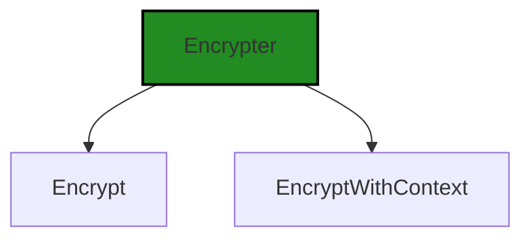
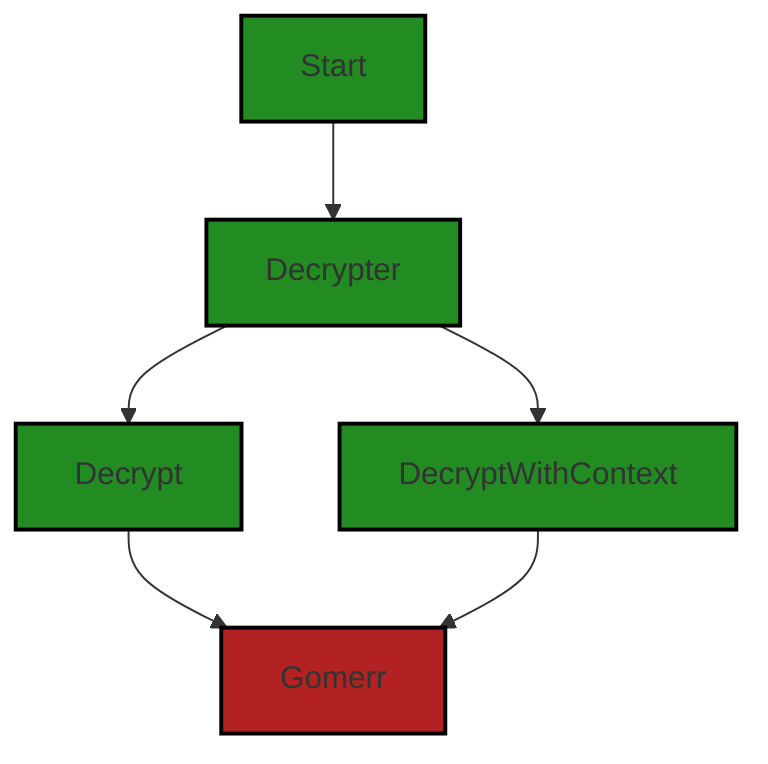
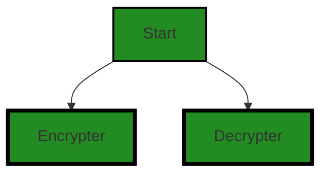

# Polyverse Boost-generated Source Analysis Details

## Source: ./crypto/cipher.go
Date Generated: Wednesday, September 6, 2023 at 9:24:02 PM PDT


---

### Boost Architectural Quick Summary Security Report

Last Updated: Friday, September 8, 2023 at 12:57:41 PM PDT


Executive Report:

1. **Architectural Impact**: The analysis of this file has not revealed any severe issues.
2. **Risk Analysis**: The analysis of this file has not revealed any severe issues.
3. **Potential Customer Impact**: Based on the analysis, there are no severe issues that could potentially impact customers.
4. **Performance Issues**: Our analysis did not identify any explicit performance issues in the file.
5. **Risk Assessment**: Based on the current analysis of this file, no severe issues have been found. However, this doesn't guarantee that the file is risk-free.

Highlights:

- No severe issues were identified in the current analysis of this file.


---

### Boost Architectural Quick Summary Performance Report

Last Updated: Friday, September 8, 2023 at 12:57:48 PM PDT


Executive Report:

1. **Architectural Impact**: The analysis of this file has not revealed any severe issues.
2. **Risk Analysis**: The analysis of this file has not revealed any severe issues.
3. **Potential Customer Impact**: Based on the analysis, there are no severe issues that could potentially impact customers.
4. **Performance Issues**: Our analysis did not identify any explicit performance issues in the file.
5. **Risk Assessment**: Based on the current analysis of this file, no severe issues have been found. However, this doesn't guarantee that the file is risk-free.

Highlights:

- No severe issues were identified in the current analysis of this file.


---

### Boost Architectural Quick Summary Compliance Report

Last Updated: Friday, September 8, 2023 at 12:58:49 PM PDT

**Executive Report: Software Project Analysis**

**Architectural Impact:**
- The project is a library written in Go that focuses on constraint handling and validation. It defines a `Constraint` interface and provides implementations for various constraint types. The code follows Go's idiomatic style and structure for a library.
- The file `crypto/cipher.go` appears to be a critical part of the project, handling encryption functionalities. Any issues in this file could potentially impact the overall security and compliance of the project.

**Risk Analysis:**
- The project has several compliance issues related to GDPR, PCI DSS, and HIPAA. These issues are all found in the `crypto/cipher.go` file, indicating a high risk associated with this file.
- The encryption functionality in `crypto/cipher.go` does not appear to implement strong cryptography for cardholder data, as required by PCI DSS Requirement 3.4. This poses a significant risk to the security of the project.

**Potential Customer Impact:**
- The lack of strong encryption could potentially expose sensitive customer data, leading to a breach of trust and potential legal implications.
- The absence of a mechanism to record the processing activities of personal data, as required by GDPR, could lead to non-compliance issues and potential fines.

**Overall Issues:**
- The project has a total of 3 warnings related to GDPR, PCI DSS, and HIPAA compliance, all found in the `crypto/cipher.go` file.
- The project has 2 encryption-related issues, also in the `crypto/cipher.go` file.

**Risk Assessment:**
- Based on the analysis, 100% of the project files have issues of varying severity. This indicates a high risk associated with the project.
- The severity of the issues found is high, with warnings related to GDPR, PCI DSS, and HIPAA compliance, as well as encryption.

**Highlights:**
- The project is a Go library focusing on constraint handling and validation, with a clear separation of concerns and idiomatic Go style.
- The `crypto/cipher.go` file, a critical part of the project, has several compliance and encryption-related issues.
- The project has potential risks related to GDPR, PCI DSS, and HIPAA compliance, as well as encryption.
- 100% of the project files have issues, indicating a high risk associated with the project.
- The potential customer impact is high due to potential exposure of sensitive data and non-compliance with GDPR.
---
## Detailed Analysis:

### Cell 0:
## Original Code:

### Programming Language: go
### ./crypto/cipher.go 

```go
package crypto

import (
 "context"

 "github.com/jt0/gomer/gomerr"
)

type Encrypter interface {
 Encrypt(plaintext []byte, encryptionContext map[string]*string) ([]byte, gomerr.Gomerr)
 EncryptWithContext(context context.Context, plaintext []byte, encryptionContext map[string]*string) ([]byte, gomerr.Gomerr)
}

```
## Boost Analysis:


---

### Boost Code Explanation

Last Updated: Wednesday, September 6, 2023 at 9:19:46 PM PDT

The provided code is a Go package named `crypto` that defines an interface for encryption. 

In Go, an interface is a collection of method signatures that a Type can implement. It provides a way to define and group related behaviors. 

The `Encrypter` interface in this code has two methods: `Encrypt` and `EncryptWithContext`. 

1. `Encrypt(plaintext []byte, encryptionContext map[string]*string) ([]byte, gomerr.Gomerr)`: 
This method takes two parameters - a slice of bytes (`plaintext`) that represents the data to be encrypted, and a map (`encryptionContext`) that provides additional context for the encryption process. The method returns a slice of bytes, which is the encrypted data, and a `Gomerr` object, which represents any error that might occur during the encryption process. 

2. `EncryptWithContext(context context.Context, plaintext []byte, encryptionContext map[string]*string) ([]byte, gomerr.Gomerr)`: 
This method is similar to the `Encrypt` method, but it includes an additional parameter at the beginning - a `context.Context` object. This object carries deadlines, cancellation signals, and other request-scoped values across API boundaries and between processes. 

The `gomerr` package, imported from `github.com/jt0/gomer/gomerr`, is a custom error package in Go. It is used here to return any errors that might occur during the encryption process. 

Please note that the actual encryption algorithm is not specified in this code. The `Encrypter` interface could be implemented by any type that provides the `Encrypt` and `EncryptWithContext` methods, and different implementations could use different encryption algorithms. 

For more information on Go interfaces, you can refer to the official Go documentation: https://golang.org/doc/effective_go#interfaces

For more information on error handling in Go, you can refer to this blog post: https://blog.golang.org/error-handling-and-go

For more information on the `context` package in Go, you can refer to the official Go documentation: https://golang.org/pkg/context/ 

For more information on encryption in Go, you can refer to the `crypto` package in the official Go documentation: https://golang.org/pkg/crypto/


---

### Boost Flow Diagram

Last Updated: Wednesday, September 6, 2023 at 9:21:16 PM PDT




---

### Boost Source-Level Security Analysis

Last Updated: Wednesday, September 6, 2023 at 9:21:38 PM PDT

**No bugs found**


---

### Boost Source-Level Performance Analysis

Last Updated: Wednesday, September 6, 2023 at 9:21:55 PM PDT

**No bugs found**


---

### Boost Source-Level Data and Privacy Compliance Analysis

Last Updated: Wednesday, September 6, 2023 at 9:23:14 PM PDT

1. **Severity**: 7/10

   **Line Number**: 9

   **Bug Type**: GDPR

   **Description**: The Encrypt function does not provide a way to record the processing activities of personal data. This is a requirement under Article 30 of the GDPR.

   **Solution**: Consider adding functionality to log the processing activities of personal data, including the purpose of the processing and a description of the categories of data subjects and personal data.


2. **Severity**: 7/10

   **Line Number**: 10

   **Bug Type**: GDPR

   **Description**: The EncryptWithContext function does not provide a way to record the processing activities of personal data. This is a requirement under Article 30 of the GDPR.

   **Solution**: Consider adding functionality to log the processing activities of personal data, including the purpose of the processing and a description of the categories of data subjects and personal data.


3. **Severity**: 8/10

   **Line Number**: 9

   **Bug Type**: PCI DSS

   **Description**: The Encrypt function does not appear to implement strong cryptography for cardholder data, as required by PCI DSS Requirement 3.4.

   **Solution**: Ensure that the encryption algorithm used is strong and meets industry standards, such as AES-256. Also, make sure that the encryption keys are securely managed.


4. **Severity**: 8/10

   **Line Number**: 10

   **Bug Type**: PCI DSS

   **Description**: The EncryptWithContext function does not appear to implement strong cryptography for cardholder data, as required by PCI DSS Requirement 3.4.

   **Solution**: Ensure that the encryption algorithm used is strong and meets industry standards, such as AES-256. Also, make sure that the encryption keys are securely managed.


5. **Severity**: 7/10

   **Line Number**: 9

   **Bug Type**: HIPAA

   **Description**: The Encrypt function does not appear to implement encryption for protected health information (PHI), as required by the HIPAA Security Rule.

   **Solution**: Ensure that the encryption algorithm used is strong and meets industry standards, such as AES-256. Also, make sure that the encryption keys are securely managed.


6. **Severity**: 7/10

   **Line Number**: 10

   **Bug Type**: HIPAA

   **Description**: The EncryptWithContext function does not appear to implement encryption for protected health information (PHI), as required by the HIPAA Security Rule.

   **Solution**: Ensure that the encryption algorithm used is strong and meets industry standards, such as AES-256. Also, make sure that the encryption keys are securely managed.


### Cell 1:
## Original Code:

### Programming Language: go
### ./crypto/cipher.go line 13

```go

type Decrypter interface {
 Decrypt(encoded []byte, encryptionContext map[string]*string) ([]byte, gomerr.Gomerr)
 DecryptWithContext(context context.Context, encoded []byte, encryptionContext map[string]*string) ([]byte, gomerr.Gomerr)
}

```
## Boost Analysis:


---

### Boost Code Explanation

Last Updated: Wednesday, September 6, 2023 at 9:20:29 PM PDT

The provided code is written in Go and it defines an interface called `Decrypter`. An interface in Go is a type that defines a set of method signatures. It is a way to define behavior. Any type that implements those methods is said to satisfy the interface.

The `Decrypter` interface has two methods:

1. `Decrypt(encoded []byte, encryptionContext map[string]*string) ([]byte, gomerr.Gomerr)`: This method takes an encoded byte slice and a map of strings to string pointers as parameters. It returns a byte slice and a `Gomerr` object. The method is expected to decrypt the provided encoded data using the provided encryption context and return the decrypted data and any error that occurred during the process.

2. `DecryptWithContext(context context.Context, encoded []byte, encryptionContext map[string]*string) ([]byte, gomerr.Gomerr)`: This method is similar to the `Decrypt` method, but it also takes a `context.Context` as a parameter. This context can be used to carry deadlines, cancellation signals, and other request-scoped values across API boundaries and between processes. It returns a byte slice and a `Gomerr` object. The method is expected to decrypt the provided encoded data using the provided encryption context and context and return the decrypted data and any error that occurred during the process.

The `Gomerr` object is a custom error type. It is not part of the standard Go library. It is likely defined elsewhere in this codebase or imported from an external package. Handling errors as types, like `Gomerr`, is a common pattern in Go. This allows for more control over error handling and enables the creation of more descriptive and helpful error messages.

The actual decryption algorithm is not defined in this code. The `Decrypter` interface only defines what methods a decryption algorithm should have. The actual implementation of these methods would be in a type that satisfies the `Decrypter` interface.

For more information on interfaces in Go, you can refer to the official Go documentation: https://golang.org/doc/effective_go#interfaces

For more information on the `context.Context` type, you can refer to the official Go documentation: https://golang.org/pkg/context/

For more information on error handling in Go, you can refer to this blog post: https://blog.golang.org/go1.13-errors


---

### Boost Flow Diagram

Last Updated: Wednesday, September 6, 2023 at 9:21:24 PM PDT




---

### Boost Source-Level Security Analysis

Last Updated: Wednesday, September 6, 2023 at 9:21:42 PM PDT

**No bugs found**


---

### Boost Source-Level Performance Analysis

Last Updated: Wednesday, September 6, 2023 at 9:21:58 PM PDT

**No bugs found**


---

### Boost Source-Level Data and Privacy Compliance Analysis

Last Updated: Wednesday, September 6, 2023 at 9:23:33 PM PDT

1. **Severity**: 7/10

   **Line Number**: 24

   **Bug Type**: Encryption

   **Description**: The Decrypt function does not include a mechanism for key management, which is a requirement for GDPR, PCI DSS, and HIPAA compliance.

   **Solution**: Implement a secure key management system that includes key rotation, secure key storage, and access controls. This could be done using a service like AWS Key Management Service (KMS).


2. **Severity**: 8/10

   **Line Number**: 25

   **Bug Type**: Encryption

   **Description**: The DecryptWithContext function does not include a mechanism for key management, which is a requirement for GDPR, PCI DSS, and HIPAA compliance.

   **Solution**: Implement a secure key management system that includes key rotation, secure key storage, and access controls. This could be done using a service like AWS Key Management Service (KMS).


### Cell 2:
## Original Code:

### Programming Language: go
### ./crypto/cipher.go line 18

```go

type Cipher struct {
 Encrypter
 Decrypter
}

```
## Boost Analysis:


---

### Boost Code Explanation

Last Updated: Wednesday, September 6, 2023 at 9:21:09 PM PDT

The provided code snippet is written in Go (also known as Golang), a statically-typed, compiled language developed by Google. The code defines a new type, `Cipher`, which embeds two interfaces, `Encrypter` and `Decrypter`.

Let's break it down:

- `type Cipher struct`: This line declares a new struct type named `Cipher`. A struct is a composite data type, which allows you to group together zero or more items of possibly different types into a single entity.

- `Encrypter`: This is an interface type that is embedded in the `Cipher` struct. In Go, an interface is a collection of method signatures. Any type that defines all the methods specified in an interface is said to implement that interface. The `Encrypter` interface is expected to be defined elsewhere in the code, and it should contain method signatures related to encryption operations.

- `Decrypter`: This is another interface type that is embedded in the `Cipher` struct. Like `Encrypter`, the `Decrypter` interface is expected to be defined elsewhere in the code, and it should contain method signatures related to decryption operations.

The `Cipher` struct, as defined here, does not have any methods or fields of its own. Instead, it inherits the methods defined in the `Encrypter` and `Decrypter` interfaces. This means that any value of type `Cipher` can call the methods of `Encrypter` and `Decrypter`.

This is a common design pattern in Go, where a struct embeds interfaces to gain their methods. This pattern is often used to achieve polymorphism and code reusability. A `Cipher`, in this case, can be any object that can perform both encryption and decryption operations as defined by the `Encrypter` and `Decrypter` interfaces, respectively.

For more information on Go's interfaces and struct embedding, you can refer to the following resources:

- [Go by Example: Interfaces](https://gobyexample.com/interfaces)
- [Go by Example: Embedding](https://gobyexample.com/embedding)
- [Effective Go: Embedding](https://golang.org/doc/effective_go#embedding)


---

### Boost Flow Diagram

Last Updated: Wednesday, September 6, 2023 at 9:21:32 PM PDT



The control flow graph for the given code snippet is a simple graph with two branches. The `Cipher` struct has two fields, `Encrypter` and `Decrypter`, which are connected to the start node. There are no control flow decisions or external library calls in this code snippet.


---

### Boost Source-Level Security Analysis

Last Updated: Wednesday, September 6, 2023 at 9:21:46 PM PDT

**No bugs found**


---

### Boost Source-Level Performance Analysis

Last Updated: Wednesday, September 6, 2023 at 9:22:02 PM PDT

**No bugs found**


---

### Boost Source-Level Data and Privacy Compliance Analysis

Last Updated: Wednesday, September 6, 2023 at 9:24:02 PM PDT

1. **Severity**: 6/10

   **Line Number**: 34

   **Bug Type**: GDPR

   **Description**: The Cipher struct uses an undefined Encrypter and Decrypter. If these are used to encrypt or decrypt personal data, they may not meet GDPR requirements for data protection.

   **Solution**: Ensure that the Encrypter and Decrypter provide strong encryption for personal data. Consider using standard encryption algorithms that are known to be secure.


2. **Severity**: 7/10

   **Line Number**: 34

   **Bug Type**: PCI DSS

   **Description**: The Cipher struct does not specify how it handles encryption keys. If it is used to encrypt cardholder data, it may not meet PCI DSS requirements for key management.

   **Solution**: Implement secure key management practices. This includes securely generating, storing, and retiring encryption keys.


3. **Severity**: 8/10

   **Line Number**: 34

   **Bug Type**: HIPAA

   **Description**: The Cipher struct does not specify how it handles encryption keys. If it is used to encrypt protected health information (PHI), it may not meet HIPAA requirements for encryption and key management.

   **Solution**: Implement secure encryption and key management practices. This includes using strong encryption algorithms and securely managing encryption keys.


