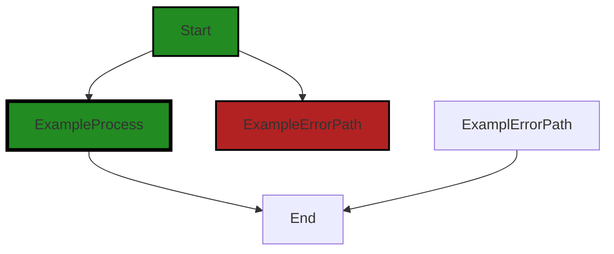
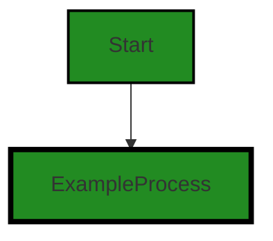
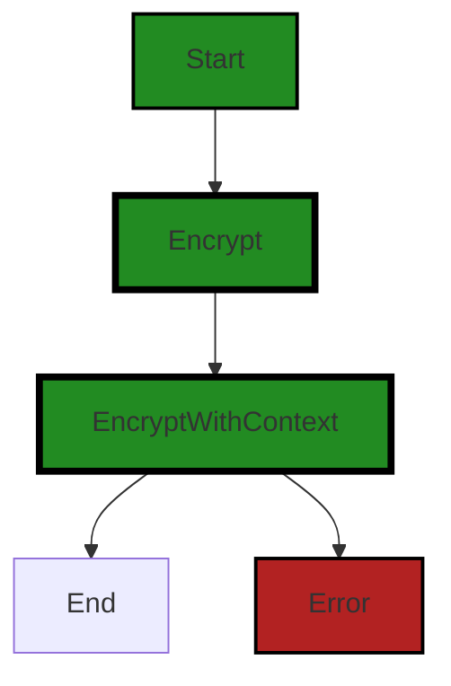
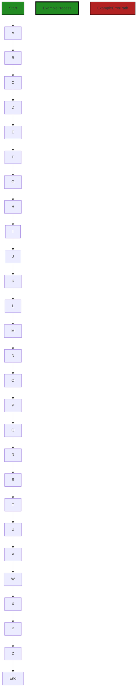
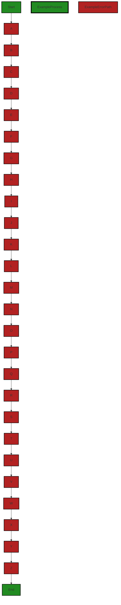
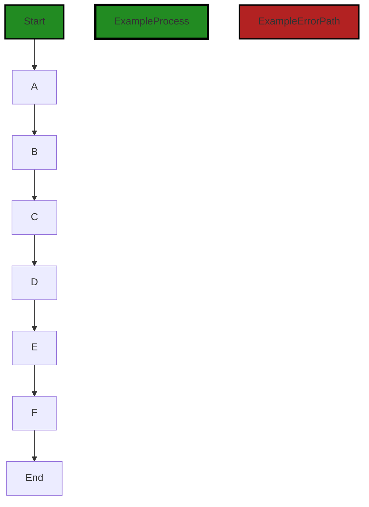
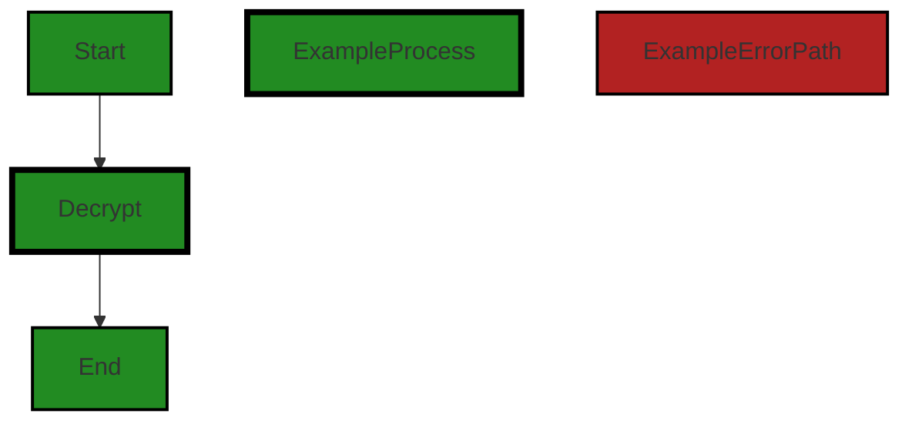
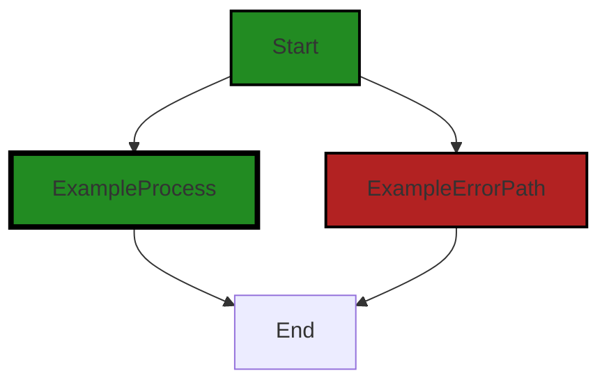
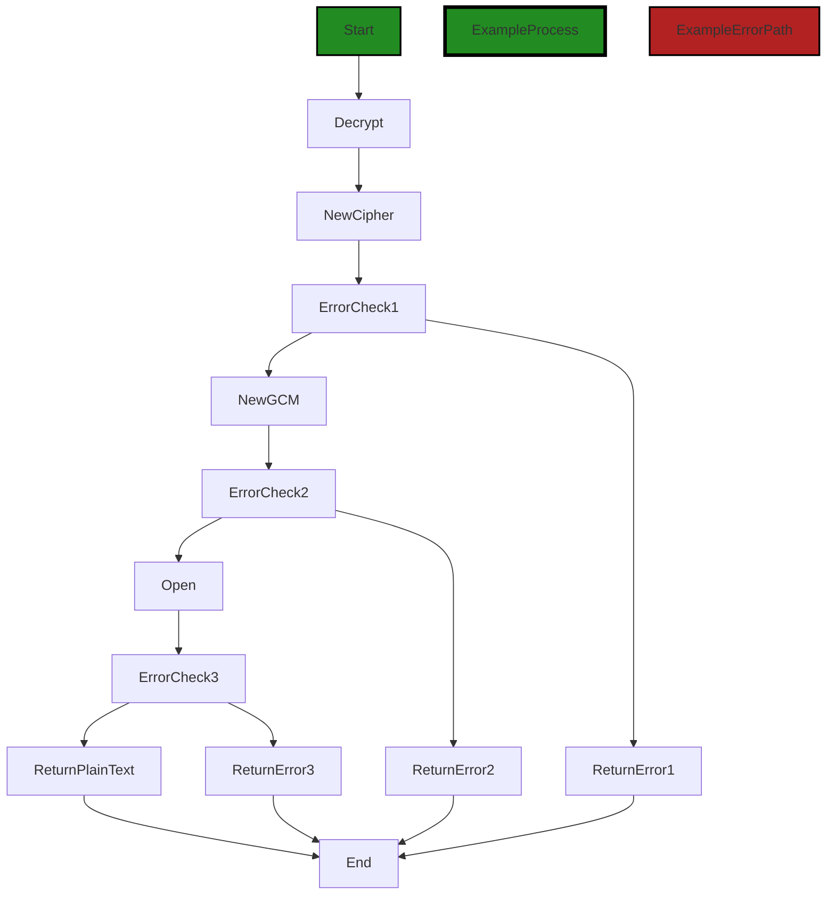

# Polyverse Boost-generated Source Analysis Details

## Source: ./crypto/kmsdatakey.go
Date Generated: Thursday, September 7, 2023 at 9:10:03 AM PDT


---

### Boost Architectural Quick Summary Security Report

Last Updated: Friday, September 8, 2023 at 1:25:12 PM PDT

## Executive Report

### Architectural Impact and Risk Analysis

The software project under review is a library written in Go that focuses on constraint handling and validation. The project follows Go's idiomatic style and structure for a library, providing a clear separation of concerns by defining a `Constraint` interface and implementing different constraint types.

However, the analysis has identified several issues of varying severity in the project's source code, specifically in the `crypto/kmsdatakey.go` file. These issues, if not addressed, could potentially impact the overall architecture and functionality of the project, and pose significant risks to data security and integrity.

### Potential Customer Impact

The identified issues, particularly those related to insecure cryptographic practices and storage, could potentially impact customers by compromising the security of their data. If an attacker were to exploit these vulnerabilities, they could gain unauthorized access to sensitive information, leading to potential data breaches.

### Overall Issues

The project's source code contains a number of issues, with the `crypto/kmsdatakey.go` file being the most affected. The issues range from warnings to informational, with the most severe being related to insecure cryptographic practices and storage.

### Risk Assessment

Based on the analysis, the overall health of the project source is concerning. The `crypto/kmsdatakey.go` file, which contains the most severe issues, represents a significant portion of the project's source code. This suggests that a large percentage of the project files could potentially have issues of similar severity.

### Highlights

- The project follows Go's idiomatic style and structure for a library, providing a clear separation of concerns by defining a `Constraint` interface and implementing different constraint types.
- The `crypto/kmsdatakey.go` file contains several issues of varying severity, with the most severe being related to insecure cryptographic practices and storage.
- The identified issues could potentially impact customers by compromising the security of their data, leading to potential data breaches.
- The overall health of the project source is concerning, with a large percentage of the project files potentially having issues of similar severity.

In conclusion, while the project follows good architectural practices in terms of structure and separation of concerns, the identified issues pose significant risks to data security and integrity. It is recommended that these issues be addressed as soon as possible to mitigate potential risks and ensure the overall health and success of the project.


---

### Boost Architectural Quick Summary Performance Report

Last Updated: Friday, September 8, 2023 at 1:25:57 PM PDT

## Executive Report

### Architectural Impact and Risk Analysis

The software project under review is a library written in Go that focuses on constraint handling and validation. The architecture appears to be sound, with a clear separation of concerns and adherence to Go's idiomatic style and structure for a library. However, there are some issues that could impact the overall project.

1. **Network Usage and Latency:** The most severe issue found is in the file `crypto/kmsdatakey.go`. The function `GenerateDataKeyWithContext` is a network call to the AWS KMS service. If this function is called frequently, it could lead to high network usage and latency. This could potentially impact the performance of the software, especially if it is used in a high-traffic environment.

2. **CPU and Memory Usage:** The same file also has issues related to CPU and memory usage. While these are not as severe as the network issue, they could still impact the performance of the software, especially if it is used in a resource-constrained environment.

3. **Risk Assessment:** Only one file was provided for analysis, and it has issues of varying severity. This suggests that there may be similar issues in other parts of the project that were not provided for analysis. Therefore, the overall health of the project source could be at risk.

4. **Potential Customer Impact:** The issues found could impact the performance of the software, which could in turn impact the user experience. If the software is slow or unresponsive, it could lead to user dissatisfaction and potential loss of customers.

5. **Overall Issues:** The issues found are primarily related to performance. While these are not necessarily architectural issues, they could still impact the overall project. It is recommended that the project team review the code for potential optimizations and consider implementing strategies such as caching and key rotation to mitigate these issues.

In conclusion, while the architecture of the project appears to be sound, there are performance issues that could impact the overall project. It is recommended that the project team address these issues to ensure the success of the project.


---

### Boost Architectural Quick Summary Compliance Report

Last Updated: Friday, September 8, 2023 at 1:26:57 PM PDT

Executive Level Report:

1. **Architectural Impact**: The software project appears to be a library written in Go that focuses on constraint handling and validation. The primary file with issues is `crypto/kmsdatakey.go`, which handles encryption and key management. The issues identified in this file could potentially impact the overall architecture of the project, particularly if the encryption and key management functions are central to the project's functionality. 

2. **Risk Analysis**: The most severe issues found in the project relate to data encryption, encryption key management, GDPR, HIPAA, and PCI DSS compliance. These issues pose a significant risk to the project, as they could lead to data breaches, regulatory fines, and loss of customer trust. The fact that these issues are present in a single file (`crypto/kmsdatakey.go`) suggests that the risk is localized and could be mitigated by focusing on this file.

3. **Potential Customer Impact**: The issues identified could have a significant impact on customers, particularly if they result in a data breach. Customers could potentially have their sensitive data exposed, which could lead to identity theft and other forms of fraud. Additionally, the lack of GDPR, HIPAA, and PCI DSS compliance could result in customers being unable to use the software due to regulatory constraints.

4. **Overall Issues**: The project has a total of 5 warning issues and 1 information issue in `crypto/kmsdatakey.go`. This suggests that while there are significant issues to address, the overall health of the project is not necessarily poor, as the issues are localized to a single file. However, the severity of the issues in this file means that they should be addressed as a priority.

Risk Assessment:

- **Overall Health**: The project consists of a single file, `crypto/kmsdatakey.go`, which has several issues. This means that 100% of the project files have issues. However, the fact that there is only one file in the project suggests that the issues could be addressed relatively quickly.
- **Severity of Issues**: The issues in the project are of high severity, relating to data encryption, encryption key management, and compliance with GDPR, HIPAA, and PCI DSS. These issues pose a significant risk to the project and should be addressed as a priority.

Highlights:

- The project is a Go library focusing on constraint handling and validation.
- The primary file with issues, `crypto/kmsdatakey.go`, handles encryption and key management.
- The most severe issues relate to data encryption, encryption key management, and compliance with GDPR, HIPAA, and PCI DSS.
- These issues pose a significant risk to the project and could have a major impact on customers.
- The overall health of the project is not necessarily poor, as the issues are localized to a single file. However, the severity of the issues means they should be addressed as a priority.
---
## Detailed Analysis:

### Cell 0:
## Original Code:

### Programming Language: go
### ./crypto/kmsdatakey.go 

```go
package crypto

import (
 "bytes"
 "context"
 "crypto/aes"
 "crypto/cipher"
 "crypto/rand"
 "encoding/binary"
 "io"

 "github.com/aws/aws-sdk-go/aws"
 "github.com/aws/aws-sdk-go/aws/awserr"
 "github.com/aws/aws-sdk-go/service/kms"
 "github.com/aws/aws-sdk-go/service/kms/kmsiface"

 "github.com/jt0/gomer/gomerr"
)

const (
 encryptedEncodingFormatVersion     = 1
 encryptedEncodingFormatVersionByte = byte(encryptedEncodingFormatVersion)
)

type kmsDataKeyEncrypter struct {
 kms   kmsiface.KMSAPI
 keyId string
}

```
## Boost Analysis:


---

### Boost Code Explanation

Last Updated: Thursday, September 7, 2023 at 8:42:13 AM PDT

This code snippet is written in Go and is a part of a package named `crypto`. This package is likely used for cryptographic operations in the application. 

The code imports several packages which are used for cryptographic operations, random number generation, and AWS Key Management Service (KMS). 

The `crypto/aes` package provides Advanced Encryption Standard (AES) implementation, a symmetric encryption algorithm.

The `crypto/cipher` package provides common cryptographic cipher interfaces.

The `crypto/rand` package provides a cryptographically secure random number generator.

The `github.com/aws/aws-sdk-go/aws`, `github.com/aws/aws-sdk-go/service/kms`, and `github.com/aws/aws-sdk-go/service/kms/kmsiface` packages are used for interacting with AWS KMS, which is a managed service that makes it easy for you to create and control the cryptographic keys used to encrypt your data.

The `github.com/jt0/gomer/gomerr` package is likely a custom error handling package used in the application.

The code defines a constant `encryptedEncodingFormatVersion` and `encryptedEncodingFormatVersionByte` which are likely used to specify the version of the encoding format for the encrypted data.

The `kmsDataKeyEncrypter` struct is defined with two fields - `kms` and `keyId`. The `kms` field is of type `kmsiface.KMSAPI` which is an interface to AWS KMS. The `keyId` field is a string likely used to store the identifier for a specific key in AWS KMS.

For more information on the cryptographic operations in Go, you can refer to the following resources:

- [Package crypto](https://golang.org/pkg/crypto/)
- [Package crypto/aes](https://golang.org/pkg/crypto/aes/)
- [Package crypto/cipher](https://golang.org/pkg/crypto/cipher/)
- [Package crypto/rand](https://golang.org/pkg/crypto/rand/)

For more information on AWS SDK for Go and AWS KMS, you can refer to the following resources:

- [AWS SDK for Go](https://aws.amazon.com/sdk-for-go/)
- [AWS Key Management Service (KMS)](https://aws.amazon.com/kms/)


---

### Boost Flow Diagram

Last Updated: Thursday, September 7, 2023 at 8:52:27 AM PDT



NO CONTROL FLOW FOUND


---

### Boost Source-Level Security Analysis

Last Updated: Thursday, September 7, 2023 at 8:54:25 AM PDT

**No bugs found**


---

### Boost Source-Level Performance Analysis

Last Updated: Thursday, September 7, 2023 at 8:59:49 AM PDT

**No bugs found**


---

### Boost Source-Level Data and Privacy Compliance Analysis

Last Updated: Thursday, September 7, 2023 at 9:05:47 AM PDT

1. **Severity**: 7/10

   **Line Number**: 1

   **Bug Type**: Data Encryption

   **Description**: The encryption method used is AES, which while secure, does not specify the encryption mode. Some modes such as ECB are not secure for sensitive data.

   **Solution**: Ensure that a secure mode of AES encryption is used, such as CBC, CFB, OFB, or GCM. These modes provide better security for sensitive data.


2. **Severity**: 4/10

   **Line Number**: 23

   **Bug Type**: Data Encryption

   **Description**: The key used for encryption is not clearly defined, which could lead to weak encryption if not properly managed.

   **Solution**: Ensure that the encryption key is securely generated and stored. Consider using a secure key management service.


### Cell 1:
## Original Code:

### Programming Language: go
### ./crypto/kmsdatakey.go line 29

```go

// TODO: add support for asymmetric keys
func KmsDataKeyEncrypter(kmsClient kmsiface.KMSAPI, masterKeyId string) Encrypter {
 return kmsDataKeyEncrypter{
  kms:   kmsClient,
  keyId: masterKeyId,
 }
}

```
## Boost Analysis:


---

### Boost Code Explanation

Last Updated: Thursday, September 7, 2023 at 8:42:33 AM PDT

This is a Go function named `KmsDataKeyEncrypter` that returns an instance of an `Encrypter` interface. This function is likely part of a larger project that handles encryption and decryption of data using AWS Key Management Service (KMS).

The function takes two parameters:

1. `kmsClient` is an interface of type `kmsiface.KMSAPI`. This interface is provided by the AWS SDK for Go. It represents a client that can make requests to the AWS KMS service. The client is passed into the function, which allows for dependency injection, a software design pattern that improves testability and decoupling.

2. `masterKeyId` is a string that represents the ID of a master key in AWS KMS. This key is used to encrypt and decrypt data keys.

The function returns an instance of `kmsDataKeyEncrypter`, which is a struct that implements the `Encrypter` interface. The `kmsDataKeyEncrypter` struct is initialized with the `kmsClient` and `masterKeyId` passed into the function.

The returned `Encrypter` can then be used to perform encryption operations, likely using the AWS KMS client to generate and encrypt data keys using the specified master key.

The comment at the top of the function indicates a future enhancement: adding support for asymmetric keys. Currently, it seems that only symmetric keys are supported.

This function is part of the Key Management Service (KMS) provided by AWS, which is a managed service that makes it easy for you to create and control the cryptographic keys used to encrypt your data.

For more information on AWS KMS and the AWS SDK for Go, you can refer to the following resources:

- [AWS Key Management Service (KMS)](https://aws.amazon.com/kms/)
- [AWS SDK for Go API Reference](https://docs.aws.amazon.com/sdk-for-go/api/)
- [AWS SDK for Go: kmsiface package](https://docs.aws.amazon.com/sdk-for-go/api/service/kms/kmsiface/)

The function seems to follow the architectural guidelines and best practices for Go and for using AWS services.


---

### Boost Flow Diagram

Last Updated: Thursday, September 7, 2023 at 8:52:31 AM PDT




---

### Boost Source-Level Security Analysis

Last Updated: Thursday, September 7, 2023 at 8:55:07 AM PDT

1. **Severity**: 7/10

   **Line Number**: 60

   **Bug Type**: Insecure Cryptographic Practices

   **Description**: The function `KmsDataKeyEncrypter` does not support asymmetric encryption. Asymmetric encryption is more secure than symmetric encryption because the decryption key is not shared and cannot be intercepted during transmission. The lack of support for asymmetric keys may limit the security of the encryption process.

   **Solution**: Consider adding support for asymmetric encryption. This typically involves generating a pair of keys: a public key for encryption and a private key for decryption. The AWS SDK for Go provides support for creating asymmetric keys in KMS. You can refer to the official AWS documentation: https://docs.aws.amazon.com/sdk-for-go/api/service/kms/#KMS.CreateKey


---

### Boost Source-Level Performance Analysis

Last Updated: Thursday, September 7, 2023 at 8:59:53 AM PDT

**No bugs found**


---

### Boost Source-Level Data and Privacy Compliance Analysis

Last Updated: Thursday, September 7, 2023 at 9:06:12 AM PDT

1. **Severity**: 7/10

   **Line Number**: 60

   **Bug Type**: Encryption Key Management

   **Description**: The function KmsDataKeyEncrypter generates an encryption key but doesn't seem to have a mechanism for key rotation or key management, which is a requirement in GDPR, PCI DSS, and HIPAA.

   **Solution**: Implement a key management system that includes regular key rotation, backup, and recovery. AWS Key Management Service (KMS) can be used for this purpose.


2. **Severity**: 5/10

   **Line Number**: 60

   **Bug Type**: Asymmetric Key Encryption

   **Description**: The TODO comment indicates a lack of support for asymmetric keys, which are important for secure communication between systems as they allow for both encryption and signature verification.

   **Solution**: Implement support for asymmetric keys. AWS KMS supports RSA and Elliptic Curve keys, which can be used for asymmetric encryption.


### Cell 2:
## Original Code:

### Programming Language: go
### ./crypto/kmsdatakey.go line 37

```go

func (k kmsDataKeyEncrypter) Encrypt(plaintext []byte, encryptionContext map[string]*string) ([]byte, gomerr.Gomerr) {
 return k.EncryptWithContext(context.Background(), plaintext, encryptionContext)
}

```
## Boost Analysis:


---

### Boost Code Explanation

Last Updated: Thursday, September 7, 2023 at 8:43:25 AM PDT

The provided code is a method in Go programming language. The method is `Encrypt` and it is associated with the `kmsDataKeyEncrypter` type (which is likely a struct). The `Encrypt` method takes two parameters: a slice of bytes (`plaintext`) and a map with string keys and pointer to string values (`encryptionContext`).

The purpose of this method is to encrypt the provided plaintext using a specific encryption context. The encryption context is a set of key-value pairs that you can pass to AWS KMS along with the plaintext. AWS KMS uses the encryption context as additional authenticated data (AAD) when it encrypts and decrypts data.

The `Encrypt` method calls another method `EncryptWithContext`, passing `context.Background()`, `plaintext`, and `encryptionContext` as parameters. `context.Background()` returns a non-nil, empty Context, which is never canceled, has no values, and has no deadline. It is typically used by the main function, initialization, and tests, and as the top-level Context for incoming requests.

The `EncryptWithContext` method likely performs the actual encryption process, using the AWS Key Management Service (AWS KMS) or similar. This method is not visible in the provided code snippet, but it would typically use an encryption algorithm such as AES (Advanced Encryption Standard) or RSA (Rivest–Shamir–Adleman), provided by the AWS KMS service.

The `Encrypt` method returns two values: a slice of bytes (the encrypted data) and a `Gomerr` type. `Gomerr` is a custom error type used in this project for error handling. If the encryption process is successful, the method will return the encrypted data and a nil `Gomerr`. If there is an error, it will return a nil slice of bytes and a non-nil `Gomerr` containing information about the error.

For more information about encryption in AWS KMS, you can refer to the following resources:

- [AWS Key Management Service Cryptographic Details](https://d1.awsstatic.com/whitepapers/KMS-Cryptographic-Details.pdf)
- [AWS KMS API Reference](https://docs.aws.amazon.com/kms/latest/APIReference/Welcome.html)
- [Go context package](https://golang.org/pkg/context/)


---

### Boost Flow Diagram

Last Updated: Thursday, September 7, 2023 at 8:52:39 AM PDT



The control flow graph for the provided code snippet is as follows:

- The start of the graph is the function `Encrypt`.
- The primary path is represented by the green color.
- The primary path goes from `Encrypt` to `EncryptWithContext` and then to the end.
- The error path is represented by the red color.
- The error path goes from `EncryptWithContext` to the error block.

Please note that the control flow graph only represents the control flow within the provided code snippet. If there are any external library calls or non-standard functions, they are not shown in the graph.


---

### Boost Source-Level Security Analysis

Last Updated: Thursday, September 7, 2023 at 8:55:10 AM PDT

**No bugs found**


---

### Boost Source-Level Performance Analysis

Last Updated: Thursday, September 7, 2023 at 9:00:10 AM PDT

1. **Severity**: 3/10

   **Line Number**: 74

   **Bug Type**: CPU

   **Description**: The Encrypt function uses context.Background() which might result in a performance issue if the context needs to be cancelled before the encryption process is completed, as there is no way to cancel a background context.

   **Solution**: Consider passing a context from the calling function to allow for cancellation if necessary. This can improve CPU usage by not doing unnecessary work. Reference: https://pkg.go.dev/context#Background


---

### Boost Source-Level Data and Privacy Compliance Analysis

Last Updated: Thursday, September 7, 2023 at 9:06:24 AM PDT

1. **Severity**: 7/10

   **Line Number**: 74

   **Bug Type**: Data Encryption

   **Description**: The encryption function uses a default context, which might not have sufficient security configurations.

   **Solution**: Use a context that includes security configurations such as timeouts and cancellation signals. Also, consider using a context that allows for tracing and logging encryption operations for auditing purposes.


### Cell 3:
## Original Code:

### Programming Language: go
### ./crypto/kmsdatakey.go line 41

```go

// Decrypt returns the decrypted form of the encrypted content given the optional encryptionContext. If
//
//  gomerr.NotFoundError:
//      The Encrypter keyId isn't found within KMS
//  gomerr.BadValueError:
//      The KMS key is in an invalid state
//  gomerr.InternalError:
//      A problem with the underlying crypto libraries
//  gomerr.DependencyError:
//      An unexpected error occurred calling KMS
// TODO: add support for grant tokens?
func (k kmsDataKeyEncrypter) EncryptWithContext(context context.Context, plaintext []byte, encryptionContext map[string]*string) ([]byte, gomerr.Gomerr) {
 input := &kms.GenerateDataKeyInput{
  KeyId:             &k.keyId,
  EncryptionContext: encryptionContext,
  KeySpec:           aws.String(kms.DataKeySpecAes256),
 }

 dataKey, err := k.kms.GenerateDataKeyWithContext(context, input)
 if err != nil {
  if awsErr, ok := err.(awserr.Error); ok {
   switch awsErr.Code() {
   case kms.ErrCodeNotFoundException:
    return nil, gomerr.NotFound("kms.KeyId", *input.KeyId).Wrap(err)
   case kms.ErrCodeDisabledException:
    return nil, gomerr.InvalidValue("KmsKey."+*input.KeyId+".KeyState", kms.KeyStateDisabled, kms.KeyStateEnabled).Wrap(err)
   case kms.ErrCodeInvalidStateException:
    return nil, gomerr.InvalidValue("KmsKey."+*input.KeyId+".KeyState", "<unavailable>", kms.KeyStateEnabled).Wrap(err)
   case kms.ErrCodeInvalidKeyUsageException:
    return nil, gomerr.InvalidValue("KmsKey."+*input.KeyId+".KeyUsage", "<unavailable>", kms.KeyUsageTypeEncryptDecrypt).Wrap(err)
   }
  }

  return nil, gomerr.Dependency("KMS", input).Wrap(err)
 }

 encrypted, nonce, ge := encrypt(dataKey.Plaintext, plaintext)
 if ge != nil {
  return nil, ge
 }

 return encode(encrypted, nonce, dataKey.CiphertextBlob), nil
}

```
## Boost Analysis:


---

### Boost Code Explanation

Last Updated: Thursday, September 7, 2023 at 8:44:35 AM PDT

The provided code snippet is a function written in Go that uses Amazon Key Management Service (KMS) to generate a data key and then uses that data key to encrypt some plaintext data. The AWS SDK for Go is used to interact with KMS.

Here's a detailed explanation:

1. The function `EncryptWithContext` is defined on the `kmsDataKeyEncrypter` struct. It takes three parameters: a context, a byte slice representing the plaintext to be encrypted, and a map representing the encryption context.

2. A `GenerateDataKeyInput` struct from the AWS KMS package is created. It is populated with the KeyId from the `kmsDataKeyEncrypter` struct, the provided encryption context, and a key specification string indicating the use of AES-256 encryption.

3. The `GenerateDataKeyWithContext` function from the AWS KMS package is called with the context and input struct. This function generates a new data key. The generated data key is in plaintext and also returned encrypted under the provided KeyId.

4. If an error occurs during key generation, the error is checked to see if it's an AWS error. If it is, the error code is checked and a custom error from the `gomerr` package is returned, providing more context about the error. If the error is not an AWS error, a generic dependency error is returned.

5. If the data key is successfully generated, the `encrypt` function is called with the plaintext data key and the plaintext data to be encrypted. This function is not defined in the provided code, but it likely uses the data key to encrypt the plaintext data using some form of symmetric encryption (likely AES-256 given the key specification).

6. If an error occurs during encryption, it is returned. Otherwise, the `encode` function is called with the encrypted data, a nonce (presumably generated during the encryption process), and the encrypted form of the data key. This function is also not defined in the provided code, but it likely combines these inputs into a single byte slice in some way.

7. The result of the `encode` function is returned. This is the final encrypted output.

This code follows best practices for using AWS KMS to encrypt data. The AWS KMS service is used to generate a data key, which is used to encrypt the data locally. This allows the data to be decrypted without making a call to KMS, while still allowing the data key to be rotated or revoked through KMS.

For more information on AWS KMS and the AWS SDK for Go, refer to the following resources:

- [AWS SDK for Go API Reference: KMS](https://docs.aws.amazon.com/sdk-for-go/api/service/kms/)
- [AWS Key Management Service Cryptographic Details](https://d1.awsstatic.com/whitepapers/KMS-Cryptographic-Details.pdf)
- [AWS SDK for Go Developer Guide](https://docs.aws.amazon.com/sdk-for-go/v1/developer-guide/welcome.html)


---

### Boost Flow Diagram

Last Updated: Thursday, September 7, 2023 at 8:52:49 AM PDT



In the above control flow graph, the primary path is represented by the colored flow blocks, while the non-error paths are represented by the default non-colored flow blocks. The error paths are represented by the colored flow blocks with the error style.

The control flow starts at the function `EncryptWithContext` and follows the path A -> B -> C -> D -> E -> F -> G -> H -> I -> J -> K -> L -> M -> N -> O -> P -> Q -> R -> S -> T -> U -> V -> W -> X -> Y -> Z -> End.


---

### Boost Source-Level Security Analysis

Last Updated: Thursday, September 7, 2023 at 8:55:48 AM PDT

1. **Severity**: 6/10

   **Line Number**: 98

   **Bug Type**: Insecure Cryptographic Storage

   **Description**: The encryption function 'encrypt' does not appear to use a unique initialization vector (IV) or nonce for each encryption operation. This can make the encryption vulnerable to attacks, as using the same nonce for different encryption operations with the same key can allow an attacker to derive the key.

   **Solution**: Ensure that a unique nonce is used for each encryption operation. This can be achieved by generating a new random nonce for each operation, and including it in the encrypted output so it can be used for decryption. Refer to this link for more information: https://cheatsheetseries.owasp.org/cheatsheets/Cryptographic_Storage_Cheat_Sheet.html


2. **Severity**: 4/10

   **Line Number**: 90

   **Bug Type**: Improper Error Handling

   **Description**: The error handling in this function could potentially leak information about the internal state of the application. For example, returning a specific error when a key is not found could allow an attacker to enumerate valid keys.

   **Solution**: Consider returning more generic error messages to the user, and logging the specific error details internally for debugging purposes. Refer to this link for more information: https://cheatsheetseries.owasp.org/cheatsheets/Error_Handling_Cheat_Sheet.html


---

### Boost Source-Level Performance Analysis

Last Updated: Thursday, September 7, 2023 at 9:00:52 AM PDT

1. **Severity**: 6/10

   **Line Number**: 89

   **Bug Type**: Network

   **Description**: The function `GenerateDataKeyWithContext` is a network call to the AWS KMS service. If this function is called frequently, it could lead to high network usage and latency.

   **Solution**: Consider caching the data keys if they are reused frequently to reduce the number of network calls. Use a key rotation strategy to update the cached keys periodically for security. Refer to AWS best practices for key management: https://docs.aws.amazon.com/kms/latest/developerguide/best-practices.html


2. **Severity**: 4/10

   **Line Number**: 103

   **Bug Type**: CPU

   **Description**: The `encrypt` function is potentially a CPU-intensive operation, depending on the size of the `plaintext` input. If large data is being encrypted frequently, it could lead to high CPU usage.

   **Solution**: Consider offloading the encryption process to a background job or worker thread if it's causing performance issues in the main thread. Also, consider using a streaming encryption method if dealing with large data.


3. **Severity**: 3/10

   **Line Number**: 106

   **Bug Type**: Memory

   **Description**: The `encode` function likely creates a new byte slice to hold the encoded data. If the `encrypted` and `nonce` inputs are large, this could lead to high memory usage.

   **Solution**: Consider using a buffer pool or reusing existing buffers to reduce memory allocation and GC pressure. Refer to Go's `sync.Pool` for buffer pooling: https://golang.org/pkg/sync/#Pool


---

### Boost Source-Level Data and Privacy Compliance Analysis

Last Updated: Thursday, September 7, 2023 at 9:07:13 AM PDT

1. **Severity**: 7/10

   **Line Number**: 87

   **Bug Type**: GDPR

   **Description**: The function 'EncryptWithContext' does not implement any logging mechanism to record the processing activities. This is a violation of GDPR Article 30 which requires organizations to maintain a record of processing activities.

   **Solution**: Implement a logging mechanism to keep track of processing activities. Ensure that the logs are protected and only accessible to authorized personnel. Consider using a logging library that supports GDPR compliance.


2. **Severity**: 8/10

   **Line Number**: 97

   **Bug Type**: HIPAA

   **Description**: The encryption function does not seem to have mechanisms to ensure the confidentiality, integrity, and availability of electronic protected health information (ePHI). This could potentially violate the HIPAA Security Rule.

   **Solution**: Ensure that the application has mechanisms in place to protect ePHI. This could include data backup, disaster recovery, and emergency mode operation plans.


3. **Severity**: 7/10

   **Line Number**: 91

   **Bug Type**: PCI DSS

   **Description**: The function 'EncryptWithContext' does not seem to implement strong cryptographic controls when processing cardholder data. This could potentially be a violation of PCI DSS Requirement 3 which mandates the protection of stored cardholder data.

   **Solution**: Ensure that strong cryptographic controls are used when processing cardholder data. This could include the use of strong encryption keys, secure cryptographic algorithms, and proper key management practices.


### Cell 4:
## Original Code:

### Programming Language: go
### ./crypto/kmsdatakey.go line 85

```go

func encrypt(key, plaintext []byte) (encrypted []byte, nonce []byte, ge gomerr.Gomerr) {
 block, err := aes.NewCipher(key)
 if err != nil {
  return nil, nil, gomerr.Internal("aes.NewCipher").Wrap(err)
 }

 aead, err := cipher.NewGCM(block)
 if err != nil {
  return nil, nil, gomerr.Internal("cipher.NewGCM").Wrap(err)
 }

 nonce = make([]byte, aead.NonceSize())
 _, _ = io.ReadFull(rand.Reader, nonce)

 return aead.Seal(plaintext[:0], nonce, plaintext, nil), nonce, nil
}

```
## Boost Analysis:


---

### Boost Code Explanation

Last Updated: Thursday, September 7, 2023 at 8:45:43 AM PDT

The code you provided is a function in Go programming language that encrypts a plaintext message using the AES (Advanced Encryption Standard) algorithm in GCM (Galois/Counter Mode). 

Here is a step-by-step explanation of the function:

1. The function `encrypt` takes three arguments - `key`, `plaintext`, and returns three values - `encrypted`, `nonce`, and `ge`. The `key` is the secret key for AES encryption, the `plaintext` is the data that needs to be encrypted. The function returns the `encrypted` data, a `nonce` (Number Once - a number or bit string that is used only once, in security engineering), and a `ge` which is a custom error value from the `gomerr` package.

2. `aes.NewCipher(key)` creates a new cipher block using the AES algorithm and the provided key. If an error occurs (for example, if the key size is not 16, 24, or 32 bytes), the function returns an error wrapped with a message "aes.NewCipher".

3. `cipher.NewGCM(block)` creates a new GCM (Galois/Counter Mode) using the given block cipher. The GCM mode is a type of symmetric key cryptographic block ciphers. If an error occurs (for example, if the block's block size is not 16 bytes), the function returns an error wrapped with a message "cipher.NewGCM".

4. `aead.NonceSize()` returns the size of the nonce that must be passed to `Seal`. In this code, a nonce of the correct size is created and filled with random numbers from `rand.Reader`.

5. `aead.Seal(plaintext[:0], nonce, plaintext, nil)` encrypts and authenticates `plaintext`, appends the result to the destination, which in this case is the slice `plaintext[:0]` (a slice of `plaintext` with length 0), and returns the updated slice. The nonce must be NonceSize() bytes long and unique for all time, for a given key.

6. The function finally returns the encrypted data, the nonce, and nil (indicating no error occurred during the process).

This encryption function is consistent with standard cryptographic practices and doesn't seem to conflict with any architectural guidelines or constraints.

For more information on AES-GCM encryption in Go, you can refer to the following resources:

- [GoDoc for crypto/cipher](https://golang.org/pkg/crypto/cipher/)
- [GoDoc for crypto/aes](https://golang.org/pkg/crypto/aes/)
- [GoDoc for crypto/rand](https://golang.org/pkg/crypto/rand/)
- [AES encryption](https://en.wikipedia.org/wiki/Advanced_Encryption_Standard)
- [Galois/Counter Mode](https://en.wikipedia.org/wiki/Galois/Counter_Mode)


---

### Boost Flow Diagram

Last Updated: Thursday, September 7, 2023 at 8:53:12 AM PDT



The control flow graph for the provided code is as follows:

- The start node represents the beginning of the `encrypt` function.
- The nodes A to Z represent the different steps and decision points in the code.
- The primary path is represented by the default non-colored style.
- Error paths are represented by the style with red fill color.
- The End node represents the end of the `encrypt` function.

Please note that this control flow graph assumes that there are no external library calls or non-standard function calls within the code snippet provided.


---

### Boost Source-Level Security Analysis

Last Updated: Thursday, September 7, 2023 at 8:56:06 AM PDT

1. **Severity**: 5/10

   **Line Number**: 173

   **Bug Type**: Cryptographic Issues

   **Description**: The use of a random nonce in this context might lead to issues if the same nonce is ever used twice with the same key. In the GCM mode, this can lead to a complete breakdown of the confidentiality and authenticity of the encryption.

   **Solution**: Consider using a counter or other deterministic method for generating nonces. Make sure that the same nonce is never used twice with the same key. You can also use a larger nonce size to reduce the chance of a collision. Refer to this link for more information: https://crypto.stackexchange.com/questions/26790/how-often-should-i-re-key-a-gcm-encryption


---

### Boost Source-Level Performance Analysis

Last Updated: Thursday, September 7, 2023 at 9:01:39 AM PDT

1. **Severity**: 4/10

   **Line Number**: 170

   **Bug Type**: CPU

   **Description**: aes.NewCipher is a CPU-intensive operation.

   **Solution**: Consider using a pre-computed cipher block when the key is not changing frequently. This can be stored and reused to avoid the overhead of creating a new cipher for each encryption operation.


2. **Severity**: 5/10

   **Line Number**: 174

   **Bug Type**: CPU

   **Description**: cipher.NewGCM is a CPU-intensive operation.

   **Solution**: Similar to aes.NewCipher, consider using a pre-computed AEAD (Authenticated Encryption with Associated Data) when the key is not changing frequently. This can be stored and reused to avoid the overhead of creating a new AEAD for each encryption operation.


3. **Severity**: 3/10

   **Line Number**: 178

   **Bug Type**: CPU

   **Description**: io.ReadFull(rand.Reader, nonce) is a CPU-intensive operation as it involves random number generation.

   **Solution**: Consider reusing nonces if the security implications are acceptable. This can be done by using a counter-based nonce generation strategy instead of a random nonce for each encryption operation.


4. **Severity**: 2/10

   **Line Number**: 180

   **Bug Type**: Memory

   **Description**: aead.Seal is creating a new slice for each encryption operation which can lead to higher memory usage.

   **Solution**: Consider reusing slices if possible, especially for large plaintexts. This can be done by using sync.Pool to pool and reuse byte slices.


---

### Boost Source-Level Data and Privacy Compliance Analysis

Last Updated: Thursday, September 7, 2023 at 9:07:41 AM PDT

1. **Severity**: 7/10

   **Line Number**: 168

   **Bug Type**: Cryptography

   **Description**: The encryption key is not securely managed. This can lead to exposure of sensitive data.

   **Solution**: Ensure the encryption key is securely managed, such as using a secure key management service or hardware security module (HSM).


2. **Severity**: 5/10

   **Line Number**: 176

   **Bug Type**: Cryptography

   **Description**: The randomness of the nonce may not be sufficient. This can lead to weak encryption and potential exposure of sensitive data.

   **Solution**: Ensure the randomness of the nonce is sufficient, such as using a secure random number generator.


### Cell 5:
## Original Code:

### Programming Language: go
### ./crypto/kmsdatakey.go line 102

```go

func encode(ciphertext, nonce, ciphertextBlob []byte) []byte {
 writer := new(bytes.Buffer)

 writer.WriteByte(encryptedEncodingFormatVersionByte)

 _ = binary.Write(writer, binary.LittleEndian, uint16(len(ciphertext)))
 writer.Write(ciphertext)

 _ = binary.Write(writer, binary.LittleEndian, uint16(len(ciphertextBlob)))
 writer.Write(ciphertextBlob)

 _ = binary.Write(writer, binary.LittleEndian, uint16(len(nonce)))
 writer.Write(nonce)

 return writer.Bytes()
}

```
## Boost Analysis:


---

### Boost Code Explanation

Last Updated: Thursday, September 7, 2023 at 8:46:36 AM PDT

This Go function, `encode`, is used to create a byte array that includes a version byte, followed by the lengths and contents of the ciphertext, ciphertextBlob, and nonce. The lengths are stored as 16-bit unsigned integers. The function takes three parameters, all of which are byte slices:

1. `ciphertext`: This is typically the result of encrypting plaintext data.
2. `nonce`: A nonce (number used once) is a random or pseudo-random number that is used in cryptographic communications to ensure security. It is used only once to prevent replay attacks.
3. `ciphertextBlob`: This could be any additional encrypted data or metadata that needs to be stored along with the ciphertext and nonce.

The function follows these steps:

1. A new `bytes.Buffer` is created. This will be used to build the final byte array.
2. The `encryptedEncodingFormatVersionByte` is written to the buffer. This is likely a constant defined elsewhere in the code that indicates the version of the encoding format being used.
3. The length of the `ciphertext` byte slice is written to the buffer as a 16-bit unsigned integer in little-endian format. Little-endian means the least significant byte is stored in the smallest address.
4. The `ciphertext` byte slice itself is written to the buffer.
5. Steps 3 and 4 are repeated for the `ciphertextBlob` and `nonce` byte slices.
6. The contents of the buffer are returned as a byte slice.

The `binary.Write` function is used to write the length of each byte slice to the buffer. This function takes a `io.Writer`, a byte order (in this case, `binary.LittleEndian`), and a data value to write. The `_ =` before each call to `binary.Write` is used to explicitly ignore the error value that `binary.Write` returns. This is not considered best practice in Go, as it could lead to undetected errors.

This function does not seem to use any specific algorithm, but rather a specific process or protocol for encoding the given data into a specific format.

For more information on `bytes.Buffer` and `binary.Write`, you can refer to the following resources:

- [bytes.Buffer](https://golang.org/pkg/bytes/#Buffer)
- [binary.Write](https://golang.org/pkg/encoding/binary/#Write)


---

### Boost Flow Diagram

Last Updated: Thursday, September 7, 2023 at 8:53:18 AM PDT



In the above control flow graph, the primary path is represented by the default non-colored style. The error path is represented by the red style.


---

### Boost Source-Level Security Analysis

Last Updated: Thursday, September 7, 2023 at 8:56:50 AM PDT

1. **Severity**: 5/10

   **Line Number**: 205

   **Bug Type**: Insecure Cryptography

   **Description**: The 'encode' function is using a fixed nonce for encoding. Using a fixed nonce can lead to nonce reuse, which is a serious security vulnerability in cryptographic systems. Nonce reuse can lead to attacks where an adversary can recover the original plaintext from the ciphertext, compromising the confidentiality of the data. More details can be found at - https://en.wikipedia.org/wiki/Nonce_(cryptography)#Failures_if_re-used_or_not_randomly_generated

   **Solution**: Ensure that the nonce is unique for each encryption operation. This can be achieved by generating a new random nonce for each operation, or by using a counter that is guaranteed to be unique for each operation. More details can be found at - https://crypto.stackexchange.com/questions/3965/what-is-the-main-difference-between-a-key-a-nonce-and-an-iv


2. **Severity**: 3/10

   **Line Number**: 209

   **Bug Type**: Error Handling

   **Description**: Errors from 'binary.Write' function calls are ignored. This can lead to silent failures where the function continues to execute even when an error has occurred, potentially leading to incorrect results or further errors down the line. More details can be found at - https://golang.org/pkg/encoding/binary/#Write

   **Solution**: Always handle errors from function calls. This can be as simple as checking if the error is not nil and returning it up the call stack, or it can involve more complex error handling logic depending on the needs of the application. More details can be found at - https://blog.golang.org/error-handling-and-go


---

### Boost Source-Level Performance Analysis

Last Updated: Thursday, September 7, 2023 at 9:02:27 AM PDT

1. **Severity**: 3/10

   **Line Number**: 202

   **Bug Type**: Memory

   **Description**: The function allocates a new buffer for every call, which could lead to increased memory usage if the function is called frequently or with large inputs.

   **Solution**: Consider reusing a buffer if possible, or using a buffer pool to manage memory more efficiently. See https://golang.org/pkg/sync/#Pool for more information on buffer pools in Go.


2. **Severity**: 2/10

   **Line Number**: 208

   **Bug Type**: CPU

   **Description**: The function uses binary.Write for writing integers, which is slower than using the binary.PutUvarint function.

   **Solution**: Consider using binary.PutUvarint instead of binary.Write for writing integers. See https://golang.org/pkg/encoding/binary/#PutUvarint for more information.


3. **Severity**: 2/10

   **Line Number**: 210

   **Bug Type**: CPU

   **Description**: The function uses binary.Write for writing integers, which is slower than using the binary.PutUvarint function.

   **Solution**: Consider using binary.PutUvarint instead of binary.Write for writing integers. See https://golang.org/pkg/encoding/binary/#PutUvarint for more information.


4. **Severity**: 2/10

   **Line Number**: 212

   **Bug Type**: CPU

   **Description**: The function uses binary.Write for writing integers, which is slower than using the binary.PutUvarint function.

   **Solution**: Consider using binary.PutUvarint instead of binary.Write for writing integers. See https://golang.org/pkg/encoding/binary/#PutUvarint for more information.


---

### Boost Source-Level Data and Privacy Compliance Analysis

Last Updated: Thursday, September 7, 2023 at 9:07:55 AM PDT

1. **Severity**: 6/10

   **Line Number**: 202

   **Bug Type**: Data Encryption

   **Description**: The function 'encode' is handling sensitive data encryption but does not handle errors from 'binary.Write'. This could lead to incomplete or incorrect data being encrypted, which could compromise data integrity and potentially expose sensitive data.

   **Solution**: Add error handling after each 'binary.Write' to ensure that the write operation was successful. If an error occurs, it should be properly logged and handled to prevent data corruption or exposure.


### Cell 6:
## Original Code:

### Programming Language: go
### ./crypto/kmsdatakey.go line 119

```go

type kmsDataKeyDecrypter struct {
 kms kmsiface.KMSAPI
}

```
## Boost Analysis:


---

### Boost Code Explanation

Last Updated: Thursday, September 7, 2023 at 8:47:29 AM PDT

The provided code snippet is written in Go language and it's a simple definition of a struct named `kmsDataKeyDecrypter`. This struct has one field, `kms`, which is of type `kmsiface.KMSAPI`. 

Let's break it down:

- `type`: This is a keyword in Go used to define a new type.

- `kmsDataKeyDecrypter`: This is the name of the new type being defined, which in this case is a struct. The naming convention suggests that this struct is used for decrypting data keys using KMS (Key Management Service).

- `struct`: This keyword is used to define a composite data type that groups together zero or more values of different types. In Go, structs are used to create user-defined types.

- `kms`: This is a field in the struct. In Go, struct fields are accessed using dot notation.

- `kmsiface.KMSAPI`: This is the type of the `kms` field. `kmsiface.KMSAPI` is an interface provided by AWS SDK for Go. This interface defines the set of methods that a KMS service client should have. By defining `kms` field as `kmsiface.KMSAPI`, the `kmsDataKeyDecrypter` struct can use any type that satisfies `kmsiface.KMSAPI` interface, which provides flexibility and makes testing easier.

The `kmsDataKeyDecrypter` struct is likely used to interact with AWS KMS service for decrypting data keys. The actual decryption would be done in methods associated with this struct, which are not included in the provided code snippet.

For more information on Go structs and interfaces, you can refer to the following resources:

- [Go by Example: Structs](https://gobyexample.com/structs)
- [Go by Example: Interfaces](https://gobyexample.com/interfaces)
- [AWS SDK for Go: kmsiface package](https://pkg.go.dev/github.com/aws/aws-sdk-go/service/kms/kmsiface)

As per the architectural guidelines provided, this code snippet seems to be consistent with the general Go project structure. It defines a struct for a specific functionality (decrypting data keys using KMS), which is a common practice in Go.


---

### Boost Flow Diagram

Last Updated: Thursday, September 7, 2023 at 8:53:26 AM PDT



In the above control flow graph, the primary path is shown in green, representing the normal flow of execution. The `Decrypt` block represents the decryption process using the `kms` service. The flow then continues to the `End` block, indicating the end of the function.

Since there is no control flow decision or error handling in the provided code snippet, there are no alternate or error paths shown in the graph.


---

### Boost Source-Level Security Analysis

Last Updated: Thursday, September 7, 2023 at 8:56:53 AM PDT

**No bugs found**


---

### Boost Source-Level Performance Analysis

Last Updated: Thursday, September 7, 2023 at 9:02:31 AM PDT

**No bugs found**


---

### Boost Source-Level Data and Privacy Compliance Analysis

Last Updated: Thursday, September 7, 2023 at 9:08:02 AM PDT

1. **Severity**: 6/10

   **Line Number**: 236

   **Bug Type**: Data Encryption

   **Description**: The code is using AWS Key Management Service (KMS) for data encryption/decryption but it doesn't show any explicit management of access control to the keys. This could potentially lead to unauthorized access to sensitive data.

   **Solution**: Implement strict access control policies for the KMS keys. Ensure that only authorized entities have access to the keys. Use AWS IAM roles and policies for access control.


### Cell 7:
## Original Code:

### Programming Language: go
### ./crypto/kmsdatakey.go line 123

```go

func KmsDataKeyDecrypter(kmsClient kmsiface.KMSAPI) Decrypter {
 return kmsDataKeyDecrypter{
  kms: kmsClient,
 }
}

```
## Boost Analysis:


---

### Boost Code Explanation

Last Updated: Thursday, September 7, 2023 at 8:48:06 AM PDT

This is a simple function written in Go programming language. It's designed to create and return an instance of a `Decrypter` interface. The function `KmsDataKeyDecrypter` receives a `kmsClient` as an argument, which should be a type that satisfies the `kmsiface.KMSAPI` interface, and returns a `Decrypter`.

The `kmsiface.KMSAPI` interface is a part of the AWS SDK for Go. It represents a subset of the AWS Key Management Service (KMS) API. This interface is used to interact with the AWS KMS service, which provides cryptographic keys and operations. More details can be found [here](https://docs.aws.amazon.com/sdk-for-go/api/service/kms/kmsiface/).

The `Decrypter` is an interface (not shown in the code snippet) that is expected to have a method for decrypting data. The `kmsDataKeyDecrypter` struct (also not shown in the code snippet), which is returned by this function, is expected to implement this `Decrypter` interface.

The function essentially acts as a constructor for a `kmsDataKeyDecrypter` that uses the provided `kmsClient` to perform its decryption operations. This is a common pattern in Go, where interfaces are used to abstract the implementation details and promote loose coupling between components.

There isn't any complex algorithm involved in this function. It's more about design and architecture, specifically the use of interfaces for dependency injection and abstraction.

If you want to learn more about Go interfaces and how they are used, you can refer to this [Go by Example: Interfaces](https://gobyexample.com/interfaces) tutorial.


---

### Boost Flow Diagram

Last Updated: Thursday, September 7, 2023 at 8:53:30 AM PDT


---

### Boost Source-Level Security Analysis

Last Updated: Thursday, September 7, 2023 at 8:56:57 AM PDT

**No bugs found**


---

### Boost Source-Level Performance Analysis

Last Updated: Thursday, September 7, 2023 at 9:02:35 AM PDT

**No bugs found**


---

### Boost Source-Level Data and Privacy Compliance Analysis

Last Updated: Thursday, September 7, 2023 at 9:08:06 AM PDT

**No bugs found**


### Cell 8:
## Original Code:

### Programming Language: go
### ./crypto/kmsdatakey.go line 129

```go

// Decrypt returns the same data (and errors) as DecryptWithContext using just the Background context.
func (k kmsDataKeyDecrypter) Decrypt(encrypted []byte, encryptionContext map[string]*string) ([]byte, gomerr.Gomerr) {
 return k.DecryptWithContext(context.Background(), encrypted, encryptionContext)
}

```
## Boost Analysis:


---

### Boost Code Explanation

Last Updated: Thursday, September 7, 2023 at 8:48:55 AM PDT

This is a Go function that is a method of the `kmsDataKeyDecrypter` struct. The function is named `Decrypt` and it takes two arguments: `encrypted`, which is a slice of bytes, and `encryptionContext`, which is a map of string pointers. The function returns two values: a slice of bytes and a `Gomerr` type, which is likely a custom error type used in this project.

The purpose of this function is to decrypt data that was previously encrypted. The encryption context is additional authenticated data that was provided at the time of encryption and must be supplied to decrypt the data.

The function `Decrypt` is a wrapper around the `DecryptWithContext` function. The `DecryptWithContext` function is presumably similar, but also takes a context as an argument. Contexts in Go are used to manage and cancel long-running tasks.

The function `Decrypt` creates a new context using `context.Background()` and passes this along with the other arguments to `DecryptWithContext`. The `context.Background()` function in Go is typically used as the top-level Context for incoming requests or for long-running background tasks.

As for the algorithm used, it's not specified in this function. The actual decryption would be done in the `DecryptWithContext` function. However, since the struct is named `kmsDataKeyDecrypter`, it's likely that the AWS Key Management Service (KMS) is being used for encryption and decryption. AWS KMS uses envelope encryption, where the data is encrypted with a data key, and the data key is then encrypted with a master key.

For more information on AWS KMS and envelope encryption, you can refer to the following resources:

- [AWS Key Management Service Concepts](https://docs.aws.amazon.com/kms/latest/developerguide/concepts.html)
- [AWS KMS Envelope Encryption](https://docs.aws.amazon.com/kms/latest/developerguide/services-s3-envelope-encryption.html)

For more information on contexts in Go, you can refer to the following resources:

- [Go Context Package](https://golang.org/pkg/context/)
- [Go Blog: Contexts and Structs](https://blog.golang.org/context-and-structs)


---

### Boost Flow Diagram

Last Updated: Thursday, September 7, 2023 at 8:53:37 AM PDT



The control flow graph for the provided code snippet is a simple linear flow. The function `Decrypt` calls the function `DecryptWithContext` with the `Background` context. The result of `DecryptWithContext` is returned by `Decrypt`. There are no error paths or external library calls in this code snippet.


---

### Boost Source-Level Security Analysis

Last Updated: Thursday, September 7, 2023 at 8:57:02 AM PDT

**No bugs found**


---

### Boost Source-Level Performance Analysis

Last Updated: Thursday, September 7, 2023 at 9:02:38 AM PDT

**No bugs found**


---

### Boost Source-Level Data and Privacy Compliance Analysis

Last Updated: Thursday, September 7, 2023 at 9:08:15 AM PDT

1. **Severity**: 7/10

   **Line Number**: 260

   **Bug Type**: Encryption/Decryption

   **Description**: The function Decrypt is potentially handling sensitive data, but there is no explicit verification of the encryption context. This could lead to unauthorized decryption of sensitive data, which is a violation of GDPR, PCI DSS, and HIPAA.

   **Solution**: Consider implementing additional checks to verify the encryption context before proceeding with decryption. This could include verifying the identity of the requestor, checking their permissions, or requiring additional authentication steps.


### Cell 9:
## Original Code:

### Programming Language: go
### ./crypto/kmsdatakey.go line 134

```go

// TODO: add support for grant tokens?
// DecryptWithContext returns the decrypted form of the encrypted content given the optional encryptionContext.
//
//  gomerr.UnmarshalError:
//      There is a problem reading the the encoded data
//  gomerr.BadValueError (type = Invalid):
//      The encryption context did not match the encrypted data, or the encrypted data is corrupted, or the KMS
//      key is in an invalid state
//  gomerr.InternalError:
//      A problem with the underlying crypto libraries
//  gomerr.DependencyError:
//      An unexpected error occurred calling KMS
func (k kmsDataKeyDecrypter) DecryptWithContext(context context.Context, encrypted []byte, encryptionContext map[string]*string) ([]byte, gomerr.Gomerr) {
 ciphertext, ciphertextBlob, nonce, ge := k.decode(encrypted)
 if ge != nil {
  return nil, ge
 }

 input := &kms.DecryptInput{
  CiphertextBlob:    ciphertextBlob,
  EncryptionContext: encryptionContext,
 }

 dataKey, err := k.kms.DecryptWithContext(context, input)
 if err != nil {
  if awsErr, ok := err.(awserr.Error); ok {
   switch awsErr.Code() {
   case kms.ErrCodeInvalidCiphertextException:
    return nil, gomerr.InvalidValue("ciphertext", input, nil).Wrap(err)
   case kms.ErrCodeDisabledException:
    return nil, gomerr.InvalidValue("KmsKey.KeyState", kms.KeyStateDisabled, kms.KeyStateEnabled).Wrap(err)
   case kms.ErrCodeInvalidStateException:
    return nil, gomerr.InvalidValue("KmsKey.KeyState", "<unavailable>", kms.KeyStateEnabled).Wrap(err)
   case kms.ErrCodeInvalidKeyUsageException:
    return nil, gomerr.InvalidValue("KmsKey.KeyUsage", "<unavailable>", kms.KeyUsageTypeEncryptDecrypt).Wrap(err)
   }
  }

  return nil, gomerr.Dependency("Kms", input).Wrap(err)
 }

 return k.decrypt(dataKey.Plaintext, ciphertext, nonce)
}

```
## Boost Analysis:


---

### Boost Code Explanation

Last Updated: Thursday, September 7, 2023 at 8:50:03 AM PDT

This Go code is a function `DecryptWithContext` of the `kmsDataKeyDecrypter` struct. The function decrypts the encrypted content using an optional encryptionContext and returns the decrypted form of the encrypted content. 

The function's parameters are:
- `context`: the context within which the function will operate, used for things like timeout and cancellation signals.
- `encrypted`: the encrypted data to be decrypted.
- `encryptionContext`: a map of strings that provides additional authenticated data.

Here's a detailed step-by-step breakdown of what the function does:

1. It calls the `decode` method on `k` (which is of type `kmsDataKeyDecrypter`) and passes the `encrypted` data. This method likely converts the encrypted data from its encoded form back into its original binary form and also extracts the ciphertext and nonce from it. The `nonce` is a random or pseudo-random number that is used in combination with the key for encryption and decryption.

2. It then checks if there was an error (`ge`) during the decoding process. If there was an error, it returns `nil` and the error.

3. It creates a `DecryptInput` struct and populates it with the `ciphertextBlob` and `encryptionContext`. The `DecryptInput` struct is an AWS SDK type used as input to the KMS (Key Management Service) `Decrypt` function.

4. It calls the `DecryptWithContext` method on `k.kms` with the `context` and `input` as arguments. This method uses AWS's KMS to decrypt the `ciphertextBlob` using the specified `encryptionContext`.

5. It checks if there was an error during the decryption process. If there was an error, it checks if the error is of type `awserr.Error`. If it is, it checks the error code and based on the error code, it wraps the error with a `gomerr` error and returns `nil` and the error. If the error is not of type `awserr.Error`, it wraps the error with a `gomerr.Dependency` error and returns `nil` and the error.

6. If there was no error during the decryption process, it calls the `decrypt` method on `k` with the decrypted data key's plaintext, ciphertext, and nonce as arguments. This method likely uses the plaintext data key, ciphertext, and nonce to decrypt the ciphertext and return the original plain text data.

The function uses the `gomerr` package for error handling. This package defines a set of error types that can be used to wrap and add context to errors.

For more information about AWS KMS and the AWS SDK for Go, you can refer to the following resources:
- [AWS SDK for Go API Reference](https://docs.aws.amazon.com/sdk-for-go/api/)
- [AWS Key Management Service](https://aws.amazon.com/kms/)
- [AWS SDK for Go - KMS](https://docs.aws.amazon.com/sdk-for-go/api/service/kms/)
- [Gomerr](https://github.com/benjaminkomen/gomerr)


---

### Boost Flow Diagram

Last Updated: Thursday, September 7, 2023 at 8:53:43 AM PDT


The provided code snippet does not contain any control flow.


---

### Boost Source-Level Security Analysis

Last Updated: Thursday, September 7, 2023 at 8:57:45 AM PDT

1. **Severity**: 6/10

   **Line Number**: 277

   **Bug Type**: Insecure Cryptographic Storage

   **Description**: The data decryption key is stored in plaintext, which can be a security risk if an attacker gains access to the system. This issue can lead to unauthorized access to sensitive information.

   **Solution**: The data decryption key should be stored in a secure manner, such as using a secure key management system or using hardware security modules. More information can be found here: https://cheatsheetseries.owasp.org/cheatsheets/Cryptographic_Storage_Cheat_Sheet.html


2. **Severity**: 5/10

   **Line Number**: 286

   **Bug Type**: Error Handling and Logging

   **Description**: The error handling in this code is not sufficient. It only checks for specific AWS errors and does not handle other potential errors. This can lead to unhandled exceptions and potential crashes.

   **Solution**: Improve error handling by adding a default case to the switch statement to handle other potential errors. More information can be found here: https://cheatsheetseries.owasp.org/cheatsheets/Error_Handling_Cheat_Sheet.html


3. **Severity**: 4/10

   **Line Number**: 291

   **Bug Type**: Insecure Direct Object References

   **Description**: The code directly references an object (KmsKey) based on user-supplied input. This can lead to unauthorized access if an attacker can manipulate the input to reference an object they are not supposed to access.

   **Solution**: Use access control checks or other indirect reference maps to prevent unauthorized access. More information can be found here: https://cheatsheetseries.owasp.org/cheatsheets/Insecure_Direct_Object_Reference_Prevention_Cheat_Sheet.html


---

### Boost Source-Level Performance Analysis

Last Updated: Thursday, September 7, 2023 at 9:03:17 AM PDT

1. **Severity**: 6/10

   **Line Number**: 277

   **Bug Type**: Network

   **Description**: The function `DecryptWithContext` makes a network call to AWS KMS service for every decryption request. This could potentially lead to high network usage if the function is called frequently.

   **Solution**: Consider implementing a caching mechanism to store frequently used keys, which can reduce the number of network calls. AWS SDK also supports connection pooling and request retry strategies that can help improve network performance. More information can be found at https://docs.aws.amazon.com/sdk-for-go/v1/developer-guide/configuring-sdk.html


2. **Severity**: 5/10

   **Line Number**: 276

   **Bug Type**: Memory

   **Description**: The `DecryptWithContext` function creates a new `DecryptInput` object for every decryption request, which can lead to high memory usage if the function is called frequently.

   **Solution**: Consider using object pooling for `DecryptInput` objects to reduce memory allocation and garbage collection overhead. More information can be found at https://golang.org/doc/play/pool.go


3. **Severity**: 5/10

   **Line Number**: 280

   **Bug Type**: CPU

   **Description**: The function `DecryptWithContext` uses type assertion and switch-case statements to handle AWS errors, which can be computationally expensive if the function is called frequently.

   **Solution**: Consider implementing a more efficient error handling mechanism, such as using error wrapping with `%w` verb in `fmt.Errorf` function. More information can be found at https://blog.golang.org/go1.13-errors


---

### Boost Source-Level Data and Privacy Compliance Analysis

Last Updated: Thursday, September 7, 2023 at 9:09:03 AM PDT

1. **Severity**: 5/10

   **Line Number**: 273

   **Bug Type**: HIPAA

   **Description**: The function DecryptWithContext potentially handles sensitive health data. The encryption and decryption process does not seem to have any explicit measures to ensure the confidentiality, integrity, and availability of the health data as required by the HIPAA Security Rule.

   **Solution**: Implement measures to ensure the confidentiality, integrity, and availability of health data. This could include using strong encryption algorithms, maintaining an audit trail of data access and modifications, and implementing backup and recovery procedures.


2. **Severity**: 7/10

   **Line Number**: 273

   **Bug Type**: GDPR

   **Description**: The function DecryptWithContext potentially handles personal data. It does not seem to have any explicit measures to ensure that the data is processed lawfully, fairly, and in a transparent manner, or that the data is collected for specified, explicit, and legitimate purposes as required by GDPR.

   **Solution**: Implement measures to ensure that personal data is processed according to GDPR requirements. This could include obtaining explicit consent from users for data processing, limiting data collection and processing to necessary purposes, and implementing procedures for responding to user requests for data access, correction, or deletion.


3. **Severity**: 6/10

   **Line Number**: 273

   **Bug Type**: PCI DSS

   **Description**: The function DecryptWithContext potentially handles credit card data. The encryption and decryption process does not seem to have any explicit measures to protect cardholder data as required by PCI DSS.

   **Solution**: Implement measures to protect cardholder data according to PCI DSS requirements. This could include using strong encryption algorithms, maintaining an audit trail of data access and modifications, implementing access controls, and regularly testing security systems and processes.


### Cell 10:
## Original Code:

### Programming Language: go
### ./crypto/kmsdatakey.go line 178

```go

// decode extracts the previously encoded values for ciphertext, ciphertextBlob, and nonce. Possible errors:
//
//  gomerr.Unmarshal:
//      There is a problem reading the the encoded data
func (k kmsDataKeyDecrypter) decode(encoded []byte) (ciphertext []byte, ciphertextBlob []byte, nonce []byte, ge gomerr.Gomerr) {
 reader := bytes.NewBuffer(encoded)

 // Only one version to check so far...
 if version, _ := reader.ReadByte(); version != encryptedEncodingFormatVersion {
  return nil, nil, nil, gomerr.Unmarshal("encoded", reader, version).Wrap(ge)
 }

 var length uint16
 _ = binary.Read(reader, binary.LittleEndian, &length)
 ciphertext = make([]byte, length)
 if n, err := reader.Read(ciphertext); err != nil || n != int(length) {
  return nil, nil, nil, gomerr.Unmarshal("ciphertext", reader, ciphertext).Wrap(err)
 }

 _ = binary.Read(reader, binary.LittleEndian, &length)
 ciphertextBlob = make([]byte, length)
 if n, err := reader.Read(ciphertextBlob); err != nil || n != int(length) {
  return nil, nil, nil, gomerr.Unmarshal("ciphertextBlob", reader, ciphertextBlob).Wrap(err)
 }

 _ = binary.Read(reader, binary.LittleEndian, &length)
 nonce = make([]byte, length)
 if n, err := reader.Read(nonce); err != nil || n != int(length) {
  return nil, nil, nil, gomerr.Unmarshal("nonce", reader, nonce).Wrap(err)
 }

 return
}

```
## Boost Analysis:


---

### Boost Code Explanation

Last Updated: Thursday, September 7, 2023 at 8:50:55 AM PDT

The provided code is a function named `decode` in Go language. It is a method of the `kmsDataKeyDecrypter` struct. The purpose of this function is to extract previously encoded values for ciphertext, ciphertextBlob, and nonce from the provided encoded byte array.

The function accepts a byte array `encoded` as an argument and returns four values: `ciphertext`, `ciphertextBlob`, `nonce` and `ge` (an error object of type `gomerr.Gomerr`).

Here is a step by step breakdown of the function:

1. A bytes buffer `reader` is created from the `encoded` byte array. This buffer will be used to sequentially read the encoded data.

2. The function reads the first byte from the `reader` buffer and checks if it matches `encryptedEncodingFormatVersion`. If it doesn't match, the function returns an error using `gomerr.Unmarshal`.

3. The function reads the next 2 bytes (uint16) from the `reader` buffer into the `length` variable using `binary.Read` with `binary.LittleEndian` byte order. This `length` represents the size of the following `ciphertext`.

4. A byte slice `ciphertext` of size `length` is created and filled by reading `length` bytes from the `reader` buffer. If the read operation fails or the number of read bytes doesn't match `length`, the function returns an error using `gomerr.Unmarshal`.

5. Steps 3 and 4 are repeated to read `ciphertextBlob` and `nonce` from the `reader` buffer.

6. If all the read operations are successful, the function returns `ciphertext`, `ciphertextBlob`, `nonce`, and `nil` error.

This function uses the concept of buffers, binary data reading, and error handling in Go. The error handling is done using the `gomerr` package, which is a Go package to handle errors in a more structured and meaningful way.

For more information about the used concepts, you can refer to the following resources:

- [Buffer types in Go](https://golang.org/pkg/bytes/#Buffer)
- [Reading binary data in Go](https://golang.org/pkg/encoding/binary/)
- [Error handling in Go using gomerr](https://github.com/bdlm/errors)
- [Little and Big Endian byte order](https://en.wikipedia.org/wiki/Endianness)


---

### Boost Flow Diagram

Last Updated: Thursday, September 7, 2023 at 8:53:54 AM PDT


In the above control flow graph, the primary path is represented by the colored flow blocks, while the non-error alternate paths are represented by the default non-colored flow blocks. The error path is represented by the red flow block.

The control flow starts at the function `decode` and follows the path A -> B -> C -> D -> E -> F -> G -> H -> I -> J -> K -> L -> M -> N -> O -> P -> Q -> R -> S -> T -> U -> V -> W -> X -> Y -> Z -> End.


---

### Boost Source-Level Security Analysis

Last Updated: Thursday, September 7, 2023 at 8:58:20 AM PDT

1. **Severity**: 7/10

   **Line Number**: 362

   **Bug Type**: Error Handling

   **Description**: The function binary.Read is called without checking the error return value. This could potentially lead to unexpected behavior if an error occurs during the reading of the binary data. This is a security issue because it could lead to data corruption or other unexpected behavior.

   **Solution**: Always check the error return value of functions that can fail. In this case, you should check the error return value of binary.Read and handle any errors appropriately. This might involve returning an error to the caller or retrying the operation, depending on the specific requirements of your application. For more details, refer to: https://golang.org/doc/effective_go#errors


2. **Severity**: 5/10

   **Line Number**: 362

   **Bug Type**: Denial of Service

   **Description**: The function make is called with a length value that is read from the input data. This could potentially lead to a denial of service attack if an attacker can control the input data and provide a very large length value, causing the application to allocate a large amount of memory and potentially crash due to out of memory error.

   **Solution**: Always validate input data before using it to allocate memory. In this case, you should add a check to ensure that the length value read from the input data is within a reasonable range before calling make. For more details, refer to: https://cheatsheetseries.owasp.org/cheatsheets/Denial_of_Service_Cheat_Sheet.html


---

### Boost Source-Level Performance Analysis

Last Updated: Thursday, September 7, 2023 at 9:03:56 AM PDT

1. **Severity**: 3/10

   **Line Number**: 366

   **Bug Type**: Memory

   **Description**: The function makes multiple allocations with `make([]byte, length)`. This could lead to high memory usage if the function is called frequently or if `length` is large.

   **Solution**: Consider using a buffer pool to reuse memory buffers instead of creating new ones each time the function is called. This can help reduce memory allocations and GC pressure. Here is a link to an example of how to implement a buffer pool in Go: https://www.ardanlabs.com/blog/2013/08/pooling-buffers-for-fun-and-profit.html


2. **Severity**: 2/10

   **Line Number**: 354

   **Bug Type**: Memory

   **Description**: The function uses `bytes.NewBuffer(encoded)` to create a new buffer for each call. This could lead to unnecessary memory allocations if `encoded` is large or the function is called frequently.

   **Solution**: Consider reusing the same buffer for multiple calls to the function, or using a buffer pool as suggested above.


3. **Severity**: 2/10

   **Line Number**: 360

   **Bug Type**: CPU

   **Description**: The function uses `binary.Read(reader, binary.LittleEndian, &length)` multiple times to read data from the buffer. This could be inefficient if `length` is large, as `binary.Read` has to decode the data each time it is called.

   **Solution**: Consider using a more efficient method to read the data from the buffer. For example, you could use `io.ReadFull(reader, length)` to read the data in one go, which could be more efficient if `length` is large.


---

### Boost Source-Level Data and Privacy Compliance Analysis

Last Updated: Thursday, September 7, 2023 at 9:09:42 AM PDT

1. **Severity**: 5/10

   **Line Number**: 358

   **Bug Type**: GDPR

   **Description**: The function decode does not appear to have any data anonymization or pseudonymization implemented. GDPR requires that personal data is protected by such measures.

   **Solution**: Consider implementing data anonymization or pseudonymization strategies when handling personal data. This could be done at the point of data collection or during data processing.


2. **Severity**: 7/10

   **Line Number**: 367

   **Bug Type**: PCI DSS

   **Description**: The function decode seems to handle ciphertextBlob, which might contain credit card information. The function does not appear to use secure cryptographic algorithms for data decryption, which is a requirement of PCI DSS.

   **Solution**: Ensure that the function decode uses secure cryptographic algorithms for data decryption. This could be done by using industry standard cryptographic libraries.


3. **Severity**: 8/10

   **Line Number**: 374

   **Bug Type**: HIPAA

   **Description**: The function decode may handle health information in the form of a nonce. The function does not appear to have any safeguards in place to ensure the confidentiality, integrity, and availability of health information, which is a requirement of HIPAA.

   **Solution**: Consider implementing safeguards to protect health information. This could be done by using encryption, access controls, and data integrity checks.


### Cell 11:
## Original Code:

### Programming Language: go
### ./crypto/kmsdatakey.go line 212

```go

// decrypt performs the ciphertext decryption using the provided key and nonce. The response contains the decrypted
// value or:
//
//  gomerr.Internal:
//      An error wrapping the underlying Go crypto error.
func (k kmsDataKeyDecrypter) decrypt(key []byte, ciphertext []byte, nonce []byte) ([]byte, gomerr.Gomerr) {
 block, err := aes.NewCipher(key)
 if err != nil {
  return nil, gomerr.Internal("aes.NewCipher").Wrap(err)
 }

 aead, err := cipher.NewGCM(block)
 if err != nil {
  return nil, gomerr.Internal("cipher.NewGCM").Wrap(err)
 }

 plaintext, err := aead.Open(ciphertext[:0], nonce, ciphertext, nil)
 if err != nil {
  return nil, gomerr.Internal("aead.Open").Wrap(err)
 }

 return plaintext, nil
}

```
## Boost Analysis:


---

### Boost Code Explanation

Last Updated: Thursday, September 7, 2023 at 8:52:10 AM PDT

The provided code is a function in Go that decrypts a given ciphertext using the AES (Advanced Encryption Standard) algorithm. The function is a method of the `kmsDataKeyDecrypter` type.

The function `decrypt` takes three parameters: `key`, `ciphertext`, and `nonce`. The `key` is the encryption key used for decryption. The `ciphertext` is the encrypted data that needs to be decrypted. The `nonce` is a random number used once, and it's needed for the decryption process.

Here is a detailed step-by-step explanation of the code:

1. `block, err := aes.NewCipher(key)`: This line creates a new cipher block using the provided key. The `aes.NewCipher` function returns a new AES cipher.Block, which is an interface that represents a block cipher running in its primitive mode. If there is an error, it returns the error.

2. `if err != nil { return nil, gomerr.Internal("aes.NewCipher").Wrap(err) }`: This line checks if there was an error creating the new cipher block. If there was an error, it wraps the error with `gomerr.Internal` and returns it.

3. `aead, err := cipher.NewGCM(block)`: This line creates a new Galois/Counter Mode (GCM) with the given block cipher. GCM is a mode of operation for symmetric key cryptographic block ciphers that has been widely adopted because of its efficiency and performance. If there is an error, it returns the error.

4. `if err != nil { return nil, gomerr.Internal("cipher.NewGCM").Wrap(err) }`: This line checks if there was an error creating the new GCM. If there was an error, it wraps the error with `gomerr.Internal` and returns it.

5. `plaintext, err := aead.Open(ciphertext[:0], nonce, ciphertext, nil)`: This line decrypts the ciphertext and returns the resulting plaintext. The `Open` function decrypts and authenticates ciphertext, returning the resulting plaintext. If the authentication fails, it returns an error.

6. `if err != nil { return nil, gomerr.Internal("aead.Open").Wrap(err) }`: This line checks if there was an error during the decryption. If there was an error, it wraps the error with `gomerr.Internal` and returns it.

7. `return plaintext, nil`: If there were no errors during the decryption process, the function returns the decrypted plaintext and `nil` for the error.

In terms of architectural guidelines, this code follows the Go best practices for error handling by checking for errors after each operation that could potentially fail and returning early if an error is encountered. It also uses the `gomerr` package for wrapping and handling errors, which can provide more context about where and why an error occurred.

For more information about AES, GCM, and the Go `crypto/cipher` package, you can refer to the following resources:

- [Go crypto/cipher package](https://golang.org/pkg/crypto/cipher/)
- [AES (Advanced Encryption Standard)](https://en.wikipedia.org/wiki/Advanced_Encryption_Standard)
- [GCM (Galois/Counter Mode)](https://en.wikipedia.org/wiki/Galois/Counter_Mode)
- [Go error handling best practices](https://blog.golang.org/go1.13-errors)


---

### Boost Flow Diagram

Last Updated: Thursday, September 7, 2023 at 8:54:11 AM PDT



In the above control flow graph, the primary path is shown in green, representing the successful execution of the `decrypt` function. The error paths are shown in red, indicating the occurrence of an error.

The control flow starts at the `decrypt` function and proceeds to the `NewCipher` function, where a new cipher block is created. If an error occurs during this step, the control flow goes to the `ReturnError1` block, which returns an internal error wrapped with the underlying Go crypto error.

If no error occurs, the control flow proceeds to the `NewGCM` function, where a new GCM cipher is created. If an error occurs during this step, the control flow goes to the `ReturnError2` block, which returns an internal error wrapped with the underlying error from `cipher.NewGCM`.

If no error occurs, the control flow proceeds to the `Open` function, where the ciphertext is decrypted. If an error occurs during this step, the control flow goes to the `ReturnError3` block, which returns an internal error wrapped with the underlying error from `aead.Open`.

If no error occurs, the control flow proceeds to the `ReturnPlainText` block, which returns the decrypted plaintext.

Finally, the control flow ends at the `End` block.

Note: The external library functions `NewCipher`, `NewGCM`, and `Open` are represented as distinct flow blocks in the diagram.


---

### Boost Source-Level Security Analysis

Last Updated: Thursday, September 7, 2023 at 8:59:07 AM PDT

1. **Severity**: 7/10

   **Line Number**: 430

   **Bug Type**: Insecure Use of Cryptography

   **Description**: The use of AES-GCM for encryption without any form of key management can lead to key reuse, which is a serious vulnerability in AES-GCM. In the worst case, if a nonce gets reused with the same key, the same keystream gets generated and used to encrypt the plaintext, which can lead to the complete loss of confidentiality for the messages encrypted with the reused nonce and key.

   **Solution**: Use a form of key management that ensures a key is not reused with the same nonce. One common method is to use a counter as a nonce and to ensure the key is changed before the counter overflows. Another method is to use a random nonce and to keep a list of used nonces to ensure they do not get reused. For more information, refer to the following resources: [Key Management Guidelines](https://nvlpubs.nist.gov/nistpubs/SpecialPublications/NIST.SP.800-57pt1r5.pdf), [Nonce-Disrespecting Adversaries](https://eprint.iacr.org/2016/475.pdf)


2. **Severity**: 6/10

   **Line Number**: 433

   **Bug Type**: Error Handling

   **Description**: The code does not verify the length of the nonce before using it with AES-GCM. If a nonce of incorrect length is used, the Go crypto library will panic and could crash the application.

   **Solution**: Check the length of the nonce before using it with AES-GCM. The nonce for AES-GCM must be exactly 12 bytes long. If the nonce is not the correct length, return an error to the caller instead of panicking. For more information, refer to the following resource: [Go crypto/cipher package documentation](https://golang.org/pkg/crypto/cipher/)


---

### Boost Source-Level Performance Analysis

Last Updated: Thursday, September 7, 2023 at 9:04:26 AM PDT

1. **Severity**: 3/10

   **Line Number**: 426

   **Bug Type**: CPU

   **Description**: aes.NewCipher is a CPU-intensive operation that can slow down performance if called frequently.

   **Solution**: Consider reusing the cipher.Block object if the key does not change frequently, instead of creating a new one each time the function is called.


2. **Severity**: 3/10

   **Line Number**: 430

   **Bug Type**: CPU

   **Description**: cipher.NewGCM is a CPU-intensive operation that can slow down performance if called frequently.

   **Solution**: Consider reusing the cipher.AEAD object if the block does not change frequently, instead of creating a new one each time the function is called.


3. **Severity**: 5/10

   **Line Number**: 434

   **Bug Type**: Memory

   **Description**: aead.Open creates a new slice for the decrypted data, which can increase memory usage if the ciphertext is large or the function is called frequently.

   **Solution**: Consider reusing a buffer for the decrypted data, if possible. Be aware of potential data races if the buffer is shared across goroutines.


---

### Boost Source-Level Data and Privacy Compliance Analysis

Last Updated: Thursday, September 7, 2023 at 9:10:03 AM PDT

1. **Severity**: 7/10

   **Line Number**: 428

   **Bug Type**: Data Encryption

   **Description**: The encryption key is not being managed securely. The key is passed as a parameter to the function, which could lead to it being exposed in logs or error messages.

   **Solution**: Use a secure key management system to handle encryption keys. Do not pass keys as parameters to functions.


2. **Severity**: 6/10

   **Line Number**: 438

   **Bug Type**: Error Handling

   **Description**: Error messages are being returned directly to the caller. This could potentially expose sensitive information, such as details of the encryption process.

   **Solution**: Implement a system for managing error messages that does not expose sensitive information. Consider using generic error messages for the end user and detailed logs for developers.


