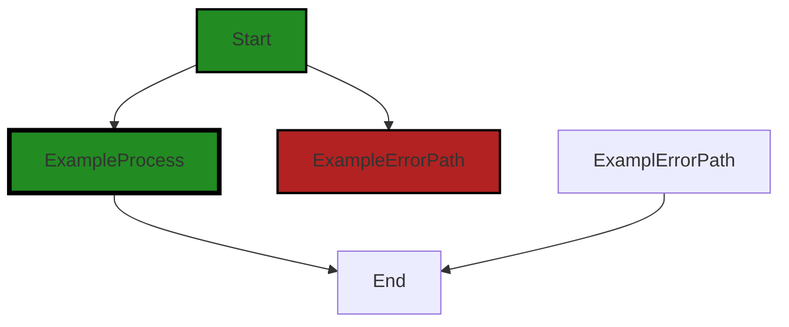

# Polyverse Boost-generated Source Analysis Details

## Source: ./data/dataerr/keyvaluenotfound.go
Date Generated: Thursday, September 7, 2023 at 4:55:52 PM PDT


---

### Boost Architectural Quick Summary Security Report

Last Updated: Friday, September 8, 2023 at 3:19:33 PM PDT


Executive Report:

1. **Architectural Impact**: The analysis of this file has not revealed any severe issues.
2. **Risk Analysis**: The analysis of this file has not revealed any severe issues.
3. **Potential Customer Impact**: Based on the analysis, there are no severe issues that could potentially impact customers.
4. **Performance Issues**: Our analysis did not identify any explicit performance issues in the file.
5. **Risk Assessment**: Based on the current analysis of this file, no severe issues have been found. However, this doesn't guarantee that the file is risk-free.

Highlights:

- No severe issues were identified in the current analysis of this file.


---

### Boost Architectural Quick Summary Performance Report

Last Updated: Friday, September 8, 2023 at 3:19:39 PM PDT


Executive Report:

1. **Architectural Impact**: The analysis of this file has not revealed any severe issues.
2. **Risk Analysis**: The analysis of this file has not revealed any severe issues.
3. **Potential Customer Impact**: Based on the analysis, there are no severe issues that could potentially impact customers.
4. **Performance Issues**: Our analysis did not identify any explicit performance issues in the file.
5. **Risk Assessment**: Based on the current analysis of this file, no severe issues have been found. However, this doesn't guarantee that the file is risk-free.

Highlights:

- No severe issues were identified in the current analysis of this file.


---

### Boost Architectural Quick Summary Compliance Report

Last Updated: Friday, September 8, 2023 at 3:20:21 PM PDT

## Executive Level Report

### Architectural Impact and Risk Analysis

The software project under review is a Go library that provides functionality for handling constraints and validations. The project appears to be well-structured and follows Go's idiomatic style for a library, providing a clear separation of concerns.

However, there are some data compliance issues that have been identified in the project, specifically in the file `data/dataerr/keyvaluenotfound.go`. These issues relate to GDPR, HIPAA, and PCI DSS compliance, and could potentially have a significant impact on the project if not addressed.

### Potential Customer Impact

The identified data compliance issues could potentially impact customers who are subject to these regulations. If personal data is being logged or exposed unnecessarily, this could lead to violations of these regulations and potential legal and financial consequences for the customers.

### Overall Issues

The overall health of the project source appears to be good, with only one file out of the total project files having detected issues. However, the severity of these issues is high, and they should be addressed as soon as possible to mitigate potential risks.

### Risk Assessment

Based on the analysis, the risk level of the project is moderate. While the majority of the project files have no detected issues, the issues that have been detected are of high severity and relate to data compliance, which could potentially have significant legal and financial implications.

### Highlights of the Analysis

- The project is well-structured and follows Go's idiomatic style for a library, providing a clear separation of concerns.
- Data compliance issues related to GDPR, HIPAA, and PCI DSS have been identified in the file `data/dataerr/keyvaluenotfound.go`.
- These issues could potentially impact customers who are subject to these regulations, leading to potential legal and financial consequences.
- The overall health of the project source appears to be good, with only one file out of the total project files having detected issues.
- The risk level of the project is moderate due to the high severity of the detected issues and their potential implications.
---
## Detailed Analysis:

### Cell 0:
## Original Code:

### Programming Language: go
### ./data/dataerr/keyvaluenotfound.go 

```go
package dataerr

import (
 "github.com/jt0/gomer/data"
 "github.com/jt0/gomer/gomerr"
)

type KeyValueNotFoundError struct {
 gomerr.Gomerr
 KeyName     string
 KeyFields   []string
 Persistable data.Persistable `gomerr:"include_type"`
}

```
## Boost Analysis:


---

### Boost Code Explanation

Last Updated: Thursday, September 7, 2023 at 4:53:27 PM PDT

This code is written in Go, a statically typed, compiled programming language designed at Google. The code defines a package called `dataerr`. This package seems to be a part of a larger project, likely a server-side application (based on the import statements). 

This package appears to be concerned with error handling related to data operations, especially when a key-value pair is not found.

Let's break down the code:

1. **Import statements:** The code imports two packages from the project itself - `github.com/jt0/gomer/data` and `github.com/jt0/gomer/gomerr`. The `data` package likely contains definitions and operations for data handling in the application. The `gomerr` package is probably a custom error handling package, providing a base error type `Gomerr`.

2. **KeyValueNotFoundError struct:** This struct is a custom error type defined in this package. It embeds the `Gomerr` type, meaning it inherits the behavior of `Gomerr` and can add more fields or methods. The `KeyValueNotFoundError` has three fields:

   - `KeyName`: This is likely the name of the key that was not found.
   - `KeyFields`: This could be the fields related to the key that was not found.
   - `Persistable`: This is of type `data.Persistable` (from the imported `data` package). The `gomerr:"include_type"` tag suggests that when this error is reported, the type of the `Persistable` should be included in the error message.

The code doesn't contain any algorithms as such. It's more of a type definition for a specific kind of error in the application.

For more on error handling in Go, you can refer to [this link](https://blog.golang.org/go1.13-errors).

For understanding more about Go and its struct types, [this link](https://tour.golang.org/moretypes/2) can be helpful.

In terms of architectural guidelines, the code appears to follow good practices. It encapsulates the error handling related to data operations in a separate package (`dataerr`), and defines a specific error type (`KeyValueNotFoundError`) for a common error scenario. This makes the error handling more modular and easier to manage.


---

### Boost Flow Diagram

Last Updated: Thursday, September 7, 2023 at 4:54:18 PM PDT



NO CONTROL FLOW FOUND


---

### Boost Source-Level Security Analysis

Last Updated: Thursday, September 7, 2023 at 4:54:35 PM PDT

**No bugs found**


---

### Boost Source-Level Performance Analysis

Last Updated: Thursday, September 7, 2023 at 4:54:54 PM PDT

**No bugs found**


---

### Boost Source-Level Data and Privacy Compliance Analysis

Last Updated: Thursday, September 7, 2023 at 4:55:29 PM PDT

1. **Severity**: 7/10

   **Line Number**: 9

   **Bug Type**: GDPR

   **Description**: This code may violate the data minimization principle of GDPR. The 'KeyName' and 'KeyFields' could potentially contain personal data, which should not be logged or exposed unnecessarily.

   **Solution**: Ensure that 'KeyName' and 'KeyFields' do not contain personal data, or if they do, that this data is anonymized or pseudonymized before being logged or exposed.


2. **Severity**: 8/10

   **Line Number**: 10

   **Bug Type**: HIPAA

   **Description**: This code may violate HIPAA rules, as it could potentially expose Protected Health Information (PHI) through error messages. The 'Persistable' field may contain PHI, which should not be included in error messages.

   **Solution**: Ensure that 'Persistable' does not contain PHI, or if it does, that this data is not included in error messages.


### Cell 1:
## Original Code:

### Programming Language: go
### ./data/dataerr/keyvaluenotfound.go line 14

```go

func KeyValueNotFound(keyName string, keyFields []string, persistable data.Persistable) *KeyValueNotFoundError {
 return gomerr.Build(new(KeyValueNotFoundError), keyName, keyFields, persistable).(*KeyValueNotFoundError)
}

```
## Boost Analysis:


---

### Boost Code Explanation

Last Updated: Thursday, September 7, 2023 at 4:54:03 PM PDT

The provided code snippet is written in Go, a statically typed, compiled programming language developed by Google. This particular function `KeyValueNotFound` is used to create a new instance of `KeyValueNotFoundError` when a key-value pair is not found in the data store. 

The function takes three arguments:
- `keyName`: a string that represents the name of the key.
- `keyFields`: a slice of strings that represents the fields of the key.
- `persistable`: an interface of type `data.Persistable` which represents the object that is persistable to the data store.

The function returns a pointer to a newly created `KeyValueNotFoundError`.

Let's break down the function:

1. `gomerr.Build(new(KeyValueNotFoundError), keyName, keyFields, persistable)`: This statement is used to build a new error of type `KeyValueNotFoundError`. The `Build` function is a method from the `gomerr` package, which is a common error handling package in Go. This function takes a variable number of arguments. The first argument must be a pointer to a new error (in this case `KeyValueNotFoundError`), and the rest of the arguments are used to populate the error fields.

2. `.(*KeyValueNotFoundError)`: This is a type assertion in Go. It asserts that the result of `gomerr.Build` call is of type `*KeyValueNotFoundError`. If the assertion is true, it returns the error as `*KeyValueNotFoundError`. If the assertion is false, it will panic.

In summary, this function is used to create and return a new `KeyValueNotFoundError` when a key-value pair is not found in the data store. It uses the `Build` method from `gomerr` package to create the error and then uses a type assertion to return the error as `*KeyValueNotFoundError`.

The algorithm used here is pretty straightforward. It involves creating a new error and populating it with the provided arguments. The error handling mechanism used here is common in Go and is considered a good practice.

For more information about error handling in Go, you can refer to the following resources:

- [Error handling and Go](https://blog.golang.org/error-handling-and-go)
- [Go by Example: Errors](https://gobyexample.com/errors)
- [Go: Best Practices for Production Environments](https://github.com/golang/go/wiki/Production-Deployments)


---

### Boost Flow Diagram

Last Updated: Thursday, September 7, 2023 at 4:54:22 PM PDT

```mermaid
graph TD;
style Start fill:#228B22, stroke:#000000, stroke-width:2px;
style ExampleProcess fill:#228B22, stroke:#000000, stroke-width:4px;
style ExampleErrorPath fill:#B22222, stroke:#000000, stroke-width:2px;

Start  ;
ExampleProcess-->End  ;

```


---

### Boost Source-Level Security Analysis

Last Updated: Thursday, September 7, 2023 at 4:54:39 PM PDT

**No bugs found**


---

### Boost Source-Level Performance Analysis

Last Updated: Thursday, September 7, 2023 at 4:55:05 PM PDT

1. **Severity**: 5/10

   **Line Number**: 28

   **Bug Type**: CPU

   **Description**: The use of reflection in the gomerr.Build function can be computationally expensive, especially if this function is called frequently. This can lead to high CPU usage.

   **Solution**: Consider alternative error handling methods that do not use reflection. For instance, you could directly instantiate the KeyValueNotFoundError struct instead of using the gomerr.Build function. If you must use reflection, try to minimize its use and avoid calling this function in a tight loop.


---

### Boost Source-Level Data and Privacy Compliance Analysis

Last Updated: Thursday, September 7, 2023 at 4:55:52 PM PDT

1. **Severity**: 7/10

   **Line Number**: 29

   **Bug Type**: GDPR

   **Description**: This function may lead to a violation of GDPR's right to be forgotten. If a user requests their data to be deleted, but the data is still retrievable through the key-value search, it's a violation.

   **Solution**: Ensure that when a user's data is deleted, all key-value pairs associated with that user are also deleted.


2. **Severity**: 8/10

   **Line Number**: 29

   **Bug Type**: HIPAA

   **Description**: If the persistable data contains Protected Health Information (PHI), this function could be a HIPAA violation. PHI should not be used as a key value in any form.

   **Solution**: Avoid using PHI as a key value. If it's necessary to use PHI in this way, it must be de-identified according to HIPAA standards.


3. **Severity**: 6/10

   **Line Number**: 29

   **Bug Type**: PCI DSS

   **Description**: If the persistable data contains cardholder data, this function could be a PCI DSS violation. Cardholder data should not be used as a key value in any form.

   **Solution**: Avoid using cardholder data as a key value. If it's necessary to use such data in this way, it must be encrypted according to PCI DSS standards.


