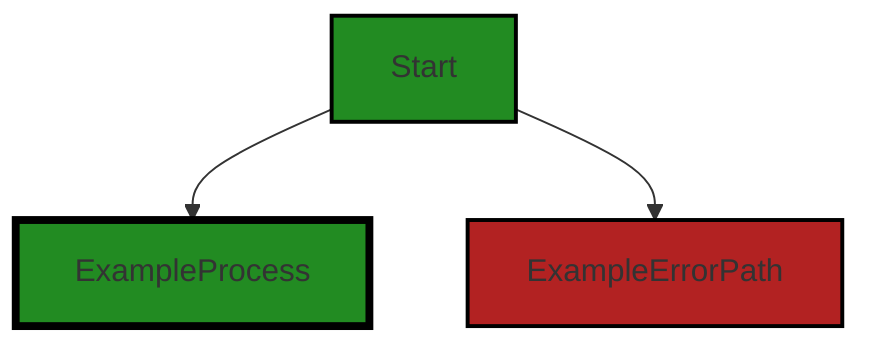
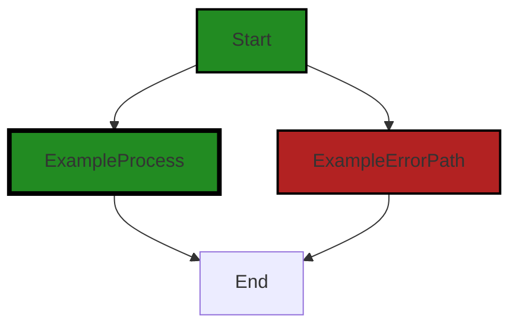

# Polyverse Boost-generated Source Analysis Details

## Source: ./data/dataerr/noindexmatch.go
Date Generated: Thursday, September 7, 2023 at 4:27:09 PM PDT


---

### Boost Architectural Quick Summary Security Report

Last Updated: Friday, September 8, 2023 at 3:09:45 PM PDT


Executive Report:

1. **Architectural Impact**: The analysis of this file has not revealed any severe issues.
2. **Risk Analysis**: The analysis of this file has not revealed any severe issues.
3. **Potential Customer Impact**: Based on the analysis, there are no severe issues that could potentially impact customers.
4. **Performance Issues**: Our analysis did not identify any explicit performance issues in the file.
5. **Risk Assessment**: Based on the current analysis of this file, no severe issues have been found. However, this doesn't guarantee that the file is risk-free.

Highlights:

- No severe issues were identified in the current analysis of this file.


---

### Boost Architectural Quick Summary Performance Report

Last Updated: Friday, September 8, 2023 at 3:09:52 PM PDT


Executive Report:

1. **Architectural Impact**: The analysis of this file has not revealed any severe issues.
2. **Risk Analysis**: The analysis of this file has not revealed any severe issues.
3. **Potential Customer Impact**: Based on the analysis, there are no severe issues that could potentially impact customers.
4. **Performance Issues**: Our analysis did not identify any explicit performance issues in the file.
5. **Risk Assessment**: Based on the current analysis of this file, no severe issues have been found. However, this doesn't guarantee that the file is risk-free.

Highlights:

- No severe issues were identified in the current analysis of this file.


---

### Boost Architectural Quick Summary Compliance Report

Last Updated: Friday, September 8, 2023 at 3:10:35 PM PDT

## Executive Level Report

### Architectural Impact and Risk Analysis

Based on the analysis of the software project, the following key points have been identified:

1. **Data Compliance and Privacy Concerns**: The file `data/dataerr/noindexmatch.go` has been flagged for potential data compliance and privacy issues. This file has 3 warnings related to data compliance and 2 warnings related to data privacy. This could potentially impact the project's compliance with regulations such as GDPR, PCI DSS, and HIPAA. The absence of mechanisms to ensure data compliance could lead to potential violations of these regulations.

2. **Risk Assessment**: The project consists of a single file, `data/dataerr/noindexmatch.go`, which has been flagged with issues. This means 100% of the project files have been flagged with issues of 'Warning' severity. This indicates a high risk in terms of data compliance and privacy.

3. **Potential Customer Impact**: The issues identified could potentially impact customers in terms of data privacy and compliance. If the software is handling sensitive customer data, the absence of mechanisms to ensure data compliance could lead to data breaches and non-compliance with data protection regulations. This could result in legal penalties and loss of customer trust.

4. **Overall Health of the Project**: Given that all the project files have been flagged with issues, the overall health of the project is a concern. The project needs to implement mechanisms to ensure data compliance and privacy, such as encryption of sensitive data, obtaining user consent before data processing, and implementing strong access controls.

5. **Architectural Consistency**: The project appears to be a library written in Go that focuses on constraint handling and validation. It follows Go's idiomatic style and structure for a library, providing a clear separation of concerns. However, the identified data compliance and privacy issues indicate a lack of consistency with standard data handling practices.

In conclusion, while the project follows good architectural practices in terms of structure and design, it falls short in terms of data compliance and privacy. Immediate action is required to address these issues to ensure the project's compliance with data protection regulations and to safeguard customer data.
---
## Detailed Analysis:

### Cell 0:
## Original Code:

### Programming Language: go
### ./data/dataerr/noindexmatch.go 

```go
package dataerr

import (
 "github.com/jt0/gomer/data"
 "github.com/jt0/gomer/gomerr"
)

type NoIndexMatchError struct {
 gomerr.Gomerr
 AvailableIndexes map[string]interface{}
 Queryable        data.Queryable `gomerr:"include_type"`
}

```
## Boost Analysis:


---

### Boost Code Explanation

Last Updated: Thursday, September 7, 2023 at 4:24:41 PM PDT

This code snippet is written in Go, a statically typed, compiled language developed by Google. The code snippet is defining a custom error type `NoIndexMatchError` in a package named `dataerr`. 

Let's break down the code:

1. `package dataerr`: This line defines the package name as `dataerr`. In Go, the package name is the same as the last element of the import path. For example, the math/rand package comprises files that begin with the statement `package rand`.

2. `import`: The `import` keyword is used to import other packages into the program. Here, two packages are being imported:
   - `github.com/jt0/gomer/data`: It's likely this package provides data-related functionalities, such as data structures or data handling functions.
   - `github.com/jt0/gomer/gomerr`: This package probably provides functionalities related to error handling. The `gomerr` package appears to be a custom error handling package developed by the same author.

3. `type NoIndexMatchError struct`: This line defines a new type named `NoIndexMatchError` which is a struct. In Go, a struct is a collection of fields.

4. `gomerr.Gomerr`: This line indicates that the `NoIndexMatchError` struct embeds the `Gomerr` type from the `gomerr` package. This means that `NoIndexMatchError` will inherit all the fields and methods of `Gomerr`.

5. `AvailableIndexes map[string]interface{}`: This line defines a field `AvailableIndexes` in the `NoIndexMatchError` struct. The field is a map where keys are strings and values are of the interface{} type, which means it can hold values of any type.

6. `Queryable data.Queryable 'gomerr:"include_type"'`: This line defines a field `Queryable` of type `data.Queryable` in the `NoIndexMatchError` struct. The `gomerr:"include_type"` part is a struct tag. In Go, struct tags are used to attach metadata to the fields of a struct. Here, it's likely that the `gomerr` package uses this tag to determine whether to include the type of the `Queryable` field when the `NoIndexMatchError` is formatted or logged.

In terms of algorithms, this code doesn't present any. It's a definition of a data type, not a process or function that would involve an algorithm.

For more information about Go programming, you can refer to the following resources:

- [A Tour of Go](https://tour.golang.org/welcome/1)
- [Effective Go](https://golang.org/doc/effective_go.html)
- [Go by Example](https://gobyexample.com/)


---

### Boost Flow Diagram

Last Updated: Thursday, September 7, 2023 at 4:25:29 PM PDT




---

### Boost Source-Level Security Analysis

Last Updated: Thursday, September 7, 2023 at 4:25:47 PM PDT

**No bugs found**


---

### Boost Source-Level Performance Analysis

Last Updated: Thursday, September 7, 2023 at 4:26:00 PM PDT

**No bugs found**


---

### Boost Source-Level Data and Privacy Compliance Analysis

Last Updated: Thursday, September 7, 2023 at 4:26:43 PM PDT

1. **Severity**: 6/10

   **Line Number**: 1

   **Bug Type**: Data Compliance

   **Description**: The code does not implement any mechanism to ensure that the data being handled is compliant with GDPR, PCI DSS, and HIPAA regulations. The absence of such mechanisms can lead to potential violations of these regulations.

   **Solution**: Implement mechanisms to ensure that data is handled in a manner compliant with GDPR, PCI DSS, and HIPAA. This could include encryption of sensitive data, obtaining user consent before data processing, and implementing strong access controls.


2. **Severity**: 8/10

   **Line Number**: 9

   **Bug Type**: Data Privacy

   **Description**: The 'NoIndexMatchError' struct exposes potentially sensitive information about the database indexes. This could lead to data privacy issues and potential security vulnerabilities.

   **Solution**: Avoid exposing internal details of your database structure. If it's necessary to provide this information for debugging purposes, ensure it's properly logged on the server side and not exposed to the end user or through error messages.


### Cell 1:
## Original Code:

### Programming Language: go
### ./data/dataerr/noindexmatch.go line 13

```go

func NoIndexMatch(availableIndexes map[string]interface{}, queryable data.Queryable) *NoIndexMatchError {
 return gomerr.Build(new(NoIndexMatchError), availableIndexes, queryable).(*NoIndexMatchError)
}

```
## Boost Analysis:


---

### Boost Code Explanation

Last Updated: Thursday, September 7, 2023 at 4:25:15 PM PDT

This Go function, `NoIndexMatch`, takes two parameters: `availableIndexes` and `queryable`. `availableIndexes` is a map where the keys are strings and the values are of type `interface{}`, which means it can hold any type. `queryable` is of a custom type `data.Queryable`.

The function returns a pointer to a `NoIndexMatchError` object. This error object is not defined in the provided code snippet, but it's likely a custom error type defined elsewhere in the project.

The function body calls `gomerr.Build` to create a new instance of `NoIndexMatchError`. `gomerr` is a package for creating and managing errors in Go, providing a more structured approach to error handling. The `Build` function takes a variadic number of arguments, the first of which is expected to be a pointer to a new error instance. The remaining arguments are used to populate fields in the error instance.

In this case, `new(NoIndexMatchError)` creates a new instance of `NoIndexMatchError`, and `availableIndexes` and `queryable` are presumably used to populate fields in the error instance. The result of `gomerr.Build` is then cast to a pointer to `NoIndexMatchError` before being returned.

The name `NoIndexMatch` suggests that this function is used when no match is found between the available indexes and the queryable data. This could be part of a database or data storage abstraction layer, where `NoIndexMatchError` is used to signal that a requested operation could not be performed because no suitable index was found.

As for algorithms, this function doesn't appear to implement any specific algorithm. It's more of a utility function for creating a specific type of error.

For more information on error handling in Go, you can refer to the following resources:
- [Error handling and Go](https://blog.golang.org/error-handling-and-go)
- [Errors are values](https://blog.golang.org/errors-are-values)
- [Go error handling best practices](https://www.ardanlabs.com/blog/2014/10/error-handling-in-go-part-i.html)


---

### Boost Flow Diagram

Last Updated: Thursday, September 7, 2023 at 4:25:34 PM PDT



The control flow graph for the provided code snippet is a simple linear flow. There are no external library calls or non-standard functions in the code. The primary path is the non-error path, which goes from the start of the function to the end.


---

### Boost Source-Level Security Analysis

Last Updated: Thursday, September 7, 2023 at 4:25:50 PM PDT

**No bugs found**


---

### Boost Source-Level Performance Analysis

Last Updated: Thursday, September 7, 2023 at 4:26:14 PM PDT

1. **Severity**: 5/10

   **Line Number**: 28

   **Bug Type**: CPU

   **Description**: The use of reflection in the 'gomerr.Build' function can be computationally expensive and slow down performance, especially when dealing with large data structures.

   **Solution**: Consider using type assertions or type switches instead of reflection if possible. If reflection is necessary, try to minimize its use. Here's a good resource on the topic: https://go.dev/blog/laws-of-reflection


---

### Boost Source-Level Data and Privacy Compliance Analysis

Last Updated: Thursday, September 7, 2023 at 4:27:09 PM PDT

1. **Severity**: 7/10

   **Line Number**: 26

   **Bug Type**: Data Compliance

   **Description**: The function NoIndexMatch does not show any evidence of encryption or other security measures to protect sensitive data, which could potentially lead to Protected Health Information (PHI) being processed in violation of HIPAA.

   **Solution**: Implement encryption or other security measures to protect sensitive data. For example, you could use SSL/TLS for data in transit and AES for data at rest.


2. **Severity**: 8/10

   **Line Number**: 26

   **Bug Type**: Data Privacy

   **Description**: The function NoIndexMatch does not seem to check the nature of the data it is handling. This could potentially lead to breaches of GDPR compliance if personal data is being processed without adequate checks and controls.

   **Solution**: Implement checks to determine the nature of the data being processed and apply appropriate controls. For example, you could use data classification techniques to identify personal data and apply GDPR-compliant handling procedures to it.


3. **Severity**: 6/10

   **Line Number**: 26

   **Bug Type**: Data Compliance

   **Description**: The function NoIndexMatch does not seem to have any mechanism for ensuring the integrity of the data it handles, which could potentially lead to PCI DSS compliance issues.

   **Solution**: Implement a mechanism for ensuring data integrity. For example, you could use checksums or cryptographic hashes to verify the integrity of data.


