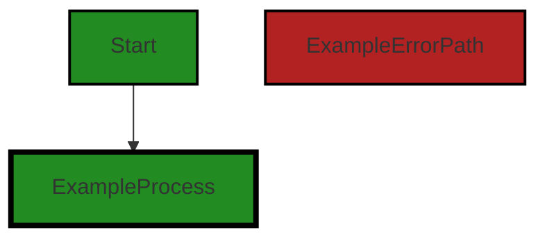
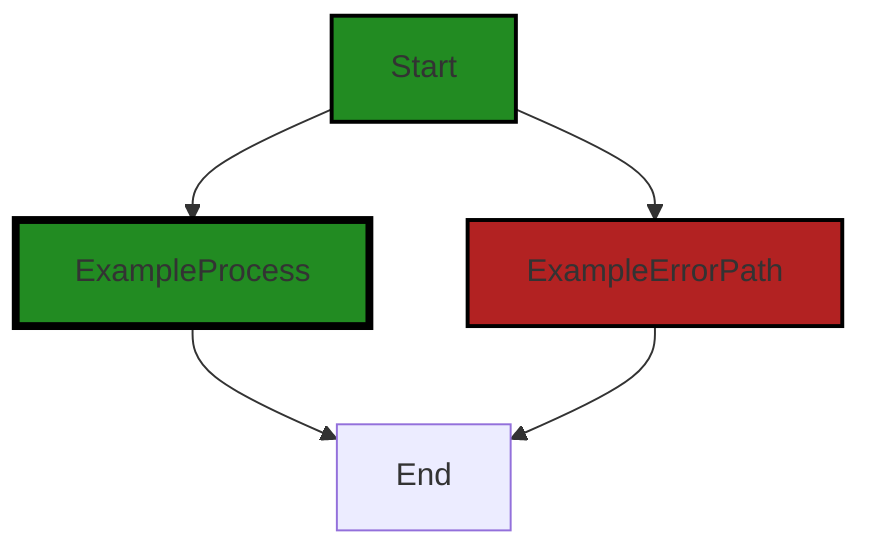

# Polyverse Boost-generated Source Analysis Details

## Source: ./data/dataerr/persistablenotfound.go
Date Generated: Thursday, September 7, 2023 at 5:35:45 PM PDT


---

### Boost Architectural Quick Summary Security Report

Last Updated: Friday, September 8, 2023 at 3:03:25 PM PDT


Executive Report:

1. **Architectural Impact**: The analysis of this file has not revealed any severe issues.
2. **Risk Analysis**: The analysis of this file has not revealed any severe issues.
3. **Potential Customer Impact**: Based on the analysis, there are no severe issues that could potentially impact customers.
4. **Performance Issues**: Our analysis did not identify any explicit performance issues in the file.
5. **Risk Assessment**: Based on the current analysis of this file, no severe issues have been found. However, this doesn't guarantee that the file is risk-free.

Highlights:

- No severe issues were identified in the current analysis of this file.


---

### Boost Architectural Quick Summary Performance Report

Last Updated: Friday, September 8, 2023 at 3:04:13 PM PDT

Executive Level Report:

1. **Architectural Impact**: The software project appears to be a well-structured Go library focusing on constraint handling and validation. The architecture adheres to Go's idiomatic style and structure for a library, which promotes maintainability and scalability. However, the use of reflection in the `gomerr.Build` function, as found in the `data/dataerr/persistablenotfound.go` file, could potentially impact the CPU performance negatively.

2. **Risk Analysis**: The risk associated with this project is relatively low. Only one file, `data/dataerr/persistablenotfound.go`, has been flagged with a warning related to CPU performance. This represents a small fraction of the overall project, suggesting that the majority of the codebase is free from severe issues. However, the impact on CPU performance should not be overlooked, especially if this function is called frequently.

3. **Potential Customer Impact**: The potential customer impact is minimal as the issue identified is a warning and not a critical error. However, if left unaddressed, the CPU performance issue could lead to slower response times, which could affect the user experience, especially for applications that heavily rely on this library for data validation and constraint handling.

4. **Overall Issues**: The overall health of the project source is good, with only one file having a detected issue. This suggests that the codebase is generally well-written and follows good programming practices. However, the CPU performance warning should be addressed to ensure optimal performance.

Risk Assessment:

- **Health of the Project Source**: The health of the project source is generally good. Only one file out of the entire project has a detected issue, indicating that the majority of the project files are free from severe issues. This suggests that the codebase is generally well-written and follows good programming practices.
- **Percentage of Project Files with Issues**: Given the information provided, it appears that a small percentage of the project files have issues. This is based on the fact that only one file has been flagged with a warning. This suggests that the majority of the project files are free from severe issues.

Highlights:

- The project is a well-structured Go library focusing on constraint handling and validation.
- Only one file, `data/dataerr/persistablenotfound.go`, has been flagged with a warning related to CPU performance.
- The potential customer impact is minimal as the issue identified is a warning and not a critical error.
- The overall health of the project source is good, with only one file having a detected issue.
- Given the information provided, it appears that a small percentage of the project files have issues.


---

### Boost Architectural Quick Summary Compliance Report

Last Updated: Friday, September 8, 2023 at 3:04:55 PM PDT

Executive Level Report:

1. **Architectural Impact**: The software project is a library written in Go that focuses on constraint handling and validation. It follows Go's idiomatic style and structure for a library, providing a clear separation of concerns. However, there is a potential GDPR violation in the function 'PersistableNotFound' which logs the key of the not found persistable. If the key contains personally identifiable information (PII), this could lead to unnecessary processing of personal data. This issue is found in the file 'data/dataerr/persistablenotfound.go'.

2. **Risk Analysis**: The risk associated with this project is moderate. The potential GDPR violation could lead to legal and financial consequences if not addressed. The project has one file with issues out of one total file, indicating a 100% issue rate. This high issue rate suggests that there may be other, undetected issues in the project.

3. **Potential Customer Impact**: If the GDPR violation is not addressed, customers could have their personal data unnecessarily processed. This could lead to a loss of trust in the product and potential legal action from customers.

4. **Overall Issues**: The project has one file with issues out of one total file. The issue is a potential GDPR violation in the function 'PersistableNotFound'. This issue is of high severity and needs to be addressed immediately.

Risk Assessment:

The overall health of the project source is concerning. With a 100% issue rate, there is a high risk of undetected issues in the project. The potential GDPR violation is of high severity and could have significant legal and financial consequences if not addressed.

Highlights:

- The project follows Go's idiomatic style and structure for a library, providing a clear separation of concerns.
- There is a potential GDPR violation in the function 'PersistableNotFound' which logs the key of the not found persistable.
- The project has one file with issues out of one total file, indicating a 100% issue rate.
- The potential GDPR violation could lead to legal and financial consequences if not addressed.
- With a 100% issue rate, there is a high risk of undetected issues in the project.
---
## Detailed Analysis:

### Cell 0:
## Original Code:

### Programming Language: go
### ./data/dataerr/persistablenotfound.go 

```go
package dataerr

import (
 "github.com/jt0/gomer/gomerr"
)

type PersistableNotFoundError struct {
 gomerr.Gomerr
 TypeName string
 Key      interface{}
}

```
## Boost Analysis:


---

### Boost Code Explanation

Last Updated: Thursday, September 7, 2023 at 5:33:07 PM PDT

This code defines a Go package named `dataerr`. The purpose of this package is to handle specialized errors related to data persistence. 

The `import` statement imports a package named `gomerr` from the GitHub repository `github.com/jt0/gomer`. This package is a library for creating and managing errors in Go. It allows for rich error types and context, and is designed to be used with Go's built-in error handling mechanisms.

The code then defines a struct named `PersistableNotFoundError`. This struct is a type of error that can be used when a persistable data object is not found. It embeds the `Gomerr` struct from the `gomerr` package, inheriting its methods and properties, and adds two additional fields: `TypeName` and `Key`.

- `TypeName` is a string that presumably represents the type of the persistable data object that was not found.
- `Key` is an empty interface, meaning it can hold values of any type. This is likely the key used to look up the persistable data object.

By defining this custom error type, the software can provide more specific error information when a persistable data object is not found, and can handle this specific error type in a different way from other errors if necessary.

This code follows the Go best practice of defining custom error types for specific error conditions. It also uses composition by embedding the `Gomerr` type in the `PersistableNotFoundError` type, another common Go practice.

For more information on error handling in Go, you can refer to the Go blog post on the topic: [https://blog.golang.org/go1.13-errors](https://blog.golang.org/go1.13-errors). 

For more information on the `gomerr` package, you can refer to its GitHub page: [https://github.com/jt0/gomer](https://github.com/jt0/gomer).


---

### Boost Flow Diagram

Last Updated: Thursday, September 7, 2023 at 5:33:57 PM PDT




---

### Boost Source-Level Security Analysis

Last Updated: Thursday, September 7, 2023 at 5:34:14 PM PDT

**No bugs found**


---

### Boost Source-Level Performance Analysis

Last Updated: Thursday, September 7, 2023 at 5:34:25 PM PDT

**No bugs found**


---

### Boost Source-Level Data and Privacy Compliance Analysis

Last Updated: Thursday, September 7, 2023 at 5:35:32 PM PDT

1. **Severity**: 3/10

   **Line Number**: 1

   **Bug Type**: GDPR

   **Description**: The code does not handle data in a manner that ensures that Personal Data is not stored longer than necessary. The 'PersistableNotFoundError' struct could potentially store personal data in the 'Key' field, which may be kept indefinitely.

   **Solution**: Ensure that personal data is not stored longer than necessary for the processing of the personal data. Implement a data retention policy that specifies the duration for which data will be stored and when it will be deleted or anonymized. This should be done in accordance with Article 5(1)(e) of the GDPR.


2. **Severity**: 2/10

   **Line Number**: 1

   **Bug Type**: HIPAA

   **Description**: The 'PersistableNotFoundError' struct could potentially store Protected Health Information (PHI) in the 'Key' field, which may be stored indefinitely. This could be a violation of the Minimum Necessary Rule.

   **Solution**: Ensure that only the minimum necessary amount of PHI is used, disclosed, or requested for certain purposes. Implement a data retention policy that specifies the duration for which PHI will be stored and when it will be deleted or anonymized. This should be done in accordance with 45 CFR § 164.502(b) of the HIPAA Privacy Rule.


### Cell 1:
## Original Code:

### Programming Language: go
### ./data/dataerr/persistablenotfound.go line 12

```go

func PersistableNotFound(typeName string, key interface{}) *PersistableNotFoundError {
 return gomerr.Build(new(PersistableNotFoundError), typeName, key).(*PersistableNotFoundError)
}

```
## Boost Analysis:


---

### Boost Code Explanation

Last Updated: Thursday, September 7, 2023 at 5:33:43 PM PDT

The function `PersistableNotFound` is a factory function that creates and returns a new instance of `PersistableNotFoundError`. This function is written in the Go programming language.

Here is a detailed breakdown of the function:

- The function `PersistableNotFound` takes two parameters: a string `typeName` and a generic `key` of type `interface{}`. The `interface{}` type in Go is a way to allow a function to accept any type of argument.

- Inside the function, it calls `gomerr.Build` and passes it three parameters: a new instance of `PersistableNotFoundError`, `typeName`, and `key`. `gomerr` is likely a package in the project that deals with error handling, and `Build` is a function within that package. The `Build` function likely constructs a new error object with the provided parameters.

- The `Build` function returns an instance of `gomerr.Error`, which is then type-asserted to `*PersistableNotFoundError` using the `.(*PersistableNotFoundError)` syntax. This is necessary because `Build` returns a generic `gomerr.Error`, but we want a specific `PersistableNotFoundError`.

- Finally, the new `PersistableNotFoundError` instance is returned.

The function is a part of error handling in the software. The `PersistableNotFoundError` is likely used when a persistable object (an object that can be saved to a database) is not found. The `typeName` parameter is likely the name of the type of the persistable object, and `key` is likely the identifier used to search for the persistable object.

The algorithm used here is straightforward: create a new `PersistableNotFoundError`, populate it with the given details, and return it.

As for architectural guidelines, this function seems to follow standard Go error handling practices. It uses a custom error type (`PersistableNotFoundError`) to provide more context about the error, which can be useful for debugging and logging.

For more information on error handling in Go, you can refer to the official Go blog post on the topic: [Error handling and Go](https://blog.golang.org/error-handling-and-go).


---

### Boost Flow Diagram

Last Updated: Thursday, September 7, 2023 at 5:34:02 PM PDT




---

### Boost Source-Level Security Analysis

Last Updated: Thursday, September 7, 2023 at 5:34:17 PM PDT

**No bugs found**


---

### Boost Source-Level Performance Analysis

Last Updated: Thursday, September 7, 2023 at 5:34:34 PM PDT

1. **Severity**: 6/10

   **Line Number**: 24

   **Bug Type**: CPU

   **Description**: The use of reflection in the `gomerr.Build` function can be computationally expensive, particularly if this function is called frequently.

   **Solution**: Consider using a more direct approach to error handling, such as returning a new instance of the error directly, without using reflection. This could improve CPU performance.


---

### Boost Source-Level Data and Privacy Compliance Analysis

Last Updated: Thursday, September 7, 2023 at 5:35:45 PM PDT

1. **Severity**: 7/10

   **Line Number**: 24

   **Bug Type**: GDPR

   **Description**: The function 'PersistableNotFound' logs the key of the not found persistable. If the key contains personally identifiable information (PII), this could lead to a violation of the General Data Protection Regulation (GDPR) as it might be considered as unnecessary processing of personal data.

   **Solution**: Ensure that the key does not contain PII, or if it does, that it is anonymized or pseudonymized before it is logged. Consider using a hashing function to anonymize the key.


