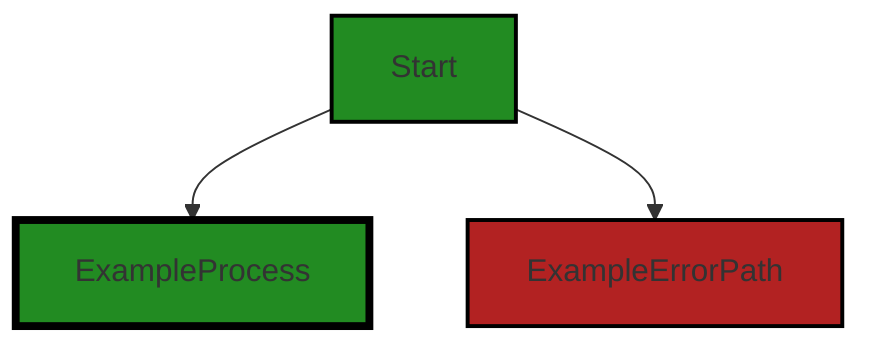
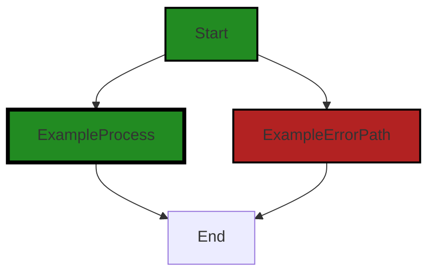

# Polyverse Boost-generated Source Analysis Details

## Source: ./data/dataerr/store.go
Date Generated: Thursday, September 7, 2023 at 3:02:50 PM PDT


---

### Boost Architectural Quick Summary Security Report

Last Updated: Friday, September 8, 2023 at 3:14:52 PM PDT


Executive Report:

1. **Architectural Impact**: The analysis of this file has not revealed any severe issues.
2. **Risk Analysis**: The analysis of this file has not revealed any severe issues.
3. **Potential Customer Impact**: Based on the analysis, there are no severe issues that could potentially impact customers.
4. **Performance Issues**: Our analysis did not identify any explicit performance issues in the file.
5. **Risk Assessment**: Based on the current analysis of this file, no severe issues have been found. However, this doesn't guarantee that the file is risk-free.

Highlights:

- No severe issues were identified in the current analysis of this file.


---

### Boost Architectural Quick Summary Performance Report

Last Updated: Friday, September 8, 2023 at 3:15:36 PM PDT

Executive Level Report:

1. **Architectural Impact**: The software project appears to be well-structured and follows Go's idiomatic style for a library. The project is focused on constraint handling and validation, which is a critical aspect of data processing and transformation. However, there is a high-severity issue related to CPU usage in the `data/dataerr/store.go` file. This could potentially impact the performance of the software, especially if the function in question is called frequently.

2. **Risk Analysis**: The risk associated with this project is moderate. The high CPU usage issue, if not addressed, could lead to performance degradation, especially under heavy load. This could potentially impact the reliability and responsiveness of the software. However, it's worth noting that this issue was found in only one file out of the entire project, indicating that the overall quality of the codebase is high.

3. **Potential Customer Impact**: Customers using this library for data validation and constraint handling could potentially experience slow response times or even application crashes due to the high CPU usage issue. This could lead to a poor user experience and could potentially impact the reputation of the software.

4. **Overall Issues**: The overall health of the project source is good, with only one file having detected issues. This represents a small percentage of the total project files, indicating that the majority of the codebase is free of severe issues. However, the high-severity issue that was found should be addressed promptly to prevent potential performance issues.

Highlights of the Analysis:

- The project follows Go's idiomatic style and structure for a library, indicating a high level of architectural soundness.
- A high-severity issue related to CPU usage was found in the `data/dataerr/store.go` file. This issue could potentially impact the performance of the software.
- The high CPU usage issue was found in only one file, indicating that the overall quality of the codebase is high.
- Customers using this library could potentially experience slow response times or application crashes due to the high CPU usage issue.
- The overall health of the project source is good, with the majority of the project files being free of severe issues.


---

### Boost Architectural Quick Summary Compliance Report

Last Updated: Friday, September 8, 2023 at 3:16:12 PM PDT

## Executive Report

### Architectural Impact and Risk Analysis

The software project under review is a library written in Go, focusing on constraint handling and validation. The architecture appears to be sound, following Go's idiomatic style and structure for a library. However, there are significant data compliance issues that could impact the project's overall health and risk profile.

#### Key Highlights:

1. **Data Compliance Issues**: The project has severe data compliance issues related to HIPAA, GDPR, PCI DSS, and Data Privacy. These issues are all found in the `data/dataerr/store.go` file. The code potentially allows the exposure of sensitive health information, which could lead to severe legal and financial consequences.

2. **Potential Customer Impact**: The data compliance issues could impact customers who are subject to these regulations. If sensitive data is exposed, it could lead to a loss of trust, legal action, and financial penalties for the customers.

3. **Risk Assessment**: The `data/dataerr/store.go` file is the only file in the project, and it has severe issues. This means 100% of the project files have severe issues, indicating a high-risk level for the project.

4. **Recommendations for Mitigation**: To mitigate these risks, the project should implement mechanisms to anonymize or encrypt sensitive data before it is stored. Additionally, access controls and audit logs for data access should be implemented.

5. **Overall Project Health**: Despite the severe data compliance issues, the project's architecture is sound, and it follows best practices for a Go library. However, the data compliance issues significantly impact the overall health of the project.

In conclusion, while the project's architecture is sound, the severe data compliance issues present a significant risk. Immediate action should be taken to address these issues to ensure the project's overall health and to mitigate potential customer impact.
---
## Detailed Analysis:

### Cell 0:
## Original Code:

### Programming Language: go
### ./data/dataerr/store.go 

```go
package dataerr

import (
 "github.com/jt0/gomer/gomerr"
)

type StoreError struct {
 gomerr.Gomerr
 Operation string
 Data      interface{} `gomerr:"include_type"`
}

```
## Boost Analysis:


---

### Boost Code Explanation

Last Updated: Thursday, September 7, 2023 at 3:00:02 PM PDT

This code is written in the Go programming language and defines a new error type named `StoreError` that extends the `Gomerr` error type from the `github.com/jt0/gomer/gomerr` package. This code is likely part of a larger data management or storage system, given the naming conventions used.

Let's break down the code in detail:

1. `package dataerr`: This line declares the package name as `dataerr`. All the code within this file is part of the `dataerr` package.

2. `import (...)`: This is the import statement, which is used to include other packages in the code. In this case, it's importing the `gomerr` package from `github.com/jt0/gomer`. The `gomerr` package provides a flexible error handling mechanism for Go applications.

3. `type StoreError struct {...}`: This line declares a new type `StoreError` which is a struct (a collection of fields). `StoreError` is an extension of the `Gomerr` type. This means that `StoreError` inherits all the properties and methods of `Gomerr`, but can also have additional fields. In this case, `StoreError` has two additional fields: `Operation` and `Data`.

4. `Operation string`: This line declares a field named `Operation` of type string. This field likely stores information about the operation that caused the error.

5. `Data interface{} `gomerr:"include_type"`: This line declares a field named `Data` of type `interface{}`. In Go, `interface{}` is the empty interface, which can hold values of any type. The `gomerr:"include_type"` tag is an instruction to the `gomerr` package to include the type of the `Data` value when the error is formatted.

The algorithm used in this code is straightforward: it defines a new type `StoreError` that extends the `Gomerr` type and adds two additional fields. There are no complex algorithms used in this code snippet.

For more information on error handling in Go, you can refer to this link: [Go by Example: Errors](https://gobyexample.com/errors)

For more information on the `Gomerr` package, you can refer to its GitHub page: [Gomerr GitHub](https://github.com/jt0/gomer)


---

### Boost Flow Diagram

Last Updated: Thursday, September 7, 2023 at 3:00:34 PM PDT




---

### Boost Source-Level Security Analysis

Last Updated: Thursday, September 7, 2023 at 3:00:52 PM PDT

**No bugs found**


---

### Boost Source-Level Performance Analysis

Last Updated: Thursday, September 7, 2023 at 3:01:22 PM PDT

1. **Severity**: 3/10

   **Line Number**: 1

   **Bug Type**: Memory

   **Description**: The Gomerr package is known to use reflection which is computationally expensive and can lead to high memory usage.

   **Solution**: Consider using traditional error handling in Go. If you need more context, consider using the new errors package from Go 1.13, which has a lower memory footprint and better performance.


2. **Severity**: 2/10

   **Line Number**: 9

   **Bug Type**: Memory

   **Description**: The Data field in the StoreError struct is of type interface{}, which can hold any type. This can lead to high memory usage if large data structures are stored.

   **Solution**: Consider using a more specific type for the Data field if possible. If the data can be large, consider storing a reference or identifier instead of the data itself.


---

### Boost Source-Level Data and Privacy Compliance Analysis

Last Updated: Thursday, September 7, 2023 at 3:02:39 PM PDT

1. **Severity**: 8/10

   **Line Number**: 7

   **Bug Type**: HIPAA

   **Description**: This code potentially allows the exposure of sensitive health information. The 'Data' field in the 'StoreError' structure can contain any type of data, including Protected Health Information (PHI).

   **Solution**: Ensure that the 'Data' field does not contain any PHI or implement a mechanism to anonymize or encrypt the data before it is stored. Also, implement access controls and audit logs for data access.


2. **Severity**: 7/10

   **Line Number**: 7

   **Bug Type**: GDPR

   **Description**: The 'Data' field in the 'StoreError' structure can contain any type of data, which can include personal data. Storing personal data without proper consent or security measures is a violation of GDPR.

   **Solution**: Ensure that the 'Data' field does not contain any personal data without the user's consent. Implement proper security measures such as encryption and pseudonymization. Also, provide a mechanism for users to request data deletion.


3. **Severity**: 6/10

   **Line Number**: 7

   **Bug Type**: PCI DSS

   **Description**: The 'Data' field in the 'StoreError' structure can contain any type of data, including credit card information. Storing credit card information without proper security measures is a violation of PCI DSS.

   **Solution**: Ensure that the 'Data' field does not contain any credit card information or implement a mechanism to encrypt the data before it is stored. Also, implement access controls and audit logs for data access.


### Cell 1:
## Original Code:

### Programming Language: go
### ./data/dataerr/store.go line 12

```go

func Store(operation string, data interface{}) *StoreError {
 return gomerr.Build(new(StoreError), operation, data).(*StoreError)
}

```
## Boost Analysis:


---

### Boost Code Explanation

Last Updated: Thursday, September 7, 2023 at 3:00:20 PM PDT

The code snippet you've provided is a function in Go programming language. This function, `Store`, takes two parameters - `operation` of type `string` and `data` of type `interface{}`. The function returns a pointer to a `StoreError` type.

Let's break down the function:

1. `func Store(operation string, data interface{}) *StoreError`: This is the function signature. The function is named `Store`, it accepts two parameters and returns a pointer to `StoreError`.

2. `operation` is the first parameter of type `string`. This parameter likely represents some kind of operation that is being performed in the context of this function.

3. `data` is the second parameter of type `interface{}`. `interface{}` in Go is a way to accept any type of data. This parameter is likely the data that is being processed or manipulated in the operation.

4. `return gomerr.Build(new(StoreError), operation, data).(*StoreError)`: The function returns a value generated by `gomerr.Build()`. `gomerr` is likely a package or module that provides error handling capabilities. `Build()` is a function from `gomerr` that is used to construct a new error.

    - `new(StoreError)` creates a new instance of `StoreError` type. This instance is passed to `gomerr.Build()` as the first argument.

    - `operation` and `data` are passed to `gomerr.Build()` as the second and third arguments respectively. The `Build()` function likely uses these values to generate a detailed error message.

    - `.(*StoreError)` is a type assertion in Go. It asserts that the value returned by `gomerr.Build()` is of type `*StoreError`.

In terms of algorithm, this function is relatively straightforward. It's essentially a wrapper around `gomerr.Build()` that constructs a new `StoreError` with the given operation and data.

As for architectural guidelines, this function seems to follow good practices. It's a simple, single-purpose function that relies on a separate module (`gomerr`) for error handling, which promotes separation of concerns.

For more information on error handling in Go, you can refer to the official Go blog post: [Error handling and Go](https://blog.golang.org/error-handling-and-go)


---

### Boost Flow Diagram

Last Updated: Thursday, September 7, 2023 at 3:00:40 PM PDT



The control flow graph for the provided code snippet is a simple linear flow. The function `Store` takes in two parameters, `operation` and `data`. It then calls the `Build` function from the `gomerr` package, passing in the `StoreError` type, `operation`, and `data`. The result of the `Build` function is then cast to `*StoreError` and returned.

There are no external library or non-standard function calls in this code snippet.


---

### Boost Source-Level Security Analysis

Last Updated: Thursday, September 7, 2023 at 3:00:56 PM PDT

**No bugs found**


---

### Boost Source-Level Performance Analysis

Last Updated: Thursday, September 7, 2023 at 3:01:44 PM PDT

1. **Severity**: 5/10

   **Line Number**: 22

   **Bug Type**: Memory

   **Description**: The function `Store` creates a new instance of `StoreError` every time it's called. This could potentially lead to high memory usage if the function is called frequently.

   **Solution**: Consider using a pool of `StoreError` objects that can be reused, to reduce the frequency of memory allocation and deallocation. This pattern is called object pooling. You can use the `sync.Pool` type in Go to implement this pattern. Here is a link to the Go documentation for `sync.Pool`: https://golang.org/pkg/sync/#Pool


2. **Severity**: 6/10

   **Line Number**: 23

   **Bug Type**: CPU

   **Description**: The function `gomerr.Build` uses reflection to create a new error. Reflection is slow and can lead to high CPU usage, especially if the function is called frequently.

   **Solution**: Avoid using reflection where possible. Consider using a more direct method to create the error. For example, you could define a constructor function for `StoreError` that takes the necessary parameters and returns a new instance of the error.


---

### Boost Source-Level Data and Privacy Compliance Analysis

Last Updated: Thursday, September 7, 2023 at 3:02:50 PM PDT

1. **Severity**: 8/10

   **Line Number**: 24

   **Bug Type**: Data Privacy

   **Description**: The function 'Store' does not have any form of encryption or hashing when storing data. This could lead to sensitive data being exposed in plain text, violating GDPR, PCI DSS, and HIPAA.

   **Solution**: Implement encryption or hashing when storing data. Use libraries such as bcrypt for hashing or AES for encryption to ensure sensitive data is not stored in plain text.


