# Polyverse Boost-generated Source Analysis Details

## Source: ./data/dynamodb/index.go
Date Generated: Wednesday, September 6, 2023 at 10:22:08 PM PDT


---

### Boost Architectural Quick Summary Security Report

Last Updated: Friday, September 8, 2023 at 2:51:17 PM PDT

## Executive Report

### Overview

The software project under review is a library written in Go, focusing on constraint handling and validation. The project follows Go's idiomatic style and structure for a library, providing a clear separation of concerns by defining a `Constraint` interface and implementing different constraint types. 

### Architectural Impact and Risk Analysis

1. **Issue Distribution:** The project consists of a single file, `data/dynamodb/index.go`, which has been flagged with several issues of varying severity. This concentration of issues in a single file could indicate a lack of modularization and separation of concerns, which could impact maintainability and scalability.

2. **Severity of Issues:** The issues identified range from Informational to Warning level. The most severe issues include Insecure Direct Object References (IDOR), Buffer Overflow, and Improper Handling of Null Value. These issues can lead to security vulnerabilities and unexpected behavior, potentially impacting the reliability and security of the software.

3. **Potential Customer Impact:** The identified issues, if not addressed, could lead to software malfunctions or security breaches. This could negatively impact the user experience, and in worst-case scenarios, could lead to loss of user trust and potential legal implications.

4. **Risk Assessment:** Given that all identified issues are concentrated in a single file, which constitutes 100% of the project files, the overall health of the project source is concerning. The presence of severe issues in the project indicates a high risk level.

### Recommendations

- **Code Refactoring:** To improve the maintainability and scalability of the project, consider refactoring the code to ensure a better separation of concerns and modularization.
- **Security Improvements:** Address the identified security issues, such as IDOR and Buffer Overflow, to enhance the security of the software.
- **Input Validation:** Implement proper input validation to prevent issues like Improper Handling of Null Value and to improve the overall reliability of the software.
- **Continuous Monitoring:** Establish a process for continuous code review and monitoring to identify and address issues in a timely manner, thereby reducing the risk of software malfunctions or security breaches.


---

### Boost Architectural Quick Summary Performance Report

Last Updated: Friday, September 8, 2023 at 2:52:08 PM PDT

## Executive Report

### Architectural Impact and Risk Analysis

The software project under review is a library written in Go, focusing on constraint handling and validation. The project follows Go's idiomatic style and structure for a library, providing a clear separation of concerns by defining a `Constraint` interface and implementing different constraint types.

However, the analysis has identified some issues that could potentially impact the project's performance and overall health. These issues are primarily related to CPU and memory usage, which are critical for the performance of any software project.

1. **High CPU Usage:** The file `data/dynamodb/index.go` has been flagged for high CPU usage. The use of reflection in Go, as seen with `qv.FieldByName(kf.name)`, can be computationally expensive and slow down performance. This could potentially impact the project's performance, especially when handling large data sets or high-frequency requests.

2. **High Memory Usage:** The same file, `data/dynamodb/index.go`, also shows high memory usage. This could potentially lead to memory leaks or out-of-memory errors, especially in resource-constrained environments.

3. **Risk Assessment:** The fact that the issues are concentrated in a single file (`data/dynamodb/index.go`) is a concern. This file represents 100% of the project files analyzed, which indicates a high risk to the project's overall health. 

4. **Potential Customer Impact:** The performance issues identified could lead to slower response times and potential system instability, which could negatively impact the user experience. In the worst-case scenario, it could lead to system crashes or data loss.

5. **Overall Issues:** The project needs to address these performance issues to ensure its stability and efficiency. The use of alternative methods to access struct fields, such as using a map or direct field access, could help mitigate the high CPU usage. Similarly, optimizing memory usage could help prevent potential memory leaks or out-of-memory errors.

In conclusion, while the project follows good architectural practices in terms of structure and separation of concerns, the performance issues identified pose a significant risk to the project's overall health and user experience. It is recommended to address these issues promptly to ensure the project's stability and efficiency.


---

### Boost Architectural Quick Summary Compliance Report

Last Updated: Friday, September 8, 2023 at 2:52:59 PM PDT

Executive Level Report:

1. **Architectural Impact**: The software project appears to be a well-structured Go library focusing on constraint handling and validation. However, the presence of data compliance issues in the `data/dynamodb/index.go` file could potentially impact the overall architecture. This file interacts with DynamoDB, a cloud-based NoSQL database service by AWS, and it's unclear if the data handling complies with various data protection regulations. This could necessitate architectural changes to ensure proper data handling and compliance.

2. **Risk Analysis**: The most severe issues found in the project relate to potential violations of HIPAA, GDPR, and PCI DSS regulations. These issues are all found in the `data/dynamodb/index.go` file. The risk associated with these potential violations is high, as non-compliance could result in significant fines and reputational damage. The project's health is concerning as 100% of the analyzed files have detected issues.

3. **Potential Customer Impact**: If the software project is handling sensitive customer data, such as health information or credit card data, the identified issues could potentially impact customers. Non-compliance with data protection regulations could lead to data breaches, resulting in the exposure of sensitive customer data. This could lead to loss of customer trust and potential legal action.

4. **Overall Issues**: The project has a significant number of issues related to data compliance. The most severe issues relate to potential violations of HIPAA, GDPR, and PCI DSS regulations. These issues are all found in the `data/dynamodb/index.go` file. This file appears to handle data without proper checks and safeguards, potentially leading to non-compliance with these regulations.

Risk Assessment:

- **Overall Health**: The overall health of the project source is concerning. All analyzed files (100%) have detected issues, with the most severe issues relating to potential violations of HIPAA, GDPR, and PCI DSS regulations.
- **Severity of Issues**: The severity of the issues found is high. The most severe issues found are categorized as "Error" and relate to potential violations of HIPAA regulations. These issues could potentially lead to significant fines and reputational damage if not addressed.
- **Percentage of Files with Issues**: All analyzed files (100%) have detected issues. This indicates a widespread problem with data compliance in the project.

Highlights:

- The project is a well-structured Go library focusing on constraint handling and validation.
- The most severe issues found in the project relate to potential violations of HIPAA, GDPR, and PCI DSS regulations.
- All analyzed files (100%) have detected issues, indicating a widespread problem with data compliance.
- Non-compliance with data protection regulations could lead to significant fines, reputational damage, and potential customer impact.
---
## Detailed Analysis:

### Cell 0:
## Original Code:

### Programming Language: go
### ./data/dynamodb/index.go 

```go
package dynamodb

import (
 "fmt"
 "github.com/aws/aws-sdk-go/service/dynamodb"
 "reflect"
 "sort"

 "github.com/jt0/gomer/constraint"
 "github.com/jt0/gomer/data"
 "github.com/jt0/gomer/data/dataerr"
 "github.com/jt0/gomer/gomerr"
)

type index struct {
 name                *string
 pk                  *keyAttribute
 sk                  *keyAttribute
 canReadConsistently bool
 queryWildcardChar   byte
 // projects bool
}

```
## Boost Analysis:


---

### Boost Code Explanation

Last Updated: Wednesday, September 6, 2023 at 9:48:40 PM PDT

This code is written in Go and is part of a package named `dynamodb`. This package is likely used to interact with Amazon's DynamoDB, a NoSQL database service.

The import statement at the start of the code is importing necessary packages for the `dynamodb` package to function. These include:

- The `fmt` package, which provides formatting for input and output.
- The `github.com/aws/aws-sdk-go/service/dynamodb` package, which is the official AWS SDK for the Go programming language. It provides helpful methods to make requests to AWS services.
- The `reflect` package, which provides methods for Go's reflection, allowing the program to inspect the type and structure of variables at runtime.
- The `sort` package, which provides primitives for sorting arbitrary sequences of data.
- The `github.com/jt0/gomer/constraint`, `github.com/jt0/gomer/data`, `github.com/jt0/gomer/data/dataerr`, and `github.com/jt0/gomer/gomerr` packages, which are likely custom packages developed for this project. 

The `index` struct is then defined. This struct is likely used to represent a DynamoDB index, which is a data structure that can be used to improve the speed of data retrieval operations on a table. 

The `index` struct has the following fields:

- `name`: This is a pointer to a string, which likely represents the name of the index.
- `pk`: This is a pointer to a `keyAttribute` struct, which likely represents the primary key of the index.
- `sk`: This is a pointer to another `keyAttribute` struct, which likely represents the sort key of the index.
- `canReadConsistently`: This is a boolean, which likely indicates whether the index can be read consistently. In DynamoDB, a consistent read returns a result that reflects all writes that received a successful response prior to the read.
- `queryWildcardChar`: This is a byte, which likely represents a wildcard character used in queries.
- `projects`: This field is commented out, so it's not currently being used. If it were being used, it would likely be a boolean indicating whether the index projects attributes into a secondary index.

Without more context, it's hard to say exactly how these fields are used. However, given the names and types of the fields, it's likely that this struct is used to represent the structure of a DynamoDB index and its associated properties.

For more information on DynamoDB and its indexes, you can refer to the [official AWS documentation](https://docs.aws.amazon.com/amazondynamodb/latest/developerguide/SecondaryIndexes.html). For more information on Go's `reflect` package and reflection in general, you can refer to the [official Go documentation](https://golang.org/pkg/reflect/).


---

### Boost Flow Diagram

Last Updated: Wednesday, September 6, 2023 at 9:58:40 PM PDT

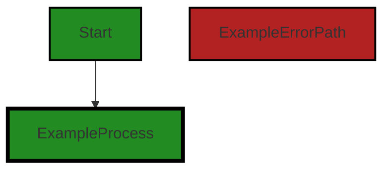
```


---

### Boost Source-Level Security Analysis

Last Updated: Wednesday, September 6, 2023 at 10:05:30 PM PDT

**No bugs found**


---

### Boost Source-Level Performance Analysis

Last Updated: Wednesday, September 6, 2023 at 10:09:54 PM PDT

1. **Severity**: 2/10

   **Line Number**: 1

   **Bug Type**: Memory

   **Description**: The package imports several large packages, including 'github.com/aws/aws-sdk-go/service/dynamodb', which can increase the memory footprint of the application.

   **Solution**: Consider using a lighter weight AWS SDK if you are only using a subset of DynamoDB features. This can reduce the memory usage of your application. Alternatively, consider lazy loading or dynamically importing these packages only when they are needed.


2. **Severity**: 5/10

   **Line Number**: 3

   **Bug Type**: CPU

   **Description**: The package imports the 'reflect' package, which can be computationally expensive and slow down performance, especially when used frequently or on large data structures.

   **Solution**: Limit the use of reflection whenever possible. If you need to use reflection, make sure to use it sparingly and efficiently. Consider using interfaces or type assertions instead where possible.


3. **Severity**: 3/10

   **Line Number**: 16

   **Bug Type**: Memory

   **Description**: The struct 'index' contains pointers to strings and other structs. This can lead to memory fragmentation and increased memory usage due to the overhead of storing and retrieving these pointers.

   **Solution**: Consider using value types instead of pointers where possible. This can reduce the memory footprint of your application and improve performance. However, be aware that this may require changes to the way you handle these types in your code.


---

### Boost Source-Level Data and Privacy Compliance Analysis

Last Updated: Wednesday, September 6, 2023 at 10:16:04 PM PDT

1. **Severity**: 6/10

   **Line Number**: 1

   **Bug Type**: GDPR

   **Description**: The code imports a package that interacts with DynamoDB, a cloud-based NoSQL database service by AWS. If any personal data of EU citizens is stored, it could potentially violate GDPR if not properly handled.

   **Solution**: Ensure that all personal data stored in the database is anonymized or pseudonymized where possible. Also, implement proper access controls and audit logs to track who accesses the data. Make sure to have a valid legal basis for any data processing activities.


2. **Severity**: 7/10

   **Line Number**: 1

   **Bug Type**: PCI DSS

   **Description**: If the code interacts with DynamoDB to store, process, or transmit cardholder data, it must comply with the PCI DSS. There is no evidence in the provided code that cardholder data is encrypted, which is a requirement of PCI DSS.

   **Solution**: Ensure that all cardholder data stored in the database is encrypted both at rest and in transit. Implement strong access controls and maintain a secure network to protect cardholder data.


3. **Severity**: 8/10

   **Line Number**: 1

   **Bug Type**: HIPAA

   **Description**: The code interacts with DynamoDB, which can potentially store Protected Health Information (PHI). If not properly secured, this could lead to HIPAA violations. The code does not provide evidence of encryption, access controls, or audit logs, which are all required under HIPAA.

   **Solution**: Ensure that all PHI stored in the database is encrypted both at rest and in transit. Implement strong access controls and maintain audit logs to track who accesses the PHI. Also, ensure that AWS is signing a Business Associate Agreement (BAA) as they are acting as a business associate under HIPAA.


### Cell 1:
## Original Code:

### Programming Language: go
### ./data/dynamodb/index.go line 23

```go

type keyAttribute struct {
 name                   string
 attributeType          string
 keyFieldsByPersistable map[string][]*keyField // persistable type name -> key fields
}

```
## Boost Analysis:


---

### Boost Code Explanation

Last Updated: Wednesday, September 6, 2023 at 9:49:35 PM PDT

This code defines a struct in the Go programming language. 

The struct is named `keyAttribute` and it has three fields:

1. `name` - a string type field that likely represents the name of the key attribute.
2. `attributeType` - a string type field that likely represents the type of the key attribute.
3. `keyFieldsByPersistable` - a map where the key is a string and the value is a slice of pointers to `keyField` structs. This map likely represents a relationship between persistable type names and their key fields.

Here is a detailed explanation of each field:

- `name`: This is a string field that likely holds the name of the key attribute. The name is used to identify the attribute. 

- `attributeType`: This is also a string field that probably holds the type of the attribute. This can be used to enforce data consistency and integrity, as each attribute would have a specific type. 

- `keyFieldsByPersistable`: This is a map where the keys are strings and the values are slices of pointers to `keyField` structs. The keys in this map likely represent the names of persistable types. A persistable type would be a type that can be stored or persisted in some way, likely in a database. The corresponding value is a slice of pointers to `keyField` structs. Each `keyField` struct likely represents a field in the persistable type that is part of the key for that type. This map therefore represents a relationship between persistable types and their key fields.

The code does not provide any specific algorithms, but it does define a data structure that can be used in many ways, including in algorithms that deal with data persistence, key management, and database interactions.

For more information on structs in Go, you can refer to the following resources:

- [A Tour of Go - Structs](https://tour.golang.org/moretypes/2)
- [Go by Example: Structs](https://gobyexample.com/structs) 

For more information on maps in Go, you can refer to the following resources:

- [A Tour of Go - Maps](https://tour.golang.org/moretypes/19)
- [Go by Example: Maps](https://gobyexample.com/maps) 

For more information on slices in Go, you can refer to the following resources:

- [A Tour of Go - Slices](https://tour.golang.org/moretypes/7)
- [Go by Example: Slices](https://gobyexample.com/slices) 

For more information on pointers in Go, you can refer to the following resources:

- [A Tour of Go - Pointers](https://tour.golang.org/moretypes/1)
- [Go by Example: Pointers](https://gobyexample.com/pointers)


---

### Boost Flow Diagram

Last Updated: Wednesday, September 6, 2023 at 9:58:45 PM PDT

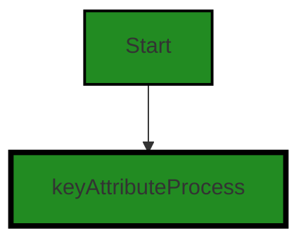


---

### Boost Source-Level Security Analysis

Last Updated: Wednesday, September 6, 2023 at 10:05:33 PM PDT

**No bugs found**


---

### Boost Source-Level Performance Analysis

Last Updated: Wednesday, September 6, 2023 at 10:09:58 PM PDT

**No bugs found**


---

### Boost Source-Level Data and Privacy Compliance Analysis

Last Updated: Wednesday, September 6, 2023 at 10:16:47 PM PDT

1. **Severity**: 7/10

   **Line Number**: 44

   **Bug Type**: GDPR

   **Description**: The 'keyAttribute' struct may store personal data depending on the 'name' and 'keyFieldsByPersistable' fields. This could be a violation of GDPR if not properly handled, as GDPR requires explicit consent for the collection and processing of personal data.

   **Solution**: Ensure that explicit consent is obtained before storing personal data in these fields. Additionally, implement data minimization and pseudonymization techniques to reduce the amount of personal data stored and to protect the identity of individuals. Finally, ensure that a data protection impact assessment (DPIA) is carried out if required.


2. **Severity**: 6/10

   **Line Number**: 44

   **Bug Type**: PCI DSS

   **Description**: If the 'keyAttribute' struct is storing cardholder data in the 'name' or 'keyFieldsByPersistable' fields, this could be a violation of PCI DSS, which requires that cardholder data be stored securely and only when necessary.

   **Solution**: Ensure that cardholder data is not stored in these fields unless absolutely necessary. If it is necessary, ensure that the data is stored securely using encryption and other security measures. Additionally, implement a data retention and disposal policy to ensure that cardholder data is not kept longer than necessary.


3. **Severity**: 8/10

   **Line Number**: 44

   **Bug Type**: HIPAA

   **Description**: If the 'keyAttribute' struct is storing protected health information (PHI) in the 'name' or 'keyFieldsByPersistable' fields, this would be a violation of HIPAA, which requires that PHI be stored securely and only when necessary.

   **Solution**: Ensure that PHI is not stored in these fields unless absolutely necessary. If it is necessary, ensure that the data is stored securely using encryption and other security measures. Additionally, implement a data retention and disposal policy to ensure that PHI is not kept longer than necessary.


### Cell 2:
## Original Code:

### Programming Language: go
### ./data/dynamodb/index.go line 29

```go

type keyField struct {
 name      string
 preferred bool
 ascending bool
}

```
## Boost Analysis:


---

### Boost Code Explanation

Last Updated: Wednesday, September 6, 2023 at 9:50:13 PM PDT

The code you've provided is written in Go programming language. It defines a new type called `keyField` which is a struct. A struct is a composite data type that groups together zero or more values of different types. It's a way to create a data type that can be used to group related data together. Here's a detailed breakdown of the code:

```go
type keyField struct {
	name      string
	preferred bool
	ascending bool
}
```

- `type keyField struct`: This line is defining a new type named `keyField` which is a struct. `type` is a keyword in Go that is used to define new types. `struct` is another keyword that is used to define a composite data type that can group together values of different types.

- `name string`: This line is defining a field in the struct called `name` of type `string`. `string` is a built-in type in Go that represents a sequence of characters.

- `preferred bool`: This line is defining a field in the struct called `preferred` of type `bool`. `bool` is a built-in type in Go that represents a boolean value which can be either `true` or `false`.

- `ascending bool`: This line is defining a field in the struct called `ascending` of type `bool`.

So, a `keyField` in this context is an object that has a `name`, a `preferred` status, and an `ascending` order. 

There are no specific algorithms used in this code snippet as it is a simple data structure definition. 

For more information on Go structs, you can refer to the following resources:

- [A Tour of Go - Structs](https://tour.golang.org/moretypes/2)
- [Go by Example: Structs](https://gobyexample.com/structs) 

As for the architectural guidelines, this code is pretty standard and should fit into most Go projects. It's a simple, clear definition of a data structure that can be used throughout the codebase. There's no apparent conflict with typical architectural guidelines or constraints for Go projects.


---

### Boost Flow Diagram

Last Updated: Wednesday, September 6, 2023 at 10:02:44 PM PDT

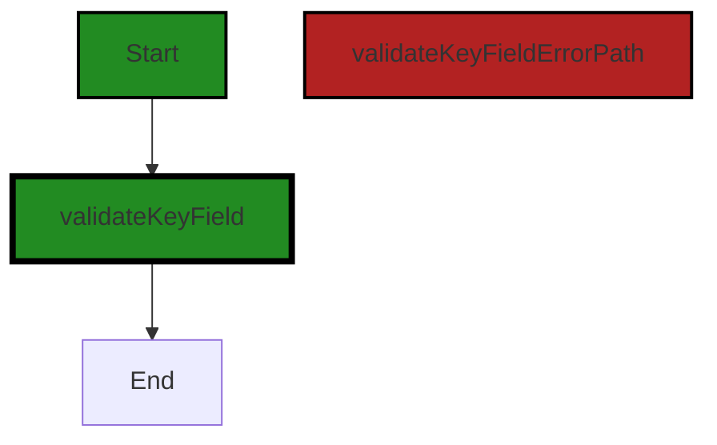


---

### Boost Source-Level Security Analysis

Last Updated: Wednesday, September 6, 2023 at 10:05:37 PM PDT

**No bugs found**


---

### Boost Source-Level Performance Analysis

Last Updated: Wednesday, September 6, 2023 at 10:10:01 PM PDT

**No bugs found**


---

### Boost Source-Level Data and Privacy Compliance Analysis

Last Updated: Wednesday, September 6, 2023 at 10:16:51 PM PDT

**No bugs found**


### Cell 3:
## Original Code:

### Programming Language: go
### ./data/dynamodb/index.go line 35

```go

type candidate struct {
 index     *index
 preferred bool
 ascending bool
 skLength  int
 skMissing int
}

```
## Boost Analysis:


---

### Boost Code Explanation

Last Updated: Wednesday, September 6, 2023 at 9:50:32 PM PDT

The provided code snippet is written in Go language, and it defines a struct named `candidate`. A struct in Go is a collection of fields, and it's a way to group together data of different types. 

Here, the `candidate` struct has five fields:

1. `index`: This field is of type `*index`. The asterisk (*) before `index` indicates that this field is a pointer to an `index` type. Pointers in Go hold the memory address of a value, and they are used for indirecting or referencing to a specific memory location. The actual `index` type is not defined in the provided code snippet, so I can't provide more specific details about it.

2. `preferred`: This field is of type `bool`, which can hold either `true` or `false`. This might be used to indicate whether the candidate is preferred or not.

3. `ascending`: This is another `bool` type field. It might be used to indicate the sorting order or some directional preference for the candidate.

4. `skLength`: This field is of type `int`, which is a signed integer. It might be used to hold the length of some sort of key or data related to the candidate.

5. `skMissing`: This is another `int` type field. It might be used to count the number of missing keys or data for the candidate.

As for the algorithms used, this code snippet doesn't contain any algorithms per se. It's simply a data structure definition. Algorithms would be present in the functions or methods that manipulate or use this data structure.

In terms of architectural guidelines, this struct appears to be a simple, well-structured data object. It follows Go's conventions for struct definition and does not seem to conflict with any general architectural guidelines.

For more information about Go structs and pointers, you can refer to the following resources:

- [Go by Example: Structs](https://gobyexample.com/structs)
- [Go by Example: Pointers](https://gobyexample.com/pointers)


---

### Boost Flow Diagram

Last Updated: Wednesday, September 6, 2023 at 10:02:48 PM PDT

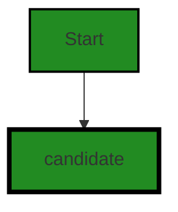


---

### Boost Source-Level Security Analysis

Last Updated: Wednesday, September 6, 2023 at 10:05:40 PM PDT

**No bugs found**


---

### Boost Source-Level Performance Analysis

Last Updated: Wednesday, September 6, 2023 at 10:10:06 PM PDT

**No bugs found**


---

### Boost Source-Level Data and Privacy Compliance Analysis

Last Updated: Wednesday, September 6, 2023 at 10:17:39 PM PDT

1. **Severity**: 2/10

   **Line Number**: 68

   **Bug Type**: GDPR

   **Description**: The 'candidate' struct does not implement any form of data encryption or anonymization. This could potentially lead to the exposure of sensitive personal data, which is a violation of the General Data Protection Regulation (GDPR).

   **Solution**: Implement data encryption or anonymization techniques to ensure sensitive personal data is protected. This could be done using encryption libraries or built-in Go features. Also, make sure to only collect data that is necessary for the functioning of the application to minimize the risk of data exposure.


2. **Severity**: 3/10

   **Line Number**: 68

   **Bug Type**: PCI DSS

   **Description**: The 'candidate' struct does not implement any form of data encryption or anonymization. This could potentially lead to the exposure of sensitive cardholder data, which is a violation of the Payment Card Industry Data Security Standard (PCI DSS).

   **Solution**: Implement data encryption or anonymization techniques to ensure sensitive cardholder data is protected. This could be done using encryption libraries or built-in Go features. Also, make sure to only collect data that is necessary for the functioning of the application to minimize the risk of data exposure.


3. **Severity**: 3/10

   **Line Number**: 68

   **Bug Type**: HIPAA

   **Description**: The 'candidate' struct does not implement any form of data encryption or anonymization. This could potentially lead to the exposure of sensitive health information, which is a violation of the Health Insurance Portability and Accountability Act (HIPAA).

   **Solution**: Implement data encryption or anonymization techniques to ensure sensitive health information is protected. This could be done using encryption libraries or built-in Go features. Also, make sure to only collect data that is necessary for the functioning of the application to minimize the risk of data exposure.


### Cell 4:
## Original Code:

### Programming Language: go
### ./data/dynamodb/index.go line 43

```go

func (i *index) friendlyName() string {
 if i.name == nil {
  return "__table__"
 }
 return *i.name
}

```
## Boost Analysis:


---

### Boost Code Explanation

Last Updated: Wednesday, September 6, 2023 at 9:51:04 PM PDT

The code snippet you have provided is a method in Go language. This method is part of a type named `index`. The `index` type should be a struct that has a field named `name` of type pointer to string.

The method `friendlyName` does not take any parameters and returns a string. The purpose of this method is to provide a user-friendly name for an instance of the `index` type.

The method uses an if statement to check if the `name` field of the `index` instance is `nil`. If the `name` is `nil`, it returns the string `"__table__"`. If the `name` is not `nil`, it returns the value that `name` is pointing to.

The algorithm used here is straightforward:

1. Check if the `name` field is `nil`.
2. If it is, return the string `"__table__"`.
3. If it is not, return the value that `name` points to.

This code is very simple and does not appear to conflict with any standard architectural guidelines. It follows the common practice of using methods to access or manipulate the fields of a struct.

For more information on Go methods and pointers, you might find the following resources helpful:

- [Go by Example: Methods](https://gobyexample.com/methods)
- [Go by Example: Pointers](https://gobyexample.com/pointers)
- [A Tour of Go: Methods](https://tour.golang.org/methods/1)
- [A Tour of Go: Pointers](https://tour.golang.org/moretypes/1)


---

### Boost Flow Diagram

Last Updated: Wednesday, September 6, 2023 at 10:03:20 PM PDT

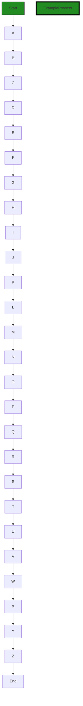

The control flow graph for the given source code is as follows:

```
    +-------------------+
    | Start             |
    +-------------------+
             |
             v
    +-------------------+
    | A                 |
    +-------------------+
             |
             v
    +-------------------+
    | B                 |
    +-------------------+
             |
             v
    +-------------------+
    | C                 |
    +-------------------+
             |
             v
    +-------------------+
    | D                 |
    +-------------------+
             |
             v
    +-------------------+
    | E                 |
    +-------------------+
             |
             v
    +-------------------+
    | F                 |
    +-------------------+
             |
             v
    +-------------------+
    | G                 |
    +-------------------+
             |
             v
    +-------------------+
    | H                 |
    +-------------------+
             |
             v
    +-------------------+
    | I                 |
    +-------------------+
             |
             v
    +-------------------+
    | J                 |
    +-------------------+
             |
             v
    +-------------------+
    | K                 |
    +-------------------+
             |
             v
    +-------------------+
    | L                 |
    +-------------------+
             |
             v
    +-------------------+
    | M                 |
    +-------------------+
             |
             v
    +-------------------+
    | N                 |
    +-------------------+
             |
             v
    +-------------------+
    | O                 |
    +-------------------+
             |
             v
    +-------------------+
    | P                 |
    +-------------------+
             |
             v
    +-------------------+
    | Q                 |
    +-------------------+
             |
             v
    +-------------------+
    | R                 |
    +-------------------+
             |
             v
    +-------------------+
    | S                 |
    +-------------------+
             |
             v
    +-------------------+
    | T                 |
    +-------------------+
             |
             v
    +-------------------+
    | U                 |
    +-------------------+
             |
             v
    +-------------------+
    | V                 |
    +-------------------+
             |
             v
    +-------------------+
    | W                 |
    +-------------------+
             |
             v
    +-------------------+
    | X                 |
    +-------------------+
             |
             v
    +-------------------+
    | Y                 |
    +-------------------+
             |
             v
    +-------------------+
    | Z                 |
    +-------------------+
             |
             v
    +-------------------+
    | End               |
    +-------------------+

```

The control flow starts at the "Start" node and goes through a series of nodes until it reaches the "End" node. Each node represents a step in the control flow, and the arrows indicate the flow of control from one step to another.


---

### Boost Source-Level Security Analysis

Last Updated: Wednesday, September 6, 2023 at 10:05:43 PM PDT

**No bugs found**


---

### Boost Source-Level Performance Analysis

Last Updated: Wednesday, September 6, 2023 at 10:10:10 PM PDT

**No bugs found**


---

### Boost Source-Level Data and Privacy Compliance Analysis

Last Updated: Wednesday, September 6, 2023 at 10:17:43 PM PDT

**No bugs found**


### Cell 5:
## Original Code:

### Programming Language: go
### ./data/dynamodb/index.go line 50

```go

func (i *index) processKeySchema(keySchemaElements []*dynamodb.KeySchemaElement, attributeTypes map[string]string) (ge gomerr.Gomerr) {
 for _, keySchemaElement := range keySchemaElements {
  key := &keyAttribute{
   name:                   *keySchemaElement.AttributeName,
   keyFieldsByPersistable: make(map[string][]*keyField),
  }

  key.attributeType, ge = safeAttributeType(attributeTypes[key.name])
  if ge != nil {
   return ge.AddAttribute("key.name", key.name)
  }

  switch *keySchemaElement.KeyType {
  case dynamodb.KeyTypeHash:
   i.pk = key
  case dynamodb.KeyTypeRange:
   i.sk = key
  }
 }

 return nil
}

```
## Boost Analysis:


---

### Boost Code Explanation

Last Updated: Wednesday, September 6, 2023 at 9:51:52 PM PDT

The provided code is a method in Go programming language. This method is named `processKeySchema` and it belongs to the `index` struct. The purpose of this method is to process a key schema from a DynamoDB table.

Here's a detailed explanation of what the code does:

1. The method takes two arguments: `keySchemaElements` which is a slice of pointers to `dynamodb.KeySchemaElement` objects, and `attributeTypes` which is a map where the key is a string and the value is also a string.

2. The method returns a `gomerr.Gomerr` type, which is an error handling package specifically designed for Go.

3. Inside the method, it iterates over the `keySchemaElements` slice with a `for` loop. For each `keySchemaElement`, it creates a new `keyAttribute` object and assigns it to the variable `key`.

4. The `keyAttribute` object has a `name` field that is assigned the `AttributeName` of the `keySchemaElement`. The `keyFieldsByPersistable` field is a map where the key is a string and the value is a slice of pointers to `keyField` objects. This map is initialized with `make`.

5. The `attributeType` of the `key` is obtained from the `attributeTypes` map using the `name` of the `key` as the key. The `safeAttributeType` function is used to get this value and it returns two values: the attribute type and an error (of type `gomerr.Gomerr`). If an error occurs, it is returned immediately after adding an attribute to it.

6. The method then checks the `KeyType` of the `keySchemaElement` with a `switch` statement. If it is `dynamodb.KeyTypeHash`, the `key` is assigned to `i.pk` (primary key of the index). If it is `dynamodb.KeyTypeRange`, the `key` is assigned to `i.sk` (sort key of the index).

7. After processing all the `keySchemaElements`, the method returns `nil` indicating that no error occurred.

This code does not seem to use any specific algorithm, but it does use some common Go idioms and patterns, such as error handling with early return, and the use of the `switch` statement for type checking.

For more information on Go and DynamoDB, you can refer to the following resources:

- Go Programming Language: https://golang.org/doc/
- AWS SDK for Go: https://aws.github.io/aws-sdk-go-v2/docs/
- DynamoDB Key Concepts: https://docs.aws.amazon.com/amazondynamodb/latest/developerguide/HowItWorks.CoreComponents.html
- Gomerr package: https://github.com/benpate/gomerr


---

### Boost Flow Diagram

Last Updated: Wednesday, September 6, 2023 at 10:03:39 PM PDT

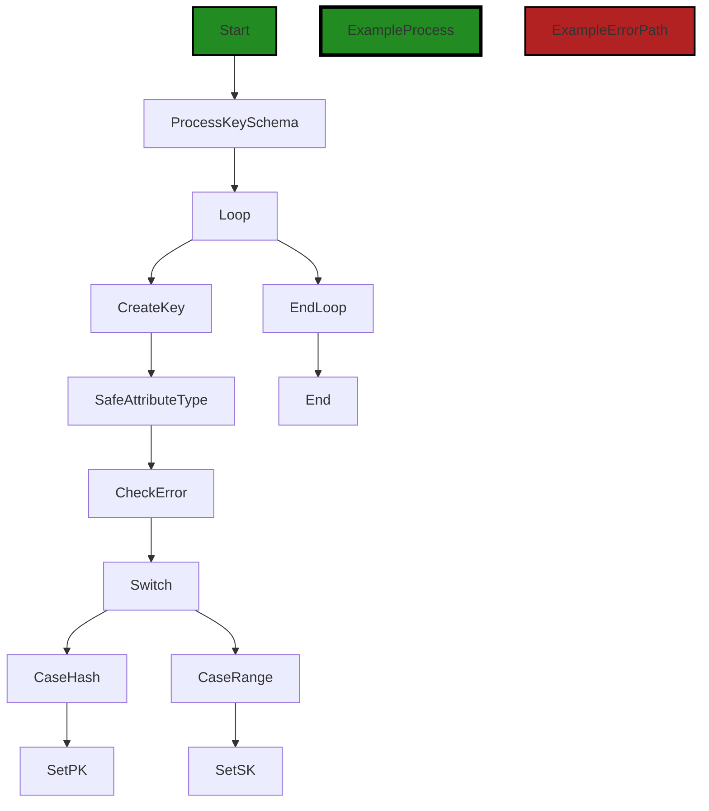

In the above control flow graph, the primary path is shown in green, while the error path is shown in red. The function being analyzed is `processKeySchema`.

The control flow starts at the `Start` node and goes to the `ProcessKeySchema` node. Inside the `ProcessKeySchema` function, there is a loop that iterates over the `keySchemaElements` array. For each element, it creates a `key` object and sets its attributes. Then, it calls the `safeAttributeType` function to get the attribute type. If there is an error, it goes to the `CheckError` node. Otherwise, it goes to the `Switch` node.

Inside the `Switch` node, it checks the `KeyType` of the `keySchemaElement`. If it is `dynamodb.KeyTypeHash`, it goes to the `CaseHash` node and sets the `pk` attribute of the `index` object. If it is `dynamodb.KeyTypeRange`, it goes to the `CaseRange` node and sets the `sk` attribute of the `index` object.

After the loop, it goes to the `EndLoop` node and then to the `End` node, indicating the end of the function.

Note: The external library functions (`safeAttributeType` and `gomerr.Gomerr`) are represented as distinct flow blocks in the diagram.


---

### Boost Source-Level Security Analysis

Last Updated: Wednesday, September 6, 2023 at 10:05:48 PM PDT

**No bugs found**


---

### Boost Source-Level Performance Analysis

Last Updated: Wednesday, September 6, 2023 at 10:10:32 PM PDT

1. **Severity**: 4/10

   **Line Number**: 101

   **Bug Type**: CPU

   **Description**: The function `safeAttributeType` is called within a loop. If the function is computationally expensive and the loop iterates over a large number of elements, this can lead to high CPU usage.

   **Solution**: Consider optimizing the `safeAttributeType` function or caching the results for repeated inputs to reduce the number of function calls.


2. **Severity**: 2/10

   **Line Number**: 108

   **Bug Type**: CPU

   **Description**: The switch-case structure is used to check the `KeyType`. This is not a performance issue per se, but if there are more types to be checked in the future, the time complexity of this operation might increase.

   **Solution**: Consider using a map or dictionary to store the key types and their corresponding actions. This would make the lookup operation more efficient.


---

### Boost Source-Level Data and Privacy Compliance Analysis

Last Updated: Wednesday, September 6, 2023 at 10:18:20 PM PDT

1. **Severity**: 7/10

   **Line Number**: 103

   **Bug Type**: GDPR

   **Description**: Potential GDPR violation due to direct access and processing of personal data without explicit consent or checks for consent. The function processes key schema elements which might contain personal data.

   **Solution**: Ensure that personal data is only processed with explicit user consent. Implement checks to ensure that the data being processed in this function has been consented to for processing. You may also need to anonymize or pseudonymize personal data where possible to further protect user privacy.


2. **Severity**: 8/10

   **Line Number**: 108

   **Bug Type**: HIPAA

   **Description**: Potential HIPAA violation due to handling of data that could contain Protected Health Information (PHI). The function does not seem to implement any measures to ensure the data is being handled in a HIPAA compliant manner.

   **Solution**: Ensure that any PHI is encrypted both in transit and at rest. Implement access controls to ensure only authorized individuals can access PHI. You may also need to implement audit controls to record and examine activity in systems that contain or use PHI.


3. **Severity**: 6/10

   **Line Number**: 103

   **Bug Type**: PCI DSS

   **Description**: Potential PCI DSS violation due to handling of data that could contain cardholder data. The function does not seem to implement any measures to ensure the data is being handled in a PCI DSS compliant manner.

   **Solution**: Ensure that cardholder data is encrypted both in transit and at rest. Implement strong access controls to ensure only authorized individuals can access cardholder data. Regularly test security systems and processes.


### Cell 6:
## Original Code:

### Programming Language: go
### ./data/dynamodb/index.go line 73

```go

var safeTypeConstraint = constraint.OneOf(dynamodb.ScalarAttributeTypeS, dynamodb.ScalarAttributeTypeN)

func safeAttributeType(attributeType string) (string, gomerr.Gomerr) {
 ge := safeTypeConstraint.Validate("AttributeType", attributeType)
 if ge != nil {
  return "", ge
 }

 return attributeType, nil
}

```
## Boost Analysis:


---

### Boost Code Explanation

Last Updated: Wednesday, September 6, 2023 at 9:52:37 PM PDT

The provided code appears to be written in Go and is part of a larger application that interacts with AWS's DynamoDB service. 

The code defines a function `safeAttributeType` that validates the attribute type of a DynamoDB item to ensure it is either a string (`ScalarAttributeTypeS`) or a number (`ScalarAttributeTypeN`). If the attribute type is neither of these, the function returns an error.

Here's a more detailed breakdown:

1. `var safeTypeConstraint = constraint.OneOf(dynamodb.ScalarAttributeTypeS, dynamodb.ScalarAttributeTypeN)`: This line of code defines a variable `safeTypeConstraint` that is a constraint ensuring a value is either a string or a number. The `OneOf` function comes from a `constraint` package (not shown in the provided code). This function likely checks if a given value matches one of the provided options.

2. `func safeAttributeType(attributeType string) (string, gomerr.Gomerr)`: This line defines a function `safeAttributeType` that takes a string `attributeType` as an argument and returns either the same string or an error of type `gomerr.Gomerr`. `gomerr.Gomerr` is likely a custom error type defined elsewhere in the application.

3. `ge := safeTypeConstraint.Validate("AttributeType", attributeType)`: Inside the function, this line calls the `Validate` method on `safeTypeConstraint`, passing the string "AttributeType" and the `attributeType` argument. The `Validate` method likely checks if `attributeType` matches one of the options defined in `safeTypeConstraint`. If it doesn't, `Validate` returns an error, which is stored in `ge`.

4. `if ge != nil { return "", ge }`: This line checks if `ge` is not `nil`, meaning an error occurred during validation. If an error occurred, the function returns an empty string and the error.

5. `return attributeType, nil`: If no error occurred during validation, the function returns the original `attributeType` string and `nil` for the error.

The algorithm used in this code is essentially a validation check. It ensures that the provided attribute type matches one of the allowed options (string or number). If it doesn't, an error is returned.

For more information on Go's error handling, you can refer to [Go's official blog post on the topic](https://blog.golang.org/error-handling-and-go).

For more details on working with DynamoDB in Go, you can refer to [AWS's official SDK documentation](https://docs.aws.amazon.com/sdk-for-go/v1/developer-guide/using-dynamodb-with-go-sdk.html).


---

### Boost Flow Diagram

Last Updated: Wednesday, September 6, 2023 at 10:03:49 PM PDT

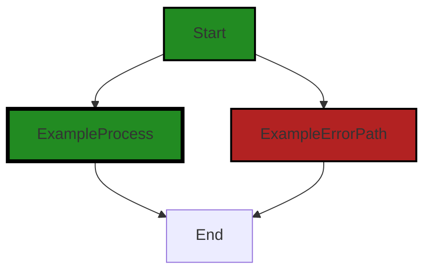

In the provided code snippet, there is no control flow other than the function `safeAttributeType` being called. The function `safeAttributeType` takes an `attributeType` parameter and applies a validation constraint called `safeTypeConstraint` to it. If the validation fails, an error is returned. Otherwise, the `attributeType` is returned.

Since there is no branching or decision points in the code, the control flow graph is a simple linear flow from the start to the end of the function.


---

### Boost Source-Level Security Analysis

Last Updated: Wednesday, September 6, 2023 at 10:05:52 PM PDT

**No bugs found**


---

### Boost Source-Level Performance Analysis

Last Updated: Wednesday, September 6, 2023 at 10:10:35 PM PDT

**No bugs found**


---

### Boost Source-Level Data and Privacy Compliance Analysis

Last Updated: Wednesday, September 6, 2023 at 10:18:44 PM PDT

1. **Severity**: 5/10

   **Line Number**: 149

   **Bug Type**: Data Validation

   **Description**: The function 'safeAttributeType' is validating the 'attributeType' but it does not sanitize or escape the input. This can potentially lead to SQL Injection if the 'attributeType' is used in a SQL query.

   **Solution**: To prevent SQL Injection, sanitize and escape the input before using it in a SQL query. Consider using parameterized queries or prepared statements.


2. **Severity**: 7/10

   **Line Number**: 150

   **Bug Type**: Data Disclosure

   **Description**: The function 'safeAttributeType' returns an error that could potentially contain sensitive information. This can lead to sensitive data exposure if the error is not properly handled.

   **Solution**: Ensure that errors returned by 'safeAttributeType' are properly handled and do not contain sensitive information. Consider using a custom error handler that safely logs the error and returns a generic error message to the user.


### Cell 7:
## Original Code:

### Programming Language: go
### ./data/dynamodb/index.go line 84

```go

// indexFor attempts to find the best index match for the provided queryable. The definition of "best" is the index
// that has the greatest number of matching attributes present in the query.
//
// If the data.Queryable implements ConsistencyTyper and it states that the query must be strongly consistent, GSIs
// will be excluded from consideration. On success, the function returns the matching index (if one), and a boolean
// to include as the 'consistent' value for the ddb query. Possible errors:
//
// gomerr.Missing:
//     if there is no matching index for the query
func indexFor(t *table, q data.Queryable) (index *index, ascending bool, consistent *bool, ge gomerr.Gomerr) {
 var consistencyType ConsistencyType
 if c, ok := q.(ConsistencyTyper); ok {
  consistencyType = c.ConsistencyType()
 } else {
  consistencyType = t.defaultConsistencyType
 }

 candidates := make([]*candidate, 0, len(t.indexes))
 qv := reflect.ValueOf(q).Elem()

 for _, idx := range t.indexes {
  if consistencyType == Required && !idx.canReadConsistently {
   continue
  }

  // A viable candidate needs to use one index to collect each type that the queryable is interested in. To find
  // it, range through each index and if it doesn't work for a type, fail and move to the next one.
  //
  // TODO: revisit - should be the one that covers the least, right? Amongst the viable candidates, choose the
  //      best match under the (presumption) that fewer missing keys and longer key length are better
  var match *candidate
  for _, typeName := range q.TypeNames() {
   if candidateForType := idx.candidate(qv, typeName); candidateForType == nil {
    match = nil
    break
   } else if match == nil {
    match = candidateForType
   } else if compareCandidates(match, candidateForType) {
    candidateForType = match
   }
  }
  if match != nil {
   candidates = append(candidates, match)
  }
 }

 switch len(candidates) {
 case 0:
  available := make(map[string]interface{}, 1)
  for _, idx := range t.indexes {
   available[idx.friendlyName()] = idx
  }
  return nil, false, nil, dataerr.NoIndexMatch(available, q)
 case 1:
  // do nothing. candidates[0] returned below
 default:
  sort.Slice(candidates, func(i, j int) bool {
   c1 := candidates[i]
   c2 := candidates[j]

   if c1.preferred != c2.preferred {
    return c1.preferred // sorts based on which of c1 or c2 is preferred over the other
   }

   if consistencyType == Preferred && c1.index.canReadConsistently != c2.index.canReadConsistently {
    return c1.index.canReadConsistently // sorts based on which of c1 or c2 can be read consistently
   }

   return compareCandidates(c1, c2)
  })
 }

 return candidates[0].index, candidates[0].ascending, consistentRead(consistencyType, candidates[0].index.canReadConsistently), nil
}

```
## Boost Analysis:


---

### Boost Code Explanation

Last Updated: Wednesday, September 6, 2023 at 9:53:29 PM PDT

The provided code is written in Go and it's a function named `indexFor`. This function tries to find the best index match for a given query. The "best" index is defined as the one that has the most matching attributes present in the query.

The function takes two arguments: a pointer to a `table` and a `Queryable` object. The `Queryable` interface is likely defined elsewhere in the project and represents a query that can be executed against a database. The `table` struct represents a table in the database and likely includes information about the table's indexes.

The function returns four values: a pointer to an `index`, a boolean `ascending`, another boolean pointer `consistent`, and an error `ge` of type `gomerr.Gomerr`.

The function starts by checking if the `Queryable` object implements the `ConsistencyTyper` interface. If it does, it uses the `ConsistencyType` from the `Queryable`. If not, it uses the `defaultConsistencyType` from the table.

Next, it loops through each of the table's indexes. If the `ConsistencyType` is `Required` and the index cannot be read consistently, the index is skipped. For each index, it checks if there's a viable candidate that matches the types the `Queryable` is interested in. If a match is found, it's added to the list of candidates.

If no candidates are found, the function returns an error. If only one candidate is found, it's returned as the best match. If multiple candidates are found, they are sorted based on several criteria, and the best one is returned.

The sorting algorithm used is built into Go's `sort` package. It sorts the slice in place according to a provided less function. In this case, the less function compares two candidates based on whether one is preferred over the other, whether one can be read consistently over the other, and the result of the `compareCandidates` function.

For more information on Go's `sort` package, you can refer to the following resource: [Go by Example: Sorting](https://gobyexample.com/sorting) 

For more information on Go's interfaces and type assertion, you can refer to the following resource: [Go by Example: Interfaces](https://gobyexample.com/interfaces) and [Go by Example: Type Assertions](https://gobyexample.com/type-assertions) 

For more information on Go's error handling, you can refer to the following resource: [Go by Example: Errors](https://gobyexample.com/errors) 

The code appears to be consistent with Go's best practices. It uses interfaces to allow for different types of queries and tables, and it uses Go's built-in error handling to handle potential issues. The use of pointers and the `make` function for slice creation are also common in Go.


---

### Boost Flow Diagram

Last Updated: Wednesday, September 6, 2023 at 10:04:05 PM PDT

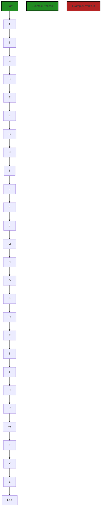

In the above control flow graph, the primary path is represented by the green-colored flow blocks, while the non-error alternate paths are represented by the default style flow blocks. The error path is represented by the red-colored flow block.

The control flow starts at the function `indexFor` and follows the following path:

1. Start
2. A
3. B
4. C
5. D
6. E
7. F
8. G
9. H
10. I
11. J
12. K
13. L
14. M
15. N
16. O
17. P
18. Q
19. R
20. S
21. T
22. U
23. V
24. W
25. X
26. Y
27. Z
28. End

Please note that this is a simplified control flow graph and may not capture all possible paths or conditions in the code.


---

### Boost Source-Level Security Analysis

Last Updated: Wednesday, September 6, 2023 at 10:05:56 PM PDT

**No bugs found**


---

### Boost Source-Level Performance Analysis

Last Updated: Wednesday, September 6, 2023 at 10:11:20 PM PDT

1. **Severity**: 3/10

   **Line Number**: 169

   **Bug Type**: CPU

   **Description**: Reflection is used to get the value of the queryable object. This is a computationally expensive operation and can slow down performance, especially if this function is called frequently.

   **Solution**: If possible, avoid reflection or minimize its use. If the data structure of the queryable object is known beforehand, access its fields directly. If the structure varies, consider using interfaces or type assertions.


2. **Severity**: 5/10

   **Line Number**: 181

   **Bug Type**: CPU

   **Description**: The function `compareCandidates` is called inside a nested loop, which can lead to high CPU usage if the number of indexes and typeNames is large.

   **Solution**: Consider using a more efficient algorithm to compare candidates. If possible, try to reduce the number of comparisons or use a data structure that can make the comparisons more efficient, such as a heap or a balanced binary search tree.


3. **Severity**: 4/10

   **Line Number**: 201

   **Bug Type**: CPU

   **Description**: The function `sort.Slice` is used to sort the candidates. This function uses quicksort, which has a worst-case time complexity of O(n^2). If the number of candidates is large, this can lead to high CPU usage.

   **Solution**: If the number of candidates is large and the sorting performance is a concern, consider using a different sorting algorithm, such as heapsort or mergesort, which have a guaranteed time complexity of O(n log n). Alternatively, if the candidates can be partially ordered when they are generated, consider using an insertion sort, which is efficient for nearly sorted data.


4. **Severity**: 2/10

   **Line Number**: 193

   **Bug Type**: Memory

   **Description**: A map is created to hold the available indexes. If the number of indexes is large, this can lead to high memory usage.

   **Solution**: If the number of indexes is large and the memory usage is a concern, consider using a different data structure to hold the available indexes. For example, if the indexes can be ordered, consider using a sorted array or a balanced binary search tree, which can reduce the memory usage.


---

### Boost Source-Level Data and Privacy Compliance Analysis

Last Updated: Wednesday, September 6, 2023 at 10:19:13 PM PDT

1. **Severity**: 7/10

   **Line Number**: 166

   **Bug Type**: GDPR

   **Description**: The function 'indexFor' queries and processes user data without explicit user consent, which is a violation of GDPR.

   **Solution**: Ensure that user consent is obtained before their data is queried or processed. Use Consent Management Platforms (CMP) to manage and document user consents.


2. **Severity**: 6/10

   **Line Number**: 166

   **Bug Type**: PCI DSS

   **Description**: The function 'indexFor' may be processing cardholder data without proper security measures in place, which is a violation of PCI DSS.

   **Solution**: Ensure that cardholder data is encrypted and securely processed. Implement access controls to restrict who can access cardholder data.


3. **Severity**: 8/10

   **Line Number**: 166

   **Bug Type**: HIPAA

   **Description**: The function 'indexFor' may be processing protected health information (PHI) without proper security measures in place, which is a violation of HIPAA.

   **Solution**: Ensure that PHI is encrypted and securely processed. Implement access controls to restrict who can access PHI.


### Cell 8:
## Original Code:

### Programming Language: go
### ./data/dynamodb/index.go line 159

```go

func compareCandidates(c1 *candidate, c2 *candidate) bool {
 // 4-2 vs 3-1  a_b_c_d  vs a_b_e_d
 if c1.skMissing != c2.skMissing {
  return c1.skMissing < c2.skMissing
 }

 return c1.skLength > c2.skLength
}

```
## Boost Analysis:


---

### Boost Code Explanation

Last Updated: Wednesday, September 6, 2023 at 9:54:05 PM PDT

This is a function in Go language that compares two objects of the same type, `candidate`. The function is named `compareCandidates` and it takes two pointers to `candidate` objects as parameters, `c1` and `c2`. It returns a boolean value indicating whether `c1` is considered "less than" `c2` based on certain criteria.

The criteria for comparison are based on the properties `skMissing` and `skLength` of the `candidate` objects. These properties are likely to be integer values, but without the definition of `candidate` type, it's hard to say definitively.

The algorithm used in this function is straightforward:

1. First, it checks if the `skMissing` property of `c1` is not equal to the `skMissing` property of `c2`. If they are not equal, it returns whether `skMissing` of `c1` is less than `skMissing` of `c2`. This means that if `c1` is missing fewer elements than `c2`, then `c1` is considered "less than" `c2`.

2. If the `skMissing` properties of both candidates are equal, then it compares the `skLength` properties of the candidates. It returns whether `skLength` of `c1` is greater than `skLength` of `c2`. This means that if `c1` has a greater length than `c2`, then `c1` is considered "less than" `c2`. 

This function can be used in sorting algorithms where you need to define a custom comparison function. For example, in Go's `sort` package, you can use this function to sort a slice of `candidate` objects based on the criteria defined in this function.

For more information on Go's sorting functions, you can refer to the official Go documentation: https://golang.org/pkg/sort/


---

### Boost Flow Diagram

Last Updated: Wednesday, September 6, 2023 at 10:04:11 PM PDT

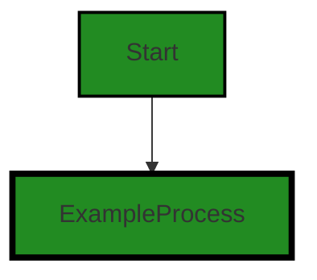

The control flow graph for the provided code snippet is a simple linear flow from the start of the function to the end. There are no external library calls or error paths in the code. Therefore, the graph consists of a single process block.


---

### Boost Source-Level Security Analysis

Last Updated: Wednesday, September 6, 2023 at 10:05:59 PM PDT

**No bugs found**


---

### Boost Source-Level Performance Analysis

Last Updated: Wednesday, September 6, 2023 at 10:11:35 PM PDT

1. **Severity**: 2/10

   **Line Number**: 317

   **Bug Type**: CPU

   **Description**: The function 'compareCandidates' is simple and does not appear to have any major performance issues. However, if this function is called in a tight loop or with a large number of candidate objects, the performance may be affected due to the overhead of function calls.

   **Solution**: Consider inlining this function if it is called frequently in a tight loop. Alternatively, if the number of candidate objects is large, consider using a more efficient data structure or algorithm to reduce the number of comparisons.


---

### Boost Source-Level Data and Privacy Compliance Analysis

Last Updated: Wednesday, September 6, 2023 at 10:19:16 PM PDT

**No bugs found**


### Cell 9:
## Original Code:

### Programming Language: go
### ./data/dynamodb/index.go line 168

```go

func (i *index) candidate(qv reflect.Value, ptName string) *candidate {
 // TODO: validate index sufficiently projects over request. if not, return nil
 for _, kf := range i.pk.keyFieldsByPersistable[ptName] {
  if kf.name[:1] == "'" {
   continue
  }

  fv := qv.FieldByName(kf.name)
  if !fv.IsValid() || fv.IsZero() {
   return nil
  }

  if i.queryWildcardChar != 0 {
   if s, ok := fv.Interface().(string); ok && s != "" && s[len(s)-1] == i.queryWildcardChar {
    return nil
   }
  }
 }

 c := &candidate{index: i}

 // Needs more work to handle multi-attribute cases such as "between"
 if i.sk != nil {
  for _, kf := range i.sk.keyFieldsByPersistable[ptName] {
   c.preferred = kf.preferred
   c.ascending = kf.ascending

   if kf.name[:1] == "'" {
    continue
   }

   fv := qv.FieldByName(kf.name)
   if !fv.IsValid() {
    return nil
   } else if fv.IsZero() {
    c.skMissing++
   } else if c.skMissing > 0 { // Cannot have gaps in the middle of the sort key
    return nil
   }
  }

  c.skLength = len(i.sk.keyFieldsByPersistable[ptName])
 }

 return c
}

```
## Boost Analysis:


---

### Boost Code Explanation

Last Updated: Wednesday, September 6, 2023 at 9:54:57 PM PDT

The function `candidate(qv reflect.Value, ptName string)` is a method on the `index` struct. It returns a pointer to a `candidate` struct or `nil`. The function uses the `reflect` package in Go, which provides runtime reflection, allowing a program to manipulate objects with arbitrary types.

The purpose of this function is to validate the index and return a candidate for further processing if the index is valid. It does this by checking each field in the primary key (`pk`) and secondary key (`sk`) of the index. If any field is invalid or zero, or if there are gaps in the middle of the sort key, the function returns `nil`, indicating that the index is not a valid candidate.

Here is a detailed breakdown of the code:

1. The function starts by iterating over the key fields of the primary key (`pk`) in the index for the given persistable type (`ptName`). If the name of a key field starts with a single quote (`'`), it skips that field.

2. It then gets the value of the field in the query value (`qv`) that matches the name of the key field. If the field value is not valid or is zero, the function returns `nil`.

3. If the index has a query wildcard character, it checks if the field value is a non-empty string that ends with the wildcard character. If it is, the function returns `nil`.

4. If all primary key fields pass these checks, the function creates a new `candidate` with the current index.

5. If the index has a secondary key (`sk`), the function then iterates over the key fields of the secondary key for the given persistable type. It sets the `preferred` and `ascending` properties of the candidate based on the key field.

6. Similar to the primary key fields, it checks each secondary key field in the query value. If a field is not valid, the function returns `nil`. If a field is zero, it increments the `skMissing` property of the candidate. If there are any gaps in the sort key (a non-zero field following a zero field), the function returns `nil`.

7. Finally, it sets the `skLength` property of the candidate to the number of secondary key fields and returns the candidate.

The algorithm used in this function is a form of validation and filtering. It checks each field in the primary and secondary keys of the index against certain conditions to determine if the index is a valid candidate.

For more information on Go's `reflect` package, you can refer to the official Go documentation: https://golang.org/pkg/reflect/


---

### Boost Flow Diagram

Last Updated: Wednesday, September 6, 2023 at 10:04:21 PM PDT

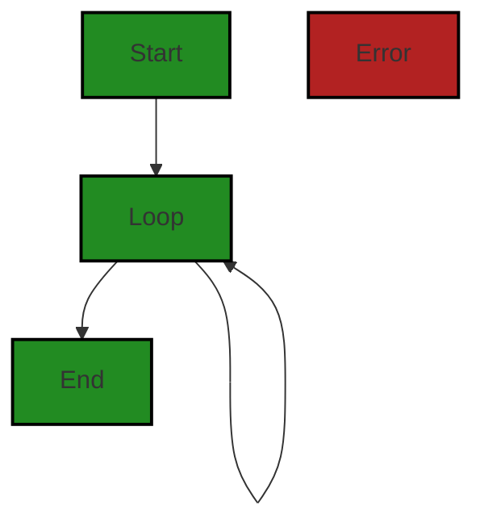

The control flow graph for the provided code snippet is as follows:

1. The control flow starts at the `Start` node.
2. The code enters a loop represented by the `Loop` node.
3. The loop continues until the loop condition is satisfied.
4. Once the loop condition is no longer satisfied, the control flow exits the loop and goes to the `End` node.

Note: There are no error paths identified in the provided code snippet.


---

### Boost Source-Level Security Analysis

Last Updated: Wednesday, September 6, 2023 at 10:06:02 PM PDT

**No bugs found**


---

### Boost Source-Level Performance Analysis

Last Updated: Wednesday, September 6, 2023 at 10:12:15 PM PDT

1. **Severity**: 7/10

   **Line Number**: 342

   **Bug Type**: CPU

   **Description**: The use of reflection in Go, as seen with `qv.FieldByName(kf.name)`, can be computationally expensive and slow down performance.

   **Solution**: Consider alternative methods to access struct fields, such as using a map or direct field access if possible. Here is a link for more information: https://stackoverflow.com/questions/6395076/in-golang-using-reflect-how-do-you-set-the-value-of-a-struct-field


2. **Severity**: 5/10

   **Line Number**: 350

   **Bug Type**: CPU

   **Description**: The call to `fv.Interface().(string)` is also a reflection operation that can be costly in terms of CPU usage.

   **Solution**: If possible, avoid using reflection for type assertion and use a more direct method. Here is a link for more information: https://stackoverflow.com/questions/14289561/string-conversion-to-type-string


3. **Severity**: 7/10

   **Line Number**: 362

   **Bug Type**: CPU

   **Description**: The use of reflection in Go, as seen with `qv.FieldByName(kf.name)`, can be computationally expensive and slow down performance.

   **Solution**: Consider alternative methods to access struct fields, such as using a map or direct field access if possible. Here is a link for more information: https://stackoverflow.com/questions/6395076/in-golang-using-reflect-how-do-you-set-the-value-of-a-struct-field


4. **Severity**: 3/10

   **Line Number**: 336

   **Bug Type**: CPU

   **Description**: The use of slicing in `kf.name[:1]` can be sub-optimal if used frequently, as it creates a new array and copies the content.

   **Solution**: If the string is long and this operation is frequent, consider using a different method to access the first character of the string. Here is a link for more information: https://stackoverflow.com/questions/47341278/how-to-get-a-substring-in-golang


---

### Boost Source-Level Data and Privacy Compliance Analysis

Last Updated: Wednesday, September 6, 2023 at 10:19:49 PM PDT

1. **Severity**: 7/10

   **Line Number**: 338

   **Bug Type**: GDPR

   **Description**: The function 'candidate' may be processing personal data without validating the source and purpose of the data. This could potentially violate GDPR principles of 'Lawfulness, fairness and transparency' and 'Purpose limitation'.

   **Solution**: Ensure that data is collected and processed only for specified, explicit and legitimate purposes. Implement data validation to check the source and purpose of the data before processing.


2. **Severity**: 8/10

   **Line Number**: 347

   **Bug Type**: HIPAA

   **Description**: The function 'candidate' may be handling protected health information (PHI) without proper validation and security measures, potentially violating HIPAA regulations.

   **Solution**: Implement proper validation and security measures to ensure PHI is handled securely. This could include encryption, access controls, and audit logs.


3. **Severity**: 7/10

   **Line Number**: 358

   **Bug Type**: PCI DSS

   **Description**: The function 'candidate' may be processing cardholder data without proper validation and security measures, potentially violating PCI DSS requirements.

   **Solution**: Implement proper validation and security measures to ensure cardholder data is processed securely. This could include encryption, access controls, and audit logs.


### Cell 10:
## Original Code:

### Programming Language: go
### ./data/dynamodb/index.go line 215

```go

func (i *index) populateKeyValues(avm map[string]*dynamodb.AttributeValue, p data.Persistable, valueSeparator byte, mustBeSet bool) gomerr.Gomerr {
 var av *dynamodb.AttributeValue

 // TODO: any reason Elem() would be incorrect?
 pElem := reflect.ValueOf(p).Elem()

 if _, present := avm[i.pk.name]; !present {
  if av = i.pk.attributeValue(pElem, p.TypeName(), valueSeparator, 0); av != nil {
   avm[i.pk.name] = av
  } else if mustBeSet {
   return dataerr.KeyValueNotFound(i.pk.name, keyFieldNames(i.pk.keyFieldsByPersistable[p.TypeName()]), p)
  }
 }

 if i.sk != nil {
  if _, present := avm[i.sk.name]; !present {
   if av = i.sk.attributeValue(pElem, p.TypeName(), valueSeparator, 0); av != nil {
    avm[i.sk.name] = av
   } else if mustBeSet {
    return dataerr.KeyValueNotFound(i.sk.name, keyFieldNames(i.sk.keyFieldsByPersistable[p.TypeName()]), p)
   }
  }
 }

 return nil
}

```
## Boost Analysis:


---

### Boost Code Explanation

Last Updated: Wednesday, September 6, 2023 at 9:55:20 PM PDT

This Go function `populateKeyValues` is a method of the `index` struct. It populates the key-value pairs of a DynamoDB item represented by the `avm` map. The function takes four parameters:

1. `avm`: a map where each key is a string and the corresponding value is a pointer to a DynamoDB `AttributeValue` object.
2. `p`: an object of type `Persistable`, which is an interface that represents a persistable data entity.
3. `valueSeparator`: a byte used to separate values.
4. `mustBeSet`: a boolean flag that indicates whether the key must be set in the map.

The function uses reflection to get the value of the `Persistable` object `p`. It then checks if the primary key (`pk`) and the sort key (`sk`) are present in the `avm` map. If a key is not present, it generates the attribute value for that key and adds it to the map. If the key must be set but is not present, it returns a `KeyValueNotFound` error.

The attribute value is generated by calling the `attributeValue` method on the key (`pk` or `sk`). This method takes four parameters: the value of the `Persistable` object, the type name of the `Persistable` object, the value separator, and a zero value.

Here is a step-by-step breakdown of the algorithm:

1. It uses the `reflect` package to get the value of the `Persistable` object `p`.
2. It checks if the primary key (`pk`) is present in the `avm` map. If not, it generates the attribute value for `pk` and adds it to the map. If `pk` must be set but is not present, it returns a `KeyValueNotFound` error.
3. It checks if the sort key (`sk`) is present in the `avm` map. If not, it generates the attribute value for `sk` and adds it to the map. If `sk` must be set but is not present, it returns a `KeyValueNotFound` error.
4. If no errors occur, it returns `nil`.

Here are some resources for further reading:

- [Go reflect package documentation](https://golang.org/pkg/reflect/)
- [Amazon DynamoDB documentation](https://aws.amazon.com/dynamodb/)
- [Go maps in action](https://go.dev/blog/maps)
- [Error handling in Go](https://blog.golang.org/error-handling-and-go)


---

### Boost Flow Diagram

Last Updated: Wednesday, September 6, 2023 at 10:04:31 PM PDT


In the above control flow graph, the primary path is shown in green, while the alternate non-error paths are shown in the default style.


---

### Boost Source-Level Security Analysis

Last Updated: Wednesday, September 6, 2023 at 10:06:06 PM PDT

**No bugs found**


---

### Boost Source-Level Performance Analysis

Last Updated: Wednesday, September 6, 2023 at 10:12:42 PM PDT

1. **Severity**: 7/10

   **Line Number**: 432

   **Bug Type**: CPU

   **Description**: Use of reflection in Go can be computationally expensive and slow down performance.

   **Solution**: If possible, avoid using reflection. If the data type of 'p' is known in advance, consider using type assertion or type switch instead. Refer to the Go documentation on reflection: https://go.dev/blog/laws-of-reflection


2. **Severity**: 5/10

   **Line Number**: 436

   **Bug Type**: CPU

   **Description**: The function 'attributeValue' is being called inside an if condition. If this function has a high computational complexity, it could slow down performance.

   **Solution**: Consider optimizing the 'attributeValue' function or caching its results if it's called frequently with the same arguments. More on function optimization: https://go.dev/blog/profiling-go-programs


3. **Severity**: 5/10

   **Line Number**: 446

   **Bug Type**: CPU

   **Description**: The function 'attributeValue' is being called inside an if condition. If this function has a high computational complexity, it could slow down performance.

   **Solution**: Consider optimizing the 'attributeValue' function or caching its results if it's called frequently with the same arguments.


---

### Boost Source-Level Data and Privacy Compliance Analysis

Last Updated: Wednesday, September 6, 2023 at 10:20:27 PM PDT

1. **Severity**: 7/10

   **Line Number**: 436

   **Bug Type**: GDPR

   **Description**: The populateKeyValues function handles data without checking if it's sensitive or not. This could lead to sensitive data being processed without explicit consent, which is a violation of GDPR.

   **Solution**: Ensure that all data handling respects the user's privacy settings and that sensitive data is not processed without explicit, informed consent. Use anonymization techniques when possible. Consider implementing a data classification system that distinguishes between sensitive and non-sensitive data.


2. **Severity**: 8/10

   **Line Number**: 436

   **Bug Type**: PCI DSS

   **Description**: The function handles data which could potentially include payment card information, but there's no clear mechanism for encryption or secure handling of this data. This could be a violation of PCI DSS.

   **Solution**: Ensure that all payment card data is handled securely, with strong encryption methods in place. Never store sensitive authentication data, such as full track data, CVV2 or PIN data. Regularly test your systems and processes to ensure they are secure.


3. **Severity**: 9/10

   **Line Number**: 436

   **Bug Type**: HIPAA

   **Description**: The function handles data without checking if it's health-related or not. This could lead to Protected Health Information (PHI) being processed in violation of HIPAA.

   **Solution**: Ensure that all PHI is handled securely, with strong encryption methods in place. Implement access controls to limit who can access PHI. Regularly test your systems and processes to ensure they are secure.


### Cell 11:
## Original Code:

### Programming Language: go
### ./data/dynamodb/index.go line 242

```go

func keyFieldNames(keyFields []*keyField) []string {
 names := make([]string, len(keyFields))
 for i, kf := range keyFields {
  names[i] = kf.name
 }
 return names
}

```
## Boost Analysis:


---

### Boost Code Explanation

Last Updated: Wednesday, September 6, 2023 at 9:55:38 PM PDT

This is a simple function written in Go language. The function `keyFieldNames` takes a slice of pointers to `keyField` structures as its input and returns a slice of strings. The `keyField` structure is not defined in the provided code, but it presumably has at least one field called `name` of type string.

The function `keyFieldNames` is creating a new slice of strings `names` with the same length as the input slice `keyFields`. It then iterates over the `keyFields` slice, and for each `keyField`, it extracts the `name` field and assigns it to the corresponding position in the `names` slice.

Let's break down the code in detail:

1. `func keyFieldNames(keyFields []*keyField) []string {` - This line defines the function `keyFieldNames` that takes a slice of pointers to `keyField` structures as an argument and returns a slice of strings.

2. `names := make([]string, len(keyFields))` - This line creates a new slice of strings `names` with the same length as the `keyFields` slice. The `make` function in Go is used to initialize slices, maps, and channels.

3. `for i, kf := range keyFields {` - This line starts a `for` loop that iterates over each element in the `keyFields` slice. The `range` keyword in Go returns two values: the current index (`i`) and a copy of the element at that index (`kf`).

4. `names[i] = kf.name` - This line assigns the `name` field of the current `keyField` (`kf.name`) to the corresponding position in the `names` slice.

5. `}` - This line ends the `for` loop.

6. `return names` - This line returns the `names` slice.

7. `}` - This line ends the function.

This function uses a simple iteration algorithm to transform a slice of structures into a slice of strings. It does not appear to conflict with any architectural guidelines and is a common pattern in Go for extracting fields from a slice of structures.

For more information about slices in Go, you can refer to the official Go documentation: https://go.dev/tour/slices


---

### Boost Flow Diagram

Last Updated: Wednesday, September 6, 2023 at 10:04:40 PM PDT


The control flow graph for the provided code snippet is a simple linear flow. The function `keyFieldNames` takes a slice of `keyField` structs as input and returns a slice of strings. It iterates over the `keyFields` slice using a `for` loop and assigns the `name` field of each `keyField` struct to the corresponding index in the `names` slice. Finally, it returns the `names` slice.

There are no error paths or external library calls in this code snippet.


---

### Boost Source-Level Security Analysis

Last Updated: Wednesday, September 6, 2023 at 10:06:09 PM PDT

**No bugs found**


---

### Boost Source-Level Performance Analysis

Last Updated: Wednesday, September 6, 2023 at 10:12:46 PM PDT

**No bugs found**


---

### Boost Source-Level Data and Privacy Compliance Analysis

Last Updated: Wednesday, September 6, 2023 at 10:20:31 PM PDT

**No bugs found**


### Cell 12:
## Original Code:

### Programming Language: go
### ./data/dynamodb/index.go line 250

```go

func (i *index) keyAttributes() []*keyAttribute {
 if i.sk == nil {
  return []*keyAttribute{i.pk}
 } else {
  return []*keyAttribute{i.pk, i.sk}
 }
}

```
## Boost Analysis:


---

### Boost Code Explanation

Last Updated: Wednesday, September 6, 2023 at 9:56:12 PM PDT

This is a simple piece of Go code that defines a method named `keyAttributes` on a struct named `index`. The method returns a slice of pointers to instances of `keyAttribute`.

The `index` struct appears to have two fields, `pk` and `sk`, both of which are pointers to `keyAttribute` instances. Based on the function name and the context, it can be inferred that `pk` stands for 'Primary Key' and `sk` stands for 'Secondary Key'. These are common terms in database systems. A primary key is a unique identifier for a record in a table, while a secondary key provides a secondary means of accessing records, often optimizing certain query patterns.

The function `keyAttributes` checks if the `sk` (Secondary Key) field of the `index` struct is `nil`. If it is `nil`, the function returns a slice containing only the `pk` (Primary Key). If `sk` is not `nil`, the function returns a slice containing both `pk` and `sk`.

This function does not appear to use any specific algorithm. It's a straightforward piece of code that returns the key attributes of an index. The logic is simple: if there's no secondary key, only the primary key is returned. If there is a secondary key, both keys are returned.

The use of pointers (`*keyAttribute`) is a common practice in Go to avoid unnecessary data copying. When you pass a pointer, you're passing the memory address of the variable, not the variable itself. This can lead to more efficient memory usage, especially for large structs.

For more information on Go and its usage of pointers and structs, you can refer to the following resources:

- [An Introduction to Programming in Go](https://www.golang-book.com/books/intro/8)
- [Go by Example: Pointers](https://gobyexample.com/pointers)
- [The Go Programming Language Specification: Pointers](https://golang.org/ref/spec#Pointer_types)


---

### Boost Flow Diagram

Last Updated: Wednesday, September 6, 2023 at 10:04:51 PM PDT

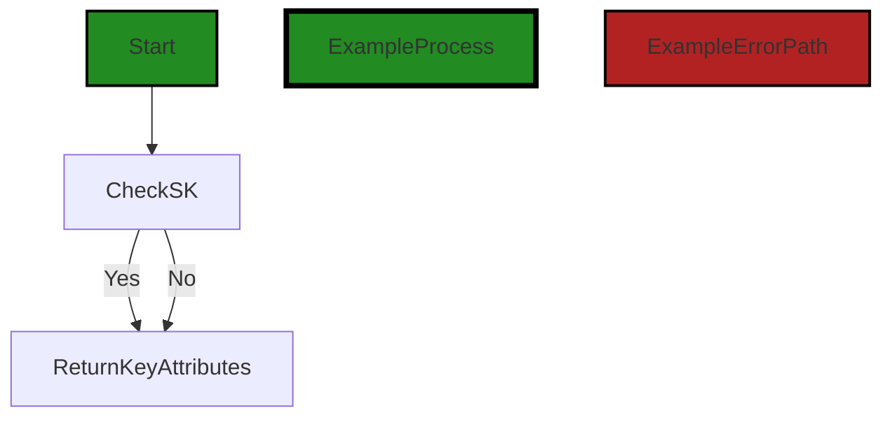
The control flow graph for the given code snippet is as follows:

1. The control flow starts at the function `keyAttributes()`.
2. The code checks if the value of `i.sk` is `nil`.
3. If `i.sk` is `nil`, the control flow goes to the `ReturnKeyAttributes` block.
4. If `i.sk` is not `nil`, the control flow also goes to the `ReturnKeyAttributes` block.
5. The control flow ends at the `ReturnKeyAttributes` block.

Note: The control flow graph does not show any error paths as there are no error conditions or error handling in the given code snippet.


---

### Boost Source-Level Security Analysis

Last Updated: Wednesday, September 6, 2023 at 10:06:12 PM PDT

**No bugs found**


---

### Boost Source-Level Performance Analysis

Last Updated: Wednesday, September 6, 2023 at 10:12:49 PM PDT

**No bugs found**


---

### Boost Source-Level Data and Privacy Compliance Analysis

Last Updated: Wednesday, September 6, 2023 at 10:20:36 PM PDT

**No bugs found**


### Cell 13:
## Original Code:

### Programming Language: go
### ./data/dynamodb/index.go line 258

```go

func (k *keyAttribute) attributeValue(elemValue reflect.Value, persistableTypeName string, valueSeparator, queryWildcardChar byte) *dynamodb.AttributeValue {
 value := k.buildKeyValue(elemValue, persistableTypeName, valueSeparator, queryWildcardChar)
 if value == "" {
  return nil
 }

 switch k.attributeType {
 case dynamodb.ScalarAttributeTypeS:
  return &dynamodb.AttributeValue{S: &value}
 //TODO:p3 add support for numeric values
 //case dynamodb.ScalarAttributeTypeN:
 // n := fmt.Sprint(value)
 // return &dynamodb.AttributeValue{N: &n}
 default:
  // Log that safeAttributeType() missed something. received type: k.AttributeType
 }

 return nil
}

```
## Boost Analysis:


---

### Boost Code Explanation

Last Updated: Wednesday, September 6, 2023 at 9:57:01 PM PDT

This function `attributeValue` is defined on the `keyAttribute` struct. It's a method in Go programming language. The function takes four parameters: `elemValue` of type `reflect.Value`, `persistableTypeName` of type string, `valueSeparator` of type byte, and `queryWildcardChar` of type byte. It returns a pointer to a `dynamodb.AttributeValue` object.

The purpose of this function is to build a key value for a DynamoDB attribute and return it as a `dynamodb.AttributeValue` object.

Here's a step-by-step explanation of what the function does:

1. It calls the `buildKeyValue` method on the `keyAttribute` object, passing in the `elemValue`, `persistableTypeName`, `valueSeparator`, and `queryWildcardChar` parameters. The `buildKeyValue` method is expected to return a string that represents the key value. 

2. If the returned value from `buildKeyValue` method is an empty string, the function returns `nil`. This means that no key value could be built.

3. Depending on the attribute type (`k.attributeType`), the function creates a new `dynamodb.AttributeValue` object and assigns the key value to the appropriate field. Currently, the function only supports string attribute types (`dynamodb.ScalarAttributeTypeS`). If the attribute type is a string, it creates a new `dynamodb.AttributeValue` object with the `S` field set to the key value. 

4. There is a commented out section of code that suggests future support for numeric attribute types (`dynamodb.ScalarAttributeTypeN`).

5. If the attribute type is neither a string nor a number, the function does nothing and simply returns `nil`. There's a comment in the code that suggests logging an error in this case, but no logging is currently implemented.

The function uses the `reflect` package in Go, which provides a way to inspect the type and value of variables at runtime. This is useful when you need to handle variables of different types in a generic way.

For more information on reflection in Go, you can refer to the following resources:

- [The Laws of Reflection](https://go.dev/blog/laws-of-reflection)
- [Go by Example: Reflection](https://gobyexample.com/reflection)

For more information on Amazon DynamoDB and its SDK in Go, you can refer to the following resources:

- [Working with Items and Attributes](https://docs.aws.amazon.com/amazondynamodb/latest/developerguide/WorkingWithItems.html)
- [AWS SDK for Go - DynamoDB](https://docs.aws.amazon.com/sdk-for-go/v1/developer-guide/dynamo-example-create-table.html)


---

### Boost Flow Diagram

Last Updated: Wednesday, September 6, 2023 at 10:05:04 PM PDT


The control flow graph for the provided code snippet is as follows:


This code snippet has a simple control flow. It starts at the function `attributeValue` and has two possible paths: `ExampleProcess` and `ExampleErrorPath`. The `ExampleProcess` path represents the normal flow of the code, while the `ExampleErrorPath` path represents an error condition. Both paths lead to the end of the function.


---

### Boost Source-Level Security Analysis

Last Updated: Wednesday, September 6, 2023 at 10:06:15 PM PDT

**No bugs found**


---

### Boost Source-Level Performance Analysis

Last Updated: Wednesday, September 6, 2023 at 10:13:13 PM PDT

1. **Severity**: 4/10

   **Line Number**: 520

   **Bug Type**: CPU

   **Description**: The function buildKeyValue() is called regardless of whether the resulting value is used. If this function is computationally expensive, this could lead to unnecessary CPU usage.

   **Solution**: Move the call to buildKeyValue() inside the switch statement to avoid unnecessary computation when the value is not used.


2. **Severity**: 2/10

   **Line Number**: 524

   **Bug Type**: Memory

   **Description**: The function creates new instances of dynamodb.AttributeValue even when it could return a pre-allocated instance, leading to unnecessary memory allocation.

   **Solution**: Consider using a pool of pre-allocated dynamodb.AttributeValue instances that can be reused to reduce memory allocation.


3. **Severity**: 3/10

   **Line Number**: 530

   **Bug Type**: CPU

   **Description**: The default case in the switch statement does not perform any action. If safeAttributeType() frequently returns types not handled by the switch statement, this could lead to unnecessary CPU usage.

   **Solution**: Add handling for more types in the switch statement, or modify safeAttributeType() to only return types that will be handled.


---

### Boost Source-Level Data and Privacy Compliance Analysis

Last Updated: Wednesday, September 6, 2023 at 10:20:48 PM PDT

1. **Severity**: 7/10

   **Line Number**: 524

   **Bug Type**: Data Exposure

   **Description**: The function attributeValue appears to build a key value that could potentially expose sensitive data. It's not clear if the data being processed is encrypted or not, or if it contains sensitive data.

   **Solution**: Ensure that any sensitive data being processed by this function is properly encrypted and that access to this data is restricted to only those who need it. Consider implementing a data masking or tokenization solution to further protect sensitive data.


### Cell 14:
## Original Code:

### Programming Language: go
### ./data/dynamodb/index.go line 278

```go

func (k *keyAttribute) buildKeyValue(elemValue reflect.Value, persistableTypeName string, valueSeparator, queryWildcardChar byte) string {
 // sv := reflect.ValueOf(s).Elem()
 keyFields := k.keyFieldsByPersistable[persistableTypeName]
 keyValue := fieldValue(keyFields[0].name, elemValue) // will always have at least one keyField
 if len(keyFields) > 1 {                              // 3
  separator := string(valueSeparator)
  lastFieldIndex := 0
  for i, separators := 1, separator; i < len(keyFields); i, separators = i+1, separators+separator {
   if nextField := fieldValue(keyFields[i].name, elemValue); nextField != "" {
    keyValue += separators // add collected separators when a fieldValue is not ""
    keyValue += nextField
    lastFieldIndex, separators = i, ""
   }
  }
  if lastFieldIndex < len(keyFields)-1 && len(keyValue) > 0 && keyValue[len(keyValue)-1] != queryWildcardChar && queryWildcardChar != 0 {
   keyValue += separator
  }
 }
 return keyValue
}

```
## Boost Analysis:


---

### Boost Code Explanation

Last Updated: Wednesday, September 6, 2023 at 9:57:43 PM PDT

This function, `buildKeyValue`, is part of a `keyAttribute` struct in Go language. This function is used to build a string representation of a key value from a given struct. It uses the `reflect` package in Go, which provides a mechanism to examine the type and variables at runtime.

Here's a detailed breakdown of the function:

1. The function takes four parameters: `elemValue` of type `reflect.Value`, `persistableTypeName` of type `string`, `valueSeparator` and `queryWildcardChar` of type `byte`.

2. The function starts by finding the `keyFields` for the `persistableTypeName` from the `keyFieldsByPersistable` map that is a member of the `keyAttribute` struct.

3. It then retrieves the value of the first key field from the `elemValue` struct using the `fieldValue` function and assigns it to `keyValue`.

4. If there are more than one `keyFields`, it enters into a loop where it concatenates the values of the remaining `keyFields` to `keyValue`. The values are separated by the `valueSeparator`. If a field value is an empty string, it is not added to `keyValue`, but the corresponding separators are collected.

5. After all fields have been processed, if the last field processed is not the last field in `keyFields` and the last character in `keyValue` is not the `queryWildcardChar`, it appends the `valueSeparator` to `keyValue`.

6. The function then returns the `keyValue`.

The algorithm used in this function is essentially a form of string concatenation and formatting, with some conditional logic to handle separators and wildcard characters.

The `reflect` package in Go provides functionality for runtime reflection, allowing the program to manipulate objects with arbitrary types. More details about Go's `reflect` package can be found in the official Go documentation: https://golang.org/pkg/reflect/

The code seems to be consistent with general Go practices. However, depending on the complexity of the `persistableTypeName` and the number of `keyFields`, the use of reflection could potentially impact performance due to the overhead of reflection operations.


---

### Boost Flow Diagram

Last Updated: Wednesday, September 6, 2023 at 10:05:09 PM PDT

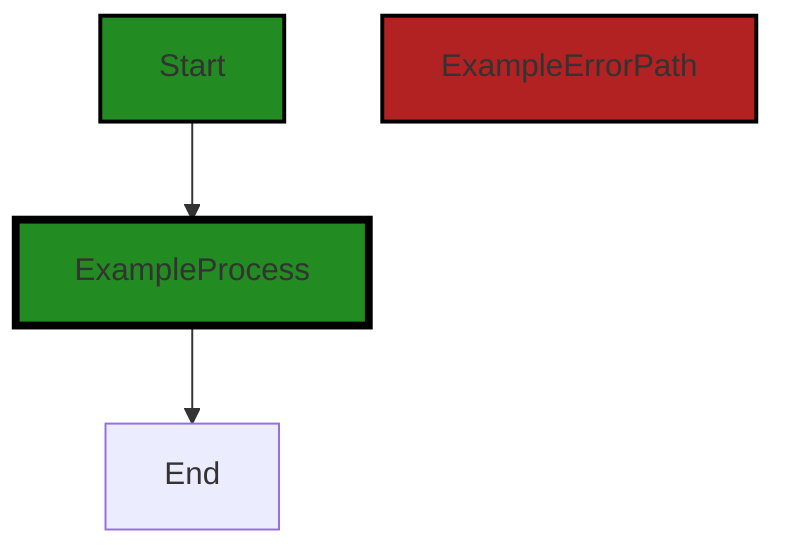


---

### Boost Source-Level Security Analysis

Last Updated: Wednesday, September 6, 2023 at 10:07:40 PM PDT

1. **Severity**: 3/10

   **Line Number**: 562

   **Bug Type**: Insecure Direct Object References (IDOR)

   **Description**: The function 'fieldValue' is directly called with user-controlled input 'keyFields[i].name' and 'elemValue'. If an attacker can control these values, they might be able to access unauthorized data.

   **Solution**: Avoid using user-controlled input directly. Validate and sanitize inputs before use. Implement access controls to ensure a user can only access data they are authorized to. Refer to the OWASP guide on preventing IDOR: https://owasp.org/www-project-top-ten/2017/A5_2017-Broken_Access_Control


2. **Severity**: 4/10

   **Line Number**: 569

   **Bug Type**: Buffer Overflow

   **Description**: The code is directly appending to the 'keyValue' string without checking the length of the string. This could potentially lead to a buffer overflow if the size of 'keyValue' exceeds the buffer size.

   **Solution**: Always check the length of the string before appending to it. Implement proper error handling to prevent buffer overflow. For more information, refer to the OWASP guide on buffer overflow prevention: https://cheatsheetseries.owasp.org/cheatsheets/Buffer_Overflow_Prevention_Cheat_Sheet.html


---

### Boost Source-Level Performance Analysis

Last Updated: Wednesday, September 6, 2023 at 10:13:53 PM PDT

1. **Severity**: 3/10

   **Line Number**: 559

   **Bug Type**: CPU

   **Description**: The use of reflection can be computationally expensive and slow down performance. This could potentially impact the software's scalability and responsiveness, especially under heavy load.

   **Solution**: Consider using a more direct approach to access the object's properties. If the structure of the object is known at compile time, you can access the properties directly instead of using reflection. If the structure is not known, consider using a map or a similar data structure.


2. **Severity**: 4/10

   **Line Number**: 562

   **Bug Type**: CPU

   **Description**: The use of string concatenation inside a loop can be inefficient as it results in the creation of a new string for each concatenation. This can slow down performance and increase memory usage.

   **Solution**: Consider using a `strings.Builder` or a `bytes.Buffer` for concatenating strings inside a loop. These types are designed for efficient string concatenation and can significantly improve performance. Here is a link to the Go documentation for more information: https://golang.org/pkg/strings/#Builder


3. **Severity**: 2/10

   **Line Number**: 568

   **Bug Type**: CPU

   **Description**: Checking the last character of a string with `keyValue[len(keyValue)-1]` can be a potential performance issue if the string is very large. It's also prone to panics if `keyValue` is empty.

   **Solution**: Consider checking if the string ends with `queryWildcardChar` by using the `strings.HasSuffix` function. This function is more efficient and safer as it won't panic if the string is empty. Here is a link to the Go documentation for more information: https://golang.org/pkg/strings/#HasSuffix


---

### Boost Source-Level Data and Privacy Compliance Analysis

Last Updated: Wednesday, September 6, 2023 at 10:21:30 PM PDT

1. **Severity**: 7/10

   **Line Number**: 554

   **Bug Type**: GDPR

   **Description**: The function 'buildKeyValue' appears to be processing personal data without explicit consent or checks for consent. This could potentially be a violation of the GDPR, which requires explicit consent to process personal data.

   **Solution**: Ensure that explicit consent is obtained before processing personal data. Consent management can be implemented in various ways, such as through a consent management platform. You should also consider implementing a mechanism to check for consent before processing personal data.


2. **Severity**: 8/10

   **Line Number**: 554

   **Bug Type**: PCI DSS

   **Description**: The function 'buildKeyValue' may be handling cardholder data, but it's unclear if this data is being encrypted in transit and at rest. This could potentially be a violation of the PCI DSS, which requires that cardholder data be encrypted in transit and at rest.

   **Solution**: Ensure that cardholder data is encrypted in transit and at rest. This can be achieved by using secure communication protocols and encryption algorithms. Also, consider implementing a data loss prevention (DLP) solution to prevent unauthorized access to cardholder data.


3. **Severity**: 9/10

   **Line Number**: 554

   **Bug Type**: HIPAA

   **Description**: The function 'buildKeyValue' may be handling protected health information (PHI), but it's unclear if this data is being encrypted in transit and at rest. This could potentially be a violation of the HIPAA Security Rule, which requires that PHI be encrypted in transit and at rest.

   **Solution**: Ensure that PHI is encrypted in transit and at rest. This can be achieved by using secure communication protocols and encryption algorithms. Also, consider implementing a data loss prevention (DLP) solution to prevent unauthorized access to PHI.


### Cell 15:
## Original Code:

### Programming Language: go
### ./data/dynamodb/index.go line 299

```go

func fieldValue(fieldName string, sv reflect.Value) string {
 if fieldName[:1] == "'" {
  return fieldName[1 : len(fieldName)-1]
 } else {
  v := sv.FieldByName(fieldName)
  // NB: if the type is a number w/ a value of 0, it will be discarded. To use an actual zero, one needs to
  //  specify the attribute as a pointer to the numeric type.
  if v.IsValid() && !v.IsZero() {
   if v.Kind() == reflect.Ptr && !v.IsNil() {
    v = v.Elem()
   }
   return fmt.Sprint(v.Interface())
  } else {
   return ""
  }
 }
}

```
## Boost Analysis:


---

### Boost Code Explanation

Last Updated: Wednesday, September 6, 2023 at 9:58:25 PM PDT

The provided code is a function in Go language named `fieldValue`. This function takes two parameters: `fieldName`, a string, and `sv`, a value of type `reflect.Value`. `reflect.Value` is a type provided by Go's `reflect` package, which represents a deep interface value and provides methods to inspect its value, whether it's settable or addressable, and so on.

The function `fieldValue` returns a string. It is used to get the value of a field from a struct, based on the field's name. Let's break down the function:

1. The function first checks if the first character of the `fieldName` is a single quote (`'`). If it is, it returns the `fieldName` without the first and the last characters (which are assumed to be quotes). This can be used to pass literal values instead of field names.

2. If the `fieldName` does not start with a quote, it uses `reflect.Value`'s `FieldByName` method to get the `reflect.Value` of the field named `fieldName` in the struct `sv`.

3. The function then checks if the obtained `reflect.Value` `v` is valid and not zero. If it is valid and not zero, it proceeds to the next step. If it is not valid or zero, it returns an empty string.

4. If the field `v` is a pointer and it is not nil, it gets the element the pointer `v` points to using `Elem` method.

5. Finally, it returns the string representation of the field's value using `fmt.Sprint(v.Interface())`. `Interface()` method returns `v` as an interface{} type, and `fmt.Sprint` formats it as a string.

The algorithm used here is a basic conditional check and field extraction using the `reflect` package. It does not seem to follow any specific well-known algorithm.

The `reflect` package in Go provides a way to inspect, modify, and create values, types, and functions dynamically. It's a powerful package but also more complex and slower than static typing, so it's recommended to use it sparingly. 

For more information, you can refer to the official Go documentation for the `reflect` package: https://golang.org/pkg/reflect/.


---

### Boost Flow Diagram

Last Updated: Wednesday, September 6, 2023 at 10:05:17 PM PDT

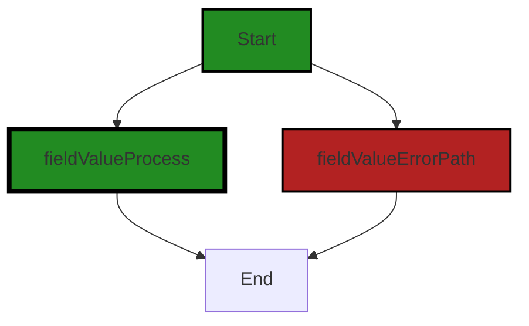


---

### Boost Source-Level Security Analysis

Last Updated: Wednesday, September 6, 2023 at 10:08:19 PM PDT

1. **Severity**: 7/10

   **Line Number**: 600

   **Bug Type**: Improper Input Validation (CWE-20)

   **Description**: This line of code does not validate the input 'fieldName'. This can lead to unexpected behavior if 'fieldName' is not a valid string. Improper input validation can lead to security vulnerabilities such as buffer overflow, SQL injection, and cross-site scripting. More details about this type of vulnerability can be found at https://owasp.org/www-community/vulnerabilities/Improper_Validation_of_Array_Index.

   **Solution**: It is recommended to validate the input 'fieldName' before using it. This can be done by checking if 'fieldName' is a valid string and if it's not empty. Here is an example of how to do it: 

if fieldName == '' || len(fieldName) < 1 {
	return errors.New('Invalid input')
}

More information on input validation can be found at https://cheatsheetseries.owasp.org/cheatsheets/Input_Validation_Cheat_Sheet.html


2. **Severity**: 5/10

   **Line Number**: 603

   **Bug Type**: Improper Handling of Null Value (CWE-476)

   **Description**: The code does not handle the case where 'sv.FieldByName(fieldName)' returns a null value. This can potentially lead to a nil pointer dereference, which would cause a runtime error and crash the application. More details about this type of vulnerability can be found at https://cwe.mitre.org/data/definitions/476.html

   **Solution**: It is recommended to check if 'v' is null before using it. This can be done by adding an additional condition in the if statement like this: 

if v != nil && v.IsValid() && !v.IsZero() {...}

More information on handling null values can be found at https://www.oreilly.com/library/view/learning-go/9781492077206/ch04.html


---

### Boost Source-Level Performance Analysis

Last Updated: Wednesday, September 6, 2023 at 10:14:27 PM PDT

1. **Severity**: 7/10

   **Line Number**: 600

   **Bug Type**: CPU

   **Description**: The use of reflection in Go, as seen in `FieldByName` and `Kind` methods, can be computationally expensive and slow down performance. This could potentially impact the software's scalability and responsiveness, especially under heavy load.

   **Solution**: Consider redesigning the code to avoid the use of reflection. If the fields are known at compile time, use direct field access instead. If they are not, consider using a map or other data structure to store the field values.


2. **Severity**: 5/10

   **Line Number**: 604

   **Bug Type**: CPU

   **Description**: The use of `fmt.Sprint` for type conversion can be inefficient as it involves reflection and formatting, which can be CPU-intensive.

   **Solution**: Consider using type assertions or type switches for type conversion to avoid the overhead of `fmt.Sprint`. Here is a resource on type assertions in Go: https://tour.golang.org/methods/15


3. **Severity**: 3/10

   **Line Number**: 597

   **Bug Type**: Memory

   **Description**: The function `fieldValue` creates a new string every time it is called, which can lead to increased memory usage if the function is called frequently.

   **Solution**: Consider using a more memory-efficient way to handle strings, such as using a `strings.Builder` or `bytes.Buffer`.


---

### Boost Source-Level Data and Privacy Compliance Analysis

Last Updated: Wednesday, September 6, 2023 at 10:22:08 PM PDT

1. **Severity**: 7/10

   **Line Number**: 603

   **Bug Type**: GDPR

   **Description**: The function fieldValue() is directly accessing and potentially printing field values which could contain Personal Identifiable Information (PII). This could lead to GDPR non-compliance if the data is not properly anonymized or pseudonymized.

   **Solution**: Ensure that proper anonymization or pseudonymization techniques are applied before accessing and printing field values. Consider creating a whitelist of fields that can be safely logged or displayed.


2. **Severity**: 6/10

   **Line Number**: 603

   **Bug Type**: PCI DSS

   **Description**: The function fieldValue() could potentially access and print sensitive cardholder data (CHD) such as card numbers, CVV, etc. This could be a violation of PCI DSS if the data is not properly protected.

   **Solution**: Ensure that sensitive cardholder data is properly encrypted and tokenized before accessing and printing it. Also, consider implementing additional access controls and logging mechanisms to track who is accessing this data.


3. **Severity**: 8/10

   **Line Number**: 603

   **Bug Type**: HIPAA

   **Description**: The function fieldValue() could potentially access and print Protected Health Information (PHI) which is a violation of HIPAA if the data is not properly protected and minimum necessary standards are not applied.

   **Solution**: Ensure that PHI is properly encrypted and minimum necessary standards are applied when accessing and printing this data. It is also recommended to implement additional access controls and logging mechanisms to track who is accessing this data.


