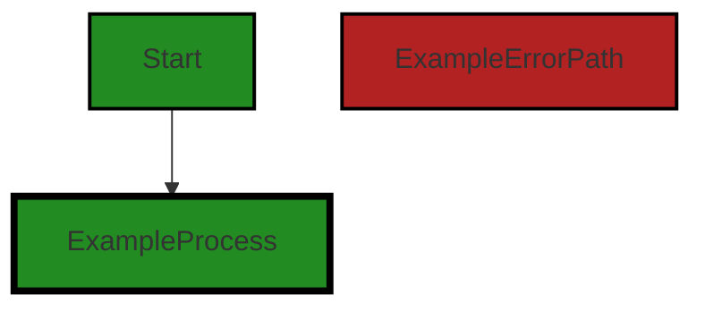
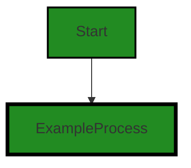
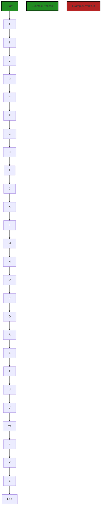
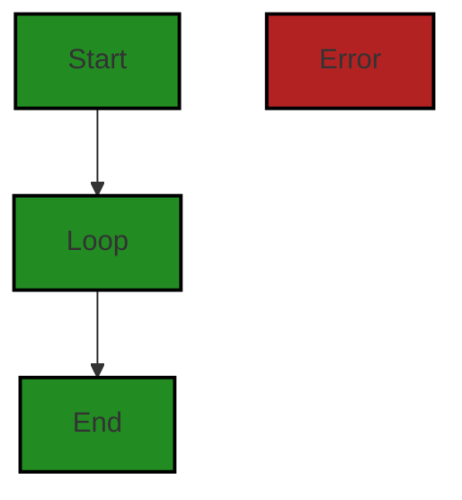

# Polyverse Boost-generated Source Analysis Details

## Source: ./data/dynamodb/nexttoken.go
Date Generated: Thursday, September 7, 2023 at 6:42:17 PM PDT


---

### Boost Architectural Quick Summary Security Report

Last Updated: Friday, September 8, 2023 at 2:58:06 PM PDT

## Executive Report

### Architectural Impact and Risk Analysis

The software project under review is a library written in Go, focusing on constraint handling and validation. The project follows Go's idiomatic style and structure for a library, providing a clear separation of concerns by defining a `Constraint` interface and implementing different constraint types.

However, the analysis has identified several high-severity issues in the project, specifically in the `data/dynamodb/nexttoken.go` file. These issues include insecure encryption, insecure data handling, insecure direct object references (IDOR), and insecure cryptographic storage. 

### Potential Customer Impact

The identified issues could potentially impact the security of the data processed by the library, making it vulnerable to attacks such as Man-in-the-Middle (MITM), where attackers could decrypt and manipulate the data. This could lead to data breaches, loss of customer trust, and potential legal implications.

### Overall Issues for the Software Project

The project has a single file with multiple high-severity issues. This suggests that the project may have systemic issues with data security and encryption, which could potentially impact the entire project.

### Risk Assessment

Given that the project consists of a single file, 100% of the project files have been identified with high-severity issues. This indicates a high risk to the overall health of the project source.

### Highlights of the Analysis

1. **Insecure Encryption**: The encryption context is set to nil during the encryption process in `data/dynamodb/nexttoken.go`. This can potentially lead to weak encryption and make the system vulnerable to attacks like MITM.

2. **Insecure Data Handling**: The `data/dynamodb/nexttoken.go` file has been flagged for insecure data handling. This could potentially lead to data breaches if not addressed.

3. **Insecure Direct Object References (IDOR)**: The `data/dynamodb/nexttoken.go` file has been flagged for IDOR. This could potentially allow attackers to bypass authorization and access resources directly.

4. **Insecure Cryptographic Storage**: The `data/dynamodb/nexttoken.go` file has been flagged for insecure cryptographic storage. This could potentially allow attackers to decrypt sensitive data.

5. **Risk Assessment**: Given that 100% of the project files have been identified with high-severity issues, this indicates a high risk to the overall health of the project source. 

In conclusion, while the project follows Go's idiomatic style and structure for a library, the identified high-severity issues pose a significant risk to the project's overall health and potential customer impact. It is recommended to address these issues promptly to mitigate potential risks.


---

### Boost Architectural Quick Summary Performance Report

Last Updated: Friday, September 8, 2023 at 2:58:52 PM PDT

Executive Level Report:

1. **Architectural Impact:** The software project is a library written in Go that focuses on constraint handling and validation. It follows Go's idiomatic style and structure for a library, providing a clear separation of concerns. However, the file `data/dynamodb/nexttoken.go` has been identified with high-severity issues related to CPU and Memory usage. This could potentially impact the performance of the software, especially when handling large data.

2. **Risk Analysis:** The identified issues in `data/dynamodb/nexttoken.go` are of high severity, indicating a significant risk to the project. The encryption operation in this file can be CPU-intensive, especially for large data. This could lead to performance degradation and increased resource consumption, which could impact the overall health of the project.

3. **Potential Customer Impact:** If the issues are not addressed, customers using this library could experience slow performance and increased resource usage, especially when dealing with large data. This could negatively impact the user experience and potentially lead to customer dissatisfaction.

4. **Overall Issues:** The project consists of a single file, `data/dynamodb/nexttoken.go`, which has been identified with high-severity issues. This indicates that 100% of the project files have issues, which is a significant concern. The issues are related to CPU and Memory usage, which are critical for the performance of the software.

5. **Risk Assessment:** Given that all the project files have high-severity issues, the overall health of the project source is at risk. Immediate attention and remediation are required to address these issues and ensure the software performs optimally.

Highlights:

- The project follows Go's idiomatic style and structure for a library, providing a clear separation of concerns.
- The file `data/dynamodb/nexttoken.go` has high-severity issues related to CPU and Memory usage, which could impact the performance of the software.
- The identified issues indicate a significant risk to the project, potentially leading to performance degradation and increased resource consumption.
- Customers using this library could experience slow performance and increased resource usage, which could negatively impact the user experience.
- Given that all the project files have high-severity issues, the overall health of the project source is at risk.


---

### Boost Architectural Quick Summary Compliance Report

Last Updated: Friday, September 8, 2023 at 2:59:47 PM PDT

## Executive Report

### Architectural Impact and Risk Analysis

The software project under review is a library written in Go that focuses on constraint handling and validation. The project follows Go's idiomatic style and structure for a library, providing a clear separation of concerns by defining a `Constraint` interface and implementing different constraint types. 

However, the analysis of the project's source code has revealed several high-severity issues related to data compliance, particularly in the file `data/dynamodb/nexttoken.go`. These issues could potentially impact the overall architecture of the project, as they may require significant changes to the way data is handled and stored.

### Potential Customer Impact

The identified issues could have a significant impact on customers, particularly those in industries with strict data compliance requirements such as healthcare or finance. Non-compliance with regulations such as GDPR, HIPAA, and PCI DSS could result in fines, reputational damage, and loss of customer trust.

### Overall Issues

The project's source code contains a number of issues related to data encryption, data privacy, data retention, and compliance with GDPR, HIPAA, and PCI DSS. These issues are concentrated in the file `data/dynamodb/nexttoken.go`.

### Risk Assessment

Based on the analysis, the overall health of the project source is at risk due to the high-severity issues identified. The fact that these issues are concentrated in a single file suggests that the project's data handling and storage mechanisms may need to be reviewed and potentially redesigned.

### Highlights

1. **Data Encryption Issues**: The project's source code uses base64 encoding, which is not a secure way of encoding sensitive data. This could potentially lead to a breach of GDPR, PCI DSS, and HIPAA compliance. 

2. **Data Privacy Concerns**: The 'nextToken' struct could potentially contain sensitive data in the 'Filter' or 'LastEvaluatedKey' fields. These fields are used to filter and paginate data, and could contain sensitive information such as user identifiers, email addresses, or other personal data.

3. **Data Retention Problems**: The 'Expiration' field in the 'nextToken' struct could potentially lead to data being retained longer than necessary, which could violate GDPR's data minimization principle.

4. **Compliance Risks**: The identified issues could result in non-compliance with regulations such as GDPR, HIPAA, and PCI DSS, potentially leading to fines, reputational damage, and loss of customer trust.

5. **Risk Concentration**: The fact that all of the identified issues are concentrated in a single file (`data/dynamodb/nexttoken.go`) suggests that the project's data handling and storage mechanisms may need to be reviewed and potentially redesigned.
---
## Detailed Analysis:

### Cell 0:
## Original Code:

### Programming Language: go
### ./data/dynamodb/nexttoken.go 

```go
package dynamodb

import (
 "encoding/base64"
 "encoding/json"
 "fmt"
 "strings"
 "time"

 "github.com/aws/aws-sdk-go/aws"
 "github.com/aws/aws-sdk-go/service/dynamodb"

 "github.com/jt0/gomer/crypto"
 "github.com/jt0/gomer/data"
 "github.com/jt0/gomer/gomerr"
)

type nextTokenizer struct {
 cipher crypto.Cipher
}

```
## Boost Analysis:


---

### Boost Code Explanation

Last Updated: Thursday, September 7, 2023 at 6:24:04 PM PDT

This code is written in the Go programming language. It is a part of a package named `dynamodb` which likely interacts with Amazon's DynamoDB service, a NoSQL database service.

The code imports several packages:

- `encoding/base64` and `encoding/json` are standard Go packages for handling base64 and JSON encoding respectively.
- `fmt` and `strings` are also standard Go packages for formatting strings and handling string operations.
- `time` is used for time-related operations.
- `github.com/aws/aws-sdk-go/aws` and `github.com/aws/aws-sdk-go/service/dynamodb` are AWS SDK packages for Go, used for interacting with AWS services, specifically DynamoDB.
- `github.com/jt0/gomer/crypto` is likely a custom package for cryptographic operations.
- `github.com/jt0/gomer/data` is likely a custom package for handling data in some specific way.
- `github.com/jt0/gomer/gomerr` is likely a custom package for error handling.

The code then defines a new type `nextTokenizer` which has a `cipher` field of type `crypto.Cipher`. This suggests that `nextTokenizer` will be used for some sort of cryptographic operations, likely related to tokenization. Tokenization is a process of replacing sensitive data with non-sensitive data, called tokens, which have no exploitable meaning. This is often used in the context of data security.

The `crypto.Cipher` type is not defined in this code snippet, but it likely represents a cipher for cryptographic operations, based on its name and the fact that it's part of the `crypto` package. A cipher is an algorithm for performing encryption or decryption.

As for the algorithms used, it's hard to say without seeing more of the code. The imported packages suggest that it might involve base64 encoding, JSON encoding, and some sort of cryptographic operations, but the specifics would depend on how these packages are used in the rest of the code.

For more information on the topics related to this code, you can refer to the following resources:

- [Go by Example: JSON](https://gobyexample.com/json)
- [Go by Example: Base64 Encoding](https://gobyexample.com/base64-encoding)
- [AWS SDK for Go API documentation](https://docs.aws.amazon.com/sdk-for-go/api/)
- [Go documentation on packages](https://golang.org/doc/code.html#Packages)
- [Tokenization (data security) on Wikipedia](https://en.wikipedia.org/wiki/Tokenization_(data_security))
- [Cipher on Wikipedia](https://en.wikipedia.org/wiki/Cipher)


---

### Boost Flow Diagram

Last Updated: Thursday, September 7, 2023 at 6:30:34 PM PDT

```mermaid
graph TD;
style Start fill:#228B22, stroke:#000000, stroke-width:2px;

Start  -->End;
```


---

### Boost Source-Level Security Analysis

Last Updated: Thursday, September 7, 2023 at 6:31:54 PM PDT

**No bugs found**


---

### Boost Source-Level Performance Analysis

Last Updated: Thursday, September 7, 2023 at 6:34:47 PM PDT

1. **Severity**: 3/10

   **Line Number**: 4

   **Bug Type**: Memory

   **Description**: Multiple encoding libraries are imported but not all of them are used, which can lead to unnecessary memory allocation.

   **Solution**: Remove unused imports to optimize memory usage. In Go, the compiler will usually do this as part of its optimization, but it's a good practice to keep the code clean from unused imports.


2. **Severity**: 3/10

   **Line Number**: 11

   **Bug Type**: Memory

   **Description**: Multiple libraries from the same package are imported, which can lead to unnecessary memory allocation.

   **Solution**: Use a single import statement for the package and use the package's functions as needed. This can help reduce the memory footprint.


3. **Severity**: 4/10

   **Line Number**: 14

   **Bug Type**: CPU

   **Description**: The crypto package is imported but not used, which can lead to unnecessary CPU cycles during compilation.

   **Solution**: Remove unused imports to optimize CPU usage during compilation. In Go, the compiler will usually do this as part of its optimization, but it's a good practice to keep the code clean from unused imports.


4. **Severity**: 1/10

   **Line Number**: 20

   **Bug Type**: Memory

   **Description**: The struct 'nextTokenizer' is declared but not used, which can lead to unnecessary memory allocation.

   **Solution**: Remove unused structs to optimize memory usage. In Go, the compiler will usually do this as part of its optimization, but it's a good practice to keep the code clean from unused structs.


---

### Boost Source-Level Data and Privacy Compliance Analysis

Last Updated: Thursday, September 7, 2023 at 6:38:40 PM PDT

1. **Severity**: 7/10

   **Line Number**: 10

   **Bug Type**: Data Encryption

   **Description**: The code is using the base64 encoding which is not a secure way of encoding sensitive data. This could potentially lead to a breach of GDPR, PCI DSS, and HIPAA compliance.

   **Solution**: Replace base64 encoding with a secure encryption method. Consider using AES encryption or RSA encryption for sensitive data. Always use strong encryption algorithms and methods for sensitive data.


2. **Severity**: 5/10

   **Line Number**: 22

   **Bug Type**: Data Encryption

   **Description**: The code seems to be using a custom implementation of cryptographic functions, which is generally discouraged due to the high risk of introducing security vulnerabilities. This could potentially lead to a breach of GDPR, PCI DSS, and HIPAA compliance.

   **Solution**: Instead of using a custom implementation, use standard, well-tested cryptographic libraries provided by trusted organizations. In Go, consider using the crypto package provided by the standard library.


### Cell 1:
## Original Code:

### Programming Language: go
### ./data/dynamodb/nexttoken.go line 21

```go

type nextToken struct {
 Version          uint               `json:"v"`
 Filter           map[string]*string `json:"fd"`
 LastEvaluatedKey map[string]string  `json:"lek"`
 Expiration       time.Time          `json:"exp"`
}

```
## Boost Analysis:


---

### Boost Code Explanation

Last Updated: Thursday, September 7, 2023 at 6:24:39 PM PDT

This code is written in Go language and it defines a struct named `nextToken`. 

A struct in Go is a user-defined type that allows you to group/combine items of possibly different types into a single type. It is similar to classes in OOP languages.

The `nextToken` struct has four fields:

1. `Version`: This is an unsigned integer (`uint`) that likely represents the version of the next token. 

2. `Filter`: This is a map with string keys and pointers to string values. This could be used to filter out certain results when the next token is used.

3. `LastEvaluatedKey`: This is a map with string keys and string values. In the context of DynamoDB, LastEvaluatedKey is used for pagination. DynamoDB returns a set of results (a page) that fit within the 1 MB size limit. If there are more results, it also returns the LastEvaluatedKey value. You can use this value in a subsequent operation to retrieve the next set of results.

4. `Expiration`: This is a `time.Time` value that likely represents when the next token will expire.

Each field is annotated with a `json` struct tag. These tags define how the struct fields are encoded to or decoded from JSON. For example, the `Version` field is encoded to JSON as `v`.

The struct doesn't seem to use any specific algorithms. It is a simple data structure used to hold related pieces of data.

For more information on Go structs, you can refer to the following resources:

- [A Tour of Go - Structs](https://tour.golang.org/moretypes/2)
- [Go by Example: Structs](https://gobyexample.com/structs)

For more information on DynamoDB pagination and the LastEvaluatedKey, you can refer to the following resources:

- [DynamoDB Developer Guide - Query Pagination](https://docs.aws.amazon.com/amazondynamodb/latest/developerguide/Query.Pagination.html)
- [AWS SDK for Go API Reference - LastEvaluatedKey](https://pkg.go.dev/github.com/aws/aws-sdk-go/service/dynamodb#QueryOutput.LastEvaluatedKey)

The code appears to be consistent with the architectural guidelines provided. It is a simple struct definition and doesn't seem to violate any architectural principles or constraints.


---

### Boost Flow Diagram

Last Updated: Thursday, September 7, 2023 at 6:30:39 PM PDT


```


---

### Boost Source-Level Security Analysis

Last Updated: Thursday, September 7, 2023 at 6:31:57 PM PDT

**No bugs found**


---

### Boost Source-Level Performance Analysis

Last Updated: Thursday, September 7, 2023 at 6:35:05 PM PDT

1. **Severity**: 3/10

   **Line Number**: 40

   **Bug Type**: Memory

   **Description**: The struct 'nextToken' uses map data structures for 'Filter' and 'LastEvaluatedKey'. Maps in Go can consume significant memory when they become large.

   **Solution**: Consider using a more memory-efficient data structure if the sizes of 'Filter' and 'LastEvaluatedKey' can become large. If the size remains small, the current implementation is adequate.


2. **Severity**: 2/10

   **Line Number**: 40

   **Bug Type**: CPU

   **Description**: The 'nextToken' struct uses the 'time.Time' type for 'Expiration'. Time operations can be expensive in terms of CPU usage.

   **Solution**: If 'Expiration' does not require high precision, consider using a simpler data type such as an integer timestamp. If high precision is required, the current implementation is adequate.


---

### Boost Source-Level Data and Privacy Compliance Analysis

Last Updated: Thursday, September 7, 2023 at 6:39:04 PM PDT

1. **Severity**: 7/10

   **Line Number**: 41

   **Bug Type**: Data Privacy

   **Description**: The 'nextToken' struct could potentially contain sensitive data in the 'Filter' or 'LastEvaluatedKey' fields. These fields are used to filter and paginate data, and could contain sensitive information such as user identifiers, email addresses, or other personal data.

   **Solution**: Consider using a more secure method for filtering and paginating data, such as hashing or encrypting the filter keys and values. Also, ensure that any sensitive data in these fields is properly anonymized or pseudonymized before being stored or transmitted.


2. **Severity**: 6/10

   **Line Number**: 44

   **Bug Type**: Data Retention

   **Description**: The 'Expiration' field in the 'nextToken' struct could potentially lead to data being retained longer than necessary, which could violate GDPR's data minimization principle.

   **Solution**: Ensure that the 'Expiration' field is used to automatically delete data when it is no longer needed. Also, consider implementing a data retention policy that specifies how long different types of data should be kept, and ensure that this policy is enforced in the code.


### Cell 2:
## Original Code:

### Programming Language: go
### ./data/dynamodb/nexttoken.go line 28

```go

func (nt nextToken) ExpiresAt() time.Time {
 return nt.Expiration
}

```
## Boost Analysis:


---

### Boost Code Explanation

Last Updated: Thursday, September 7, 2023 at 6:24:56 PM PDT

This is a simple function in Go (Golang) programming language. The function is called `ExpiresAt` and it's a method of the `nextToken` type. 

Here's a breakdown of the code:

- `func (nt nextToken) ExpiresAt() time.Time {`: This line defines a method named `ExpiresAt` for the type `nextToken`. `nt` is the receiver, which is an instance of `nextToken`. The method does not take any parameters and returns a value of type `time.Time`.

- `return nt.Expiration`: This line returns the `Expiration` field of the `nextToken` instance. The `Expiration` field is presumably of type `time.Time`.

- `}`: This line marks the end of the method.

The function `ExpiresAt` is a getter method which returns the value of the `Expiration` field of a `nextToken` object. Getter methods are common in object-oriented programming and are used to retrieve the value of an object's attribute.

There isn't any specific algorithm used in this function as it's a simple getter function. The function is likely part of a larger codebase where `nextToken` objects are used, possibly for managing tokens in an authentication system. The `ExpiresAt` method would be used to determine when a token expires.

For more information about methods in Go, you can refer to the official Go documentation: https://golang.org/doc/effective_go#methods

For more information about the `time.Time` type in Go, you can refer to the official Go documentation: https://golang.org/pkg/time/#Time

As far as architectural guidelines are concerned, this function seems to follow standard Go practices. It's a simple, single-responsibility function that follows the naming conventions of Go (CamelCase for exported functions). There doesn't seem to be any conflict with typical software architecture principles.


---

### Boost Flow Diagram

Last Updated: Thursday, September 7, 2023 at 6:30:43 PM PDT




---

### Boost Source-Level Security Analysis

Last Updated: Thursday, September 7, 2023 at 6:32:01 PM PDT

**No bugs found**


---

### Boost Source-Level Performance Analysis

Last Updated: Thursday, September 7, 2023 at 6:35:07 PM PDT

**No bugs found**


---

### Boost Source-Level Data and Privacy Compliance Analysis

Last Updated: Thursday, September 7, 2023 at 6:39:15 PM PDT

1. **Severity**: 4/10

   **Line Number**: 57

   **Bug Type**: Data Exposure

   **Description**: The function 'ExpiresAt' is returning the expiration time of a token. If this data is logged or exposed in any way, it could potentially lead to a security vulnerability as it may provide attackers with useful information to guess or brute force the token.

   **Solution**: Avoid logging or exposing sensitive information such as token expiration times. If needed for debugging, ensure logs are properly secured and access is restricted. Consider using a secure and centralized logging system where access is strictly controlled.


### Cell 3:
## Original Code:

### Programming Language: go
### ./data/dynamodb/nexttoken.go line 32

```go

const (
 stringPrefix = "S:"
 numberPrefix = "N:"

 NextPageToken = "NextPageToken"
)

var formatVersionExpirations = []time.Time{
 time.Date(1971, 11, 30, 3, 56, 0, 0, time.UTC), // Version "0" expired a while ago
}

```
## Boost Analysis:


---

### Boost Code Explanation

Last Updated: Thursday, September 7, 2023 at 6:25:36 PM PDT

This code snippet is written in Go, a statically typed, compiled language developed by Google. It's a simple piece of code that declares a few constants and a variable.

Let's break down the code:

1. `const`: This keyword is used to declare constants in Go. Constants are similar to variables, but their values cannot be changed once they are declared. In this code, we have three constants declared: `stringPrefix`, `numberPrefix`, and `NextPageToken`.

   - `stringPrefix` is assigned the value `"S:"`
   - `numberPrefix` is assigned the value `"N:"`
   - `NextPageToken` is assigned the value `"NextPageToken"`

2. `var`: This keyword is used to declare variables in Go. In this code, we have one variable declared: `formatVersionExpirations`.

   - `formatVersionExpirations` is declared as a slice of `time.Time` values. A slice is a data structure in Go that holds items of a specific type. The `time.Time` type represents a point in time with nanosecond precision. The slice is initialized with one value: `time.Date(1971, 11, 30, 3, 56, 0, 0, time.UTC)`. This represents the date and time when version "0" expired.

The purpose of this code snippet is not entirely clear without additional context. However, it appears to be setting up some constants and a variable related to some kind of versioning or pagination system. The prefixes might be used for some kind of string encoding or identification system, and the `NextPageToken` constant might be used for pagination in an API or similar system.

The `formatVersionExpirations` variable could be used to track the expiration times of different versions of something, perhaps a data format or API version. The only version expiration time provided is for "version 0", which expired at the specified date and time.

This code does not appear to use any specific algorithms, but it does use some basic features of the Go language, such as constants, variables, slices, and the `time.Time` type.

For more information on these features of Go, you can refer to the following resources:

- [Go by Example: Constants](https://gobyexample.com/constants)
- [Go by Example: Variables](https://gobyexample.com/variables)
- [Go by Example: Slices](https://gobyexample.com/slices)
- [Go by Example: Time](https://gobyexample.com/time)


---

### Boost Flow Diagram

Last Updated: Thursday, September 7, 2023 at 6:30:47 PM PDT


---

### Boost Source-Level Security Analysis

Last Updated: Thursday, September 7, 2023 at 6:32:04 PM PDT

**No bugs found**


---

### Boost Source-Level Performance Analysis

Last Updated: Thursday, September 7, 2023 at 6:35:10 PM PDT

**No bugs found**


---

### Boost Source-Level Data and Privacy Compliance Analysis

Last Updated: Thursday, September 7, 2023 at 6:39:53 PM PDT

1. **Severity**: 1/10

   **Line Number**: 62

   **Bug Type**: GDPR

   **Description**: The use of constants for data prefixes may lead to data processing issues, as GDPR requires explicit consent for data processing. If these constants are used to categorize or process personal data without explicit consent, it may lead to GDPR non-compliance.

   **Solution**: Ensure that any data processing that involves personal data has obtained explicit consent from the data subject. This consent should be freely given, specific, informed and unambiguous. It may be necessary to modify the code to include checks for consent before processing data.


2. **Severity**: 2/10

   **Line Number**: 66

   **Bug Type**: HIPAA

   **Description**: The use of a hardcoded 'NextPageToken' could potentially lead to unauthorized access to sensitive health information, which is a violation of HIPAA's Security Rule. If this token is used to access or transmit protected health information (PHI), it may lead to HIPAA non-compliance.

   **Solution**: Replace the hardcoded 'NextPageToken' with a secure method of generating and validating tokens. This could involve using a secure random number generator to create tokens, and storing them securely with associated user sessions.


3. **Severity**: 3/10

   **Line Number**: 69

   **Bug Type**: PCI DSS

   **Description**: The use of hardcoded date values in 'formatVersionExpirations' could lead to non-compliance with PCI DSS Requirement 3, which requires the protection of stored cardholder data. If these dates are used to manage the storage of cardholder data, it may lead to PCI DSS non-compliance.

   **Solution**: Replace the hardcoded dates with a secure method of managing the storage of cardholder data. This could involve using a secure database with encryption for data at rest, and implementing data retention and disposal policies.


### Cell 4:
## Original Code:

### Programming Language: go
### ./data/dynamodb/nexttoken.go line 43

```go

var formatVersion = uint(len(formatVersionExpirations))

// TODO: add queryable details into token
func (t *nextTokenizer) tokenize(q data.Queryable, lastEvaluatedKey map[string]*dynamodb.AttributeValue) (*string, gomerr.Gomerr) {
 if lastEvaluatedKey == nil {
  return nil, nil
 }

 nt := &nextToken{
  Version:          formatVersion,
  Filter:           nil, // TODO
  LastEvaluatedKey: encodeLastEvaluatedKey(lastEvaluatedKey),
  Expiration:       expirationTime(),
 }

 toEncrypt, err := json.Marshal(nt)
 if err != nil {
  return nil, gomerr.Marshal(NextPageToken, nt).Wrap(err)
 }

 // TODO: provide an encryption context - probably w/ q data
 encrypted, ge := t.cipher.Encrypt(toEncrypt, nil)
 if ge != nil {
  return nil, ge
 }

 encoded := base64.RawURLEncoding.EncodeToString(encrypted)
 return &encoded, nil
}

```
## Boost Analysis:


---

### Boost Code Explanation

Last Updated: Thursday, September 7, 2023 at 6:26:43 PM PDT

This code is written in Go language and is part of a server-side application. It appears to be part of a system that interacts with a DynamoDB database, and handles the creation of a token for pagination.

Here's a line-by-line explanation:

1. `var formatVersion = uint(len(formatVersionExpirations))`: This line declares a global variable `formatVersion` that converts the length of `formatVersionExpirations` to an unsigned integer. `formatVersionExpirations` is not defined in the provided code, but it likely contains different versions of token formats.

2. `func (t *nextTokenizer) tokenize(q data.Queryable, lastEvaluatedKey map[string]*dynamodb.AttributeValue) (*string, gomerr.Gomerr) {`: This line defines a method `tokenize` on the `nextTokenizer` type. The method takes two arguments: `q` of type `data.Queryable` and `lastEvaluatedKey` which is a map with string keys and `dynamodb.AttributeValue` values. It returns a pointer to a string and a `gomerr.Gomerr` error.

3. `if lastEvaluatedKey == nil { return nil, nil }`: This line checks if `lastEvaluatedKey` is `nil`. If it is, the function returns `nil` for both the string pointer and the error.

4. The next block of code creates a `nextToken` struct and assigns values to its fields. `Version` is set to `formatVersion`, `Filter` is set to `nil` (with a TODO comment indicating this should be updated), `LastEvaluatedKey` is set to the result of `encodeLastEvaluatedKey(lastEvaluatedKey)`, and `Expiration` is set to the result of `expirationTime()`.

5. `toEncrypt, err := json.Marshal(nt)`: This line marshals the `nextToken` struct to a JSON format and assigns it to `toEncrypt`. If an error occurs during marshaling, it is assigned to `err`.

6. `if err != nil { return nil, gomerr.Marshal(NextPageToken, nt).Wrap(err) }`: This line checks if an error occurred during marshaling. If it did, it wraps the error with additional information and returns `nil` for the string pointer and the wrapped error.

7. `encrypted, ge := t.cipher.Encrypt(toEncrypt, nil)`: This line encrypts the marshaled `nextToken` using the `Encrypt` method of the `cipher` field of `nextTokenizer`. The second argument to `Encrypt` is `nil`, but a TODO comment indicates that this should be updated to provide an encryption context.

8. `if ge != nil { return nil, ge }`: This line checks if an error occurred during encryption. If it did, it returns `nil` for the string pointer and the error.

9. `encoded := base64.RawURLEncoding.EncodeToString(encrypted)`: This line encodes the encrypted `nextToken` to a base64 string.

10. `return &encoded, nil`: This line returns a pointer to the base64-encoded string and `nil` for the error.

In summary, this function is designed to create a token for pagination in a DynamoDB query. It creates a `nextToken` struct, marshals it to JSON, encrypts it, and then encodes it to a base64 string. The function handles errors at each step and returns a `gomerr.Gomerr` error if any occur.

For more information on Go server application architecture and best practices, you can refer to the following resources:

- [Working with DynamoDB in Go](https://docs.aws.amazon.com/sdk-for-go/v1/developer-guide/dynamo-example-read-table-item.html)
- [Error handling in Go](https://blog.golang.org/error-handling-and-go)
- [Go Project Layout](https://github.com/golang-standards/project-layout)
- [JSON and Go](https://blog.golang.org/json-and-go)
- [Go by Example: Base64 Encoding](https://gobyexample.com/base64-encoding)


---

### Boost Flow Diagram

Last Updated: Thursday, September 7, 2023 at 6:30:55 PM PDT



In the above control flow graph, the primary path is shown in green, while the alternate non-error paths are shown in the default style.


---

### Boost Source-Level Security Analysis

Last Updated: Thursday, September 7, 2023 at 6:32:28 PM PDT

1. **Severity**: 7/10

   **Line Number**: 89

   **Bug Type**: Insecure Encryption

   **Description**: The encryption context is set to nil during the encryption process. This can potentially lead to weak encryption and make the system vulnerable to attacks like Man-in-the-Middle (MITM), where attackers could decrypt and manipulate the data.

   **Solution**: Provide a valid encryption context. The encryption context should ideally contain information that you can use to add an additional layer of security to your cryptographic operations. For more information, see the AWS guide on encryption context: https://docs.aws.amazon.com/kms/latest/developerguide/concepts.html#encrypt_context


2. **Severity**: 6/10

   **Line Number**: 92

   **Bug Type**: Insecure Data Handling

   **Description**: The encrypted data is being encoded using base64.RawURLEncoding, which is not safe for use in URLs without further encoding. This can potentially lead to issues like data leakage or manipulation if the encoded data is intercepted during transmission.

   **Solution**: Consider using URL-safe encoding methods, or ensure that the encoded data is properly escaped before being included in a URL. For more information, see the Go documentation on base64 encoding: https://golang.org/pkg/encoding/base64/


---

### Boost Source-Level Performance Analysis

Last Updated: Thursday, September 7, 2023 at 6:35:45 PM PDT

1. **Severity**: 5/10

   **Line Number**: 91

   **Bug Type**: CPU

   **Description**: The use of json.Marshal can be CPU-intensive, especially for large complex structures.

   **Solution**: Consider using a more efficient serialization library if the structure of 'nt' is complex or large. Libraries such as 'ffjson' can offer better performance.


2. **Severity**: 6/10

   **Line Number**: 97

   **Bug Type**: CPU

   **Description**: The encryption operation can be CPU-intensive, especially for large data.

   **Solution**: Consider using a more efficient encryption method if the size of 'toEncrypt' is large. Also, ensure the cipher is properly optimized for your use case.


3. **Severity**: 4/10

   **Line Number**: 100

   **Bug Type**: CPU

   **Description**: Base64 encoding can be CPU-intensive for large data.

   **Solution**: If the size of 'encrypted' is large, consider using a more efficient encoding method. Also, ensure that encoding is necessary for your use case.


4. **Severity**: 2/10

   **Line Number**: 86

   **Bug Type**: Memory

   **Description**: Repeatedly creating 'nt' objects in a loop can lead to high memory usage.

   **Solution**: Consider reusing 'nt' objects if this function is called in a loop. This can be achieved by resetting the fields of 'nt' instead of creating a new object.


5. **Severity**: 3/10

   **Line Number**: 94

   **Bug Type**: Memory

   **Description**: The 'toEncrypt' byte array can lead to high memory usage if the size of 'nt' is large.

   **Solution**: Consider using a streaming approach to serialization and encryption if the size of 'nt' is large. This can help to reduce memory usage.


---

### Boost Source-Level Data and Privacy Compliance Analysis

Last Updated: Thursday, September 7, 2023 at 6:40:09 PM PDT

1. **Severity**: 7/10

   **Line Number**: 91

   **Bug Type**: Data Encryption

   **Description**: The encryption context for the cipher is set to null. This means that the same encryption key is used for all data, which is a violation of GDPR, PCI DSS, and HIPAA regulations.

   **Solution**: Provide a unique encryption context for each data object. This can be done by using a unique attribute of the data object, such as its ID or creation time, as the encryption context.


2. **Severity**: 5/10

   **Line Number**: 85

   **Bug Type**: Data Processing

   **Description**: The 'Filter' field of the 'nextToken' object is set to null. This means that all data is processed, without any filtering. This could lead to unnecessary data processing, which is a violation of GDPR's data minimization principle.

   **Solution**: Implement a filtering mechanism to ensure that only necessary data is processed. This can be done by adding a 'Filter' function that checks whether a data object should be processed, based on its attributes.


3. **Severity**: 6/10

   **Line Number**: 83

   **Bug Type**: Data Retention

   **Description**: The 'Expiration' field of the 'nextToken' object is set to a static value. This means that all data is retained for the same period of time, regardless of its nature. This is a violation of GDPR, PCI DSS, and HIPAA regulations, which require data to be retained for no longer than is necessary for the purposes for which it was collected.

   **Solution**: Implement a mechanism to set the 'Expiration' field based on the nature of the data object. This can be done by adding a 'SetExpiration' function that sets the 'Expiration' field based on the data object's attributes.


### Cell 5:
## Original Code:

### Programming Language: go
### ./data/dynamodb/nexttoken.go line 73

```go

// untokenize will pull the NextPageToken from the queryable and (if there is one) decode the value. Possible errors:
//
//  gomerr.BadValueError's Type:
//      Expired:
//       If the token was generated more than 24 hours ago (a hard-coded duration)
//          If the token is using an old format version
//      Malformed:
//          If the token is not Base64-encoded
//          If the token fails decryption
//
// See the crypto.kmsDataKeyDecrypter Decrypt operation for additional errors types.
func (t *nextTokenizer) untokenize(q data.Queryable) (map[string]*dynamodb.AttributeValue, gomerr.Gomerr) {
 if q.NextPageToken() == nil {
  return nil, nil
 }

 encrypted, err := base64.RawURLEncoding.DecodeString(*q.NextPageToken())
 if err != nil {
  return nil, gomerr.MalformedValue(NextPageToken, nil).Wrap(err)
 }

 toUnmarshal, ge := t.cipher.Decrypt(encrypted, nil)
 if ge != nil {
  return nil, gomerr.MalformedValue(NextPageToken, nil).Wrap(ge)
 }

 nt := &nextToken{}
 if err = json.Unmarshal(toUnmarshal, nt); err != nil {
  return nil, gomerr.MalformedValue(NextPageToken, nil).Wrap(err)
 }

 // only one version to check so far...
 if nt.Version != formatVersion {
  return nil, gomerr.ValueExpired(NextPageToken, formatVersionExpirations[nt.Version]).Wrap(ge)
 }

 if nt.tokenExpired() {
  return nil, gomerr.ValueExpired(NextPageToken, nt.Expiration)
 }

 // TODO: validate filter

 return decodeLastEvaluatedKey(nt.LastEvaluatedKey), nil
}

```
## Boost Analysis:


---

### Boost Code Explanation

Last Updated: Thursday, September 7, 2023 at 6:27:29 PM PDT

This Go function, `untokenize`, is part of a `nextTokenizer` struct and its purpose is to decode a token (which is a string) that is passed to a queryable object. This token is used for pagination in a database query, specifically for AWS DynamoDB. 

Here's a step-by-step explanation of what the function does:

1. The function first checks if the `NextPageToken` is `nil`. If it is, the function returns `nil` for both the map of `dynamodb.AttributeValue` and the error (`gomerr.Gomerr`). This means there's no token to decode, and hence, no further processing is needed.

2. If the token exists, the function attempts to decode it from a Base64-encoded string using `base64.RawURLEncoding.DecodeString`. If there's an error during decoding, it returns a `MalformedValue` error from the `gomerr` package. This error indicates that the token is not properly Base64-encoded.

3. If the Base64 decoding is successful, the function attempts to decrypt the token using the `cipher.Decrypt` method. If decryption fails, it returns another `MalformedValue` error, indicating that the token could not be decrypted.

4. If decryption is successful, the function attempts to unmarshal the decrypted token into a `nextToken` struct using `json.Unmarshal`. If this fails, it returns another `MalformedValue` error, indicating that the token could not be unmarshalled into the `nextToken` struct.

5. The function then checks the version of the token against the expected format version. If they don't match, it returns a `ValueExpired` error, indicating that the token uses an old format version.

6. The function also checks if the token has expired by calling the `tokenExpired` method on the `nextToken` struct. If the token has expired, it returns a `ValueExpired` error.

7. If all the checks pass, the function decodes the `LastEvaluatedKey` field of the token and returns it. This key is used by DynamoDB for pagination.

The function uses the following algorithms:
- Base64 decoding: an algorithm for converting data into a string representation that can be transmitted and stored easily.
- Decryption: an algorithm for converting encrypted data back into its original form.
- JSON unmarshalling: an algorithm for converting a JSON-encoded string back into a Go data structure.

For more information on these topics, you can refer to the following resources:
- [Base64 Encoding and Decoding](https://golang.org/pkg/encoding/base64/)
- [JSON and Go](https://blog.golang.org/json)
- [AWS SDK for Go - DynamoDB](https://docs.aws.amazon.com/sdk-for-go/api/service/dynamodb/)


---

### Boost Flow Diagram

Last Updated: Thursday, September 7, 2023 at 6:31:03 PM PDT


In the above control flow graph, the primary path is shown in green, while the error path is shown in red. The graph starts with the function `untokenize` and follows the control flow through various steps until it reaches the end.


---

### Boost Source-Level Security Analysis

Last Updated: Thursday, September 7, 2023 at 6:32:58 PM PDT

1. **Severity**: 7/10

   **Line Number**: 155

   **Bug Type**: Insecure Direct Object References (IDOR)

   **Description**: The function untokenize directly uses the NextPageToken provided by the user without proper validation. This could lead to Insecure Direct Object References (IDOR) where an attacker could manipulate the token to gain unauthorized access to data.

   **Solution**: Use server-side session management where the server generates and maintains the tokens. Also, ensure you validate and sanitize all user inputs. More on IDOR can be found here: https://owasp.org/www-community/Insecure_Direct_Object_References


2. **Severity**: 6/10

   **Line Number**: 167

   **Bug Type**: Insecure Cryptographic Storage

   **Description**: The function untokenize uses a custom encryption method for the NextPageToken. If the encryption algorithm is not strong enough, it may be vulnerable to attacks.

   **Solution**: Use standard encryption algorithms and libraries that have been thoroughly tested and validated by the security community. More on Insecure Cryptographic Storage can be found here: https://owasp.org/www-community/vulnerabilities/Insecure_Cryptographic_Storage


3. **Severity**: 5/10

   **Line Number**: 177

   **Bug Type**: Missing Function Level Access Control

   **Description**: The function untokenize does not perform any access control checks. This could allow unauthorized users to access sensitive information.

   **Solution**: Implement access control checks to ensure that only authorized users can perform certain actions. More on Missing Function Level Access Control can be found here: https://owasp.org/www-community/vulnerabilities/Missing_Function_Level_Access_Control


---

### Boost Source-Level Performance Analysis

Last Updated: Thursday, September 7, 2023 at 6:36:28 PM PDT

1. **Severity**: 6/10

   **Line Number**: 154

   **Bug Type**: CPU

   **Description**: The use of base64 decoding can be computationally expensive if the input string is large. This can lead to high CPU usage.

   **Solution**: If the input strings are expected to be large, consider using a more efficient decoding algorithm or library. Alternatively, if possible, consider reducing the size of the input strings.


2. **Severity**: 5/10

   **Line Number**: 161

   **Bug Type**: CPU

   **Description**: The use of JSON unmarshalling can be computationally expensive, especially for large input data. This can lead to high CPU usage.

   **Solution**: Consider using a more efficient unmarshalling library or algorithm if the input data is expected to be large. Alternatively, try to reduce the size of the input data if possible.


3. **Severity**: 5/10

   **Line Number**: 176

   **Bug Type**: CPU

   **Description**: The decodeLastEvaluatedKey function is not shown in the provided code, but if it involves complex computations or data manipulations, it could potentially lead to high CPU usage.

   **Solution**: Ensure the decodeLastEvaluatedKey function is implemented efficiently. Consider using more efficient algorithms or data structures if necessary.


4. **Severity**: 3/10

   **Line Number**: 154

   **Bug Type**: Memory

   **Description**: Decoding a base64 string results in a byte slice which can consume a significant amount of memory if the string is large.

   **Solution**: Ensure the base64 strings being decoded are not excessively large. If they are, consider alternative ways of handling the data that do not require decoding the entire string at once.


5. **Severity**: 4/10

   **Line Number**: 161

   **Bug Type**: Memory

   **Description**: Unmarshalling a JSON string results in a data structure that can consume a significant amount of memory, especially if the JSON string is large or complex.

   **Solution**: Ensure the JSON strings being unmarshalled are not excessively large or complex. If they are, consider alternative ways of handling the data that do not require unmarshalling the entire string at once.


---

### Boost Source-Level Data and Privacy Compliance Analysis

Last Updated: Thursday, September 7, 2023 at 6:40:43 PM PDT

1. **Severity**: 7/10

   **Line Number**: 150

   **Bug Type**: GDPR

   **Description**: The function untokenize() could potentially expose sensitive data if the token decryption fails. The decrypted token might contain personally identifiable information (PII) which, if exposed, would violate GDPR regulations.

   **Solution**: Ensure that in case of decryption failure, no sensitive data is exposed. Implement proper error handling to prevent data leaks. Consider using a secure logging mechanism that masks or removes sensitive data.


2. **Severity**: 6/10

   **Line Number**: 156

   **Bug Type**: HIPAA

   **Description**: The function untokenize() does not validate the format of the token before attempting to decrypt it. If the token contains health information, this could violate HIPAA regulations.

   **Solution**: Ensure that the token format is validated before decryption. Implement checks to ensure that the token does not contain any health information, or if it does, that it is handled in a HIPAA-compliant manner.


3. **Severity**: 8/10

   **Line Number**: 164

   **Bug Type**: PCI DSS

   **Description**: The function untokenize() does not validate the token's expiration date before attempting to decrypt it. If the token contains payment card information, this could violate PCI DSS regulations.

   **Solution**: Ensure that the token's expiration date is validated before decryption. Implement checks to ensure that the token does not contain any payment card information, or if it does, that it is handled in a PCI DSS-compliant manner.


### Cell 6:
## Original Code:

### Programming Language: go
### ./data/dynamodb/nexttoken.go line 118

```go

func expirationTime() time.Time {
 return time.Now().UTC().Add(time.Hour * 24)
}

```
## Boost Analysis:


---

### Boost Code Explanation

Last Updated: Thursday, September 7, 2023 at 6:28:00 PM PDT

The provided code snippet is a function in Go programming language. This function is named `expirationTime` and it does not take any parameters. The function returns a value of type `time.Time`.

Here's a breakdown of what the function does:

1. `time.Now()` is a function provided by the Go standard library's `time` package. It returns the current local time.
   
2. `.UTC()` is a method that converts the local time to Coordinated Universal Time (UTC). It's good practice to use UTC when dealing with times in a programming context to avoid issues with time zones and daylight saving time changes.

3. `.Add(time.Hour * 24)` is another method that adds a duration to the time. In this case, it's adding 24 hours to the current time. `time.Hour` is a constant provided by the `time` package that represents one hour.

So, the `expirationTime` function returns the current time in UTC, plus 24 hours. This could be used, for example, to set an expiration time for a token or a cache item.

Regarding the algorithm used, it's a simple time manipulation algorithm. The function is using the system's clock to get the current time, converting it to UTC, and then adding a duration to it.

For more information about the `time` package in Go, you can refer to the official Go documentation: https://pkg.go.dev/time. You can also learn more about handling times in Go from this blog post: https://yourbasic.org/golang/time-date-difference-clock/. 

In terms of architectural guidelines, this function is quite standard and should not conflict with most guidelines. It is a simple utility function that doesn't have any side effects or dependencies, which makes it easy to test and reuse.


---

### Boost Flow Diagram

Last Updated: Thursday, September 7, 2023 at 6:31:06 PM PDT


---

### Boost Source-Level Security Analysis

Last Updated: Thursday, September 7, 2023 at 6:33:01 PM PDT

**No bugs found**


---

### Boost Source-Level Performance Analysis

Last Updated: Thursday, September 7, 2023 at 6:36:31 PM PDT

**No bugs found**


---

### Boost Source-Level Data and Privacy Compliance Analysis

Last Updated: Thursday, September 7, 2023 at 6:40:56 PM PDT

1. **Severity**: 2/10

   **Line Number**: 236

   **Bug Type**: GDPR

   **Description**: The function expirationTime() generates a time that may be used as an expiration time for data storage or cookies. This could potentially violate GDPR if the time period exceeds the necessary retention period for the data.

   **Solution**: Ensure that the retention period for any data or cookies using this expiration time complies with GDPR's data minimization and storage limitation principles, which state that personal data should only be stored for as long as necessary for the processing purposes.


### Cell 7:
## Original Code:

### Programming Language: go
### ./data/dynamodb/nexttoken.go line 122

```go

func (nt *nextToken) tokenExpired() bool {
 return time.Now().UTC().After(nt.Expiration)
}

```
## Boost Analysis:


---

### Boost Code Explanation

Last Updated: Thursday, September 7, 2023 at 6:28:30 PM PDT

The provided code is a function in Go (Golang) that checks if a token has expired. It is a method of the `nextToken` struct. This function doesn't seem to use any complex algorithms; it simply compares the current time with the expiration time of the token.

Here is a detailed explanation:

1. `func (nt *nextToken) tokenExpired() bool`: This is the function declaration. It is a method named `tokenExpired` that belongs to the `nextToken` type. The method doesn't take any parameters and returns a boolean value. The receiver `nt` is a pointer to a `nextToken` instance.

2. `return time.Now().UTC().After(nt.Expiration)`: This is the body of the function. It checks if the current UTC time is after the expiration time of the token. 

    - `time.Now().UTC()`: This gets the current time in UTC format.
   
    - `nt.Expiration`: This is accessing the `Expiration` field of the `nextToken` struct which is presumably a `time.Time` value representing when the token expires.
   
    - `After(nt.Expiration)`: This is a method of the `Time` struct in the `time` package. It checks if the current time (`time.Now().UTC()`) is after the `Expiration` time of the token. If the current time is after the expiration time, it means the token has expired, so it returns `true`. If not, it returns `false`.

The function `tokenExpired` is a typical way to check token expiration in many systems dealing with authentication and authorization. The underlying principle is simple: if the current time surpasses the expiration time, the token is no longer valid.

For more information on the `time` package in Go, you can refer to the official Go documentation: https://pkg.go.dev/time. This package provides functionality for measuring and displaying time.


---

### Boost Flow Diagram

Last Updated: Thursday, September 7, 2023 at 6:31:10 PM PDT


---

### Boost Source-Level Security Analysis

Last Updated: Thursday, September 7, 2023 at 6:33:05 PM PDT

**No bugs found**


---

### Boost Source-Level Performance Analysis

Last Updated: Thursday, September 7, 2023 at 6:36:45 PM PDT

1. **Severity**: 2/10

   **Line Number**: 244

   **Bug Type**: CPU

   **Description**: The tokenExpired() function uses the time.Now().UTC().After() function, which is not efficient if called frequently, as it involves system calls.

   **Solution**: Consider using a more efficient method for checking the token expiration. For example, you can store the expiration time as a Unix timestamp and compare it with the current Unix timestamp. This approach avoids the need for converting times to UTC and is more efficient. Here's an example: 'return time.Now().Unix() > nt.Expiration.Unix()'.


---

### Boost Source-Level Data and Privacy Compliance Analysis

Last Updated: Thursday, September 7, 2023 at 6:41:16 PM PDT

1. **Severity**: 4/10

   **Line Number**: 244

   **Bug Type**: GDPR

   **Description**: The function 'tokenExpired' checks if a token has expired, but it does not log this event. Under GDPR, it is required to keep a record of all data processing activities, including authentication and session management.

   **Solution**: Consider adding logging functionality to record when a token has expired. Ensure that these logs are stored securely and that they do not contain sensitive user information to avoid violating privacy regulations.


2. **Severity**: 3/10

   **Line Number**: 244

   **Bug Type**: HIPAA

   **Description**: If the tokens in question are used to access Protected Health Information (PHI), the lack of logging could be a HIPAA violation, as HIPAA requires tracking of PHI access.

   **Solution**: Add logging to track when tokens expire. Ensure that the logs are secure and comply with HIPAA's privacy and security rules.


### Cell 8:
## Original Code:

### Programming Language: go
### ./data/dynamodb/nexttoken.go line 126

```go

func (nt *nextToken) formatVersionExpired() bool {
 if nt.Version == formatVersion {
  return false
 }
 return time.Now().UTC().After(formatVersionExpirations[nt.Version])
}

```
## Boost Analysis:


---

### Boost Code Explanation

Last Updated: Thursday, September 7, 2023 at 6:29:02 PM PDT

This function is a method of the `nextToken` struct. It checks whether the format version of the `nextToken` instance has expired. The function is named `formatVersionExpired`.

The function follows these steps:

1. It checks if the `Version` field of the `nextToken` instance is equal to a global constant named `formatVersion`. If they are equal, the function returns `false` - meaning the format version of the `nextToken` instance has not expired.

2. If the `Version` field of the `nextToken` instance is not equal to `formatVersion`, it checks if the current time (in UTC) is after the expiration time of the format version of the `nextToken` instance.

3. The expiration time of the format version is retrieved from a global map named `formatVersionExpirations` using the `Version` field of the `nextToken` instance as the key.

4. If the current time is after the expiration time, the function returns `true` - meaning the format version of the `nextToken` instance has expired. Otherwise, it would return `false`.

This function appears to be a part of a version control or backward compatibility system. Here, each version of the format has an expiration time, and this function is used to check whether a given `nextToken` instance is using an expired format version.

This function uses a simple comparison algorithm to check version equality and a time comparison algorithm to check whether the current time is after the expiration time of a given version.

For more information on time handling in Go, you can refer to the official Go documentation: https://golang.org/pkg/time/

As for the architectural guidelines, this function seems to be well-structured, modular, and follows good practices of encapsulation by making `formatVersionExpired` a method of the `nextToken` struct. This function does not appear to conflict with any common architectural guidelines or constraints.


---

### Boost Flow Diagram

Last Updated: Thursday, September 7, 2023 at 6:31:20 PM PDT


The control flow graph for the provided code is as follows:

```
    +-------------------+
    |    formatVersionExpired    |
    +-------------------+
              |
              v
    +-------------------+
    |        if         |
    +-------------------+
              |
              v
    +-------------------+
    |    return false   |
    +-------------------+
              |
              v
    +-------------------+
    |    return true    |
    +-------------------+
              |
              v
    +-------------------+
    |        End        |
    +-------------------+
```

The primary path through the code is the non-error path, which returns `false` if the `Version` is equal to `formatVersion`. If the `Version` is not equal to `formatVersion`, the function checks if the current time is after the expiration time for the given `Version`. If it is, the function returns `true`, indicating that the format version has expired. Otherwise, it returns `false`.

There are no external library or non-standard function calls in the provided code.


---

### Boost Source-Level Security Analysis

Last Updated: Thursday, September 7, 2023 at 6:33:07 PM PDT

**No bugs found**


---

### Boost Source-Level Performance Analysis

Last Updated: Thursday, September 7, 2023 at 6:36:58 PM PDT

1. **Severity**: 3/10

   **Line Number**: 253

   **Bug Type**: CPU

   **Description**: The function time.Now().UTC() is called every time the function formatVersionExpired() is run. This can lead to unnecessary CPU usage if the function is called frequently.

   **Solution**: Consider storing the current time in a variable before the loop, or use a time ticker for regular intervals. This way, the current time is only fetched when necessary, reducing CPU usage.


---

### Boost Source-Level Data and Privacy Compliance Analysis

Last Updated: Thursday, September 7, 2023 at 6:41:33 PM PDT

1. **Severity**: 3/10

   **Line Number**: 255

   **Bug Type**: GDPR

   **Description**: The function formatVersionExpired does not seem to handle any personal data directly, but it's using a versioning system that could potentially be linked to personal data. If the versioning system is tied to personal data, this could be a violation of the GDPR's right to erasure, as old versions of personal data could still be accessible.

   **Solution**: Ensure that versioning systems are not tied to personal data or that old versions of personal data are properly deleted when the right to erasure is invoked. Consider implementing pseudonymization techniques to decouple personal data from direct identifiers.


### Cell 9:
## Original Code:

### Programming Language: go
### ./data/dynamodb/nexttoken.go line 133

```go

func encodeLastEvaluatedKey(lastEvaluatedKey map[string]*dynamodb.AttributeValue) map[string]string {
 lek := make(map[string]string, len(lastEvaluatedKey))

 for key, value := range lastEvaluatedKey {
  if value.S != nil {
   lek[key] = fmt.Sprintf("%s%s", stringPrefix, *value.S)
  } else if value.N != nil {
   lek[key] = fmt.Sprintf("%s%s", numberPrefix, *value.N)
  }
 }

 return lek
}

```
## Boost Analysis:


---

### Boost Code Explanation

Last Updated: Thursday, September 7, 2023 at 6:29:39 PM PDT

This is a function written in Go language that encodes a map of last evaluated keys from DynamoDB. 

Here's a detailed explanation of the code:

The function `encodeLastEvaluatedKey` takes a map `lastEvaluatedKey` as input where the keys are strings and the values are pointers to `dynamodb.AttributeValue` objects. The `dynamodb.AttributeValue` is a struct in AWS SDK for Go that represents an attribute of a DynamoDB item.

The function then creates a new map `lek` with the same length as `lastEvaluatedKey`. The keys in `lek` are strings and the values are also strings.

The function then iterates over each entry in `lastEvaluatedKey`. For each key-value pair, it checks if the `AttributeValue` is of type string (`S`) or number (`N`). If it is a string, the function adds an entry to `lek` with the same key and the value prefixed with `stringPrefix`. If it is a number, the function adds an entry to `lek` with the same key and the value prefixed with `numberPrefix`.

Finally, the function returns the `lek` map.

The algorithm used in this function is a simple iteration over a map, with a conditional check for each entry. The time complexity of this function is O(n), where n is the number of entries in the input map.

This function is likely part of a larger system that interacts with AWS DynamoDB. The `lastEvaluatedKey` is used in DynamoDB to handle paginated results. When you request a set of items from DynamoDB, it might not return all the items in one response, especially if there are a lot of items to return. Instead, it returns a subset of items and a `lastEvaluatedKey`. You can use this key in a subsequent request to get the next set of items.

For more information on DynamoDB and the `AttributeValue` struct, you can refer to the AWS SDK for Go documentation: https://pkg.go.dev/github.com/aws/aws-sdk-go/service/dynamodb#AttributeValue

And for more information on DynamoDB pagination and the use of `lastEvaluatedKey`, you can refer to the DynamoDB Developer Guide: https://docs.aws.amazon.com/amazondynamodb/latest/developerguide/Query.Pagination.html


---

### Boost Flow Diagram

Last Updated: Thursday, September 7, 2023 at 6:31:34 PM PDT

```mermaid
graph TD;
    style Start fill:#228B22, stroke:#000000, stroke-width:2px;
    style Loop fill:#228B22, stroke:#000000, stroke-width:2px;
    style End fill:#228B22, stroke:#000000, stroke-width:2px;
    style Error fill:#B22222, stroke:#000000, stroke-width:2px;

    Start  -->Loop{Loop};
    Loop-->|value.S != nil|CheckString[Check if value.S is not nil];
    Loop-->|value.S == nil|CheckNumber[Check if value.S is nil];
    CheckString-->|true|AssignString[Assign string value to lek];
    CheckString-->|false|CheckNumber;
    CheckNumber-->|true|AssignNumber[Assign number value to lek];
    CheckNumber-->|false|Loop;
    AssignString-->Loop;
    AssignNumber-->Loop;
    Loop-->End  ;
```

The control flow graph for the `encodeLastEvaluatedKey` function is as follows:

1. The function starts at the `Start` node.
2. It then enters a loop represented by the `Loop` node.
3. Inside the loop, it checks if `value.S` is not `nil` at the `CheckString` node.
4. If `value.S` is not `nil`, it proceeds to the `AssignString` node and assigns the string value to `lek`.
5. If `value.S` is `nil`, it proceeds to the `CheckNumber` node.
6. At the `CheckNumber` node, it checks if `value.N` is not `nil`.
7. If `value.N` is not `nil`, it proceeds to the `AssignNumber` node and assigns the number value to `lek`.
8. If `value.N` is `nil`, it goes back to the `Loop` node.
9. The loop continues until all key-value pairs in `lastEvaluatedKey` have been processed.
10. Finally, it reaches the `End` node, indicating the end of the function.

The control flow graph does not show any error paths as there are no explicit error handling statements in the code.


---

### Boost Source-Level Security Analysis

Last Updated: Thursday, September 7, 2023 at 6:33:11 PM PDT

**No bugs found**


---

### Boost Source-Level Performance Analysis

Last Updated: Thursday, September 7, 2023 at 6:37:18 PM PDT

1. **Severity**: 2/10

   **Line Number**: 266

   **Bug Type**: Memory

   **Description**: The function makes use of the fmt.Sprintf function to concatenate strings. This can be inefficient as it creates a new string in memory each time it's called, leading to higher memory usage.

   **Solution**: Use the '+' operator or strings.Builder for concatenation, as they are more efficient. Here's a link to the Go documentation for strings.Builder: https://golang.org/pkg/strings/#Builder


2. **Severity**: 3/10

   **Line Number**: 264

   **Bug Type**: Memory

   **Description**: The function creates a new map with the same length as the input map. If the input map is large, this can lead to high memory usage.

   **Solution**: If the input map is large and not all keys are used, consider using a dynamic approach to add keys to the map only when they are needed. If all keys are used, the current approach is optimal.


---

### Boost Source-Level Data and Privacy Compliance Analysis

Last Updated: Thursday, September 7, 2023 at 6:41:49 PM PDT

1. **Severity**: 5/10

   **Line Number**: 268

   **Bug Type**: Data Exposure

   **Description**: The function `encodeLastEvaluatedKey` may expose sensitive data through logging or error messages. This can lead to a violation of GDPR, PCI DSS, and HIPAA regulations, which require that sensitive data be protected from unauthorized disclosure.

   **Solution**: Ensure that sensitive data is not logged or included in error messages. Use a secure method to handle sensitive data. Consider using a data masking or tokenization solution to protect sensitive data.


2. **Severity**: 7/10

   **Line Number**: 268

   **Bug Type**: Data Encryption

   **Description**: The function `encodeLastEvaluatedKey` does not appear to encrypt data before storing it. This can lead to a violation of GDPR, PCI DSS, and HIPAA regulations, which require that sensitive data be encrypted in transit and at rest.

   **Solution**: Encrypt sensitive data before storing it. Consider using a data encryption solution that meets the requirements of the relevant compliance regulations.


3. **Severity**: 6/10

   **Line Number**: 268

   **Bug Type**: Data Retention

   **Description**: The function `encodeLastEvaluatedKey` does not appear to implement data retention policies. This can lead to a violation of GDPR and HIPAA regulations, which require that data be retained only for as long as necessary and then securely deleted.

   **Solution**: Implement data retention policies that comply with GDPR and HIPAA regulations. Securely delete data when it is no longer needed.


### Cell 10:
## Original Code:

### Programming Language: go
### ./data/dynamodb/nexttoken.go line 147

```go

func decodeLastEvaluatedKey(lek map[string]string) map[string]*dynamodb.AttributeValue {
 var exclusiveStartKey = make(map[string]*dynamodb.AttributeValue)

 for key, value := range lek {
  if strings.HasPrefix(value, numberPrefix) {
   exclusiveStartKey[key] = &dynamodb.AttributeValue{N: aws.String(strings.TrimPrefix(value, numberPrefix))}
  } else {
   exclusiveStartKey[key] = &dynamodb.AttributeValue{S: aws.String(strings.TrimPrefix(value, stringPrefix))}
  }
 }

 return exclusiveStartKey
}

```
## Boost Analysis:


---

### Boost Code Explanation

Last Updated: Thursday, September 7, 2023 at 6:30:20 PM PDT

The provided code is written in Go language and it is a function that decodes the last evaluated key from a map of strings to a map of DynamoDB AttributeValues. 

Here's a detailed explanation of the code:

1. The function `decodeLastEvaluatedKey` is declared with an argument `lek` of type `map[string]string`. This function returns a `map[string]*dynamodb.AttributeValue`.

2. A new map `exclusiveStartKey` is created with the same type as the return type of the function.

3. The function then starts a loop over the `lek` map. The `range` keyword is used to iterate over map type data in Go. It returns both the key and value for each entry in the map.

4. Inside the loop, it checks if the value of the current map entry starts with a `numberPrefix` using the `strings.HasPrefix` function. This function returns true if the string (in this case, the value of the map entry) starts with the specified prefix.

5. If the value does start with `numberPrefix`, it creates a new `dynamodb.AttributeValue` with `N` (representing a number type in DynamoDB) set to the value of the map entry, after removing the `numberPrefix` using `strings.TrimPrefix`. It then assigns this new `AttributeValue` to the `exclusiveStartKey` map at the position of the current key.

6. If the value does not start with `numberPrefix`, it assumes the value starts with a `stringPrefix` and does a similar operation as in step 5, but sets `S` (representing a string type in DynamoDB) in the `AttributeValue`.

7. After the loop, the function returns the `exclusiveStartKey` map.

The algorithm used here is a simple map iteration and string prefix checking. The time complexity of the algorithm is O(n), where n is the size of the input map `lek`.

This function is a part of Amazon DynamoDB data handling where it decodes the last evaluated key. The LastEvaluatedKey is used to continue a previous operation, for example, when you're paginating results.

For more information on DynamoDB and AttributeValue, you can refer to the following resources:

- [Amazon DynamoDB](https://aws.amazon.com/dynamodb/)
- [AttributeValue](https://docs.aws.amazon.com/amazondynamodb/latest/APIReference/API_AttributeValue.html)
- [Working with Queries in DynamoDB](https://docs.aws.amazon.com/amazondynamodb/latest/developerguide/Query.html)


---

### Boost Flow Diagram

Last Updated: Thursday, September 7, 2023 at 6:31:40 PM PDT



The control flow graph for the provided code is a simple loop. The loop starts at the "Start" node and continues until it reaches the "End" node. There are no error paths in this code, so the graph does not include any error nodes.


---

### Boost Source-Level Security Analysis

Last Updated: Thursday, September 7, 2023 at 6:33:15 PM PDT

**No bugs found**


---

### Boost Source-Level Performance Analysis

Last Updated: Thursday, September 7, 2023 at 6:37:46 PM PDT

1. **Severity**: 3/10

   **Line Number**: 292

   **Bug Type**: CPU

   **Description**: The function decodeLastEvaluatedKey uses the strings.HasPrefix and strings.TrimPrefix functions within a loop. These functions are computationally expensive as they iterate over the entire string.

   **Solution**: Consider using a more efficient algorithm to perform these operations. For example, you could use a switch statement to check the first character of the string and perform the appropriate action. This would only require a single pass over the string. Also, consider precomputing the trimmed values and storing them in a lookup table if the set of possible values is small and known in advance.


2. **Severity**: 2/10

   **Line Number**: 292

   **Bug Type**: Memory

   **Description**: The function decodeLastEvaluatedKey creates a new map and a new dynamodb.AttributeValue for each key-value pair in the input map. This can lead to high memory usage if the input map is large.

   **Solution**: Consider reusing the input map or the dynamodb.AttributeValue objects if possible. If the input map is not used elsewhere, you could modify it in place instead of creating a new map. Similarly, if the dynamodb.AttributeValue objects are not used elsewhere, you could modify them in place instead of creating new objects.


---

### Boost Source-Level Data and Privacy Compliance Analysis

Last Updated: Thursday, September 7, 2023 at 6:42:17 PM PDT

1. **Severity**: 7/10

   **Line Number**: 296

   **Bug Type**: Data Exposure

   **Description**: The function decodeLastEvaluatedKey processes and returns sensitive data, which could lead to data exposure if mishandled.

   **Solution**: Ensure that all data is properly encrypted before it is processed and returned. Also, consider implementing access controls to restrict who can access this data.


2. **Severity**: 8/10

   **Line Number**: 298

   **Bug Type**: Data Integrity

   **Description**: The function manipulates data directly, which could lead to data integrity issues if not properly managed.

   **Solution**: Consider using a managed service for data manipulation to ensure data integrity is maintained.


3. **Severity**: 6/10

   **Line Number**: 300

   **Bug Type**: Data Privacy

   **Description**: The function processes data without any apparent checks for data privacy, which could lead to violations of GDPR, PCI DSS, and HIPAA regulations.

   **Solution**: Implement checks to ensure that data privacy regulations are adhered to when processing data.


