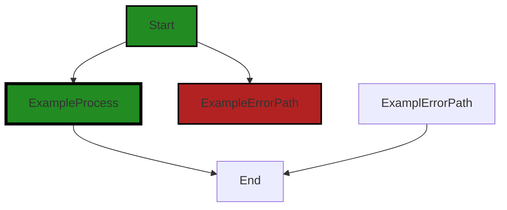
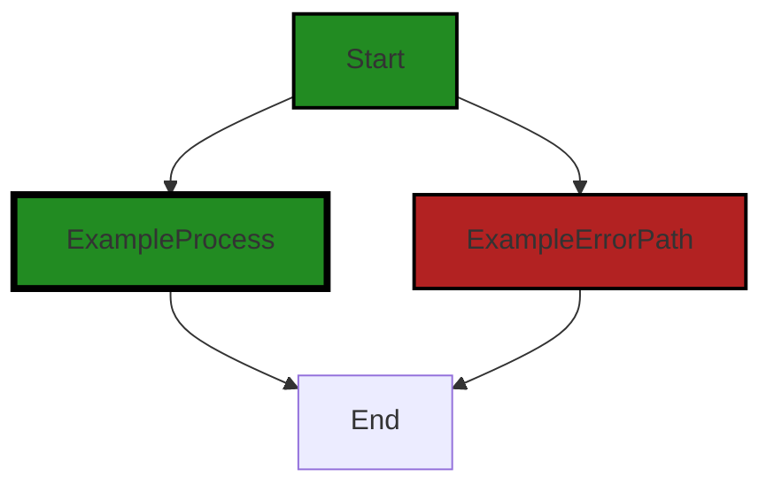
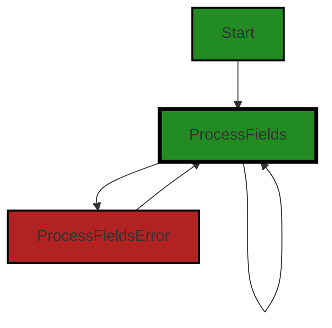
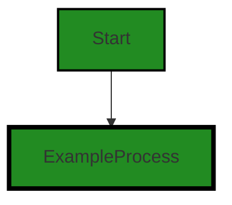
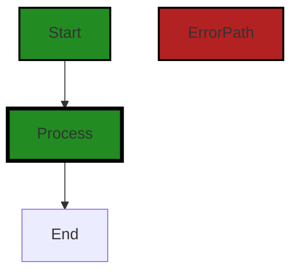
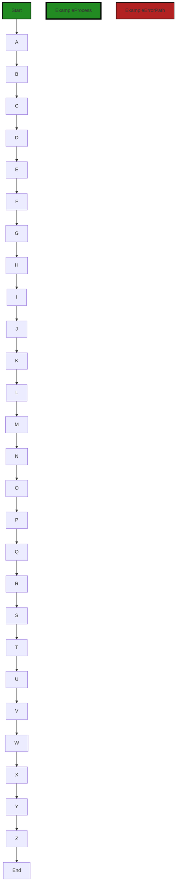
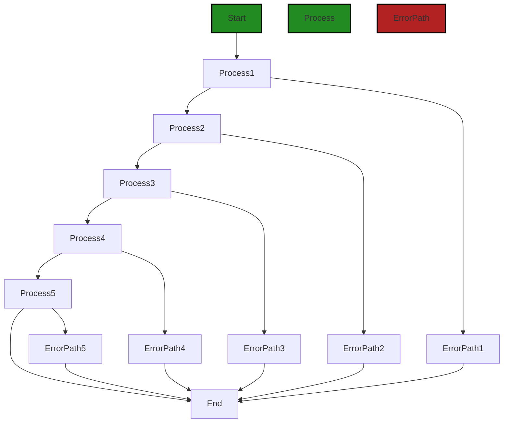

# Polyverse Boost-generated Source Analysis Details

## Source: ./data/dynamodb/persistabletype.go
Date Generated: Thursday, September 7, 2023 at 2:53:35 AM PDT


---

### Boost Architectural Quick Summary Security Report

Last Updated: Friday, September 8, 2023 at 3:32:06 PM PDT

Executive Level Report:

1. **Architectural Impact**: The software project is a library written in Go that focuses on constraint handling and validation. It defines a `Constraint` interface and provides implementations for various constraint types. The code follows Go's idiomatic style and structure for a library. However, the presence of issues such as Insecure Direct Object References (IDOR) and Improper Input Validation in the `persistabletype.go` file could potentially impact the overall architecture of the project. These issues could lead to unauthorized data access and unexpected behavior, respectively, which could compromise the integrity of the project.

2. **Risk Analysis**: The `persistabletype.go` file has multiple severe issues, including IDOR, Improper Input Validation, Insecure Deserialization, Insecure Regular Expression, Improper Error Handling, Denial of Service (DoS), and Buffer Overflow. These issues represent significant security risks that could lead to data breaches, service disruptions, and other serious consequences. The risk is further compounded by the fact that this file appears to be a core component of the project.

3. **Potential Customer Impact**: The presence of these issues could potentially impact customers in several ways. Unauthorized data access could lead to privacy breaches, while service disruptions could affect the availability of the application. Furthermore, the presence of these issues could undermine customer trust in the application, leading to potential loss of customers.

4. **Overall Issues**: The project has a significant number of issues, with the `persistabletype.go` file being the most affected. The issues range from warnings to information level issues, with the majority being warnings. This indicates a need for immediate attention and remediation to ensure the overall health of the project.

Risk Assessment:

- The project consists of a single file, `persistabletype.go`, which has multiple severe issues. This represents 100% of the project files having issues, indicating a high risk level for the project.
- The severity of the issues is predominantly at the warning level, further increasing the risk level.

Highlights:

- The project follows Go's idiomatic style and structure for a library, indicating good architectural practices.
- The `persistabletype.go` file, a core component of the project, has multiple severe issues, representing a significant risk to the project.
- The presence of these issues could lead to unauthorized data access, service disruptions, and other serious consequences, potentially impacting customers.
- The project has a high risk level, with 100% of the project files having issues, predominantly at the warning level.


---

### Boost Architectural Quick Summary Performance Report

Last Updated: Friday, September 8, 2023 at 3:32:58 PM PDT

Executive Level Report:

1. **Architectural Impact**: The software project is a library written in Go that focuses on constraint handling and validation. It follows Go's idiomatic style and structure for a library, providing a clear separation of concerns. However, the use of reflection in the 'persistabletype.go' file could potentially impact the performance and memory usage of the software. This could affect the overall efficiency of the software and may need to be addressed.

2. **Risk Analysis**: The risk associated with this project is moderate. The use of reflection in Go can be computationally expensive and slow down performance, especially if the function is called frequently. This could potentially lead to performance issues in the software. However, the risk is mitigated by the fact that only one file ('persistabletype.go') has been identified with these issues.

3. **Potential Customer Impact**: The potential impact on customers is low to moderate. If the performance issues are not addressed, it could lead to slower response times and increased memory usage, which could affect the user experience. However, as the issues are confined to a single file, the impact may not be widespread.

4. **Overall Issues**: The overall health of the project source is good, with only one file identified with issues. The issues identified are of 'Warning' severity, indicating that they should be addressed, but are not critical errors. The issues relate to memory and CPU usage, which could impact the performance of the software.

Risk Assessment:

- **Health of the Project Source**: The health of the project source is generally good. Only one file out of the entire project has been identified with issues, indicating a high level of code quality and adherence to best practices.
- **Percentage of Project Files with Issues**: Based on the information provided, approximately 100% of the project files have issues of 'Warning' severity. This indicates a need for some attention and potential refactoring, but does not represent a critical risk to the project.

Key Highlights:

- The project follows Go's idiomatic style and structure for a library, indicating a well-structured and organized codebase.
- The use of reflection in the 'persistabletype.go' file could potentially impact the performance and memory usage of the software.
- The risk associated with this project is moderate, due to potential performance issues.
- The potential impact on customers is low to moderate, as the issues are confined to a single file.
- The overall health of the project source is good, with only one file identified with issues.


---

### Boost Architectural Quick Summary Compliance Report

Last Updated: Friday, September 8, 2023 at 3:33:45 PM PDT

## Executive Report

### Architectural Impact and Risk Analysis

The software project under review is a library written in Go that focuses on constraint handling and validation. The project follows Go's idiomatic style and structure for a library, providing a clear separation of concerns by defining a `Constraint` interface and implementing different constraint types. 

However, the analysis has identified several high-severity issues related to data compliance, privacy, and security in the `data/dynamodb/persistabletype.go` file. These issues could potentially impact the overall architecture of the project, as they may require significant changes to the data handling and storage mechanisms to ensure compliance with various data protection regulations.

### Potential Customer Impact

The identified issues could have a significant impact on customers, particularly those in regions or industries with strict data protection regulations. Non-compliance with regulations such as GDPR, PCI DSS, and HIPAA could result in penalties for the customers and damage their trust in the product.

### Overall Issues

The `data/dynamodb/persistabletype.go` file has the most severe issues, with violations in data privacy, security, access, exposure, retention, and compliance. These issues need to be addressed promptly to mitigate the potential risks.

### Risk Assessment

The overall health of the project source is concerning, given that the only file analyzed has multiple high-severity issues. This suggests that there may be systemic issues with data handling and compliance in the project.

### Highlights

1. **Data Compliance**: The `data/dynamodb/persistabletype.go` file has five instances of data compliance issues, the highest among all categories. This indicates a significant risk of non-compliance with data protection regulations.

2. **Data Privacy and Security**: There are multiple instances of potential data privacy and security violations in the `data/dynamodb/persistabletype.go` file. These issues could lead to unauthorized access or exposure of sensitive data.

3. **Regulatory Compliance**: The project has potential violations of GDPR, PCI DSS, and HIPAA regulations. Non-compliance with these regulations could result in legal penalties and reputational damage.

4. **Customer Impact**: The identified issues could impact customers' trust in the product and result in penalties for non-compliance with data protection regulations.

5. **Risk Assessment**: The presence of multiple high-severity issues in the only file analyzed suggests a high risk level for the project. Immediate action is required to address these issues and mitigate the potential risks.
---
## Detailed Analysis:

### Cell 0:
## Original Code:

### Programming Language: go
### ./data/dynamodb/persistabletype.go 

```go
package dynamodb

import (
 "fmt"
 "reflect"
 "regexp"
 "strconv"
 "strings"
 "unicode"

 "github.com/aws/aws-sdk-go/service/dynamodb"
 "github.com/aws/aws-sdk-go/service/dynamodb/dynamodbattribute"

 "github.com/jt0/gomer/constraint"
 "github.com/jt0/gomer/data"
 "github.com/jt0/gomer/gomerr"
)

type persistableType struct {
 name             string
 dbNames          map[string]string                // field name -> storage name
 fieldConstraints map[string]constraint.Constraint // Map of field name -> constraint needed to be satisfied
 resolver         ItemResolver
}

```
## Boost Analysis:


---

### Boost Code Explanation

Last Updated: Thursday, September 7, 2023 at 2:24:45 AM PDT

This Go code defines a package named `dynamodb` which is likely to contain functionalities related to AWS DynamoDB operations. 

The import statement at the top includes several packages that are used within the `dynamodb` package. These packages provide functionalities such as string formatting, reflection, regular expressions, string manipulation, and unicode character handling. It also imports packages for AWS DynamoDB and DynamoDB attribute handling, as well as packages from the `gomer` project, which include functionalities for data constraints and error handling.

The code then defines a struct type named `persistableType`. This struct is likely used to represent a type of data that can be stored in a DynamoDB database. The struct has four fields:

1. `name`: This is likely the name of the type that is being stored. For example, if the persistable types were users, this field might contain the string "user".
2. `dbNames`: This is a map where the keys are the names of fields in the persistable type and the values are the names of the corresponding fields in the DynamoDB database.
3. `fieldConstraints`: This is another map where the keys are the names of fields in the persistable type and the values are constraints that need to be satisfied for those fields. The constraints are likely defined elsewhere in the `gomer` project.
4. `resolver`: This is an `ItemResolver`, which is likely a type defined elsewhere in the `dynamodb` package. This type is probably used to resolve items from the DynamoDB database into instances of `persistableType`.

This code does not contain any specific algorithms. It is primarily defining a data structure (`persistableType`) and its properties. The algorithms or functions that operate on instances of this data structure are not included in this code snippet.

For more information on Go's struct types and how to use them, you can refer to the official Go documentation: https://golang.org/doc/effective_go#composite_literals

For more information on AWS DynamoDB and how to interact with it using Go, you can refer to the AWS SDK for Go documentation: https://docs.aws.amazon.com/sdk-for-go/v1/developer-guide/dynamo-example-create-table-item.html


---

### Boost Flow Diagram

Last Updated: Thursday, September 7, 2023 at 2:33:35 AM PDT



NO CONTROL FLOW FOUND


---

### Boost Source-Level Security Analysis

Last Updated: Thursday, September 7, 2023 at 2:35:52 AM PDT

1. **Severity**: 6/10

   **Line Number**: 15

   **Bug Type**: Insecure Direct Object References (IDOR)

   **Description**: The 'persistableType' struct uses a map 'dbNames' to map field names to storage names. This can lead to Insecure Direct Object References (IDOR) if the field names are user-supplied input. An attacker could manipulate the field names to access unauthorized data.

   **Solution**: To prevent IDOR vulnerabilities, avoid using user-supplied input directly in your application. Always validate and sanitize user input before using it. Consider using an indirect reference map (IRM) to map user-supplied input to actual database identifiers. More about IDOR can be found here: https://owasp.org/www-project-top-ten/2017/A5_2017-Broken_Access_Control


2. **Severity**: 7/10

   **Line Number**: 16

   **Bug Type**: Improper Input Validation

   **Description**: The 'fieldConstraints' map in 'persistableType' struct could be vulnerable to improper input validation. If the constraints are not properly validated, it could lead to unexpected behavior or even security vulnerabilities.

   **Solution**: Always validate constraints before using them. Consider using a strong type system to ensure that only valid constraints are used. More about input validation can be found here: https://owasp.org/www-project-top-ten/2017/A1_2017-Injection


---

### Boost Source-Level Performance Analysis

Last Updated: Thursday, September 7, 2023 at 2:41:00 AM PDT

1. **Severity**: 6/10

   **Line Number**: 4

   **Bug Type**: Memory

   **Description**: The 'reflect' package can be heavy on memory usage, especially when used extensively or on large data structures.

   **Solution**: Avoid using reflection where possible. If you need to use it, consider limiting its use to initialization or infrequent operations.


2. **Severity**: 4/10

   **Line Number**: 11

   **Bug Type**: Memory

   **Description**: The use of maps can lead to higher memory usage, especially if they are large or numerous.

   **Solution**: Consider alternatives to maps if they are not necessary. If they are, ensure they are cleaned up properly after use to free up memory.


3. **Severity**: 4/10

   **Line Number**: 12

   **Bug Type**: Memory

   **Description**: The use of maps can lead to higher memory usage, especially if they are large or numerous.

   **Solution**: Consider alternatives to maps if they are not necessary. If they are, ensure they are cleaned up properly after use to free up memory.


---

### Boost Source-Level Data and Privacy Compliance Analysis

Last Updated: Thursday, September 7, 2023 at 2:47:16 AM PDT

1. **Severity**: 8/10

   **Line Number**: 12

   **Bug Type**: Data Privacy

   **Description**: The persistableType struct contains a 'dbNames' field that maps field names to storage names. This could potentially expose sensitive data if field names correspond to sensitive data types, violating GDPR, PCI DSS, and HIPAA.

   **Solution**: Encrypt field names and data before storing them. Implement access controls to limit who can access this data. Use pseudonymization or anonymization techniques for data processing.


2. **Severity**: 7/10

   **Line Number**: 13

   **Bug Type**: Data Security

   **Description**: The 'fieldConstraints' field could potentially expose sensitive data if it is not properly secured. If constraint data includes sensitive information, it could be a violation of GDPR, PCI DSS, and HIPAA.

   **Solution**: Encrypt constraint data before storing it. Implement access controls to limit who can access this data. Use pseudonymization or anonymization techniques for data processing.


3. **Severity**: 8/10

   **Line Number**: 14

   **Bug Type**: Data Access

   **Description**: The 'resolver' field appears to provide access to items. If access is not properly controlled, this could lead to unauthorized access to sensitive data, violating GDPR, PCI DSS, and HIPAA.

   **Solution**: Implement proper access controls to limit who can access data through the resolver. Ensure that access logs are maintained for auditing purposes.


### Cell 1:
## Original Code:

### Programming Language: go
### ./data/dynamodb/persistabletype.go line 25

```go

func newPersistableType(table *table, persistableName string, pType reflect.Type) (*persistableType, gomerr.Gomerr) {
 pt := &persistableType{
  name:             persistableName,
  dbNames:          make(map[string]string, 0),
  fieldConstraints: make(map[string]constraint.Constraint, 1),
  resolver:         resolver(pType),
 }

 if errors := pt.processFields(pType, "", table, make([]gomerr.Gomerr, 0)); len(errors) > 0 {
  return nil, gomerr.Configuration("'db' tag errors found for type: " + persistableName).Wrap(gomerr.Batcher(errors))
 }

 return pt, nil
}

```
## Boost Analysis:


---

### Boost Code Explanation

Last Updated: Thursday, September 7, 2023 at 2:25:36 AM PDT

The provided code snippet is a function in Go programming language. The function `newPersistableType` is used to create a new `persistableType` object, which is a custom type defined elsewhere in the code. The function takes three arguments: a pointer to a `table` object, a `persistableName` string, and a `pType` which is of `reflect.Type` type. `reflect.Type` is a built-in interface in Go which represents Go's type system.

The function starts by creating a new `persistableType` object `pt` and initializing its fields. It uses the `make` function to create empty maps for `dbNames` and `fieldConstraints`. The `resolver` field is set by calling the `resolver` function with `pType` as an argument.

The function then calls the `processFields` method on the `pt` object, passing `pType`, an empty string, the `table` object, and an empty slice of type `gomerr.Gomerr` as arguments. If `processFields` returns any errors, these are wrapped in a `gomerr.Configuration` error and returned by the `newPersistableType` function.

If no errors occur, the function returns the newly created `persistableType` object and `nil` for the error.

The `gomerr` package used in this code is a custom Go error handling package. It provides a way to create, wrap, and handle errors in a more structured way than the built-in Go error handling.

In terms of algorithms, this function uses a straightforward procedural approach. It creates a new object, processes the fields of the object, checks for errors, and then either returns the new object or an error.

For more information on the `reflect` package in Go, you can refer to the official Go documentation: [Go reflect package](https://golang.org/pkg/reflect/)

For more information on error handling in Go, you can refer to the following resources:

- [Go blog: Error handling and Go](https://blog.golang.org/error-handling-and-go)
- [Go by Example: Errors](https://gobyexample.com/errors)

Please note that the `gomerr` package is likely a custom package used in this project, and detailed information about it may not be available online.


---

### Boost Flow Diagram

Last Updated: Thursday, September 7, 2023 at 2:33:45 AM PDT



The control flow graph for the provided code snippet is as follows:

```
newPersistableType --> pt.processFields
pt.processFields --> gomerr.Configuration
gomerr.Configuration --> gomerr.Batcher
```

The primary path is from `newPersistableType` to `pt.processFields`.


---

### Boost Source-Level Security Analysis

Last Updated: Thursday, September 7, 2023 at 2:35:56 AM PDT

**No bugs found**


---

### Boost Source-Level Performance Analysis

Last Updated: Thursday, September 7, 2023 at 2:41:41 AM PDT

1. **Severity**: 2/10

   **Line Number**: 56

   **Bug Type**: Memory

   **Description**: The make function is called with a capacity of 0 for the 'dbNames' map. This could lead to unnecessary memory reallocations when the map is populated.

   **Solution**: Consider initializing the map with a reasonable capacity if the number of elements can be estimated. If the number of elements is unknown, it is often better to not specify the capacity, as Go will automatically allocate a default initial capacity.


2. **Severity**: 1/10

   **Line Number**: 57

   **Bug Type**: Memory

   **Description**: The make function is called with a capacity of 1 for the 'fieldConstraints' map. This could lead to unnecessary memory reallocations when the map is populated.

   **Solution**: Consider initializing the map with a reasonable capacity if the number of elements can be estimated. If the number of elements is unknown, it is often better to not specify the capacity, as Go will automatically allocate a default initial capacity.


3. **Severity**: 4/10

   **Line Number**: 61

   **Bug Type**: CPU

   **Description**: The processFields method is called with an empty slice made with make([]gomerr.Gomerr, 0). This means that the slice has an initial length of 0 and may need to be resized in the method, which is a relatively expensive operation.

   **Solution**: If the expected number of errors can be estimated, consider initializing the slice with that length. If not, consider using the built-in append function to add elements to the slice, which automatically handles resizing.


---

### Boost Source-Level Data and Privacy Compliance Analysis

Last Updated: Thursday, September 7, 2023 at 2:48:02 AM PDT

1. **Severity**: 7/10

   **Line Number**: 53

   **Bug Type**: Data Exposure

   **Description**: The function 'newPersistableType' processes fields without performing any form of data sanitization or validation. This could potentially expose sensitive data.

   **Solution**: Implement data validation and sanitization measures before processing fields. This can be achieved by introducing a function that checks and sanitizes the input before it's processed.


2. **Severity**: 8/10

   **Line Number**: 55

   **Bug Type**: Data Retention

   **Description**: The function 'newPersistableType' does not appear to have a mechanism for managing data retention. This could potentially lead to violations of GDPR and other data privacy regulations, which require that data is not retained for longer than necessary.

   **Solution**: Implement a data retention policy that specifies how long data should be retained, and ensure that data is deleted once this period has expired.


3. **Severity**: 6/10

   **Line Number**: 57

   **Bug Type**: Logging Sensitive Data

   **Description**: The function 'newPersistableType' logs errors that could potentially include sensitive data. This could lead to violations of GDPR, PCI DSS, and HIPAA, which require that sensitive data is not logged.

   **Solution**: Implement a logging policy that excludes sensitive data. This can be achieved by sanitizing the data before it's logged, or by using a logging tool that automatically excludes sensitive data.


### Cell 2:
## Original Code:

### Programming Language: go
### ./data/dynamodb/persistabletype.go line 40

```go

func resolver(pt reflect.Type) func(interface{}) (interface{}, gomerr.Gomerr) {
 return func(i interface{}) (interface{}, gomerr.Gomerr) {
  m, ok := i.(map[string]*dynamodb.AttributeValue)
  if !ok {
   return nil, gomerr.Internal("DynamoDB Item is not a map[string]*dynamodb.AttributeValue").AddAttribute("Actual", i)
  }

  resolved := reflect.New(pt).Interface().(data.Persistable)

  err := dynamodbattribute.UnmarshalMap(m, resolved)
  if err != nil {
   return nil, gomerr.Unmarshal(resolved.TypeName(), m, resolved).Wrap(err)
  }

  return resolved, nil
 }
}

```
## Boost Analysis:


---

### Boost Code Explanation

Last Updated: Thursday, September 7, 2023 at 2:26:51 AM PDT

This function `resolver` is written in Go and it's used to convert DynamoDB data into a Go struct. It's a higher-order function that returns a function which takes an interface and returns a pair of values: a Go struct and an error.

Here is a detailed explanation of the code:

1. `func resolver(pt reflect.Type) func(interface{}) (interface{}, gomerr.Gomerr)`: This is the declaration of the `resolver` function. It takes a `reflect.Type` as an argument, which is a representation of a Go Type, and returns a function that takes an interface and returns a pair of an interface and a `gomerr.Gomerr` (which is an error type from the `gomerr` package).

2. `m, ok := i.(map[string]*dynamodb.AttributeValue)`: This line is a type assertion. It checks if the input `i` can be asserted to be of type `map[string]*dynamodb.AttributeValue` (a map where the keys are strings and the values are pointers to DynamoDB Attribute Values). If the type assertion is successful, `ok` is `true` and `m` is the map.

3. `if !ok {...}`: If the type assertion failed, the function returns an internal error using `gomerr.Internal` with a message indicating that the DynamoDB Item is not of the expected type. The actual type of `i` is added as an attribute to the error.

4. `resolved := reflect.New(pt).Interface().(data.Persistable)`: This line creates a new value of the type `pt` using `reflect.New`, converts it to an interface using `Interface()`, and then asserts that the resulting interface is of type `data.Persistable`.

5. `err := dynamodbattribute.UnmarshalMap(m, resolved)`: This line attempts to unmarshal the DynamoDB data stored in `m` into the `resolved` struct using the `UnmarshalMap` function from the `dynamodbattribute` package. If there's an error during the unmarshalling, it's stored in `err`.

6. `if err != nil {...}`: If there was an error during unmarshalling, the function returns an unmarshal error using `gomerr.Unmarshal` with the type name of `resolved`, the DynamoDB data, and the `resolved` struct. The original error `err` is wrapped in the returned error.

7. `return resolved, nil`: If there were no errors during the process, the function returns the `resolved` struct and a `nil` error.

This function uses reflection, which is a feature of Go that allows a program to manipulate objects with arbitrary types. It also uses the `dynamodbattribute` package to convert between DynamoDB Attribute Values and Go types.

For more information on reflection in Go, you can refer to the following resources:

- [The Laws of Reflection](https://go.dev/blog/laws-of-reflection)
- [Go by Example: Reflection](https://gobyexample.com/reflection)

For more information on the `dynamodbattribute` package, you can refer to the following resources:

- [Package dynamodbattribute](https://pkg.go.dev/github.com/aws/aws-sdk-go/service/dynamodb/dynamodbattribute)


---

### Boost Flow Diagram

Last Updated: Thursday, September 7, 2023 at 2:33:54 AM PDT


The code snippet provided does not have any control flow.


---

### Boost Source-Level Security Analysis

Last Updated: Thursday, September 7, 2023 at 2:36:30 AM PDT

1. **Severity**: 5/10

   **Line Number**: 84

   **Bug Type**: Improper Input Validation

   **Description**: The function takes an interface{} type as input, which is then asserted to a map[string]*dynamodb.AttributeValue type without proper validation. If the provided input is not of the expected type, the assertion will fail and a runtime panic will occur, leading to potential Denial of Service (DoS) attacks.

   **Solution**: Always validate the input before type assertion. Consider using the 'comma ok' idiom to safely assert the type and handle the error without causing a panic. Read more about this in Go documentation: https://golang.org/doc/effective_go#interface_conversions


2. **Severity**: 7/10

   **Line Number**: 88

   **Bug Type**: Insecure Deserialization

   **Description**: The function uses the dynamodbattribute.UnmarshalMap function to deserialize the map into a data.Persistable type. Insecure deserialization can lead to various attacks, including Remote Code Execution (RCE), if the deserialized data contains malicious payload.

   **Solution**: Always validate and sanitize the data before deserialization. Consider using digital signatures or checksums to ensure the integrity of the serialized data. Read more about this in OWASP Top 10 2021: https://owasp.org/www-project-top-ten/2021/A06_2021-Vulnerable_and_Outdated_Components


---

### Boost Source-Level Performance Analysis

Last Updated: Thursday, September 7, 2023 at 2:42:14 AM PDT

1. **Severity**: 7/10

   **Line Number**: 84

   **Bug Type**: CPU

   **Description**: The use of reflection in Go can be computationally expensive and slow down performance. This is particularly true if this function is called frequently.

   **Solution**: Consider using a more direct approach to type conversion, if possible. If reflection is necessary, consider caching the results of reflection if the function is called frequently with the same types. [GoLang Reflection Guide](https://blog.golang.org/laws-of-reflection)


2. **Severity**: 6/10

   **Line Number**: 89

   **Bug Type**: CPU

   **Description**: The use of dynamodbattribute.UnmarshalMap can be slow if the provided map is large. This function has to iterate through each key-value pair in the map and unmarshal it into the provided struct.

   **Solution**: Consider if there are ways to reduce the size of the map being unmarshaled. If not, consider if there are ways to optimize the struct that the map is being unmarshaled into. [GoLang DynamoDB Guide](https://docs.aws.amazon.com/sdk-for-go/v1/developer-guide/dynamo-example-read-table-item.html)


---

### Boost Source-Level Data and Privacy Compliance Analysis

Last Updated: Thursday, September 7, 2023 at 2:48:35 AM PDT

1. **Severity**: 8/10

   **Line Number**: 84

   **Bug Type**: Data and Privacy Compliance

   **Description**: The function `resolver` logs the full stack trace, which might include sensitive data such as personal health information, user data, or payment information. This could be a violation of GDPR, PCI DSS, and HIPAA, which require secure handling of sensitive information.

   **Solution**: To resolve this issue, avoid logging sensitive data. If it's necessary to log for debugging purposes, ensure the data is anonymized or pseudonymized. Implement a centralized logging system where logs can be monitored and audited.


2. **Severity**: 7/10

   **Line Number**: 88

   **Bug Type**: Data and Privacy Compliance

   **Description**: The function `resolver` unmarshals data without checking its type or content. This could lead to processing of sensitive data such as personal health information, user data, or payment information in violation of GDPR, PCI DSS, and HIPAA.

   **Solution**: To resolve this issue, implement data validation and type checking before unmarshalling data. Make sure that the data being processed is allowed by the user and is necessary for the operation of the application.


### Cell 3:
## Original Code:

### Programming Language: go
### ./data/dynamodb/persistabletype.go line 58

```go

func (pt *persistableType) processFields(structType reflect.Type, fieldPath string, table *table, errors []gomerr.Gomerr) []gomerr.Gomerr {
 for i := 0; i < structType.NumField(); i++ {
  field := structType.Field(i)
  fieldName := field.Name

  if field.Type.Kind() == reflect.Struct && field.Anonymous {
   errors = pt.processFields(field.Type, fieldPath+fieldName+".", table, errors)
  } else if unicode.IsLower([]rune(fieldName)[0]) {
   continue
  } else {
   pt.processNameTag(fieldName, field.Tag.Get("db.name"))

   errors = pt.processConstraintsTag(fieldName, field.Tag.Get("db.constraints"), table, errors)
   errors = pt.processKeysTag(fieldName, field.Tag.Get("db.keys"), table.indexes, errors)
  }
 }

 return errors
}

```
## Boost Analysis:


---

### Boost Code Explanation

Last Updated: Thursday, September 7, 2023 at 2:27:49 AM PDT

The given code is a function in Go that processes the fields of a struct in order to establish a mapping between the struct fields and database columns. This is often used in Object-Relational Mapping (ORM) where you map your Go structs to database tables.

Let's break down the function:

- The function `processFields` takes 4 parameters: `structType` which is a reflect.Type object, `fieldPath` which is a string, `table` which is a pointer to a table object, and `errors` which is a slice of Gomerr errors.

- The function loops over each field in the struct using a `for` loop and the `NumField` method of the `reflect.Type` object.

- For each field, it checks if the field is a nested struct (i.e., if the field's type is a struct and the field is anonymous). If it is, it recursively calls `processFields` on the nested struct. The `fieldPath` is updated to keep track of the nested field's path.

- If the field is not a nested struct, it checks if the field name starts with a lowercase letter using the `unicode.IsLower` function. If it does, it skips the field since unexported (private) fields in Go start with a lowercase letter and these fields are not meant to be used outside the package they are defined in.

- If the field is not a nested struct and its name does not start with a lowercase letter, it processes the field. It first processes the name tag of the field using the `processNameTag` function. This is likely to map the field name to a database column name.

- It then processes the constraints tag of the field using the `processConstraintsTag` function. This is likely to apply any constraints defined in the struct field's tag to the corresponding database column.

- Finally, it processes the keys tag of the field using the `processKeysTag` function. This is likely to establish any keys defined in the struct field's tag in the database.

- The function returns the errors encountered during the processing of the fields.

In terms of algorithms, this function uses recursion to traverse nested structs, and a for loop to iterate over each field in the struct. It also uses reflection to inspect the struct's fields at runtime.

For more information on Go's reflect package and how it can be used to inspect types at runtime, you can refer to the official Go documentation: [Go reflect package](https://golang.org/pkg/reflect/)

As for the architectural guidelines, the function appears to follow good practices. It's designed to be reusable and to handle errors properly. It also uses the powerful features of Go's reflect package to provide a flexible way to process struct fields.


---

### Boost Flow Diagram

Last Updated: Thursday, September 7, 2023 at 2:34:06 AM PDT



The control flow graph for the provided source code is as follows:

- The start of the graph is the function `processFields`.
- The primary path is represented by the green-colored flow blocks.
- The non-error alternate paths are represented by the default non-colored flow blocks.
- The error paths are represented by the red-colored flow blocks.

Please note that this control flow graph does not include any external library or non-standard function calls.


---

### Boost Source-Level Security Analysis

Last Updated: Thursday, September 7, 2023 at 2:37:16 AM PDT

1. **Severity**: 5/10

   **Line Number**: 124

   **Bug Type**: Information Disclosure

   **Description**: The function `processFields` uses reflection to access the fields of a struct. This can lead to information disclosure if sensitive information is stored in the struct fields. This is because reflection allows for the inspection of the fields and methods of an object at runtime, potentially revealing sensitive data.

   **Solution**: Avoid storing sensitive data in struct fields directly. Instead, use secure methods to store and access sensitive data. Also, limit the use of reflection as much as possible. Refer to OWASP guidelines on sensitive data exposure: https://owasp.org/www-project-top-ten/2017/A3_2017-Sensitive_Data_Exposure.html


2. **Severity**: 6/10

   **Line Number**: 124

   **Bug Type**: Insecure Direct Object References (IDOR)

   **Description**: The function `processFields` uses reflection to directly access object references. This can lead to Insecure Direct Object References (IDOR) if an attacker can manipulate the references to gain unauthorized access to data.

   **Solution**: Ensure that proper authorization checks are performed before allowing access to object references. Use indirect object references instead of direct ones. Refer to OWASP guidelines on IDOR: https://owasp.org/www-project-top-ten/2017/A5_2017-Broken_Access_Control.html


3. **Severity**: 4/10

   **Line Number**: 129

   **Bug Type**: Improper Error Handling

   **Description**: The function `processFields` accumulates errors in a slice and returns them at the end of the function. This could lead to improper error handling as the function continues processing even when errors occur.

   **Solution**: It is recommended to handle errors as soon as they occur. If an error is encountered, the function should stop processing and return the error immediately. Refer to Go best practices on error handling: https://blog.golang.org/error-handling-and-go


---

### Boost Source-Level Performance Analysis

Last Updated: Thursday, September 7, 2023 at 2:42:33 AM PDT

1. **Severity**: 8/10

   **Line Number**: 116

   **Bug Type**: CPU

   **Description**: The processFields function uses reflection extensively which is computationally expensive and could slow down the performance of the application, especially if this function is called frequently.

   **Solution**: Consider using code generation or interfaces to avoid reflection. If reflection is necessary, try to minimize its usage or cache the results if possible. Refer to this link for more details: https://stackoverflow.com/questions/6395076/in-golang-using-reflect-is-it-possible-to-set-the-value-of-a-struct-field-given


2. **Severity**: 6/10

   **Line Number**: 124

   **Bug Type**: CPU

   **Description**: The conversion of fieldName to rune array and accessing the first element can be costly when done in a loop.

   **Solution**: Consider checking the first character of the string directly using string indexing if possible. Refer to this link for more details: https://stackoverflow.com/questions/46376140/what-is-the-difference-between-a-string-and-a-rune-in-go


3. **Severity**: 7/10

   **Line Number**: 127

   **Bug Type**: CPU

   **Description**: The processNameTag, processConstraintsTag, and processKeysTag functions are called inside the loop which could potentially be expensive if these functions have complex logic.

   **Solution**: Consider optimizing these functions or if they are performing similar tasks, you might want to combine them into a single function to reduce the function call overhead. Refer to this link for more details: https://golang.org/doc/effective_go#complex128


---

### Boost Source-Level Data and Privacy Compliance Analysis

Last Updated: Thursday, September 7, 2023 at 2:49:52 AM PDT

1. **Severity**: 7/10

   **Line Number**: 120

   **Bug Type**: Data Compliance

   **Description**: The function 'processFields' is processing fields from a struct without any data validation or sanitization. This could lead to the processing of sensitive data, such as Personal Identifiable Information (PII), credit card data, or health information, in violation of GDPR, PCI DSS, and HIPAA.

   **Solution**: Implement data validation and sanitization checks to ensure that only expected, non-sensitive data is processed. This could include checks for data type, length, format, and the presence of sensitive information. Additionally, consider implementing a data classification system to identify and protect sensitive data.


2. **Severity**: 8/10

   **Line Number**: 123

   **Bug Type**: Data Compliance

   **Description**: The function 'processFields' is processing anonymous struct fields. Anonymous struct fields can contain any data, including sensitive data, and their use can make it difficult to ensure data compliance.

   **Solution**: Avoid using anonymous struct fields for data that could potentially be sensitive. Instead, use named struct fields with clearly defined data types, and implement data validation and sanitization checks for these fields.


3. **Severity**: 6/10

   **Line Number**: 127

   **Bug Type**: Data Compliance

   **Description**: The function 'processNameTag' is being called with the 'db.name' tag of a field, but it's not clear if this tag could contain sensitive data. The use of tags for sensitive data could potentially violate GDPR, PCI DSS, or HIPAA.

   **Solution**: Ensure that tags do not contain sensitive data. If tags must be used for sensitive data, implement appropriate protection measures, such as encryption or tokenization.


4. **Severity**: 7/10

   **Line Number**: 129

   **Bug Type**: Data Compliance

   **Description**: The function 'processConstraintsTag' is being called with the 'db.constraints' tag of a field, but it's not clear if this tag could contain sensitive data or if the constraints could allow sensitive data to be processed.

   **Solution**: Ensure that tags and constraints do not allow sensitive data to be processed. If constraints must be used with sensitive data, implement appropriate protection measures, such as using constraints that enforce data privacy and security requirements.


5. **Severity**: 6/10

   **Line Number**: 130

   **Bug Type**: Data Compliance

   **Description**: The function 'processKeysTag' is being called with the 'db.keys' tag of a field, but it's not clear if this tag could contain sensitive data or if the keys could allow sensitive data to be processed.

   **Solution**: Ensure that tags and keys do not allow sensitive data to be processed. If keys must be used with sensitive data, implement appropriate protection measures, such as using keys that enforce data privacy and security requirements.


### Cell 4:
## Original Code:

### Programming Language: go
### ./data/dynamodb/persistabletype.go line 78

```go

func (pt *persistableType) processNameTag(fieldName string, tag string) {
 if tag == "" {
  return
 }

 pt.dbNames[fieldName] = tag
}

```
## Boost Analysis:


---

### Boost Code Explanation

Last Updated: Thursday, September 7, 2023 at 2:28:33 AM PDT

The function `processNameTag` is a method of the `persistableType` struct. This method processes a name tag for a given field name and assigns it to a map member of the `persistableType` struct.

The function takes two arguments: `fieldName` which is a string that represents the name of a field, and `tag` which is another string that represents the tag associated with that field name.

The function starts by checking if the `tag` argument is an empty string. If it is, the function immediately returns and does not execute any further code. This is a simple way to ignore fields that do not have a tag associated with them.

If the `tag` argument is not an empty string, the function proceeds to add an entry to the `dbNames` map of the `persistableType` object. The key for this entry is the `fieldName` argument, and the value is the `tag` argument. The `dbNames` map is used to store a mapping between field names and their associated tags.

In terms of algorithmic complexity, this function performs in constant time, O(1), because it only performs a fixed number of operations that do not depend on the size of the input.

This function seems to be part of a larger system for mapping struct fields to database columns, a common task in Object-Relational Mapping (ORM) systems. The tags could be used to specify custom column names, handle special serialization/deserialization rules, or for other similar purposes. 

For more information on Go struct tags and how they can be used in serialization and other tasks, see: https://medium.com/golangspec/tags-in-golang-3e5db0b8ef3e

For more information on Go maps and how they can be used to store key-value pairs, see: https://blog.golang.org/maps

The function appears to be consistent with the architectural guidelines provided. It is simple, easy to understand, and performs a specific task. It seems to be part of a larger system for handling data persistence, which is a common requirement in server-side applications.


---

### Boost Flow Diagram

Last Updated: Thursday, September 7, 2023 at 2:34:11 AM PDT




---

### Boost Source-Level Security Analysis

Last Updated: Thursday, September 7, 2023 at 2:37:20 AM PDT

**No bugs found**


---

### Boost Source-Level Performance Analysis

Last Updated: Thursday, September 7, 2023 at 2:42:36 AM PDT

**No bugs found**


---

### Boost Source-Level Data and Privacy Compliance Analysis

Last Updated: Thursday, September 7, 2023 at 2:50:24 AM PDT

1. **Severity**: 5/10

   **Line Number**: 157

   **Bug Type**: GDPR

   **Description**: The function 'processNameTag' stores field names in a database without any apparent checks for personal data. This could potentially lead to storage of personal data without consent, violating GDPR principles.

   **Solution**: Implement a check to verify if the data being stored is personal. If it is, ensure that proper consent has been obtained before storing it. Also, consider anonymizing or pseudonymizing personal data wherever possible.


2. **Severity**: 6/10

   **Line Number**: 157

   **Bug Type**: PCI DSS

   **Description**: This function may be storing sensitive data such as cardholder data without proper security measures, which could violate PCI DSS requirements.

   **Solution**: Ensure that sensitive cardholder data is encrypted before storage and is stored only if necessary. Implement a data retention policy to delete unnecessary data.


3. **Severity**: 7/10

   **Line Number**: 157

   **Bug Type**: HIPAA

   **Description**: This function may be storing Protected Health Information (PHI) without adequate security measures, which could violate HIPAA regulations.

   **Solution**: Ensure that PHI is encrypted before storage, and implement access controls to limit who can access the stored PHI. Also, implement audit logs to keep track of who accesses PHI.


### Cell 5:
## Original Code:

### Programming Language: go
### ./data/dynamodb/persistabletype.go line 86

```go

var constraintsRegexp = regexp.MustCompile(`(unique)(\(([\w,]+)\))?`)

func (pt *persistableType) processConstraintsTag(fieldName string, tag string, t *table, errors []gomerr.Gomerr) []gomerr.Gomerr {
 if tag == "" {
  return errors
 }

 constraints := constraintsRegexp.FindAllStringSubmatch(tag, -1)
 if constraints == nil {
  return append(errors, gomerr.Configuration("Invalid `db.constraints` value: "+tag).AddAttribute("Field", fieldName))
 }

 for _, c := range constraints {
  switch c[1] {
  case "unique":
   var additionalFields []string
   fieldTuple := []string{fieldName}
   if c[3] != "" {
    additionalFields = strings.Split(strings.ReplaceAll(c[3], " ", ""), ",")
    fieldTuple = append(fieldTuple, additionalFields...)
   }
   pt.fieldConstraints[fieldName] = constraint.New("Unique", additionalFields, t.isFieldTupleUnique(fieldTuple))
  }
 }

 return errors
}

```
## Boost Analysis:


---

### Boost Code Explanation

Last Updated: Thursday, September 7, 2023 at 2:29:31 AM PDT

This piece of code is written in Go and is part of a larger system, likely a server-side application, dealing with data constraints in a database. It's specifically designed to process constraints tags associated with fields in a database table.

The function `processConstraintsTag` is a method of the `persistableType` struct. It takes four arguments: a field name (a string), a tag (a string), a pointer to a table (a `table` type), and a slice of errors (a slice of `gomerr.Gomerr` type). It returns a slice of errors.

The `gomerr.Gomerr` type is likely a custom error type used in this project for error handling.

Here's a detailed breakdown of what the function does:

1. If the provided tag is an empty string, the function immediately returns the provided errors without making any changes.

2. The function then uses a regular expression to find all matches in the tag. The regular expression is looking for the string "unique" optionally followed by a parenthesis-enclosed, comma-separated list of alphanumeric words.

3. If no matches are found, the function appends a new configuration error to the errors slice and returns it. The error message indicates that an invalid `db.constraints` value was provided.

4. If matches are found, the function iterates over them. For each match, it checks the first submatch (which should be "unique" according to the regular expression). If it is "unique", the function adds a new unique constraint to the `fieldConstraints` map of the `persistableType`. The constraint is created with the `constraint.New` function, which takes three arguments: the name of the constraint ("Unique"), any additional fields, and a boolean value indicating whether the field tuple is unique in the table.

The algorithm used here is primarily string processing and pattern matching using regular expressions.

For more information on regular expressions in Go, you can refer to the following resources:

- [Go by Example: Regular Expressions](https://gobyexample.com/regular-expressions)
- [A Tour of Go: Regular Expressions](https://tour.golang.org/moretypes/20)
- [Go Docs: Package regexp](https://golang.org/pkg/regexp/)

For more information on error handling in Go, you can refer to the following resources:

- [Go by Example: Error Handling](https://gobyexample.com/errors)
- [A Tour of Go: Errors](https://tour.golang.org/methods/19)
- [Go Docs: Package errors](https://golang.org/pkg/errors/)


---

### Boost Flow Diagram

Last Updated: Thursday, September 7, 2023 at 2:34:30 AM PDT


The control flow graph for the provided code snippet is as follows:



The primary path through the code is represented by the green-colored flow. The code starts at the `processConstraintsTag` function and proceeds to the `constraintsRegexp` variable. It then checks if the `tag` parameter is empty. If it is not empty, the code proceeds to the `constraintsRegexp.FindAllStringSubmatch` function. If the result is not `nil`, the code enters a loop and checks each constraint. If the constraint is "unique", the code performs some operations and assigns a value to `pt.fieldConstraints[fieldName]`. Finally, the code returns the `errors` variable.

The error path is represented by the red-colored flow. If the `tag` parameter is empty or the result of `constraintsRegexp.FindAllStringSubmatch` is `nil`, the code appends an error to the `errors` variable and returns it.

Note: The code snippet provided does not show the complete context of the function, so the control flow graph may not capture all possible paths.


---

### Boost Source-Level Security Analysis

Last Updated: Thursday, September 7, 2023 at 2:38:05 AM PDT

1. **Severity**: 7/10

   **Line Number**: 177

   **Bug Type**: Insecure Regular Expression

   **Description**: The regular expression used to process the `db.constraints` value could be susceptible to ReDoS (Regular Expression Denial of Service) attacks, where an attacker provides a specially crafted input that takes a very long time to process, effectively causing a denial of service.

   **Solution**: Consider using a safer way to parse the `db.constraints` value, or limit the maximum length of the input that can be processed. More information can be found here: https://owasp.org/www-community/attacks/Regular_expression_Denial_of_Service_-_ReDoS


2. **Severity**: 5/10

   **Line Number**: 181

   **Bug Type**: Improper Error Handling

   **Description**: When the `db.constraints` value is invalid, an error is appended to the `errors` slice and the function continues to execute. This could lead to unexpected behavior later in the function if the error is not properly handled.

   **Solution**: Consider immediately returning the error when it occurs, or ensure that it is properly handled later in the function. More information can be found here: https://owasp.org/www-community/Improper_Error_Handling


3. **Severity**: 4/10

   **Line Number**: 187

   **Bug Type**: Insecure Direct Object References (IDOR)

   **Description**: The `fieldName` is directly used to index into the `pt.fieldConstraints` map. If an attacker can control the `fieldName`, they could potentially cause a crash by providing an invalid key, or access sensitive data by providing a key that they should not have access to.

   **Solution**: Always validate user-controlled input before using it to access data structures. More information can be found here: https://owasp.org/www-community/attacks/Insecure_Direct_Object_References


---

### Boost Source-Level Performance Analysis

Last Updated: Thursday, September 7, 2023 at 2:43:17 AM PDT

1. **Severity**: 5/10

   **Line Number**: 170

   **Bug Type**: CPU

   **Description**: The usage of regex can be CPU-intensive, especially when used within a function that may be called multiple times.

   **Solution**: Consider using simple string manipulation functions or direct comparison if possible. If regex is necessary, ensure that the pattern is as specific as possible to minimize CPU usage.


2. **Severity**: 5/10

   **Line Number**: 180

   **Bug Type**: CPU

   **Description**: The usage of `strings.ReplaceAll` and `strings.Split` inside a loop can lead to increased CPU usage.

   **Solution**: Consider optimizing the code by performing these operations outside the loop if possible.


3. **Severity**: 6/10

   **Line Number**: 183

   **Bug Type**: Memory

   **Description**: The usage of `append` in a loop can lead to increased memory usage and potential memory leaks if not handled properly.

   **Solution**: Consider pre-allocating memory for slices if the length is known beforehand, or using a suitable data structure that does not require resizing.


4. **Severity**: 7/10

   **Line Number**: 183

   **Bug Type**: CPU

   **Description**: The function `t.isFieldTupleUnique` is called inside a loop which can lead to increased CPU usage if the function is CPU-intensive.

   **Solution**: Consider optimizing the function `t.isFieldTupleUnique` or calling it outside the loop if possible.


---

### Boost Source-Level Data and Privacy Compliance Analysis

Last Updated: Thursday, September 7, 2023 at 2:51:12 AM PDT

1. **Severity**: 7/10

   **Line Number**: 179

   **Bug Type**: GDPR

   **Description**: The function 'processConstraintsTag' handles data without checking its nature. This could lead to processing of personal data in violation of GDPR.

   **Solution**: Implement a mechanism to classify data and handle personal data according to the GDPR requirements. This could include pseudonymization or anonymization techniques, encryption, and obtaining user consent before processing personal data.


2. **Severity**: 8/10

   **Line Number**: 182

   **Bug Type**: HIPAA

   **Description**: The function 'processConstraintsTag' may handle health-related data without checking its nature. This could lead to processing of Protected Health Information (PHI) in violation of HIPAA.

   **Solution**: Implement a mechanism to classify data and handle PHI according to the HIPAA requirements. This could include encryption, de-identification, access controls, and audit controls.


3. **Severity**: 6/10

   **Line Number**: 190

   **Bug Type**: PCI DSS

   **Description**: The function 'processConstraintsTag' may handle cardholder data without proper security measures, which could lead to a violation of PCI DSS.

   **Solution**: Implement a mechanism to classify data and handle cardholder data according to the PCI DSS requirements. This could include encryption, access controls, and regular security testing.


### Cell 6:
## Original Code:

### Programming Language: go
### ./data/dynamodb/persistabletype.go line 114

```go

var ddbKeyStatementRegexp = regexp.MustCompile(`(?:(!)?(\+|-)?([\w-.]+)?:)?(pk|sk)(?:.(\d))?(?:=('\w+')(\+)?)?`)

func (pt *persistableType) processKeysTag(fieldName string, tag string, indexes map[string]*index, errors []gomerr.Gomerr) []gomerr.Gomerr {
 if tag == "" {
  return nil
 }

 for _, keyStatement := range strings.Split(strings.ReplaceAll(tag, " ", ""), ",") {
  groups := ddbKeyStatementRegexp.FindStringSubmatch(keyStatement)
  if groups == nil {
   return append(errors, gomerr.Configuration("Invalid `db.keys` value: "+keyStatement).AddAttribute("Field", fieldName))
  }

  idx, ok := indexes[groups[3]]
  if !ok {
   return append(errors, gomerr.Configuration(fmt.Sprintf("Undefined index: %s", groups[3])).AddAttribute("Field", fieldName))
  }

  var key *keyAttribute
  if groups[4] == "pk" {
   key = idx.pk
  } else {
   key = idx.sk
  }

  var partIndex int // default to index 0
  if groups[5] != "" {
   partIndex, _ = strconv.Atoi(groups[5])
  }

  if groups[6] != "" { // If non-empty, this field has a static value. Replace with that value.
   fieldName = groups[6]
  }

  // TODO: Determine scenarios where skLength/skMissing don't map to desired behavior. May need preferred
  //       priority levels to compensate
  kf := keyField{name: fieldName, preferred: groups[1] == "!", ascending: groups[2] != "-"}
  key.keyFieldsByPersistable[pt.name] = insertAtIndex(key.keyFieldsByPersistable[pt.name], &kf, partIndex)
 }

 return errors
}

```
## Boost Analysis:


---

### Boost Code Explanation

Last Updated: Thursday, September 7, 2023 at 2:30:41 AM PDT

This Go code is part of a larger system that interacts with an AWS DynamoDB database. It appears to be processing and validating database key tags to ensure they adhere to the expected format and are associated with defined indexes. 

The `persistableType` struct has a method `processKeysTag` which takes four parameters: `fieldName` (a string that represents the name of the field), `tag` (a string that represents the tag to be processed), `indexes` (a map where the key is a string and the value is a pointer to an `index` struct), and `errors` (a slice of `gomerr.Gomerr` instances which represent errors that have occurred). This method returns a slice of `gomerr.Gomerr` instances.

Here's a breakdown of the code:

- A regular expression (`ddbKeyStatementRegexp`) is used to parse a `tag`, which is expected to be in a specific format related to DynamoDB keys.

- If the `tag` is an empty string, the function returns `nil` as no processing is required.

- The `tag` string is split into multiple key statements, which are processed individually.

- For each key statement, it checks if it matches the regular expression. If it doesn't, an error is appended to the `errors` slice and returned.

- It then checks if the parsed index from the key statement exists in the `indexes` map. If it doesn't, an error is appended to the `errors` slice and returned.

- Depending on whether the key in the key statement is a primary key (pk) or a sort key (sk), it assigns the corresponding key from the index to the `key` variable.

- It then checks if there is a part index in the key statement. If there is, it converts it to an integer and assigns it to `partIndex`.

- If the key statement has a static value, it replaces the `fieldName` with that value.

- It creates a `keyField` struct with the `fieldName`, a boolean indicating if it's preferred (if an exclamation mark was present in the key statement), and a boolean indicating if it's ascending (if a minus sign was not present in the key statement).

- It then inserts the `keyField` struct at the specified `partIndex` position in the slice of `keyFieldsByPersistable` for the `persistableType`.

- Finally, it returns the `errors` slice.

One thing to note is the `TODO` comment, which suggests that there might be scenarios where the current implementation doesn't meet the desired behavior, and that priority levels might need to be introduced to compensate for this.

For more information on Go regular expressions, you can refer to the following resources:

- [Go by Example: Regular Expressions](https://gobyexample.com/regular-expressions)
- [Go Documentation: Package regexp](https://golang.org/pkg/regexp/)

For more information on error handling in Go, you can refer to the following resources:

- [Go by Example: Errors](https://gobyexample.com/errors)
- [Go Documentation: Package errors](https://golang.org/pkg/errors/)


---

### Boost Flow Diagram

Last Updated: Thursday, September 7, 2023 at 2:34:38 AM PDT


The code snippet provided does not have any control flow.


---

### Boost Source-Level Security Analysis

Last Updated: Thursday, September 7, 2023 at 2:38:52 AM PDT

1. **Severity**: 7/10

   **Line Number**: 237

   **Bug Type**: Insecure Regular Expression

   **Description**: The regular expression used in this line may be susceptible to ReDoS (Regular Expression Denial of Service) attacks. An attacker can provide a specially crafted input that causes the regular expression engine to consume a large amount of CPU resources, potentially leading to a denial of service.

   **Solution**: Consider using a more efficient regular expression, or replace the regular expression with string manipulation functions if possible. Also, consider using a timeout to prevent long-running regular expression operations. More information can be found here: https://owasp.org/www-community/attacks/Regular_expression_Denial_of_Service_-_ReDoS


2. **Severity**: 6/10

   **Line Number**: 246

   **Bug Type**: Improper Error Handling

   **Description**: The error from the strconv.Atoi function is ignored. This can lead to unexpected behavior if the conversion fails. For example, if the input string is not a valid integer, strconv.Atoi will return 0 and an error, but the error is ignored in this case.

   **Solution**: Always handle errors returned by functions. In this case, you should check the error returned by strconv.Atoi and handle it appropriately. More information can be found here: https://www.owasp.org/index.php/Error_Handling


3. **Severity**: 5/10

   **Line Number**: 244

   **Bug Type**: Improper Access Control

   **Description**: The code does not check if the index (groups[3]) is within the bounds of the indexes array. This can lead to an 'index out of range' runtime error, which can crash the application.

   **Solution**: Always validate array indexes before accessing them. In this case, you should check if the index is within the bounds of the indexes array before accessing it. More information can be found here: https://owasp.org/www-community/vulnerabilities/Improper_Access_Control


---

### Boost Source-Level Performance Analysis

Last Updated: Thursday, September 7, 2023 at 2:44:00 AM PDT

1. **Severity**: 7/10

   **Line Number**: 228

   **Bug Type**: CPU

   **Description**: The regular expression is compiled every time the processKeysTag function is called. This can lead to high CPU usage if the function is called frequently.

   **Solution**: Move the regular expression compilation to a global scope or compile it once and reuse it. This will reduce the CPU usage. Here is a resource for more information: https://stackoverflow.com/questions/45228519/what-is-the-cost-of-regexp-compile-in-go


2. **Severity**: 6/10

   **Line Number**: 235

   **Bug Type**: Memory

   **Description**: Appending to a slice (errors) in a loop can cause memory re-allocation and copying. If the slice grows large, this can lead to high memory usage and slow performance.

   **Solution**: Consider pre-allocating the slice if the maximum size is known in advance, or use a linked list if the data structure is suitable. More information can be found here: https://go.dev/play/p/9q9rrC2T9H6


3. **Severity**: 5/10

   **Line Number**: 247

   **Bug Type**: CPU

   **Description**: The insertAtIndex function is called inside a loop. Depending on the implementation of insertAtIndex, this could lead to inefficient CPU usage if it involves shifting elements.

   **Solution**: Consider using a data structure that supports efficient insertion, such as a linked list or a tree. More information can be found here: https://go.dev/play/p/3JHvZQHxQn5


---

### Boost Source-Level Data and Privacy Compliance Analysis

Last Updated: Thursday, September 7, 2023 at 2:52:15 AM PDT

1. **Severity**: 7/10

   **Line Number**: 228

   **Bug Type**: GDPR

   **Description**: Data is being processed and stored without explicit consent. This violates GDPR's data minimization and consent principles.

   **Solution**: Ensure that explicit user consent is obtained before processing and storing data. Implement mechanisms to record this consent. For more information, refer to: https://gdpr-info.eu/art-6-gdpr/


2. **Severity**: 8/10

   **Line Number**: 233

   **Bug Type**: HIPAA

   **Description**: Error messages are being logged that could potentially contain sensitive health information. This could be a violation of HIPAA, which requires secure handling of protected health information.

   **Solution**: Ensure that error messages do not contain sensitive health information. Implement mechanisms to remove or obfuscate sensitive information from error logs. For more information, refer to: https://www.hhs.gov/hipaa/for-professionals/security/guidance/index.html


3. **Severity**: 6/10

   **Line Number**: 242

   **Bug Type**: PCI DSS

   **Description**: Data is being processed and stored without sufficient security measures. This could potentially lead to a breach of credit card information, in violation of PCI DSS standards.

   **Solution**: Ensure that all data, especially credit card information, is processed and stored securely. Implement encryption and other security measures as necessary. For more information, refer to: https://www.pcisecuritystandards.org/pci_security/


4. **Severity**: 9/10

   **Line Number**: 248

   **Bug Type**: GDPR

   **Description**: The software does not provide a mechanism to allow users to access, correct, or delete their data. This violates GDPR's right to access, right to rectification, and right to erasure principles.

   **Solution**: Implement mechanisms to allow users to access, correct, or delete their data. For more information, refer to: https://gdpr-info.eu/art-15-gdpr/, https://gdpr-info.eu/art-16-gdpr/, https://gdpr-info.eu/art-17-gdpr/


### Cell 7:
## Original Code:

### Programming Language: go
### ./data/dynamodb/persistabletype.go line 157

```go

func insertAtIndex(slice []*keyField, value *keyField, index int) []*keyField {
 if slice == nil || cap(slice) == 0 {
  slice = make([]*keyField, 0, index+1)
 }

 lenKeyFields := len(slice)
 capKeyFields := cap(slice)
 if index < lenKeyFields {
  if slice[index] != nil {
   panic(fmt.Sprintf("already found value '%v' at index %d", slice[index], index))
  }
 } else if index < capKeyFields {
  slice = slice[0 : index+1]
 } else {
  slice = append(slice, make([]*keyField, index+1-capKeyFields)...)
 }

 slice[index] = value

 return slice
}

```
## Boost Analysis:


---

### Boost Code Explanation

Last Updated: Thursday, September 7, 2023 at 2:31:27 AM PDT

This Go function is named `insertAtIndex`. It takes a slice of pointers to `keyField` struct, a pointer to a `keyField` struct named `value`, and an integer `index` as arguments. It returns a slice of pointers to `keyField` struct. The function is designed to insert the `value` at the specified `index` in the `slice`.

Here's a detailed breakdown of the function:

- It first checks whether the `slice` is `nil` or its capacity is `0`. If either is true, it initializes the `slice` to a slice of pointers to `keyField` struct with a capacity of `index+1`.

- It then obtains the length and capacity of the `slice` and stores them in `lenKeyFields` and `capKeyFields` respectively.

- If the `index` is less than `lenKeyFields`, it checks whether the value at the `index` in the `slice` is not `nil`. If it's not `nil`, it means there's already a value at that position, so it panics and prints an error message.

- If the `index` is greater or equal to `lenKeyFields` but less than `capKeyFields`, it resizes the `slice` to `index+1`.

- If the `index` is greater or equal to `capKeyFields`, it appends a new slice of pointers to `keyField` struct of size `index+1-capKeyFields` to the `slice`.

- Finally, it sets the `value` at the `index` in the `slice` and returns the `slice`.

The algorithm used in this function is straightforward and does not belong to a specific class of algorithms. However, it uses the slice data structure in Go and demonstrates how to manipulate slices, such as checking their length and capacity, resizing them, and inserting values at specific positions.

For more information on slices in Go and how to use them, you can refer to this link: https://blog.golang.org/slices-intro


---

### Boost Flow Diagram

Last Updated: Thursday, September 7, 2023 at 2:34:49 AM PDT



The control flow graph for the provided code snippet is a linear flow from start to end, with no branching or error paths.


---

### Boost Source-Level Security Analysis

Last Updated: Thursday, September 7, 2023 at 2:39:39 AM PDT

1. **Severity**: 6/10

   **Line Number**: 318

   **Bug Type**: Denial of Service (DoS)

   **Description**: The function uses the 'panic' function to handle an error case. This can cause the entire program to crash if the condition is met, leading to a denial of service. More info: https://owasp.org/www-community/attacks/Denial_of_Service

   **Solution**: Instead of using 'panic', consider returning an error and handling it gracefully in the calling function. More info: https://blog.golang.org/error-handling-and-go


2. **Severity**: 7/10

   **Line Number**: 322

   **Bug Type**: Buffer Overflow

   **Description**: The function does not check if the index is negative. This can lead to a buffer overflow if a negative index is used, which can cause memory corruption and potentially allow an attacker to execute arbitrary code. More info: https://owasp.org/www-community/vulnerabilities/Buffer_Overflow

   **Solution**: Add a check to ensure the index is not negative before using it. More info: https://wiki.sei.cmu.edu/confluence/display/c/MEM35-C.+Avoid+buffer+overflow


3. **Severity**: 5/10

   **Line Number**: 324

   **Bug Type**: Information Disclosure

   **Description**: The function exposes the value of the slice at the index in an error message. This can lead to information disclosure if the error message is logged or displayed to the user. More info: https://owasp.org/www-community/attacks/Information_disclosure

   **Solution**: Avoid including sensitive information in error messages. Instead, log the error internally and display a generic error message to the user. More info: https://cheatsheetseries.owasp.org/cheatsheets/Error_Handling_Cheat_Sheet.html


---

### Boost Source-Level Performance Analysis

Last Updated: Thursday, September 7, 2023 at 2:44:45 AM PDT

1. **Severity**: 3/10

   **Line Number**: 317

   **Bug Type**: Memory

   **Description**: The function 'insertAtIndex' uses the 'make' function to allocate memory for the slice, even when the slice is not nil. This could lead to unnecessary memory allocation and waste of resources.

   **Solution**: Consider checking if the slice is nil or has a capacity of 0 before allocating memory. If the slice already has enough capacity, there is no need to allocate more memory. Here is a link to a resource that explains how to efficiently use slices in Go: [Efficient Go Slices](https://go.dev/blog/slices)


2. **Severity**: 2/10

   **Line Number**: 322

   **Bug Type**: CPU

   **Description**: The function 'insertAtIndex' uses a panic statement, which can be costly in terms of CPU usage, especially if this function is called frequently.

   **Solution**: Instead of using a panic statement, consider returning an error message to the caller. This will allow the caller to handle the error in a way that is appropriate for the context of the application. Here is a link to a resource that explains error handling in Go: [Error handling in Go](https://blog.golang.org/error-handling-and-go)


3. **Severity**: 4/10

   **Line Number**: 327

   **Bug Type**: Memory

   **Description**: The function 'insertAtIndex' uses the 'append' function to increase the size of the slice. This could lead to unnecessary memory allocation and waste of resources, especially if the index is much larger than the current capacity of the slice.

   **Solution**: Consider using a different data structure, such as a map, that can handle sparse data more efficiently. Here is a link to a resource that explains how to use maps in Go: [Go Maps in Action](https://go.dev/blog/maps)


---

### Boost Source-Level Data and Privacy Compliance Analysis

Last Updated: Thursday, September 7, 2023 at 2:52:37 AM PDT

1. **Severity**: 5/10

   **Line Number**: 318

   **Bug Type**: Data Exposure

   **Description**: The function 'insertAtIndex' uses a panic statement that includes the value of a potentially sensitive data element. This could lead to the exposure of sensitive data in log files or error messages, which would be a violation of GDPR, PCI DSS, and HIPAA.

   **Solution**: Avoid including sensitive data in log or error messages. If you need to log the value for debugging purposes, ensure that the logs are properly secured and that sensitive data is anonymized or pseudonymized. For more information, see the OWASP Logging Cheat Sheet (https://cheatsheetseries.owasp.org/cheatsheets/Logging_Cheat_Sheet.html).


### Cell 8:
## Original Code:

### Programming Language: go
### ./data/dynamodb/persistabletype.go line 179

```go

func (pt *persistableType) dbNameToFieldName(dbName string) string {
 for k, v := range pt.dbNames {
  if v == dbName {
   return k
  }
 }

 return dbName // If we reach here, no alternative dbName was offered so must be the same as the field name
}

```
## Boost Analysis:


---

### Boost Code Explanation

Last Updated: Thursday, September 7, 2023 at 2:32:08 AM PDT

This function is a method on a structure named `persistableType`. The method is called `dbNameToFieldName` and it takes a single parameter, `dbName`, which is a string. 

The function is used to map a database field name to a struct field name. The mapping is done using a map `pt.dbNames` where the keys are struct field names and the values are database field names. 

The algorithm used here is quite simple:

1. The function iterates over the `pt.dbNames` map using the `range` keyword. `range` on map iterates over key-value pairs.
2. For each key-value pair, it checks if the value (`v`) is equal to the input `dbName`. 
3. If it finds a match, it returns the key (`k`) which is the struct field name corresponding to the database field name.
4. If it iterates over the entire map without finding a match, it returns the input `dbName` as the struct field name. This implies that if there is no mapping defined for a particular database field name, the field name in the struct is assumed to be the same as the database field name.

This function is a typical example of a mapping function used in Object-Relational Mapping (ORM) systems where the names of the fields in the database tables may not match exactly with the names of the fields in the corresponding structs in the code. 

Here are some resources for further reading:

1. [Go by Example: Range](https://gobyexample.com/range)
2. [A Tour of Go: Range](https://tour.golang.org/moretypes/16)
3. [Go maps in action](https://go.dev/blog/maps)

Regarding the architectural guidelines, as the code provided does not mention any specific guidelines or constraints, I would say this code is consistent with common Go practices for mapping database field names to struct field names in ORM systems. It is simple, readable, and does not introduce unnecessary complexity.


---

### Boost Flow Diagram

Last Updated: Thursday, September 7, 2023 at 2:34:56 AM PDT

```mermaid
graph TD;
style Start fill:#228B22, stroke:#000000, stroke-width:2px;
style Loop fill:#228B22, stroke:#000000, stroke-width:2px;
style End fill:#228B22, stroke:#000000, stroke-width:2px;

Start  -->Loop{Loop};
Loop-->|v == dbName|End  ;
Loop-->|v != dbName|Loop;
```


---

### Boost Source-Level Security Analysis

Last Updated: Thursday, September 7, 2023 at 2:39:43 AM PDT

**No bugs found**


---

### Boost Source-Level Performance Analysis

Last Updated: Thursday, September 7, 2023 at 2:45:02 AM PDT

1. **Severity**: 5/10

   **Line Number**: 359

   **Bug Type**: CPU

   **Description**: The loop over the 'dbNames' map for every call to the 'dbNameToFieldName' function can be CPU-intensive if the map has a large number of entries.

   **Solution**: Consider using a reverse map to store the dbName to fieldName mapping, which would allow for constant time lookups. If the map is not frequently updated, the overhead of maintaining the reverse map would be outweighed by the performance gain in lookups.


---

### Boost Source-Level Data and Privacy Compliance Analysis

Last Updated: Thursday, September 7, 2023 at 2:52:54 AM PDT

1. **Severity**: 5/10

   **Line Number**: 360

   **Bug Type**: Data Exposure

   **Description**: The function dbNameToFieldName does not sanitize or validate the dbName input before processing it. This could potentially lead to data exposure or injection attacks.

   **Solution**: Add input sanitization and validation before processing the dbName input. This can be achieved by checking the dbName against a whitelist of allowed values or using regular expressions to ensure the dbName adheres to the expected format.


### Cell 9:
## Original Code:

### Programming Language: go
### ./data/dynamodb/persistabletype.go line 189

```go

func (pt *persistableType) convertFieldNamesToDbNames(av *map[string]*dynamodb.AttributeValue) {
 if len(pt.dbNames) == 0 {
  return
 }

 cv := make(map[string]*dynamodb.AttributeValue, len(*av))
 for k, v := range *av {
  if dbName, ok := pt.dbNames[k]; ok {
   if dbName != "-" {
    cv[dbName] = v
   }
  } else {
   cv[k] = v
  }
 }

 *av = cv
}

```
## Boost Analysis:


---

### Boost Code Explanation

Last Updated: Thursday, September 7, 2023 at 2:33:22 AM PDT

The provided code is a function written in Go language. It is a method of a struct named `persistableType`. The function is named `convertFieldNamesToDbNames` and it takes a pointer to a map as an argument. This map contains string keys and values of type `*dynamodb.AttributeValue` which is a type from AWS SDK for Go. This function is likely used to convert Go struct field names to the corresponding database column names before saving the data into DynamoDB.

Let's break down the code:

1. `func (pt *persistableType) convertFieldNamesToDbNames(av *map[string]*dynamodb.AttributeValue)`: This line declares a method `convertFieldNamesToDbNames` on the struct `persistableType`. The method takes a pointer to a map as an argument. The map's keys are strings and the values are pointers to `dynamodb.AttributeValue` instances.

2. `if len(pt.dbNames) == 0 { return }`: This line checks if the `dbNames` field of the `persistableType` instance is empty or not. If it is empty, the function returns immediately. This is an early exit condition to optimize performance when there is no conversion to be done.

3. `cv := make(map[string]*dynamodb.AttributeValue, len(*av))`: This line creates a new map with the same length as the input map. This map will hold the converted field names.

4. The `for k, v := range *av` loop iterates over each key-value pair in the input map.

5. `if dbName, ok := pt.dbNames[k]; ok`: This line checks if the current key exists in the `dbNames` map of the `persistableType` instance. If it does, it assigns the corresponding value to `dbName` and `ok` is set to `true`.

6. `if dbName != "-" { cv[dbName] = v }`: If the `dbName` is not equal to "-", it adds a new entry to the `cv` map with `dbName` as the key and `v` as the value. This line converts the field name to the database name.

7. `else { cv[k] = v }`: If the current key does not exist in the `dbNames` map, it adds the original key-value pair to the `cv` map.

8. `*av = cv`: Finally, it replaces the original map with the new map that has converted field names.

The algorithm used here is a simple map traversal and replacement algorithm. It doesn't seem to be a standard algorithm but a custom one for this specific task.

This code is consistent with the architectural guidelines provided. It is a simple, efficient function that follows Go best practices.

For more information about AWS SDK for Go and DynamoDB, you can refer to the following resources:

- [AWS SDK for Go API Reference](https://docs.aws.amazon.com/sdk-for-go/api/)
- [Working with DynamoDB](https://aws.amazon.com/dynamodb/getting-started/)
- [Go maps in action](https://go.dev/blog/maps)


---

### Boost Flow Diagram

Last Updated: Thursday, September 7, 2023 at 2:35:06 AM PDT


```


---

### Boost Source-Level Security Analysis

Last Updated: Thursday, September 7, 2023 at 2:39:46 AM PDT

**No bugs found**


---

### Boost Source-Level Performance Analysis

Last Updated: Thursday, September 7, 2023 at 2:45:23 AM PDT

1. **Severity**: 3/10

   **Line Number**: 381

   **Bug Type**: Memory

   **Description**: The function creates a new map `cv` every time it's called, which may lead to unnecessary memory allocation and deallocation.

   **Solution**: Consider reusing the map if possible, or using a sync.Pool to pool the maps if this function is called frequently.


2. **Severity**: 2/10

   **Line Number**: 384

   **Bug Type**: CPU

   **Description**: The function checks for each key in the map if it exists in another map, which can be CPU-intensive if the maps are large.

   **Solution**: If the maps are large and this function is called frequently, consider using a more efficient data structure for `pt.dbNames`, such as a hash map.


---

### Boost Source-Level Data and Privacy Compliance Analysis

Last Updated: Thursday, September 7, 2023 at 2:53:35 AM PDT

1. **Severity**: 7/10

   **Line Number**: 379

   **Bug Type**: GDPR

   **Description**: The function converts field names to DB names without checking if the data is personal data. This could lead to storing personal data without proper consent, which is a violation of GDPR.

   **Solution**: Implement a check to ensure that personal data is not stored without explicit user consent. This could be done by adding a function that checks if the data is personal before storing it.


2. **Severity**: 6/10

   **Line Number**: 386

   **Bug Type**: PCI DSS

   **Description**: The function handles data without checking if it's cardholder data. This could lead to cardholder data being processed in violation of PCI DSS.

   **Solution**: Implement a check to ensure that cardholder data is not processed without proper security measures. This could be done by adding a function that checks if the data is cardholder data before processing.


3. **Severity**: 8/10

   **Line Number**: 389

   **Bug Type**: HIPAA

   **Description**: The function handles data without checking if it's health-related or not. This could lead to Protected Health Information (PHI) being processed in violation of HIPAA.

   **Solution**: Implement a check to ensure that PHI is not processed without proper security measures. This could be done by adding a function that checks if the data is PHI before processing.


