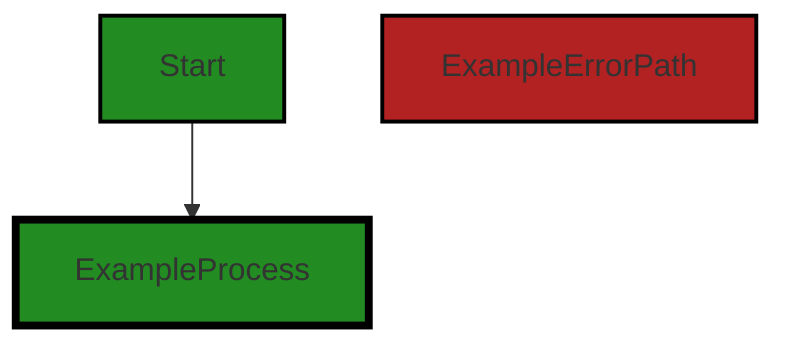

# Polyverse Boost-generated Source Analysis Details

## Source: ./data/dynamodb/reservedwords.go
Date Generated: Wednesday, September 6, 2023 at 11:52:34 PM PDT


---

### Boost Architectural Quick Summary Security Report

Last Updated: Friday, September 8, 2023 at 3:07:37 PM PDT


Executive Report:

1. **Architectural Impact**: The analysis of this file has not revealed any severe issues.
2. **Risk Analysis**: The analysis of this file has not revealed any severe issues.
3. **Potential Customer Impact**: Based on the analysis, there are no severe issues that could potentially impact customers.
4. **Performance Issues**: Our analysis did not identify any explicit performance issues in the file.
5. **Risk Assessment**: Based on the current analysis of this file, no severe issues have been found. However, this doesn't guarantee that the file is risk-free.

Highlights:

- No severe issues were identified in the current analysis of this file.


---

### Boost Architectural Quick Summary Performance Report

Last Updated: Friday, September 8, 2023 at 3:07:44 PM PDT


Executive Report:

1. **Architectural Impact**: The analysis of this file has not revealed any severe issues.
2. **Risk Analysis**: The analysis of this file has not revealed any severe issues.
3. **Potential Customer Impact**: Based on the analysis, there are no severe issues that could potentially impact customers.
4. **Performance Issues**: Our analysis did not identify any explicit performance issues in the file.
5. **Risk Assessment**: Based on the current analysis of this file, no severe issues have been found. However, this doesn't guarantee that the file is risk-free.

Highlights:

- No severe issues were identified in the current analysis of this file.


---

### Boost Architectural Quick Summary Compliance Report

Last Updated: Friday, September 8, 2023 at 3:07:51 PM PDT


Executive Report:

1. **Architectural Impact**: The analysis of this file has not revealed any severe issues.
2. **Risk Analysis**: The analysis of this file has not revealed any severe issues.
3. **Potential Customer Impact**: Based on the analysis, there are no severe issues that could potentially impact customers.
4. **Performance Issues**: Our analysis did not identify any explicit performance issues in the file.
5. **Risk Assessment**: Based on the current analysis of this file, no severe issues have been found. However, this doesn't guarantee that the file is risk-free.

Highlights:

- No severe issues were identified in the current analysis of this file.

---
## Detailed Analysis:

### Cell 0:
## Original Code:

### Programming Language: go
### ./data/dynamodb/reservedwords.go 

```go
package dynamodb

var reservedWords = createReservedWords("ABORT", "ABSOLUTE", "ACTION", "ADD", "AFTER", "AGENT", "AGGREGATE", "ALL", "ALLOCATE", "ALTER", "ANALYZE", "AND", "ANY", "ARCHIVE", "ARE", "ARRAY", "AS", "ASC", "ASCII", "ASENSITIVE", "ASSERTION", "ASYMMETRIC", "AT", "ATOMIC", "ATTACH", "ATTRIBUTE", "AUTH", "AUTHORIZATION", "AUTHORIZE", "AUTO", "AVG", "BACK", "BACKUP", "BASE", "BATCH", "BEFORE", "BEGIN", "BETWEEN", "BIGINT", "BINARY", "BIT", "BLOB", "BLOCK", "BOOLEAN", "BOTH", "BREADTH", "BUCKET", "BULK", "BY", "BYTE", "CALL", "CALLED", "CALLING", "CAPACITY", "CASCADE", "CASCADED", "CASE", "CAST", "CATALOG", "CHAR", "CHARACTER", "CHECK", "CLASS", "CLOB", "CLOSE", "CLUSTER", "CLUSTERED", "CLUSTERING", "CLUSTERS", "COALESCE", "COLLATE", "COLLATION", "COLLECTION", "COLUMN", "COLUMNS", "COMBINE", "COMMENT", "COMMIT", "COMPACT", "COMPILE", "COMPRESS", "CONDITION", "CONFLICT", "CONNECT", "CONNECTION", "CONSISTENCY", "CONSISTENT", "CONSTRAINT", "CONSTRAINTS", "CONSTRUCTOR", "CONSUMED", "CONTINUE", "CONVERT", "COPY", "CORRESPONDING", "COUNT", "COUNTER", "CREATE", "CROSS", "CUBE", "CURRENT", "CURSOR", "CYCLE", "DATA", "DATABASE", "DATE", "DATETIME", "DAY", "DEALLOCATE", "DEC", "DECIMAL", "DECLARE", "DEFAULT", "DEFERRABLE", "DEFERRED", "DEFINE", "DEFINED", "DEFINITION", "DELETE", "DELIMITED", "DEPTH", "DEREF", "DESC", "DESCRIBE", "DESCRIPTOR", "DETACH", "DETERMINISTIC", "DIAGNOSTICS", "DIRECTORIES", "DISABLE", "DISCONNECT", "DISTINCT", "DISTRIBUTE", "DO", "DOMAIN", "DOUBLE", "DROP", "DUMP", "DURATION", "DYNAMIC", "EACH", "ELEMENT", "ELSE", "ELSEIF", "EMPTY", "ENABLE", "END", "EQUAL", "EQUALS", "ERROR", "ESCAPE", "ESCAPED", "EVAL", "EVALUATE", "EXCEEDED", "EXCEPT", "EXCEPTION", "EXCEPTIONS", "EXCLUSIVE", "EXEC", "EXECUTE", "EXISTS", "EXIT", "EXPLAIN", "EXPLODE", "EXPORT", "EXPRESSION", "EXTENDED", "EXTERNAL", "EXTRACT", "FAIL", "FALSE", "FAMILY", "FETCH", "FIELDS", "FILE", "FILTER", "FILTERING", "FINAL", "FINISH", "FIRST", "FIXED", "FLATTERN", "FLOAT", "FOR", "FORCE", "FOREIGN", "FORMAT", "FORWARD", "FOUND", "FREE", "FROM", "FULL", "FUNCTION", "FUNCTIONS", "GENERAL", "GENERATE", "GET", "GLOB", "GLOBAL", "GO", "GOTO", "GRANT", "GREATER", "GROUP", "GROUPING", "HANDLER", "HASH", "HAVE", "HAVING", "HEAP", "HIDDEN", "HOLD", "HOUR", "IDENTIFIED", "IDENTITY", "IF", "IGNORE", "IMMEDIATE", "IMPORT", "IN", "INCLUDING", "INCLUSIVE", "INCREMENT", "INCREMENTAL", "INDEX", "INDEXED", "INDEXES", "INDICATOR", "INFINITE", "INITIALLY", "INLINE", "INNER", "INNTER", "INOUT", "INPUT", "INSENSITIVE", "INSERT", "INSTEAD", "INT", "INTEGER", "INTERSECT", "INTERVAL", "INTO", "INVALIDATE", "IS", "ISOLATION", "ITEM", "ITEMS", "ITERATE", "JOIN", "KEY", "KEYS", "LAG", "LANGUAGE", "LARGE", "LAST", "LATERAL", "LEAD", "LEADING", "LEAVE", "LEFT", "LENGTH", "LESS", "LEVEL", "LIKE", "LIMIT", "LIMITED", "LINES", "LIST", "LOAD", "LOCAL", "LOCALTIME", "LOCALTIMESTAMP", "LOCATION", "LOCATOR", "LOCK", "LOCKS", "LOG", "LOGED", "LONG", "LOOP", "LOWER", "MAP", "MATCH", "MATERIALIZED", "MAX", "MAXLEN", "MEMBER", "MERGE", "METHOD", "METRICS", "MIN", "MINUS", "MINUTE", "MISSING", "MOD", "MODE", "MODIFIES", "MODIFY", "MODULE", "MONTH", "MULTI", "MULTISET", "NAME", "NAMES", "NATIONAL", "NATURAL", "NCHAR", "NCLOB", "NEW", "NEXT", "NO", "NONE", "NOT", "NULL", "NULLIF", "NUMBER", "NUMERIC", "OBJECT", "OF", "OFFLINE", "OFFSET", "OLD", "ON", "ONLINE", "ONLY", "OPAQUE", "OPEN", "OPERATOR", "OPTION", "OR", "ORDER", "ORDINALITY", "OTHER", "OTHERS", "OUT", "OUTER", "OUTPUT", "OVER", "OVERLAPS", "OVERRIDE", "OWNER", "PAD", "PARALLEL", "PARAMETER", "PARAMETERS", "PARTIAL", "PARTITION", "PARTITIONED", "PARTITIONS", "PATH", "PERCENT", "PERCENTILE", "PERMISSION", "PERMISSIONS", "PIPE", "PIPELINED", "PLAN", "POOL", "POSITION", "PRECISION", "PREPARE", "PRESERVE", "PRIMARY", "PRIOR", "PRIVATE", "PRIVILEGES", "PROCEDURE", "PROCESSED", "PROJECT", "PROJECTION", "PROPERTY", "PROVISIONING", "PUBLIC", "PUT", "QUERY", "QUIT", "QUORUM", "RAISE", "RANDOM", "RANGE", "RANK", "RAW", "READ", "READS", "REAL", "REBUILD", "RECORD", "RECURSIVE", "REDUCE", "REF", "REFERENCE", "REFERENCES", "REFERENCING", "REGEXP", "REGION", "REINDEX", "RELATIVE", "RELEASE", "REMAINDER", "RENAME", "REPEAT", "REPLACE", "REQUEST", "RESET", "RESIGNAL", "RESOURCE", "RESPONSE", "RESTORE", "RESTRICT", "RESULT", "RETURN", "RETURNING", "RETURNS", "REVERSE", "REVOKE", "RIGHT", "ROLE", "ROLES", "ROLLBACK", "ROLLUP", "ROUTINE", "ROW", "ROWS", "RULE", "RULES", "SAMPLE", "SATISFIES", "SAVE", "SAVEPOINT", "SCAN", "SCHEMA", "SCOPE", "SCROLL", "SEARCH", "SECOND", "SECTION", "SEGMENT", "SEGMENTS", "SELECT", "SELF", "SEMI", "SENSITIVE", "SEPARATE", "SEQUENCE", "SERIALIZABLE", "SESSION", "SET", "SETS", "SHARD", "SHARE", "SHARED", "SHORT", "SHOW", "SIGNAL", "SIMILAR", "SIZE", "SKEWED", "SMALLINT", "SNAPSHOT", "SOME", "SOURCE", "SPACE", "SPACES", "SPARSE", "SPECIFIC", "SPECIFICTYPE", "SPLIT", "SQL", "SQLCODE", "SQLERROR", "SQLEXCEPTION", "SQLSTATE", "SQLWARNING", "START", "STATE", "STATIC", "STATUS", "STORAGE", "STORE", "STORED", "STREAM", "STRING", "STRUCT", "STYLE", "SUB", "SUBMULTISET", "SUBPARTITION", "SUBSTRING", "SUBTYPE", "SUM", "SUPER", "SYMMETRIC", "SYNONYM", "SYSTEM", "TABLE", "TABLESAMPLE", "TEMP", "TEMPORARY", "TERMINATED", "TEXT", "THAN", "THEN", "THROUGHPUT", "TIME", "TIMESTAMP", "TIMEZONE", "TINYINT", "TO", "TOKEN", "TOTAL", "TOUCH", "TRAILING", "TRANSACTION", "TRANSFORM", "TRANSLATE", "TRANSLATION", "TREAT", "TRIGGER", "TRIM", "TRUE", "TRUNCATE", "TTL", "TUPLE", "TYPE", "UNDER", "UNDO", "UNION", "UNIQUE", "UNIT", "UNKNOWN", "UNLOGGED", "UNNEST", "UNPROCESSED", "UNSIGNED", "UNTIL", "UPDATE", "UPPER", "URL", "USAGE", "USE", "USER", "USERS", "USING", "UUID", "VACUUM", "VALUE", "VALUED", "VALUES", "VARCHAR", "VARIABLE", "VARIANCE", "VARINT", "VARYING", "VIEW", "VIEWS", "VIRTUAL", "VOID", "WAIT", "WHEN", "WHENEVER", "WHERE", "WHILE", "WINDOW", "WITH", "WITHIN", "WITHOUT", "WORK", "WRAPPED", "WRITE", "YEAR", "ZONE ", "")

func createReservedWords(reservedWords ...string) map[string]bool {
 m := map[string]bool{}

 for _, v := range reservedWords {
  m[v] = true
 }

 return m
}

```
## Boost Analysis:


---

### Boost Code Explanation

Last Updated: Wednesday, September 6, 2023 at 11:51:14 PM PDT

This code is written in Go programming language and is part of a package named `dynamodb`. It is used to create a map of reserved words in DynamoDB, which is a NoSQL database service provided by Amazon Web Services (AWS). 

The code defines a variable `reservedWords` which is a map of string keys to boolean values. The map is created by calling the `createReservedWords` function with a long list of string arguments that represent the reserved words in DynamoDB.

The `createReservedWords` function takes a variadic parameter `reservedWords` of type string. This means the function can accept any number of string arguments. It then initializes an empty map `m` with string keys and boolean values.

The function then iterates over the `reservedWords` slice, and for each word, it adds it to the map `m` with the value `true`. This is done using a `for` loop with `range` which returns the index and value of each item in the slice. The index is ignored using the blank identifier `_`, and the value `v` is used as the key in the map.

Finally, the function returns the map `m`.

The result is a map where each key is a reserved word and the corresponding value is `true`. This map can be used to quickly check if a word is a reserved word in DynamoDB by looking up the word in the map and checking if the returned value is `true`.

For more information on DynamoDB reserved words, you can refer to the following resource:
- [Reserved Words in DynamoDB](https://docs.aws.amazon.com/amazondynamodb/latest/developerguide/ReservedWords.html) 

For more information on Go maps and variadic functions, you can refer to the following resources:
- [Go Maps](https://blog.golang.org/maps)
- [Go Variadic Functions](https://gobyexample.com/variadic-functions)


---

### Boost Flow Diagram

Last Updated: Wednesday, September 6, 2023 at 11:51:24 PM PDT




---

### Boost Source-Level Security Analysis

Last Updated: Wednesday, September 6, 2023 at 11:51:33 PM PDT

**No bugs found**


---

### Boost Source-Level Performance Analysis

Last Updated: Wednesday, September 6, 2023 at 11:52:15 PM PDT

1. **Severity**: 2/10

   **Line Number**: 2

   **Bug Type**: Memory

   **Description**: The reservedWords variable is a large map stored in memory. If the application has a small memory footprint, this could potentially take up a significant portion of available memory.

   **Solution**: Consider storing the reserved words in a more memory-efficient data structure such as a Trie or Bloom filter. Alternatively, if the list of reserved words is static and does not change, consider storing it in a file and reading it when needed. Here is a guide on how to use a Trie in Go: https://github.com/derekparker/trie


2. **Severity**: 1/10

   **Line Number**: 2

   **Bug Type**: CPU

   **Description**: The creation of the reservedWords map is done during package initialization. This means that the map is created every time the package is imported, which could potentially lead to unnecessary CPU usage if the package is imported frequently.

   **Solution**: If the list of reserved words is static and does not change, consider creating the map once and storing it in a file. You can then read the map from the file when needed. This will reduce CPU usage as the map will only be created once.


---

### Boost Source-Level Data and Privacy Compliance Analysis

Last Updated: Wednesday, September 6, 2023 at 11:52:34 PM PDT

1. **Severity**: 3/10

   **Line Number**: 1

   **Bug Type**: Data Compliance

   **Description**: The code does not directly deal with sensitive data or privacy-related functions. However, it is part of the DynamoDB handling system and could indirectly affect data compliance if not properly used.

   **Solution**: Ensure that any data handled through DynamoDB is compliant with GDPR, PCI DSS, and HIPAA guidelines. This includes proper encryption of sensitive data, obtaining necessary consent, data minimization, etc.


