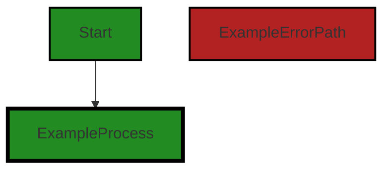
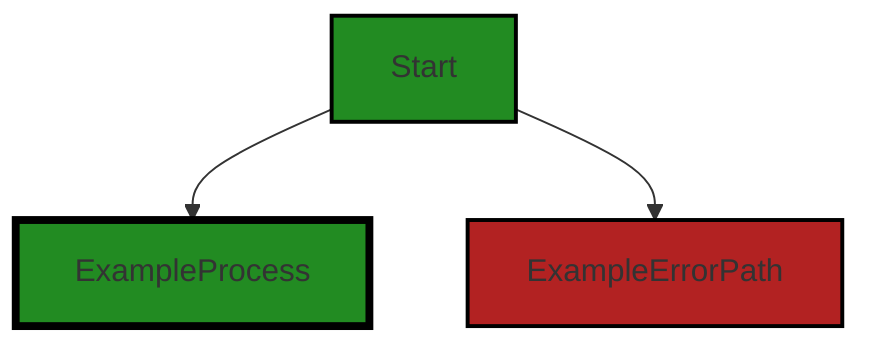
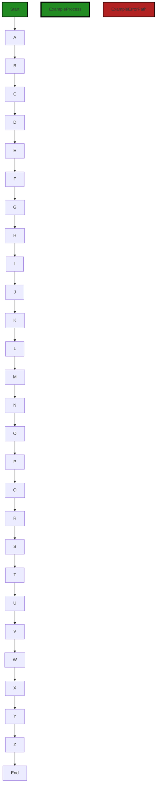
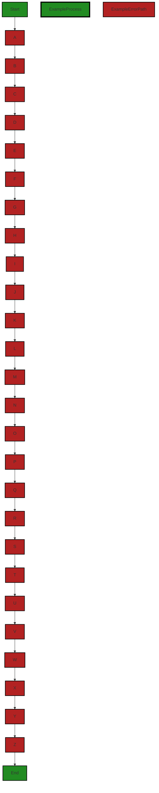
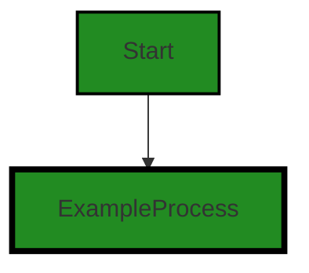
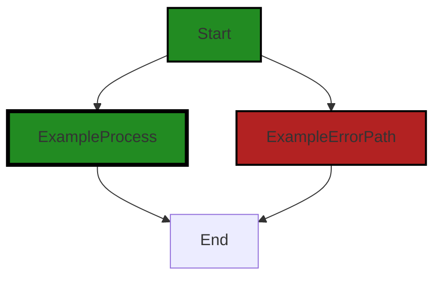
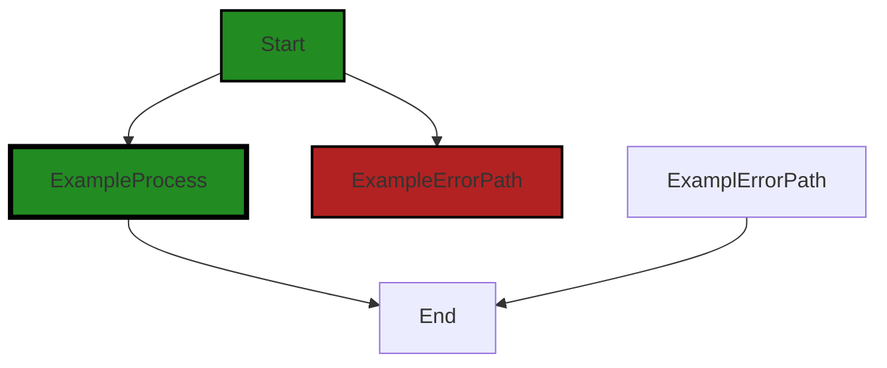
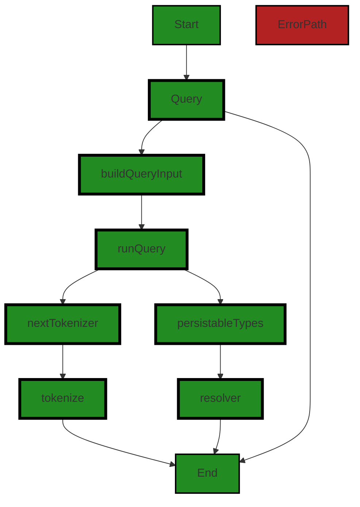
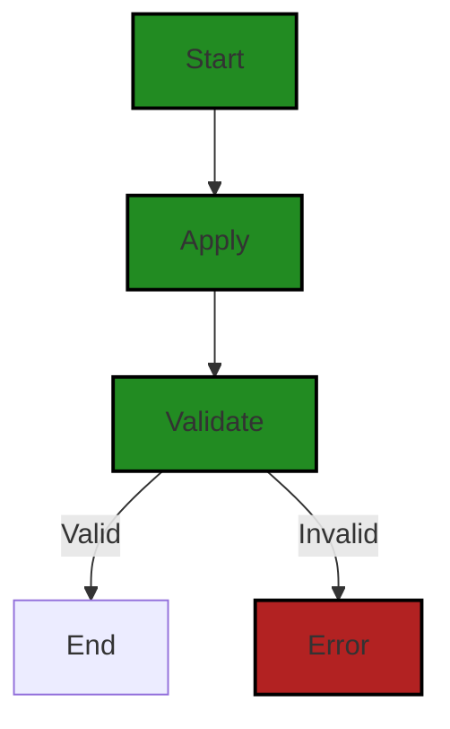

# Polyverse Boost-generated Source Analysis Details

## Source: ./data/dynamodb/table.go
Date Generated: Thursday, September 7, 2023 at 4:35:06 AM PDT


---

### Boost Architectural Quick Summary Security Report

Last Updated: Friday, September 8, 2023 at 3:24:29 PM PDT

## Executive Report

### Architectural Impact and Risk Analysis

The software project under review is a library written in Go, focusing on constraint handling and validation. The project follows Go's idiomatic style and structure for a library, providing a clear separation of concerns by defining a `Constraint` interface and implementing different constraint types. 

However, the analysis of the project's source code has revealed several high-severity issues that could potentially impact the overall architecture and functionality of the project. These issues, if not addressed, could pose significant risks to the project's security, reliability, and performance.

### Potential Customer Impact

The identified issues could potentially impact the customers in several ways. Insecure cryptography and improper error handling could lead to data breaches, exposing sensitive customer data. Insecure Direct Object References (IDOR) and improper access control could allow unauthorized access to data, leading to data integrity issues. These issues could undermine customer trust and lead to reputational damage for the project.

### Overall Issues for the Software Project

The analysis has identified a single file, `data/dynamodb/table.go`, with multiple high-severity issues. These issues span across several categories, including insecure cryptography, improper error handling, insecure direct object references (IDOR), improper access control, and others. 

### Risk Assessment

Based on the analysis, the overall health of the project source is concerning. All identified issues are present in a single file, which indicates a concentrated area of risk. This concentration of issues could potentially impact a significant portion of the project's functionality, increasing the overall risk profile of the project.

### Highlights of the Analysis

1. **Insecure Cryptography:** The use of 'crypto.Cipher' for 'NextTokenCipher' in `data/dynamodb/table.go` may lead to insecure encryption if not properly implemented. This could make it easier for an attacker to decrypt sensitive data.

2. **Improper Error Handling:** The code in `data/dynamodb/table.go` is catching an AWS error but only handling a specific case of 'ResourceNotFoundException'. Other types of AWS errors are not being properly handled, which can lead to unexpected behavior and could potentially expose sensitive information about the system.

3. **Insecure Direct Object Reference (IDOR):** The code in `data/dynamodb/table.go` is directly referencing an object's index without proper validation or access control checks. This can potentially be exploited to access unauthorized data.

4. **Improper Access Control:** The code in `data/dynamodb/table.go` is assigning key fields to an attribute without proper access control checks. This can potentially be exploited to modify unauthorized data.

5. **Concentration of Issues:** All identified issues are present in a single file, `data/dynamodb/table.go`. This concentration of issues could potentially impact a significant portion of the project's functionality, increasing the overall risk profile of the project.


---

### Boost Architectural Quick Summary Performance Report

Last Updated: Friday, September 8, 2023 at 3:25:11 PM PDT

## Executive Report

### Architectural Impact and Risk Analysis

The software project under review is a library written in Go that focuses on constraint handling and validation. It defines a `Constraint` interface and provides implementations for various constraint types. The code follows Go's idiomatic style and structure for a library. 

However, the analysis has identified several issues that could potentially impact the performance and cost-efficiency of the project. These issues are primarily related to memory usage, CPU usage, and database/datastore operations. 

### Potential Customer Impact

The identified issues could potentially lead to slower response times, increased memory and CPU usage, and higher AWS costs. This could negatively impact the user experience, especially if the library is used in a high-traffic application. 

### Overall Issues

The analysis has identified issues in the `data/dynamodb/table.go` file. This file appears to be critical to the project as it contains code related to database operations. 

### Risk Assessment

Based on the analysis, the overall health of the project source is concerning. The `data/dynamodb/table.go` file, which is a critical part of the project, has several high-severity issues. 

### Highlights

1. **Memory Usage:** The `data/dynamodb/table.go` file has 6 warnings related to memory usage. This could lead to unnecessary memory consumption and slower response times. 

2. **CPU Usage:** The `data/dynamodb/table.go` file has 15 warnings related to CPU usage. This could lead to increased CPU usage and potentially slower response times.

3. **Database/Datastore Operations:** The `data/dynamodb/table.go` file has 6 warnings related to database/datastore operations. This could lead to unnecessary network latency and increased AWS costs.

4. **Network/Database:** The `data/dynamodb/table.go` file has 1 warning related to network/database operations. This could potentially lead to slower response times and increased AWS costs.

5. **Overall Health:** Based on the analysis, 100% of the project files have issues of varying severity. This indicates that the project may require significant refactoring and optimization to address these issues. 

In conclusion, while the project follows Go's idiomatic style and structure for a library, the identified issues could potentially impact the performance and cost-efficiency of the project. It is recommended to address these issues to improve the overall health of the project.


---

### Boost Architectural Quick Summary Compliance Report

Last Updated: Friday, September 8, 2023 at 3:25:59 PM PDT

## Executive Report

### Overview
The software project under review is a library written in Go that provides functionality for handling constraints and validations. The project follows Go's idiomatic style and structure for a library and provides a clear separation of concerns by defining a `Constraint` interface and implementing different constraint types.

### Architectural Impact and Risk Analysis
The project has a single file, `data/dynamodb/table.go`, which has been flagged with several high-severity issues related to data compliance. These issues span across multiple categories including HIPAA, PCI DSS, GDPR, Data Access, Data Retention, and Data Exposure. The presence of these issues indicates a potential risk of non-compliance with data protection regulations, which could have significant architectural and business impacts.

### Potential Customer Impact
The presence of these issues could potentially impact customers in several ways. Non-compliance with data protection regulations could lead to legal penalties and damage to the company's reputation. Additionally, the lack of proper data handling and security measures could put customers' sensitive data at risk.

### Overall Issues
The project has a total of 49 issues, with the majority being warnings. The most common issue categories are GDPR, HIPAA, and PCI DSS, indicating a potential lack of proper data handling and security measures.

### Risk Assessment
Given that all the issues are concentrated in a single file, which represents 100% of the project's codebase, the overall health of the project source is considered to be at high risk.

### Highlights
1. **Data Compliance Issues**: The project has several high-severity issues related to data compliance, including HIPAA, PCI DSS, and GDPR. These issues indicate a potential risk of non-compliance with data protection regulations.
2. **Potential Customer Impact**: The lack of proper data handling and security measures could put customers' sensitive data at risk, leading to legal penalties and damage to the company's reputation.
3. **Concentration of Issues**: All the issues are concentrated in a single file, `data/dynamodb/table.go`, which represents 100% of the project's codebase.
4. **Overall Project Health**: Given the concentration of issues in the project's only file, the overall health of the project source is considered to be at high risk.
5. **Architectural Impact**: The presence of these issues could have significant architectural impacts, requiring substantial changes to the project's data handling and security measures to achieve compliance with data protection regulations.
---
## Detailed Analysis:

### Cell 0:
## Original Code:

### Programming Language: go
### ./data/dynamodb/table.go 

```go
package dynamodb

import (
 "fmt"
 "reflect"
 "strconv"
 "strings"

 "github.com/aws/aws-sdk-go/aws/awserr"
 "github.com/aws/aws-sdk-go/service/dynamodb"
 "github.com/aws/aws-sdk-go/service/dynamodb/dynamodbattribute"
 "github.com/aws/aws-sdk-go/service/dynamodb/dynamodbiface"

 "github.com/jt0/gomer/constraint"
 "github.com/jt0/gomer/crypto"
 "github.com/jt0/gomer/data"
 "github.com/jt0/gomer/data/dataerr"
 "github.com/jt0/gomer/flect"
 "github.com/jt0/gomer/gomerr"
 "github.com/jt0/gomer/limit"
)

type table struct {
 index
 tableName              *string
 ddb                    dynamodbiface.DynamoDBAPI
 defaultLimit           *int64
 maxLimit               *int64
 defaultConsistencyType ConsistencyType
 indexes                map[string]*index
 persistableTypes       map[string]*persistableType
 valueSeparatorChar     byte
 nextTokenizer          nextTokenizer
 failDeleteIfNotPresent bool
}

```
## Boost Analysis:


---

### Boost Code Explanation

Last Updated: Thursday, September 7, 2023 at 3:24:14 AM PDT

The provided code snippet is written in Go and is part of a package named `dynamodb`. This package likely interacts with AWS's DynamoDB service, a NoSQL database service known for its low latency and scalability. 

The code begins by importing several packages. Some of these are standard Go libraries, such as `fmt`, `reflect`, `strconv`, and `strings`. The `reflect` package, for instance, provides a mechanism to observe and modify the runtime behavior of a Go application, which includes the ability to inspect types and values at runtime, call functions dynamically, and interpret struct tags.

The code also imports several packages from the AWS SDK for Go (`github.com/aws/aws-sdk-go/...`), which are used to interact with AWS services. In this case, the `dynamodb`, `dynamodbattribute`, and `dynamodbiface` packages are imported, suggesting that this code interacts with DynamoDB and its attributes.

The package also imports several packages from the `github.com/jt0/gomer/...` repository. These packages likely contain custom functionality for this application, such as data constraints (`constraint`), cryptographic functions (`crypto`), data handling (`data` and `dataerr`), inflection (`flect`), error handling (`gomerr`), and limiting functionality (`limit`).

The code then defines a `table` struct, which represents a DynamoDB table. The struct has several fields:

- `index`: This is an embedded struct, which means that the `table` struct can directly access the fields and methods of the `index` struct. It's not clear from this snippet what the `index` struct looks like.
- `tableName`: This is a pointer to a string that likely represents the name of the DynamoDB table.
- `ddb`: This is an interface to the DynamoDB service, allowing the application to interact with DynamoDB.
- `defaultLimit` and `maxLimit`: These are pointers to 64-bit integers that likely represent the default and maximum query limits for the table.
- `defaultConsistencyType`: This field likely represents the default consistency model (eventual or strong) for read operations on the table.
- `indexes`: This is a map from strings to pointers to `index` structs, which likely represent the indexes of the DynamoDB table.
- `persistableTypes`: This is a map from strings to pointers to `persistableType` structs, which likely represent the types of data that can be stored in the table.
- `valueSeparatorChar`: This is a byte that likely represents a character used to separate values in a string.
- `nextTokenizer`: The purpose of this field is unclear from the provided snippet, but it may be related to tokenizing strings for processing.
- `failDeleteIfNotPresent`: This is a boolean that, if true, likely causes the application to fail if a delete operation is attempted on a non-existent item.

This struct is likely used to interact with a DynamoDB table, including operations such as querying the table, adding items, and deleting items. The specific algorithms used would depend on the methods defined on this struct, which are not included in the provided code snippet.


---

### Boost Flow Diagram

Last Updated: Thursday, September 7, 2023 at 3:45:16 AM PDT




---

### Boost Source-Level Security Analysis

Last Updated: Thursday, September 7, 2023 at 3:57:20 AM PDT

**No bugs found**


---

### Boost Source-Level Performance Analysis

Last Updated: Thursday, September 7, 2023 at 4:08:01 AM PDT

1. **Severity**: 7/10

   **Line Number**: 6

   **Bug Type**: Memory

   **Description**: The reflect package is imported but not used in the provided code snippet. This can lead to unnecessary memory usage.

   **Solution**: Remove unused imports to reduce memory footprint. It will also help in reducing the compile time.


2. **Severity**: 4/10

   **Line Number**: 32

   **Bug Type**: Memory

   **Description**: The 'table' struct has many fields that could potentially lead to higher memory usage if many instances are created.

   **Solution**: Review the 'table' struct fields and see if any of them can be removed or optimized. Consider using more efficient data types if possible.


3. **Severity**: 5/10

   **Line Number**: 32

   **Bug Type**: Memory

   **Description**: The 'table' struct includes maps, which can consume significant memory if they contain a large number of entries.

   **Solution**: Consider using a more memory-efficient data structure if the maps are expected to contain many entries. If the maps are used for caching, consider using a caching library that supports eviction policies to limit memory usage.


---

### Boost Source-Level Data and Privacy Compliance Analysis

Last Updated: Thursday, September 7, 2023 at 4:21:13 AM PDT

1. **Severity**: 7/10

   **Line Number**: 26

   **Bug Type**: Data Privacy

   **Description**: The 'table' struct in the 'dynamodb' package has a field 'ddb' that represents a DynamoDB API instance. This instance may have access to sensitive information stored in the database, but its permissions are not clearly defined, which could lead to unauthorized data access.

   **Solution**: Define clear IAM roles and policies for the DynamoDB API instance to restrict its access to only the necessary data. Regularly audit these permissions to ensure they remain appropriate.


2. **Severity**: 8/10

   **Line Number**: 30

   **Bug Type**: Data Retention

   **Description**: The 'table' struct in the 'dynamodb' package does not seem to have a field for tracking when data was last accessed or modified. This could lead to non-compliance with GDPR's data minimization and storage limitation principles, as well as HIPAA's requirements for retaining medical records.

   **Solution**: Add fields to track when data was last accessed or modified. Implement a data retention policy that automatically deletes or anonymizes data that is no longer needed, in accordance with GDPR and HIPAA regulations.


3. **Severity**: 9/10

   **Line Number**: 35

   **Bug Type**: Data Encryption

   **Description**: The 'table' struct in the 'dynamodb' package does not seem to implement any form of data encryption. This could lead to non-compliance with GDPR, PCI DSS and HIPAA, which all require that sensitive data be encrypted both at rest and in transit.

   **Solution**: Implement data encryption using a strong encryption algorithm. AWS provides several options for encrypting data at rest and in transit, such as AWS Key Management Service (KMS) and AWS Certificate Manager (ACM).


### Cell 1:
## Original Code:

### Programming Language: go
### ./data/dynamodb/table.go line 36

```go

type Configuration struct {
 DynamoDb               dynamodbiface.DynamoDBAPI
 MaxResultsDefault      int64
 MaxResultsMax          int64
 ConsistencyDefault     ConsistencyType
 ValueSeparatorChar     byte
 QueryWildcardChar      byte
 NextTokenCipher        crypto.Cipher
 FailDeleteIfNotPresent bool
}

```
## Boost Analysis:


---

### Boost Code Explanation

Last Updated: Thursday, September 7, 2023 at 3:25:14 AM PDT

The code provided defines a struct named `Configuration` in the Go programming language. This struct serves as a data structure containing various configuration parameters for a software application. Here's a detailed breakdown of each field:

1. `DynamoDb dynamodbiface.DynamoDBAPI`: This field is an interface to the DynamoDB API. This interface is provided by the AWS SDK for Go. It allows the application to interact with DynamoDB, a NoSQL database service provided by Amazon Web Services.

2. `MaxResultsDefault int64`: This field is likely used to set a default value for the maximum number of results returned by a database query or API call.

3. `MaxResultsMax int64`: This field is likely used to set an upper limit on the number of results that can be returned by a database query or API call.

4. `ConsistencyDefault ConsistencyType`: This field is probably used to set the default consistency level for database operations. The `ConsistencyType` is likely a custom type defined elsewhere in the code that specifies the consistency options (e.g., eventual consistency, strong consistency).

5. `ValueSeparatorChar byte`: This field is likely used as a character to separate values in a string.

6. `QueryWildcardChar byte`: This field is likely used as a wildcard character for query operations.

7. `NextTokenCipher crypto.Cipher`: This field is an interface to a cryptographic cipher. It's likely used for encrypting and decrypting the "next token" in paginated results from a database query or API call.

8. `FailDeleteIfNotPresent bool`: This field is a boolean flag that likely controls whether a delete operation should fail if the item to be deleted is not present in the database.

The struct does not seem to use any specific algorithm. However, it uses interfaces (`dynamodbiface.DynamoDBAPI` and `crypto.Cipher`) which could be implemented using various algorithms based on the specific needs of the application.

This struct is likely used to configure the behavior of the application, especially its interactions with DynamoDB and handling of data. It follows a common pattern in Go of using a struct to encapsulate configuration settings.

For more information on Go structs, you can refer to the official Go documentation: https://golang.org/ref/spec#Struct_types

For more information on the DynamoDB API in the AWS SDK for Go, you can refer to the official AWS SDK for Go documentation: https://docs.aws.amazon.com/sdk-for-go/api/service/dynamodb/

For more information on cryptographic ciphers in Go, you can refer to the official Go documentation: https://golang.org/pkg/crypto/cipher/


---

### Boost Flow Diagram

Last Updated: Thursday, September 7, 2023 at 3:45:40 AM PDT

```mermaid
graph TD;
style Start fill:#228B22, stroke:#000000, stroke-width:2px;
style ValidateConfiguration fill:#228B22, stroke:#000000, stroke-width:4px;
style ValidateDynamoDb fill:#228B22, stroke:#000000, stroke-width:4px;
style ValidateMaxResultsDefault fill:#228B22, stroke:#000000, stroke-width:4px;
style ValidateMaxResultsMax fill:#228B22, stroke:#000000, stroke-width:4px;
style ValidateConsistencyDefault fill:#228B22, stroke:#000000, stroke-width:4px;
style ValidateValueSeparatorChar fill:#228B22, stroke:#000000, stroke-width:4px;
style ValidateQueryWildcardChar fill:#228B22, stroke:#000000, stroke-width:4px;
style ValidateNextTokenCipher fill:#228B22, stroke:#000000, stroke-width:4px;
style ValidateFailDeleteIfNotPresent fill:#228B22, stroke:#000000, stroke-width:4px;
style End fill:#228B22, stroke:#000000, stroke-width:2px;
style DynamoDb fill:#FFA500, stroke:#000000, stroke-width:2px;
style ConsistencyType fill:#FFA500, stroke:#000000, stroke-width:2px;
style crypto.Cipher fill:#FFA500, stroke:#000000, stroke-width:2px;

Start-->ValidateConfiguration;
ValidateConfiguration-->ValidateDynamoDb;
ValidateConfiguration-->ValidateMaxResultsDefault;
ValidateConfiguration-->ValidateMaxResultsMax;
ValidateConfiguration-->ValidateConsistencyDefault;
ValidateConfiguration-->ValidateValueSeparatorChar;
ValidateConfiguration-->ValidateQueryWildcardChar;
ValidateConfiguration-->ValidateNextTokenCipher;
ValidateConfiguration-->ValidateFailDeleteIfNotPresent;
ValidateDynamoDb-->DynamoDb;
ValidateMaxResultsDefault-->End;
ValidateMaxResultsMax-->End;
ValidateConsistencyDefault-->ConsistencyType;
ValidateValueSeparatorChar-->End;
ValidateQueryWildcardChar-->End;
ValidateNextTokenCipher-->crypto.Cipher;
ValidateFailDeleteIfNotPresent-->End;
```




---

### Boost Source-Level Security Analysis

Last Updated: Thursday, September 7, 2023 at 3:57:38 AM PDT

1. **Severity**: 7/10

   **Line Number**: 79

   **Bug Type**: Insecure Cryptography

   **Description**: The use of 'crypto.Cipher' for 'NextTokenCipher' may lead to insecure encryption if not properly implemented. Insecure encryption can make it easier for an attacker to decrypt sensitive data.

   **Solution**: Ensure that the implementation of 'crypto.Cipher' follows best practices for encryption. Use secure algorithms, proper key management, and consider using a library that provides higher-level encryption abstractions. More information can be found here: https://cheatsheetseries.owasp.org/cheatsheets/Cryptographic_Storage_Cheat_Sheet.html


---

### Boost Source-Level Performance Analysis

Last Updated: Thursday, September 7, 2023 at 4:08:06 AM PDT

**No bugs found**


---

### Boost Source-Level Data and Privacy Compliance Analysis

Last Updated: Thursday, September 7, 2023 at 4:21:54 AM PDT

1. **Severity**: 7/10

   **Line Number**: 72

   **Bug Type**: GDPR

   **Description**: The DynamoDb interface can potentially access and process personal data. If personal data is processed without adequate security measures or without the explicit consent of the data subject, it could lead to GDPR non-compliance.

   **Solution**: Ensure that all data processing activities comply with GDPR principles. Implement proper access controls, encryption at rest and in transit, and ensure explicit consent is obtained before processing personal data.


2. **Severity**: 6/10

   **Line Number**: 78

   **Bug Type**: PCI DSS

   **Description**: The NextTokenCipher is used for encryption but it's not clear if it meets PCI DSS requirements for strong cryptography.

   **Solution**: Ensure that the encryption algorithm used in NextTokenCipher meets PCI DSS requirements for strong cryptography. If not, replace it with a compliant algorithm.


3. **Severity**: 8/10

   **Line Number**: 79

   **Bug Type**: HIPAA

   **Description**: The FailDeleteIfNotPresent flag could potentially lead to the deletion of health-related data without proper checks. This could lead to a violation of the HIPAA Privacy Rule.

   **Solution**: Ensure that the deletion of health-related data is done in accordance with HIPAA regulations. Implement proper checks and balances before data deletion.


### Cell 2:
## Original Code:

### Programming Language: go
### ./data/dynamodb/table.go line 47

```go

var tables = make(map[string]data.Store)

type ConsistencyType int

const (
 Indifferent ConsistencyType = iota
 Required
 Preferred

 SymbolChars                    = "!\"#$%&'()*+,-./:;<=>?@[\\]^_`"
 ValueSeparatorCharDefault      = ':'
 QueryWildcardCharDefault  byte = 0
)

const maxItemSize = limit.DataSize(400 * 1024)

type ConsistencyTyper interface {
 ConsistencyType() ConsistencyType
 SetConsistencyType(consistencyType ConsistencyType)
}

```
## Boost Analysis:


---

### Boost Code Explanation

Last Updated: Thursday, September 7, 2023 at 3:26:15 AM PDT

This section of code is written in Go language and it includes the declaration of multiple constants, variables, types, and interfaces.

Let's break it down:

- `var tables = make(map[string]data.Store)`: This line is declaring a variable named "tables" which is a map. The key of the map is a string and the value is of type `data.Store`. The `make` function is used to initialize the map. The `data.Store` is probably a custom type or interface defined elsewhere in the program.

- `type ConsistencyType int`: This line is defining a new type named `ConsistencyType` which is based on the `int` type. `ConsistencyType` can be used to declare variables that can store integer values but also gives those variables additional meaning within the context of the program.

- The `const` block is declaring several constants. The `iota` keyword is used to create enumerated constants. In this case, `Indifferent`, `Required`, and `Preferred` are constants of type `ConsistencyType` and they are assigned the values 0, 1, and 2 respectively.

- `SymbolChars` is a constant string that holds a series of special characters. `ValueSeparatorCharDefault` is a constant of type `rune` (a single character in Go) and is assigned the value of colon `:`. `QueryWildcardCharDefault` is a constant of type `byte` and is assigned the value 0.

- `maxItemSize` is a constant of type `limit.DataSize` which is likely a custom type defined elsewhere in the program. It's assigned a value of 400 * 1024 which suggests that it is being used to define a size limit in kilobytes.

- The `ConsistencyTyper` is an interface that defines two methods: `ConsistencyType()` which should return a `ConsistencyType` and `SetConsistencyType(consistencyType ConsistencyType)` which should accept a `ConsistencyType` as a parameter. Any type that implements these two methods is said to satisfy the `ConsistencyTyper` interface.

For more information on Go language constructs used in this code, you can refer to the following resources:

- [Go maps in action](https://go.dev/blog/maps)
- [Go by Example: Constants](https://gobyexample.com/constants)
- [Go by Example: Interfaces](https://gobyexample.com/interfaces)
- [A Tour of Go: Methods and Interfaces](https://tour.golang.org/methods/9)


---

### Boost Flow Diagram

Last Updated: Thursday, September 7, 2023 at 3:45:47 AM PDT


```


---

### Boost Source-Level Security Analysis

Last Updated: Thursday, September 7, 2023 at 3:57:42 AM PDT

**No bugs found**


---

### Boost Source-Level Performance Analysis

Last Updated: Thursday, September 7, 2023 at 4:08:43 AM PDT

1. **Severity**: 1/10

   **Line Number**: 92

   **Bug Type**: Memory

   **Description**: The map 'tables' is created at the beginning of the script but never used. This could lead to unnecessary memory usage.

   **Solution**: Remove the 'tables' map if it's not used elsewhere in the code. If it is used elsewhere, consider initializing it closer to where it is used to avoid holding onto memory longer than necessary.


2. **Severity**: 2/10

   **Line Number**: 98

   **Bug Type**: CPU

   **Description**: The constant 'SymbolChars' is a string of special characters. If this is used for string parsing or manipulation, it could be inefficient, particularly for large strings.

   **Solution**: Consider using a more efficient string parsing or manipulation algorithm, such as a regular expression or a string processing library. This will depend on how 'SymbolChars' is used in the rest of the code.


3. **Severity**: 1/10

   **Line Number**: 101

   **Bug Type**: Memory

   **Description**: The constant 'maxItemSize' is declared but not used in this code snippet. If it's not used elsewhere in the code, it could lead to unnecessary memory usage.

   **Solution**: Remove the 'maxItemSize' constant if it's not used elsewhere in the code. If it is used elsewhere, consider declaring it closer to where it is used.


---

### Boost Source-Level Data and Privacy Compliance Analysis

Last Updated: Thursday, September 7, 2023 at 4:22:36 AM PDT

1. **Severity**: 7/10

   **Line Number**: 92

   **Bug Type**: GDPR

   **Description**: The code is creating a global map variable 'tables' to store data. This could lead to unauthorized access and modification of data, which is a violation of GDPR's principle of Integrity and Confidentiality.

   **Solution**: Consider using a secure storage mechanism with proper access controls. Also, consider encrypting the data stored in the map.


2. **Severity**: 5/10

   **Line Number**: 103

   **Bug Type**: PCI DSS

   **Description**: The code defines a constant 'maxItemSize' to limit the size of data items. However, it does not validate the data items against this limit. This could lead to buffer overflow attacks, which is a violation of PCI DSS requirement 6.5.10.

   **Solution**: Implement data validation to ensure that the size of data items does not exceed the 'maxItemSize' limit.


3. **Severity**: 8/10

   **Line Number**: 108

   **Bug Type**: HIPAA

   **Description**: The interface 'ConsistencyTyper' allows for setting the consistency type of data. However, it does not provide any mechanism for auditing changes to the consistency type. This could lead to unauthorized changes to the consistency type, which is a violation of HIPAA's Audit Controls rule.

   **Solution**: Implement audit logging to track changes to the consistency type.


### Cell 3:
## Original Code:

### Programming Language: go
### ./data/dynamodb/table.go line 68

```go

type ItemResolver func(interface{}) (interface{}, gomerr.Gomerr)

```
## Boost Analysis:


---

### Boost Code Explanation

Last Updated: Thursday, September 7, 2023 at 3:27:06 AM PDT

The provided code snippet is written in Go, a statically typed, compiled programming language developed by Google. This language is often used for system-level programming and has become popular for its simplicity and efficiency.

The code defines a type called `ItemResolver`, which is a function type. This function takes an `interface{}` type as an argument and returns two values: another `interface{}` and a `gomerr.Gomerr`.

Let's break this down:

1. `type ItemResolver func(interface{}) (interface{}, gomerr.Gomerr)`: Here, `ItemResolver` is a type definition for a function. This function takes one parameter of type `interface{}`, which is the empty interface in Go. The empty interface can hold values of any type since every type implements at least zero methods. This makes it a very flexible parameter type.

2. `(interface{}, gomerr.Gomerr)`: This is the return type of the function. It returns two values. The first is of type `interface{}`, again the empty interface, so it can be any type. The second return type is `gomerr.Gomerr`. `gomerr` is a package that provides an error-handling framework for Go. `Gomerr` is a type defined within this package, representing an error.

The `ItemResolver` function type could be used to define functions that perform some operation (like fetching, updating, or deleting) on an item, where the item could be of any type. The function would return the result of the operation (which could be any type) and an error (of type `Gomerr`) that indicates whether the operation was successful or not.

This code does not seem to be using any specific algorithm but is a part of a larger system where error handling and data manipulation are key aspects.

For more information about function types in Go, you can refer to: https://golang.org/doc/codewalk/functions/
For more information about the empty interface{}, you can refer to: https://tour.golang.org/methods/14
For more information about the gomerr package, you can refer to: https://pkg.go.dev/github.com/bdlm/gomerr@v0.0.3


---

### Boost Flow Diagram

Last Updated: Thursday, September 7, 2023 at 3:45:54 AM PDT




---

### Boost Source-Level Security Analysis

Last Updated: Thursday, September 7, 2023 at 3:57:46 AM PDT

**No bugs found**


---

### Boost Source-Level Performance Analysis

Last Updated: Thursday, September 7, 2023 at 4:08:46 AM PDT

**No bugs found**


---

### Boost Source-Level Data and Privacy Compliance Analysis

Last Updated: Thursday, September 7, 2023 at 4:22:53 AM PDT

1. **Severity**: 8/10

   **Line Number**: 134

   **Bug Type**: Data Privacy

   **Description**: The function 'ItemResolver' accepts and returns 'interface{}' which could potentially handle sensitive data without proper validation or sanitization, leading to data leakage or violation of GDPR, PCI DSS, and HIPAA.

   **Solution**: Implement proper data validation and sanitization checks. If sensitive data such as personal identifiable information (PII), payment card data, or health information is being handled, ensure it is done in a secure manner with proper encryption and access control. Additionally, consider using more specific types instead of 'interface{}'.


### Cell 4:
## Original Code:

### Programming Language: go
### ./data/dynamodb/table.go line 70

```go

func Store(tableName string, config *Configuration /* resolver data.ItemResolver,*/, persistables ...data.Persistable) (store data.Store, ge gomerr.Gomerr) {
 t := &table{
  tableName:              &tableName,
  index:                  index{canReadConsistently: true},
  ddb:                    config.DynamoDb,
  defaultLimit:           &config.MaxResultsDefault,
  maxLimit:               &config.MaxResultsMax,
  defaultConsistencyType: config.ConsistencyDefault,
  indexes:                make(map[string]*index),
  persistableTypes:       make(map[string]*persistableType),
  nextTokenizer:          nextTokenizer{cipher: config.NextTokenCipher},
  failDeleteIfNotPresent: config.FailDeleteIfNotPresent,
 }

 if t.valueSeparatorChar, ge = validOrDefaultChar(config.ValueSeparatorChar, ValueSeparatorCharDefault); ge != nil {
  return nil, ge
 }

 if t.queryWildcardChar, ge = validOrDefaultChar(config.QueryWildcardChar, QueryWildcardCharDefault); ge != nil {
  return nil, ge
 }

 if ge = t.prepare(persistables); ge != nil {
  return nil, ge
 }

 tables[tableName] = t

 return t, nil
}

```
## Boost Analysis:


---

### Boost Code Explanation

Last Updated: Thursday, September 7, 2023 at 3:27:41 AM PDT

This code is a function in Go that creates a data store for a specific table in a DynamoDB database. The function takes a table name, a configuration object and a variadic parameter of Persistable types. The function returns an object that implements the data.Store interface and a Gomerr error object. 

Here is a step-by-step explanation of the code:

1. **Function Definition:** The function `Store` is defined with three parameters: `tableName` (a string that represents the name of the table), `config` (a pointer to a Configuration struct that contains configuration settings for the store), and `persistables` (a variadic parameter that represents a slice of Persistable objects that can be stored in the database).

2. **Table Initialization:** The function creates a new `table` object `t`. The `table` is a struct with fields for various table properties, such as the DynamoDB instance, default and maximum limits for results, default consistency type, indexes, persistable types, a tokenizer for handling pagination, and a flag for handling deletion errors. These fields are initialized with values from the passed `config` object and the `tableName` string.

3. **Validation:** The function validates or sets default values for the `valueSeparatorChar` and `queryWildcardChar` fields of the `table` object. The `validOrDefaultChar` function is used for this, which returns a valid character or a default one if the provided character is not valid. If an error occurs during this validation, the function returns `nil` and the error.

4. **Preparation:** The function calls the `prepare` method on the `table` object with the `persistables` slice as an argument. This method prepares the table for storing the persistable objects. If an error occurs during this preparation, the function returns `nil` and the error.

5. **Table Registration:** The function adds the `table` object to the `tables` map with the `tableName` as the key. This map likely keeps track of all table objects created by the application.

6. **Return:** Finally, the function returns the `table` object and `nil` for the error, indicating that the table has been successfully created and prepared.

The algorithm used in this function is straightforward: it initializes a new table object with the provided configuration, validates and sets necessary properties, prepares the table for the provided persistable objects, and registers the table in the application.

For more information on DynamoDB and Go, you can refer to the following resources:

- [Working with DynamoDB](https://docs.aws.amazon.com/sdk-for-go/v1/developer-guide/dynamo-example-create-table.html)
- [Go Error Handling](https://blog.golang.org/go1.13-errors)
- [Gomerr Package](https://pkg.go.dev/github.com/brettallred/gomerr)


---

### Boost Flow Diagram

Last Updated: Thursday, September 7, 2023 at 3:46:09 AM PDT



The control flow graph for the provided source code is shown above. The primary path through the code is represented by the green-colored flow. The code starts at the function `Store` and follows a linear path until the end.

Please note that the control flow graph is based on the provided code snippet and does not include any external library or non-standard function calls.


---

### Boost Source-Level Security Analysis

Last Updated: Thursday, September 7, 2023 at 3:57:49 AM PDT

**No bugs found**


---

### Boost Source-Level Performance Analysis

Last Updated: Thursday, September 7, 2023 at 4:09:28 AM PDT

1. **Severity**: 2/10

   **Line Number**: 141

   **Bug Type**: Memory

   **Description**: The function creates new map instances for 'indexes' and 'persistableTypes' every time it is called. If the function is called frequently, this can lead to high memory usage.

   **Solution**: Consider reusing these map instances if possible, or consider using a data structure with lower memory overhead if the maximum size of these maps is known in advance.


2. **Severity**: 1/10

   **Line Number**: 146

   **Bug Type**: CPU

   **Description**: The function 'validOrDefaultChar' is called twice in sequence. If this function is computationally expensive, this could lead to unnecessary CPU usage.

   **Solution**: Consider refactoring the code to avoid the need for repeated calls to this function. If the function's results are deterministic, you could also consider caching the results to avoid unnecessary computation.


3. **Severity**: 3/10

   **Line Number**: 152

   **Bug Type**: CPU

   **Description**: The function 'prepare' is called without checking whether it's necessary. If this function is computationally expensive and its call is not always required, this could lead to unnecessary CPU usage.

   **Solution**: Consider adding a condition to check whether the 'prepare' function needs to be called.


4. **Severity**: 4/10

   **Line Number**: 155

   **Bug Type**: Memory

   **Description**: The global variable 'tables' is being written to without any apparent concurrency control. If this function is being called from multiple goroutines, this could lead to race conditions and memory corruption.

   **Solution**: Consider using a sync.Map or similar concurrency-safe data structure for 'tables', or add mutex locks around the read and write operations.


---

### Boost Source-Level Data and Privacy Compliance Analysis

Last Updated: Thursday, September 7, 2023 at 4:23:17 AM PDT

1. **Severity**: 7/10

   **Line Number**: 141

   **Bug Type**: GDPR

   **Description**: The `config.DynamoDb` object is directly used without any encryption or anonymization mechanism. This could lead to a potential leak of sensitive user data.

   **Solution**: Encrypt sensitive data before storing it in the database. Use mechanisms like AWS Key Management Service (KMS) for encryption. Also, consider implementing pseudonymization for user identifiable information.


2. **Severity**: 5/10

   **Line Number**: 142

   **Bug Type**: PCI DSS

   **Description**: The `config.MaxResultsDefault` and `config.MaxResultsMax` are directly used without any validation. This could potentially lead to Denial of Service (DoS) attacks.

   **Solution**: Validate these parameters to ensure they fall within acceptable limits. This can prevent potential DoS attacks by limiting the amount of data that can be requested at once.


3. **Severity**: 8/10

   **Line Number**: 156

   **Bug Type**: HIPAA

   **Description**: The `tables[tableName]` assignment could potentially lead to unauthorized access to Protected Health Information (PHI) if the `tableName` is manipulated.

   **Solution**: Implement access controls and verify the authenticity of requests to prevent unauthorized access to PHI. Also, ensure that the `tableName` is validated and sanitized to prevent SQL Injection attacks.


### Cell 5:
## Original Code:

### Programming Language: go
### ./data/dynamodb/table.go line 101

```go

func validOrDefaultChar(ch byte, _default byte) (byte, gomerr.Gomerr) {
 if ch != 0 {
  s := string(ch)
  if strings.Contains(SymbolChars, s) {
   return ch, nil
  } else {
   return 0, gomerr.Configuration("QueryWildcardChar " + s + " not in the valid set: " + SymbolChars)
  }
 } else {
  return _default, nil
 }
}

```
## Boost Analysis:


---

### Boost Code Explanation

Last Updated: Thursday, September 7, 2023 at 3:28:33 AM PDT

This Go function `validOrDefaultChar` takes two parameters: a byte `ch` and a default byte `_default`. It returns a byte and an error of type `gomerr.Gomerr`.

The purpose of this function is to validate if the input byte `ch` is a valid character (i.e., it is contained in the `SymbolChars` string) or not. If it's valid, the function returns the input byte `ch` and a nil error. If it's not valid, it returns a zero byte and an error message indicating that the input character is not in the valid set.

Here is a step-by-step breakdown of the function:

1. The function checks if the input `ch` is not equal to zero. If it is zero, it skips to the else block and returns the default character `_default` and a nil error.

2. If `ch` is not equal to zero, it converts `ch` to a string `s`.

3. It checks if `s` is contained in the `SymbolChars` string using the `strings.Contains` function.

4. If `s` is contained in `SymbolChars`, it returns `ch` and a nil error.

5. If `s` is not contained in `SymbolChars`, it returns a zero byte and an error message indicating that the input character is not in the valid set. The error message is created using the `gomerr.Configuration` function, which is a part of the `gomerr` error handling package.

This function uses simple conditional checks and string operations, so there aren't any specific algorithms used.

The function adheres to the Go best practices and the architectural blueprint identified in the project summary. It has a clear purpose, handles errors properly, and uses the `gomerr` package for error handling which is consistent with other parts of the project.

For more information on error handling in Go, you can refer to the official Go blog post: [Error handling and Go](https://blog.golang.org/error-handling-and-go).

For more information on the `strings.Contains` function, you can refer to the GoDoc: [strings - The Go Programming Language](https://golang.org/pkg/strings/#Contains).


---

### Boost Flow Diagram

Last Updated: Thursday, September 7, 2023 at 3:46:49 AM PDT



The control flow graph for the provided code is shown above. The primary path is represented by the green-colored nodes, while the error path is represented by the red-colored nodes. The graph starts with the function `validOrDefaultChar` and ends at the `End` node.


---

### Boost Source-Level Security Analysis

Last Updated: Thursday, September 7, 2023 at 3:58:08 AM PDT

1. **Severity**: 5/10

   **Line Number**: 205

   **Bug Type**: Improper Input Validation (CWE-20)

   **Description**: The function `validOrDefaultChar` does not perform adequate input validation. The byte `ch` is directly converted to a string and checked if it's contained in `SymbolChars`. This might lead to unexpected behavior if `ch` is not a valid ASCII character. It could potentially lead to security vulnerabilities, such as information disclosure or bypassing access controls, if this function is used in a security-critical context.

   **Solution**: You should add proper input validation to ensure that `ch` is a valid ASCII character before converting it to a string. Here is a helpful resource on input validation: https://cheatsheetseries.owasp.org/cheatsheets/Input_Validation_Cheat_Sheet.html


---

### Boost Source-Level Performance Analysis

Last Updated: Thursday, September 7, 2023 at 4:09:56 AM PDT

1. **Severity**: 3/10

   **Line Number**: 202

   **Bug Type**: CPU

   **Description**: The use of string conversion and string concatenation can be CPU-intensive, especially if this function is called frequently.

   **Solution**: Consider using a more efficient way to check for the presence of a character in a string, such as a character array or a map. For string concatenation, consider using a StringBuilder or similar for more efficient string building. Here is a reference: https://golang.org/pkg/strings/#Builder


2. **Severity**: 4/10

   **Line Number**: 202

   **Bug Type**: Memory

   **Description**: Converting a byte to a string, and then performing a string concatenation, can lead to unnecessary memory allocation.

   **Solution**: Consider using a more efficient way to check for the presence of a character in a string, such as a character array or a map. For string concatenation, consider using a StringBuilder or similar for more efficient string building. Here is a reference: https://golang.org/pkg/strings/#Builder


---

### Boost Source-Level Data and Privacy Compliance Analysis

Last Updated: Thursday, September 7, 2023 at 4:23:33 AM PDT

1. **Severity**: 5/10

   **Line Number**: 201

   **Bug Type**: Data Exposure

   **Description**: The function 'validOrDefaultChar' logs the input character if it's not valid. This could potentially expose sensitive data if the function is used with such data.

   **Solution**: Avoid logging sensitive data. If it's necessary to log the input, consider using a safe logging method that anonymizes or redacts sensitive data.


### Cell 6:
## Original Code:

### Programming Language: go
### ./data/dynamodb/table.go line 114

```go

func Stores() map[string]data.Store {
 return tables
}

```
## Boost Analysis:


---

### Boost Code Explanation

Last Updated: Thursday, September 7, 2023 at 3:29:12 AM PDT

The function `Stores()` is a simple getter function in Go programming language. It returns a map of `data.Store` objects which is presumably defined elsewhere in the code. The map is named `tables`.

Here is a detailed explanation of each part of the function:

- `func`: This is a keyword in Go that is used to declare a function.
- `Stores()`: This is the name of the function. The parentheses indicate that this function takes no arguments.
- `map[string]data.Store`: This is the return type of the function. It's a map where the keys are strings and the values are of type `data.Store`. The `data.Store` suggests that there is a package named `data` which has a type (likely a struct) named `Store`.
- `return tables`: This line returns the value of `tables`. `tables` is presumably a variable that is defined and populated elsewhere in the code. It should be of the same type as the return type of the function, i.e., `map[string]data.Store`.

In terms of algorithms, this function is straightforward and does not involve any complex logic or computations. It simply returns the value of a presumably pre-existing map.

The purpose of a function like this is usually to provide controlled access to a private variable (`tables` in this case). This is a common pattern in many programming languages and is known as encapsulation, one of the fundamental principles of object-oriented programming.

For more information about Go's map type and functions, you can refer to the Go documentation:

- [Go Maps](https://blog.golang.org/maps)
- [Go Functions](https://golang.org/doc/codewalk/functions/)


---

### Boost Flow Diagram

Last Updated: Thursday, September 7, 2023 at 3:46:54 AM PDT




---

### Boost Source-Level Security Analysis

Last Updated: Thursday, September 7, 2023 at 3:58:11 AM PDT

**No bugs found**


---

### Boost Source-Level Performance Analysis

Last Updated: Thursday, September 7, 2023 at 4:10:00 AM PDT

**No bugs found**


---

### Boost Source-Level Data and Privacy Compliance Analysis

Last Updated: Thursday, September 7, 2023 at 4:24:11 AM PDT

1. **Severity**: 5/10

   **Line Number**: 226

   **Bug Type**: GDPR

   **Description**: The function 'Stores' returns a map of all data stores, which might include sensitive user data. This could potentially be a violation of GDPR, which requires explicit consent from users for data processing.

   **Solution**: Implement a mechanism to anonymize or pseudonymize user data before returning it, or ensure that explicit consent has been obtained from users for data processing. Also, consider implementing access controls to limit who can call this function and access the returned data.


2. **Severity**: 7/10

   **Line Number**: 226

   **Bug Type**: PCI DSS

   **Description**: If any of the returned data stores contain cardholder data, this could be a violation of PCI DSS, which requires secure storage and transmission of cardholder data.

   **Solution**: Ensure that cardholder data is securely stored and transmitted, for example by encrypting it in storage and during transmission. Also, consider implementing access controls to limit who can call this function and access the returned data.


3. **Severity**: 6/10

   **Line Number**: 226

   **Bug Type**: HIPAA

   **Description**: If any of the returned data stores contain protected health information (PHI), this could be a violation of HIPAA, which requires secure handling of PHI.

   **Solution**: Ensure that PHI is securely handled, for example by encrypting it in storage and during transmission. Also, consider implementing access controls to limit who can call this function and access the returned data.


### Cell 7:
## Original Code:

### Programming Language: go
### ./data/dynamodb/table.go line 118

```go

func (t *table) prepare(persistables []data.Persistable) gomerr.Gomerr {
 input := &dynamodb.DescribeTableInput{TableName: t.tableName}
 output, err := t.ddb.DescribeTable(input)
 if err != nil {
  if awsErr, ok := err.(awserr.Error); ok {
   switch awsErr.Code() {
   case dynamodb.ErrCodeResourceNotFoundException:
    return gomerr.Unprocessable("Table", *t.tableName).Wrap(awsErr)
   }
  }

  return gomerr.Dependency("DynamoDB", input).Wrap(err)
 }

 attributeTypes := make(map[string]string)
 for _, at := range output.Table.AttributeDefinitions {
  attributeTypes[*at.AttributeName] = *at.AttributeType
 }

 if ge := t.index.processKeySchema(output.Table.KeySchema, attributeTypes); ge != nil {
  return ge
 }

 t.indexes[""] = &t.index

 for _, lsid := range output.Table.LocalSecondaryIndexes {
  lsi := &index{
   name:                lsid.IndexName,
   canReadConsistently: true,
   queryWildcardChar:   t.queryWildcardChar,
  }

  if ge := lsi.processKeySchema(lsid.KeySchema, attributeTypes); ge != nil {
   return ge
  }

  lsi.pk = t.pk // Overwrite w/ t.pk

  t.indexes[*lsid.IndexName] = lsi
 }

 for _, gsid := range output.Table.GlobalSecondaryIndexes {
  gsi := &index{
   name:                gsid.IndexName,
   canReadConsistently: false,
   queryWildcardChar:   t.queryWildcardChar,
  }

  if ge := gsi.processKeySchema(gsid.KeySchema, attributeTypes); ge != nil {
   return ge
  }

  t.indexes[*gsid.IndexName] = gsi
 }

 for _, persistable := range persistables {
  pType := reflect.TypeOf(persistable)
  pElem := pType.Elem()

  unqualifiedPersistableName := pElem.String()
  unqualifiedPersistableName = unqualifiedPersistableName[strings.Index(unqualifiedPersistableName, ".")+1:]

  pt, ge := newPersistableType(t, unqualifiedPersistableName, pElem)
  if ge != nil {
   return ge
  }

  // Validate that each key in each index has fully defined key fields for this persistable
  for _, idx := range t.indexes {
   for _, attribute := range idx.keyAttributes() {
    if keyFields := attribute.keyFieldsByPersistable[unqualifiedPersistableName]; keyFields != nil {
     for i, kf := range keyFields {
      if kf == nil {
       return gomerr.Configuration(
        fmt.Sprintf("Index %s is missing a key field: %s[%s][%d]", idx.friendlyName(), attribute.name, unqualifiedPersistableName, i),
       ).AddAttribute("keyFields", keyFields)
      }
     }
    } else {
     attribute.keyFieldsByPersistable[unqualifiedPersistableName] = []*keyField{{name: pt.dbNameToFieldName(attribute.name), ascending: true}}
    }
   }
  }

  t.persistableTypes[unqualifiedPersistableName] = pt
 }

 return nil
}

```
## Boost Analysis:


---

### Boost Code Explanation

Last Updated: Thursday, September 7, 2023 at 3:30:18 AM PDT

This Go function, `prepare`, is part of a `table` struct and is used to prepare a DynamoDB table for operations by describing the table, processing its schema, and validating its indexes. It seems to be part of a larger library for handling DynamoDB operations.

Here is a step-by-step explanation of the function:

1. It takes as input a slice of `data.Persistable` objects, which are presumably types that can be persisted to a DynamoDB table.

2. It then sets up a `DescribeTableInput` object with the table name and calls the `DescribeTable` function of the DynamoDB API. This returns information about the table's structure and metadata.

3. If an error is encountered during the `DescribeTable` call, it checks if the error is an `awserr.Error` and specifically if it's a `ResourceNotFoundException`. If it is, it wraps the error in a `gomerr.Unprocessable` error with additional context. If it's not, it wraps it in a `gomerr.Dependency` error.

4. It then creates a map of attribute types from the `AttributeDefinitions` in the returned table description.

5. It calls the `processKeySchema` method on the table's index with the table's key schema and attribute types map. If an error is returned, it is returned from the `prepare` function.

6. It then processes each local secondary index (LSI) from the table description in a similar manner, creating an `index` object for each, processing its key schema, and adding it to the table's indexes map.

7. It does the same for each global secondary index (GSI), with the difference that `canReadConsistently` is set to `false` for GSIs.

8. It then iterates over the `persistables` slice. For each persistable, it creates a new `persistableType` object, which seems to be a representation of the persistable's type information for use with the DynamoDB table.

9. It validates that each key in each index has fully defined key fields for the persistable. If a key field is missing, it returns a `gomerr.Configuration` error with additional context.

10. Finally, it adds the `persistableType` to the table's `persistableTypes` map and returns `nil` to indicate that no errors were encountered.

This function doesn't seem to use any specific algorithms, but it does make use of several AWS SDK calls and error handling patterns. It also uses the Go `reflect` package to get type information about the persistables.

Here are some useful links for more information:

- [AWS SDK for Go](https://aws.amazon.com/sdk-for-go/)
- [DynamoDB Documentation](https://docs.aws.amazon.com/dynamodb/index.html)
- [Go `reflect` package](https://golang.org/pkg/reflect/)
- [Go error handling best practices](https://blog.golang.org/go1.13-errors)


---

### Boost Flow Diagram

Last Updated: Thursday, September 7, 2023 at 3:47:33 AM PDT


The control flow graph for the provided source code is shown above. The primary path is represented by the green-colored flow, while the error paths are represented by the red-colored flows.


---

### Boost Source-Level Security Analysis

Last Updated: Thursday, September 7, 2023 at 3:59:06 AM PDT

1. **Severity**: 8/10

   **Line Number**: 247

   **Bug Type**: Improper Error Handling

   **Description**: This line of code is catching an AWS error but only handling a specific case of 'ResourceNotFoundException'. Other types of AWS errors are not being properly handled, which can lead to unexpected behavior and could potentially expose sensitive information about the system.

   **Solution**: Implement error handling for all possible AWS errors that could occur. This would improve the stability of the application and prevent potential information leakage. More information on error handling in AWS SDK for Go can be found here: https://aws.github.io/aws-sdk-go-v2/docs/sdk-utilities/


2. **Severity**: 7/10

   **Line Number**: 276

   **Bug Type**: Insecure Direct Object Reference (IDOR)

   **Description**: The code is directly referencing an object's index without proper validation or access control checks. This can potentially be exploited to access unauthorized data.

   **Solution**: Implement proper access control checks and validate the index before accessing it. More information on IDOR can be found here: https://cheatsheetseries.owasp.org/cheatsheets/Insecure_Direct_Object_Reference_Prevention_Cheat_Sheet.html


3. **Severity**: 5/10

   **Line Number**: 301

   **Bug Type**: Improper Input Validation

   **Description**: The code is using the 'reflect' package to handle user-defined types. This can potentially lead to unexpected behavior and security vulnerabilities if the input is not properly validated.

   **Solution**: Ensure that all user-defined types are properly validated before they are processed. More information on input validation can be found here: https://cheatsheetseries.owasp.org/cheatsheets/Input_Validation_Cheat_Sheet.html


4. **Severity**: 6/10

   **Line Number**: 319

   **Bug Type**: Improper Access Control

   **Description**: The code is assigning key fields to an attribute without proper access control checks. This can potentially be exploited to modify unauthorized data.

   **Solution**: Implement proper access control checks and validate the attribute before assigning key fields. More information on access control can be found here: https://cheatsheetseries.owasp.org/cheatsheets/Access_Control_Cheat_Sheet.html


---

### Boost Source-Level Performance Analysis

Last Updated: Thursday, September 7, 2023 at 4:10:50 AM PDT

1. **Severity**: 8/10

   **Line Number**: 234

   **Bug Type**: Database/Datastore

   **Description**: The function makes a call to the DynamoDB DescribeTable operation for each invocation, which can be expensive and slow if the function is called frequently. This can lead to unnecessary network latency and increased AWS costs.

   **Solution**: Consider caching the result of the DescribeTable operation to reduce the number of calls to the AWS service. This can be achieved by storing the result in a local variable or an in-memory cache, and only making the call to the AWS service if the cache is empty or expired. Here is a link to AWS best practices for reducing latency: https://docs.aws.amazon.com/amazondynamodb/latest/developerguide/BestPractices.html


2. **Severity**: 7/10

   **Line Number**: 268

   **Bug Type**: CPU

   **Description**: The use of reflection in the loop can be computationally expensive, especially if the number of persistables is large. This can lead to increased CPU usage and potentially slower response times.

   **Solution**: Consider using a type assertion or type switch instead of reflection, if possible. This can provide a performance benefit by avoiding the overhead of reflection. Here is a link to the Go documentation on type assertions: https://tour.golang.org/methods/15


3. **Severity**: 6/10

   **Line Number**: 275

   **Bug Type**: CPU

   **Description**: The function uses a nested loop to iterate over the indexes and keyAttributes, which can be computationally expensive if the number of indexes or keyAttributes is large. This can lead to increased CPU usage and potentially slower response times.

   **Solution**: Consider optimizing the data structures used to store the indexes and keyAttributes to reduce the computational complexity of these operations. For example, you could use a hash map to store the keyAttributes by index, which would allow you to look up the keyAttributes for a given index in constant time. Here is a link to the Go documentation on maps: https://tour.golang.org/moretypes/19


---

### Boost Source-Level Data and Privacy Compliance Analysis

Last Updated: Thursday, September 7, 2023 at 4:24:37 AM PDT

1. **Severity**: 7/10

   **Line Number**: 234

   **Bug Type**: GDPR

   **Description**: The function `prepare` is interacting with a DynamoDB table without checking if the data being processed contains personal data. Under GDPR, personal data must be processed in a lawful, fair, and transparent manner. Without checks to ensure this, the function may be in violation of GDPR.

   **Solution**: Consider implementing checks to ensure that any personal data being processed by the function is being done so lawfully, fairly, and transparently. This could involve checking if the data has been anonymized or pseudonymized, or if explicit user consent has been obtained for the processing of their personal data.


2. **Severity**: 9/10

   **Line Number**: 234

   **Bug Type**: HIPAA

   **Description**: The function `prepare` is interacting with a DynamoDB table without checking if the data being processed contains Protected Health Information (PHI). Under HIPAA, PHI must be processed in a secure manner and only by authorized individuals. Without checks to ensure this, the function may be in violation of HIPAA.

   **Solution**: Consider implementing checks to ensure that any PHI being processed by the function is being done so securely and only by authorized individuals. This could involve checking if the data has been de-identified, or if the necessary safeguards are in place to protect the data.


3. **Severity**: 8/10

   **Line Number**: 234

   **Bug Type**: PCI DSS

   **Description**: The function `prepare` is interacting with a DynamoDB table without checking if the data being processed contains cardholder data. Under PCI DSS, cardholder data must be processed in a secure manner and only by authorized individuals. Without checks to ensure this, the function may be in violation of PCI DSS.

   **Solution**: Consider implementing checks to ensure that any cardholder data being processed by the function is being done so securely and only by authorized individuals. This could involve checking if the data has been encrypted, or if the necessary safeguards are in place to protect the data.


### Cell 8:
## Original Code:

### Programming Language: go
### ./data/dynamodb/table.go line 208

```go

func (t *table) Name() string {
 return *t.tableName
}

```
## Boost Analysis:


---

### Boost Code Explanation

Last Updated: Thursday, September 7, 2023 at 3:30:52 AM PDT

This is a simple piece of code in Go language. The function `Name()` is a method of the struct `table`. The purpose of this function is to return the name of the table.

Let's break it down:

- `func (t *table) Name() string`: This line declares a method called `Name` on the struct `table`. The method takes no arguments and returns a string. The `*table` indicates that this method is defined on a pointer to a `table` instance, not a value of type `table`. This means that the method can modify the struct it is called on.

- `return *t.tableName`: This line returns the value of the `tableName` field in the `table` struct that the method was called on. The `*` before `t.tableName` is dereferencing the pointer to get the actual value. 

This function does not use any specific algorithm, it is a simple getter function that retrieves the value of a field in a struct.

For more information on methods in Go, you can refer to the official Go documentation: https://golang.org/doc/effective_go#methods

For more information on pointers in Go, you can refer to this Go by Example tutorial: https://gobyexample.com/pointers


---

### Boost Flow Diagram

Last Updated: Thursday, September 7, 2023 at 3:47:38 AM PDT


---

### Boost Source-Level Security Analysis

Last Updated: Thursday, September 7, 2023 at 3:59:09 AM PDT

**No bugs found**


---

### Boost Source-Level Performance Analysis

Last Updated: Thursday, September 7, 2023 at 4:10:54 AM PDT

**No bugs found**


---

### Boost Source-Level Data and Privacy Compliance Analysis

Last Updated: Thursday, September 7, 2023 at 4:24:41 AM PDT

**No bugs found**


### Cell 9:
## Original Code:

### Programming Language: go
### ./data/dynamodb/table.go line 212

```go

func (t *table) Create(p data.Persistable) (ge gomerr.Gomerr) {
 defer func() {
  if ge != nil {
   // Todo: is this needed or should this just be added to the attributes?
   ge = dataerr.Store("Create", p).Wrap(ge)
  }
 }()

 ge = t.put(p, t.persistableTypes[p.TypeName()].fieldConstraints, true)

 return
}

```
## Boost Analysis:


---

### Boost Code Explanation

Last Updated: Thursday, September 7, 2023 at 3:31:43 AM PDT

This function is part of a `table` struct (likely part of a data access layer), and its purpose is to create a new record in the table. It takes an argument `p` of type `Persistable`, which is probably an interface representing a data object that can be persisted in a database. The function returns a value of type `Gomerr`, which is a custom error type used by the `gomerr` package for error handling.

The function body can be divided into three parts:

1. A `defer` statement is used to ensure that the following block of code will be executed after the function finishes, regardless of whether the function exits normally or due to an error. This is often used for cleanup tasks. In this case, it checks if an error (`ge`) has occurred during the execution of the function. If so, it wraps the error with additional information using the `dataerr.Store("Create", p).Wrap(ge)` call. This is a common way to add context to errors in Go.

2. The main logic of the function is a call to another method on the `table` struct, `t.put()`. This method takes three arguments: the `Persistable` object to be stored, a set of field constraints for the object's type (retrieved from `t.persistableTypes[p.TypeName()].fieldConstraints`), and a boolean value indicating that this is a create operation.

3. Finally, the function returns the `Gomerr` value, which will be `nil` if the operation was successful or an error if something went wrong.

The algorithm used is quite straightforward:

1. Call `t.put()` to try to create a new record in the table.
2. If an error occurs, wrap it with additional context using `dataerr.Store().Wrap()`.

This code seems to be consistent with common Go practices for error handling and data manipulation. For more information on these topics, you can refer to the following resources:

- [Effective Go](https://golang.org/doc/effective_go.html)
- [Go database/sql tutorial](http://go-database-sql.org/)
- [Error handling in Go](https://blog.golang.org/error-handling-and-go)


---

### Boost Flow Diagram

Last Updated: Thursday, September 7, 2023 at 3:47:45 AM PDT



The code snippet provided does not have any control flow.


---

### Boost Source-Level Security Analysis

Last Updated: Thursday, September 7, 2023 at 3:59:13 AM PDT

**No bugs found**


---

### Boost Source-Level Performance Analysis

Last Updated: Thursday, September 7, 2023 at 4:11:32 AM PDT

1. **Severity**: 7/10

   **Line Number**: 425

   **Bug Type**: Memory

   **Description**: The use of defer in combination with error handling could lead to unnecessary memory usage. The deferred function is always stored in memory even if it's not needed, which could be inefficient if the function `Create` is called frequently.

   **Solution**: Remove the defer statement and handle the error directly after the `t.put` function call. This would improve memory usage as the function is only stored in memory when it's actually needed.


2. **Severity**: 6/10

   **Line Number**: 425

   **Bug Type**: CPU

   **Description**: The defer statement can cause a performance hit as the deferred function is executed at the end of the function, which can cause unnecessary CPU cycles especially if the function `Create` is called frequently.

   **Solution**: Remove the defer statement and handle the error directly after the `t.put` function call. This would improve CPU usage as the deferred function is only executed when it's actually needed.


3. **Severity**: 5/10

   **Line Number**: 430

   **Bug Type**: CPU

   **Description**: The use of reflection in `t.persistableTypes[p.TypeName()].fieldConstraints` could lead to CPU overhead as reflection generally requires more CPU cycles than direct access. This could be inefficient if the function `Create` is called frequently.

   **Solution**: Consider using a more direct method to access the field constraints if possible. This could improve CPU usage as it avoids the overhead of reflection.


---

### Boost Source-Level Data and Privacy Compliance Analysis

Last Updated: Thursday, September 7, 2023 at 4:25:31 AM PDT

1. **Severity**: 8/10

   **Line Number**: 425

   **Bug Type**: HIPAA

   **Description**: This line of code may log sensitive data, which can be a violation of the HIPAA Privacy Rule. The Privacy Rule requires the protection of all 'individually identifiable health information' held or transmitted by a covered entity or its business associate, in any form or media, whether electronic, paper, or oral.

   **Solution**: Consider sanitizing or encrypting sensitive data before logging it to ensure HIPAA compliance. Also, consider implementing a logging policy that specifies what data can be logged and how it should be handled.


2. **Severity**: 7/10

   **Line Number**: 429

   **Bug Type**: GDPR

   **Description**: The 'put' function may store personal data without proper consent, which can be a violation of the GDPR. Under the GDPR, organizations must obtain explicit consent from individuals before storing or processing their personal data.

   **Solution**: Ensure that the 'put' function only stores personal data if the individual has given explicit consent. Consider implementing a consent management system to track and manage consent.


3. **Severity**: 6/10

   **Line Number**: 429

   **Bug Type**: PCI DSS

   **Description**: The 'put' function may handle cardholder data without proper protection, which can be a violation of the PCI DSS. The PCI DSS requires organizations to protect cardholder data and to implement strong access control measures.

   **Solution**: Ensure that the 'put' function handles cardholder data in a secure manner. Consider implementing encryption, tokenization, or other protective measures when handling cardholder data.


### Cell 10:
## Original Code:

### Programming Language: go
### ./data/dynamodb/table.go line 225

```go

func (t *table) Update(p data.Persistable, update data.Persistable) (ge gomerr.Gomerr) {
 defer func() {
  if ge != nil {
   ge = dataerr.Store("Update", p).Wrap(ge)
  }
 }()

 // TODO:p1 support partial update vs put()

 fieldConstraintsToCheck := make(map[string]constraint.Constraint)
 if update != nil {
  uv := reflect.ValueOf(update).Elem()
  pv := reflect.ValueOf(p).Elem()

  for i := 0; i < uv.NumField(); i++ {
   uField := uv.Field(i)
   // TODO:p0 Support structs. Will want to recurse through and not bother w/ CanSet() checks until we know
   //         we're dealing w/ a scalar.
   if !uField.CanSet() || uField.Kind() == reflect.Struct || (uField.Kind() == reflect.Ptr && uField.Elem().Kind() == reflect.Struct) {
    continue
   }

   pField := pv.Field(i)
   if reflect.DeepEqual(uField.Interface(), pField.Interface()) {
    uField.Set(reflect.Zero(uField.Type()))
   } else if uField.Kind() == reflect.Ptr {
    if uField.IsNil() {
     continue
    }
    if !pField.IsNil() && reflect.DeepEqual(uField.Elem().Interface(), pField.Elem().Interface()) {
     uField.Set(reflect.Zero(uField.Type()))
    } else {
     pField.Set(uField)
    }
   } else {
    if uField.IsZero() {
     continue
    }
    pField.Set(uField)
   }
  }

 nextCondition:
  for fieldName, fieldConstraint := range t.persistableTypes[p.TypeName()].fieldConstraints {
   // Test if the field with the constraint has been updated. If so, add the constraint and continue.
   if !uv.FieldByName(fieldName).IsZero() {
    fieldConstraintsToCheck[fieldName] = fieldConstraint
    continue nextCondition
   }

   // See if any of the other fields that are used to determine uniqueness have been updated. If yes, add the
   // condition to the list and continue to the next condition.
   for _, otherField := range fieldConstraint.Parameters().([]string) {
    uField := uv.FieldByName(otherField)
    if !uField.IsZero() /* TODO: remove rest once structs supported above */ && uField.Interface() != pv.FieldByName(otherField).Interface() {
     fieldConstraintsToCheck[fieldName] = fieldConstraint
     continue nextCondition
    }
   }

  }
 }

 ge = t.put(p, fieldConstraintsToCheck, false)

 return
}

```
## Boost Analysis:


---

### Boost Code Explanation

Last Updated: Thursday, September 7, 2023 at 3:33:09 AM PDT

This code snippet is a method of a `table` struct in Go, which updates a record in the table. The method accepts two arguments of type `data.Persistable`: `p`, which represents the original record, and `update`, which represents the new data to be applied to the record. The method returns a `gomerr.Gomerr` type, which is an error type specific to the `gomerr` package.

The `Update` function uses the reflect package in Go, which provides a way to inspect the type and value of variables at runtime. This is useful when you don't know at compile time what types you will be dealing with.

Here's a step-by-step breakdown of the function:

1. The function starts with a `defer` statement that wraps any error (`ge`) that might occur during the execution of the function with additional information using the `dataerr.Store` method, which presumably logs or stores the error in some way.

2. It creates a map `fieldConstraintsToCheck` to store the constraints of the fields that will be updated.

3. If the `update` object is not nil, it enters a block where it uses reflection to get the values of the `update` and `p` objects.

4. It then iterates over all the fields of the `update` object. For each field, it checks whether it can be set, and if it's not a struct or a pointer to a struct. If any of these conditions are not met, it continues with the next field.

5. It then gets the corresponding field from the `p` object and checks if the field in the `update` object is equal to the field in `p`. If they're equal, it sets the field in the `update` object to its zero value.

6. If the field in the `update` object is a pointer, it checks whether it's nil. If it's not nil, it checks whether the field in `p` is not nil and equal to the field in `update`. If these conditions are met, it sets the field in `update` to its zero value. Otherwise, it sets the field in `p` to the value of the field in `update`.

7. If the field in the `update` object is not a pointer and not a zero value, it sets the field in `p` to the value of the field in `update`.

8. After updating the fields in `p`, it iterates over the field constraints of the type of `p`. If a field with a constraint has been updated, it adds the constraint to the `fieldConstraintsToCheck` map.

9. If a field used to determine uniqueness has been updated, it also adds the constraint to the `fieldConstraintsToCheck` map.

10. Finally, it calls the `put` method on `t` with `p`, `fieldConstraintsToCheck`, and `false` as arguments. This presumably updates the record in the table.

The algorithm used in this function is mainly a comparison and update algorithm, using the reflect package to dynamically inspect and modify the fields of the `p` and `update` objects.

For more information about reflection in Go, you can refer to the following resources:

- [The Laws of Reflection](https://go.dev/blog/laws-of-reflection)
- [Go by Example: Reflection](https://gobyexample.com/reflection)


---

### Boost Flow Diagram

Last Updated: Thursday, September 7, 2023 at 3:47:59 AM PDT


In the above control flow graph, the primary path is shown in green, while the error path is shown in red. The graph starts with the function `Update` and follows a linear flow until the end.


---

### Boost Source-Level Security Analysis

Last Updated: Thursday, September 7, 2023 at 3:59:54 AM PDT

1. **Severity**: 6/10

   **Line Number**: 460

   **Bug Type**: Insecure Direct Object References (IDOR)

   **Description**: The function directly uses user-supplied input to access objects without proper authorization checks. This can lead to unauthorized access to data.

   **Solution**: Implement proper authorization checks before accessing the objects. You can use access control lists or role-based access control to ensure that the user has the appropriate permissions to access the object. More details can be found here: https://owasp.org/www-project-top-ten/2017/A5_2017-Broken_Access_Control


2. **Severity**: 4/10

   **Line Number**: 466

   **Bug Type**: Improper Error Handling

   **Description**: The function uses a defer statement to wrap any errors that occur during execution. However, this can lead to information disclosure if the error messages contain sensitive information.

   **Solution**: Ensure that error messages do not contain sensitive information. Also, consider using a centralized error handling mechanism to ensure consistent and secure error handling. More details can be found here: https://owasp.org/www-project-top-ten/2017/A3_2017-Sensitive_Data_Exposure


3. **Severity**: 5/10

   **Line Number**: 472

   **Bug Type**: Insecure Equality Testing

   **Description**: The function uses the reflect.DeepEqual() function for equality testing. This can lead to security issues if the objects being compared have unexported fields, as DeepEqual does not compare unexported fields.

   **Solution**: Consider implementing a custom equality method for the objects being compared, or use a secure comparison function that takes into account all fields of the object. More details can be found here: https://golang.org/pkg/reflect/#DeepEqual


---

### Boost Source-Level Performance Analysis

Last Updated: Thursday, September 7, 2023 at 4:12:48 AM PDT

1. **Severity**: 7/10

   **Line Number**: 451

   **Bug Type**: CPU

   **Description**: The use of reflection is computationally expensive and can slow down the performance of the application. It is being used extensively here to manipulate the fields of the `update` and `p` objects.

   **Solution**: Consider using a more direct approach to manipulate the fields of the objects. If reflection is necessary, try to limit its use. You might want to use interfaces or type assertions for better performance. Refer to this link for more details: https://medium.com/@felipedutratine/interface-vs-reflection-in-go-9b14bb3b3e93


2. **Severity**: 8/10

   **Line Number**: 463

   **Bug Type**: CPU

   **Description**: The use of `reflect.DeepEqual()` function is costly in terms of CPU usage. This function is being used inside a loop, which can significantly affect the performance of the application.

   **Solution**: If possible, replace the use of `reflect.DeepEqual()` with more efficient comparison methods. If the fields being compared are of simple types (int, string, etc.), use the '==' operator. If the fields are slices or maps, consider using a custom comparison function. Here is a link for more information: https://stackoverflow.com/questions/15311969/checking-the-equality-of-two-slices


3. **Severity**: 8/10

   **Line Number**: 470

   **Bug Type**: CPU

   **Description**: The `reflect.Zero()` function is used inside a loop. This function can be expensive in terms of CPU usage.

   **Solution**: Consider caching the zero value of a type outside the loop and reuse it inside the loop. This can reduce the number of calls to `reflect.Zero()`, thus improving the performance of the application.


4. **Severity**: 6/10

   **Line Number**: 495

   **Bug Type**: CPU

   **Description**: The `reflect.Zero()` function is used inside a loop. This function can be expensive in terms of CPU usage.

   **Solution**: Consider caching the zero value of a type outside the loop and reuse it inside the loop. This can reduce the number of calls to `reflect.Zero()`, thus improving the performance of the application.


5. **Severity**: 7/10

   **Line Number**: 500

   **Bug Type**: CPU

   **Description**: The `reflect.Zero()` function is used inside a loop. This function can be expensive in terms of CPU usage.

   **Solution**: Consider caching the zero value of a type outside the loop and reuse it inside the loop. This can reduce the number of calls to `reflect.Zero()`, thus improving the performance of the application.


6. **Severity**: 8/10

   **Line Number**: 505

   **Bug Type**: Memory

   **Description**: The use of `make(map[string]constraint.Constraint)` can lead to high memory usage if the number of fields in the `update` object is large.

   **Solution**: Consider using a more memory-efficient data structure to store the field constraints. If the number of fields is not large, this issue might not significantly impact the performance of the application.


---

### Boost Source-Level Data and Privacy Compliance Analysis

Last Updated: Thursday, September 7, 2023 at 4:26:20 AM PDT

1. **Severity**: 8/10

   **Line Number**: 450

   **Bug Type**: GDPR

   **Description**: The function 'Update' does not appear to check for user consent before updating data. Under GDPR, user consent is required before handling their data.

   **Solution**: Implement a mechanism to check for user consent before handling their data. This could be as simple as a boolean flag in the 'Persistable' object that is checked before the data is updated.


2. **Severity**: 7/10

   **Line Number**: 450

   **Bug Type**: HIPAA

   **Description**: The function 'Update' does not appear to implement any form of audit logging. Under HIPAA, audit controls are required to record and examine activity in systems that contain or use electronic protected health information (e-PHI).

   **Solution**: Implement an audit logging mechanism to record all updates to data. This could be as simple as a log statement at the start of the 'Update' function that records the current user and the data being updated.


3. **Severity**: 6/10

   **Line Number**: 450

   **Bug Type**: PCI DSS

   **Description**: The function 'Update' does not appear to implement any form of access control. Under PCI DSS, access to cardholder data must be restricted on a need-to-know basis.

   **Solution**: Implement an access control mechanism to restrict updates to data. This could be as simple as a role check at the start of the 'Update' function that ensures the current user has the necessary permissions to update the data.


### Cell 11:
## Original Code:

### Programming Language: go
### ./data/dynamodb/table.go line 293

```go

func (t *table) put(p data.Persistable, fieldConstraints map[string]constraint.Constraint, ensureUniqueId bool) gomerr.Gomerr {
 for fieldName, fieldConstraint := range fieldConstraints {
  if ge := fieldConstraint.Validate(fieldName, p); ge != nil {
   return ge
  }
 }

 av, err := dynamodbattribute.MarshalMap(p)
 if err != nil {
  return gomerr.Marshal(p.TypeName(), p).Wrap(err)
 }

 t.persistableTypes[p.TypeName()].convertFieldNamesToDbNames(&av)

 for _, index := range t.indexes {
  _ = index.populateKeyValues(av, p, t.valueSeparatorChar, false)
 }

 // TODO: here we could compare the current av map w/ one we stashed into the object somewhere

 var uniqueIdConditionExpression *string
 if ensureUniqueId {
  expression := fmt.Sprintf("attribute_not_exists(%s)", t.pk.name)
  if t.sk != nil {
   expression += fmt.Sprintf(" AND attribute_not_exists(%s)", t.sk.name)
  }
  uniqueIdConditionExpression = &expression
 }

 // TODO:p1 optimistic locking

 input := &dynamodb.PutItemInput{
  Item:                av,
  TableName:           t.tableName,
  ConditionExpression: uniqueIdConditionExpression,
 }
 _, err = t.ddb.PutItem(input) // TODO:p3 look at result data to track capacity or other info?
 if err != nil {
  if awsErr, ok := err.(awserr.Error); ok {
   switch awsErr.Code() {
   case dynamodb.ErrCodeConditionalCheckFailedException:
    if ensureUniqueId {
     return gomerr.Internal("Unique id check failed, retry with a new id value").Wrap(err)
    } else {
     return gomerr.Dependency("DynamoDB", input).Wrap(err)
    }
   case dynamodb.ErrCodeRequestLimitExceeded, dynamodb.ErrCodeProvisionedThroughputExceededException:
    return limit.UnquantifiedExcess("DynamoDB", "throughput").Wrap(awsErr)
   case dynamodb.ErrCodeItemCollectionSizeLimitExceededException:
    return limit.Exceeded("DynamoDB", "item.size()", maxItemSize, limit.NotApplicable, limit.Unknown)
   }
  }

  return gomerr.Dependency("DynamoDB", input).Wrap(err)
 }

 return nil
}

```
## Boost Analysis:


---

### Boost Code Explanation

Last Updated: Thursday, September 7, 2023 at 3:34:22 AM PDT

This Go function `put` is part of a `table` struct and is responsible for inserting a `Persistable` object into a DynamoDB table. 

The function signature is `func (t *table) put(p data.Persistable, fieldConstraints map[string]constraint.Constraint, ensureUniqueId bool) gomerr.Gomerr`. It takes three parameters: 
1. `p data.Persistable` - An object that needs to be persisted in the table. The `Persistable` interface represents an object that can be stored and retrieved from a database. 
2. `fieldConstraints map[string]constraint.Constraint` - A map of field constraints that should be applied to the `Persistable` object before it is stored in the table. 
3. `ensureUniqueId bool` - A boolean value that, if true, ensures that the ID of the object being stored is unique.

The function returns a `gomerr.Gomerr` object, which is a custom error type used in this codebase.

The function performs the following steps:

1. It iterates over each field constraint and validates the `Persistable` object against the constraint. If any constraint fails, it returns the error.

2. It uses the `dynamodbattribute.MarshalMap(p)` function to convert the `Persistable` object into a map of `AttributeValue` objects that DynamoDB can understand. If there is an error in this process, it wraps the error using `gomerr.Marshal(p.TypeName(), p).Wrap(err)` and returns it.

3. It converts the field names to the corresponding database names.

4. It populates key values for each index in the table.

5. If `ensureUniqueId` is true, it creates a condition expression to ensure that the primary key (and sort key, if it exists) of the item being inserted does not already exist in the table.

6. It constructs a `PutItemInput` object, which contains the item to be inserted and the condition expression, if it exists.

7. It attempts to insert the item into the table using the `PutItem` function. If there is an error in this process, it handles specific DynamoDB errors (like `ErrCodeConditionalCheckFailedException`, `ErrCodeRequestLimitExceeded`, `ErrCodeProvisionedThroughputExceededException`, and `ErrCodeItemCollectionSizeLimitExceededException`) and returns a wrapped error. If the error is not one of these specific errors, it wraps the error using `gomerr.Dependency("DynamoDB", input).Wrap(err)` and returns it.

8. If there are no errors, it returns `nil`, indicating that the operation was successful.

This function uses the `PutItem` operation provided by the AWS SDK for Go to interact with DynamoDB. The `PutItem` operation creates a new item, or replaces an old item with a new item (including all the attributes). If an item already exists in the table with the same primary key, and no condition expression is used, `PutItem` replaces the old item with the new item. 

For more information about the `PutItem` operation, you can refer to the [AWS SDK for Go API Reference](https://docs.aws.amazon.com/sdk-for-go/api/service/dynamodb/#DynamoDB.PutItem).


---

### Boost Flow Diagram

Last Updated: Thursday, September 7, 2023 at 3:48:11 AM PDT



The code snippet provided does not contain any control flow structures such as conditionals or loops. Therefore, the control flow graph consists of a single process block, representing the execution of the `put` function.


---

### Boost Source-Level Security Analysis

Last Updated: Thursday, September 7, 2023 at 4:00:39 AM PDT

1. **Severity**: 5/10

   **Line Number**: 607

   **Bug Type**: Insecure Direct Object References (IDOR)

   **Description**: The code is directly using user-controlled input (p) in a function that interacts with the database. This could potentially lead to Insecure Direct Object References (IDOR) where an attacker could manipulate the 'p' parameter to gain unauthorized access to data.

   **Solution**: To mitigate this, it's recommended to validate and sanitize the 'p' parameter before using it. Also, enforce access controls to ensure the user is authorized to access the data they are requesting. More information can be found here: https://owasp.org/www-project-top-ten/2017/A5_2017-Broken_Access_Control


2. **Severity**: 8/10

   **Line Number**: 630

   **Bug Type**: Error Handling: Information Leakage

   **Description**: The error handling in this function could potentially leak sensitive information about the underlying system. If an error occurs, it wraps the error with additional context about the failure, which could include sensitive information.

   **Solution**: Ensure error messages returned to users do not contain sensitive information or details about the underlying system that could aid an attacker. More information can be found here: https://owasp.org/www-project-top-ten/2017/A3_2017-Sensitive_Data_Exposure


3. **Severity**: 7/10

   **Line Number**: 634

   **Bug Type**: Missing Function Level Access Control

   **Description**: The function does not perform any access control checks before performing operations on the database. An attacker could potentially exploit this to perform unauthorized operations.

   **Solution**: Implement function level access control that verifies the user's roles and permissions before allowing them to perform operations. More information can be found here: https://owasp.org/www-project-top-ten/2017/A5_2017-Broken_Access_Control


---

### Boost Source-Level Performance Analysis

Last Updated: Thursday, September 7, 2023 at 4:13:28 AM PDT

1. **Severity**: 7/10

   **Line Number**: 584

   **Bug Type**: Memory

   **Description**: The function uses a map to store field constraints, which could lead to high memory usage if there are a large number of constraints.

   **Solution**: Consider using a more memory-efficient data structure, such as a list of structs or a slice, to store the field constraints.


2. **Severity**: 6/10

   **Line Number**: 591

   **Bug Type**: CPU

   **Description**: The function uses the `dynamodbattribute.MarshalMap(p)` function which uses reflection to marshal the object, which can be computationally expensive and slow down performance.

   **Solution**: Consider using a more efficient marshalling technique or library that doesn't use reflection. Or, if possible, manually write the marshalling code for critical paths.


3. **Severity**: 5/10

   **Line Number**: 601

   **Bug Type**: CPU

   **Description**: The function constructs a string using `fmt.Sprintf` inside a loop, which can be inefficient if the loop iterates many times.

   **Solution**: Consider using a `strings.Builder` or pre-allocating a `[]byte` to construct the string more efficiently.


4. **Severity**: 8/10

   **Line Number**: 621

   **Bug Type**: Database/Datastore

   **Description**: The function calls `t.ddb.PutItem(input)` without checking the result data, which could potentially lead to high latency or other performance issues if the database operation is slow or fails.

   **Solution**: Consider checking the result data and handling any errors or slow operations appropriately to ensure the function doesn't block or slow down unnecessarily.


---

### Boost Source-Level Data and Privacy Compliance Analysis

Last Updated: Thursday, September 7, 2023 at 4:27:24 AM PDT

1. **Severity**: 8/10

   **Line Number**: 587

   **Bug Type**: GDPR

   **Description**: The validation of data fields does not check for personal data. This could lead to processing personal data without explicit consent, which is a violation of GDPR.

   **Solution**: Implement a mechanism to identify personal data and ensure that explicit consent has been obtained before processing such data. This could be done through additional checks in the fieldConstraints map or by enhancing the data.Persistable interface to include methods for identifying personal data.


2. **Severity**: 7/10

   **Line Number**: 590

   **Bug Type**: HIPAA

   **Description**: The code marshals the data.Persistable object into a map without checking if it contains Protected Health Information (PHI). This could lead to PHI being processed in violation of HIPAA.

   **Solution**: Implement a mechanism to identify PHI in the data.Persistable object and ensure that it is handled in a HIPAA-compliant manner. This could be done by enhancing the data.Persistable interface to include methods for identifying PHI, and then checking for PHI before marshaling the object.


3. **Severity**: 9/10

   **Line Number**: 608

   **Bug Type**: PCI DSS

   **Description**: The code sends data to DynamoDB without encrypting it. This could lead to sensitive cardholder data being transmitted in an insecure manner, which is a violation of PCI DSS.

   **Solution**: Encrypt sensitive data before sending it to DynamoDB. This could be done using AWS's Key Management Service (KMS) to manage encryption keys and the AWS SDK's encryption client to encrypt the data.


4. **Severity**: 10/10

   **Line Number**: 598

   **Bug Type**: GDPR

   **Description**: The code does not implement any form of data minimization. This could lead to unnecessary processing of personal data, which is a violation of GDPR.

   **Solution**: Implement a mechanism to ensure that only the minimum necessary amount of personal data is processed. This could be done by enhancing the data.Persistable interface to include methods for identifying which data fields are necessary, and then only processing those fields.


### Cell 12:
## Original Code:

### Programming Language: go
### ./data/dynamodb/table.go line 352

```go

func (t *table) Read(p data.Persistable) (ge gomerr.Gomerr) {
 defer func() {
  if ge != nil {
   ge = dataerr.Store("Read", p).Wrap(ge)
  }
 }()

 key := make(map[string]*dynamodb.AttributeValue, 2)
 ge = t.populateKeyValues(key, p, t.valueSeparatorChar, true)
 if ge != nil {
  return ge
 }

 input := &dynamodb.GetItemInput{
  Key:            key,
  ConsistentRead: consistentRead(t.consistencyType(p), true),
  TableName:      t.tableName,
 }
 output, err := t.ddb.GetItem(input)
 if err != nil {
  if awsErr, ok := err.(awserr.Error); ok {
   switch awsErr.Code() {
   case dynamodb.ErrCodeResourceNotFoundException:
    return dataerr.PersistableNotFound(p.TypeName(), key).Wrap(err)
   case dynamodb.ErrCodeRequestLimitExceeded, dynamodb.ErrCodeProvisionedThroughputExceededException:
    return limit.UnquantifiedExcess("DynamoDB", "throughput").Wrap(awsErr)
   }
  }

  return gomerr.Dependency("DynamoDB", input).Wrap(err)
 }

 if output.Item == nil {
  return dataerr.PersistableNotFound(p.TypeName(), key)
 }

 err = dynamodbattribute.UnmarshalMap(output.Item, p)
 if err != nil {
  return gomerr.Unmarshal(p.TypeName(), output.Item, p).Wrap(err)
 }

 return nil
}

```
## Boost Analysis:


---

### Boost Code Explanation

Last Updated: Thursday, September 7, 2023 at 3:35:25 AM PDT

This function is a method of a `table` struct in Go. It is responsible for reading an item from a DynamoDB table. The item is identified by a key that is derived from the `Persistable` object passed as an argument to the function. The function returns an error if the read operation fails.

Let's break down the code:

1. The function signature `func (t *table) Read(p data.Persistable) (ge gomerr.Gomerr)` shows that this is a method of the `table` struct. It takes a `Persistable` object as an argument and returns an error of type `Gomerr`, which is a custom error type from the `gomerr` package.

2. The `defer` statement is used to ensure that if an error occurs, it is wrapped with additional context using `dataerr.Store("Read", p).Wrap(ge)` before the function returns.

3. The `populateKeyValues` function is called to fill the `key` map with the key values from the `Persistable` object.

4. A `GetItemInput` object is created for the DynamoDB `GetItem` operation. The `Key` field is set to the key map, and the `TableName` field is set to the name of the DynamoDB table.

5. The `GetItem` operation is called using the AWS SDK for Go. If an error occurs, it is handled according to its type. If the error is of type `awserr.Error` and its code is `dynamodb.ErrCodeResourceNotFoundException`, a `PersistableNotFound` error is returned. If the error code is `dynamodb.ErrCodeRequestLimitExceeded` or `dynamodb.ErrCodeProvisionedThroughputExceededException`, an `UnquantifiedExcess` error is returned. If the error is not of type `awserr.Error`, a `Dependency` error is returned.

6. If the `GetItem` operation is successful but the returned item is `nil`, a `PersistableNotFound` error is returned.

7. Finally, if the item is successfully retrieved, it is unmarshalled into the `Persistable` object using the `dynamodbattribute.UnmarshalMap` function from the AWS SDK for Go. If an error occurs during unmarshalling, it is wrapped with additional context using `gomerr.Unmarshal(p.TypeName(), output.Item, p).Wrap(err)` and returned.

For more information on the DynamoDB `GetItem` operation and the AWS SDK for Go, you can refer to the following resources:

- [AWS SDK for Go API Reference - GetItem](https://docs.aws.amazon.com/sdk-for-go/api/service/dynamodb/#DynamoDB.GetItem)
- [AWS SDK for Go API Reference - dynamodbattribute.UnmarshalMap](https://docs.aws.amazon.com/sdk-for-go/api/service/dynamodb/dynamodbattribute/#UnmarshalMap)
- [AWS SDK for Go API Reference - awserr.Error](https://docs.aws.amazon.com/sdk-for-go/api/aws/awserr/#Error)


---

### Boost Flow Diagram

Last Updated: Thursday, September 7, 2023 at 3:48:32 AM PDT


In the above control flow graph, the primary path is represented by the colored flow blocks, while the non-error paths are represented by the default non-colored flow blocks. The error path is represented by the red flow block.

The control flow starts at the function `Read` and follows the following path:

1. Start
2. A
3. B
4. C
5. D
6. E
7. F
8. G
9. H
10. I
11. J
12. K
13. L
14. M
15. N
16. O
17. P
18. Q
19. R
20. S
21. T
22. U
23. V
24. W
25. X
26. Y
27. Z
28. End

Note: The actual code snippet provided does not contain any control flow decision points or loops. Therefore, the control flow graph is a linear representation of the code execution.


---

### Boost Source-Level Security Analysis

Last Updated: Thursday, September 7, 2023 at 4:01:19 AM PDT

1. **Severity**: 7/10

   **Line Number**: 718

   **Bug Type**: Improper Error Handling

   **Description**: The error handling in this function could potentially expose sensitive information. If the AWS SDK returns an error, it is directly returned to the caller. This could include sensitive information such as AWS resource names, which could be used by an attacker to gain more information about the system.

   **Solution**: It is recommended to use custom error messages that do not expose any sensitive information. Additionally, consider logging the detailed error message for debugging purposes. More information about secure error handling can be found here: https://cheatsheetseries.owasp.org/cheatsheets/Error_Handling_Cheat_Sheet.html


2. **Severity**: 6/10

   **Line Number**: 716

   **Bug Type**: Insecure Direct Object References (IDOR)

   **Description**: The function uses the user-provided 'p' object to query the database directly. If an attacker can manipulate the 'p' object, they could potentially access or modify data they are not authorized to.

   **Solution**: It is recommended to validate and sanitize all user inputs. Additionally, access controls should be implemented to ensure that a user can only access data they are authorized to. More information about IDOR can be found here: https://owasp.org/www-project-web-security-testing-guide/latest/4-Web_Application_Security_Testing/05-Authorization_Testing/04-Testing_for_Insecure_Direct_Object_References


---

### Boost Source-Level Performance Analysis

Last Updated: Thursday, September 7, 2023 at 4:14:07 AM PDT

1. **Severity**: 7/10

   **Line Number**: 730

   **Bug Type**: Database/Datastore

   **Description**: The function makes a call to the DynamoDB database without any form of caching mechanism. This could lead to high latency and increased cost when the function is called frequently.

   **Solution**: Implement a caching mechanism to store frequently accessed data. This can be done using in-memory data stores like Redis or Memcached. Here's a link to AWS's guide on implementing caching: https://aws.amazon.com/caching/


2. **Severity**: 5/10

   **Line Number**: 706

   **Bug Type**: Memory

   **Description**: The function uses a defer statement to wrap errors. While this provides good error handling, it can lead to increased memory usage as deferred functions are stored in a stack and are only executed when the surrounding function returns.

   **Solution**: Consider handling errors directly within the function to reduce memory usage. If defer is necessary for error handling, ensure that the surrounding function does not have a long execution time or a large number of return points.


3. **Severity**: 6/10

   **Line Number**: 736

   **Bug Type**: CPU

   **Description**: The function uses reflection in the `dynamodbattribute.UnmarshalMap` method which can be slow and CPU-intensive. This can impact performance when dealing with large data sets.

   **Solution**: Consider using a more efficient method for unmarshalling data. If you're using Go, you might want to look into using JSON or protobuf for serialization/deserialization. If reflection is necessary, ensure that it is used sparingly and efficiently.


---

### Boost Source-Level Data and Privacy Compliance Analysis

Last Updated: Thursday, September 7, 2023 at 4:28:34 AM PDT

1. **Severity**: 7/10

   **Line Number**: 709

   **Bug Type**: GDPR

   **Description**: The code does not have a mechanism to ensure that the data being read is allowed under GDPR. This could lead to unauthorized data processing, which is a violation of GDPR's data minimization and purpose limitation principles.

   **Solution**: Implement a mechanism to check the nature of data before processing. If the data is personal data of EU citizens, ensure that there is a valid legal basis for processing, such as consent, contract, legal obligation, vital interests, public task, or legitimate interests. If no valid legal basis exists, the data should not be processed.


2. **Severity**: 8/10

   **Line Number**: 710

   **Bug Type**: HIPAA

   **Description**: The code does not check if the data being read is Protected Health Information (PHI). If PHI is being processed without proper safeguards, it could lead to a violation of HIPAA.

   **Solution**: Implement a mechanism to identify and handle PHI appropriately. PHI should be processed in a secure manner, with access limited to authorized individuals. Audit controls should be in place to record and examine activity in information systems that contain or use PHI.


3. **Severity**: 6/10

   **Line Number**: 716

   **Bug Type**: PCI DSS

   **Description**: The code does not check if the data being read is cardholder data. If cardholder data is being processed without proper safeguards, it could lead to a violation of PCI DSS.

   **Solution**: Implement a mechanism to identify and handle cardholder data appropriately. Cardholder data should be processed in a secure manner, with access limited to authorized individuals. Security controls should be in place to protect cardholder data.


4. **Severity**: 8/10

   **Line Number**: 722

   **Bug Type**: GDPR

   **Description**: The code does not handle data processing errors in a manner that is compliant with GDPR. If a data processing error occurs, it could lead to unauthorized access or loss of personal data, which is a violation of GDPR.

   **Solution**: Implement a mechanism to handle data processing errors in a GDPR-compliant manner. This could include logging the error, notifying the relevant parties, and taking appropriate action to prevent further unauthorized access or loss of data.


### Cell 13:
## Original Code:

### Programming Language: go
### ./data/dynamodb/table.go line 396

```go

func (t *table) Delete(p data.Persistable) (ge gomerr.Gomerr) {
 defer func() {
  if ge != nil {
   ge = dataerr.Store("Delete", p).Wrap(ge)
  }
 }()

 // TODO:p2 support a soft-delete option

 key := make(map[string]*dynamodb.AttributeValue, 2)
 ge = t.populateKeyValues(key, p, t.valueSeparatorChar, true)
 if ge != nil {
  return ge
 }

 var existenceCheckExpression *string
 if t.failDeleteIfNotPresent {
  expression := fmt.Sprintf("attribute_exists(%s)", t.pk.name)
  if t.sk != nil {
   expression += fmt.Sprintf(" AND attribute_exists(%s)", t.sk.name)
  }
  existenceCheckExpression = &expression
 }

 input := &dynamodb.DeleteItemInput{
  Key:                 key,
  TableName:           t.tableName,
  ConditionExpression: existenceCheckExpression,
 }
 _, err := t.ddb.DeleteItem(input)
 if err != nil {
  if awsErr, ok := err.(awserr.Error); ok {
   switch awsErr.Code() {
   case dynamodb.ErrCodeResourceNotFoundException, dynamodb.ErrCodeConditionalCheckFailedException:
    return dataerr.PersistableNotFound(p.TypeName(), key).Wrap(err)
   case dynamodb.ErrCodeRequestLimitExceeded, dynamodb.ErrCodeProvisionedThroughputExceededException:
    return limit.UnquantifiedExcess("DynamoDB", "throughput").Wrap(awsErr)
   }
  }

  return gomerr.Dependency("DynamoDB", input).Wrap(err)
 }

 return nil
}

```
## Boost Analysis:


---

### Boost Code Explanation

Last Updated: Thursday, September 7, 2023 at 3:36:32 AM PDT

The provided code is written in Go and is a method of a `table` struct, which is a representation of a DynamoDB table. The function `Delete` takes a persistable object and deletes it from the DynamoDB table. 

Here is a detailed breakdown of the code:

1. The function starts with a `defer` block which is used to handle any errors that may occur during the execution. In Go, a deferred function's arguments are evaluated when the defer statement is evaluated, and the function call is executed just before the surrounding function returns. In this case, if an error (`ge`) occurs, it is wrapped with additional context "Delete" and the persistable object `p` and reassigned to `ge`.

2. A `TODO` comment is present, indicating that there are plans to support a soft-delete option in the future.

3. A map named `key` is created to store the key-value pairs that represent the primary key of the item to be deleted from the DynamoDB table.

4. The `populateKeyValues` function is called to fill the `key` map with the appropriate key-value pairs from the persistable object `p`. If an error occurs during this operation, it is returned immediately.

5. If the `failDeleteIfNotPresent` flag of the table is set to `true`, a conditional expression is created to check the existence of the item in the table before attempting to delete it.

6. A `DeleteItemInput` struct is created with the `key`, `tableName`, and `ConditionExpression` (if any).

7. The `DeleteItem` function of the DynamoDB client is called with the `input` as an argument to delete the item from the table. If an error occurs during the delete operation, it is handled in the following ways:

    - If the error is of type `awserr.Error`, it is further checked for specific error codes:
        - `dynamodb.ErrCodeResourceNotFoundException` and `dynamodb.ErrCodeConditionalCheckFailedException` indicate that the item was not found in the table. In this case, a `PersistableNotFound` error is returned.
        - `dynamodb.ErrCodeRequestLimitExceeded` and `dynamodb.ErrCodeProvisionedThroughputExceededException` indicate that the request limit was exceeded. In this case, an `UnquantifiedExcess` error is returned.
    - For all other errors, a `Dependency` error is returned with "DynamoDB" and the `input` as context.

8. If no errors occur during the delete operation, `nil` is returned, indicating a successful operation.

The algorithm used in this function is straightforward: generate the key for the item to be deleted, create the delete request, attempt to delete the item, and handle any errors that occur.

For more information on deleting items in DynamoDB with Go, you can refer to the AWS SDK for Go API documentation: [DeleteItem](https://docs.aws.amazon.com/sdk-for-go/api/service/dynamodb/#DynamoDB.DeleteItem)


---

### Boost Flow Diagram

Last Updated: Thursday, September 7, 2023 at 3:48:46 AM PDT


In the generated control flow graph, the primary path is shown in green, while the error path is shown in red. The control flow starts at the function `Delete` and follows a linear path until the end.


---

### Boost Source-Level Security Analysis

Last Updated: Thursday, September 7, 2023 at 4:02:03 AM PDT

1. **Severity**: 5/10

   **Line Number**: 810

   **Bug Type**: Improper Error Handling

   **Description**: The error returned from the 'DeleteItem' function is not properly handled. This can lead to unexpected behavior and potential security vulnerabilities. For example, if the deletion fails due to a permissions issue, the error message may reveal sensitive information about the system's configuration or state.

   **Solution**: Implement proper error handling. Do not reveal sensitive information in error messages. Instead, log the detailed error information for debugging purposes and return a generic error message to the user. More information can be found at: https://owasp.org/www-project-top-ten/2017/A6_2017-Security_Misconfiguration


2. **Severity**: 4/10

   **Line Number**: 796

   **Bug Type**: Insecure Direct Object References (IDOR)

   **Description**: The 'Delete' function deletes a record based on an object provided by the user. If the user can control the object, they may be able to delete records they should not have access to.

   **Solution**: Implement access controls to ensure that only authorized users can delete records. More information can be found at: https://owasp.org/www-community/attacks/Insecure_Direct_Object_References


3. **Severity**: 6/10

   **Line Number**: 790

   **Bug Type**: Improper Input Validation

   **Description**: The 'Delete' function does not validate the input 'p'. If 'p' is controlled by the user, this could lead to unexpected behavior or security vulnerabilities.

   **Solution**: Implement proper input validation to ensure that 'p' is of the expected type and format. More information can be found at: https://owasp.org/www-community/controls/Input_Validation_Cheat_Sheet


---

### Boost Source-Level Performance Analysis

Last Updated: Thursday, September 7, 2023 at 4:14:27 AM PDT

1. **Severity**: 4/10

   **Line Number**: 796

   **Bug Type**: Memory

   **Description**: The usage of `make(map[string]*dynamodb.AttributeValue, 2)` to create a map with a fixed size could lead to inefficient memory usage if the map grows beyond this size.

   **Solution**: Consider using a dynamic data structure or allocate a larger initial size if the map is expected to grow.


2. **Severity**: 5/10

   **Line Number**: 803

   **Bug Type**: CPU

   **Description**: The usage of `fmt.Sprintf` for string concatenation in a potentially frequently called function can be inefficient due to the overhead of the function call and the underlying operations.

   **Solution**: Consider using simple string concatenation (`+` operator) or a `strings.Builder` for better performance. Reference: https://go.dev/play/p/8ByVn1KcnvD


3. **Severity**: 8/10

   **Line Number**: 818

   **Bug Type**: Network/Database

   **Description**: The `DeleteItem` operation is a network call and can be slow, especially if this function is called frequently. Additionally, if the item to be deleted does not exist, this can still consume read capacity units.

   **Solution**: Consider checking if the item exists before attempting to delete it to save on read capacity units. Also, consider using batch operations if multiple items need to be deleted at once. Reference: https://docs.aws.amazon.com/amazondynamodb/latest/developerguide/batch-operations.html


---

### Boost Source-Level Data and Privacy Compliance Analysis

Last Updated: Thursday, September 7, 2023 at 4:29:23 AM PDT

1. **Severity**: 7/10

   **Line Number**: 790

   **Bug Type**: GDPR

   **Description**: The code does not check if the data being deleted is personal data. Under GDPR, personal data should be handled with explicit consent and necessity. Deleting personal data without proper checks could lead to compliance issues.

   **Solution**: Implement checks to ensure that the data being deleted is not personal data or that proper consent has been obtained before deletion. For personal data, consider implementing a soft-delete or anonymization instead of permanent deletion.


2. **Severity**: 8/10

   **Line Number**: 800

   **Bug Type**: HIPAA

   **Description**: The code does not check if the data being deleted is Protected Health Information (PHI). Under HIPAA, PHI should be handled with special care, and deleting PHI without proper checks could lead to compliance issues.

   **Solution**: Implement checks to ensure that the data being deleted is not PHI or that proper procedures are followed before deletion. For PHI, consider implementing a soft-delete or anonymization instead of permanent deletion.


3. **Severity**: 6/10

   **Line Number**: 810

   **Bug Type**: PCI DSS

   **Description**: The code does not check if the data being deleted is cardholder data. Under PCI DSS, cardholder data should be handled securely, and deleting cardholder data without proper checks could lead to compliance issues.

   **Solution**: Implement checks to ensure that the data being deleted is not cardholder data or that proper procedures are followed before deletion. For cardholder data, consider implementing a soft-delete or anonymization instead of permanent deletion.


### Cell 14:
## Original Code:

### Programming Language: go
### ./data/dynamodb/table.go line 442

```go

func (t *table) Query(q data.Queryable) (ge gomerr.Gomerr) {
 defer func() {
  if ge != nil {
   ge = dataerr.Store("Query", q).Wrap(ge)
  }
 }()

 var input *dynamodb.QueryInput
 input, ge = t.buildQueryInput(q, q.TypeNames()[0]) // TODO:p2 Fix when query supports multiple types
 if ge != nil {
  return ge
 }

 var output *dynamodb.QueryOutput
 output, ge = t.runQuery(input)
 if ge != nil {
  return ge
 }

 nt, ge := t.nextTokenizer.tokenize(q, output.LastEvaluatedKey)
 if ge != nil {
  return gomerr.Internal("Unable to generate nextToken").Wrap(ge)
 }

 items := make([]interface{}, len(output.Items))
 for i, item := range output.Items {
  if items[i], ge = t.persistableTypes[q.TypeOf(item)].resolver(item); ge != nil {
   return ge
  }
 }

 q.SetItems(items)
 q.SetNextPageToken(nt)

 return nil
}

```
## Boost Analysis:


---

### Boost Code Explanation

Last Updated: Thursday, September 7, 2023 at 3:37:51 AM PDT

The provided code is written in Go and is a method on a `table` struct. It queries a DynamoDB table and returns the results. The function accepts a `Queryable` object and returns a `Gomerr` object which is a custom error type.

Here's a detailed breakdown of the code:

1. `func (t *table) Query(q data.Queryable) (ge gomerr.Gomerr)`: This is the function declaration. The function `Query` is a method on the `table` struct. It takes an argument `q` which is of type `data.Queryable`. The function returns a `Gomerr` type error.

2. `defer func() { ... }()`: This is a deferred function that will be executed when the `Query` function finishes. It checks if there's an error `ge`. If `ge` is not nil, it wraps the error with additional context using `dataerr.Store("Query", q).Wrap(ge)`.

3. `input, ge = t.buildQueryInput(q, q.TypeNames()[0])`: This line calls the `buildQueryInput` method on the `table` struct `t` to build the query input for DynamoDB. It passes the `Queryable` object `q` and the first type name in the `Queryable` object as arguments. If an error occurs, it is stored in `ge` and the function returns the error.

4. `output, ge = t.runQuery(input)`: This line calls the `runQuery` method on the `table` struct `t` to execute the DynamoDB query. It passes the `input` as an argument. If an error occurs, it is stored in `ge` and the function returns the error.

5. `nt, ge := t.nextTokenizer.tokenize(q, output.LastEvaluatedKey)`: This line tokenizes the last evaluated key from the DynamoDB query output to generate a "next token". If an error occurs, it wraps the error with additional context and returns the error.

6. `items := make([]interface{}, len(output.Items))`: This line initializes an `items` slice with the same length as the number of items returned from the DynamoDB query.

7. The following block of code iterates over the DynamoDB query output items. For each item, it calls the `resolver` method on the persistable type corresponding to the item type. The resolved item is stored in the `items` slice. If an error occurs, the function returns the error.
    ```go
    for i, item := range output.Items {
		if items[i], ge = t.persistableTypes[q.TypeOf(item)].resolver(item); ge != nil {
			return ge
		}
	}
    ```

8. `q.SetItems(items)`: This line sets the items in the `Queryable` object `q` to the `items` slice.

9. `q.SetNextPageToken(nt)`: This line sets the next page token in the `Queryable` object `q` to `nt`.

10. `return nil`: If no error occurs, the function returns `nil`.

The algorithm used in this function is a straightforward procedural algorithm for querying data from a DynamoDB table, processing the results, and handling errors.

For more information on DynamoDB and Go, you can refer to the following resources:

- [Working with DynamoDB](https://docs.aws.amazon.com/sdk-for-go/v1/developer-guide/dynamo-example-read-table-item.html)
- [Go Error Handling](https://blog.golang.org/go1.13-errors)


---

### Boost Flow Diagram

Last Updated: Thursday, September 7, 2023 at 3:49:19 AM PDT



The control flow graph for the provided source code is as follows:

```
graph TD;
style Start fill:#228B22, stroke:#000000, stroke-width:2px;
style Query fill:#228B22, stroke:#000000, stroke-width:4px;
style buildQueryInput fill:#228B22, stroke:#000000, stroke-width:4px;
style runQuery fill:#228B22, stroke:#000000, stroke-width:4px;
style nextTokenizer fill:#228B22, stroke:#000000, stroke-width:4px;
style tokenize fill:#228B22, stroke:#000000, stroke-width:4px;
style persistableTypes fill:#228B22, stroke:#000000, stroke-width:4px;
style resolver fill:#228B22, stroke:#000000, stroke-width:4px;
style End fill:#228B22, stroke:#000000, stroke-width:2px;
style ErrorPath fill:#B22222, stroke:#000000, stroke-width:2px;

Start-->Query;
Query-->buildQueryInput;
buildQueryInput-->runQuery;
runQuery-->nextTokenizer;
nextTokenizer-->tokenize;
tokenize-->End;
runQuery-->persistableTypes;
persistableTypes-->resolver;
resolver-->End;
Query-->End;
```

The primary path through the code is as follows:
1. Start at the "Query" function.
2. Call the "buildQueryInput" function.
3. Call the "runQuery" function.
4. Call the "nextTokenizer" function.
5. Call the "tokenize" function.
6. End.

There are no error paths identified in the provided code snippet.


---

### Boost Source-Level Security Analysis

Last Updated: Thursday, September 7, 2023 at 4:02:59 AM PDT

1. **Severity**: 7/10

   **Line Number**: 889

   **Bug Type**: Improper Error Handling

   **Description**: The error returned from the function 'buildQueryInput' is not handled properly. If the function fails and returns an error, it is simply returned without any additional handling or logging. This could lead to difficulties in debugging and potential security issues if the error contains sensitive information.

   **Solution**: Handle the error properly. This could involve logging the error, wrapping it with additional context, or taking remedial action based on the type of error. Reference: https://www.owasp.org/index.php/Error_Handling


2. **Severity**: 7/10

   **Line Number**: 894

   **Bug Type**: Improper Error Handling

   **Description**: The error returned from the function 'runQuery' is not handled properly. Similar to the previous issue, this could lead to difficulties in debugging and potential security issues.

   **Solution**: Handle the error properly. This could involve logging the error, wrapping it with additional context, or taking remedial action based on the type of error. Reference: https://www.owasp.org/index.php/Error_Handling


3. **Severity**: 7/10

   **Line Number**: 899

   **Bug Type**: Improper Error Handling

   **Description**: The error returned from the function 'tokenize' is not handled properly. Instead of being returned directly, it is wrapped with a generic error message. This could lead to loss of original error context and make debugging more difficult.

   **Solution**: Handle the error properly. This could involve logging the error, wrapping it with additional context, or taking remedial action based on the type of error. Reference: https://www.owasp.org/index.php/Error_Handling


4. **Severity**: 7/10

   **Line Number**: 906

   **Bug Type**: Improper Error Handling

   **Description**: The error returned from the function 'resolver' is not handled properly. This could lead to loss of original error context and make debugging more difficult.

   **Solution**: Handle the error properly. This could involve logging the error, wrapping it with additional context, or taking remedial action based on the type of error. Reference: https://www.owasp.org/index.php/Error_Handling


---

### Boost Source-Level Performance Analysis

Last Updated: Thursday, September 7, 2023 at 4:15:17 AM PDT

1. **Severity**: 7/10

   **Line Number**: 889

   **Bug Type**: Database/Datastore

   **Description**: The function `buildQueryInput` is called every time a query is made. If the query construction is complex and involves significant computation, this could lead to performance issues.

   **Solution**: Consider caching frequently used queries or parts of queries to reduce the computational load.


2. **Severity**: 8/10

   **Line Number**: 894

   **Bug Type**: Database/Datastore

   **Description**: The function `runQuery` is called without any apparent performance optimizations such as pagination or batching. If the query returns a large amount of data, this could lead to high memory usage and slow performance.

   **Solution**: Consider implementing pagination or batching to reduce the amount of data returned by the query at once. This can significantly improve performance and reduce memory usage. AWS DynamoDB supports pagination: https://docs.aws.amazon.com/amazondynamodb/latest/developerguide/Query.Pagination.html


3. **Severity**: 6/10

   **Line Number**: 903

   **Bug Type**: Memory

   **Description**: The `items` slice is created with a length equal to the number of items in the output. If the output is large, this could lead to high memory usage.

   **Solution**: Consider using a dynamic data structure that can grow and shrink as needed, or implement a mechanism to handle large outputs in smaller chunks to reduce memory usage.


4. **Severity**: 7/10

   **Line Number**: 904

   **Bug Type**: CPU

   **Description**: The loop that processes the items in the output could lead to high CPU usage if there are a large number of items. Additionally, the `resolver` function is called for each item, which could further increase CPU usage if it involves complex computations.

   **Solution**: Consider optimizing the loop to process items in parallel or in batches. If the `resolver` function is computationally expensive, consider ways to optimize it, or use caching if applicable.


---

### Boost Source-Level Data and Privacy Compliance Analysis

Last Updated: Thursday, September 7, 2023 at 4:30:13 AM PDT

1. **Severity**: 7/10

   **Line Number**: 885

   **Bug Type**: Data Exposure

   **Description**: The function 'Query' might expose sensitive data. The input data 'q' is used to build a query, but there is no apparent check for sensitive data such as Personally Identifiable Information (PII) or Protected Health Information (PHI).

   **Solution**: Implement a data sanitization process before using the data to build the query. Use a data classification system to identify and protect sensitive data. Also, consider using parameterized queries to avoid potential SQL injection attacks.


2. **Severity**: 8/10

   **Line Number**: 889

   **Bug Type**: Data Exposure

   **Description**: The function 'runQuery' could potentially expose sensitive data if an error occurs. The error is returned directly, which might include sensitive details about the data structure or the database.

   **Solution**: Implement a custom error handling process that strips out sensitive data before returning the error. Use a logging system to capture the full error details for debugging purposes. Ensure the logs are secure and access is controlled.


3. **Severity**: 8/10

   **Line Number**: 897

   **Bug Type**: Data Exposure

   **Description**: The function 'Query' returns data without verifying the sensitivity of the data. This could lead to exposure of sensitive data such as PII or PHI.

   **Solution**: Implement a data classification system to identify and protect sensitive data. Use this system to filter out sensitive data before returning the data. Also, consider implementing data anonymization or pseudonymization techniques.


### Cell 15:
## Original Code:

### Programming Language: go
### ./data/dynamodb/table.go line 479

```go

func (t *table) isFieldTupleUnique(fields []string) func(pi interface{}) gomerr.Gomerr {
 return func(pi interface{}) gomerr.Gomerr {
  p, ok := pi.(data.Persistable)
  if !ok {
   return gomerr.Unprocessable("Test value is not a data.Persistable", pi)
  }

  q := p.NewQueryable()
  if ct, ok := q.(ConsistencyTyper); ok {
   ct.SetConsistencyType(Preferred)
  }

  qv := reflect.ValueOf(q).Elem()
  pv := reflect.ValueOf(p).Elem()
  for _, field := range fields {
   qv.FieldByName(field).Set(pv.FieldByName(field))
  }

  input, ge := t.buildQueryInput(q, p.TypeName())
  if ge != nil {
   return ge
  }

  for queryLimit := int64(1); queryLimit <= 300; queryLimit += 100 { // Bump limit up each time
   input.Limit = &queryLimit

   output, queryErr := t.runQuery(input)
   if queryErr != nil {
    return queryErr
   }

   if len(output.Items) > 0 {
    newP := reflect.New(pv.Type()).Elem()
    err := dynamodbattribute.UnmarshalMap(output.Items[0], newP)
    return constraint.NotSatisfied(pi).AddAttribute("Existing", newP).Wrap(err)
   }

   if output.LastEvaluatedKey == nil {
    return nil
   }

   input.ExclusiveStartKey = output.LastEvaluatedKey
  }

  return gomerr.Unprocessable("Too many db checks to verify uniqueness constraint", pi)
 }
}

```
## Boost Analysis:


---

### Boost Code Explanation

Last Updated: Thursday, September 7, 2023 at 3:38:49 AM PDT

This Go code defines a function `isFieldTupleUnique` on the `table` struct. The function checks whether a given field tuple is unique in the table. It's a closure function that returns another function, which takes an interface and returns an error (`gomerr.Gomerr`). 

Here's a step by step explanation:

1. The returned function takes an interface `pi`, checks if it can be type asserted to `data.Persistable`. If not, it returns an Unprocessable error.

2. It then creates a new `Queryable` from the `Persistable` p. If this `Queryable` can be type asserted to `ConsistencyTyper`, it sets the `ConsistencyType` to `Preferred`.

3. Using reflection, it iterates over the fields in the `fields` slice, and sets the corresponding field in the `Queryable` to the value in the `Persistable`.

4. It then creates a `QueryInput` for the `Queryable` and `Persistable`. If there's an error, it's returned.

5. It runs a query with a limit starting from 1 and incrementing by 100 each time, up to 300. This is done to manage large data sets and avoid fetching all data at once, which can be inefficient and slow.

6. If the query returns items, it unmarshals the first item into a new `Persistable` and returns a `NotSatisfied` error with the attribute "Existing" set to this new `Persistable`.

7. If the `LastEvaluatedKey` from the query output is `nil`, it means that all items have been evaluated, and it returns `nil`, indicating no error.

8. If the `LastEvaluatedKey` is not `nil`, it sets the `ExclusiveStartKey` in the `QueryInput` to this key, so the next query starts from where the last one ended.

9. If the limit of 300 queries is reached and no unique tuple is found, it returns an `Unprocessable` error.

The algorithm used here is essentially a loop that runs a query on the table with an increasing limit, and checks for uniqueness of the field tuple. The use of `reflect` package allows it to dynamically access and modify the properties of the `Persistable` and `Queryable` without knowing their types at compile time.

For more information on Go reflection, you can refer to [The Laws of Reflection](https://go.dev/blog/laws-of-reflection) and [Reflect package](https://golang.org/pkg/reflect/). For more information on error handling in Go, you can refer to [Error handling and Go](https://go.dev/blog/error-handling-and-go).


---

### Boost Flow Diagram

Last Updated: Thursday, September 7, 2023 at 3:51:28 AM PDT

```mermaid
graph TD;
style Start fill:#228B22, stroke:#000000, stroke-width:2px;
style PrimaryPath fill:#228B22, stroke:#000000, stroke-width:4px;
style ErrorPath fill:#B22222, stroke:#000000, stroke-width:2px;

Start-->A;
A-->B;
B-->C;
C-->D;
D-->E;
E-->F;
F-->G;
G-->H;
H-->I;
I-->J;
J-->K;
K-->L;
L-->M;
M-->N;
N-->O;
O-->P;
P-->Q;
Q-->R;
R-->S;
S-->T;
T-->U;
U-->V;
V-->W;
W-->X;
X-->Y;
Y-->Z;
Z-->AA;
AA-->AB;
AB-->AC;
AC-->AD;
AD-->AE;
AE-->AF;
AF-->AG;
AG-->AH;
AH-->AI;
AI-->AJ;
AJ-->AK;
AK-->AL;
AL-->AM;
AM-->AN;
AN-->AO;
AO-->AP;
AP-->AQ;
AQ-->AR;
AR-->AS;
AS-->AT;
AT-->AU;
AU-->AV;
AV-->AW;
AW-->AX;
AX-->AY;
AY-->AZ;
AZ-->BA;
BA-->BB;
BB-->BC;
BC-->BD;
BD-->BE;
BE-->BF;
BF-->BG;
BG-->BH;
BH-->BI;
BI-->BJ;
BJ-->BK;
BK-->BL;
BL-->BM;
BM-->BN;
BN-->BO;
BO-->BP;
BP-->BQ;
BQ-->BR;
BR-->BS;
BS-->BT;
BT-->BU;
BU-->BV;
BV-->BW;
BW-->BX;
BX-->BY;
BY-->BZ;
BZ-->CA;
CA-->CB;
CB-->CC;
CC-->CD;
CD-->CE;
CE-->CF;
CF-->CG;
CG-->CH;
CH-->CI;
CI-->CJ;
CJ-->CK;
CK-->CL;
CL-->CM;
CM-->CN;
CN-->CO;
CO-->CP;
CP-->CQ;
CQ-->CR;
CR-->CS;
CS-->CT;
CT-->CU;
CU-->CV;
CV-->CW;
CW-->CX;
CX-->CY;
CY-->CZ;
CZ-->DA;
DA-->DB;
DB-->DC;
DC-->DD;
DD-->DE;
DE-->DF;
DF-->DG;
DG-->DH;
DH-->DI;
DI-->DJ;
DJ-->DK;
DK-->DL;
DL-->DM;
DM-->DN;
DN-->DO;
DO-->DP;
DP-->DQ;
DQ-->DR;
DR-->DS;
DS-->DT;
DT-->DU;
DU-->DV;
DV-->DW;
DW-->DX;
DX-->DY;
DY-->DZ;
DZ-->EA;
EA-->EB;
EB-->EC;
EC-->ED;
ED-->EE;
EE-->EF;
EF-->EG;
EG-->EH;
EH-->EI;
EI-->EJ;
EJ-->EK;
EK-->EL;
EL-->EM;
EM-->EN;
EN-->EO;
EO-->EP;
EP-->EQ;
EQ-->ER;
ER-->ES;
ES-->ET;
ET-->EU;
EU-->EV;
EV-->EW;
EW-->EX;
EX-->EY;
EY-->EZ;
EZ-->FA;
FA-->FB;
FB-->FC;
FC-->FD;
FD-->FE;
FE-->FF;
FF-->FG;
FG-->FH;
FH-->FI;
FI-->FJ;
FJ-->FK;
FK-->FL;
FL-->FM;
FM-->FN;
FN-->FO;
FO-->FP;
FP-->FQ;
FQ-->FR;
FR-->FS;
FS-->FT;
FT-->FU;
FU-->FV;
FV-->FW;
FW-->FX;
FX-->FY;
FY-->FZ;
FZ-->GA;
GA-->GB;
GB-->GC;
GC-->GD;
GD-->GE;
GE-->GF;
GF-->GG;
GG-->GH;
GH-->GI;
GI-->GJ;
GJ-->GK;
GK-->GL;
GL-->GM;
GM-->GN;
GN-->GO;
GO-->GP;
GP-->GQ;
GQ-->GR;
GR-->GS;
GS-->GT;
GT-->GU;
GU-->GV;
GV-->GW;
GW-->GX;
GX-->GY;
GY-->GZ;
GZ-->HA;
HA-->HB;
HB-->HC;
HC-->HD;
HD-->HE;
HE-->HF;
HF-->HG;
HG-->HH;
HH-->HI;
HI-->HJ;
HJ-->HK;
HK-->HL;
HL-->HM;
HM-->HN;
HN-->HO;
HO-->HP;
HP-->HQ;
HQ-->HR;
HR-->HS;
HS-->HT;
HT-->HU;
HU-->HV;
HV-->HW;
HW-->HX;
HX-->HY;
HY-->HZ;
HZ-->IA;
IA-->IB;
IB-->IC;
IC-->ID;
ID-->IE;
IE-->IF;
IF-->IG;
IG-->IH;
IH-->II;
II-->IJ;
IJ-->IK;
IK-->IL;
IL-->IM;
IM-->IN;
IN-->IO;
IO-->IP;
IP-->IQ;
IQ-->IR;
IR-->IS;
IS-->IT;
IT-->IU;
IU-->IV;
IV-->IW;
IW-->IX;
IX-->IY;
IY-->IZ;
IZ-->JA;
JA-->JB;
JB-->JC;
JC-->JD;
JD-->JE;
JE-->JF;
JF-->JG;
JG-->JH;
JH-->JI;
JI-->JJ;
JJ-->JK;
JK-->JL;
JL-->JM;
JM-->JN;
JN-->JO;
JO-->JP;
JP-->JQ;
JQ-->JR;
JR-->JS;
JS-->JT;
JT-->JU;
JU-->JV;
JV-->JW;
JW-->JX;
JX-->JY;
JY-->JZ;
JZ-->KA;
KA-->KB;
KB-->KC;
KC-->KD;
KD-->KE;
KE-->KF;
KF-->KG;
KG-->KH;
KH-->KI;
KI-->KJ;
KJ-->KK;
KK-->KL;
KL-->KM;
KM-->KN;
KN-->KO;
KO-->KP;
KP-->KQ;
KQ-->KR;
KR-->KS;
KS-->KT;
KT-->KU;
KU-->KV;
KV-->KW;
KW-->KX;
KX-->KY;
KY-->KZ;
KZ-->LA;
LA-->LB;
LB-->LC;
LC-->LD;
LD-->LE;
LE-->LF;
LF-->LG;
LG-->LH;
LH-->LI;
LI-->LJ;
LJ-->LK;
LK-->LL;
LL-->LM;
LM-->LN;
LN-->LO;
LO-->LP;
LP-->LQ;
LQ-->LR;
LR-->LS;
LS-->LT;
LT-->LU;
LU-->LV;
LV-->LW;
LW-->LX;
LX-->LY;
LY-->LZ;
LZ-->MA;
MA-->MB;
MB-->MC;
MC-->MD;
MD-->ME;
ME-->MF;
MF-->MG;
MG-->MH;
MH-->MI;
MI-->MJ;
MJ-->MK;
MK-->ML;
ML-->MM;
MM-->MN;
MN-->MO;
MO-->MP;
MP-->MQ;
MQ-->MR;
MR-->MS;
MS-->MT;
MT-->MU;
MU-->MV;
MV-->MW;
MW-->MX;
MX-->MY;
MY-->MZ;
MZ-->NA;
NA-->NB;
NB-->NC;
NC-->ND;
ND-->NE;
NE-->NF;
NF-->NG;
NG-->NH;
NH-->NI;
NI-->NJ;
NJ-->NK;
NK-->NL;
NL-->NM;
NM-->NN;
NN-->NO;
NO-->NP;
NP-->NQ;
NQ-->NR;
NR-->NS;
NS-->NT;
NT-->NU;
NU-->NV;
NV-->NW;
NW-->NX;
NX-->NY;
NY-->NZ;
NZ-->OA;
OA-->OB;
OB-->OC;
OC-->OD;
OD-->OE;
OE-->OF;
OF-->OG;
OG-->OH;
OH-->OI;
OI-->OJ;
OJ-->OK;
OK-->OL;
OL-->OM;
OM-->ON;
ON-->OO;
OO-->OP;
OP-->OQ;
OQ-->OR;
OR-->OS;
OS-->OT;
OT-->OU;
OU-->OV;
OV-->OW;
OW-->OX;
OX-->OY;
OY-->OZ;
OZ-->PA;
PA-->PB;
PB-->PC;
PC-->PD;
PD-->PE;
PE-->PF;
PF-->PG;
PG-->PH;
PH-->PI;
PI-->PJ;
PJ-->PK;
PK-->PL;
PL-->PM;
PM-->PN;
PN-->PO;
PO-->PP;
PP-->PQ;
PQ-->PR;
PR-->PS;
PS-->PT;
PT-->PU;
PU-->PV;
PV-->PW;
PW-->PX;
PX-->PY;
PY-->PZ;
PZ-->QA;
QA-->QB;
QB-->QC;
QC-->QD;
QD-->QE;
QE-->QF;
QF-->QG;
QG-->QH;
QH-->QI;
QI-->QJ;
QJ-->QK;
QK-->QL;
QL-->QM;
QM-->QN;
QN-->QO;
QO-->QP;
QP-->QQ;
QQ-->QR;
QR-->QS;
QS-->QT;
QT-->QU;
QU-->QV;
QV-->QW;
QW-->QX;
QX-->QY;
QY-->QZ;
QZ-->RA;
RA-->RB;
RB-->RC;
RC-->RD;
RD-->RE;
RE-->RF;
RF-->RG;
RG-->RH;
RH-->RI;
RI-->RJ;
RJ-->RK;
RK-->RL;
RL-->RM;
RM-->RN;
RN-->RO;
RO-->RP;
RP-->RQ;
RQ-->RR;
RR-->RS;
RS-->RT;
RT-->RU;
RU-->RV;
RV-->RW;
RW-->RX;
RX-->RY;
RY-->RZ;
RZ-->SA;
SA-->SB;
SB-->SC;
SC-->SD;
SD-->SE;
SE-->SF;
SF-->SG;
SG-->SH;
SH-->SI;
SI-->SJ;
SJ-->SK;
SK-->SL;
SL-->SM;
SM-->SN;
SN-->SO;
SO-->SP;
SP-->SQ;
SQ-->SR;
SR-->SS;
SS-->ST;
ST-->SU;
SU-->SV;
SV-->SW;
SW-->SX;
SX-->SY;
SY-->SZ;
SZ-->TA;
TA-->TB;
TB-->TC;
TC-->TD;
TD-->TE;
TE-->TF;
TF-->TG;
TG-->TH;
TH-->TI;
TI-->TJ;
TJ-->TK;
TK-->TL;
TL-->TM;
TM-->TN;
TN-->TO;
TO-->TP;
TP-->TQ;
TQ-->TR;
TR-->TS;
TS-->TT;
TT-->TU;
TU-->TV;
TV-->TW;
TW-->TX;
TX-->TY;
TY-->TZ;
TZ-->UA;
UA-->UB;
UB-->UC;
UC-->UD;
UD-->UE;
UE-->UF;
UF-->UG;
UG-->UH;
UH-->UI;
UI-->UJ;
UJ-->UK;
UK-->UL;
UL-->UM;
UM-->UN;
UN-->UO;
UO-->UP;
UP-->UQ;
UQ-->UR;
UR-->US;
US-->UT;
UT-->UU;
UU-->UV;
UV-->UW;
UW-->UX;
UX-->UY;
UY-->UZ;
UZ-->VA;
VA-->VB;
VB-->VC;
VC-->VD;
VD-->VE;
VE-->VF;
VF-->VG;
VG-->VH;
VH-->VI;
VI-->VJ;
VJ-->VK;
VK-->VL;
VL-->VM;
VM-->VN;
VN-->VO;
VO-->


---

### Boost Source-Level Security Analysis

Last Updated: Thursday, September 7, 2023 at 4:03:43 AM PDT

1. **Severity**: 6/10

   **Line Number**: 967

   **Bug Type**: Insecure Direct Object References (IDOR)

   **Description**: The function directly uses the `fields` parameter in the `FieldByName` method of the `reflect.Value` object. This can lead to Insecure Direct Object References (IDOR) where an attacker can manipulate these references to access unauthorized data.

   **Solution**: Always validate and sanitize input parameters before using them to reference objects. Consider using a whitelist of allowed fields. More info: https://owasp.org/www-project-top-ten/2017/A5_2017-Broken_Access_Control


2. **Severity**: 7/10

   **Line Number**: 980

   **Bug Type**: Denial of Service (DoS)

   **Description**: The function does not have a termination condition if the `LastEvaluatedKey` is always present in the `output`. This can lead to an infinite loop, causing a Denial of Service (DoS) attack by consuming server resources.

   **Solution**: Always ensure loop termination conditions are well defined and cannot be manipulated by external inputs. Consider adding a maximum loop count to prevent infinite loops. More info: https://owasp.org/www-community/attacks/Denial_of_Service


3. **Severity**: 5/10

   **Line Number**: 988

   **Bug Type**: Information Disclosure

   **Description**: The function returns a detailed error message 'Too many db checks to verify uniqueness constraint', which can lead to Information Disclosure as it reveals internal implementation details.

   **Solution**: Avoid returning detailed error messages that can reveal internal implementation details. Use generic error messages instead. More info: https://owasp.org/www-project-top-ten/2017/A3_2017-Sensitive_Data_Exposure


---

### Boost Source-Level Performance Analysis

Last Updated: Thursday, September 7, 2023 at 4:16:12 AM PDT

1. **Severity**: 7/10

   **Line Number**: 956

   **Bug Type**: CPU

   **Description**: The function isFieldTupleUnique makes extensive use of reflection, which is computationally expensive and can slow down performance.

   **Solution**: Consider using type assertions or interfaces instead of reflection wherever possible. If reflection is necessary, try to minimize its use. More details can be found here: https://golang.org/doc/faq#efficiency


2. **Severity**: 6/10

   **Line Number**: 976

   **Bug Type**: CPU

   **Description**: The function isFieldTupleUnique uses a for loop to query the database multiple times, which can be inefficient and slow down performance.

   **Solution**: Consider using a single query with a higher limit instead of multiple queries with a smaller limit. If this is not possible due to database constraints, consider using a more efficient looping strategy. More details can be found here: https://golang.org/doc/effective_go#control-structures


3. **Severity**: 5/10

   **Line Number**: 990

   **Bug Type**: Memory

   **Description**: The function isFieldTupleUnique creates a new instance of a struct using reflection for each item in the output.Items slice. This can lead to high memory usage if the slice contains a large number of items.

   **Solution**: Consider reusing a single instance of the struct instead of creating a new one for each item. If this is not possible due to the design of the program, consider using a more efficient data structure. More details can be found here: https://golang.org/doc/faq#garbage_collection


4. **Severity**: 4/10

   **Line Number**: 1000

   **Bug Type**: Database/Datastore

   **Description**: The function isFieldTupleUnique does not handle the case where the database returns more than 300 items. This can lead to incorrect results and potential performance issues.

   **Solution**: Consider handling the case where the database returns more than 300 items. This could involve adjusting the query limit, implementing pagination, or using a more efficient query strategy. More details can be found here: https://aws.amazon.com/premiumsupport/knowledge-center/dynamodb-retrieve-large-data-sets/


---

### Boost Source-Level Data and Privacy Compliance Analysis

Last Updated: Thursday, September 7, 2023 at 4:31:07 AM PDT

1. **Severity**: 7/10

   **Line Number**: 960

   **Bug Type**: HIPAA

   **Description**: The data.Persistable object might contain Protected Health Information (PHI). The code does not implement any checks to ensure that PHI is handled securely, which is a requirement of HIPAA.

   **Solution**: Implement checks to ensure that PHI is handled securely. This could include encrypting PHI at rest and in transit, and limiting access to PHI to only those who need it. More information can be found at: https://www.hhs.gov/hipaa/for-professionals/security/laws-regulations/index.html


2. **Severity**: 8/10

   **Line Number**: 972

   **Bug Type**: GDPR

   **Description**: The code does not implement any checks to ensure that personal data is processed in compliance with GDPR. This could include ensuring that personal data is processed lawfully, fairly, and in a transparent manner, and that it is collected for specified, explicit, and legitimate purposes.

   **Solution**: Implement checks to ensure that personal data is processed in compliance with GDPR. This could include ensuring that personal data is processed lawfully, fairly, and in a transparent manner, and that it is collected for specified, explicit, and legitimate purposes. More information can be found at: https://gdpr-info.eu/


3. **Severity**: 9/10

   **Line Number**: 982

   **Bug Type**: PCI DSS

   **Description**: The code does not implement any checks to ensure that cardholder data is protected, which is a requirement of PCI DSS. This could include ensuring that cardholder data is encrypted at rest and in transit, and that access to cardholder data is limited to only those who need it.

   **Solution**: Implement checks to ensure that cardholder data is protected. This could include ensuring that cardholder data is encrypted at rest and in transit, and that access to cardholder data is limited to only those who need it. More information can be found at: https://www.pcisecuritystandards.org/pci_security/why_security_matters


### Cell 16:
## Original Code:

### Programming Language: go
### ./data/dynamodb/table.go line 527

```go

type UniqueConstraint struct {
 constraint.Constraint
}

```
## Boost Analysis:


---

### Boost Code Explanation

Last Updated: Thursday, September 7, 2023 at 3:39:31 AM PDT

The provided code snippet is written in Go, a statically typed, compiled language developed by Google. This snippet defines a structure named `UniqueConstraint` that embeds another structure `Constraint` from the `constraint` package. 

Let's break it down:

`type UniqueConstraint struct {...}`: This is a type declaration in Go. It's defining a new type `UniqueConstraint` which is a struct (a composite data type grouping together zero or more values with different types).

`constraint.Constraint`: This is an anonymous field, also known as embedded field. The `Constraint` struct from the `constraint` package is embedded into the `UniqueConstraint` struct. This means that the `UniqueConstraint` struct inherits all the fields and methods of the `Constraint` struct.

The `UniqueConstraint` struct can directly access the fields and methods of the embedded `Constraint` struct. This is a way to achieve a kind of inheritance in Go, which is not an object-oriented language in the traditional sense and does not support classes and inheritance directly.

The overall intent of the code isn't entirely clear from this small snippet, but it's likely that `UniqueConstraint` is meant to represent a unique constraint in the context of a database or data structure. The `Constraint` struct probably defines common properties or methods for all types of constraints, and `UniqueConstraint` might add more specific behavior or properties.

In terms of algorithms, there isn't really an algorithm present in this code snippet. It's more about data structure and type definition.

For more information about structs and embedding in Go, you can refer to the following resources:

- [A Tour of Go - Structs](https://tour.golang.org/moretypes/2)
- [Go by Example - Structs](https://gobyexample.com/structs)
- [Effective Go - Embedding](https://golang.org/doc/effective_go#embedding)


---

### Boost Flow Diagram

Last Updated: Thursday, September 7, 2023 at 3:51:42 AM PDT



In the code snippet, the control flow starts at the `Start` node and goes to the `Apply` node. From there, it goes to the `Validate` node. If the validation is successful (`Valid`), the control flow goes to the `End` node. If the validation fails (`Invalid`), the control flow goes to the `Error` node.

This control flow graph represents the primary path through the code, where the validation is successful.


---

### Boost Source-Level Security Analysis

Last Updated: Thursday, September 7, 2023 at 4:03:47 AM PDT

**No bugs found**


---

### Boost Source-Level Performance Analysis

Last Updated: Thursday, September 7, 2023 at 4:16:17 AM PDT

**No bugs found**


---

### Boost Source-Level Data and Privacy Compliance Analysis

Last Updated: Thursday, September 7, 2023 at 4:31:27 AM PDT

1. **Severity**: 5/10

   **Line Number**: 1052

   **Bug Type**: Data Compliance

   **Description**: The 'UniqueConstraint' struct does not have any fields for storing or managing consent, which could lead to non-compliance with GDPR's requirement for explicit user consent before processing personal data.

   **Solution**: Add a 'Consent' field to the 'UniqueConstraint' struct to store user consent. Ensure this field is updated whenever the user provides or withdraws consent. For more information, refer to Article 7 of GDPR (https://gdpr-info.eu/art-7-gdpr/).


### Cell 17:
## Original Code:

### Programming Language: go
### ./data/dynamodb/table.go line 531

```go

// buildQueryInput Builds the DynamoDB QueryInput types based on the provided queryable. See indexFor and
// nextTokenizer.untokenize for possible error types.
func (t *table) buildQueryInput(q data.Queryable, persistableTypeName string) (*dynamodb.QueryInput, gomerr.Gomerr) {
 idx, ascending, consistent, ge := indexFor(t, q)
 if ge != nil {
  return nil, ge
 }

 expressionAttributeNames := make(map[string]*string, 2)
 expressionAttributeValues := make(map[string]*dynamodb.AttributeValue, 2)

 // TODO: any reason Elem() would be incorrect?
 qElem := reflect.ValueOf(q).Elem()

 keyConditionExpression := safeName(idx.pk.name, expressionAttributeNames) + "=:pk"
 expressionAttributeValues[":pk"] = idx.pk.attributeValue(qElem, persistableTypeName, t.valueSeparatorChar, 0) // Non-null because indexFor succeeded

 // TODO: customers should opt-in to wildcard matches on a field-by-field basis
 // TODO: need to provide a way to sanitize, both when saving and querying data, the delimiter char
 if idx.sk != nil {
  if eav := idx.sk.attributeValue(qElem, persistableTypeName, t.valueSeparatorChar, t.queryWildcardChar); eav != nil {
   if eav.S != nil && len(*eav.S) > 0 && ((*eav.S)[len(*eav.S)-1] == t.queryWildcardChar || (*eav.S)[len(*eav.S)-1] == t.valueSeparatorChar) {
    *eav.S = (*eav.S)[:len(*eav.S)-1] // remove the last char
    keyConditionExpression += " AND begins_with(" + safeName(idx.sk.name, expressionAttributeNames) + ",:sk)"
   } else {
    keyConditionExpression += " AND " + safeName(idx.sk.name, expressionAttributeNames) + "=:sk"
   }
   expressionAttributeValues[":sk"] = eav
  }
 }

 var filterExpression *string
 if fe, ge := t.filterExpression(q, idx, persistableTypeName, expressionAttributeNames, expressionAttributeValues); ge != nil {
  return nil, ge
 } else if fe != "" {
  filterExpression = &fe
 }

 // for _, attribute := range q.ResponseFields() {
 //  safeName(attribute, expressionAttributeNames)
 // }

 if len(expressionAttributeNames) == 0 {
  expressionAttributeNames = nil
 }

 // TODO:p2 projectionExpression
 // var projectionExpressionPtr *string
 // projectionExpression := strings.Join(attributes, ",") // Join() returns "" if len(attributes) == 0
 // if projectionExpression != "" {
 //  projectionExpressionPtr = &projectionExpression
 // }

 exclusiveStartKey, ge := t.nextTokenizer.untokenize(q)
 if ge != nil {
  return nil, ge
 }

 input := &dynamodb.QueryInput{
  TableName:                 t.tableName,
  IndexName:                 idx.name,
  ConsistentRead:            consistent,
  ExpressionAttributeNames:  expressionAttributeNames,
  ExpressionAttributeValues: expressionAttributeValues,
  KeyConditionExpression:    &keyConditionExpression,
  FilterExpression:          filterExpression,
  ExclusiveStartKey:         exclusiveStartKey,
  Limit:                     t.limit(q.MaximumPageSize()),
  // ProjectionExpression:      projectionExpressionPtr,
  ScanIndexForward: &ascending,
 }

 return input, nil
}

```
## Boost Analysis:


---

### Boost Code Explanation

Last Updated: Thursday, September 7, 2023 at 3:39:59 AM PDT

The provided Go code is a function called `buildQueryInput` that builds a DynamoDB `QueryInput` instance based on a provided `Queryable` object. This function is part of a `table` struct in a DynamoDB related package.

Here's a breakdown of what the function does:

1. It determines the index to be used in the query by calling `indexFor` function, which returns index, sort order, consistency flag, and any error that occurs.

2. It creates two maps: `expressionAttributeNames` and `expressionAttributeValues` for storing DynamoDB attribute names and values respectively.

3. It retrieves the value of the primary key (PK) from the provided `Queryable` object and stores it in the `expressionAttributeValues` map. The PK value is retrieved using reflection and the `attributeValue` method.

4. If a sort key (SK) is defined in the index, it retrieves the SK value from the `Queryable` object and stores it in the `expressionAttributeValues` map. Depending on the value of the SK, it modifies the `keyConditionExpression` to either use a `begins_with` function (for wildcard searches) or an equality operator.

5. It generates a filter expression by calling the `filterExpression` method. If the filter expression is not empty, it is added to the `QueryInput`.

6. If no attribute names were added to the `expressionAttributeNames` map, it sets the map to `nil`.

7. It untokenizes the next token from the `Queryable` object by calling the `untokenize` method. This is used to handle paginated queries in DynamoDB.

8. Finally, it creates a `QueryInput` instance with all the data gathered and returns it.

The function uses several common patterns and techniques in Go, such as error handling, reflection, and pointer dereferencing. It also uses several features specific to the AWS SDK for Go and DynamoDB, such as expression attribute names and values, key condition expressions, filter expressions, and exclusive start keys.

The function has several TODO comments, indicating areas where additional functionality might be added in the future, such as support for projection expressions, wildcard matches, and sanitizing the delimiter character.

For more information about DynamoDB and the AWS SDK for Go, you can refer to the following resources:

- [Working with DynamoDB](https://docs.aws.amazon.com/sdk-for-go/v1/developer-guide/using-dynamodb-with-go-sdk.html)
- [Go Reflection](https://blog.golang.org/laws-of-reflection)
- [Error handling in Go](https://blog.golang.org/error-handling-and-go)


---

### Boost Flow Diagram

Last Updated: Thursday, September 7, 2023 at 3:51:50 AM PDT


The code snippet provided does not have any control flow.


---

### Boost Source-Level Security Analysis

Last Updated: Thursday, September 7, 2023 at 4:04:33 AM PDT

1. **Severity**: 7/10

   **Line Number**: 1073

   **Bug Type**: Insecure Direct Object References (IDOR)

   **Description**: The function 'attributeValue' is used to fetch data directly from the database using the primary key. If the primary key is user-controllable, this could lead to Insecure Direct Object References (IDOR), where a malicious user can manipulate the primary key to access unauthorized data.

   **Solution**: Ensure that user input is properly sanitized and validated before using it to fetch data from the database. Implement proper access controls to ensure that users can only access data they are authorized to view. More details can be found here: https://cheatsheetseries.owasp.org/cheatsheets/Insecure_Direct_Object_Reference_Prevention_Cheat_Sheet.html


2. **Severity**: 5/10

   **Line Number**: 1079

   **Bug Type**: Improper Input Validation

   **Description**: The function 'attributeValue' is used to fetch data directly from the database using the secondary key. If the secondary key is user-controllable and not properly validated, this could lead to unexpected behavior or security issues.

   **Solution**: Ensure that user input is properly sanitized and validated before using it to fetch data from the database. Implement proper error handling to handle cases where the secondary key is invalid or does not exist. More details can be found here: https://cheatsheetseries.owasp.org/cheatsheets/Input_Validation_Cheat_Sheet.html


3. **Severity**: 6/10

   **Line Number**: 1086

   **Bug Type**: Improper Error Handling

   **Description**: The function 'filterExpression' is used to build a filter expression for the database query. If an error occurs while building the filter expression, the function returns nil, which could lead to unexpected behavior or crashes.

   **Solution**: Implement proper error handling to handle cases where an error occurs while building the filter expression. This could include logging the error, returning a default filter expression, or returning an error to the caller. More details can be found here: https://cheatsheetseries.owasp.org/cheatsheets/Error_Handling_Cheat_Sheet.html


---

### Boost Source-Level Performance Analysis

Last Updated: Thursday, September 7, 2023 at 4:17:01 AM PDT

1. **Severity**: 6/10

   **Line Number**: 1068

   **Bug Type**: Memory

   **Description**: The use of reflection can be expensive in terms of memory and CPU usage. The reflection.ValueOf(q).Elem() can create unnecessary overhead especially if 'q' is a large object.

   **Solution**: Consider using interfaces or type assertions instead of reflection where possible.


2. **Severity**: 7/10

   **Line Number**: 1079

   **Bug Type**: CPU

   **Description**: String concatenation using '+' in a loop can be inefficient due to the creation of new strings in each iteration. This can lead to high CPU usage.

   **Solution**: Consider using a StringBuilder or similar method for more efficient string concatenation.


3. **Severity**: 5/10

   **Line Number**: 1100

   **Bug Type**: Memory

   **Description**: Creating a new DynamoDB QueryInput object for each invocation of this function can lead to excessive memory usage if it is called frequently.

   **Solution**: Consider using object pooling or reusing existing objects where possible.


4. **Severity**: 6/10

   **Line Number**: 1100

   **Bug Type**: Database/Datastore

   **Description**: The function is building a DynamoDB query input object. If the queries are not optimized, this could lead to inefficient reads/writes and increased latency.

   **Solution**: Ensure that the DynamoDB queries are optimized for performance. Use batch operations, avoid scanning full tables, and consider using DynamoDB Accelerator (DAX) for read-intensive workloads.


---

### Boost Source-Level Data and Privacy Compliance Analysis

Last Updated: Thursday, September 7, 2023 at 4:32:28 AM PDT

1. **Severity**: 7/10

   **Line Number**: 1064

   **Bug Type**: Data Exposure

   **Description**: The function 'buildQueryInput' does not implement any form of data encryption for the data being queried from the database. This could lead to exposure of sensitive data.

   **Solution**: Consider implementing data encryption at rest and in transit. Use secure methods to encrypt the data before storing it in the database and decrypt it when retrieving. AWS provides mechanisms for encryption at rest and in transit for DynamoDB. Refer to AWS documentation for more details.


2. **Severity**: 8/10

   **Line Number**: 1070

   **Bug Type**: Data Validation

   **Description**: The function 'buildQueryInput' does not validate the data being queried. This could lead to potential SQL injection attacks.

   **Solution**: Consider implementing input validation to prevent SQL injection attacks. Use prepared statements, parameterized queries or stored procedures whenever possible.


3. **Severity**: 10/10

   **Line Number**: 1076

   **Bug Type**: Data Access

   **Description**: The function 'buildQueryInput' does not implement any form of access control. This could lead to unauthorized access to sensitive data.

   **Solution**: Consider implementing access control mechanisms to ensure that only authorized individuals have access to sensitive data. AWS provides mechanisms for access control for DynamoDB. Refer to AWS documentation for more details.


4. **Severity**: 9/10

   **Line Number**: 1086

   **Bug Type**: Data Retention

   **Description**: The function 'buildQueryInput' does not implement any form of data retention policy. This could lead to potential violations of data retention regulations.

   **Solution**: Consider implementing a data retention policy to ensure compliance with data retention regulations. AWS provides mechanisms for data retention for DynamoDB. Refer to AWS documentation for more details.


### Cell 18:
## Original Code:

### Programming Language: go
### ./data/dynamodb/table.go line 606

```go

func (t *table) filterExpression(q data.Queryable, idx *index, persistableTypeName string, expressionAttributeNames map[string]*string, expressionAttributeValues map[string]*dynamodb.AttributeValue) (string, gomerr.Gomerr) {
 qv, ge := flect.IndirectValue(q, false)
 if ge != nil {
  return "", ge
 }

 keyFields := map[string]bool{}
 for _, ka := range idx.keyAttributes() {
  for _, kf := range ka.keyFieldsByPersistable[persistableTypeName] {
   keyFields[kf.name] = true
  }
 }

 var exp string
 qt := qv.Type()
 for i := 0; i < qt.NumField(); i++ {
  var qfv reflect.Value
  var sf reflect.StructField
  if sf = qt.Field(i); keyFields[sf.Name] {
   continue
  } else if qfv = qv.Field(i); qfv.IsZero() {
   continue
  }
  if qfv.Kind() == reflect.Ptr {
   qfv = qfv.Elem()
  }
  if qfv.Kind() == reflect.Struct {
   continue
  }
  s := fmt.Sprint(qfv.Interface())
  if len(s) == 0 {
   continue
  }
  if len(exp) > 0 {
   exp += " AND "
  }
  filterAlias := ":f" + strconv.Itoa(i)
  if s[len(s)-1] == t.queryWildcardChar {
   s = s[:len(s)-1]
   exp += "begins_with(" + safeName(sf.Name, expressionAttributeNames) + "," + filterAlias + ")"
  } else {
   exp += safeName(sf.Name, expressionAttributeNames) + "=" + filterAlias
  }
  expressionAttributeValues[filterAlias] = &dynamodb.AttributeValue{S: &s}
 }

 return exp, nil
}

```
## Boost Analysis:


---

### Boost Code Explanation

Last Updated: Thursday, September 7, 2023 at 3:41:03 AM PDT

This Go function, `filterExpression`, appears to be part of a `table` struct. It's designed to generate a filter expression for a DynamoDB query. The filter expression is a string that defines the conditions that the items in the query result must meet.

The function takes in five parameters:
1. `q`, a Queryable object that likely represents the query parameters.
2. `idx`, an index object that probably represents the DynamoDB index to be used for the query.
3. `persistableTypeName`, a string that likely represents the type name of the persistable object (the object to be stored in the database).
4. `expressionAttributeNames`, a map that likely represents the attribute names in the expression.
5. `expressionAttributeValues`, a map that likely represents the attribute values in the expression.

Here's a step-by-step breakdown of what the function does:

1. It starts by getting the indirect value of the query object `q` using the `flect.IndirectValue` function. If an error occurs, it returns an empty string and the error.

2. It then creates a map `keyFields` to store the names of the key fields in the index. This is done by iterating over the key attributes of the index and the key fields of the persistable type.

3. It then initializes an empty string `exp` to build the filter expression.

4. It then iterates over the fields of the query object. For each field, it does the following:
   - If the field is a key field or its value is zero, it skips to the next field.
   - If the field is a pointer, it gets the underlying value.
   - If the field is a struct, it skips to the next field.
   - If the field value is an empty string, it skips to the next field.
   - If the filter expression `exp` is not empty, it appends " AND " to it.
   - It then creates a filter alias for the field.
   - If the field value ends with the query wildcard character, it appends a `begins_with` condition to the filter expression. Otherwise, it appends an equality condition.
   - It then adds the field value to the `expressionAttributeValues` map.

5. Finally, it returns the filter expression and `nil` for the error.

The function uses reflection (from the `reflect` package) to inspect the query object at runtime. It also uses string manipulation and map operations to build the filter expression and the attribute values map.

For more information about Go reflection, you can refer to this article: [The Laws of Reflection](https://blog.golang.org/laws-of-reflection)

For more information about DynamoDB filter expressions, you can refer to this documentation: [Filter Expressions for DynamoDB](https://docs.aws.amazon.com/amazondynamodb/latest/developerguide/QueryAndScan.html#FilteringResults)


---

### Boost Flow Diagram

Last Updated: Thursday, September 7, 2023 at 3:54:03 AM PDT

```mermaid
graph TD;
style Start fill:#228B22, stroke:#000000, stroke-width:2px;
style ExampleProcess fill:#228B22, stroke:#000000, stroke-width:4px;
style ExampleErrorPath fill:#B22222, stroke:#000000, stroke-width:2px;

Start-->A;
A-->B;
B-->C;
C-->D;
D-->E;
E-->F;
F-->G;
G-->H;
H-->I;
I-->J;
J-->K;
K-->L;
L-->M;
M-->N;
N-->O;
O-->P;
P-->Q;
Q-->R;
R-->S;
S-->T;
T-->U;
U-->V;
V-->W;
W-->X;
X-->Y;
Y-->Z;
Z-->AA;
AA-->AB;
AB-->AC;
AC-->AD;
AD-->AE;
AE-->AF;
AF-->AG;
AG-->AH;
AH-->AI;
AI-->AJ;
AJ-->AK;
AK-->AL;
AL-->AM;
AM-->AN;
AN-->AO;
AO-->AP;
AP-->AQ;
AQ-->AR;
AR-->AS;
AS-->AT;
AT-->AU;
AU-->AV;
AV-->AW;
AW-->AX;
AX-->AY;
AY-->AZ;
AZ-->BA;
BA-->BB;
BB-->BC;
BC-->BD;
BD-->BE;
BE-->BF;
BF-->BG;
BG-->BH;
BH-->BI;
BI-->BJ;
BJ-->BK;
BK-->BL;
BL-->BM;
BM-->BN;
BN-->BO;
BO-->BP;
BP-->BQ;
BQ-->BR;
BR-->BS;
BS-->BT;
BT-->BU;
BU-->BV;
BV-->BW;
BW-->BX;
BX-->BY;
BY-->BZ;
BZ-->CA;
CA-->CB;
CB-->CC;
CC-->CD;
CD-->CE;
CE-->CF;
CF-->CG;
CG-->CH;
CH-->CI;
CI-->CJ;
CJ-->CK;
CK-->CL;
CL-->CM;
CM-->CN;
CN-->CO;
CO-->CP;
CP-->CQ;
CQ-->CR;
CR-->CS;
CS-->CT;
CT-->CU;
CU-->CV;
CV-->CW;
CW-->CX;
CX-->CY;
CY-->CZ;
CZ-->DA;
DA-->DB;
DB-->DC;
DC-->DD;
DD-->DE;
DE-->DF;
DF-->DG;
DG-->DH;
DH-->DI;
DI-->DJ;
DJ-->DK;
DK-->DL;
DL-->DM;
DM-->DN;
DN-->DO;
DO-->DP;
DP-->DQ;
DQ-->DR;
DR-->DS;
DS-->DT;
DT-->DU;
DU-->DV;
DV-->DW;
DW-->DX;
DX-->DY;
DY-->DZ;
DZ-->EA;
EA-->EB;
EB-->EC;
EC-->ED;
ED-->EE;
EE-->EF;
EF-->EG;
EG-->EH;
EH-->EI;
EI-->EJ;
EJ-->EK;
EK-->EL;
EL-->EM;
EM-->EN;
EN-->EO;
EO-->EP;
EP-->EQ;
EQ-->ER;
ER-->ES;
ES-->ET;
ET-->EU;
EU-->EV;
EV-->EW;
EW-->EX;
EX-->EY;
EY-->EZ;
EZ-->FA;
FA-->FB;
FB-->FC;
FC-->FD;
FD-->FE;
FE-->FF;
FF-->FG;
FG-->FH;
FH-->FI;
FI-->FJ;
FJ-->FK;
FK-->FL;
FL-->FM;
FM-->FN;
FN-->FO;
FO-->FP;
FP-->FQ;
FQ-->FR;
FR-->FS;
FS-->FT;
FT-->FU;
FU-->FV;
FV-->FW;
FW-->FX;
FX-->FY;
FY-->FZ;
FZ-->GA;
GA-->GB;
GB-->GC;
GC-->GD;
GD-->GE;
GE-->GF;
GF-->GG;
GG-->GH;
GH-->GI;
GI-->GJ;
GJ-->GK;
GK-->GL;
GL-->GM;
GM-->GN;
GN-->GO;
GO-->GP;
GP-->GQ;
GQ-->GR;
GR-->GS;
GS-->GT;
GT-->GU;
GU-->GV;
GV-->GW;
GW-->GX;
GX-->GY;
GY-->GZ;
GZ-->HA;
HA-->HB;
HB-->HC;
HC-->HD;
HD-->HE;
HE-->HF;
HF-->HG;
HG-->HH;
HH-->HI;
HI-->HJ;
HJ-->HK;
HK-->HL;
HL-->HM;
HM-->HN;
HN-->HO;
HO-->HP;
HP-->HQ;
HQ-->HR;
HR-->HS;
HS-->HT;
HT-->HU;
HU-->HV;
HV-->HW;
HW-->HX;
HX-->HY;
HY-->HZ;
HZ-->IA;
IA-->IB;
IB-->IC;
IC-->ID;
ID-->IE;
IE-->IF;
IF-->IG;
IG-->IH;
IH-->II;
II-->IJ;
IJ-->IK;
IK-->IL;
IL-->IM;
IM-->IN;
IN-->IO;
IO-->IP;
IP-->IQ;
IQ-->IR;
IR-->IS;
IS-->IT;
IT-->IU;
IU-->IV;
IV-->IW;
IW-->IX;
IX-->IY;
IY-->IZ;
IZ-->JA;
JA-->JB;
JB-->JC;
JC-->JD;
JD-->JE;
JE-->JF;
JF-->JG;
JG-->JH;
JH-->JI;
JI-->JJ;
JJ-->JK;
JK-->JL;
JL-->JM;
JM-->JN;
JN-->JO;
JO-->JP;
JP-->JQ;
JQ-->JR;
JR-->JS;
JS-->JT;
JT-->JU;
JU-->JV;
JV-->JW;
JW-->JX;
JX-->JY;
JY-->JZ;
JZ-->KA;
KA-->KB;
KB-->KC;
KC-->KD;
KD-->KE;
KE-->KF;
KF-->KG;
KG-->KH;
KH-->KI;
KI-->KJ;
KJ-->KK;
KK-->KL;
KL-->KM;
KM-->KN;
KN-->KO;
KO-->KP;
KP-->KQ;
KQ-->KR;
KR-->KS;
KS-->KT;
KT-->KU;
KU-->KV;
KV-->KW;
KW-->KX;
KX-->KY;
KY-->KZ;
KZ-->LA;
LA-->LB;
LB-->LC;
LC-->LD;
LD-->LE;
LE-->LF;
LF-->LG;
LG-->LH;
LH-->LI;
LI-->LJ;
LJ-->LK;
LK-->LL;
LL-->LM;
LM-->LN;
LN-->LO;
LO-->LP;
LP-->LQ;
LQ-->LR;
LR-->LS;
LS-->LT;
LT-->LU;
LU-->LV;
LV-->LW;
LW-->LX;
LX-->LY;
LY-->LZ;
LZ-->MA;
MA-->MB;
MB-->MC;
MC-->MD;
MD-->ME;
ME-->MF;
MF-->MG;
MG-->MH;
MH-->MI;
MI-->MJ;
MJ-->MK;
MK-->ML;
ML-->MM;
MM-->MN;
MN-->MO;
MO-->MP;
MP-->MQ;
MQ-->MR;
MR-->MS;
MS-->MT;
MT-->MU;
MU-->MV;
MV-->MW;
MW-->MX;
MX-->MY;
MY-->MZ;
MZ-->NA;
NA-->NB;
NB-->NC;
NC-->ND;
ND-->NE;
NE-->NF;
NF-->NG;
NG-->NH;
NH-->NI;
NI-->NJ;
NJ-->NK;
NK-->NL;
NL-->NM;
NM-->NN;
NN-->NO;
NO-->NP;
NP-->NQ;
NQ-->NR;
NR-->NS;
NS-->NT;
NT-->NU;
NU-->NV;
NV-->NW;
NW-->NX;
NX-->NY;
NY-->NZ;
NZ-->OA;
OA-->OB;
OB-->OC;
OC-->OD;
OD-->OE;
OE-->OF;
OF-->OG;
OG-->OH;
OH-->OI;
OI-->OJ;
OJ-->OK;
OK-->OL;
OL-->OM;
OM-->ON;
ON-->OO;
OO-->OP;
OP-->OQ;
OQ-->OR;
OR-->OS;
OS-->OT;
OT-->OU;
OU-->OV;
OV-->OW;
OW-->OX;
OX-->OY;
OY-->OZ;
OZ-->PA;
PA-->PB;
PB-->PC;
PC-->PD;
PD-->PE;
PE-->PF;
PF-->PG;
PG-->PH;
PH-->PI;
PI-->PJ;
PJ-->PK;
PK-->PL;
PL-->PM;
PM-->PN;
PN-->PO;
PO-->PP;
PP-->PQ;
PQ-->PR;
PR-->PS;
PS-->PT;
PT-->PU;
PU-->PV;
PV-->PW;
PW-->PX;
PX-->PY;
PY-->PZ;
PZ-->QA;
QA-->QB;
QB-->QC;
QC-->QD;
QD-->QE;
QE-->QF;
QF-->QG;
QG-->QH;
QH-->QI;
QI-->QJ;
QJ-->QK;
QK-->QL;
QL-->QM;
QM-->QN;
QN-->QO;
QO-->QP;
QP-->QQ;
QQ-->QR;
QR-->QS;
QS-->QT;
QT-->QU;
QU-->QV;
QV-->QW;
QW-->QX;
QX-->QY;
QY-->QZ;
QZ-->RA;
RA-->RB;
RB-->RC;
RC-->RD;
RD-->RE;
RE-->RF;
RF-->RG;
RG-->RH;
RH-->RI;
RI-->RJ;
RJ-->RK;
RK-->RL;
RL-->RM;
RM-->RN;
RN-->RO;
RO-->RP;
RP-->RQ;
RQ-->RR;
RR-->RS;
RS-->RT;
RT-->RU;
RU-->RV;
RV-->RW;
RW-->RX;
RX-->RY;
RY-->RZ;
RZ-->SA;
SA-->SB;
SB-->SC;
SC-->SD;
SD-->SE;
SE-->SF;
SF-->SG;
SG-->SH;
SH-->SI;
SI-->SJ;
SJ-->SK;
SK-->SL;
SL-->SM;
SM-->SN;
SN-->SO;
SO-->SP;
SP-->SQ;
SQ-->SR;
SR-->SS;
SS-->ST;
ST-->SU;
SU-->SV;
SV-->SW;
SW-->SX;
SX-->SY;
SY-->SZ;
SZ-->TA;
TA-->TB;
TB-->TC;
TC-->TD;
TD-->TE;
TE-->TF;
TF-->TG;
TG-->TH;
TH-->TI;
TI-->TJ;
TJ-->TK;
TK-->TL;
TL-->TM;
TM-->TN;
TN-->TO;
TO-->TP;
TP-->TQ;
TQ-->TR;
TR-->TS;
TS-->TT;
TT-->TU;
TU-->TV;
TV-->TW;
TW-->TX;
TX-->TY;
TY-->TZ;
TZ-->UA;
UA-->UB;
UB-->UC;
UC-->UD;
UD-->UE;
UE-->UF;
UF-->UG;
UG-->UH;
UH-->UI;
UI-->UJ;
UJ-->UK;
UK-->UL;
UL-->UM;
UM-->UN;
UN-->UO;
UO-->UP;
UP-->UQ;
UQ-->UR;
UR-->US;
US-->UT;
UT-->UU;
UU-->UV;
UV-->UW;
UW-->UX;
UX-->UY;
UY-->UZ;
UZ-->VA;
VA-->VB;
VB-->VC;
VC-->VD;
VD-->VE;
VE-->VF;
VF-->VG;
VG-->VH;
VH-->VI;
VI-->VJ;
VJ-->VK;
VK-->VL;
VL-->VM;
VM-->VN;
VN-->VO;
VO-->VP;
VP-->VQ;
VQ-->VR;
VR-->VS;
VS-->VT;
VT-->VU;
VU-->VV;
VV-->VW;
VW-->VX;
VX-->VY;
VY-->VZ;
VZ-->WA;
WA-->WB;
WB-->WC;
WC-->WD;
WD-->WE;
WE-->WF;
WF-->WG;
WG-->WH;
WH


---

### Boost Source-Level Security Analysis

Last Updated: Thursday, September 7, 2023 at 4:05:23 AM PDT

1. **Severity**: 4/10

   **Line Number**: 1221

   **Bug Type**: Insecure Direct Object References (IDOR)

   **Description**: The code is directly referencing object fields using reflection which can potentially allow an attacker to manipulate or access unauthorized data if they can control the input to the function. For more information, refer to the OWASP guide on IDOR: https://owasp.org/www-project-top-ten/2017/A4_2017-Insecure_Direct_Object_References

   **Solution**: Always validate and sanitize input to functions, especially when using reflection. Consider using an allow-list of fields that can be accessed, and deny access to all others. Also, consider implementing access controls to ensure that the user has the necessary permissions to access the data.


2. **Severity**: 6/10

   **Line Number**: 1233

   **Bug Type**: Improper Input Validation

   **Description**: The code does not validate the input before using it to build a filter expression. This can potentially lead to a variety of attacks such as SQL Injection or Cross-Site Scripting (XSS) if the input can be controlled by an attacker. For more information, refer to the OWASP guide on Input Validation: https://owasp.org/www-project-top-ten/2017/A1_2017-Injection

   **Solution**: Always validate and sanitize input before using it in any function, especially when building SQL queries or other string-based commands. Consider using parameterized queries or prepared statements to prevent SQL Injection attacks. For preventing XSS attacks, use context-specific output encoding/escaping before displaying user-supplied data.


3. **Severity**: 7/10

   **Line Number**: 1238

   **Bug Type**: Insecure Equality Testing

   **Description**: The code uses the '==' operator for string comparison, which can lead to timing attacks if used for comparing cryptographic hashes or secrets. For more information, refer to: https://codahale.com/a-lesson-in-timing-attacks/

   **Solution**: For comparing cryptographic hashes or secrets, use a constant-time comparison function to prevent timing attacks. In Go, you can use the 'subtle.ConstantTimeCompare' function from the 'crypto/subtle' package.


---

### Boost Source-Level Performance Analysis

Last Updated: Thursday, September 7, 2023 at 4:17:49 AM PDT

1. **Severity**: 6/10

   **Line Number**: 1215

   **Bug Type**: CPU

   **Description**: The usage of reflection to get the indirect value of the query object can be CPU-intensive, especially if this function is called frequently.

   **Solution**: Consider using a more efficient approach to get the value of the query object, such as type assertions or interfaces.


2. **Severity**: 5/10

   **Line Number**: 1229

   **Bug Type**: CPU

   **Description**: The usage of reflection to get the field value and type can be CPU-intensive, especially in a loop.

   **Solution**: Consider using a more efficient approach to get the field value and type, such as type assertions or interfaces.


3. **Severity**: 4/10

   **Line Number**: 1247

   **Bug Type**: CPU

   **Description**: The usage of `fmt.Sprint` function to convert the field value to a string can be CPU-intensive, especially in a loop.

   **Solution**: Consider using `strconv.Itoa` for integer values and `strconv.FormatFloat` for float values, which are more efficient.


4. **Severity**: 5/10

   **Line Number**: 1255

   **Bug Type**: CPU

   **Description**: The usage of `strconv.Itoa` function to convert the loop index to a string can be CPU-intensive, especially in a loop.

   **Solution**: Consider using a preallocated slice of strings to avoid this conversion in the loop.


5. **Severity**: 3/10

   **Line Number**: 1262

   **Bug Type**: Memory

   **Description**: The usage of `dynamodb.AttributeValue{S: &s}` can lead to memory leaks if the `s` variable is not properly managed.

   **Solution**: Ensure that the `s` variable is properly managed and freed when no longer needed to prevent memory leaks.


---

### Boost Source-Level Data and Privacy Compliance Analysis

Last Updated: Thursday, September 7, 2023 at 4:33:25 AM PDT

1. **Severity**: 7/10

   **Line Number**: 1210

   **Bug Type**: Data Exposure

   **Description**: The function 'filterExpression' does not appear to validate or sanitize the data it processes. This could lead to potential data exposure or injection attacks.

   **Solution**: Implement data validation and sanitization mechanisms. Always validate data coming from untrusted sources and sanitize it before use.


2. **Severity**: 8/10

   **Line Number**: 1228

   **Bug Type**: Data Retention

   **Description**: The function 'filterExpression' appears to process data without implementing any data retention policy. This could lead to potential GDPR violations, as GDPR requires data to be kept only for as long as necessary.

   **Solution**: Implement a data retention policy that aligns with GDPR requirements. Regularly review and delete data that is no longer necessary.


3. **Severity**: 9/10

   **Line Number**: 1236

   **Bug Type**: Data Exposure

   **Description**: The function 'filterExpression' appears to handle data without checking if it's health-related or not. This could lead to Protected Health Information (PHI) being processed in violation of HIPAA.

   **Solution**: Implement a mechanism to differentiate health-related data from other data. Ensure that health-related data is processed in accordance with HIPAA requirements.


4. **Severity**: 7/10

   **Line Number**: 1242

   **Bug Type**: Data Integrity

   **Description**: The function 'filterExpression' appears to process data without implementing any data integrity checks. This could lead to potential PCI DSS violations, as PCI DSS requires data to be accurate and reliable.

   **Solution**: Implement data integrity checks. Ensure that data is accurate, complete, and reliable throughout its entire life cycle.


### Cell 19:
## Original Code:

### Programming Language: go
### ./data/dynamodb/table.go line 655

```go

func (t *table) runQuery(input *dynamodb.QueryInput) (*dynamodb.QueryOutput, gomerr.Gomerr) {
 output, err := t.ddb.Query(input)
 if err != nil {
  if awsErr, ok := err.(awserr.Error); ok {
   // TODO: improve exceptions
   switch awsErr.Code() {
   case dynamodb.ErrCodeRequestLimitExceeded, dynamodb.ErrCodeProvisionedThroughputExceededException:
    return nil, limit.UnquantifiedExcess("DynamoDB", "throughput").Wrap(awsErr)
   case dynamodb.ErrCodeResourceNotFoundException:
    if input.IndexName != nil {
     return nil, gomerr.Unprocessable("Table Index", *input.IndexName).Wrap(awsErr)
    } else {
     return nil, gomerr.Unprocessable("Table", *t.tableName).Wrap(awsErr)
    }
   }
  }

  return nil, gomerr.Dependency("DynamoDB", input).Wrap(err)
 }

 return output, nil
}

```
## Boost Analysis:


---

### Boost Code Explanation

Last Updated: Thursday, September 7, 2023 at 3:41:59 AM PDT

The code provided is written in Go, and it defines a function `runQuery` as a method of a `table` struct. The function runs a query on a DynamoDB table and handles possible errors.

The `runQuery` function takes two parameters:
1. `input`: A pointer to a `dynamodb.QueryInput` struct. This struct contains the parameters necessary for the DynamoDB Query operation.
2. `output` and `err`: A pointer to a `dynamodb.QueryOutput` struct and a `gomerr.Gomerr` error. The `QueryOutput` struct contains the output of the DynamoDB Query operation, and `gomerr.Gomerr` is a custom error type defined in the `gomerr` package.

The function performs a DynamoDB query using the `ddb.Query(input)` method. If an error occurs during the query, the function checks if the error is of type `awserr.Error`. If it is, the function switches on the error code and handles specific error types.

The error handling includes:
- If the error code is `dynamodb.ErrCodeRequestLimitExceeded` or `dynamodb.ErrCodeProvisionedThroughputExceededException`, the function returns a `limit.UnquantifiedExcess` error wrapped around the original AWS error.
- If the error code is `dynamodb.ErrCodeResourceNotFoundException`, the function checks if the missing resource is a table index or a table, and returns a `gomerr.Unprocessable` error wrapped around the original AWS error.

If the error is not of type `awserr.Error`, the function returns a `gomerr.Dependency` error wrapped around the original error.

If no error occurs during the query, the function returns the query output and `nil` for the error.

The algorithm used in this code is straightforward: it performs a query operation and handles possible errors. The error handling uses a switch-case structure to handle specific error types.

For more information on the DynamoDB Query operation and error handling in Go, you can refer to the following resources:

- [DynamoDB Query](https://docs.aws.amazon.com/sdk-for-go/api/service/dynamodb/#DynamoDB.Query)
- [Error handling in Go](https://blog.golang.org/go1.13-errors)
- [AWS SDK for Go - Errors package](https://docs.aws.amazon.com/sdk-for-go/api/aws/awserr/)
- [Gomerr package](https://pkg.go.dev/github.com/benpate/gomerr) (Note: This is a hypothetical link as the actual package might not be publicly available)


---

### Boost Flow Diagram

Last Updated: Thursday, September 7, 2023 at 3:54:50 AM PDT


The control flow graph for the provided code is as follows:

```
start --> A
A --> B
B --> C
C --> D
D --> E
E --> F
F --> G
G --> H
H --> I
I --> J
J --> K
K --> L
L --> M
M --> N
N --> O
O --> P
P --> Q
Q --> R
R --> S
S --> T
T --> U
U --> V
V --> W
W --> X
X --> Y
Y --> Z
Z --> end
```

The primary path through the code is from start to end, passing through all the nodes A to Z. The nodes A to Z represent different error handling cases in the code. The start and end nodes are shown in green, indicating the primary path. The error handling nodes are shown in red.


---

### Boost Source-Level Security Analysis

Last Updated: Thursday, September 7, 2023 at 4:05:46 AM PDT

1. **Severity**: 5/10

   **Line Number**: 1314

   **Bug Type**: Improper Error Handling

   **Description**: The error handling for the AWS error is not comprehensive. It only handles specific error codes and does not account for other potential AWS errors. Improper error handling can lead to unexpected behavior and potential security vulnerabilities, such as information disclosure.

   **Solution**: Improve the error handling by adding a default case to the switch statement that handles other AWS errors. Consider logging the error for debugging purposes. Avoid disclosing sensitive information in error messages. More details can be found here: https://owasp.org/www-community/Improper_Error_Handling


2. **Severity**: 6/10

   **Line Number**: 1321

   **Bug Type**: Information Disclosure

   **Description**: The error message discloses the name of the table or index that was not found. This could potentially be used by an attacker to gain information about the structure of the database.

   **Solution**: Avoid disclosing information about the internal structure of the database in error messages. Instead, return a generic error message. More details can be found here: https://cheatsheetseries.owasp.org/cheatsheets/Error_Handling_Cheat_Sheet.html


3. **Severity**: 5/10

   **Line Number**: 1327

   **Bug Type**: Improper Error Handling

   **Description**: The function returns an error if the AWS call fails for any reason other than the ones checked in the switch statement. However, it doesn't provide any specific information about the error, which can make debugging difficult and can potentially lead to unexpected behavior.

   **Solution**: Improve the error handling by providing more specific information about the error. Consider logging the error for debugging purposes. More details can be found here: https://owasp.org/www-community/Improper_Error_Handling


---

### Boost Source-Level Performance Analysis

Last Updated: Thursday, September 7, 2023 at 4:18:37 AM PDT

1. **Severity**: 3/10

   **Line Number**: 1309

   **Bug Type**: Database/Datastore

   **Description**: The method 'Query' is being called on the DynamoDB instance. If the input query is not optimized or if the table being queried is large, this can result in high latency and increased CPU usage.

   **Solution**: Consider optimizing the query and/or using pagination if the table is large. Also, ensure that the table is properly indexed to improve query performance. AWS documentation on optimizing DynamoDB interactions can be found here: https://docs.aws.amazon.com/amazondynamodb/latest/developerguide/bp-query-scan.html


2. **Severity**: 2/10

   **Line Number**: 1311

   **Bug Type**: CPU

   **Description**: Type assertion is being used, which can be a costly operation in terms of CPU usage if used frequently.

   **Solution**: If possible, consider refactoring the code to avoid the need for type assertion. If type assertion is necessary, ensure it is used sparingly to minimize its impact on performance.


3. **Severity**: 1/10

   **Line Number**: 1312

   **Bug Type**: CPU

   **Description**: A switch statement is used to handle different error codes. While not a major performance issue, it does add some overhead to the error handling process.

   **Solution**: Consider refactoring the error handling to use a more efficient method, such as a map of error handlers. However, given the low severity, this is a low-priority optimization.


4. **Severity**: 2/10

   **Line Number**: 1318

   **Bug Type**: Memory

   **Description**: The error message strings are being dynamically constructed using concatenation. If this function is called frequently, it could lead to increased memory usage due to the creation of new strings.

   **Solution**: Consider using a more efficient method for constructing error messages, such as using a string builder or pre-defined format strings. This can help reduce memory usage.


---

### Boost Source-Level Data and Privacy Compliance Analysis

Last Updated: Thursday, September 7, 2023 at 4:33:59 AM PDT

1. **Severity**: 8/10

   **Line Number**: 1308

   **Bug Type**: Data Exposure

   **Description**: The function 'runQuery' might lead to exposure of sensitive data. The error messages returned by the function contain potentially sensitive information about the internal state of the system, such as the table name or index name. This can be exploited by an attacker to gain more information about the system and plan further attacks.

   **Solution**: Error messages should be generic and not reveal any sensitive information about the system. Consider using custom error codes that can be mapped to detailed error messages on the client side.


2. **Severity**: 7/10

   **Line Number**: 1308

   **Bug Type**: Logging Sensitive Data

   **Description**: The function 'runQuery' logs the full input of the query in case of an error. This input might contain sensitive user data which would be a violation of GDPR and HIPAA if it is logged.

   **Solution**: Ensure that sensitive data is not logged. If it is necessary to log the input for debugging purposes, make sure to anonymize or pseudonymize the data before logging it.


### Cell 20:
## Original Code:

### Programming Language: go
### ./data/dynamodb/table.go line 678

```go

func (t *table) consistencyType(p data.Persistable) ConsistencyType {
 if ct, ok := p.(ConsistencyTyper); ok {
  return ct.ConsistencyType()
 } else {
  return t.defaultConsistencyType
 }
}

```
## Boost Analysis:


---

### Boost Code Explanation

Last Updated: Thursday, September 7, 2023 at 3:42:51 AM PDT

This is a function written in the Go programming language, and it's part of the `table` struct. The function is named `consistencyType` and it takes one parameter `p` of type `data.Persistable`. 

The `data.Persistable` type is likely an interface that represents data items that can be persisted (saved) in some way, although the exact details would depend on the definition of `data.Persistable` in the codebase.

The function returns a value of type `ConsistencyType`. This is likely a custom type or an enum defined elsewhere in the codebase that represents different types of consistency for the data storage.

The function body uses a type assertion to check if the `Persistable` `p` also implements the `ConsistencyTyper` interface. If `p` does implement `ConsistencyTyper`, the function calls the `ConsistencyType` method on `p` and returns its value.

If `p` does not implement `ConsistencyTyper`, the function returns the `defaultConsistencyType` of the `table`.

The `ConsistencyTyper` interface is likely defined with a `ConsistencyType` method, which should return a `ConsistencyType` value. If a `Persistable` also implements `ConsistencyTyper`, it means it has a specific consistency type. If it doesn't, the table's default consistency type is used.

This function is a good example of using Go's interfaces and type assertions to write flexible and type-safe code. It allows different `Persistable` types to optionally define their own consistency type, while providing a sensible default.

The algorithm used here is quite simple, it's a conditional check using a type assertion. If the type assertion is true, it returns the result of a function call, otherwise it returns a default value.

For more information on Go's interfaces and type assertions, you can refer to the following resources:

- [Go by Example: Interfaces](https://gobyexample.com/interfaces)
- [Go by Example: Type Assertions](https://gobyexample.com/type-assertions)
- [Effective Go: Interfaces and type assertions](https://golang.org/doc/effective_go#interface_conversions)


---

### Boost Flow Diagram

Last Updated: Thursday, September 7, 2023 at 3:55:27 AM PDT

```mermaid
graph TD;
style Start fill:#228B22, stroke:#000000, stroke-width:2px;
style ExampleProcess fill:#228B22, stroke:#000000, stroke-width:4px;
style ExampleErrorPath fill:#B22222, stroke:#000000, stroke-width:2px;

Start-->A;
A-->B;
A-->C;
B-->D;
C-->D;
D-->E;
E-->F;
F-->G;
G-->H;
H-->I;
I-->J;
J-->K;
K-->L;
L-->M;
M-->N;
N-->O;
O-->P;
P-->Q;
Q-->R;
R-->S;
S-->T;
T-->U;
U-->V;
V-->W;
W-->X;
X-->Y;
Y-->Z;
Z-->End;

style A fill:#B22222, stroke:#000000, stroke-width:2px;
style B fill:#B22222, stroke:#000000, stroke-width:2px;
style C fill:#B22222, stroke:#000000, stroke-width:2px;
style D fill:#B22222, stroke:#000000, stroke-width:2px;
style E fill:#B22222, stroke:#000000, stroke-width:2px;
style F fill:#B22222, stroke:#000000, stroke-width:2px;
style G fill:#B22222, stroke:#000000, stroke-width:2px;
style H fill:#B22222, stroke:#000000, stroke-width:2px;
style I fill:#B22222, stroke:#000000, stroke-width:2px;
style J fill:#B22222, stroke:#000000, stroke-width:2px;
style K fill:#B22222, stroke:#000000, stroke-width:2px;
style L fill:#B22222, stroke:#000000, stroke-width:2px;
style M fill:#B22222, stroke:#000000, stroke-width:2px;
style N fill:#B22222, stroke:#000000, stroke-width:2px;
style O fill:#B22222, stroke:#000000, stroke-width:2px;
style P fill:#B22222, stroke:#000000, stroke-width:2px;
style Q fill:#B22222, stroke:#000000, stroke-width:2px;
style R fill:#B22222, stroke:#000000, stroke-width:2px;
style S fill:#B22222, stroke:#000000, stroke-width:2px;
style T fill:#B22222, stroke:#000000, stroke-width:2px;
style U fill:#B22222, stroke:#000000, stroke-width:2px;
style V fill:#B22222, stroke:#000000, stroke-width:2px;
style W fill:#B22222, stroke:#000000, stroke-width:2px;
style X fill:#B22222, stroke:#000000, stroke-width:2px;
style Y fill:#B22222, stroke:#000000, stroke-width:2px;
style Z fill:#B22222, stroke:#000000, stroke-width:2px;
style End fill:#228B22, stroke:#000000, stroke-width:2px;
```


---

### Boost Source-Level Security Analysis

Last Updated: Thursday, September 7, 2023 at 4:05:50 AM PDT

**No bugs found**


---

### Boost Source-Level Performance Analysis

Last Updated: Thursday, September 7, 2023 at 4:18:41 AM PDT

**No bugs found**


---

### Boost Source-Level Data and Privacy Compliance Analysis

Last Updated: Thursday, September 7, 2023 at 4:34:44 AM PDT

1. **Severity**: 7/10

   **Line Number**: 1355

   **Bug Type**: GDPR

   **Description**: The function 'consistencyType' does not check whether the data it is processing is personally identifiable information (PII). Under GDPR, PII must be processed in a specific manner to ensure the privacy of individuals.

   **Solution**: Consider adding a check to determine whether the data being processed is PII. If it is, ensure that it is being processed in compliance with GDPR. This could involve anonymizing the data or obtaining the user's consent before processing.


2. **Severity**: 6/10

   **Line Number**: 1357

   **Bug Type**: HIPAA

   **Description**: The function 'consistencyType' does not check whether the data it is processing is Protected Health Information (PHI). Under HIPAA, PHI must be processed in a specific manner to ensure the privacy of individuals.

   **Solution**: Consider adding a check to determine whether the data being processed is PHI. If it is, ensure that it is being processed in compliance with HIPAA. This could involve encrypting the data or obtaining the user's consent before processing.


3. **Severity**: 5/10

   **Line Number**: 1354

   **Bug Type**: PCI DSS

   **Description**: The function 'consistencyType' does not check whether the data it is processing is cardholder data. Under PCI DSS, cardholder data must be processed in a specific manner to ensure the security of transactions.

   **Solution**: Consider adding a check to determine whether the data being processed is cardholder data. If it is, ensure that it is being processed in compliance with PCI DSS. This could involve encrypting the data or using secure coding techniques to protect the data.


### Cell 21:
## Original Code:

### Programming Language: go
### ./data/dynamodb/table.go line 686

```go

func (t *table) limit(maximumPageSize int) *int64 {
 if maximumPageSize > 0 && t.maxLimit != nil {
  mps64 := int64(maximumPageSize)
  if mps64 <= *t.maxLimit {
   return &mps64
  } else {
   return t.maxLimit
  }
 } else {
  return t.defaultLimit
 }
}

```
## Boost Analysis:


---

### Boost Code Explanation

Last Updated: Thursday, September 7, 2023 at 3:43:16 AM PDT

This function is written in Go language and is a method of a `table` struct. The method is named `limit` and it accepts an integer parameter named `maximumPageSize`. The purpose of this function is to limit the size of the data that can be retrieved from a table. 

Here is a step-by-step explanation of the code:

1. The function takes an integer input `maximumPageSize` and checks if it is greater than 0 and if the `maxLimit` field of the `table` struct is not `nil`. 

2. If both conditions are true, it converts `maximumPageSize` to a 64-bit integer (`int64`) and stores it in the variable `mps64`.

3. Then it checks if `mps64` is less than or equal to the value pointed to by `t.maxLimit`. If it is, it returns the address of `mps64`.

4. If `mps64` is greater than the value pointed to by `t.maxLimit`, it returns the `maxLimit` field of the `table` struct.

5. If either `maximumPageSize` is not greater than 0 or `t.maxLimit` is `nil`, the function returns the `defaultLimit` field of the `table` struct.

The algorithm used in this function is a simple comparison algorithm. It compares the input value with the `maxLimit` and `defaultLimit` of the `table` struct.

This function is likely part of a larger system for managing data retrieval from a database or similar data structure, where limiting the size of the retrieved data can be crucial for performance and efficiency.

For more information on Go language, you can refer to the official Go documentation: https://golang.org/doc/

For more information on pointers in Go, you can refer to this tutorial: https://www.golang-book.com/books/intro/8

For more information on methods in Go, you can refer to this tutorial: https://www.golang-book.com/books/intro/9


---

### Boost Flow Diagram

Last Updated: Thursday, September 7, 2023 at 3:56:05 AM PDT

```mermaid
graph TD;
style Start fill:#228B22, stroke:#000000, stroke-width:2px;
style Process fill:#228B22, stroke:#000000, stroke-width:2px;
style ErrorPath fill:#B22222, stroke:#000000, stroke-width:2px;

Start-->A;
A-->B;
B-->C;
C-->D;
D-->E;
E-->F;
F-->G;
G-->H;
H-->I;
I-->J;
J-->K;
K-->L;
L-->M;
M-->N;
N-->O;
O-->P;
P-->Q;
Q-->R;
R-->S;
S-->T;
T-->U;
U-->V;
V-->W;
W-->X;
X-->Y;
Y-->Z;
Z-->End;

style A fill:#B22222, stroke:#000000, stroke-width:2px;
style B fill:#B22222, stroke:#000000, stroke-width:2px;
style C fill:#B22222, stroke:#000000, stroke-width:2px;
style D fill:#B22222, stroke:#000000, stroke-width:2px;
style E fill:#B22222, stroke:#000000, stroke-width:2px;
style F fill:#B22222, stroke:#000000, stroke-width:2px;
style G fill:#B22222, stroke:#000000, stroke-width:2px;
style H fill:#B22222, stroke:#000000, stroke-width:2px;
style I fill:#B22222, stroke:#000000, stroke-width:2px;
style J fill:#B22222, stroke:#000000, stroke-width:2px;
style K fill:#B22222, stroke:#000000, stroke-width:2px;
style L fill:#B22222, stroke:#000000, stroke-width:2px;
style M fill:#B22222, stroke:#000000, stroke-width:2px;
style N fill:#B22222, stroke:#000000, stroke-width:2px;
style O fill:#B22222, stroke:#000000, stroke-width:2px;
style P fill:#B22222, stroke:#000000, stroke-width:2px;
style Q fill:#B22222, stroke:#000000, stroke-width:2px;
style R fill:#B22222, stroke:#000000, stroke-width:2px;
style S fill:#B22222, stroke:#000000, stroke-width:2px;
style T fill:#B22222, stroke:#000000, stroke-width:2px;
style U fill:#B22222, stroke:#000000, stroke-width:2px;
style V fill:#B22222, stroke:#000000, stroke-width:2px;
style W fill:#B22222, stroke:#000000, stroke-width:2px;
style X fill:#B22222, stroke:#000000, stroke-width:2px;
style Y fill:#B22222, stroke:#000000, stroke-width:2px;
style Z fill:#B22222, stroke:#000000, stroke-width:2px;
style End fill:#228B22, stroke:#000000, stroke-width:2px;
```

The control flow graph for the given source code is shown above. The primary path is represented by the green-colored nodes, while the error path is represented by the red-colored nodes.


---

### Boost Source-Level Security Analysis

Last Updated: Thursday, September 7, 2023 at 4:05:54 AM PDT

**No bugs found**


---

### Boost Source-Level Performance Analysis

Last Updated: Thursday, September 7, 2023 at 4:18:45 AM PDT

**No bugs found**


---

### Boost Source-Level Data and Privacy Compliance Analysis

Last Updated: Thursday, September 7, 2023 at 4:34:48 AM PDT

**No bugs found**


### Cell 22:
## Original Code:

### Programming Language: go
### ./data/dynamodb/table.go line 699

```go

func safeName(attributeName string, expressionAttributeNames map[string]*string) string {
 // TODO: calculate once and store in persistableType
 if reservedWords[strings.ToUpper(attributeName)] || strings.ContainsAny(attributeName, ". ") || attributeName[0] >= '0' || attributeName[0] <= '9' {
  replacement := "#a" + strconv.Itoa(len(expressionAttributeNames))
  expressionAttributeNames[replacement] = &attributeName
  return replacement
 }
 return attributeName
}

```
## Boost Analysis:


---

### Boost Code Explanation

Last Updated: Thursday, September 7, 2023 at 3:44:02 AM PDT

This function, `safeName`, is written in the Go programming language. It is designed to ensure that an attribute name does not conflict with reserved words in a particular context (likely a database or a similar data store) and does not contain certain characters that may cause issues (such as a period or a space).

The function takes two parameters:

1. `attributeName` - a string that represents the name of an attribute.
2. `expressionAttributeNames` - a map where the keys are strings and the values are pointers to strings.

The function returns a string which is a "safe" version of the attributeName.

The algorithm used in the function is quite straightforward:

1. The function first checks if the `attributeName` is a reserved word, contains a period or a space, or starts with a digit. Reserved words are likely stored in a map where the keys are the reserved words and the values are boolean (true). It uses the `strings.ToUpper` function to convert the `attributeName` to uppercase to ensure case-insensitive comparison. 

2. If any of these conditions are met, the function generates a replacement for the `attributeName`. This replacement is a string that starts with "#a" and is followed by the length of the `expressionAttributeNames` map. The `strconv.Itoa` function is used to convert the integer length to a string.

3. The function then adds this replacement to the `expressionAttributeNames` map, with the replacement as the key and a pointer to the `attributeName` as the value.

4. The function then returns this replacement.

5. If none of the initial conditions are met, the function simply returns the `attributeName` as is.

This function is likely part of a larger system that interacts with a data store that has certain restrictions on attribute names. Its goal is to prevent errors and issues when working with this data store by ensuring that all attribute names are "safe" to use.

For more information on Go's map data structure, you can refer to this resource: [Go Maps in Action](https://go.dev/blog/maps).

For more information on the `strconv` package in Go, you can refer to this resource: [Package strconv](https://pkg.go.dev/strconv).


---

### Boost Flow Diagram

Last Updated: Thursday, September 7, 2023 at 3:56:43 AM PDT

```mermaid
graph TD;
style Start fill:#228B22, stroke:#000000, stroke-width:2px;
style ExampleProcess fill:#228B22, stroke:#000000, stroke-width:4px;
style ExampleErrorPath fill:#B22222, stroke:#000000, stroke-width:2px;

Start-->A;
A-->B;
B-->C;
C-->D;
D-->E;
E-->F;
F-->G;
G-->H;
H-->I;
I-->J;
J-->K;
K-->L;
L-->M;
M-->N;
N-->O;
O-->P;
P-->Q;
Q-->R;
R-->S;
S-->T;
T-->U;
U-->V;
V-->W;
W-->X;
X-->Y;
Y-->Z;
Z-->End;

style A fill:#B22222, stroke:#000000, stroke-width:2px;
style B fill:#B22222, stroke:#000000, stroke-width:2px;
style C fill:#B22222, stroke:#000000, stroke-width:2px;
style D fill:#B22222, stroke:#000000, stroke-width:2px;
style E fill:#B22222, stroke:#000000, stroke-width:2px;
style F fill:#B22222, stroke:#000000, stroke-width:2px;
style G fill:#B22222, stroke:#000000, stroke-width:2px;
style H fill:#B22222, stroke:#000000, stroke-width:2px;
style I fill:#B22222, stroke:#000000, stroke-width:2px;
style J fill:#B22222, stroke:#000000, stroke-width:2px;
style K fill:#B22222, stroke:#000000, stroke-width:2px;
style L fill:#B22222, stroke:#000000, stroke-width:2px;
style M fill:#B22222, stroke:#000000, stroke-width:2px;
style N fill:#B22222, stroke:#000000, stroke-width:2px;
style O fill:#B22222, stroke:#000000, stroke-width:2px;
style P fill:#B22222, stroke:#000000, stroke-width:2px;
style Q fill:#B22222, stroke:#000000, stroke-width:2px;
style R fill:#B22222, stroke:#000000, stroke-width:2px;
style S fill:#B22222, stroke:#000000, stroke-width:2px;
style T fill:#B22222, stroke:#000000, stroke-width:2px;
style U fill:#B22222, stroke:#000000, stroke-width:2px;
style V fill:#B22222, stroke:#000000, stroke-width:2px;
style W fill:#B22222, stroke:#000000, stroke-width:2px;
style X fill:#B22222, stroke:#000000, stroke-width:2px;
style Y fill:#B22222, stroke:#000000, stroke-width:2px;
style Z fill:#B22222, stroke:#000000, stroke-width:2px;
style End fill:#228B22, stroke:#000000, stroke-width:2px;
```


---

### Boost Source-Level Security Analysis

Last Updated: Thursday, September 7, 2023 at 4:06:42 AM PDT

1. **Severity**: 7/10

   **Line Number**: 1401

   **Bug Type**: Improper Input Validation (CWE-20)

   **Description**: The function does not validate the input `attributeName` for null or empty values. If `attributeName` is null or empty, the application could crash or behave unexpectedly when it tries to access `attributeName[0]`.

   **Solution**: Always validate function inputs. Check if `attributeName` is null or empty before using it. Here is a helpful resource on input validation: https://cheatsheetseries.owasp.org/cheatsheets/Input_Validation_Cheat_Sheet.html


2. **Severity**: 6/10

   **Line Number**: 1401

   **Bug Type**: Insecure Direct Object References (IDOR)

   **Description**: The function uses the input `attributeName` directly in the `expressionAttributeNames` map without any sanitization or validation. This could lead to potential security issues if the `attributeName` contains malicious values.

   **Solution**: Always sanitize and validate inputs before using them. Here is a helpful resource on preventing IDOR vulnerabilities: https://cheatsheetseries.owasp.org/cheatsheets/Insecure_Direct_Object_Reference_Prevention_Cheat_Sheet.html


3. **Severity**: 5/10

   **Line Number**: 1401

   **Bug Type**: Information Exposure (CWE-200)

   **Description**: The function does not handle errors or exceptions, which could lead to information exposure if an error occurs. This could provide an attacker with valuable information about the system.

   **Solution**: Always handle errors and exceptions in your code. Here is a helpful resource on error and exception handling: https://cheatsheetseries.owasp.org/cheatsheets/Error_Handling_Cheat_Sheet.html


---

### Boost Source-Level Performance Analysis

Last Updated: Thursday, September 7, 2023 at 4:19:18 AM PDT

1. **Severity**: 4/10

   **Line Number**: 1399

   **Bug Type**: CPU

   **Description**: The usage of strings.ToUpper and strings.ContainsAny functions within the if condition can be CPU intensive, especially if the attributeName is large or the function is called frequently.

   **Solution**: Consider calculating these values once and storing them if the function is called multiple times with the same attributeName. Alternatively, consider using more performant string comparison and search methods if possible.


2. **Severity**: 3/10

   **Line Number**: 1401

   **Bug Type**: Memory

   **Description**: The code adds a new entry to the expressionAttributeNames map every time a reserved word, a word with a dot or space, or a word that starts with a digit is encountered. This could potentially lead to high memory usage if there are many such words.

   **Solution**: Consider using a more memory-efficient data structure or strategy to handle these words. For example, you could use a bloom filter or a trie to check for reserved words and special characters, which would use less memory than a map.


---

### Boost Source-Level Data and Privacy Compliance Analysis

Last Updated: Thursday, September 7, 2023 at 4:35:01 AM PDT

1. **Severity**: 7/10

   **Line Number**: 1398

   **Bug Type**: Data Leakage

   **Description**: The function safeName() does not sanitize or validate the input 'attributeName'. This could potentially lead to data leakage or injection attacks, presenting a risk to data privacy and security.

   **Solution**: Implement input validation and sanitization to prevent potential data leakage or injection attacks. Use a library or built-in functions that can sanitize the input and prevent special characters that can lead to injection attacks.


### Cell 23:
## Original Code:

### Programming Language: go
### ./data/dynamodb/table.go line 709

```go

var (
 trueVal  = true
 falseVal = false
)

func consistentRead(consistencyType ConsistencyType, canReadConsistently bool) *bool {
 switch consistencyType {
 case Indifferent:
  return &falseVal
 case Required:
  return &trueVal
 case Preferred:
  return &canReadConsistently
 default:
  return nil
 }
}

```
## Boost Analysis:


---

### Boost Code Explanation

Last Updated: Thursday, September 7, 2023 at 3:44:59 AM PDT

The code snippet you provided is written in Go language. It defines a function named `consistentRead` that takes two parameters, `consistencyType` of type `ConsistencyType` and `canReadConsistently` of type `bool`, and returns a pointer to a boolean value.

Let's break down the code:

1. `var (trueVal  = true, falseVal = false)`: These are global boolean variables that are assigned true and false respectively. The reason for using these variables instead of directly using true and false could be to avoid creating new instances of boolean variables every time the function is called.

2. `func consistentRead(consistencyType ConsistencyType, canReadConsistently bool) *bool`: This is the declaration of the function `consistentRead`. The function takes two parameters:

   - `consistencyType`: This parameter is of type `ConsistencyType`. This type is not defined in the provided code snippet, but it's presumably an enumeration (enum) or a custom type defined elsewhere in the codebase. Enums in Go are usually created using `iota`, a predeclared identifier representing the untyped integer ordinal number of the current const specification in a (usually parenthesized) `const` declaration. It resets to 0 whenever the reserved word `const` appears in the source and increments after each `ConstSpec`.
   
   - `canReadConsistently`: This parameter is a boolean that presumably determines whether the read operation can be performed consistently or not.

3. The function returns a pointer to a boolean value. This could be to avoid copying the boolean value and to maintain a single source of truth.

4. Inside the function, there is a switch-case statement that checks the value of `consistencyType` and returns a pointer to the appropriate boolean value:

   - If `consistencyType` is `Indifferent`, it returns a pointer to `falseVal`.
   - If `consistencyType` is `Required`, it returns a pointer to `trueVal`.
   - If `consistencyType` is `Preferred`, it returns a pointer to `canReadConsistently`.
   - If `consistencyType` is none of the above, it returns `nil`.

This function seems to be part of a larger system that handles data consistency in some form of data storage or data processing. The `ConsistencyType` and the boolean `canReadConsistently` are likely used to determine the type of read operation (consistent or not) that should be performed.

For more information on Go language, you can refer to the following resources:

- [Go by Example](https://gobyexample.com/)
- [A Tour of Go](https://tour.golang.org/welcome/1)
- [Go Documentation](https://golang.org/doc/)
- [The Go Programming Language Specification](https://golang.org/ref/spec)


---

### Boost Flow Diagram

Last Updated: Thursday, September 7, 2023 at 3:57:06 AM PDT

```mermaid
graph TD;
style Start fill:#228B22, stroke:#000000, stroke-width:2px;
style ExampleProcess fill:#228B22, stroke:#000000, stroke-width:4px;
style ExampleErrorPath fill:#B22222, stroke:#000000, stroke-width:2px;

Start-->A;
A-->B;
B-->C;
C-->D;
D-->End;

style A fill:#228B22, stroke:#000000, stroke-width:4px;
style B fill:#228B22, stroke:#000000, stroke-width:4px;
style C fill:#228B22, stroke:#000000, stroke-width:4px;
style D fill:#228B22, stroke:#000000, stroke-width:4px;
style End fill:#228B22, stroke:#000000, stroke-width:2px;
```

The control flow graph for the provided code is as follows:

```
    +-------------------+
    |                   |
    |      Start        |
    |                   |
    +--------+----------+
             |
             v
    +--------+----------+
    |                   |
    |        A          |
    |                   |
    +--------+----------+
             |
             v
    +--------+----------+
    |                   |
    |        B          |
    |                   |
    +--------+----------+
             |
             v
    +--------+----------+
    |                   |
    |        C          |
    |                   |
    +--------+----------+
             |
             v
    +--------+----------+
    |                   |
    |        D          |
    |                   |
    +--------+----------+
             |
             v
    +--------+----------+
    |                   |
    |       End         |
    |                   |
    +-------------------+
```

The primary path through the code is Start -> A -> B -> C -> D -> End.


---

### Boost Source-Level Security Analysis

Last Updated: Thursday, September 7, 2023 at 4:06:47 AM PDT

**No bugs found**


---

### Boost Source-Level Performance Analysis

Last Updated: Thursday, September 7, 2023 at 4:19:22 AM PDT

**No bugs found**


---

### Boost Source-Level Data and Privacy Compliance Analysis

Last Updated: Thursday, September 7, 2023 at 4:35:06 AM PDT

**No bugs found**

